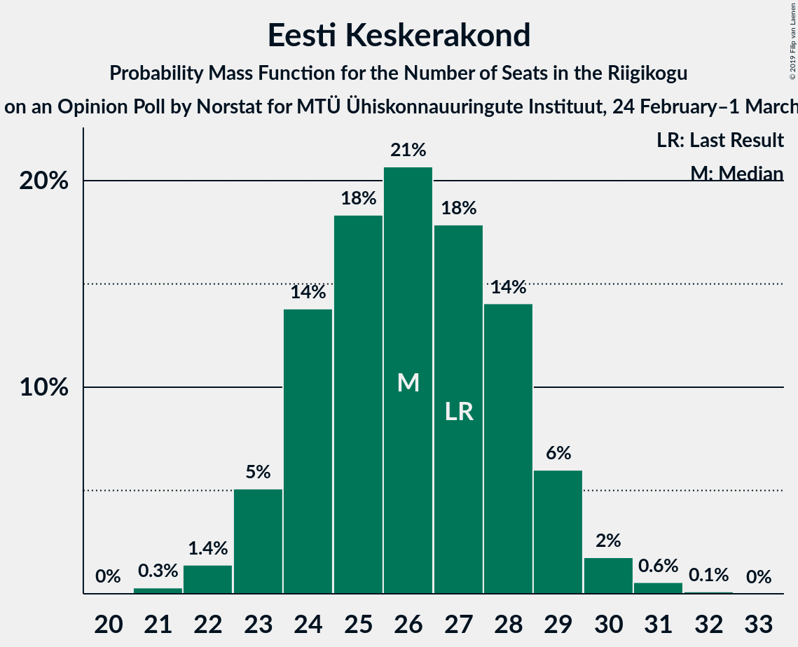
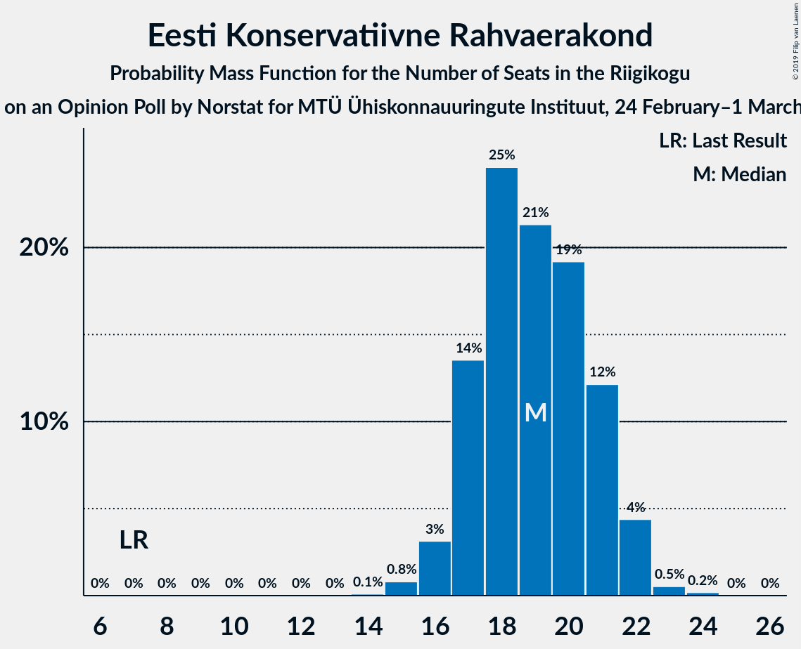
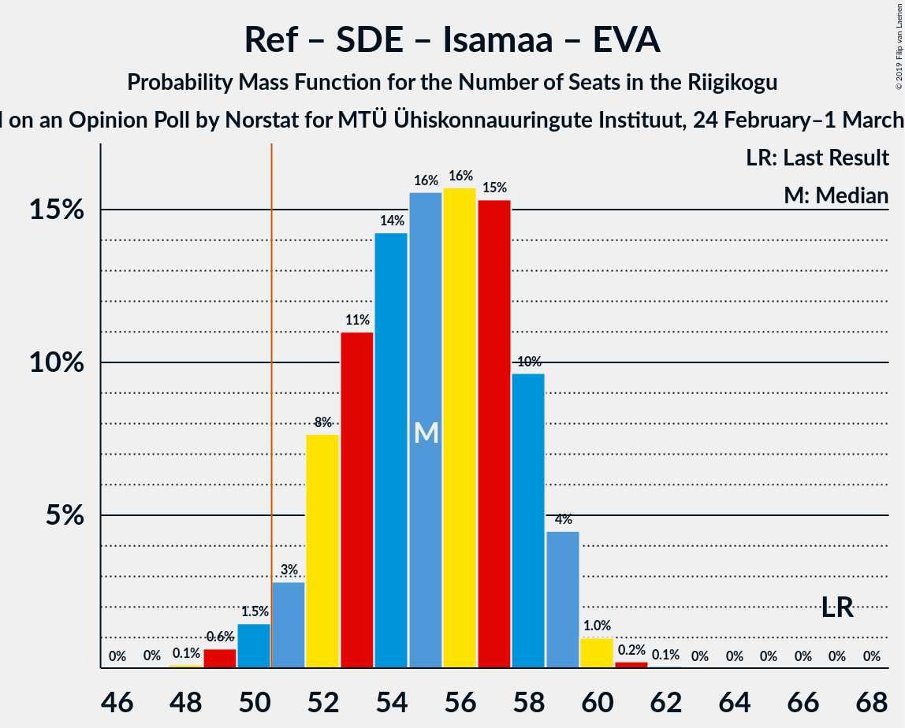
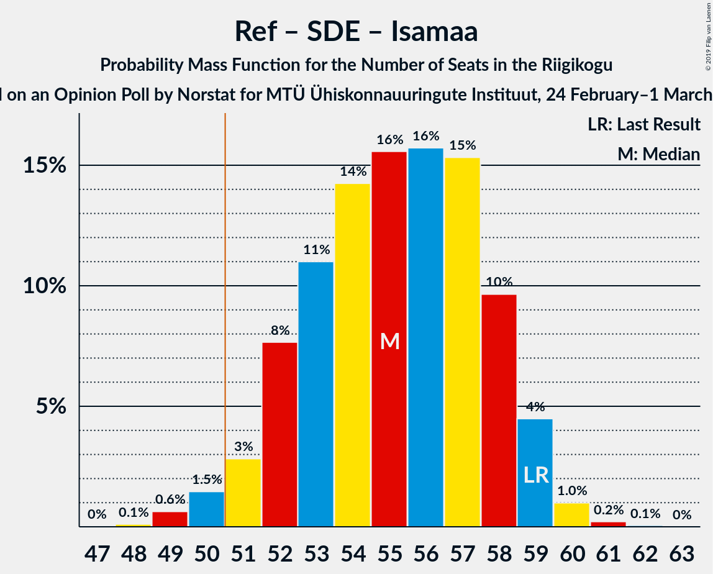

# Opinion Poll by Norstat for MTÜ Ühiskonnauuringute Instituut, 24 February–1 March 2019

<a href="#voting-intentions">Voting Intentions</a> | <a href="#seats">Seats</a> | <a href="#coalitions">Coalitions</a> | <a href="#technical-information">Technical Information</a>

## Voting Intentions

### Confidence Intervals

| Party | Last Result | Poll Result | 80% Confidence Interval | 90% Confidence Interval | 95% Confidence Interval | 99% Confidence Interval |
|:-----:|:-----------:|:-----------:|:-----------------------:|:-----------------------:|:-----------------------:|:-----------------------:|
| Eesti Reformierakond | 27.7% | 26.4% | 24.7–28.2% |24.2–28.8% |23.8–29.2% |23.0–30.1% |
| Eesti Keskerakond | 24.8% | 23.5% | 21.8–25.3% |21.4–25.8% |21.0–26.2% |20.2–27.1% |
| Eesti Konservatiivne Rahvaerakond | 8.1% | 17.7% | 16.2–19.3% |15.8–19.8% |15.5–20.2% |14.8–21.0% |
| Sotsiaaldemokraatlik Erakond | 15.2% | 12.5% | 11.2–13.9% |10.9–14.3% |10.6–14.7% |10.0–15.4% |
| Erakond Isamaa | 13.7% | 12.3% | 11.1–13.7% |10.7–14.1% |10.4–14.5% |9.8–15.2% |
| Eesti 200 | 0.0% | 4.4% | 3.7–5.3% |3.5–5.6% |3.3–5.9% |3.0–6.4% |
| Erakond Eestimaa Rohelised | 0.9% | 1.6% | 1.2–2.2% |1.1–2.4% |1.0–2.6% |0.8–2.9% |
| Eesti Vabaerakond | 8.7% | 0.7% | 0.5–1.2% |0.4–1.3% |0.3–1.4% |0.2–1.7% |

*Note:* The poll result column reflects the actual value used in the calculations. Published results may vary slightly, and in addition be rounded to fewer digits.

## Seats

### Confidence Intervals

| Party | Last Result | Median | 80% Confidence Interval | 90% Confidence Interval | 95% Confidence Interval | 99% Confidence Interval |
|:-----:|:-----------:|:------:|:-----------------------:|:-----------------------:|:-----------------------:|:-----------------------:|
| <a href="#eesti-reformierakond">Eesti Reformierakond</a> | 30 | 31 | 27–32 |27–32 |26–33 |25–35 |
| <a href="#eesti-keskerakond">Eesti Keskerakond</a> | 27 | 26 | 24–28 |23–29 |23–29 |22–31 |
| <a href="#eesti-konservatiivne-rahvaerakond">Eesti Konservatiivne Rahvaerakond</a> | 7 | 19 | 17–21 |17–22 |16–22 |15–23 |
| <a href="#sotsiaaldemokraatlik-erakond">Sotsiaaldemokraatlik Erakond</a> | 15 | 13 | 11–14 |11–15 |10–15 |10–16 |
| <a href="#erakond-isamaa">Erakond Isamaa</a> | 14 | 12 | 11–14 |10–15 |10–15 |10–16 |
| <a href="#eesti-200">Eesti 200</a> | 0 | 0 | 0–4 |0–5 |0–5 |0–5 |
| <a href="#erakond-eestimaa-rohelised">Erakond Eestimaa Rohelised</a> | 0 | 0 | 0 |0 |0 |0 |
| <a href="#eesti-vabaerakond">Eesti Vabaerakond</a> | 8 | 0 | 0 |0 |0 |0 |

### Eesti Reformierakond

*For a full overview of the results for this party, see the [Eesti Reformierakond](party-eestireformierakond.html) page.*

| Number of Seats | Probability | Accumulated | Special Marks |
|:---------------:|:-----------:|:-----------:|:-------------:|
| 25 | 0.6% | 100% |  |
| 26 | 4% | 99.4% |  |
| 27 | 13% | 95% |  |
| 28 | 10% | 82% |  |
| 29 | 3% | 71% |  |
| 30 | 13% | 68% | Last Result |
| 31 | 34% | 56% | Median |
| 32 | 18% | 22% |  |
| 33 | 3% | 4% |  |
| 34 | 0.1% | 0.7% |  |
| 35 | 0.3% | 0.5% |  |
| 36 | 0.2% | 0.2% |  |
| 37 | 0% | 0% |  |

### Eesti Keskerakond

*For a full overview of the results for this party, see the [Eesti Keskerakond](party-eestikeskerakond.html) page.*

| Number of Seats | Probability | Accumulated | Special Marks |
|:---------------:|:-----------:|:-----------:|:-------------:|
| 21 | 0.3% | 100% |  |
| 22 | 1.4% | 99.7% |  |
| 23 | 5% | 98% |  |
| 24 | 14% | 93% |  |
| 25 | 18% | 79% |  |
| 26 | 21% | 61% | Median |
| 27 | 18% | 40% | Last Result |
| 28 | 14% | 22% |  |
| 29 | 6% | 8% |  |
| 30 | 2% | 2% |  |
| 31 | 0.6% | 0.7% |  |
| 32 | 0.1% | 0.1% |  |
| 33 | 0% | 0% |  |

### Eesti Konservatiivne Rahvaerakond

*For a full overview of the results for this party, see the [Eesti Konservatiivne Rahvaerakond](party-eestikonservatiivnerahvaerakond.html) page.*

| Number of Seats | Probability | Accumulated | Special Marks |
|:---------------:|:-----------:|:-----------:|:-------------:|
| 7 | 0% | 100% | Last Result |
| 8 | 0% | 100% |  |
| 9 | 0% | 100% |  |
| 10 | 0% | 100% |  |
| 11 | 0% | 100% |  |
| 12 | 0% | 100% |  |
| 13 | 0% | 100% |  |
| 14 | 0.1% | 100% |  |
| 15 | 0.8% | 99.9% |  |
| 16 | 3% | 99.1% |  |
| 17 | 14% | 96% |  |
| 18 | 25% | 82% |  |
| 19 | 21% | 58% | Median |
| 20 | 19% | 36% |  |
| 21 | 12% | 17% |  |
| 22 | 4% | 5% |  |
| 23 | 0.5% | 0.7% |  |
| 24 | 0.2% | 0.2% |  |
| 25 | 0% | 0% |  |

### Sotsiaaldemokraatlik Erakond

*For a full overview of the results for this party, see the [Sotsiaaldemokraatlik Erakond](party-sotsiaaldemokraatlikerakond.html) page.*

| Number of Seats | Probability | Accumulated | Special Marks |
|:---------------:|:-----------:|:-----------:|:-------------:|
| 9 | 0.3% | 100% |  |
| 10 | 4% | 99.7% |  |
| 11 | 11% | 96% |  |
| 12 | 29% | 84% |  |
| 13 | 28% | 55% | Median |
| 14 | 19% | 28% |  |
| 15 | 7% | 9% | Last Result |
| 16 | 2% | 2% |  |
| 17 | 0.4% | 0.4% |  |
| 18 | 0% | 0% |  |

### Erakond Isamaa

*For a full overview of the results for this party, see the [Erakond Isamaa](party-erakondisamaa.html) page.*

| Number of Seats | Probability | Accumulated | Special Marks |
|:---------------:|:-----------:|:-----------:|:-------------:|
| 9 | 0.4% | 100% |  |
| 10 | 5% | 99.5% |  |
| 11 | 21% | 95% |  |
| 12 | 27% | 74% | Median |
| 13 | 25% | 48% |  |
| 14 | 17% | 23% | Last Result |
| 15 | 5% | 6% |  |
| 16 | 0.9% | 1.1% |  |
| 17 | 0.1% | 0.1% |  |
| 18 | 0% | 0% |  |

### Eesti 200

*For a full overview of the results for this party, see the [Eesti 200](party-eesti200.html) page.*

| Number of Seats | Probability | Accumulated | Special Marks |
|:---------------:|:-----------:|:-----------:|:-------------:|
| 0 | 82% | 100% | Last Result, Median |
| 1 | 0% | 18% |  |
| 2 | 0% | 18% |  |
| 3 | 0% | 18% |  |
| 4 | 9% | 18% |  |
| 5 | 9% | 9% |  |
| 6 | 0.4% | 0.5% |  |
| 7 | 0% | 0% |  |

### Erakond Eestimaa Rohelised

*For a full overview of the results for this party, see the [Erakond Eestimaa Rohelised](party-erakondeestimaarohelised.html) page.*

| Number of Seats | Probability | Accumulated | Special Marks |
|:---------------:|:-----------:|:-----------:|:-------------:|
| 0 | 100% | 100% | Last Result, Median |

### Eesti Vabaerakond

*For a full overview of the results for this party, see the [Eesti Vabaerakond](party-eestivabaerakond.html) page.*

| Number of Seats | Probability | Accumulated | Special Marks |
|:---------------:|:-----------:|:-----------:|:-------------:|
| 0 | 100% | 100% | Median |
| 1 | 0% | 0% |  |
| 2 | 0% | 0% |  |
| 3 | 0% | 0% |  |
| 4 | 0% | 0% |  |
| 5 | 0% | 0% |  |
| 6 | 0% | 0% |  |
| 7 | 0% | 0% |  |
| 8 | 0% | 0% | Last Result |

## Coalitions

### Confidence Intervals

| Coalition | Last Result | Median | Majority? | 80% Confidence Interval | 90% Confidence Interval | 95% Confidence Interval | 99% Confidence Interval |
|:---------:|:-----------:|:------:|:---------:|:-----------------------:|:-----------------------:|:-----------------------:|:-----------------------:|
| Eesti Reformierakond – Eesti Keskerakond – Eesti Konservatiivne Rahvaerakond | 64 | 75 | 100% | 72–78 | 71–78 | 70–79 | 69–79 |
| Eesti Reformierakond – Eesti Konservatiivne Rahvaerakond – Erakond Isamaa | 51 | 61 | 100% | 59–65 | 57–65 | 57–65 | 55–66 |
| Eesti Reformierakond – Eesti Keskerakond | 57 | 56 | 99.4% | 53–59 | 52–59 | 52–60 | 50–61 |
| Eesti Reformierakond – Sotsiaaldemokraatlik Erakond – Erakond Isamaa – Eesti Vabaerakond | 67 | 55 | 98% | 52–58 | 51–59 | 51–59 | 49–60 |
| Eesti Reformierakond – Sotsiaaldemokraatlik Erakond – Erakond Isamaa | 59 | 55 | 98% | 52–58 | 51–59 | 51–59 | 49–60 |
| Eesti Keskerakond – Sotsiaaldemokraatlik Erakond – Erakond Isamaa | 56 | 51 | 58% | 48–55 | 48–55 | 47–56 | 46–57 |
| Eesti Reformierakond – Eesti Konservatiivne Rahvaerakond | 37 | 49 | 30% | 46–51 | 45–52 | 44–53 | 43–54 |
| Eesti Keskerakond – Eesti Konservatiivne Rahvaerakond | 34 | 45 | 0.3% | 42–48 | 42–49 | 41–49 | 40–50 |
| Eesti Reformierakond – Erakond Isamaa | 44 | 42 | 0% | 40–45 | 39–46 | 38–46 | 37–47 |
| Eesti Reformierakond – Sotsiaaldemokraatlik Erakond | 45 | 43 | 0% | 40–45 | 39–46 | 38–46 | 37–48 |
| Eesti Keskerakond – Sotsiaaldemokraatlik Erakond | 42 | 39 | 0% | 36–42 | 36–42 | 35–43 | 34–44 |
| Eesti Konservatiivne Rahvaerakond – Sotsiaaldemokraatlik Erakond | 22 | 32 | 0% | 29–34 | 29–35 | 28–35 | 27–36 |

### Eesti Reformierakond – Eesti Keskerakond – Eesti Konservatiivne Rahvaerakond

| Number of Seats | Probability | Accumulated | Special Marks |
|:---------------:|:-----------:|:-----------:|:-------------:|
| 64 | 0% | 100% | Last Result |
| 65 | 0% | 100% |  |
| 66 | 0% | 100% |  |
| 67 | 0% | 100% |  |
| 68 | 0.2% | 99.9% |  |
| 69 | 0.6% | 99.7% |  |
| 70 | 2% | 99.1% |  |
| 71 | 4% | 97% |  |
| 72 | 6% | 93% |  |
| 73 | 9% | 86% |  |
| 74 | 14% | 77% |  |
| 75 | 20% | 63% |  |
| 76 | 16% | 42% | Median |
| 77 | 13% | 26% |  |
| 78 | 10% | 13% |  |
| 79 | 2% | 3% |  |
| 80 | 0.4% | 0.4% |  |
| 81 | 0% | 0% |  |

### Eesti Reformierakond – Eesti Konservatiivne Rahvaerakond – Erakond Isamaa

| Number of Seats | Probability | Accumulated | Special Marks |
|:---------------:|:-----------:|:-----------:|:-------------:|
| 51 | 0% | 100% | Last Result, Majority |
| 52 | 0% | 100% |  |
| 53 | 0% | 100% |  |
| 54 | 0.1% | 100% |  |
| 55 | 0.7% | 99.8% |  |
| 56 | 1.3% | 99.1% |  |
| 57 | 3% | 98% |  |
| 58 | 5% | 95% |  |
| 59 | 11% | 90% |  |
| 60 | 12% | 79% |  |
| 61 | 19% | 67% |  |
| 62 | 19% | 48% | Median |
| 63 | 10% | 30% |  |
| 64 | 9% | 19% |  |
| 65 | 8% | 11% |  |
| 66 | 2% | 2% |  |
| 67 | 0.3% | 0.4% |  |
| 68 | 0.1% | 0.1% |  |
| 69 | 0% | 0% |  |

### Eesti Reformierakond – Eesti Keskerakond

| Number of Seats | Probability | Accumulated | Special Marks |
|:---------------:|:-----------:|:-----------:|:-------------:|
| 49 | 0.2% | 100% |  |
| 50 | 0.4% | 99.8% |  |
| 51 | 1.3% | 99.4% | Majority |
| 52 | 4% | 98% |  |
| 53 | 6% | 94% |  |
| 54 | 11% | 87% |  |
| 55 | 16% | 77% |  |
| 56 | 18% | 61% |  |
| 57 | 17% | 43% | Last Result, Median |
| 58 | 13% | 26% |  |
| 59 | 8% | 13% |  |
| 60 | 3% | 5% |  |
| 61 | 0.9% | 1.1% |  |
| 62 | 0.2% | 0.3% |  |
| 63 | 0% | 0% |  |

### Eesti Reformierakond – Sotsiaaldemokraatlik Erakond – Erakond Isamaa – Eesti Vabaerakond

| Number of Seats | Probability | Accumulated | Special Marks |
|:---------------:|:-----------:|:-----------:|:-------------:|
| 48 | 0.1% | 100% |  |
| 49 | 0.6% | 99.9% |  |
| 50 | 1.5% | 99.2% |  |
| 51 | 3% | 98% | Majority |
| 52 | 8% | 95% |  |
| 53 | 11% | 87% |  |
| 54 | 14% | 76% |  |
| 55 | 16% | 62% |  |
| 56 | 16% | 46% | Median |
| 57 | 15% | 31% |  |
| 58 | 10% | 15% |  |
| 59 | 4% | 6% |  |
| 60 | 1.0% | 1.3% |  |
| 61 | 0.2% | 0.3% |  |
| 62 | 0.1% | 0.1% |  |
| 63 | 0% | 0% |  |
| 64 | 0% | 0% |  |
| 65 | 0% | 0% |  |
| 66 | 0% | 0% |  |
| 67 | 0% | 0% | Last Result |

### Eesti Reformierakond – Sotsiaaldemokraatlik Erakond – Erakond Isamaa

| Number of Seats | Probability | Accumulated | Special Marks |
|:---------------:|:-----------:|:-----------:|:-------------:|
| 48 | 0.1% | 100% |  |
| 49 | 0.6% | 99.9% |  |
| 50 | 1.5% | 99.2% |  |
| 51 | 3% | 98% | Majority |
| 52 | 8% | 95% |  |
| 53 | 11% | 87% |  |
| 54 | 14% | 76% |  |
| 55 | 16% | 62% |  |
| 56 | 16% | 46% | Median |
| 57 | 15% | 31% |  |
| 58 | 10% | 15% |  |
| 59 | 4% | 6% | Last Result |
| 60 | 1.0% | 1.3% |  |
| 61 | 0.2% | 0.3% |  |
| 62 | 0.1% | 0.1% |  |
| 63 | 0% | 0% |  |

### Eesti Keskerakond – Sotsiaaldemokraatlik Erakond – Erakond Isamaa

| Number of Seats | Probability | Accumulated | Special Marks |
|:---------------:|:-----------:|:-----------:|:-------------:|
| 45 | 0.2% | 100% |  |
| 46 | 0.8% | 99.7% |  |
| 47 | 2% | 98.9% |  |
| 48 | 7% | 97% |  |
| 49 | 8% | 89% |  |
| 50 | 23% | 81% |  |
| 51 | 15% | 58% | Median, Majority |
| 52 | 16% | 43% |  |
| 53 | 10% | 27% |  |
| 54 | 6% | 17% |  |
| 55 | 7% | 11% |  |
| 56 | 3% | 4% | Last Result |
| 57 | 0.6% | 0.7% |  |
| 58 | 0% | 0.1% |  |
| 59 | 0% | 0% |  |

### Eesti Reformierakond – Eesti Konservatiivne Rahvaerakond

| Number of Seats | Probability | Accumulated | Special Marks |
|:---------------:|:-----------:|:-----------:|:-------------:|
| 37 | 0% | 100% | Last Result |
| 38 | 0% | 100% |  |
| 39 | 0% | 100% |  |
| 40 | 0% | 100% |  |
| 41 | 0% | 100% |  |
| 42 | 0.1% | 100% |  |
| 43 | 0.8% | 99.8% |  |
| 44 | 2% | 99.0% |  |
| 45 | 5% | 97% |  |
| 46 | 9% | 91% |  |
| 47 | 8% | 83% |  |
| 48 | 13% | 75% |  |
| 49 | 17% | 61% |  |
| 50 | 14% | 45% | Median |
| 51 | 21% | 30% | Majority |
| 52 | 6% | 9% |  |
| 53 | 2% | 3% |  |
| 54 | 0.4% | 0.6% |  |
| 55 | 0.2% | 0.2% |  |
| 56 | 0% | 0% |  |

### Eesti Keskerakond – Eesti Konservatiivne Rahvaerakond

| Number of Seats | Probability | Accumulated | Special Marks |
|:---------------:|:-----------:|:-----------:|:-------------:|
| 34 | 0% | 100% | Last Result |
| 35 | 0% | 100% |  |
| 36 | 0% | 100% |  |
| 37 | 0% | 100% |  |
| 38 | 0.1% | 100% |  |
| 39 | 0.3% | 99.9% |  |
| 40 | 1.4% | 99.6% |  |
| 41 | 2% | 98% |  |
| 42 | 7% | 96% |  |
| 43 | 13% | 89% |  |
| 44 | 18% | 76% |  |
| 45 | 18% | 58% | Median |
| 46 | 15% | 40% |  |
| 47 | 12% | 25% |  |
| 48 | 8% | 13% |  |
| 49 | 4% | 5% |  |
| 50 | 1.2% | 1.5% |  |
| 51 | 0.2% | 0.3% | Majority |
| 52 | 0.1% | 0.1% |  |
| 53 | 0% | 0% |  |

### Eesti Reformierakond – Erakond Isamaa

| Number of Seats | Probability | Accumulated | Special Marks |
|:---------------:|:-----------:|:-----------:|:-------------:|
| 36 | 0.3% | 100% |  |
| 37 | 0.9% | 99.6% |  |
| 38 | 2% | 98.7% |  |
| 39 | 5% | 96% |  |
| 40 | 9% | 91% |  |
| 41 | 16% | 83% |  |
| 42 | 20% | 67% |  |
| 43 | 15% | 47% | Median |
| 44 | 14% | 32% | Last Result |
| 45 | 10% | 18% |  |
| 46 | 6% | 8% |  |
| 47 | 2% | 2% |  |
| 48 | 0.2% | 0.3% |  |
| 49 | 0.1% | 0.1% |  |
| 50 | 0% | 0% |  |

### Eesti Reformierakond – Sotsiaaldemokraatlik Erakond

| Number of Seats | Probability | Accumulated | Special Marks |
|:---------------:|:-----------:|:-----------:|:-------------:|
| 36 | 0.2% | 100% |  |
| 37 | 0.8% | 99.8% |  |
| 38 | 2% | 99.0% |  |
| 39 | 5% | 97% |  |
| 40 | 8% | 92% |  |
| 41 | 12% | 84% |  |
| 42 | 14% | 72% |  |
| 43 | 20% | 57% |  |
| 44 | 15% | 38% | Median |
| 45 | 15% | 23% | Last Result |
| 46 | 5% | 8% |  |
| 47 | 2% | 2% |  |
| 48 | 0.5% | 0.6% |  |
| 49 | 0.1% | 0.1% |  |
| 50 | 0% | 0% |  |

### Eesti Keskerakond – Sotsiaaldemokraatlik Erakond

| Number of Seats | Probability | Accumulated | Special Marks |
|:---------------:|:-----------:|:-----------:|:-------------:|
| 33 | 0.3% | 100% |  |
| 34 | 0.9% | 99.7% |  |
| 35 | 3% | 98.8% |  |
| 36 | 13% | 96% |  |
| 37 | 13% | 83% |  |
| 38 | 13% | 70% |  |
| 39 | 20% | 58% | Median |
| 40 | 18% | 38% |  |
| 41 | 8% | 20% |  |
| 42 | 8% | 12% | Last Result |
| 43 | 3% | 4% |  |
| 44 | 0.7% | 1.0% |  |
| 45 | 0.2% | 0.3% |  |
| 46 | 0% | 0% |  |

### Eesti Konservatiivne Rahvaerakond – Sotsiaaldemokraatlik Erakond

| Number of Seats | Probability | Accumulated | Special Marks |
|:---------------:|:-----------:|:-----------:|:-------------:|
| 22 | 0% | 100% | Last Result |
| 23 | 0% | 100% |  |
| 24 | 0% | 100% |  |
| 25 | 0% | 100% |  |
| 26 | 0.1% | 100% |  |
| 27 | 1.0% | 99.8% |  |
| 28 | 2% | 98.9% |  |
| 29 | 9% | 97% |  |
| 30 | 16% | 88% |  |
| 31 | 17% | 72% |  |
| 32 | 22% | 55% | Median |
| 33 | 17% | 33% |  |
| 34 | 11% | 16% |  |
| 35 | 3% | 5% |  |
| 36 | 2% | 2% |  |
| 37 | 0.3% | 0.4% |  |
| 38 | 0.1% | 0.1% |  |
| 39 | 0% | 0% |  |

## Technical Information

### Opinion Poll

+ **Polling firm:** Norstat
+ **Commissioner(s):** MTÜ Ühiskonnauuringute Instituut
+ **Fieldwork period:** 24 February–1 March 2019

### Calculations

+ **Sample size:** 1000
+ **Simulations done:** 1,048,576
+ **Error estimate:** 2.80%

