# Opinion Poll by Kantar Emor for BNS and Postimees, 12–13 March 2019

<a href="#voting-intentions">Voting Intentions</a> | <a href="#seats">Seats</a> | <a href="#coalitions">Coalitions</a> | <a href="#technical-information">Technical Information</a>

## Voting Intentions

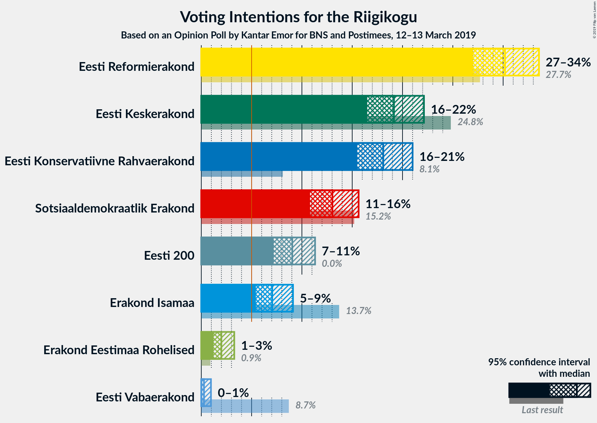

### Confidence Intervals

| Party | Last Result | Poll Result | 80% Confidence Interval | 90% Confidence Interval | 95% Confidence Interval | 99% Confidence Interval |
|:-----:|:-----------:|:-----------:|:-----------------------:|:-----------------------:|:-----------------------:|:-----------------------:|
| Eesti Reformierakond | 27.7% | 30.2% | 28.1–32.4% |27.5–33.0% |27.0–33.6% |26.0–34.6% |
| Eesti Keskerakond | 24.8% | 19.1% | 17.4–21.1% |16.9–21.6% |16.5–22.1% |15.7–23.1% |
| Eesti Konservatiivne Rahvaerakond | 8.1% | 18.1% | 16.4–20.0% |15.9–20.5% |15.5–21.0% |14.7–21.9% |
| Sotsiaaldemokraatlik Erakond | 15.2% | 13.0% | 11.6–14.7% |11.2–15.2% |10.8–15.6% |10.2–16.5% |
| Eesti 200 | 0.0% | 9.0% | 7.8–10.5% |7.5–10.9% |7.2–11.3% |6.6–12.1% |
| Erakond Isamaa | 13.7% | 7.0% | 6.0–8.4% |5.7–8.8% |5.4–9.1% |5.0–9.8% |
| Erakond Eestimaa Rohelised | 0.9% | 2.0% | 1.5–2.8% |1.3–3.1% |1.2–3.3% |1.0–3.7% |
| Eesti Vabaerakond | 8.7% | 0.3% | 0.1–0.7% |0.1–0.8% |0.1–1.0% |0.0–1.2% |

*Note:* The poll result column reflects the actual value used in the calculations. Published results may vary slightly, and in addition be rounded to fewer digits.

## Seats

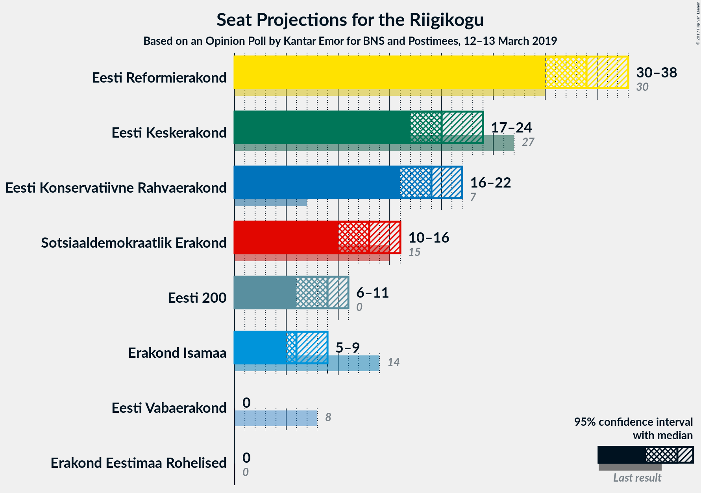

### Confidence Intervals

| Party | Last Result | Median | 80% Confidence Interval | 90% Confidence Interval | 95% Confidence Interval | 99% Confidence Interval |
|:-----:|:-----------:|:------:|:-----------------------:|:-----------------------:|:-----------------------:|:-----------------------:|
| <a href="#eesti-reformierakond">Eesti Reformierakond</a> | 30 | 34 | 31–36 |30–37 |30–38 |29–39 |
| <a href="#eesti-keskerakond">Eesti Keskerakond</a> | 27 | 20 | 18–22 |17–23 |17–24 |16–25 |
| <a href="#eesti-konservatiivne-rahvaerakond">Eesti Konservatiivne Rahvaerakond</a> | 7 | 19 | 17–21 |16–22 |16–22 |15–23 |
| <a href="#sotsiaaldemokraatlik-erakond">Sotsiaaldemokraatlik Erakond</a> | 15 | 13 | 11–15 |11–16 |10–16 |10–17 |
| <a href="#eesti-200">Eesti 200</a> | 0 | 9 | 7–10 |7–11 |6–11 |6–12 |
| <a href="#erakond-isamaa">Erakond Isamaa</a> | 14 | 6 | 5–8 |5–8 |5–9 |0–9 |
| <a href="#erakond-eestimaa-rohelised">Erakond Eestimaa Rohelised</a> | 0 | 0 | 0 |0 |0 |0 |
| <a href="#eesti-vabaerakond">Eesti Vabaerakond</a> | 8 | 0 | 0 |0 |0 |0 |

### Eesti Reformierakond

*For a full overview of the results for this party, see the [Eesti Reformierakond](party-eestireformierakond.html) page.*

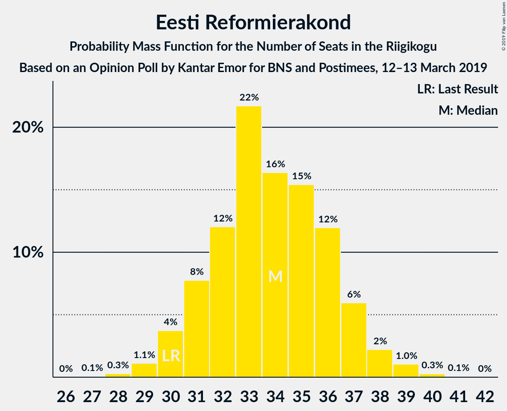

| Number of Seats | Probability | Accumulated | Special Marks |
|:---------------:|:-----------:|:-----------:|:-------------:|
| 27 | 0.1% | 100% |  |
| 28 | 0.3% | 99.9% |  |
| 29 | 1.1% | 99.6% |  |
| 30 | 4% | 98.5% | Last Result |
| 31 | 8% | 95% |  |
| 32 | 12% | 87% |  |
| 33 | 22% | 75% |  |
| 34 | 16% | 53% | Median |
| 35 | 15% | 37% |  |
| 36 | 12% | 22% |  |
| 37 | 6% | 10% |  |
| 38 | 2% | 4% |  |
| 39 | 1.0% | 1.4% |  |
| 40 | 0.3% | 0.3% |  |
| 41 | 0.1% | 0.1% |  |
| 42 | 0% | 0% |  |

### Eesti Keskerakond

*For a full overview of the results for this party, see the [Eesti Keskerakond](party-eestikeskerakond.html) page.*

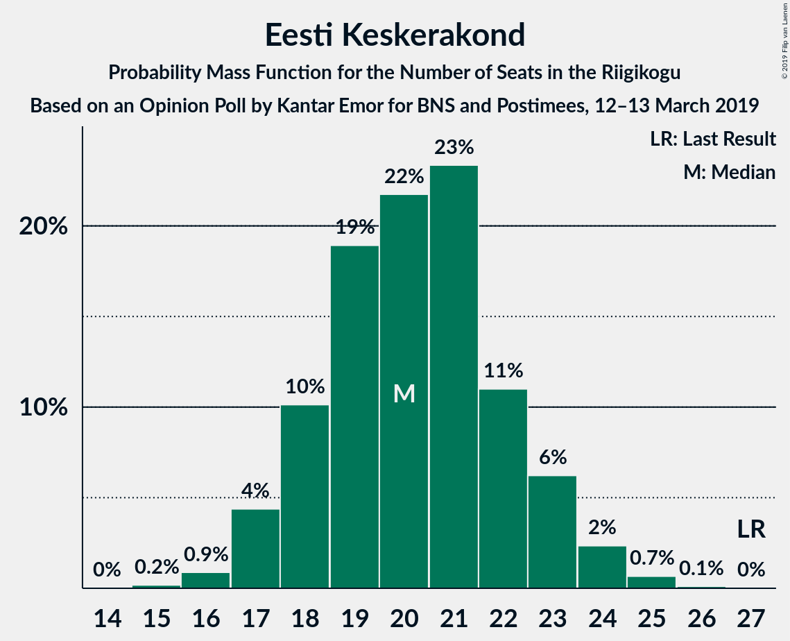

| Number of Seats | Probability | Accumulated | Special Marks |
|:---------------:|:-----------:|:-----------:|:-------------:|
| 15 | 0.2% | 100% |  |
| 16 | 0.9% | 99.8% |  |
| 17 | 4% | 98.9% |  |
| 18 | 10% | 95% |  |
| 19 | 19% | 84% |  |
| 20 | 22% | 65% | Median |
| 21 | 23% | 44% |  |
| 22 | 11% | 20% |  |
| 23 | 6% | 9% |  |
| 24 | 2% | 3% |  |
| 25 | 0.7% | 0.8% |  |
| 26 | 0.1% | 0.1% |  |
| 27 | 0% | 0% | Last Result |

### Eesti Konservatiivne Rahvaerakond

*For a full overview of the results for this party, see the [Eesti Konservatiivne Rahvaerakond](party-eestikonservatiivnerahvaerakond.html) page.*

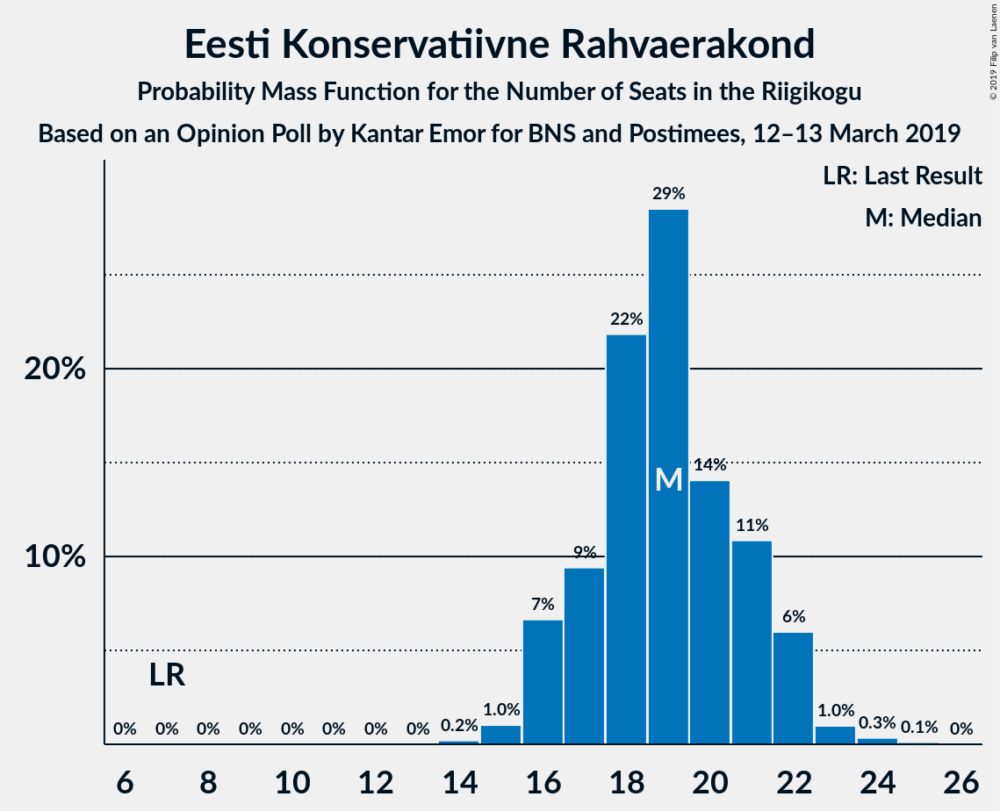

| Number of Seats | Probability | Accumulated | Special Marks |
|:---------------:|:-----------:|:-----------:|:-------------:|
| 7 | 0% | 100% | Last Result |
| 8 | 0% | 100% |  |
| 9 | 0% | 100% |  |
| 10 | 0% | 100% |  |
| 11 | 0% | 100% |  |
| 12 | 0% | 100% |  |
| 13 | 0% | 100% |  |
| 14 | 0.2% | 100% |  |
| 15 | 1.0% | 99.8% |  |
| 16 | 7% | 98.8% |  |
| 17 | 9% | 92% |  |
| 18 | 22% | 83% |  |
| 19 | 29% | 61% | Median |
| 20 | 14% | 32% |  |
| 21 | 11% | 18% |  |
| 22 | 6% | 7% |  |
| 23 | 1.0% | 1.4% |  |
| 24 | 0.3% | 0.5% |  |
| 25 | 0.1% | 0.1% |  |
| 26 | 0% | 0% |  |

### Sotsiaaldemokraatlik Erakond

*For a full overview of the results for this party, see the [Sotsiaaldemokraatlik Erakond](party-sotsiaaldemokraatlikerakond.html) page.*

| Number of Seats | Probability | Accumulated | Special Marks |
|:---------------:|:-----------:|:-----------:|:-------------:|
| 9 | 0.3% | 100% |  |
| 10 | 2% | 99.7% |  |
| 11 | 10% | 97% |  |
| 12 | 24% | 88% |  |
| 13 | 28% | 64% | Median |
| 14 | 19% | 36% |  |
| 15 | 11% | 16% | Last Result |
| 16 | 5% | 6% |  |
| 17 | 0.8% | 1.0% |  |
| 18 | 0.1% | 0.2% |  |
| 19 | 0% | 0% |  |

### Eesti 200

*For a full overview of the results for this party, see the [Eesti 200](party-eesti200.html) page.*

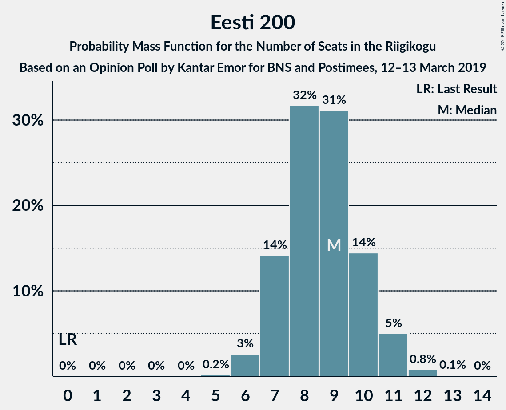

| Number of Seats | Probability | Accumulated | Special Marks |
|:---------------:|:-----------:|:-----------:|:-------------:|
| 0 | 0% | 100% | Last Result |
| 1 | 0% | 100% |  |
| 2 | 0% | 100% |  |
| 3 | 0% | 100% |  |
| 4 | 0% | 100% |  |
| 5 | 0.2% | 100% |  |
| 6 | 3% | 99.8% |  |
| 7 | 14% | 97% |  |
| 8 | 32% | 83% |  |
| 9 | 31% | 51% | Median |
| 10 | 14% | 20% |  |
| 11 | 5% | 6% |  |
| 12 | 0.8% | 0.9% |  |
| 13 | 0.1% | 0.1% |  |
| 14 | 0% | 0% |  |

### Erakond Isamaa

*For a full overview of the results for this party, see the [Erakond Isamaa](party-erakondisamaa.html) page.*

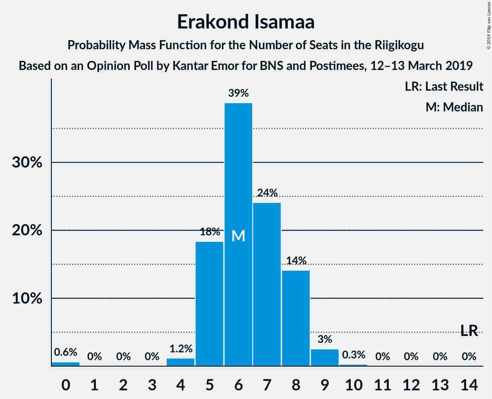

| Number of Seats | Probability | Accumulated | Special Marks |
|:---------------:|:-----------:|:-----------:|:-------------:|
| 0 | 0.6% | 100% |  |
| 1 | 0% | 99.4% |  |
| 2 | 0% | 99.4% |  |
| 3 | 0% | 99.4% |  |
| 4 | 1.2% | 99.4% |  |
| 5 | 18% | 98% |  |
| 6 | 39% | 80% | Median |
| 7 | 24% | 41% |  |
| 8 | 14% | 17% |  |
| 9 | 3% | 3% |  |
| 10 | 0.3% | 0.3% |  |
| 11 | 0% | 0% |  |
| 12 | 0% | 0% |  |
| 13 | 0% | 0% |  |
| 14 | 0% | 0% | Last Result |

### Erakond Eestimaa Rohelised

*For a full overview of the results for this party, see the [Erakond Eestimaa Rohelised](party-erakondeestimaarohelised.html) page.*

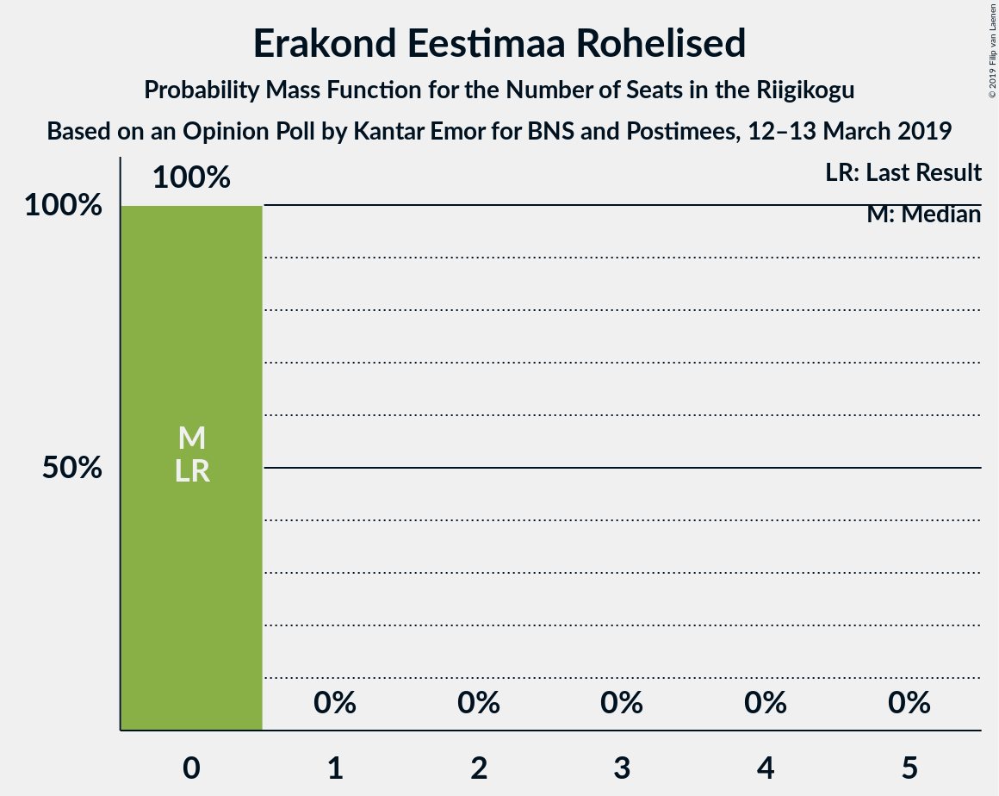

| Number of Seats | Probability | Accumulated | Special Marks |
|:---------------:|:-----------:|:-----------:|:-------------:|
| 0 | 100% | 100% | Last Result, Median |

### Eesti Vabaerakond

*For a full overview of the results for this party, see the [Eesti Vabaerakond](party-eestivabaerakond.html) page.*

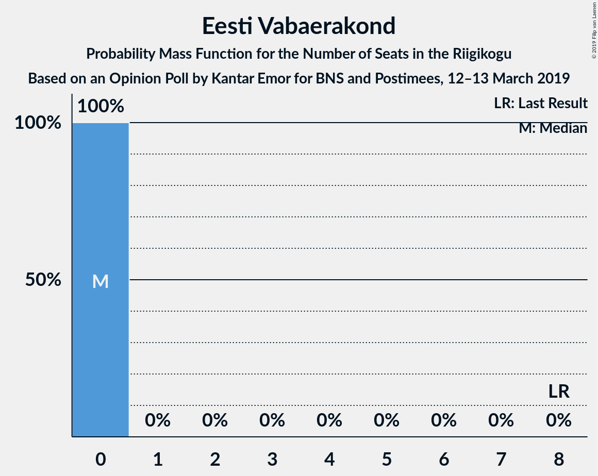

| Number of Seats | Probability | Accumulated | Special Marks |
|:---------------:|:-----------:|:-----------:|:-------------:|
| 0 | 100% | 100% | Median |
| 1 | 0% | 0% |  |
| 2 | 0% | 0% |  |
| 3 | 0% | 0% |  |
| 4 | 0% | 0% |  |
| 5 | 0% | 0% |  |
| 6 | 0% | 0% |  |
| 7 | 0% | 0% |  |
| 8 | 0% | 0% | Last Result |

## Coalitions

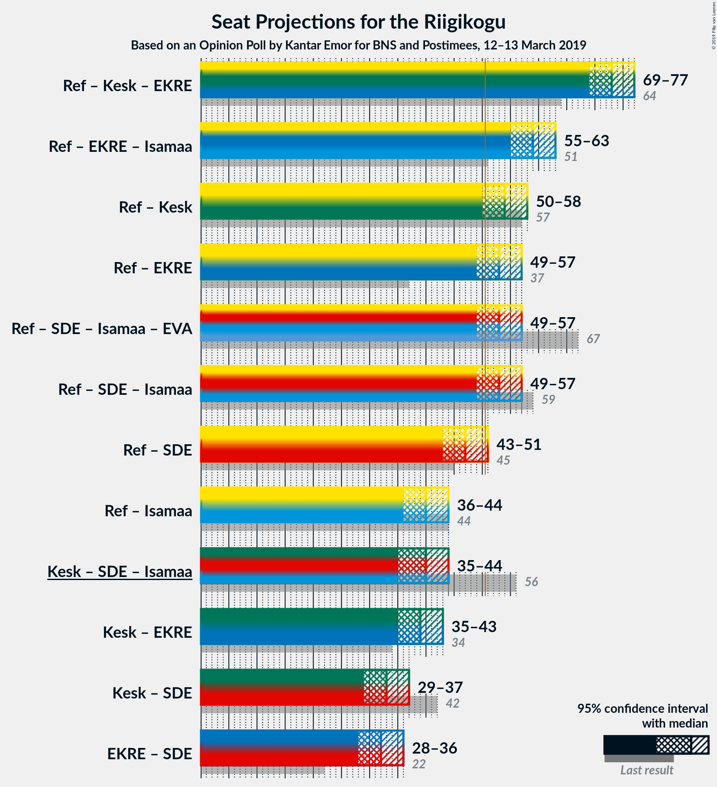

### Confidence Intervals

| Coalition | Last Result | Median | Majority? | 80% Confidence Interval | 90% Confidence Interval | 95% Confidence Interval | 99% Confidence Interval |
|:---------:|:-----------:|:------:|:---------:|:-----------------------:|:-----------------------:|:-----------------------:|:-----------------------:|
| Eesti Reformierakond – Eesti Keskerakond – Eesti Konservatiivne Rahvaerakond | 64 | 73 | 100% | 70–75 | 70–76 | 69–77 | 68–78 |
| Eesti Reformierakond – Eesti Konservatiivne Rahvaerakond – Erakond Isamaa | 51 | 59 | 100% | 56–62 | 56–63 | 55–63 | 54–65 |
| Eesti Reformierakond – Eesti Keskerakond | 57 | 54 | 95% | 51–57 | 50–57 | 50–58 | 49–60 |
| Eesti Reformierakond – Eesti Konservatiivne Rahvaerakond | 37 | 53 | 85% | 50–56 | 49–56 | 49–57 | 47–58 |
| Eesti Reformierakond – Sotsiaaldemokraatlik Erakond – Erakond Isamaa – Eesti Vabaerakond | 67 | 53 | 89% | 50–56 | 50–57 | 49–57 | 48–59 |
| Eesti Reformierakond – Sotsiaaldemokraatlik Erakond – Erakond Isamaa | 59 | 53 | 89% | 50–56 | 50–57 | 49–57 | 48–59 |
| Eesti Reformierakond – Sotsiaaldemokraatlik Erakond | 45 | 47 | 5% | 44–50 | 43–50 | 43–51 | 41–52 |
| Eesti Reformierakond – Erakond Isamaa | 44 | 40 | 0% | 38–43 | 37–44 | 36–44 | 35–46 |
| Eesti Keskerakond – Sotsiaaldemokraatlik Erakond – Erakond Isamaa | 56 | 40 | 0% | 37–43 | 36–43 | 35–44 | 34–45 |
| Eesti Keskerakond – Eesti Konservatiivne Rahvaerakond | 34 | 39 | 0% | 36–42 | 36–42 | 35–43 | 34–45 |
| Eesti Keskerakond – Sotsiaaldemokraatlik Erakond | 42 | 33 | 0% | 31–36 | 30–37 | 29–37 | 28–39 |
| Eesti Konservatiivne Rahvaerakond – Sotsiaaldemokraatlik Erakond | 22 | 32 | 0% | 29–34 | 29–35 | 28–36 | 27–37 |

### Eesti Reformierakond – Eesti Keskerakond – Eesti Konservatiivne Rahvaerakond

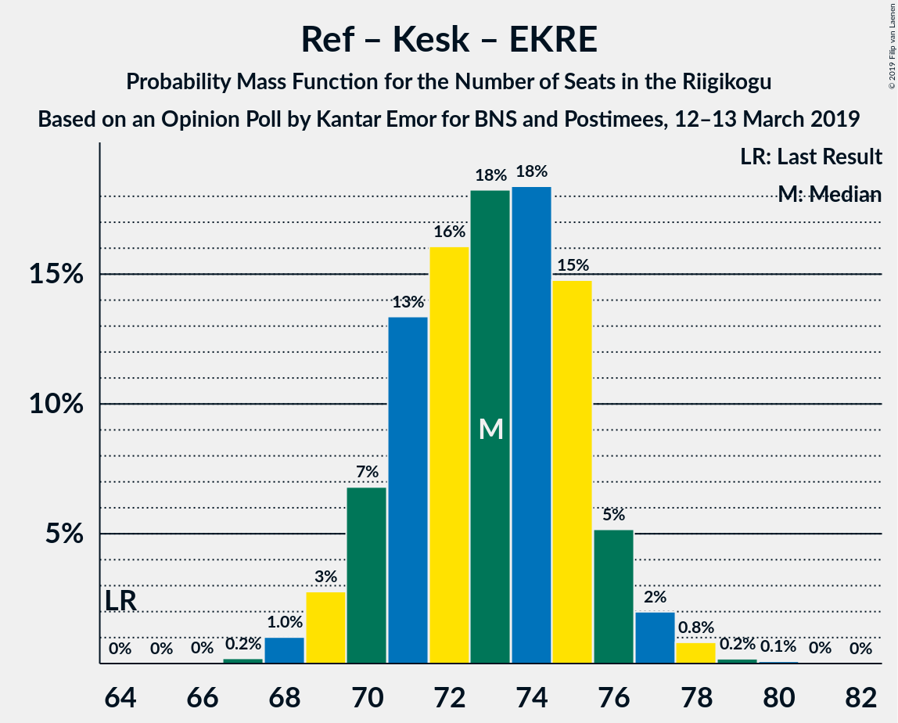

| Number of Seats | Probability | Accumulated | Special Marks |
|:---------------:|:-----------:|:-----------:|:-------------:|
| 64 | 0% | 100% | Last Result |
| 65 | 0% | 100% |  |
| 66 | 0% | 100% |  |
| 67 | 0.2% | 99.9% |  |
| 68 | 1.0% | 99.7% |  |
| 69 | 3% | 98.7% |  |
| 70 | 7% | 96% |  |
| 71 | 13% | 89% |  |
| 72 | 16% | 76% |  |
| 73 | 18% | 60% | Median |
| 74 | 18% | 41% |  |
| 75 | 15% | 23% |  |
| 76 | 5% | 8% |  |
| 77 | 2% | 3% |  |
| 78 | 0.8% | 1.1% |  |
| 79 | 0.2% | 0.3% |  |
| 80 | 0.1% | 0.1% |  |
| 81 | 0% | 0.1% |  |
| 82 | 0% | 0% |  |

### Eesti Reformierakond – Eesti Konservatiivne Rahvaerakond – Erakond Isamaa

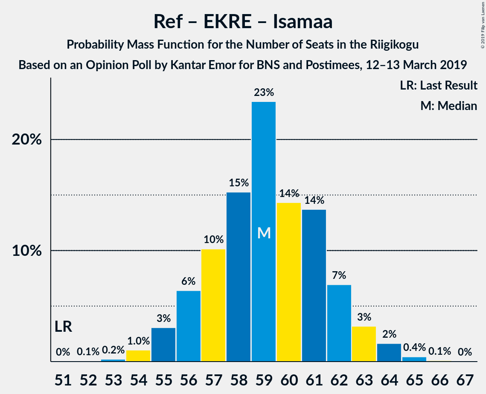

| Number of Seats | Probability | Accumulated | Special Marks |
|:---------------:|:-----------:|:-----------:|:-------------:|
| 51 | 0% | 100% | Last Result, Majority |
| 52 | 0.1% | 100% |  |
| 53 | 0.2% | 99.9% |  |
| 54 | 1.0% | 99.7% |  |
| 55 | 3% | 98.6% |  |
| 56 | 6% | 96% |  |
| 57 | 10% | 89% |  |
| 58 | 15% | 79% |  |
| 59 | 23% | 64% | Median |
| 60 | 14% | 40% |  |
| 61 | 14% | 26% |  |
| 62 | 7% | 12% |  |
| 63 | 3% | 5% |  |
| 64 | 2% | 2% |  |
| 65 | 0.4% | 0.5% |  |
| 66 | 0.1% | 0.1% |  |
| 67 | 0% | 0% |  |

### Eesti Reformierakond – Eesti Keskerakond

| Number of Seats | Probability | Accumulated | Special Marks |
|:---------------:|:-----------:|:-----------:|:-------------:|
| 47 | 0.1% | 100% |  |
| 48 | 0.4% | 99.9% |  |
| 49 | 1.1% | 99.5% |  |
| 50 | 4% | 98% |  |
| 51 | 8% | 95% | Majority |
| 52 | 11% | 87% |  |
| 53 | 20% | 76% |  |
| 54 | 14% | 56% | Median |
| 55 | 17% | 43% |  |
| 56 | 12% | 26% |  |
| 57 | 9% | 14% | Last Result |
| 58 | 3% | 5% |  |
| 59 | 2% | 2% |  |
| 60 | 0.5% | 0.6% |  |
| 61 | 0.1% | 0.2% |  |
| 62 | 0.1% | 0.1% |  |
| 63 | 0% | 0% |  |

### Eesti Reformierakond – Eesti Konservatiivne Rahvaerakond

| Number of Seats | Probability | Accumulated | Special Marks |
|:---------------:|:-----------:|:-----------:|:-------------:|
| 37 | 0% | 100% | Last Result |
| 38 | 0% | 100% |  |
| 39 | 0% | 100% |  |
| 40 | 0% | 100% |  |
| 41 | 0% | 100% |  |
| 42 | 0% | 100% |  |
| 43 | 0% | 100% |  |
| 44 | 0% | 100% |  |
| 45 | 0% | 100% |  |
| 46 | 0.2% | 100% |  |
| 47 | 0.6% | 99.8% |  |
| 48 | 2% | 99.2% |  |
| 49 | 4% | 98% |  |
| 50 | 8% | 94% |  |
| 51 | 12% | 85% | Majority |
| 52 | 22% | 73% |  |
| 53 | 14% | 51% | Median |
| 54 | 13% | 37% |  |
| 55 | 14% | 24% |  |
| 56 | 6% | 10% |  |
| 57 | 3% | 4% |  |
| 58 | 0.9% | 1.3% |  |
| 59 | 0.3% | 0.4% |  |
| 60 | 0.1% | 0.1% |  |
| 61 | 0% | 0% |  |

### Eesti Reformierakond – Sotsiaaldemokraatlik Erakond – Erakond Isamaa – Eesti Vabaerakond

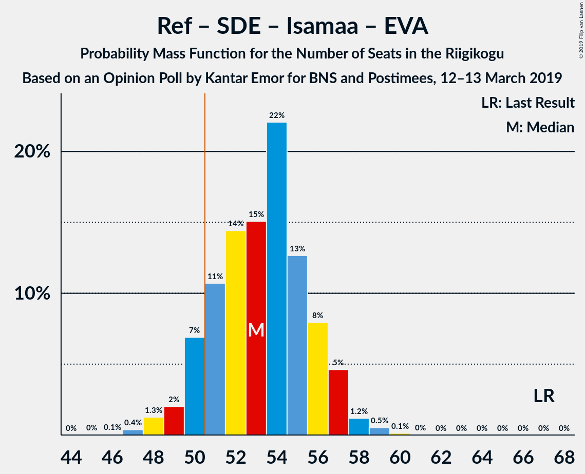

| Number of Seats | Probability | Accumulated | Special Marks |
|:---------------:|:-----------:|:-----------:|:-------------:|
| 46 | 0.1% | 100% |  |
| 47 | 0.4% | 99.9% |  |
| 48 | 1.3% | 99.5% |  |
| 49 | 2% | 98% |  |
| 50 | 7% | 96% |  |
| 51 | 11% | 89% | Majority |
| 52 | 14% | 79% |  |
| 53 | 15% | 64% | Median |
| 54 | 22% | 49% |  |
| 55 | 13% | 27% |  |
| 56 | 8% | 14% |  |
| 57 | 5% | 6% |  |
| 58 | 1.2% | 2% |  |
| 59 | 0.5% | 0.7% |  |
| 60 | 0.1% | 0.2% |  |
| 61 | 0% | 0% |  |
| 62 | 0% | 0% |  |
| 63 | 0% | 0% |  |
| 64 | 0% | 0% |  |
| 65 | 0% | 0% |  |
| 66 | 0% | 0% |  |
| 67 | 0% | 0% | Last Result |

### Eesti Reformierakond – Sotsiaaldemokraatlik Erakond – Erakond Isamaa

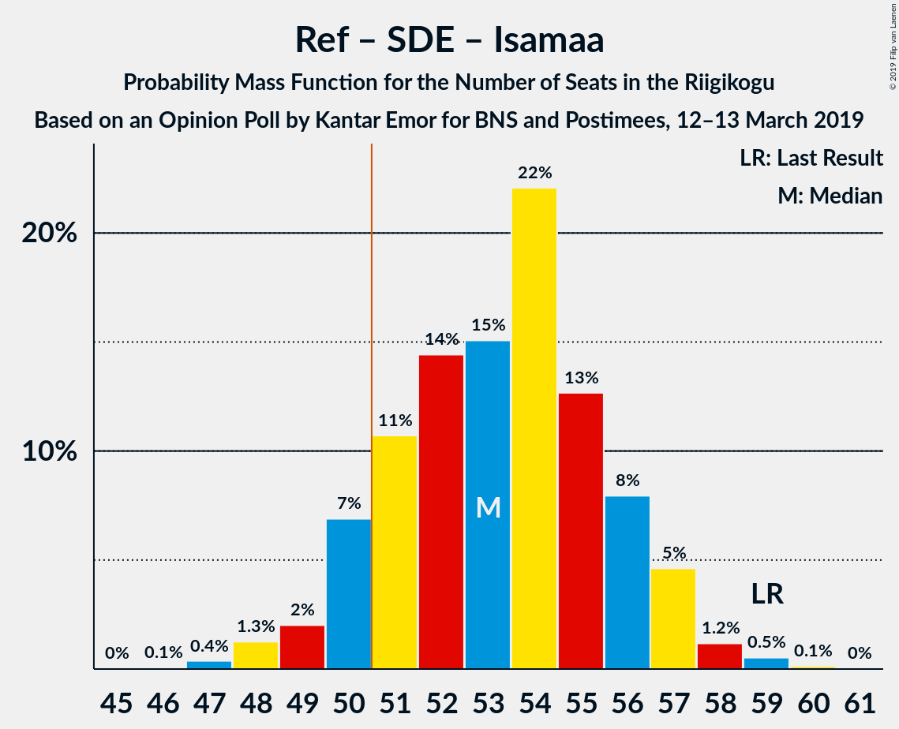

| Number of Seats | Probability | Accumulated | Special Marks |
|:---------------:|:-----------:|:-----------:|:-------------:|
| 46 | 0.1% | 100% |  |
| 47 | 0.4% | 99.9% |  |
| 48 | 1.3% | 99.5% |  |
| 49 | 2% | 98% |  |
| 50 | 7% | 96% |  |
| 51 | 11% | 89% | Majority |
| 52 | 14% | 79% |  |
| 53 | 15% | 64% | Median |
| 54 | 22% | 49% |  |
| 55 | 13% | 27% |  |
| 56 | 8% | 14% |  |
| 57 | 5% | 6% |  |
| 58 | 1.2% | 2% |  |
| 59 | 0.5% | 0.7% | Last Result |
| 60 | 0.1% | 0.2% |  |
| 61 | 0% | 0% |  |

### Eesti Reformierakond – Sotsiaaldemokraatlik Erakond

| Number of Seats | Probability | Accumulated | Special Marks |
|:---------------:|:-----------:|:-----------:|:-------------:|
| 40 | 0.1% | 100% |  |
| 41 | 0.5% | 99.9% |  |
| 42 | 2% | 99.3% |  |
| 43 | 3% | 98% |  |
| 44 | 7% | 94% |  |
| 45 | 13% | 87% | Last Result |
| 46 | 18% | 74% |  |
| 47 | 15% | 56% | Median |
| 48 | 21% | 41% |  |
| 49 | 9% | 21% |  |
| 50 | 7% | 12% |  |
| 51 | 3% | 5% | Majority |
| 52 | 0.9% | 1.3% |  |
| 53 | 0.3% | 0.5% |  |
| 54 | 0.1% | 0.2% |  |
| 55 | 0% | 0% |  |

### Eesti Reformierakond – Erakond Isamaa

| Number of Seats | Probability | Accumulated | Special Marks |
|:---------------:|:-----------:|:-----------:|:-------------:|
| 33 | 0.1% | 100% |  |
| 34 | 0.3% | 99.9% |  |
| 35 | 1.0% | 99.5% |  |
| 36 | 2% | 98.6% |  |
| 37 | 6% | 96% |  |
| 38 | 12% | 90% |  |
| 39 | 17% | 78% |  |
| 40 | 17% | 62% | Median |
| 41 | 18% | 45% |  |
| 42 | 16% | 28% |  |
| 43 | 6% | 12% |  |
| 44 | 4% | 6% | Last Result |
| 45 | 2% | 2% |  |
| 46 | 0.4% | 0.5% |  |
| 47 | 0.1% | 0.2% |  |
| 48 | 0% | 0% |  |

### Eesti Keskerakond – Sotsiaaldemokraatlik Erakond – Erakond Isamaa

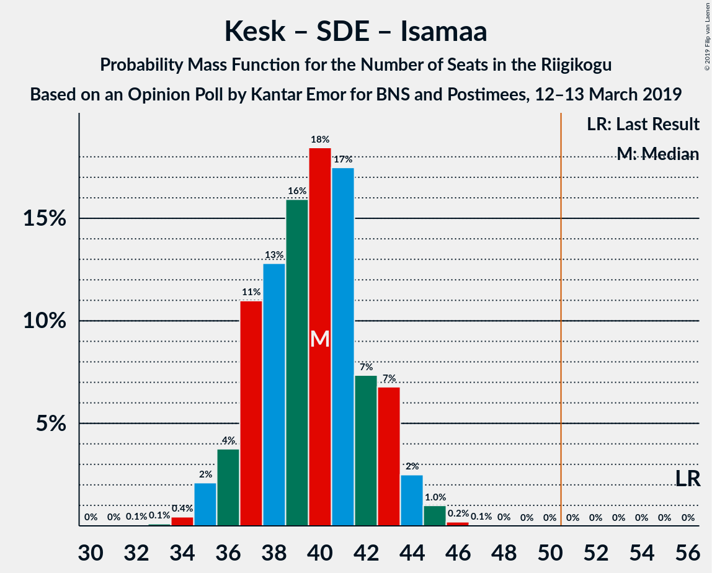

| Number of Seats | Probability | Accumulated | Special Marks |
|:---------------:|:-----------:|:-----------:|:-------------:|
| 32 | 0.1% | 100% |  |
| 33 | 0.1% | 99.9% |  |
| 34 | 0.4% | 99.8% |  |
| 35 | 2% | 99.4% |  |
| 36 | 4% | 97% |  |
| 37 | 11% | 94% |  |
| 38 | 13% | 83% |  |
| 39 | 16% | 70% | Median |
| 40 | 18% | 54% |  |
| 41 | 17% | 35% |  |
| 42 | 7% | 18% |  |
| 43 | 7% | 11% |  |
| 44 | 2% | 4% |  |
| 45 | 1.0% | 1.3% |  |
| 46 | 0.2% | 0.3% |  |
| 47 | 0.1% | 0.1% |  |
| 48 | 0% | 0% |  |
| 49 | 0% | 0% |  |
| 50 | 0% | 0% |  |
| 51 | 0% | 0% | Majority |
| 52 | 0% | 0% |  |
| 53 | 0% | 0% |  |
| 54 | 0% | 0% |  |
| 55 | 0% | 0% |  |
| 56 | 0% | 0% | Last Result |

### Eesti Keskerakond – Eesti Konservatiivne Rahvaerakond

| Number of Seats | Probability | Accumulated | Special Marks |
|:---------------:|:-----------:|:-----------:|:-------------:|
| 32 | 0.1% | 100% |  |
| 33 | 0.2% | 99.9% |  |
| 34 | 0.6% | 99.7% | Last Result |
| 35 | 4% | 99.2% |  |
| 36 | 6% | 95% |  |
| 37 | 7% | 90% |  |
| 38 | 20% | 82% |  |
| 39 | 26% | 63% | Median |
| 40 | 9% | 36% |  |
| 41 | 11% | 27% |  |
| 42 | 12% | 16% |  |
| 43 | 2% | 4% |  |
| 44 | 1.3% | 2% |  |
| 45 | 0.5% | 0.7% |  |
| 46 | 0.2% | 0.2% |  |
| 47 | 0% | 0% |  |

### Eesti Keskerakond – Sotsiaaldemokraatlik Erakond

| Number of Seats | Probability | Accumulated | Special Marks |
|:---------------:|:-----------:|:-----------:|:-------------:|
| 27 | 0.1% | 100% |  |
| 28 | 0.8% | 99.9% |  |
| 29 | 2% | 99.1% |  |
| 30 | 6% | 97% |  |
| 31 | 13% | 92% |  |
| 32 | 11% | 79% |  |
| 33 | 24% | 68% | Median |
| 34 | 16% | 44% |  |
| 35 | 16% | 28% |  |
| 36 | 6% | 12% |  |
| 37 | 5% | 7% |  |
| 38 | 1.3% | 2% |  |
| 39 | 0.5% | 0.6% |  |
| 40 | 0.1% | 0.1% |  |
| 41 | 0% | 0% |  |
| 42 | 0% | 0% | Last Result |

### Eesti Konservatiivne Rahvaerakond – Sotsiaaldemokraatlik Erakond

| Number of Seats | Probability | Accumulated | Special Marks |
|:---------------:|:-----------:|:-----------:|:-------------:|
| 22 | 0% | 100% | Last Result |
| 23 | 0% | 100% |  |
| 24 | 0% | 100% |  |
| 25 | 0% | 100% |  |
| 26 | 0.2% | 100% |  |
| 27 | 0.9% | 99.8% |  |
| 28 | 3% | 98.8% |  |
| 29 | 7% | 96% |  |
| 30 | 10% | 89% |  |
| 31 | 19% | 79% |  |
| 32 | 19% | 60% | Median |
| 33 | 20% | 41% |  |
| 34 | 12% | 21% |  |
| 35 | 5% | 10% |  |
| 36 | 3% | 5% |  |
| 37 | 1.1% | 1.5% |  |
| 38 | 0.3% | 0.4% |  |
| 39 | 0.1% | 0.1% |  |
| 40 | 0% | 0% |  |

## Technical Information

### Opinion Poll

+ **Polling firm:** Kantar Emor
+ **Commissioner(s):** BNS and Postimees
+ **Fieldwork period:** 12–13 March 2019

### Calculations

+ **Sample size:** 752
+ **Simulations done:** 1,048,576
+ **Error estimate:** 1.59%

