# Opinion Poll by Norstat for MTÜ Ühiskonnauuringute Instituut, 26 June–1 July 2019

<a href="#voting-intentions">Voting Intentions</a> | <a href="#seats">Seats</a> | <a href="#coalitions">Coalitions</a> | <a href="#technical-information">Technical Information</a>

## Voting Intentions

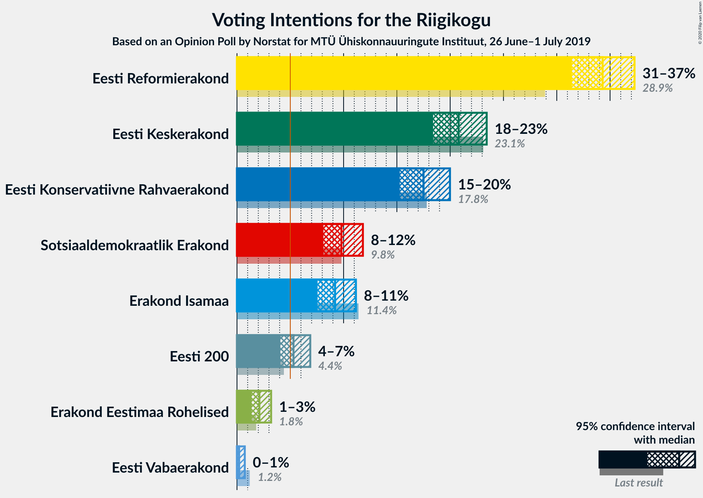

### Confidence Intervals

| Party | Last Result | Poll Result | 80% Confidence Interval | 90% Confidence Interval | 95% Confidence Interval | 99% Confidence Interval |
|:-----:|:-----------:|:-----------:|:-----------------------:|:-----------------------:|:-----------------------:|:-----------------------:|
| Eesti Reformierakond | 28.9% | 34.3% | 32.4–36.3% |31.9–36.8% |31.4–37.3% |30.5–38.3% |
| Eesti Keskerakond | 23.1% | 20.8% | 19.2–22.5% |18.8–23.0% |18.4–23.4% |17.7–24.3% |
| Eesti Konservatiivne Rahvaerakond | 17.8% | 17.5% | 16.0–19.1% |15.6–19.6% |15.3–20.0% |14.6–20.8% |
| Sotsiaaldemokraatlik Erakond | 9.8% | 9.8% | 8.7–11.1% |8.4–11.5% |8.1–11.8% |7.6–12.5% |
| Erakond Isamaa | 11.4% | 9.2% | 8.1–10.5% |7.8–10.8% |7.6–11.2% |7.1–11.8% |
| Eesti 200 | 4.4% | 5.3% | 4.5–6.3% |4.3–6.6% |4.1–6.9% |3.7–7.4% |
| Erakond Eestimaa Rohelised | 1.8% | 2.1% | 1.6–2.8% |1.5–3.0% |1.4–3.2% |1.2–3.6% |
| Eesti Vabaerakond | 1.2% | 0.2% | 0.1–0.5% |0.1–0.6% |0.1–0.7% |0.0–0.9% |

*Note:* The poll result column reflects the actual value used in the calculations. Published results may vary slightly, and in addition be rounded to fewer digits.

## Seats

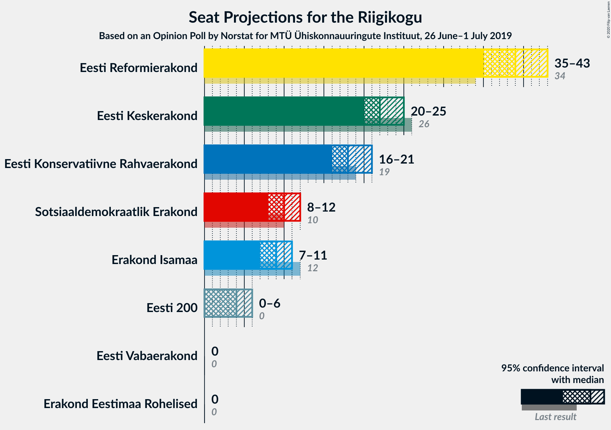

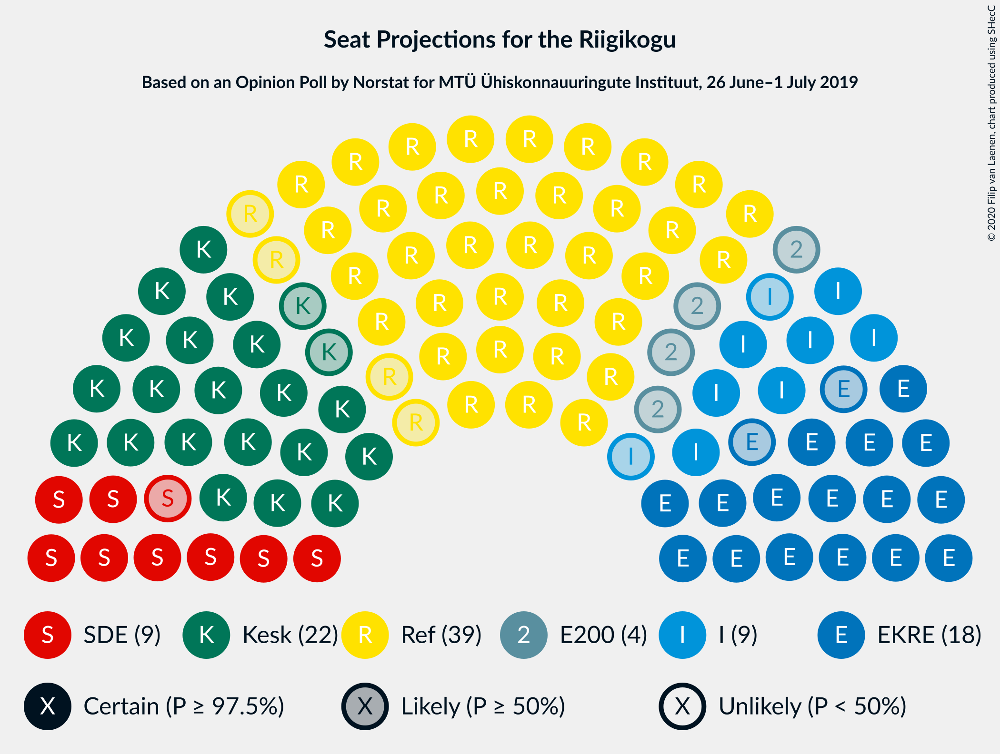

### Confidence Intervals

| Party | Last Result | Median | 80% Confidence Interval | 90% Confidence Interval | 95% Confidence Interval | 99% Confidence Interval |
|:-----:|:-----------:|:------:|:-----------------------:|:-----------------------:|:-----------------------:|:-----------------------:|
| <a href="#eesti-reformierakond">Eesti Reformierakond</a> | 34 | 39 | 37–40 |36–41 |35–43 |34–45 |
| <a href="#eesti-keskerakond">Eesti Keskerakond</a> | 26 | 22 | 20–24 |20–25 |20–25 |19–27 |
| <a href="#eesti-konservatiivne-rahvaerakond">Eesti Konservatiivne Rahvaerakond</a> | 19 | 18 | 17–20 |16–20 |16–21 |15–22 |
| <a href="#sotsiaaldemokraatlik-erakond">Sotsiaaldemokraatlik Erakond</a> | 10 | 10 | 9–11 |8–11 |8–12 |7–12 |
| <a href="#erakond-isamaa">Erakond Isamaa</a> | 12 | 9 | 7–10 |7–11 |7–11 |7–12 |
| <a href="#eesti-200">Eesti 200</a> | 0 | 4 | 0–5 |0–5 |0–6 |0–6 |
| <a href="#erakond-eestimaa-rohelised">Erakond Eestimaa Rohelised</a> | 0 | 0 | 0 |0 |0 |0 |
| <a href="#eesti-vabaerakond">Eesti Vabaerakond</a> | 0 | 0 | 0 |0 |0 |0 |

### Eesti Reformierakond

*For a full overview of the results for this party, see the [Eesti Reformierakond](party-eestireformierakond.html) page.*

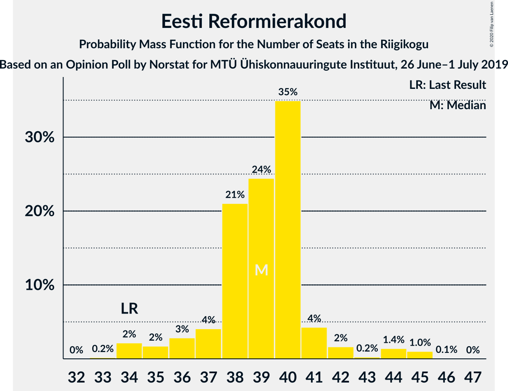

| Number of Seats | Probability | Accumulated | Special Marks |
|:---------------:|:-----------:|:-----------:|:-------------:|
| 33 | 0.2% | 100% |  |
| 34 | 2% | 99.8% | Last Result |
| 35 | 2% | 98% |  |
| 36 | 3% | 96% |  |
| 37 | 4% | 93% |  |
| 38 | 21% | 89% |  |
| 39 | 24% | 68% | Median |
| 40 | 35% | 44% |  |
| 41 | 4% | 9% |  |
| 42 | 2% | 4% |  |
| 43 | 0.2% | 3% |  |
| 44 | 1.4% | 2% |  |
| 45 | 1.0% | 1.1% |  |
| 46 | 0.1% | 0.1% |  |
| 47 | 0% | 0% |  |

### Eesti Keskerakond

*For a full overview of the results for this party, see the [Eesti Keskerakond](party-eestikeskerakond.html) page.*

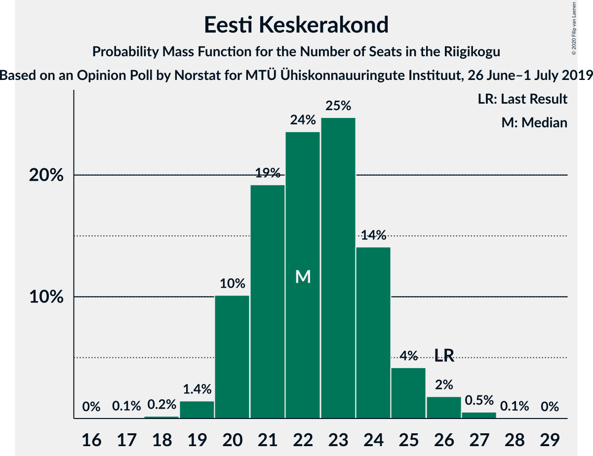

| Number of Seats | Probability | Accumulated | Special Marks |
|:---------------:|:-----------:|:-----------:|:-------------:|
| 17 | 0.1% | 100% |  |
| 18 | 0.2% | 99.9% |  |
| 19 | 1.4% | 99.7% |  |
| 20 | 10% | 98% |  |
| 21 | 19% | 88% |  |
| 22 | 24% | 69% | Median |
| 23 | 25% | 45% |  |
| 24 | 14% | 21% |  |
| 25 | 4% | 7% |  |
| 26 | 2% | 2% | Last Result |
| 27 | 0.5% | 0.6% |  |
| 28 | 0.1% | 0.1% |  |
| 29 | 0% | 0% |  |

### Eesti Konservatiivne Rahvaerakond

*For a full overview of the results for this party, see the [Eesti Konservatiivne Rahvaerakond](party-eestikonservatiivnerahvaerakond.html) page.*

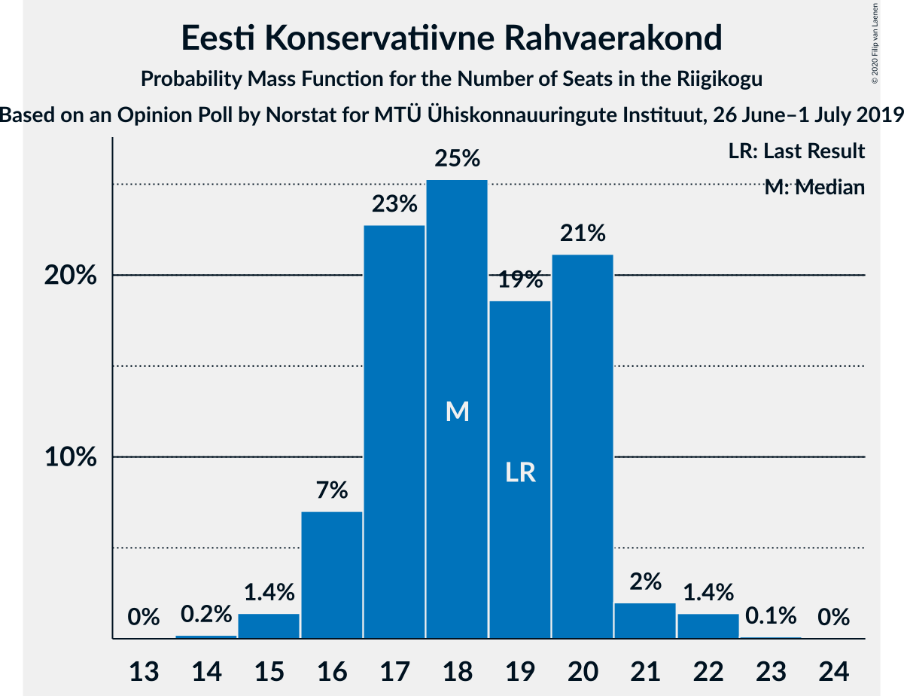

| Number of Seats | Probability | Accumulated | Special Marks |
|:---------------:|:-----------:|:-----------:|:-------------:|
| 14 | 0.2% | 100% |  |
| 15 | 1.4% | 99.8% |  |
| 16 | 7% | 98% |  |
| 17 | 23% | 91% |  |
| 18 | 25% | 69% | Median |
| 19 | 19% | 43% | Last Result |
| 20 | 21% | 25% |  |
| 21 | 2% | 4% |  |
| 22 | 1.4% | 2% |  |
| 23 | 0.1% | 0.1% |  |
| 24 | 0% | 0% |  |

### Sotsiaaldemokraatlik Erakond

*For a full overview of the results for this party, see the [Sotsiaaldemokraatlik Erakond](party-sotsiaaldemokraatlikerakond.html) page.*

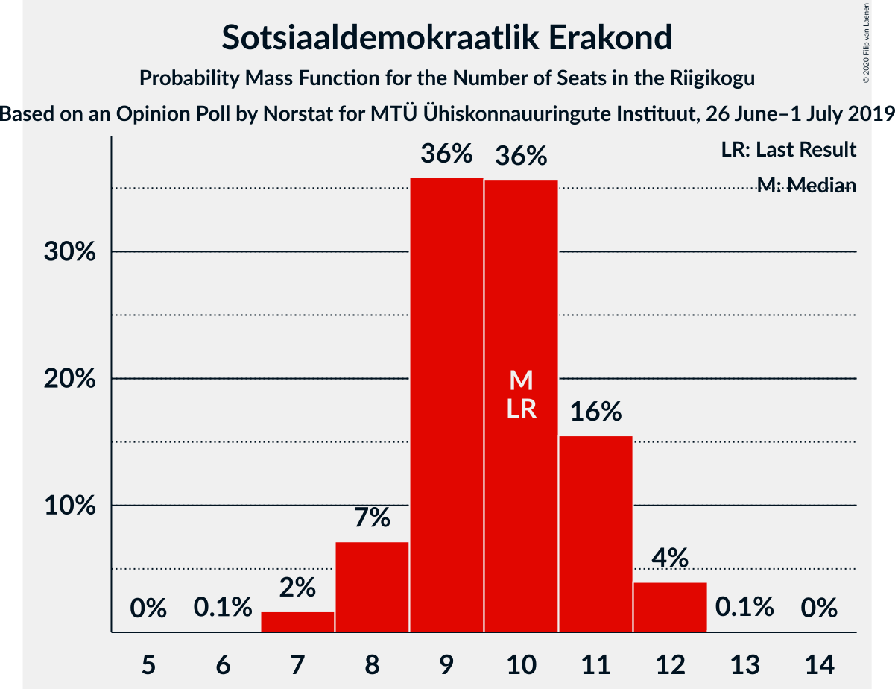

| Number of Seats | Probability | Accumulated | Special Marks |
|:---------------:|:-----------:|:-----------:|:-------------:|
| 6 | 0.1% | 100% |  |
| 7 | 2% | 99.9% |  |
| 8 | 7% | 98% |  |
| 9 | 36% | 91% |  |
| 10 | 36% | 55% | Last Result, Median |
| 11 | 16% | 20% |  |
| 12 | 4% | 4% |  |
| 13 | 0.1% | 0.1% |  |
| 14 | 0% | 0% |  |

### Erakond Isamaa

*For a full overview of the results for this party, see the [Erakond Isamaa](party-erakondisamaa.html) page.*

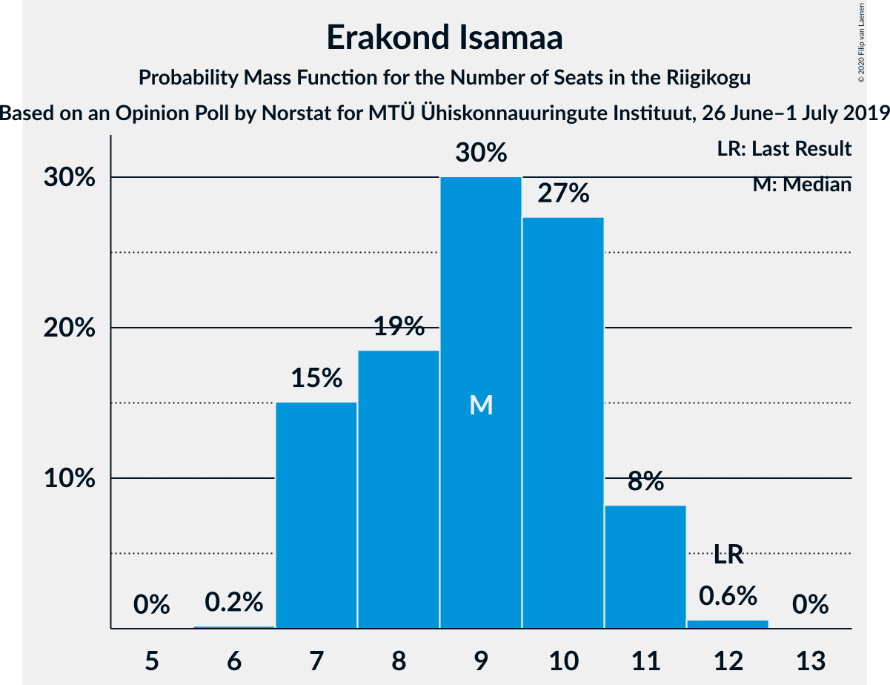

| Number of Seats | Probability | Accumulated | Special Marks |
|:---------------:|:-----------:|:-----------:|:-------------:|
| 6 | 0.2% | 100% |  |
| 7 | 15% | 99.8% |  |
| 8 | 19% | 85% |  |
| 9 | 30% | 66% | Median |
| 10 | 27% | 36% |  |
| 11 | 8% | 9% |  |
| 12 | 0.6% | 0.6% | Last Result |
| 13 | 0% | 0% |  |

### Eesti 200

*For a full overview of the results for this party, see the [Eesti 200](party-eesti200.html) page.*

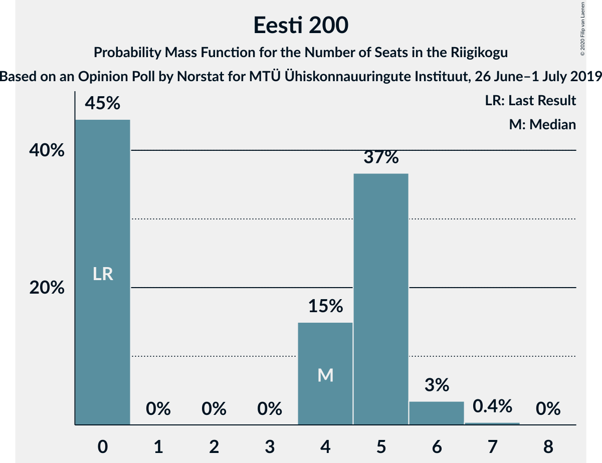

| Number of Seats | Probability | Accumulated | Special Marks |
|:---------------:|:-----------:|:-----------:|:-------------:|
| 0 | 45% | 100% | Last Result |
| 1 | 0% | 55% |  |
| 2 | 0% | 55% |  |
| 3 | 0% | 55% |  |
| 4 | 15% | 55% | Median |
| 5 | 37% | 41% |  |
| 6 | 3% | 4% |  |
| 7 | 0.4% | 0.4% |  |
| 8 | 0% | 0% |  |

### Erakond Eestimaa Rohelised

*For a full overview of the results for this party, see the [Erakond Eestimaa Rohelised](party-erakondeestimaarohelised.html) page.*

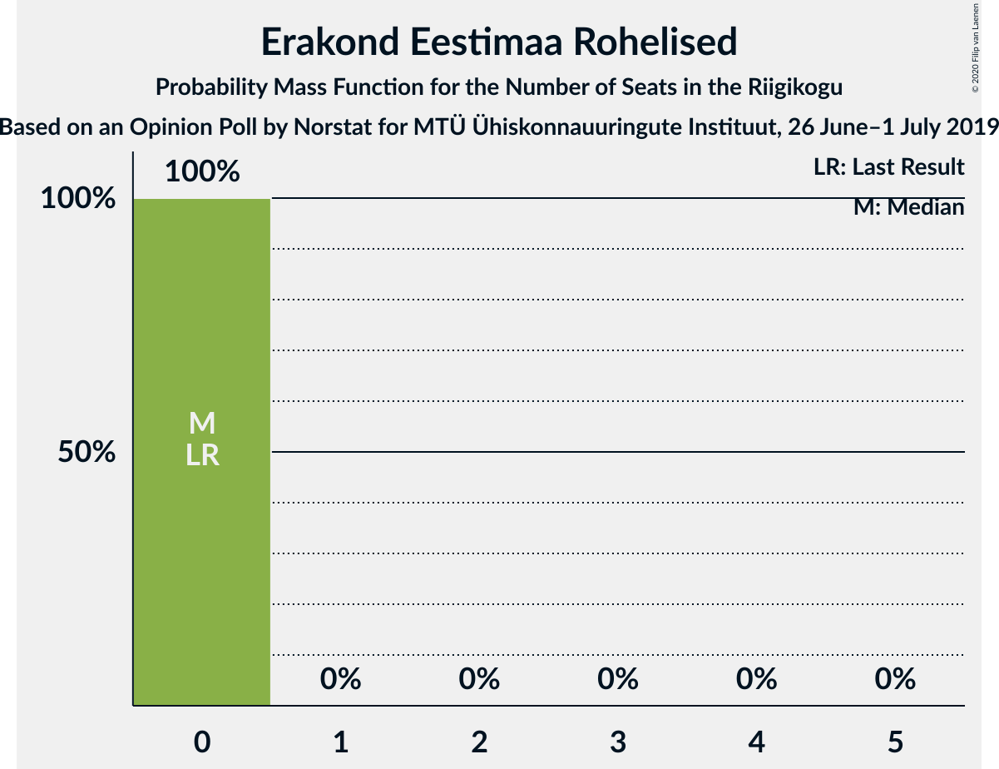

| Number of Seats | Probability | Accumulated | Special Marks |
|:---------------:|:-----------:|:-----------:|:-------------:|
| 0 | 100% | 100% | Last Result, Median |

### Eesti Vabaerakond

*For a full overview of the results for this party, see the [Eesti Vabaerakond](party-eestivabaerakond.html) page.*

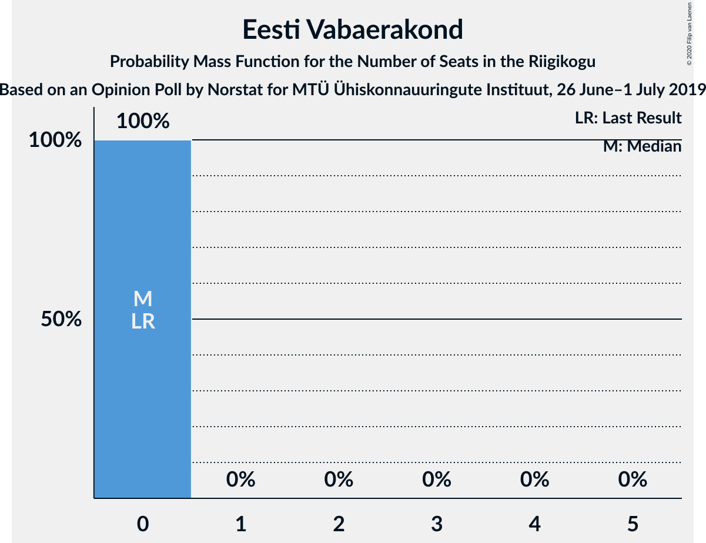

| Number of Seats | Probability | Accumulated | Special Marks |
|:---------------:|:-----------:|:-----------:|:-------------:|
| 0 | 100% | 100% | Last Result, Median |

## Coalitions

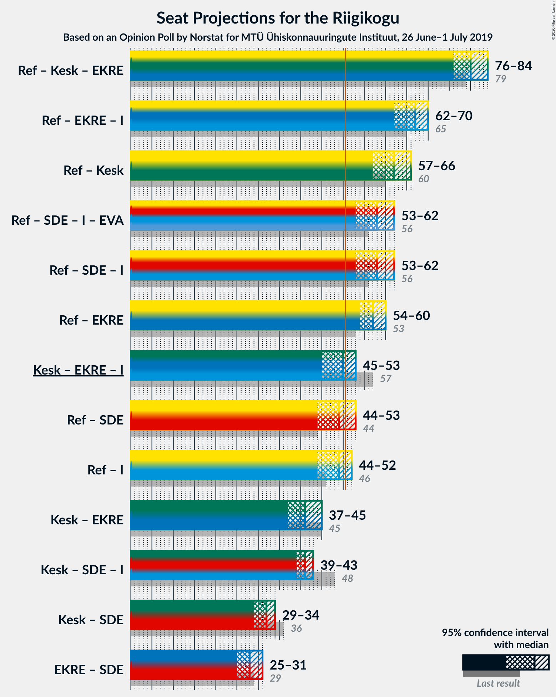

### Confidence Intervals

| Coalition | Last Result | Median | Majority? | 80% Confidence Interval | 90% Confidence Interval | 95% Confidence Interval | 99% Confidence Interval |
|:---------:|:-----------:|:------:|:---------:|:-----------------------:|:-----------------------:|:-----------------------:|:-----------------------:|
| Eesti Reformierakond – Eesti Keskerakond – Eesti Konservatiivne Rahvaerakond | 79 | 80 | 100% | 77–83 | 76–83 | 76–84 | 75–85 |
| Eesti Reformierakond – Eesti Konservatiivne Rahvaerakond – Erakond Isamaa | 65 | 67 | 100% | 63–69 | 63–70 | 62–70 | 61–72 |
| Eesti Reformierakond – Eesti Keskerakond | 60 | 62 | 100% | 59–63 | 58–65 | 57–66 | 56–68 |
| Eesti Reformierakond – Sotsiaaldemokraatlik Erakond – Erakond Isamaa – Eesti Vabaerakond | 56 | 58 | 99.5% | 55–60 | 54–61 | 53–62 | 51–64 |
| Eesti Reformierakond – Sotsiaaldemokraatlik Erakond – Erakond Isamaa | 56 | 58 | 99.5% | 55–60 | 54–61 | 53–62 | 51–64 |
| Eesti Reformierakond – Eesti Konservatiivne Rahvaerakond | 53 | 57 | 100% | 55–60 | 54–60 | 54–60 | 53–62 |
| Eesti Keskerakond – Eesti Konservatiivne Rahvaerakond – Erakond Isamaa | 57 | 50 | 37% | 47–52 | 46–53 | 45–53 | 45–56 |
| Eesti Reformierakond – Sotsiaaldemokraatlik Erakond | 44 | 49 | 15% | 46–51 | 45–52 | 44–53 | 43–55 |
| Eesti Reformierakond – Erakond Isamaa | 46 | 49 | 5% | 46–50 | 45–50 | 44–52 | 41–54 |
| Eesti Keskerakond – Eesti Konservatiivne Rahvaerakond | 45 | 41 | 0% | 38–43 | 37–44 | 37–45 | 36–47 |
| Eesti Keskerakond – Sotsiaaldemokraatlik Erakond – Erakond Isamaa | 48 | 41 | 0% | 40–42 | 39–43 | 39–43 | 35–44 |
| Eesti Keskerakond – Sotsiaaldemokraatlik Erakond | 36 | 32 | 0% | 30–33 | 30–34 | 29–34 | 28–36 |
| Eesti Konservatiivne Rahvaerakond – Sotsiaaldemokraatlik Erakond | 29 | 28 | 0% | 26–31 | 25–31 | 25–31 | 23–32 |

### Eesti Reformierakond – Eesti Keskerakond – Eesti Konservatiivne Rahvaerakond

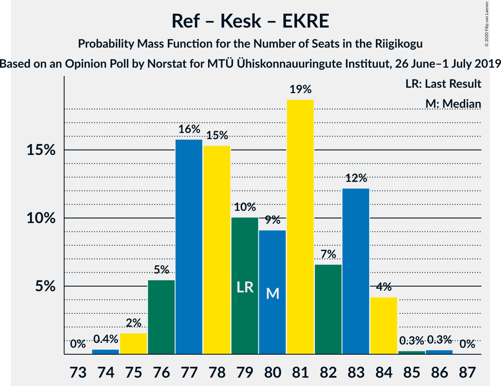

| Number of Seats | Probability | Accumulated | Special Marks |
|:---------------:|:-----------:|:-----------:|:-------------:|
| 74 | 0.4% | 100% |  |
| 75 | 2% | 99.6% |  |
| 76 | 5% | 98% |  |
| 77 | 16% | 93% |  |
| 78 | 15% | 77% |  |
| 79 | 10% | 61% | Last Result, Median |
| 80 | 9% | 51% |  |
| 81 | 19% | 42% |  |
| 82 | 7% | 24% |  |
| 83 | 12% | 17% |  |
| 84 | 4% | 5% |  |
| 85 | 0.3% | 0.6% |  |
| 86 | 0.3% | 0.3% |  |
| 87 | 0% | 0% |  |

### Eesti Reformierakond – Eesti Konservatiivne Rahvaerakond – Erakond Isamaa

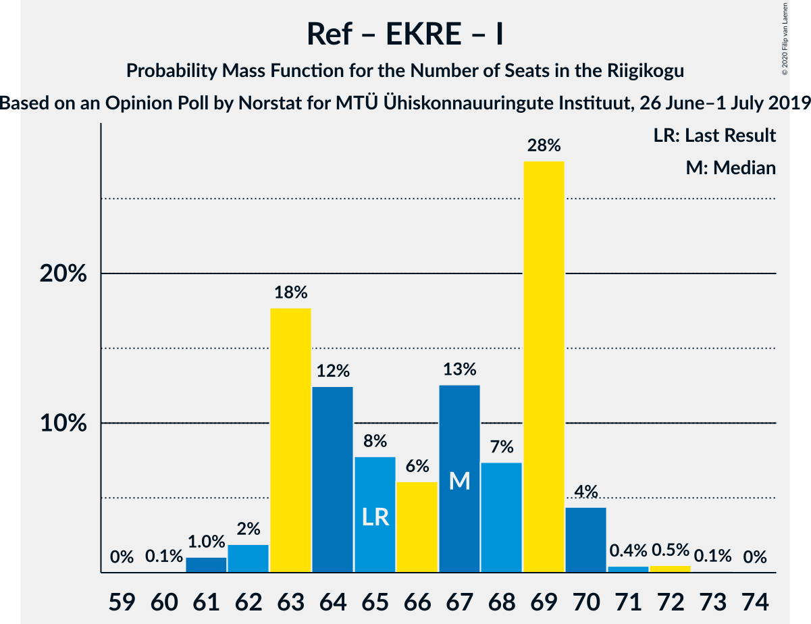

| Number of Seats | Probability | Accumulated | Special Marks |
|:---------------:|:-----------:|:-----------:|:-------------:|
| 60 | 0.1% | 100% |  |
| 61 | 1.0% | 99.9% |  |
| 62 | 2% | 98.9% |  |
| 63 | 18% | 97% |  |
| 64 | 12% | 79% |  |
| 65 | 8% | 67% | Last Result |
| 66 | 6% | 59% | Median |
| 67 | 13% | 53% |  |
| 68 | 7% | 40% |  |
| 69 | 28% | 33% |  |
| 70 | 4% | 5% |  |
| 71 | 0.4% | 1.0% |  |
| 72 | 0.5% | 0.6% |  |
| 73 | 0.1% | 0.1% |  |
| 74 | 0% | 0% |  |

### Eesti Reformierakond – Eesti Keskerakond

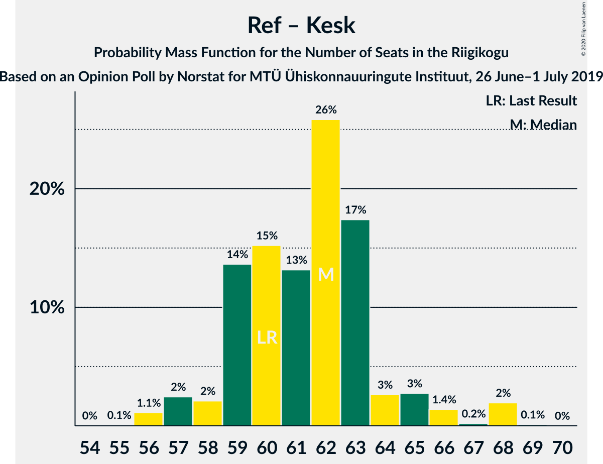

| Number of Seats | Probability | Accumulated | Special Marks |
|:---------------:|:-----------:|:-----------:|:-------------:|
| 55 | 0.1% | 100% |  |
| 56 | 1.1% | 99.9% |  |
| 57 | 2% | 98.8% |  |
| 58 | 2% | 96% |  |
| 59 | 14% | 94% |  |
| 60 | 15% | 81% | Last Result |
| 61 | 13% | 65% | Median |
| 62 | 26% | 52% |  |
| 63 | 17% | 26% |  |
| 64 | 3% | 9% |  |
| 65 | 3% | 6% |  |
| 66 | 1.4% | 4% |  |
| 67 | 0.2% | 2% |  |
| 68 | 2% | 2% |  |
| 69 | 0.1% | 0.1% |  |
| 70 | 0% | 0% |  |

### Eesti Reformierakond – Sotsiaaldemokraatlik Erakond – Erakond Isamaa – Eesti Vabaerakond

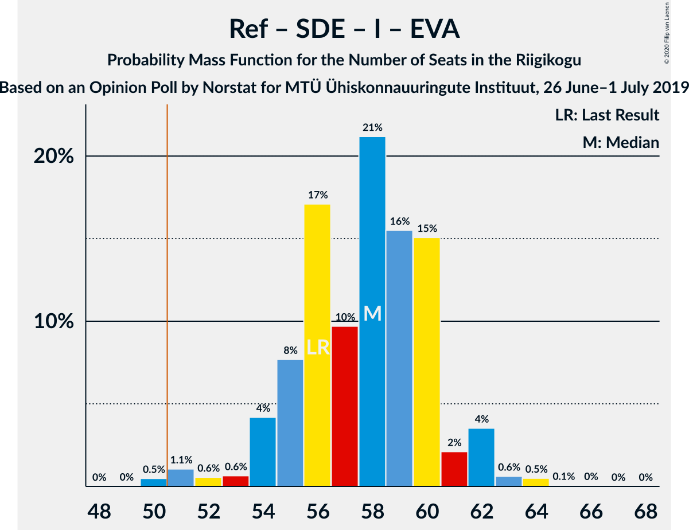

| Number of Seats | Probability | Accumulated | Special Marks |
|:---------------:|:-----------:|:-----------:|:-------------:|
| 50 | 0.5% | 100% |  |
| 51 | 1.1% | 99.5% | Majority |
| 52 | 0.6% | 98% |  |
| 53 | 0.6% | 98% |  |
| 54 | 4% | 97% |  |
| 55 | 8% | 93% |  |
| 56 | 17% | 85% | Last Result |
| 57 | 10% | 68% |  |
| 58 | 21% | 59% | Median |
| 59 | 16% | 37% |  |
| 60 | 15% | 22% |  |
| 61 | 2% | 7% |  |
| 62 | 4% | 5% |  |
| 63 | 0.6% | 1.2% |  |
| 64 | 0.5% | 0.6% |  |
| 65 | 0.1% | 0.1% |  |
| 66 | 0% | 0.1% |  |
| 67 | 0% | 0% |  |

### Eesti Reformierakond – Sotsiaaldemokraatlik Erakond – Erakond Isamaa

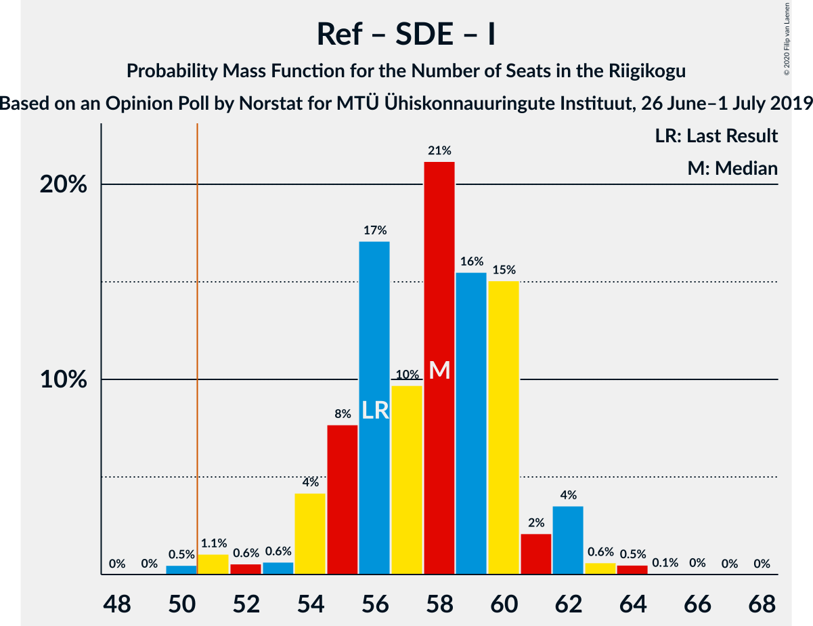

| Number of Seats | Probability | Accumulated | Special Marks |
|:---------------:|:-----------:|:-----------:|:-------------:|
| 50 | 0.5% | 100% |  |
| 51 | 1.1% | 99.5% | Majority |
| 52 | 0.6% | 98% |  |
| 53 | 0.6% | 98% |  |
| 54 | 4% | 97% |  |
| 55 | 8% | 93% |  |
| 56 | 17% | 85% | Last Result |
| 57 | 10% | 68% |  |
| 58 | 21% | 59% | Median |
| 59 | 16% | 37% |  |
| 60 | 15% | 22% |  |
| 61 | 2% | 7% |  |
| 62 | 4% | 5% |  |
| 63 | 0.6% | 1.2% |  |
| 64 | 0.5% | 0.6% |  |
| 65 | 0.1% | 0.1% |  |
| 66 | 0% | 0.1% |  |
| 67 | 0% | 0% |  |

### Eesti Reformierakond – Eesti Konservatiivne Rahvaerakond

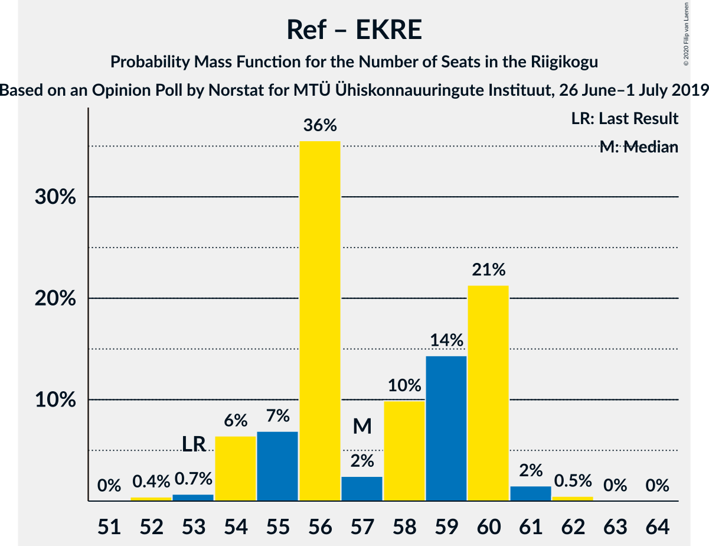

| Number of Seats | Probability | Accumulated | Special Marks |
|:---------------:|:-----------:|:-----------:|:-------------:|
| 52 | 0.4% | 100% |  |
| 53 | 0.7% | 99.6% | Last Result |
| 54 | 6% | 98.9% |  |
| 55 | 7% | 92% |  |
| 56 | 36% | 86% |  |
| 57 | 2% | 50% | Median |
| 58 | 10% | 48% |  |
| 59 | 14% | 38% |  |
| 60 | 21% | 23% |  |
| 61 | 2% | 2% |  |
| 62 | 0.5% | 0.5% |  |
| 63 | 0% | 0.1% |  |
| 64 | 0% | 0% |  |

### Eesti Keskerakond – Eesti Konservatiivne Rahvaerakond – Erakond Isamaa

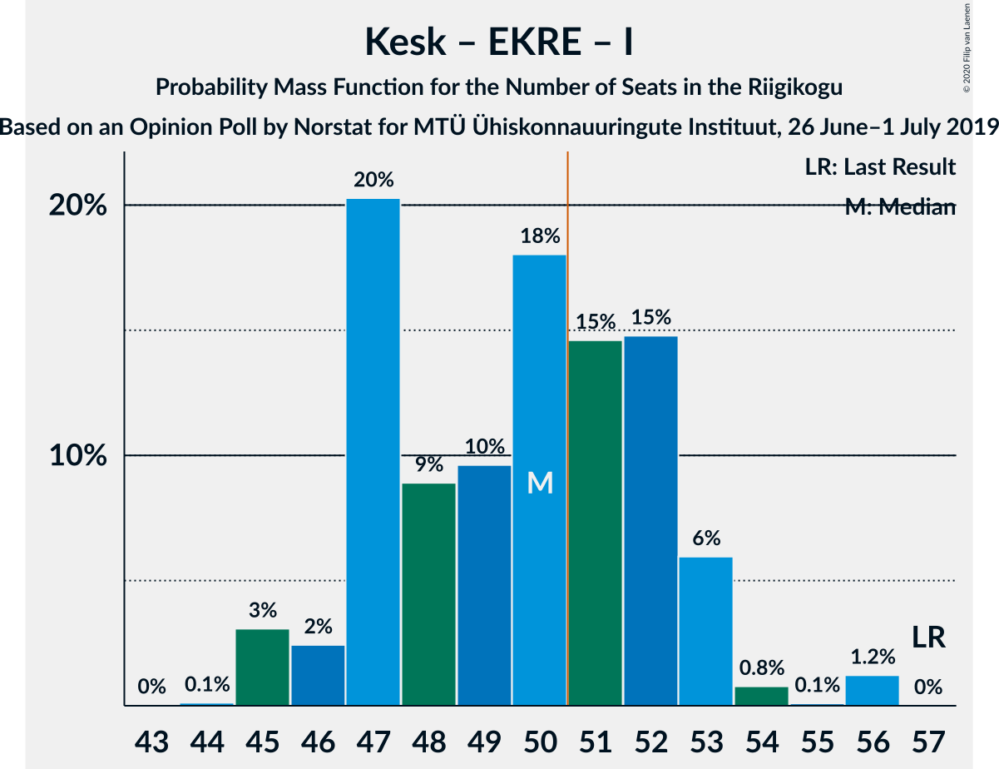

| Number of Seats | Probability | Accumulated | Special Marks |
|:---------------:|:-----------:|:-----------:|:-------------:|
| 43 | 0% | 100% |  |
| 44 | 0.1% | 99.9% |  |
| 45 | 3% | 99.8% |  |
| 46 | 2% | 97% |  |
| 47 | 20% | 94% |  |
| 48 | 9% | 74% |  |
| 49 | 10% | 65% | Median |
| 50 | 18% | 55% |  |
| 51 | 15% | 37% | Majority |
| 52 | 15% | 23% |  |
| 53 | 6% | 8% |  |
| 54 | 0.8% | 2% |  |
| 55 | 0.1% | 1.3% |  |
| 56 | 1.2% | 1.2% |  |
| 57 | 0% | 0% | Last Result |

### Eesti Reformierakond – Sotsiaaldemokraatlik Erakond

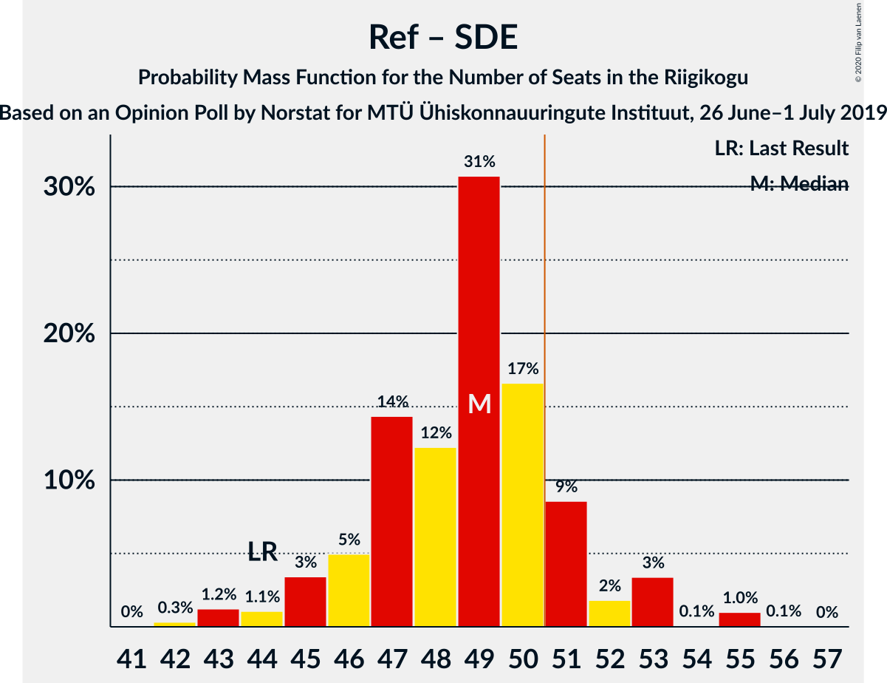

| Number of Seats | Probability | Accumulated | Special Marks |
|:---------------:|:-----------:|:-----------:|:-------------:|
| 41 | 0% | 100% |  |
| 42 | 0.3% | 99.9% |  |
| 43 | 1.2% | 99.6% |  |
| 44 | 1.1% | 98% | Last Result |
| 45 | 3% | 97% |  |
| 46 | 5% | 94% |  |
| 47 | 14% | 89% |  |
| 48 | 12% | 75% |  |
| 49 | 31% | 62% | Median |
| 50 | 17% | 32% |  |
| 51 | 9% | 15% | Majority |
| 52 | 2% | 6% |  |
| 53 | 3% | 5% |  |
| 54 | 0.1% | 1.2% |  |
| 55 | 1.0% | 1.1% |  |
| 56 | 0.1% | 0.1% |  |
| 57 | 0% | 0% |  |

### Eesti Reformierakond – Erakond Isamaa

| Number of Seats | Probability | Accumulated | Special Marks |
|:---------------:|:-----------:|:-----------:|:-------------:|
| 41 | 0.8% | 100% |  |
| 42 | 0.9% | 99.1% |  |
| 43 | 0.6% | 98% |  |
| 44 | 1.0% | 98% |  |
| 45 | 6% | 97% |  |
| 46 | 21% | 91% | Last Result |
| 47 | 8% | 70% |  |
| 48 | 9% | 62% | Median |
| 49 | 28% | 53% |  |
| 50 | 20% | 25% |  |
| 51 | 2% | 5% | Majority |
| 52 | 2% | 3% |  |
| 53 | 0.7% | 1.3% |  |
| 54 | 0.5% | 0.6% |  |
| 55 | 0.1% | 0.1% |  |
| 56 | 0% | 0% |  |

### Eesti Keskerakond – Eesti Konservatiivne Rahvaerakond

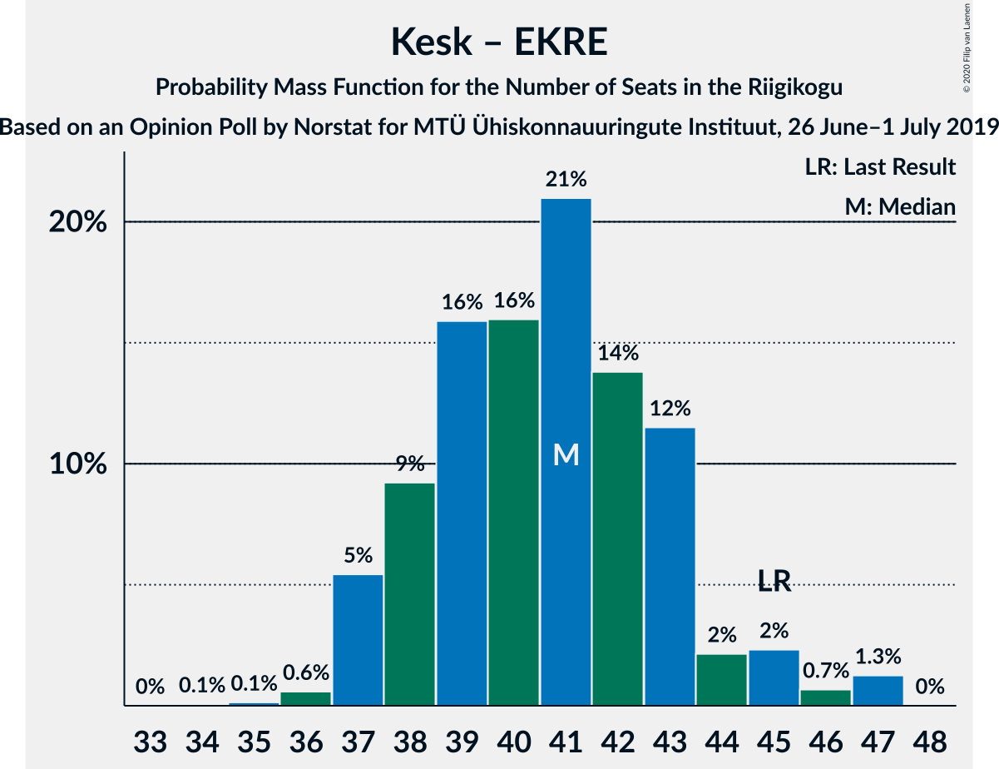

| Number of Seats | Probability | Accumulated | Special Marks |
|:---------------:|:-----------:|:-----------:|:-------------:|
| 34 | 0.1% | 100% |  |
| 35 | 0.1% | 99.9% |  |
| 36 | 0.6% | 99.8% |  |
| 37 | 5% | 99.2% |  |
| 38 | 9% | 94% |  |
| 39 | 16% | 85% |  |
| 40 | 16% | 69% | Median |
| 41 | 21% | 53% |  |
| 42 | 14% | 32% |  |
| 43 | 12% | 18% |  |
| 44 | 2% | 6% |  |
| 45 | 2% | 4% | Last Result |
| 46 | 0.7% | 2% |  |
| 47 | 1.3% | 1.3% |  |
| 48 | 0% | 0% |  |

### Eesti Keskerakond – Sotsiaaldemokraatlik Erakond – Erakond Isamaa

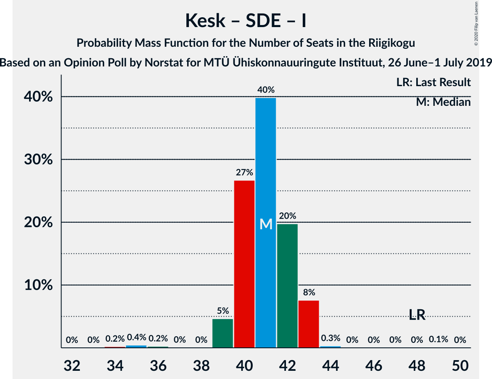

| Number of Seats | Probability | Accumulated | Special Marks |
|:---------------:|:-----------:|:-----------:|:-------------:|
| 34 | 0.2% | 100% |  |
| 35 | 0.4% | 99.8% |  |
| 36 | 0.2% | 99.3% |  |
| 37 | 0% | 99.1% |  |
| 38 | 0% | 99.0% |  |
| 39 | 5% | 99.0% |  |
| 40 | 27% | 94% |  |
| 41 | 40% | 68% | Median |
| 42 | 20% | 28% |  |
| 43 | 8% | 8% |  |
| 44 | 0.3% | 0.5% |  |
| 45 | 0% | 0.2% |  |
| 46 | 0% | 0.2% |  |
| 47 | 0% | 0.2% |  |
| 48 | 0% | 0.1% | Last Result |
| 49 | 0.1% | 0.1% |  |
| 50 | 0% | 0% |  |

### Eesti Keskerakond – Sotsiaaldemokraatlik Erakond

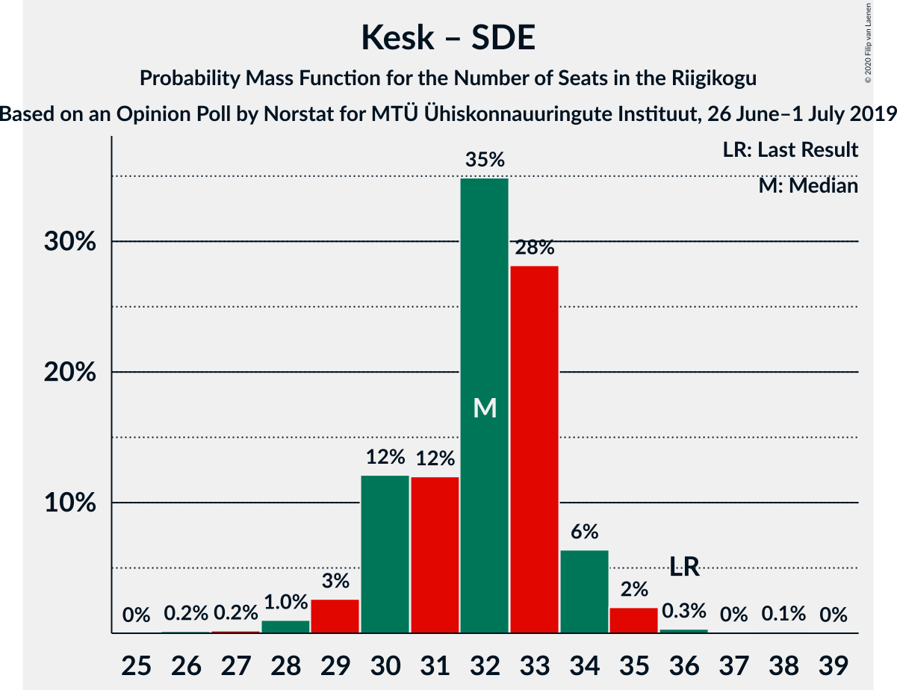

| Number of Seats | Probability | Accumulated | Special Marks |
|:---------------:|:-----------:|:-----------:|:-------------:|
| 26 | 0.2% | 100% |  |
| 27 | 0.2% | 99.8% |  |
| 28 | 1.0% | 99.6% |  |
| 29 | 3% | 98.6% |  |
| 30 | 12% | 96% |  |
| 31 | 12% | 84% |  |
| 32 | 35% | 72% | Median |
| 33 | 28% | 37% |  |
| 34 | 6% | 9% |  |
| 35 | 2% | 2% |  |
| 36 | 0.3% | 0.5% | Last Result |
| 37 | 0% | 0.2% |  |
| 38 | 0.1% | 0.1% |  |
| 39 | 0% | 0% |  |

### Eesti Konservatiivne Rahvaerakond – Sotsiaaldemokraatlik Erakond

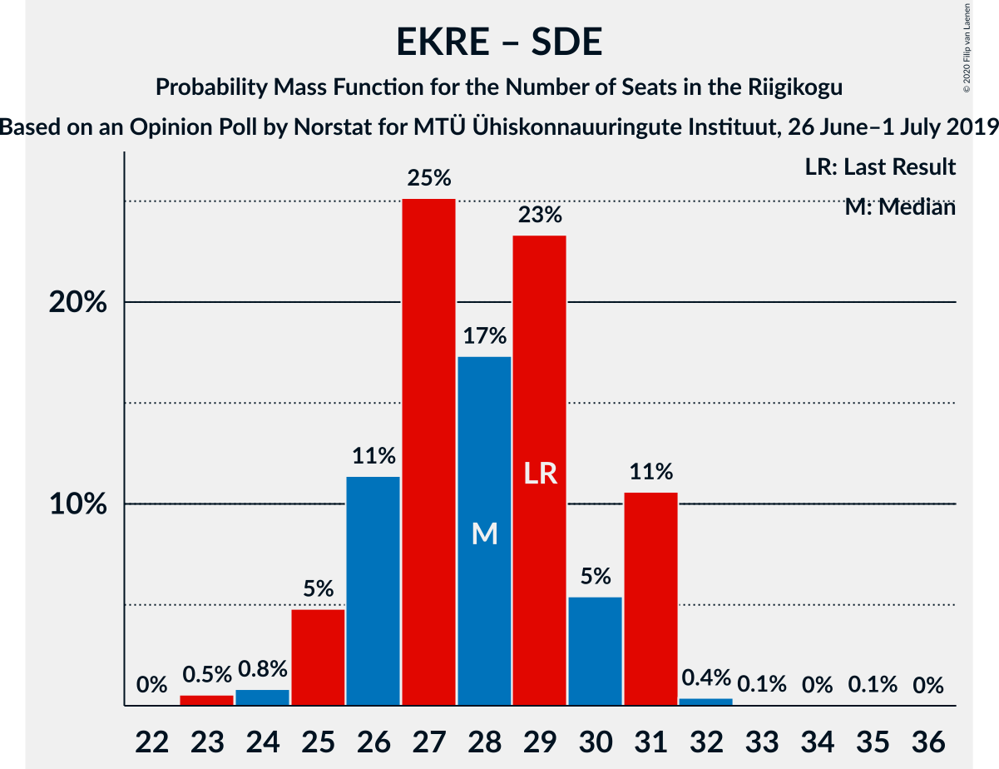

| Number of Seats | Probability | Accumulated | Special Marks |
|:---------------:|:-----------:|:-----------:|:-------------:|
| 22 | 0% | 100% |  |
| 23 | 0.5% | 99.9% |  |
| 24 | 0.8% | 99.4% |  |
| 25 | 5% | 98.6% |  |
| 26 | 11% | 94% |  |
| 27 | 25% | 82% |  |
| 28 | 17% | 57% | Median |
| 29 | 23% | 40% | Last Result |
| 30 | 5% | 17% |  |
| 31 | 11% | 11% |  |
| 32 | 0.4% | 0.6% |  |
| 33 | 0.1% | 0.2% |  |
| 34 | 0% | 0.1% |  |
| 35 | 0.1% | 0.1% |  |
| 36 | 0% | 0% |  |

## Technical Information

### Opinion Poll

+ **Polling firm:** Norstat
+ **Commissioner(s):** MTÜ Ühiskonnauuringute Instituut
+ **Fieldwork period:** 26 June–1 July 2019

### Calculations

+ **Sample size:** 1000
+ **Simulations done:** 131,072
+ **Error estimate:** 1.07%

