# Opinion Poll by Norstat for MTÜ Ühiskonnauuringute Instituut, 2–8 July 2019

<a href="#voting-intentions">Voting Intentions</a> | <a href="#seats">Seats</a> | <a href="#coalitions">Coalitions</a> | <a href="#technical-information">Technical Information</a>

## Voting Intentions

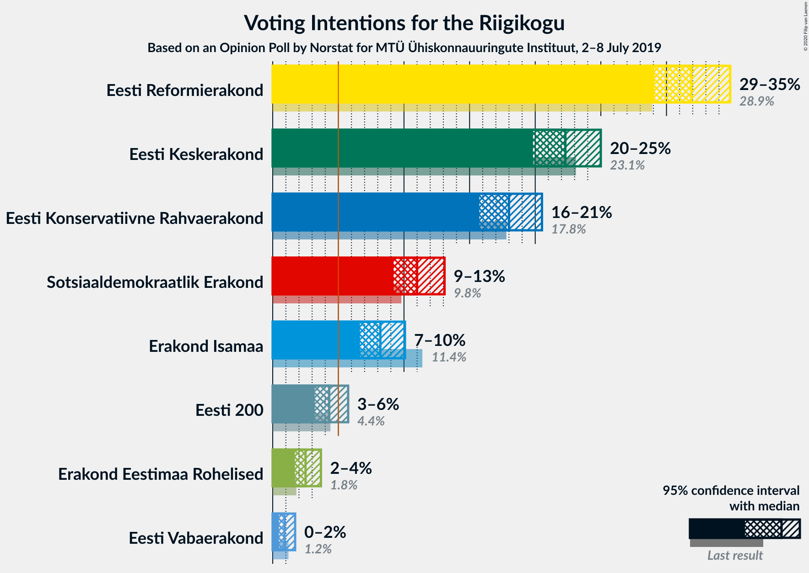

### Confidence Intervals

| Party | Last Result | Poll Result | 80% Confidence Interval | 90% Confidence Interval | 95% Confidence Interval | 99% Confidence Interval |
|:-----:|:-----------:|:-----------:|:-----------------------:|:-----------------------:|:-----------------------:|:-----------------------:|
| Eesti Reformierakond | 28.9% | 31.9% | 30.1–33.8% |29.5–34.4% |29.1–34.9% |28.2–35.8% |
| Eesti Keskerakond | 23.1% | 22.3% | 20.7–24.1% |20.2–24.6% |19.8–25.0% |19.1–25.8% |
| Eesti Konservatiivne Rahvaerakond | 17.8% | 18.0% | 16.5–19.6% |16.1–20.1% |15.7–20.5% |15.1–21.3% |
| Sotsiaaldemokraatlik Erakond | 9.8% | 11.0% | 9.8–12.4% |9.5–12.8% |9.2–13.1% |8.7–13.8% |
| Erakond Isamaa | 11.4% | 8.2% | 7.2–9.4% |6.9–9.8% |6.6–10.1% |6.2–10.7% |
| Eesti 200 | 4.4% | 4.3% | 3.6–5.2% |3.4–5.5% |3.2–5.7% |2.9–6.2% |
| Erakond Eestimaa Rohelised | 1.8% | 2.5% | 2.0–3.3% |1.8–3.5% |1.7–3.7% |1.5–4.1% |
| Eesti Vabaerakond | 1.2% | 0.9% | 0.6–1.4% |0.5–1.6% |0.5–1.7% |0.4–2.0% |

*Note:* The poll result column reflects the actual value used in the calculations. Published results may vary slightly, and in addition be rounded to fewer digits.

## Seats

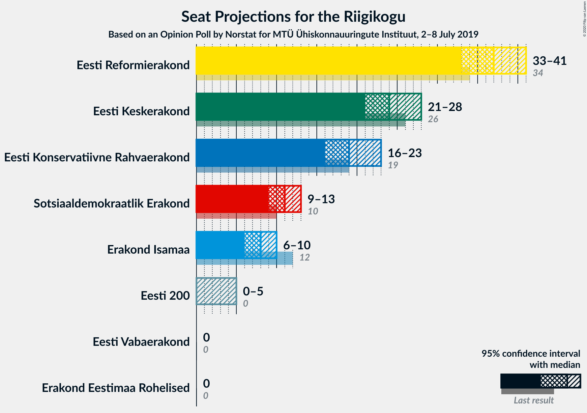

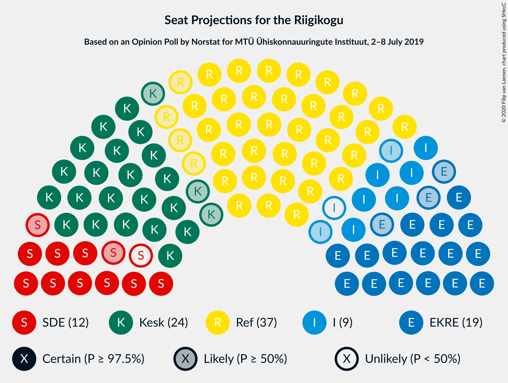

### Confidence Intervals

| Party | Last Result | Median | 80% Confidence Interval | 90% Confidence Interval | 95% Confidence Interval | 99% Confidence Interval |
|:-----:|:-----------:|:------:|:-----------------------:|:-----------------------:|:-----------------------:|:-----------------------:|
| <a href="#eesti-reformierakond">Eesti Reformierakond</a> | 34 | 37 | 35–39 |34–40 |33–41 |32–41 |
| <a href="#eesti-keskerakond">Eesti Keskerakond</a> | 26 | 24 | 23–27 |22–27 |21–28 |21–29 |
| <a href="#eesti-konservatiivne-rahvaerakond">Eesti Konservatiivne Rahvaerakond</a> | 19 | 19 | 18–22 |17–23 |16–23 |16–23 |
| <a href="#sotsiaaldemokraatlik-erakond">Sotsiaaldemokraatlik Erakond</a> | 10 | 11 | 10–12 |9–13 |9–13 |8–14 |
| <a href="#erakond-isamaa">Erakond Isamaa</a> | 12 | 8 | 7–9 |6–10 |6–10 |5–10 |
| <a href="#eesti-200">Eesti 200</a> | 0 | 0 | 0–4 |0–5 |0–5 |0–6 |
| <a href="#erakond-eestimaa-rohelised">Erakond Eestimaa Rohelised</a> | 0 | 0 | 0 |0 |0 |0 |
| <a href="#eesti-vabaerakond">Eesti Vabaerakond</a> | 0 | 0 | 0 |0 |0 |0 |

### Eesti Reformierakond

*For a full overview of the results for this party, see the [Eesti Reformierakond](party-eestireformierakond.html) page.*

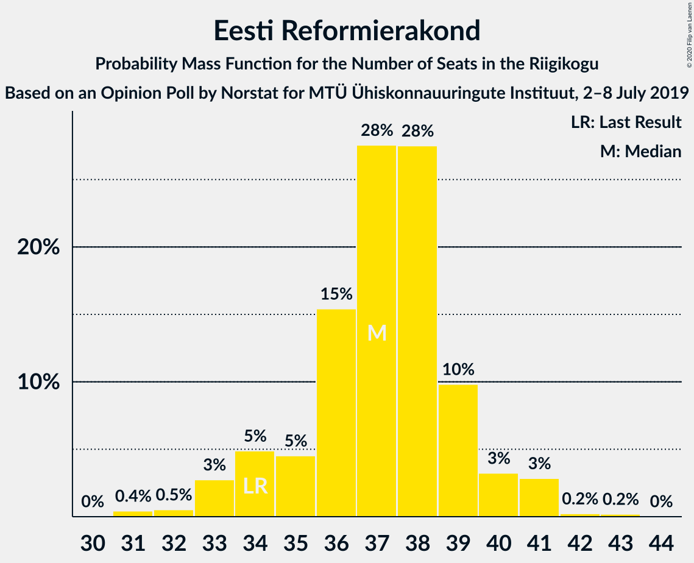

| Number of Seats | Probability | Accumulated | Special Marks |
|:---------------:|:-----------:|:-----------:|:-------------:|
| 31 | 0.4% | 100% |  |
| 32 | 0.5% | 99.5% |  |
| 33 | 3% | 99.0% |  |
| 34 | 5% | 96% | Last Result |
| 35 | 5% | 91% |  |
| 36 | 15% | 87% |  |
| 37 | 28% | 71% | Median |
| 38 | 28% | 44% |  |
| 39 | 10% | 16% |  |
| 40 | 3% | 7% |  |
| 41 | 3% | 3% |  |
| 42 | 0.2% | 0.5% |  |
| 43 | 0.2% | 0.2% |  |
| 44 | 0% | 0% |  |

### Eesti Keskerakond

*For a full overview of the results for this party, see the [Eesti Keskerakond](party-eestikeskerakond.html) page.*

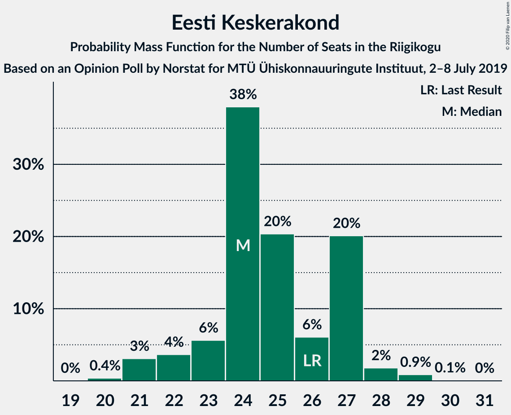

| Number of Seats | Probability | Accumulated | Special Marks |
|:---------------:|:-----------:|:-----------:|:-------------:|
| 20 | 0.4% | 100% |  |
| 21 | 3% | 99.6% |  |
| 22 | 4% | 97% |  |
| 23 | 6% | 93% |  |
| 24 | 38% | 87% | Median |
| 25 | 20% | 49% |  |
| 26 | 6% | 29% | Last Result |
| 27 | 20% | 23% |  |
| 28 | 2% | 3% |  |
| 29 | 0.9% | 1.0% |  |
| 30 | 0.1% | 0.1% |  |
| 31 | 0% | 0% |  |

### Eesti Konservatiivne Rahvaerakond

*For a full overview of the results for this party, see the [Eesti Konservatiivne Rahvaerakond](party-eestikonservatiivnerahvaerakond.html) page.*

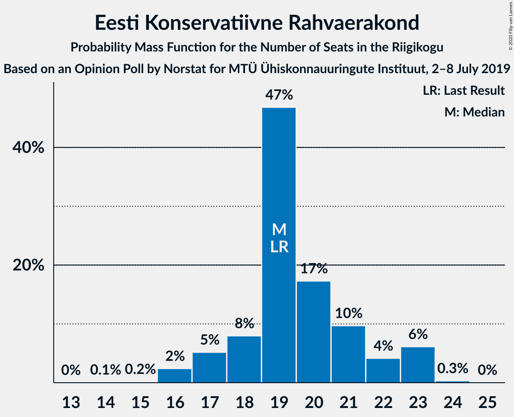

| Number of Seats | Probability | Accumulated | Special Marks |
|:---------------:|:-----------:|:-----------:|:-------------:|
| 14 | 0.1% | 100% |  |
| 15 | 0.2% | 99.9% |  |
| 16 | 2% | 99.8% |  |
| 17 | 5% | 97% |  |
| 18 | 8% | 92% |  |
| 19 | 47% | 84% | Last Result, Median |
| 20 | 17% | 37% |  |
| 21 | 10% | 20% |  |
| 22 | 4% | 11% |  |
| 23 | 6% | 6% |  |
| 24 | 0.3% | 0.3% |  |
| 25 | 0% | 0% |  |

### Sotsiaaldemokraatlik Erakond

*For a full overview of the results for this party, see the [Sotsiaaldemokraatlik Erakond](party-sotsiaaldemokraatlikerakond.html) page.*

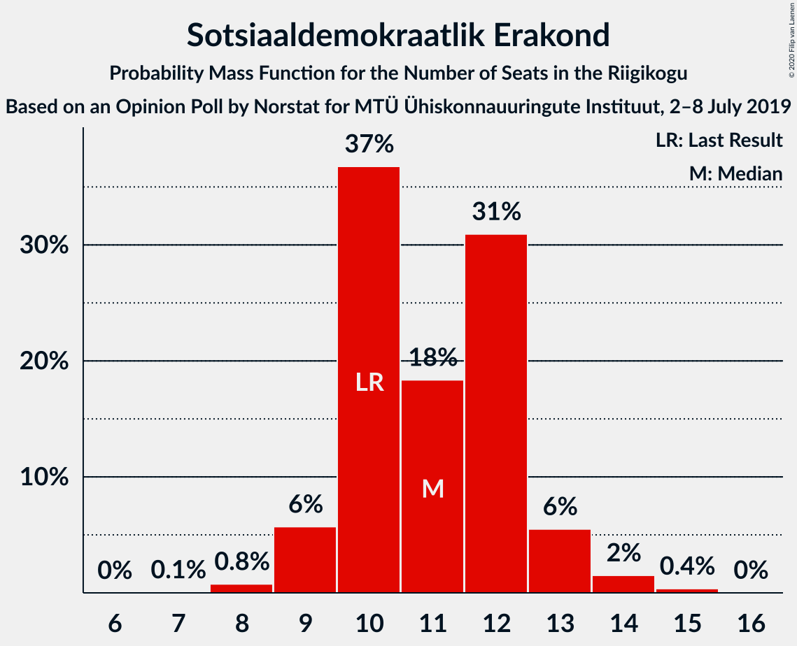

| Number of Seats | Probability | Accumulated | Special Marks |
|:---------------:|:-----------:|:-----------:|:-------------:|
| 7 | 0.1% | 100% |  |
| 8 | 0.8% | 99.9% |  |
| 9 | 6% | 99.2% |  |
| 10 | 37% | 93% | Last Result |
| 11 | 18% | 57% | Median |
| 12 | 31% | 38% |  |
| 13 | 6% | 7% |  |
| 14 | 2% | 2% |  |
| 15 | 0.4% | 0.4% |  |
| 16 | 0% | 0% |  |

### Erakond Isamaa

*For a full overview of the results for this party, see the [Erakond Isamaa](party-erakondisamaa.html) page.*

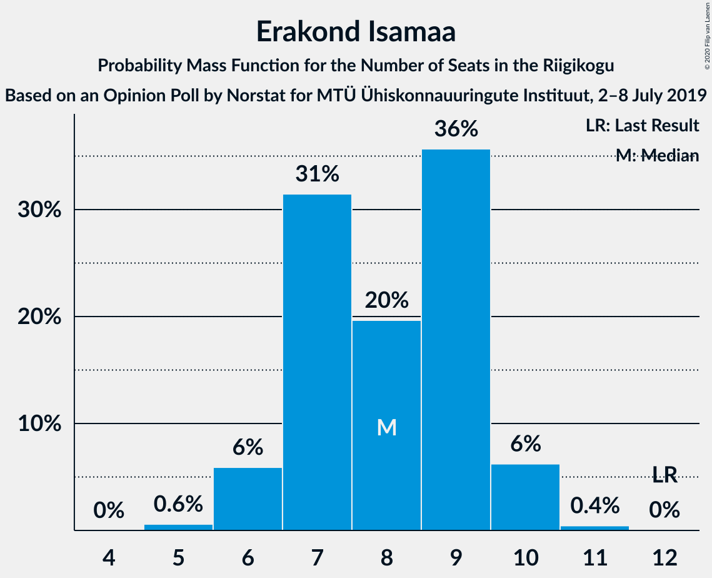

| Number of Seats | Probability | Accumulated | Special Marks |
|:---------------:|:-----------:|:-----------:|:-------------:|
| 5 | 0.6% | 100% |  |
| 6 | 6% | 99.4% |  |
| 7 | 31% | 94% |  |
| 8 | 20% | 62% | Median |
| 9 | 36% | 42% |  |
| 10 | 6% | 7% |  |
| 11 | 0.4% | 0.5% |  |
| 12 | 0% | 0% | Last Result |

### Eesti 200

*For a full overview of the results for this party, see the [Eesti 200](party-eesti200.html) page.*

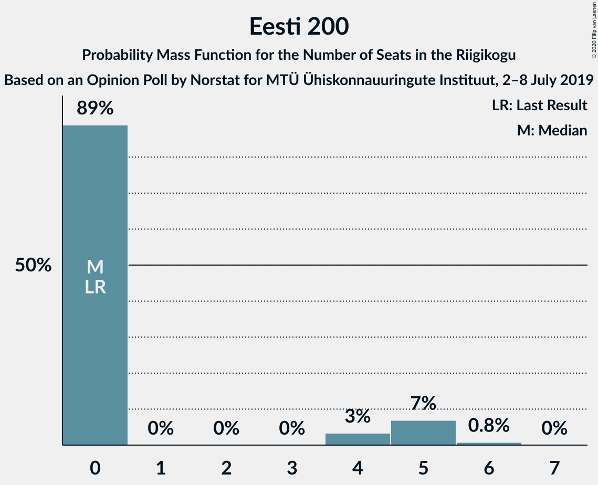

| Number of Seats | Probability | Accumulated | Special Marks |
|:---------------:|:-----------:|:-----------:|:-------------:|
| 0 | 89% | 100% | Last Result, Median |
| 1 | 0% | 11% |  |
| 2 | 0% | 11% |  |
| 3 | 0% | 11% |  |
| 4 | 3% | 11% |  |
| 5 | 7% | 8% |  |
| 6 | 0.8% | 0.8% |  |
| 7 | 0% | 0% |  |

### Erakond Eestimaa Rohelised

*For a full overview of the results for this party, see the [Erakond Eestimaa Rohelised](party-erakondeestimaarohelised.html) page.*

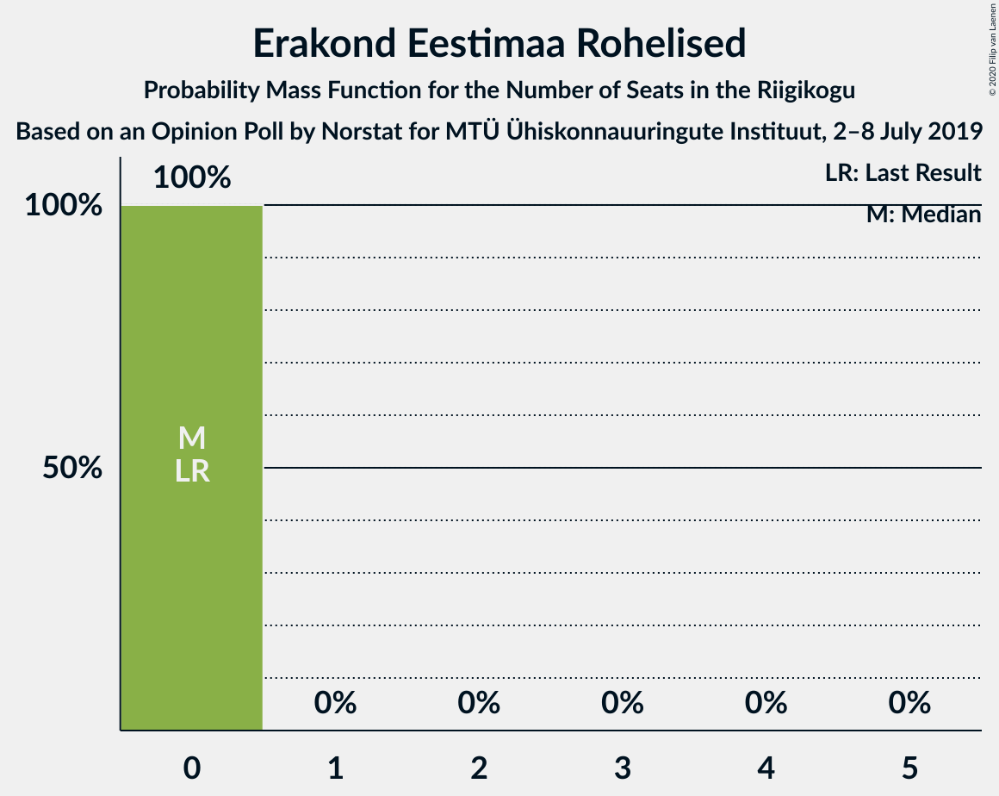

| Number of Seats | Probability | Accumulated | Special Marks |
|:---------------:|:-----------:|:-----------:|:-------------:|
| 0 | 100% | 100% | Last Result, Median |

### Eesti Vabaerakond

*For a full overview of the results for this party, see the [Eesti Vabaerakond](party-eestivabaerakond.html) page.*

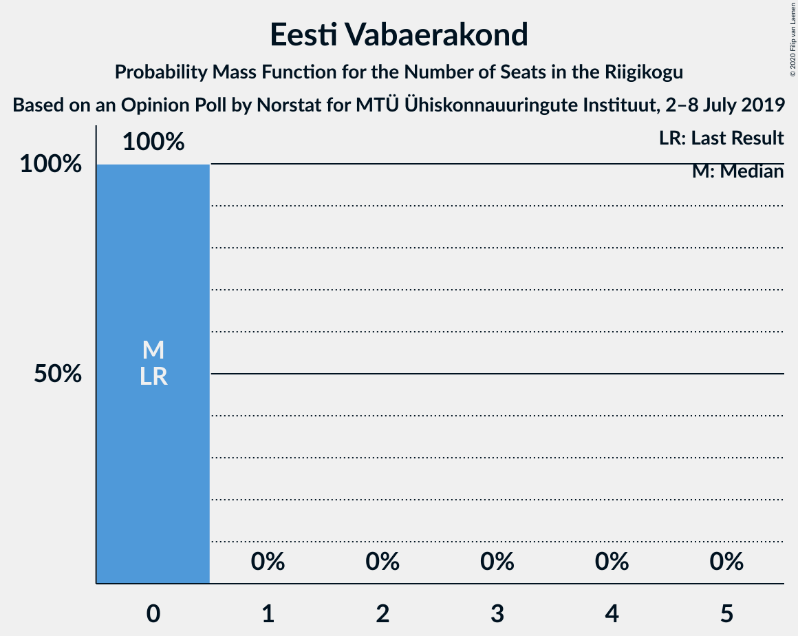

| Number of Seats | Probability | Accumulated | Special Marks |
|:---------------:|:-----------:|:-----------:|:-------------:|
| 0 | 100% | 100% | Last Result, Median |

## Coalitions

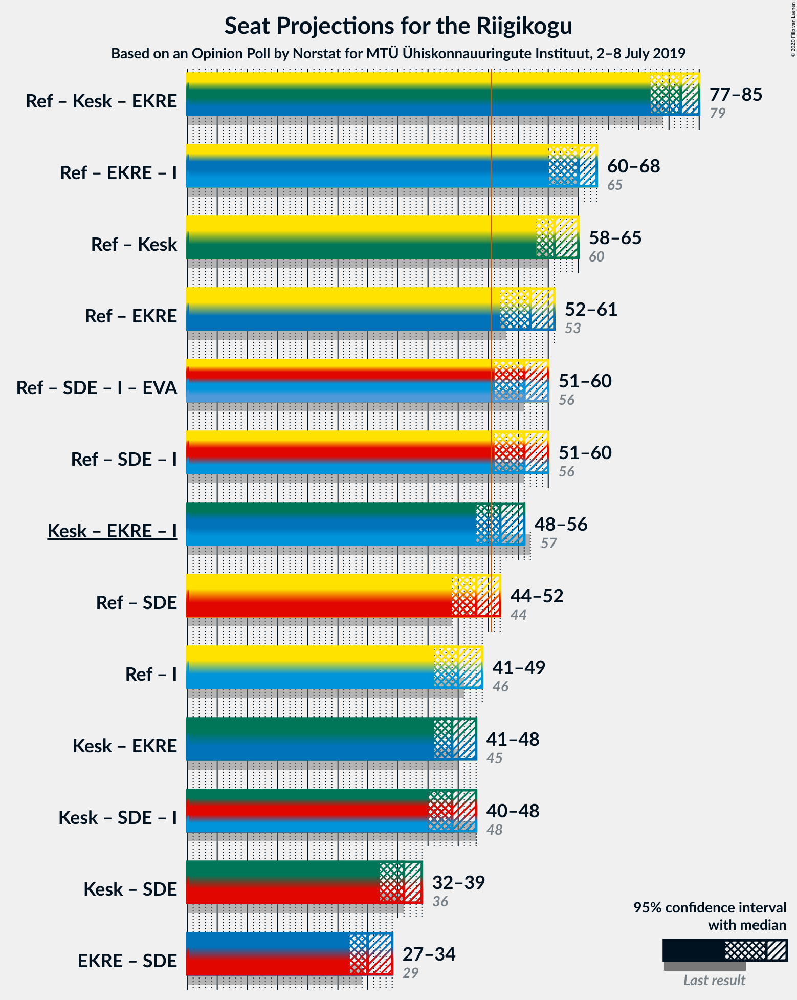

### Confidence Intervals

| Coalition | Last Result | Median | Majority? | 80% Confidence Interval | 90% Confidence Interval | 95% Confidence Interval | 99% Confidence Interval |
|:---------:|:-----------:|:------:|:---------:|:-----------------------:|:-----------------------:|:-----------------------:|:-----------------------:|
| Eesti Reformierakond – Eesti Keskerakond – Eesti Konservatiivne Rahvaerakond | 79 | 82 | 100% | 79–84 | 78–84 | 77–85 | 76–85 |
| Eesti Reformierakond – Eesti Konservatiivne Rahvaerakond – Erakond Isamaa | 65 | 65 | 100% | 62–67 | 61–68 | 60–68 | 58–70 |
| Eesti Reformierakond – Eesti Keskerakond | 60 | 61 | 100% | 60–65 | 59–65 | 58–65 | 56–67 |
| Eesti Reformierakond – Eesti Konservatiivne Rahvaerakond | 53 | 57 | 99.6% | 54–59 | 53–60 | 52–61 | 51–61 |
| Eesti Reformierakond – Sotsiaaldemokraatlik Erakond – Erakond Isamaa – Eesti Vabaerakond | 56 | 56 | 99.2% | 54–58 | 52–60 | 51–60 | 50–61 |
| Eesti Reformierakond – Sotsiaaldemokraatlik Erakond – Erakond Isamaa | 56 | 56 | 99.2% | 54–58 | 52–60 | 51–60 | 50–61 |
| Eesti Keskerakond – Eesti Konservatiivne Rahvaerakond – Erakond Isamaa | 57 | 52 | 86% | 50–55 | 49–55 | 48–56 | 47–57 |
| Eesti Reformierakond – Sotsiaaldemokraatlik Erakond | 44 | 48 | 8% | 46–50 | 45–51 | 44–52 | 42–53 |
| Eesti Reformierakond – Erakond Isamaa | 46 | 45 | 0.2% | 43–47 | 42–49 | 41–49 | 39–50 |
| Eesti Keskerakond – Eesti Konservatiivne Rahvaerakond | 45 | 44 | 0.1% | 41–47 | 41–47 | 41–48 | 39–50 |
| Eesti Keskerakond – Sotsiaaldemokraatlik Erakond – Erakond Isamaa | 48 | 44 | 0% | 42–46 | 40–47 | 40–48 | 38–49 |
| Eesti Keskerakond – Sotsiaaldemokraatlik Erakond | 36 | 36 | 0% | 34–38 | 33–38 | 32–39 | 31–40 |
| Eesti Konservatiivne Rahvaerakond – Sotsiaaldemokraatlik Erakond | 29 | 30 | 0% | 29–33 | 28–34 | 27–34 | 26–35 |

### Eesti Reformierakond – Eesti Keskerakond – Eesti Konservatiivne Rahvaerakond

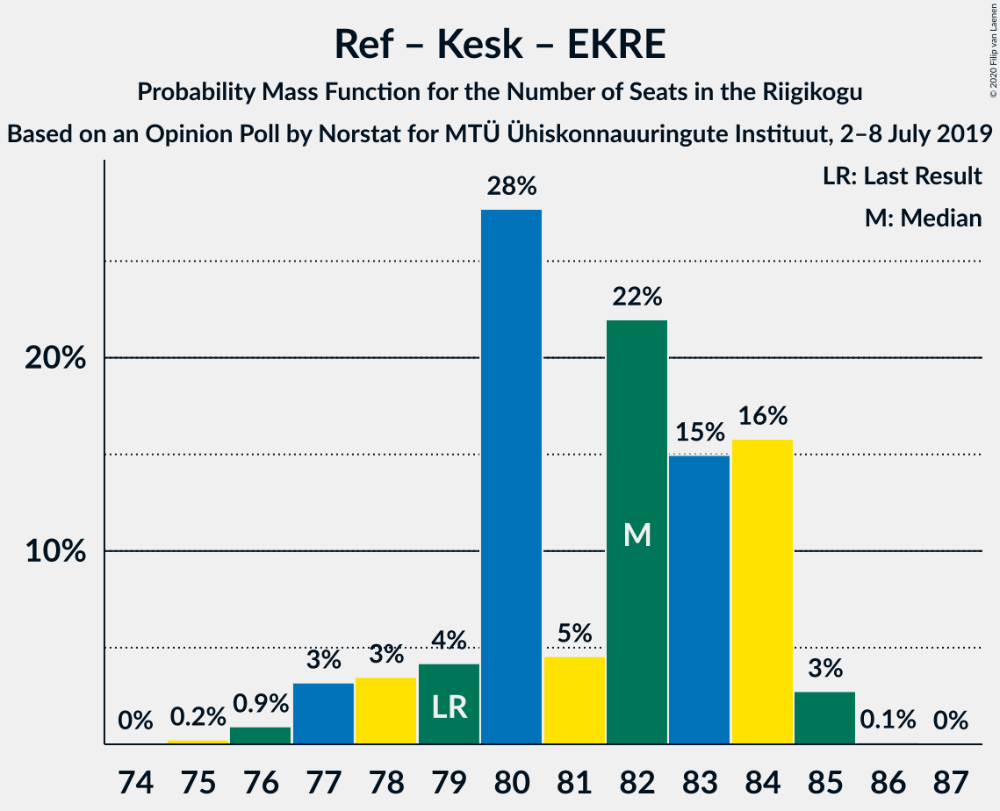

| Number of Seats | Probability | Accumulated | Special Marks |
|:---------------:|:-----------:|:-----------:|:-------------:|
| 74 | 0% | 100% |  |
| 75 | 0.2% | 99.9% |  |
| 76 | 0.9% | 99.7% |  |
| 77 | 3% | 98.8% |  |
| 78 | 3% | 96% |  |
| 79 | 4% | 92% | Last Result |
| 80 | 28% | 88% | Median |
| 81 | 5% | 60% |  |
| 82 | 22% | 56% |  |
| 83 | 15% | 34% |  |
| 84 | 16% | 19% |  |
| 85 | 3% | 3% |  |
| 86 | 0.1% | 0.1% |  |
| 87 | 0% | 0% |  |

### Eesti Reformierakond – Eesti Konservatiivne Rahvaerakond – Erakond Isamaa

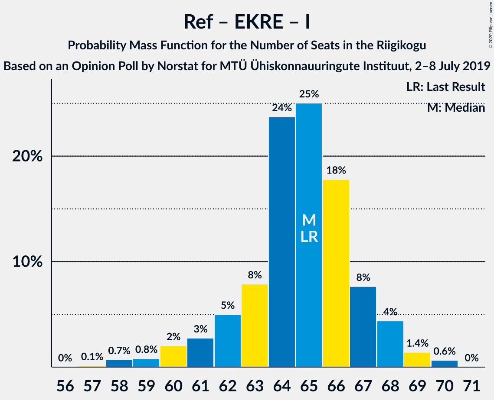

| Number of Seats | Probability | Accumulated | Special Marks |
|:---------------:|:-----------:|:-----------:|:-------------:|
| 57 | 0.1% | 100% |  |
| 58 | 0.7% | 99.9% |  |
| 59 | 0.8% | 99.2% |  |
| 60 | 2% | 98% |  |
| 61 | 3% | 96% |  |
| 62 | 5% | 94% |  |
| 63 | 8% | 89% |  |
| 64 | 24% | 81% | Median |
| 65 | 25% | 57% | Last Result |
| 66 | 18% | 32% |  |
| 67 | 8% | 14% |  |
| 68 | 4% | 6% |  |
| 69 | 1.4% | 2% |  |
| 70 | 0.6% | 0.7% |  |
| 71 | 0% | 0% |  |

### Eesti Reformierakond – Eesti Keskerakond

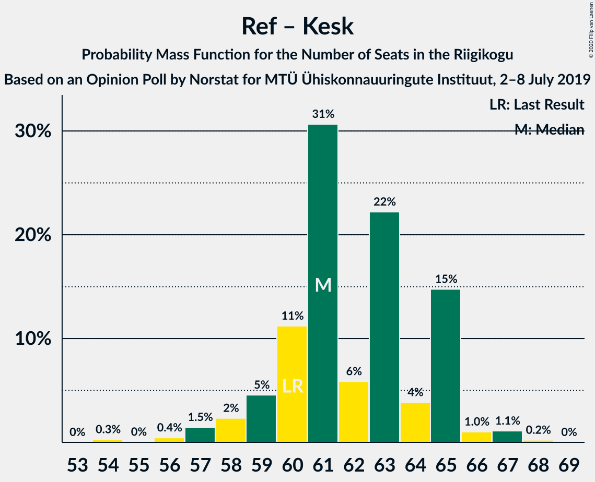

| Number of Seats | Probability | Accumulated | Special Marks |
|:---------------:|:-----------:|:-----------:|:-------------:|
| 54 | 0.3% | 100% |  |
| 55 | 0% | 99.7% |  |
| 56 | 0.4% | 99.7% |  |
| 57 | 1.5% | 99.2% |  |
| 58 | 2% | 98% |  |
| 59 | 5% | 95% |  |
| 60 | 11% | 91% | Last Result |
| 61 | 31% | 80% | Median |
| 62 | 6% | 49% |  |
| 63 | 22% | 43% |  |
| 64 | 4% | 21% |  |
| 65 | 15% | 17% |  |
| 66 | 1.0% | 2% |  |
| 67 | 1.1% | 1.3% |  |
| 68 | 0.2% | 0.2% |  |
| 69 | 0% | 0% |  |

### Eesti Reformierakond – Eesti Konservatiivne Rahvaerakond

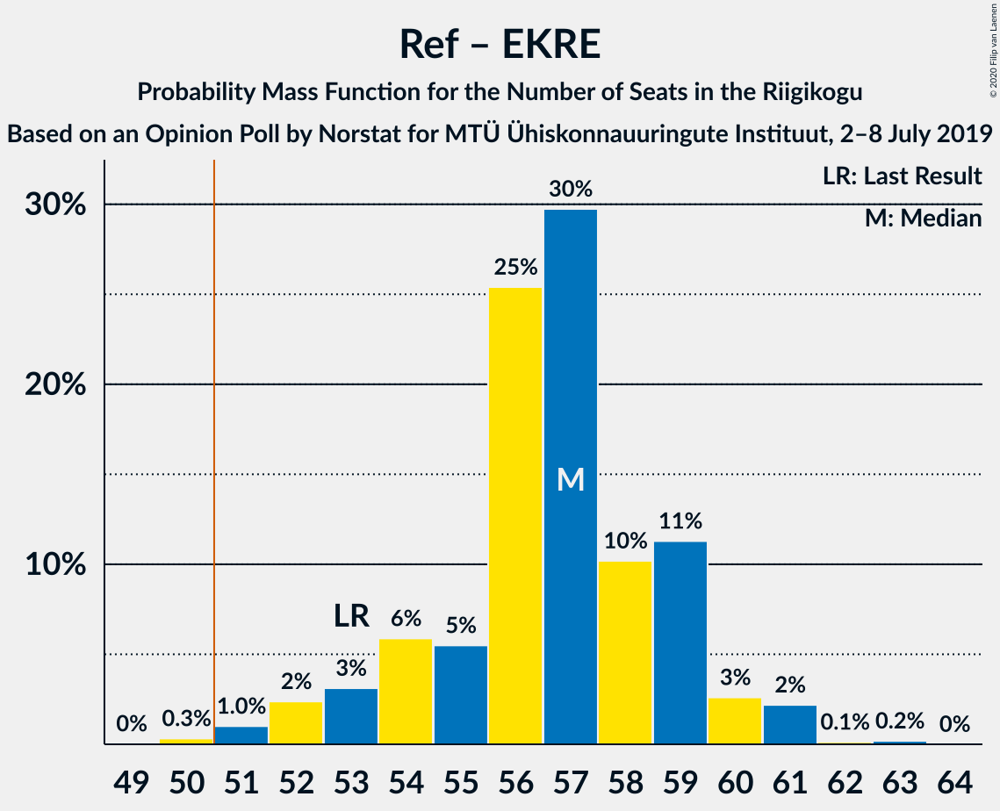

| Number of Seats | Probability | Accumulated | Special Marks |
|:---------------:|:-----------:|:-----------:|:-------------:|
| 50 | 0.3% | 100% |  |
| 51 | 1.0% | 99.6% | Majority |
| 52 | 2% | 98.6% |  |
| 53 | 3% | 96% | Last Result |
| 54 | 6% | 93% |  |
| 55 | 5% | 87% |  |
| 56 | 25% | 82% | Median |
| 57 | 30% | 56% |  |
| 58 | 10% | 27% |  |
| 59 | 11% | 16% |  |
| 60 | 3% | 5% |  |
| 61 | 2% | 3% |  |
| 62 | 0.1% | 0.3% |  |
| 63 | 0.2% | 0.2% |  |
| 64 | 0% | 0% |  |

### Eesti Reformierakond – Sotsiaaldemokraatlik Erakond – Erakond Isamaa – Eesti Vabaerakond

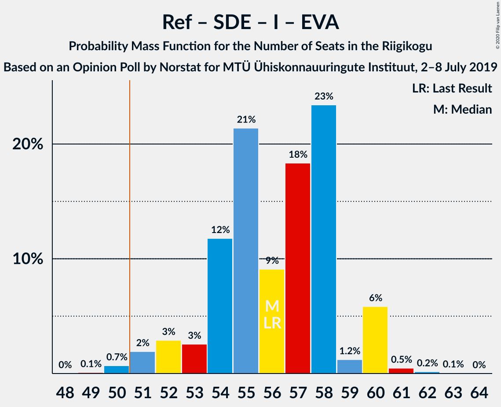

| Number of Seats | Probability | Accumulated | Special Marks |
|:---------------:|:-----------:|:-----------:|:-------------:|
| 49 | 0.1% | 100% |  |
| 50 | 0.7% | 99.9% |  |
| 51 | 2% | 99.2% | Majority |
| 52 | 3% | 97% |  |
| 53 | 3% | 94% |  |
| 54 | 12% | 92% |  |
| 55 | 21% | 80% |  |
| 56 | 9% | 59% | Last Result, Median |
| 57 | 18% | 50% |  |
| 58 | 23% | 31% |  |
| 59 | 1.2% | 8% |  |
| 60 | 6% | 7% |  |
| 61 | 0.5% | 0.7% |  |
| 62 | 0.2% | 0.2% |  |
| 63 | 0.1% | 0.1% |  |
| 64 | 0% | 0% |  |

### Eesti Reformierakond – Sotsiaaldemokraatlik Erakond – Erakond Isamaa

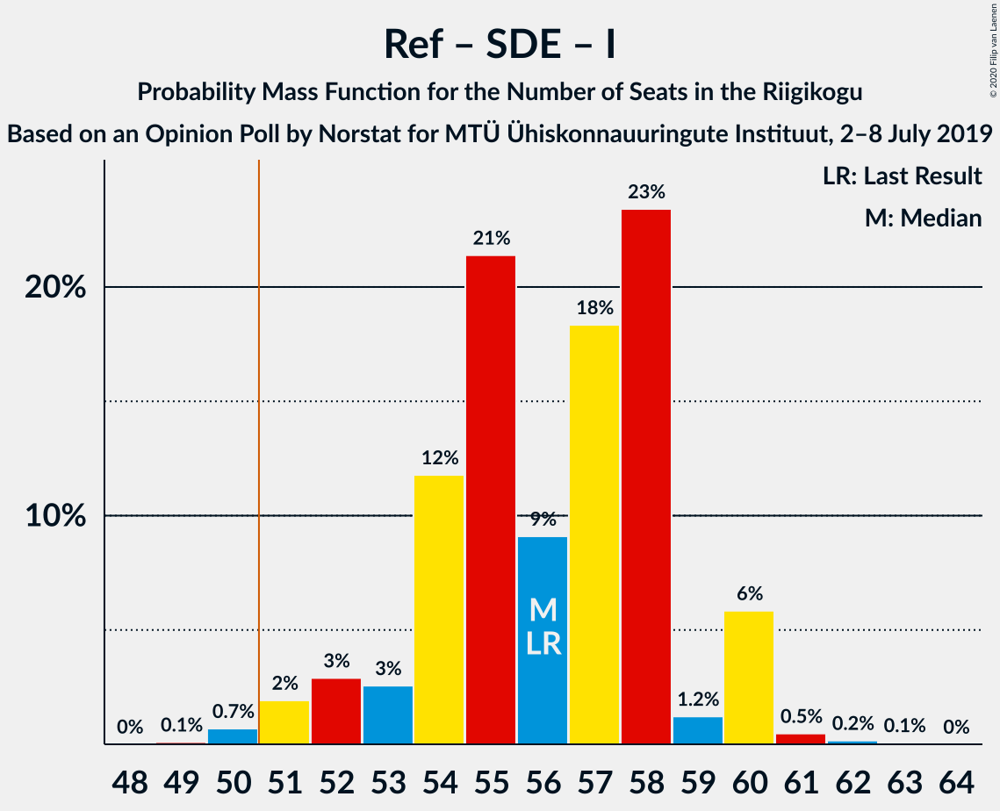

| Number of Seats | Probability | Accumulated | Special Marks |
|:---------------:|:-----------:|:-----------:|:-------------:|
| 49 | 0.1% | 100% |  |
| 50 | 0.7% | 99.9% |  |
| 51 | 2% | 99.2% | Majority |
| 52 | 3% | 97% |  |
| 53 | 3% | 94% |  |
| 54 | 12% | 92% |  |
| 55 | 21% | 80% |  |
| 56 | 9% | 59% | Last Result, Median |
| 57 | 18% | 50% |  |
| 58 | 23% | 31% |  |
| 59 | 1.2% | 8% |  |
| 60 | 6% | 7% |  |
| 61 | 0.5% | 0.7% |  |
| 62 | 0.2% | 0.2% |  |
| 63 | 0.1% | 0.1% |  |
| 64 | 0% | 0% |  |

### Eesti Keskerakond – Eesti Konservatiivne Rahvaerakond – Erakond Isamaa

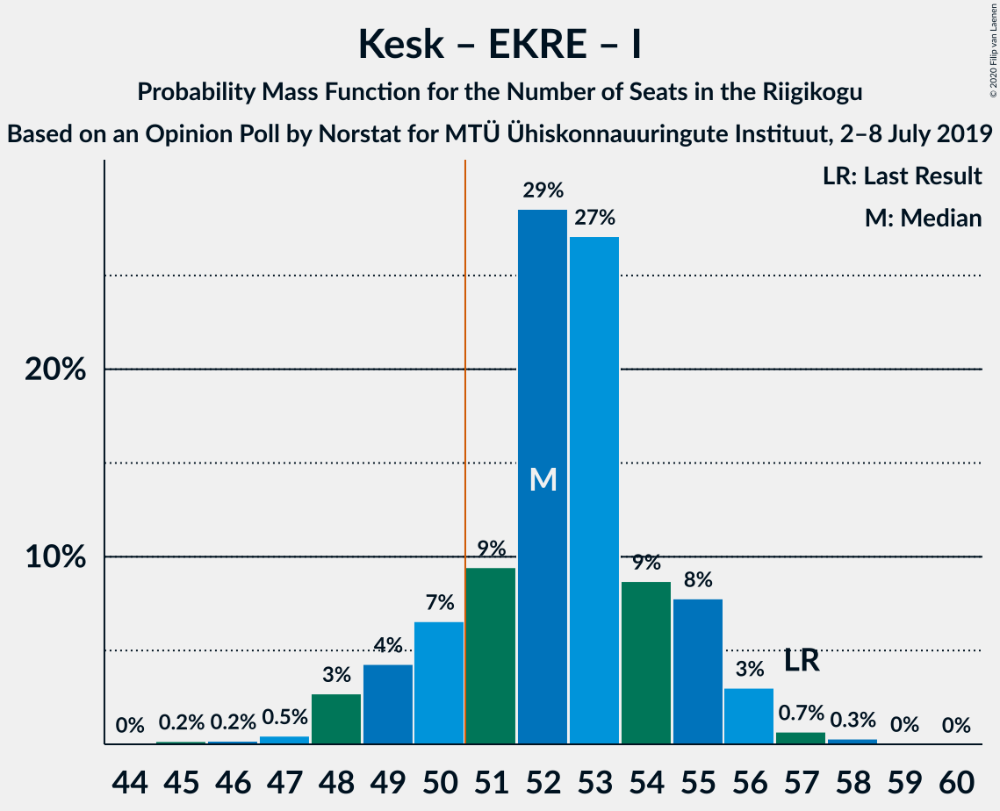

| Number of Seats | Probability | Accumulated | Special Marks |
|:---------------:|:-----------:|:-----------:|:-------------:|
| 45 | 0.2% | 100% |  |
| 46 | 0.2% | 99.8% |  |
| 47 | 0.5% | 99.6% |  |
| 48 | 3% | 99.2% |  |
| 49 | 4% | 96% |  |
| 50 | 7% | 92% |  |
| 51 | 9% | 86% | Median, Majority |
| 52 | 29% | 76% |  |
| 53 | 27% | 48% |  |
| 54 | 9% | 21% |  |
| 55 | 8% | 12% |  |
| 56 | 3% | 4% |  |
| 57 | 0.7% | 1.0% | Last Result |
| 58 | 0.3% | 0.4% |  |
| 59 | 0% | 0.1% |  |
| 60 | 0% | 0% |  |

### Eesti Reformierakond – Sotsiaaldemokraatlik Erakond

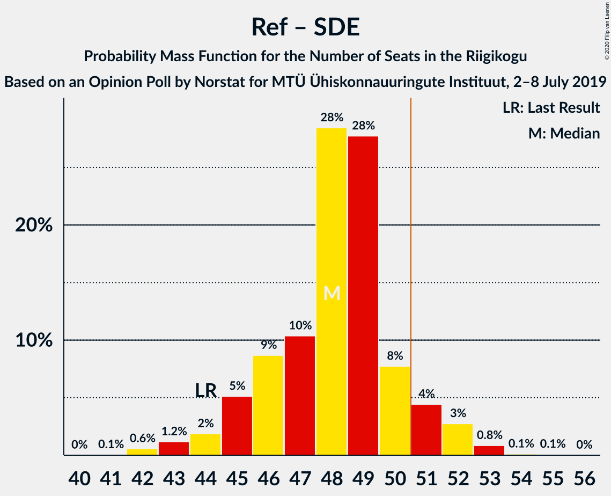

| Number of Seats | Probability | Accumulated | Special Marks |
|:---------------:|:-----------:|:-----------:|:-------------:|
| 41 | 0.1% | 100% |  |
| 42 | 0.6% | 99.9% |  |
| 43 | 1.2% | 99.4% |  |
| 44 | 2% | 98% | Last Result |
| 45 | 5% | 96% |  |
| 46 | 9% | 91% |  |
| 47 | 10% | 83% |  |
| 48 | 28% | 72% | Median |
| 49 | 28% | 44% |  |
| 50 | 8% | 16% |  |
| 51 | 4% | 8% | Majority |
| 52 | 3% | 4% |  |
| 53 | 0.8% | 1.0% |  |
| 54 | 0.1% | 0.2% |  |
| 55 | 0.1% | 0.1% |  |
| 56 | 0% | 0% |  |

### Eesti Reformierakond – Erakond Isamaa

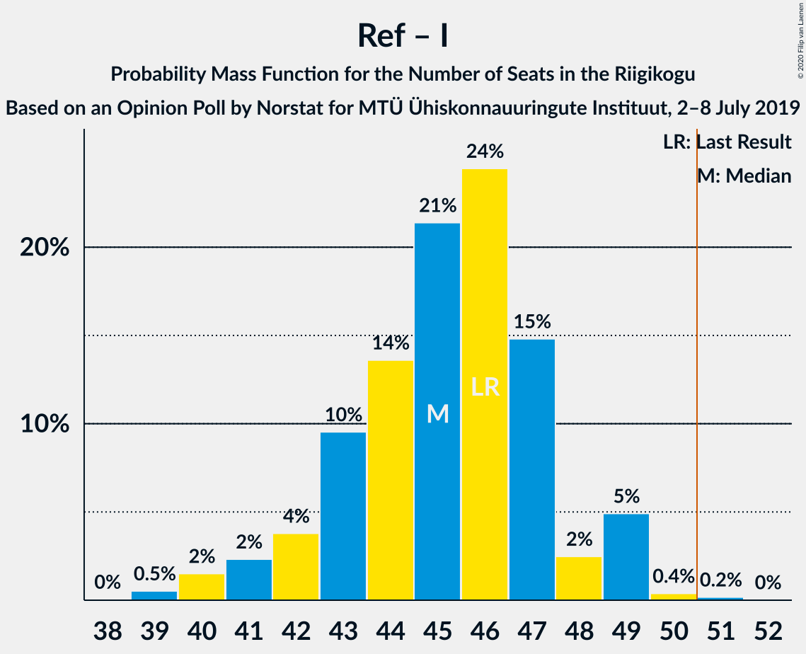

| Number of Seats | Probability | Accumulated | Special Marks |
|:---------------:|:-----------:|:-----------:|:-------------:|
| 38 | 0% | 100% |  |
| 39 | 0.5% | 99.9% |  |
| 40 | 2% | 99.4% |  |
| 41 | 2% | 98% |  |
| 42 | 4% | 96% |  |
| 43 | 10% | 92% |  |
| 44 | 14% | 82% |  |
| 45 | 21% | 69% | Median |
| 46 | 24% | 47% | Last Result |
| 47 | 15% | 23% |  |
| 48 | 2% | 8% |  |
| 49 | 5% | 6% |  |
| 50 | 0.4% | 0.6% |  |
| 51 | 0.2% | 0.2% | Majority |
| 52 | 0% | 0% |  |

### Eesti Keskerakond – Eesti Konservatiivne Rahvaerakond

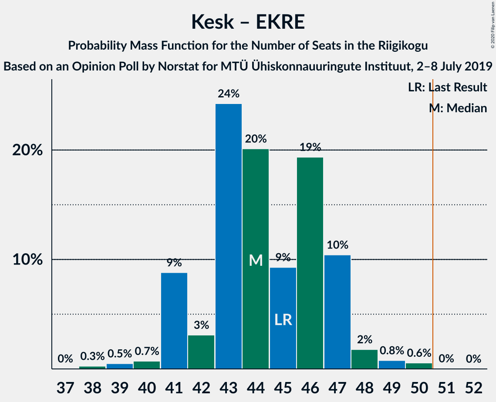

| Number of Seats | Probability | Accumulated | Special Marks |
|:---------------:|:-----------:|:-----------:|:-------------:|
| 38 | 0.3% | 100% |  |
| 39 | 0.5% | 99.7% |  |
| 40 | 0.7% | 99.2% |  |
| 41 | 9% | 98% |  |
| 42 | 3% | 90% |  |
| 43 | 24% | 87% | Median |
| 44 | 20% | 62% |  |
| 45 | 9% | 42% | Last Result |
| 46 | 19% | 33% |  |
| 47 | 10% | 14% |  |
| 48 | 2% | 3% |  |
| 49 | 0.8% | 1.4% |  |
| 50 | 0.6% | 0.6% |  |
| 51 | 0% | 0.1% | Majority |
| 52 | 0% | 0% |  |

### Eesti Keskerakond – Sotsiaaldemokraatlik Erakond – Erakond Isamaa

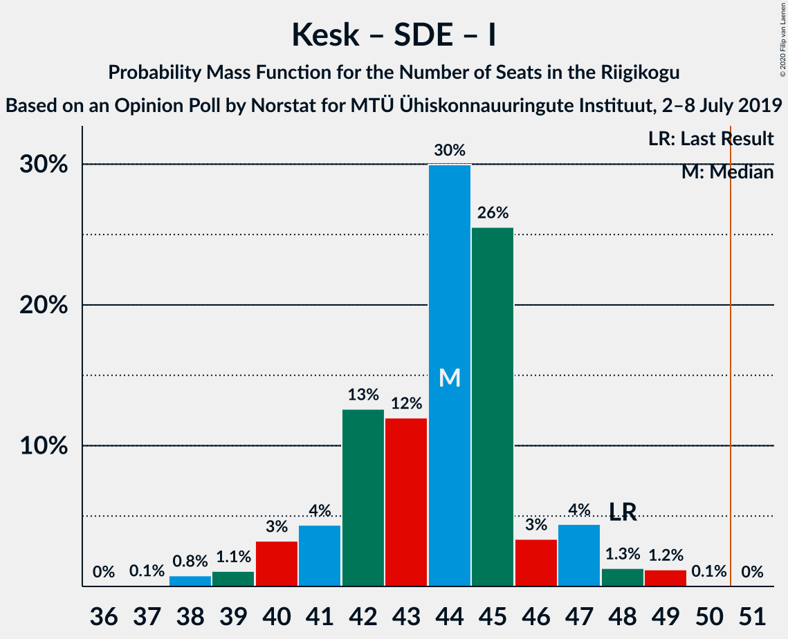

| Number of Seats | Probability | Accumulated | Special Marks |
|:---------------:|:-----------:|:-----------:|:-------------:|
| 37 | 0.1% | 100% |  |
| 38 | 0.8% | 99.9% |  |
| 39 | 1.1% | 99.1% |  |
| 40 | 3% | 98% |  |
| 41 | 4% | 95% |  |
| 42 | 13% | 90% |  |
| 43 | 12% | 78% | Median |
| 44 | 30% | 66% |  |
| 45 | 26% | 36% |  |
| 46 | 3% | 10% |  |
| 47 | 4% | 7% |  |
| 48 | 1.3% | 3% | Last Result |
| 49 | 1.2% | 1.3% |  |
| 50 | 0.1% | 0.1% |  |
| 51 | 0% | 0% | Majority |

### Eesti Keskerakond – Sotsiaaldemokraatlik Erakond

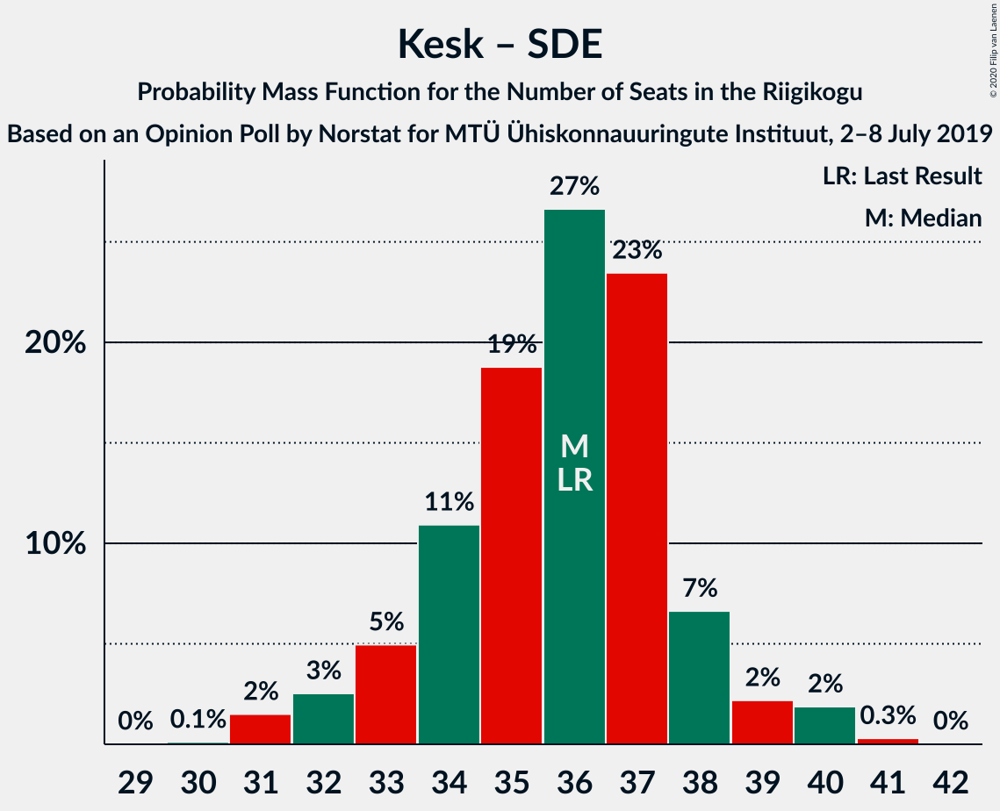

| Number of Seats | Probability | Accumulated | Special Marks |
|:---------------:|:-----------:|:-----------:|:-------------:|
| 30 | 0.1% | 100% |  |
| 31 | 2% | 99.9% |  |
| 32 | 3% | 98% |  |
| 33 | 5% | 96% |  |
| 34 | 11% | 91% |  |
| 35 | 19% | 80% | Median |
| 36 | 27% | 61% | Last Result |
| 37 | 23% | 35% |  |
| 38 | 7% | 11% |  |
| 39 | 2% | 4% |  |
| 40 | 2% | 2% |  |
| 41 | 0.3% | 0.3% |  |
| 42 | 0% | 0% |  |

### Eesti Konservatiivne Rahvaerakond – Sotsiaaldemokraatlik Erakond

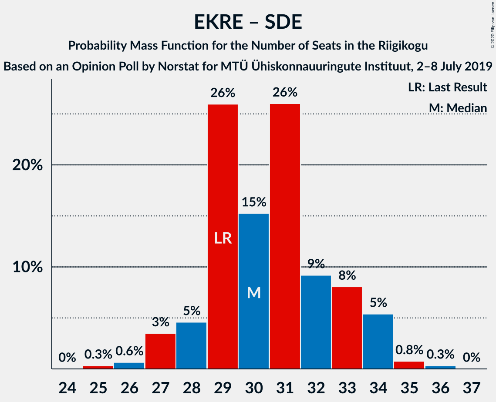

| Number of Seats | Probability | Accumulated | Special Marks |
|:---------------:|:-----------:|:-----------:|:-------------:|
| 25 | 0.3% | 100% |  |
| 26 | 0.6% | 99.7% |  |
| 27 | 3% | 99.0% |  |
| 28 | 5% | 96% |  |
| 29 | 26% | 91% | Last Result |
| 30 | 15% | 65% | Median |
| 31 | 26% | 50% |  |
| 32 | 9% | 24% |  |
| 33 | 8% | 15% |  |
| 34 | 5% | 6% |  |
| 35 | 0.8% | 1.1% |  |
| 36 | 0.3% | 0.3% |  |
| 37 | 0% | 0% |  |

## Technical Information

### Opinion Poll

+ **Polling firm:** Norstat
+ **Commissioner(s):** MTÜ Ühiskonnauuringute Instituut
+ **Fieldwork period:** 2–8 July 2019

### Calculations

+ **Sample size:** 1000
+ **Simulations done:** 131,072
+ **Error estimate:** 2.55%

