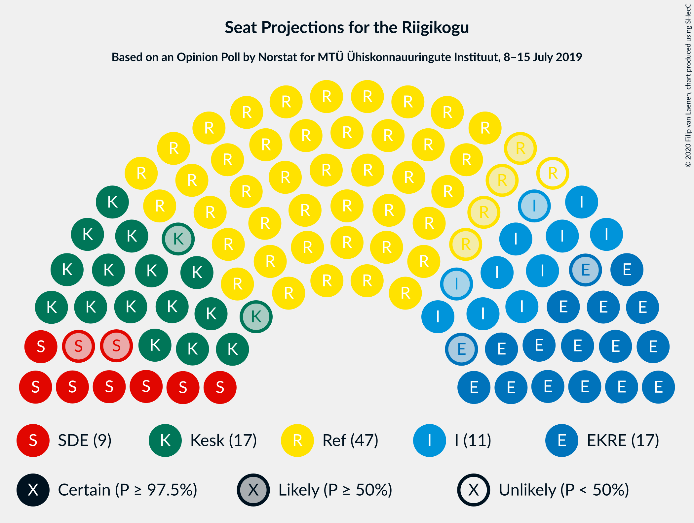

# Opinion Poll by Norstat for MTÜ Ühiskonnauuringute Instituut, 8–15 July 2019

<a href="#voting-intentions">Voting Intentions</a> | <a href="#seats">Seats</a> | <a href="#coalitions">Coalitions</a> | <a href="#technical-information">Technical Information</a>

## Voting Intentions

### Confidence Intervals

| Party | Last Result | Poll Result | 80% Confidence Interval | 90% Confidence Interval | 95% Confidence Interval | 99% Confidence Interval |
|:-----:|:-----------:|:-----------:|:-----------------------:|:-----------------------:|:-----------------------:|:-----------------------:|
| Eesti Reformierakond | 28.9% | 37.7% | 35.8–39.7% |35.2–40.3% |34.8–40.8% |33.8–41.7% |
| Eesti Keskerakond | 23.1% | 16.4% | 15.0–18.0% |14.6–18.4% |14.2–18.8% |13.6–19.6% |
| Eesti Konservatiivne Rahvaerakond | 17.8% | 15.8% | 14.4–17.4% |14.0–17.8% |13.7–18.2% |13.0–19.0% |
| Erakond Isamaa | 11.4% | 11.0% | 9.8–12.4% |9.5–12.8% |9.2–13.1% |8.7–13.8% |
| Sotsiaaldemokraatlik Erakond | 9.8% | 8.7% | 7.7–10.0% |7.3–10.3% |7.1–10.6% |6.6–11.2% |
| Eesti 200 | 4.4% | 4.0% | 3.3–4.9% |3.1–5.2% |2.9–5.4% |2.7–5.9% |
| Erakond Eestimaa Rohelised | 1.8% | 2.7% | 2.1–3.5% |2.0–3.7% |1.9–3.9% |1.6–4.3% |
| Eesti Vabaerakond | 1.2% | 1.1% | 0.8–1.7% |0.7–1.8% |0.6–2.0% |0.5–2.3% |

*Note:* The poll result column reflects the actual value used in the calculations. Published results may vary slightly, and in addition be rounded to fewer digits.

## Seats

### Confidence Intervals

| Party | Last Result | Median | 80% Confidence Interval | 90% Confidence Interval | 95% Confidence Interval | 99% Confidence Interval |
|:-----:|:-----------:|:------:|:-----------------------:|:-----------------------:|:-----------------------:|:-----------------------:|
| <a href="#eesti-reformierakond">Eesti Reformierakond</a> | 34 | 46 | 43–48 |43–49 |42–50 |40–51 |
| <a href="#eesti-keskerakond">Eesti Keskerakond</a> | 26 | 17 | 15–20 |15–20 |15–20 |14–22 |
| <a href="#eesti-konservatiivne-rahvaerakond">Eesti Konservatiivne Rahvaerakond</a> | 19 | 17 | 15–19 |15–19 |15–20 |14–21 |
| <a href="#erakond-isamaa">Erakond Isamaa</a> | 12 | 11 | 10–13 |10–13 |9–14 |8–15 |
| <a href="#sotsiaaldemokraatlik-erakond">Sotsiaaldemokraatlik Erakond</a> | 10 | 9 | 7–10 |7–10 |7–11 |6–12 |
| <a href="#eesti-200">Eesti 200</a> | 0 | 0 | 0 |0–4 |0–5 |0–5 |
| <a href="#erakond-eestimaa-rohelised">Erakond Eestimaa Rohelised</a> | 0 | 0 | 0 |0 |0 |0 |
| <a href="#eesti-vabaerakond">Eesti Vabaerakond</a> | 0 | 0 | 0 |0 |0 |0 |

### Eesti Reformierakond

*For a full overview of the results for this party, see the [Eesti Reformierakond](party-eestireformierakond.html) page.*

| Number of Seats | Probability | Accumulated | Special Marks |
|:---------------:|:-----------:|:-----------:|:-------------:|
| 34 | 0% | 100% | Last Result |
| 35 | 0% | 100% |  |
| 36 | 0% | 100% |  |
| 37 | 0% | 100% |  |
| 38 | 0% | 100% |  |
| 39 | 0.1% | 100% |  |
| 40 | 0.8% | 99.9% |  |
| 41 | 1.4% | 99.1% |  |
| 42 | 2% | 98% |  |
| 43 | 6% | 95% |  |
| 44 | 18% | 90% |  |
| 45 | 5% | 72% |  |
| 46 | 18% | 67% | Median |
| 47 | 33% | 49% |  |
| 48 | 8% | 16% |  |
| 49 | 3% | 8% |  |
| 50 | 4% | 5% |  |
| 51 | 0.5% | 0.6% | Majority |
| 52 | 0.1% | 0.1% |  |
| 53 | 0% | 0% |  |

### Eesti Keskerakond

*For a full overview of the results for this party, see the [Eesti Keskerakond](party-eestikeskerakond.html) page.*

| Number of Seats | Probability | Accumulated | Special Marks |
|:---------------:|:-----------:|:-----------:|:-------------:|
| 14 | 0.8% | 100% |  |
| 15 | 9% | 99.1% |  |
| 16 | 5% | 90% |  |
| 17 | 38% | 85% | Median |
| 18 | 21% | 47% |  |
| 19 | 8% | 26% |  |
| 20 | 16% | 18% |  |
| 21 | 1.4% | 2% |  |
| 22 | 0.4% | 0.5% |  |
| 23 | 0.1% | 0.1% |  |
| 24 | 0% | 0% |  |
| 25 | 0% | 0% |  |
| 26 | 0% | 0% | Last Result |

### Eesti Konservatiivne Rahvaerakond

*For a full overview of the results for this party, see the [Eesti Konservatiivne Rahvaerakond](party-eestikonservatiivnerahvaerakond.html) page.*

| Number of Seats | Probability | Accumulated | Special Marks |
|:---------------:|:-----------:|:-----------:|:-------------:|
| 13 | 0.3% | 100% |  |
| 14 | 2% | 99.7% |  |
| 15 | 11% | 98% |  |
| 16 | 26% | 86% |  |
| 17 | 32% | 60% | Median |
| 18 | 12% | 29% |  |
| 19 | 11% | 16% | Last Result |
| 20 | 3% | 5% |  |
| 21 | 1.2% | 1.5% |  |
| 22 | 0.2% | 0.3% |  |
| 23 | 0% | 0% |  |

### Erakond Isamaa

*For a full overview of the results for this party, see the [Erakond Isamaa](party-erakondisamaa.html) page.*

| Number of Seats | Probability | Accumulated | Special Marks |
|:---------------:|:-----------:|:-----------:|:-------------:|
| 8 | 0.5% | 100% |  |
| 9 | 4% | 99.4% |  |
| 10 | 22% | 95% |  |
| 11 | 35% | 73% | Median |
| 12 | 16% | 38% | Last Result |
| 13 | 17% | 22% |  |
| 14 | 4% | 5% |  |
| 15 | 0.6% | 0.6% |  |
| 16 | 0% | 0% |  |

### Sotsiaaldemokraatlik Erakond

*For a full overview of the results for this party, see the [Sotsiaaldemokraatlik Erakond](party-sotsiaaldemokraatlikerakond.html) page.*

| Number of Seats | Probability | Accumulated | Special Marks |
|:---------------:|:-----------:|:-----------:|:-------------:|
| 6 | 0.8% | 100% |  |
| 7 | 10% | 99.2% |  |
| 8 | 32% | 89% |  |
| 9 | 37% | 57% | Median |
| 10 | 16% | 20% | Last Result |
| 11 | 3% | 3% |  |
| 12 | 0.6% | 0.7% |  |
| 13 | 0% | 0% |  |

### Eesti 200

*For a full overview of the results for this party, see the [Eesti 200](party-eesti200.html) page.*

| Number of Seats | Probability | Accumulated | Special Marks |
|:---------------:|:-----------:|:-----------:|:-------------:|
| 0 | 92% | 100% | Last Result, Median |
| 1 | 0% | 8% |  |
| 2 | 0% | 8% |  |
| 3 | 0% | 8% |  |
| 4 | 3% | 8% |  |
| 5 | 4% | 4% |  |
| 6 | 0.2% | 0.2% |  |
| 7 | 0% | 0% |  |

### Erakond Eestimaa Rohelised

*For a full overview of the results for this party, see the [Erakond Eestimaa Rohelised](party-erakondeestimaarohelised.html) page.*

| Number of Seats | Probability | Accumulated | Special Marks |
|:---------------:|:-----------:|:-----------:|:-------------:|
| 0 | 100% | 100% | Last Result, Median |

### Eesti Vabaerakond

*For a full overview of the results for this party, see the [Eesti Vabaerakond](party-eestivabaerakond.html) page.*

| Number of Seats | Probability | Accumulated | Special Marks |
|:---------------:|:-----------:|:-----------:|:-------------:|
| 0 | 100% | 100% | Last Result, Median |

## Coalitions

### Confidence Intervals

| Coalition | Last Result | Median | Majority? | 80% Confidence Interval | 90% Confidence Interval | 95% Confidence Interval | 99% Confidence Interval |
|:---------:|:-----------:|:------:|:---------:|:-----------------------:|:-----------------------:|:-----------------------:|:-----------------------:|
| Eesti Reformierakond – Eesti Keskerakond – Eesti Konservatiivne Rahvaerakond | 79 | 81 | 100% | 79–83 | 78–84 | 77–84 | 74–85 |
| Eesti Reformierakond – Eesti Konservatiivne Rahvaerakond – Erakond Isamaa | 65 | 75 | 100% | 72–76 | 71–77 | 70–78 | 69–79 |
| Eesti Reformierakond – Erakond Isamaa – Sotsiaaldemokraatlik Erakond – Eesti Vabaerakond | 56 | 67 | 100% | 63–69 | 62–69 | 61–69 | 60–71 |
| Eesti Reformierakond – Erakond Isamaa – Sotsiaaldemokraatlik Erakond | 56 | 67 | 100% | 63–69 | 62–69 | 61–69 | 60–71 |
| Eesti Reformierakond – Eesti Keskerakond | 60 | 64 | 100% | 61–66 | 60–67 | 60–67 | 58–68 |
| Eesti Reformierakond – Eesti Konservatiivne Rahvaerakond | 53 | 64 | 100% | 60–65 | 60–65 | 59–66 | 57–69 |
| Eesti Reformierakond – Erakond Isamaa | 46 | 58 | 99.9% | 54–60 | 54–60 | 53–61 | 51–62 |
| Eesti Reformierakond – Sotsiaaldemokraatlik Erakond | 44 | 55 | 97% | 52–58 | 51–58 | 50–59 | 49–60 |
| Eesti Keskerakond – Eesti Konservatiivne Rahvaerakond – Erakond Isamaa | 57 | 46 | 2% | 43–49 | 43–50 | 42–50 | 41–51 |
| Eesti Keskerakond – Erakond Isamaa – Sotsiaaldemokraatlik Erakond | 48 | 37 | 0% | 36–41 | 35–41 | 34–41 | 32–42 |
| Eesti Keskerakond – Eesti Konservatiivne Rahvaerakond | 45 | 34 | 0% | 32–37 | 32–38 | 31–39 | 30–40 |
| Eesti Keskerakond – Sotsiaaldemokraatlik Erakond | 36 | 26 | 0% | 24–28 | 24–29 | 23–30 | 22–31 |
| Eesti Konservatiivne Rahvaerakond – Sotsiaaldemokraatlik Erakond | 29 | 26 | 0% | 24–28 | 23–28 | 23–29 | 22–30 |

### Eesti Reformierakond – Eesti Keskerakond – Eesti Konservatiivne Rahvaerakond

| Number of Seats | Probability | Accumulated | Special Marks |
|:---------------:|:-----------:|:-----------:|:-------------:|
| 73 | 0.2% | 100% |  |
| 74 | 0.4% | 99.8% |  |
| 75 | 0.7% | 99.5% |  |
| 76 | 0.3% | 98.8% |  |
| 77 | 1.0% | 98% |  |
| 78 | 7% | 97% |  |
| 79 | 11% | 90% | Last Result |
| 80 | 20% | 80% | Median |
| 81 | 40% | 60% |  |
| 82 | 9% | 20% |  |
| 83 | 5% | 11% |  |
| 84 | 5% | 6% |  |
| 85 | 0.5% | 0.6% |  |
| 86 | 0.1% | 0.1% |  |
| 87 | 0% | 0% |  |

### Eesti Reformierakond – Eesti Konservatiivne Rahvaerakond – Erakond Isamaa

| Number of Seats | Probability | Accumulated | Special Marks |
|:---------------:|:-----------:|:-----------:|:-------------:|
| 65 | 0% | 100% | Last Result |
| 66 | 0% | 100% |  |
| 67 | 0.2% | 100% |  |
| 68 | 0.3% | 99.8% |  |
| 69 | 1.2% | 99.5% |  |
| 70 | 1.3% | 98% |  |
| 71 | 3% | 97% |  |
| 72 | 7% | 94% |  |
| 73 | 16% | 87% |  |
| 74 | 19% | 71% | Median |
| 75 | 35% | 52% |  |
| 76 | 10% | 17% |  |
| 77 | 3% | 7% |  |
| 78 | 3% | 4% |  |
| 79 | 0.8% | 0.9% |  |
| 80 | 0% | 0% |  |

### Eesti Reformierakond – Erakond Isamaa – Sotsiaaldemokraatlik Erakond – Eesti Vabaerakond

| Number of Seats | Probability | Accumulated | Special Marks |
|:---------------:|:-----------:|:-----------:|:-------------:|
| 56 | 0% | 100% | Last Result |
| 57 | 0% | 100% |  |
| 58 | 0.1% | 100% |  |
| 59 | 0.2% | 99.9% |  |
| 60 | 0.5% | 99.7% |  |
| 61 | 2% | 99.2% |  |
| 62 | 6% | 97% |  |
| 63 | 5% | 91% |  |
| 64 | 12% | 86% |  |
| 65 | 12% | 74% |  |
| 66 | 8% | 63% | Median |
| 67 | 32% | 55% |  |
| 68 | 11% | 23% |  |
| 69 | 10% | 12% |  |
| 70 | 2% | 2% |  |
| 71 | 0.6% | 0.6% |  |
| 72 | 0% | 0% |  |

### Eesti Reformierakond – Erakond Isamaa – Sotsiaaldemokraatlik Erakond

| Number of Seats | Probability | Accumulated | Special Marks |
|:---------------:|:-----------:|:-----------:|:-------------:|
| 56 | 0% | 100% | Last Result |
| 57 | 0% | 100% |  |
| 58 | 0.1% | 100% |  |
| 59 | 0.2% | 99.9% |  |
| 60 | 0.5% | 99.7% |  |
| 61 | 2% | 99.2% |  |
| 62 | 6% | 97% |  |
| 63 | 5% | 91% |  |
| 64 | 12% | 86% |  |
| 65 | 12% | 74% |  |
| 66 | 8% | 63% | Median |
| 67 | 32% | 55% |  |
| 68 | 11% | 23% |  |
| 69 | 10% | 12% |  |
| 70 | 2% | 2% |  |
| 71 | 0.6% | 0.6% |  |
| 72 | 0% | 0% |  |

### Eesti Reformierakond – Eesti Keskerakond

| Number of Seats | Probability | Accumulated | Special Marks |
|:---------------:|:-----------:|:-----------:|:-------------:|
| 56 | 0.2% | 100% |  |
| 57 | 0.2% | 99.8% |  |
| 58 | 0.6% | 99.6% |  |
| 59 | 1.4% | 99.0% |  |
| 60 | 4% | 98% | Last Result |
| 61 | 5% | 93% |  |
| 62 | 17% | 88% |  |
| 63 | 5% | 71% | Median |
| 64 | 39% | 66% |  |
| 65 | 11% | 27% |  |
| 66 | 9% | 15% |  |
| 67 | 5% | 7% |  |
| 68 | 1.4% | 2% |  |
| 69 | 0.1% | 0.2% |  |
| 70 | 0.2% | 0.2% |  |
| 71 | 0% | 0% |  |

### Eesti Reformierakond – Eesti Konservatiivne Rahvaerakond

| Number of Seats | Probability | Accumulated | Special Marks |
|:---------------:|:-----------:|:-----------:|:-------------:|
| 53 | 0% | 100% | Last Result |
| 54 | 0% | 100% |  |
| 55 | 0% | 100% |  |
| 56 | 0.2% | 100% |  |
| 57 | 0.5% | 99.8% |  |
| 58 | 0.8% | 99.3% |  |
| 59 | 2% | 98.5% |  |
| 60 | 9% | 96% |  |
| 61 | 10% | 87% |  |
| 62 | 13% | 77% |  |
| 63 | 12% | 64% | Median |
| 64 | 38% | 52% |  |
| 65 | 9% | 14% |  |
| 66 | 3% | 5% |  |
| 67 | 0.4% | 1.4% |  |
| 68 | 0.3% | 1.1% |  |
| 69 | 0.7% | 0.7% |  |
| 70 | 0.1% | 0.1% |  |
| 71 | 0% | 0% |  |

### Eesti Reformierakond – Erakond Isamaa

| Number of Seats | Probability | Accumulated | Special Marks |
|:---------------:|:-----------:|:-----------:|:-------------:|
| 46 | 0% | 100% | Last Result |
| 47 | 0% | 100% |  |
| 48 | 0% | 100% |  |
| 49 | 0% | 100% |  |
| 50 | 0.1% | 100% |  |
| 51 | 0.5% | 99.9% | Majority |
| 52 | 1.4% | 99.4% |  |
| 53 | 3% | 98% |  |
| 54 | 6% | 96% |  |
| 55 | 10% | 89% |  |
| 56 | 8% | 79% |  |
| 57 | 10% | 71% | Median |
| 58 | 35% | 60% |  |
| 59 | 15% | 25% |  |
| 60 | 7% | 10% |  |
| 61 | 2% | 3% |  |
| 62 | 2% | 2% |  |
| 63 | 0.2% | 0.2% |  |
| 64 | 0% | 0% |  |

### Eesti Reformierakond – Sotsiaaldemokraatlik Erakond

| Number of Seats | Probability | Accumulated | Special Marks |
|:---------------:|:-----------:|:-----------:|:-------------:|
| 44 | 0% | 100% | Last Result |
| 45 | 0% | 100% |  |
| 46 | 0% | 100% |  |
| 47 | 0% | 100% |  |
| 48 | 0.2% | 99.9% |  |
| 49 | 0.4% | 99.7% |  |
| 50 | 3% | 99.3% |  |
| 51 | 5% | 97% | Majority |
| 52 | 10% | 91% |  |
| 53 | 11% | 81% |  |
| 54 | 19% | 70% |  |
| 55 | 8% | 52% | Median |
| 56 | 23% | 43% |  |
| 57 | 9% | 20% |  |
| 58 | 8% | 11% |  |
| 59 | 3% | 4% |  |
| 60 | 0.6% | 0.6% |  |
| 61 | 0% | 0% |  |

### Eesti Keskerakond – Eesti Konservatiivne Rahvaerakond – Erakond Isamaa

| Number of Seats | Probability | Accumulated | Special Marks |
|:---------------:|:-----------:|:-----------:|:-------------:|
| 40 | 0.1% | 100% |  |
| 41 | 0.7% | 99.9% |  |
| 42 | 4% | 99.1% |  |
| 43 | 9% | 96% |  |
| 44 | 11% | 86% |  |
| 45 | 24% | 75% | Median |
| 46 | 10% | 51% |  |
| 47 | 18% | 41% |  |
| 48 | 10% | 24% |  |
| 49 | 8% | 14% |  |
| 50 | 3% | 6% |  |
| 51 | 2% | 2% | Majority |
| 52 | 0.3% | 0.4% |  |
| 53 | 0.1% | 0.1% |  |
| 54 | 0% | 0% |  |
| 55 | 0% | 0% |  |
| 56 | 0% | 0% |  |
| 57 | 0% | 0% | Last Result |

### Eesti Keskerakond – Erakond Isamaa – Sotsiaaldemokraatlik Erakond

| Number of Seats | Probability | Accumulated | Special Marks |
|:---------------:|:-----------:|:-----------:|:-------------:|
| 31 | 0.1% | 100% |  |
| 32 | 0.7% | 99.9% |  |
| 33 | 0.5% | 99.2% |  |
| 34 | 3% | 98.7% |  |
| 35 | 4% | 95% |  |
| 36 | 11% | 91% |  |
| 37 | 39% | 80% | Median |
| 38 | 11% | 42% |  |
| 39 | 11% | 30% |  |
| 40 | 9% | 19% |  |
| 41 | 8% | 10% |  |
| 42 | 2% | 2% |  |
| 43 | 0.2% | 0.3% |  |
| 44 | 0% | 0.1% |  |
| 45 | 0% | 0% |  |
| 46 | 0% | 0% |  |
| 47 | 0% | 0% |  |
| 48 | 0% | 0% | Last Result |

### Eesti Keskerakond – Eesti Konservatiivne Rahvaerakond

| Number of Seats | Probability | Accumulated | Special Marks |
|:---------------:|:-----------:|:-----------:|:-------------:|
| 29 | 0.1% | 100% |  |
| 30 | 0.7% | 99.9% |  |
| 31 | 2% | 99.1% |  |
| 32 | 10% | 97% |  |
| 33 | 13% | 87% |  |
| 34 | 34% | 74% | Median |
| 35 | 9% | 40% |  |
| 36 | 12% | 31% |  |
| 37 | 10% | 19% |  |
| 38 | 5% | 9% |  |
| 39 | 3% | 4% |  |
| 40 | 1.1% | 1.3% |  |
| 41 | 0.2% | 0.2% |  |
| 42 | 0% | 0% |  |
| 43 | 0% | 0% |  |
| 44 | 0% | 0% |  |
| 45 | 0% | 0% | Last Result |

### Eesti Keskerakond – Sotsiaaldemokraatlik Erakond

| Number of Seats | Probability | Accumulated | Special Marks |
|:---------------:|:-----------:|:-----------:|:-------------:|
| 21 | 0.1% | 100% |  |
| 22 | 1.0% | 99.9% |  |
| 23 | 4% | 98.9% |  |
| 24 | 6% | 95% |  |
| 25 | 12% | 89% |  |
| 26 | 36% | 77% | Median |
| 27 | 19% | 41% |  |
| 28 | 15% | 22% |  |
| 29 | 4% | 7% |  |
| 30 | 2% | 3% |  |
| 31 | 0.6% | 0.9% |  |
| 32 | 0.3% | 0.3% |  |
| 33 | 0% | 0% |  |
| 34 | 0% | 0% |  |
| 35 | 0% | 0% |  |
| 36 | 0% | 0% | Last Result |

### Eesti Konservatiivne Rahvaerakond – Sotsiaaldemokraatlik Erakond

| Number of Seats | Probability | Accumulated | Special Marks |
|:---------------:|:-----------:|:-----------:|:-------------:|
| 21 | 0.3% | 100% |  |
| 22 | 2% | 99.7% |  |
| 23 | 8% | 98% |  |
| 24 | 19% | 90% |  |
| 25 | 10% | 72% |  |
| 26 | 37% | 61% | Median |
| 27 | 12% | 25% |  |
| 28 | 9% | 13% |  |
| 29 | 2% | 4% | Last Result |
| 30 | 2% | 2% |  |
| 31 | 0.2% | 0.3% |  |
| 32 | 0% | 0% |  |

## Technical Information

### Opinion Poll

+ **Polling firm:** Norstat
+ **Commissioner(s):** MTÜ Ühiskonnauuringute Instituut
+ **Fieldwork period:** 8–15 July 2019

### Calculations

+ **Sample size:** 1000
+ **Simulations done:** 131,072
+ **Error estimate:** 2.24%

