# Opinion Poll by Norstat for MTÜ Ühiskonnauuringute Instituut, 15–22 July 2019

<a href="#voting-intentions">Voting Intentions</a> | <a href="#seats">Seats</a> | <a href="#coalitions">Coalitions</a> | <a href="#technical-information">Technical Information</a>

## Voting Intentions

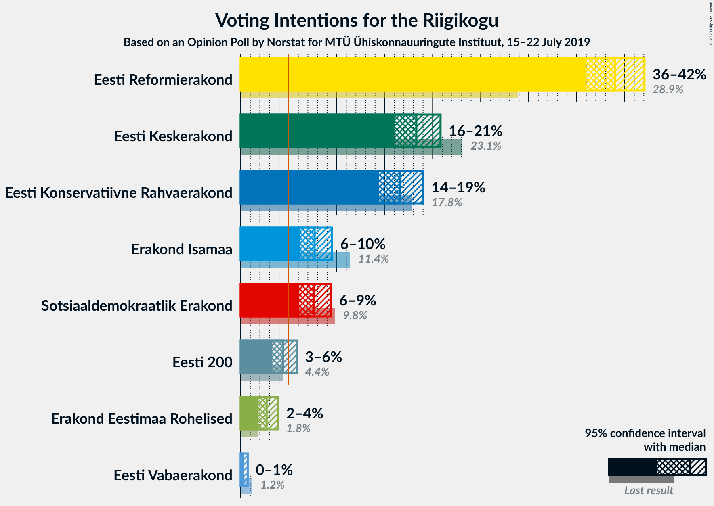

### Confidence Intervals

| Party | Last Result | Poll Result | 80% Confidence Interval | 90% Confidence Interval | 95% Confidence Interval | 99% Confidence Interval |
|:-----:|:-----------:|:-----------:|:-----------------------:|:-----------------------:|:-----------------------:|:-----------------------:|
| Eesti Reformierakond | 28.9% | 39.0% | 37.1–41.0% |36.5–41.6% |36.0–42.1% |35.1–43.0% |
| Eesti Keskerakond | 23.1% | 18.3% | 16.8–20.0% |16.4–20.4% |16.0–20.8% |15.3–21.6% |
| Eesti Konservatiivne Rahvaerakond | 17.8% | 16.6% | 15.2–18.2% |14.8–18.6% |14.4–19.0% |13.8–19.8% |
| Erakond Isamaa | 11.4% | 7.7% | 6.7–8.9% |6.4–9.2% |6.2–9.5% |5.8–10.1% |
| Sotsiaaldemokraatlik Erakond | 9.8% | 7.6% | 6.6–8.8% |6.3–9.1% |6.1–9.4% |5.7–10.0% |
| Eesti 200 | 4.4% | 4.4% | 3.7–5.3% |3.5–5.6% |3.3–5.9% |3.0–6.4% |
| Erakond Eestimaa Rohelised | 1.8% | 2.7% | 2.1–3.5% |2.0–3.7% |1.9–3.9% |1.6–4.3% |
| Eesti Vabaerakond | 1.2% | 0.2% | 0.1–0.5% |0.1–0.6% |0.1–0.7% |0.0–0.9% |

*Note:* The poll result column reflects the actual value used in the calculations. Published results may vary slightly, and in addition be rounded to fewer digits.

## Seats

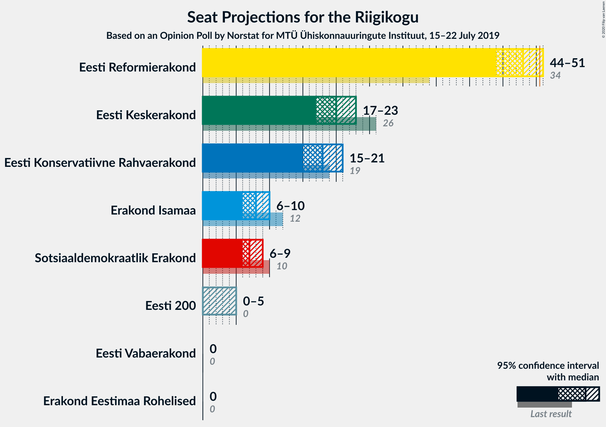

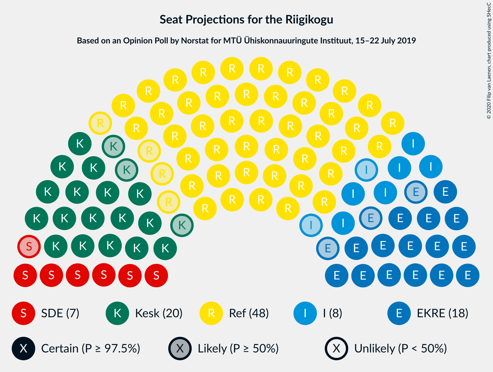

### Confidence Intervals

| Party | Last Result | Median | 80% Confidence Interval | 90% Confidence Interval | 95% Confidence Interval | 99% Confidence Interval |
|:-----:|:-----------:|:------:|:-----------------------:|:-----------------------:|:-----------------------:|:-----------------------:|
| <a href="#eesti-reformierakond">Eesti Reformierakond</a> | 34 | 48 | 45–51 |44–51 |44–51 |42–52 |
| <a href="#eesti-keskerakond">Eesti Keskerakond</a> | 26 | 20 | 18–21 |18–22 |17–23 |16–24 |
| <a href="#eesti-konservatiivne-rahvaerakond">Eesti Konservatiivne Rahvaerakond</a> | 19 | 18 | 16–20 |16–20 |15–21 |15–22 |
| <a href="#erakond-isamaa">Erakond Isamaa</a> | 12 | 8 | 6–9 |6–9 |6–10 |5–10 |
| <a href="#sotsiaaldemokraatlik-erakond">Sotsiaaldemokraatlik Erakond</a> | 10 | 7 | 6–8 |6–9 |6–9 |5–10 |
| <a href="#eesti-200">Eesti 200</a> | 0 | 0 | 0–4 |0–5 |0–5 |0–6 |
| <a href="#erakond-eestimaa-rohelised">Erakond Eestimaa Rohelised</a> | 0 | 0 | 0 |0 |0 |0 |
| <a href="#eesti-vabaerakond">Eesti Vabaerakond</a> | 0 | 0 | 0 |0 |0 |0 |

### Eesti Reformierakond

*For a full overview of the results for this party, see the [Eesti Reformierakond](party-eestireformierakond.html) page.*

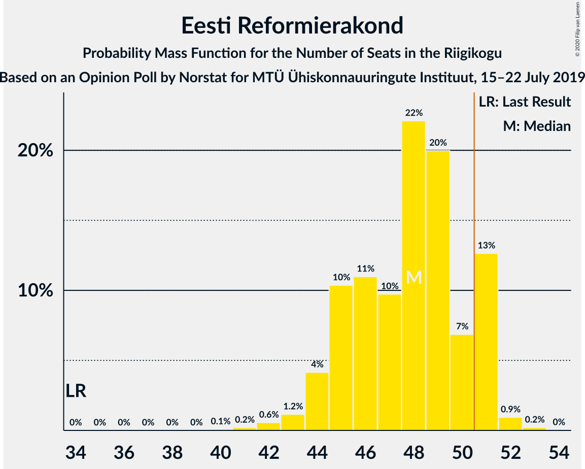

| Number of Seats | Probability | Accumulated | Special Marks |
|:---------------:|:-----------:|:-----------:|:-------------:|
| 34 | 0% | 100% | Last Result |
| 35 | 0% | 100% |  |
| 36 | 0% | 100% |  |
| 37 | 0% | 100% |  |
| 38 | 0% | 100% |  |
| 39 | 0% | 100% |  |
| 40 | 0.1% | 100% |  |
| 41 | 0.2% | 99.9% |  |
| 42 | 0.6% | 99.7% |  |
| 43 | 1.2% | 99.1% |  |
| 44 | 4% | 98% |  |
| 45 | 10% | 94% |  |
| 46 | 11% | 83% |  |
| 47 | 10% | 73% |  |
| 48 | 22% | 63% | Median |
| 49 | 20% | 41% |  |
| 50 | 7% | 21% |  |
| 51 | 13% | 14% | Majority |
| 52 | 0.9% | 1.2% |  |
| 53 | 0.2% | 0.2% |  |
| 54 | 0% | 0% |  |

### Eesti Keskerakond

*For a full overview of the results for this party, see the [Eesti Keskerakond](party-eestikeskerakond.html) page.*

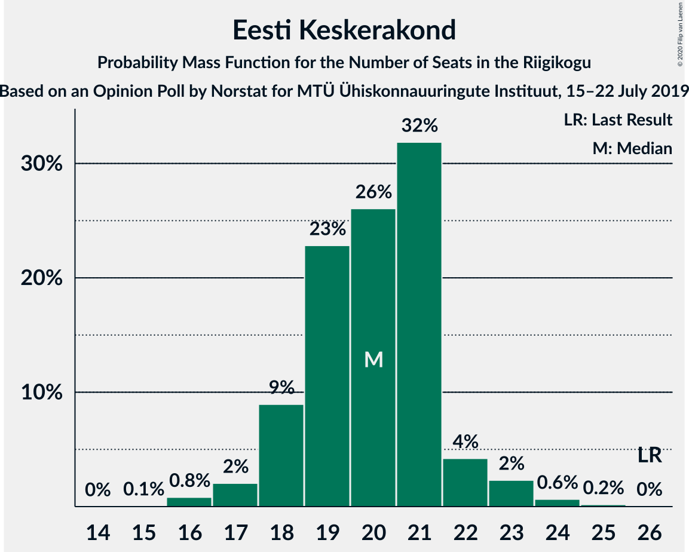

| Number of Seats | Probability | Accumulated | Special Marks |
|:---------------:|:-----------:|:-----------:|:-------------:|
| 15 | 0.1% | 100% |  |
| 16 | 0.8% | 99.9% |  |
| 17 | 2% | 99.1% |  |
| 18 | 9% | 97% |  |
| 19 | 23% | 88% |  |
| 20 | 26% | 65% | Median |
| 21 | 32% | 39% |  |
| 22 | 4% | 7% |  |
| 23 | 2% | 3% |  |
| 24 | 0.6% | 0.9% |  |
| 25 | 0.2% | 0.2% |  |
| 26 | 0% | 0% | Last Result |

### Eesti Konservatiivne Rahvaerakond

*For a full overview of the results for this party, see the [Eesti Konservatiivne Rahvaerakond](party-eestikonservatiivnerahvaerakond.html) page.*

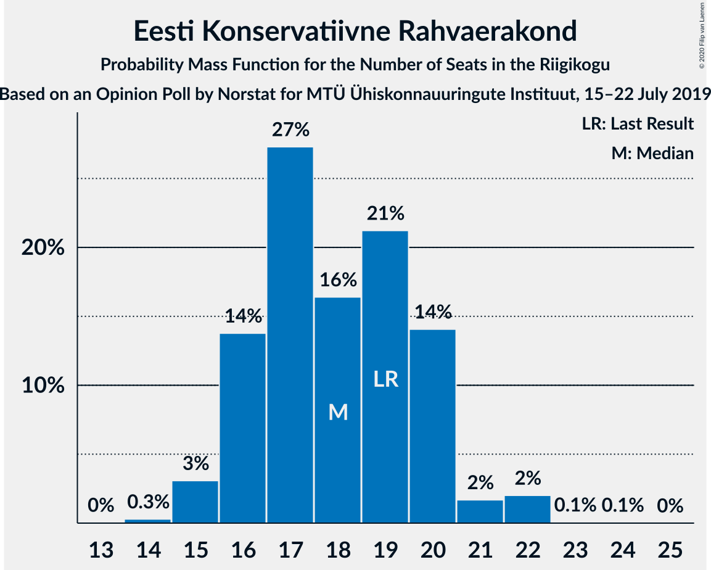

| Number of Seats | Probability | Accumulated | Special Marks |
|:---------------:|:-----------:|:-----------:|:-------------:|
| 14 | 0.3% | 100% |  |
| 15 | 3% | 99.7% |  |
| 16 | 14% | 97% |  |
| 17 | 27% | 83% |  |
| 18 | 16% | 56% | Median |
| 19 | 21% | 39% | Last Result |
| 20 | 14% | 18% |  |
| 21 | 2% | 4% |  |
| 22 | 2% | 2% |  |
| 23 | 0.1% | 0.1% |  |
| 24 | 0.1% | 0.1% |  |
| 25 | 0% | 0% |  |

### Erakond Isamaa

*For a full overview of the results for this party, see the [Erakond Isamaa](party-erakondisamaa.html) page.*

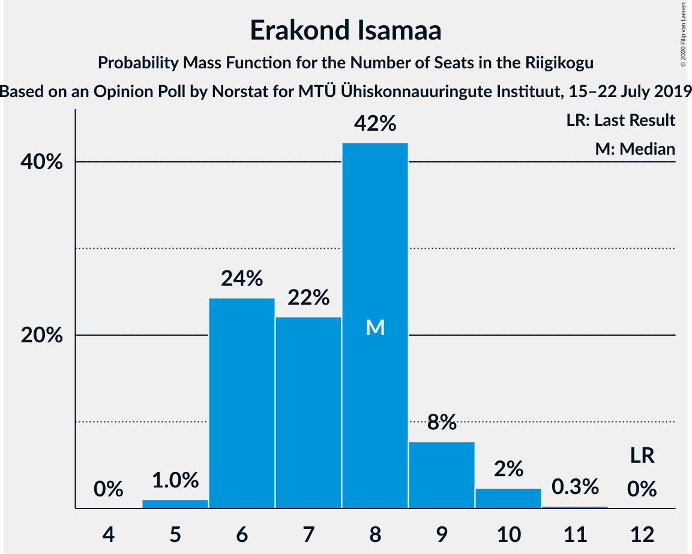

| Number of Seats | Probability | Accumulated | Special Marks |
|:---------------:|:-----------:|:-----------:|:-------------:|
| 5 | 1.0% | 100% |  |
| 6 | 24% | 99.0% |  |
| 7 | 22% | 75% |  |
| 8 | 42% | 53% | Median |
| 9 | 8% | 10% |  |
| 10 | 2% | 3% |  |
| 11 | 0.3% | 0.3% |  |
| 12 | 0% | 0% | Last Result |

### Sotsiaaldemokraatlik Erakond

*For a full overview of the results for this party, see the [Sotsiaaldemokraatlik Erakond](party-sotsiaaldemokraatlikerakond.html) page.*

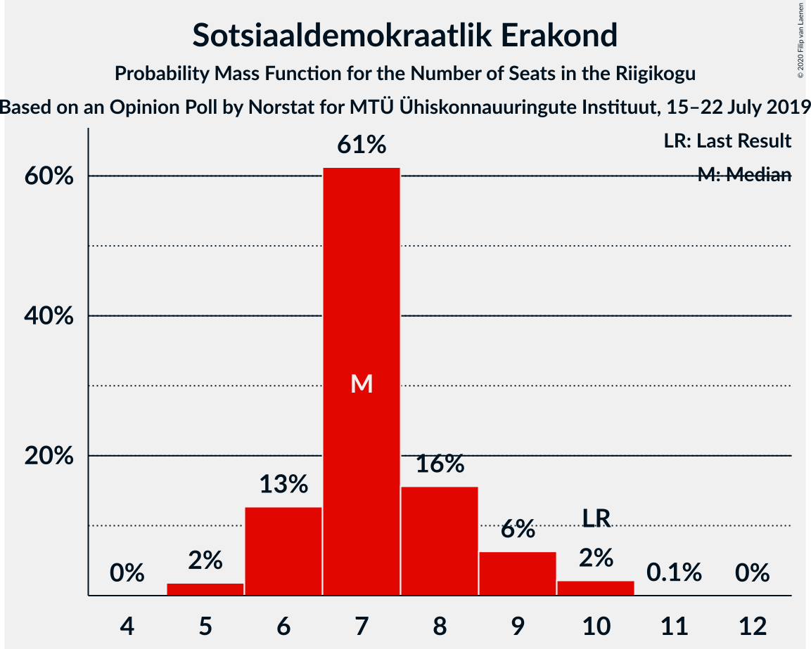

| Number of Seats | Probability | Accumulated | Special Marks |
|:---------------:|:-----------:|:-----------:|:-------------:|
| 5 | 2% | 100% |  |
| 6 | 13% | 98% |  |
| 7 | 61% | 85% | Median |
| 8 | 16% | 24% |  |
| 9 | 6% | 9% |  |
| 10 | 2% | 2% | Last Result |
| 11 | 0.1% | 0.1% |  |
| 12 | 0% | 0% |  |

### Eesti 200

*For a full overview of the results for this party, see the [Eesti 200](party-eesti200.html) page.*

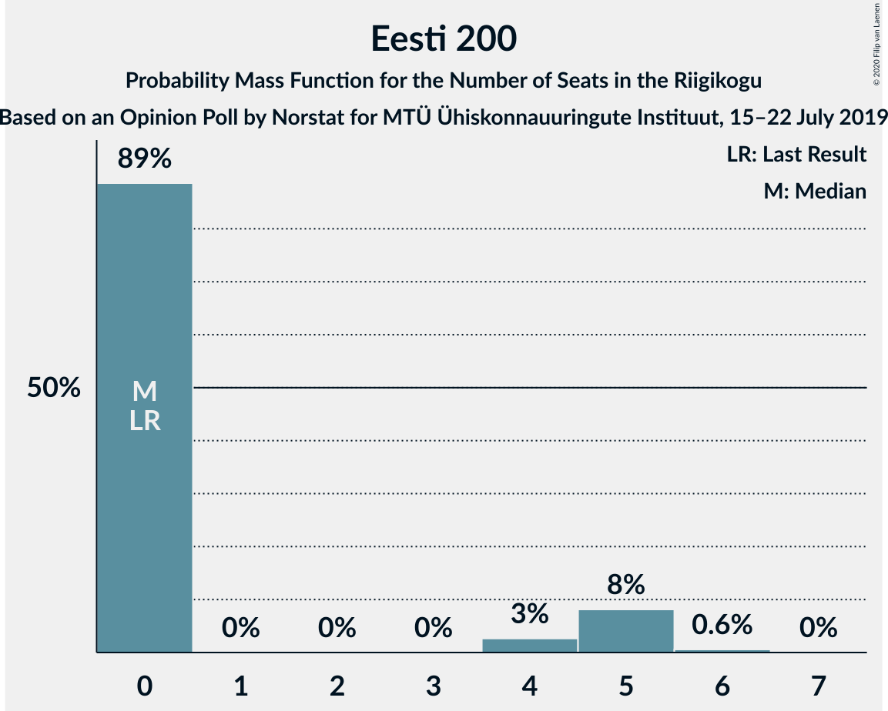

| Number of Seats | Probability | Accumulated | Special Marks |
|:---------------:|:-----------:|:-----------:|:-------------:|
| 0 | 89% | 100% | Last Result, Median |
| 1 | 0% | 11% |  |
| 2 | 0% | 11% |  |
| 3 | 0% | 11% |  |
| 4 | 3% | 11% |  |
| 5 | 8% | 9% |  |
| 6 | 0.6% | 0.6% |  |
| 7 | 0% | 0% |  |

### Erakond Eestimaa Rohelised

*For a full overview of the results for this party, see the [Erakond Eestimaa Rohelised](party-erakondeestimaarohelised.html) page.*

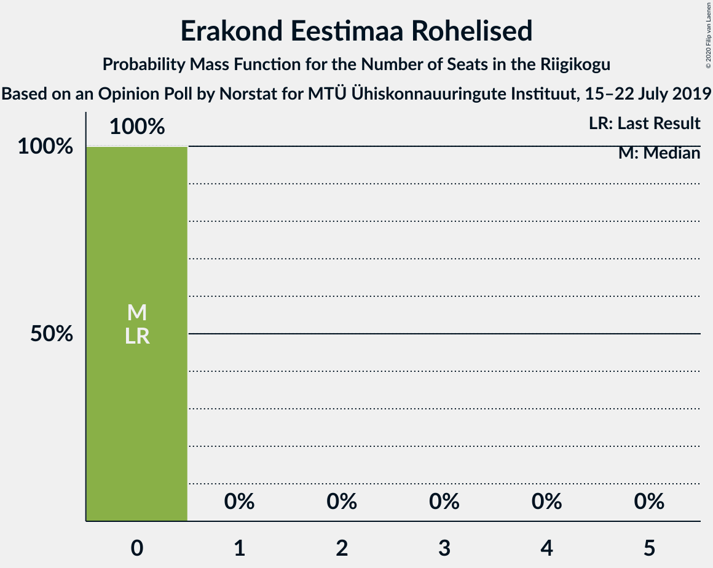

| Number of Seats | Probability | Accumulated | Special Marks |
|:---------------:|:-----------:|:-----------:|:-------------:|
| 0 | 100% | 100% | Last Result, Median |

### Eesti Vabaerakond

*For a full overview of the results for this party, see the [Eesti Vabaerakond](party-eestivabaerakond.html) page.*

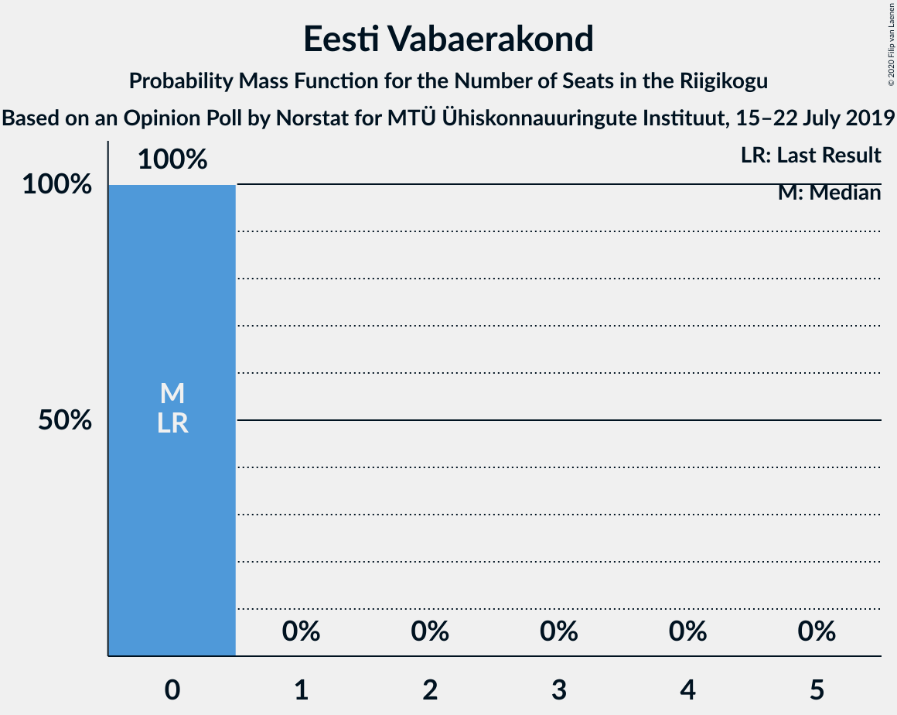

| Number of Seats | Probability | Accumulated | Special Marks |
|:---------------:|:-----------:|:-----------:|:-------------:|
| 0 | 100% | 100% | Last Result, Median |

## Coalitions

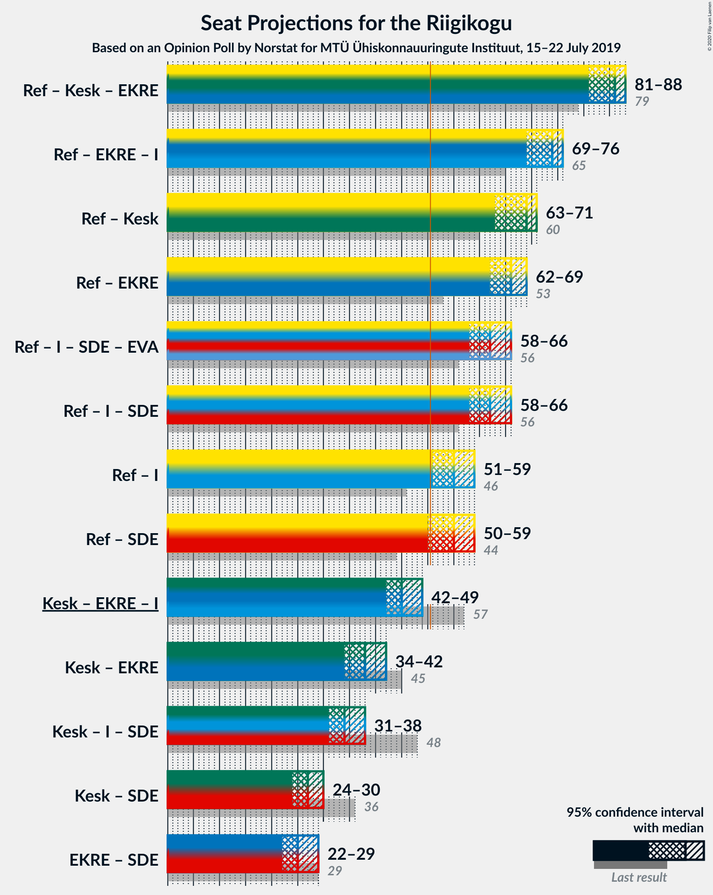

### Confidence Intervals

| Coalition | Last Result | Median | Majority? | 80% Confidence Interval | 90% Confidence Interval | 95% Confidence Interval | 99% Confidence Interval |
|:---------:|:-----------:|:------:|:---------:|:-----------------------:|:-----------------------:|:-----------------------:|:-----------------------:|
| Eesti Reformierakond – Eesti Keskerakond – Eesti Konservatiivne Rahvaerakond | 79 | 86 | 100% | 83–88 | 82–88 | 81–88 | 79–89 |
| Eesti Reformierakond – Eesti Konservatiivne Rahvaerakond – Erakond Isamaa | 65 | 74 | 100% | 71–75 | 69–75 | 69–76 | 67–77 |
| Eesti Reformierakond – Eesti Keskerakond | 60 | 69 | 100% | 65–70 | 64–71 | 63–71 | 62–72 |
| Eesti Reformierakond – Eesti Konservatiivne Rahvaerakond | 53 | 66 | 100% | 63–67 | 62–68 | 62–69 | 59–70 |
| Eesti Reformierakond – Erakond Isamaa – Sotsiaaldemokraatlik Erakond – Eesti Vabaerakond | 56 | 62 | 100% | 60–66 | 59–66 | 58–66 | 56–67 |
| Eesti Reformierakond – Erakond Isamaa – Sotsiaaldemokraatlik Erakond | 56 | 62 | 100% | 60–66 | 59–66 | 58–66 | 56–67 |
| Eesti Reformierakond – Erakond Isamaa | 46 | 55 | 98.6% | 52–59 | 52–59 | 51–59 | 49–59 |
| Eesti Reformierakond – Sotsiaaldemokraatlik Erakond | 44 | 55 | 97% | 53–58 | 51–58 | 50–59 | 49–59 |
| Eesti Keskerakond – Eesti Konservatiivne Rahvaerakond – Erakond Isamaa | 57 | 45 | 1.1% | 43–48 | 42–48 | 42–49 | 40–51 |
| Eesti Keskerakond – Eesti Konservatiivne Rahvaerakond | 45 | 38 | 0% | 35–41 | 34–41 | 34–42 | 33–43 |
| Eesti Keskerakond – Erakond Isamaa – Sotsiaaldemokraatlik Erakond | 48 | 34 | 0% | 33–37 | 32–38 | 31–38 | 30–39 |
| Eesti Keskerakond – Sotsiaaldemokraatlik Erakond | 36 | 27 | 0% | 26–29 | 25–30 | 24–30 | 23–32 |
| Eesti Konservatiivne Rahvaerakond – Sotsiaaldemokraatlik Erakond | 29 | 25 | 0% | 23–27 | 23–28 | 22–29 | 21–30 |

### Eesti Reformierakond – Eesti Keskerakond – Eesti Konservatiivne Rahvaerakond

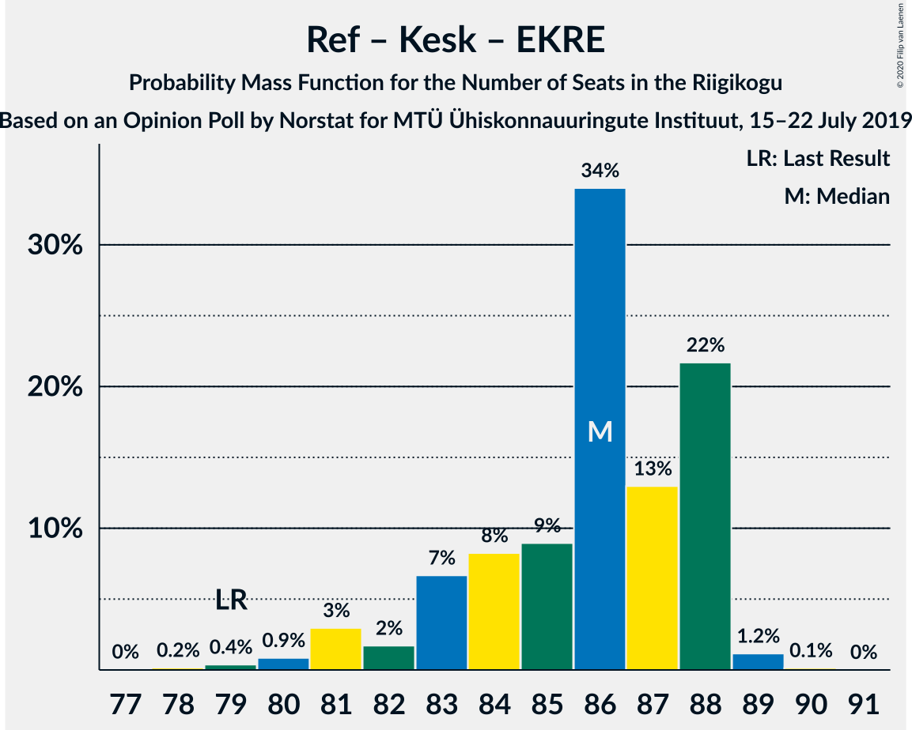

| Number of Seats | Probability | Accumulated | Special Marks |
|:---------------:|:-----------:|:-----------:|:-------------:|
| 78 | 0.2% | 100% |  |
| 79 | 0.4% | 99.8% | Last Result |
| 80 | 0.9% | 99.4% |  |
| 81 | 3% | 98.6% |  |
| 82 | 2% | 96% |  |
| 83 | 7% | 94% |  |
| 84 | 8% | 87% |  |
| 85 | 9% | 79% |  |
| 86 | 34% | 70% | Median |
| 87 | 13% | 36% |  |
| 88 | 22% | 23% |  |
| 89 | 1.2% | 1.3% |  |
| 90 | 0.1% | 0.2% |  |
| 91 | 0% | 0% |  |

### Eesti Reformierakond – Eesti Konservatiivne Rahvaerakond – Erakond Isamaa

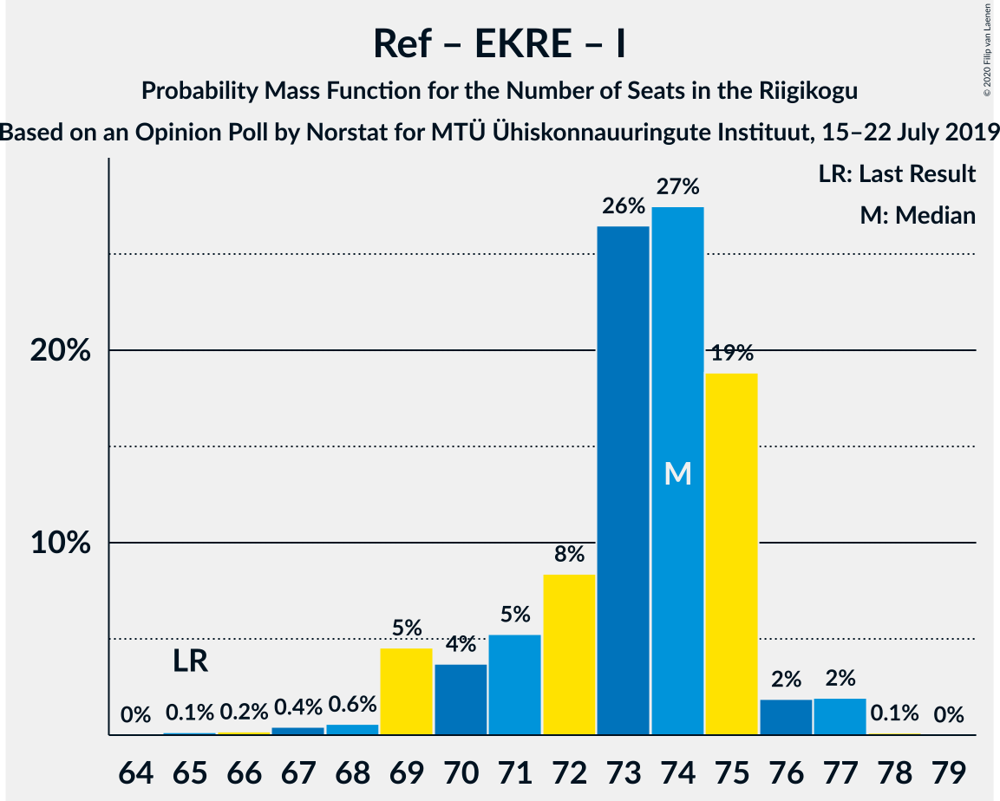

| Number of Seats | Probability | Accumulated | Special Marks |
|:---------------:|:-----------:|:-----------:|:-------------:|
| 65 | 0.1% | 100% | Last Result |
| 66 | 0.2% | 99.8% |  |
| 67 | 0.4% | 99.6% |  |
| 68 | 0.6% | 99.2% |  |
| 69 | 5% | 98.6% |  |
| 70 | 4% | 94% |  |
| 71 | 5% | 90% |  |
| 72 | 8% | 85% |  |
| 73 | 26% | 77% |  |
| 74 | 27% | 50% | Median |
| 75 | 19% | 23% |  |
| 76 | 2% | 4% |  |
| 77 | 2% | 2% |  |
| 78 | 0.1% | 0.2% |  |
| 79 | 0% | 0% |  |

### Eesti Reformierakond – Eesti Keskerakond

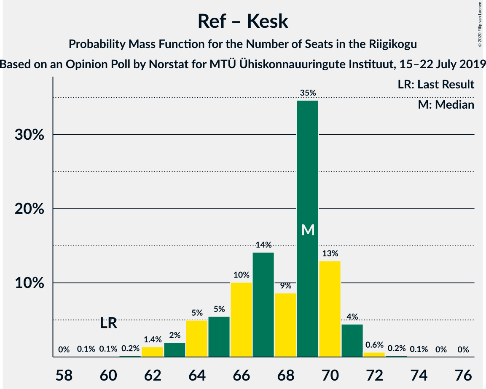

| Number of Seats | Probability | Accumulated | Special Marks |
|:---------------:|:-----------:|:-----------:|:-------------:|
| 59 | 0.1% | 100% |  |
| 60 | 0.1% | 99.9% | Last Result |
| 61 | 0.2% | 99.8% |  |
| 62 | 1.4% | 99.6% |  |
| 63 | 2% | 98% |  |
| 64 | 5% | 96% |  |
| 65 | 5% | 91% |  |
| 66 | 10% | 86% |  |
| 67 | 14% | 76% |  |
| 68 | 9% | 62% | Median |
| 69 | 35% | 53% |  |
| 70 | 13% | 18% |  |
| 71 | 4% | 5% |  |
| 72 | 0.6% | 0.9% |  |
| 73 | 0.2% | 0.3% |  |
| 74 | 0.1% | 0.1% |  |
| 75 | 0% | 0% |  |

### Eesti Reformierakond – Eesti Konservatiivne Rahvaerakond

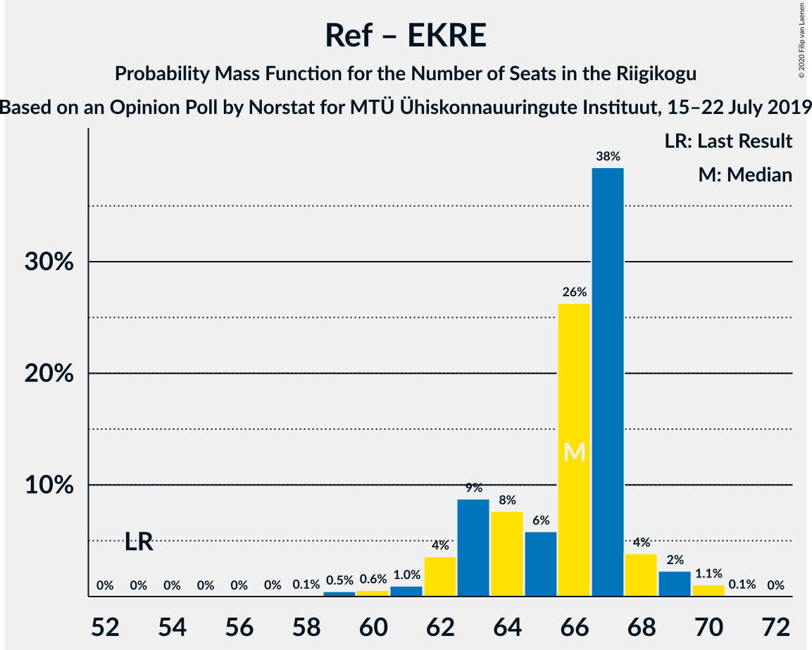

| Number of Seats | Probability | Accumulated | Special Marks |
|:---------------:|:-----------:|:-----------:|:-------------:|
| 53 | 0% | 100% | Last Result |
| 54 | 0% | 100% |  |
| 55 | 0% | 100% |  |
| 56 | 0% | 100% |  |
| 57 | 0% | 100% |  |
| 58 | 0.1% | 100% |  |
| 59 | 0.5% | 99.9% |  |
| 60 | 0.6% | 99.4% |  |
| 61 | 1.0% | 98.8% |  |
| 62 | 4% | 98% |  |
| 63 | 9% | 94% |  |
| 64 | 8% | 86% |  |
| 65 | 6% | 78% |  |
| 66 | 26% | 72% | Median |
| 67 | 38% | 46% |  |
| 68 | 4% | 7% |  |
| 69 | 2% | 3% |  |
| 70 | 1.1% | 1.2% |  |
| 71 | 0.1% | 0.1% |  |
| 72 | 0% | 0% |  |

### Eesti Reformierakond – Erakond Isamaa – Sotsiaaldemokraatlik Erakond – Eesti Vabaerakond

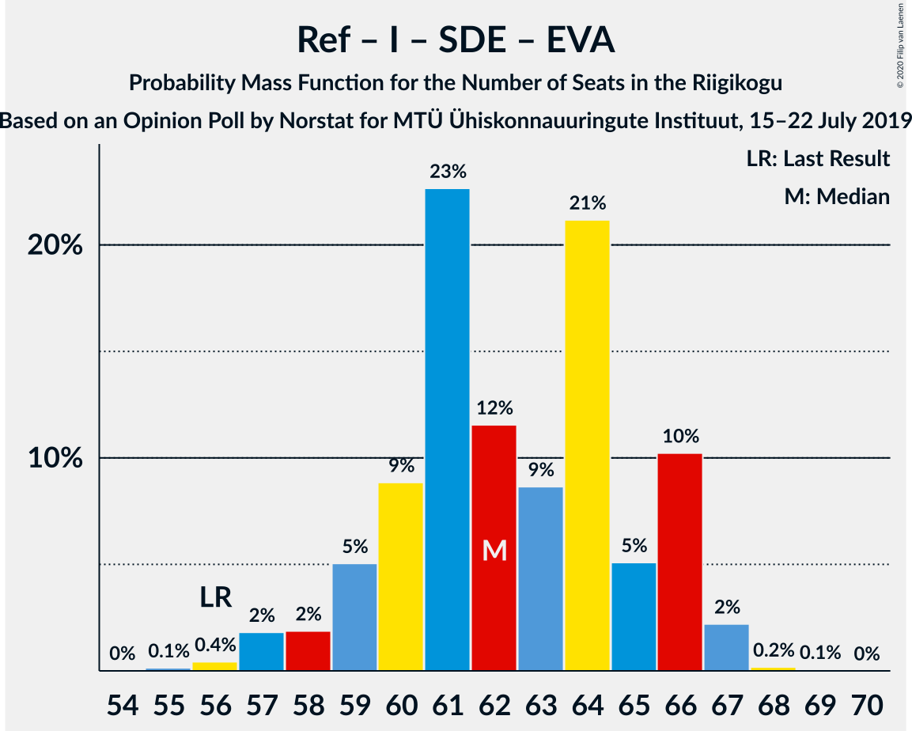

| Number of Seats | Probability | Accumulated | Special Marks |
|:---------------:|:-----------:|:-----------:|:-------------:|
| 55 | 0.1% | 100% |  |
| 56 | 0.4% | 99.8% | Last Result |
| 57 | 2% | 99.4% |  |
| 58 | 2% | 98% |  |
| 59 | 5% | 96% |  |
| 60 | 9% | 91% |  |
| 61 | 23% | 82% |  |
| 62 | 12% | 59% |  |
| 63 | 9% | 48% | Median |
| 64 | 21% | 39% |  |
| 65 | 5% | 18% |  |
| 66 | 10% | 13% |  |
| 67 | 2% | 2% |  |
| 68 | 0.2% | 0.3% |  |
| 69 | 0.1% | 0.1% |  |
| 70 | 0% | 0% |  |

### Eesti Reformierakond – Erakond Isamaa – Sotsiaaldemokraatlik Erakond

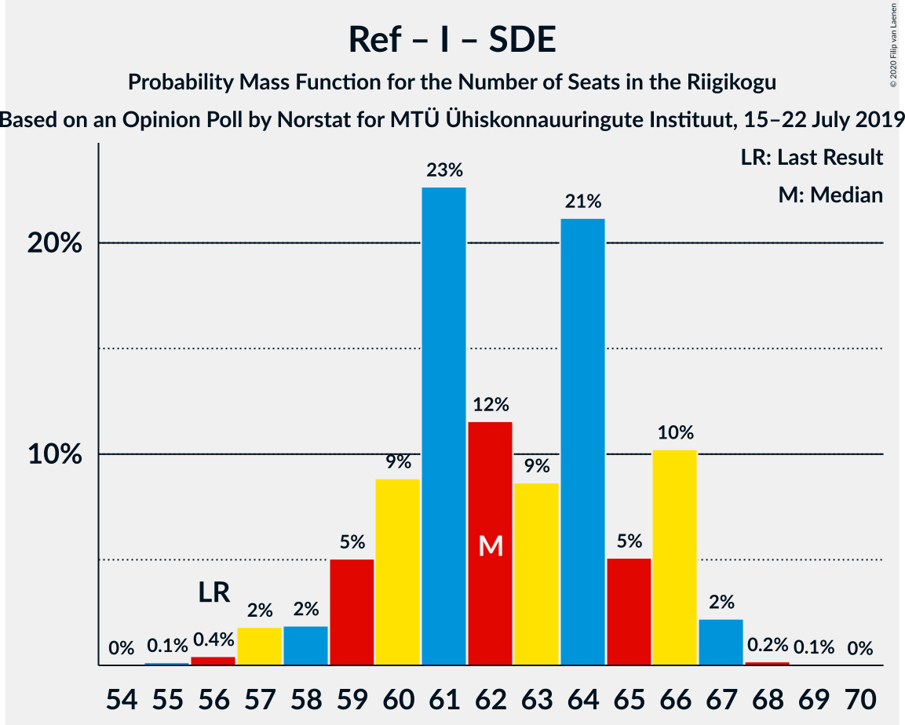

| Number of Seats | Probability | Accumulated | Special Marks |
|:---------------:|:-----------:|:-----------:|:-------------:|
| 55 | 0.1% | 100% |  |
| 56 | 0.4% | 99.8% | Last Result |
| 57 | 2% | 99.4% |  |
| 58 | 2% | 98% |  |
| 59 | 5% | 96% |  |
| 60 | 9% | 91% |  |
| 61 | 23% | 82% |  |
| 62 | 12% | 59% |  |
| 63 | 9% | 48% | Median |
| 64 | 21% | 39% |  |
| 65 | 5% | 18% |  |
| 66 | 10% | 13% |  |
| 67 | 2% | 2% |  |
| 68 | 0.2% | 0.3% |  |
| 69 | 0.1% | 0.1% |  |
| 70 | 0% | 0% |  |

### Eesti Reformierakond – Erakond Isamaa

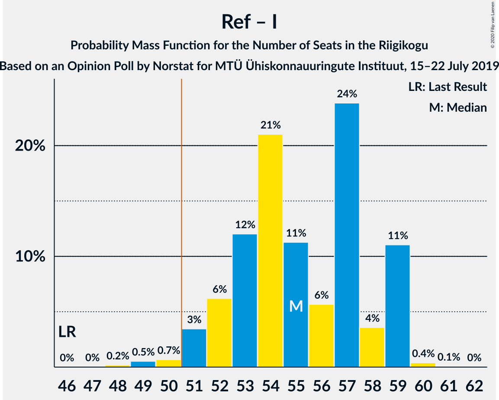

| Number of Seats | Probability | Accumulated | Special Marks |
|:---------------:|:-----------:|:-----------:|:-------------:|
| 46 | 0% | 100% | Last Result |
| 47 | 0% | 100% |  |
| 48 | 0.2% | 100% |  |
| 49 | 0.5% | 99.8% |  |
| 50 | 0.7% | 99.3% |  |
| 51 | 3% | 98.6% | Majority |
| 52 | 6% | 95% |  |
| 53 | 12% | 89% |  |
| 54 | 21% | 77% |  |
| 55 | 11% | 56% |  |
| 56 | 6% | 45% | Median |
| 57 | 24% | 39% |  |
| 58 | 4% | 15% |  |
| 59 | 11% | 12% |  |
| 60 | 0.4% | 0.5% |  |
| 61 | 0.1% | 0.1% |  |
| 62 | 0% | 0% |  |

### Eesti Reformierakond – Sotsiaaldemokraatlik Erakond

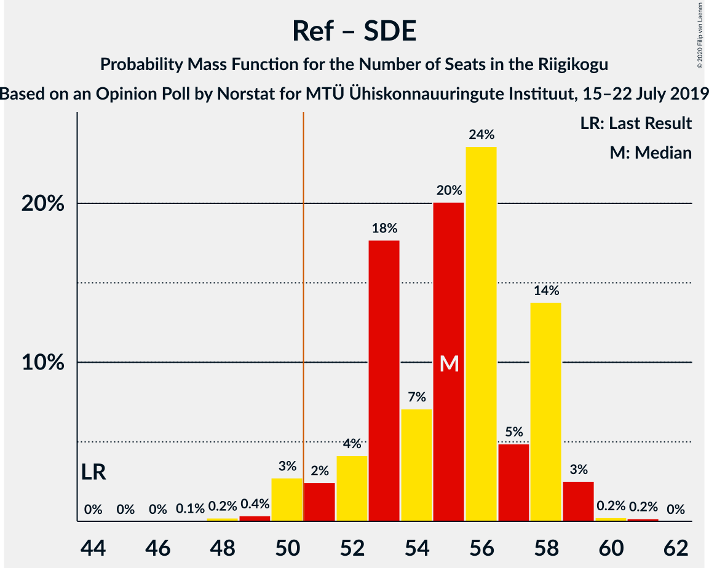

| Number of Seats | Probability | Accumulated | Special Marks |
|:---------------:|:-----------:|:-----------:|:-------------:|
| 44 | 0% | 100% | Last Result |
| 45 | 0% | 100% |  |
| 46 | 0% | 100% |  |
| 47 | 0.1% | 100% |  |
| 48 | 0.2% | 99.9% |  |
| 49 | 0.4% | 99.7% |  |
| 50 | 3% | 99.4% |  |
| 51 | 2% | 97% | Majority |
| 52 | 4% | 94% |  |
| 53 | 18% | 90% |  |
| 54 | 7% | 72% |  |
| 55 | 20% | 65% | Median |
| 56 | 24% | 45% |  |
| 57 | 5% | 22% |  |
| 58 | 14% | 17% |  |
| 59 | 3% | 3% |  |
| 60 | 0.2% | 0.4% |  |
| 61 | 0.2% | 0.2% |  |
| 62 | 0% | 0% |  |

### Eesti Keskerakond – Eesti Konservatiivne Rahvaerakond – Erakond Isamaa

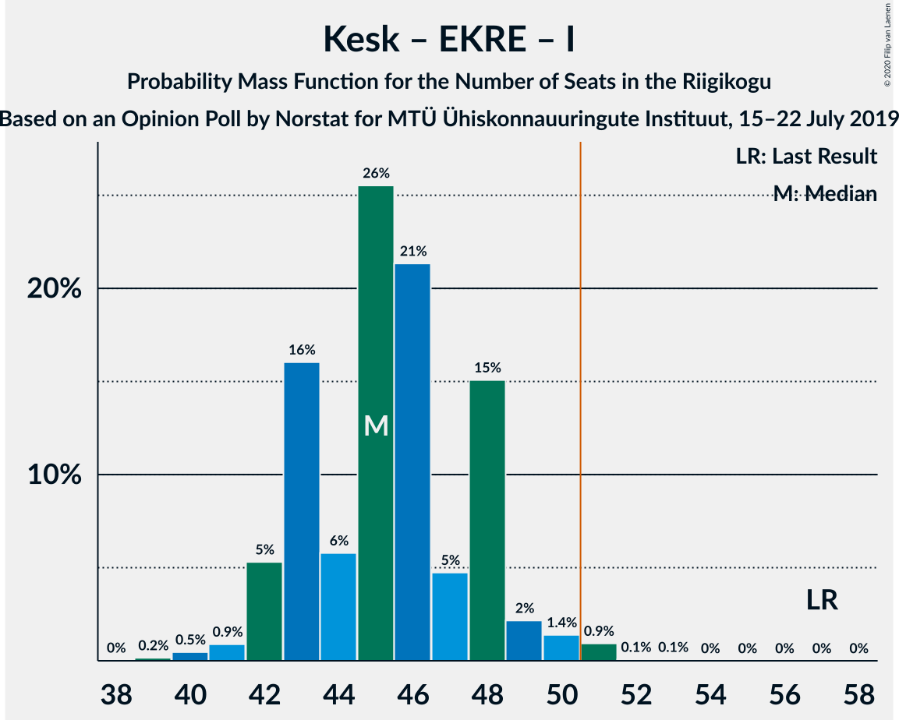

| Number of Seats | Probability | Accumulated | Special Marks |
|:---------------:|:-----------:|:-----------:|:-------------:|
| 39 | 0.2% | 100% |  |
| 40 | 0.5% | 99.8% |  |
| 41 | 0.9% | 99.3% |  |
| 42 | 5% | 98% |  |
| 43 | 16% | 93% |  |
| 44 | 6% | 77% |  |
| 45 | 26% | 71% |  |
| 46 | 21% | 46% | Median |
| 47 | 5% | 24% |  |
| 48 | 15% | 20% |  |
| 49 | 2% | 5% |  |
| 50 | 1.4% | 2% |  |
| 51 | 0.9% | 1.1% | Majority |
| 52 | 0.1% | 0.1% |  |
| 53 | 0.1% | 0.1% |  |
| 54 | 0% | 0% |  |
| 55 | 0% | 0% |  |
| 56 | 0% | 0% |  |
| 57 | 0% | 0% | Last Result |

### Eesti Keskerakond – Eesti Konservatiivne Rahvaerakond

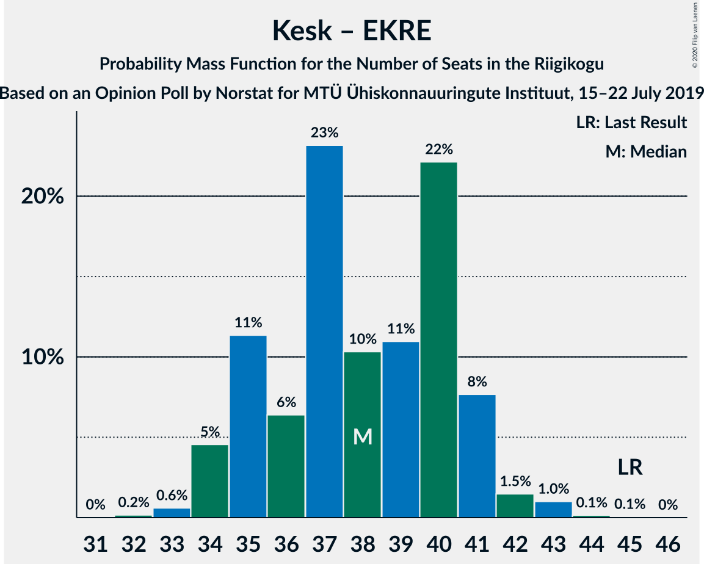

| Number of Seats | Probability | Accumulated | Special Marks |
|:---------------:|:-----------:|:-----------:|:-------------:|
| 32 | 0.2% | 100% |  |
| 33 | 0.6% | 99.8% |  |
| 34 | 5% | 99.2% |  |
| 35 | 11% | 95% |  |
| 36 | 6% | 83% |  |
| 37 | 23% | 77% |  |
| 38 | 10% | 54% | Median |
| 39 | 11% | 43% |  |
| 40 | 22% | 32% |  |
| 41 | 8% | 10% |  |
| 42 | 1.5% | 3% |  |
| 43 | 1.0% | 1.2% |  |
| 44 | 0.1% | 0.2% |  |
| 45 | 0.1% | 0.1% | Last Result |
| 46 | 0% | 0% |  |

### Eesti Keskerakond – Erakond Isamaa – Sotsiaaldemokraatlik Erakond

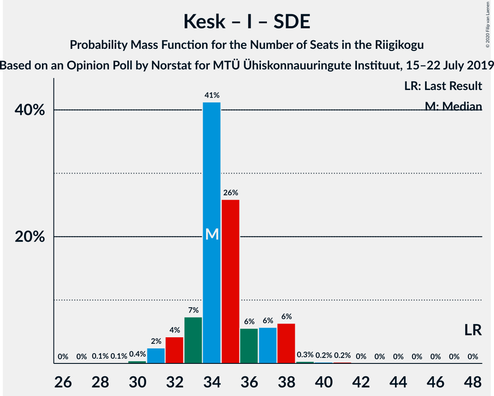

| Number of Seats | Probability | Accumulated | Special Marks |
|:---------------:|:-----------:|:-----------:|:-------------:|
| 28 | 0.1% | 100% |  |
| 29 | 0.1% | 99.9% |  |
| 30 | 0.4% | 99.8% |  |
| 31 | 2% | 99.4% |  |
| 32 | 4% | 97% |  |
| 33 | 7% | 93% |  |
| 34 | 41% | 85% |  |
| 35 | 26% | 44% | Median |
| 36 | 6% | 18% |  |
| 37 | 6% | 13% |  |
| 38 | 6% | 7% |  |
| 39 | 0.3% | 0.8% |  |
| 40 | 0.2% | 0.5% |  |
| 41 | 0.2% | 0.3% |  |
| 42 | 0% | 0% |  |
| 43 | 0% | 0% |  |
| 44 | 0% | 0% |  |
| 45 | 0% | 0% |  |
| 46 | 0% | 0% |  |
| 47 | 0% | 0% |  |
| 48 | 0% | 0% | Last Result |

### Eesti Keskerakond – Sotsiaaldemokraatlik Erakond

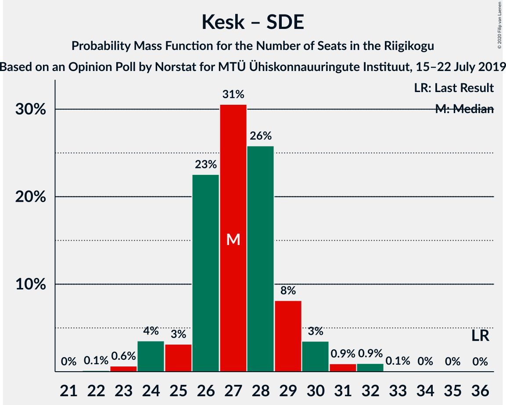

| Number of Seats | Probability | Accumulated | Special Marks |
|:---------------:|:-----------:|:-----------:|:-------------:|
| 22 | 0.1% | 100% |  |
| 23 | 0.6% | 99.8% |  |
| 24 | 4% | 99.2% |  |
| 25 | 3% | 96% |  |
| 26 | 23% | 93% |  |
| 27 | 31% | 70% | Median |
| 28 | 26% | 39% |  |
| 29 | 8% | 14% |  |
| 30 | 3% | 5% |  |
| 31 | 0.9% | 2% |  |
| 32 | 0.9% | 1.1% |  |
| 33 | 0.1% | 0.2% |  |
| 34 | 0% | 0.1% |  |
| 35 | 0% | 0% |  |
| 36 | 0% | 0% | Last Result |

### Eesti Konservatiivne Rahvaerakond – Sotsiaaldemokraatlik Erakond

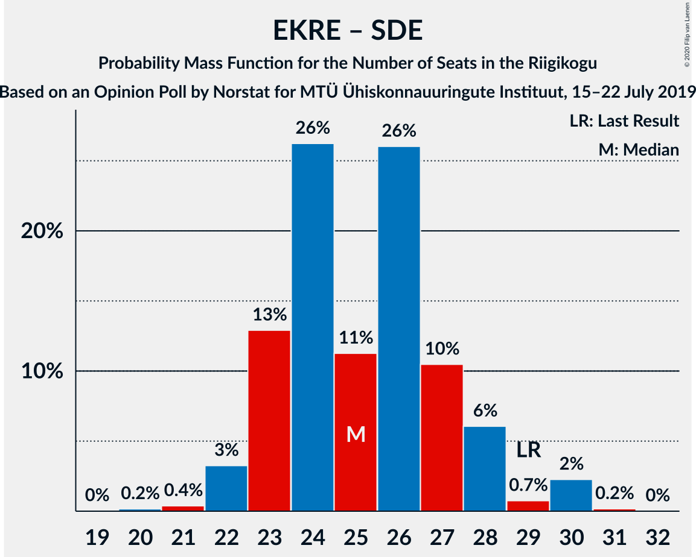

| Number of Seats | Probability | Accumulated | Special Marks |
|:---------------:|:-----------:|:-----------:|:-------------:|
| 20 | 0.2% | 100% |  |
| 21 | 0.4% | 99.8% |  |
| 22 | 3% | 99.4% |  |
| 23 | 13% | 96% |  |
| 24 | 26% | 83% |  |
| 25 | 11% | 57% | Median |
| 26 | 26% | 46% |  |
| 27 | 10% | 20% |  |
| 28 | 6% | 9% |  |
| 29 | 0.7% | 3% | Last Result |
| 30 | 2% | 2% |  |
| 31 | 0.2% | 0.2% |  |
| 32 | 0% | 0% |  |

## Technical Information

### Opinion Poll

+ **Polling firm:** Norstat
+ **Commissioner(s):** MTÜ Ühiskonnauuringute Instituut
+ **Fieldwork period:** 15–22 July 2019

### Calculations

+ **Sample size:** 1000
+ **Simulations done:** 131,072
+ **Error estimate:** 1.75%

