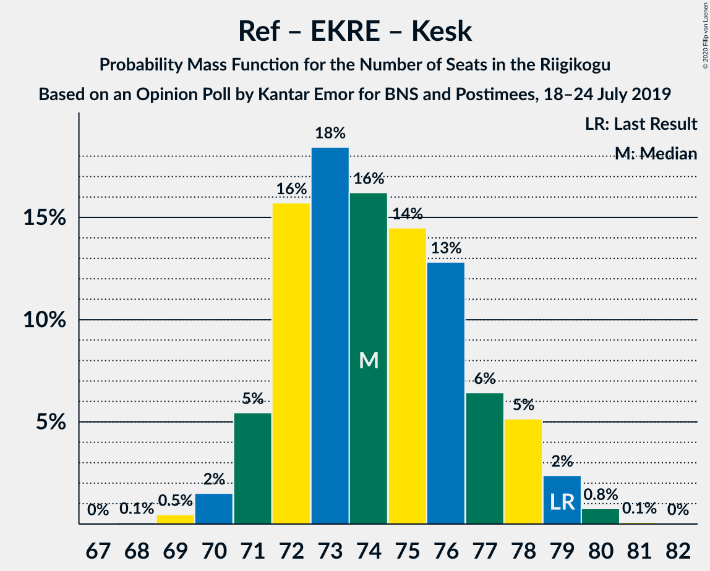

# Opinion Poll by Kantar Emor for BNS and Postimees, 18–24 July 2019

<a href="#voting-intentions">Voting Intentions</a> | <a href="#seats">Seats</a> | <a href="#coalitions">Coalitions</a> | <a href="#technical-information">Technical Information</a>

## Voting Intentions

### Confidence Intervals

| Party | Last Result | Poll Result | 80% Confidence Interval | 90% Confidence Interval | 95% Confidence Interval | 99% Confidence Interval |
|:-----:|:-----------:|:-----------:|:-----------------------:|:-----------------------:|:-----------------------:|:-----------------------:|
| Eesti Reformierakond | 28.9% | 34.5% | 32.8–36.2% |32.4–36.7% |31.9–37.1% |31.2–37.9% |
| Eesti Konservatiivne Rahvaerakond | 17.8% | 19.4% | 18.0–20.9% |17.6–21.3% |17.3–21.6% |16.7–22.3% |
| Eesti Keskerakond | 23.1% | 15.3% | 14.1–16.7% |13.8–17.1% |13.5–17.4% |12.9–18.0% |
| Sotsiaaldemokraatlik Erakond | 9.8% | 10.8% | 9.8–12.0% |9.5–12.3% |9.2–12.6% |8.8–13.2% |
| Eesti 200 | 4.4% | 7.9% | 7.0–8.9% |6.8–9.2% |6.6–9.5% |6.1–10.0% |
| Erakond Isamaa | 11.4% | 6.8% | 6.0–7.8% |5.8–8.1% |5.6–8.3% |5.2–8.8% |

*Note:* The poll result column reflects the actual value used in the calculations. Published results may vary slightly, and in addition be rounded to fewer digits.

## Seats

### Confidence Intervals

| Party | Last Result | Median | 80% Confidence Interval | 90% Confidence Interval | 95% Confidence Interval | 99% Confidence Interval |
|:-----:|:-----------:|:------:|:-----------------------:|:-----------------------:|:-----------------------:|:-----------------------:|
| <a href="#eesti-reformierakond">Eesti Reformierakond</a> | 34 | 39 | 36–41 |36–42 |35–42 |34–43 |
| <a href="#eesti-konservatiivne-rahvaerakond">Eesti Konservatiivne Rahvaerakond</a> | 19 | 20 | 18–22 |18–22 |18–23 |17–24 |
| <a href="#eesti-keskerakond">Eesti Keskerakond</a> | 26 | 15 | 14–17 |14–17 |13–18 |13–19 |
| <a href="#sotsiaaldemokraatlik-erakond">Sotsiaaldemokraatlik Erakond</a> | 10 | 10 | 9–12 |9–12 |9–12 |8–13 |
| <a href="#eesti-200">Eesti 200</a> | 0 | 7 | 6–8 |6–9 |6–9 |5–9 |
| <a href="#erakond-isamaa">Erakond Isamaa</a> | 12 | 6 | 5–7 |5–7 |5–8 |4–8 |

### Eesti Reformierakond

*For a full overview of the results for this party, see the [Eesti Reformierakond](party-eestireformierakond.html) page.*

| Number of Seats | Probability | Accumulated | Special Marks |
|:---------------:|:-----------:|:-----------:|:-------------:|
| 33 | 0.1% | 100% |  |
| 34 | 0.7% | 99.9% | Last Result |
| 35 | 2% | 99.2% |  |
| 36 | 8% | 97% |  |
| 37 | 14% | 88% |  |
| 38 | 21% | 75% |  |
| 39 | 22% | 54% | Median |
| 40 | 17% | 33% |  |
| 41 | 8% | 15% |  |
| 42 | 5% | 7% |  |
| 43 | 2% | 2% |  |
| 44 | 0.3% | 0.3% |  |
| 45 | 0.1% | 0.1% |  |
| 46 | 0% | 0% |  |

### Eesti Konservatiivne Rahvaerakond

*For a full overview of the results for this party, see the [Eesti Konservatiivne Rahvaerakond](party-eestikonservatiivnerahvaerakond.html) page.*

| Number of Seats | Probability | Accumulated | Special Marks |
|:---------------:|:-----------:|:-----------:|:-------------:|
| 16 | 0.2% | 100% |  |
| 17 | 2% | 99.8% |  |
| 18 | 8% | 98% |  |
| 19 | 22% | 89% | Last Result |
| 20 | 28% | 67% | Median |
| 21 | 25% | 39% |  |
| 22 | 10% | 14% |  |
| 23 | 4% | 5% |  |
| 24 | 0.8% | 0.9% |  |
| 25 | 0.1% | 0.1% |  |
| 26 | 0% | 0% |  |

### Eesti Keskerakond

*For a full overview of the results for this party, see the [Eesti Keskerakond](party-eestikeskerakond.html) page.*

| Number of Seats | Probability | Accumulated | Special Marks |
|:---------------:|:-----------:|:-----------:|:-------------:|
| 12 | 0.4% | 100% |  |
| 13 | 4% | 99.6% |  |
| 14 | 18% | 95% |  |
| 15 | 32% | 78% | Median |
| 16 | 30% | 45% |  |
| 17 | 10% | 15% |  |
| 18 | 4% | 5% |  |
| 19 | 0.5% | 0.6% |  |
| 20 | 0.1% | 0.1% |  |
| 21 | 0% | 0% |  |
| 22 | 0% | 0% |  |
| 23 | 0% | 0% |  |
| 24 | 0% | 0% |  |
| 25 | 0% | 0% |  |
| 26 | 0% | 0% | Last Result |

### Sotsiaaldemokraatlik Erakond

*For a full overview of the results for this party, see the [Sotsiaaldemokraatlik Erakond](party-sotsiaaldemokraatlikerakond.html) page.*

| Number of Seats | Probability | Accumulated | Special Marks |
|:---------------:|:-----------:|:-----------:|:-------------:|
| 7 | 0.1% | 100% |  |
| 8 | 2% | 99.9% |  |
| 9 | 20% | 98% |  |
| 10 | 35% | 78% | Last Result, Median |
| 11 | 30% | 44% |  |
| 12 | 12% | 14% |  |
| 13 | 2% | 2% |  |
| 14 | 0.2% | 0.2% |  |
| 15 | 0% | 0% |  |

### Eesti 200

*For a full overview of the results for this party, see the [Eesti 200](party-eesti200.html) page.*

| Number of Seats | Probability | Accumulated | Special Marks |
|:---------------:|:-----------:|:-----------:|:-------------:|
| 0 | 0% | 100% | Last Result |
| 1 | 0% | 100% |  |
| 2 | 0% | 100% |  |
| 3 | 0% | 100% |  |
| 4 | 0% | 100% |  |
| 5 | 0.6% | 100% |  |
| 6 | 24% | 99.4% |  |
| 7 | 40% | 76% | Median |
| 8 | 28% | 36% |  |
| 9 | 8% | 8% |  |
| 10 | 0.2% | 0.2% |  |
| 11 | 0% | 0% |  |

### Erakond Isamaa

*For a full overview of the results for this party, see the [Erakond Isamaa](party-erakondisamaa.html) page.*

| Number of Seats | Probability | Accumulated | Special Marks |
|:---------------:|:-----------:|:-----------:|:-------------:|
| 0 | 0.2% | 100% |  |
| 1 | 0% | 99.8% |  |
| 2 | 0% | 99.8% |  |
| 3 | 0% | 99.8% |  |
| 4 | 0.9% | 99.8% |  |
| 5 | 29% | 98.9% |  |
| 6 | 40% | 70% | Median |
| 7 | 27% | 30% |  |
| 8 | 3% | 3% |  |
| 9 | 0.2% | 0.2% |  |
| 10 | 0% | 0% |  |
| 11 | 0% | 0% |  |
| 12 | 0% | 0% | Last Result |

## Coalitions

### Confidence Intervals

| Coalition | Last Result | Median | Majority? | 80% Confidence Interval | 90% Confidence Interval | 95% Confidence Interval | 99% Confidence Interval |
|:---------:|:-----------:|:------:|:---------:|:-----------------------:|:-----------------------:|:-----------------------:|:-----------------------:|
| Eesti Reformierakond – Eesti Konservatiivne Rahvaerakond – Eesti Keskerakond | 79 | 74 | 100% | 72–77 | 71–78 | 71–79 | 69–80 |
| Eesti Reformierakond – Eesti Konservatiivne Rahvaerakond – Erakond Isamaa | 65 | 65 | 100% | 62–68 | 62–69 | 61–69 | 60–70 |
| Eesti Reformierakond – Eesti Konservatiivne Rahvaerakond | 53 | 59 | 100% | 56–62 | 56–62 | 55–63 | 54–64 |
| Eesti Reformierakond – Sotsiaaldemokraatlik Erakond – Erakond Isamaa | 56 | 55 | 99.1% | 52–58 | 52–58 | 51–59 | 50–60 |
| Eesti Reformierakond – Eesti Keskerakond | 60 | 54 | 97% | 52–57 | 51–58 | 50–58 | 49–59 |
| Eesti Reformierakond – Sotsiaaldemokraatlik Erakond | 44 | 49 | 23% | 47–52 | 46–52 | 45–53 | 44–54 |
| Eesti Reformierakond – Erakond Isamaa | 46 | 45 | 0.1% | 42–47 | 42–48 | 41–48 | 40–50 |
| Eesti Konservatiivne Rahvaerakond – Eesti Keskerakond – Erakond Isamaa | 57 | 41 | 0% | 39–44 | 39–45 | 38–45 | 37–47 |
| Eesti Konservatiivne Rahvaerakond – Eesti Keskerakond | 45 | 35 | 0% | 33–38 | 33–38 | 32–39 | 31–40 |
| Eesti Keskerakond – Sotsiaaldemokraatlik Erakond – Erakond Isamaa | 48 | 32 | 0% | 30–34 | 29–34 | 29–35 | 28–36 |
| Eesti Konservatiivne Rahvaerakond – Sotsiaaldemokraatlik Erakond | 29 | 30 | 0% | 28–33 | 28–33 | 27–34 | 26–35 |
| Eesti Keskerakond – Sotsiaaldemokraatlik Erakond | 36 | 26 | 0% | 24–28 | 23–28 | 23–29 | 22–30 |

### Eesti Reformierakond – Eesti Konservatiivne Rahvaerakond – Eesti Keskerakond

| Number of Seats | Probability | Accumulated | Special Marks |
|:---------------:|:-----------:|:-----------:|:-------------:|
| 68 | 0.1% | 100% |  |
| 69 | 0.5% | 99.9% |  |
| 70 | 2% | 99.5% |  |
| 71 | 5% | 98% |  |
| 72 | 16% | 93% |  |
| 73 | 18% | 77% |  |
| 74 | 16% | 58% | Median |
| 75 | 14% | 42% |  |
| 76 | 13% | 28% |  |
| 77 | 6% | 15% |  |
| 78 | 5% | 8% |  |
| 79 | 2% | 3% | Last Result |
| 80 | 0.8% | 0.9% |  |
| 81 | 0.1% | 0.1% |  |
| 82 | 0% | 0% |  |

### Eesti Reformierakond – Eesti Konservatiivne Rahvaerakond – Erakond Isamaa

| Number of Seats | Probability | Accumulated | Special Marks |
|:---------------:|:-----------:|:-----------:|:-------------:|
| 59 | 0.2% | 100% |  |
| 60 | 0.9% | 99.8% |  |
| 61 | 3% | 98.9% |  |
| 62 | 9% | 96% |  |
| 63 | 16% | 87% |  |
| 64 | 17% | 71% |  |
| 65 | 19% | 54% | Last Result, Median |
| 66 | 11% | 35% |  |
| 67 | 12% | 24% |  |
| 68 | 7% | 12% |  |
| 69 | 4% | 5% |  |
| 70 | 1.0% | 1.3% |  |
| 71 | 0.2% | 0.2% |  |
| 72 | 0% | 0% |  |

### Eesti Reformierakond – Eesti Konservatiivne Rahvaerakond

| Number of Seats | Probability | Accumulated | Special Marks |
|:---------------:|:-----------:|:-----------:|:-------------:|
| 53 | 0.2% | 100% | Last Result |
| 54 | 0.9% | 99.8% |  |
| 55 | 4% | 98.9% |  |
| 56 | 8% | 95% |  |
| 57 | 14% | 88% |  |
| 58 | 19% | 74% |  |
| 59 | 19% | 55% | Median |
| 60 | 15% | 36% |  |
| 61 | 11% | 21% |  |
| 62 | 6% | 10% |  |
| 63 | 3% | 4% |  |
| 64 | 1.0% | 1.3% |  |
| 65 | 0.2% | 0.3% |  |
| 66 | 0.1% | 0.1% |  |
| 67 | 0% | 0% |  |

### Eesti Reformierakond – Sotsiaaldemokraatlik Erakond – Erakond Isamaa

| Number of Seats | Probability | Accumulated | Special Marks |
|:---------------:|:-----------:|:-----------:|:-------------:|
| 49 | 0.1% | 100% |  |
| 50 | 0.7% | 99.9% |  |
| 51 | 2% | 99.1% | Majority |
| 52 | 8% | 97% |  |
| 53 | 14% | 89% |  |
| 54 | 17% | 75% |  |
| 55 | 16% | 59% | Median |
| 56 | 16% | 42% | Last Result |
| 57 | 15% | 27% |  |
| 58 | 8% | 12% |  |
| 59 | 3% | 4% |  |
| 60 | 1.0% | 1.4% |  |
| 61 | 0.3% | 0.4% |  |
| 62 | 0.1% | 0.1% |  |
| 63 | 0% | 0% |  |

### Eesti Reformierakond – Eesti Keskerakond

| Number of Seats | Probability | Accumulated | Special Marks |
|:---------------:|:-----------:|:-----------:|:-------------:|
| 48 | 0.1% | 100% |  |
| 49 | 0.6% | 99.9% |  |
| 50 | 2% | 99.3% |  |
| 51 | 7% | 97% | Majority |
| 52 | 11% | 90% |  |
| 53 | 20% | 80% |  |
| 54 | 21% | 60% | Median |
| 55 | 16% | 39% |  |
| 56 | 11% | 23% |  |
| 57 | 7% | 12% |  |
| 58 | 3% | 5% |  |
| 59 | 2% | 2% |  |
| 60 | 0.2% | 0.3% | Last Result |
| 61 | 0.1% | 0.1% |  |
| 62 | 0% | 0% |  |

### Eesti Reformierakond – Sotsiaaldemokraatlik Erakond

| Number of Seats | Probability | Accumulated | Special Marks |
|:---------------:|:-----------:|:-----------:|:-------------:|
| 43 | 0.1% | 100% |  |
| 44 | 0.5% | 99.9% | Last Result |
| 45 | 3% | 99.4% |  |
| 46 | 5% | 97% |  |
| 47 | 13% | 91% |  |
| 48 | 19% | 78% |  |
| 49 | 18% | 59% | Median |
| 50 | 18% | 41% |  |
| 51 | 11% | 23% | Majority |
| 52 | 8% | 12% |  |
| 53 | 2% | 4% |  |
| 54 | 1.4% | 2% |  |
| 55 | 0.2% | 0.3% |  |
| 56 | 0.1% | 0.1% |  |
| 57 | 0% | 0% |  |

### Eesti Reformierakond – Erakond Isamaa

| Number of Seats | Probability | Accumulated | Special Marks |
|:---------------:|:-----------:|:-----------:|:-------------:|
| 39 | 0.2% | 100% |  |
| 40 | 0.9% | 99.8% |  |
| 41 | 2% | 98.9% |  |
| 42 | 10% | 97% |  |
| 43 | 16% | 87% |  |
| 44 | 17% | 71% |  |
| 45 | 20% | 54% | Median |
| 46 | 14% | 34% | Last Result |
| 47 | 12% | 20% |  |
| 48 | 5% | 7% |  |
| 49 | 2% | 2% |  |
| 50 | 0.5% | 0.6% |  |
| 51 | 0.1% | 0.1% | Majority |
| 52 | 0% | 0% |  |

### Eesti Konservatiivne Rahvaerakond – Eesti Keskerakond – Erakond Isamaa

| Number of Seats | Probability | Accumulated | Special Marks |
|:---------------:|:-----------:|:-----------:|:-------------:|
| 36 | 0.1% | 100% |  |
| 37 | 0.5% | 99.8% |  |
| 38 | 3% | 99.3% |  |
| 39 | 8% | 96% |  |
| 40 | 17% | 88% |  |
| 41 | 23% | 71% | Median |
| 42 | 20% | 47% |  |
| 43 | 12% | 27% |  |
| 44 | 9% | 15% |  |
| 45 | 5% | 7% |  |
| 46 | 1.3% | 2% |  |
| 47 | 0.5% | 0.7% |  |
| 48 | 0.1% | 0.1% |  |
| 49 | 0% | 0% |  |
| 50 | 0% | 0% |  |
| 51 | 0% | 0% | Majority |
| 52 | 0% | 0% |  |
| 53 | 0% | 0% |  |
| 54 | 0% | 0% |  |
| 55 | 0% | 0% |  |
| 56 | 0% | 0% |  |
| 57 | 0% | 0% | Last Result |

### Eesti Konservatiivne Rahvaerakond – Eesti Keskerakond

| Number of Seats | Probability | Accumulated | Special Marks |
|:---------------:|:-----------:|:-----------:|:-------------:|
| 30 | 0.1% | 100% |  |
| 31 | 0.4% | 99.9% |  |
| 32 | 2% | 99.5% |  |
| 33 | 8% | 97% |  |
| 34 | 18% | 89% |  |
| 35 | 23% | 71% | Median |
| 36 | 22% | 49% |  |
| 37 | 14% | 27% |  |
| 38 | 8% | 12% |  |
| 39 | 3% | 5% |  |
| 40 | 1.4% | 2% |  |
| 41 | 0.3% | 0.3% |  |
| 42 | 0.1% | 0.1% |  |
| 43 | 0% | 0% |  |
| 44 | 0% | 0% |  |
| 45 | 0% | 0% | Last Result |

### Eesti Keskerakond – Sotsiaaldemokraatlik Erakond – Erakond Isamaa

| Number of Seats | Probability | Accumulated | Special Marks |
|:---------------:|:-----------:|:-----------:|:-------------:|
| 26 | 0.1% | 100% |  |
| 27 | 0.4% | 99.9% |  |
| 28 | 1.1% | 99.6% |  |
| 29 | 8% | 98% |  |
| 30 | 13% | 91% |  |
| 31 | 24% | 78% | Median |
| 32 | 21% | 54% |  |
| 33 | 20% | 33% |  |
| 34 | 9% | 14% |  |
| 35 | 3% | 5% |  |
| 36 | 1.1% | 1.4% |  |
| 37 | 0.3% | 0.3% |  |
| 38 | 0.1% | 0.1% |  |
| 39 | 0% | 0% |  |
| 40 | 0% | 0% |  |
| 41 | 0% | 0% |  |
| 42 | 0% | 0% |  |
| 43 | 0% | 0% |  |
| 44 | 0% | 0% |  |
| 45 | 0% | 0% |  |
| 46 | 0% | 0% |  |
| 47 | 0% | 0% |  |
| 48 | 0% | 0% | Last Result |

### Eesti Konservatiivne Rahvaerakond – Sotsiaaldemokraatlik Erakond

| Number of Seats | Probability | Accumulated | Special Marks |
|:---------------:|:-----------:|:-----------:|:-------------:|
| 25 | 0.1% | 100% |  |
| 26 | 0.5% | 99.9% |  |
| 27 | 2% | 99.4% |  |
| 28 | 8% | 97% |  |
| 29 | 17% | 89% | Last Result |
| 30 | 22% | 71% | Median |
| 31 | 24% | 50% |  |
| 32 | 14% | 26% |  |
| 33 | 8% | 12% |  |
| 34 | 3% | 4% |  |
| 35 | 0.7% | 0.8% |  |
| 36 | 0.1% | 0.2% |  |
| 37 | 0% | 0% |  |

### Eesti Keskerakond – Sotsiaaldemokraatlik Erakond

| Number of Seats | Probability | Accumulated | Special Marks |
|:---------------:|:-----------:|:-----------:|:-------------:|
| 21 | 0.2% | 100% |  |
| 22 | 1.1% | 99.8% |  |
| 23 | 5% | 98.7% |  |
| 24 | 16% | 94% |  |
| 25 | 20% | 78% | Median |
| 26 | 30% | 58% |  |
| 27 | 16% | 28% |  |
| 28 | 8% | 12% |  |
| 29 | 4% | 4% |  |
| 30 | 0.5% | 0.7% |  |
| 31 | 0.2% | 0.2% |  |
| 32 | 0% | 0% |  |
| 33 | 0% | 0% |  |
| 34 | 0% | 0% |  |
| 35 | 0% | 0% |  |
| 36 | 0% | 0% | Last Result |

## Technical Information

### Opinion Poll

+ **Polling firm:** Kantar Emor
+ **Commissioner(s):** BNS and Postimees
+ **Fieldwork period:** 18–24 July 2019

### Calculations

+ **Sample size:** 1305
+ **Simulations done:** 131,072
+ **Error estimate:** 1.40%

