# Opinion Poll by Norstat for MTÜ Ühiskonnauuringute Instituut, 22–30 July 2019

<a href="#voting-intentions">Voting Intentions</a> | <a href="#seats">Seats</a> | <a href="#coalitions">Coalitions</a> | <a href="#technical-information">Technical Information</a>

## Voting Intentions

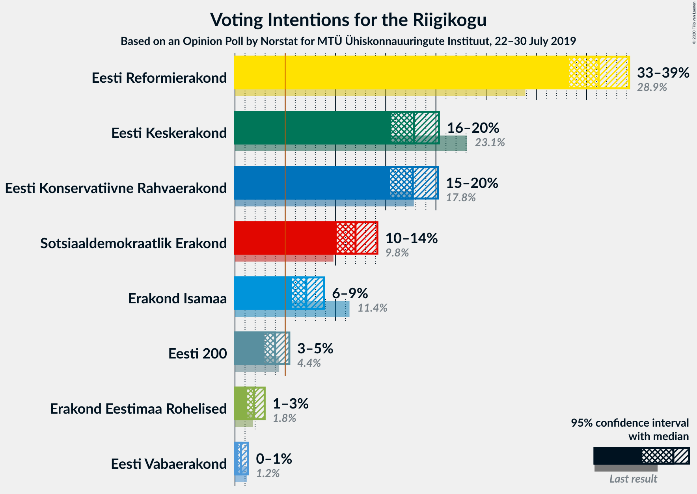

### Confidence Intervals

| Party | Last Result | Poll Result | 80% Confidence Interval | 90% Confidence Interval | 95% Confidence Interval | 99% Confidence Interval |
|:-----:|:-----------:|:-----------:|:-----------------------:|:-----------------------:|:-----------------------:|:-----------------------:|
| Eesti Reformierakond | 28.9% | 36.2% | 34.3–38.2% |33.7–38.7% |33.3–39.2% |32.4–40.2% |
| Eesti Keskerakond | 23.1% | 17.8% | 16.3–19.4% |15.9–19.9% |15.5–20.3% |14.9–21.1% |
| Eesti Konservatiivne Rahvaerakond | 17.8% | 17.7% | 16.2–19.3% |15.8–19.8% |15.5–20.2% |14.8–21.0% |
| Sotsiaaldemokraatlik Erakond | 9.8% | 12.0% | 10.8–13.4% |10.4–13.8% |10.1–14.2% |9.6–14.9% |
| Erakond Isamaa | 11.4% | 7.1% | 6.2–8.3% |5.9–8.6% |5.7–8.9% |5.2–9.4% |
| Eesti 200 | 4.4% | 4.0% | 3.3–4.9% |3.1–5.2% |2.9–5.4% |2.7–5.9% |
| Erakond Eestimaa Rohelised | 1.8% | 1.9% | 1.4–2.6% |1.3–2.8% |1.2–3.0% |1.0–3.3% |
| Eesti Vabaerakond | 1.2% | 0.6% | 0.4–1.1% |0.3–1.2% |0.3–1.3% |0.2–1.6% |

*Note:* The poll result column reflects the actual value used in the calculations. Published results may vary slightly, and in addition be rounded to fewer digits.

## Seats

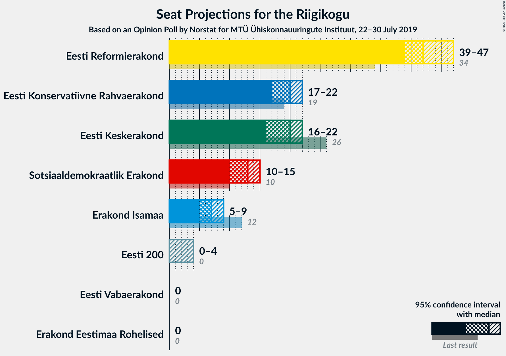

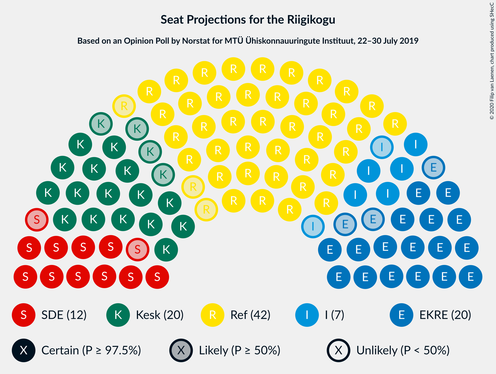

### Confidence Intervals

| Party | Last Result | Median | 80% Confidence Interval | 90% Confidence Interval | 95% Confidence Interval | 99% Confidence Interval |
|:-----:|:-----------:|:------:|:-----------------------:|:-----------------------:|:-----------------------:|:-----------------------:|
| <a href="#eesti-reformierakond">Eesti Reformierakond</a> | 34 | 42 | 41–45 |40–46 |39–47 |38–48 |
| <a href="#eesti-keskerakond">Eesti Keskerakond</a> | 26 | 20 | 18–21 |17–22 |16–22 |16–24 |
| <a href="#eesti-konservatiivne-rahvaerakond">Eesti Konservatiivne Rahvaerakond</a> | 19 | 20 | 17–21 |17–21 |17–22 |16–23 |
| <a href="#sotsiaaldemokraatlik-erakond">Sotsiaaldemokraatlik Erakond</a> | 10 | 13 | 11–14 |11–14 |10–15 |9–15 |
| <a href="#erakond-isamaa">Erakond Isamaa</a> | 12 | 7 | 6–7 |6–8 |5–9 |5–9 |
| <a href="#eesti-200">Eesti 200</a> | 0 | 0 | 0 |0 |0–4 |0–5 |
| <a href="#erakond-eestimaa-rohelised">Erakond Eestimaa Rohelised</a> | 0 | 0 | 0 |0 |0 |0 |
| <a href="#eesti-vabaerakond">Eesti Vabaerakond</a> | 0 | 0 | 0 |0 |0 |0 |

### Eesti Reformierakond

*For a full overview of the results for this party, see the [Eesti Reformierakond](party-eestireformierakond.html) page.*

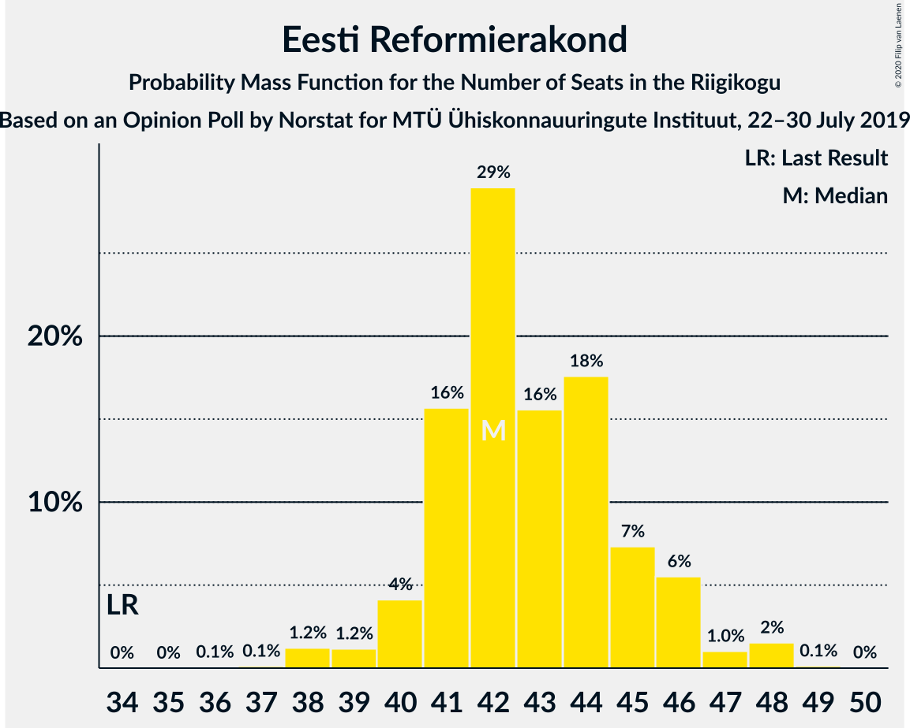

| Number of Seats | Probability | Accumulated | Special Marks |
|:---------------:|:-----------:|:-----------:|:-------------:|
| 34 | 0% | 100% | Last Result |
| 35 | 0% | 100% |  |
| 36 | 0.1% | 100% |  |
| 37 | 0.1% | 99.9% |  |
| 38 | 1.2% | 99.8% |  |
| 39 | 1.2% | 98.6% |  |
| 40 | 4% | 97% |  |
| 41 | 16% | 93% |  |
| 42 | 29% | 78% | Median |
| 43 | 16% | 49% |  |
| 44 | 18% | 33% |  |
| 45 | 7% | 16% |  |
| 46 | 6% | 8% |  |
| 47 | 1.0% | 3% |  |
| 48 | 2% | 2% |  |
| 49 | 0.1% | 0.2% |  |
| 50 | 0% | 0% |  |

### Eesti Keskerakond

*For a full overview of the results for this party, see the [Eesti Keskerakond](party-eestikeskerakond.html) page.*

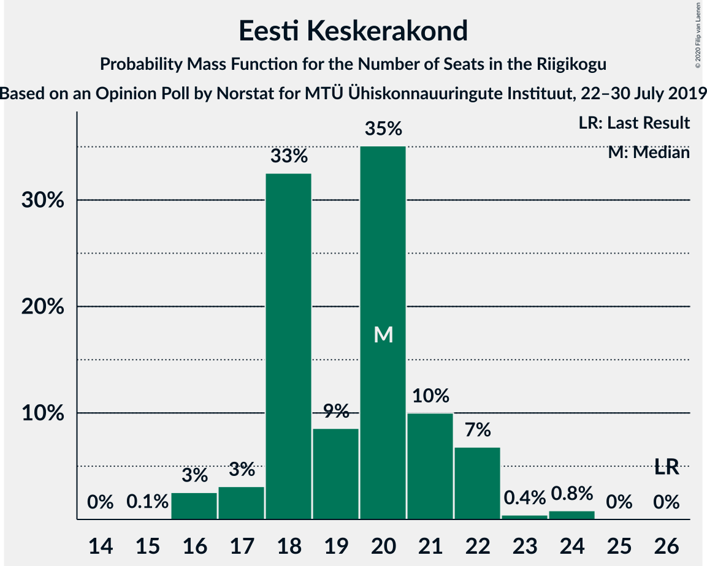

| Number of Seats | Probability | Accumulated | Special Marks |
|:---------------:|:-----------:|:-----------:|:-------------:|
| 15 | 0.1% | 100% |  |
| 16 | 3% | 99.9% |  |
| 17 | 3% | 97% |  |
| 18 | 33% | 94% |  |
| 19 | 9% | 62% |  |
| 20 | 35% | 53% | Median |
| 21 | 10% | 18% |  |
| 22 | 7% | 8% |  |
| 23 | 0.4% | 1.3% |  |
| 24 | 0.8% | 0.9% |  |
| 25 | 0% | 0% |  |
| 26 | 0% | 0% | Last Result |

### Eesti Konservatiivne Rahvaerakond

*For a full overview of the results for this party, see the [Eesti Konservatiivne Rahvaerakond](party-eestikonservatiivnerahvaerakond.html) page.*

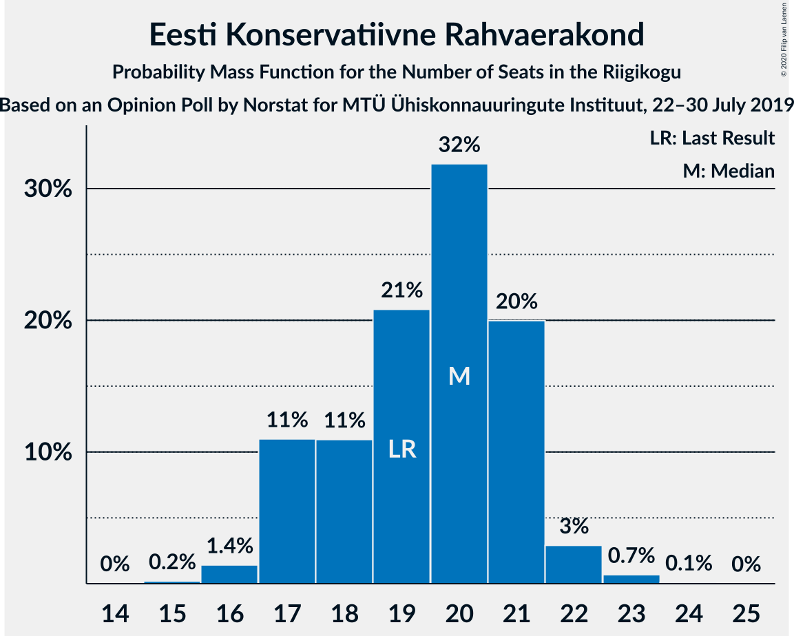

| Number of Seats | Probability | Accumulated | Special Marks |
|:---------------:|:-----------:|:-----------:|:-------------:|
| 15 | 0.2% | 100% |  |
| 16 | 1.4% | 99.8% |  |
| 17 | 11% | 98% |  |
| 18 | 11% | 87% |  |
| 19 | 21% | 76% | Last Result |
| 20 | 32% | 56% | Median |
| 21 | 20% | 24% |  |
| 22 | 3% | 4% |  |
| 23 | 0.7% | 0.8% |  |
| 24 | 0.1% | 0.1% |  |
| 25 | 0% | 0% |  |

### Sotsiaaldemokraatlik Erakond

*For a full overview of the results for this party, see the [Sotsiaaldemokraatlik Erakond](party-sotsiaaldemokraatlikerakond.html) page.*

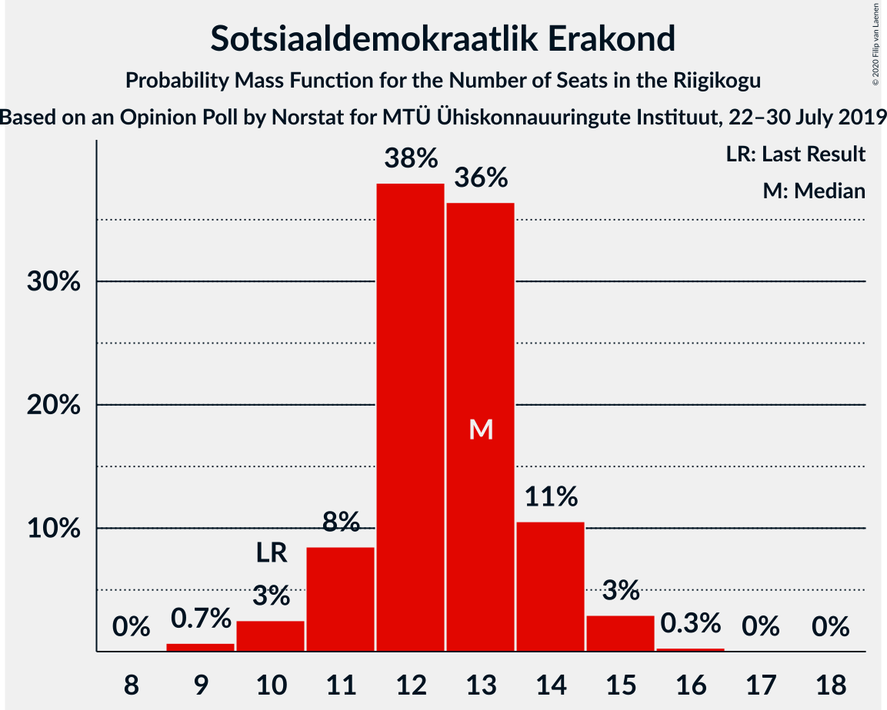

| Number of Seats | Probability | Accumulated | Special Marks |
|:---------------:|:-----------:|:-----------:|:-------------:|
| 9 | 0.7% | 100% |  |
| 10 | 3% | 99.3% | Last Result |
| 11 | 8% | 97% |  |
| 12 | 38% | 88% |  |
| 13 | 36% | 50% | Median |
| 14 | 11% | 14% |  |
| 15 | 3% | 3% |  |
| 16 | 0.3% | 0.4% |  |
| 17 | 0% | 0.1% |  |
| 18 | 0% | 0% |  |

### Erakond Isamaa

*For a full overview of the results for this party, see the [Erakond Isamaa](party-erakondisamaa.html) page.*

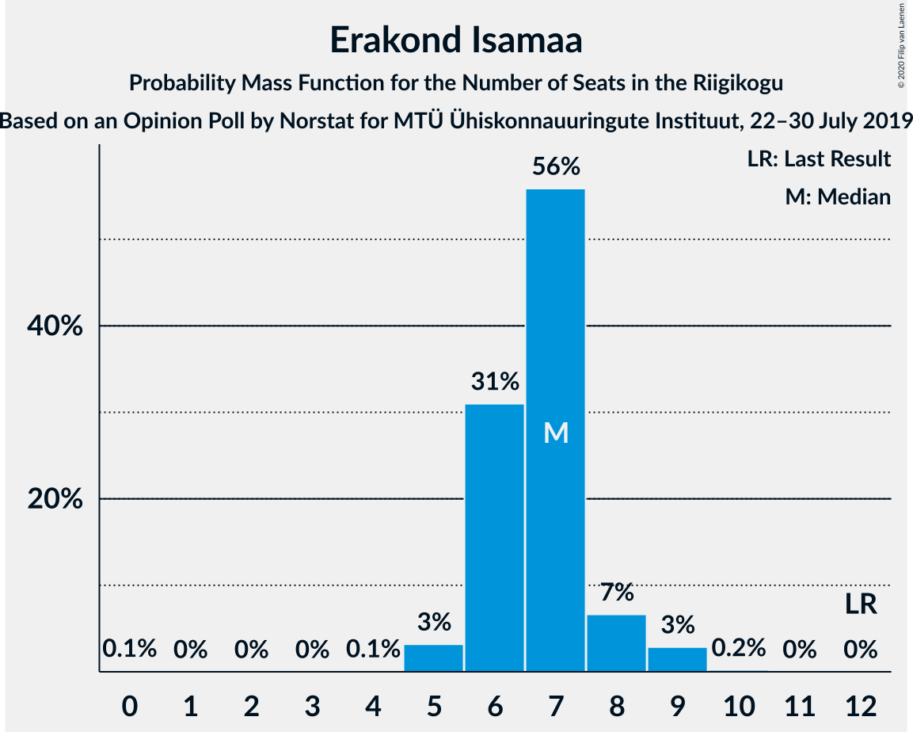

| Number of Seats | Probability | Accumulated | Special Marks |
|:---------------:|:-----------:|:-----------:|:-------------:|
| 0 | 0.1% | 100% |  |
| 1 | 0% | 99.9% |  |
| 2 | 0% | 99.9% |  |
| 3 | 0% | 99.9% |  |
| 4 | 0.1% | 99.9% |  |
| 5 | 3% | 99.8% |  |
| 6 | 31% | 97% |  |
| 7 | 56% | 66% | Median |
| 8 | 7% | 10% |  |
| 9 | 3% | 3% |  |
| 10 | 0.2% | 0.2% |  |
| 11 | 0% | 0% |  |
| 12 | 0% | 0% | Last Result |

### Eesti 200

*For a full overview of the results for this party, see the [Eesti 200](party-eesti200.html) page.*

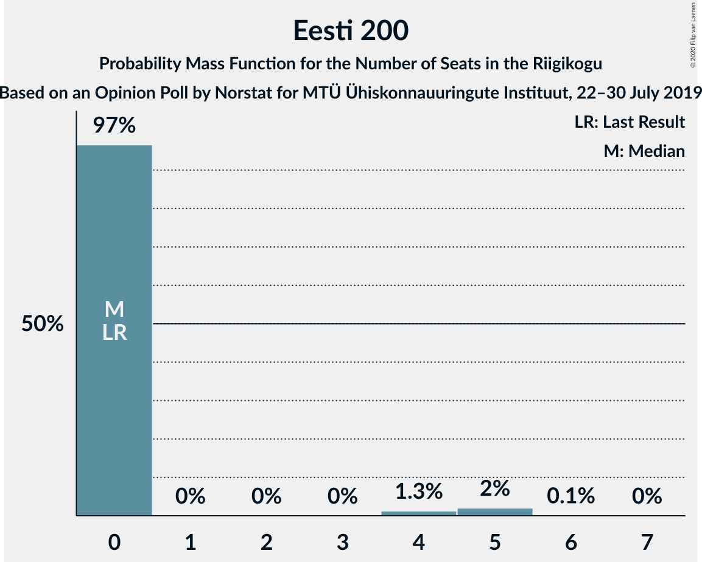

| Number of Seats | Probability | Accumulated | Special Marks |
|:---------------:|:-----------:|:-----------:|:-------------:|
| 0 | 97% | 100% | Last Result, Median |
| 1 | 0% | 3% |  |
| 2 | 0% | 3% |  |
| 3 | 0% | 3% |  |
| 4 | 1.3% | 3% |  |
| 5 | 2% | 2% |  |
| 6 | 0.1% | 0.1% |  |
| 7 | 0% | 0% |  |

### Erakond Eestimaa Rohelised

*For a full overview of the results for this party, see the [Erakond Eestimaa Rohelised](party-erakondeestimaarohelised.html) page.*

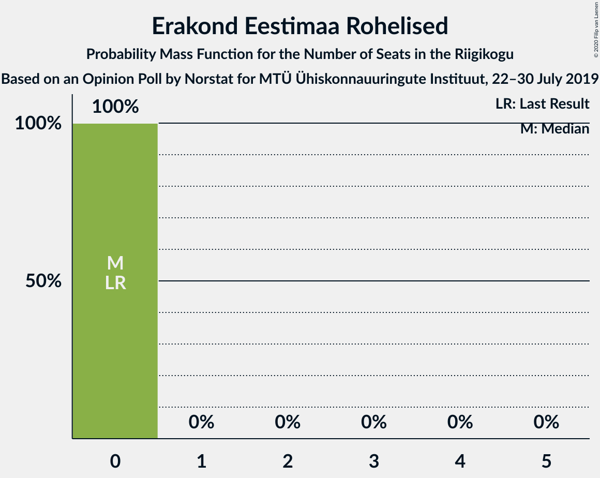

| Number of Seats | Probability | Accumulated | Special Marks |
|:---------------:|:-----------:|:-----------:|:-------------:|
| 0 | 100% | 100% | Last Result, Median |

### Eesti Vabaerakond

*For a full overview of the results for this party, see the [Eesti Vabaerakond](party-eestivabaerakond.html) page.*

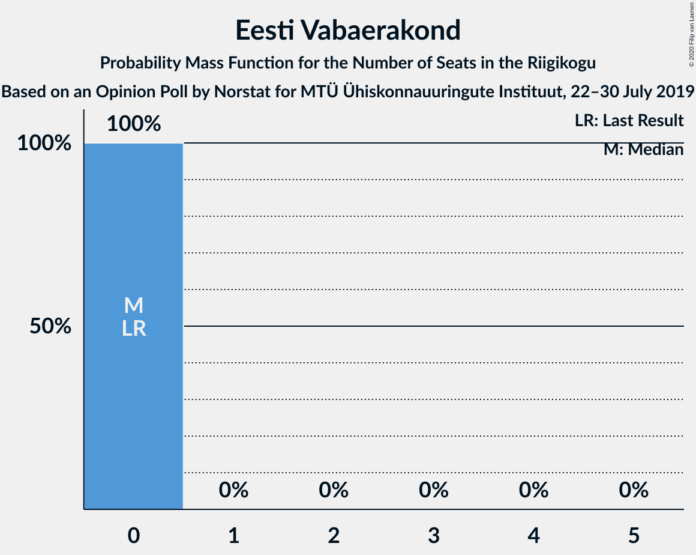

| Number of Seats | Probability | Accumulated | Special Marks |
|:---------------:|:-----------:|:-----------:|:-------------:|
| 0 | 100% | 100% | Last Result, Median |

## Coalitions

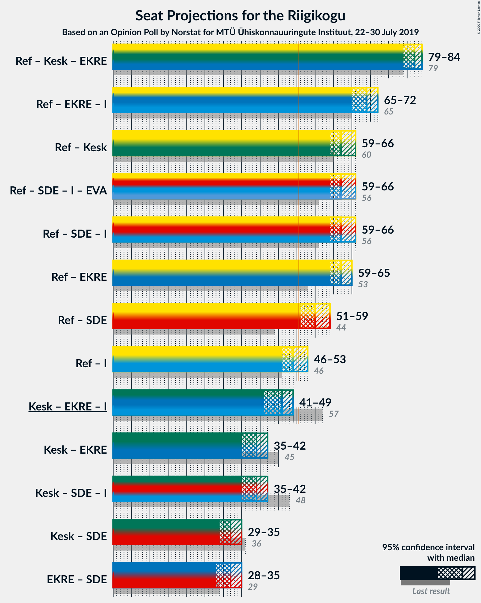

### Confidence Intervals

| Coalition | Last Result | Median | Majority? | 80% Confidence Interval | 90% Confidence Interval | 95% Confidence Interval | 99% Confidence Interval |
|:---------:|:-----------:|:------:|:---------:|:-----------------------:|:-----------------------:|:-----------------------:|:-----------------------:|
| Eesti Reformierakond – Eesti Keskerakond – Eesti Konservatiivne Rahvaerakond | 79 | 82 | 100% | 80–83 | 80–83 | 79–84 | 76–85 |
| Eesti Reformierakond – Eesti Konservatiivne Rahvaerakond – Erakond Isamaa | 65 | 69 | 100% | 67–71 | 66–72 | 65–72 | 64–73 |
| Eesti Reformierakond – Eesti Keskerakond | 60 | 62 | 100% | 60–65 | 59–65 | 59–66 | 57–67 |
| Eesti Reformierakond – Sotsiaaldemokraatlik Erakond – Erakond Isamaa – Eesti Vabaerakond | 56 | 62 | 100% | 60–64 | 59–65 | 59–66 | 57–67 |
| Eesti Reformierakond – Sotsiaaldemokraatlik Erakond – Erakond Isamaa | 56 | 62 | 100% | 60–64 | 59–65 | 59–66 | 57–67 |
| Eesti Reformierakond – Eesti Konservatiivne Rahvaerakond | 53 | 62 | 100% | 60–64 | 59–65 | 59–65 | 57–67 |
| Eesti Reformierakond – Sotsiaaldemokraatlik Erakond | 44 | 55 | 99.4% | 53–58 | 52–58 | 51–59 | 50–60 |
| Eesti Reformierakond – Erakond Isamaa | 46 | 49 | 31% | 47–52 | 47–52 | 46–53 | 45–55 |
| Eesti Keskerakond – Eesti Konservatiivne Rahvaerakond – Erakond Isamaa | 57 | 46 | 0.2% | 43–48 | 42–49 | 41–49 | 40–50 |
| Eesti Keskerakond – Eesti Konservatiivne Rahvaerakond | 45 | 39 | 0% | 37–41 | 36–42 | 35–42 | 34–43 |
| Eesti Keskerakond – Sotsiaaldemokraatlik Erakond – Erakond Isamaa | 48 | 39 | 0% | 36–41 | 36–41 | 35–42 | 34–43 |
| Eesti Keskerakond – Sotsiaaldemokraatlik Erakond | 36 | 32 | 0% | 30–34 | 29–35 | 29–35 | 27–37 |
| Eesti Konservatiivne Rahvaerakond – Sotsiaaldemokraatlik Erakond | 29 | 32 | 0% | 30–34 | 29–35 | 28–35 | 27–36 |

### Eesti Reformierakond – Eesti Keskerakond – Eesti Konservatiivne Rahvaerakond

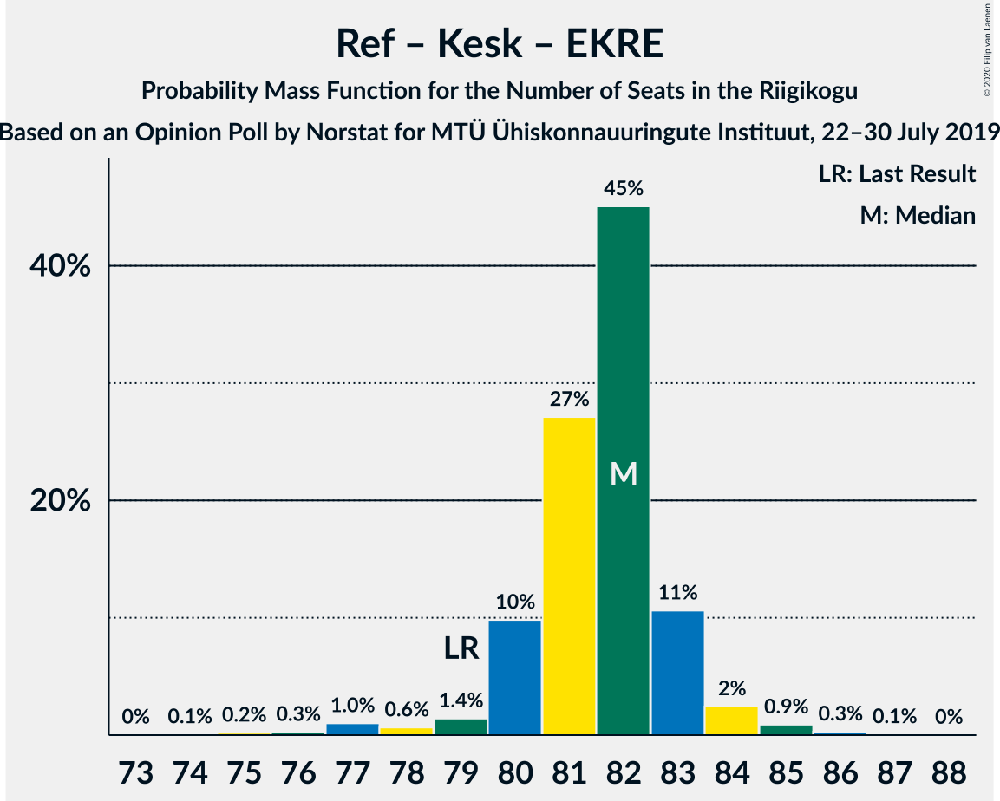

| Number of Seats | Probability | Accumulated | Special Marks |
|:---------------:|:-----------:|:-----------:|:-------------:|
| 74 | 0.1% | 100% |  |
| 75 | 0.2% | 99.9% |  |
| 76 | 0.3% | 99.7% |  |
| 77 | 1.0% | 99.4% |  |
| 78 | 0.6% | 98% |  |
| 79 | 1.4% | 98% | Last Result |
| 80 | 10% | 96% |  |
| 81 | 27% | 87% |  |
| 82 | 45% | 59% | Median |
| 83 | 11% | 14% |  |
| 84 | 2% | 4% |  |
| 85 | 0.9% | 1.3% |  |
| 86 | 0.3% | 0.4% |  |
| 87 | 0.1% | 0.1% |  |
| 88 | 0% | 0% |  |

### Eesti Reformierakond – Eesti Konservatiivne Rahvaerakond – Erakond Isamaa

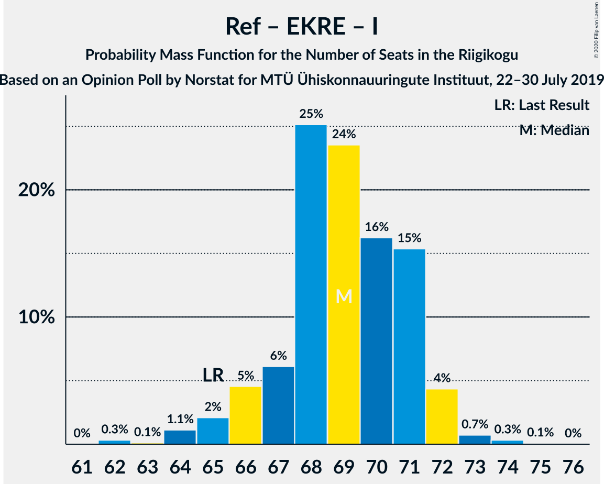

| Number of Seats | Probability | Accumulated | Special Marks |
|:---------------:|:-----------:|:-----------:|:-------------:|
| 62 | 0.3% | 100% |  |
| 63 | 0.1% | 99.7% |  |
| 64 | 1.1% | 99.6% |  |
| 65 | 2% | 98% | Last Result |
| 66 | 5% | 96% |  |
| 67 | 6% | 92% |  |
| 68 | 25% | 86% |  |
| 69 | 24% | 61% | Median |
| 70 | 16% | 37% |  |
| 71 | 15% | 21% |  |
| 72 | 4% | 5% |  |
| 73 | 0.7% | 1.1% |  |
| 74 | 0.3% | 0.4% |  |
| 75 | 0.1% | 0.1% |  |
| 76 | 0% | 0% |  |

### Eesti Reformierakond – Eesti Keskerakond

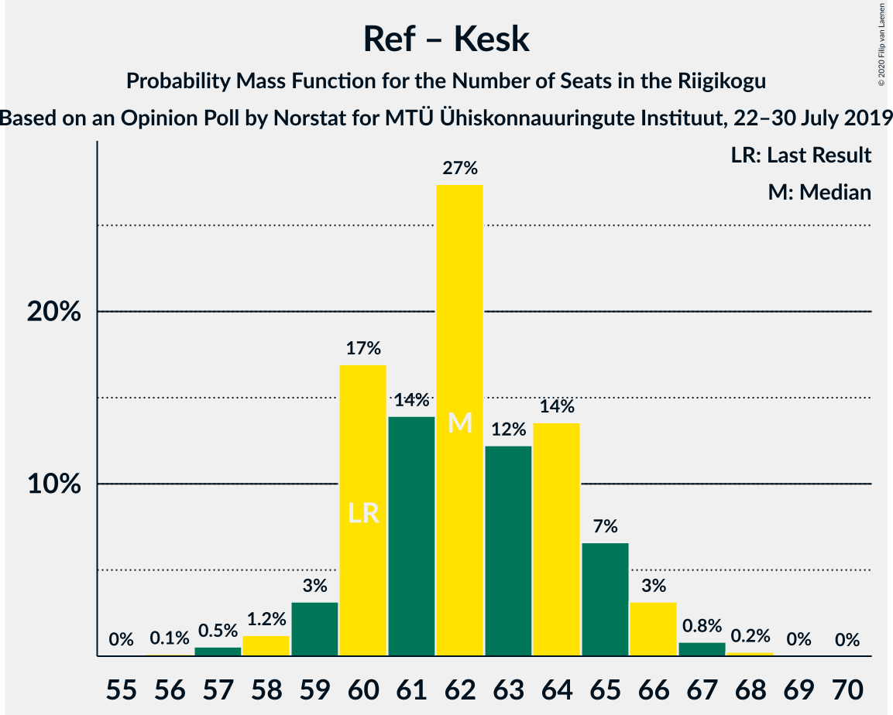

| Number of Seats | Probability | Accumulated | Special Marks |
|:---------------:|:-----------:|:-----------:|:-------------:|
| 56 | 0.1% | 100% |  |
| 57 | 0.5% | 99.8% |  |
| 58 | 1.2% | 99.3% |  |
| 59 | 3% | 98% |  |
| 60 | 17% | 95% | Last Result |
| 61 | 14% | 78% |  |
| 62 | 27% | 64% | Median |
| 63 | 12% | 37% |  |
| 64 | 14% | 24% |  |
| 65 | 7% | 11% |  |
| 66 | 3% | 4% |  |
| 67 | 0.8% | 1.1% |  |
| 68 | 0.2% | 0.3% |  |
| 69 | 0% | 0.1% |  |
| 70 | 0% | 0% |  |

### Eesti Reformierakond – Sotsiaaldemokraatlik Erakond – Erakond Isamaa – Eesti Vabaerakond

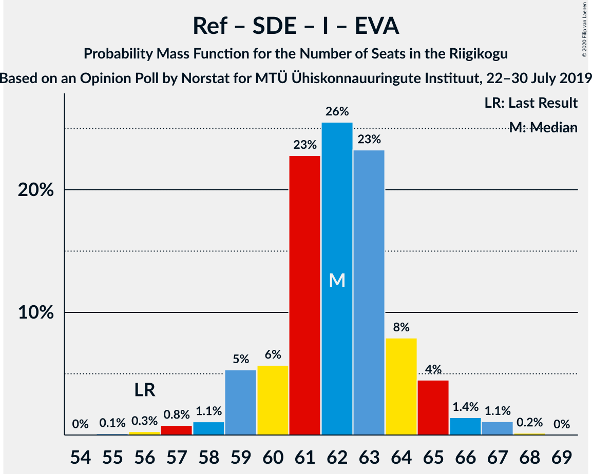

| Number of Seats | Probability | Accumulated | Special Marks |
|:---------------:|:-----------:|:-----------:|:-------------:|
| 55 | 0.1% | 100% |  |
| 56 | 0.3% | 99.9% | Last Result |
| 57 | 0.8% | 99.6% |  |
| 58 | 1.1% | 98.8% |  |
| 59 | 5% | 98% |  |
| 60 | 6% | 92% |  |
| 61 | 23% | 87% |  |
| 62 | 26% | 64% | Median |
| 63 | 23% | 38% |  |
| 64 | 8% | 15% |  |
| 65 | 4% | 7% |  |
| 66 | 1.4% | 3% |  |
| 67 | 1.1% | 1.3% |  |
| 68 | 0.2% | 0.2% |  |
| 69 | 0% | 0% |  |

### Eesti Reformierakond – Sotsiaaldemokraatlik Erakond – Erakond Isamaa

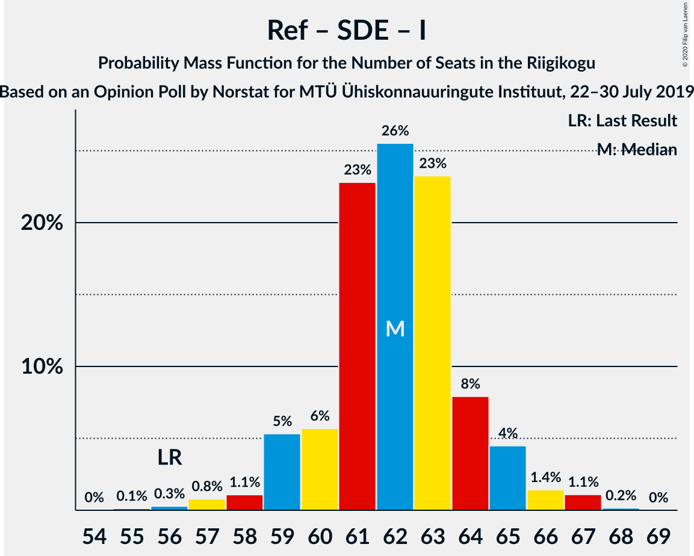

| Number of Seats | Probability | Accumulated | Special Marks |
|:---------------:|:-----------:|:-----------:|:-------------:|
| 55 | 0.1% | 100% |  |
| 56 | 0.3% | 99.9% | Last Result |
| 57 | 0.8% | 99.6% |  |
| 58 | 1.1% | 98.8% |  |
| 59 | 5% | 98% |  |
| 60 | 6% | 92% |  |
| 61 | 23% | 87% |  |
| 62 | 26% | 64% | Median |
| 63 | 23% | 38% |  |
| 64 | 8% | 15% |  |
| 65 | 4% | 7% |  |
| 66 | 1.4% | 3% |  |
| 67 | 1.1% | 1.3% |  |
| 68 | 0.2% | 0.2% |  |
| 69 | 0% | 0% |  |

### Eesti Reformierakond – Eesti Konservatiivne Rahvaerakond

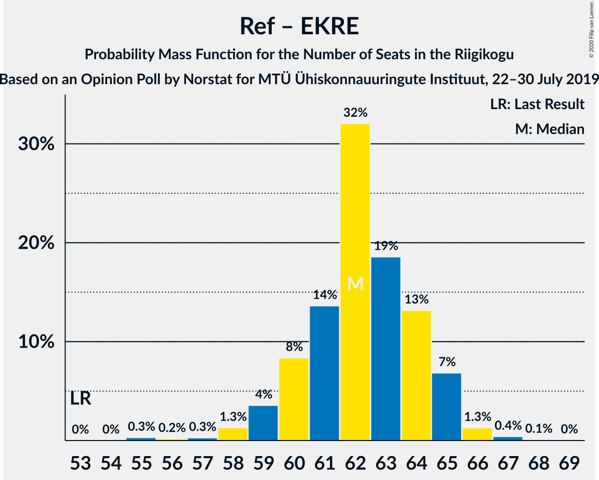

| Number of Seats | Probability | Accumulated | Special Marks |
|:---------------:|:-----------:|:-----------:|:-------------:|
| 53 | 0% | 100% | Last Result |
| 54 | 0% | 100% |  |
| 55 | 0.3% | 100% |  |
| 56 | 0.2% | 99.7% |  |
| 57 | 0.3% | 99.5% |  |
| 58 | 1.3% | 99.2% |  |
| 59 | 4% | 98% |  |
| 60 | 8% | 94% |  |
| 61 | 14% | 86% |  |
| 62 | 32% | 72% | Median |
| 63 | 19% | 40% |  |
| 64 | 13% | 22% |  |
| 65 | 7% | 9% |  |
| 66 | 1.3% | 2% |  |
| 67 | 0.4% | 0.5% |  |
| 68 | 0.1% | 0.1% |  |
| 69 | 0% | 0% |  |

### Eesti Reformierakond – Sotsiaaldemokraatlik Erakond

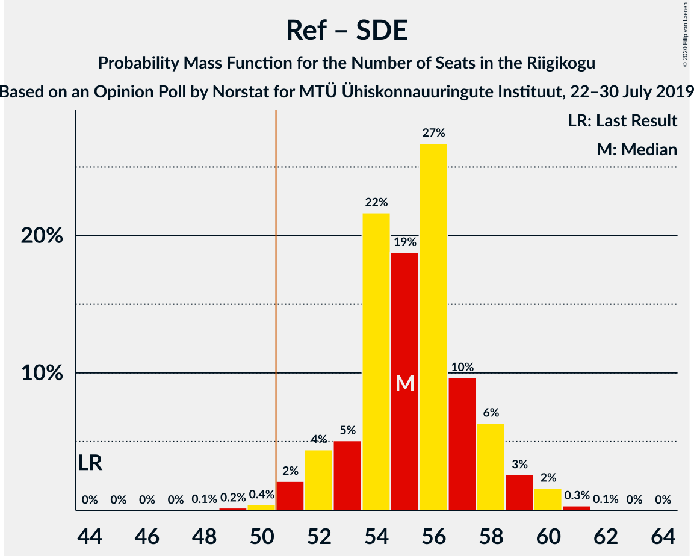

| Number of Seats | Probability | Accumulated | Special Marks |
|:---------------:|:-----------:|:-----------:|:-------------:|
| 44 | 0% | 100% | Last Result |
| 45 | 0% | 100% |  |
| 46 | 0% | 100% |  |
| 47 | 0% | 100% |  |
| 48 | 0.1% | 100% |  |
| 49 | 0.2% | 99.9% |  |
| 50 | 0.4% | 99.8% |  |
| 51 | 2% | 99.4% | Majority |
| 52 | 4% | 97% |  |
| 53 | 5% | 93% |  |
| 54 | 22% | 88% |  |
| 55 | 19% | 66% | Median |
| 56 | 27% | 47% |  |
| 57 | 10% | 21% |  |
| 58 | 6% | 11% |  |
| 59 | 3% | 5% |  |
| 60 | 2% | 2% |  |
| 61 | 0.3% | 0.4% |  |
| 62 | 0.1% | 0.1% |  |
| 63 | 0% | 0% |  |

### Eesti Reformierakond – Erakond Isamaa

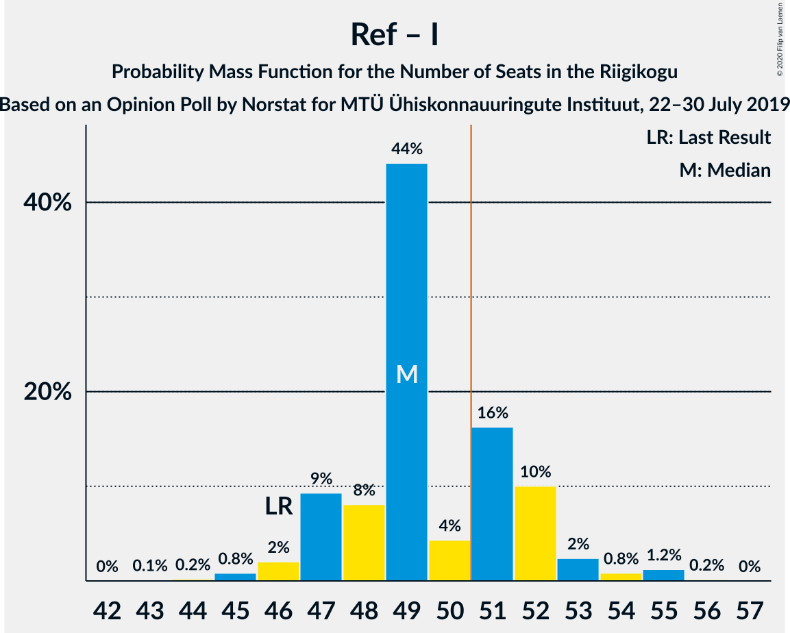

| Number of Seats | Probability | Accumulated | Special Marks |
|:---------------:|:-----------:|:-----------:|:-------------:|
| 43 | 0.1% | 100% |  |
| 44 | 0.2% | 99.9% |  |
| 45 | 0.8% | 99.7% |  |
| 46 | 2% | 98.8% | Last Result |
| 47 | 9% | 97% |  |
| 48 | 8% | 87% |  |
| 49 | 44% | 79% | Median |
| 50 | 4% | 35% |  |
| 51 | 16% | 31% | Majority |
| 52 | 10% | 15% |  |
| 53 | 2% | 5% |  |
| 54 | 0.8% | 2% |  |
| 55 | 1.2% | 1.4% |  |
| 56 | 0.2% | 0.2% |  |
| 57 | 0% | 0% |  |

### Eesti Keskerakond – Eesti Konservatiivne Rahvaerakond – Erakond Isamaa

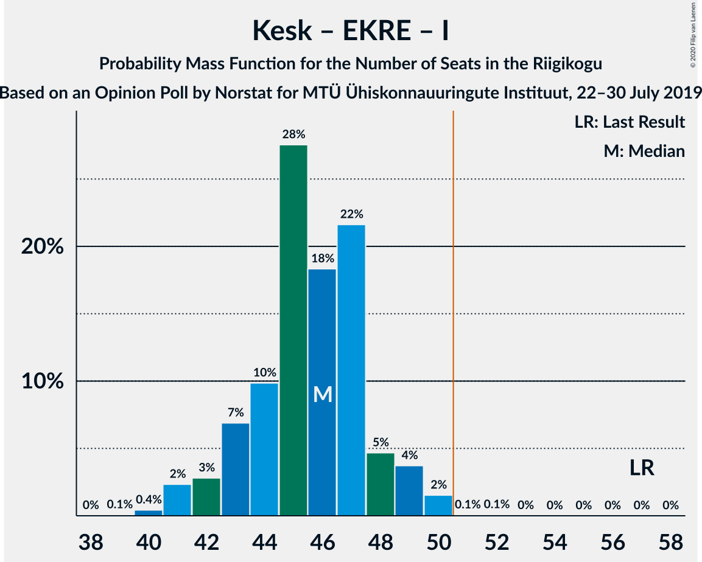

| Number of Seats | Probability | Accumulated | Special Marks |
|:---------------:|:-----------:|:-----------:|:-------------:|
| 39 | 0.1% | 100% |  |
| 40 | 0.4% | 99.9% |  |
| 41 | 2% | 99.5% |  |
| 42 | 3% | 97% |  |
| 43 | 7% | 94% |  |
| 44 | 10% | 87% |  |
| 45 | 28% | 78% |  |
| 46 | 18% | 50% |  |
| 47 | 22% | 32% | Median |
| 48 | 5% | 10% |  |
| 49 | 4% | 5% |  |
| 50 | 2% | 2% |  |
| 51 | 0.1% | 0.2% | Majority |
| 52 | 0.1% | 0.1% |  |
| 53 | 0% | 0% |  |
| 54 | 0% | 0% |  |
| 55 | 0% | 0% |  |
| 56 | 0% | 0% |  |
| 57 | 0% | 0% | Last Result |

### Eesti Keskerakond – Eesti Konservatiivne Rahvaerakond

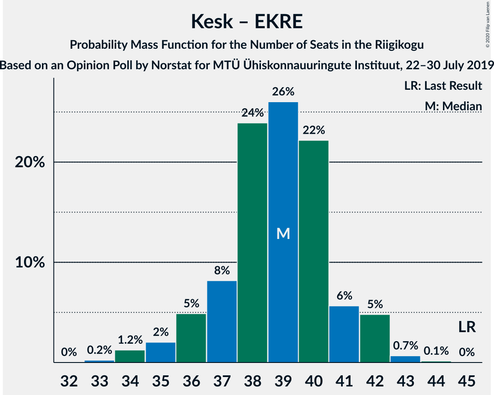

| Number of Seats | Probability | Accumulated | Special Marks |
|:---------------:|:-----------:|:-----------:|:-------------:|
| 33 | 0.2% | 100% |  |
| 34 | 1.2% | 99.7% |  |
| 35 | 2% | 98% |  |
| 36 | 5% | 96% |  |
| 37 | 8% | 92% |  |
| 38 | 24% | 83% |  |
| 39 | 26% | 59% |  |
| 40 | 22% | 33% | Median |
| 41 | 6% | 11% |  |
| 42 | 5% | 6% |  |
| 43 | 0.7% | 0.8% |  |
| 44 | 0.1% | 0.2% |  |
| 45 | 0% | 0% | Last Result |

### Eesti Keskerakond – Sotsiaaldemokraatlik Erakond – Erakond Isamaa

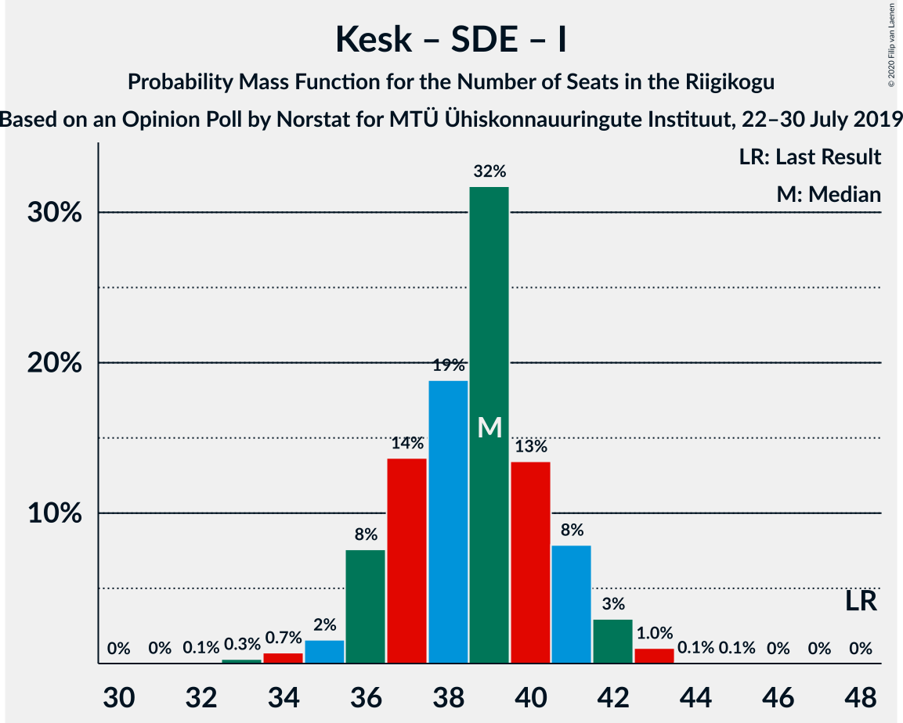

| Number of Seats | Probability | Accumulated | Special Marks |
|:---------------:|:-----------:|:-----------:|:-------------:|
| 32 | 0.1% | 100% |  |
| 33 | 0.3% | 99.9% |  |
| 34 | 0.7% | 99.6% |  |
| 35 | 2% | 98.9% |  |
| 36 | 8% | 97% |  |
| 37 | 14% | 90% |  |
| 38 | 19% | 76% |  |
| 39 | 32% | 57% |  |
| 40 | 13% | 25% | Median |
| 41 | 8% | 12% |  |
| 42 | 3% | 4% |  |
| 43 | 1.0% | 1.2% |  |
| 44 | 0.1% | 0.1% |  |
| 45 | 0.1% | 0.1% |  |
| 46 | 0% | 0% |  |
| 47 | 0% | 0% |  |
| 48 | 0% | 0% | Last Result |

### Eesti Keskerakond – Sotsiaaldemokraatlik Erakond

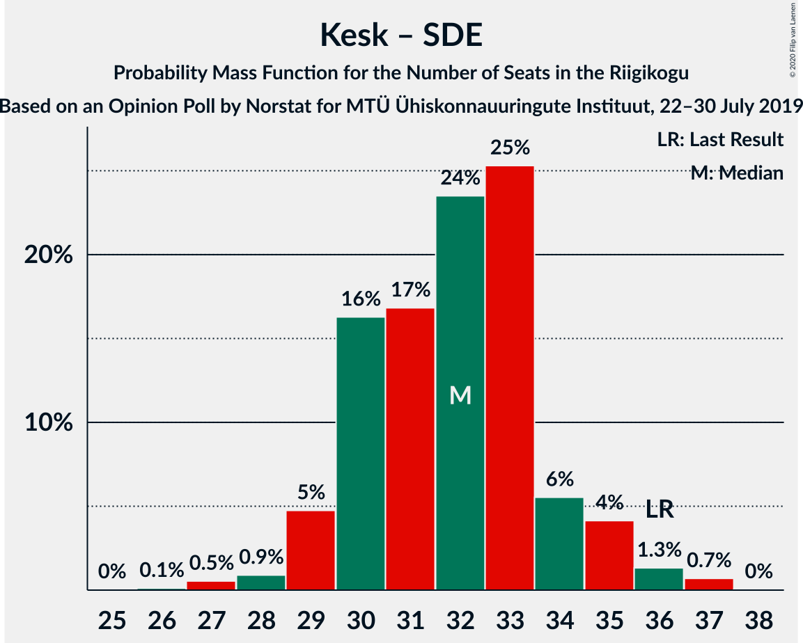

| Number of Seats | Probability | Accumulated | Special Marks |
|:---------------:|:-----------:|:-----------:|:-------------:|
| 26 | 0.1% | 100% |  |
| 27 | 0.5% | 99.9% |  |
| 28 | 0.9% | 99.3% |  |
| 29 | 5% | 98% |  |
| 30 | 16% | 94% |  |
| 31 | 17% | 77% |  |
| 32 | 24% | 61% |  |
| 33 | 25% | 37% | Median |
| 34 | 6% | 12% |  |
| 35 | 4% | 6% |  |
| 36 | 1.3% | 2% | Last Result |
| 37 | 0.7% | 0.7% |  |
| 38 | 0% | 0% |  |

### Eesti Konservatiivne Rahvaerakond – Sotsiaaldemokraatlik Erakond

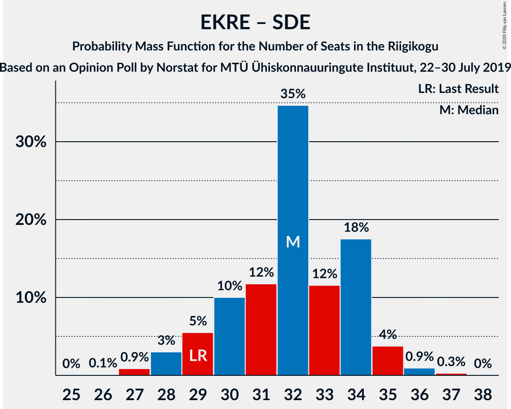

| Number of Seats | Probability | Accumulated | Special Marks |
|:---------------:|:-----------:|:-----------:|:-------------:|
| 26 | 0.1% | 100% |  |
| 27 | 0.9% | 99.9% |  |
| 28 | 3% | 99.0% |  |
| 29 | 5% | 96% | Last Result |
| 30 | 10% | 91% |  |
| 31 | 12% | 80% |  |
| 32 | 35% | 69% |  |
| 33 | 12% | 34% | Median |
| 34 | 18% | 23% |  |
| 35 | 4% | 5% |  |
| 36 | 0.9% | 1.2% |  |
| 37 | 0.3% | 0.3% |  |
| 38 | 0% | 0% |  |

## Technical Information

### Opinion Poll

+ **Polling firm:** Norstat
+ **Commissioner(s):** MTÜ Ühiskonnauuringute Instituut
+ **Fieldwork period:** 22–30 July 2019

### Calculations

+ **Sample size:** 1000
+ **Simulations done:** 131,072
+ **Error estimate:** 1.87%

