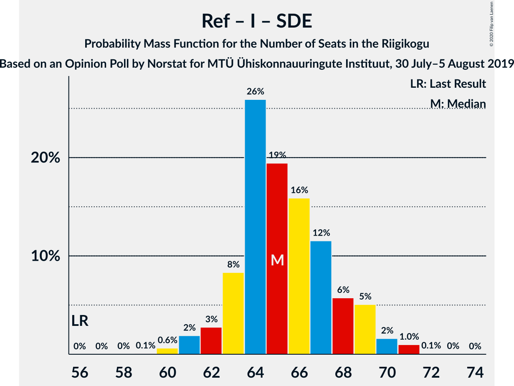

# Opinion Poll by Norstat for MTÜ Ühiskonnauuringute Instituut, 30 July–5 August 2019

<a href="#voting-intentions">Voting Intentions</a> | <a href="#seats">Seats</a> | <a href="#coalitions">Coalitions</a> | <a href="#technical-information">Technical Information</a>

## Voting Intentions

### Confidence Intervals

| Party | Last Result | Poll Result | 80% Confidence Interval | 90% Confidence Interval | 95% Confidence Interval | 99% Confidence Interval |
|:-----:|:-----------:|:-----------:|:-----------------------:|:-----------------------:|:-----------------------:|:-----------------------:|
| Eesti Reformierakond | 28.9% | 40.3% | 38.3–42.3% |37.8–42.9% |37.3–43.4% |36.4–44.4% |
| Eesti Keskerakond | 23.1% | 19.0% | 17.5–20.7% |17.1–21.1% |16.7–21.6% |16.0–22.4% |
| Eesti Konservatiivne Rahvaerakond | 17.8% | 12.8% | 11.5–14.3% |11.2–14.7% |10.9–15.0% |10.3–15.7% |
| Erakond Isamaa | 11.4% | 8.9% | 7.8–10.2% |7.5–10.5% |7.3–10.8% |6.8–11.5% |
| Sotsiaaldemokraatlik Erakond | 9.8% | 8.1% | 7.1–9.3% |6.8–9.7% |6.6–10.0% |6.1–10.6% |
| Eesti 200 | 4.4% | 4.2% | 3.5–5.1% |3.3–5.4% |3.1–5.6% |2.8–6.1% |
| Erakond Eestimaa Rohelised | 1.8% | 2.8% | 2.2–3.6% |2.1–3.8% |1.9–4.0% |1.7–4.4% |
| Eesti Vabaerakond | 1.2% | 0.8% | 0.5–1.3% |0.5–1.4% |0.4–1.6% |0.3–1.9% |

*Note:* The poll result column reflects the actual value used in the calculations. Published results may vary slightly, and in addition be rounded to fewer digits.

## Seats

### Confidence Intervals

| Party | Last Result | Median | 80% Confidence Interval | 90% Confidence Interval | 95% Confidence Interval | 99% Confidence Interval |
|:-----:|:-----------:|:------:|:-----------------------:|:-----------------------:|:-----------------------:|:-----------------------:|
| <a href="#eesti-reformierakond">Eesti Reformierakond</a> | 34 | 48 | 46–51 |46–53 |45–53 |43–54 |
| <a href="#eesti-keskerakond">Eesti Keskerakond</a> | 26 | 21 | 19–23 |18–24 |18–24 |17–25 |
| <a href="#eesti-konservatiivne-rahvaerakond">Eesti Konservatiivne Rahvaerakond</a> | 19 | 13 | 12–15 |11–15 |11–16 |10–17 |
| <a href="#erakond-isamaa">Erakond Isamaa</a> | 12 | 9 | 7–10 |7–11 |7–11 |6–12 |
| <a href="#sotsiaaldemokraatlik-erakond">Sotsiaaldemokraatlik Erakond</a> | 10 | 8 | 7–9 |6–9 |6–10 |6–11 |
| <a href="#eesti-200">Eesti 200</a> | 0 | 0 | 0–4 |0–5 |0–5 |0–5 |
| <a href="#erakond-eestimaa-rohelised">Erakond Eestimaa Rohelised</a> | 0 | 0 | 0 |0 |0 |0 |
| <a href="#eesti-vabaerakond">Eesti Vabaerakond</a> | 0 | 0 | 0 |0 |0 |0 |

### Eesti Reformierakond

*For a full overview of the results for this party, see the [Eesti Reformierakond](party-eestireformierakond.html) page.*

| Number of Seats | Probability | Accumulated | Special Marks |
|:---------------:|:-----------:|:-----------:|:-------------:|
| 34 | 0% | 100% | Last Result |
| 35 | 0% | 100% |  |
| 36 | 0% | 100% |  |
| 37 | 0% | 100% |  |
| 38 | 0% | 100% |  |
| 39 | 0% | 100% |  |
| 40 | 0% | 100% |  |
| 41 | 0% | 100% |  |
| 42 | 0.1% | 100% |  |
| 43 | 0.5% | 99.9% |  |
| 44 | 0.8% | 99.5% |  |
| 45 | 2% | 98.7% |  |
| 46 | 8% | 97% |  |
| 47 | 10% | 88% |  |
| 48 | 29% | 78% | Median |
| 49 | 16% | 50% |  |
| 50 | 14% | 33% |  |
| 51 | 10% | 19% | Majority |
| 52 | 4% | 9% |  |
| 53 | 4% | 5% |  |
| 54 | 1.1% | 1.3% |  |
| 55 | 0.2% | 0.2% |  |
| 56 | 0% | 0% |  |

### Eesti Keskerakond

*For a full overview of the results for this party, see the [Eesti Keskerakond](party-eestikeskerakond.html) page.*

| Number of Seats | Probability | Accumulated | Special Marks |
|:---------------:|:-----------:|:-----------:|:-------------:|
| 16 | 0.2% | 100% |  |
| 17 | 1.3% | 99.8% |  |
| 18 | 4% | 98.5% |  |
| 19 | 5% | 94% |  |
| 20 | 22% | 90% |  |
| 21 | 31% | 68% | Median |
| 22 | 15% | 36% |  |
| 23 | 12% | 21% |  |
| 24 | 8% | 9% |  |
| 25 | 0.4% | 0.6% |  |
| 26 | 0.1% | 0.1% | Last Result |
| 27 | 0.1% | 0.1% |  |
| 28 | 0% | 0% |  |

### Eesti Konservatiivne Rahvaerakond

*For a full overview of the results for this party, see the [Eesti Konservatiivne Rahvaerakond](party-eestikonservatiivnerahvaerakond.html) page.*

| Number of Seats | Probability | Accumulated | Special Marks |
|:---------------:|:-----------:|:-----------:|:-------------:|
| 9 | 0.1% | 100% |  |
| 10 | 0.8% | 99.9% |  |
| 11 | 6% | 99.1% |  |
| 12 | 13% | 93% |  |
| 13 | 34% | 79% | Median |
| 14 | 19% | 45% |  |
| 15 | 23% | 26% |  |
| 16 | 3% | 4% |  |
| 17 | 1.0% | 1.1% |  |
| 18 | 0.1% | 0.1% |  |
| 19 | 0% | 0% | Last Result |

### Erakond Isamaa

*For a full overview of the results for this party, see the [Erakond Isamaa](party-erakondisamaa.html) page.*

| Number of Seats | Probability | Accumulated | Special Marks |
|:---------------:|:-----------:|:-----------:|:-------------:|
| 6 | 0.7% | 100% |  |
| 7 | 15% | 99.3% |  |
| 8 | 24% | 85% |  |
| 9 | 42% | 60% | Median |
| 10 | 13% | 19% |  |
| 11 | 5% | 6% |  |
| 12 | 0.8% | 0.9% | Last Result |
| 13 | 0.1% | 0.1% |  |
| 14 | 0% | 0% |  |

### Sotsiaaldemokraatlik Erakond

*For a full overview of the results for this party, see the [Sotsiaaldemokraatlik Erakond](party-sotsiaaldemokraatlikerakond.html) page.*

| Number of Seats | Probability | Accumulated | Special Marks |
|:---------------:|:-----------:|:-----------:|:-------------:|
| 5 | 0.5% | 100% |  |
| 6 | 7% | 99.5% |  |
| 7 | 32% | 93% |  |
| 8 | 37% | 61% | Median |
| 9 | 20% | 24% |  |
| 10 | 3% | 3% | Last Result |
| 11 | 0.5% | 0.6% |  |
| 12 | 0.1% | 0.1% |  |
| 13 | 0% | 0% |  |

### Eesti 200

*For a full overview of the results for this party, see the [Eesti 200](party-eesti200.html) page.*

| Number of Seats | Probability | Accumulated | Special Marks |
|:---------------:|:-----------:|:-----------:|:-------------:|
| 0 | 76% | 100% | Last Result, Median |
| 1 | 0% | 24% |  |
| 2 | 0% | 24% |  |
| 3 | 0% | 24% |  |
| 4 | 16% | 24% |  |
| 5 | 8% | 8% |  |
| 6 | 0.3% | 0.3% |  |
| 7 | 0% | 0% |  |

### Erakond Eestimaa Rohelised

*For a full overview of the results for this party, see the [Erakond Eestimaa Rohelised](party-erakondeestimaarohelised.html) page.*

| Number of Seats | Probability | Accumulated | Special Marks |
|:---------------:|:-----------:|:-----------:|:-------------:|
| 0 | 100% | 100% | Last Result, Median |

### Eesti Vabaerakond

*For a full overview of the results for this party, see the [Eesti Vabaerakond](party-eestivabaerakond.html) page.*

| Number of Seats | Probability | Accumulated | Special Marks |
|:---------------:|:-----------:|:-----------:|:-------------:|
| 0 | 100% | 100% | Last Result, Median |

## Coalitions

### Confidence Intervals

| Coalition | Last Result | Median | Majority? | 80% Confidence Interval | 90% Confidence Interval | 95% Confidence Interval | 99% Confidence Interval |
|:---------:|:-----------:|:------:|:---------:|:-----------------------:|:-----------------------:|:-----------------------:|:-----------------------:|
| Eesti Reformierakond – Eesti Keskerakond – Eesti Konservatiivne Rahvaerakond | 79 | 84 | 100% | 81–86 | 80–86 | 80–86 | 78–88 |
| Eesti Reformierakond – Eesti Konservatiivne Rahvaerakond – Erakond Isamaa | 65 | 71 | 100% | 69–73 | 68–74 | 67–75 | 66–76 |
| Eesti Reformierakond – Eesti Keskerakond | 60 | 70 | 100% | 68–72 | 67–74 | 66–74 | 65–75 |
| Eesti Reformierakond – Erakond Isamaa – Sotsiaaldemokraatlik Erakond – Eesti Vabaerakond | 56 | 65 | 100% | 63–68 | 62–69 | 61–70 | 60–71 |
| Eesti Reformierakond – Erakond Isamaa – Sotsiaaldemokraatlik Erakond | 56 | 65 | 100% | 63–68 | 62–69 | 61–70 | 60–71 |
| Eesti Reformierakond – Eesti Konservatiivne Rahvaerakond | 53 | 62 | 100% | 59–65 | 59–65 | 58–67 | 57–67 |
| Eesti Reformierakond – Erakond Isamaa | 46 | 57 | 100% | 55–60 | 54–61 | 54–62 | 52–63 |
| Eesti Reformierakond – Sotsiaaldemokraatlik Erakond | 44 | 57 | 99.9% | 54–59 | 54–60 | 53–61 | 51–62 |
| Eesti Keskerakond – Eesti Konservatiivne Rahvaerakond – Erakond Isamaa | 57 | 43 | 0% | 41–46 | 40–47 | 39–47 | 38–48 |
| Eesti Keskerakond – Erakond Isamaa – Sotsiaaldemokraatlik Erakond | 48 | 37 | 0% | 36–40 | 35–42 | 34–42 | 33–43 |
| Eesti Keskerakond – Eesti Konservatiivne Rahvaerakond | 45 | 35 | 0% | 32–37 | 32–38 | 31–38 | 30–39 |
| Eesti Keskerakond – Sotsiaaldemokraatlik Erakond | 36 | 29 | 0% | 27–31 | 26–32 | 26–33 | 25–33 |
| Eesti Konservatiivne Rahvaerakond – Sotsiaaldemokraatlik Erakond | 29 | 21 | 0% | 19–23 | 18–24 | 18–24 | 17–26 |

### Eesti Reformierakond – Eesti Keskerakond – Eesti Konservatiivne Rahvaerakond

| Number of Seats | Probability | Accumulated | Special Marks |
|:---------------:|:-----------:|:-----------:|:-------------:|
| 76 | 0.1% | 100% |  |
| 77 | 0.1% | 99.9% |  |
| 78 | 0.5% | 99.8% |  |
| 79 | 0.6% | 99.3% | Last Result |
| 80 | 5% | 98.6% |  |
| 81 | 21% | 94% |  |
| 82 | 3% | 73% | Median |
| 83 | 20% | 71% |  |
| 84 | 14% | 51% |  |
| 85 | 20% | 37% |  |
| 86 | 14% | 16% |  |
| 87 | 1.2% | 2% |  |
| 88 | 1.1% | 1.1% |  |
| 89 | 0% | 0% |  |

### Eesti Reformierakond – Eesti Konservatiivne Rahvaerakond – Erakond Isamaa

| Number of Seats | Probability | Accumulated | Special Marks |
|:---------------:|:-----------:|:-----------:|:-------------:|
| 64 | 0.1% | 100% |  |
| 65 | 0.1% | 99.9% | Last Result |
| 66 | 2% | 99.8% |  |
| 67 | 2% | 98% |  |
| 68 | 5% | 96% |  |
| 69 | 9% | 91% |  |
| 70 | 24% | 83% | Median |
| 71 | 21% | 59% |  |
| 72 | 22% | 38% |  |
| 73 | 7% | 16% |  |
| 74 | 5% | 9% |  |
| 75 | 3% | 4% |  |
| 76 | 1.5% | 2% |  |
| 77 | 0.3% | 0.3% |  |
| 78 | 0% | 0% |  |

### Eesti Reformierakond – Eesti Keskerakond

| Number of Seats | Probability | Accumulated | Special Marks |
|:---------------:|:-----------:|:-----------:|:-------------:|
| 60 | 0% | 100% | Last Result |
| 61 | 0% | 100% |  |
| 62 | 0% | 100% |  |
| 63 | 0.1% | 100% |  |
| 64 | 0.3% | 99.9% |  |
| 65 | 2% | 99.5% |  |
| 66 | 2% | 98% |  |
| 67 | 4% | 96% |  |
| 68 | 20% | 92% |  |
| 69 | 16% | 72% | Median |
| 70 | 10% | 56% |  |
| 71 | 26% | 46% |  |
| 72 | 11% | 20% |  |
| 73 | 3% | 9% |  |
| 74 | 5% | 6% |  |
| 75 | 0.8% | 1.1% |  |
| 76 | 0.2% | 0.3% |  |
| 77 | 0.1% | 0.1% |  |
| 78 | 0% | 0% |  |

### Eesti Reformierakond – Erakond Isamaa – Sotsiaaldemokraatlik Erakond – Eesti Vabaerakond

| Number of Seats | Probability | Accumulated | Special Marks |
|:---------------:|:-----------:|:-----------:|:-------------:|
| 56 | 0% | 100% | Last Result |
| 57 | 0% | 100% |  |
| 58 | 0% | 100% |  |
| 59 | 0.1% | 100% |  |
| 60 | 0.6% | 99.9% |  |
| 61 | 2% | 99.2% |  |
| 62 | 3% | 97% |  |
| 63 | 8% | 95% |  |
| 64 | 26% | 86% |  |
| 65 | 19% | 60% | Median |
| 66 | 16% | 41% |  |
| 67 | 12% | 25% |  |
| 68 | 6% | 14% |  |
| 69 | 5% | 8% |  |
| 70 | 2% | 3% |  |
| 71 | 1.0% | 1.1% |  |
| 72 | 0.1% | 0.1% |  |
| 73 | 0% | 0% |  |

### Eesti Reformierakond – Erakond Isamaa – Sotsiaaldemokraatlik Erakond

| Number of Seats | Probability | Accumulated | Special Marks |
|:---------------:|:-----------:|:-----------:|:-------------:|
| 56 | 0% | 100% | Last Result |
| 57 | 0% | 100% |  |
| 58 | 0% | 100% |  |
| 59 | 0.1% | 100% |  |
| 60 | 0.6% | 99.9% |  |
| 61 | 2% | 99.2% |  |
| 62 | 3% | 97% |  |
| 63 | 8% | 95% |  |
| 64 | 26% | 86% |  |
| 65 | 19% | 60% | Median |
| 66 | 16% | 41% |  |
| 67 | 12% | 25% |  |
| 68 | 6% | 14% |  |
| 69 | 5% | 8% |  |
| 70 | 2% | 3% |  |
| 71 | 1.0% | 1.1% |  |
| 72 | 0.1% | 0.1% |  |
| 73 | 0% | 0% |  |

### Eesti Reformierakond – Eesti Konservatiivne Rahvaerakond

| Number of Seats | Probability | Accumulated | Special Marks |
|:---------------:|:-----------:|:-----------:|:-------------:|
| 53 | 0% | 100% | Last Result |
| 54 | 0% | 100% |  |
| 55 | 0% | 100% |  |
| 56 | 0.1% | 99.9% |  |
| 57 | 0.4% | 99.8% |  |
| 58 | 3% | 99.5% |  |
| 59 | 7% | 97% |  |
| 60 | 4% | 90% |  |
| 61 | 26% | 85% | Median |
| 62 | 19% | 60% |  |
| 63 | 11% | 41% |  |
| 64 | 13% | 30% |  |
| 65 | 12% | 17% |  |
| 66 | 2% | 4% |  |
| 67 | 2% | 3% |  |
| 68 | 0.4% | 0.5% |  |
| 69 | 0% | 0.1% |  |
| 70 | 0% | 0% |  |

### Eesti Reformierakond – Erakond Isamaa

| Number of Seats | Probability | Accumulated | Special Marks |
|:---------------:|:-----------:|:-----------:|:-------------:|
| 46 | 0% | 100% | Last Result |
| 47 | 0% | 100% |  |
| 48 | 0% | 100% |  |
| 49 | 0% | 100% |  |
| 50 | 0% | 100% |  |
| 51 | 0.2% | 100% | Majority |
| 52 | 0.6% | 99.7% |  |
| 53 | 1.0% | 99.1% |  |
| 54 | 4% | 98% |  |
| 55 | 6% | 94% |  |
| 56 | 12% | 88% |  |
| 57 | 37% | 76% | Median |
| 58 | 13% | 38% |  |
| 59 | 11% | 25% |  |
| 60 | 5% | 14% |  |
| 61 | 5% | 9% |  |
| 62 | 3% | 5% |  |
| 63 | 1.1% | 1.3% |  |
| 64 | 0.2% | 0.2% |  |
| 65 | 0% | 0% |  |

### Eesti Reformierakond – Sotsiaaldemokraatlik Erakond

| Number of Seats | Probability | Accumulated | Special Marks |
|:---------------:|:-----------:|:-----------:|:-------------:|
| 44 | 0% | 100% | Last Result |
| 45 | 0% | 100% |  |
| 46 | 0% | 100% |  |
| 47 | 0% | 100% |  |
| 48 | 0% | 100% |  |
| 49 | 0% | 100% |  |
| 50 | 0.1% | 100% |  |
| 51 | 1.0% | 99.9% | Majority |
| 52 | 0.3% | 98.9% |  |
| 53 | 2% | 98.7% |  |
| 54 | 10% | 96% |  |
| 55 | 28% | 87% |  |
| 56 | 6% | 58% | Median |
| 57 | 14% | 52% |  |
| 58 | 19% | 38% |  |
| 59 | 13% | 19% |  |
| 60 | 3% | 6% |  |
| 61 | 1.1% | 3% |  |
| 62 | 1.2% | 2% |  |
| 63 | 0.3% | 0.3% |  |
| 64 | 0% | 0% |  |

### Eesti Keskerakond – Eesti Konservatiivne Rahvaerakond – Erakond Isamaa

| Number of Seats | Probability | Accumulated | Special Marks |
|:---------------:|:-----------:|:-----------:|:-------------:|
| 37 | 0.2% | 100% |  |
| 38 | 0.8% | 99.7% |  |
| 39 | 1.5% | 99.0% |  |
| 40 | 3% | 97% |  |
| 41 | 7% | 95% |  |
| 42 | 28% | 87% |  |
| 43 | 20% | 60% | Median |
| 44 | 14% | 39% |  |
| 45 | 4% | 25% |  |
| 46 | 12% | 22% |  |
| 47 | 8% | 9% |  |
| 48 | 0.7% | 0.8% |  |
| 49 | 0.2% | 0.2% |  |
| 50 | 0% | 0% |  |
| 51 | 0% | 0% | Majority |
| 52 | 0% | 0% |  |
| 53 | 0% | 0% |  |
| 54 | 0% | 0% |  |
| 55 | 0% | 0% |  |
| 56 | 0% | 0% |  |
| 57 | 0% | 0% | Last Result |

### Eesti Keskerakond – Erakond Isamaa – Sotsiaaldemokraatlik Erakond

| Number of Seats | Probability | Accumulated | Special Marks |
|:---------------:|:-----------:|:-----------:|:-------------:|
| 32 | 0.2% | 100% |  |
| 33 | 0.7% | 99.8% |  |
| 34 | 4% | 99.0% |  |
| 35 | 5% | 95% |  |
| 36 | 26% | 90% |  |
| 37 | 16% | 64% |  |
| 38 | 11% | 49% | Median |
| 39 | 20% | 37% |  |
| 40 | 10% | 18% |  |
| 41 | 2% | 8% |  |
| 42 | 5% | 6% |  |
| 43 | 0.6% | 0.7% |  |
| 44 | 0.1% | 0.1% |  |
| 45 | 0% | 0% |  |
| 46 | 0% | 0% |  |
| 47 | 0% | 0% |  |
| 48 | 0% | 0% | Last Result |

### Eesti Keskerakond – Eesti Konservatiivne Rahvaerakond

| Number of Seats | Probability | Accumulated | Special Marks |
|:---------------:|:-----------:|:-----------:|:-------------:|
| 28 | 0% | 100% |  |
| 29 | 0.2% | 99.9% |  |
| 30 | 1.3% | 99.7% |  |
| 31 | 2% | 98% |  |
| 32 | 8% | 96% |  |
| 33 | 20% | 88% |  |
| 34 | 14% | 67% | Median |
| 35 | 17% | 53% |  |
| 36 | 18% | 36% |  |
| 37 | 12% | 18% |  |
| 38 | 5% | 6% |  |
| 39 | 1.0% | 1.3% |  |
| 40 | 0.3% | 0.3% |  |
| 41 | 0% | 0% |  |
| 42 | 0% | 0% |  |
| 43 | 0% | 0% |  |
| 44 | 0% | 0% |  |
| 45 | 0% | 0% | Last Result |

### Eesti Keskerakond – Sotsiaaldemokraatlik Erakond

| Number of Seats | Probability | Accumulated | Special Marks |
|:---------------:|:-----------:|:-----------:|:-------------:|
| 23 | 0% | 100% |  |
| 24 | 0.3% | 99.9% |  |
| 25 | 2% | 99.6% |  |
| 26 | 4% | 98% |  |
| 27 | 21% | 94% |  |
| 28 | 9% | 72% |  |
| 29 | 23% | 63% | Median |
| 30 | 21% | 41% |  |
| 31 | 11% | 19% |  |
| 32 | 4% | 8% |  |
| 33 | 3% | 3% |  |
| 34 | 0.3% | 0.4% |  |
| 35 | 0.1% | 0.1% |  |
| 36 | 0% | 0% | Last Result |

### Eesti Konservatiivne Rahvaerakond – Sotsiaaldemokraatlik Erakond

| Number of Seats | Probability | Accumulated | Special Marks |
|:---------------:|:-----------:|:-----------:|:-------------:|
| 16 | 0.1% | 100% |  |
| 17 | 0.5% | 99.9% |  |
| 18 | 4% | 99.4% |  |
| 19 | 9% | 95% |  |
| 20 | 22% | 86% |  |
| 21 | 21% | 65% | Median |
| 22 | 14% | 43% |  |
| 23 | 21% | 29% |  |
| 24 | 6% | 8% |  |
| 25 | 1.0% | 2% |  |
| 26 | 0.6% | 0.6% |  |
| 27 | 0.1% | 0.1% |  |
| 28 | 0% | 0% |  |
| 29 | 0% | 0% | Last Result |

## Technical Information

### Opinion Poll

+ **Polling firm:** Norstat
+ **Commissioner(s):** MTÜ Ühiskonnauuringute Instituut
+ **Fieldwork period:** 30 July–5 August 2019

### Calculations

+ **Sample size:** 1000
+ **Simulations done:** 131,072
+ **Error estimate:** 2.00%

