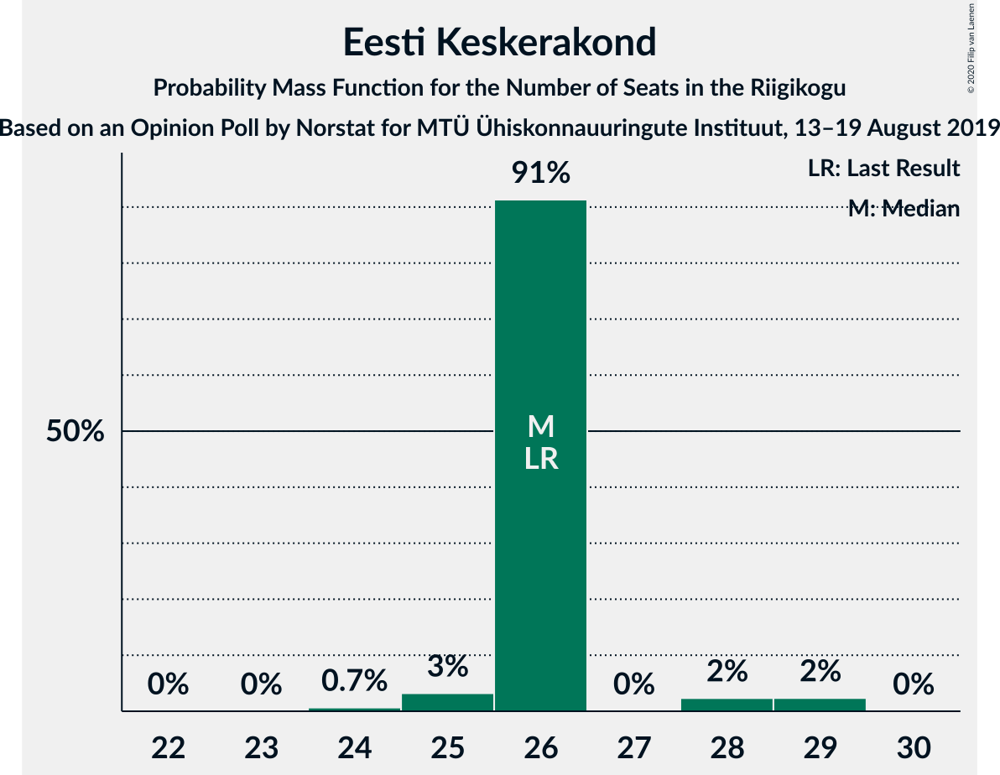

# Opinion Poll by Norstat for MTÜ Ühiskonnauuringute Instituut, 13–19 August 2019

<a href="#voting-intentions">Voting Intentions</a> | <a href="#seats">Seats</a> | <a href="#coalitions">Coalitions</a> | <a href="#technical-information">Technical Information</a>

## Voting Intentions

### Confidence Intervals

| Party | Last Result | Poll Result | 80% Confidence Interval | 90% Confidence Interval | 95% Confidence Interval | 99% Confidence Interval |
|:-----:|:-----------:|:-----------:|:-----------------------:|:-----------------------:|:-----------------------:|:-----------------------:|
| Eesti Reformierakond | 28.9% | 33.9% | 32.0–35.9% |31.5–36.4% |31.0–36.9% |30.1–37.8% |
| Eesti Keskerakond | 23.1% | 23.0% | 21.4–24.8% |20.9–25.3% |20.5–25.7% |19.7–26.6% |
| Eesti Konservatiivne Rahvaerakond | 17.8% | 16.9% | 15.5–18.5% |15.0–19.0% |14.7–19.4% |14.0–20.1% |
| Sotsiaaldemokraatlik Erakond | 9.8% | 10.9% | 9.7–12.3% |9.4–12.7% |9.1–13.0% |8.6–13.7% |
| Erakond Isamaa | 11.4% | 7.1% | 6.2–8.3% |5.9–8.6% |5.7–8.9% |5.2–9.4% |
| Eesti 200 | 4.4% | 4.1% | 3.4–5.0% |3.2–5.3% |3.0–5.5% |2.7–6.0% |
| Erakond Eestimaa Rohelised | 1.8% | 1.8% | 1.4–2.5% |1.2–2.7% |1.1–2.8% |1.0–3.2% |
| Eesti Vabaerakond | 1.2% | 0.7% | 0.5–1.2% |0.4–1.3% |0.3–1.4% |0.2–1.7% |

*Note:* The poll result column reflects the actual value used in the calculations. Published results may vary slightly, and in addition be rounded to fewer digits.

## Seats

### Confidence Intervals

| Party | Last Result | Median | 80% Confidence Interval | 90% Confidence Interval | 95% Confidence Interval | 99% Confidence Interval |
|:-----:|:-----------:|:------:|:-----------------------:|:-----------------------:|:-----------------------:|:-----------------------:|
| <a href="#eesti-reformierakond">Eesti Reformierakond</a> | 34 | 41 | 41 |38–41 |35–41 |35–41 |
| <a href="#eesti-keskerakond">Eesti Keskerakond</a> | 26 | 26 | 26 |26 |25–28 |24–29 |
| <a href="#eesti-konservatiivne-rahvaerakond">Eesti Konservatiivne Rahvaerakond</a> | 19 | 18 | 18 |15–18 |15–20 |15–21 |
| <a href="#sotsiaaldemokraatlik-erakond">Sotsiaaldemokraatlik Erakond</a> | 10 | 10 | 10 |10–12 |10–12 |9–12 |
| <a href="#erakond-isamaa">Erakond Isamaa</a> | 12 | 6 | 6 |6 |6–10 |5–10 |
| <a href="#eesti-200">Eesti 200</a> | 0 | 0 | 0 |0 |0–4 |0–5 |
| <a href="#erakond-eestimaa-rohelised">Erakond Eestimaa Rohelised</a> | 0 | 0 | 0 |0 |0 |0 |
| <a href="#eesti-vabaerakond">Eesti Vabaerakond</a> | 0 | 0 | 0 |0 |0 |0 |

### Eesti Reformierakond

*For a full overview of the results for this party, see the [Eesti Reformierakond](party-eestireformierakond.html) page.*

| Number of Seats | Probability | Accumulated | Special Marks |
|:---------------:|:-----------:|:-----------:|:-------------:|
| 34 | 0.3% | 100% | Last Result |
| 35 | 2% | 99.7% |  |
| 36 | 0% | 97% |  |
| 37 | 2% | 97% |  |
| 38 | 0.5% | 95% |  |
| 39 | 3% | 95% |  |
| 40 | 0.7% | 91% |  |
| 41 | 90% | 91% | Median |
| 42 | 0.2% | 0.2% |  |
| 43 | 0% | 0% |  |

### Eesti Keskerakond

*For a full overview of the results for this party, see the [Eesti Keskerakond](party-eestikeskerakond.html) page.*

| Number of Seats | Probability | Accumulated | Special Marks |
|:---------------:|:-----------:|:-----------:|:-------------:|
| 22 | 0% | 100% |  |
| 23 | 0% | 99.9% |  |
| 24 | 0.7% | 99.9% |  |
| 25 | 3% | 99.3% |  |
| 26 | 91% | 96% | Last Result, Median |
| 27 | 0% | 5% |  |
| 28 | 2% | 5% |  |
| 29 | 2% | 2% |  |
| 30 | 0% | 0% |  |

### Eesti Konservatiivne Rahvaerakond

*For a full overview of the results for this party, see the [Eesti Konservatiivne Rahvaerakond](party-eestikonservatiivnerahvaerakond.html) page.*

| Number of Seats | Probability | Accumulated | Special Marks |
|:---------------:|:-----------:|:-----------:|:-------------:|
| 15 | 6% | 100% |  |
| 16 | 0% | 94% |  |
| 17 | 0.2% | 94% |  |
| 18 | 91% | 94% | Median |
| 19 | 0% | 3% | Last Result |
| 20 | 2% | 3% |  |
| 21 | 0.2% | 0.7% |  |
| 22 | 0.5% | 0.5% |  |
| 23 | 0% | 0% |  |

### Sotsiaaldemokraatlik Erakond

*For a full overview of the results for this party, see the [Sotsiaaldemokraatlik Erakond](party-sotsiaaldemokraatlikerakond.html) page.*

| Number of Seats | Probability | Accumulated | Special Marks |
|:---------------:|:-----------:|:-----------:|:-------------:|
| 8 | 0.2% | 100% |  |
| 9 | 2% | 99.8% |  |
| 10 | 91% | 98% | Last Result, Median |
| 11 | 0.3% | 7% |  |
| 12 | 6% | 7% |  |
| 13 | 0% | 0.4% |  |
| 14 | 0.4% | 0.4% |  |
| 15 | 0% | 0% |  |

### Erakond Isamaa

*For a full overview of the results for this party, see the [Erakond Isamaa](party-erakondisamaa.html) page.*

| Number of Seats | Probability | Accumulated | Special Marks |
|:---------------:|:-----------:|:-----------:|:-------------:|
| 5 | 1.2% | 100% |  |
| 6 | 95% | 98.8% | Median |
| 7 | 0.2% | 4% |  |
| 8 | 0.4% | 4% |  |
| 9 | 0.3% | 3% |  |
| 10 | 3% | 3% |  |
| 11 | 0% | 0% |  |
| 12 | 0% | 0% | Last Result |

### Eesti 200

*For a full overview of the results for this party, see the [Eesti 200](party-eesti200.html) page.*

| Number of Seats | Probability | Accumulated | Special Marks |
|:---------------:|:-----------:|:-----------:|:-------------:|
| 0 | 97% | 100% | Last Result, Median |
| 1 | 0% | 3% |  |
| 2 | 0% | 3% |  |
| 3 | 0% | 3% |  |
| 4 | 0.1% | 3% |  |
| 5 | 2% | 2% |  |
| 6 | 0% | 0% |  |

### Erakond Eestimaa Rohelised

*For a full overview of the results for this party, see the [Erakond Eestimaa Rohelised](party-erakondeestimaarohelised.html) page.*

| Number of Seats | Probability | Accumulated | Special Marks |
|:---------------:|:-----------:|:-----------:|:-------------:|
| 0 | 100% | 100% | Last Result, Median |

### Eesti Vabaerakond

*For a full overview of the results for this party, see the [Eesti Vabaerakond](party-eestivabaerakond.html) page.*

| Number of Seats | Probability | Accumulated | Special Marks |
|:---------------:|:-----------:|:-----------:|:-------------:|
| 0 | 100% | 100% | Last Result, Median |

## Coalitions

### Confidence Intervals

| Coalition | Last Result | Median | Majority? | 80% Confidence Interval | 90% Confidence Interval | 95% Confidence Interval | 99% Confidence Interval |
|:---------:|:-----------:|:------:|:---------:|:-----------------------:|:-----------------------:|:-----------------------:|:-----------------------:|
| Eesti Reformierakond – Eesti Keskerakond – Eesti Konservatiivne Rahvaerakond | 79 | 85 | 100% | 85 | 81–85 | 79–85 | 79–85 |
| Eesti Reformierakond – Eesti Keskerakond | 60 | 67 | 100% | 67 | 64–67 | 63–67 | 62–67 |
| Eesti Reformierakond – Eesti Konservatiivne Rahvaerakond – Erakond Isamaa | 65 | 65 | 100% | 65 | 62–65 | 61–65 | 58–65 |
| Eesti Reformierakond – Sotsiaaldemokraatlik Erakond – Erakond Isamaa – Eesti Vabaerakond | 56 | 57 | 100% | 57 | 55–57 | 53–61 | 52–61 |
| Eesti Reformierakond – Sotsiaaldemokraatlik Erakond – Erakond Isamaa | 56 | 57 | 100% | 57 | 55–57 | 53–61 | 52–61 |
| Eesti Reformierakond – Eesti Konservatiivne Rahvaerakond | 53 | 59 | 100% | 59 | 54–59 | 54–59 | 52–60 |
| Eesti Keskerakond – Eesti Konservatiivne Rahvaerakond – Erakond Isamaa | 57 | 50 | 3% | 50 | 50 | 50–54 | 48–54 |
| Eesti Reformierakond – Sotsiaaldemokraatlik Erakond | 44 | 51 | 94% | 51 | 48–51 | 46–51 | 46–52 |
| Eesti Reformierakond – Erakond Isamaa | 46 | 47 | 0% | 47 | 43–47 | 43–49 | 41–49 |
| Eesti Keskerakond – Sotsiaaldemokraatlik Erakond – Erakond Isamaa | 48 | 42 | 0% | 42 | 42–46 | 42–47 | 41–47 |
| Eesti Keskerakond – Eesti Konservatiivne Rahvaerakond | 45 | 44 | 0% | 44 | 44 | 40–47 | 40–48 |
| Eesti Keskerakond – Sotsiaaldemokraatlik Erakond | 36 | 36 | 0% | 36 | 36–38 | 36–39 | 36–40 |
| Eesti Konservatiivne Rahvaerakond – Sotsiaaldemokraatlik Erakond | 29 | 28 | 0% | 28 | 27–28 | 26–32 | 24–32 |

### Eesti Reformierakond – Eesti Keskerakond – Eesti Konservatiivne Rahvaerakond

| Number of Seats | Probability | Accumulated | Special Marks |
|:---------------:|:-----------:|:-----------:|:-------------:|
| 79 | 3% | 100% | Last Result |
| 80 | 0.1% | 97% |  |
| 81 | 3% | 97% |  |
| 82 | 0% | 94% |  |
| 83 | 3% | 94% |  |
| 84 | 1.1% | 92% |  |
| 85 | 90% | 90% | Median |
| 86 | 0% | 0% |  |

### Eesti Reformierakond – Eesti Keskerakond

| Number of Seats | Probability | Accumulated | Special Marks |
|:---------------:|:-----------:|:-----------:|:-------------:|
| 60 | 0.2% | 100% | Last Result |
| 61 | 0% | 99.8% |  |
| 62 | 0.5% | 99.7% |  |
| 63 | 2% | 99.2% |  |
| 64 | 3% | 97% |  |
| 65 | 0% | 94% |  |
| 66 | 3% | 94% |  |
| 67 | 90% | 90% | Median |
| 68 | 0% | 0% |  |

### Eesti Reformierakond – Eesti Konservatiivne Rahvaerakond – Erakond Isamaa

| Number of Seats | Probability | Accumulated | Special Marks |
|:---------------:|:-----------:|:-----------:|:-------------:|
| 57 | 0.1% | 100% |  |
| 58 | 2% | 99.9% |  |
| 59 | 0% | 98% |  |
| 60 | 0% | 98% |  |
| 61 | 2% | 98% |  |
| 62 | 0.4% | 95% |  |
| 63 | 0.7% | 95% |  |
| 64 | 3% | 94% |  |
| 65 | 91% | 91% | Last Result, Median |
| 66 | 0% | 0.3% |  |
| 67 | 0.2% | 0.2% |  |
| 68 | 0% | 0% |  |

### Eesti Reformierakond – Sotsiaaldemokraatlik Erakond – Erakond Isamaa – Eesti Vabaerakond

| Number of Seats | Probability | Accumulated | Special Marks |
|:---------------:|:-----------:|:-----------:|:-------------:|
| 52 | 2% | 100% |  |
| 53 | 2% | 98% |  |
| 54 | 0.2% | 95% |  |
| 55 | 0.7% | 95% |  |
| 56 | 0% | 94% | Last Result |
| 57 | 91% | 94% | Median |
| 58 | 0% | 3% |  |
| 59 | 0% | 3% |  |
| 60 | 0% | 3% |  |
| 61 | 3% | 3% |  |
| 62 | 0% | 0.1% |  |
| 63 | 0% | 0% |  |

### Eesti Reformierakond – Sotsiaaldemokraatlik Erakond – Erakond Isamaa

| Number of Seats | Probability | Accumulated | Special Marks |
|:---------------:|:-----------:|:-----------:|:-------------:|
| 52 | 2% | 100% |  |
| 53 | 2% | 98% |  |
| 54 | 0.2% | 95% |  |
| 55 | 0.7% | 95% |  |
| 56 | 0% | 94% | Last Result |
| 57 | 91% | 94% | Median |
| 58 | 0% | 3% |  |
| 59 | 0% | 3% |  |
| 60 | 0% | 3% |  |
| 61 | 3% | 3% |  |
| 62 | 0% | 0.1% |  |
| 63 | 0% | 0% |  |

### Eesti Reformierakond – Eesti Konservatiivne Rahvaerakond

| Number of Seats | Probability | Accumulated | Special Marks |
|:---------------:|:-----------:|:-----------:|:-------------:|
| 52 | 2% | 100% |  |
| 53 | 0% | 98% | Last Result |
| 54 | 3% | 98% |  |
| 55 | 3% | 94% |  |
| 56 | 0% | 92% |  |
| 57 | 0% | 92% |  |
| 58 | 0.7% | 92% |  |
| 59 | 91% | 91% | Median |
| 60 | 0.5% | 0.5% |  |
| 61 | 0% | 0% |  |

### Eesti Keskerakond – Eesti Konservatiivne Rahvaerakond – Erakond Isamaa

| Number of Seats | Probability | Accumulated | Special Marks |
|:---------------:|:-----------:|:-----------:|:-------------:|
| 46 | 0.2% | 100% |  |
| 47 | 0% | 99.8% |  |
| 48 | 0.4% | 99.8% |  |
| 49 | 0.7% | 99.4% |  |
| 50 | 96% | 98.6% | Median |
| 51 | 0.3% | 3% | Majority |
| 52 | 0% | 3% |  |
| 53 | 0.2% | 3% |  |
| 54 | 2% | 3% |  |
| 55 | 0% | 0.2% |  |
| 56 | 0.2% | 0.2% |  |
| 57 | 0% | 0% | Last Result |

### Eesti Reformierakond – Sotsiaaldemokraatlik Erakond

| Number of Seats | Probability | Accumulated | Special Marks |
|:---------------:|:-----------:|:-----------:|:-------------:|
| 44 | 0% | 100% | Last Result |
| 45 | 0.2% | 100% |  |
| 46 | 2% | 99.7% |  |
| 47 | 2% | 97% |  |
| 48 | 0.3% | 95% |  |
| 49 | 0% | 95% |  |
| 50 | 0.5% | 95% |  |
| 51 | 93% | 94% | Median, Majority |
| 52 | 0.7% | 1.1% |  |
| 53 | 0.4% | 0.5% |  |
| 54 | 0% | 0% |  |

### Eesti Reformierakond – Erakond Isamaa

| Number of Seats | Probability | Accumulated | Special Marks |
|:---------------:|:-----------:|:-----------:|:-------------:|
| 41 | 2% | 100% |  |
| 42 | 0.1% | 98% |  |
| 43 | 3% | 98% |  |
| 44 | 0% | 95% |  |
| 45 | 0.8% | 95% |  |
| 46 | 0% | 94% | Last Result |
| 47 | 91% | 94% | Median |
| 48 | 0% | 3% |  |
| 49 | 3% | 3% |  |
| 50 | 0% | 0.1% |  |
| 51 | 0% | 0% | Majority |

### Eesti Keskerakond – Sotsiaaldemokraatlik Erakond – Erakond Isamaa

| Number of Seats | Probability | Accumulated | Special Marks |
|:---------------:|:-----------:|:-----------:|:-------------:|
| 37 | 0.2% | 100% |  |
| 38 | 0% | 99.8% |  |
| 39 | 0% | 99.8% |  |
| 40 | 0% | 99.8% |  |
| 41 | 0.5% | 99.8% |  |
| 42 | 90% | 99.3% | Median |
| 43 | 0.7% | 9% |  |
| 44 | 2% | 8% |  |
| 45 | 0.1% | 6% |  |
| 46 | 3% | 6% |  |
| 47 | 3% | 3% |  |
| 48 | 0% | 0% | Last Result |

### Eesti Keskerakond – Eesti Konservatiivne Rahvaerakond

| Number of Seats | Probability | Accumulated | Special Marks |
|:---------------:|:-----------:|:-----------:|:-------------:|
| 39 | 0% | 100% |  |
| 40 | 3% | 99.9% |  |
| 41 | 0.2% | 97% |  |
| 42 | 0% | 97% |  |
| 43 | 0% | 97% |  |
| 44 | 93% | 97% | Median |
| 45 | 0% | 3% | Last Result |
| 46 | 0.5% | 3% |  |
| 47 | 0.2% | 3% |  |
| 48 | 2% | 2% |  |
| 49 | 0% | 0% |  |

### Eesti Keskerakond – Sotsiaaldemokraatlik Erakond

| Number of Seats | Probability | Accumulated | Special Marks |
|:---------------:|:-----------:|:-----------:|:-------------:|
| 32 | 0.2% | 100% |  |
| 33 | 0% | 99.8% |  |
| 34 | 0.2% | 99.8% |  |
| 35 | 0% | 99.6% |  |
| 36 | 91% | 99.6% | Last Result, Median |
| 37 | 3% | 9% |  |
| 38 | 3% | 6% |  |
| 39 | 0.4% | 3% |  |
| 40 | 2% | 2% |  |
| 41 | 0% | 0% |  |

### Eesti Konservatiivne Rahvaerakond – Sotsiaaldemokraatlik Erakond

| Number of Seats | Probability | Accumulated | Special Marks |
|:---------------:|:-----------:|:-----------:|:-------------:|
| 24 | 2% | 100% |  |
| 25 | 0.2% | 98% |  |
| 26 | 0.1% | 98% |  |
| 27 | 3% | 97% |  |
| 28 | 90% | 95% | Median |
| 29 | 0.4% | 4% | Last Result |
| 30 | 0.7% | 4% |  |
| 31 | 0% | 3% |  |
| 32 | 3% | 3% |  |
| 33 | 0% | 0.3% |  |
| 34 | 0.3% | 0.3% |  |
| 35 | 0% | 0% |  |

## Technical Information

### Opinion Poll

+ **Polling firm:** Norstat
+ **Commissioner(s):** MTÜ Ühiskonnauuringute Instituut
+ **Fieldwork period:** 13–19 August 2019

### Calculations

+ **Sample size:** 1000
+ **Simulations done:** 1,024
+ **Error estimate:** 4.77%

