# Opinion Poll by Turu-uuringute AS for ERR, 9–20 August 2019

<a href="#voting-intentions">Voting Intentions</a> | <a href="#seats">Seats</a> | <a href="#coalitions">Coalitions</a> | <a href="#technical-information">Technical Information</a>

## Voting Intentions

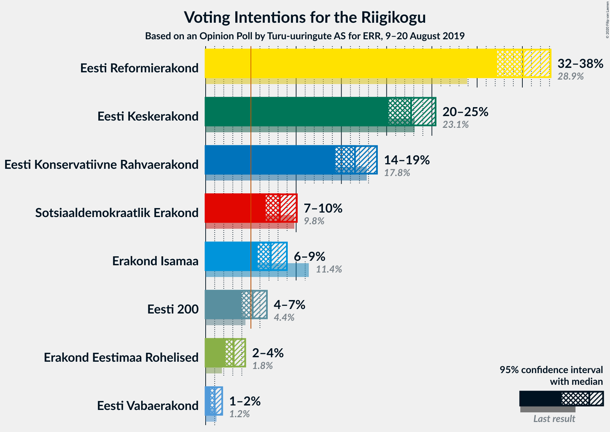

### Confidence Intervals

| Party | Last Result | Poll Result | 80% Confidence Interval | 90% Confidence Interval | 95% Confidence Interval | 99% Confidence Interval |
|:-----:|:-----------:|:-----------:|:-----------------------:|:-----------------------:|:-----------------------:|:-----------------------:|
| Eesti Reformierakond | 28.9% | 35.1% | 33.2–37.1% |32.7–37.6% |32.2–38.1% |31.3–39.1% |
| Eesti Keskerakond | 23.1% | 22.7% | 21.1–24.5% |20.6–25.0% |20.2–25.4% |19.4–26.3% |
| Eesti Konservatiivne Rahvaerakond | 17.8% | 16.5% | 15.1–18.1% |14.7–18.5% |14.3–18.9% |13.7–19.7% |
| Sotsiaaldemokraatlik Erakond | 9.8% | 8.2% | 7.2–9.4% |6.9–9.8% |6.6–10.1% |6.2–10.7% |
| Erakond Isamaa | 11.4% | 7.2% | 6.2–8.4% |6.0–8.7% |5.7–9.0% |5.3–9.6% |
| Eesti 200 | 4.4% | 5.2% | 4.4–6.2% |4.2–6.5% |4.0–6.8% |3.6–7.3% |
| Erakond Eestimaa Rohelised | 1.8% | 3.1% | 2.5–3.9% |2.3–4.2% |2.2–4.4% |1.9–4.8% |
| Eesti Vabaerakond | 1.2% | 1.0% | 0.7–1.5% |0.6–1.7% |0.5–1.8% |0.4–2.1% |

*Note:* The poll result column reflects the actual value used in the calculations. Published results may vary slightly, and in addition be rounded to fewer digits.

## Seats

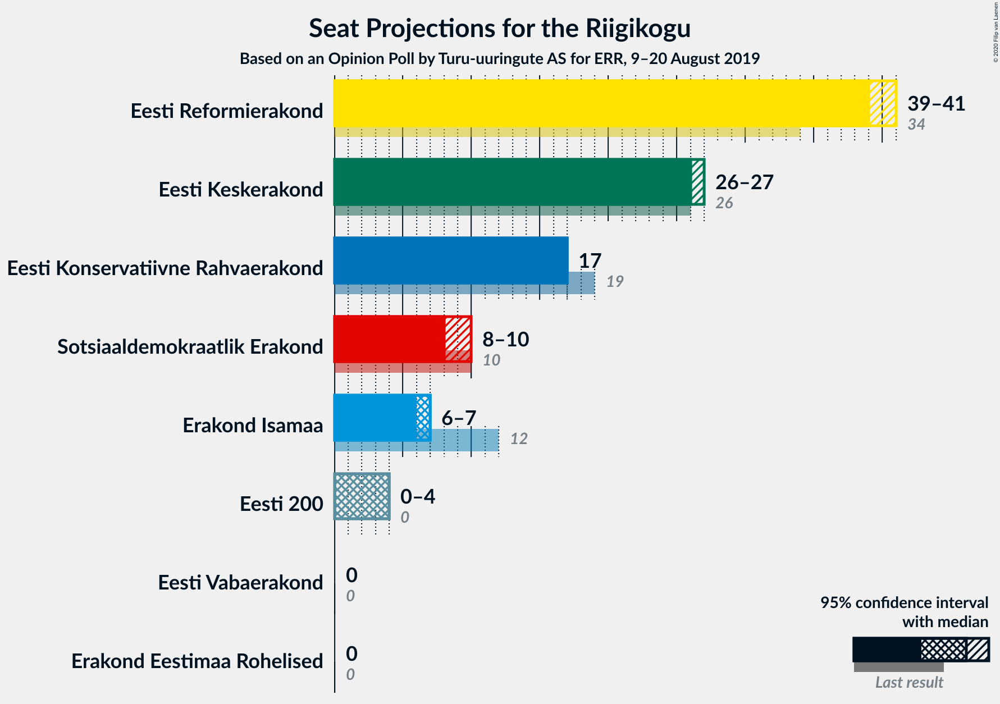

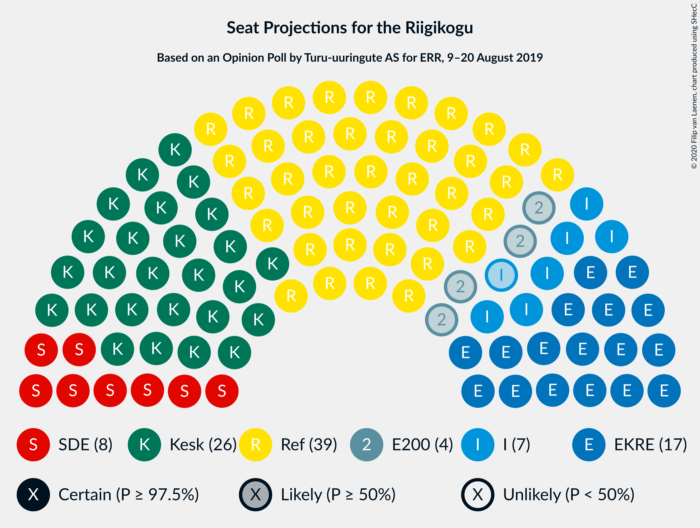

### Confidence Intervals

| Party | Last Result | Median | 80% Confidence Interval | 90% Confidence Interval | 95% Confidence Interval | 99% Confidence Interval |
|:-----:|:-----------:|:------:|:-----------------------:|:-----------------------:|:-----------------------:|:-----------------------:|
| <a href="#eesti-reformierakond">Eesti Reformierakond</a> | 34 | 39 | 39 |39–41 |39–41 |39–46 |
| <a href="#eesti-keskerakond">Eesti Keskerakond</a> | 26 | 26 | 26 |26–27 |26–27 |24–27 |
| <a href="#eesti-konservatiivne-rahvaerakond">Eesti Konservatiivne Rahvaerakond</a> | 19 | 17 | 17 |17 |17 |17–18 |
| <a href="#sotsiaaldemokraatlik-erakond">Sotsiaaldemokraatlik Erakond</a> | 10 | 8 | 8 |8–10 |8–10 |7–10 |
| <a href="#erakond-isamaa">Erakond Isamaa</a> | 12 | 7 | 7 |6–7 |6–7 |6–8 |
| <a href="#eesti-200">Eesti 200</a> | 0 | 4 | 4 |0–4 |0–4 |0–5 |
| <a href="#erakond-eestimaa-rohelised">Erakond Eestimaa Rohelised</a> | 0 | 0 | 0 |0 |0 |0 |
| <a href="#eesti-vabaerakond">Eesti Vabaerakond</a> | 0 | 0 | 0 |0 |0 |0 |

### Eesti Reformierakond

*For a full overview of the results for this party, see the [Eesti Reformierakond](party-eestireformierakond.html) page.*

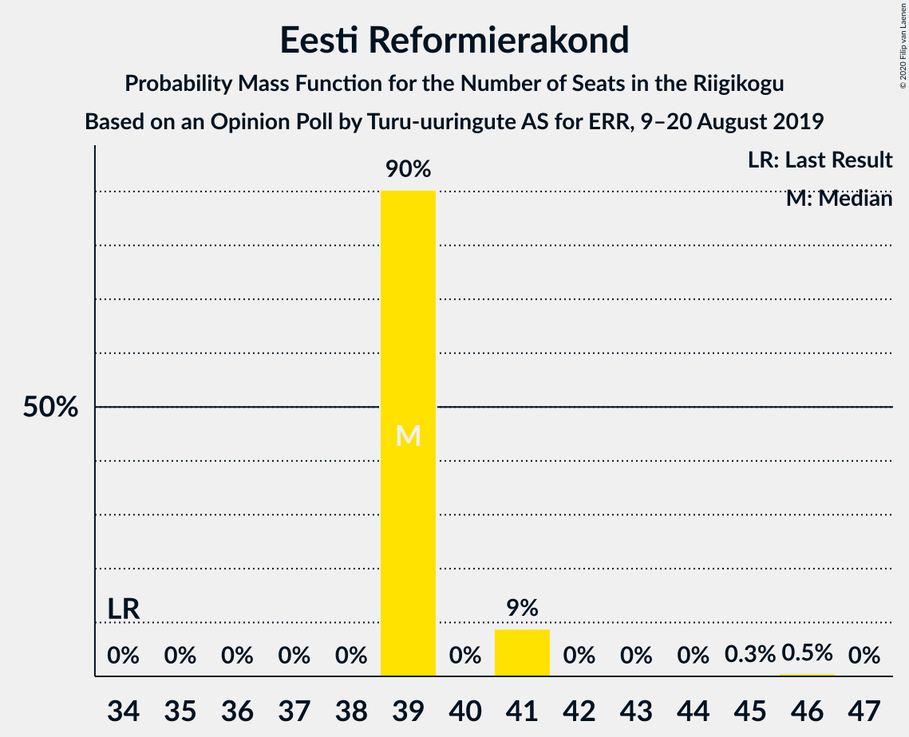

| Number of Seats | Probability | Accumulated | Special Marks |
|:---------------:|:-----------:|:-----------:|:-------------:|
| 34 | 0% | 100% | Last Result |
| 35 | 0% | 100% |  |
| 36 | 0% | 100% |  |
| 37 | 0% | 100% |  |
| 38 | 0% | 100% |  |
| 39 | 90% | 100% | Median |
| 40 | 0% | 10% |  |
| 41 | 9% | 10% |  |
| 42 | 0% | 0.8% |  |
| 43 | 0% | 0.8% |  |
| 44 | 0% | 0.8% |  |
| 45 | 0.3% | 0.8% |  |
| 46 | 0.5% | 0.5% |  |
| 47 | 0% | 0% |  |

### Eesti Keskerakond

*For a full overview of the results for this party, see the [Eesti Keskerakond](party-eestikeskerakond.html) page.*

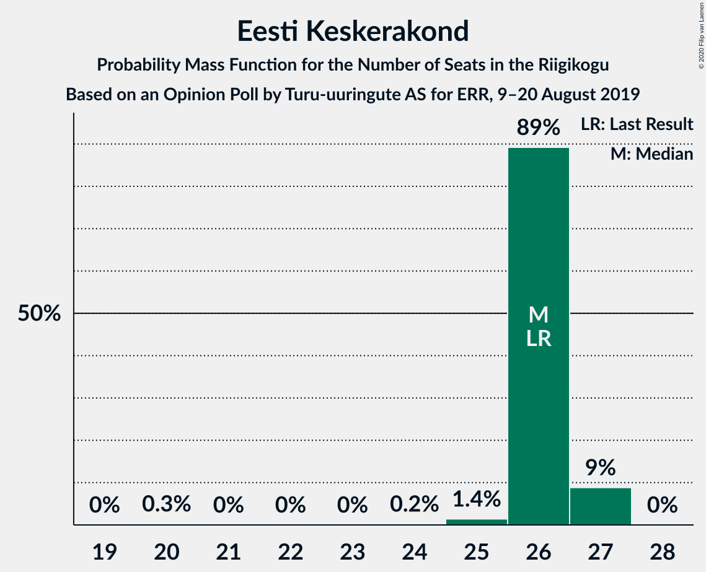

| Number of Seats | Probability | Accumulated | Special Marks |
|:---------------:|:-----------:|:-----------:|:-------------:|
| 20 | 0.3% | 100% |  |
| 21 | 0% | 99.7% |  |
| 22 | 0% | 99.7% |  |
| 23 | 0% | 99.7% |  |
| 24 | 0.2% | 99.7% |  |
| 25 | 1.4% | 99.5% |  |
| 26 | 89% | 98% | Last Result, Median |
| 27 | 9% | 9% |  |
| 28 | 0% | 0% |  |

### Eesti Konservatiivne Rahvaerakond

*For a full overview of the results for this party, see the [Eesti Konservatiivne Rahvaerakond](party-eestikonservatiivnerahvaerakond.html) page.*

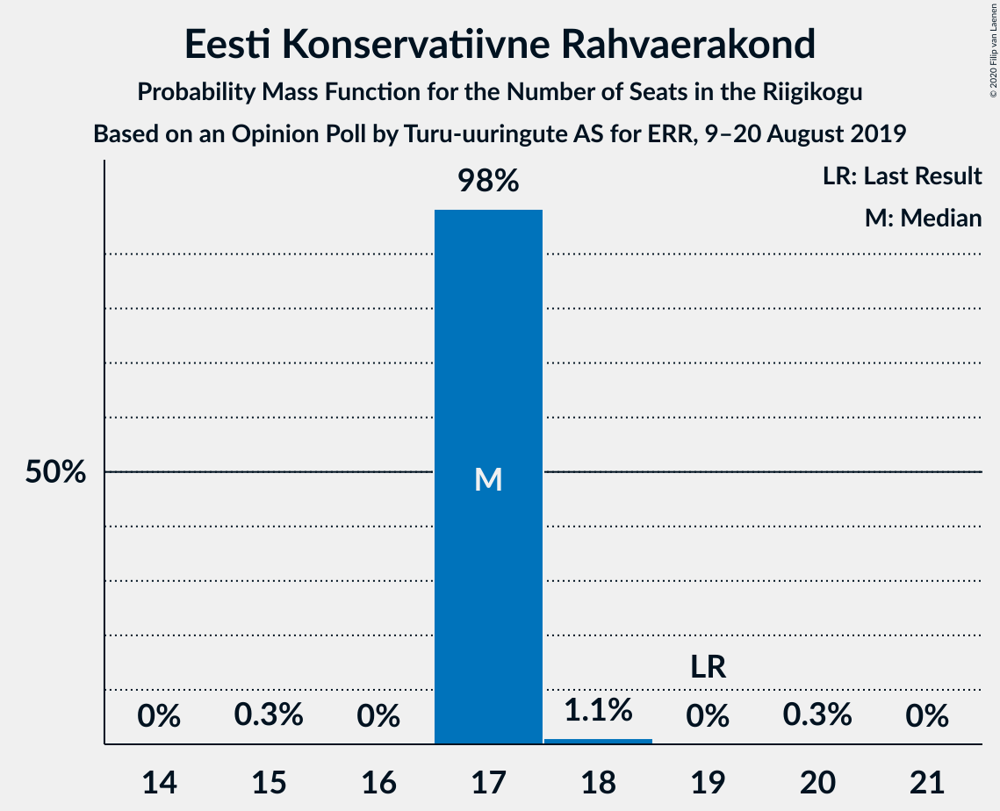

| Number of Seats | Probability | Accumulated | Special Marks |
|:---------------:|:-----------:|:-----------:|:-------------:|
| 15 | 0.3% | 100% |  |
| 16 | 0% | 99.7% |  |
| 17 | 98% | 99.7% | Median |
| 18 | 1.1% | 1.4% |  |
| 19 | 0% | 0.3% | Last Result |
| 20 | 0.3% | 0.3% |  |
| 21 | 0% | 0% |  |

### Sotsiaaldemokraatlik Erakond

*For a full overview of the results for this party, see the [Sotsiaaldemokraatlik Erakond](party-sotsiaaldemokraatlikerakond.html) page.*

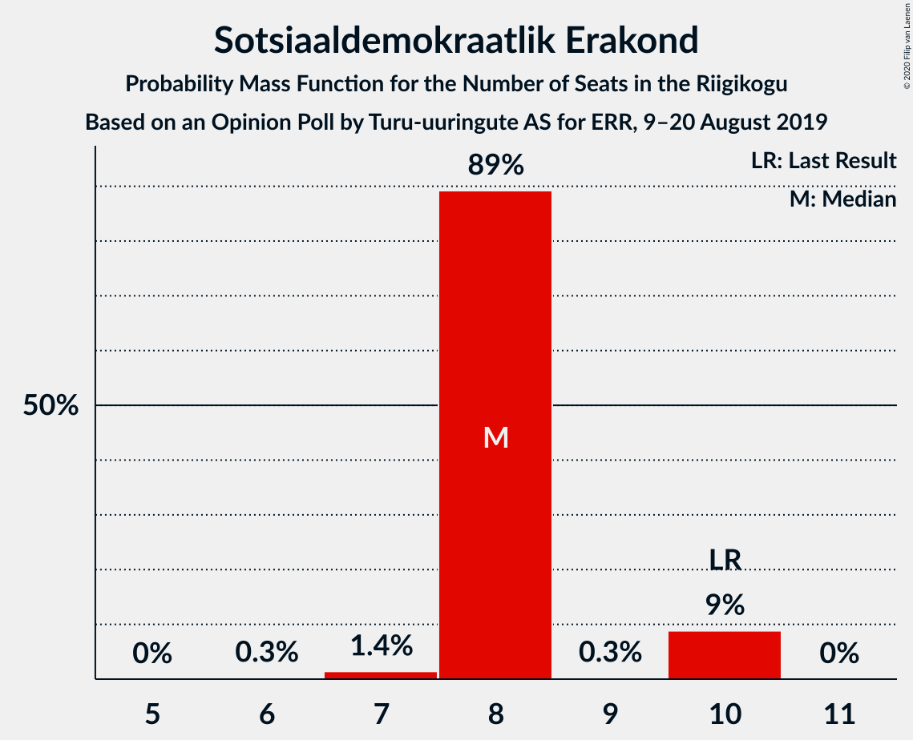

| Number of Seats | Probability | Accumulated | Special Marks |
|:---------------:|:-----------:|:-----------:|:-------------:|
| 6 | 0.3% | 100% |  |
| 7 | 1.4% | 99.7% |  |
| 8 | 89% | 98% | Median |
| 9 | 0.3% | 9% |  |
| 10 | 9% | 9% | Last Result |
| 11 | 0% | 0% |  |

### Erakond Isamaa

*For a full overview of the results for this party, see the [Erakond Isamaa](party-erakondisamaa.html) page.*

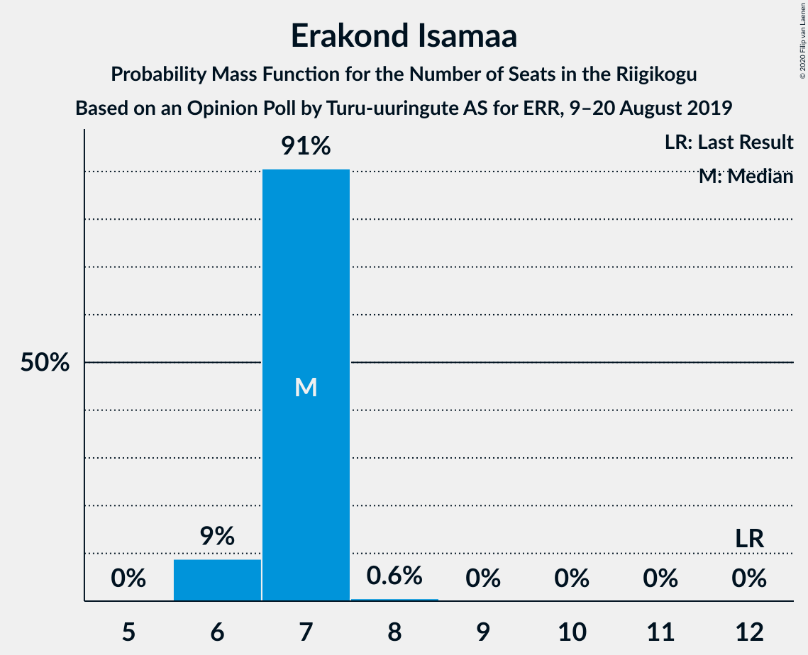

| Number of Seats | Probability | Accumulated | Special Marks |
|:---------------:|:-----------:|:-----------:|:-------------:|
| 6 | 9% | 100% |  |
| 7 | 91% | 91% | Median |
| 8 | 0.6% | 0.6% |  |
| 9 | 0% | 0% |  |
| 10 | 0% | 0% |  |
| 11 | 0% | 0% |  |
| 12 | 0% | 0% | Last Result |

### Eesti 200

*For a full overview of the results for this party, see the [Eesti 200](party-eesti200.html) page.*

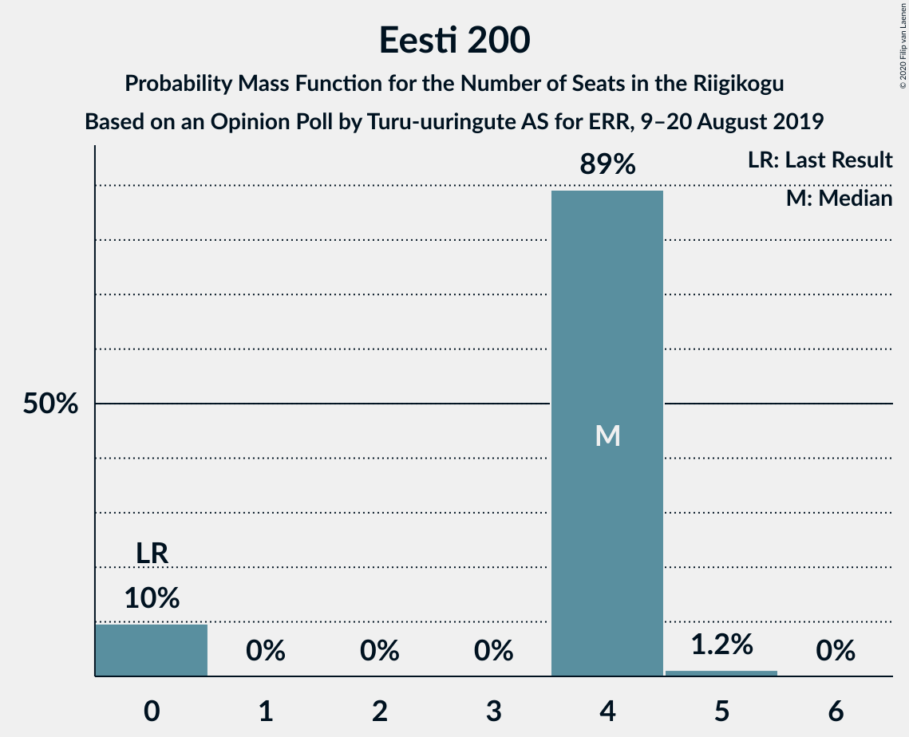

| Number of Seats | Probability | Accumulated | Special Marks |
|:---------------:|:-----------:|:-----------:|:-------------:|
| 0 | 10% | 100% | Last Result |
| 1 | 0% | 90% |  |
| 2 | 0% | 90% |  |
| 3 | 0% | 90% |  |
| 4 | 89% | 90% | Median |
| 5 | 1.2% | 1.2% |  |
| 6 | 0% | 0% |  |

### Erakond Eestimaa Rohelised

*For a full overview of the results for this party, see the [Erakond Eestimaa Rohelised](party-erakondeestimaarohelised.html) page.*

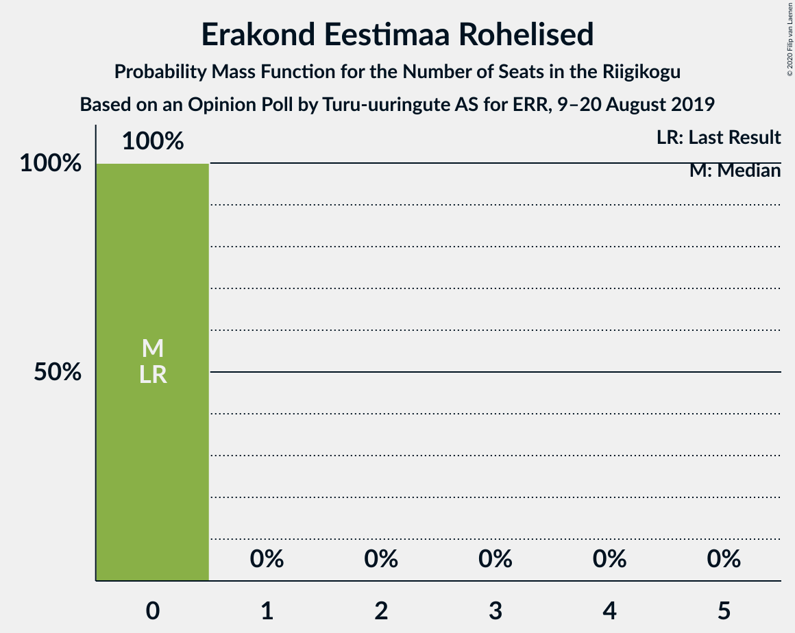

| Number of Seats | Probability | Accumulated | Special Marks |
|:---------------:|:-----------:|:-----------:|:-------------:|
| 0 | 100% | 100% | Last Result, Median |

### Eesti Vabaerakond

*For a full overview of the results for this party, see the [Eesti Vabaerakond](party-eestivabaerakond.html) page.*

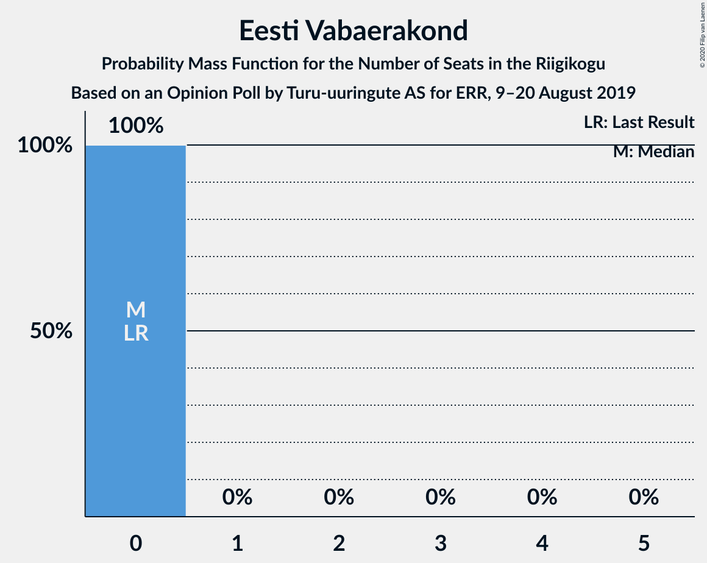

| Number of Seats | Probability | Accumulated | Special Marks |
|:---------------:|:-----------:|:-----------:|:-------------:|
| 0 | 100% | 100% | Last Result, Median |

## Coalitions

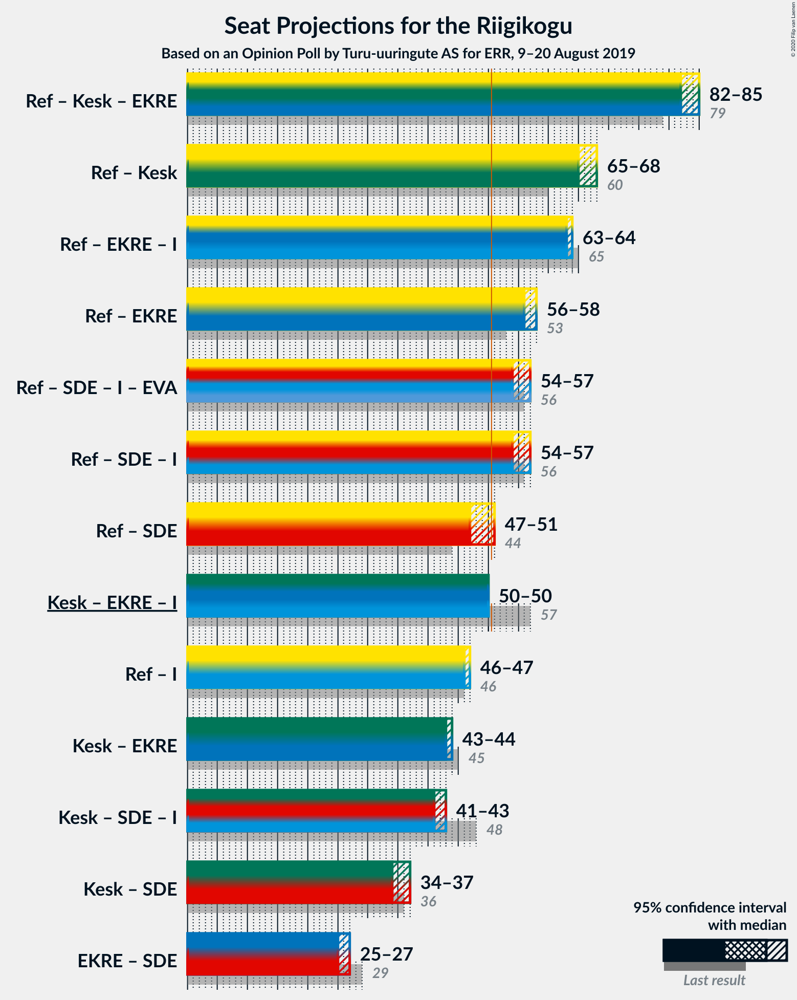

### Confidence Intervals

| Coalition | Last Result | Median | Majority? | 80% Confidence Interval | 90% Confidence Interval | 95% Confidence Interval | 99% Confidence Interval |
|:---------:|:-----------:|:------:|:---------:|:-----------------------:|:-----------------------:|:-----------------------:|:-----------------------:|
| Eesti Reformierakond – Eesti Keskerakond – Eesti Konservatiivne Rahvaerakond | 79 | 82 | 100% | 82 | 82–85 | 82–85 | 82–86 |
| Eesti Reformierakond – Eesti Keskerakond | 60 | 65 | 100% | 65 | 65–68 | 65–68 | 64–70 |
| Eesti Reformierakond – Eesti Konservatiivne Rahvaerakond – Erakond Isamaa | 65 | 63 | 100% | 63–64 | 63–64 | 63–64 | 63–69 |
| Eesti Reformierakond – Eesti Konservatiivne Rahvaerakond | 53 | 56 | 100% | 56–57 | 56–58 | 56–58 | 56–63 |
| Eesti Reformierakond – Sotsiaaldemokraatlik Erakond – Erakond Isamaa – Eesti Vabaerakond | 56 | 54 | 100% | 54 | 54–57 | 54–57 | 53–61 |
| Eesti Reformierakond – Sotsiaaldemokraatlik Erakond – Erakond Isamaa | 56 | 54 | 100% | 54 | 54–57 | 54–57 | 53–61 |
| Eesti Reformierakond – Sotsiaaldemokraatlik Erakond | 44 | 47 | 10% | 47 | 47–51 | 47–51 | 46–53 |
| Eesti Keskerakond – Eesti Konservatiivne Rahvaerakond – Erakond Isamaa | 57 | 50 | 0% | 50 | 50 | 50 | 48–50 |
| Eesti Reformierakond – Erakond Isamaa | 46 | 46 | 0.8% | 46 | 46–47 | 46–47 | 46–54 |
| Eesti Keskerakond – Eesti Konservatiivne Rahvaerakond | 45 | 43 | 0% | 43 | 43–44 | 43–44 | 40–44 |
| Eesti Keskerakond – Sotsiaaldemokraatlik Erakond – Erakond Isamaa | 48 | 41 | 0% | 41 | 41–43 | 41–43 | 38–43 |
| Eesti Keskerakond – Sotsiaaldemokraatlik Erakond | 36 | 34 | 0% | 34 | 34–37 | 34–37 | 30–37 |
| Eesti Konservatiivne Rahvaerakond – Sotsiaaldemokraatlik Erakond | 29 | 25 | 0% | 25 | 25–27 | 25–27 | 23–27 |

### Eesti Reformierakond – Eesti Keskerakond – Eesti Konservatiivne Rahvaerakond

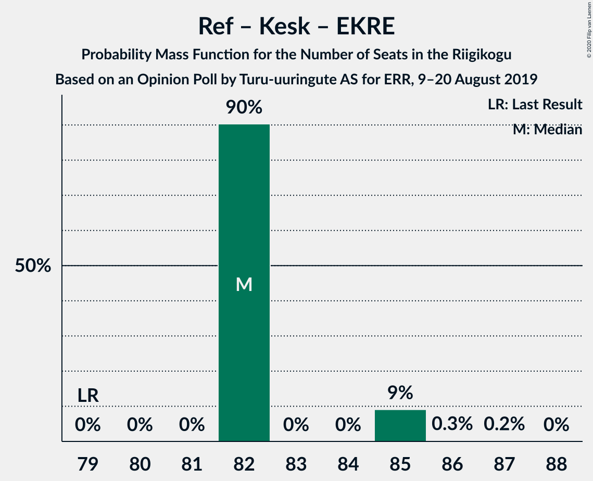

| Number of Seats | Probability | Accumulated | Special Marks |
|:---------------:|:-----------:|:-----------:|:-------------:|
| 79 | 0% | 100% | Last Result |
| 80 | 0% | 100% |  |
| 81 | 0% | 100% |  |
| 82 | 90% | 99.9% | Median |
| 83 | 0% | 10% |  |
| 84 | 0% | 10% |  |
| 85 | 9% | 10% |  |
| 86 | 0.3% | 0.6% |  |
| 87 | 0.2% | 0.3% |  |
| 88 | 0% | 0% |  |

### Eesti Reformierakond – Eesti Keskerakond

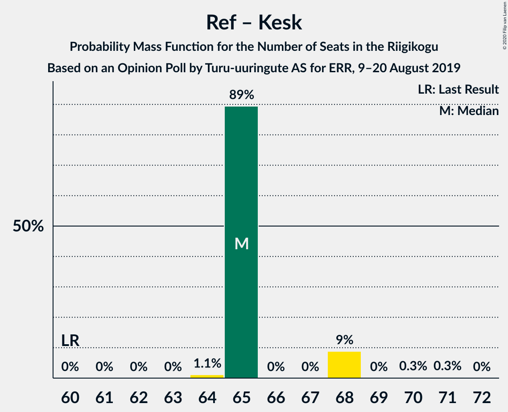

| Number of Seats | Probability | Accumulated | Special Marks |
|:---------------:|:-----------:|:-----------:|:-------------:|
| 60 | 0% | 100% | Last Result |
| 61 | 0% | 100% |  |
| 62 | 0% | 100% |  |
| 63 | 0% | 100% |  |
| 64 | 1.1% | 100% |  |
| 65 | 89% | 98.8% | Median |
| 66 | 0% | 9% |  |
| 67 | 0% | 9% |  |
| 68 | 9% | 9% |  |
| 69 | 0% | 0.6% |  |
| 70 | 0.3% | 0.6% |  |
| 71 | 0.3% | 0.3% |  |
| 72 | 0% | 0% |  |

### Eesti Reformierakond – Eesti Konservatiivne Rahvaerakond – Erakond Isamaa

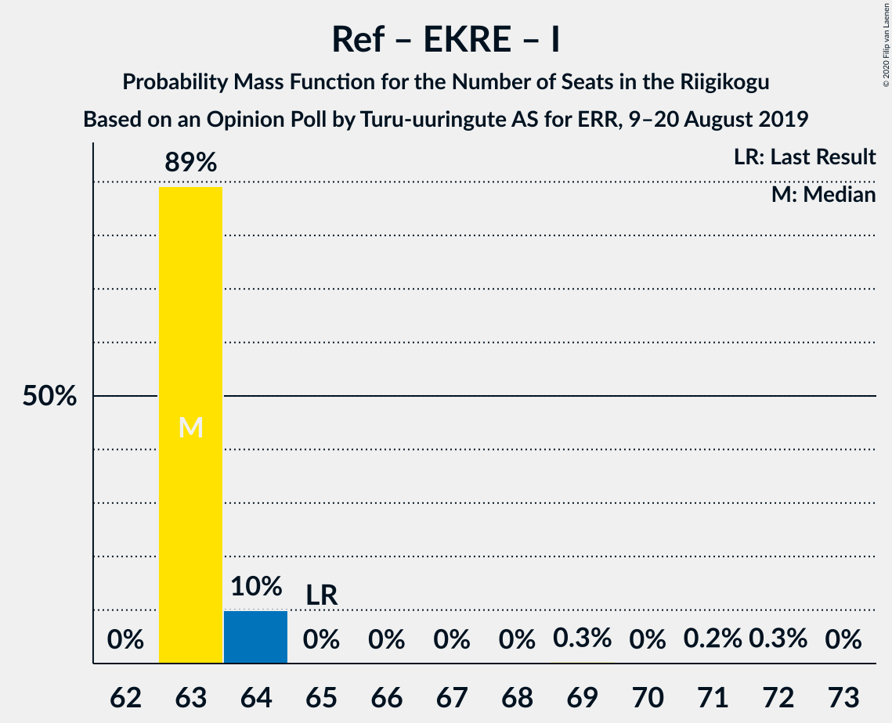

| Number of Seats | Probability | Accumulated | Special Marks |
|:---------------:|:-----------:|:-----------:|:-------------:|
| 63 | 89% | 100% | Median |
| 64 | 10% | 11% |  |
| 65 | 0% | 0.9% | Last Result |
| 66 | 0% | 0.8% |  |
| 67 | 0% | 0.8% |  |
| 68 | 0% | 0.8% |  |
| 69 | 0.3% | 0.8% |  |
| 70 | 0% | 0.5% |  |
| 71 | 0.2% | 0.5% |  |
| 72 | 0.3% | 0.3% |  |
| 73 | 0% | 0% |  |

### Eesti Reformierakond – Eesti Konservatiivne Rahvaerakond

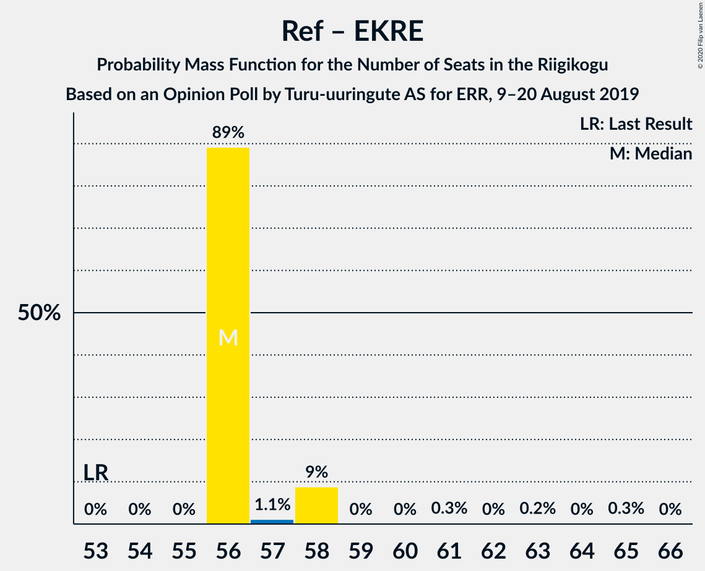

| Number of Seats | Probability | Accumulated | Special Marks |
|:---------------:|:-----------:|:-----------:|:-------------:|
| 53 | 0% | 100% | Last Result |
| 54 | 0% | 100% |  |
| 55 | 0% | 100% |  |
| 56 | 89% | 100% | Median |
| 57 | 1.1% | 11% |  |
| 58 | 9% | 10% |  |
| 59 | 0% | 0.8% |  |
| 60 | 0% | 0.8% |  |
| 61 | 0.3% | 0.8% |  |
| 62 | 0% | 0.5% |  |
| 63 | 0.2% | 0.5% |  |
| 64 | 0% | 0.3% |  |
| 65 | 0.3% | 0.3% |  |
| 66 | 0% | 0% |  |

### Eesti Reformierakond – Sotsiaaldemokraatlik Erakond – Erakond Isamaa – Eesti Vabaerakond

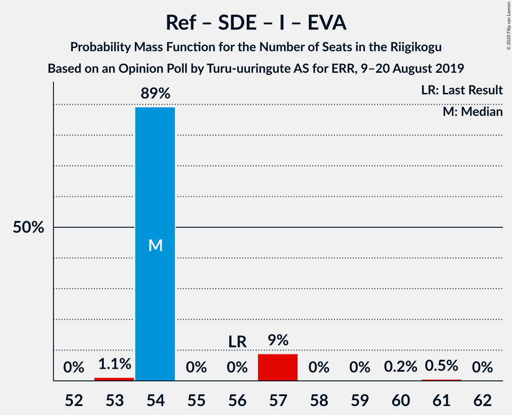

| Number of Seats | Probability | Accumulated | Special Marks |
|:---------------:|:-----------:|:-----------:|:-------------:|
| 53 | 1.1% | 100% |  |
| 54 | 89% | 98.9% | Median |
| 55 | 0% | 10% |  |
| 56 | 0% | 10% | Last Result |
| 57 | 9% | 10% |  |
| 58 | 0% | 0.8% |  |
| 59 | 0% | 0.8% |  |
| 60 | 0.2% | 0.8% |  |
| 61 | 0.5% | 0.6% |  |
| 62 | 0% | 0% |  |

### Eesti Reformierakond – Sotsiaaldemokraatlik Erakond – Erakond Isamaa

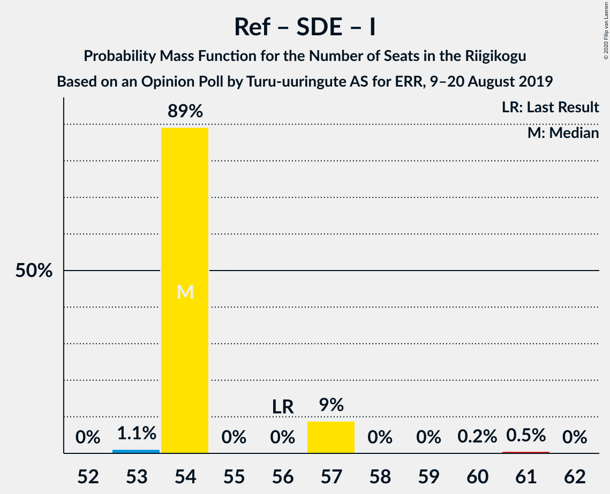

| Number of Seats | Probability | Accumulated | Special Marks |
|:---------------:|:-----------:|:-----------:|:-------------:|
| 53 | 1.1% | 100% |  |
| 54 | 89% | 98.9% | Median |
| 55 | 0% | 10% |  |
| 56 | 0% | 10% | Last Result |
| 57 | 9% | 10% |  |
| 58 | 0% | 0.8% |  |
| 59 | 0% | 0.8% |  |
| 60 | 0.2% | 0.8% |  |
| 61 | 0.5% | 0.6% |  |
| 62 | 0% | 0% |  |

### Eesti Reformierakond – Sotsiaaldemokraatlik Erakond

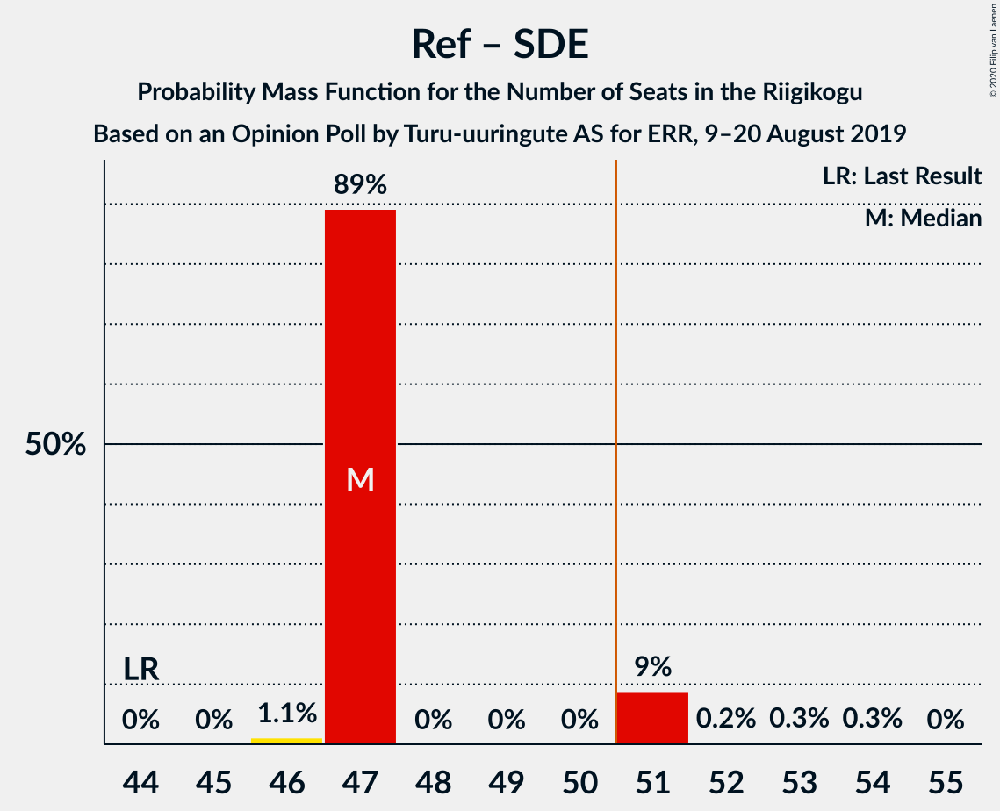

| Number of Seats | Probability | Accumulated | Special Marks |
|:---------------:|:-----------:|:-----------:|:-------------:|
| 44 | 0% | 100% | Last Result |
| 45 | 0% | 100% |  |
| 46 | 1.1% | 100% |  |
| 47 | 89% | 98.9% | Median |
| 48 | 0% | 10% |  |
| 49 | 0% | 10% |  |
| 50 | 0% | 10% |  |
| 51 | 9% | 10% | Majority |
| 52 | 0.2% | 0.8% |  |
| 53 | 0.3% | 0.6% |  |
| 54 | 0.3% | 0.3% |  |
| 55 | 0% | 0% |  |

### Eesti Keskerakond – Eesti Konservatiivne Rahvaerakond – Erakond Isamaa

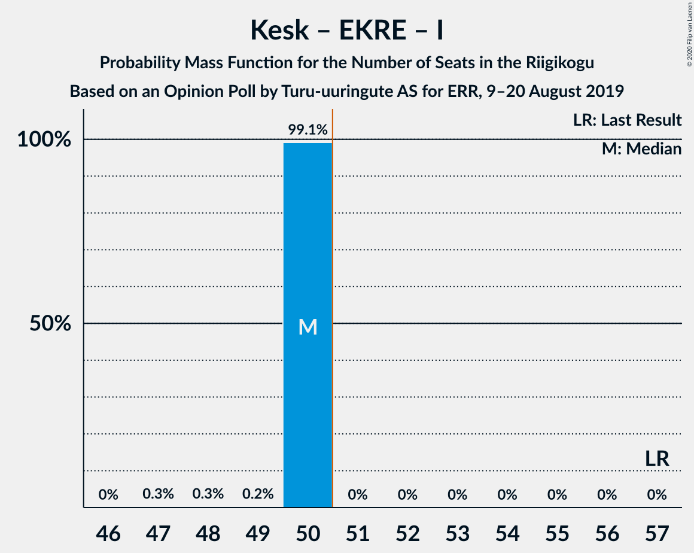

| Number of Seats | Probability | Accumulated | Special Marks |
|:---------------:|:-----------:|:-----------:|:-------------:|
| 47 | 0.3% | 100% |  |
| 48 | 0.3% | 99.7% |  |
| 49 | 0.2% | 99.4% |  |
| 50 | 99.1% | 99.2% | Median |
| 51 | 0% | 0% | Majority |
| 52 | 0% | 0% |  |
| 53 | 0% | 0% |  |
| 54 | 0% | 0% |  |
| 55 | 0% | 0% |  |
| 56 | 0% | 0% |  |
| 57 | 0% | 0% | Last Result |

### Eesti Reformierakond – Erakond Isamaa

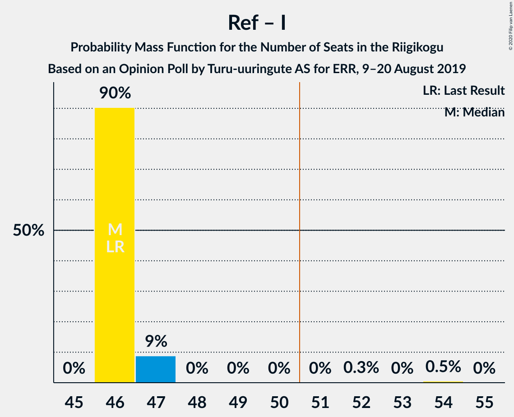

| Number of Seats | Probability | Accumulated | Special Marks |
|:---------------:|:-----------:|:-----------:|:-------------:|
| 46 | 90% | 100% | Last Result, Median |
| 47 | 9% | 10% |  |
| 48 | 0% | 0.9% |  |
| 49 | 0% | 0.8% |  |
| 50 | 0% | 0.8% |  |
| 51 | 0% | 0.8% | Majority |
| 52 | 0.3% | 0.8% |  |
| 53 | 0% | 0.5% |  |
| 54 | 0.5% | 0.5% |  |
| 55 | 0% | 0% |  |

### Eesti Keskerakond – Eesti Konservatiivne Rahvaerakond

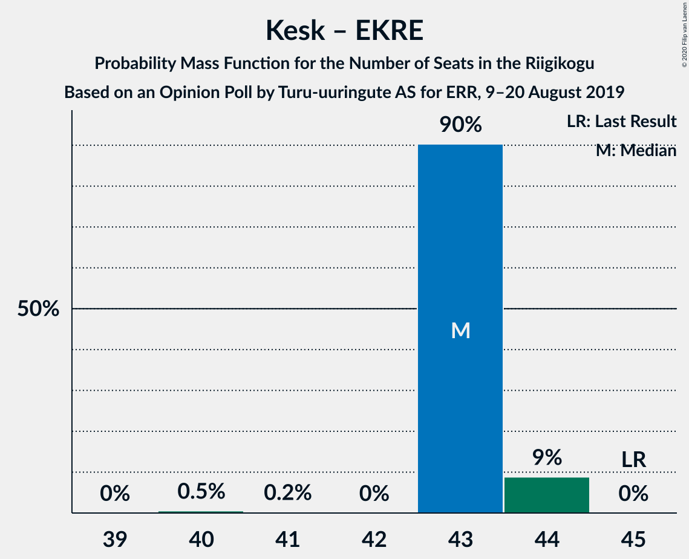

| Number of Seats | Probability | Accumulated | Special Marks |
|:---------------:|:-----------:|:-----------:|:-------------:|
| 40 | 0.5% | 100% |  |
| 41 | 0.2% | 99.4% |  |
| 42 | 0% | 99.2% |  |
| 43 | 90% | 99.2% | Median |
| 44 | 9% | 9% |  |
| 45 | 0% | 0% | Last Result |

### Eesti Keskerakond – Sotsiaaldemokraatlik Erakond – Erakond Isamaa

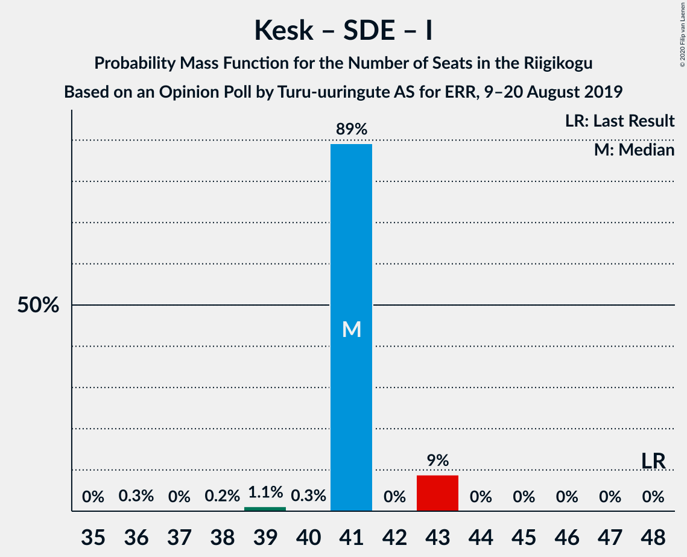

| Number of Seats | Probability | Accumulated | Special Marks |
|:---------------:|:-----------:|:-----------:|:-------------:|
| 36 | 0.3% | 100% |  |
| 37 | 0% | 99.7% |  |
| 38 | 0.2% | 99.7% |  |
| 39 | 1.1% | 99.5% |  |
| 40 | 0.3% | 98% |  |
| 41 | 89% | 98% | Median |
| 42 | 0% | 9% |  |
| 43 | 9% | 9% |  |
| 44 | 0% | 0% |  |
| 45 | 0% | 0% |  |
| 46 | 0% | 0% |  |
| 47 | 0% | 0% |  |
| 48 | 0% | 0% | Last Result |

### Eesti Keskerakond – Sotsiaaldemokraatlik Erakond

| Number of Seats | Probability | Accumulated | Special Marks |
|:---------------:|:-----------:|:-----------:|:-------------:|
| 29 | 0.3% | 100% |  |
| 30 | 0.2% | 99.7% |  |
| 31 | 0% | 99.5% |  |
| 32 | 1.4% | 99.5% |  |
| 33 | 0% | 98% |  |
| 34 | 89% | 98% | Median |
| 35 | 0% | 9% |  |
| 36 | 0% | 9% | Last Result |
| 37 | 9% | 9% |  |
| 38 | 0% | 0% |  |

### Eesti Konservatiivne Rahvaerakond – Sotsiaaldemokraatlik Erakond

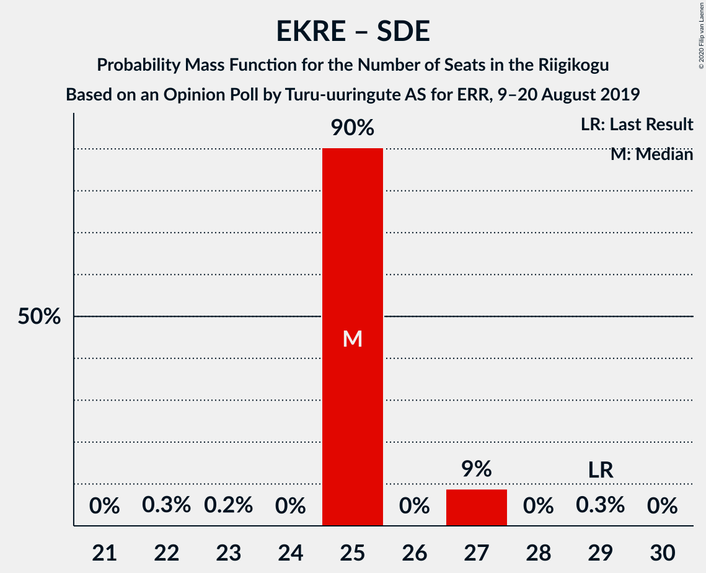

| Number of Seats | Probability | Accumulated | Special Marks |
|:---------------:|:-----------:|:-----------:|:-------------:|
| 22 | 0.3% | 100% |  |
| 23 | 0.2% | 99.7% |  |
| 24 | 0% | 99.5% |  |
| 25 | 90% | 99.5% | Median |
| 26 | 0% | 9% |  |
| 27 | 9% | 9% |  |
| 28 | 0% | 0.3% |  |
| 29 | 0.3% | 0.3% | Last Result |
| 30 | 0% | 0% |  |

## Technical Information

### Opinion Poll

+ **Polling firm:** Turu-uuringute AS
+ **Commissioner(s):** ERR
+ **Fieldwork period:** 9–20 August 2019

### Calculations

+ **Sample size:** 1000
+ **Simulations done:** 1,024
+ **Error estimate:** 4.62%

