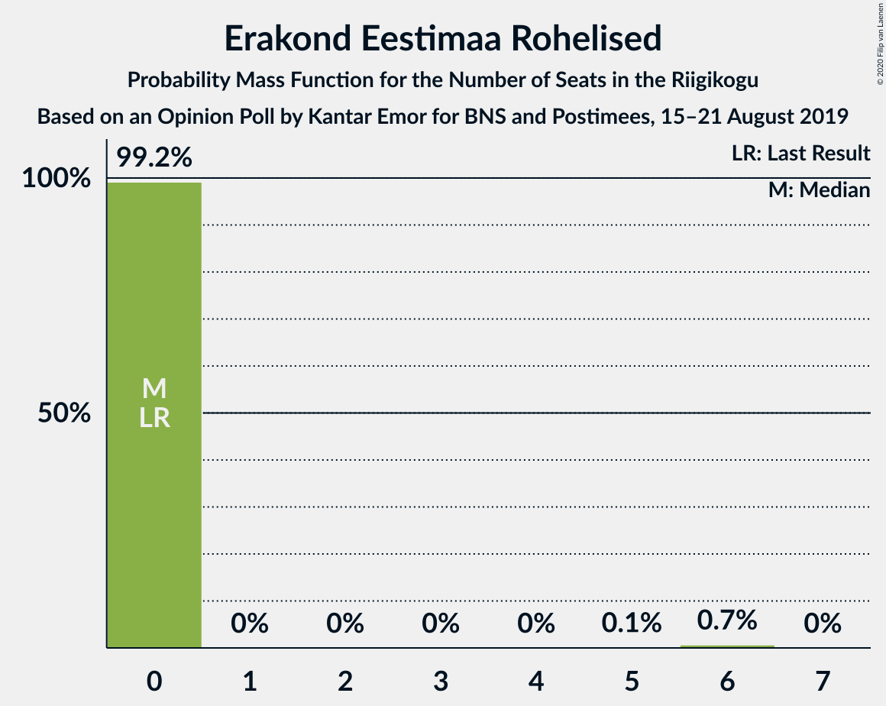

# Opinion Poll by Kantar Emor for BNS and Postimees, 15–21 August 2019

<a href="#voting-intentions">Voting Intentions</a> | <a href="#seats">Seats</a> | <a href="#coalitions">Coalitions</a> | <a href="#technical-information">Technical Information</a>

## Voting Intentions

### Confidence Intervals

| Party | Last Result | Poll Result | 80% Confidence Interval | 90% Confidence Interval | 95% Confidence Interval | 99% Confidence Interval |
|:-----:|:-----------:|:-----------:|:-----------------------:|:-----------------------:|:-----------------------:|:-----------------------:|
| Eesti Reformierakond | 28.9% | 36.4% | 34.6–38.3% |34.1–38.8% |33.7–39.2% |32.9–40.1% |
| Eesti Konservatiivne Rahvaerakond | 17.8% | 17.4% | 16.0–18.9% |15.7–19.3% |15.3–19.7% |14.7–20.4% |
| Eesti Keskerakond | 23.1% | 15.8% | 14.5–17.3% |14.2–17.7% |13.9–18.1% |13.3–18.8% |
| Sotsiaaldemokraatlik Erakond | 9.8% | 12.8% | 11.6–14.2% |11.3–14.6% |11.0–14.9% |10.5–15.5% |
| Eesti 200 | 4.4% | 6.8% | 5.9–7.8% |5.7–8.1% |5.5–8.4% |5.1–8.9% |
| Erakond Isamaa | 11.4% | 4.7% | 4.0–5.6% |3.8–5.9% |3.7–6.1% |3.3–6.6% |
| Erakond Eestimaa Rohelised | 1.8% | 4.0% | 3.3–4.8% |3.1–5.0% |3.0–5.3% |2.7–5.7% |
| Eesti Vabaerakond | 1.2% | 0.9% | 0.7–1.4% |0.6–1.6% |0.5–1.7% |0.4–2.0% |

*Note:* The poll result column reflects the actual value used in the calculations. Published results may vary slightly, and in addition be rounded to fewer digits.

## Seats

### Confidence Intervals

| Party | Last Result | Median | 80% Confidence Interval | 90% Confidence Interval | 95% Confidence Interval | 99% Confidence Interval |
|:-----:|:-----------:|:------:|:-----------------------:|:-----------------------:|:-----------------------:|:-----------------------:|
| <a href="#eesti-reformierakond">Eesti Reformierakond</a> | 34 | 42 | 41–42 |41–46 |41–46 |38–46 |
| <a href="#eesti-konservatiivne-rahvaerakond">Eesti Konservatiivne Rahvaerakond</a> | 19 | 19 | 18–21 |17–21 |17–21 |17–21 |
| <a href="#eesti-keskerakond">Eesti Keskerakond</a> | 26 | 16 | 16–17 |16–17 |16–17 |15–21 |
| <a href="#sotsiaaldemokraatlik-erakond">Sotsiaaldemokraatlik Erakond</a> | 10 | 13 | 12–13 |12–13 |12–13 |12–16 |
| <a href="#eesti-200">Eesti 200</a> | 0 | 6 | 5–7 |5–9 |5–9 |5–9 |
| <a href="#erakond-isamaa">Erakond Isamaa</a> | 12 | 6 | 4–6 |0–6 |0–6 |0–6 |
| <a href="#erakond-eestimaa-rohelised">Erakond Eestimaa Rohelised</a> | 0 | 0 | 0 |0 |0 |0–6 |
| <a href="#eesti-vabaerakond">Eesti Vabaerakond</a> | 0 | 0 | 0 |0 |0 |0 |

### Eesti Reformierakond

*For a full overview of the results for this party, see the [Eesti Reformierakond](party-eestireformierakond.html) page.*

| Number of Seats | Probability | Accumulated | Special Marks |
|:---------------:|:-----------:|:-----------:|:-------------:|
| 34 | 0% | 100% | Last Result |
| 35 | 0% | 100% |  |
| 36 | 0% | 100% |  |
| 37 | 0% | 100% |  |
| 38 | 0.8% | 100% |  |
| 39 | 0.1% | 99.2% |  |
| 40 | 0.2% | 99.1% |  |
| 41 | 19% | 98.9% |  |
| 42 | 71% | 79% | Median |
| 43 | 1.0% | 8% |  |
| 44 | 1.0% | 7% |  |
| 45 | 0% | 6% |  |
| 46 | 6% | 6% |  |
| 47 | 0% | 0.1% |  |
| 48 | 0% | 0% |  |

### Eesti Konservatiivne Rahvaerakond

*For a full overview of the results for this party, see the [Eesti Konservatiivne Rahvaerakond](party-eestikonservatiivnerahvaerakond.html) page.*

| Number of Seats | Probability | Accumulated | Special Marks |
|:---------------:|:-----------:|:-----------:|:-------------:|
| 16 | 0.1% | 100% |  |
| 17 | 6% | 99.9% |  |
| 18 | 42% | 94% |  |
| 19 | 31% | 52% | Last Result, Median |
| 20 | 1.0% | 21% |  |
| 21 | 20% | 20% |  |
| 22 | 0% | 0% |  |

### Eesti Keskerakond

*For a full overview of the results for this party, see the [Eesti Keskerakond](party-eestikeskerakond.html) page.*

| Number of Seats | Probability | Accumulated | Special Marks |
|:---------------:|:-----------:|:-----------:|:-------------:|
| 14 | 0% | 100% |  |
| 15 | 1.2% | 99.9% |  |
| 16 | 77% | 98.8% | Median |
| 17 | 19% | 21% |  |
| 18 | 1.0% | 2% |  |
| 19 | 0% | 0.8% |  |
| 20 | 0% | 0.8% |  |
| 21 | 0.8% | 0.8% |  |
| 22 | 0% | 0% |  |
| 23 | 0% | 0% |  |
| 24 | 0% | 0% |  |
| 25 | 0% | 0% |  |
| 26 | 0% | 0% | Last Result |

### Sotsiaaldemokraatlik Erakond

*For a full overview of the results for this party, see the [Sotsiaaldemokraatlik Erakond](party-sotsiaaldemokraatlikerakond.html) page.*

| Number of Seats | Probability | Accumulated | Special Marks |
|:---------------:|:-----------:|:-----------:|:-------------:|
| 10 | 0% | 100% | Last Result |
| 11 | 0% | 100% |  |
| 12 | 32% | 100% |  |
| 13 | 66% | 68% | Median |
| 14 | 0.7% | 2% |  |
| 15 | 0.7% | 1.3% |  |
| 16 | 0.3% | 0.6% |  |
| 17 | 0.2% | 0.3% |  |
| 18 | 0% | 0% |  |

### Eesti 200

*For a full overview of the results for this party, see the [Eesti 200](party-eesti200.html) page.*

| Number of Seats | Probability | Accumulated | Special Marks |
|:---------------:|:-----------:|:-----------:|:-------------:|
| 0 | 0% | 100% | Last Result |
| 1 | 0% | 100% |  |
| 2 | 0% | 100% |  |
| 3 | 0% | 100% |  |
| 4 | 0% | 100% |  |
| 5 | 19% | 100% |  |
| 6 | 60% | 81% | Median |
| 7 | 14% | 21% |  |
| 8 | 0.4% | 6% |  |
| 9 | 6% | 6% |  |
| 10 | 0% | 0% |  |

### Erakond Isamaa

*For a full overview of the results for this party, see the [Erakond Isamaa](party-erakondisamaa.html) page.*

| Number of Seats | Probability | Accumulated | Special Marks |
|:---------------:|:-----------:|:-----------:|:-------------:|
| 0 | 9% | 100% |  |
| 1 | 0% | 91% |  |
| 2 | 0% | 91% |  |
| 3 | 0% | 91% |  |
| 4 | 19% | 91% |  |
| 5 | 12% | 72% |  |
| 6 | 60% | 60% | Median |
| 7 | 0.1% | 0.1% |  |
| 8 | 0% | 0% |  |
| 9 | 0% | 0% |  |
| 10 | 0% | 0% |  |
| 11 | 0% | 0% |  |
| 12 | 0% | 0% | Last Result |

### Erakond Eestimaa Rohelised

*For a full overview of the results for this party, see the [Erakond Eestimaa Rohelised](party-erakondeestimaarohelised.html) page.*

| Number of Seats | Probability | Accumulated | Special Marks |
|:---------------:|:-----------:|:-----------:|:-------------:|
| 0 | 99.2% | 100% | Last Result, Median |
| 1 | 0% | 0.8% |  |
| 2 | 0% | 0.8% |  |
| 3 | 0% | 0.8% |  |
| 4 | 0% | 0.8% |  |
| 5 | 0.1% | 0.8% |  |
| 6 | 0.7% | 0.7% |  |
| 7 | 0% | 0% |  |

### Eesti Vabaerakond

*For a full overview of the results for this party, see the [Eesti Vabaerakond](party-eestivabaerakond.html) page.*

| Number of Seats | Probability | Accumulated | Special Marks |
|:---------------:|:-----------:|:-----------:|:-------------:|
| 0 | 100% | 100% | Last Result, Median |

## Coalitions

### Confidence Intervals

| Coalition | Last Result | Median | Majority? | 80% Confidence Interval | 90% Confidence Interval | 95% Confidence Interval | 99% Confidence Interval |
|:---------:|:-----------:|:------:|:---------:|:-----------------------:|:-----------------------:|:-----------------------:|:-----------------------:|
| Eesti Reformierakond – Eesti Konservatiivne Rahvaerakond – Eesti Keskerakond | 79 | 77 | 100% | 76–79 | 76–79 | 76–80 | 74–82 |
| Eesti Reformierakond – Eesti Konservatiivne Rahvaerakond – Erakond Isamaa | 65 | 66 | 100% | 64–67 | 63–67 | 63–67 | 59–67 |
| Eesti Reformierakond – Eesti Konservatiivne Rahvaerakond | 53 | 61 | 100% | 60–62 | 60–63 | 60–63 | 59–64 |
| Eesti Reformierakond – Eesti Keskerakond | 60 | 58 | 100% | 58 | 58–62 | 58–62 | 56–62 |
| Eesti Reformierakond – Sotsiaaldemokraatlik Erakond – Erakond Isamaa – Eesti Vabaerakond | 56 | 61 | 100% | 57–61 | 57–61 | 56–61 | 52–61 |
| Eesti Reformierakond – Sotsiaaldemokraatlik Erakond – Erakond Isamaa | 56 | 61 | 100% | 57–61 | 57–61 | 56–61 | 52–61 |
| Eesti Reformierakond – Sotsiaaldemokraatlik Erakond | 44 | 55 | 99.9% | 53–55 | 53–59 | 53–59 | 52–59 |
| Eesti Reformierakond – Erakond Isamaa | 46 | 48 | 0% | 45–48 | 45–48 | 43–48 | 38–48 |
| Eesti Konservatiivne Rahvaerakond – Eesti Keskerakond – Erakond Isamaa | 57 | 40 | 0% | 40–42 | 33–42 | 33–42 | 33–42 |
| Eesti Konservatiivne Rahvaerakond – Eesti Keskerakond | 45 | 35 | 0% | 34–38 | 33–38 | 33–38 | 33–42 |
| Eesti Keskerakond – Sotsiaaldemokraatlik Erakond – Erakond Isamaa | 48 | 35 | 0% | 33–35 | 29–35 | 29–35 | 29–36 |
| Eesti Konservatiivne Rahvaerakond – Sotsiaaldemokraatlik Erakond | 29 | 31 | 0% | 31–33 | 30–33 | 30–33 | 30–35 |
| Eesti Keskerakond – Sotsiaaldemokraatlik Erakond | 36 | 29 | 0% | 28–29 | 28–29 | 28–30 | 28–35 |

### Eesti Reformierakond – Eesti Konservatiivne Rahvaerakond – Eesti Keskerakond

| Number of Seats | Probability | Accumulated | Special Marks |
|:---------------:|:-----------:|:-----------:|:-------------:|
| 71 | 0.1% | 100% |  |
| 72 | 0% | 99.9% |  |
| 73 | 0% | 99.8% |  |
| 74 | 1.0% | 99.8% |  |
| 75 | 0.3% | 98.8% |  |
| 76 | 41% | 98.5% |  |
| 77 | 30% | 58% | Median |
| 78 | 0% | 27% |  |
| 79 | 24% | 27% | Last Result |
| 80 | 0.7% | 3% |  |
| 81 | 1.0% | 2% |  |
| 82 | 1.0% | 1.1% |  |
| 83 | 0% | 0% |  |

### Eesti Reformierakond – Eesti Konservatiivne Rahvaerakond – Erakond Isamaa

| Number of Seats | Probability | Accumulated | Special Marks |
|:---------------:|:-----------:|:-----------:|:-------------:|
| 59 | 1.5% | 100% |  |
| 60 | 0% | 98.5% |  |
| 61 | 0% | 98.5% |  |
| 62 | 0% | 98.5% |  |
| 63 | 6% | 98% |  |
| 64 | 2% | 92% |  |
| 65 | 0% | 90% | Last Result |
| 66 | 71% | 90% |  |
| 67 | 18% | 19% | Median |
| 68 | 0% | 0% |  |

### Eesti Reformierakond – Eesti Konservatiivne Rahvaerakond

| Number of Seats | Probability | Accumulated | Special Marks |
|:---------------:|:-----------:|:-----------:|:-------------:|
| 53 | 0% | 100% | Last Result |
| 54 | 0.1% | 100% |  |
| 55 | 0% | 99.9% |  |
| 56 | 0.1% | 99.9% |  |
| 57 | 0% | 99.8% |  |
| 58 | 0% | 99.8% |  |
| 59 | 2% | 99.7% |  |
| 60 | 41% | 98% |  |
| 61 | 30% | 57% | Median |
| 62 | 18% | 26% |  |
| 63 | 6% | 8% |  |
| 64 | 2% | 2% |  |
| 65 | 0% | 0% |  |

### Eesti Reformierakond – Eesti Keskerakond

| Number of Seats | Probability | Accumulated | Special Marks |
|:---------------:|:-----------:|:-----------:|:-------------:|
| 54 | 0.1% | 100% |  |
| 55 | 0% | 99.9% |  |
| 56 | 1.2% | 99.8% |  |
| 57 | 0% | 98.6% |  |
| 58 | 90% | 98.6% | Median |
| 59 | 0.9% | 9% |  |
| 60 | 0% | 8% | Last Result |
| 61 | 2% | 8% |  |
| 62 | 6% | 6% |  |
| 63 | 0% | 0% |  |

### Eesti Reformierakond – Sotsiaaldemokraatlik Erakond – Erakond Isamaa – Eesti Vabaerakond

| Number of Seats | Probability | Accumulated | Special Marks |
|:---------------:|:-----------:|:-----------:|:-------------:|
| 52 | 0.7% | 100% |  |
| 53 | 0% | 99.2% |  |
| 54 | 0% | 99.2% |  |
| 55 | 1.1% | 99.2% |  |
| 56 | 1.1% | 98% | Last Result |
| 57 | 19% | 97% |  |
| 58 | 0% | 78% |  |
| 59 | 18% | 78% |  |
| 60 | 0% | 60% |  |
| 61 | 60% | 60% | Median |
| 62 | 0.4% | 0.4% |  |
| 63 | 0% | 0.1% |  |
| 64 | 0% | 0.1% |  |
| 65 | 0% | 0% |  |

### Eesti Reformierakond – Sotsiaaldemokraatlik Erakond – Erakond Isamaa

| Number of Seats | Probability | Accumulated | Special Marks |
|:---------------:|:-----------:|:-----------:|:-------------:|
| 52 | 0.7% | 100% |  |
| 53 | 0% | 99.2% |  |
| 54 | 0% | 99.2% |  |
| 55 | 1.1% | 99.2% |  |
| 56 | 1.1% | 98% | Last Result |
| 57 | 19% | 97% |  |
| 58 | 0% | 78% |  |
| 59 | 18% | 78% |  |
| 60 | 0% | 60% |  |
| 61 | 60% | 60% | Median |
| 62 | 0.4% | 0.4% |  |
| 63 | 0% | 0.1% |  |
| 64 | 0% | 0.1% |  |
| 65 | 0% | 0% |  |

### Eesti Reformierakond – Sotsiaaldemokraatlik Erakond

| Number of Seats | Probability | Accumulated | Special Marks |
|:---------------:|:-----------:|:-----------:|:-------------:|
| 44 | 0% | 100% | Last Result |
| 45 | 0% | 100% |  |
| 46 | 0% | 100% |  |
| 47 | 0% | 100% |  |
| 48 | 0% | 100% |  |
| 49 | 0% | 100% |  |
| 50 | 0.1% | 100% |  |
| 51 | 0% | 99.9% | Majority |
| 52 | 0.9% | 99.9% |  |
| 53 | 18% | 99.0% |  |
| 54 | 12% | 81% |  |
| 55 | 60% | 69% | Median |
| 56 | 1.1% | 8% |  |
| 57 | 1.1% | 7% |  |
| 58 | 0.1% | 6% |  |
| 59 | 6% | 6% |  |
| 60 | 0% | 0% |  |

### Eesti Reformierakond – Erakond Isamaa

| Number of Seats | Probability | Accumulated | Special Marks |
|:---------------:|:-----------:|:-----------:|:-------------:|
| 38 | 0.7% | 100% |  |
| 39 | 0% | 99.3% |  |
| 40 | 0% | 99.3% |  |
| 41 | 0.7% | 99.3% |  |
| 42 | 0% | 98.6% |  |
| 43 | 1.1% | 98.5% |  |
| 44 | 1.2% | 97% |  |
| 45 | 18% | 96% |  |
| 46 | 6% | 78% | Last Result |
| 47 | 12% | 72% |  |
| 48 | 59% | 60% | Median |
| 49 | 0% | 0% |  |

### Eesti Konservatiivne Rahvaerakond – Eesti Keskerakond – Erakond Isamaa

| Number of Seats | Probability | Accumulated | Special Marks |
|:---------------:|:-----------:|:-----------:|:-------------:|
| 33 | 7% | 100% |  |
| 34 | 0% | 93% |  |
| 35 | 0% | 93% |  |
| 36 | 0% | 93% |  |
| 37 | 1.0% | 93% |  |
| 38 | 0.4% | 92% |  |
| 39 | 1.3% | 92% |  |
| 40 | 53% | 91% |  |
| 41 | 19% | 38% | Median |
| 42 | 19% | 19% |  |
| 43 | 0% | 0% |  |
| 44 | 0% | 0% |  |
| 45 | 0% | 0% |  |
| 46 | 0% | 0% |  |
| 47 | 0% | 0% |  |
| 48 | 0% | 0% |  |
| 49 | 0% | 0% |  |
| 50 | 0% | 0% |  |
| 51 | 0% | 0% | Majority |
| 52 | 0% | 0% |  |
| 53 | 0% | 0% |  |
| 54 | 0% | 0% |  |
| 55 | 0% | 0% |  |
| 56 | 0% | 0% |  |
| 57 | 0% | 0% | Last Result |

### Eesti Konservatiivne Rahvaerakond – Eesti Keskerakond

| Number of Seats | Probability | Accumulated | Special Marks |
|:---------------:|:-----------:|:-----------:|:-------------:|
| 31 | 0% | 100% |  |
| 32 | 0.2% | 99.9% |  |
| 33 | 7% | 99.8% |  |
| 34 | 41% | 93% |  |
| 35 | 31% | 52% | Median |
| 36 | 0% | 21% |  |
| 37 | 1.1% | 21% |  |
| 38 | 18% | 20% |  |
| 39 | 1.0% | 2% |  |
| 40 | 0% | 0.8% |  |
| 41 | 0% | 0.8% |  |
| 42 | 0.7% | 0.7% |  |
| 43 | 0% | 0% |  |
| 44 | 0% | 0% |  |
| 45 | 0% | 0% | Last Result |

### Eesti Keskerakond – Sotsiaaldemokraatlik Erakond – Erakond Isamaa

| Number of Seats | Probability | Accumulated | Special Marks |
|:---------------:|:-----------:|:-----------:|:-------------:|
| 28 | 0% | 100% |  |
| 29 | 6% | 99.9% |  |
| 30 | 2% | 94% |  |
| 31 | 0% | 91% |  |
| 32 | 0% | 91% |  |
| 33 | 30% | 91% |  |
| 34 | 0% | 61% |  |
| 35 | 60% | 61% | Median |
| 36 | 0.4% | 0.7% |  |
| 37 | 0.2% | 0.3% |  |
| 38 | 0.1% | 0.1% |  |
| 39 | 0% | 0% |  |
| 40 | 0% | 0% |  |
| 41 | 0% | 0% |  |
| 42 | 0% | 0% |  |
| 43 | 0% | 0% |  |
| 44 | 0% | 0% |  |
| 45 | 0% | 0% |  |
| 46 | 0% | 0% |  |
| 47 | 0% | 0% |  |
| 48 | 0% | 0% | Last Result |

### Eesti Konservatiivne Rahvaerakond – Sotsiaaldemokraatlik Erakond

| Number of Seats | Probability | Accumulated | Special Marks |
|:---------------:|:-----------:|:-----------:|:-------------:|
| 28 | 0.1% | 100% |  |
| 29 | 0% | 99.9% | Last Result |
| 30 | 6% | 99.9% |  |
| 31 | 53% | 94% |  |
| 32 | 19% | 41% | Median |
| 33 | 21% | 22% |  |
| 34 | 0.4% | 1.4% |  |
| 35 | 0.7% | 1.0% |  |
| 36 | 0.2% | 0.3% |  |
| 37 | 0% | 0% |  |

### Eesti Keskerakond – Sotsiaaldemokraatlik Erakond

| Number of Seats | Probability | Accumulated | Special Marks |
|:---------------:|:-----------:|:-----------:|:-------------:|
| 28 | 12% | 100% |  |
| 29 | 84% | 88% | Median |
| 30 | 2% | 4% |  |
| 31 | 0.4% | 1.5% |  |
| 32 | 0% | 1.1% |  |
| 33 | 0.3% | 1.1% |  |
| 34 | 0% | 0.7% |  |
| 35 | 0.7% | 0.7% |  |
| 36 | 0% | 0% | Last Result |

## Technical Information

### Opinion Poll

+ **Polling firm:** Kantar Emor
+ **Commissioner(s):** BNS and Postimees
+ **Fieldwork period:** 15–21 August 2019

### Calculations

+ **Sample size:** 1161
+ **Simulations done:** 1,024
+ **Error estimate:** 1.01%

