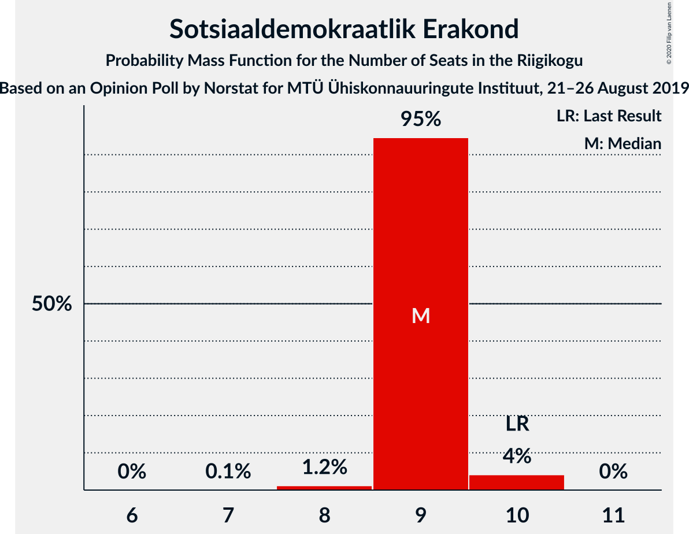
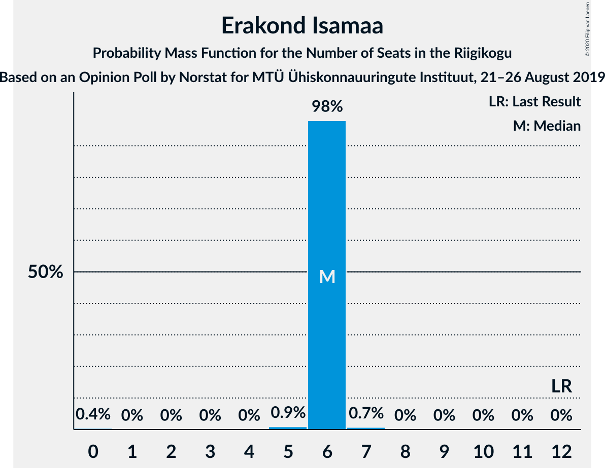

# Opinion Poll by Norstat for MTÜ Ühiskonnauuringute Instituut, 21–26 August 2019

<a href="#voting-intentions">Voting Intentions</a> | <a href="#seats">Seats</a> | <a href="#coalitions">Coalitions</a> | <a href="#technical-information">Technical Information</a>

## Voting Intentions

### Confidence Intervals

| Party | Last Result | Poll Result | 80% Confidence Interval | 90% Confidence Interval | 95% Confidence Interval | 99% Confidence Interval |
|:-----:|:-----------:|:-----------:|:-----------------------:|:-----------------------:|:-----------------------:|:-----------------------:|
| Eesti Reformierakond | 28.9% | 34.3% | 32.4–36.3% |31.9–36.8% |31.4–37.3% |30.5–38.3% |
| Eesti Keskerakond | 23.1% | 23.7% | 22.0–25.5% |21.6–26.0% |21.2–26.4% |20.4–27.3% |
| Eesti Konservatiivne Rahvaerakond | 17.8% | 15.2% | 13.8–16.8% |13.4–17.2% |13.1–17.6% |12.5–18.3% |
| Sotsiaaldemokraatlik Erakond | 9.8% | 9.0% | 7.9–10.3% |7.6–10.6% |7.4–10.9% |6.9–11.6% |
| Erakond Isamaa | 11.4% | 6.2% | 5.3–7.3% |5.1–7.6% |4.9–7.9% |4.5–8.4% |
| Eesti 200 | 4.4% | 4.5% | 3.8–5.5% |3.6–5.7% |3.4–6.0% |3.0–6.5% |
| Erakond Eestimaa Rohelised | 1.8% | 2.6% | 2.1–3.4% |1.9–3.6% |1.8–3.8% |1.6–4.2% |
| Eesti Vabaerakond | 1.2% | 0.8% | 0.5–1.3% |0.5–1.4% |0.4–1.6% |0.3–1.9% |

*Note:* The poll result column reflects the actual value used in the calculations. Published results may vary slightly, and in addition be rounded to fewer digits.

## Seats

### Confidence Intervals

| Party | Last Result | Median | 80% Confidence Interval | 90% Confidence Interval | 95% Confidence Interval | 99% Confidence Interval |
|:-----:|:-----------:|:------:|:-----------------------:|:-----------------------:|:-----------------------:|:-----------------------:|
| <a href="#eesti-reformierakond">Eesti Reformierakond</a> | 34 | 43 | 43 |42–43 |38–43 |36–43 |
| <a href="#eesti-keskerakond">Eesti Keskerakond</a> | 26 | 27 | 27 |27–30 |27–31 |27–31 |
| <a href="#eesti-konservatiivne-rahvaerakond">Eesti Konservatiivne Rahvaerakond</a> | 19 | 16 | 16 |16 |16 |12–16 |
| <a href="#sotsiaaldemokraatlik-erakond">Sotsiaaldemokraatlik Erakond</a> | 10 | 9 | 9 |9 |9–10 |8–10 |
| <a href="#erakond-isamaa">Erakond Isamaa</a> | 12 | 6 | 6 |6 |6 |5–7 |
| <a href="#eesti-200">Eesti 200</a> | 0 | 0 | 0 |0 |0 |0–6 |
| <a href="#erakond-eestimaa-rohelised">Erakond Eestimaa Rohelised</a> | 0 | 0 | 0 |0 |0 |0 |
| <a href="#eesti-vabaerakond">Eesti Vabaerakond</a> | 0 | 0 | 0 |0 |0 |0 |

### Eesti Reformierakond

*For a full overview of the results for this party, see the [Eesti Reformierakond](party-eestireformierakond.html) page.*

| Number of Seats | Probability | Accumulated | Special Marks |
|:---------------:|:-----------:|:-----------:|:-------------:|
| 34 | 0% | 100% | Last Result |
| 35 | 0% | 100% |  |
| 36 | 0.6% | 100% |  |
| 37 | 0% | 99.4% |  |
| 38 | 3% | 99.4% |  |
| 39 | 0% | 96% |  |
| 40 | 0% | 96% |  |
| 41 | 0% | 96% |  |
| 42 | 1.0% | 96% |  |
| 43 | 95% | 95% | Median |
| 44 | 0% | 0.1% |  |
| 45 | 0% | 0.1% |  |
| 46 | 0% | 0.1% |  |
| 47 | 0% | 0.1% |  |
| 48 | 0% | 0.1% |  |
| 49 | 0% | 0% |  |

### Eesti Keskerakond

*For a full overview of the results for this party, see the [Eesti Keskerakond](party-eestikeskerakond.html) page.*

| Number of Seats | Probability | Accumulated | Special Marks |
|:---------------:|:-----------:|:-----------:|:-------------:|
| 25 | 0% | 100% |  |
| 26 | 0% | 99.9% | Last Result |
| 27 | 94% | 99.9% | Median |
| 28 | 0.4% | 5% |  |
| 29 | 0% | 5% |  |
| 30 | 1.3% | 5% |  |
| 31 | 4% | 4% |  |
| 32 | 0.1% | 0.1% |  |
| 33 | 0% | 0% |  |

### Eesti Konservatiivne Rahvaerakond

*For a full overview of the results for this party, see the [Eesti Konservatiivne Rahvaerakond](party-eestikonservatiivnerahvaerakond.html) page.*

| Number of Seats | Probability | Accumulated | Special Marks |
|:---------------:|:-----------:|:-----------:|:-------------:|
| 12 | 0.7% | 100% |  |
| 13 | 0% | 99.3% |  |
| 14 | 0% | 99.3% |  |
| 15 | 0.5% | 99.2% |  |
| 16 | 98.5% | 98.7% | Median |
| 17 | 0.1% | 0.2% |  |
| 18 | 0.1% | 0.1% |  |
| 19 | 0% | 0% | Last Result |

### Sotsiaaldemokraatlik Erakond

*For a full overview of the results for this party, see the [Sotsiaaldemokraatlik Erakond](party-sotsiaaldemokraatlikerakond.html) page.*

| Number of Seats | Probability | Accumulated | Special Marks |
|:---------------:|:-----------:|:-----------:|:-------------:|
| 7 | 0.1% | 100% |  |
| 8 | 1.2% | 99.9% |  |
| 9 | 95% | 98.7% | Median |
| 10 | 4% | 4% | Last Result |
| 11 | 0% | 0% |  |

### Erakond Isamaa

*For a full overview of the results for this party, see the [Erakond Isamaa](party-erakondisamaa.html) page.*

| Number of Seats | Probability | Accumulated | Special Marks |
|:---------------:|:-----------:|:-----------:|:-------------:|
| 0 | 0.4% | 100% |  |
| 1 | 0% | 99.6% |  |
| 2 | 0% | 99.6% |  |
| 3 | 0% | 99.6% |  |
| 4 | 0% | 99.6% |  |
| 5 | 0.9% | 99.6% |  |
| 6 | 98% | 98.7% | Median |
| 7 | 0.7% | 0.7% |  |
| 8 | 0% | 0% |  |
| 9 | 0% | 0% |  |
| 10 | 0% | 0% |  |
| 11 | 0% | 0% |  |
| 12 | 0% | 0% | Last Result |

### Eesti 200

*For a full overview of the results for this party, see the [Eesti 200](party-eesti200.html) page.*

| Number of Seats | Probability | Accumulated | Special Marks |
|:---------------:|:-----------:|:-----------:|:-------------:|
| 0 | 99.2% | 100% | Last Result, Median |
| 1 | 0% | 0.8% |  |
| 2 | 0% | 0.8% |  |
| 3 | 0% | 0.8% |  |
| 4 | 0% | 0.8% |  |
| 5 | 0% | 0.8% |  |
| 6 | 0.8% | 0.8% |  |
| 7 | 0% | 0% |  |

### Erakond Eestimaa Rohelised

*For a full overview of the results for this party, see the [Erakond Eestimaa Rohelised](party-erakondeestimaarohelised.html) page.*

| Number of Seats | Probability | Accumulated | Special Marks |
|:---------------:|:-----------:|:-----------:|:-------------:|
| 0 | 100% | 100% | Last Result, Median |

### Eesti Vabaerakond

*For a full overview of the results for this party, see the [Eesti Vabaerakond](party-eestivabaerakond.html) page.*

| Number of Seats | Probability | Accumulated | Special Marks |
|:---------------:|:-----------:|:-----------:|:-------------:|
| 0 | 100% | 100% | Last Result, Median |

## Coalitions

### Confidence Intervals

| Coalition | Last Result | Median | Majority? | 80% Confidence Interval | 90% Confidence Interval | 95% Confidence Interval | 99% Confidence Interval |
|:---------:|:-----------:|:------:|:---------:|:-----------------------:|:-----------------------:|:-----------------------:|:-----------------------:|
| Eesti Reformierakond – Eesti Keskerakond – Eesti Konservatiivne Rahvaerakond | 79 | 86 | 100% | 86 | 86 | 85–86 | 82–87 |
| Eesti Reformierakond – Eesti Keskerakond | 60 | 70 | 100% | 70 | 70 | 69–70 | 66–72 |
| Eesti Reformierakond – Eesti Konservatiivne Rahvaerakond – Erakond Isamaa | 65 | 65 | 100% | 65 | 61–65 | 60–65 | 57–65 |
| Eesti Reformierakond – Eesti Konservatiivne Rahvaerakond | 53 | 59 | 100% | 59 | 57–59 | 54–59 | 52–59 |
| Eesti Reformierakond – Sotsiaaldemokraatlik Erakond – Erakond Isamaa – Eesti Vabaerakond | 56 | 58 | 99.5% | 58 | 58 | 54–58 | 51–59 |
| Eesti Reformierakond – Sotsiaaldemokraatlik Erakond – Erakond Isamaa | 56 | 58 | 99.5% | 58 | 58 | 54–58 | 51–59 |
| Eesti Keskerakond – Eesti Konservatiivne Rahvaerakond – Erakond Isamaa | 57 | 49 | 4% | 49 | 49 | 49–53 | 48–53 |
| Eesti Reformierakond – Sotsiaaldemokraatlik Erakond | 44 | 52 | 95% | 52 | 52 | 48–52 | 45–52 |
| Eesti Reformierakond – Erakond Isamaa | 46 | 49 | 0% | 49 | 49 | 44–49 | 42–49 |
| Eesti Keskerakond – Eesti Konservatiivne Rahvaerakond | 45 | 43 | 0% | 43 | 43 | 43–47 | 42–47 |
| Eesti Keskerakond – Sotsiaaldemokraatlik Erakond – Erakond Isamaa | 48 | 42 | 0% | 42 | 42–43 | 42–47 | 41–47 |
| Eesti Keskerakond – Sotsiaaldemokraatlik Erakond | 36 | 36 | 0% | 36 | 36–38 | 36–41 | 36–41 |
| Eesti Konservatiivne Rahvaerakond – Sotsiaaldemokraatlik Erakond | 29 | 25 | 0% | 25 | 25 | 25–26 | 22–26 |

### Eesti Reformierakond – Eesti Keskerakond – Eesti Konservatiivne Rahvaerakond

| Number of Seats | Probability | Accumulated | Special Marks |
|:---------------:|:-----------:|:-----------:|:-------------:|
| 79 | 0% | 100% | Last Result |
| 80 | 0% | 100% |  |
| 81 | 0.2% | 100% |  |
| 82 | 0.4% | 99.8% |  |
| 83 | 0% | 99.4% |  |
| 84 | 0.7% | 99.3% |  |
| 85 | 3% | 98.6% |  |
| 86 | 94% | 95% | Median |
| 87 | 0.4% | 0.8% |  |
| 88 | 0.4% | 0.4% |  |
| 89 | 0% | 0% |  |

### Eesti Reformierakond – Eesti Keskerakond

| Number of Seats | Probability | Accumulated | Special Marks |
|:---------------:|:-----------:|:-----------:|:-------------:|
| 60 | 0% | 100% | Last Result |
| 61 | 0% | 100% |  |
| 62 | 0% | 100% |  |
| 63 | 0% | 100% |  |
| 64 | 0% | 100% |  |
| 65 | 0% | 99.9% |  |
| 66 | 0.6% | 99.9% |  |
| 67 | 0% | 99.4% |  |
| 68 | 0% | 99.3% |  |
| 69 | 3% | 99.3% |  |
| 70 | 94% | 96% | Median |
| 71 | 0.4% | 1.5% |  |
| 72 | 0.7% | 1.1% |  |
| 73 | 0.3% | 0.4% |  |
| 74 | 0% | 0.1% |  |
| 75 | 0% | 0.1% |  |
| 76 | 0% | 0% |  |

### Eesti Reformierakond – Eesti Konservatiivne Rahvaerakond – Erakond Isamaa

| Number of Seats | Probability | Accumulated | Special Marks |
|:---------------:|:-----------:|:-----------:|:-------------:|
| 57 | 0.6% | 100% |  |
| 58 | 0% | 99.4% |  |
| 59 | 0.4% | 99.4% |  |
| 60 | 3% | 99.0% |  |
| 61 | 0.8% | 96% |  |
| 62 | 0.3% | 95% |  |
| 63 | 0% | 94% |  |
| 64 | 0% | 94% |  |
| 65 | 94% | 94% | Last Result, Median |
| 66 | 0% | 0% |  |

### Eesti Reformierakond – Eesti Konservatiivne Rahvaerakond

| Number of Seats | Probability | Accumulated | Special Marks |
|:---------------:|:-----------:|:-----------:|:-------------:|
| 51 | 0.2% | 100% | Majority |
| 52 | 0.4% | 99.8% |  |
| 53 | 0% | 99.4% | Last Result |
| 54 | 4% | 99.4% |  |
| 55 | 0% | 95% |  |
| 56 | 0.1% | 95% |  |
| 57 | 0.3% | 95% |  |
| 58 | 0% | 95% |  |
| 59 | 95% | 95% | Median |
| 60 | 0.1% | 0.1% |  |
| 61 | 0% | 0% |  |

### Eesti Reformierakond – Sotsiaaldemokraatlik Erakond – Erakond Isamaa – Eesti Vabaerakond

| Number of Seats | Probability | Accumulated | Special Marks |
|:---------------:|:-----------:|:-----------:|:-------------:|
| 49 | 0.4% | 100% |  |
| 50 | 0.1% | 99.6% |  |
| 51 | 0.5% | 99.5% | Majority |
| 52 | 0% | 99.0% |  |
| 53 | 0% | 99.0% |  |
| 54 | 3% | 98.9% |  |
| 55 | 0.3% | 95% |  |
| 56 | 0% | 95% | Last Result |
| 57 | 0% | 95% |  |
| 58 | 94% | 95% | Median |
| 59 | 0.7% | 0.8% |  |
| 60 | 0% | 0% |  |

### Eesti Reformierakond – Sotsiaaldemokraatlik Erakond – Erakond Isamaa

| Number of Seats | Probability | Accumulated | Special Marks |
|:---------------:|:-----------:|:-----------:|:-------------:|
| 49 | 0.4% | 100% |  |
| 50 | 0.1% | 99.6% |  |
| 51 | 0.5% | 99.5% | Majority |
| 52 | 0% | 99.0% |  |
| 53 | 0% | 99.0% |  |
| 54 | 3% | 98.9% |  |
| 55 | 0.3% | 95% |  |
| 56 | 0% | 95% | Last Result |
| 57 | 0% | 95% |  |
| 58 | 94% | 95% | Median |
| 59 | 0.7% | 0.8% |  |
| 60 | 0% | 0% |  |

### Eesti Keskerakond – Eesti Konservatiivne Rahvaerakond – Erakond Isamaa

| Number of Seats | Probability | Accumulated | Special Marks |
|:---------------:|:-----------:|:-----------:|:-------------:|
| 44 | 0.4% | 100% |  |
| 45 | 0% | 99.6% |  |
| 46 | 0% | 99.5% |  |
| 47 | 0% | 99.5% |  |
| 48 | 0% | 99.5% |  |
| 49 | 95% | 99.5% | Median |
| 50 | 0% | 4% |  |
| 51 | 0.9% | 4% | Majority |
| 52 | 0% | 4% |  |
| 53 | 3% | 3% |  |
| 54 | 0% | 0.1% |  |
| 55 | 0.1% | 0.1% |  |
| 56 | 0% | 0% |  |
| 57 | 0% | 0% | Last Result |

### Eesti Reformierakond – Sotsiaaldemokraatlik Erakond

| Number of Seats | Probability | Accumulated | Special Marks |
|:---------------:|:-----------:|:-----------:|:-------------:|
| 44 | 0.4% | 100% | Last Result |
| 45 | 0.2% | 99.6% |  |
| 46 | 0.1% | 99.4% |  |
| 47 | 0% | 99.4% |  |
| 48 | 3% | 99.3% |  |
| 49 | 0% | 96% |  |
| 50 | 0.4% | 96% |  |
| 51 | 0.3% | 95% | Majority |
| 52 | 95% | 95% | Median |
| 53 | 0% | 0.1% |  |
| 54 | 0% | 0.1% |  |
| 55 | 0% | 0.1% |  |
| 56 | 0% | 0.1% |  |
| 57 | 0% | 0.1% |  |
| 58 | 0% | 0% |  |

### Eesti Reformierakond – Erakond Isamaa

| Number of Seats | Probability | Accumulated | Special Marks |
|:---------------:|:-----------:|:-----------:|:-------------:|
| 41 | 0.4% | 100% |  |
| 42 | 0.2% | 99.6% |  |
| 43 | 0.4% | 99.4% |  |
| 44 | 3% | 99.0% |  |
| 45 | 0% | 96% |  |
| 46 | 0% | 96% | Last Result |
| 47 | 0.3% | 95% |  |
| 48 | 0% | 95% |  |
| 49 | 95% | 95% | Median |
| 50 | 0% | 0.1% |  |
| 51 | 0% | 0% | Majority |

### Eesti Keskerakond – Eesti Konservatiivne Rahvaerakond

| Number of Seats | Probability | Accumulated | Special Marks |
|:---------------:|:-----------:|:-----------:|:-------------:|
| 39 | 0% | 100% |  |
| 40 | 0% | 99.9% |  |
| 41 | 0% | 99.9% |  |
| 42 | 0.7% | 99.9% |  |
| 43 | 94% | 99.2% | Median |
| 44 | 0.3% | 5% |  |
| 45 | 0.2% | 4% | Last Result |
| 46 | 0.7% | 4% |  |
| 47 | 3% | 4% |  |
| 48 | 0% | 0.1% |  |
| 49 | 0% | 0.1% |  |
| 50 | 0.1% | 0.1% |  |
| 51 | 0% | 0% | Majority |

### Eesti Keskerakond – Sotsiaaldemokraatlik Erakond – Erakond Isamaa

| Number of Seats | Probability | Accumulated | Special Marks |
|:---------------:|:-----------:|:-----------:|:-------------:|
| 35 | 0.1% | 100% |  |
| 36 | 0.3% | 99.9% |  |
| 37 | 0% | 99.6% |  |
| 38 | 0% | 99.6% |  |
| 39 | 0% | 99.6% |  |
| 40 | 0% | 99.5% |  |
| 41 | 0.1% | 99.5% |  |
| 42 | 94% | 99.5% | Median |
| 43 | 0.4% | 5% |  |
| 44 | 0.3% | 5% |  |
| 45 | 0.2% | 4% |  |
| 46 | 0% | 4% |  |
| 47 | 4% | 4% |  |
| 48 | 0% | 0% | Last Result |

### Eesti Keskerakond – Sotsiaaldemokraatlik Erakond

| Number of Seats | Probability | Accumulated | Special Marks |
|:---------------:|:-----------:|:-----------:|:-------------:|
| 34 | 0% | 100% |  |
| 35 | 0.1% | 99.9% |  |
| 36 | 95% | 99.9% | Last Result, Median |
| 37 | 0% | 5% |  |
| 38 | 0.4% | 5% |  |
| 39 | 0.5% | 5% |  |
| 40 | 0.8% | 4% |  |
| 41 | 3% | 3% |  |
| 42 | 0% | 0% |  |

### Eesti Konservatiivne Rahvaerakond – Sotsiaaldemokraatlik Erakond

| Number of Seats | Probability | Accumulated | Special Marks |
|:---------------:|:-----------:|:-----------:|:-------------:|
| 22 | 0.7% | 100% |  |
| 23 | 0.4% | 99.2% |  |
| 24 | 0.9% | 98.9% |  |
| 25 | 94% | 98% | Median |
| 26 | 4% | 4% |  |
| 27 | 0% | 0% |  |
| 28 | 0% | 0% |  |
| 29 | 0% | 0% | Last Result |

## Technical Information

### Opinion Poll

+ **Polling firm:** Norstat
+ **Commissioner(s):** MTÜ Ühiskonnauuringute Instituut
+ **Fieldwork period:** 21–26 August 2019

### Calculations

+ **Sample size:** 1000
+ **Simulations done:** 1,024
+ **Error estimate:** 3.55%

