# Opinion Poll by Norstat for MTÜ Ühiskonnauuringute Instituut, 3–9 September 2019

<a href="#voting-intentions">Voting Intentions</a> | <a href="#seats">Seats</a> | <a href="#coalitions">Coalitions</a> | <a href="#technical-information">Technical Information</a>

## Voting Intentions

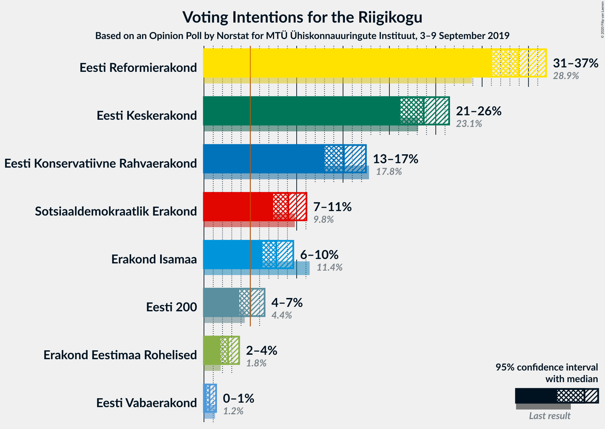

### Confidence Intervals

| Party | Last Result | Poll Result | 80% Confidence Interval | 90% Confidence Interval | 95% Confidence Interval | 99% Confidence Interval |
|:-----:|:-----------:|:-----------:|:-----------------------:|:-----------------------:|:-----------------------:|:-----------------------:|
| Eesti Reformierakond | 28.9% | 33.9% | 32.0–35.9% |31.5–36.4% |31.0–36.9% |30.1–37.8% |
| Eesti Keskerakond | 23.1% | 23.7% | 22.0–25.5% |21.6–26.0% |21.2–26.4% |20.4–27.3% |
| Eesti Konservatiivne Rahvaerakond | 17.8% | 15.1% | 13.7–16.6% |13.3–17.1% |13.0–17.5% |12.4–18.2% |
| Sotsiaaldemokraatlik Erakond | 9.8% | 9.1% | 8.0–10.4% |7.7–10.7% |7.5–11.1% |7.0–11.7% |
| Erakond Isamaa | 11.4% | 7.8% | 6.8–9.0% |6.5–9.3% |6.3–9.6% |5.9–10.2% |
| Eesti 200 | 4.4% | 5.0% | 4.2–6.0% |4.0–6.3% |3.8–6.5% |3.5–7.1% |
| Erakond Eestimaa Rohelised | 1.8% | 2.6% | 2.1–3.4% |1.9–3.6% |1.8–3.8% |1.6–4.2% |
| Eesti Vabaerakond | 1.2% | 0.6% | 0.4–1.1% |0.3–1.2% |0.3–1.3% |0.2–1.6% |

*Note:* The poll result column reflects the actual value used in the calculations. Published results may vary slightly, and in addition be rounded to fewer digits.

## Seats

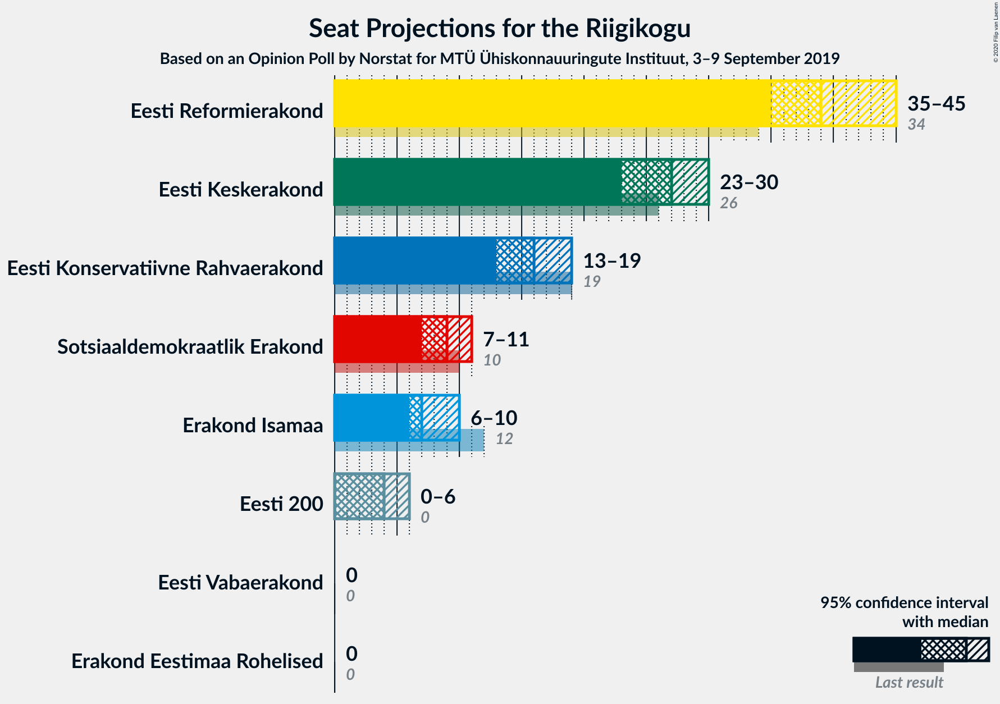

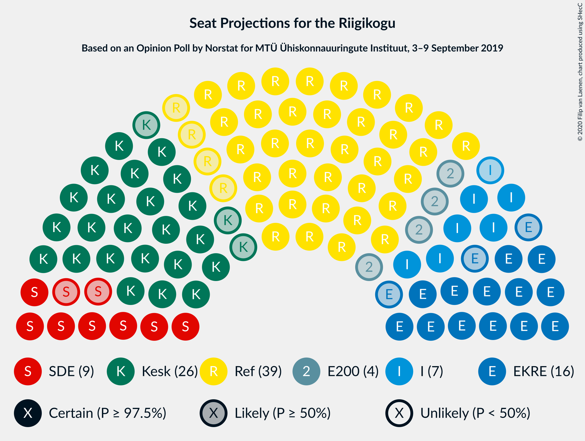

### Confidence Intervals

| Party | Last Result | Median | 80% Confidence Interval | 90% Confidence Interval | 95% Confidence Interval | 99% Confidence Interval |
|:-----:|:-----------:|:------:|:-----------------------:|:-----------------------:|:-----------------------:|:-----------------------:|
| <a href="#eesti-reformierakond">Eesti Reformierakond</a> | 34 | 39 | 37–42 |37–44 |35–45 |34–45 |
| <a href="#eesti-keskerakond">Eesti Keskerakond</a> | 26 | 27 | 24–28 |24–29 |23–30 |22–31 |
| <a href="#eesti-konservatiivne-rahvaerakond">Eesti Konservatiivne Rahvaerakond</a> | 19 | 16 | 14–17 |14–18 |13–19 |13–20 |
| <a href="#sotsiaaldemokraatlik-erakond">Sotsiaaldemokraatlik Erakond</a> | 10 | 9 | 7–10 |7–11 |7–11 |6–12 |
| <a href="#erakond-isamaa">Erakond Isamaa</a> | 12 | 7 | 6–9 |6–9 |6–10 |5–10 |
| <a href="#eesti-200">Eesti 200</a> | 0 | 4 | 0–5 |0–6 |0–6 |0–7 |
| <a href="#erakond-eestimaa-rohelised">Erakond Eestimaa Rohelised</a> | 0 | 0 | 0 |0 |0 |0 |
| <a href="#eesti-vabaerakond">Eesti Vabaerakond</a> | 0 | 0 | 0 |0 |0 |0 |

### Eesti Reformierakond

*For a full overview of the results for this party, see the [Eesti Reformierakond](party-eestireformierakond.html) page.*

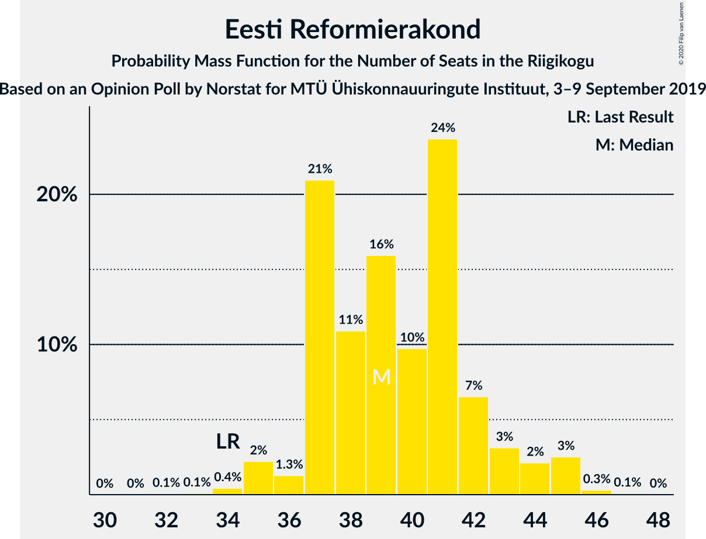

| Number of Seats | Probability | Accumulated | Special Marks |
|:---------------:|:-----------:|:-----------:|:-------------:|
| 32 | 0.1% | 100% |  |
| 33 | 0.1% | 99.9% |  |
| 34 | 0.4% | 99.8% | Last Result |
| 35 | 2% | 99.4% |  |
| 36 | 1.3% | 97% |  |
| 37 | 21% | 96% |  |
| 38 | 11% | 75% |  |
| 39 | 16% | 64% | Median |
| 40 | 10% | 48% |  |
| 41 | 24% | 38% |  |
| 42 | 7% | 15% |  |
| 43 | 3% | 8% |  |
| 44 | 2% | 5% |  |
| 45 | 3% | 3% |  |
| 46 | 0.3% | 0.4% |  |
| 47 | 0.1% | 0.1% |  |
| 48 | 0% | 0% |  |

### Eesti Keskerakond

*For a full overview of the results for this party, see the [Eesti Keskerakond](party-eestikeskerakond.html) page.*

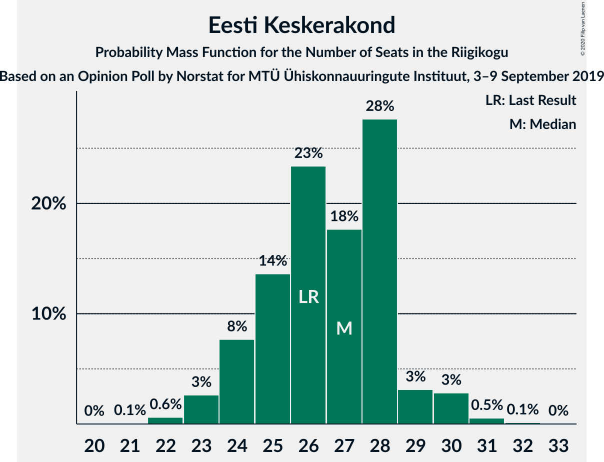

| Number of Seats | Probability | Accumulated | Special Marks |
|:---------------:|:-----------:|:-----------:|:-------------:|
| 21 | 0.1% | 100% |  |
| 22 | 0.6% | 99.9% |  |
| 23 | 3% | 99.3% |  |
| 24 | 8% | 97% |  |
| 25 | 14% | 89% |  |
| 26 | 23% | 75% | Last Result |
| 27 | 18% | 52% | Median |
| 28 | 28% | 34% |  |
| 29 | 3% | 7% |  |
| 30 | 3% | 4% |  |
| 31 | 0.5% | 0.7% |  |
| 32 | 0.1% | 0.2% |  |
| 33 | 0% | 0% |  |

### Eesti Konservatiivne Rahvaerakond

*For a full overview of the results for this party, see the [Eesti Konservatiivne Rahvaerakond](party-eestikonservatiivnerahvaerakond.html) page.*

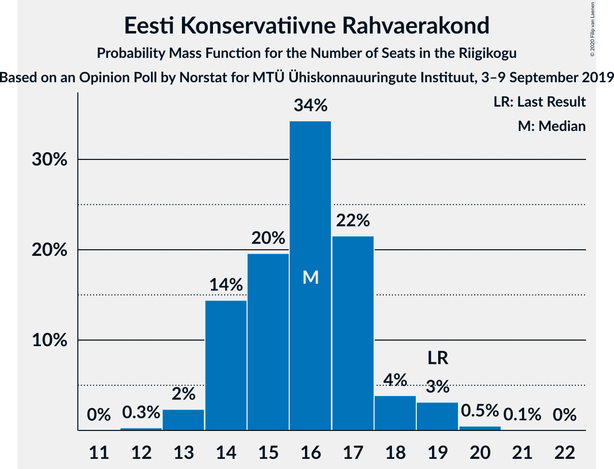

| Number of Seats | Probability | Accumulated | Special Marks |
|:---------------:|:-----------:|:-----------:|:-------------:|
| 12 | 0.3% | 100% |  |
| 13 | 2% | 99.7% |  |
| 14 | 14% | 97% |  |
| 15 | 20% | 83% |  |
| 16 | 34% | 63% | Median |
| 17 | 22% | 29% |  |
| 18 | 4% | 8% |  |
| 19 | 3% | 4% | Last Result |
| 20 | 0.5% | 0.5% |  |
| 21 | 0.1% | 0.1% |  |
| 22 | 0% | 0% |  |

### Sotsiaaldemokraatlik Erakond

*For a full overview of the results for this party, see the [Sotsiaaldemokraatlik Erakond](party-sotsiaaldemokraatlikerakond.html) page.*

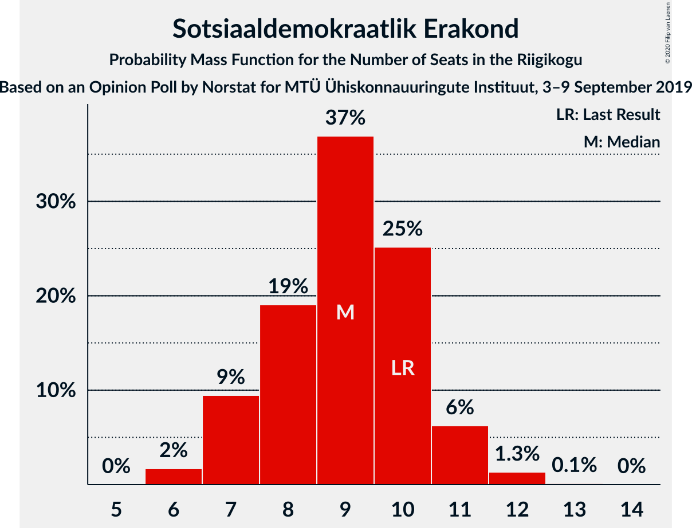

| Number of Seats | Probability | Accumulated | Special Marks |
|:---------------:|:-----------:|:-----------:|:-------------:|
| 6 | 2% | 100% |  |
| 7 | 9% | 98% |  |
| 8 | 19% | 89% |  |
| 9 | 37% | 70% | Median |
| 10 | 25% | 33% | Last Result |
| 11 | 6% | 8% |  |
| 12 | 1.3% | 1.5% |  |
| 13 | 0.1% | 0.1% |  |
| 14 | 0% | 0% |  |

### Erakond Isamaa

*For a full overview of the results for this party, see the [Erakond Isamaa](party-erakondisamaa.html) page.*

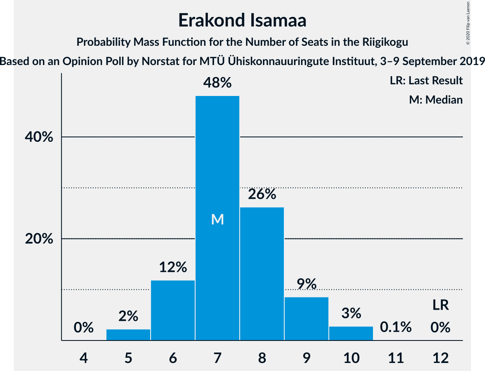

| Number of Seats | Probability | Accumulated | Special Marks |
|:---------------:|:-----------:|:-----------:|:-------------:|
| 5 | 2% | 100% |  |
| 6 | 12% | 98% |  |
| 7 | 48% | 86% | Median |
| 8 | 26% | 38% |  |
| 9 | 9% | 12% |  |
| 10 | 3% | 3% |  |
| 11 | 0.1% | 0.1% |  |
| 12 | 0% | 0% | Last Result |

### Eesti 200

*For a full overview of the results for this party, see the [Eesti 200](party-eesti200.html) page.*

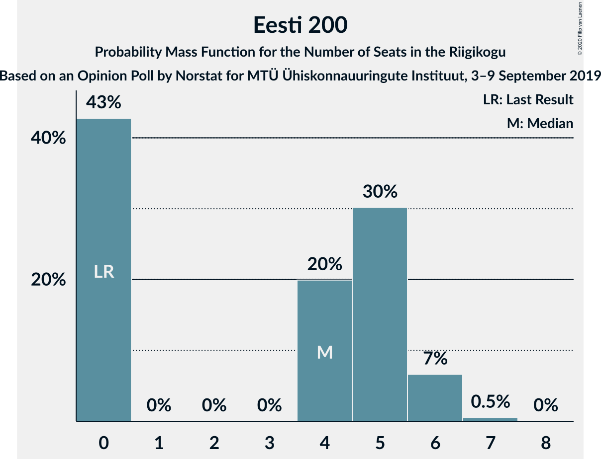

| Number of Seats | Probability | Accumulated | Special Marks |
|:---------------:|:-----------:|:-----------:|:-------------:|
| 0 | 43% | 100% | Last Result |
| 1 | 0% | 57% |  |
| 2 | 0% | 57% |  |
| 3 | 0% | 57% |  |
| 4 | 20% | 57% | Median |
| 5 | 30% | 37% |  |
| 6 | 7% | 7% |  |
| 7 | 0.5% | 0.5% |  |
| 8 | 0% | 0% |  |

### Erakond Eestimaa Rohelised

*For a full overview of the results for this party, see the [Erakond Eestimaa Rohelised](party-erakondeestimaarohelised.html) page.*

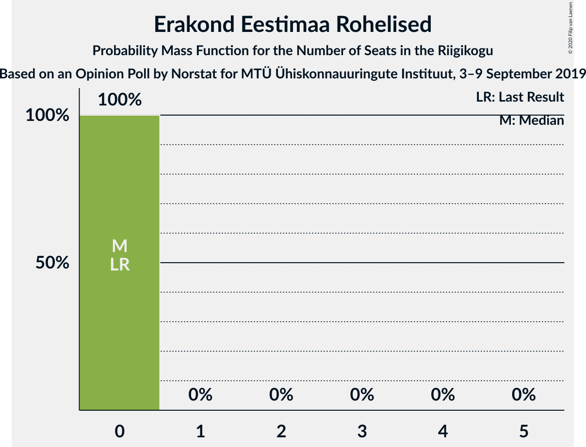

| Number of Seats | Probability | Accumulated | Special Marks |
|:---------------:|:-----------:|:-----------:|:-------------:|
| 0 | 100% | 100% | Last Result, Median |

### Eesti Vabaerakond

*For a full overview of the results for this party, see the [Eesti Vabaerakond](party-eestivabaerakond.html) page.*

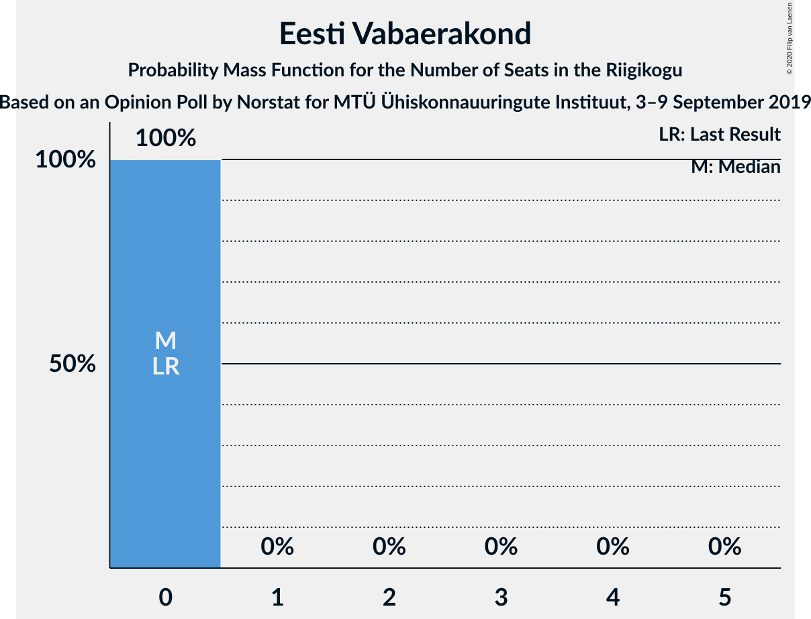

| Number of Seats | Probability | Accumulated | Special Marks |
|:---------------:|:-----------:|:-----------:|:-------------:|
| 0 | 100% | 100% | Last Result, Median |

## Coalitions

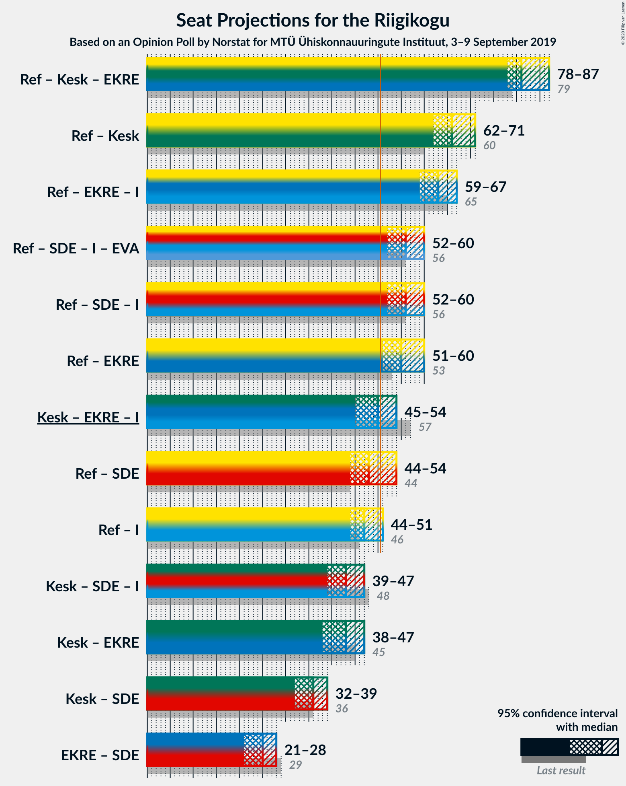

### Confidence Intervals

| Coalition | Last Result | Median | Majority? | 80% Confidence Interval | 90% Confidence Interval | 95% Confidence Interval | 99% Confidence Interval |
|:---------:|:-----------:|:------:|:---------:|:-----------------------:|:-----------------------:|:-----------------------:|:-----------------------:|
| Eesti Reformierakond – Eesti Keskerakond – Eesti Konservatiivne Rahvaerakond | 79 | 81 | 100% | 78–85 | 78–86 | 78–87 | 77–88 |
| Eesti Reformierakond – Eesti Keskerakond | 60 | 66 | 100% | 63–69 | 63–70 | 62–71 | 60–72 |
| Eesti Reformierakond – Eesti Konservatiivne Rahvaerakond – Erakond Isamaa | 65 | 63 | 100% | 60–66 | 59–67 | 59–67 | 58–69 |
| Eesti Reformierakond – Sotsiaaldemokraatlik Erakond – Erakond Isamaa – Eesti Vabaerakond | 56 | 56 | 99.4% | 53–58 | 53–60 | 52–60 | 50–62 |
| Eesti Reformierakond – Sotsiaaldemokraatlik Erakond – Erakond Isamaa | 56 | 56 | 99.4% | 53–58 | 53–60 | 52–60 | 50–62 |
| Eesti Reformierakond – Eesti Konservatiivne Rahvaerakond | 53 | 55 | 99.1% | 52–59 | 52–60 | 51–60 | 50–61 |
| Eesti Keskerakond – Eesti Konservatiivne Rahvaerakond – Erakond Isamaa | 57 | 50 | 42% | 47–53 | 46–54 | 45–54 | 44–56 |
| Eesti Reformierakond – Sotsiaaldemokraatlik Erakond | 44 | 48 | 16% | 46–51 | 45–52 | 44–54 | 43–54 |
| Eesti Reformierakond – Erakond Isamaa | 46 | 47 | 6% | 44–49 | 44–51 | 44–51 | 42–53 |
| Eesti Keskerakond – Sotsiaaldemokraatlik Erakond – Erakond Isamaa | 48 | 43 | 0% | 40–45 | 40–46 | 39–47 | 38–48 |
| Eesti Keskerakond – Eesti Konservatiivne Rahvaerakond | 45 | 43 | 0% | 39–44 | 39–46 | 38–47 | 38–48 |
| Eesti Keskerakond – Sotsiaaldemokraatlik Erakond | 36 | 36 | 0% | 33–37 | 33–38 | 32–39 | 31–40 |
| Eesti Konservatiivne Rahvaerakond – Sotsiaaldemokraatlik Erakond | 29 | 25 | 0% | 23–27 | 22–27 | 21–28 | 20–30 |

### Eesti Reformierakond – Eesti Keskerakond – Eesti Konservatiivne Rahvaerakond

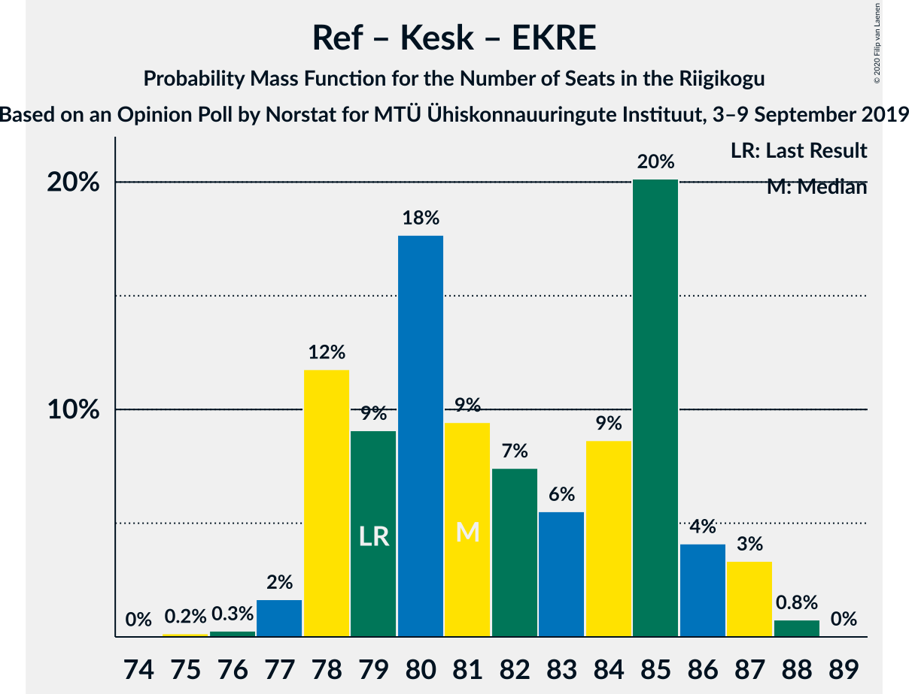

| Number of Seats | Probability | Accumulated | Special Marks |
|:---------------:|:-----------:|:-----------:|:-------------:|
| 75 | 0.2% | 100% |  |
| 76 | 0.3% | 99.8% |  |
| 77 | 2% | 99.6% |  |
| 78 | 12% | 98% |  |
| 79 | 9% | 86% | Last Result |
| 80 | 18% | 77% |  |
| 81 | 9% | 59% |  |
| 82 | 7% | 50% | Median |
| 83 | 6% | 43% |  |
| 84 | 9% | 37% |  |
| 85 | 20% | 28% |  |
| 86 | 4% | 8% |  |
| 87 | 3% | 4% |  |
| 88 | 0.8% | 0.8% |  |
| 89 | 0% | 0% |  |

### Eesti Reformierakond – Eesti Keskerakond

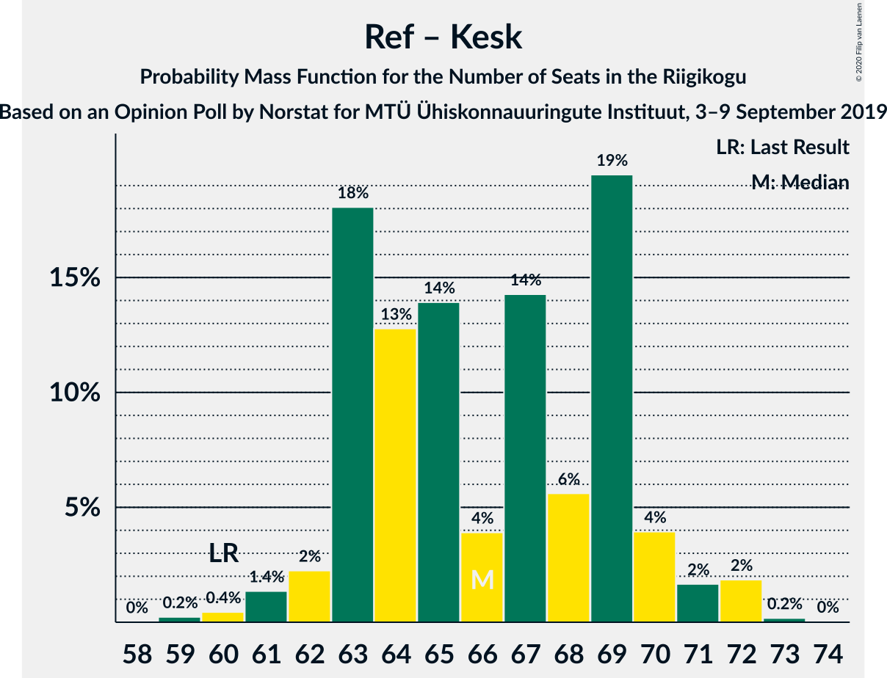

| Number of Seats | Probability | Accumulated | Special Marks |
|:---------------:|:-----------:|:-----------:|:-------------:|
| 59 | 0.2% | 100% |  |
| 60 | 0.4% | 99.8% | Last Result |
| 61 | 1.4% | 99.3% |  |
| 62 | 2% | 98% |  |
| 63 | 18% | 96% |  |
| 64 | 13% | 78% |  |
| 65 | 14% | 65% |  |
| 66 | 4% | 51% | Median |
| 67 | 14% | 47% |  |
| 68 | 6% | 33% |  |
| 69 | 19% | 27% |  |
| 70 | 4% | 8% |  |
| 71 | 2% | 4% |  |
| 72 | 2% | 2% |  |
| 73 | 0.2% | 0.2% |  |
| 74 | 0% | 0% |  |

### Eesti Reformierakond – Eesti Konservatiivne Rahvaerakond – Erakond Isamaa

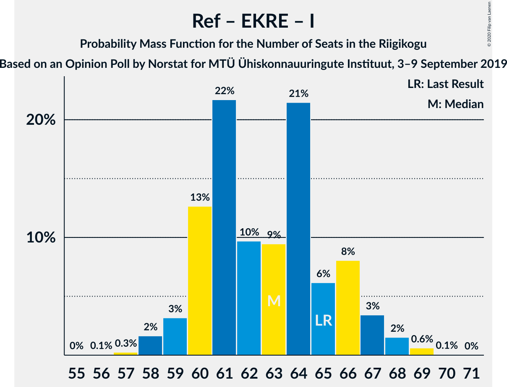

| Number of Seats | Probability | Accumulated | Special Marks |
|:---------------:|:-----------:|:-----------:|:-------------:|
| 56 | 0.1% | 100% |  |
| 57 | 0.3% | 99.9% |  |
| 58 | 2% | 99.6% |  |
| 59 | 3% | 98% |  |
| 60 | 13% | 95% |  |
| 61 | 22% | 82% |  |
| 62 | 10% | 60% | Median |
| 63 | 9% | 51% |  |
| 64 | 21% | 41% |  |
| 65 | 6% | 20% | Last Result |
| 66 | 8% | 14% |  |
| 67 | 3% | 6% |  |
| 68 | 2% | 2% |  |
| 69 | 0.6% | 0.7% |  |
| 70 | 0.1% | 0.1% |  |
| 71 | 0% | 0% |  |

### Eesti Reformierakond – Sotsiaaldemokraatlik Erakond – Erakond Isamaa – Eesti Vabaerakond

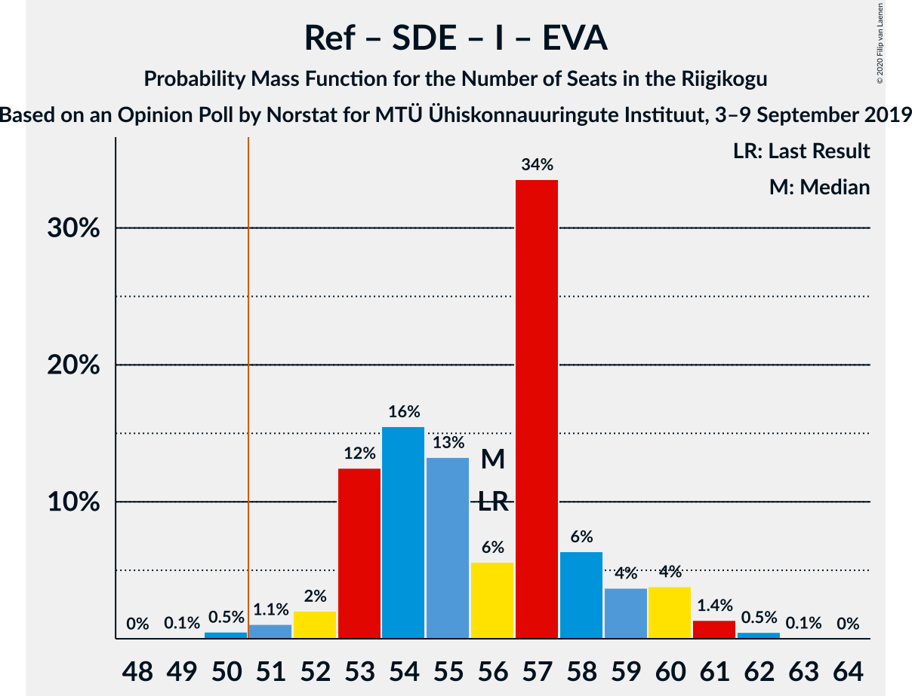

| Number of Seats | Probability | Accumulated | Special Marks |
|:---------------:|:-----------:|:-----------:|:-------------:|
| 49 | 0.1% | 100% |  |
| 50 | 0.5% | 99.9% |  |
| 51 | 1.1% | 99.4% | Majority |
| 52 | 2% | 98% |  |
| 53 | 12% | 96% |  |
| 54 | 16% | 84% |  |
| 55 | 13% | 68% | Median |
| 56 | 6% | 55% | Last Result |
| 57 | 34% | 49% |  |
| 58 | 6% | 16% |  |
| 59 | 4% | 9% |  |
| 60 | 4% | 6% |  |
| 61 | 1.4% | 2% |  |
| 62 | 0.5% | 0.6% |  |
| 63 | 0.1% | 0.1% |  |
| 64 | 0% | 0% |  |

### Eesti Reformierakond – Sotsiaaldemokraatlik Erakond – Erakond Isamaa

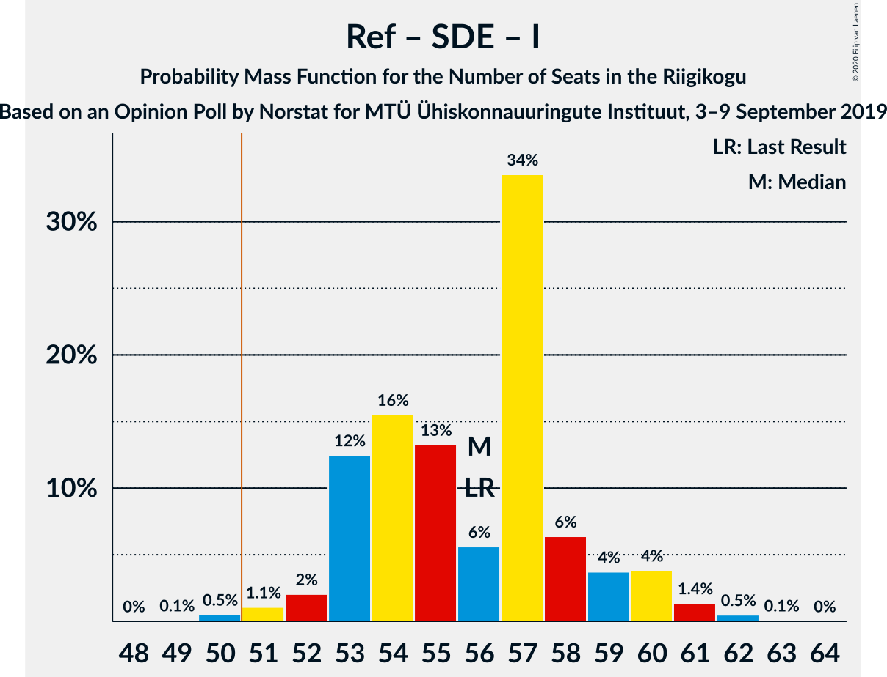

| Number of Seats | Probability | Accumulated | Special Marks |
|:---------------:|:-----------:|:-----------:|:-------------:|
| 49 | 0.1% | 100% |  |
| 50 | 0.5% | 99.9% |  |
| 51 | 1.1% | 99.4% | Majority |
| 52 | 2% | 98% |  |
| 53 | 12% | 96% |  |
| 54 | 16% | 84% |  |
| 55 | 13% | 68% | Median |
| 56 | 6% | 55% | Last Result |
| 57 | 34% | 49% |  |
| 58 | 6% | 16% |  |
| 59 | 4% | 9% |  |
| 60 | 4% | 6% |  |
| 61 | 1.4% | 2% |  |
| 62 | 0.5% | 0.6% |  |
| 63 | 0.1% | 0.1% |  |
| 64 | 0% | 0% |  |

### Eesti Reformierakond – Eesti Konservatiivne Rahvaerakond

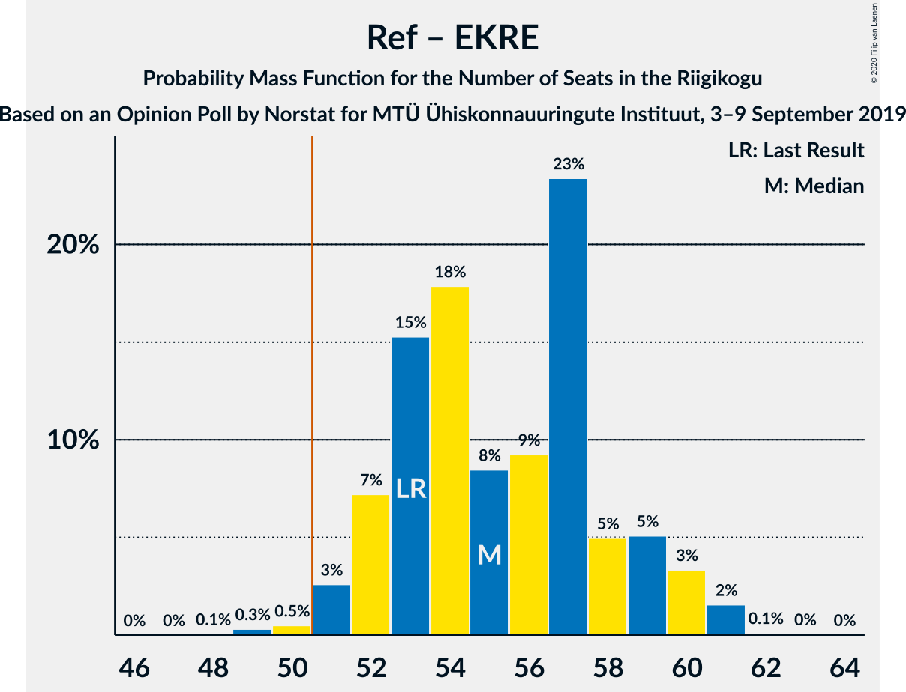

| Number of Seats | Probability | Accumulated | Special Marks |
|:---------------:|:-----------:|:-----------:|:-------------:|
| 48 | 0.1% | 100% |  |
| 49 | 0.3% | 99.9% |  |
| 50 | 0.5% | 99.6% |  |
| 51 | 3% | 99.1% | Majority |
| 52 | 7% | 97% |  |
| 53 | 15% | 89% | Last Result |
| 54 | 18% | 74% |  |
| 55 | 8% | 56% | Median |
| 56 | 9% | 48% |  |
| 57 | 23% | 39% |  |
| 58 | 5% | 15% |  |
| 59 | 5% | 10% |  |
| 60 | 3% | 5% |  |
| 61 | 2% | 2% |  |
| 62 | 0.1% | 0.2% |  |
| 63 | 0% | 0.1% |  |
| 64 | 0% | 0% |  |

### Eesti Keskerakond – Eesti Konservatiivne Rahvaerakond – Erakond Isamaa

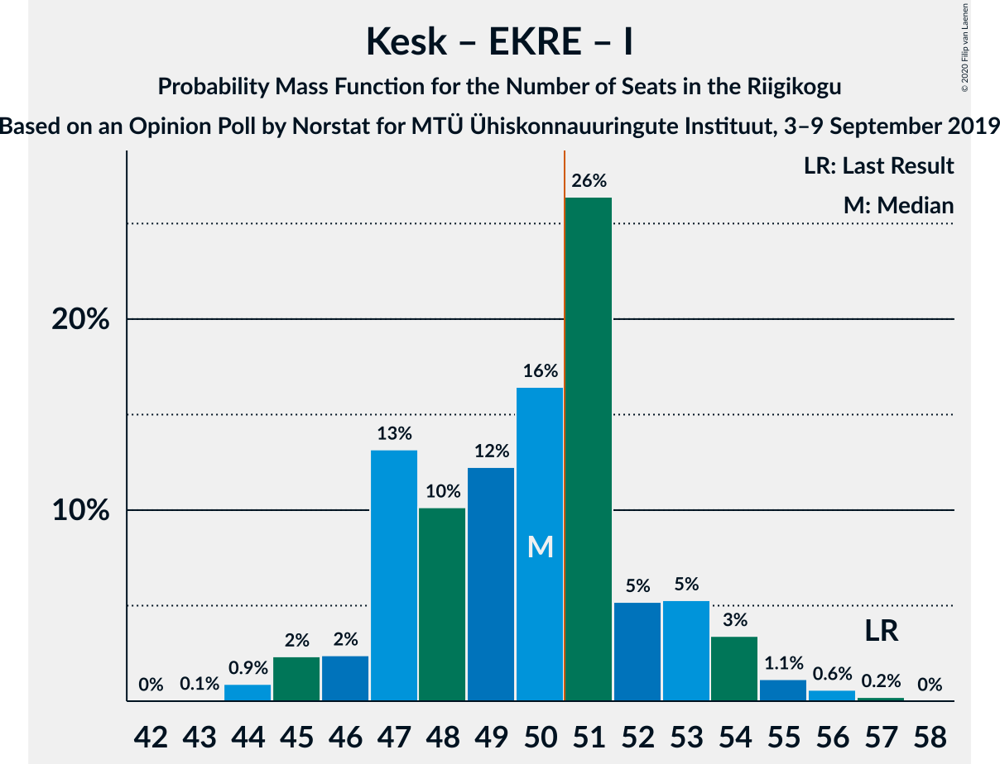

| Number of Seats | Probability | Accumulated | Special Marks |
|:---------------:|:-----------:|:-----------:|:-------------:|
| 43 | 0.1% | 100% |  |
| 44 | 0.9% | 99.9% |  |
| 45 | 2% | 99.0% |  |
| 46 | 2% | 97% |  |
| 47 | 13% | 94% |  |
| 48 | 10% | 81% |  |
| 49 | 12% | 71% |  |
| 50 | 16% | 59% | Median |
| 51 | 26% | 42% | Majority |
| 52 | 5% | 16% |  |
| 53 | 5% | 11% |  |
| 54 | 3% | 5% |  |
| 55 | 1.1% | 2% |  |
| 56 | 0.6% | 0.8% |  |
| 57 | 0.2% | 0.2% | Last Result |
| 58 | 0% | 0% |  |

### Eesti Reformierakond – Sotsiaaldemokraatlik Erakond

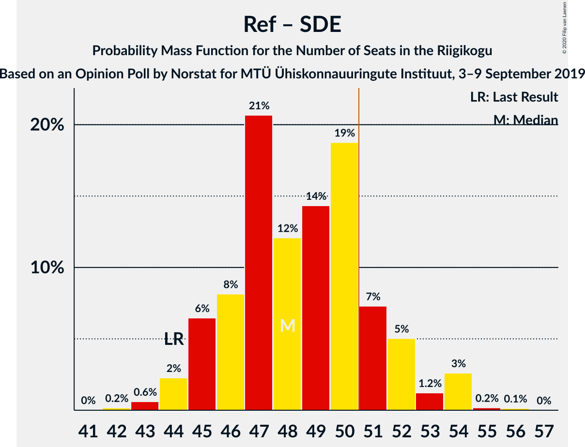

| Number of Seats | Probability | Accumulated | Special Marks |
|:---------------:|:-----------:|:-----------:|:-------------:|
| 42 | 0.2% | 100% |  |
| 43 | 0.6% | 99.8% |  |
| 44 | 2% | 99.2% | Last Result |
| 45 | 6% | 97% |  |
| 46 | 8% | 90% |  |
| 47 | 21% | 82% |  |
| 48 | 12% | 62% | Median |
| 49 | 14% | 50% |  |
| 50 | 19% | 35% |  |
| 51 | 7% | 16% | Majority |
| 52 | 5% | 9% |  |
| 53 | 1.2% | 4% |  |
| 54 | 3% | 3% |  |
| 55 | 0.2% | 0.3% |  |
| 56 | 0.1% | 0.1% |  |
| 57 | 0% | 0% |  |

### Eesti Reformierakond – Erakond Isamaa

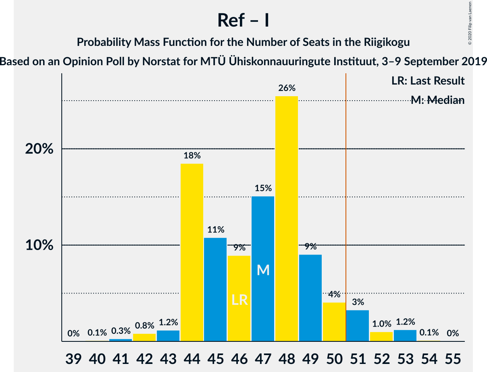

| Number of Seats | Probability | Accumulated | Special Marks |
|:---------------:|:-----------:|:-----------:|:-------------:|
| 40 | 0.1% | 100% |  |
| 41 | 0.3% | 99.9% |  |
| 42 | 0.8% | 99.6% |  |
| 43 | 1.2% | 98.8% |  |
| 44 | 18% | 98% |  |
| 45 | 11% | 79% |  |
| 46 | 9% | 68% | Last Result, Median |
| 47 | 15% | 59% |  |
| 48 | 26% | 44% |  |
| 49 | 9% | 19% |  |
| 50 | 4% | 10% |  |
| 51 | 3% | 6% | Majority |
| 52 | 1.0% | 2% |  |
| 53 | 1.2% | 1.4% |  |
| 54 | 0.1% | 0.2% |  |
| 55 | 0% | 0% |  |

### Eesti Keskerakond – Sotsiaaldemokraatlik Erakond – Erakond Isamaa

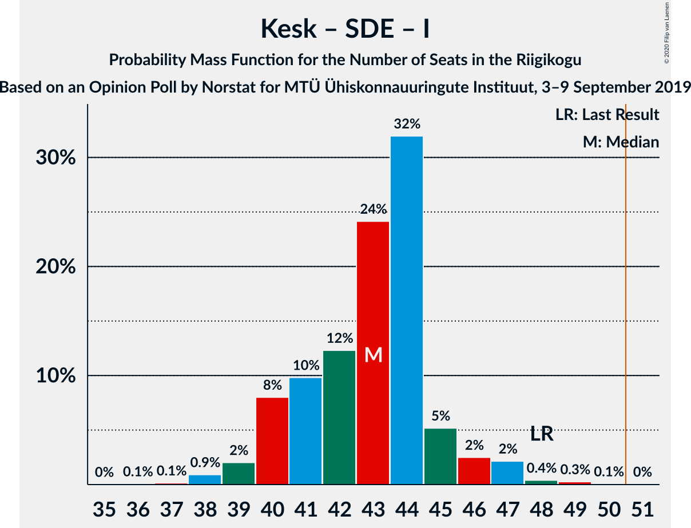

| Number of Seats | Probability | Accumulated | Special Marks |
|:---------------:|:-----------:|:-----------:|:-------------:|
| 36 | 0.1% | 100% |  |
| 37 | 0.1% | 99.9% |  |
| 38 | 0.9% | 99.8% |  |
| 39 | 2% | 98.9% |  |
| 40 | 8% | 97% |  |
| 41 | 10% | 89% |  |
| 42 | 12% | 79% |  |
| 43 | 24% | 67% | Median |
| 44 | 32% | 43% |  |
| 45 | 5% | 11% |  |
| 46 | 2% | 5% |  |
| 47 | 2% | 3% |  |
| 48 | 0.4% | 0.8% | Last Result |
| 49 | 0.3% | 0.4% |  |
| 50 | 0.1% | 0.1% |  |
| 51 | 0% | 0% | Majority |

### Eesti Keskerakond – Eesti Konservatiivne Rahvaerakond

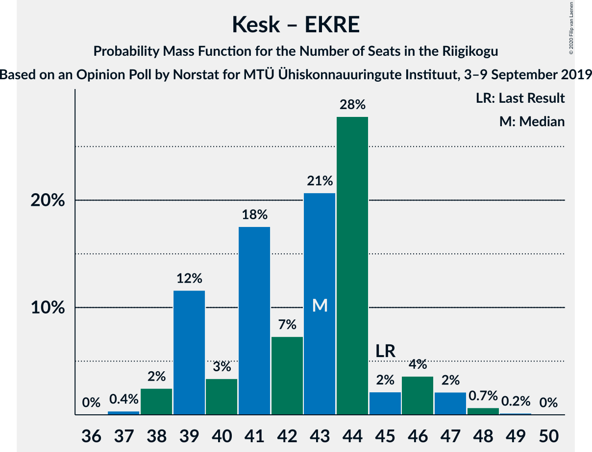

| Number of Seats | Probability | Accumulated | Special Marks |
|:---------------:|:-----------:|:-----------:|:-------------:|
| 36 | 0% | 100% |  |
| 37 | 0.4% | 99.9% |  |
| 38 | 2% | 99.6% |  |
| 39 | 12% | 97% |  |
| 40 | 3% | 85% |  |
| 41 | 18% | 82% |  |
| 42 | 7% | 65% |  |
| 43 | 21% | 57% | Median |
| 44 | 28% | 37% |  |
| 45 | 2% | 9% | Last Result |
| 46 | 4% | 7% |  |
| 47 | 2% | 3% |  |
| 48 | 0.7% | 0.9% |  |
| 49 | 0.2% | 0.2% |  |
| 50 | 0% | 0% |  |

### Eesti Keskerakond – Sotsiaaldemokraatlik Erakond

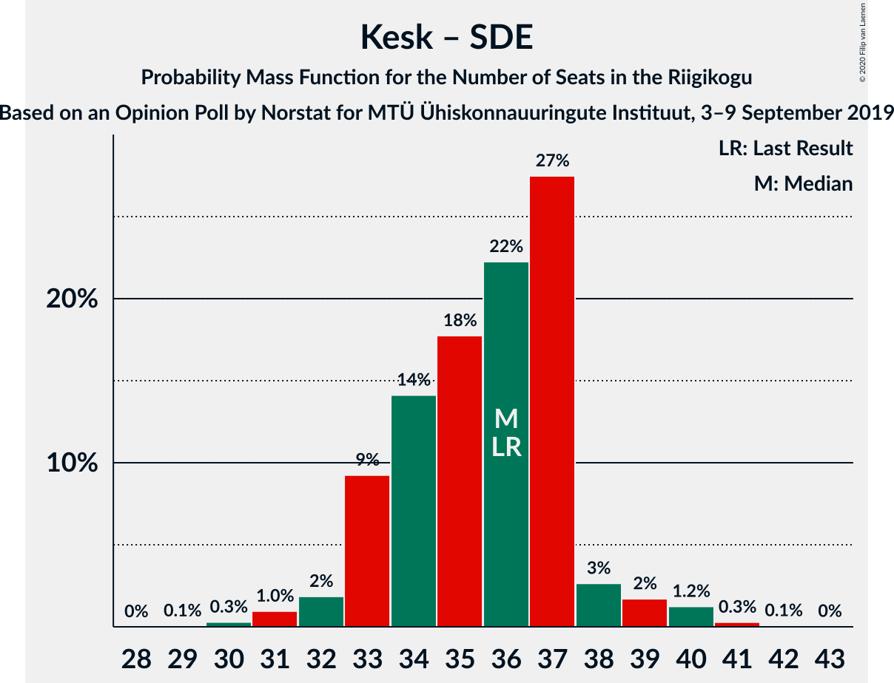

| Number of Seats | Probability | Accumulated | Special Marks |
|:---------------:|:-----------:|:-----------:|:-------------:|
| 29 | 0.1% | 100% |  |
| 30 | 0.3% | 99.9% |  |
| 31 | 1.0% | 99.6% |  |
| 32 | 2% | 98.7% |  |
| 33 | 9% | 97% |  |
| 34 | 14% | 88% |  |
| 35 | 18% | 73% |  |
| 36 | 22% | 56% | Last Result, Median |
| 37 | 27% | 33% |  |
| 38 | 3% | 6% |  |
| 39 | 2% | 3% |  |
| 40 | 1.2% | 2% |  |
| 41 | 0.3% | 0.4% |  |
| 42 | 0.1% | 0.1% |  |
| 43 | 0% | 0% |  |

### Eesti Konservatiivne Rahvaerakond – Sotsiaaldemokraatlik Erakond

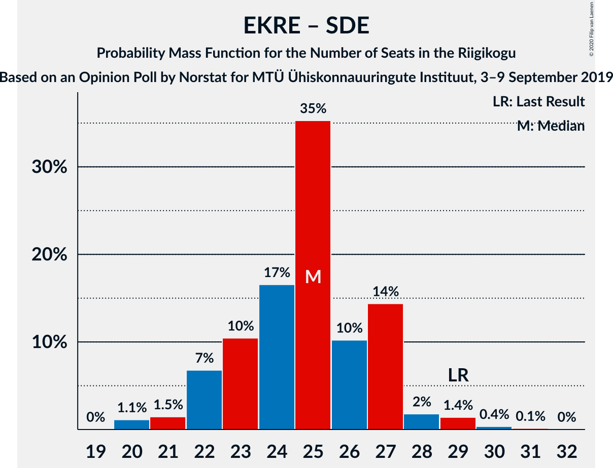

| Number of Seats | Probability | Accumulated | Special Marks |
|:---------------:|:-----------:|:-----------:|:-------------:|
| 20 | 1.1% | 100% |  |
| 21 | 1.5% | 98.8% |  |
| 22 | 7% | 97% |  |
| 23 | 10% | 91% |  |
| 24 | 17% | 80% |  |
| 25 | 35% | 64% | Median |
| 26 | 10% | 28% |  |
| 27 | 14% | 18% |  |
| 28 | 2% | 4% |  |
| 29 | 1.4% | 2% | Last Result |
| 30 | 0.4% | 0.5% |  |
| 31 | 0.1% | 0.2% |  |
| 32 | 0% | 0% |  |

## Technical Information

### Opinion Poll

+ **Polling firm:** Norstat
+ **Commissioner(s):** MTÜ Ühiskonnauuringute Instituut
+ **Fieldwork period:** 3–9 September 2019

### Calculations

+ **Sample size:** 1000
+ **Simulations done:** 131,072
+ **Error estimate:** 2.38%

