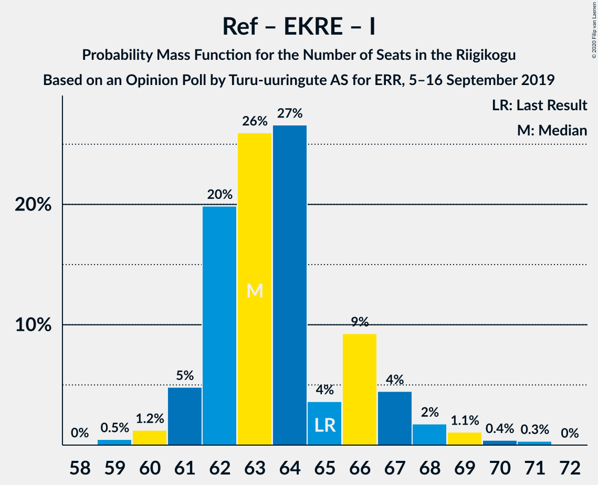
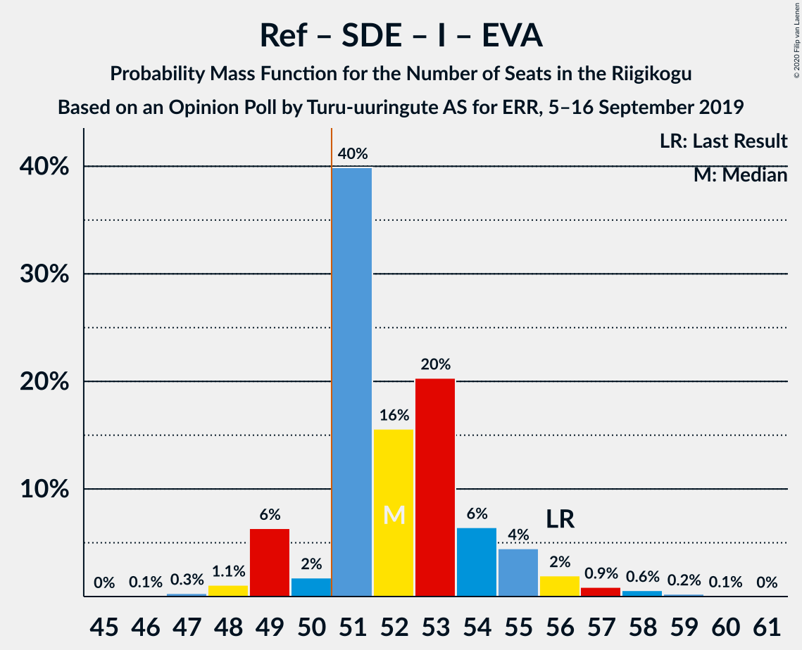

# Opinion Poll by Turu-uuringute AS for ERR, 5–16 September 2019

<a href="#voting-intentions">Voting Intentions</a> | <a href="#seats">Seats</a> | <a href="#coalitions">Coalitions</a> | <a href="#technical-information">Technical Information</a>

## Voting Intentions

### Confidence Intervals

| Party | Last Result | Poll Result | 80% Confidence Interval | 90% Confidence Interval | 95% Confidence Interval | 99% Confidence Interval |
|:-----:|:-----------:|:-----------:|:-----------------------:|:-----------------------:|:-----------------------:|:-----------------------:|
| Eesti Reformierakond | 28.9% | 33.6% | 31.7–35.5% |31.2–36.0% |30.7–36.5% |29.9–37.4% |
| Eesti Keskerakond | 23.1% | 22.0% | 20.4–23.7% |20.0–24.2% |19.6–24.6% |18.9–25.5% |
| Eesti Konservatiivne Rahvaerakond | 17.8% | 19.9% | 18.4–21.6% |18.0–22.0% |17.6–22.5% |16.9–23.3% |
| Sotsiaaldemokraatlik Erakond | 9.8% | 9.4% | 8.4–10.7% |8.0–11.1% |7.8–11.4% |7.3–12.0% |
| Erakond Isamaa | 11.4% | 6.3% | 5.5–7.4% |5.2–7.7% |5.0–8.0% |4.6–8.6% |
| Eesti 200 | 4.4% | 5.3% | 4.5–6.3% |4.3–6.6% |4.1–6.8% |3.7–7.3% |
| Erakond Eestimaa Rohelised | 1.8% | 2.1% | 1.6–2.8% |1.5–3.0% |1.4–3.2% |1.2–3.6% |
| Eesti Vabaerakond | 1.2% | 0.3% | 0.2–0.7% |0.1–0.7% |0.1–0.9% |0.1–1.1% |

*Note:* The poll result column reflects the actual value used in the calculations. Published results may vary slightly, and in addition be rounded to fewer digits.

## Seats

### Confidence Intervals

| Party | Last Result | Median | 80% Confidence Interval | 90% Confidence Interval | 95% Confidence Interval | 99% Confidence Interval |
|:-----:|:-----------:|:------:|:-----------------------:|:-----------------------:|:-----------------------:|:-----------------------:|
| <a href="#eesti-reformierakond">Eesti Reformierakond</a> | 34 | 37 | 36–37 |36–37 |36–39 |35–44 |
| <a href="#eesti-keskerakond">Eesti Keskerakond</a> | 26 | 23 | 23–25 |22–25 |21–27 |20–27 |
| <a href="#eesti-konservatiivne-rahvaerakond">Eesti Konservatiivne Rahvaerakond</a> | 19 | 20 | 19–21 |18–23 |18–24 |18–25 |
| <a href="#sotsiaaldemokraatlik-erakond">Sotsiaaldemokraatlik Erakond</a> | 10 | 10 | 8–10 |8–10 |8–11 |7–12 |
| <a href="#erakond-isamaa">Erakond Isamaa</a> | 12 | 6 | 5–7 |4–7 |4–7 |0–7 |
| <a href="#eesti-200">Eesti 200</a> | 0 | 5 | 5 |4–5 |0–6 |0–6 |
| <a href="#erakond-eestimaa-rohelised">Erakond Eestimaa Rohelised</a> | 0 | 0 | 0 |0 |0 |0 |
| <a href="#eesti-vabaerakond">Eesti Vabaerakond</a> | 0 | 0 | 0 |0 |0 |0 |

### Eesti Reformierakond

*For a full overview of the results for this party, see the [Eesti Reformierakond](party-eestireformierakond.html) page.*

| Number of Seats | Probability | Accumulated | Special Marks |
|:---------------:|:-----------:|:-----------:|:-------------:|
| 34 | 0.2% | 100% | Last Result |
| 35 | 0.4% | 99.8% |  |
| 36 | 12% | 99.5% |  |
| 37 | 84% | 87% | Median |
| 38 | 0.3% | 3% |  |
| 39 | 0.4% | 3% |  |
| 40 | 0.1% | 2% |  |
| 41 | 0.3% | 2% |  |
| 42 | 0.4% | 2% |  |
| 43 | 0.5% | 1.3% |  |
| 44 | 0.7% | 0.8% |  |
| 45 | 0.2% | 0.2% |  |
| 46 | 0% | 0% |  |

### Eesti Keskerakond

*For a full overview of the results for this party, see the [Eesti Keskerakond](party-eestikeskerakond.html) page.*

| Number of Seats | Probability | Accumulated | Special Marks |
|:---------------:|:-----------:|:-----------:|:-------------:|
| 19 | 0.1% | 100% |  |
| 20 | 0.5% | 99.9% |  |
| 21 | 3% | 99.3% |  |
| 22 | 2% | 97% |  |
| 23 | 63% | 95% | Median |
| 24 | 14% | 32% |  |
| 25 | 13% | 18% |  |
| 26 | 1.4% | 5% | Last Result |
| 27 | 3% | 3% |  |
| 28 | 0% | 0.1% |  |
| 29 | 0% | 0% |  |

### Eesti Konservatiivne Rahvaerakond

*For a full overview of the results for this party, see the [Eesti Konservatiivne Rahvaerakond](party-eestikonservatiivnerahvaerakond.html) page.*

| Number of Seats | Probability | Accumulated | Special Marks |
|:---------------:|:-----------:|:-----------:|:-------------:|
| 18 | 8% | 100% |  |
| 19 | 14% | 92% | Last Result |
| 20 | 65% | 77% | Median |
| 21 | 4% | 13% |  |
| 22 | 2% | 9% |  |
| 23 | 3% | 7% |  |
| 24 | 1.3% | 4% |  |
| 25 | 2% | 2% |  |
| 26 | 0% | 0.1% |  |
| 27 | 0% | 0% |  |

### Sotsiaaldemokraatlik Erakond

*For a full overview of the results for this party, see the [Sotsiaaldemokraatlik Erakond](party-sotsiaaldemokraatlikerakond.html) page.*

| Number of Seats | Probability | Accumulated | Special Marks |
|:---------------:|:-----------:|:-----------:|:-------------:|
| 6 | 0.1% | 100% |  |
| 7 | 0.8% | 99.9% |  |
| 8 | 18% | 99.2% |  |
| 9 | 1.3% | 81% |  |
| 10 | 75% | 79% | Last Result, Median |
| 11 | 3% | 5% |  |
| 12 | 2% | 2% |  |
| 13 | 0.1% | 0.1% |  |
| 14 | 0% | 0% |  |

### Erakond Isamaa

*For a full overview of the results for this party, see the [Erakond Isamaa](party-erakondisamaa.html) page.*

| Number of Seats | Probability | Accumulated | Special Marks |
|:---------------:|:-----------:|:-----------:|:-------------:|
| 0 | 0.7% | 100% |  |
| 1 | 0% | 99.3% |  |
| 2 | 0% | 99.3% |  |
| 3 | 0% | 99.3% |  |
| 4 | 4% | 99.3% |  |
| 5 | 8% | 95% |  |
| 6 | 66% | 87% | Median |
| 7 | 21% | 21% |  |
| 8 | 0.4% | 0.4% |  |
| 9 | 0% | 0% |  |
| 10 | 0% | 0% |  |
| 11 | 0% | 0% |  |
| 12 | 0% | 0% | Last Result |

### Eesti 200

*For a full overview of the results for this party, see the [Eesti 200](party-eesti200.html) page.*

| Number of Seats | Probability | Accumulated | Special Marks |
|:---------------:|:-----------:|:-----------:|:-------------:|
| 0 | 4% | 100% | Last Result |
| 1 | 0% | 96% |  |
| 2 | 0% | 96% |  |
| 3 | 0% | 96% |  |
| 4 | 4% | 96% |  |
| 5 | 87% | 92% | Median |
| 6 | 5% | 5% |  |
| 7 | 0.1% | 0.1% |  |
| 8 | 0% | 0% |  |

### Erakond Eestimaa Rohelised

*For a full overview of the results for this party, see the [Erakond Eestimaa Rohelised](party-erakondeestimaarohelised.html) page.*

| Number of Seats | Probability | Accumulated | Special Marks |
|:---------------:|:-----------:|:-----------:|:-------------:|
| 0 | 100% | 100% | Last Result, Median |

### Eesti Vabaerakond

*For a full overview of the results for this party, see the [Eesti Vabaerakond](party-eestivabaerakond.html) page.*

| Number of Seats | Probability | Accumulated | Special Marks |
|:---------------:|:-----------:|:-----------:|:-------------:|
| 0 | 100% | 100% | Last Result, Median |

## Coalitions

### Confidence Intervals

| Coalition | Last Result | Median | Majority? | 80% Confidence Interval | 90% Confidence Interval | 95% Confidence Interval | 99% Confidence Interval |
|:---------:|:-----------:|:------:|:---------:|:-----------------------:|:-----------------------:|:-----------------------:|:-----------------------:|
| Eesti Reformierakond – Eesti Keskerakond – Eesti Konservatiivne Rahvaerakond | 79 | 80 | 100% | 79–83 | 79–84 | 79–84 | 78–87 |
| Eesti Reformierakond – Eesti Konservatiivne Rahvaerakond – Erakond Isamaa | 65 | 63 | 100% | 62–63 | 61–66 | 61–66 | 60–69 |
| Eesti Reformierakond – Eesti Keskerakond | 60 | 60 | 100% | 60–62 | 59–63 | 57–63 | 57–67 |
| Eesti Reformierakond – Eesti Konservatiivne Rahvaerakond | 53 | 57 | 100% | 56–58 | 55–60 | 55–61 | 55–65 |
| Eesti Reformierakond – Sotsiaaldemokraatlik Erakond – Erakond Isamaa – Eesti Vabaerakond | 56 | 53 | 91% | 51–54 | 50–54 | 49–55 | 48–57 |
| Eesti Reformierakond – Sotsiaaldemokraatlik Erakond – Erakond Isamaa | 56 | 53 | 91% | 51–54 | 50–54 | 49–55 | 48–57 |
| Eesti Keskerakond – Eesti Konservatiivne Rahvaerakond – Erakond Isamaa | 57 | 49 | 23% | 49–51 | 49–52 | 47–53 | 45–54 |
| Eesti Reformierakond – Sotsiaaldemokraatlik Erakond | 44 | 47 | 1.3% | 45–47 | 44–48 | 44–49 | 44–52 |
| Eesti Keskerakond – Eesti Konservatiivne Rahvaerakond | 45 | 43 | 0.1% | 42–46 | 42–47 | 42–47 | 40–48 |
| Eesti Reformierakond – Erakond Isamaa | 46 | 43 | 0.2% | 41–44 | 41–44 | 40–44 | 40–49 |
| Eesti Keskerakond – Sotsiaaldemokraatlik Erakond – Erakond Isamaa | 48 | 39 | 0% | 38–41 | 37–41 | 36–41 | 33–41 |
| Eesti Keskerakond – Sotsiaaldemokraatlik Erakond | 36 | 33 | 0% | 33–34 | 31–35 | 31–35 | 28–36 |
| Eesti Konservatiivne Rahvaerakond – Sotsiaaldemokraatlik Erakond | 29 | 30 | 0% | 27–31 | 27–34 | 27–35 | 27–35 |

### Eesti Reformierakond – Eesti Keskerakond – Eesti Konservatiivne Rahvaerakond

| Number of Seats | Probability | Accumulated | Special Marks |
|:---------------:|:-----------:|:-----------:|:-------------:|
| 78 | 2% | 100% |  |
| 79 | 8% | 98% | Last Result |
| 80 | 61% | 90% | Median |
| 81 | 16% | 29% |  |
| 82 | 2% | 13% |  |
| 83 | 5% | 11% |  |
| 84 | 3% | 5% |  |
| 85 | 0.4% | 2% |  |
| 86 | 0.9% | 2% |  |
| 87 | 0.6% | 1.1% |  |
| 88 | 0.3% | 0.5% |  |
| 89 | 0.1% | 0.2% |  |
| 90 | 0.1% | 0.1% |  |
| 91 | 0% | 0% |  |

### Eesti Reformierakond – Eesti Konservatiivne Rahvaerakond – Erakond Isamaa

| Number of Seats | Probability | Accumulated | Special Marks |
|:---------------:|:-----------:|:-----------:|:-------------:|
| 60 | 1.1% | 100% |  |
| 61 | 6% | 98.9% |  |
| 62 | 11% | 93% |  |
| 63 | 72% | 82% | Median |
| 64 | 0.7% | 9% |  |
| 65 | 1.1% | 9% | Last Result |
| 66 | 6% | 7% |  |
| 67 | 0.3% | 2% |  |
| 68 | 0.3% | 1.4% |  |
| 69 | 0.7% | 1.1% |  |
| 70 | 0.1% | 0.4% |  |
| 71 | 0.3% | 0.3% |  |
| 72 | 0% | 0% |  |

### Eesti Reformierakond – Eesti Keskerakond

| Number of Seats | Probability | Accumulated | Special Marks |
|:---------------:|:-----------:|:-----------:|:-------------:|
| 56 | 0.2% | 100% |  |
| 57 | 2% | 99.8% |  |
| 58 | 0.1% | 97% |  |
| 59 | 3% | 97% |  |
| 60 | 64% | 94% | Last Result, Median |
| 61 | 12% | 31% |  |
| 62 | 13% | 18% |  |
| 63 | 3% | 6% |  |
| 64 | 0.8% | 2% |  |
| 65 | 0.2% | 1.4% |  |
| 66 | 0.6% | 1.2% |  |
| 67 | 0.4% | 0.6% |  |
| 68 | 0.2% | 0.2% |  |
| 69 | 0% | 0% |  |

### Eesti Reformierakond – Eesti Konservatiivne Rahvaerakond

| Number of Seats | Probability | Accumulated | Special Marks |
|:---------------:|:-----------:|:-----------:|:-------------:|
| 53 | 0% | 100% | Last Result |
| 54 | 0% | 100% |  |
| 55 | 9% | 100% |  |
| 56 | 17% | 91% |  |
| 57 | 63% | 74% | Median |
| 58 | 2% | 11% |  |
| 59 | 0.4% | 9% |  |
| 60 | 3% | 8% |  |
| 61 | 2% | 5% |  |
| 62 | 1.0% | 2% |  |
| 63 | 0.2% | 1.3% |  |
| 64 | 0.5% | 1.2% |  |
| 65 | 0.3% | 0.7% |  |
| 66 | 0.3% | 0.3% |  |
| 67 | 0% | 0% |  |

### Eesti Reformierakond – Sotsiaaldemokraatlik Erakond – Erakond Isamaa – Eesti Vabaerakond

| Number of Seats | Probability | Accumulated | Special Marks |
|:---------------:|:-----------:|:-----------:|:-------------:|
| 47 | 0.3% | 100% |  |
| 48 | 1.4% | 99.7% |  |
| 49 | 3% | 98% |  |
| 50 | 4% | 95% |  |
| 51 | 4% | 91% | Majority |
| 52 | 12% | 88% |  |
| 53 | 62% | 75% | Median |
| 54 | 11% | 14% |  |
| 55 | 2% | 3% |  |
| 56 | 0.4% | 1.3% | Last Result |
| 57 | 0.7% | 0.9% |  |
| 58 | 0.1% | 0.2% |  |
| 59 | 0% | 0.2% |  |
| 60 | 0.1% | 0.1% |  |
| 61 | 0% | 0% |  |

### Eesti Reformierakond – Sotsiaaldemokraatlik Erakond – Erakond Isamaa

| Number of Seats | Probability | Accumulated | Special Marks |
|:---------------:|:-----------:|:-----------:|:-------------:|
| 47 | 0.3% | 100% |  |
| 48 | 1.4% | 99.7% |  |
| 49 | 3% | 98% |  |
| 50 | 4% | 95% |  |
| 51 | 4% | 91% | Majority |
| 52 | 12% | 88% |  |
| 53 | 62% | 75% | Median |
| 54 | 11% | 14% |  |
| 55 | 2% | 3% |  |
| 56 | 0.4% | 1.3% | Last Result |
| 57 | 0.7% | 0.9% |  |
| 58 | 0.1% | 0.2% |  |
| 59 | 0% | 0.2% |  |
| 60 | 0.1% | 0.1% |  |
| 61 | 0% | 0% |  |

### Eesti Keskerakond – Eesti Konservatiivne Rahvaerakond – Erakond Isamaa

| Number of Seats | Probability | Accumulated | Special Marks |
|:---------------:|:-----------:|:-----------:|:-------------:|
| 44 | 0.3% | 100% |  |
| 45 | 0.4% | 99.7% |  |
| 46 | 0% | 99.3% |  |
| 47 | 2% | 99.3% |  |
| 48 | 1.0% | 97% |  |
| 49 | 72% | 96% | Median |
| 50 | 1.1% | 24% |  |
| 51 | 16% | 23% | Majority |
| 52 | 4% | 8% |  |
| 53 | 3% | 4% |  |
| 54 | 0.1% | 0.6% |  |
| 55 | 0.2% | 0.5% |  |
| 56 | 0.1% | 0.2% |  |
| 57 | 0.1% | 0.1% | Last Result |
| 58 | 0% | 0% |  |

### Eesti Reformierakond – Sotsiaaldemokraatlik Erakond

| Number of Seats | Probability | Accumulated | Special Marks |
|:---------------:|:-----------:|:-----------:|:-------------:|
| 42 | 0.1% | 100% |  |
| 43 | 0.3% | 99.8% |  |
| 44 | 6% | 99.6% | Last Result |
| 45 | 12% | 94% |  |
| 46 | 6% | 82% |  |
| 47 | 69% | 76% | Median |
| 48 | 3% | 7% |  |
| 49 | 2% | 4% |  |
| 50 | 0.4% | 2% |  |
| 51 | 0% | 1.3% | Majority |
| 52 | 1.0% | 1.3% |  |
| 53 | 0.1% | 0.2% |  |
| 54 | 0.2% | 0.2% |  |
| 55 | 0% | 0% |  |

### Eesti Keskerakond – Eesti Konservatiivne Rahvaerakond

| Number of Seats | Probability | Accumulated | Special Marks |
|:---------------:|:-----------:|:-----------:|:-------------:|
| 40 | 0.5% | 100% |  |
| 41 | 2% | 99.5% |  |
| 42 | 8% | 98% |  |
| 43 | 61% | 89% | Median |
| 44 | 13% | 28% |  |
| 45 | 4% | 16% | Last Result |
| 46 | 3% | 11% |  |
| 47 | 8% | 9% |  |
| 48 | 0.5% | 1.0% |  |
| 49 | 0.3% | 0.5% |  |
| 50 | 0.1% | 0.2% |  |
| 51 | 0% | 0.1% | Majority |
| 52 | 0% | 0% |  |

### Eesti Reformierakond – Erakond Isamaa

| Number of Seats | Probability | Accumulated | Special Marks |
|:---------------:|:-----------:|:-----------:|:-------------:|
| 38 | 0.2% | 100% |  |
| 39 | 0.1% | 99.7% |  |
| 40 | 4% | 99.7% |  |
| 41 | 7% | 96% |  |
| 42 | 0.9% | 89% |  |
| 43 | 66% | 88% | Median |
| 44 | 20% | 22% |  |
| 45 | 0.2% | 2% |  |
| 46 | 0.5% | 2% | Last Result |
| 47 | 0% | 1.2% |  |
| 48 | 0.5% | 1.2% |  |
| 49 | 0.5% | 0.6% |  |
| 50 | 0% | 0.2% |  |
| 51 | 0.1% | 0.2% | Majority |
| 52 | 0% | 0% |  |

### Eesti Keskerakond – Sotsiaaldemokraatlik Erakond – Erakond Isamaa

| Number of Seats | Probability | Accumulated | Special Marks |
|:---------------:|:-----------:|:-----------:|:-------------:|
| 31 | 0.3% | 100% |  |
| 32 | 0% | 99.7% |  |
| 33 | 0.6% | 99.7% |  |
| 34 | 0.2% | 99.1% |  |
| 35 | 0.9% | 98.9% |  |
| 36 | 2% | 98% |  |
| 37 | 3% | 96% |  |
| 38 | 3% | 93% |  |
| 39 | 61% | 90% | Median |
| 40 | 17% | 29% |  |
| 41 | 12% | 12% |  |
| 42 | 0.3% | 0.4% |  |
| 43 | 0.1% | 0.1% |  |
| 44 | 0% | 0% |  |
| 45 | 0% | 0% |  |
| 46 | 0% | 0% |  |
| 47 | 0% | 0% |  |
| 48 | 0% | 0% | Last Result |

### Eesti Keskerakond – Sotsiaaldemokraatlik Erakond

| Number of Seats | Probability | Accumulated | Special Marks |
|:---------------:|:-----------:|:-----------:|:-------------:|
| 27 | 0.1% | 100% |  |
| 28 | 0.4% | 99.9% |  |
| 29 | 0.2% | 99.5% |  |
| 30 | 0.4% | 99.2% |  |
| 31 | 4% | 98.8% |  |
| 32 | 0.7% | 95% |  |
| 33 | 74% | 94% | Median |
| 34 | 12% | 20% |  |
| 35 | 6% | 7% |  |
| 36 | 2% | 2% | Last Result |
| 37 | 0.1% | 0.1% |  |
| 38 | 0% | 0% |  |

### Eesti Konservatiivne Rahvaerakond – Sotsiaaldemokraatlik Erakond

| Number of Seats | Probability | Accumulated | Special Marks |
|:---------------:|:-----------:|:-----------:|:-------------:|
| 26 | 0.1% | 100% |  |
| 27 | 12% | 99.8% |  |
| 28 | 12% | 88% |  |
| 29 | 2% | 76% | Last Result |
| 30 | 63% | 74% | Median |
| 31 | 4% | 11% |  |
| 32 | 2% | 7% |  |
| 33 | 0.3% | 5% |  |
| 34 | 2% | 5% |  |
| 35 | 2% | 3% |  |
| 36 | 0.1% | 0.1% |  |
| 37 | 0% | 0% |  |

## Technical Information

### Opinion Poll

+ **Polling firm:** Turu-uuringute AS
+ **Commissioner(s):** ERR
+ **Fieldwork period:** 5–16 September 2019

### Calculations

+ **Sample size:** 1040
+ **Simulations done:** 16,384
+ **Error estimate:** 1.62%

