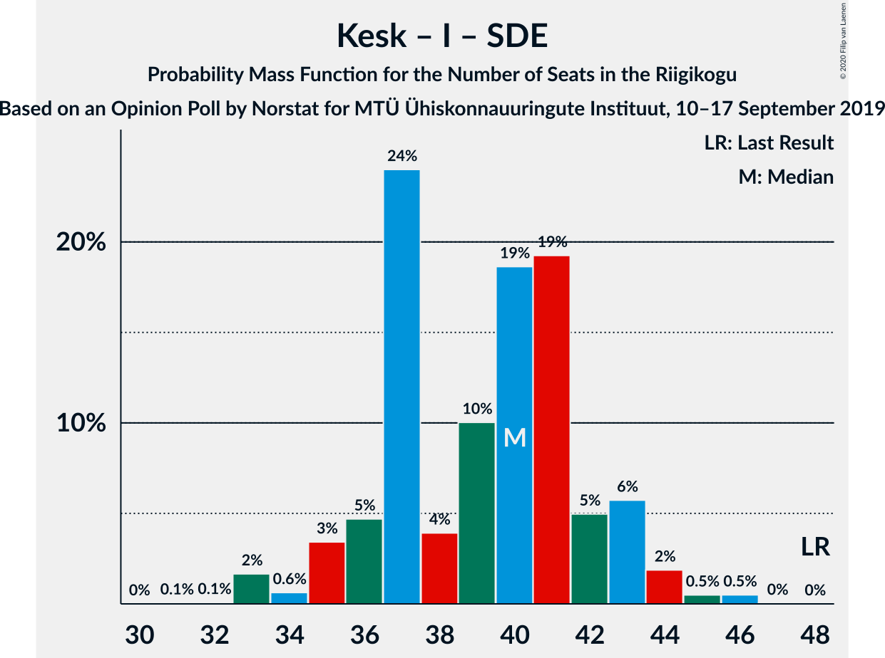

# Opinion Poll by Norstat for MTÜ Ühiskonnauuringute Instituut, 10–17 September 2019

<a href="#voting-intentions">Voting Intentions</a> | <a href="#seats">Seats</a> | <a href="#coalitions">Coalitions</a> | <a href="#technical-information">Technical Information</a>

## Voting Intentions

### Confidence Intervals

| Party | Last Result | Poll Result | 80% Confidence Interval | 90% Confidence Interval | 95% Confidence Interval | 99% Confidence Interval |
|:-----:|:-----------:|:-----------:|:-----------------------:|:-----------------------:|:-----------------------:|:-----------------------:|
| Eesti Reformierakond | 28.9% | 33.7% | 31.8–35.7% |31.3–36.2% |30.8–36.7% |29.9–37.6% |
| Eesti Keskerakond | 23.1% | 24.1% | 22.4–25.9% |21.9–26.4% |21.6–26.9% |20.8–27.7% |
| Eesti Konservatiivne Rahvaerakond | 17.8% | 17.1% | 15.7–18.7% |15.2–19.2% |14.9–19.6% |14.2–20.4% |
| Erakond Isamaa | 11.4% | 7.2% | 6.2–8.4% |6.0–8.7% |5.7–9.0% |5.3–9.6% |
| Sotsiaaldemokraatlik Erakond | 9.8% | 6.4% | 5.5–7.5% |5.3–7.8% |5.0–8.1% |4.6–8.7% |
| Eesti 200 | 4.4% | 5.2% | 4.4–6.2% |4.2–6.5% |4.0–6.8% |3.6–7.3% |
| Erakond Eestimaa Rohelised | 1.8% | 3.7% | 3.0–4.6% |2.9–4.8% |2.7–5.1% |2.4–5.5% |
| Eesti Vabaerakond | 1.2% | 0.1% | 0.0–0.4% |0.0–0.5% |0.0–0.6% |0.0–0.7% |

*Note:* The poll result column reflects the actual value used in the calculations. Published results may vary slightly, and in addition be rounded to fewer digits.

## Seats

### Confidence Intervals

| Party | Last Result | Median | 80% Confidence Interval | 90% Confidence Interval | 95% Confidence Interval | 99% Confidence Interval |
|:-----:|:-----------:|:------:|:-----------------------:|:-----------------------:|:-----------------------:|:-----------------------:|
| <a href="#eesti-reformierakond">Eesti Reformierakond</a> | 34 | 40 | 37–43 |37–43 |36–45 |34–45 |
| <a href="#eesti-keskerakond">Eesti Keskerakond</a> | 26 | 26 | 25–29 |24–29 |23–30 |23–32 |
| <a href="#eesti-konservatiivne-rahvaerakond">Eesti Konservatiivne Rahvaerakond</a> | 19 | 19 | 17–21 |16–21 |16–22 |15–23 |
| <a href="#erakond-isamaa">Erakond Isamaa</a> | 12 | 6 | 6–8 |5–9 |5–9 |5–10 |
| <a href="#sotsiaaldemokraatlik-erakond">Sotsiaaldemokraatlik Erakond</a> | 10 | 6 | 5–7 |5–7 |0–8 |0–8 |
| <a href="#eesti-200">Eesti 200</a> | 0 | 4 | 0–5 |0–6 |0–6 |0–7 |
| <a href="#erakond-eestimaa-rohelised">Erakond Eestimaa Rohelised</a> | 0 | 0 | 0 |0 |0–4 |0–5 |
| <a href="#eesti-vabaerakond">Eesti Vabaerakond</a> | 0 | 0 | 0 |0 |0 |0 |

### Eesti Reformierakond

*For a full overview of the results for this party, see the [Eesti Reformierakond](party-eestireformierakond.html) page.*

| Number of Seats | Probability | Accumulated | Special Marks |
|:---------------:|:-----------:|:-----------:|:-------------:|
| 33 | 0.2% | 100% |  |
| 34 | 0.4% | 99.8% | Last Result |
| 35 | 1.2% | 99.4% |  |
| 36 | 3% | 98% |  |
| 37 | 9% | 95% |  |
| 38 | 7% | 87% |  |
| 39 | 10% | 79% |  |
| 40 | 28% | 69% | Median |
| 41 | 9% | 42% |  |
| 42 | 11% | 32% |  |
| 43 | 16% | 21% |  |
| 44 | 2% | 5% |  |
| 45 | 3% | 3% |  |
| 46 | 0.1% | 0.2% |  |
| 47 | 0% | 0% |  |

### Eesti Keskerakond

*For a full overview of the results for this party, see the [Eesti Keskerakond](party-eestikeskerakond.html) page.*

| Number of Seats | Probability | Accumulated | Special Marks |
|:---------------:|:-----------:|:-----------:|:-------------:|
| 22 | 0.2% | 100% |  |
| 23 | 3% | 99.8% |  |
| 24 | 6% | 96% |  |
| 25 | 5% | 91% |  |
| 26 | 36% | 85% | Last Result, Median |
| 27 | 10% | 50% |  |
| 28 | 16% | 39% |  |
| 29 | 20% | 24% |  |
| 30 | 1.2% | 3% |  |
| 31 | 1.3% | 2% |  |
| 32 | 0.4% | 0.9% |  |
| 33 | 0.4% | 0.5% |  |
| 34 | 0.1% | 0.1% |  |
| 35 | 0% | 0% |  |

### Eesti Konservatiivne Rahvaerakond

*For a full overview of the results for this party, see the [Eesti Konservatiivne Rahvaerakond](party-eestikonservatiivnerahvaerakond.html) page.*

| Number of Seats | Probability | Accumulated | Special Marks |
|:---------------:|:-----------:|:-----------:|:-------------:|
| 13 | 0.1% | 100% |  |
| 14 | 0.1% | 99.9% |  |
| 15 | 2% | 99.8% |  |
| 16 | 3% | 98% |  |
| 17 | 25% | 95% |  |
| 18 | 17% | 70% |  |
| 19 | 36% | 53% | Last Result, Median |
| 20 | 7% | 17% |  |
| 21 | 7% | 10% |  |
| 22 | 2% | 3% |  |
| 23 | 0.7% | 0.7% |  |
| 24 | 0% | 0% |  |

### Erakond Isamaa

*For a full overview of the results for this party, see the [Erakond Isamaa](party-erakondisamaa.html) page.*

| Number of Seats | Probability | Accumulated | Special Marks |
|:---------------:|:-----------:|:-----------:|:-------------:|
| 0 | 0.1% | 100% |  |
| 1 | 0% | 99.9% |  |
| 2 | 0% | 99.9% |  |
| 3 | 0% | 99.9% |  |
| 4 | 0.2% | 99.9% |  |
| 5 | 9% | 99.7% |  |
| 6 | 49% | 91% | Median |
| 7 | 23% | 42% |  |
| 8 | 12% | 19% |  |
| 9 | 6% | 7% |  |
| 10 | 1.0% | 1.0% |  |
| 11 | 0% | 0% |  |
| 12 | 0% | 0% | Last Result |

### Sotsiaaldemokraatlik Erakond

*For a full overview of the results for this party, see the [Sotsiaaldemokraatlik Erakond](party-sotsiaaldemokraatlikerakond.html) page.*

| Number of Seats | Probability | Accumulated | Special Marks |
|:---------------:|:-----------:|:-----------:|:-------------:|
| 0 | 3% | 100% |  |
| 1 | 0% | 97% |  |
| 2 | 0% | 97% |  |
| 3 | 0% | 97% |  |
| 4 | 0.9% | 97% |  |
| 5 | 37% | 96% |  |
| 6 | 38% | 58% | Median |
| 7 | 16% | 21% |  |
| 8 | 4% | 5% |  |
| 9 | 0.4% | 0.4% |  |
| 10 | 0% | 0% | Last Result |

### Eesti 200

*For a full overview of the results for this party, see the [Eesti 200](party-eesti200.html) page.*

| Number of Seats | Probability | Accumulated | Special Marks |
|:---------------:|:-----------:|:-----------:|:-------------:|
| 0 | 41% | 100% | Last Result |
| 1 | 0% | 59% |  |
| 2 | 0% | 59% |  |
| 3 | 0% | 59% |  |
| 4 | 14% | 59% | Median |
| 5 | 36% | 45% |  |
| 6 | 8% | 9% |  |
| 7 | 0.9% | 1.0% |  |
| 8 | 0.1% | 0.1% |  |
| 9 | 0% | 0% |  |

### Erakond Eestimaa Rohelised

*For a full overview of the results for this party, see the [Erakond Eestimaa Rohelised](party-erakondeestimaarohelised.html) page.*

| Number of Seats | Probability | Accumulated | Special Marks |
|:---------------:|:-----------:|:-----------:|:-------------:|
| 0 | 97% | 100% | Last Result, Median |
| 1 | 0% | 3% |  |
| 2 | 0% | 3% |  |
| 3 | 0% | 3% |  |
| 4 | 2% | 3% |  |
| 5 | 0.9% | 0.9% |  |
| 6 | 0% | 0% |  |

### Eesti Vabaerakond

*For a full overview of the results for this party, see the [Eesti Vabaerakond](party-eestivabaerakond.html) page.*

| Number of Seats | Probability | Accumulated | Special Marks |
|:---------------:|:-----------:|:-----------:|:-------------:|
| 0 | 100% | 100% | Last Result, Median |

## Coalitions

### Confidence Intervals

| Coalition | Last Result | Median | Majority? | 80% Confidence Interval | 90% Confidence Interval | 95% Confidence Interval | 99% Confidence Interval |
|:---------:|:-----------:|:------:|:---------:|:-----------------------:|:-----------------------:|:-----------------------:|:-----------------------:|
| Eesti Reformierakond – Eesti Keskerakond – Eesti Konservatiivne Rahvaerakond | 79 | 85 | 100% | 82–89 | 81–90 | 81–90 | 80–93 |
| Eesti Reformierakond – Eesti Keskerakond | 60 | 67 | 100% | 64–72 | 63–72 | 62–72 | 61–73 |
| Eesti Reformierakond – Eesti Konservatiivne Rahvaerakond – Erakond Isamaa | 65 | 65 | 100% | 62–68 | 61–69 | 60–70 | 58–71 |
| Eesti Reformierakond – Eesti Konservatiivne Rahvaerakond | 53 | 59 | 100% | 55–61 | 54–62 | 53–63 | 52–64 |
| Eesti Reformierakond – Erakond Isamaa – Sotsiaaldemokraatlik Erakond – Eesti Vabaerakond | 56 | 52 | 87% | 50–55 | 49–57 | 48–58 | 46–58 |
| Eesti Reformierakond – Erakond Isamaa – Sotsiaaldemokraatlik Erakond | 56 | 52 | 87% | 50–55 | 49–57 | 48–58 | 46–58 |
| Eesti Keskerakond – Eesti Konservatiivne Rahvaerakond – Erakond Isamaa | 57 | 51 | 83% | 50–55 | 48–56 | 47–57 | 46–59 |
| Eesti Reformierakond – Erakond Isamaa | 46 | 46 | 6% | 44–50 | 44–51 | 43–52 | 41–53 |
| Eesti Keskerakond – Eesti Konservatiivne Rahvaerakond | 45 | 45 | 2% | 43–49 | 42–49 | 41–50 | 40–52 |
| Eesti Reformierakond – Sotsiaaldemokraatlik Erakond | 44 | 45 | 0.6% | 43–49 | 42–50 | 41–50 | 39–51 |
| Eesti Keskerakond – Erakond Isamaa – Sotsiaaldemokraatlik Erakond | 48 | 40 | 0% | 36–42 | 35–43 | 35–44 | 33–46 |
| Eesti Keskerakond – Sotsiaaldemokraatlik Erakond | 36 | 33 | 0% | 30–35 | 29–36 | 28–36 | 26–39 |
| Eesti Konservatiivne Rahvaerakond – Sotsiaaldemokraatlik Erakond | 29 | 24 | 0% | 22–27 | 21–27 | 20–28 | 19–29 |

### Eesti Reformierakond – Eesti Keskerakond – Eesti Konservatiivne Rahvaerakond

| Number of Seats | Probability | Accumulated | Special Marks |
|:---------------:|:-----------:|:-----------:|:-------------:|
| 77 | 0% | 100% |  |
| 78 | 0.1% | 99.9% |  |
| 79 | 0.3% | 99.8% | Last Result |
| 80 | 2% | 99.6% |  |
| 81 | 4% | 98% |  |
| 82 | 10% | 94% |  |
| 83 | 5% | 84% |  |
| 84 | 7% | 78% |  |
| 85 | 28% | 72% | Median |
| 86 | 8% | 44% |  |
| 87 | 7% | 36% |  |
| 88 | 5% | 29% |  |
| 89 | 16% | 23% |  |
| 90 | 7% | 8% |  |
| 91 | 0.2% | 1.1% |  |
| 92 | 0% | 0.9% |  |
| 93 | 0.4% | 0.9% |  |
| 94 | 0.2% | 0.5% |  |
| 95 | 0.3% | 0.3% |  |
| 96 | 0% | 0% |  |

### Eesti Reformierakond – Eesti Keskerakond

| Number of Seats | Probability | Accumulated | Special Marks |
|:---------------:|:-----------:|:-----------:|:-------------:|
| 59 | 0.2% | 100% |  |
| 60 | 0.1% | 99.8% | Last Result |
| 61 | 0.7% | 99.7% |  |
| 62 | 2% | 99.0% |  |
| 63 | 6% | 97% |  |
| 64 | 5% | 91% |  |
| 65 | 10% | 86% |  |
| 66 | 27% | 77% | Median |
| 67 | 9% | 50% |  |
| 68 | 13% | 42% |  |
| 69 | 6% | 29% |  |
| 70 | 4% | 22% |  |
| 71 | 8% | 18% |  |
| 72 | 9% | 10% |  |
| 73 | 0.9% | 1.2% |  |
| 74 | 0.2% | 0.3% |  |
| 75 | 0% | 0.1% |  |
| 76 | 0% | 0% |  |

### Eesti Reformierakond – Eesti Konservatiivne Rahvaerakond – Erakond Isamaa

| Number of Seats | Probability | Accumulated | Special Marks |
|:---------------:|:-----------:|:-----------:|:-------------:|
| 57 | 0.1% | 100% |  |
| 58 | 0.4% | 99.9% |  |
| 59 | 0.5% | 99.5% |  |
| 60 | 2% | 99.0% |  |
| 61 | 4% | 97% |  |
| 62 | 8% | 93% |  |
| 63 | 4% | 85% |  |
| 64 | 8% | 81% |  |
| 65 | 26% | 73% | Last Result, Median |
| 66 | 16% | 47% |  |
| 67 | 18% | 31% |  |
| 68 | 7% | 14% |  |
| 69 | 2% | 7% |  |
| 70 | 3% | 5% |  |
| 71 | 2% | 2% |  |
| 72 | 0.2% | 0.2% |  |
| 73 | 0% | 0% |  |

### Eesti Reformierakond – Eesti Konservatiivne Rahvaerakond

| Number of Seats | Probability | Accumulated | Special Marks |
|:---------------:|:-----------:|:-----------:|:-------------:|
| 51 | 0.2% | 100% | Majority |
| 52 | 0.5% | 99.7% |  |
| 53 | 2% | 99.2% | Last Result |
| 54 | 6% | 97% |  |
| 55 | 4% | 91% |  |
| 56 | 7% | 87% |  |
| 57 | 4% | 80% |  |
| 58 | 9% | 76% |  |
| 59 | 24% | 67% | Median |
| 60 | 19% | 43% |  |
| 61 | 18% | 24% |  |
| 62 | 3% | 6% |  |
| 63 | 1.4% | 3% |  |
| 64 | 1.4% | 2% |  |
| 65 | 0.4% | 0.5% |  |
| 66 | 0% | 0% |  |

### Eesti Reformierakond – Erakond Isamaa – Sotsiaaldemokraatlik Erakond – Eesti Vabaerakond

| Number of Seats | Probability | Accumulated | Special Marks |
|:---------------:|:-----------:|:-----------:|:-------------:|
| 44 | 0.1% | 100% |  |
| 45 | 0.2% | 99.9% |  |
| 46 | 0.6% | 99.7% |  |
| 47 | 0.5% | 99.1% |  |
| 48 | 2% | 98.6% |  |
| 49 | 4% | 97% |  |
| 50 | 6% | 93% |  |
| 51 | 29% | 87% | Majority |
| 52 | 12% | 58% | Median |
| 53 | 11% | 45% |  |
| 54 | 10% | 34% |  |
| 55 | 15% | 24% |  |
| 56 | 1.3% | 9% | Last Result |
| 57 | 5% | 8% |  |
| 58 | 3% | 3% |  |
| 59 | 0.1% | 0.2% |  |
| 60 | 0.1% | 0.1% |  |
| 61 | 0% | 0% |  |

### Eesti Reformierakond – Erakond Isamaa – Sotsiaaldemokraatlik Erakond

| Number of Seats | Probability | Accumulated | Special Marks |
|:---------------:|:-----------:|:-----------:|:-------------:|
| 44 | 0.1% | 100% |  |
| 45 | 0.2% | 99.9% |  |
| 46 | 0.6% | 99.7% |  |
| 47 | 0.5% | 99.1% |  |
| 48 | 2% | 98.6% |  |
| 49 | 4% | 97% |  |
| 50 | 6% | 93% |  |
| 51 | 29% | 87% | Majority |
| 52 | 12% | 58% | Median |
| 53 | 11% | 45% |  |
| 54 | 10% | 34% |  |
| 55 | 15% | 24% |  |
| 56 | 1.3% | 9% | Last Result |
| 57 | 5% | 8% |  |
| 58 | 3% | 3% |  |
| 59 | 0.1% | 0.2% |  |
| 60 | 0.1% | 0.1% |  |
| 61 | 0% | 0% |  |

### Eesti Keskerakond – Eesti Konservatiivne Rahvaerakond – Erakond Isamaa

| Number of Seats | Probability | Accumulated | Special Marks |
|:---------------:|:-----------:|:-----------:|:-------------:|
| 45 | 0% | 100% |  |
| 46 | 0.6% | 99.9% |  |
| 47 | 2% | 99.4% |  |
| 48 | 3% | 97% |  |
| 49 | 3% | 94% |  |
| 50 | 8% | 91% |  |
| 51 | 33% | 83% | Median, Majority |
| 52 | 22% | 50% |  |
| 53 | 5% | 28% |  |
| 54 | 8% | 23% |  |
| 55 | 7% | 15% |  |
| 56 | 3% | 8% |  |
| 57 | 3% | 5% | Last Result |
| 58 | 0.8% | 2% |  |
| 59 | 0.9% | 0.9% |  |
| 60 | 0% | 0.1% |  |
| 61 | 0% | 0.1% |  |
| 62 | 0% | 0% |  |

### Eesti Reformierakond – Erakond Isamaa

| Number of Seats | Probability | Accumulated | Special Marks |
|:---------------:|:-----------:|:-----------:|:-------------:|
| 39 | 0.2% | 100% |  |
| 40 | 0.1% | 99.8% |  |
| 41 | 0.5% | 99.7% |  |
| 42 | 0.9% | 99.2% |  |
| 43 | 3% | 98% |  |
| 44 | 11% | 96% |  |
| 45 | 7% | 84% |  |
| 46 | 31% | 77% | Last Result, Median |
| 47 | 9% | 46% |  |
| 48 | 9% | 37% |  |
| 49 | 16% | 28% |  |
| 50 | 7% | 12% |  |
| 51 | 3% | 6% | Majority |
| 52 | 2% | 3% |  |
| 53 | 1.4% | 1.4% |  |
| 54 | 0.1% | 0.1% |  |
| 55 | 0% | 0% |  |

### Eesti Keskerakond – Eesti Konservatiivne Rahvaerakond

| Number of Seats | Probability | Accumulated | Special Marks |
|:---------------:|:-----------:|:-----------:|:-------------:|
| 38 | 0.1% | 100% |  |
| 39 | 0.1% | 99.9% |  |
| 40 | 0.5% | 99.8% |  |
| 41 | 3% | 99.4% |  |
| 42 | 5% | 96% |  |
| 43 | 6% | 91% |  |
| 44 | 17% | 86% |  |
| 45 | 28% | 68% | Last Result, Median |
| 46 | 15% | 40% |  |
| 47 | 10% | 25% |  |
| 48 | 5% | 15% |  |
| 49 | 6% | 10% |  |
| 50 | 2% | 4% |  |
| 51 | 1.4% | 2% | Majority |
| 52 | 0.7% | 0.8% |  |
| 53 | 0.1% | 0.1% |  |
| 54 | 0% | 0% |  |

### Eesti Reformierakond – Sotsiaaldemokraatlik Erakond

| Number of Seats | Probability | Accumulated | Special Marks |
|:---------------:|:-----------:|:-----------:|:-------------:|
| 38 | 0.1% | 100% |  |
| 39 | 0.6% | 99.9% |  |
| 40 | 1.1% | 99.3% |  |
| 41 | 2% | 98% |  |
| 42 | 3% | 96% |  |
| 43 | 5% | 94% |  |
| 44 | 7% | 88% | Last Result |
| 45 | 33% | 81% |  |
| 46 | 10% | 48% | Median |
| 47 | 12% | 38% |  |
| 48 | 4% | 25% |  |
| 49 | 13% | 22% |  |
| 50 | 8% | 8% |  |
| 51 | 0.3% | 0.6% | Majority |
| 52 | 0.3% | 0.3% |  |
| 53 | 0.1% | 0.1% |  |
| 54 | 0% | 0% |  |

### Eesti Keskerakond – Erakond Isamaa – Sotsiaaldemokraatlik Erakond

| Number of Seats | Probability | Accumulated | Special Marks |
|:---------------:|:-----------:|:-----------:|:-------------:|
| 31 | 0.1% | 100% |  |
| 32 | 0.1% | 99.9% |  |
| 33 | 2% | 99.9% |  |
| 34 | 0.6% | 98% |  |
| 35 | 3% | 98% |  |
| 36 | 5% | 94% |  |
| 37 | 24% | 89% |  |
| 38 | 4% | 65% | Median |
| 39 | 10% | 62% |  |
| 40 | 19% | 52% |  |
| 41 | 19% | 33% |  |
| 42 | 5% | 14% |  |
| 43 | 6% | 9% |  |
| 44 | 2% | 3% |  |
| 45 | 0.5% | 1.0% |  |
| 46 | 0.5% | 0.5% |  |
| 47 | 0% | 0% |  |
| 48 | 0% | 0% | Last Result |

### Eesti Keskerakond – Sotsiaaldemokraatlik Erakond

| Number of Seats | Probability | Accumulated | Special Marks |
|:---------------:|:-----------:|:-----------:|:-------------:|
| 24 | 0.1% | 100% |  |
| 25 | 0% | 99.9% |  |
| 26 | 1.3% | 99.9% |  |
| 27 | 0.3% | 98.6% |  |
| 28 | 2% | 98% |  |
| 29 | 6% | 97% |  |
| 30 | 2% | 91% |  |
| 31 | 27% | 89% |  |
| 32 | 8% | 62% | Median |
| 33 | 13% | 54% |  |
| 34 | 20% | 41% |  |
| 35 | 15% | 20% |  |
| 36 | 3% | 5% | Last Result |
| 37 | 1.1% | 2% |  |
| 38 | 0.4% | 1.0% |  |
| 39 | 0.6% | 0.6% |  |
| 40 | 0% | 0% |  |

### Eesti Konservatiivne Rahvaerakond – Sotsiaaldemokraatlik Erakond

| Number of Seats | Probability | Accumulated | Special Marks |
|:---------------:|:-----------:|:-----------:|:-------------:|
| 16 | 0% | 100% |  |
| 17 | 0.1% | 99.9% |  |
| 18 | 0.2% | 99.9% |  |
| 19 | 1.4% | 99.7% |  |
| 20 | 1.1% | 98% |  |
| 21 | 2% | 97% |  |
| 22 | 6% | 95% |  |
| 23 | 24% | 89% |  |
| 24 | 31% | 65% |  |
| 25 | 14% | 34% | Median |
| 26 | 6% | 19% |  |
| 27 | 11% | 13% |  |
| 28 | 2% | 3% |  |
| 29 | 0.4% | 0.5% | Last Result |
| 30 | 0.1% | 0.1% |  |
| 31 | 0% | 0% |  |

## Technical Information

### Opinion Poll

+ **Polling firm:** Norstat
+ **Commissioner(s):** MTÜ Ühiskonnauuringute Instituut
+ **Fieldwork period:** 10–17 September 2019

### Calculations

+ **Sample size:** 1000
+ **Simulations done:** 131,072
+ **Error estimate:** 2.36%

