# Opinion Poll by Kantar Emor for BNS and Postimees, 11–19 September 2019

<a href="#voting-intentions">Voting Intentions</a> | <a href="#seats">Seats</a> | <a href="#coalitions">Coalitions</a> | <a href="#technical-information">Technical Information</a>

## Voting Intentions

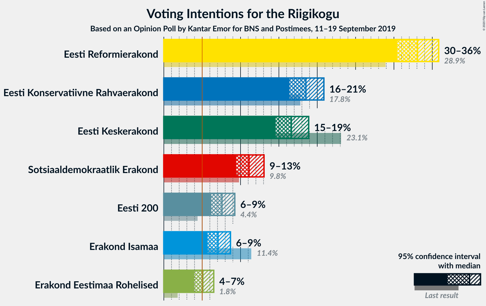

### Confidence Intervals

| Party | Last Result | Poll Result | 80% Confidence Interval | 90% Confidence Interval | 95% Confidence Interval | 99% Confidence Interval |
|:-----:|:-----------:|:-----------:|:-----------------------:|:-----------------------:|:-----------------------:|:-----------------------:|
| Eesti Reformierakond | 28.9% | 33.1% | 31.3–34.9% |30.8–35.4% |30.4–35.8% |29.6–36.7% |
| Eesti Konservatiivne Rahvaerakond | 17.8% | 18.5% | 17.1–20.1% |16.7–20.5% |16.4–20.9% |15.7–21.6% |
| Eesti Keskerakond | 23.1% | 16.6% | 15.3–18.1% |14.9–18.5% |14.6–18.9% |14.0–19.6% |
| Sotsiaaldemokraatlik Erakond | 9.8% | 11.1% | 10.0–12.4% |9.7–12.7% |9.4–13.1% |8.9–13.7% |
| Eesti 200 | 4.4% | 7.6% | 6.7–8.7% |6.4–9.0% |6.2–9.3% |5.8–9.8% |
| Erakond Isamaa | 11.4% | 7.1% | 6.2–8.1% |5.9–8.4% |5.7–8.7% |5.3–9.2% |
| Erakond Eestimaa Rohelised | 1.8% | 5.1% | 4.3–6.0% |4.1–6.3% |4.0–6.5% |3.6–7.0% |

*Note:* The poll result column reflects the actual value used in the calculations. Published results may vary slightly, and in addition be rounded to fewer digits.

## Seats

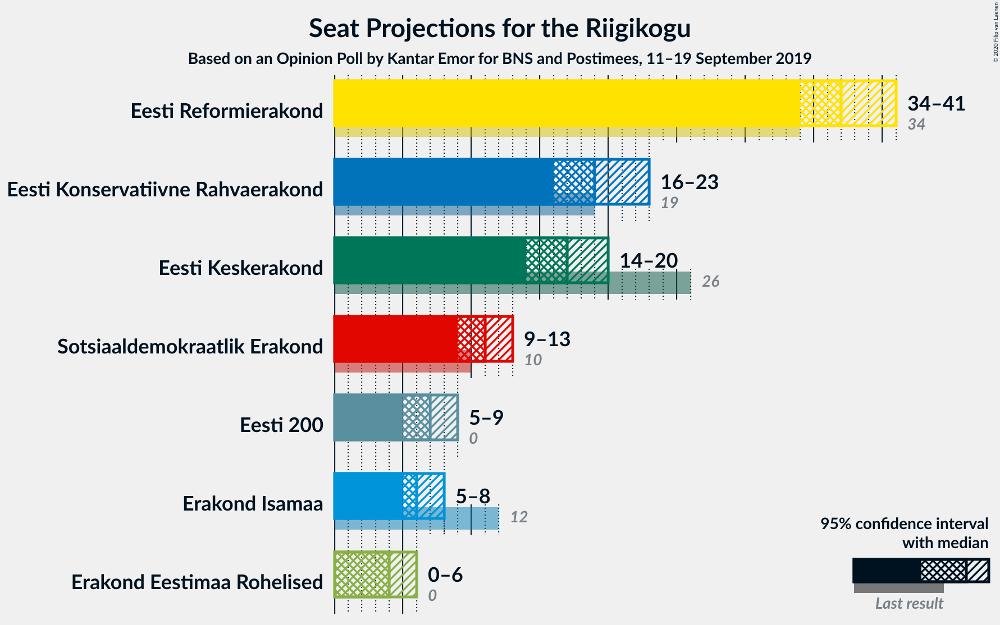

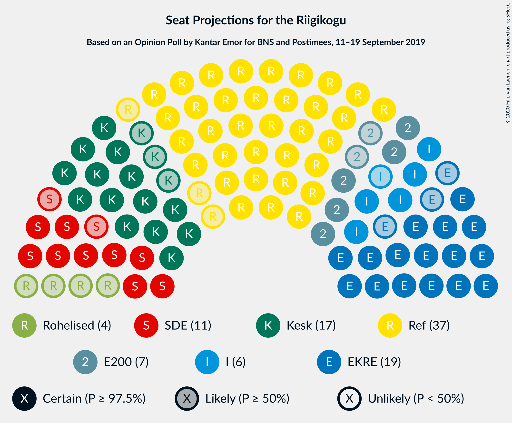

### Confidence Intervals

| Party | Last Result | Median | 80% Confidence Interval | 90% Confidence Interval | 95% Confidence Interval | 99% Confidence Interval |
|:-----:|:-----------:|:------:|:-----------------------:|:-----------------------:|:-----------------------:|:-----------------------:|
| <a href="#eesti-reformierakond">Eesti Reformierakond</a> | 34 | 37 | 35–40 |34–40 |34–41 |33–42 |
| <a href="#eesti-konservatiivne-rahvaerakond">Eesti Konservatiivne Rahvaerakond</a> | 19 | 19 | 18–21 |17–22 |16–23 |16–23 |
| <a href="#eesti-keskerakond">Eesti Keskerakond</a> | 26 | 17 | 16–19 |15–19 |14–20 |14–21 |
| <a href="#sotsiaaldemokraatlik-erakond">Sotsiaaldemokraatlik Erakond</a> | 10 | 11 | 9–12 |9–13 |9–13 |8–14 |
| <a href="#eesti-200">Eesti 200</a> | 0 | 7 | 6–8 |6–8 |5–9 |5–9 |
| <a href="#erakond-isamaa">Erakond Isamaa</a> | 12 | 6 | 5–8 |5–8 |5–8 |4–9 |
| <a href="#erakond-eestimaa-rohelised">Erakond Eestimaa Rohelised</a> | 0 | 4 | 0–5 |0–5 |0–6 |0–6 |

### Eesti Reformierakond

*For a full overview of the results for this party, see the [Eesti Reformierakond](party-eestireformierakond.html) page.*

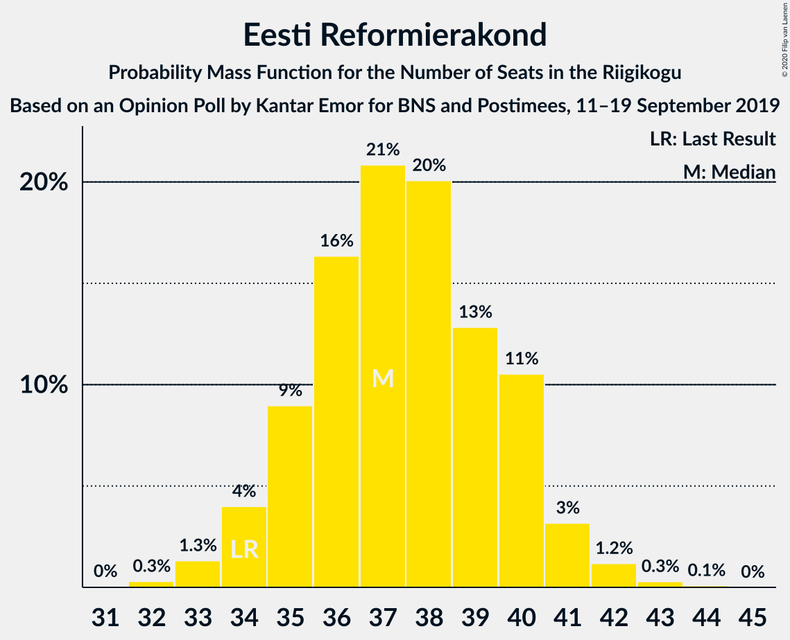

| Number of Seats | Probability | Accumulated | Special Marks |
|:---------------:|:-----------:|:-----------:|:-------------:|
| 32 | 0.3% | 100% |  |
| 33 | 1.3% | 99.7% |  |
| 34 | 4% | 98% | Last Result |
| 35 | 9% | 94% |  |
| 36 | 16% | 85% |  |
| 37 | 21% | 69% | Median |
| 38 | 20% | 48% |  |
| 39 | 13% | 28% |  |
| 40 | 11% | 15% |  |
| 41 | 3% | 5% |  |
| 42 | 1.2% | 2% |  |
| 43 | 0.3% | 0.4% |  |
| 44 | 0.1% | 0.1% |  |
| 45 | 0% | 0% |  |

### Eesti Konservatiivne Rahvaerakond

*For a full overview of the results for this party, see the [Eesti Konservatiivne Rahvaerakond](party-eestikonservatiivnerahvaerakond.html) page.*

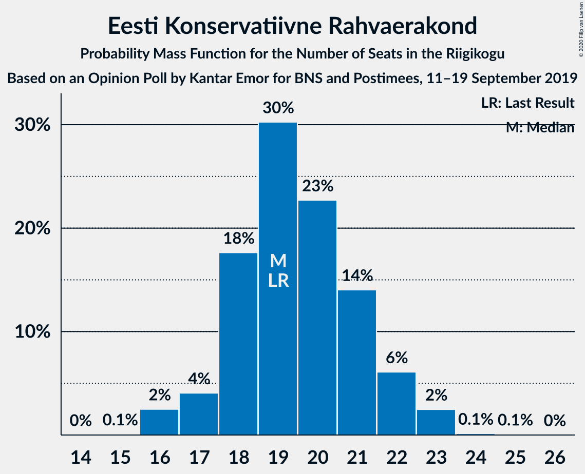

| Number of Seats | Probability | Accumulated | Special Marks |
|:---------------:|:-----------:|:-----------:|:-------------:|
| 15 | 0.1% | 100% |  |
| 16 | 2% | 99.9% |  |
| 17 | 4% | 97% |  |
| 18 | 18% | 93% |  |
| 19 | 30% | 76% | Last Result, Median |
| 20 | 23% | 45% |  |
| 21 | 14% | 23% |  |
| 22 | 6% | 9% |  |
| 23 | 2% | 3% |  |
| 24 | 0.1% | 0.2% |  |
| 25 | 0.1% | 0.1% |  |
| 26 | 0% | 0% |  |

### Eesti Keskerakond

*For a full overview of the results for this party, see the [Eesti Keskerakond](party-eestikeskerakond.html) page.*

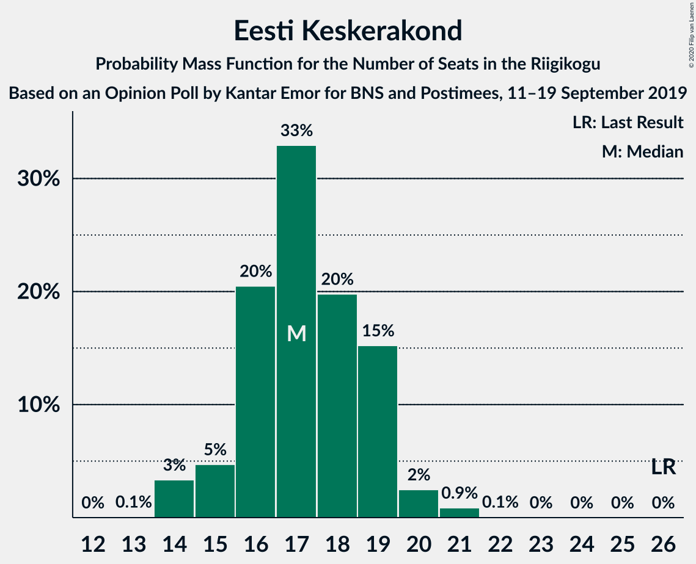

| Number of Seats | Probability | Accumulated | Special Marks |
|:---------------:|:-----------:|:-----------:|:-------------:|
| 13 | 0.1% | 100% |  |
| 14 | 3% | 99.9% |  |
| 15 | 5% | 97% |  |
| 16 | 20% | 92% |  |
| 17 | 33% | 71% | Median |
| 18 | 20% | 38% |  |
| 19 | 15% | 19% |  |
| 20 | 2% | 3% |  |
| 21 | 0.9% | 1.0% |  |
| 22 | 0.1% | 0.1% |  |
| 23 | 0% | 0% |  |
| 24 | 0% | 0% |  |
| 25 | 0% | 0% |  |
| 26 | 0% | 0% | Last Result |

### Sotsiaaldemokraatlik Erakond

*For a full overview of the results for this party, see the [Sotsiaaldemokraatlik Erakond](party-sotsiaaldemokraatlikerakond.html) page.*

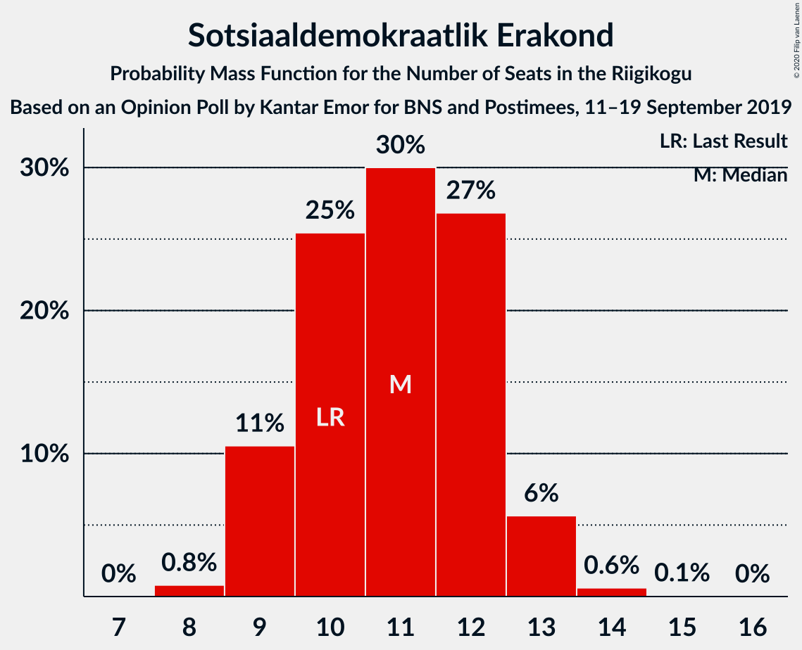

| Number of Seats | Probability | Accumulated | Special Marks |
|:---------------:|:-----------:|:-----------:|:-------------:|
| 8 | 0.8% | 100% |  |
| 9 | 11% | 99.2% |  |
| 10 | 25% | 89% | Last Result |
| 11 | 30% | 63% | Median |
| 12 | 27% | 33% |  |
| 13 | 6% | 6% |  |
| 14 | 0.6% | 0.7% |  |
| 15 | 0.1% | 0.1% |  |
| 16 | 0% | 0% |  |

### Eesti 200

*For a full overview of the results for this party, see the [Eesti 200](party-eesti200.html) page.*

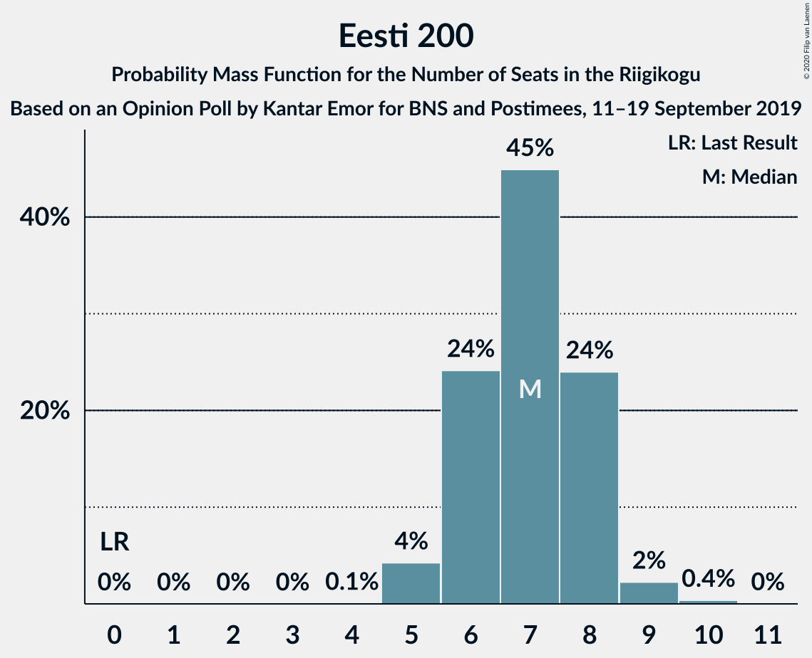

| Number of Seats | Probability | Accumulated | Special Marks |
|:---------------:|:-----------:|:-----------:|:-------------:|
| 0 | 0% | 100% | Last Result |
| 1 | 0% | 100% |  |
| 2 | 0% | 100% |  |
| 3 | 0% | 100% |  |
| 4 | 0.1% | 100% |  |
| 5 | 4% | 99.9% |  |
| 6 | 24% | 96% |  |
| 7 | 45% | 72% | Median |
| 8 | 24% | 27% |  |
| 9 | 2% | 3% |  |
| 10 | 0.4% | 0.4% |  |
| 11 | 0% | 0% |  |

### Erakond Isamaa

*For a full overview of the results for this party, see the [Erakond Isamaa](party-erakondisamaa.html) page.*

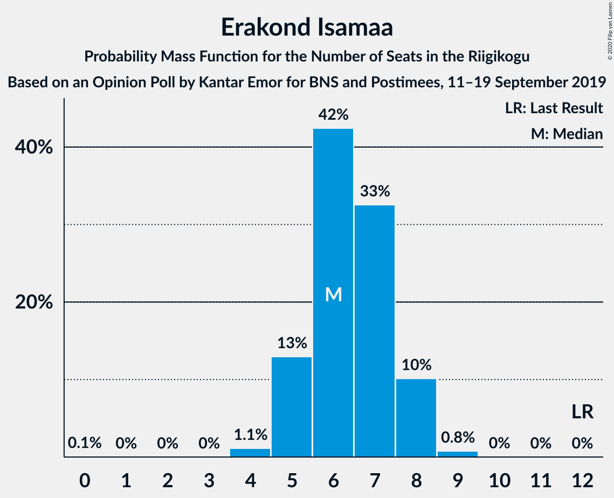

| Number of Seats | Probability | Accumulated | Special Marks |
|:---------------:|:-----------:|:-----------:|:-------------:|
| 0 | 0.1% | 100% |  |
| 1 | 0% | 99.9% |  |
| 2 | 0% | 99.9% |  |
| 3 | 0% | 99.9% |  |
| 4 | 1.1% | 99.9% |  |
| 5 | 13% | 98.8% |  |
| 6 | 42% | 86% | Median |
| 7 | 33% | 43% |  |
| 8 | 10% | 11% |  |
| 9 | 0.8% | 0.8% |  |
| 10 | 0% | 0% |  |
| 11 | 0% | 0% |  |
| 12 | 0% | 0% | Last Result |

### Erakond Eestimaa Rohelised

*For a full overview of the results for this party, see the [Erakond Eestimaa Rohelised](party-erakondeestimaarohelised.html) page.*

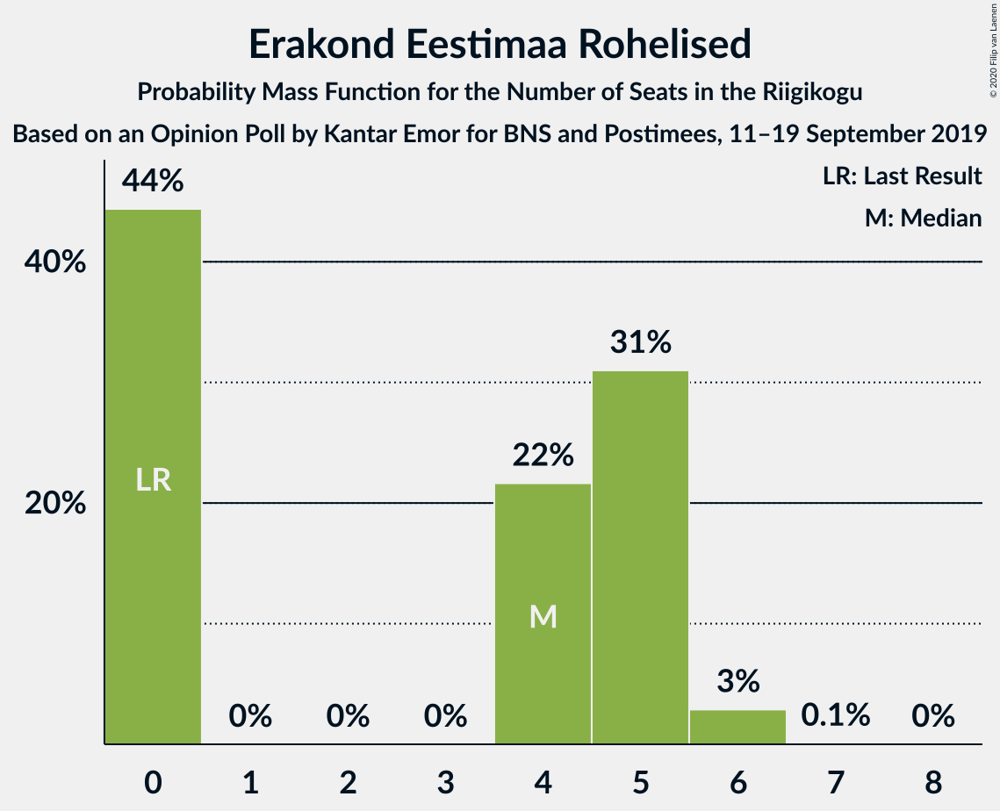

| Number of Seats | Probability | Accumulated | Special Marks |
|:---------------:|:-----------:|:-----------:|:-------------:|
| 0 | 44% | 100% | Last Result |
| 1 | 0% | 56% |  |
| 2 | 0% | 56% |  |
| 3 | 0% | 56% |  |
| 4 | 22% | 56% | Median |
| 5 | 31% | 34% |  |
| 6 | 3% | 3% |  |
| 7 | 0.1% | 0.1% |  |
| 8 | 0% | 0% |  |

## Coalitions

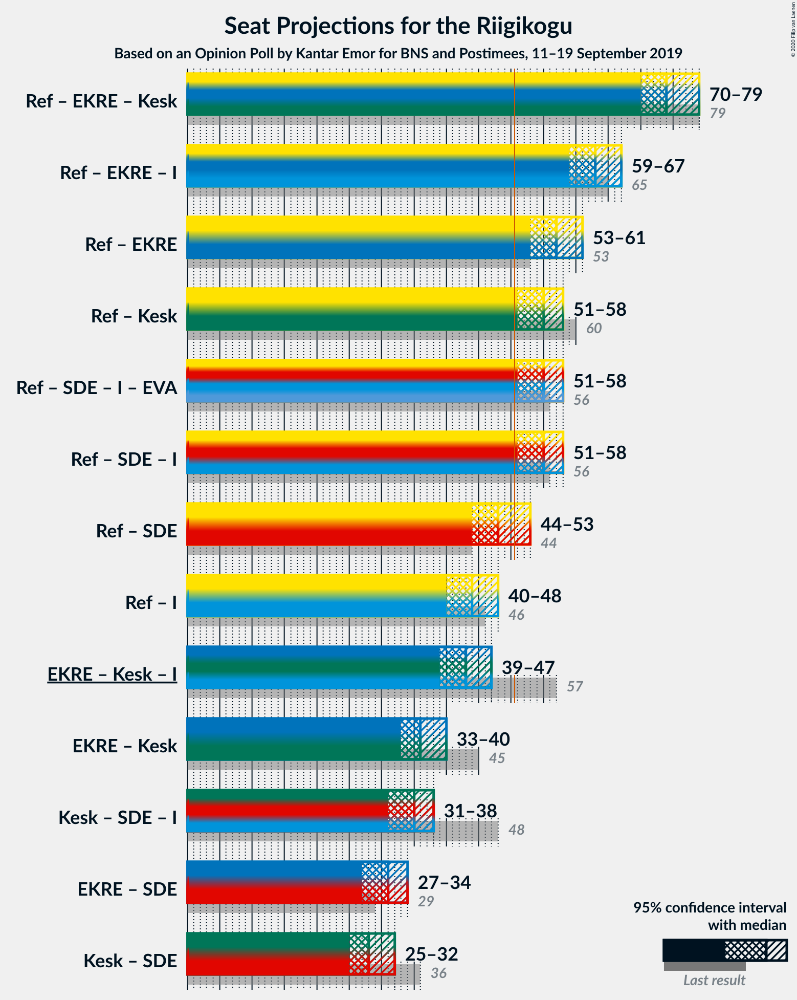

### Confidence Intervals

| Coalition | Last Result | Median | Majority? | 80% Confidence Interval | 90% Confidence Interval | 95% Confidence Interval | 99% Confidence Interval |
|:---------:|:-----------:|:------:|:---------:|:-----------------------:|:-----------------------:|:-----------------------:|:-----------------------:|
| Eesti Reformierakond – Eesti Konservatiivne Rahvaerakond – Eesti Keskerakond | 79 | 74 | 100% | 71–77 | 70–78 | 70–79 | 69–79 |
| Eesti Reformierakond – Eesti Konservatiivne Rahvaerakond – Erakond Isamaa | 65 | 63 | 100% | 61–66 | 60–67 | 59–67 | 58–70 |
| Eesti Reformierakond – Eesti Konservatiivne Rahvaerakond | 53 | 57 | 100% | 54–59 | 54–61 | 53–61 | 52–63 |
| Eesti Reformierakond – Eesti Keskerakond | 60 | 55 | 98% | 52–57 | 51–58 | 51–58 | 49–60 |
| Eesti Reformierakond – Sotsiaaldemokraatlik Erakond – Erakond Isamaa | 56 | 55 | 98% | 52–58 | 51–58 | 51–58 | 50–60 |
| Eesti Reformierakond – Sotsiaaldemokraatlik Erakond | 44 | 48 | 11% | 45–51 | 45–52 | 44–53 | 43–53 |
| Eesti Reformierakond – Erakond Isamaa | 46 | 44 | 0% | 41–46 | 41–47 | 40–48 | 38–49 |
| Eesti Konservatiivne Rahvaerakond – Eesti Keskerakond – Erakond Isamaa | 57 | 43 | 0% | 41–46 | 40–46 | 39–47 | 38–48 |
| Eesti Konservatiivne Rahvaerakond – Eesti Keskerakond | 45 | 36 | 0% | 34–39 | 34–39 | 33–40 | 32–42 |
| Eesti Keskerakond – Sotsiaaldemokraatlik Erakond – Erakond Isamaa | 48 | 35 | 0% | 32–37 | 32–38 | 31–38 | 30–39 |
| Eesti Konservatiivne Rahvaerakond – Sotsiaaldemokraatlik Erakond | 29 | 31 | 0% | 28–33 | 27–33 | 27–34 | 25–35 |
| Eesti Keskerakond – Sotsiaaldemokraatlik Erakond | 36 | 28 | 0% | 26–31 | 25–31 | 25–32 | 24–32 |

### Eesti Reformierakond – Eesti Konservatiivne Rahvaerakond – Eesti Keskerakond

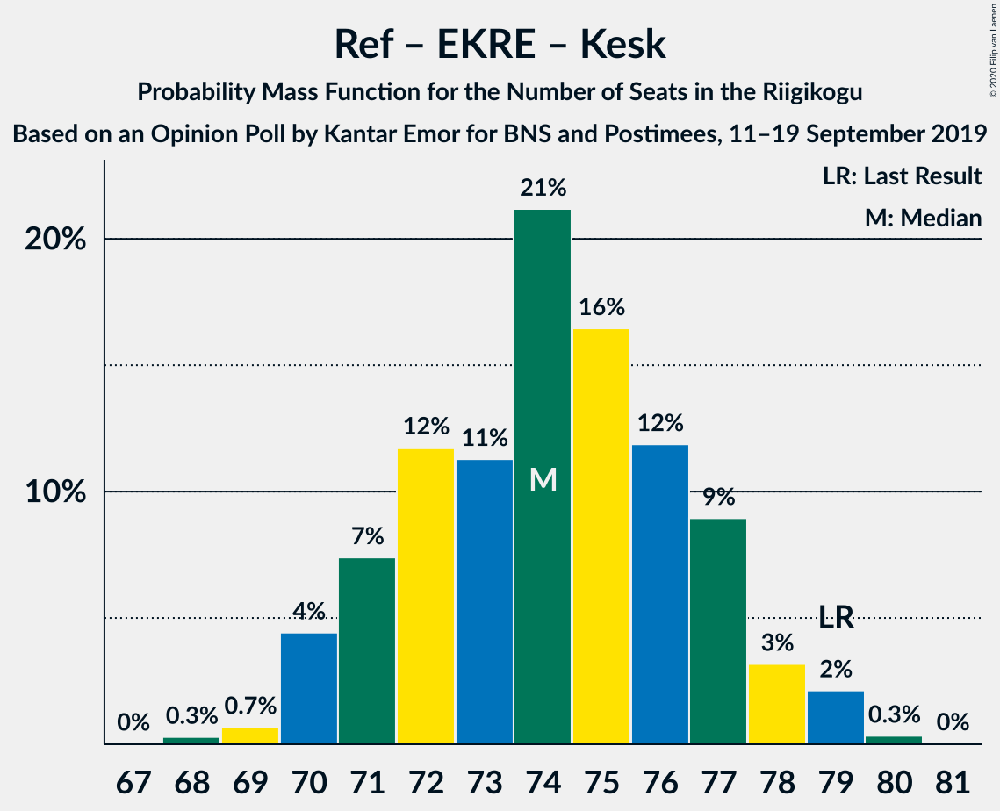

| Number of Seats | Probability | Accumulated | Special Marks |
|:---------------:|:-----------:|:-----------:|:-------------:|
| 68 | 0.3% | 100% |  |
| 69 | 0.7% | 99.7% |  |
| 70 | 4% | 99.0% |  |
| 71 | 7% | 95% |  |
| 72 | 12% | 87% |  |
| 73 | 11% | 75% | Median |
| 74 | 21% | 64% |  |
| 75 | 16% | 43% |  |
| 76 | 12% | 27% |  |
| 77 | 9% | 15% |  |
| 78 | 3% | 6% |  |
| 79 | 2% | 3% | Last Result |
| 80 | 0.3% | 0.4% |  |
| 81 | 0% | 0% |  |

### Eesti Reformierakond – Eesti Konservatiivne Rahvaerakond – Erakond Isamaa

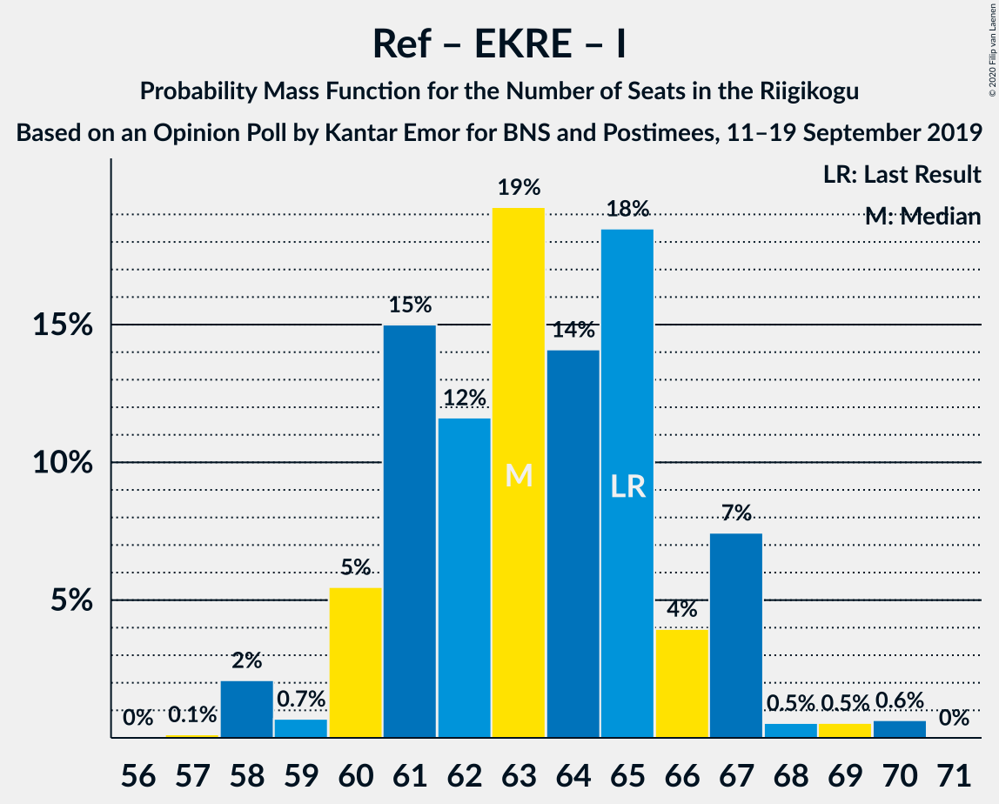

| Number of Seats | Probability | Accumulated | Special Marks |
|:---------------:|:-----------:|:-----------:|:-------------:|
| 57 | 0.1% | 100% |  |
| 58 | 2% | 99.9% |  |
| 59 | 0.7% | 98% |  |
| 60 | 5% | 97% |  |
| 61 | 15% | 92% |  |
| 62 | 12% | 77% | Median |
| 63 | 19% | 65% |  |
| 64 | 14% | 46% |  |
| 65 | 18% | 32% | Last Result |
| 66 | 4% | 13% |  |
| 67 | 7% | 9% |  |
| 68 | 0.5% | 2% |  |
| 69 | 0.5% | 1.2% |  |
| 70 | 0.6% | 0.7% |  |
| 71 | 0% | 0% |  |

### Eesti Reformierakond – Eesti Konservatiivne Rahvaerakond

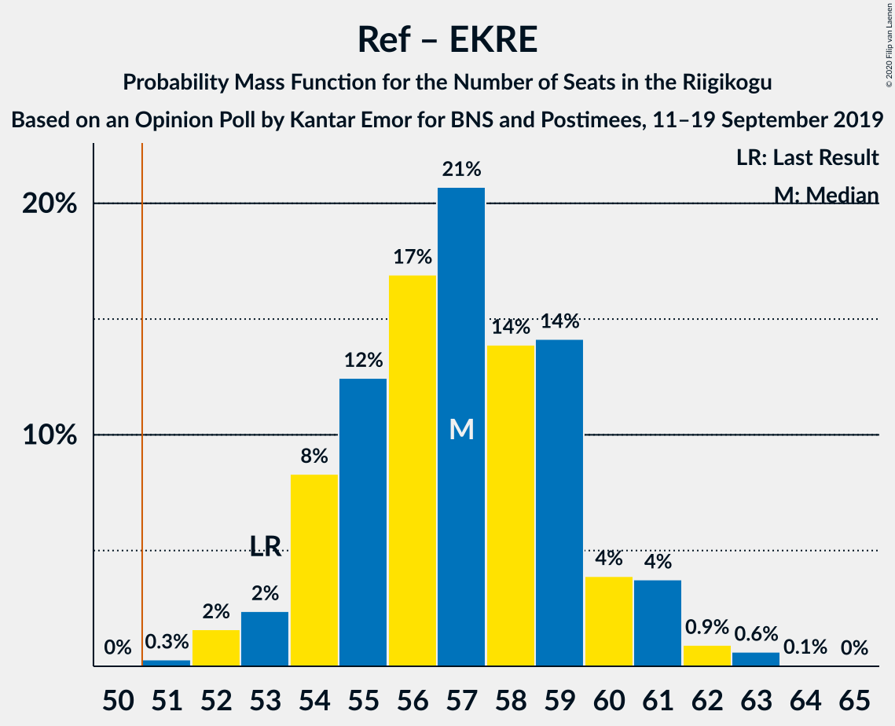

| Number of Seats | Probability | Accumulated | Special Marks |
|:---------------:|:-----------:|:-----------:|:-------------:|
| 51 | 0.3% | 100% | Majority |
| 52 | 2% | 99.7% |  |
| 53 | 2% | 98% | Last Result |
| 54 | 8% | 96% |  |
| 55 | 12% | 87% |  |
| 56 | 17% | 75% | Median |
| 57 | 21% | 58% |  |
| 58 | 14% | 37% |  |
| 59 | 14% | 23% |  |
| 60 | 4% | 9% |  |
| 61 | 4% | 5% |  |
| 62 | 0.9% | 2% |  |
| 63 | 0.6% | 0.7% |  |
| 64 | 0.1% | 0.1% |  |
| 65 | 0% | 0% |  |

### Eesti Reformierakond – Eesti Keskerakond

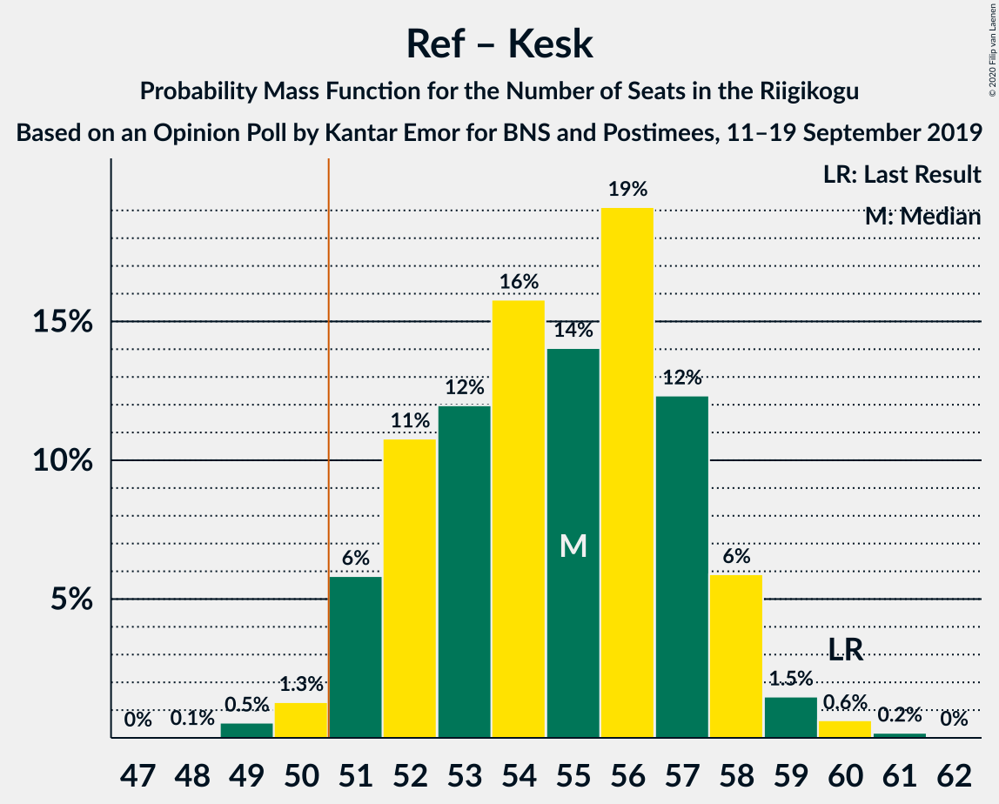

| Number of Seats | Probability | Accumulated | Special Marks |
|:---------------:|:-----------:|:-----------:|:-------------:|
| 48 | 0.1% | 100% |  |
| 49 | 0.5% | 99.9% |  |
| 50 | 1.3% | 99.4% |  |
| 51 | 6% | 98% | Majority |
| 52 | 11% | 92% |  |
| 53 | 12% | 81% |  |
| 54 | 16% | 70% | Median |
| 55 | 14% | 54% |  |
| 56 | 19% | 40% |  |
| 57 | 12% | 21% |  |
| 58 | 6% | 8% |  |
| 59 | 1.5% | 2% |  |
| 60 | 0.6% | 0.9% | Last Result |
| 61 | 0.2% | 0.2% |  |
| 62 | 0% | 0% |  |

### Eesti Reformierakond – Sotsiaaldemokraatlik Erakond – Erakond Isamaa

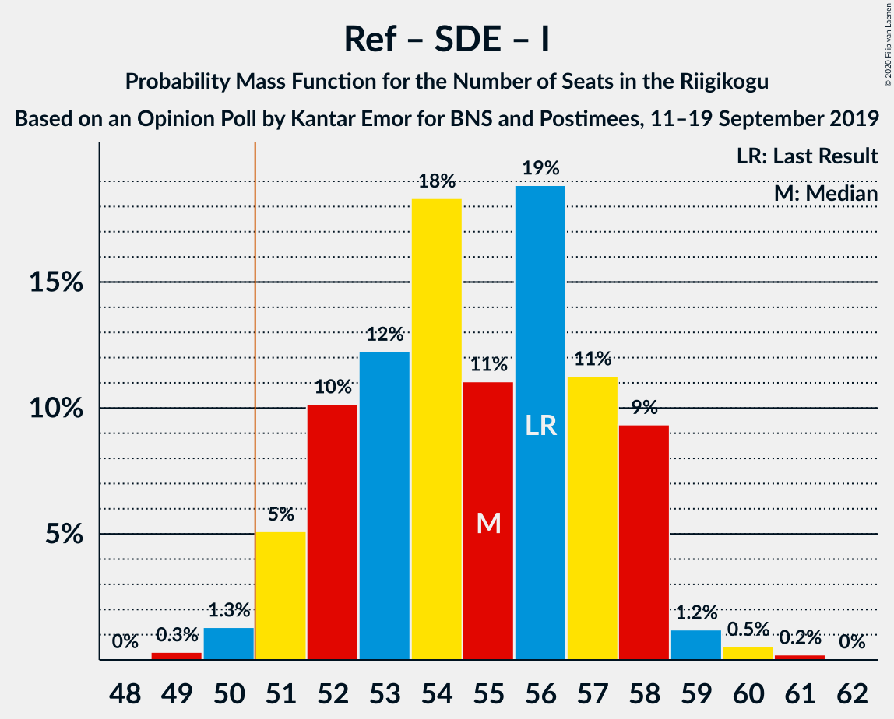

| Number of Seats | Probability | Accumulated | Special Marks |
|:---------------:|:-----------:|:-----------:|:-------------:|
| 48 | 0% | 100% |  |
| 49 | 0.3% | 99.9% |  |
| 50 | 1.3% | 99.6% |  |
| 51 | 5% | 98% | Majority |
| 52 | 10% | 93% |  |
| 53 | 12% | 83% |  |
| 54 | 18% | 71% | Median |
| 55 | 11% | 52% |  |
| 56 | 19% | 41% | Last Result |
| 57 | 11% | 23% |  |
| 58 | 9% | 11% |  |
| 59 | 1.2% | 2% |  |
| 60 | 0.5% | 0.8% |  |
| 61 | 0.2% | 0.2% |  |
| 62 | 0% | 0% |  |

### Eesti Reformierakond – Sotsiaaldemokraatlik Erakond

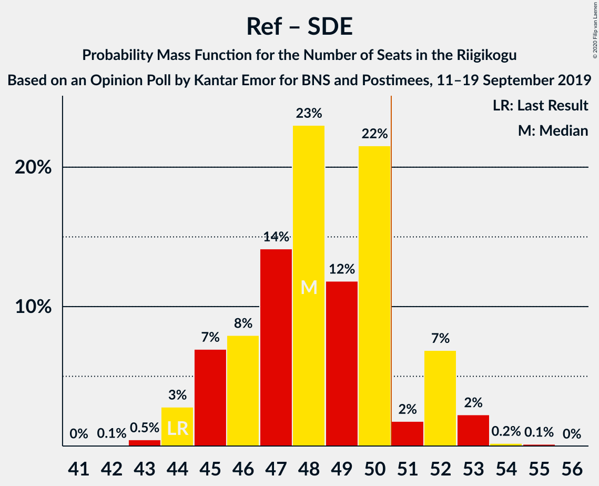

| Number of Seats | Probability | Accumulated | Special Marks |
|:---------------:|:-----------:|:-----------:|:-------------:|
| 42 | 0.1% | 100% |  |
| 43 | 0.5% | 99.9% |  |
| 44 | 3% | 99.5% | Last Result |
| 45 | 7% | 97% |  |
| 46 | 8% | 90% |  |
| 47 | 14% | 82% |  |
| 48 | 23% | 68% | Median |
| 49 | 12% | 45% |  |
| 50 | 22% | 33% |  |
| 51 | 2% | 11% | Majority |
| 52 | 7% | 9% |  |
| 53 | 2% | 3% |  |
| 54 | 0.2% | 0.3% |  |
| 55 | 0.1% | 0.1% |  |
| 56 | 0% | 0% |  |

### Eesti Reformierakond – Erakond Isamaa

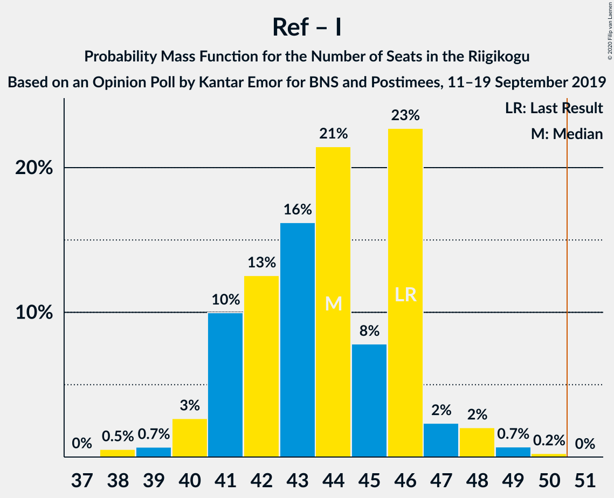

| Number of Seats | Probability | Accumulated | Special Marks |
|:---------------:|:-----------:|:-----------:|:-------------:|
| 37 | 0% | 100% |  |
| 38 | 0.5% | 99.9% |  |
| 39 | 0.7% | 99.4% |  |
| 40 | 3% | 98.7% |  |
| 41 | 10% | 96% |  |
| 42 | 13% | 86% |  |
| 43 | 16% | 74% | Median |
| 44 | 21% | 57% |  |
| 45 | 8% | 36% |  |
| 46 | 23% | 28% | Last Result |
| 47 | 2% | 5% |  |
| 48 | 2% | 3% |  |
| 49 | 0.7% | 1.0% |  |
| 50 | 0.2% | 0.3% |  |
| 51 | 0% | 0% | Majority |

### Eesti Konservatiivne Rahvaerakond – Eesti Keskerakond – Erakond Isamaa

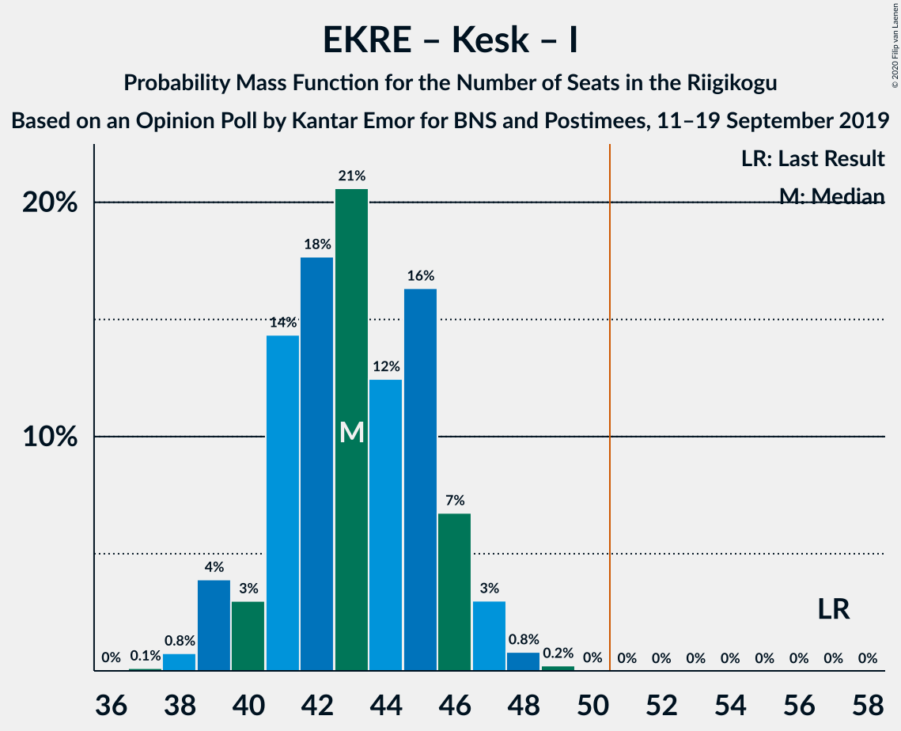

| Number of Seats | Probability | Accumulated | Special Marks |
|:---------------:|:-----------:|:-----------:|:-------------:|
| 37 | 0.1% | 100% |  |
| 38 | 0.8% | 99.8% |  |
| 39 | 4% | 99.1% |  |
| 40 | 3% | 95% |  |
| 41 | 14% | 92% |  |
| 42 | 18% | 78% | Median |
| 43 | 21% | 60% |  |
| 44 | 12% | 40% |  |
| 45 | 16% | 27% |  |
| 46 | 7% | 11% |  |
| 47 | 3% | 4% |  |
| 48 | 0.8% | 1.1% |  |
| 49 | 0.2% | 0.3% |  |
| 50 | 0% | 0% |  |
| 51 | 0% | 0% | Majority |
| 52 | 0% | 0% |  |
| 53 | 0% | 0% |  |
| 54 | 0% | 0% |  |
| 55 | 0% | 0% |  |
| 56 | 0% | 0% |  |
| 57 | 0% | 0% | Last Result |

### Eesti Konservatiivne Rahvaerakond – Eesti Keskerakond

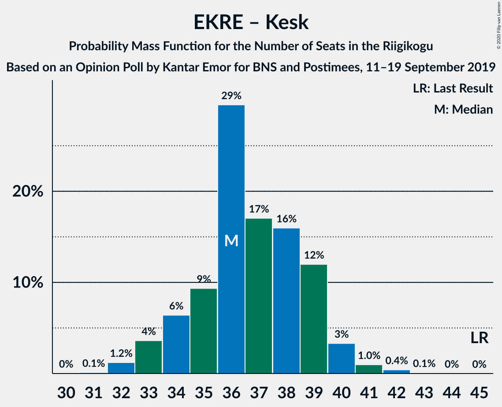

| Number of Seats | Probability | Accumulated | Special Marks |
|:---------------:|:-----------:|:-----------:|:-------------:|
| 31 | 0.1% | 100% |  |
| 32 | 1.2% | 99.9% |  |
| 33 | 4% | 98.7% |  |
| 34 | 6% | 95% |  |
| 35 | 9% | 89% |  |
| 36 | 29% | 79% | Median |
| 37 | 17% | 50% |  |
| 38 | 16% | 33% |  |
| 39 | 12% | 17% |  |
| 40 | 3% | 5% |  |
| 41 | 1.0% | 1.5% |  |
| 42 | 0.4% | 0.5% |  |
| 43 | 0.1% | 0.1% |  |
| 44 | 0% | 0% |  |
| 45 | 0% | 0% | Last Result |

### Eesti Keskerakond – Sotsiaaldemokraatlik Erakond – Erakond Isamaa

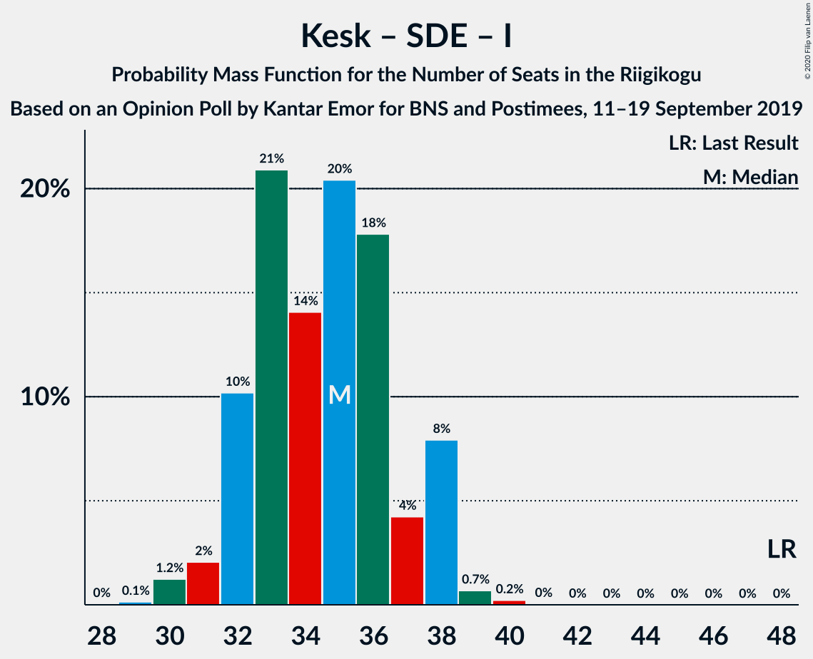

| Number of Seats | Probability | Accumulated | Special Marks |
|:---------------:|:-----------:|:-----------:|:-------------:|
| 29 | 0.1% | 100% |  |
| 30 | 1.2% | 99.8% |  |
| 31 | 2% | 98.6% |  |
| 32 | 10% | 97% |  |
| 33 | 21% | 86% |  |
| 34 | 14% | 65% | Median |
| 35 | 20% | 51% |  |
| 36 | 18% | 31% |  |
| 37 | 4% | 13% |  |
| 38 | 8% | 9% |  |
| 39 | 0.7% | 1.0% |  |
| 40 | 0.2% | 0.3% |  |
| 41 | 0% | 0.1% |  |
| 42 | 0% | 0% |  |
| 43 | 0% | 0% |  |
| 44 | 0% | 0% |  |
| 45 | 0% | 0% |  |
| 46 | 0% | 0% |  |
| 47 | 0% | 0% |  |
| 48 | 0% | 0% | Last Result |

### Eesti Konservatiivne Rahvaerakond – Sotsiaaldemokraatlik Erakond

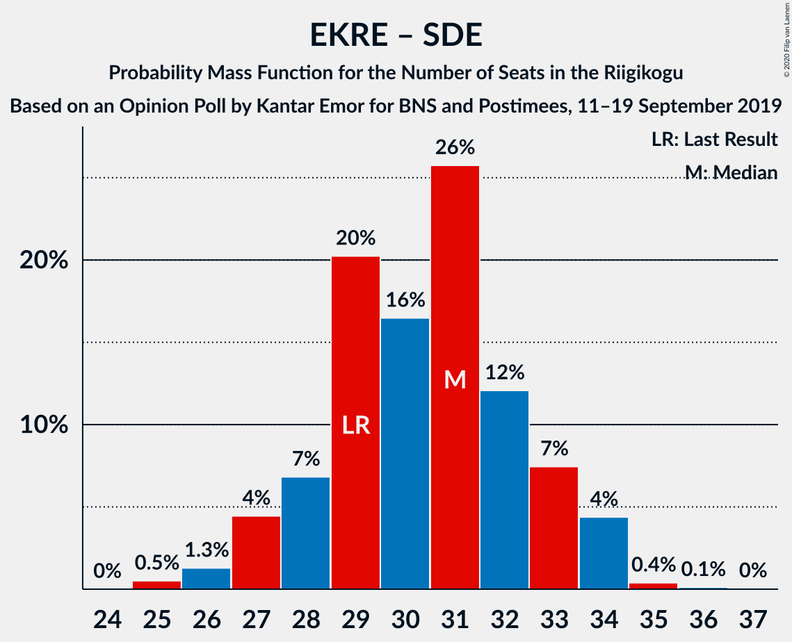

| Number of Seats | Probability | Accumulated | Special Marks |
|:---------------:|:-----------:|:-----------:|:-------------:|
| 25 | 0.5% | 100% |  |
| 26 | 1.3% | 99.5% |  |
| 27 | 4% | 98% |  |
| 28 | 7% | 94% |  |
| 29 | 20% | 87% | Last Result |
| 30 | 16% | 67% | Median |
| 31 | 26% | 50% |  |
| 32 | 12% | 24% |  |
| 33 | 7% | 12% |  |
| 34 | 4% | 5% |  |
| 35 | 0.4% | 0.5% |  |
| 36 | 0.1% | 0.2% |  |
| 37 | 0% | 0% |  |

### Eesti Keskerakond – Sotsiaaldemokraatlik Erakond

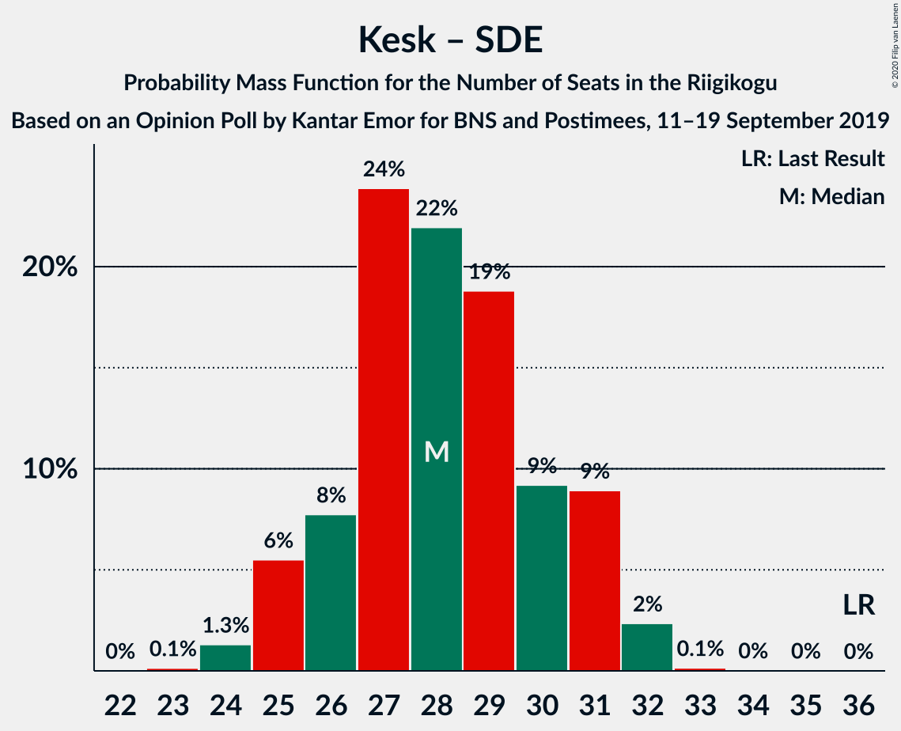

| Number of Seats | Probability | Accumulated | Special Marks |
|:---------------:|:-----------:|:-----------:|:-------------:|
| 23 | 0.1% | 100% |  |
| 24 | 1.3% | 99.8% |  |
| 25 | 6% | 98.5% |  |
| 26 | 8% | 93% |  |
| 27 | 24% | 85% |  |
| 28 | 22% | 61% | Median |
| 29 | 19% | 39% |  |
| 30 | 9% | 21% |  |
| 31 | 9% | 11% |  |
| 32 | 2% | 3% |  |
| 33 | 0.1% | 0.2% |  |
| 34 | 0% | 0.1% |  |
| 35 | 0% | 0% |  |
| 36 | 0% | 0% | Last Result |

## Technical Information

### Opinion Poll

+ **Polling firm:** Kantar Emor
+ **Commissioner(s):** BNS and Postimees
+ **Fieldwork period:** 11–19 September 2019

### Calculations

+ **Sample size:** 1161
+ **Simulations done:** 131,072
+ **Error estimate:** 1.17%

