# Opinion Poll by Norstat for MTÜ Ühiskonnauuringute Instituut, 18–23 September 2019

<a href="#voting-intentions">Voting Intentions</a> | <a href="#seats">Seats</a> | <a href="#coalitions">Coalitions</a> | <a href="#technical-information">Technical Information</a>

## Voting Intentions

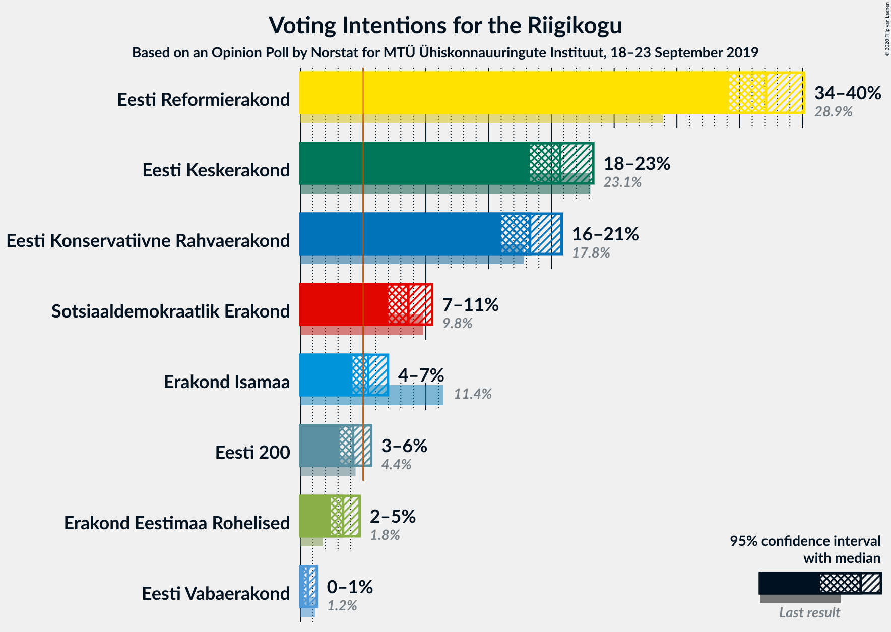

### Confidence Intervals

| Party | Last Result | Poll Result | 80% Confidence Interval | 90% Confidence Interval | 95% Confidence Interval | 99% Confidence Interval |
|:-----:|:-----------:|:-----------:|:-----------------------:|:-----------------------:|:-----------------------:|:-----------------------:|
| Eesti Reformierakond | 28.9% | 37.1% | 35.2–39.1% |34.6–39.7% |34.2–40.1% |33.2–41.1% |
| Eesti Keskerakond | 23.1% | 20.7% | 19.1–22.4% |18.7–22.9% |18.3–23.3% |17.6–24.2% |
| Eesti Konservatiivne Rahvaerakond | 17.8% | 18.3% | 16.8–20.0% |16.4–20.4% |16.0–20.8% |15.3–21.6% |
| Sotsiaaldemokraatlik Erakond | 9.8% | 8.6% | 7.6–9.8% |7.3–10.2% |7.0–10.5% |6.5–11.1% |
| Erakond Isamaa | 11.4% | 5.4% | 4.6–6.4% |4.4–6.7% |4.2–7.0% |3.8–7.5% |
| Eesti 200 | 4.4% | 4.2% | 3.5–5.1% |3.3–5.4% |3.1–5.6% |2.8–6.1% |
| Erakond Eestimaa Rohelised | 1.8% | 3.4% | 2.8–4.3% |2.6–4.5% |2.4–4.7% |2.2–5.2% |
| Eesti Vabaerakond | 1.2% | 0.6% | 0.4–1.1% |0.3–1.2% |0.3–1.3% |0.2–1.6% |

*Note:* The poll result column reflects the actual value used in the calculations. Published results may vary slightly, and in addition be rounded to fewer digits.

## Seats

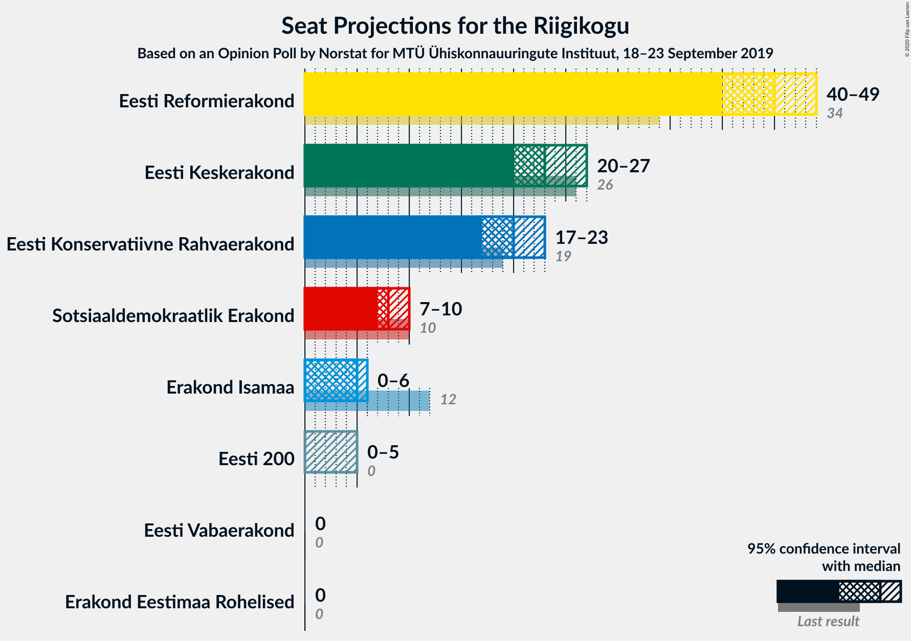

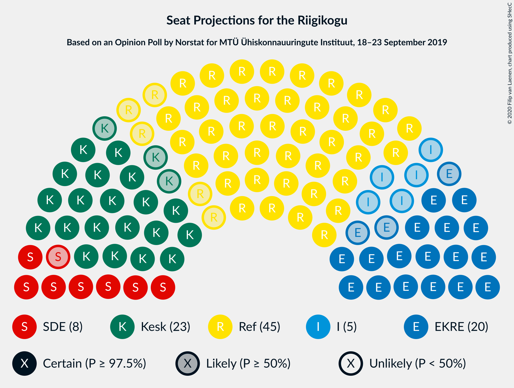

### Confidence Intervals

| Party | Last Result | Median | 80% Confidence Interval | 90% Confidence Interval | 95% Confidence Interval | 99% Confidence Interval |
|:-----:|:-----------:|:------:|:-----------------------:|:-----------------------:|:-----------------------:|:-----------------------:|
| <a href="#eesti-reformierakond">Eesti Reformierakond</a> | 34 | 45 | 42–48 |41–48 |40–49 |39–50 |
| <a href="#eesti-keskerakond">Eesti Keskerakond</a> | 26 | 23 | 20–26 |20–27 |20–27 |19–27 |
| <a href="#eesti-konservatiivne-rahvaerakond">Eesti Konservatiivne Rahvaerakond</a> | 19 | 20 | 18–23 |18–23 |17–23 |17–24 |
| <a href="#sotsiaaldemokraatlik-erakond">Sotsiaaldemokraatlik Erakond</a> | 10 | 8 | 7–10 |7–10 |7–10 |6–11 |
| <a href="#erakond-isamaa">Erakond Isamaa</a> | 12 | 5 | 0–6 |0–6 |0–6 |0–7 |
| <a href="#eesti-200">Eesti 200</a> | 0 | 0 | 0 |0–5 |0–5 |0–5 |
| <a href="#erakond-eestimaa-rohelised">Erakond Eestimaa Rohelised</a> | 0 | 0 | 0 |0 |0 |0–5 |
| <a href="#eesti-vabaerakond">Eesti Vabaerakond</a> | 0 | 0 | 0 |0 |0 |0 |

### Eesti Reformierakond

*For a full overview of the results for this party, see the [Eesti Reformierakond](party-eestireformierakond.html) page.*

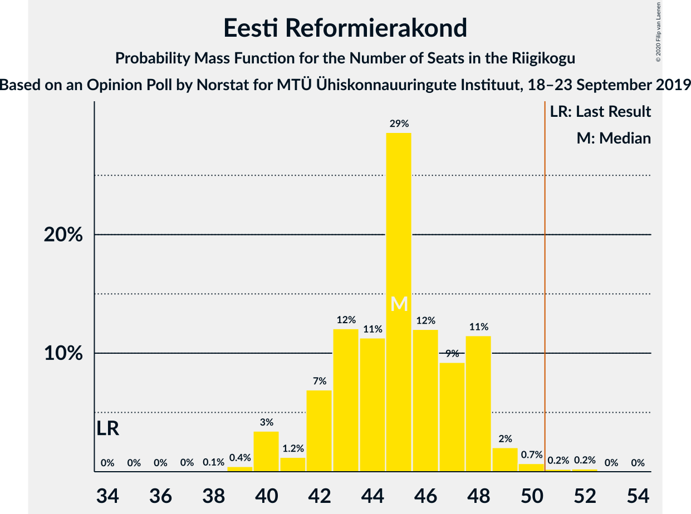

| Number of Seats | Probability | Accumulated | Special Marks |
|:---------------:|:-----------:|:-----------:|:-------------:|
| 34 | 0% | 100% | Last Result |
| 35 | 0% | 100% |  |
| 36 | 0% | 100% |  |
| 37 | 0% | 100% |  |
| 38 | 0.1% | 100% |  |
| 39 | 0.4% | 99.9% |  |
| 40 | 3% | 99.5% |  |
| 41 | 1.2% | 96% |  |
| 42 | 7% | 95% |  |
| 43 | 12% | 88% |  |
| 44 | 11% | 76% |  |
| 45 | 29% | 65% | Median |
| 46 | 12% | 36% |  |
| 47 | 9% | 24% |  |
| 48 | 11% | 15% |  |
| 49 | 2% | 3% |  |
| 50 | 0.7% | 1.2% |  |
| 51 | 0.2% | 0.5% | Majority |
| 52 | 0.2% | 0.3% |  |
| 53 | 0% | 0% |  |

### Eesti Keskerakond

*For a full overview of the results for this party, see the [Eesti Keskerakond](party-eestikeskerakond.html) page.*

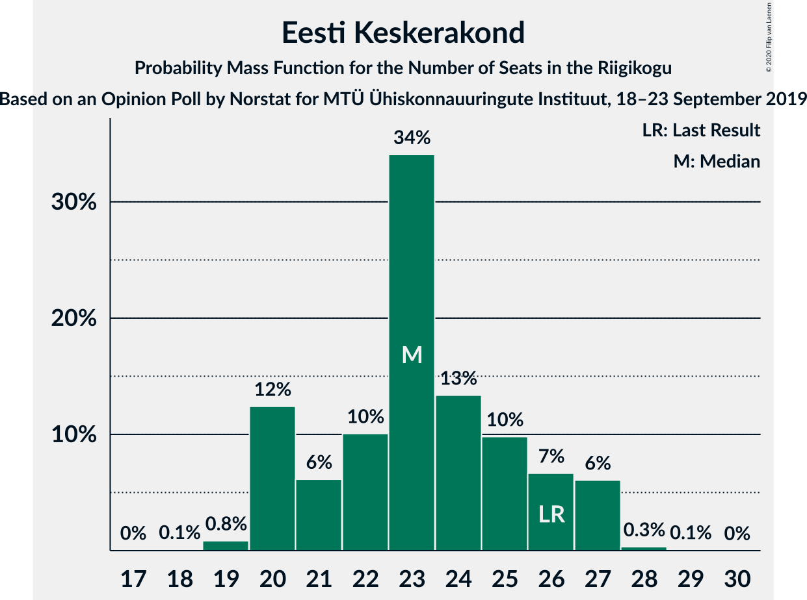

| Number of Seats | Probability | Accumulated | Special Marks |
|:---------------:|:-----------:|:-----------:|:-------------:|
| 18 | 0.1% | 100% |  |
| 19 | 0.8% | 99.9% |  |
| 20 | 12% | 99.0% |  |
| 21 | 6% | 87% |  |
| 22 | 10% | 80% |  |
| 23 | 34% | 70% | Median |
| 24 | 13% | 36% |  |
| 25 | 10% | 23% |  |
| 26 | 7% | 13% | Last Result |
| 27 | 6% | 6% |  |
| 28 | 0.3% | 0.4% |  |
| 29 | 0.1% | 0.1% |  |
| 30 | 0% | 0% |  |

### Eesti Konservatiivne Rahvaerakond

*For a full overview of the results for this party, see the [Eesti Konservatiivne Rahvaerakond](party-eestikonservatiivnerahvaerakond.html) page.*

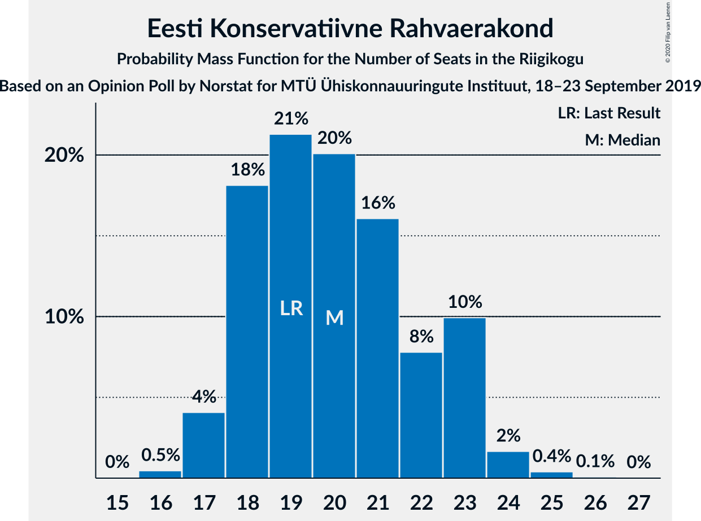

| Number of Seats | Probability | Accumulated | Special Marks |
|:---------------:|:-----------:|:-----------:|:-------------:|
| 16 | 0.5% | 100% |  |
| 17 | 4% | 99.5% |  |
| 18 | 18% | 95% |  |
| 19 | 21% | 77% | Last Result |
| 20 | 20% | 56% | Median |
| 21 | 16% | 36% |  |
| 22 | 8% | 20% |  |
| 23 | 10% | 12% |  |
| 24 | 2% | 2% |  |
| 25 | 0.4% | 0.5% |  |
| 26 | 0.1% | 0.1% |  |
| 27 | 0% | 0% |  |

### Sotsiaaldemokraatlik Erakond

*For a full overview of the results for this party, see the [Sotsiaaldemokraatlik Erakond](party-sotsiaaldemokraatlikerakond.html) page.*

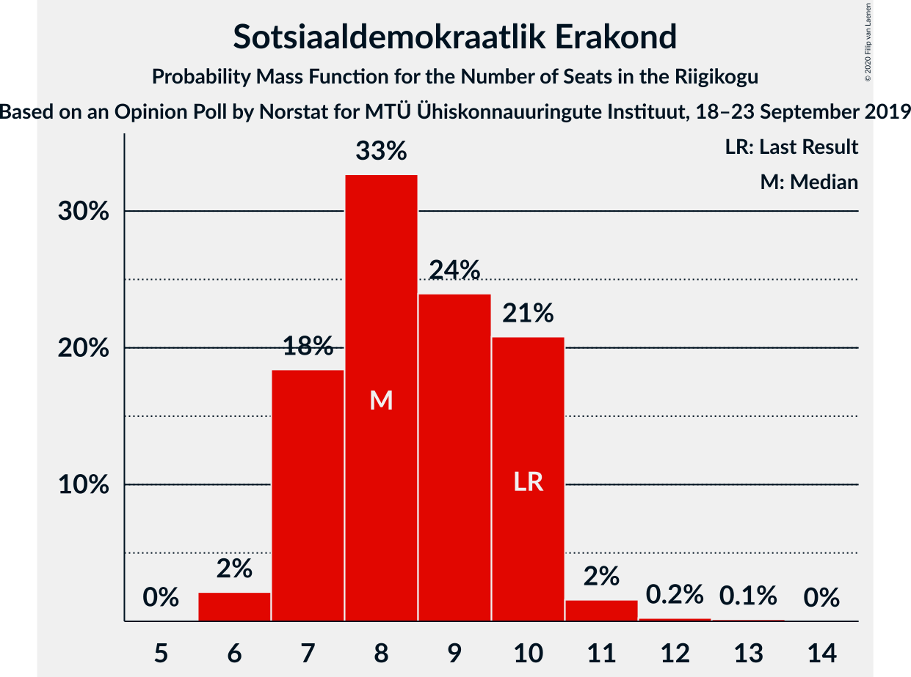

| Number of Seats | Probability | Accumulated | Special Marks |
|:---------------:|:-----------:|:-----------:|:-------------:|
| 6 | 2% | 100% |  |
| 7 | 18% | 98% |  |
| 8 | 33% | 79% | Median |
| 9 | 24% | 47% |  |
| 10 | 21% | 23% | Last Result |
| 11 | 2% | 2% |  |
| 12 | 0.2% | 0.4% |  |
| 13 | 0.1% | 0.1% |  |
| 14 | 0% | 0% |  |

### Erakond Isamaa

*For a full overview of the results for this party, see the [Erakond Isamaa](party-erakondisamaa.html) page.*

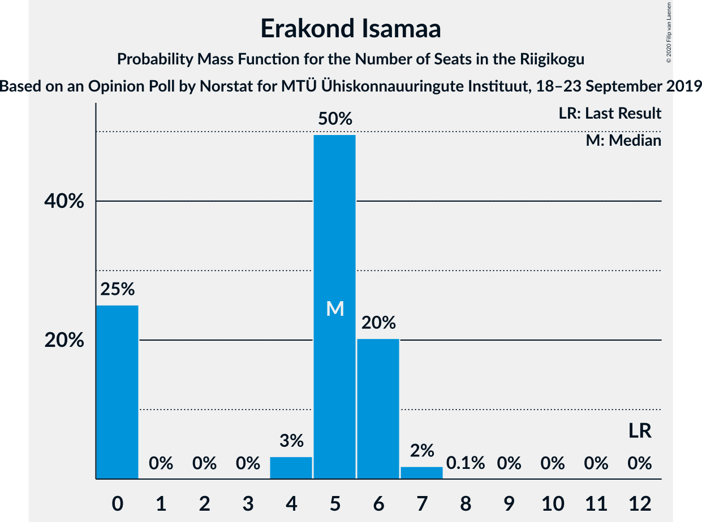

| Number of Seats | Probability | Accumulated | Special Marks |
|:---------------:|:-----------:|:-----------:|:-------------:|
| 0 | 25% | 100% |  |
| 1 | 0% | 75% |  |
| 2 | 0% | 75% |  |
| 3 | 0% | 75% |  |
| 4 | 3% | 75% |  |
| 5 | 50% | 72% | Median |
| 6 | 20% | 22% |  |
| 7 | 2% | 2% |  |
| 8 | 0.1% | 0.1% |  |
| 9 | 0% | 0% |  |
| 10 | 0% | 0% |  |
| 11 | 0% | 0% |  |
| 12 | 0% | 0% | Last Result |

### Eesti 200

*For a full overview of the results for this party, see the [Eesti 200](party-eesti200.html) page.*

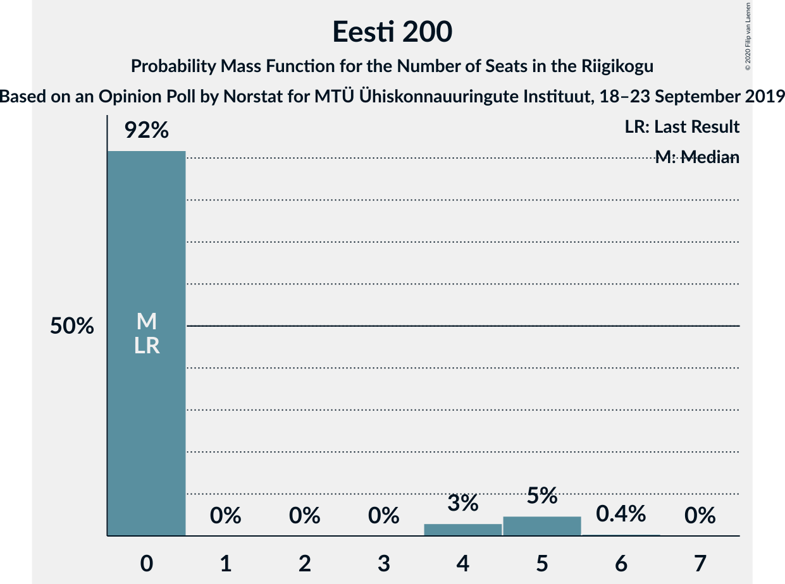

| Number of Seats | Probability | Accumulated | Special Marks |
|:---------------:|:-----------:|:-----------:|:-------------:|
| 0 | 92% | 100% | Last Result, Median |
| 1 | 0% | 8% |  |
| 2 | 0% | 8% |  |
| 3 | 0% | 8% |  |
| 4 | 3% | 8% |  |
| 5 | 5% | 5% |  |
| 6 | 0.4% | 0.5% |  |
| 7 | 0% | 0% |  |

### Erakond Eestimaa Rohelised

*For a full overview of the results for this party, see the [Erakond Eestimaa Rohelised](party-erakondeestimaarohelised.html) page.*

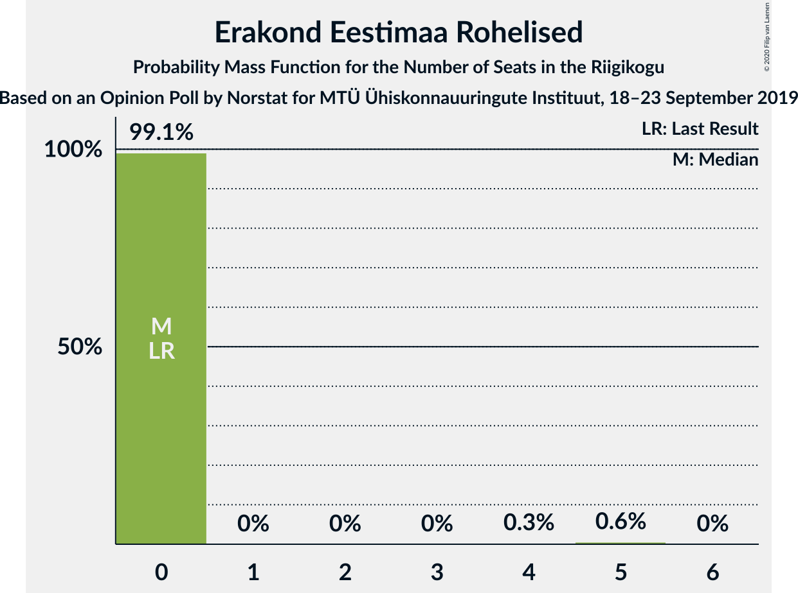

| Number of Seats | Probability | Accumulated | Special Marks |
|:---------------:|:-----------:|:-----------:|:-------------:|
| 0 | 99.1% | 100% | Last Result, Median |
| 1 | 0% | 0.9% |  |
| 2 | 0% | 0.9% |  |
| 3 | 0% | 0.9% |  |
| 4 | 0.3% | 0.9% |  |
| 5 | 0.6% | 0.6% |  |
| 6 | 0% | 0% |  |

### Eesti Vabaerakond

*For a full overview of the results for this party, see the [Eesti Vabaerakond](party-eestivabaerakond.html) page.*

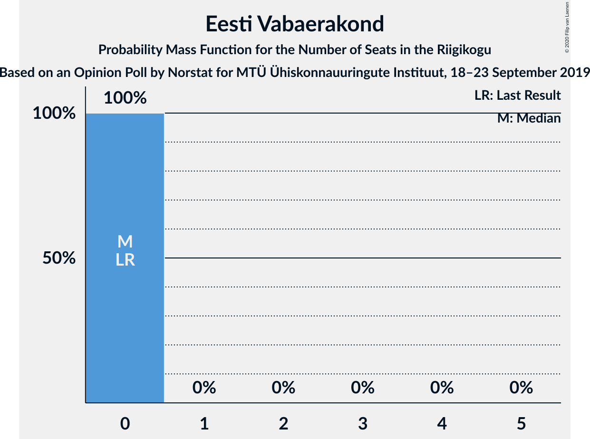

| Number of Seats | Probability | Accumulated | Special Marks |
|:---------------:|:-----------:|:-----------:|:-------------:|
| 0 | 100% | 100% | Last Result, Median |

## Coalitions

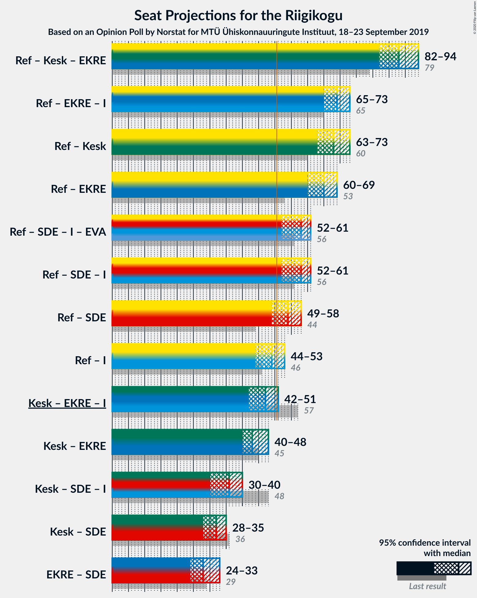

### Confidence Intervals

| Coalition | Last Result | Median | Majority? | 80% Confidence Interval | 90% Confidence Interval | 95% Confidence Interval | 99% Confidence Interval |
|:---------:|:-----------:|:------:|:---------:|:-----------------------:|:-----------------------:|:-----------------------:|:-----------------------:|
| Eesti Reformierakond – Eesti Keskerakond – Eesti Konservatiivne Rahvaerakond | 79 | 88 | 100% | 86–93 | 84–94 | 82–94 | 82–94 |
| Eesti Reformierakond – Eesti Konservatiivne Rahvaerakond – Erakond Isamaa | 65 | 69 | 100% | 66–73 | 66–73 | 65–73 | 62–73 |
| Eesti Reformierakond – Eesti Keskerakond | 60 | 68 | 100% | 65–72 | 64–72 | 63–73 | 61–74 |
| Eesti Reformierakond – Eesti Konservatiivne Rahvaerakond | 53 | 65 | 100% | 62–68 | 61–69 | 60–69 | 59–72 |
| Eesti Reformierakond – Sotsiaaldemokraatlik Erakond – Erakond Isamaa – Eesti Vabaerakond | 56 | 58 | 99.3% | 53–61 | 53–61 | 52–61 | 50–62 |
| Eesti Reformierakond – Sotsiaaldemokraatlik Erakond – Erakond Isamaa | 56 | 58 | 99.3% | 53–61 | 53–61 | 52–61 | 50–62 |
| Eesti Reformierakond – Sotsiaaldemokraatlik Erakond | 44 | 54 | 89% | 50–56 | 50–57 | 49–58 | 47–60 |
| Eesti Reformierakond – Erakond Isamaa | 46 | 49 | 22% | 46–53 | 44–53 | 44–53 | 42–54 |
| Eesti Keskerakond – Eesti Konservatiivne Rahvaerakond – Erakond Isamaa | 57 | 47 | 6% | 45–50 | 43–51 | 42–51 | 40–53 |
| Eesti Keskerakond – Eesti Konservatiivne Rahvaerakond | 45 | 43 | 0% | 40–47 | 40–48 | 40–48 | 37–50 |
| Eesti Keskerakond – Sotsiaaldemokraatlik Erakond – Erakond Isamaa | 48 | 36 | 0% | 32–38 | 32–40 | 30–40 | 29–41 |
| Eesti Keskerakond – Sotsiaaldemokraatlik Erakond | 36 | 32 | 0% | 28–34 | 28–35 | 28–35 | 27–36 |
| Eesti Konservatiivne Rahvaerakond – Sotsiaaldemokraatlik Erakond | 29 | 28 | 0% | 26–31 | 26–32 | 24–33 | 24–34 |

### Eesti Reformierakond – Eesti Keskerakond – Eesti Konservatiivne Rahvaerakond

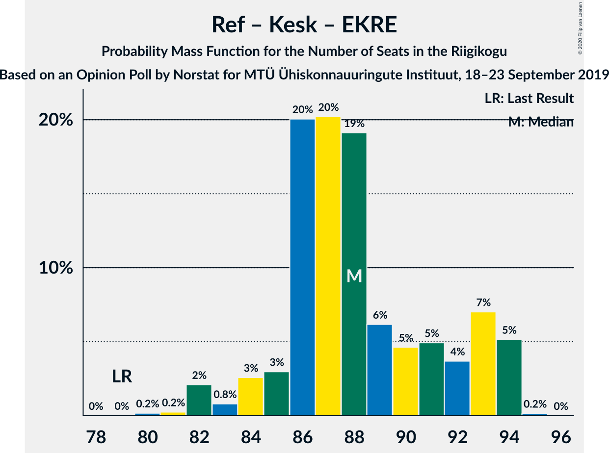

| Number of Seats | Probability | Accumulated | Special Marks |
|:---------------:|:-----------:|:-----------:|:-------------:|
| 79 | 0% | 100% | Last Result |
| 80 | 0.2% | 100% |  |
| 81 | 0.2% | 99.8% |  |
| 82 | 2% | 99.6% |  |
| 83 | 0.8% | 97% |  |
| 84 | 3% | 97% |  |
| 85 | 3% | 94% |  |
| 86 | 20% | 91% |  |
| 87 | 20% | 71% |  |
| 88 | 19% | 51% | Median |
| 89 | 6% | 32% |  |
| 90 | 5% | 26% |  |
| 91 | 5% | 21% |  |
| 92 | 4% | 16% |  |
| 93 | 7% | 12% |  |
| 94 | 5% | 5% |  |
| 95 | 0.2% | 0.2% |  |
| 96 | 0% | 0% |  |

### Eesti Reformierakond – Eesti Konservatiivne Rahvaerakond – Erakond Isamaa

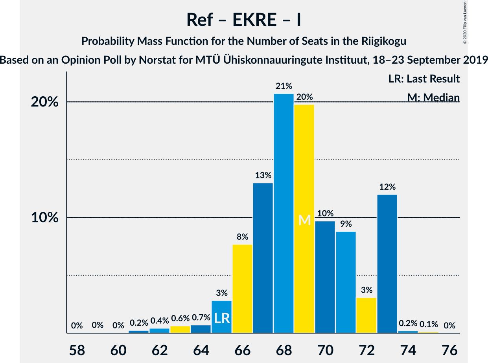

| Number of Seats | Probability | Accumulated | Special Marks |
|:---------------:|:-----------:|:-----------:|:-------------:|
| 59 | 0% | 100% |  |
| 60 | 0% | 99.9% |  |
| 61 | 0.2% | 99.9% |  |
| 62 | 0.4% | 99.7% |  |
| 63 | 0.6% | 99.3% |  |
| 64 | 0.7% | 98.6% |  |
| 65 | 3% | 98% | Last Result |
| 66 | 8% | 95% |  |
| 67 | 13% | 87% |  |
| 68 | 21% | 74% |  |
| 69 | 20% | 54% |  |
| 70 | 10% | 34% | Median |
| 71 | 9% | 24% |  |
| 72 | 3% | 15% |  |
| 73 | 12% | 12% |  |
| 74 | 0.2% | 0.3% |  |
| 75 | 0.1% | 0.1% |  |
| 76 | 0% | 0% |  |

### Eesti Reformierakond – Eesti Keskerakond

| Number of Seats | Probability | Accumulated | Special Marks |
|:---------------:|:-----------:|:-----------:|:-------------:|
| 60 | 0% | 100% | Last Result |
| 61 | 0.8% | 99.9% |  |
| 62 | 1.0% | 99.1% |  |
| 63 | 2% | 98% |  |
| 64 | 5% | 96% |  |
| 65 | 5% | 92% |  |
| 66 | 6% | 86% |  |
| 67 | 13% | 80% |  |
| 68 | 34% | 67% | Median |
| 69 | 8% | 33% |  |
| 70 | 6% | 25% |  |
| 71 | 7% | 19% |  |
| 72 | 8% | 12% |  |
| 73 | 2% | 4% |  |
| 74 | 1.2% | 2% |  |
| 75 | 0.4% | 0.4% |  |
| 76 | 0% | 0% |  |

### Eesti Reformierakond – Eesti Konservatiivne Rahvaerakond

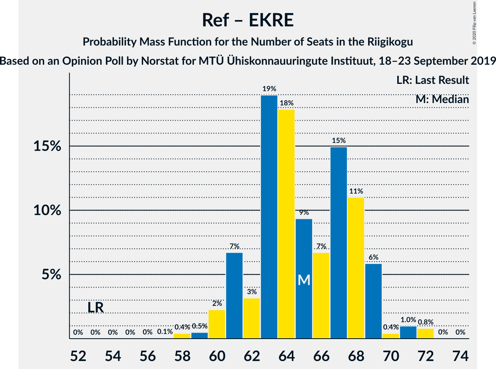

| Number of Seats | Probability | Accumulated | Special Marks |
|:---------------:|:-----------:|:-----------:|:-------------:|
| 53 | 0% | 100% | Last Result |
| 54 | 0% | 100% |  |
| 55 | 0% | 100% |  |
| 56 | 0% | 100% |  |
| 57 | 0.1% | 100% |  |
| 58 | 0.4% | 99.9% |  |
| 59 | 0.5% | 99.5% |  |
| 60 | 2% | 99.0% |  |
| 61 | 7% | 97% |  |
| 62 | 3% | 90% |  |
| 63 | 19% | 87% |  |
| 64 | 18% | 68% |  |
| 65 | 9% | 50% | Median |
| 66 | 7% | 41% |  |
| 67 | 15% | 34% |  |
| 68 | 11% | 19% |  |
| 69 | 6% | 8% |  |
| 70 | 0.4% | 2% |  |
| 71 | 1.0% | 2% |  |
| 72 | 0.8% | 0.8% |  |
| 73 | 0% | 0% |  |

### Eesti Reformierakond – Sotsiaaldemokraatlik Erakond – Erakond Isamaa – Eesti Vabaerakond

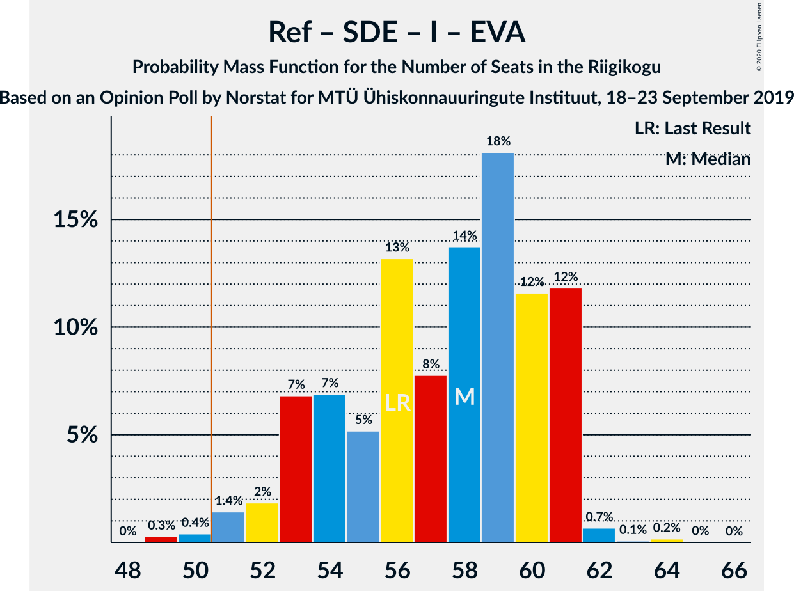

| Number of Seats | Probability | Accumulated | Special Marks |
|:---------------:|:-----------:|:-----------:|:-------------:|
| 49 | 0.3% | 100% |  |
| 50 | 0.4% | 99.7% |  |
| 51 | 1.4% | 99.3% | Majority |
| 52 | 2% | 98% |  |
| 53 | 7% | 96% |  |
| 54 | 7% | 89% |  |
| 55 | 5% | 82% |  |
| 56 | 13% | 77% | Last Result |
| 57 | 8% | 64% |  |
| 58 | 14% | 56% | Median |
| 59 | 18% | 42% |  |
| 60 | 12% | 24% |  |
| 61 | 12% | 13% |  |
| 62 | 0.7% | 0.9% |  |
| 63 | 0.1% | 0.3% |  |
| 64 | 0.2% | 0.2% |  |
| 65 | 0% | 0% |  |

### Eesti Reformierakond – Sotsiaaldemokraatlik Erakond – Erakond Isamaa

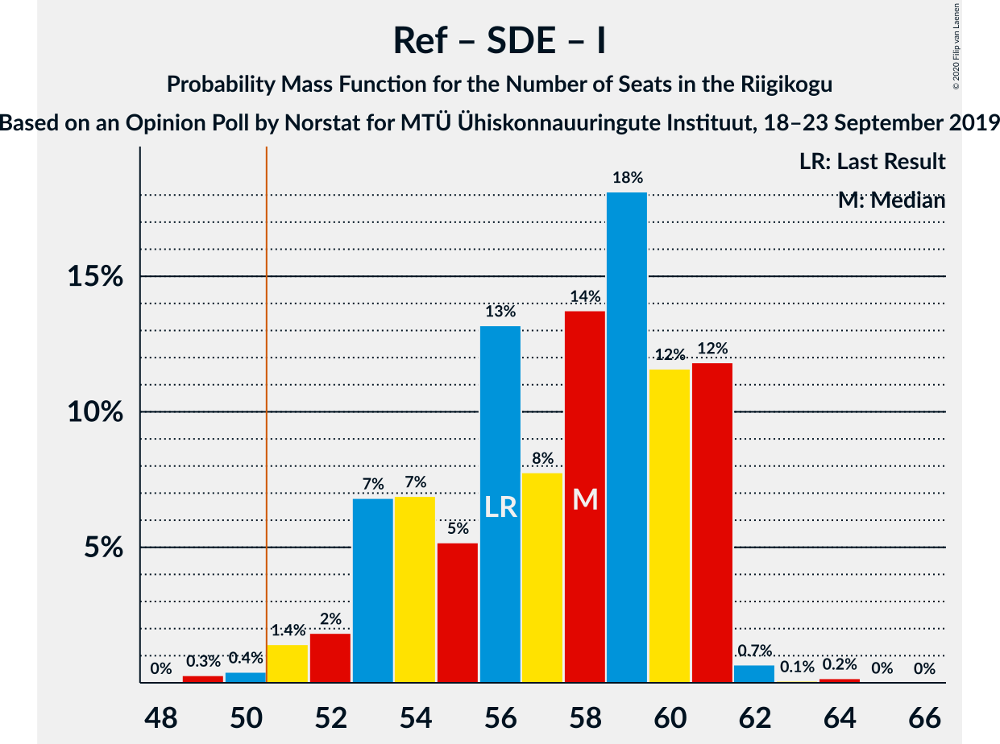

| Number of Seats | Probability | Accumulated | Special Marks |
|:---------------:|:-----------:|:-----------:|:-------------:|
| 49 | 0.3% | 100% |  |
| 50 | 0.4% | 99.7% |  |
| 51 | 1.4% | 99.3% | Majority |
| 52 | 2% | 98% |  |
| 53 | 7% | 96% |  |
| 54 | 7% | 89% |  |
| 55 | 5% | 82% |  |
| 56 | 13% | 77% | Last Result |
| 57 | 8% | 64% |  |
| 58 | 14% | 56% | Median |
| 59 | 18% | 42% |  |
| 60 | 12% | 24% |  |
| 61 | 12% | 13% |  |
| 62 | 0.7% | 0.9% |  |
| 63 | 0.1% | 0.3% |  |
| 64 | 0.2% | 0.2% |  |
| 65 | 0% | 0% |  |

### Eesti Reformierakond – Sotsiaaldemokraatlik Erakond

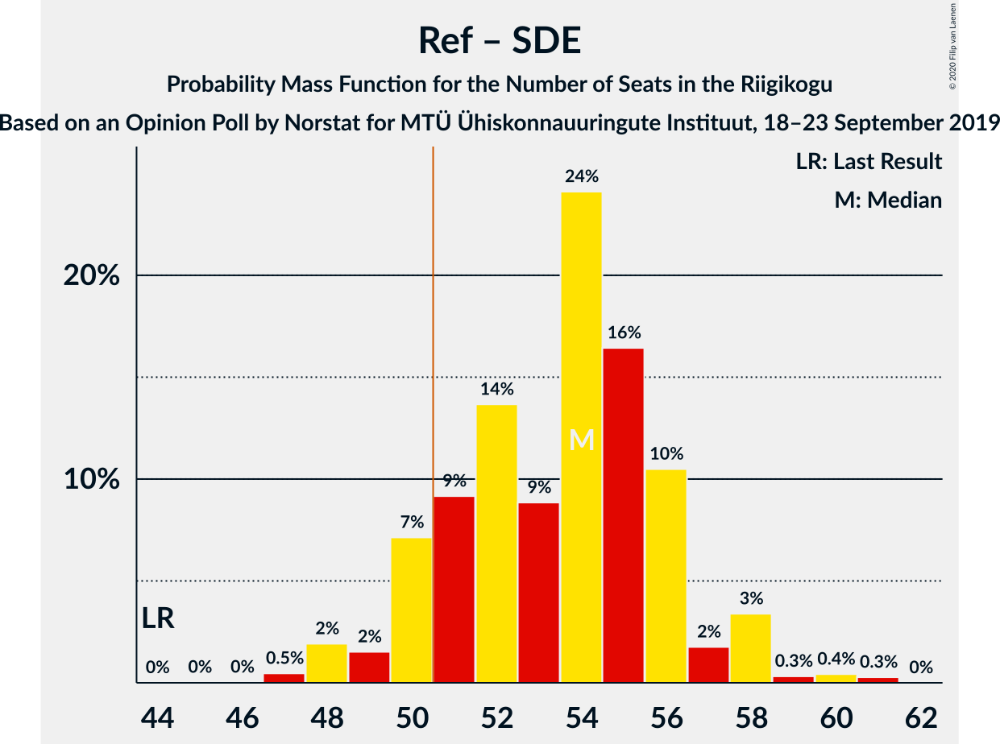

| Number of Seats | Probability | Accumulated | Special Marks |
|:---------------:|:-----------:|:-----------:|:-------------:|
| 44 | 0% | 100% | Last Result |
| 45 | 0% | 100% |  |
| 46 | 0% | 100% |  |
| 47 | 0.5% | 99.9% |  |
| 48 | 2% | 99.5% |  |
| 49 | 2% | 98% |  |
| 50 | 7% | 96% |  |
| 51 | 9% | 89% | Majority |
| 52 | 14% | 80% |  |
| 53 | 9% | 66% | Median |
| 54 | 24% | 57% |  |
| 55 | 16% | 33% |  |
| 56 | 10% | 17% |  |
| 57 | 2% | 6% |  |
| 58 | 3% | 4% |  |
| 59 | 0.3% | 1.0% |  |
| 60 | 0.4% | 0.7% |  |
| 61 | 0.3% | 0.3% |  |
| 62 | 0% | 0% |  |

### Eesti Reformierakond – Erakond Isamaa

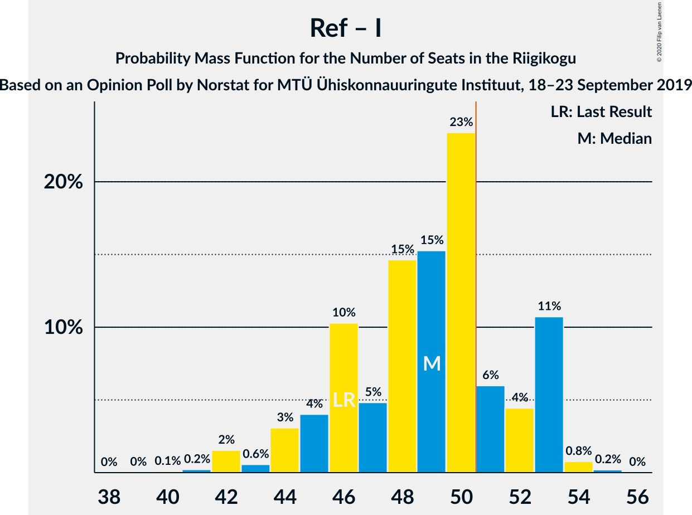

| Number of Seats | Probability | Accumulated | Special Marks |
|:---------------:|:-----------:|:-----------:|:-------------:|
| 40 | 0.1% | 100% |  |
| 41 | 0.2% | 99.9% |  |
| 42 | 2% | 99.7% |  |
| 43 | 0.6% | 98% |  |
| 44 | 3% | 98% |  |
| 45 | 4% | 95% |  |
| 46 | 10% | 91% | Last Result |
| 47 | 5% | 80% |  |
| 48 | 15% | 75% |  |
| 49 | 15% | 61% |  |
| 50 | 23% | 46% | Median |
| 51 | 6% | 22% | Majority |
| 52 | 4% | 16% |  |
| 53 | 11% | 12% |  |
| 54 | 0.8% | 1.0% |  |
| 55 | 0.2% | 0.2% |  |
| 56 | 0% | 0% |  |

### Eesti Keskerakond – Eesti Konservatiivne Rahvaerakond – Erakond Isamaa

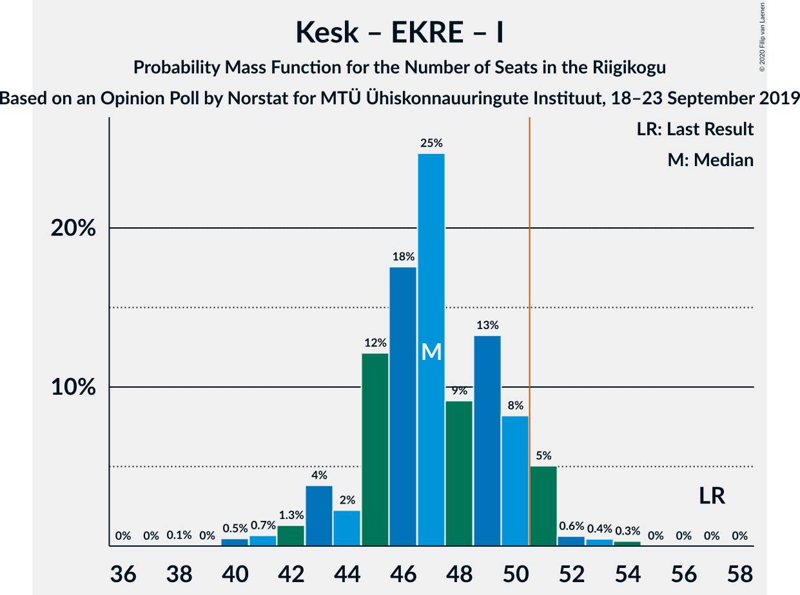

| Number of Seats | Probability | Accumulated | Special Marks |
|:---------------:|:-----------:|:-----------:|:-------------:|
| 38 | 0.1% | 100% |  |
| 39 | 0% | 99.9% |  |
| 40 | 0.5% | 99.9% |  |
| 41 | 0.7% | 99.5% |  |
| 42 | 1.3% | 98.8% |  |
| 43 | 4% | 97% |  |
| 44 | 2% | 94% |  |
| 45 | 12% | 91% |  |
| 46 | 18% | 79% |  |
| 47 | 25% | 62% |  |
| 48 | 9% | 37% | Median |
| 49 | 13% | 28% |  |
| 50 | 8% | 15% |  |
| 51 | 5% | 6% | Majority |
| 52 | 0.6% | 1.4% |  |
| 53 | 0.4% | 0.8% |  |
| 54 | 0.3% | 0.3% |  |
| 55 | 0% | 0% |  |
| 56 | 0% | 0% |  |
| 57 | 0% | 0% | Last Result |

### Eesti Keskerakond – Eesti Konservatiivne Rahvaerakond

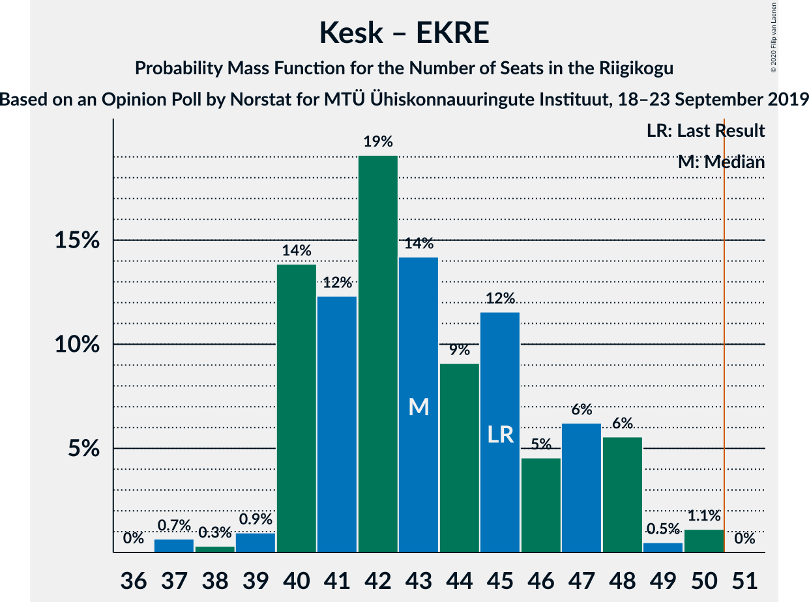

| Number of Seats | Probability | Accumulated | Special Marks |
|:---------------:|:-----------:|:-----------:|:-------------:|
| 37 | 0.7% | 100% |  |
| 38 | 0.3% | 99.3% |  |
| 39 | 0.9% | 99.0% |  |
| 40 | 14% | 98% |  |
| 41 | 12% | 84% |  |
| 42 | 19% | 72% |  |
| 43 | 14% | 53% | Median |
| 44 | 9% | 39% |  |
| 45 | 12% | 30% | Last Result |
| 46 | 5% | 18% |  |
| 47 | 6% | 13% |  |
| 48 | 6% | 7% |  |
| 49 | 0.5% | 2% |  |
| 50 | 1.1% | 1.1% |  |
| 51 | 0% | 0% | Majority |

### Eesti Keskerakond – Sotsiaaldemokraatlik Erakond – Erakond Isamaa

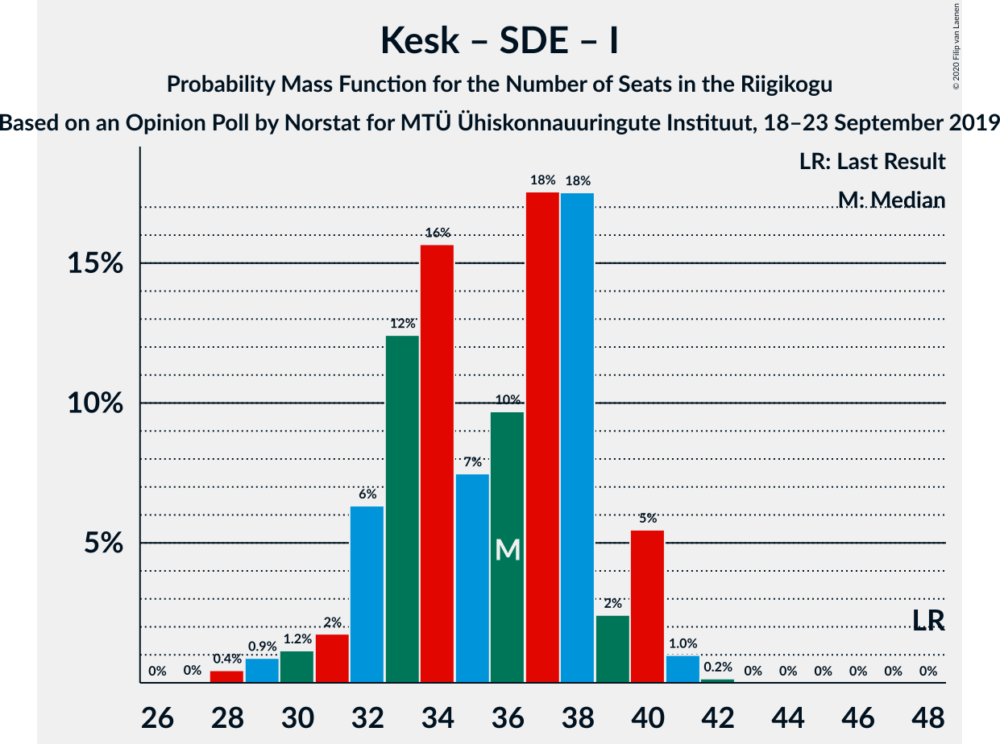

| Number of Seats | Probability | Accumulated | Special Marks |
|:---------------:|:-----------:|:-----------:|:-------------:|
| 28 | 0.4% | 100% |  |
| 29 | 0.9% | 99.5% |  |
| 30 | 1.2% | 98.6% |  |
| 31 | 2% | 97% |  |
| 32 | 6% | 96% |  |
| 33 | 12% | 89% |  |
| 34 | 16% | 77% |  |
| 35 | 7% | 61% |  |
| 36 | 10% | 54% | Median |
| 37 | 18% | 44% |  |
| 38 | 18% | 27% |  |
| 39 | 2% | 9% |  |
| 40 | 5% | 7% |  |
| 41 | 1.0% | 1.2% |  |
| 42 | 0.2% | 0.2% |  |
| 43 | 0% | 0% |  |
| 44 | 0% | 0% |  |
| 45 | 0% | 0% |  |
| 46 | 0% | 0% |  |
| 47 | 0% | 0% |  |
| 48 | 0% | 0% | Last Result |

### Eesti Keskerakond – Sotsiaaldemokraatlik Erakond

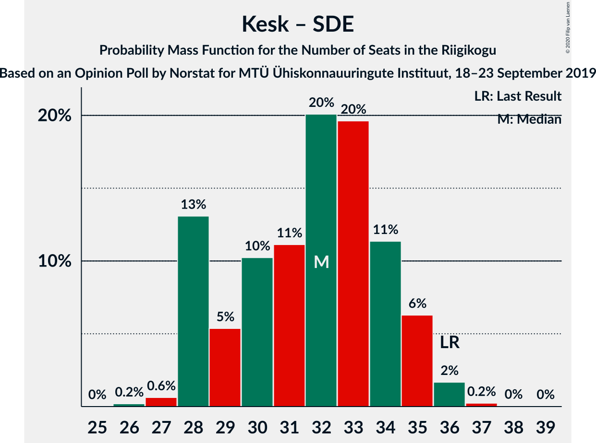

| Number of Seats | Probability | Accumulated | Special Marks |
|:---------------:|:-----------:|:-----------:|:-------------:|
| 26 | 0.2% | 100% |  |
| 27 | 0.6% | 99.8% |  |
| 28 | 13% | 99.2% |  |
| 29 | 5% | 86% |  |
| 30 | 10% | 81% |  |
| 31 | 11% | 70% | Median |
| 32 | 20% | 59% |  |
| 33 | 20% | 39% |  |
| 34 | 11% | 20% |  |
| 35 | 6% | 8% |  |
| 36 | 2% | 2% | Last Result |
| 37 | 0.2% | 0.3% |  |
| 38 | 0% | 0.1% |  |
| 39 | 0% | 0% |  |

### Eesti Konservatiivne Rahvaerakond – Sotsiaaldemokraatlik Erakond

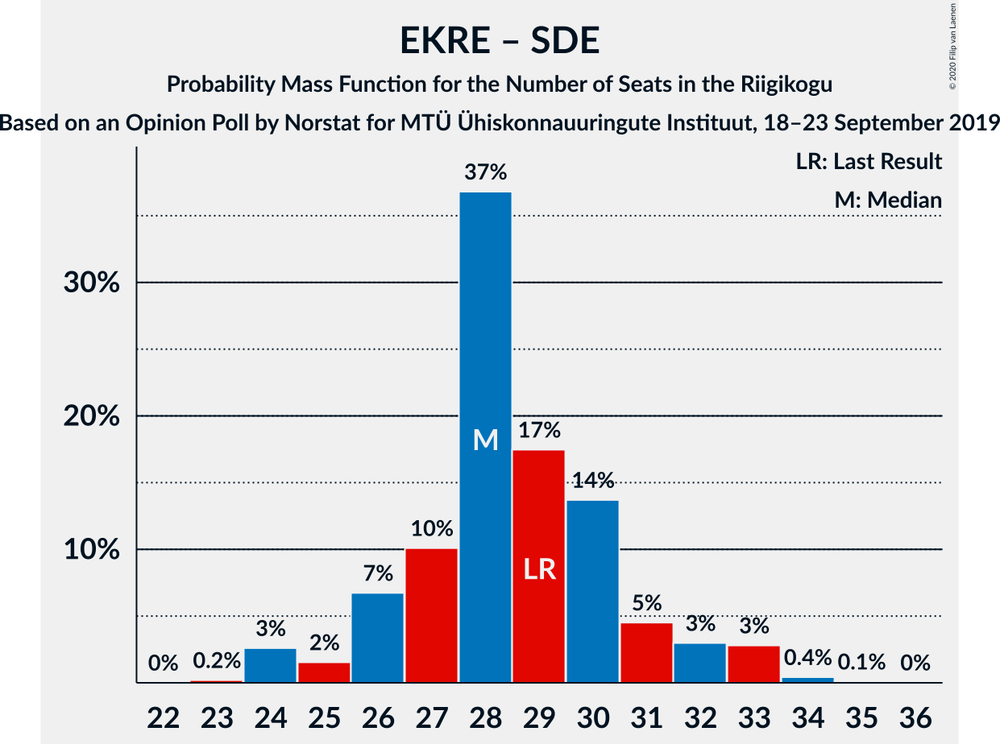

| Number of Seats | Probability | Accumulated | Special Marks |
|:---------------:|:-----------:|:-----------:|:-------------:|
| 23 | 0.2% | 100% |  |
| 24 | 3% | 99.8% |  |
| 25 | 2% | 97% |  |
| 26 | 7% | 96% |  |
| 27 | 10% | 89% |  |
| 28 | 37% | 79% | Median |
| 29 | 17% | 42% | Last Result |
| 30 | 14% | 25% |  |
| 31 | 5% | 11% |  |
| 32 | 3% | 6% |  |
| 33 | 3% | 3% |  |
| 34 | 0.4% | 0.5% |  |
| 35 | 0.1% | 0.1% |  |
| 36 | 0% | 0% |  |

## Technical Information

### Opinion Poll

+ **Polling firm:** Norstat
+ **Commissioner(s):** MTÜ Ühiskonnauuringute Instituut
+ **Fieldwork period:** 18–23 September 2019

### Calculations

+ **Sample size:** 1000
+ **Simulations done:** 131,072
+ **Error estimate:** 0.81%

