# Opinion Poll by Norstat for MTÜ Ühiskonnauuringute Instituut, 25–30 September 2019

<a href="#voting-intentions">Voting Intentions</a> | <a href="#seats">Seats</a> | <a href="#coalitions">Coalitions</a> | <a href="#technical-information">Technical Information</a>

## Voting Intentions

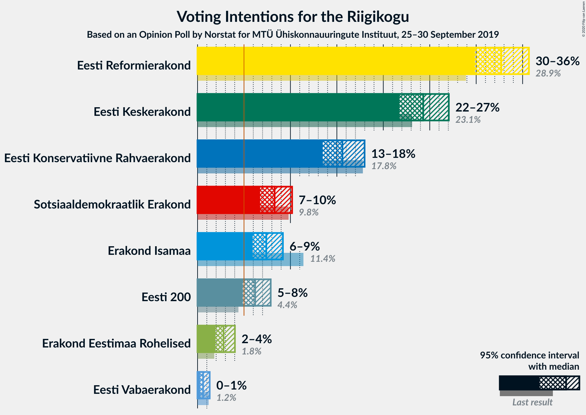

### Confidence Intervals

| Party | Last Result | Poll Result | 80% Confidence Interval | 90% Confidence Interval | 95% Confidence Interval | 99% Confidence Interval |
|:-----:|:-----------:|:-----------:|:-----------------------:|:-----------------------:|:-----------------------:|:-----------------------:|
| Eesti Reformierakond | 28.9% | 32.7% | 30.8–34.6% |30.3–35.2% |29.9–35.7% |29.0–36.6% |
| Eesti Keskerakond | 23.1% | 24.3% | 22.6–26.1% |22.1–26.6% |21.7–27.1% |21.0–27.9% |
| Eesti Konservatiivne Rahvaerakond | 17.8% | 15.6% | 14.2–17.2% |13.8–17.6% |13.5–18.0% |12.8–18.8% |
| Sotsiaaldemokraatlik Erakond | 9.8% | 8.3% | 7.3–9.5% |7.0–9.9% |6.7–10.2% |6.3–10.8% |
| Erakond Isamaa | 11.4% | 7.4% | 6.4–8.6% |6.2–8.9% |5.9–9.2% |5.5–9.8% |
| Eesti 200 | 4.4% | 6.2% | 5.3–7.3% |5.1–7.6% |4.9–7.9% |4.5–8.4% |
| Erakond Eestimaa Rohelised | 1.8% | 2.8% | 2.2–3.6% |2.1–3.8% |1.9–4.0% |1.7–4.4% |
| Eesti Vabaerakond | 1.2% | 0.6% | 0.4–1.1% |0.3–1.2% |0.3–1.3% |0.2–1.6% |

*Note:* The poll result column reflects the actual value used in the calculations. Published results may vary slightly, and in addition be rounded to fewer digits.

## Seats

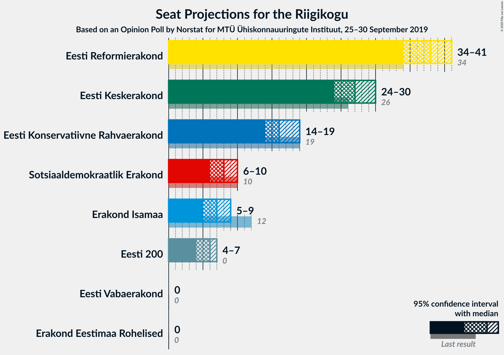

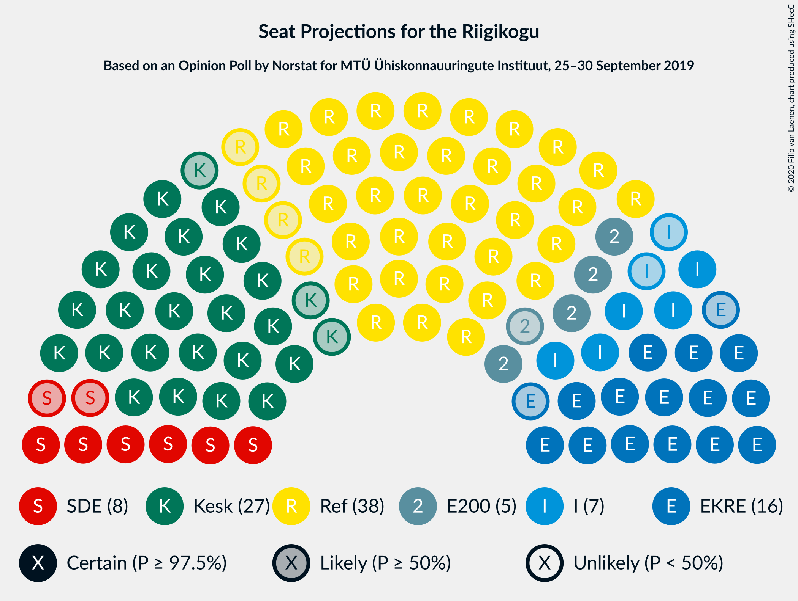

### Confidence Intervals

| Party | Last Result | Median | 80% Confidence Interval | 90% Confidence Interval | 95% Confidence Interval | 99% Confidence Interval |
|:-----:|:-----------:|:------:|:-----------------------:|:-----------------------:|:-----------------------:|:-----------------------:|
| <a href="#eesti-reformierakond">Eesti Reformierakond</a> | 34 | 38 | 35–40 |34–40 |34–41 |33–43 |
| <a href="#eesti-keskerakond">Eesti Keskerakond</a> | 26 | 27 | 25–29 |25–30 |24–30 |23–32 |
| <a href="#eesti-konservatiivne-rahvaerakond">Eesti Konservatiivne Rahvaerakond</a> | 19 | 16 | 15–18 |14–19 |14–19 |13–20 |
| <a href="#sotsiaaldemokraatlik-erakond">Sotsiaaldemokraatlik Erakond</a> | 10 | 8 | 7–9 |6–10 |6–10 |6–11 |
| <a href="#erakond-isamaa">Erakond Isamaa</a> | 12 | 7 | 6–8 |5–9 |5–9 |5–10 |
| <a href="#eesti-200">Eesti 200</a> | 0 | 6 | 5–7 |4–7 |4–7 |0–8 |
| <a href="#erakond-eestimaa-rohelised">Erakond Eestimaa Rohelised</a> | 0 | 0 | 0 |0 |0 |0 |
| <a href="#eesti-vabaerakond">Eesti Vabaerakond</a> | 0 | 0 | 0 |0 |0 |0 |

### Eesti Reformierakond

*For a full overview of the results for this party, see the [Eesti Reformierakond](party-eestireformierakond.html) page.*

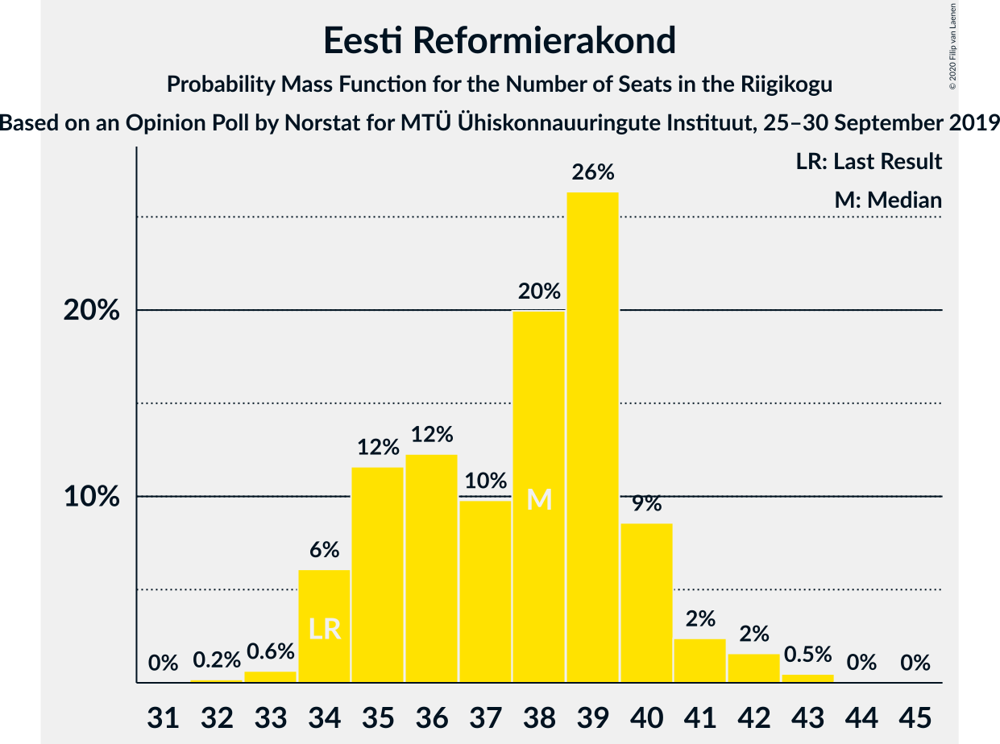

| Number of Seats | Probability | Accumulated | Special Marks |
|:---------------:|:-----------:|:-----------:|:-------------:|
| 32 | 0.2% | 100% |  |
| 33 | 0.6% | 99.8% |  |
| 34 | 6% | 99.2% | Last Result |
| 35 | 12% | 93% |  |
| 36 | 12% | 81% |  |
| 37 | 10% | 69% |  |
| 38 | 20% | 59% | Median |
| 39 | 26% | 39% |  |
| 40 | 9% | 13% |  |
| 41 | 2% | 5% |  |
| 42 | 2% | 2% |  |
| 43 | 0.5% | 0.5% |  |
| 44 | 0% | 0.1% |  |
| 45 | 0% | 0% |  |

### Eesti Keskerakond

*For a full overview of the results for this party, see the [Eesti Keskerakond](party-eestikeskerakond.html) page.*

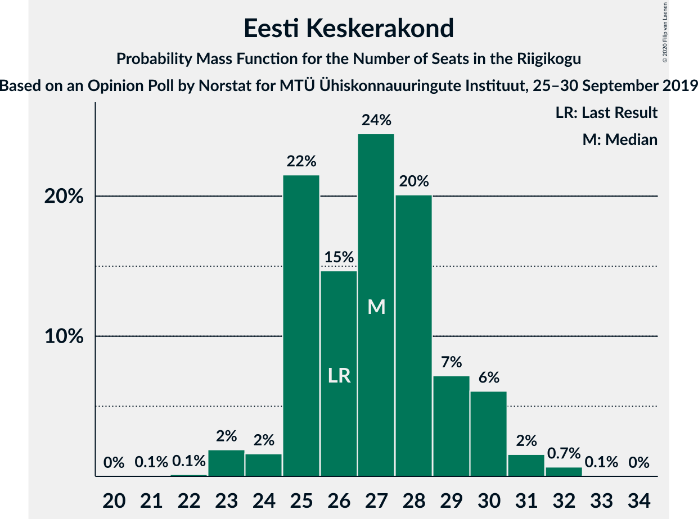

| Number of Seats | Probability | Accumulated | Special Marks |
|:---------------:|:-----------:|:-----------:|:-------------:|
| 21 | 0.1% | 100% |  |
| 22 | 0.1% | 99.9% |  |
| 23 | 2% | 99.8% |  |
| 24 | 2% | 98% |  |
| 25 | 22% | 96% |  |
| 26 | 15% | 75% | Last Result |
| 27 | 24% | 60% | Median |
| 28 | 20% | 36% |  |
| 29 | 7% | 16% |  |
| 30 | 6% | 8% |  |
| 31 | 2% | 2% |  |
| 32 | 0.7% | 0.7% |  |
| 33 | 0.1% | 0.1% |  |
| 34 | 0% | 0% |  |

### Eesti Konservatiivne Rahvaerakond

*For a full overview of the results for this party, see the [Eesti Konservatiivne Rahvaerakond](party-eestikonservatiivnerahvaerakond.html) page.*

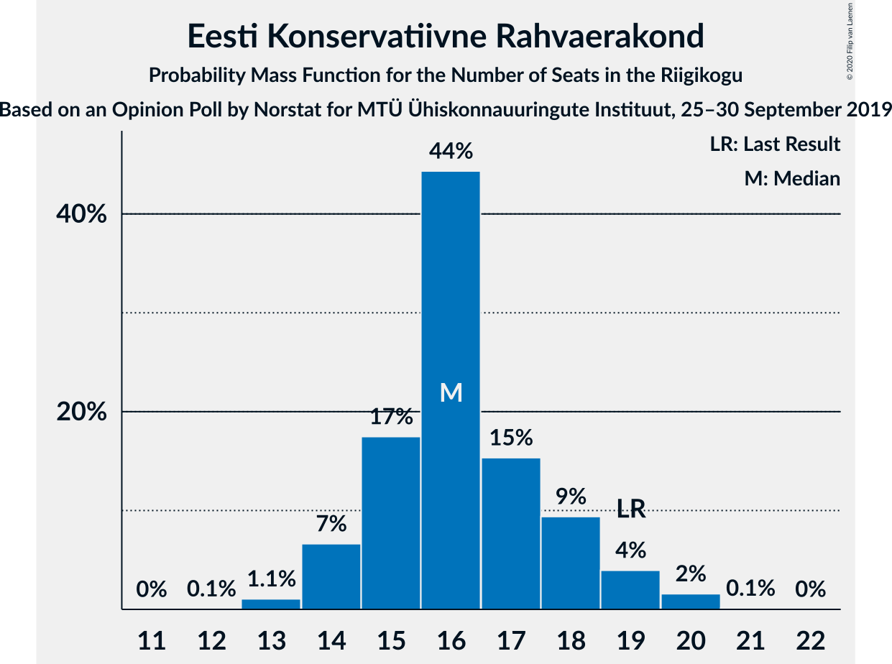

| Number of Seats | Probability | Accumulated | Special Marks |
|:---------------:|:-----------:|:-----------:|:-------------:|
| 12 | 0.1% | 100% |  |
| 13 | 1.1% | 99.9% |  |
| 14 | 7% | 98.9% |  |
| 15 | 17% | 92% |  |
| 16 | 44% | 75% | Median |
| 17 | 15% | 30% |  |
| 18 | 9% | 15% |  |
| 19 | 4% | 6% | Last Result |
| 20 | 2% | 2% |  |
| 21 | 0.1% | 0.1% |  |
| 22 | 0% | 0% |  |

### Sotsiaaldemokraatlik Erakond

*For a full overview of the results for this party, see the [Sotsiaaldemokraatlik Erakond](party-sotsiaaldemokraatlikerakond.html) page.*

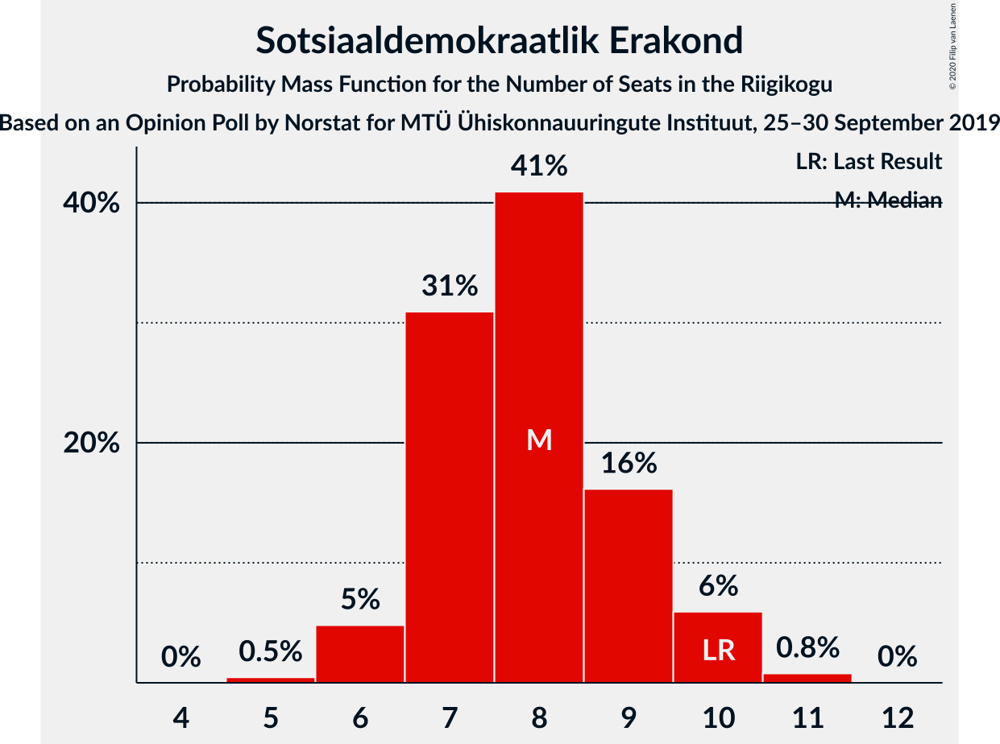

| Number of Seats | Probability | Accumulated | Special Marks |
|:---------------:|:-----------:|:-----------:|:-------------:|
| 5 | 0.5% | 100% |  |
| 6 | 5% | 99.5% |  |
| 7 | 31% | 95% |  |
| 8 | 41% | 64% | Median |
| 9 | 16% | 23% |  |
| 10 | 6% | 7% | Last Result |
| 11 | 0.8% | 0.8% |  |
| 12 | 0% | 0% |  |

### Erakond Isamaa

*For a full overview of the results for this party, see the [Erakond Isamaa](party-erakondisamaa.html) page.*

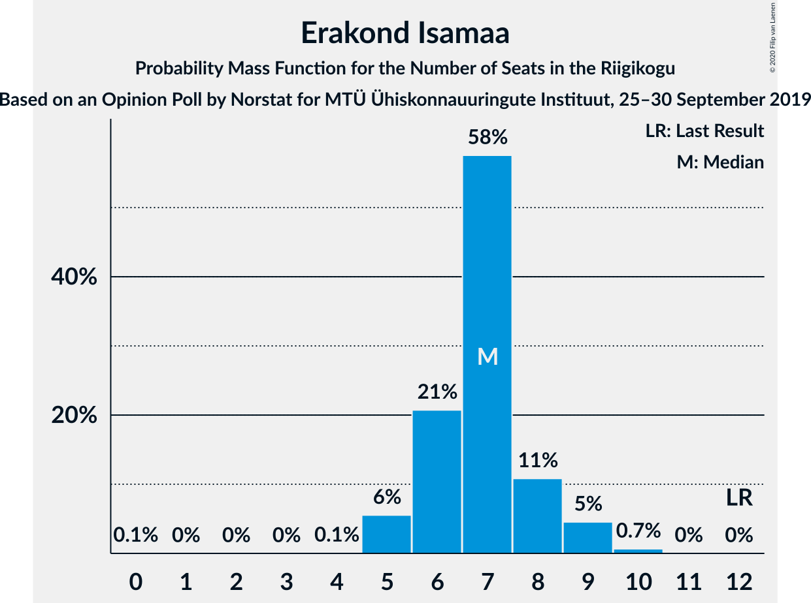

| Number of Seats | Probability | Accumulated | Special Marks |
|:---------------:|:-----------:|:-----------:|:-------------:|
| 0 | 0.1% | 100% |  |
| 1 | 0% | 99.9% |  |
| 2 | 0% | 99.9% |  |
| 3 | 0% | 99.9% |  |
| 4 | 0.1% | 99.9% |  |
| 5 | 6% | 99.9% |  |
| 6 | 21% | 94% |  |
| 7 | 58% | 74% | Median |
| 8 | 11% | 16% |  |
| 9 | 5% | 5% |  |
| 10 | 0.7% | 0.7% |  |
| 11 | 0% | 0% |  |
| 12 | 0% | 0% | Last Result |

### Eesti 200

*For a full overview of the results for this party, see the [Eesti 200](party-eesti200.html) page.*

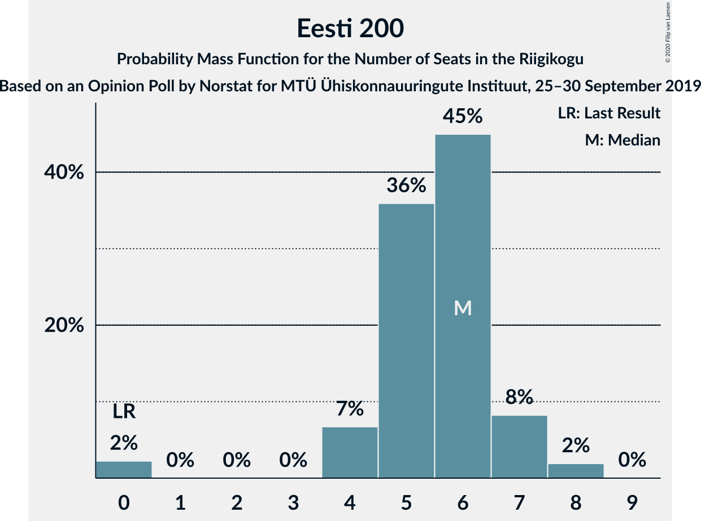

| Number of Seats | Probability | Accumulated | Special Marks |
|:---------------:|:-----------:|:-----------:|:-------------:|
| 0 | 2% | 100% | Last Result |
| 1 | 0% | 98% |  |
| 2 | 0% | 98% |  |
| 3 | 0% | 98% |  |
| 4 | 7% | 98% |  |
| 5 | 36% | 91% |  |
| 6 | 45% | 55% | Median |
| 7 | 8% | 10% |  |
| 8 | 2% | 2% |  |
| 9 | 0% | 0% |  |

### Erakond Eestimaa Rohelised

*For a full overview of the results for this party, see the [Erakond Eestimaa Rohelised](party-erakondeestimaarohelised.html) page.*

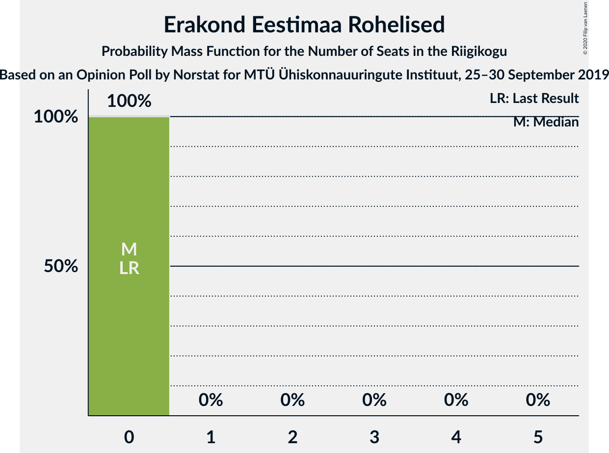

| Number of Seats | Probability | Accumulated | Special Marks |
|:---------------:|:-----------:|:-----------:|:-------------:|
| 0 | 100% | 100% | Last Result, Median |

### Eesti Vabaerakond

*For a full overview of the results for this party, see the [Eesti Vabaerakond](party-eestivabaerakond.html) page.*

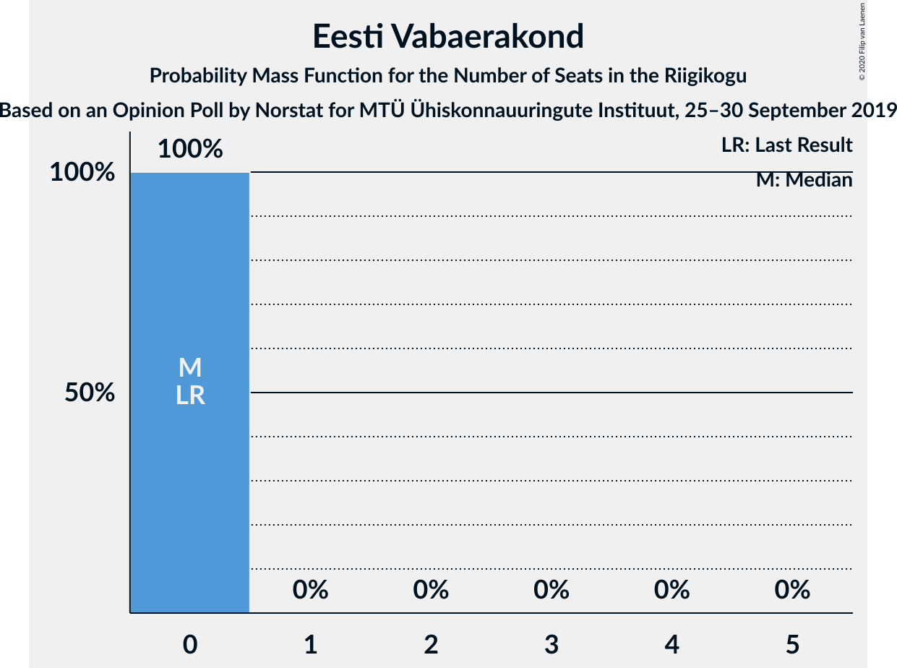

| Number of Seats | Probability | Accumulated | Special Marks |
|:---------------:|:-----------:|:-----------:|:-------------:|
| 0 | 100% | 100% | Last Result, Median |

## Coalitions

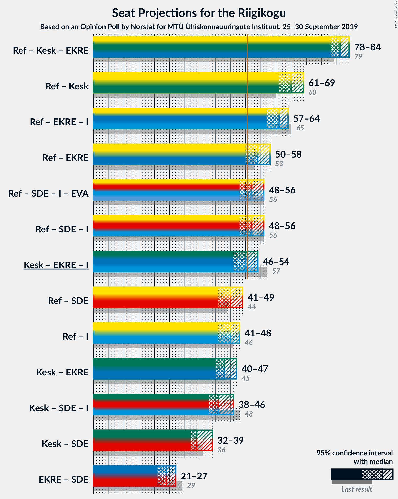

### Confidence Intervals

| Coalition | Last Result | Median | Majority? | 80% Confidence Interval | 90% Confidence Interval | 95% Confidence Interval | 99% Confidence Interval |
|:---------:|:-----------:|:------:|:---------:|:-----------------------:|:-----------------------:|:-----------------------:|:-----------------------:|
| Eesti Reformierakond – Eesti Keskerakond – Eesti Konservatiivne Rahvaerakond | 79 | 81 | 100% | 79–83 | 79–83 | 78–84 | 76–87 |
| Eesti Reformierakond – Eesti Keskerakond | 60 | 65 | 100% | 62–67 | 62–67 | 61–69 | 60–70 |
| Eesti Reformierakond – Eesti Konservatiivne Rahvaerakond – Erakond Isamaa | 65 | 61 | 100% | 58–62 | 57–63 | 57–64 | 56–67 |
| Eesti Reformierakond – Eesti Konservatiivne Rahvaerakond | 53 | 54 | 97% | 51–56 | 51–57 | 50–58 | 49–59 |
| Eesti Reformierakond – Sotsiaaldemokraatlik Erakond – Erakond Isamaa – Eesti Vabaerakond | 56 | 52 | 80% | 49–55 | 49–56 | 48–56 | 48–57 |
| Eesti Reformierakond – Sotsiaaldemokraatlik Erakond – Erakond Isamaa | 56 | 52 | 80% | 49–55 | 49–56 | 48–56 | 48–57 |
| Eesti Keskerakond – Eesti Konservatiivne Rahvaerakond – Erakond Isamaa | 57 | 50 | 38% | 47–53 | 47–53 | 46–54 | 46–56 |
| Eesti Reformierakond – Sotsiaaldemokraatlik Erakond | 44 | 45 | 0.4% | 43–48 | 42–49 | 41–49 | 41–50 |
| Eesti Reformierakond – Erakond Isamaa | 46 | 45 | 0.2% | 41–47 | 41–47 | 41–48 | 40–50 |
| Eesti Keskerakond – Eesti Konservatiivne Rahvaerakond | 45 | 43 | 0% | 41–46 | 40–46 | 40–47 | 39–49 |
| Eesti Keskerakond – Sotsiaaldemokraatlik Erakond – Erakond Isamaa | 48 | 41 | 0% | 40–44 | 39–45 | 38–46 | 37–47 |
| Eesti Keskerakond – Sotsiaaldemokraatlik Erakond | 36 | 34 | 0% | 33–37 | 32–38 | 32–39 | 30–39 |
| Eesti Konservatiivne Rahvaerakond – Sotsiaaldemokraatlik Erakond | 29 | 24 | 0% | 23–26 | 22–26 | 21–27 | 20–29 |

### Eesti Reformierakond – Eesti Keskerakond – Eesti Konservatiivne Rahvaerakond

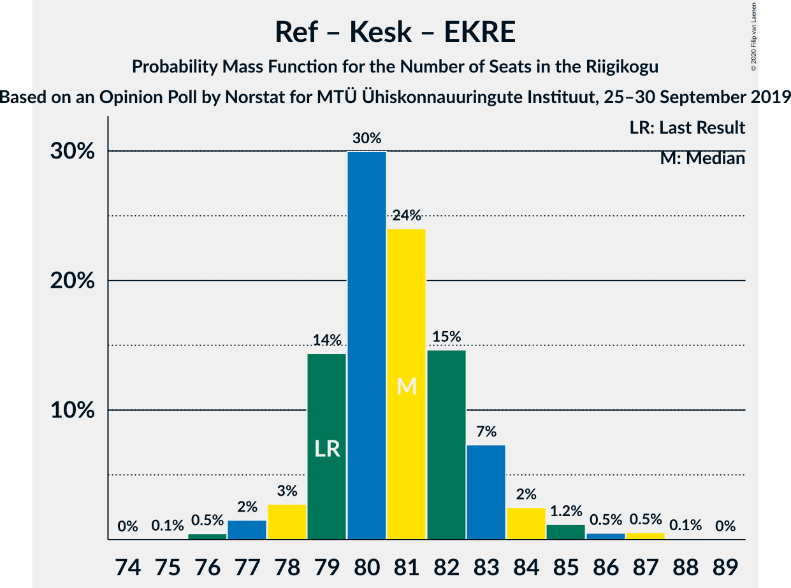

| Number of Seats | Probability | Accumulated | Special Marks |
|:---------------:|:-----------:|:-----------:|:-------------:|
| 75 | 0.1% | 100% |  |
| 76 | 0.5% | 99.9% |  |
| 77 | 2% | 99.4% |  |
| 78 | 3% | 98% |  |
| 79 | 14% | 95% | Last Result |
| 80 | 30% | 81% |  |
| 81 | 24% | 51% | Median |
| 82 | 15% | 27% |  |
| 83 | 7% | 12% |  |
| 84 | 2% | 5% |  |
| 85 | 1.2% | 2% |  |
| 86 | 0.5% | 1.2% |  |
| 87 | 0.5% | 0.7% |  |
| 88 | 0.1% | 0.1% |  |
| 89 | 0% | 0% |  |

### Eesti Reformierakond – Eesti Keskerakond

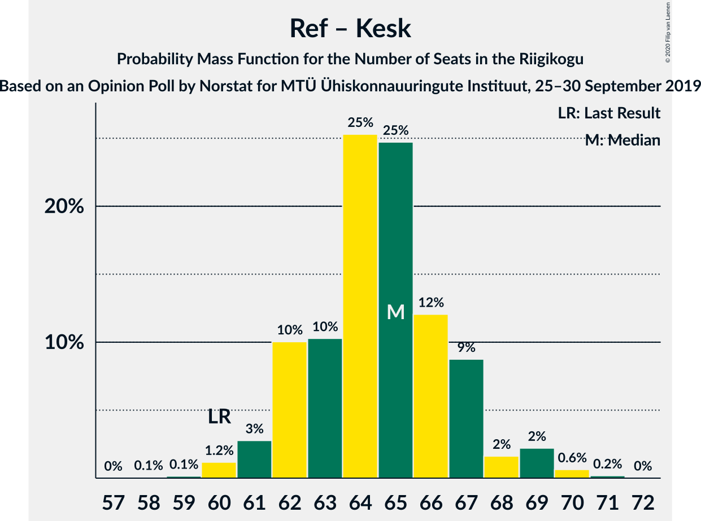

| Number of Seats | Probability | Accumulated | Special Marks |
|:---------------:|:-----------:|:-----------:|:-------------:|
| 58 | 0.1% | 100% |  |
| 59 | 0.1% | 99.9% |  |
| 60 | 1.2% | 99.8% | Last Result |
| 61 | 3% | 98.6% |  |
| 62 | 10% | 96% |  |
| 63 | 10% | 86% |  |
| 64 | 25% | 76% |  |
| 65 | 25% | 50% | Median |
| 66 | 12% | 25% |  |
| 67 | 9% | 13% |  |
| 68 | 2% | 5% |  |
| 69 | 2% | 3% |  |
| 70 | 0.6% | 0.9% |  |
| 71 | 0.2% | 0.2% |  |
| 72 | 0% | 0% |  |

### Eesti Reformierakond – Eesti Konservatiivne Rahvaerakond – Erakond Isamaa

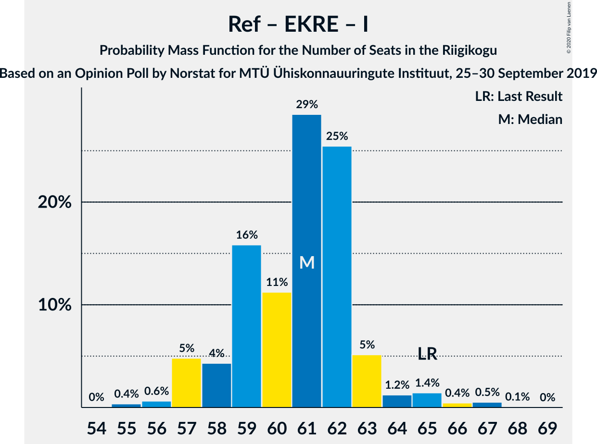

| Number of Seats | Probability | Accumulated | Special Marks |
|:---------------:|:-----------:|:-----------:|:-------------:|
| 55 | 0.4% | 100% |  |
| 56 | 0.6% | 99.6% |  |
| 57 | 5% | 99.0% |  |
| 58 | 4% | 94% |  |
| 59 | 16% | 90% |  |
| 60 | 11% | 74% |  |
| 61 | 29% | 63% | Median |
| 62 | 25% | 34% |  |
| 63 | 5% | 9% |  |
| 64 | 1.2% | 4% |  |
| 65 | 1.4% | 2% | Last Result |
| 66 | 0.4% | 1.0% |  |
| 67 | 0.5% | 0.6% |  |
| 68 | 0.1% | 0.1% |  |
| 69 | 0% | 0% |  |

### Eesti Reformierakond – Eesti Konservatiivne Rahvaerakond

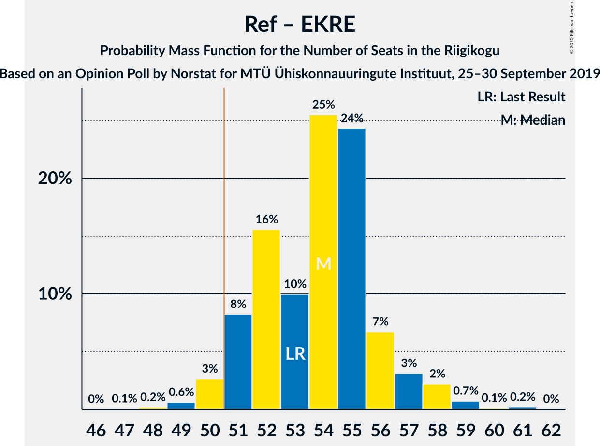

| Number of Seats | Probability | Accumulated | Special Marks |
|:---------------:|:-----------:|:-----------:|:-------------:|
| 47 | 0.1% | 100% |  |
| 48 | 0.2% | 99.9% |  |
| 49 | 0.6% | 99.8% |  |
| 50 | 3% | 99.2% |  |
| 51 | 8% | 97% | Majority |
| 52 | 16% | 88% |  |
| 53 | 10% | 73% | Last Result |
| 54 | 25% | 63% | Median |
| 55 | 24% | 37% |  |
| 56 | 7% | 13% |  |
| 57 | 3% | 6% |  |
| 58 | 2% | 3% |  |
| 59 | 0.7% | 1.0% |  |
| 60 | 0.1% | 0.3% |  |
| 61 | 0.2% | 0.2% |  |
| 62 | 0% | 0% |  |

### Eesti Reformierakond – Sotsiaaldemokraatlik Erakond – Erakond Isamaa – Eesti Vabaerakond

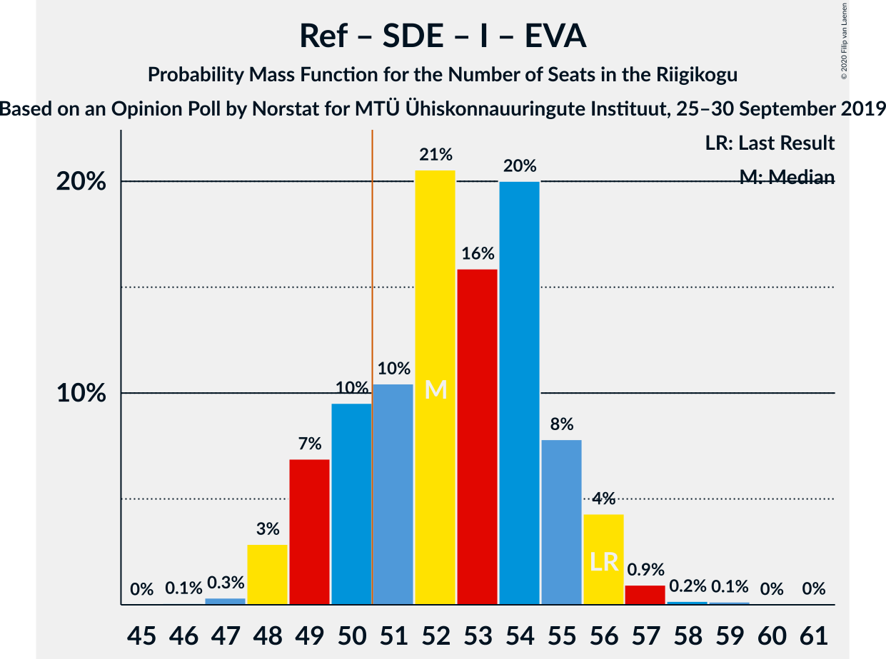

| Number of Seats | Probability | Accumulated | Special Marks |
|:---------------:|:-----------:|:-----------:|:-------------:|
| 46 | 0.1% | 100% |  |
| 47 | 0.3% | 99.9% |  |
| 48 | 3% | 99.6% |  |
| 49 | 7% | 97% |  |
| 50 | 10% | 90% |  |
| 51 | 10% | 80% | Majority |
| 52 | 21% | 70% |  |
| 53 | 16% | 49% | Median |
| 54 | 20% | 33% |  |
| 55 | 8% | 13% |  |
| 56 | 4% | 6% | Last Result |
| 57 | 0.9% | 1.3% |  |
| 58 | 0.2% | 0.4% |  |
| 59 | 0.1% | 0.2% |  |
| 60 | 0% | 0.1% |  |
| 61 | 0% | 0% |  |

### Eesti Reformierakond – Sotsiaaldemokraatlik Erakond – Erakond Isamaa

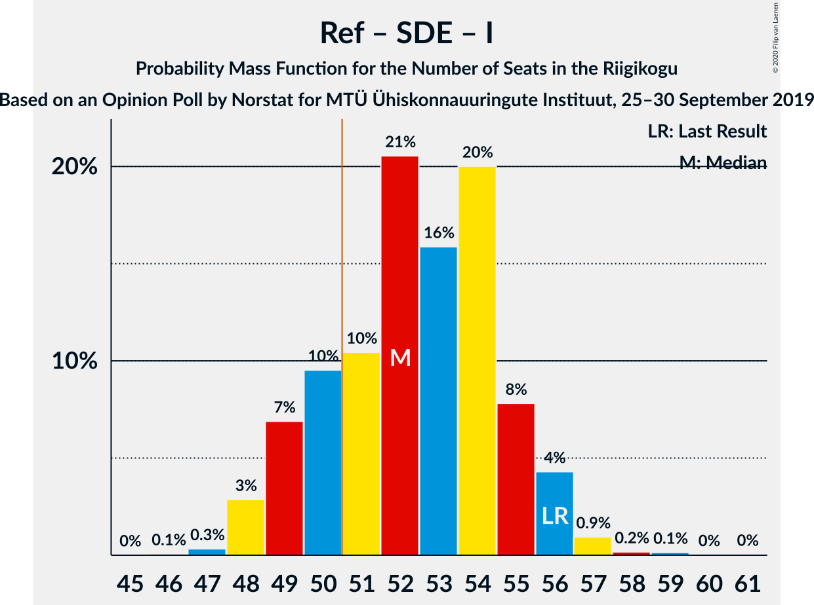

| Number of Seats | Probability | Accumulated | Special Marks |
|:---------------:|:-----------:|:-----------:|:-------------:|
| 46 | 0.1% | 100% |  |
| 47 | 0.3% | 99.9% |  |
| 48 | 3% | 99.6% |  |
| 49 | 7% | 97% |  |
| 50 | 10% | 90% |  |
| 51 | 10% | 80% | Majority |
| 52 | 21% | 70% |  |
| 53 | 16% | 49% | Median |
| 54 | 20% | 33% |  |
| 55 | 8% | 13% |  |
| 56 | 4% | 6% | Last Result |
| 57 | 0.9% | 1.3% |  |
| 58 | 0.2% | 0.4% |  |
| 59 | 0.1% | 0.2% |  |
| 60 | 0% | 0.1% |  |
| 61 | 0% | 0% |  |

### Eesti Keskerakond – Eesti Konservatiivne Rahvaerakond – Erakond Isamaa

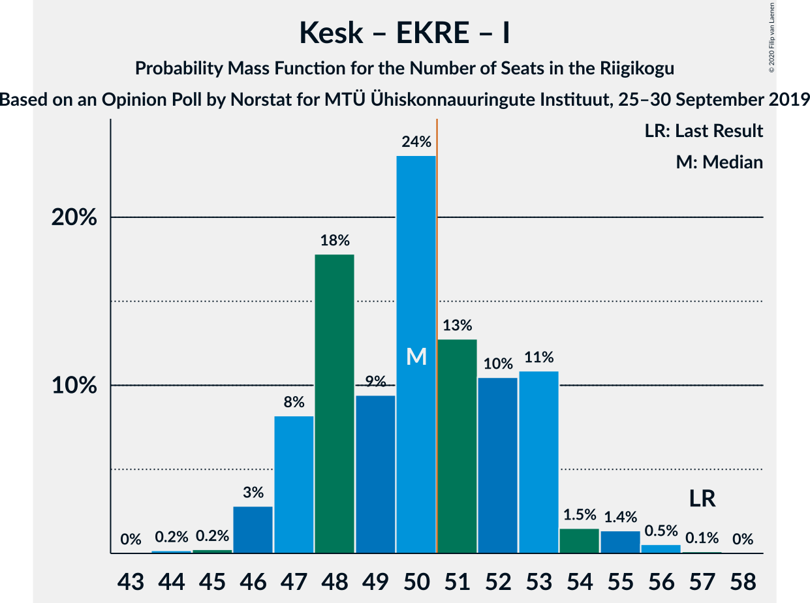

| Number of Seats | Probability | Accumulated | Special Marks |
|:---------------:|:-----------:|:-----------:|:-------------:|
| 44 | 0.2% | 100% |  |
| 45 | 0.2% | 99.8% |  |
| 46 | 3% | 99.6% |  |
| 47 | 8% | 97% |  |
| 48 | 18% | 89% |  |
| 49 | 9% | 71% |  |
| 50 | 24% | 61% | Median |
| 51 | 13% | 38% | Majority |
| 52 | 10% | 25% |  |
| 53 | 11% | 14% |  |
| 54 | 1.5% | 4% |  |
| 55 | 1.4% | 2% |  |
| 56 | 0.5% | 0.7% |  |
| 57 | 0.1% | 0.1% | Last Result |
| 58 | 0% | 0% |  |

### Eesti Reformierakond – Sotsiaaldemokraatlik Erakond

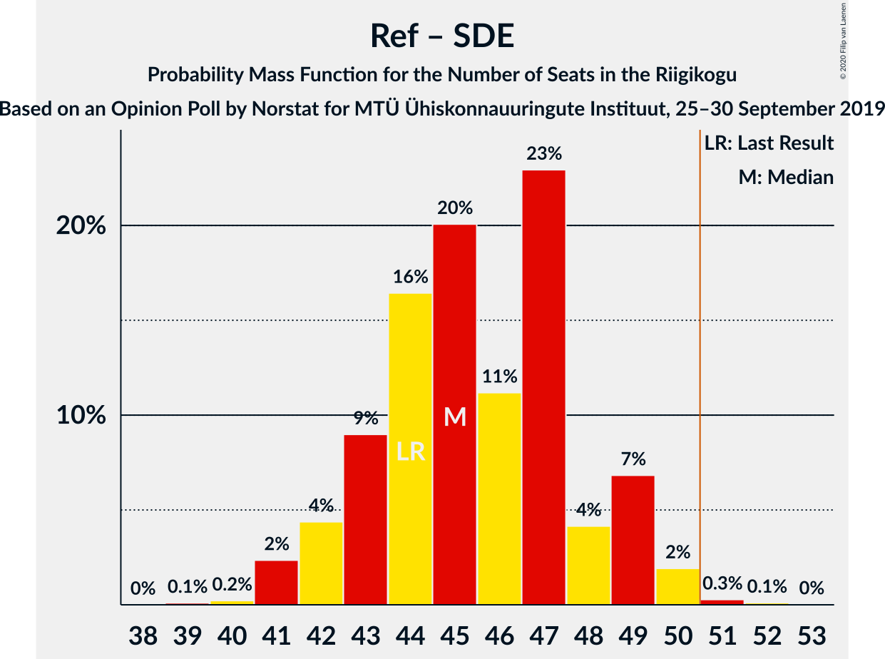

| Number of Seats | Probability | Accumulated | Special Marks |
|:---------------:|:-----------:|:-----------:|:-------------:|
| 39 | 0.1% | 100% |  |
| 40 | 0.2% | 99.9% |  |
| 41 | 2% | 99.7% |  |
| 42 | 4% | 97% |  |
| 43 | 9% | 93% |  |
| 44 | 16% | 84% | Last Result |
| 45 | 20% | 68% |  |
| 46 | 11% | 47% | Median |
| 47 | 23% | 36% |  |
| 48 | 4% | 13% |  |
| 49 | 7% | 9% |  |
| 50 | 2% | 2% |  |
| 51 | 0.3% | 0.4% | Majority |
| 52 | 0.1% | 0.2% |  |
| 53 | 0% | 0% |  |

### Eesti Reformierakond – Erakond Isamaa

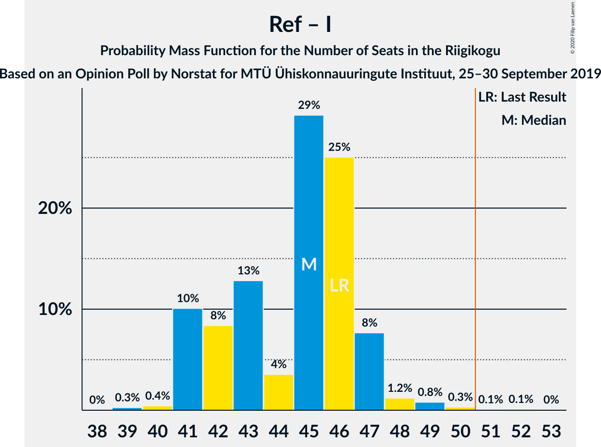

| Number of Seats | Probability | Accumulated | Special Marks |
|:---------------:|:-----------:|:-----------:|:-------------:|
| 39 | 0.3% | 100% |  |
| 40 | 0.4% | 99.7% |  |
| 41 | 10% | 99.3% |  |
| 42 | 8% | 89% |  |
| 43 | 13% | 81% |  |
| 44 | 4% | 68% |  |
| 45 | 29% | 64% | Median |
| 46 | 25% | 35% | Last Result |
| 47 | 8% | 10% |  |
| 48 | 1.2% | 3% |  |
| 49 | 0.8% | 1.3% |  |
| 50 | 0.3% | 0.5% |  |
| 51 | 0.1% | 0.2% | Majority |
| 52 | 0.1% | 0.2% |  |
| 53 | 0% | 0% |  |

### Eesti Keskerakond – Eesti Konservatiivne Rahvaerakond

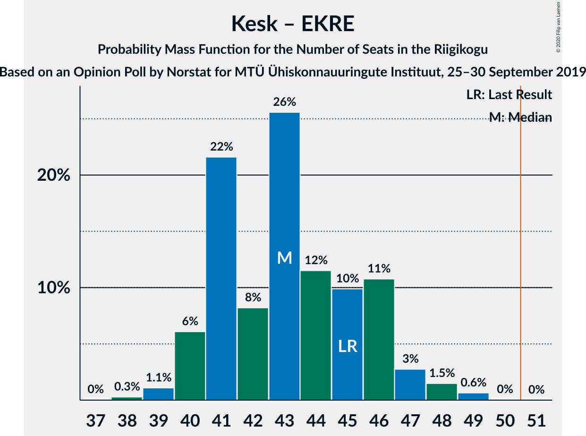

| Number of Seats | Probability | Accumulated | Special Marks |
|:---------------:|:-----------:|:-----------:|:-------------:|
| 37 | 0% | 100% |  |
| 38 | 0.3% | 99.9% |  |
| 39 | 1.1% | 99.6% |  |
| 40 | 6% | 98.6% |  |
| 41 | 22% | 92% |  |
| 42 | 8% | 71% |  |
| 43 | 26% | 63% | Median |
| 44 | 12% | 37% |  |
| 45 | 10% | 26% | Last Result |
| 46 | 11% | 16% |  |
| 47 | 3% | 5% |  |
| 48 | 1.5% | 2% |  |
| 49 | 0.6% | 0.7% |  |
| 50 | 0% | 0.1% |  |
| 51 | 0% | 0% | Majority |

### Eesti Keskerakond – Sotsiaaldemokraatlik Erakond – Erakond Isamaa

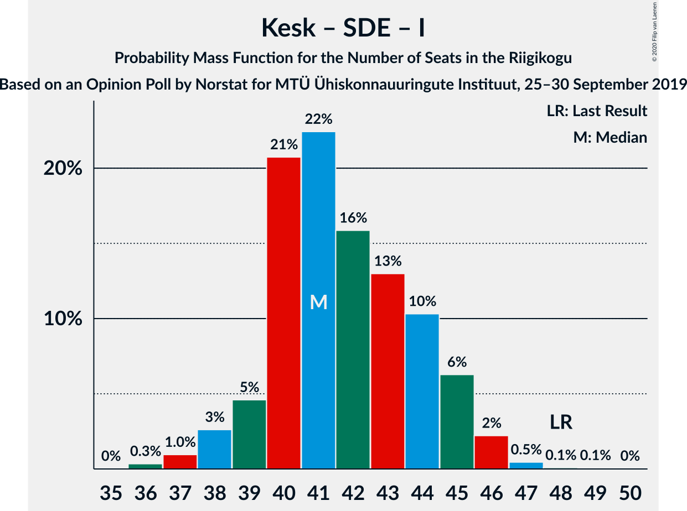

| Number of Seats | Probability | Accumulated | Special Marks |
|:---------------:|:-----------:|:-----------:|:-------------:|
| 36 | 0.3% | 100% |  |
| 37 | 1.0% | 99.6% |  |
| 38 | 3% | 98.7% |  |
| 39 | 5% | 96% |  |
| 40 | 21% | 91% |  |
| 41 | 22% | 71% |  |
| 42 | 16% | 48% | Median |
| 43 | 13% | 32% |  |
| 44 | 10% | 19% |  |
| 45 | 6% | 9% |  |
| 46 | 2% | 3% |  |
| 47 | 0.5% | 0.6% |  |
| 48 | 0.1% | 0.2% | Last Result |
| 49 | 0.1% | 0.1% |  |
| 50 | 0% | 0% |  |

### Eesti Keskerakond – Sotsiaaldemokraatlik Erakond

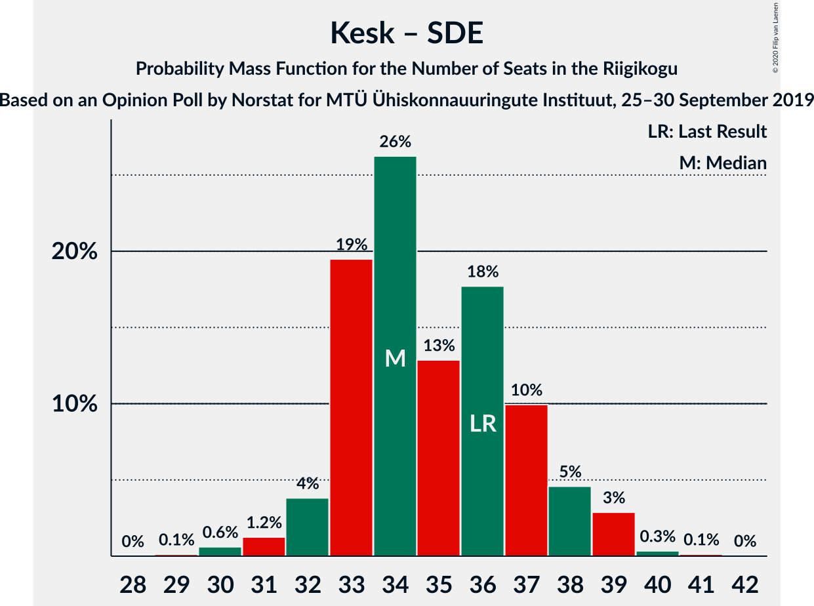

| Number of Seats | Probability | Accumulated | Special Marks |
|:---------------:|:-----------:|:-----------:|:-------------:|
| 29 | 0.1% | 100% |  |
| 30 | 0.6% | 99.9% |  |
| 31 | 1.2% | 99.3% |  |
| 32 | 4% | 98% |  |
| 33 | 19% | 94% |  |
| 34 | 26% | 75% |  |
| 35 | 13% | 48% | Median |
| 36 | 18% | 36% | Last Result |
| 37 | 10% | 18% |  |
| 38 | 5% | 8% |  |
| 39 | 3% | 3% |  |
| 40 | 0.3% | 0.5% |  |
| 41 | 0.1% | 0.2% |  |
| 42 | 0% | 0% |  |

### Eesti Konservatiivne Rahvaerakond – Sotsiaaldemokraatlik Erakond

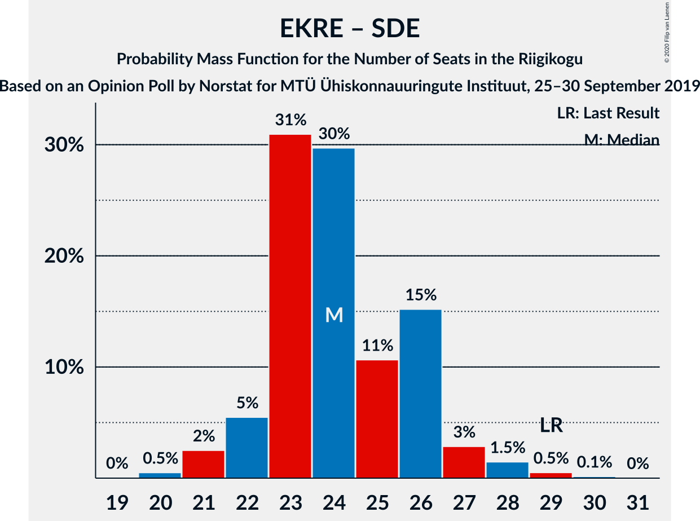

| Number of Seats | Probability | Accumulated | Special Marks |
|:---------------:|:-----------:|:-----------:|:-------------:|
| 19 | 0% | 100% |  |
| 20 | 0.5% | 99.9% |  |
| 21 | 2% | 99.5% |  |
| 22 | 5% | 97% |  |
| 23 | 31% | 91% |  |
| 24 | 30% | 61% | Median |
| 25 | 11% | 31% |  |
| 26 | 15% | 20% |  |
| 27 | 3% | 5% |  |
| 28 | 1.5% | 2% |  |
| 29 | 0.5% | 0.7% | Last Result |
| 30 | 0.1% | 0.2% |  |
| 31 | 0% | 0% |  |

## Technical Information

### Opinion Poll

+ **Polling firm:** Norstat
+ **Commissioner(s):** MTÜ Ühiskonnauuringute Instituut
+ **Fieldwork period:** 25–30 September 2019

### Calculations

+ **Sample size:** 1000
+ **Simulations done:** 131,072
+ **Error estimate:** 1.13%

