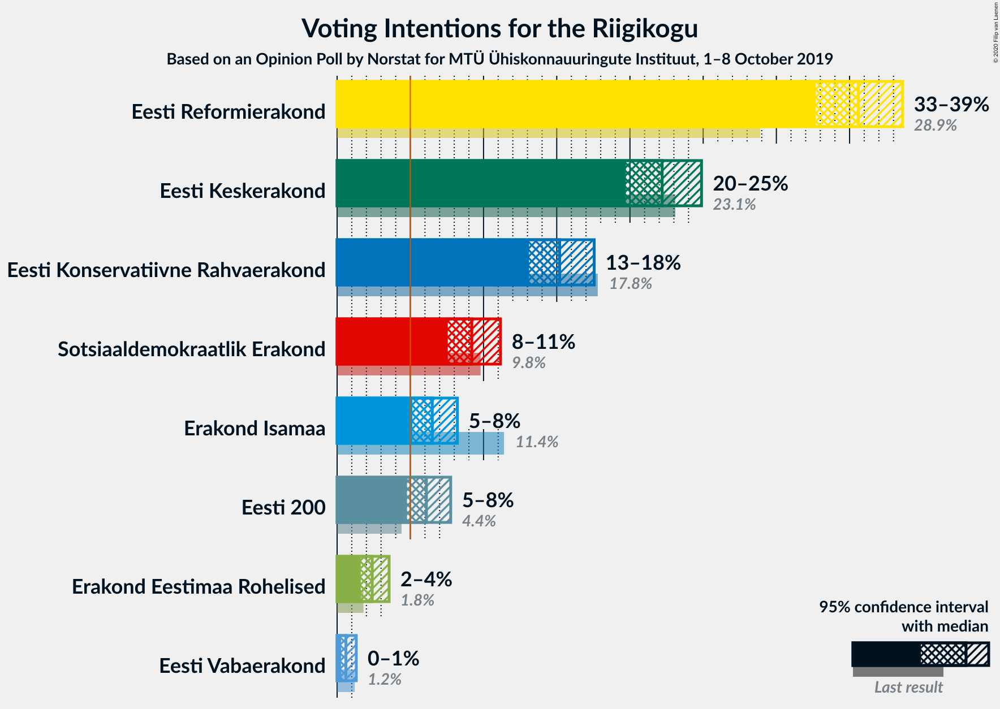
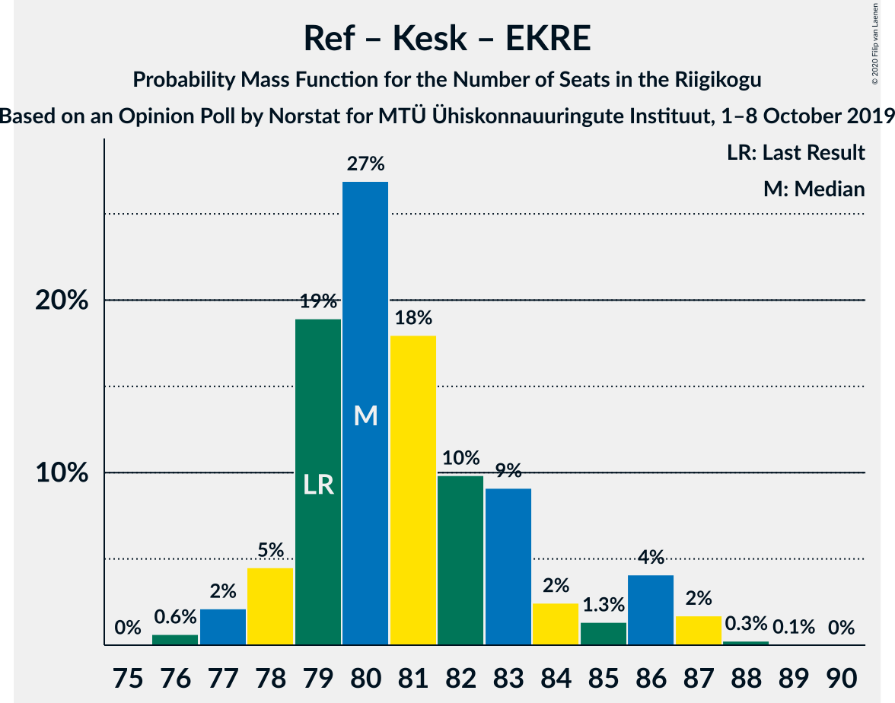
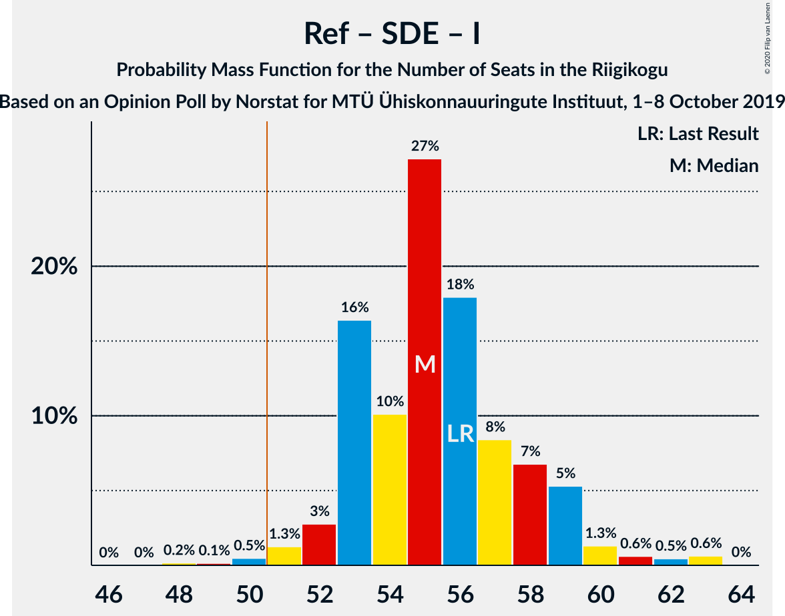

# Opinion Poll by Norstat for MTÜ Ühiskonnauuringute Instituut, 1–8 October 2019

<a href="#voting-intentions">Voting Intentions</a> | <a href="#seats">Seats</a> | <a href="#coalitions">Coalitions</a> | <a href="#technical-information">Technical Information</a>

## Voting Intentions

### Confidence Intervals

| Party | Last Result | Poll Result | 80% Confidence Interval | 90% Confidence Interval | 95% Confidence Interval | 99% Confidence Interval |
|:-----:|:-----------:|:-----------:|:-----------------------:|:-----------------------:|:-----------------------:|:-----------------------:|
| Eesti Reformierakond | 28.9% | 35.6% | 33.7–37.6% |33.2–38.1% |32.7–38.6% |31.8–39.6% |
| Eesti Keskerakond | 23.1% | 22.2% | 20.6–24.0% |20.1–24.4% |19.7–24.9% |19.0–25.7% |
| Eesti Konservatiivne Rahvaerakond | 17.8% | 15.2% | 13.8–16.8% |13.4–17.2% |13.1–17.6% |12.5–18.3% |
| Sotsiaaldemokraatlik Erakond | 9.8% | 9.2% | 8.1–10.5% |7.8–10.8% |7.6–11.2% |7.1–11.8% |
| Erakond Isamaa | 11.4% | 6.5% | 5.6–7.6% |5.3–7.9% |5.1–8.2% |4.7–8.8% |
| Eesti 200 | 4.4% | 6.1% | 5.2–7.2% |5.0–7.5% |4.8–7.8% |4.4–8.3% |
| Erakond Eestimaa Rohelised | 1.8% | 2.4% | 1.9–3.2% |1.7–3.4% |1.6–3.6% |1.4–3.9% |
| Eesti Vabaerakond | 1.2% | 0.6% | 0.4–1.1% |0.3–1.2% |0.3–1.3% |0.2–1.6% |

*Note:* The poll result column reflects the actual value used in the calculations. Published results may vary slightly, and in addition be rounded to fewer digits.

## Seats

### Confidence Intervals

| Party | Last Result | Median | 80% Confidence Interval | 90% Confidence Interval | 95% Confidence Interval | 99% Confidence Interval |
|:-----:|:-----------:|:------:|:-----------------------:|:-----------------------:|:-----------------------:|:-----------------------:|
| <a href="#eesti-reformierakond">Eesti Reformierakond</a> | 34 | 40 | 38–43 |38–45 |37–45 |37–48 |
| <a href="#eesti-keskerakond">Eesti Keskerakond</a> | 26 | 24 | 22–26 |21–27 |21–27 |20–29 |
| <a href="#eesti-konservatiivne-rahvaerakond">Eesti Konservatiivne Rahvaerakond</a> | 19 | 16 | 15–18 |14–18 |13–19 |12–19 |
| <a href="#sotsiaaldemokraatlik-erakond">Sotsiaaldemokraatlik Erakond</a> | 10 | 9 | 8–10 |7–11 |7–11 |6–12 |
| <a href="#erakond-isamaa">Erakond Isamaa</a> | 12 | 6 | 5–7 |5–8 |0–8 |0–8 |
| <a href="#eesti-200">Eesti 200</a> | 0 | 6 | 4–7 |0–7 |0–7 |0–8 |
| <a href="#erakond-eestimaa-rohelised">Erakond Eestimaa Rohelised</a> | 0 | 0 | 0 |0 |0 |0 |
| <a href="#eesti-vabaerakond">Eesti Vabaerakond</a> | 0 | 0 | 0 |0 |0 |0 |

### Eesti Reformierakond

*For a full overview of the results for this party, see the [Eesti Reformierakond](party-eestireformierakond.html) page.*

| Number of Seats | Probability | Accumulated | Special Marks |
|:---------------:|:-----------:|:-----------:|:-------------:|
| 34 | 0% | 100% | Last Result |
| 35 | 0.1% | 100% |  |
| 36 | 0.3% | 99.8% |  |
| 37 | 3% | 99.5% |  |
| 38 | 10% | 97% |  |
| 39 | 27% | 87% |  |
| 40 | 12% | 59% | Median |
| 41 | 17% | 47% |  |
| 42 | 18% | 31% |  |
| 43 | 5% | 12% |  |
| 44 | 3% | 8% |  |
| 45 | 3% | 5% |  |
| 46 | 1.3% | 2% |  |
| 47 | 0.4% | 1.1% |  |
| 48 | 0.7% | 0.8% |  |
| 49 | 0% | 0% |  |

### Eesti Keskerakond

*For a full overview of the results for this party, see the [Eesti Keskerakond](party-eestikeskerakond.html) page.*

| Number of Seats | Probability | Accumulated | Special Marks |
|:---------------:|:-----------:|:-----------:|:-------------:|
| 19 | 0.2% | 100% |  |
| 20 | 0.6% | 99.7% |  |
| 21 | 5% | 99.2% |  |
| 22 | 13% | 94% |  |
| 23 | 14% | 81% |  |
| 24 | 31% | 67% | Median |
| 25 | 14% | 36% |  |
| 26 | 14% | 21% | Last Result |
| 27 | 5% | 7% |  |
| 28 | 2% | 2% |  |
| 29 | 0.4% | 0.5% |  |
| 30 | 0.1% | 0.1% |  |
| 31 | 0% | 0% |  |

### Eesti Konservatiivne Rahvaerakond

*For a full overview of the results for this party, see the [Eesti Konservatiivne Rahvaerakond](party-eestikonservatiivnerahvaerakond.html) page.*

| Number of Seats | Probability | Accumulated | Special Marks |
|:---------------:|:-----------:|:-----------:|:-------------:|
| 11 | 0.1% | 100% |  |
| 12 | 1.0% | 99.9% |  |
| 13 | 3% | 98.9% |  |
| 14 | 5% | 96% |  |
| 15 | 9% | 90% |  |
| 16 | 40% | 81% | Median |
| 17 | 25% | 41% |  |
| 18 | 13% | 16% |  |
| 19 | 3% | 3% | Last Result |
| 20 | 0.2% | 0.4% |  |
| 21 | 0.1% | 0.1% |  |
| 22 | 0% | 0% |  |

### Sotsiaaldemokraatlik Erakond

*For a full overview of the results for this party, see the [Sotsiaaldemokraatlik Erakond](party-sotsiaaldemokraatlikerakond.html) page.*

| Number of Seats | Probability | Accumulated | Special Marks |
|:---------------:|:-----------:|:-----------:|:-------------:|
| 6 | 0.8% | 100% |  |
| 7 | 9% | 99.2% |  |
| 8 | 23% | 90% |  |
| 9 | 28% | 67% | Median |
| 10 | 32% | 39% | Last Result |
| 11 | 5% | 6% |  |
| 12 | 2% | 2% |  |
| 13 | 0.1% | 0.1% |  |
| 14 | 0% | 0% |  |

### Erakond Isamaa

*For a full overview of the results for this party, see the [Erakond Isamaa](party-erakondisamaa.html) page.*

| Number of Seats | Probability | Accumulated | Special Marks |
|:---------------:|:-----------:|:-----------:|:-------------:|
| 0 | 3% | 100% |  |
| 1 | 0% | 97% |  |
| 2 | 0% | 97% |  |
| 3 | 0% | 97% |  |
| 4 | 1.5% | 97% |  |
| 5 | 22% | 95% |  |
| 6 | 52% | 73% | Median |
| 7 | 16% | 21% |  |
| 8 | 5% | 5% |  |
| 9 | 0.2% | 0.2% |  |
| 10 | 0% | 0% |  |
| 11 | 0% | 0% |  |
| 12 | 0% | 0% | Last Result |

### Eesti 200

*For a full overview of the results for this party, see the [Eesti 200](party-eesti200.html) page.*

| Number of Seats | Probability | Accumulated | Special Marks |
|:---------------:|:-----------:|:-----------:|:-------------:|
| 0 | 6% | 100% | Last Result |
| 1 | 0% | 94% |  |
| 2 | 0% | 94% |  |
| 3 | 0% | 94% |  |
| 4 | 9% | 94% |  |
| 5 | 34% | 85% |  |
| 6 | 37% | 52% | Median |
| 7 | 13% | 15% |  |
| 8 | 1.4% | 1.4% |  |
| 9 | 0.1% | 0.1% |  |
| 10 | 0% | 0% |  |

### Erakond Eestimaa Rohelised

*For a full overview of the results for this party, see the [Erakond Eestimaa Rohelised](party-erakondeestimaarohelised.html) page.*

| Number of Seats | Probability | Accumulated | Special Marks |
|:---------------:|:-----------:|:-----------:|:-------------:|
| 0 | 100% | 100% | Last Result, Median |

### Eesti Vabaerakond

*For a full overview of the results for this party, see the [Eesti Vabaerakond](party-eestivabaerakond.html) page.*

| Number of Seats | Probability | Accumulated | Special Marks |
|:---------------:|:-----------:|:-----------:|:-------------:|
| 0 | 100% | 100% | Last Result, Median |

## Coalitions

### Confidence Intervals

| Coalition | Last Result | Median | Majority? | 80% Confidence Interval | 90% Confidence Interval | 95% Confidence Interval | 99% Confidence Interval |
|:---------:|:-----------:|:------:|:---------:|:-----------------------:|:-----------------------:|:-----------------------:|:-----------------------:|
| Eesti Reformierakond – Eesti Keskerakond – Eesti Konservatiivne Rahvaerakond | 79 | 80 | 100% | 79–83 | 78–86 | 77–86 | 76–87 |
| Eesti Reformierakond – Eesti Keskerakond | 60 | 64 | 100% | 63–68 | 63–70 | 62–71 | 61–72 |
| Eesti Reformierakond – Eesti Konservatiivne Rahvaerakond – Erakond Isamaa | 65 | 62 | 100% | 60–66 | 59–66 | 59–67 | 57–68 |
| Eesti Reformierakond – Eesti Konservatiivne Rahvaerakond | 53 | 57 | 99.9% | 54–60 | 53–60 | 53–61 | 52–62 |
| Eesti Reformierakond – Sotsiaaldemokraatlik Erakond – Erakond Isamaa – Eesti Vabaerakond | 56 | 55 | 99.2% | 53–58 | 53–59 | 52–60 | 50–63 |
| Eesti Reformierakond – Sotsiaaldemokraatlik Erakond – Erakond Isamaa | 56 | 55 | 99.2% | 53–58 | 53–59 | 52–60 | 50–63 |
| Eesti Reformierakond – Sotsiaaldemokraatlik Erakond | 44 | 49 | 25% | 47–52 | 47–53 | 46–55 | 45–57 |
| Eesti Reformierakond – Erakond Isamaa | 46 | 46 | 3% | 44–49 | 43–50 | 43–51 | 40–54 |
| Eesti Keskerakond – Eesti Konservatiivne Rahvaerakond – Erakond Isamaa | 57 | 46 | 2% | 44–49 | 43–49 | 41–50 | 40–51 |
| Eesti Keskerakond – Eesti Konservatiivne Rahvaerakond | 45 | 40 | 0% | 38–43 | 37–44 | 37–45 | 35–46 |
| Eesti Keskerakond – Sotsiaaldemokraatlik Erakond – Erakond Isamaa | 48 | 39 | 0% | 36–42 | 35–42 | 35–43 | 34–44 |
| Eesti Keskerakond – Sotsiaaldemokraatlik Erakond | 36 | 33 | 0% | 31–36 | 30–36 | 29–37 | 29–38 |
| Eesti Konservatiivne Rahvaerakond – Sotsiaaldemokraatlik Erakond | 29 | 26 | 0% | 23–27 | 22–28 | 21–28 | 20–29 |

### Eesti Reformierakond – Eesti Keskerakond – Eesti Konservatiivne Rahvaerakond

| Number of Seats | Probability | Accumulated | Special Marks |
|:---------------:|:-----------:|:-----------:|:-------------:|
| 76 | 0.6% | 100% |  |
| 77 | 2% | 99.3% |  |
| 78 | 5% | 97% |  |
| 79 | 19% | 93% | Last Result |
| 80 | 27% | 74% | Median |
| 81 | 18% | 47% |  |
| 82 | 10% | 29% |  |
| 83 | 9% | 19% |  |
| 84 | 2% | 10% |  |
| 85 | 1.3% | 7% |  |
| 86 | 4% | 6% |  |
| 87 | 2% | 2% |  |
| 88 | 0.3% | 0.3% |  |
| 89 | 0.1% | 0.1% |  |
| 90 | 0% | 0% |  |

### Eesti Reformierakond – Eesti Keskerakond

| Number of Seats | Probability | Accumulated | Special Marks |
|:---------------:|:-----------:|:-----------:|:-------------:|
| 59 | 0.2% | 100% |  |
| 60 | 0.2% | 99.8% | Last Result |
| 61 | 0.9% | 99.6% |  |
| 62 | 4% | 98.7% |  |
| 63 | 34% | 95% |  |
| 64 | 23% | 61% | Median |
| 65 | 20% | 38% |  |
| 66 | 3% | 18% |  |
| 67 | 2% | 15% |  |
| 68 | 4% | 13% |  |
| 69 | 3% | 8% |  |
| 70 | 2% | 5% |  |
| 71 | 2% | 3% |  |
| 72 | 0.8% | 1.1% |  |
| 73 | 0.3% | 0.3% |  |
| 74 | 0% | 0.1% |  |
| 75 | 0% | 0% |  |

### Eesti Reformierakond – Eesti Konservatiivne Rahvaerakond – Erakond Isamaa

| Number of Seats | Probability | Accumulated | Special Marks |
|:---------------:|:-----------:|:-----------:|:-------------:|
| 56 | 0.1% | 100% |  |
| 57 | 0.4% | 99.8% |  |
| 58 | 0.6% | 99.4% |  |
| 59 | 4% | 98.8% |  |
| 60 | 15% | 95% |  |
| 61 | 20% | 80% |  |
| 62 | 13% | 60% | Median |
| 63 | 8% | 47% |  |
| 64 | 17% | 40% |  |
| 65 | 12% | 23% | Last Result |
| 66 | 7% | 10% |  |
| 67 | 1.3% | 3% |  |
| 68 | 1.5% | 2% |  |
| 69 | 0.2% | 0.3% |  |
| 70 | 0% | 0.1% |  |
| 71 | 0.1% | 0.1% |  |
| 72 | 0% | 0% |  |

### Eesti Reformierakond – Eesti Konservatiivne Rahvaerakond

| Number of Seats | Probability | Accumulated | Special Marks |
|:---------------:|:-----------:|:-----------:|:-------------:|
| 50 | 0% | 100% |  |
| 51 | 0.2% | 99.9% | Majority |
| 52 | 1.3% | 99.7% |  |
| 53 | 4% | 98% | Last Result |
| 54 | 10% | 94% |  |
| 55 | 21% | 84% |  |
| 56 | 12% | 63% | Median |
| 57 | 9% | 52% |  |
| 58 | 24% | 43% |  |
| 59 | 5% | 19% |  |
| 60 | 10% | 14% |  |
| 61 | 2% | 4% |  |
| 62 | 2% | 2% |  |
| 63 | 0.2% | 0.4% |  |
| 64 | 0.1% | 0.2% |  |
| 65 | 0% | 0.1% |  |
| 66 | 0% | 0% |  |

### Eesti Reformierakond – Sotsiaaldemokraatlik Erakond – Erakond Isamaa – Eesti Vabaerakond

| Number of Seats | Probability | Accumulated | Special Marks |
|:---------------:|:-----------:|:-----------:|:-------------:|
| 48 | 0.2% | 100% |  |
| 49 | 0.1% | 99.8% |  |
| 50 | 0.5% | 99.7% |  |
| 51 | 1.3% | 99.2% | Majority |
| 52 | 3% | 98% |  |
| 53 | 16% | 95% |  |
| 54 | 10% | 79% |  |
| 55 | 27% | 69% | Median |
| 56 | 18% | 41% | Last Result |
| 57 | 8% | 24% |  |
| 58 | 7% | 15% |  |
| 59 | 5% | 8% |  |
| 60 | 1.3% | 3% |  |
| 61 | 0.6% | 2% |  |
| 62 | 0.5% | 1.1% |  |
| 63 | 0.6% | 0.7% |  |
| 64 | 0% | 0% |  |

### Eesti Reformierakond – Sotsiaaldemokraatlik Erakond – Erakond Isamaa

| Number of Seats | Probability | Accumulated | Special Marks |
|:---------------:|:-----------:|:-----------:|:-------------:|
| 48 | 0.2% | 100% |  |
| 49 | 0.1% | 99.8% |  |
| 50 | 0.5% | 99.7% |  |
| 51 | 1.3% | 99.2% | Majority |
| 52 | 3% | 98% |  |
| 53 | 16% | 95% |  |
| 54 | 10% | 79% |  |
| 55 | 27% | 69% | Median |
| 56 | 18% | 41% | Last Result |
| 57 | 8% | 24% |  |
| 58 | 7% | 15% |  |
| 59 | 5% | 8% |  |
| 60 | 1.3% | 3% |  |
| 61 | 0.6% | 2% |  |
| 62 | 0.5% | 1.1% |  |
| 63 | 0.6% | 0.7% |  |
| 64 | 0% | 0% |  |

### Eesti Reformierakond – Sotsiaaldemokraatlik Erakond

| Number of Seats | Probability | Accumulated | Special Marks |
|:---------------:|:-----------:|:-----------:|:-------------:|
| 44 | 0.1% | 100% | Last Result |
| 45 | 0.6% | 99.8% |  |
| 46 | 4% | 99.2% |  |
| 47 | 9% | 96% |  |
| 48 | 17% | 87% |  |
| 49 | 26% | 70% | Median |
| 50 | 18% | 43% |  |
| 51 | 10% | 25% | Majority |
| 52 | 7% | 15% |  |
| 53 | 3% | 8% |  |
| 54 | 0.9% | 5% |  |
| 55 | 2% | 4% |  |
| 56 | 0.5% | 1.3% |  |
| 57 | 0.7% | 0.8% |  |
| 58 | 0% | 0% |  |

### Eesti Reformierakond – Erakond Isamaa

| Number of Seats | Probability | Accumulated | Special Marks |
|:---------------:|:-----------:|:-----------:|:-------------:|
| 39 | 0.1% | 100% |  |
| 40 | 0.4% | 99.9% |  |
| 41 | 0.5% | 99.5% |  |
| 42 | 0.5% | 99.0% |  |
| 43 | 4% | 98.5% |  |
| 44 | 13% | 95% |  |
| 45 | 26% | 81% |  |
| 46 | 10% | 55% | Last Result, Median |
| 47 | 18% | 45% |  |
| 48 | 8% | 26% |  |
| 49 | 11% | 18% |  |
| 50 | 4% | 7% |  |
| 51 | 1.0% | 3% | Majority |
| 52 | 1.3% | 2% |  |
| 53 | 0.3% | 1.0% |  |
| 54 | 0.6% | 0.7% |  |
| 55 | 0% | 0% |  |

### Eesti Keskerakond – Eesti Konservatiivne Rahvaerakond – Erakond Isamaa

| Number of Seats | Probability | Accumulated | Special Marks |
|:---------------:|:-----------:|:-----------:|:-------------:|
| 39 | 0.1% | 100% |  |
| 40 | 0.6% | 99.9% |  |
| 41 | 2% | 99.2% |  |
| 42 | 2% | 97% |  |
| 43 | 4% | 96% |  |
| 44 | 6% | 92% |  |
| 45 | 18% | 86% |  |
| 46 | 31% | 68% | Median |
| 47 | 14% | 37% |  |
| 48 | 11% | 23% |  |
| 49 | 8% | 12% |  |
| 50 | 2% | 4% |  |
| 51 | 2% | 2% | Majority |
| 52 | 0.1% | 0.3% |  |
| 53 | 0.2% | 0.2% |  |
| 54 | 0% | 0% |  |
| 55 | 0% | 0% |  |
| 56 | 0% | 0% |  |
| 57 | 0% | 0% | Last Result |

### Eesti Keskerakond – Eesti Konservatiivne Rahvaerakond

| Number of Seats | Probability | Accumulated | Special Marks |
|:---------------:|:-----------:|:-----------:|:-------------:|
| 34 | 0.1% | 100% |  |
| 35 | 0.4% | 99.9% |  |
| 36 | 2% | 99.5% |  |
| 37 | 3% | 98% |  |
| 38 | 8% | 95% |  |
| 39 | 21% | 87% |  |
| 40 | 22% | 66% | Median |
| 41 | 20% | 44% |  |
| 42 | 12% | 24% |  |
| 43 | 7% | 12% |  |
| 44 | 2% | 5% |  |
| 45 | 2% | 3% | Last Result |
| 46 | 0.5% | 0.7% |  |
| 47 | 0.2% | 0.2% |  |
| 48 | 0% | 0% |  |

### Eesti Keskerakond – Sotsiaaldemokraatlik Erakond – Erakond Isamaa

| Number of Seats | Probability | Accumulated | Special Marks |
|:---------------:|:-----------:|:-----------:|:-------------:|
| 32 | 0.1% | 100% |  |
| 33 | 0.2% | 99.9% |  |
| 34 | 0.5% | 99.6% |  |
| 35 | 5% | 99.1% |  |
| 36 | 7% | 94% |  |
| 37 | 12% | 87% |  |
| 38 | 17% | 75% |  |
| 39 | 17% | 58% | Median |
| 40 | 20% | 41% |  |
| 41 | 7% | 21% |  |
| 42 | 10% | 14% |  |
| 43 | 3% | 4% |  |
| 44 | 0.5% | 0.7% |  |
| 45 | 0.1% | 0.2% |  |
| 46 | 0% | 0.1% |  |
| 47 | 0% | 0% |  |
| 48 | 0% | 0% | Last Result |

### Eesti Keskerakond – Sotsiaaldemokraatlik Erakond

| Number of Seats | Probability | Accumulated | Special Marks |
|:---------------:|:-----------:|:-----------:|:-------------:|
| 27 | 0.1% | 100% |  |
| 28 | 0.2% | 99.9% |  |
| 29 | 4% | 99.7% |  |
| 30 | 3% | 96% |  |
| 31 | 13% | 93% |  |
| 32 | 26% | 80% |  |
| 33 | 8% | 55% | Median |
| 34 | 26% | 47% |  |
| 35 | 6% | 21% |  |
| 36 | 12% | 15% | Last Result |
| 37 | 2% | 3% |  |
| 38 | 1.1% | 1.3% |  |
| 39 | 0.2% | 0.2% |  |
| 40 | 0% | 0.1% |  |
| 41 | 0% | 0% |  |

### Eesti Konservatiivne Rahvaerakond – Sotsiaaldemokraatlik Erakond

| Number of Seats | Probability | Accumulated | Special Marks |
|:---------------:|:-----------:|:-----------:|:-------------:|
| 19 | 0.1% | 100% |  |
| 20 | 1.1% | 99.9% |  |
| 21 | 2% | 98.8% |  |
| 22 | 4% | 97% |  |
| 23 | 3% | 92% |  |
| 24 | 8% | 89% |  |
| 25 | 28% | 81% | Median |
| 26 | 41% | 53% |  |
| 27 | 6% | 11% |  |
| 28 | 3% | 5% |  |
| 29 | 2% | 2% | Last Result |
| 30 | 0.1% | 0.2% |  |
| 31 | 0% | 0% |  |

## Technical Information

### Opinion Poll

+ **Polling firm:** Norstat
+ **Commissioner(s):** MTÜ Ühiskonnauuringute Instituut
+ **Fieldwork period:** 1–8 October 2019

### Calculations

+ **Sample size:** 1000
+ **Simulations done:** 131,072
+ **Error estimate:** 3.31%

