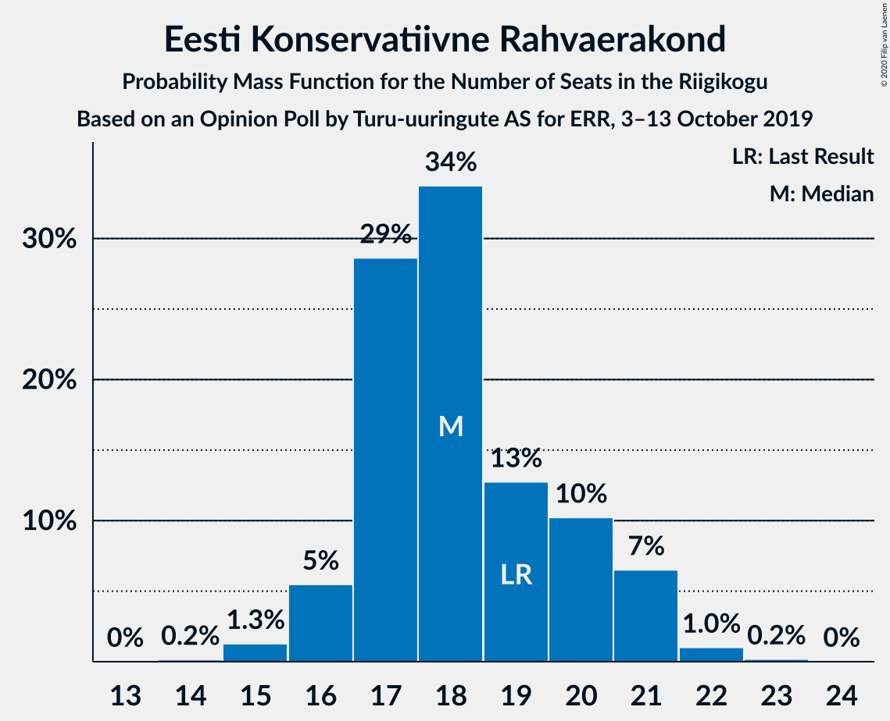

# Opinion Poll by Turu-uuringute AS for ERR, 3–13 October 2019

<a href="#voting-intentions">Voting Intentions</a> | <a href="#seats">Seats</a> | <a href="#coalitions">Coalitions</a> | <a href="#technical-information">Technical Information</a>

## Voting Intentions

### Confidence Intervals

| Party | Last Result | Poll Result | 80% Confidence Interval | 90% Confidence Interval | 95% Confidence Interval | 99% Confidence Interval |
|:-----:|:-----------:|:-----------:|:-----------------------:|:-----------------------:|:-----------------------:|:-----------------------:|
| Eesti Reformierakond | 28.9% | 32.0% | 30.2–33.9% |29.7–34.5% |29.2–34.9% |28.4–35.8% |
| Eesti Keskerakond | 23.1% | 22.0% | 20.4–23.7% |20.0–24.2% |19.6–24.6% |18.9–25.5% |
| Eesti Konservatiivne Rahvaerakond | 17.8% | 17.0% | 15.6–18.6% |15.2–19.0% |14.9–19.4% |14.2–20.2% |
| Sotsiaaldemokraatlik Erakond | 9.8% | 9.0% | 8.0–10.3% |7.7–10.6% |7.4–10.9% |7.0–11.6% |
| Eesti 200 | 4.4% | 7.0% | 6.1–8.1% |5.8–8.5% |5.6–8.7% |5.2–9.3% |
| Erakond Isamaa | 11.4% | 6.0% | 5.1–7.0% |4.9–7.3% |4.7–7.6% |4.3–8.1% |
| Erakond Eestimaa Rohelised | 1.8% | 3.0% | 2.4–3.8% |2.2–4.0% |2.1–4.2% |1.9–4.6% |
| Eesti Vabaerakond | 1.2% | 1.0% | 0.7–1.5% |0.6–1.6% |0.5–1.8% |0.4–2.1% |

*Note:* The poll result column reflects the actual value used in the calculations. Published results may vary slightly, and in addition be rounded to fewer digits.

## Seats

### Confidence Intervals

| Party | Last Result | Median | 80% Confidence Interval | 90% Confidence Interval | 95% Confidence Interval | 99% Confidence Interval |
|:-----:|:-----------:|:------:|:-----------------------:|:-----------------------:|:-----------------------:|:-----------------------:|
| <a href="#eesti-reformierakond">Eesti Reformierakond</a> | 34 | 38 | 35–40 |34–40 |34–41 |33–42 |
| <a href="#eesti-keskerakond">Eesti Keskerakond</a> | 26 | 24 | 23–27 |22–27 |22–28 |21–29 |
| <a href="#eesti-konservatiivne-rahvaerakond">Eesti Konservatiivne Rahvaerakond</a> | 19 | 18 | 17–20 |16–21 |16–21 |15–22 |
| <a href="#sotsiaaldemokraatlik-erakond">Sotsiaaldemokraatlik Erakond</a> | 10 | 9 | 7–10 |7–11 |7–11 |7–12 |
| <a href="#eesti-200">Eesti 200</a> | 0 | 7 | 6–8 |6–8 |5–8 |5–9 |
| <a href="#erakond-isamaa">Erakond Isamaa</a> | 12 | 5 | 5–6 |0–7 |0–7 |0–8 |
| <a href="#erakond-eestimaa-rohelised">Erakond Eestimaa Rohelised</a> | 0 | 0 | 0 |0 |0 |0 |
| <a href="#eesti-vabaerakond">Eesti Vabaerakond</a> | 0 | 0 | 0 |0 |0 |0 |

### Eesti Reformierakond

*For a full overview of the results for this party, see the [Eesti Reformierakond](party-eestireformierakond.html) page.*

| Number of Seats | Probability | Accumulated | Special Marks |
|:---------------:|:-----------:|:-----------:|:-------------:|
| 32 | 0.2% | 100% |  |
| 33 | 2% | 99.8% |  |
| 34 | 4% | 98% | Last Result |
| 35 | 9% | 94% |  |
| 36 | 12% | 85% |  |
| 37 | 18% | 73% |  |
| 38 | 30% | 55% | Median |
| 39 | 6% | 25% |  |
| 40 | 16% | 19% |  |
| 41 | 1.4% | 3% |  |
| 42 | 1.3% | 2% |  |
| 43 | 0.1% | 0.2% |  |
| 44 | 0% | 0.1% |  |
| 45 | 0.1% | 0.1% |  |
| 46 | 0% | 0% |  |

### Eesti Keskerakond

*For a full overview of the results for this party, see the [Eesti Keskerakond](party-eestikeskerakond.html) page.*

| Number of Seats | Probability | Accumulated | Special Marks |
|:---------------:|:-----------:|:-----------:|:-------------:|
| 20 | 0.3% | 100% |  |
| 21 | 2% | 99.7% |  |
| 22 | 6% | 98% |  |
| 23 | 14% | 92% |  |
| 24 | 35% | 78% | Median |
| 25 | 24% | 43% |  |
| 26 | 8% | 19% | Last Result |
| 27 | 9% | 12% |  |
| 28 | 2% | 3% |  |
| 29 | 0.5% | 0.7% |  |
| 30 | 0.1% | 0.1% |  |
| 31 | 0% | 0% |  |

### Eesti Konservatiivne Rahvaerakond

*For a full overview of the results for this party, see the [Eesti Konservatiivne Rahvaerakond](party-eestikonservatiivnerahvaerakond.html) page.*

| Number of Seats | Probability | Accumulated | Special Marks |
|:---------------:|:-----------:|:-----------:|:-------------:|
| 14 | 0.2% | 100% |  |
| 15 | 1.3% | 99.8% |  |
| 16 | 5% | 98.6% |  |
| 17 | 29% | 93% |  |
| 18 | 34% | 64% | Median |
| 19 | 13% | 31% | Last Result |
| 20 | 10% | 18% |  |
| 21 | 7% | 8% |  |
| 22 | 1.0% | 1.2% |  |
| 23 | 0.2% | 0.2% |  |
| 24 | 0% | 0% |  |

### Sotsiaaldemokraatlik Erakond

*For a full overview of the results for this party, see the [Sotsiaaldemokraatlik Erakond](party-sotsiaaldemokraatlikerakond.html) page.*

| Number of Seats | Probability | Accumulated | Special Marks |
|:---------------:|:-----------:|:-----------:|:-------------:|
| 6 | 0.3% | 100% |  |
| 7 | 10% | 99.7% |  |
| 8 | 14% | 90% |  |
| 9 | 51% | 76% | Median |
| 10 | 20% | 25% | Last Result |
| 11 | 4% | 5% |  |
| 12 | 0.6% | 0.7% |  |
| 13 | 0.1% | 0.1% |  |
| 14 | 0% | 0% |  |

### Eesti 200

*For a full overview of the results for this party, see the [Eesti 200](party-eesti200.html) page.*

| Number of Seats | Probability | Accumulated | Special Marks |
|:---------------:|:-----------:|:-----------:|:-------------:|
| 0 | 0.2% | 100% | Last Result |
| 1 | 0% | 99.8% |  |
| 2 | 0% | 99.8% |  |
| 3 | 0% | 99.8% |  |
| 4 | 0.1% | 99.8% |  |
| 5 | 4% | 99.8% |  |
| 6 | 33% | 95% |  |
| 7 | 51% | 62% | Median |
| 8 | 9% | 11% |  |
| 9 | 2% | 2% |  |
| 10 | 0.2% | 0.2% |  |
| 11 | 0% | 0% |  |

### Erakond Isamaa

*For a full overview of the results for this party, see the [Erakond Isamaa](party-erakondisamaa.html) page.*

| Number of Seats | Probability | Accumulated | Special Marks |
|:---------------:|:-----------:|:-----------:|:-------------:|
| 0 | 5% | 100% |  |
| 1 | 0% | 95% |  |
| 2 | 0% | 95% |  |
| 3 | 0% | 95% |  |
| 4 | 4% | 95% |  |
| 5 | 48% | 90% | Median |
| 6 | 35% | 43% |  |
| 7 | 7% | 8% |  |
| 8 | 0.7% | 0.7% |  |
| 9 | 0% | 0% |  |
| 10 | 0% | 0% |  |
| 11 | 0% | 0% |  |
| 12 | 0% | 0% | Last Result |

### Erakond Eestimaa Rohelised

*For a full overview of the results for this party, see the [Erakond Eestimaa Rohelised](party-erakondeestimaarohelised.html) page.*

| Number of Seats | Probability | Accumulated | Special Marks |
|:---------------:|:-----------:|:-----------:|:-------------:|
| 0 | 99.9% | 100% | Last Result, Median |
| 1 | 0% | 0.1% |  |
| 2 | 0% | 0.1% |  |
| 3 | 0% | 0.1% |  |
| 4 | 0.1% | 0.1% |  |
| 5 | 0% | 0% |  |

### Eesti Vabaerakond

*For a full overview of the results for this party, see the [Eesti Vabaerakond](party-eestivabaerakond.html) page.*

| Number of Seats | Probability | Accumulated | Special Marks |
|:---------------:|:-----------:|:-----------:|:-------------:|
| 0 | 100% | 100% | Last Result, Median |

## Coalitions

### Confidence Intervals

| Coalition | Last Result | Median | Majority? | 80% Confidence Interval | 90% Confidence Interval | 95% Confidence Interval | 99% Confidence Interval |
|:---------:|:-----------:|:------:|:---------:|:-----------------------:|:-----------------------:|:-----------------------:|:-----------------------:|
| Eesti Reformierakond – Eesti Keskerakond – Eesti Konservatiivne Rahvaerakond | 79 | 80 | 100% | 78–82 | 78–83 | 77–85 | 76–86 |
| Eesti Reformierakond – Eesti Keskerakond | 60 | 62 | 100% | 60–64 | 59–65 | 59–66 | 57–68 |
| Eesti Reformierakond – Eesti Konservatiivne Rahvaerakond – Erakond Isamaa | 65 | 60 | 100% | 59–63 | 58–64 | 57–65 | 56–66 |
| Eesti Reformierakond – Eesti Konservatiivne Rahvaerakond | 53 | 55 | 99.5% | 54–58 | 53–59 | 52–60 | 50–61 |
| Eesti Reformierakond – Sotsiaaldemokraatlik Erakond – Erakond Isamaa – Eesti Vabaerakond | 56 | 52 | 76% | 48–54 | 48–54 | 47–55 | 46–56 |
| Eesti Reformierakond – Sotsiaaldemokraatlik Erakond – Erakond Isamaa | 56 | 52 | 76% | 48–54 | 48–54 | 47–55 | 46–56 |
| Eesti Keskerakond – Eesti Konservatiivne Rahvaerakond – Erakond Isamaa | 57 | 48 | 12% | 46–51 | 45–52 | 45–52 | 43–53 |
| Eesti Reformierakond – Sotsiaaldemokraatlik Erakond | 44 | 47 | 1.3% | 43–49 | 43–49 | 42–50 | 42–52 |
| Eesti Keskerakond – Eesti Konservatiivne Rahvaerakond | 45 | 42 | 0% | 41–46 | 40–47 | 39–47 | 38–48 |
| Eesti Reformierakond – Erakond Isamaa | 46 | 43 | 0% | 40–46 | 39–46 | 38–46 | 36–48 |
| Eesti Keskerakond – Sotsiaaldemokraatlik Erakond – Erakond Isamaa | 48 | 39 | 0% | 37–41 | 35–42 | 34–43 | 33–44 |
| Eesti Keskerakond – Sotsiaaldemokraatlik Erakond | 36 | 33 | 0% | 31–35 | 31–36 | 30–37 | 29–38 |
| Eesti Konservatiivne Rahvaerakond – Sotsiaaldemokraatlik Erakond | 29 | 27 | 0% | 25–30 | 25–30 | 24–30 | 24–32 |

### Eesti Reformierakond – Eesti Keskerakond – Eesti Konservatiivne Rahvaerakond

| Number of Seats | Probability | Accumulated | Special Marks |
|:---------------:|:-----------:|:-----------:|:-------------:|
| 75 | 0.2% | 100% |  |
| 76 | 0.4% | 99.8% |  |
| 77 | 2% | 99.4% |  |
| 78 | 9% | 97% |  |
| 79 | 30% | 88% | Last Result |
| 80 | 24% | 58% | Median |
| 81 | 14% | 34% |  |
| 82 | 13% | 20% |  |
| 83 | 2% | 6% |  |
| 84 | 1.2% | 5% |  |
| 85 | 2% | 4% |  |
| 86 | 0.9% | 1.1% |  |
| 87 | 0.1% | 0.2% |  |
| 88 | 0.1% | 0.1% |  |
| 89 | 0% | 0% |  |

### Eesti Reformierakond – Eesti Keskerakond

| Number of Seats | Probability | Accumulated | Special Marks |
|:---------------:|:-----------:|:-----------:|:-------------:|
| 56 | 0.1% | 100% |  |
| 57 | 0.5% | 99.8% |  |
| 58 | 2% | 99.3% |  |
| 59 | 7% | 98% |  |
| 60 | 11% | 91% | Last Result |
| 61 | 20% | 80% |  |
| 62 | 16% | 60% | Median |
| 63 | 28% | 44% |  |
| 64 | 10% | 16% |  |
| 65 | 2% | 6% |  |
| 66 | 3% | 4% |  |
| 67 | 0.3% | 1.0% |  |
| 68 | 0.6% | 0.7% |  |
| 69 | 0.1% | 0.1% |  |
| 70 | 0% | 0% |  |

### Eesti Reformierakond – Eesti Konservatiivne Rahvaerakond – Erakond Isamaa

| Number of Seats | Probability | Accumulated | Special Marks |
|:---------------:|:-----------:|:-----------:|:-------------:|
| 54 | 0.1% | 100% |  |
| 55 | 0.3% | 99.9% |  |
| 56 | 1.2% | 99.6% |  |
| 57 | 2% | 98% |  |
| 58 | 4% | 97% |  |
| 59 | 9% | 93% |  |
| 60 | 35% | 84% |  |
| 61 | 17% | 49% | Median |
| 62 | 8% | 32% |  |
| 63 | 13% | 23% |  |
| 64 | 7% | 10% |  |
| 65 | 2% | 3% | Last Result |
| 66 | 0.5% | 0.6% |  |
| 67 | 0.1% | 0.1% |  |
| 68 | 0% | 0% |  |

### Eesti Reformierakond – Eesti Konservatiivne Rahvaerakond

| Number of Seats | Probability | Accumulated | Special Marks |
|:---------------:|:-----------:|:-----------:|:-------------:|
| 50 | 0.5% | 100% |  |
| 51 | 2% | 99.5% | Majority |
| 52 | 2% | 98% |  |
| 53 | 4% | 96% | Last Result |
| 54 | 10% | 92% |  |
| 55 | 43% | 82% |  |
| 56 | 8% | 39% | Median |
| 57 | 11% | 31% |  |
| 58 | 13% | 20% |  |
| 59 | 3% | 7% |  |
| 60 | 2% | 3% |  |
| 61 | 0.7% | 1.2% |  |
| 62 | 0.4% | 0.4% |  |
| 63 | 0% | 0.1% |  |
| 64 | 0% | 0% |  |

### Eesti Reformierakond – Sotsiaaldemokraatlik Erakond – Erakond Isamaa – Eesti Vabaerakond

| Number of Seats | Probability | Accumulated | Special Marks |
|:---------------:|:-----------:|:-----------:|:-------------:|
| 45 | 0.3% | 100% |  |
| 46 | 0.4% | 99.6% |  |
| 47 | 2% | 99.2% |  |
| 48 | 7% | 97% |  |
| 49 | 3% | 89% |  |
| 50 | 10% | 86% |  |
| 51 | 6% | 76% | Majority |
| 52 | 37% | 70% | Median |
| 53 | 16% | 32% |  |
| 54 | 13% | 17% |  |
| 55 | 3% | 4% |  |
| 56 | 0.7% | 0.9% | Last Result |
| 57 | 0.2% | 0.2% |  |
| 58 | 0.1% | 0.1% |  |
| 59 | 0% | 0% |  |

### Eesti Reformierakond – Sotsiaaldemokraatlik Erakond – Erakond Isamaa

| Number of Seats | Probability | Accumulated | Special Marks |
|:---------------:|:-----------:|:-----------:|:-------------:|
| 45 | 0.3% | 100% |  |
| 46 | 0.4% | 99.6% |  |
| 47 | 2% | 99.2% |  |
| 48 | 7% | 97% |  |
| 49 | 3% | 89% |  |
| 50 | 10% | 86% |  |
| 51 | 6% | 76% | Majority |
| 52 | 37% | 70% | Median |
| 53 | 16% | 32% |  |
| 54 | 13% | 17% |  |
| 55 | 3% | 4% |  |
| 56 | 0.7% | 0.9% | Last Result |
| 57 | 0.2% | 0.2% |  |
| 58 | 0.1% | 0.1% |  |
| 59 | 0% | 0% |  |

### Eesti Keskerakond – Eesti Konservatiivne Rahvaerakond – Erakond Isamaa

| Number of Seats | Probability | Accumulated | Special Marks |
|:---------------:|:-----------:|:-----------:|:-------------:|
| 41 | 0.2% | 100% |  |
| 42 | 0.1% | 99.8% |  |
| 43 | 0.8% | 99.7% |  |
| 44 | 1.3% | 98.9% |  |
| 45 | 7% | 98% |  |
| 46 | 15% | 91% |  |
| 47 | 24% | 76% | Median |
| 48 | 28% | 52% |  |
| 49 | 4% | 24% |  |
| 50 | 7% | 20% |  |
| 51 | 6% | 12% | Majority |
| 52 | 6% | 6% |  |
| 53 | 0.6% | 0.8% |  |
| 54 | 0.1% | 0.2% |  |
| 55 | 0% | 0.1% |  |
| 56 | 0% | 0% |  |
| 57 | 0% | 0% | Last Result |

### Eesti Reformierakond – Sotsiaaldemokraatlik Erakond

| Number of Seats | Probability | Accumulated | Special Marks |
|:---------------:|:-----------:|:-----------:|:-------------:|
| 40 | 0.1% | 100% |  |
| 41 | 0.4% | 99.9% |  |
| 42 | 3% | 99.5% |  |
| 43 | 8% | 97% |  |
| 44 | 4% | 89% | Last Result |
| 45 | 8% | 85% |  |
| 46 | 19% | 77% |  |
| 47 | 29% | 58% | Median |
| 48 | 17% | 29% |  |
| 49 | 9% | 12% |  |
| 50 | 2% | 3% |  |
| 51 | 0.6% | 1.3% | Majority |
| 52 | 0.6% | 0.7% |  |
| 53 | 0.1% | 0.1% |  |
| 54 | 0.1% | 0.1% |  |
| 55 | 0% | 0% |  |

### Eesti Keskerakond – Eesti Konservatiivne Rahvaerakond

| Number of Seats | Probability | Accumulated | Special Marks |
|:---------------:|:-----------:|:-----------:|:-------------:|
| 37 | 0.1% | 100% |  |
| 38 | 0.9% | 99.9% |  |
| 39 | 2% | 99.0% |  |
| 40 | 2% | 97% |  |
| 41 | 22% | 95% |  |
| 42 | 39% | 73% | Median |
| 43 | 10% | 34% |  |
| 44 | 6% | 24% |  |
| 45 | 8% | 18% | Last Result |
| 46 | 3% | 10% |  |
| 47 | 7% | 7% |  |
| 48 | 0.4% | 0.7% |  |
| 49 | 0.3% | 0.3% |  |
| 50 | 0% | 0.1% |  |
| 51 | 0% | 0% | Majority |

### Eesti Reformierakond – Erakond Isamaa

| Number of Seats | Probability | Accumulated | Special Marks |
|:---------------:|:-----------:|:-----------:|:-------------:|
| 35 | 0.2% | 100% |  |
| 36 | 0.3% | 99.7% |  |
| 37 | 0.5% | 99.5% |  |
| 38 | 3% | 99.0% |  |
| 39 | 3% | 96% |  |
| 40 | 6% | 94% |  |
| 41 | 14% | 87% |  |
| 42 | 6% | 74% |  |
| 43 | 40% | 67% | Median |
| 44 | 8% | 27% |  |
| 45 | 9% | 19% |  |
| 46 | 9% | 10% | Last Result |
| 47 | 0.4% | 1.0% |  |
| 48 | 0.5% | 0.6% |  |
| 49 | 0.1% | 0.1% |  |
| 50 | 0% | 0% |  |

### Eesti Keskerakond – Sotsiaaldemokraatlik Erakond – Erakond Isamaa

| Number of Seats | Probability | Accumulated | Special Marks |
|:---------------:|:-----------:|:-----------:|:-------------:|
| 31 | 0.1% | 100% |  |
| 32 | 0.1% | 99.9% |  |
| 33 | 0.7% | 99.8% |  |
| 34 | 2% | 99.1% |  |
| 35 | 3% | 97% |  |
| 36 | 3% | 94% |  |
| 37 | 18% | 91% |  |
| 38 | 12% | 74% | Median |
| 39 | 38% | 62% |  |
| 40 | 13% | 24% |  |
| 41 | 6% | 11% |  |
| 42 | 2% | 5% |  |
| 43 | 2% | 3% |  |
| 44 | 0.6% | 0.7% |  |
| 45 | 0.1% | 0.1% |  |
| 46 | 0% | 0% |  |
| 47 | 0% | 0% |  |
| 48 | 0% | 0% | Last Result |

### Eesti Keskerakond – Sotsiaaldemokraatlik Erakond

| Number of Seats | Probability | Accumulated | Special Marks |
|:---------------:|:-----------:|:-----------:|:-------------:|
| 28 | 0.1% | 100% |  |
| 29 | 1.3% | 99.9% |  |
| 30 | 2% | 98.6% |  |
| 31 | 9% | 97% |  |
| 32 | 15% | 88% |  |
| 33 | 24% | 73% | Median |
| 34 | 27% | 49% |  |
| 35 | 13% | 21% |  |
| 36 | 5% | 9% | Last Result |
| 37 | 2% | 4% |  |
| 38 | 1.4% | 2% |  |
| 39 | 0.3% | 0.4% |  |
| 40 | 0.1% | 0.1% |  |
| 41 | 0% | 0% |  |

### Eesti Konservatiivne Rahvaerakond – Sotsiaaldemokraatlik Erakond

| Number of Seats | Probability | Accumulated | Special Marks |
|:---------------:|:-----------:|:-----------:|:-------------:|
| 22 | 0.1% | 100% |  |
| 23 | 0.4% | 99.9% |  |
| 24 | 2% | 99.5% |  |
| 25 | 12% | 97% |  |
| 26 | 22% | 85% |  |
| 27 | 30% | 63% | Median |
| 28 | 15% | 33% |  |
| 29 | 8% | 18% | Last Result |
| 30 | 8% | 10% |  |
| 31 | 1.0% | 2% |  |
| 32 | 0.9% | 1.0% |  |
| 33 | 0.1% | 0.1% |  |
| 34 | 0% | 0% |  |

## Technical Information

### Opinion Poll

+ **Polling firm:** Turu-uuringute AS
+ **Commissioner(s):** ERR
+ **Fieldwork period:** 3–13 October 2019

### Calculations

+ **Sample size:** 1040
+ **Simulations done:** 131,072
+ **Error estimate:** 0.99%

