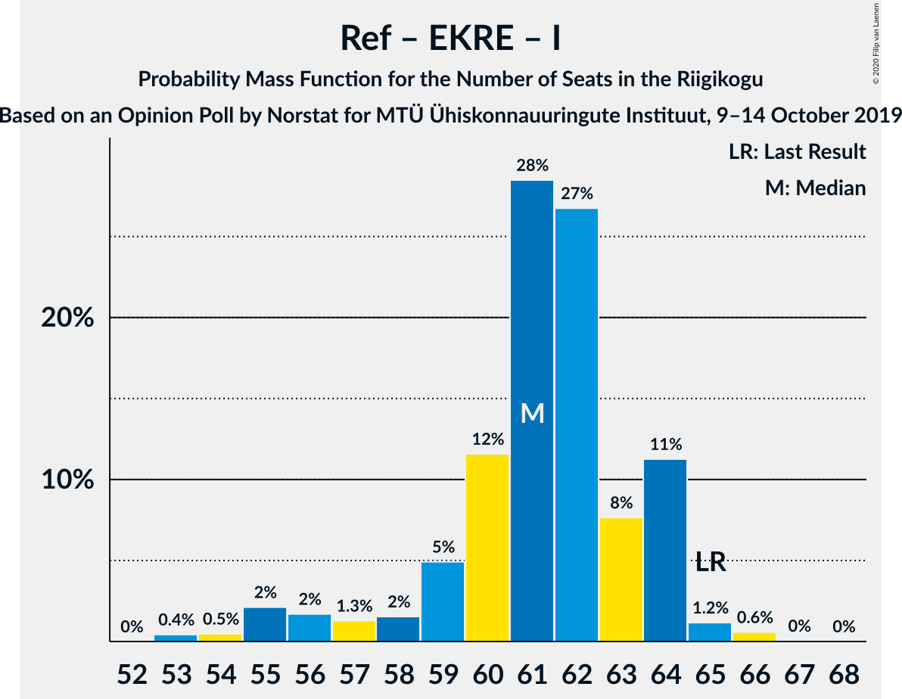

# Opinion Poll by Norstat for MTÜ Ühiskonnauuringute Instituut, 9–14 October 2019

<a href="#voting-intentions">Voting Intentions</a> | <a href="#seats">Seats</a> | <a href="#coalitions">Coalitions</a> | <a href="#technical-information">Technical Information</a>

## Voting Intentions

### Confidence Intervals

| Party | Last Result | Poll Result | 80% Confidence Interval | 90% Confidence Interval | 95% Confidence Interval | 99% Confidence Interval |
|:-----:|:-----------:|:-----------:|:-----------------------:|:-----------------------:|:-----------------------:|:-----------------------:|
| Eesti Reformierakond | 28.9% | 30.9% | 29.1–32.8% |28.5–33.4% |28.1–33.8% |27.3–34.8% |
| Eesti Keskerakond | 23.1% | 26.0% | 24.3–27.8% |23.8–28.4% |23.4–28.8% |22.6–29.7% |
| Eesti Konservatiivne Rahvaerakond | 17.8% | 17.7% | 16.2–19.3% |15.8–19.8% |15.5–20.2% |14.8–21.0% |
| Sotsiaaldemokraatlik Erakond | 9.8% | 8.4% | 7.4–9.6% |7.1–10.0% |6.8–10.3% |6.4–10.9% |
| Erakond Isamaa | 11.4% | 7.2% | 6.2–8.4% |6.0–8.7% |5.7–9.0% |5.3–9.6% |
| Eesti 200 | 4.4% | 5.6% | 4.8–6.6% |4.5–7.0% |4.3–7.2% |4.0–7.7% |
| Erakond Eestimaa Rohelised | 1.8% | 2.3% | 1.8–3.0% |1.6–3.2% |1.5–3.4% |1.3–3.8% |
| Eesti Vabaerakond | 1.2% | 0.4% | 0.2–0.8% |0.2–0.9% |0.2–1.0% |0.1–1.3% |

*Note:* The poll result column reflects the actual value used in the calculations. Published results may vary slightly, and in addition be rounded to fewer digits.

## Seats

### Confidence Intervals

| Party | Last Result | Median | 80% Confidence Interval | 90% Confidence Interval | 95% Confidence Interval | 99% Confidence Interval |
|:-----:|:-----------:|:------:|:-----------------------:|:-----------------------:|:-----------------------:|:-----------------------:|
| <a href="#eesti-reformierakond">Eesti Reformierakond</a> | 34 | 35 | 33–38 |32–38 |31–39 |30–40 |
| <a href="#eesti-keskerakond">Eesti Keskerakond</a> | 26 | 28 | 26–31 |26–31 |25–32 |24–33 |
| <a href="#eesti-konservatiivne-rahvaerakond">Eesti Konservatiivne Rahvaerakond</a> | 19 | 19 | 17–21 |16–22 |16–22 |15–22 |
| <a href="#sotsiaaldemokraatlik-erakond">Sotsiaaldemokraatlik Erakond</a> | 10 | 8 | 6–9 |6–9 |6–10 |6–11 |
| <a href="#erakond-isamaa">Erakond Isamaa</a> | 12 | 7 | 6–8 |5–8 |5–9 |5–9 |
| <a href="#eesti-200">Eesti 200</a> | 0 | 5 | 0–6 |0–6 |0–6 |0–7 |
| <a href="#erakond-eestimaa-rohelised">Erakond Eestimaa Rohelised</a> | 0 | 0 | 0 |0 |0 |0 |
| <a href="#eesti-vabaerakond">Eesti Vabaerakond</a> | 0 | 0 | 0 |0 |0 |0 |

### Eesti Reformierakond

*For a full overview of the results for this party, see the [Eesti Reformierakond](party-eestireformierakond.html) page.*

| Number of Seats | Probability | Accumulated | Special Marks |
|:---------------:|:-----------:|:-----------:|:-------------:|
| 29 | 0.1% | 100% |  |
| 30 | 0.7% | 99.9% |  |
| 31 | 2% | 99.2% |  |
| 32 | 7% | 97% |  |
| 33 | 10% | 90% |  |
| 34 | 14% | 81% | Last Result |
| 35 | 20% | 67% | Median |
| 36 | 18% | 47% |  |
| 37 | 17% | 30% |  |
| 38 | 10% | 13% |  |
| 39 | 1.3% | 3% |  |
| 40 | 1.4% | 2% |  |
| 41 | 0.1% | 0.3% |  |
| 42 | 0.2% | 0.2% |  |
| 43 | 0% | 0% |  |

### Eesti Keskerakond

*For a full overview of the results for this party, see the [Eesti Keskerakond](party-eestikeskerakond.html) page.*

| Number of Seats | Probability | Accumulated | Special Marks |
|:---------------:|:-----------:|:-----------:|:-------------:|
| 23 | 0.1% | 100% |  |
| 24 | 0.7% | 99.9% |  |
| 25 | 4% | 99.2% |  |
| 26 | 16% | 95% | Last Result |
| 27 | 16% | 79% |  |
| 28 | 21% | 63% | Median |
| 29 | 20% | 43% |  |
| 30 | 8% | 23% |  |
| 31 | 11% | 15% |  |
| 32 | 3% | 5% |  |
| 33 | 1.1% | 1.4% |  |
| 34 | 0.3% | 0.4% |  |
| 35 | 0.1% | 0.1% |  |
| 36 | 0% | 0% |  |

### Eesti Konservatiivne Rahvaerakond

*For a full overview of the results for this party, see the [Eesti Konservatiivne Rahvaerakond](party-eestikonservatiivnerahvaerakond.html) page.*

| Number of Seats | Probability | Accumulated | Special Marks |
|:---------------:|:-----------:|:-----------:|:-------------:|
| 14 | 0.2% | 100% |  |
| 15 | 1.5% | 99.8% |  |
| 16 | 6% | 98% |  |
| 17 | 8% | 92% |  |
| 18 | 19% | 84% |  |
| 19 | 23% | 65% | Last Result, Median |
| 20 | 19% | 42% |  |
| 21 | 16% | 23% |  |
| 22 | 7% | 7% |  |
| 23 | 0.4% | 0.5% |  |
| 24 | 0% | 0.1% |  |
| 25 | 0% | 0% |  |

### Sotsiaaldemokraatlik Erakond

*For a full overview of the results for this party, see the [Sotsiaaldemokraatlik Erakond](party-sotsiaaldemokraatlikerakond.html) page.*

| Number of Seats | Probability | Accumulated | Special Marks |
|:---------------:|:-----------:|:-----------:|:-------------:|
| 5 | 0.3% | 100% |  |
| 6 | 11% | 99.7% |  |
| 7 | 24% | 88% |  |
| 8 | 41% | 64% | Median |
| 9 | 20% | 24% |  |
| 10 | 3% | 4% | Last Result |
| 11 | 0.9% | 0.9% |  |
| 12 | 0% | 0% |  |

### Erakond Isamaa

*For a full overview of the results for this party, see the [Erakond Isamaa](party-erakondisamaa.html) page.*

| Number of Seats | Probability | Accumulated | Special Marks |
|:---------------:|:-----------:|:-----------:|:-------------:|
| 0 | 0.1% | 100% |  |
| 1 | 0% | 99.9% |  |
| 2 | 0% | 99.9% |  |
| 3 | 0% | 99.9% |  |
| 4 | 0.3% | 99.9% |  |
| 5 | 7% | 99.6% |  |
| 6 | 32% | 92% |  |
| 7 | 33% | 60% | Median |
| 8 | 23% | 27% |  |
| 9 | 3% | 4% |  |
| 10 | 0.4% | 0.4% |  |
| 11 | 0% | 0% |  |
| 12 | 0% | 0% | Last Result |

### Eesti 200

*For a full overview of the results for this party, see the [Eesti 200](party-eesti200.html) page.*

| Number of Seats | Probability | Accumulated | Special Marks |
|:---------------:|:-----------:|:-----------:|:-------------:|
| 0 | 24% | 100% | Last Result |
| 1 | 0% | 76% |  |
| 2 | 0% | 76% |  |
| 3 | 0% | 76% |  |
| 4 | 25% | 76% |  |
| 5 | 38% | 51% | Median |
| 6 | 12% | 13% |  |
| 7 | 1.2% | 1.3% |  |
| 8 | 0.1% | 0.1% |  |
| 9 | 0% | 0% |  |

### Erakond Eestimaa Rohelised

*For a full overview of the results for this party, see the [Erakond Eestimaa Rohelised](party-erakondeestimaarohelised.html) page.*

| Number of Seats | Probability | Accumulated | Special Marks |
|:---------------:|:-----------:|:-----------:|:-------------:|
| 0 | 100% | 100% | Last Result, Median |

### Eesti Vabaerakond

*For a full overview of the results for this party, see the [Eesti Vabaerakond](party-eestivabaerakond.html) page.*

| Number of Seats | Probability | Accumulated | Special Marks |
|:---------------:|:-----------:|:-----------:|:-------------:|
| 0 | 100% | 100% | Last Result, Median |

## Coalitions

### Confidence Intervals

| Coalition | Last Result | Median | Majority? | 80% Confidence Interval | 90% Confidence Interval | 95% Confidence Interval | 99% Confidence Interval |
|:---------:|:-----------:|:------:|:---------:|:-----------------------:|:-----------------------:|:-----------------------:|:-----------------------:|
| Eesti Reformierakond – Eesti Keskerakond – Eesti Konservatiivne Rahvaerakond | 79 | 83 | 100% | 79–86 | 79–87 | 79–87 | 78–88 |
| Eesti Reformierakond – Eesti Keskerakond | 60 | 64 | 100% | 61–67 | 60–68 | 60–68 | 58–70 |
| Eesti Reformierakond – Eesti Konservatiivne Rahvaerakond – Erakond Isamaa | 65 | 61 | 100% | 59–64 | 57–64 | 55–64 | 54–66 |
| Eesti Keskerakond – Eesti Konservatiivne Rahvaerakond – Erakond Isamaa | 57 | 54 | 95% | 52–57 | 50–58 | 50–58 | 49–60 |
| Eesti Reformierakond – Eesti Konservatiivne Rahvaerakond | 53 | 55 | 95% | 52–57 | 51–57 | 49–58 | 47–59 |
| Eesti Reformierakond – Sotsiaaldemokraatlik Erakond – Erakond Isamaa – Eesti Vabaerakond | 56 | 50 | 48% | 47–52 | 46–53 | 46–54 | 44–56 |
| Eesti Reformierakond – Sotsiaaldemokraatlik Erakond – Erakond Isamaa | 56 | 50 | 48% | 47–52 | 46–53 | 46–54 | 44–56 |
| Eesti Keskerakond – Eesti Konservatiivne Rahvaerakond | 45 | 47 | 14% | 44–51 | 44–51 | 43–51 | 42–53 |
| Eesti Reformierakond – Sotsiaaldemokraatlik Erakond | 44 | 44 | 0% | 40–45 | 40–46 | 39–47 | 38–49 |
| Eesti Keskerakond – Sotsiaaldemokraatlik Erakond – Erakond Isamaa | 48 | 43 | 0.1% | 40–46 | 39–46 | 38–47 | 38–49 |
| Eesti Reformierakond – Erakond Isamaa | 46 | 43 | 0% | 39–44 | 39–45 | 38–46 | 36–47 |
| Eesti Keskerakond – Sotsiaaldemokraatlik Erakond | 36 | 35 | 0% | 34–39 | 33–40 | 32–40 | 32–42 |
| Eesti Konservatiivne Rahvaerakond – Sotsiaaldemokraatlik Erakond | 29 | 27 | 0% | 24–29 | 24–30 | 23–30 | 22–32 |

### Eesti Reformierakond – Eesti Keskerakond – Eesti Konservatiivne Rahvaerakond

| Number of Seats | Probability | Accumulated | Special Marks |
|:---------------:|:-----------:|:-----------:|:-------------:|
| 77 | 0.4% | 100% |  |
| 78 | 1.3% | 99.6% |  |
| 79 | 11% | 98% | Last Result |
| 80 | 10% | 87% |  |
| 81 | 14% | 77% |  |
| 82 | 10% | 63% | Median |
| 83 | 17% | 53% |  |
| 84 | 10% | 36% |  |
| 85 | 7% | 26% |  |
| 86 | 12% | 19% |  |
| 87 | 5% | 7% |  |
| 88 | 2% | 2% |  |
| 89 | 0.1% | 0.2% |  |
| 90 | 0.1% | 0.1% |  |
| 91 | 0% | 0% |  |

### Eesti Reformierakond – Eesti Keskerakond

| Number of Seats | Probability | Accumulated | Special Marks |
|:---------------:|:-----------:|:-----------:|:-------------:|
| 57 | 0.1% | 100% |  |
| 58 | 0.9% | 99.9% |  |
| 59 | 2% | 99.1% |  |
| 60 | 4% | 98% | Last Result |
| 61 | 21% | 94% |  |
| 62 | 5% | 73% |  |
| 63 | 17% | 68% | Median |
| 64 | 16% | 50% |  |
| 65 | 14% | 34% |  |
| 66 | 10% | 20% |  |
| 67 | 5% | 10% |  |
| 68 | 4% | 5% |  |
| 69 | 0.8% | 2% |  |
| 70 | 0.8% | 1.0% |  |
| 71 | 0.2% | 0.2% |  |
| 72 | 0% | 0% |  |

### Eesti Reformierakond – Eesti Konservatiivne Rahvaerakond – Erakond Isamaa

| Number of Seats | Probability | Accumulated | Special Marks |
|:---------------:|:-----------:|:-----------:|:-------------:|
| 53 | 0.4% | 100% |  |
| 54 | 0.5% | 99.6% |  |
| 55 | 2% | 99.1% |  |
| 56 | 2% | 97% |  |
| 57 | 1.3% | 95% |  |
| 58 | 2% | 94% |  |
| 59 | 5% | 92% |  |
| 60 | 12% | 88% |  |
| 61 | 28% | 76% | Median |
| 62 | 27% | 47% |  |
| 63 | 8% | 21% |  |
| 64 | 11% | 13% |  |
| 65 | 1.2% | 2% | Last Result |
| 66 | 0.6% | 0.6% |  |
| 67 | 0% | 0.1% |  |
| 68 | 0% | 0% |  |

### Eesti Keskerakond – Eesti Konservatiivne Rahvaerakond – Erakond Isamaa

| Number of Seats | Probability | Accumulated | Special Marks |
|:---------------:|:-----------:|:-----------:|:-------------:|
| 47 | 0% | 100% |  |
| 48 | 0.1% | 99.9% |  |
| 49 | 1.2% | 99.9% |  |
| 50 | 4% | 98.7% |  |
| 51 | 4% | 95% | Majority |
| 52 | 28% | 91% |  |
| 53 | 8% | 63% |  |
| 54 | 10% | 54% | Median |
| 55 | 9% | 45% |  |
| 56 | 13% | 36% |  |
| 57 | 14% | 23% | Last Result |
| 58 | 7% | 9% |  |
| 59 | 1.4% | 2% |  |
| 60 | 0.8% | 1.1% |  |
| 61 | 0.2% | 0.3% |  |
| 62 | 0.1% | 0.1% |  |
| 63 | 0% | 0% |  |

### Eesti Reformierakond – Eesti Konservatiivne Rahvaerakond

| Number of Seats | Probability | Accumulated | Special Marks |
|:---------------:|:-----------:|:-----------:|:-------------:|
| 46 | 0.1% | 100% |  |
| 47 | 0.5% | 99.9% |  |
| 48 | 0.7% | 99.4% |  |
| 49 | 2% | 98.8% |  |
| 50 | 1.5% | 97% |  |
| 51 | 3% | 95% | Majority |
| 52 | 10% | 92% |  |
| 53 | 17% | 82% | Last Result |
| 54 | 13% | 65% | Median |
| 55 | 12% | 52% |  |
| 56 | 24% | 40% |  |
| 57 | 11% | 16% |  |
| 58 | 3% | 4% |  |
| 59 | 1.1% | 1.4% |  |
| 60 | 0.2% | 0.3% |  |
| 61 | 0.1% | 0.2% |  |
| 62 | 0% | 0% |  |

### Eesti Reformierakond – Sotsiaaldemokraatlik Erakond – Erakond Isamaa – Eesti Vabaerakond

| Number of Seats | Probability | Accumulated | Special Marks |
|:---------------:|:-----------:|:-----------:|:-------------:|
| 43 | 0.1% | 100% |  |
| 44 | 0.6% | 99.9% |  |
| 45 | 0.9% | 99.3% |  |
| 46 | 7% | 98% |  |
| 47 | 8% | 91% |  |
| 48 | 11% | 83% |  |
| 49 | 7% | 71% |  |
| 50 | 16% | 64% | Median |
| 51 | 23% | 48% | Majority |
| 52 | 19% | 25% |  |
| 53 | 3% | 6% |  |
| 54 | 1.1% | 3% |  |
| 55 | 1.2% | 2% |  |
| 56 | 0.6% | 0.7% | Last Result |
| 57 | 0.1% | 0.1% |  |
| 58 | 0% | 0% |  |

### Eesti Reformierakond – Sotsiaaldemokraatlik Erakond – Erakond Isamaa

| Number of Seats | Probability | Accumulated | Special Marks |
|:---------------:|:-----------:|:-----------:|:-------------:|
| 43 | 0.1% | 100% |  |
| 44 | 0.6% | 99.9% |  |
| 45 | 0.9% | 99.3% |  |
| 46 | 7% | 98% |  |
| 47 | 8% | 91% |  |
| 48 | 11% | 83% |  |
| 49 | 7% | 71% |  |
| 50 | 16% | 64% | Median |
| 51 | 23% | 48% | Majority |
| 52 | 19% | 25% |  |
| 53 | 3% | 6% |  |
| 54 | 1.1% | 3% |  |
| 55 | 1.2% | 2% |  |
| 56 | 0.6% | 0.7% | Last Result |
| 57 | 0.1% | 0.1% |  |
| 58 | 0% | 0% |  |

### Eesti Keskerakond – Eesti Konservatiivne Rahvaerakond

| Number of Seats | Probability | Accumulated | Special Marks |
|:---------------:|:-----------:|:-----------:|:-------------:|
| 41 | 0.3% | 100% |  |
| 42 | 0.8% | 99.6% |  |
| 43 | 3% | 98.8% |  |
| 44 | 12% | 95% |  |
| 45 | 8% | 84% | Last Result |
| 46 | 20% | 76% |  |
| 47 | 10% | 56% | Median |
| 48 | 9% | 47% |  |
| 49 | 13% | 38% |  |
| 50 | 11% | 25% |  |
| 51 | 12% | 14% | Majority |
| 52 | 0.6% | 2% |  |
| 53 | 1.3% | 1.5% |  |
| 54 | 0.1% | 0.2% |  |
| 55 | 0% | 0% |  |

### Eesti Reformierakond – Sotsiaaldemokraatlik Erakond

| Number of Seats | Probability | Accumulated | Special Marks |
|:---------------:|:-----------:|:-----------:|:-------------:|
| 36 | 0.1% | 100% |  |
| 37 | 0.3% | 99.9% |  |
| 38 | 0.7% | 99.6% |  |
| 39 | 2% | 98.9% |  |
| 40 | 13% | 97% |  |
| 41 | 11% | 84% |  |
| 42 | 8% | 74% |  |
| 43 | 13% | 65% | Median |
| 44 | 26% | 52% | Last Result |
| 45 | 19% | 26% |  |
| 46 | 4% | 7% |  |
| 47 | 1.4% | 3% |  |
| 48 | 1.2% | 2% |  |
| 49 | 0.6% | 0.8% |  |
| 50 | 0.2% | 0.2% |  |
| 51 | 0% | 0% | Majority |

### Eesti Keskerakond – Sotsiaaldemokraatlik Erakond – Erakond Isamaa

| Number of Seats | Probability | Accumulated | Special Marks |
|:---------------:|:-----------:|:-----------:|:-------------:|
| 36 | 0.1% | 100% |  |
| 37 | 0% | 99.9% |  |
| 38 | 3% | 99.9% |  |
| 39 | 2% | 97% |  |
| 40 | 8% | 95% |  |
| 41 | 19% | 87% |  |
| 42 | 8% | 67% |  |
| 43 | 19% | 59% | Median |
| 44 | 17% | 40% |  |
| 45 | 10% | 23% |  |
| 46 | 9% | 13% |  |
| 47 | 2% | 4% |  |
| 48 | 0.8% | 1.3% | Last Result |
| 49 | 0.4% | 0.5% |  |
| 50 | 0.1% | 0.1% |  |
| 51 | 0% | 0.1% | Majority |
| 52 | 0% | 0% |  |

### Eesti Reformierakond – Erakond Isamaa

| Number of Seats | Probability | Accumulated | Special Marks |
|:---------------:|:-----------:|:-----------:|:-------------:|
| 35 | 0% | 100% |  |
| 36 | 0.7% | 99.9% |  |
| 37 | 0.9% | 99.3% |  |
| 38 | 3% | 98% |  |
| 39 | 7% | 95% |  |
| 40 | 12% | 88% |  |
| 41 | 10% | 76% |  |
| 42 | 10% | 66% | Median |
| 43 | 35% | 56% |  |
| 44 | 13% | 21% |  |
| 45 | 5% | 8% |  |
| 46 | 2% | 3% | Last Result |
| 47 | 0.8% | 0.9% |  |
| 48 | 0.1% | 0.2% |  |
| 49 | 0% | 0% |  |

### Eesti Keskerakond – Sotsiaaldemokraatlik Erakond

| Number of Seats | Probability | Accumulated | Special Marks |
|:---------------:|:-----------:|:-----------:|:-------------:|
| 31 | 0.1% | 100% |  |
| 32 | 3% | 99.9% |  |
| 33 | 3% | 97% |  |
| 34 | 11% | 94% |  |
| 35 | 33% | 82% |  |
| 36 | 8% | 49% | Last Result, Median |
| 37 | 19% | 41% |  |
| 38 | 9% | 22% |  |
| 39 | 7% | 13% |  |
| 40 | 4% | 6% |  |
| 41 | 1.1% | 2% |  |
| 42 | 0.3% | 0.5% |  |
| 43 | 0.2% | 0.3% |  |
| 44 | 0.1% | 0.1% |  |
| 45 | 0% | 0% |  |

### Eesti Konservatiivne Rahvaerakond – Sotsiaaldemokraatlik Erakond

| Number of Seats | Probability | Accumulated | Special Marks |
|:---------------:|:-----------:|:-----------:|:-------------:|
| 21 | 0.1% | 100% |  |
| 22 | 0.9% | 99.9% |  |
| 23 | 3% | 99.1% |  |
| 24 | 7% | 96% |  |
| 25 | 10% | 89% |  |
| 26 | 12% | 79% |  |
| 27 | 33% | 68% | Median |
| 28 | 15% | 35% |  |
| 29 | 15% | 20% | Last Result |
| 30 | 3% | 5% |  |
| 31 | 1.0% | 2% |  |
| 32 | 0.7% | 0.8% |  |
| 33 | 0% | 0.1% |  |
| 34 | 0% | 0% |  |

## Technical Information

### Opinion Poll

+ **Polling firm:** Norstat
+ **Commissioner(s):** MTÜ Ühiskonnauuringute Instituut
+ **Fieldwork period:** 9–14 October 2019

### Calculations

+ **Sample size:** 1000
+ **Simulations done:** 131,072
+ **Error estimate:** 1.94%

