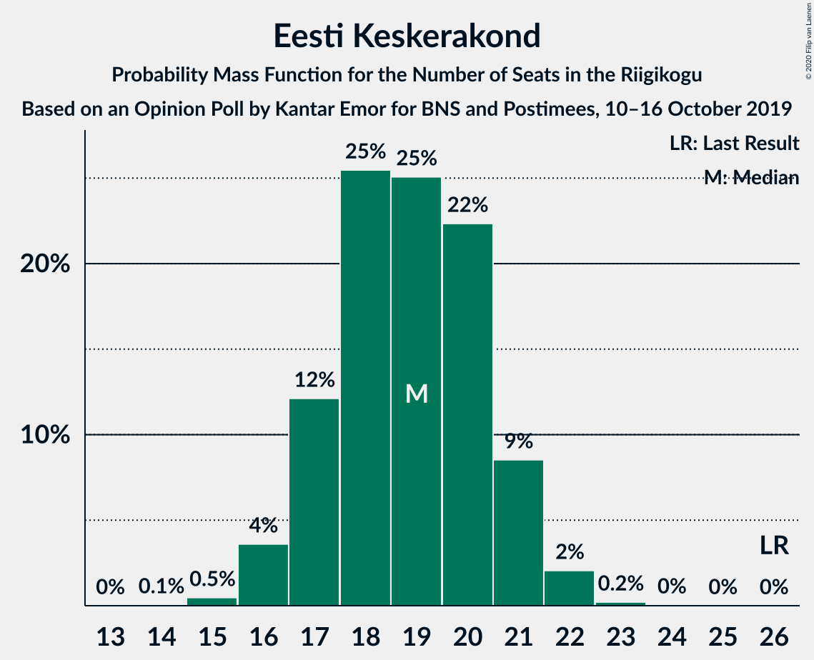
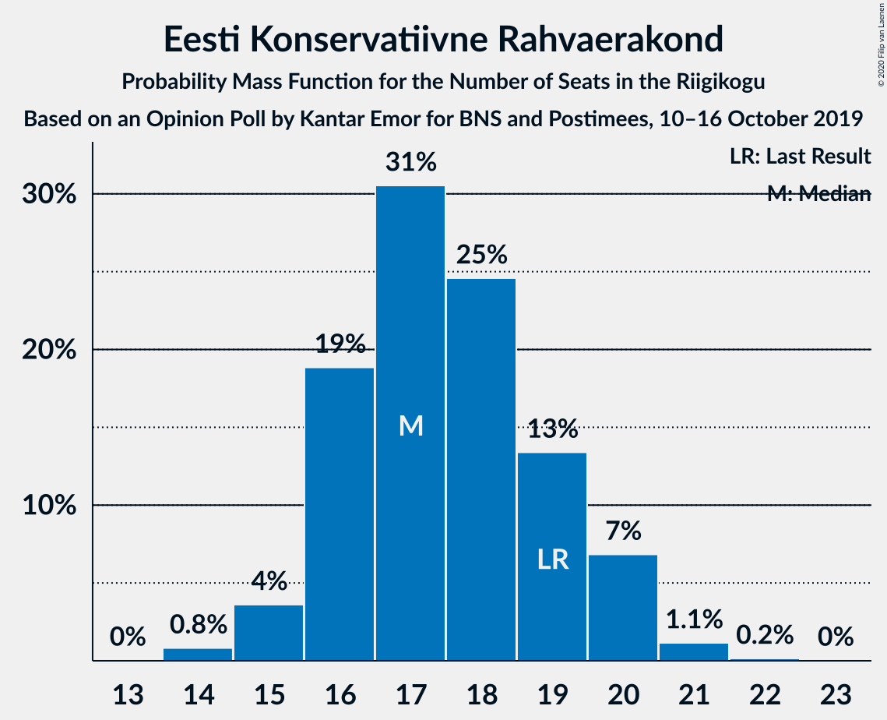

# Opinion Poll by Kantar Emor for BNS and Postimees, 10–16 October 2019

<a href="#voting-intentions">Voting Intentions</a> | <a href="#seats">Seats</a> | <a href="#coalitions">Coalitions</a> | <a href="#technical-information">Technical Information</a>

## Voting Intentions

### Confidence Intervals

| Party | Last Result | Poll Result | 80% Confidence Interval | 90% Confidence Interval | 95% Confidence Interval | 99% Confidence Interval |
|:-----:|:-----------:|:-----------:|:-----------------------:|:-----------------------:|:-----------------------:|:-----------------------:|
| Eesti Reformierakond | 28.9% | 32.7% | 31.0–34.5% |30.5–35.0% |30.1–35.5% |29.3–36.3% |
| Eesti Keskerakond | 23.1% | 17.7% | 16.3–19.2% |15.9–19.6% |15.6–20.0% |15.0–20.7% |
| Eesti Konservatiivne Rahvaerakond | 17.8% | 16.8% | 15.4–18.2% |15.0–18.6% |14.7–19.0% |14.1–19.7% |
| Sotsiaaldemokraatlik Erakond | 9.8% | 12.5% | 11.4–13.8% |11.0–14.2% |10.7–14.5% |10.2–15.2% |
| Eesti 200 | 4.4% | 9.5% | 8.5–10.7% |8.2–11.0% |7.9–11.3% |7.5–11.9% |
| Erakond Isamaa | 11.4% | 6.3% | 5.4–7.3% |5.2–7.5% |5.0–7.8% |4.6–8.3% |
| Erakond Eestimaa Rohelised | 1.8% | 3.0% | 2.4–3.7% |2.3–3.9% |2.1–4.1% |1.9–4.5% |

*Note:* The poll result column reflects the actual value used in the calculations. Published results may vary slightly, and in addition be rounded to fewer digits.

## Seats

### Confidence Intervals

| Party | Last Result | Median | 80% Confidence Interval | 90% Confidence Interval | 95% Confidence Interval | 99% Confidence Interval |
|:-----:|:-----------:|:------:|:-----------------------:|:-----------------------:|:-----------------------:|:-----------------------:|
| <a href="#eesti-reformierakond">Eesti Reformierakond</a> | 34 | 38 | 36–39 |35–40 |34–41 |33–42 |
| <a href="#eesti-keskerakond">Eesti Keskerakond</a> | 26 | 19 | 17–21 |17–21 |16–21 |15–22 |
| <a href="#eesti-konservatiivne-rahvaerakond">Eesti Konservatiivne Rahvaerakond</a> | 19 | 17 | 16–19 |16–20 |15–20 |14–21 |
| <a href="#sotsiaaldemokraatlik-erakond">Sotsiaaldemokraatlik Erakond</a> | 10 | 13 | 11–14 |11–14 |10–15 |10–16 |
| <a href="#eesti-200">Eesti 200</a> | 0 | 9 | 8–10 |7–11 |7–11 |7–12 |
| <a href="#erakond-isamaa">Erakond Isamaa</a> | 12 | 5 | 5–7 |4–7 |4–7 |0–8 |
| <a href="#erakond-eestimaa-rohelised">Erakond Eestimaa Rohelised</a> | 0 | 0 | 0 |0 |0 |0 |

### Eesti Reformierakond

*For a full overview of the results for this party, see the [Eesti Reformierakond](party-eestireformierakond.html) page.*

| Number of Seats | Probability | Accumulated | Special Marks |
|:---------------:|:-----------:|:-----------:|:-------------:|
| 32 | 0.1% | 100% |  |
| 33 | 0.6% | 99.9% |  |
| 34 | 4% | 99.3% | Last Result |
| 35 | 5% | 96% |  |
| 36 | 15% | 90% |  |
| 37 | 23% | 75% |  |
| 38 | 29% | 52% | Median |
| 39 | 13% | 23% |  |
| 40 | 6% | 10% |  |
| 41 | 3% | 4% |  |
| 42 | 0.5% | 0.8% |  |
| 43 | 0.3% | 0.3% |  |
| 44 | 0% | 0.1% |  |
| 45 | 0% | 0% |  |

### Eesti Keskerakond

*For a full overview of the results for this party, see the [Eesti Keskerakond](party-eestikeskerakond.html) page.*

| Number of Seats | Probability | Accumulated | Special Marks |
|:---------------:|:-----------:|:-----------:|:-------------:|
| 14 | 0.1% | 100% |  |
| 15 | 0.5% | 99.9% |  |
| 16 | 4% | 99.5% |  |
| 17 | 12% | 96% |  |
| 18 | 25% | 84% |  |
| 19 | 25% | 58% | Median |
| 20 | 22% | 33% |  |
| 21 | 9% | 11% |  |
| 22 | 2% | 2% |  |
| 23 | 0.2% | 0.3% |  |
| 24 | 0% | 0% |  |
| 25 | 0% | 0% |  |
| 26 | 0% | 0% | Last Result |

### Eesti Konservatiivne Rahvaerakond

*For a full overview of the results for this party, see the [Eesti Konservatiivne Rahvaerakond](party-eestikonservatiivnerahvaerakond.html) page.*

| Number of Seats | Probability | Accumulated | Special Marks |
|:---------------:|:-----------:|:-----------:|:-------------:|
| 14 | 0.8% | 100% |  |
| 15 | 4% | 99.1% |  |
| 16 | 19% | 96% |  |
| 17 | 31% | 77% | Median |
| 18 | 25% | 46% |  |
| 19 | 13% | 22% | Last Result |
| 20 | 7% | 8% |  |
| 21 | 1.1% | 1.3% |  |
| 22 | 0.2% | 0.2% |  |
| 23 | 0% | 0% |  |

### Sotsiaaldemokraatlik Erakond

*For a full overview of the results for this party, see the [Sotsiaaldemokraatlik Erakond](party-sotsiaaldemokraatlikerakond.html) page.*

| Number of Seats | Probability | Accumulated | Special Marks |
|:---------------:|:-----------:|:-----------:|:-------------:|
| 9 | 0.1% | 100% |  |
| 10 | 3% | 99.9% | Last Result |
| 11 | 17% | 97% |  |
| 12 | 28% | 80% |  |
| 13 | 29% | 52% | Median |
| 14 | 19% | 23% |  |
| 15 | 3% | 4% |  |
| 16 | 0.8% | 0.9% |  |
| 17 | 0.1% | 0.1% |  |
| 18 | 0% | 0% |  |

### Eesti 200

*For a full overview of the results for this party, see the [Eesti 200](party-eesti200.html) page.*

| Number of Seats | Probability | Accumulated | Special Marks |
|:---------------:|:-----------:|:-----------:|:-------------:|
| 0 | 0% | 100% | Last Result |
| 1 | 0% | 100% |  |
| 2 | 0% | 100% |  |
| 3 | 0% | 100% |  |
| 4 | 0% | 100% |  |
| 5 | 0% | 100% |  |
| 6 | 0.1% | 100% |  |
| 7 | 6% | 99.9% |  |
| 8 | 25% | 94% |  |
| 9 | 29% | 70% | Median |
| 10 | 33% | 40% |  |
| 11 | 7% | 8% |  |
| 12 | 0.9% | 1.0% |  |
| 13 | 0.1% | 0.1% |  |
| 14 | 0% | 0% |  |

### Erakond Isamaa

*For a full overview of the results for this party, see the [Erakond Isamaa](party-erakondisamaa.html) page.*

| Number of Seats | Probability | Accumulated | Special Marks |
|:---------------:|:-----------:|:-----------:|:-------------:|
| 0 | 2% | 100% |  |
| 1 | 0% | 98% |  |
| 2 | 0% | 98% |  |
| 3 | 0% | 98% |  |
| 4 | 3% | 98% |  |
| 5 | 44% | 94% | Median |
| 6 | 38% | 50% |  |
| 7 | 11% | 12% |  |
| 8 | 2% | 2% |  |
| 9 | 0% | 0% |  |
| 10 | 0% | 0% |  |
| 11 | 0% | 0% |  |
| 12 | 0% | 0% | Last Result |

### Erakond Eestimaa Rohelised

*For a full overview of the results for this party, see the [Erakond Eestimaa Rohelised](party-erakondeestimaarohelised.html) page.*

| Number of Seats | Probability | Accumulated | Special Marks |
|:---------------:|:-----------:|:-----------:|:-------------:|
| 0 | 100% | 100% | Last Result, Median |

## Coalitions

### Confidence Intervals

| Coalition | Last Result | Median | Majority? | 80% Confidence Interval | 90% Confidence Interval | 95% Confidence Interval | 99% Confidence Interval |
|:---------:|:-----------:|:------:|:---------:|:-----------------------:|:-----------------------:|:-----------------------:|:-----------------------:|
| Eesti Reformierakond – Eesti Keskerakond – Eesti Konservatiivne Rahvaerakond | 79 | 74 | 100% | 72–76 | 71–76 | 71–77 | 70–79 |
| Eesti Reformierakond – Eesti Konservatiivne Rahvaerakond – Erakond Isamaa | 65 | 61 | 100% | 58–63 | 58–64 | 57–64 | 56–64 |
| Eesti Reformierakond – Eesti Keskerakond | 60 | 57 | 100% | 54–58 | 53–59 | 53–59 | 51–61 |
| Eesti Reformierakond – Eesti Konservatiivne Rahvaerakond | 53 | 55 | 99.4% | 53–57 | 52–58 | 52–59 | 50–60 |
| Eesti Reformierakond – Sotsiaaldemokraatlik Erakond – Erakond Isamaa | 56 | 56 | 99.6% | 53–58 | 53–58 | 52–59 | 51–60 |
| Eesti Reformierakond – Sotsiaaldemokraatlik Erakond | 44 | 50 | 40% | 48–52 | 47–53 | 47–54 | 46–55 |
| Eesti Reformierakond – Erakond Isamaa | 46 | 43 | 0% | 41–45 | 40–46 | 39–47 | 38–47 |
| Eesti Keskerakond – Eesti Konservatiivne Rahvaerakond – Erakond Isamaa | 57 | 42 | 0% | 40–44 | 39–45 | 38–45 | 37–46 |
| Eesti Keskerakond – Sotsiaaldemokraatlik Erakond – Erakond Isamaa | 48 | 37 | 0% | 34–39 | 34–39 | 33–41 | 32–41 |
| Eesti Keskerakond – Eesti Konservatiivne Rahvaerakond | 45 | 36 | 0% | 34–38 | 34–39 | 33–40 | 32–41 |
| Eesti Keskerakond – Sotsiaaldemokraatlik Erakond | 36 | 31 | 0% | 29–34 | 29–34 | 28–34 | 27–36 |
| Eesti Konservatiivne Rahvaerakond – Sotsiaaldemokraatlik Erakond | 29 | 30 | 0% | 28–32 | 28–33 | 27–33 | 26–35 |

### Eesti Reformierakond – Eesti Keskerakond – Eesti Konservatiivne Rahvaerakond

| Number of Seats | Probability | Accumulated | Special Marks |
|:---------------:|:-----------:|:-----------:|:-------------:|
| 68 | 0.1% | 100% |  |
| 69 | 0.3% | 99.9% |  |
| 70 | 2% | 99.6% |  |
| 71 | 5% | 98% |  |
| 72 | 13% | 93% |  |
| 73 | 21% | 80% |  |
| 74 | 29% | 59% | Median |
| 75 | 14% | 30% |  |
| 76 | 11% | 16% |  |
| 77 | 3% | 5% |  |
| 78 | 0.5% | 2% |  |
| 79 | 0.7% | 1.1% | Last Result |
| 80 | 0.2% | 0.3% |  |
| 81 | 0.1% | 0.1% |  |
| 82 | 0% | 0% |  |

### Eesti Reformierakond – Eesti Konservatiivne Rahvaerakond – Erakond Isamaa

| Number of Seats | Probability | Accumulated | Special Marks |
|:---------------:|:-----------:|:-----------:|:-------------:|
| 54 | 0.1% | 100% |  |
| 55 | 0.2% | 99.9% |  |
| 56 | 0.9% | 99.7% |  |
| 57 | 2% | 98.8% |  |
| 58 | 11% | 96% |  |
| 59 | 15% | 85% |  |
| 60 | 17% | 70% | Median |
| 61 | 29% | 54% |  |
| 62 | 14% | 25% |  |
| 63 | 5% | 11% |  |
| 64 | 5% | 6% |  |
| 65 | 0.3% | 0.5% | Last Result |
| 66 | 0.2% | 0.2% |  |
| 67 | 0% | 0% |  |

### Eesti Reformierakond – Eesti Keskerakond

| Number of Seats | Probability | Accumulated | Special Marks |
|:---------------:|:-----------:|:-----------:|:-------------:|
| 51 | 0.7% | 100% | Majority |
| 52 | 1.5% | 99.3% |  |
| 53 | 4% | 98% |  |
| 54 | 7% | 94% |  |
| 55 | 20% | 87% |  |
| 56 | 8% | 67% |  |
| 57 | 40% | 59% | Median |
| 58 | 11% | 19% |  |
| 59 | 5% | 8% |  |
| 60 | 1.1% | 2% | Last Result |
| 61 | 0.9% | 1.1% |  |
| 62 | 0.1% | 0.2% |  |
| 63 | 0.1% | 0.1% |  |
| 64 | 0% | 0% |  |

### Eesti Reformierakond – Eesti Konservatiivne Rahvaerakond

| Number of Seats | Probability | Accumulated | Special Marks |
|:---------------:|:-----------:|:-----------:|:-------------:|
| 49 | 0.1% | 100% |  |
| 50 | 0.5% | 99.9% |  |
| 51 | 1.0% | 99.4% | Majority |
| 52 | 6% | 98% |  |
| 53 | 14% | 93% | Last Result |
| 54 | 16% | 79% |  |
| 55 | 29% | 63% | Median |
| 56 | 13% | 34% |  |
| 57 | 12% | 21% |  |
| 58 | 6% | 9% |  |
| 59 | 2% | 3% |  |
| 60 | 0.5% | 0.8% |  |
| 61 | 0.2% | 0.3% |  |
| 62 | 0% | 0.1% |  |
| 63 | 0% | 0% |  |

### Eesti Reformierakond – Sotsiaaldemokraatlik Erakond – Erakond Isamaa

| Number of Seats | Probability | Accumulated | Special Marks |
|:---------------:|:-----------:|:-----------:|:-------------:|
| 49 | 0.1% | 100% |  |
| 50 | 0.3% | 99.9% |  |
| 51 | 1.1% | 99.6% | Majority |
| 52 | 2% | 98.5% |  |
| 53 | 11% | 96% |  |
| 54 | 14% | 85% |  |
| 55 | 21% | 71% |  |
| 56 | 20% | 51% | Last Result, Median |
| 57 | 15% | 31% |  |
| 58 | 11% | 16% |  |
| 59 | 4% | 5% |  |
| 60 | 0.8% | 1.0% |  |
| 61 | 0.2% | 0.2% |  |
| 62 | 0% | 0% |  |

### Eesti Reformierakond – Sotsiaaldemokraatlik Erakond

| Number of Seats | Probability | Accumulated | Special Marks |
|:---------------:|:-----------:|:-----------:|:-------------:|
| 44 | 0.1% | 100% | Last Result |
| 45 | 0.3% | 99.9% |  |
| 46 | 2% | 99.6% |  |
| 47 | 5% | 98% |  |
| 48 | 11% | 93% |  |
| 49 | 20% | 82% |  |
| 50 | 21% | 61% |  |
| 51 | 19% | 40% | Median, Majority |
| 52 | 14% | 21% |  |
| 53 | 5% | 8% |  |
| 54 | 2% | 3% |  |
| 55 | 0.5% | 0.8% |  |
| 56 | 0.2% | 0.2% |  |
| 57 | 0% | 0% |  |

### Eesti Reformierakond – Erakond Isamaa

| Number of Seats | Probability | Accumulated | Special Marks |
|:---------------:|:-----------:|:-----------:|:-------------:|
| 36 | 0% | 100% |  |
| 37 | 0.4% | 99.9% |  |
| 38 | 0.7% | 99.5% |  |
| 39 | 1.3% | 98.8% |  |
| 40 | 5% | 97% |  |
| 41 | 11% | 92% |  |
| 42 | 15% | 81% |  |
| 43 | 33% | 66% | Median |
| 44 | 16% | 34% |  |
| 45 | 11% | 18% |  |
| 46 | 4% | 7% | Last Result |
| 47 | 2% | 3% |  |
| 48 | 0.3% | 0.4% |  |
| 49 | 0.1% | 0.1% |  |
| 50 | 0% | 0% |  |

### Eesti Keskerakond – Eesti Konservatiivne Rahvaerakond – Erakond Isamaa

| Number of Seats | Probability | Accumulated | Special Marks |
|:---------------:|:-----------:|:-----------:|:-------------:|
| 35 | 0.1% | 100% |  |
| 36 | 0.3% | 99.9% |  |
| 37 | 0.7% | 99.6% |  |
| 38 | 2% | 98.9% |  |
| 39 | 6% | 97% |  |
| 40 | 12% | 91% |  |
| 41 | 22% | 79% | Median |
| 42 | 21% | 57% |  |
| 43 | 20% | 35% |  |
| 44 | 9% | 15% |  |
| 45 | 5% | 6% |  |
| 46 | 1.0% | 2% |  |
| 47 | 0.4% | 0.5% |  |
| 48 | 0% | 0.1% |  |
| 49 | 0% | 0% |  |
| 50 | 0% | 0% |  |
| 51 | 0% | 0% | Majority |
| 52 | 0% | 0% |  |
| 53 | 0% | 0% |  |
| 54 | 0% | 0% |  |
| 55 | 0% | 0% |  |
| 56 | 0% | 0% |  |
| 57 | 0% | 0% | Last Result |

### Eesti Keskerakond – Sotsiaaldemokraatlik Erakond – Erakond Isamaa

| Number of Seats | Probability | Accumulated | Special Marks |
|:---------------:|:-----------:|:-----------:|:-------------:|
| 30 | 0.2% | 100% |  |
| 31 | 0.3% | 99.8% |  |
| 32 | 0.7% | 99.6% |  |
| 33 | 1.4% | 98.9% |  |
| 34 | 8% | 97% |  |
| 35 | 7% | 89% |  |
| 36 | 25% | 82% |  |
| 37 | 18% | 57% | Median |
| 38 | 21% | 39% |  |
| 39 | 13% | 18% |  |
| 40 | 2% | 5% |  |
| 41 | 2% | 3% |  |
| 42 | 0.3% | 0.4% |  |
| 43 | 0% | 0% |  |
| 44 | 0% | 0% |  |
| 45 | 0% | 0% |  |
| 46 | 0% | 0% |  |
| 47 | 0% | 0% |  |
| 48 | 0% | 0% | Last Result |

### Eesti Keskerakond – Eesti Konservatiivne Rahvaerakond

| Number of Seats | Probability | Accumulated | Special Marks |
|:---------------:|:-----------:|:-----------:|:-------------:|
| 31 | 0.1% | 100% |  |
| 32 | 0.9% | 99.9% |  |
| 33 | 3% | 98.9% |  |
| 34 | 12% | 96% |  |
| 35 | 13% | 84% |  |
| 36 | 29% | 71% | Median |
| 37 | 14% | 42% |  |
| 38 | 18% | 27% |  |
| 39 | 5% | 9% |  |
| 40 | 3% | 4% |  |
| 41 | 0.4% | 0.6% |  |
| 42 | 0.2% | 0.3% |  |
| 43 | 0% | 0% |  |
| 44 | 0% | 0% |  |
| 45 | 0% | 0% | Last Result |

### Eesti Keskerakond – Sotsiaaldemokraatlik Erakond

| Number of Seats | Probability | Accumulated | Special Marks |
|:---------------:|:-----------:|:-----------:|:-------------:|
| 26 | 0.2% | 100% |  |
| 27 | 0.3% | 99.8% |  |
| 28 | 4% | 99.5% |  |
| 29 | 9% | 96% |  |
| 30 | 13% | 87% |  |
| 31 | 31% | 74% |  |
| 32 | 17% | 43% | Median |
| 33 | 15% | 27% |  |
| 34 | 9% | 11% |  |
| 35 | 1.3% | 2% |  |
| 36 | 0.6% | 0.7% | Last Result |
| 37 | 0.1% | 0.1% |  |
| 38 | 0.1% | 0.1% |  |
| 39 | 0% | 0% |  |

### Eesti Konservatiivne Rahvaerakond – Sotsiaaldemokraatlik Erakond

| Number of Seats | Probability | Accumulated | Special Marks |
|:---------------:|:-----------:|:-----------:|:-------------:|
| 25 | 0.1% | 100% |  |
| 26 | 0.5% | 99.9% |  |
| 27 | 4% | 99.4% |  |
| 28 | 8% | 96% |  |
| 29 | 35% | 88% | Last Result |
| 30 | 11% | 52% | Median |
| 31 | 22% | 41% |  |
| 32 | 13% | 19% |  |
| 33 | 4% | 6% |  |
| 34 | 2% | 2% |  |
| 35 | 0.6% | 0.7% |  |
| 36 | 0.1% | 0.1% |  |
| 37 | 0% | 0% |  |

## Technical Information

### Opinion Poll

+ **Polling firm:** Kantar Emor
+ **Commissioner(s):** BNS and Postimees
+ **Fieldwork period:** 10–16 October 2019

### Calculations

+ **Sample size:** 1182
+ **Simulations done:** 131,072
+ **Error estimate:** 1.97%

