# Opinion Poll by Norstat for MTÜ Ühiskonnauuringute Instituut, 15–21 October 2019

<a href="#voting-intentions">Voting Intentions</a> | <a href="#seats">Seats</a> | <a href="#coalitions">Coalitions</a> | <a href="#technical-information">Technical Information</a>

## Voting Intentions

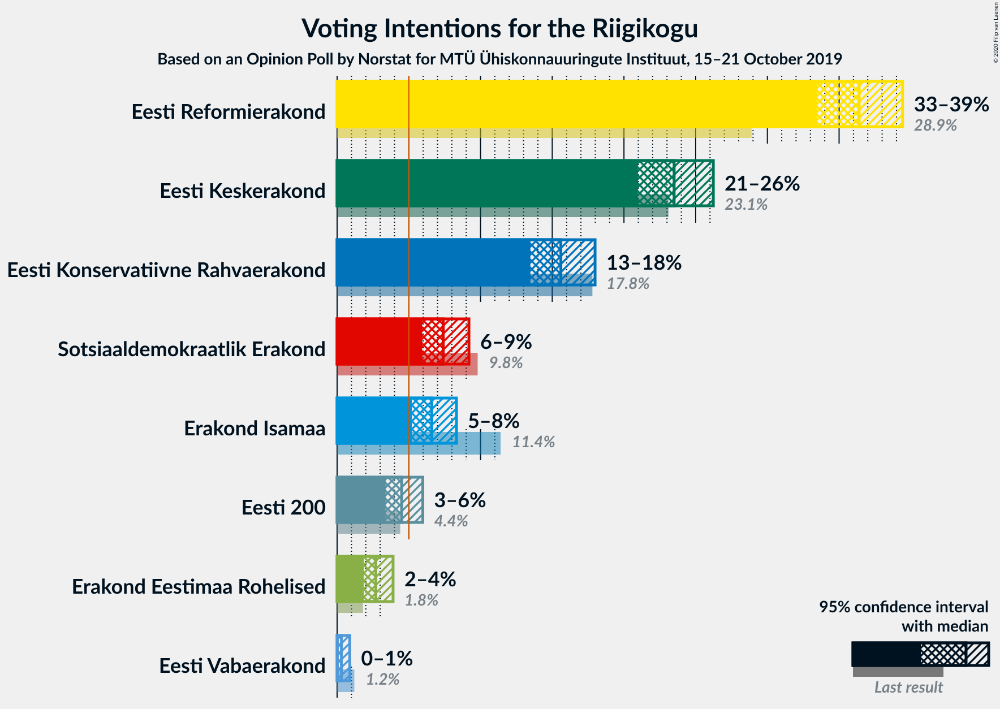

### Confidence Intervals

| Party | Last Result | Poll Result | 80% Confidence Interval | 90% Confidence Interval | 95% Confidence Interval | 99% Confidence Interval |
|:-----:|:-----------:|:-----------:|:-----------------------:|:-----------------------:|:-----------------------:|:-----------------------:|
| Eesti Reformierakond | 28.9% | 36.4% | 34.5–38.4% |33.9–38.9% |33.5–39.4% |32.6–40.4% |
| Eesti Keskerakond | 23.1% | 23.5% | 21.8–25.3% |21.4–25.8% |21.0–26.2% |20.2–27.1% |
| Eesti Konservatiivne Rahvaerakond | 17.8% | 15.6% | 14.2–17.2% |13.8–17.6% |13.5–18.0% |12.8–18.8% |
| Sotsiaaldemokraatlik Erakond | 9.8% | 7.4% | 6.4–8.6% |6.2–8.9% |5.9–9.2% |5.5–9.8% |
| Erakond Isamaa | 11.4% | 6.6% | 5.7–7.7% |5.4–8.0% |5.2–8.3% |4.8–8.9% |
| Eesti 200 | 4.4% | 4.5% | 3.8–5.5% |3.6–5.7% |3.4–6.0% |3.0–6.5% |
| Erakond Eestimaa Rohelised | 1.8% | 2.7% | 2.1–3.5% |2.0–3.7% |1.9–3.9% |1.6–4.3% |
| Eesti Vabaerakond | 1.2% | 0.3% | 0.2–0.7% |0.1–0.8% |0.1–0.9% |0.1–1.1% |

*Note:* The poll result column reflects the actual value used in the calculations. Published results may vary slightly, and in addition be rounded to fewer digits.

## Seats

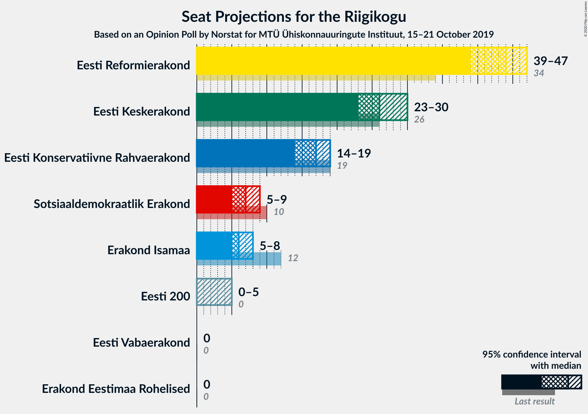

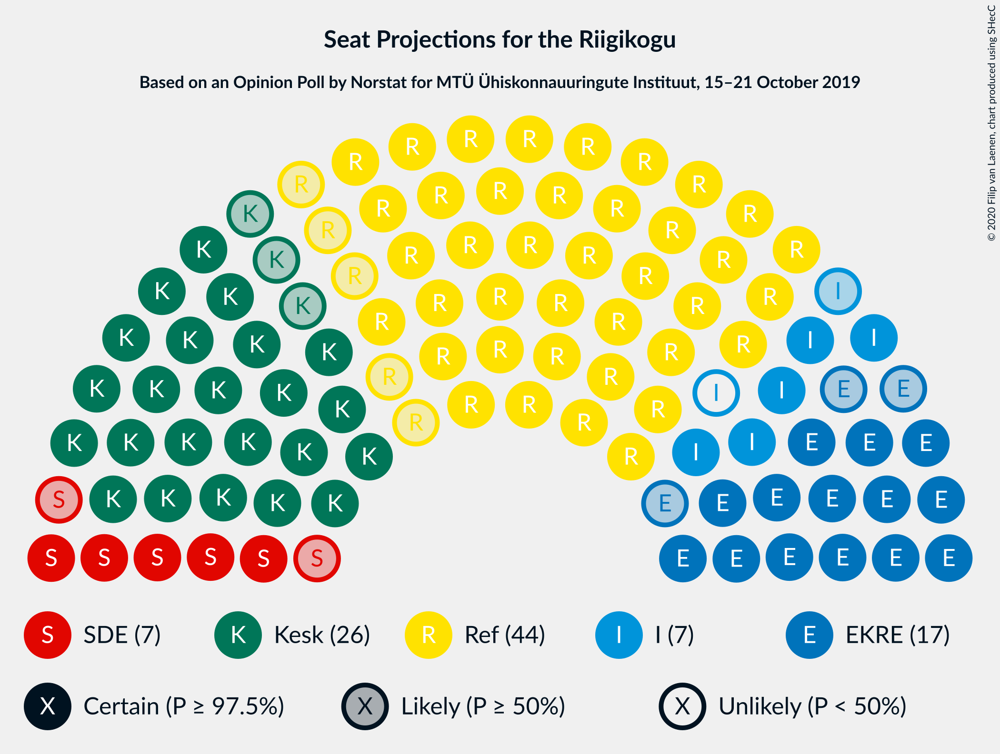

### Confidence Intervals

| Party | Last Result | Median | 80% Confidence Interval | 90% Confidence Interval | 95% Confidence Interval | 99% Confidence Interval |
|:-----:|:-----------:|:------:|:-----------------------:|:-----------------------:|:-----------------------:|:-----------------------:|
| <a href="#eesti-reformierakond">Eesti Reformierakond</a> | 34 | 44 | 41–46 |39–46 |39–47 |37–49 |
| <a href="#eesti-keskerakond">Eesti Keskerakond</a> | 26 | 26 | 24–29 |23–29 |23–30 |22–31 |
| <a href="#eesti-konservatiivne-rahvaerakond">Eesti Konservatiivne Rahvaerakond</a> | 19 | 17 | 16–18 |15–19 |14–19 |13–20 |
| <a href="#sotsiaaldemokraatlik-erakond">Sotsiaaldemokraatlik Erakond</a> | 10 | 7 | 6–8 |5–9 |5–9 |5–9 |
| <a href="#erakond-isamaa">Erakond Isamaa</a> | 12 | 6 | 5–8 |5–8 |5–8 |0–9 |
| <a href="#eesti-200">Eesti 200</a> | 0 | 0 | 0–5 |0–5 |0–5 |0–6 |
| <a href="#erakond-eestimaa-rohelised">Erakond Eestimaa Rohelised</a> | 0 | 0 | 0 |0 |0 |0 |
| <a href="#eesti-vabaerakond">Eesti Vabaerakond</a> | 0 | 0 | 0 |0 |0 |0 |

### Eesti Reformierakond

*For a full overview of the results for this party, see the [Eesti Reformierakond](party-eestireformierakond.html) page.*

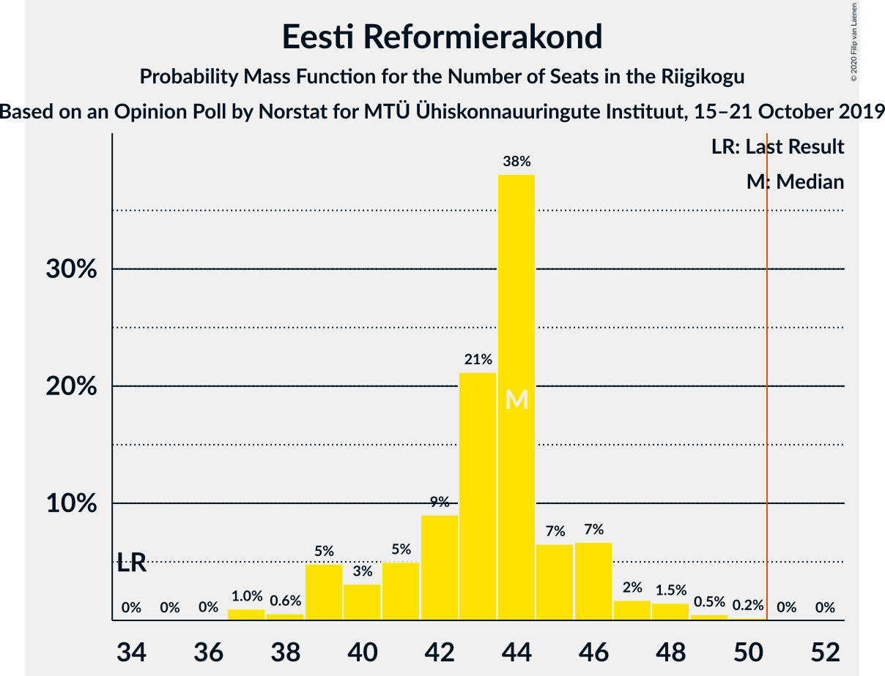

| Number of Seats | Probability | Accumulated | Special Marks |
|:---------------:|:-----------:|:-----------:|:-------------:|
| 34 | 0% | 100% | Last Result |
| 35 | 0% | 100% |  |
| 36 | 0% | 100% |  |
| 37 | 1.0% | 99.9% |  |
| 38 | 0.6% | 99.0% |  |
| 39 | 5% | 98% |  |
| 40 | 3% | 94% |  |
| 41 | 5% | 90% |  |
| 42 | 9% | 85% |  |
| 43 | 21% | 76% |  |
| 44 | 38% | 55% | Median |
| 45 | 7% | 17% |  |
| 46 | 7% | 11% |  |
| 47 | 2% | 4% |  |
| 48 | 1.5% | 2% |  |
| 49 | 0.5% | 0.7% |  |
| 50 | 0.2% | 0.2% |  |
| 51 | 0% | 0% | Majority |

### Eesti Keskerakond

*For a full overview of the results for this party, see the [Eesti Keskerakond](party-eestikeskerakond.html) page.*

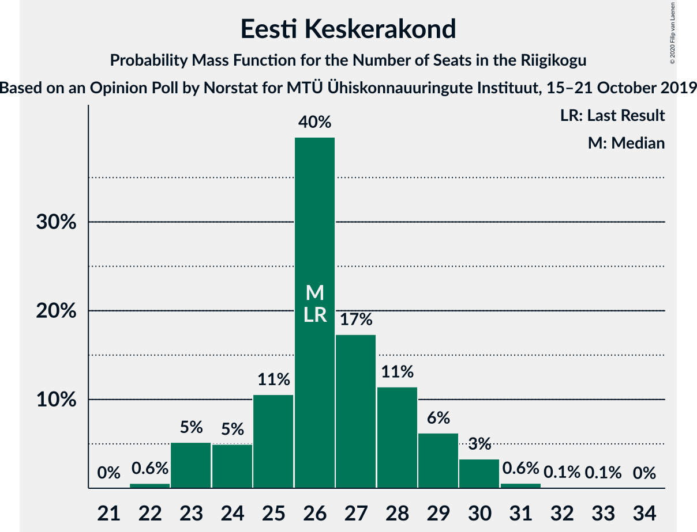

| Number of Seats | Probability | Accumulated | Special Marks |
|:---------------:|:-----------:|:-----------:|:-------------:|
| 21 | 0% | 100% |  |
| 22 | 0.6% | 99.9% |  |
| 23 | 5% | 99.4% |  |
| 24 | 5% | 94% |  |
| 25 | 11% | 89% |  |
| 26 | 40% | 79% | Last Result, Median |
| 27 | 17% | 39% |  |
| 28 | 11% | 22% |  |
| 29 | 6% | 10% |  |
| 30 | 3% | 4% |  |
| 31 | 0.6% | 0.8% |  |
| 32 | 0.1% | 0.2% |  |
| 33 | 0.1% | 0.1% |  |
| 34 | 0% | 0% |  |

### Eesti Konservatiivne Rahvaerakond

*For a full overview of the results for this party, see the [Eesti Konservatiivne Rahvaerakond](party-eestikonservatiivnerahvaerakond.html) page.*

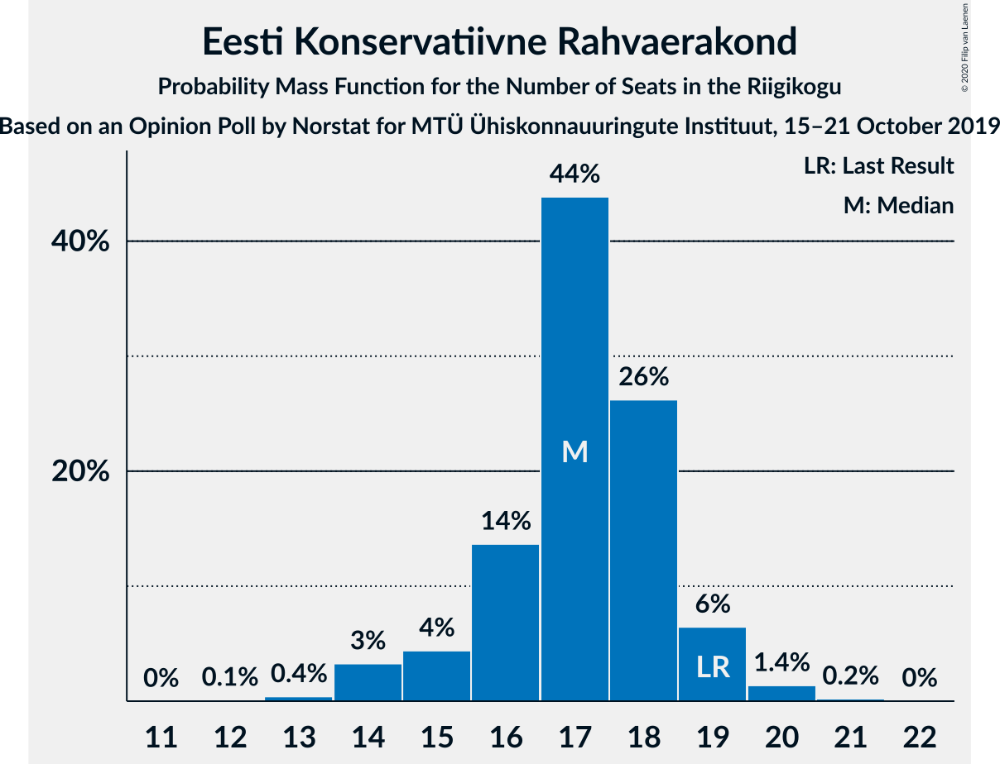

| Number of Seats | Probability | Accumulated | Special Marks |
|:---------------:|:-----------:|:-----------:|:-------------:|
| 12 | 0.1% | 100% |  |
| 13 | 0.4% | 99.9% |  |
| 14 | 3% | 99.5% |  |
| 15 | 4% | 96% |  |
| 16 | 14% | 92% |  |
| 17 | 44% | 78% | Median |
| 18 | 26% | 34% |  |
| 19 | 6% | 8% | Last Result |
| 20 | 1.4% | 2% |  |
| 21 | 0.2% | 0.2% |  |
| 22 | 0% | 0% |  |

### Sotsiaaldemokraatlik Erakond

*For a full overview of the results for this party, see the [Sotsiaaldemokraatlik Erakond](party-sotsiaaldemokraatlikerakond.html) page.*

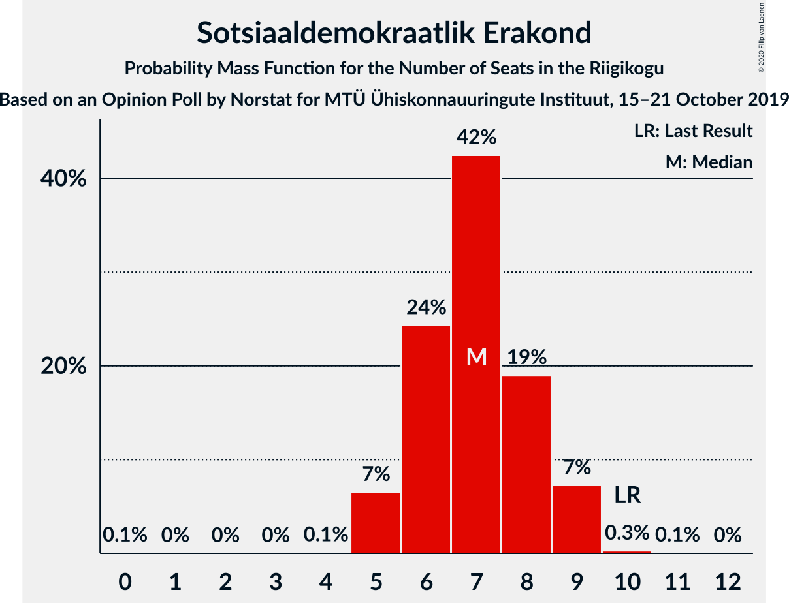

| Number of Seats | Probability | Accumulated | Special Marks |
|:---------------:|:-----------:|:-----------:|:-------------:|
| 0 | 0.1% | 100% |  |
| 1 | 0% | 99.9% |  |
| 2 | 0% | 99.9% |  |
| 3 | 0% | 99.9% |  |
| 4 | 0.1% | 99.9% |  |
| 5 | 7% | 99.9% |  |
| 6 | 24% | 93% |  |
| 7 | 42% | 69% | Median |
| 8 | 19% | 27% |  |
| 9 | 7% | 8% |  |
| 10 | 0.3% | 0.3% | Last Result |
| 11 | 0.1% | 0.1% |  |
| 12 | 0% | 0% |  |

### Erakond Isamaa

*For a full overview of the results for this party, see the [Erakond Isamaa](party-erakondisamaa.html) page.*

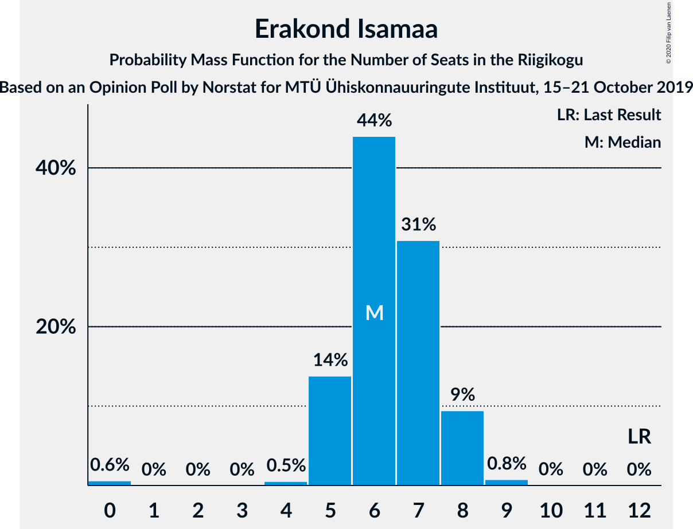

| Number of Seats | Probability | Accumulated | Special Marks |
|:---------------:|:-----------:|:-----------:|:-------------:|
| 0 | 0.6% | 100% |  |
| 1 | 0% | 99.4% |  |
| 2 | 0% | 99.4% |  |
| 3 | 0% | 99.4% |  |
| 4 | 0.5% | 99.4% |  |
| 5 | 14% | 98.9% |  |
| 6 | 44% | 85% | Median |
| 7 | 31% | 41% |  |
| 8 | 9% | 10% |  |
| 9 | 0.8% | 0.8% |  |
| 10 | 0% | 0% |  |
| 11 | 0% | 0% |  |
| 12 | 0% | 0% | Last Result |

### Eesti 200

*For a full overview of the results for this party, see the [Eesti 200](party-eesti200.html) page.*

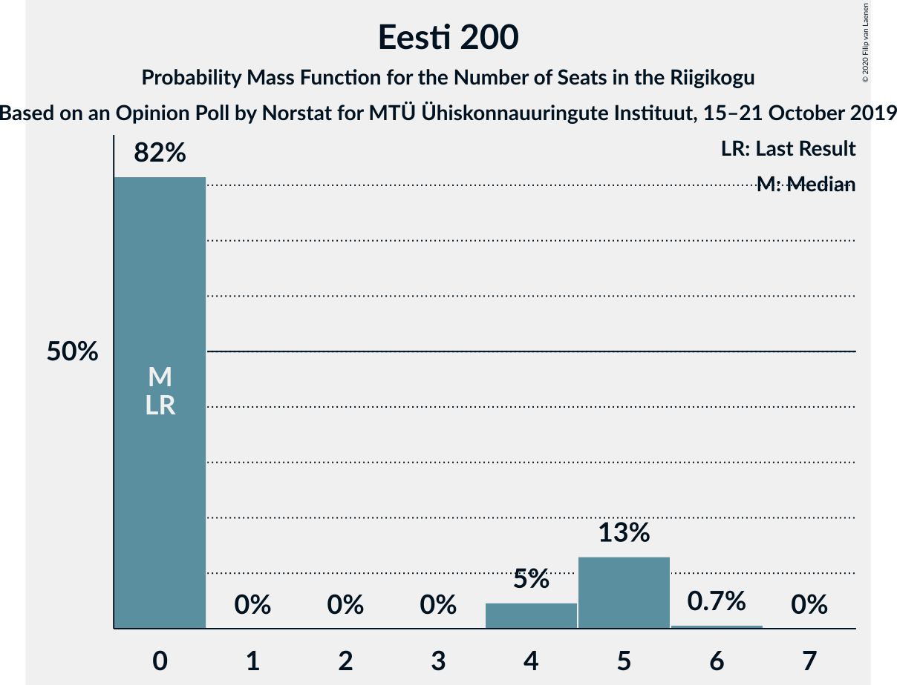

| Number of Seats | Probability | Accumulated | Special Marks |
|:---------------:|:-----------:|:-----------:|:-------------:|
| 0 | 82% | 100% | Last Result, Median |
| 1 | 0% | 18% |  |
| 2 | 0% | 18% |  |
| 3 | 0% | 18% |  |
| 4 | 5% | 18% |  |
| 5 | 13% | 14% |  |
| 6 | 0.7% | 0.7% |  |
| 7 | 0% | 0% |  |

### Erakond Eestimaa Rohelised

*For a full overview of the results for this party, see the [Erakond Eestimaa Rohelised](party-erakondeestimaarohelised.html) page.*

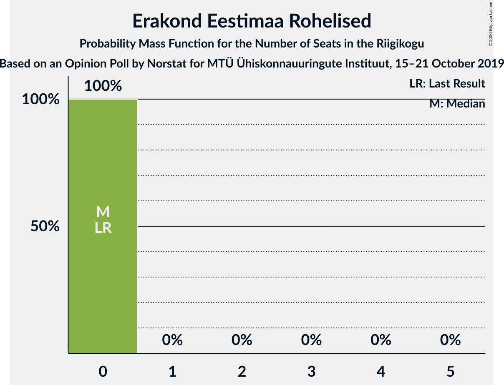

| Number of Seats | Probability | Accumulated | Special Marks |
|:---------------:|:-----------:|:-----------:|:-------------:|
| 0 | 100% | 100% | Last Result, Median |

### Eesti Vabaerakond

*For a full overview of the results for this party, see the [Eesti Vabaerakond](party-eestivabaerakond.html) page.*

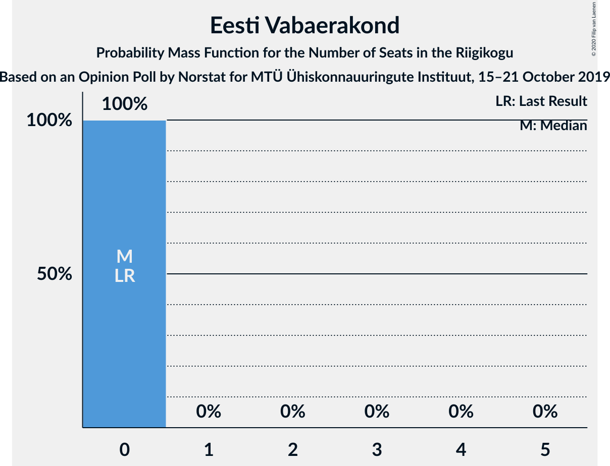

| Number of Seats | Probability | Accumulated | Special Marks |
|:---------------:|:-----------:|:-----------:|:-------------:|
| 0 | 100% | 100% | Last Result, Median |

## Coalitions

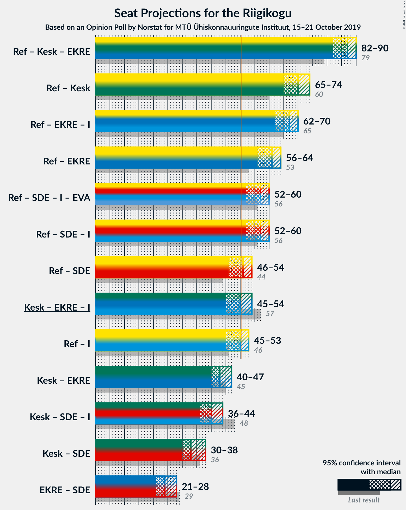

### Confidence Intervals

| Coalition | Last Result | Median | Majority? | 80% Confidence Interval | 90% Confidence Interval | 95% Confidence Interval | 99% Confidence Interval |
|:---------:|:-----------:|:------:|:---------:|:-----------------------:|:-----------------------:|:-----------------------:|:-----------------------:|
| Eesti Reformierakond – Eesti Keskerakond – Eesti Konservatiivne Rahvaerakond | 79 | 87 | 100% | 83–89 | 83–90 | 82–90 | 81–92 |
| Eesti Reformierakond – Eesti Keskerakond | 60 | 70 | 100% | 66–72 | 65–73 | 65–74 | 64–75 |
| Eesti Reformierakond – Eesti Konservatiivne Rahvaerakond – Erakond Isamaa | 65 | 67 | 100% | 64–68 | 62–69 | 62–70 | 61–71 |
| Eesti Reformierakond – Eesti Konservatiivne Rahvaerakond | 53 | 61 | 100% | 57–63 | 57–64 | 56–64 | 55–66 |
| Eesti Reformierakond – Sotsiaaldemokraatlik Erakond – Erakond Isamaa – Eesti Vabaerakond | 56 | 57 | 99.8% | 54–59 | 53–60 | 52–60 | 51–61 |
| Eesti Reformierakond – Sotsiaaldemokraatlik Erakond – Erakond Isamaa | 56 | 57 | 99.8% | 54–59 | 53–60 | 52–60 | 51–61 |
| Eesti Reformierakond – Sotsiaaldemokraatlik Erakond | 44 | 51 | 51% | 48–53 | 46–53 | 46–54 | 45–55 |
| Eesti Keskerakond – Eesti Konservatiivne Rahvaerakond – Erakond Isamaa | 57 | 50 | 36% | 47–52 | 46–53 | 45–54 | 44–55 |
| Eesti Reformierakond – Erakond Isamaa | 46 | 50 | 38% | 47–51 | 46–52 | 45–53 | 44–55 |
| Eesti Keskerakond – Eesti Konservatiivne Rahvaerakond | 45 | 43 | 0.1% | 41–46 | 40–46 | 40–47 | 38–49 |
| Eesti Keskerakond – Sotsiaaldemokraatlik Erakond – Erakond Isamaa | 48 | 40 | 0% | 37–42 | 36–43 | 36–44 | 34–45 |
| Eesti Keskerakond – Sotsiaaldemokraatlik Erakond | 36 | 33 | 0% | 31–36 | 30–36 | 30–38 | 29–39 |
| Eesti Konservatiivne Rahvaerakond – Sotsiaaldemokraatlik Erakond | 29 | 24 | 0% | 22–26 | 22–27 | 21–28 | 20–28 |

### Eesti Reformierakond – Eesti Keskerakond – Eesti Konservatiivne Rahvaerakond

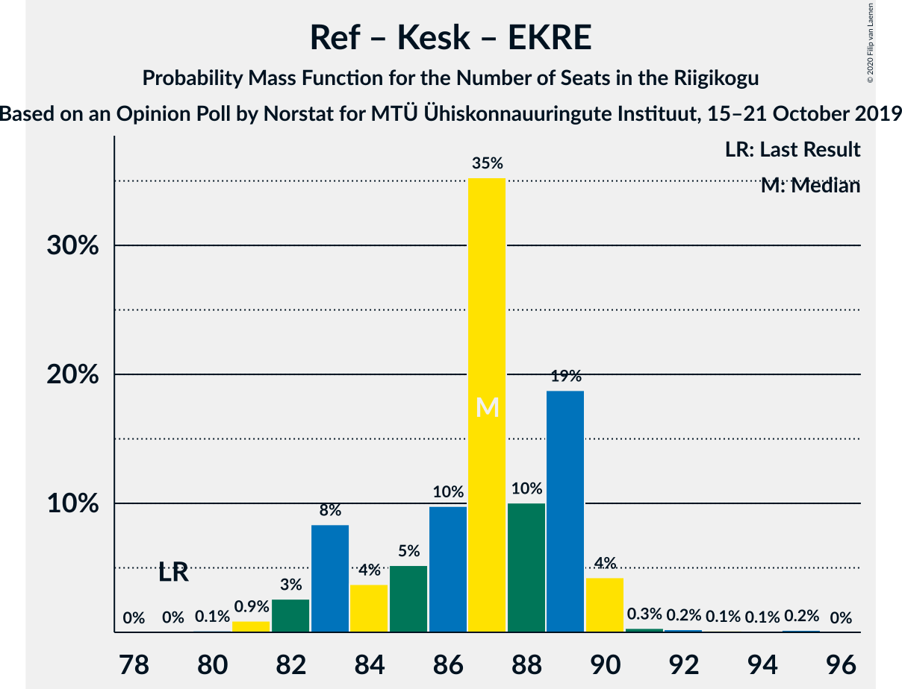

| Number of Seats | Probability | Accumulated | Special Marks |
|:---------------:|:-----------:|:-----------:|:-------------:|
| 79 | 0% | 100% | Last Result |
| 80 | 0.1% | 99.9% |  |
| 81 | 0.9% | 99.8% |  |
| 82 | 3% | 98.9% |  |
| 83 | 8% | 96% |  |
| 84 | 4% | 88% |  |
| 85 | 5% | 84% |  |
| 86 | 10% | 79% |  |
| 87 | 35% | 69% | Median |
| 88 | 10% | 34% |  |
| 89 | 19% | 24% |  |
| 90 | 4% | 5% |  |
| 91 | 0.3% | 0.9% |  |
| 92 | 0.2% | 0.6% |  |
| 93 | 0.1% | 0.4% |  |
| 94 | 0.1% | 0.2% |  |
| 95 | 0.2% | 0.2% |  |
| 96 | 0% | 0% |  |

### Eesti Reformierakond – Eesti Keskerakond

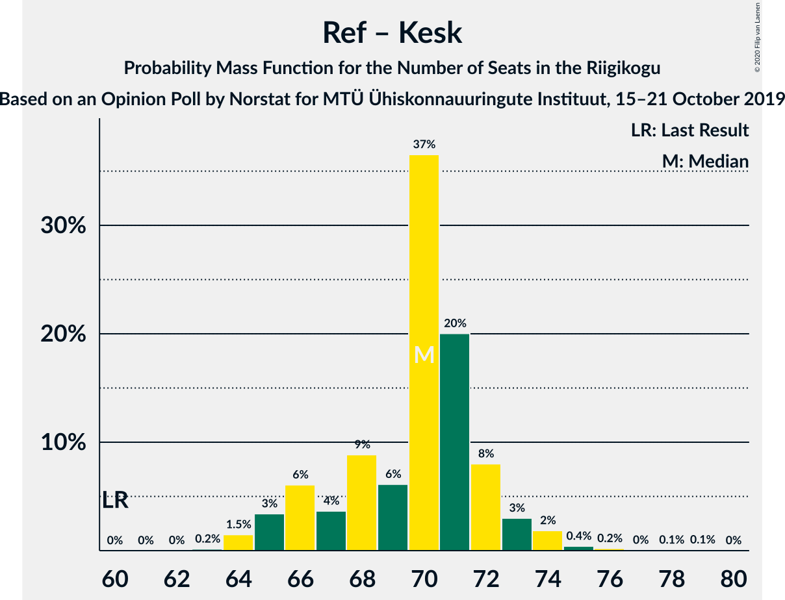

| Number of Seats | Probability | Accumulated | Special Marks |
|:---------------:|:-----------:|:-----------:|:-------------:|
| 60 | 0% | 100% | Last Result |
| 61 | 0% | 100% |  |
| 62 | 0% | 100% |  |
| 63 | 0.2% | 100% |  |
| 64 | 1.5% | 99.8% |  |
| 65 | 3% | 98% |  |
| 66 | 6% | 95% |  |
| 67 | 4% | 89% |  |
| 68 | 9% | 85% |  |
| 69 | 6% | 76% |  |
| 70 | 37% | 70% | Median |
| 71 | 20% | 34% |  |
| 72 | 8% | 14% |  |
| 73 | 3% | 6% |  |
| 74 | 2% | 3% |  |
| 75 | 0.4% | 0.8% |  |
| 76 | 0.2% | 0.4% |  |
| 77 | 0% | 0.2% |  |
| 78 | 0.1% | 0.1% |  |
| 79 | 0.1% | 0.1% |  |
| 80 | 0% | 0% |  |

### Eesti Reformierakond – Eesti Konservatiivne Rahvaerakond – Erakond Isamaa

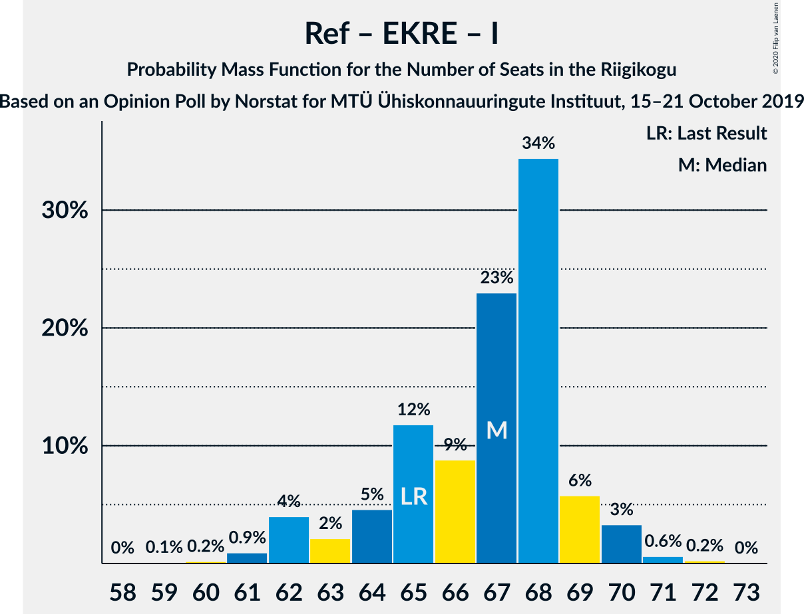

| Number of Seats | Probability | Accumulated | Special Marks |
|:---------------:|:-----------:|:-----------:|:-------------:|
| 58 | 0% | 100% |  |
| 59 | 0.1% | 99.9% |  |
| 60 | 0.2% | 99.8% |  |
| 61 | 0.9% | 99.6% |  |
| 62 | 4% | 98.7% |  |
| 63 | 2% | 95% |  |
| 64 | 5% | 93% |  |
| 65 | 12% | 88% | Last Result |
| 66 | 9% | 76% |  |
| 67 | 23% | 67% | Median |
| 68 | 34% | 44% |  |
| 69 | 6% | 10% |  |
| 70 | 3% | 4% |  |
| 71 | 0.6% | 0.9% |  |
| 72 | 0.2% | 0.3% |  |
| 73 | 0% | 0% |  |

### Eesti Reformierakond – Eesti Konservatiivne Rahvaerakond

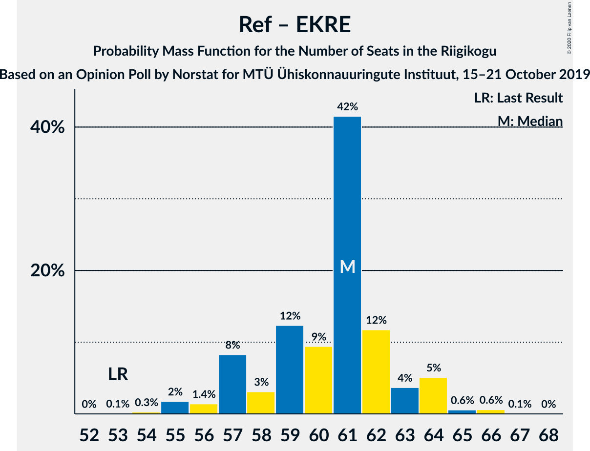

| Number of Seats | Probability | Accumulated | Special Marks |
|:---------------:|:-----------:|:-----------:|:-------------:|
| 52 | 0% | 100% |  |
| 53 | 0.1% | 99.9% | Last Result |
| 54 | 0.3% | 99.9% |  |
| 55 | 2% | 99.6% |  |
| 56 | 1.4% | 98% |  |
| 57 | 8% | 96% |  |
| 58 | 3% | 88% |  |
| 59 | 12% | 85% |  |
| 60 | 9% | 73% |  |
| 61 | 42% | 63% | Median |
| 62 | 12% | 22% |  |
| 63 | 4% | 10% |  |
| 64 | 5% | 6% |  |
| 65 | 0.6% | 1.3% |  |
| 66 | 0.6% | 0.7% |  |
| 67 | 0.1% | 0.1% |  |
| 68 | 0% | 0% |  |

### Eesti Reformierakond – Sotsiaaldemokraatlik Erakond – Erakond Isamaa – Eesti Vabaerakond

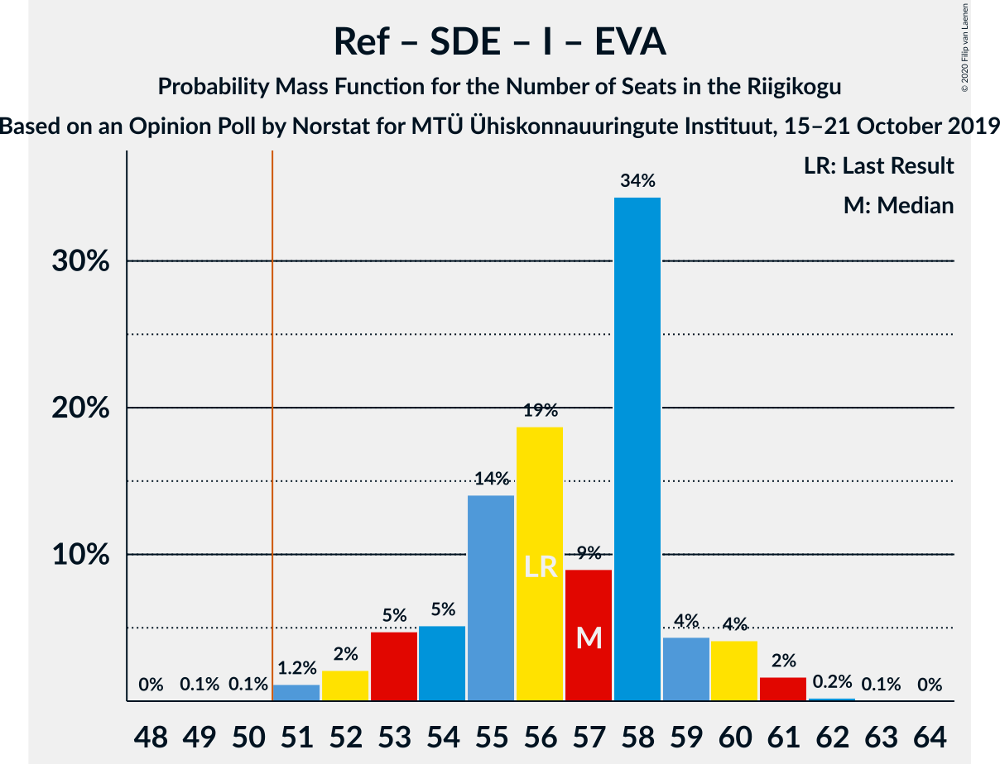

| Number of Seats | Probability | Accumulated | Special Marks |
|:---------------:|:-----------:|:-----------:|:-------------:|
| 49 | 0.1% | 100% |  |
| 50 | 0.1% | 99.9% |  |
| 51 | 1.2% | 99.8% | Majority |
| 52 | 2% | 98.7% |  |
| 53 | 5% | 97% |  |
| 54 | 5% | 92% |  |
| 55 | 14% | 87% |  |
| 56 | 19% | 73% | Last Result |
| 57 | 9% | 54% | Median |
| 58 | 34% | 45% |  |
| 59 | 4% | 10% |  |
| 60 | 4% | 6% |  |
| 61 | 2% | 2% |  |
| 62 | 0.2% | 0.3% |  |
| 63 | 0.1% | 0.1% |  |
| 64 | 0% | 0% |  |

### Eesti Reformierakond – Sotsiaaldemokraatlik Erakond – Erakond Isamaa

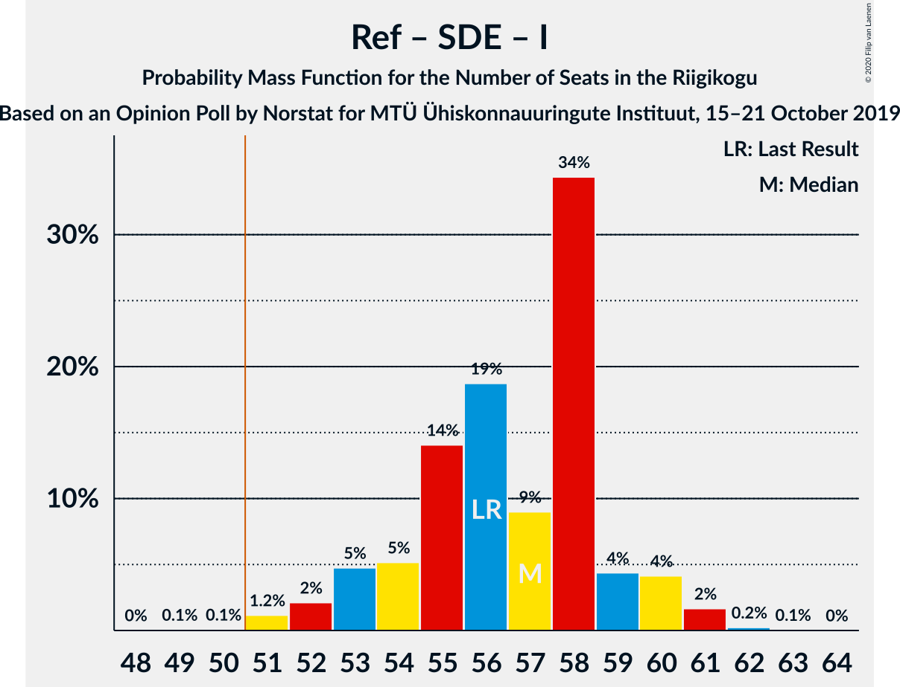

| Number of Seats | Probability | Accumulated | Special Marks |
|:---------------:|:-----------:|:-----------:|:-------------:|
| 49 | 0.1% | 100% |  |
| 50 | 0.1% | 99.9% |  |
| 51 | 1.2% | 99.8% | Majority |
| 52 | 2% | 98.7% |  |
| 53 | 5% | 97% |  |
| 54 | 5% | 92% |  |
| 55 | 14% | 87% |  |
| 56 | 19% | 73% | Last Result |
| 57 | 9% | 54% | Median |
| 58 | 34% | 45% |  |
| 59 | 4% | 10% |  |
| 60 | 4% | 6% |  |
| 61 | 2% | 2% |  |
| 62 | 0.2% | 0.3% |  |
| 63 | 0.1% | 0.1% |  |
| 64 | 0% | 0% |  |

### Eesti Reformierakond – Sotsiaaldemokraatlik Erakond

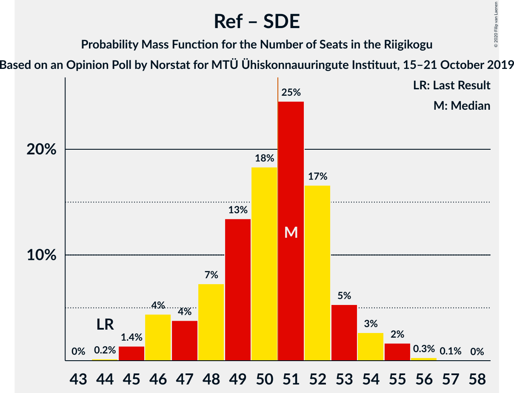

| Number of Seats | Probability | Accumulated | Special Marks |
|:---------------:|:-----------:|:-----------:|:-------------:|
| 43 | 0% | 100% |  |
| 44 | 0.2% | 99.9% | Last Result |
| 45 | 1.4% | 99.8% |  |
| 46 | 4% | 98% |  |
| 47 | 4% | 94% |  |
| 48 | 7% | 90% |  |
| 49 | 13% | 83% |  |
| 50 | 18% | 69% |  |
| 51 | 25% | 51% | Median, Majority |
| 52 | 17% | 27% |  |
| 53 | 5% | 10% |  |
| 54 | 3% | 5% |  |
| 55 | 2% | 2% |  |
| 56 | 0.3% | 0.4% |  |
| 57 | 0.1% | 0.1% |  |
| 58 | 0% | 0% |  |

### Eesti Keskerakond – Eesti Konservatiivne Rahvaerakond – Erakond Isamaa

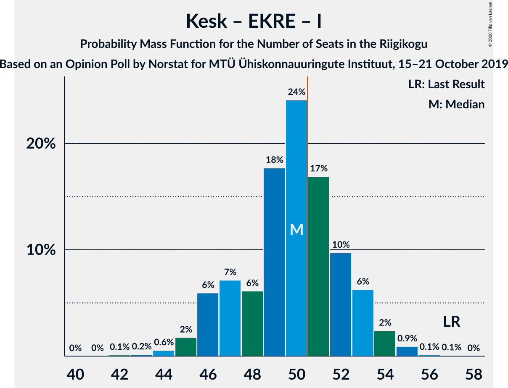

| Number of Seats | Probability | Accumulated | Special Marks |
|:---------------:|:-----------:|:-----------:|:-------------:|
| 42 | 0.1% | 100% |  |
| 43 | 0.2% | 99.9% |  |
| 44 | 0.6% | 99.7% |  |
| 45 | 2% | 99.2% |  |
| 46 | 6% | 97% |  |
| 47 | 7% | 91% |  |
| 48 | 6% | 84% |  |
| 49 | 18% | 78% | Median |
| 50 | 24% | 60% |  |
| 51 | 17% | 36% | Majority |
| 52 | 10% | 19% |  |
| 53 | 6% | 10% |  |
| 54 | 2% | 4% |  |
| 55 | 0.9% | 1.1% |  |
| 56 | 0.1% | 0.2% |  |
| 57 | 0.1% | 0.1% | Last Result |
| 58 | 0% | 0% |  |

### Eesti Reformierakond – Erakond Isamaa

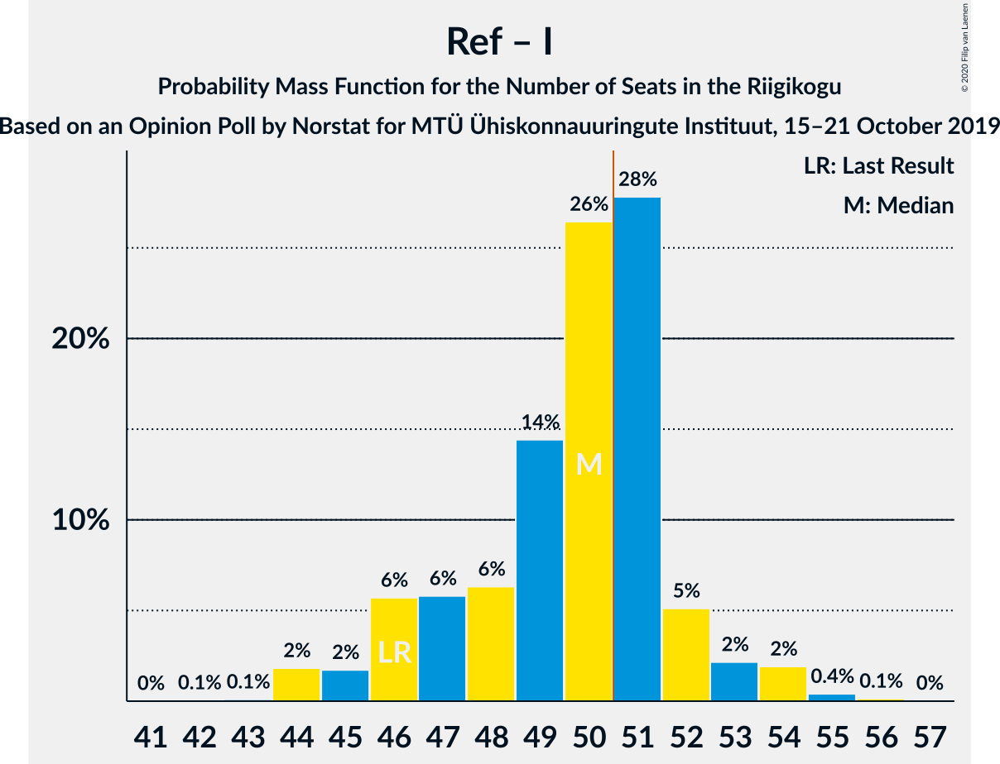

| Number of Seats | Probability | Accumulated | Special Marks |
|:---------------:|:-----------:|:-----------:|:-------------:|
| 42 | 0.1% | 100% |  |
| 43 | 0.1% | 99.9% |  |
| 44 | 2% | 99.8% |  |
| 45 | 2% | 98% |  |
| 46 | 6% | 96% | Last Result |
| 47 | 6% | 91% |  |
| 48 | 6% | 85% |  |
| 49 | 14% | 78% |  |
| 50 | 26% | 64% | Median |
| 51 | 28% | 38% | Majority |
| 52 | 5% | 10% |  |
| 53 | 2% | 5% |  |
| 54 | 2% | 2% |  |
| 55 | 0.4% | 0.6% |  |
| 56 | 0.1% | 0.2% |  |
| 57 | 0% | 0% |  |

### Eesti Keskerakond – Eesti Konservatiivne Rahvaerakond

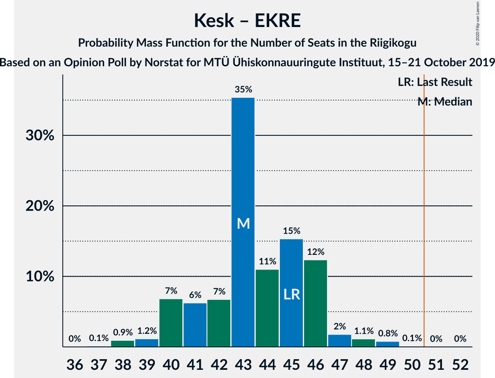

| Number of Seats | Probability | Accumulated | Special Marks |
|:---------------:|:-----------:|:-----------:|:-------------:|
| 37 | 0.1% | 100% |  |
| 38 | 0.9% | 99.8% |  |
| 39 | 1.2% | 98.9% |  |
| 40 | 7% | 98% |  |
| 41 | 6% | 91% |  |
| 42 | 7% | 85% |  |
| 43 | 35% | 78% | Median |
| 44 | 11% | 43% |  |
| 45 | 15% | 32% | Last Result |
| 46 | 12% | 16% |  |
| 47 | 2% | 4% |  |
| 48 | 1.1% | 2% |  |
| 49 | 0.8% | 1.0% |  |
| 50 | 0.1% | 0.2% |  |
| 51 | 0% | 0.1% | Majority |
| 52 | 0% | 0% |  |

### Eesti Keskerakond – Sotsiaaldemokraatlik Erakond – Erakond Isamaa

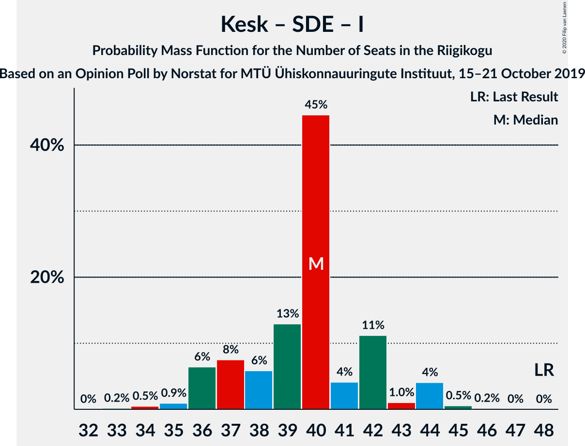

| Number of Seats | Probability | Accumulated | Special Marks |
|:---------------:|:-----------:|:-----------:|:-------------:|
| 33 | 0.2% | 100% |  |
| 34 | 0.5% | 99.8% |  |
| 35 | 0.9% | 99.3% |  |
| 36 | 6% | 98% |  |
| 37 | 8% | 92% |  |
| 38 | 6% | 84% |  |
| 39 | 13% | 79% | Median |
| 40 | 45% | 66% |  |
| 41 | 4% | 21% |  |
| 42 | 11% | 17% |  |
| 43 | 1.0% | 6% |  |
| 44 | 4% | 5% |  |
| 45 | 0.5% | 0.7% |  |
| 46 | 0.2% | 0.2% |  |
| 47 | 0% | 0% |  |
| 48 | 0% | 0% | Last Result |

### Eesti Keskerakond – Sotsiaaldemokraatlik Erakond

| Number of Seats | Probability | Accumulated | Special Marks |
|:---------------:|:-----------:|:-----------:|:-------------:|
| 28 | 0.1% | 100% |  |
| 29 | 0.8% | 99.8% |  |
| 30 | 5% | 99.0% |  |
| 31 | 9% | 94% |  |
| 32 | 6% | 85% |  |
| 33 | 39% | 79% | Median |
| 34 | 23% | 40% |  |
| 35 | 6% | 17% |  |
| 36 | 7% | 11% | Last Result |
| 37 | 1.3% | 4% |  |
| 38 | 0.7% | 3% |  |
| 39 | 2% | 2% |  |
| 40 | 0.2% | 0.2% |  |
| 41 | 0% | 0% |  |

### Eesti Konservatiivne Rahvaerakond – Sotsiaaldemokraatlik Erakond

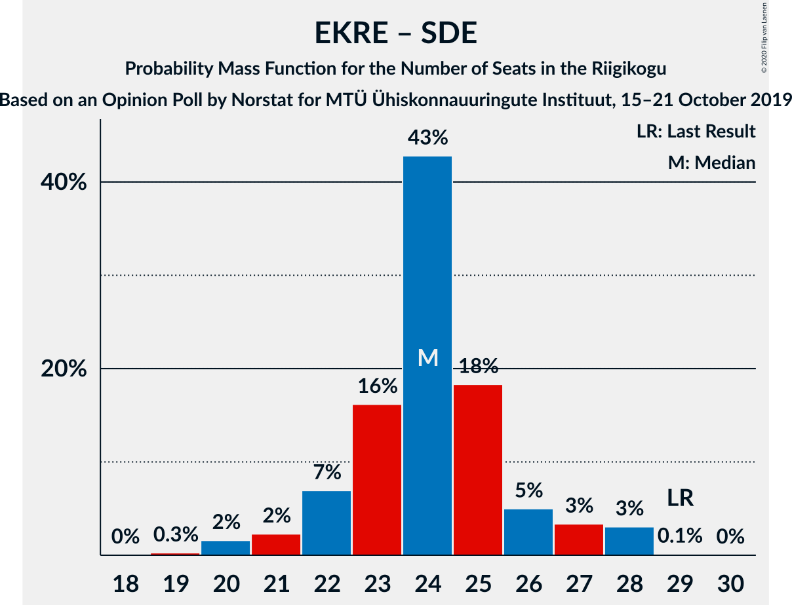

| Number of Seats | Probability | Accumulated | Special Marks |
|:---------------:|:-----------:|:-----------:|:-------------:|
| 18 | 0% | 100% |  |
| 19 | 0.3% | 99.9% |  |
| 20 | 2% | 99.7% |  |
| 21 | 2% | 98% |  |
| 22 | 7% | 96% |  |
| 23 | 16% | 89% |  |
| 24 | 43% | 73% | Median |
| 25 | 18% | 30% |  |
| 26 | 5% | 12% |  |
| 27 | 3% | 7% |  |
| 28 | 3% | 3% |  |
| 29 | 0.1% | 0.2% | Last Result |
| 30 | 0% | 0% |  |

## Technical Information

### Opinion Poll

+ **Polling firm:** Norstat
+ **Commissioner(s):** MTÜ Ühiskonnauuringute Instituut
+ **Fieldwork period:** 15–21 October 2019

### Calculations

+ **Sample size:** 1000
+ **Simulations done:** 131,072
+ **Error estimate:** 1.22%

