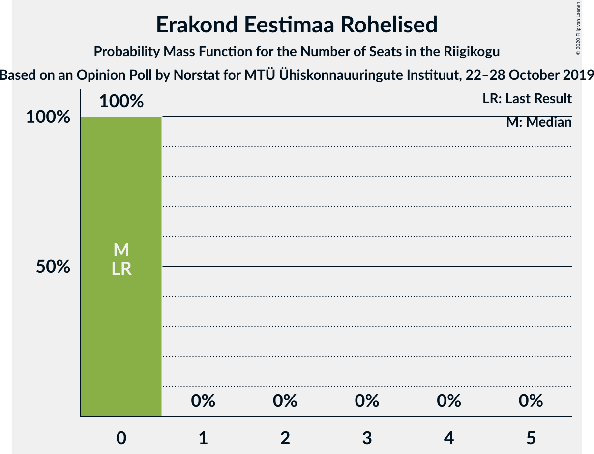

# Opinion Poll by Norstat for MTÜ Ühiskonnauuringute Instituut, 22–28 October 2019

<a href="#voting-intentions">Voting Intentions</a> | <a href="#seats">Seats</a> | <a href="#coalitions">Coalitions</a> | <a href="#technical-information">Technical Information</a>

## Voting Intentions

### Confidence Intervals

| Party | Last Result | Poll Result | 80% Confidence Interval | 90% Confidence Interval | 95% Confidence Interval | 99% Confidence Interval |
|:-----:|:-----------:|:-----------:|:-----------------------:|:-----------------------:|:-----------------------:|:-----------------------:|
| Eesti Reformierakond | 28.9% | 36.2% | 34.3–38.2% |33.7–38.7% |33.3–39.2% |32.4–40.2% |
| Eesti Keskerakond | 23.1% | 23.5% | 21.8–25.3% |21.4–25.8% |21.0–26.2% |20.2–27.1% |
| Eesti Konservatiivne Rahvaerakond | 17.8% | 17.8% | 16.3–19.4% |15.9–19.9% |15.5–20.3% |14.9–21.1% |
| Sotsiaaldemokraatlik Erakond | 9.8% | 6.3% | 5.4–7.4% |5.2–7.7% |5.0–8.0% |4.6–8.5% |
| Erakond Isamaa | 11.4% | 5.5% | 4.7–6.5% |4.4–6.8% |4.3–7.1% |3.9–7.6% |
| Eesti 200 | 4.4% | 5.1% | 4.3–6.1% |4.1–6.4% |3.9–6.6% |3.6–7.2% |
| Erakond Eestimaa Rohelised | 1.8% | 2.9% | 2.3–3.7% |2.2–3.9% |2.0–4.1% |1.8–4.6% |
| Eesti Vabaerakond | 1.2% | 0.6% | 0.4–1.1% |0.3–1.2% |0.3–1.3% |0.2–1.6% |

*Note:* The poll result column reflects the actual value used in the calculations. Published results may vary slightly, and in addition be rounded to fewer digits.

## Seats

### Confidence Intervals

| Party | Last Result | Median | 80% Confidence Interval | 90% Confidence Interval | 95% Confidence Interval | 99% Confidence Interval |
|:-----:|:-----------:|:------:|:-----------------------:|:-----------------------:|:-----------------------:|:-----------------------:|
| <a href="#eesti-reformierakond">Eesti Reformierakond</a> | 34 | 42 | 41–42 |41–43 |41–43 |39–43 |
| <a href="#eesti-keskerakond">Eesti Keskerakond</a> | 26 | 26 | 26–29 |26–32 |26–32 |25–32 |
| <a href="#eesti-konservatiivne-rahvaerakond">Eesti Konservatiivne Rahvaerakond</a> | 19 | 18 | 17–20 |17–20 |17–20 |17–23 |
| <a href="#sotsiaaldemokraatlik-erakond">Sotsiaaldemokraatlik Erakond</a> | 10 | 7 | 6–7 |0–7 |0–9 |0–9 |
| <a href="#erakond-isamaa">Erakond Isamaa</a> | 12 | 6 | 0–6 |0–7 |0–7 |0–7 |
| <a href="#eesti-200">Eesti 200</a> | 0 | 4 | 0–6 |0–6 |0–6 |0–7 |
| <a href="#erakond-eestimaa-rohelised">Erakond Eestimaa Rohelised</a> | 0 | 0 | 0 |0 |0 |0 |
| <a href="#eesti-vabaerakond">Eesti Vabaerakond</a> | 0 | 0 | 0 |0 |0 |0 |

### Eesti Reformierakond

*For a full overview of the results for this party, see the [Eesti Reformierakond](party-eestireformierakond.html) page.*

| Number of Seats | Probability | Accumulated | Special Marks |
|:---------------:|:-----------:|:-----------:|:-------------:|
| 34 | 0% | 100% | Last Result |
| 35 | 0% | 100% |  |
| 36 | 0.1% | 100% |  |
| 37 | 0.3% | 99.9% |  |
| 38 | 0% | 99.6% |  |
| 39 | 2% | 99.6% |  |
| 40 | 0% | 98% |  |
| 41 | 43% | 98% |  |
| 42 | 49% | 55% | Median |
| 43 | 6% | 6% |  |
| 44 | 0.1% | 0.1% |  |
| 45 | 0% | 0% |  |

### Eesti Keskerakond

*For a full overview of the results for this party, see the [Eesti Keskerakond](party-eestikeskerakond.html) page.*

| Number of Seats | Probability | Accumulated | Special Marks |
|:---------------:|:-----------:|:-----------:|:-------------:|
| 25 | 0.8% | 100% |  |
| 26 | 79% | 99.2% | Last Result, Median |
| 27 | 0.5% | 21% |  |
| 28 | 0% | 20% |  |
| 29 | 14% | 20% |  |
| 30 | 0.1% | 6% |  |
| 31 | 1.2% | 6% |  |
| 32 | 5% | 5% |  |
| 33 | 0% | 0% |  |

### Eesti Konservatiivne Rahvaerakond

*For a full overview of the results for this party, see the [Eesti Konservatiivne Rahvaerakond](party-eestikonservatiivnerahvaerakond.html) page.*

| Number of Seats | Probability | Accumulated | Special Marks |
|:---------------:|:-----------:|:-----------:|:-------------:|
| 15 | 0.1% | 100% |  |
| 16 | 0% | 99.9% |  |
| 17 | 14% | 99.9% |  |
| 18 | 42% | 86% | Median |
| 19 | 7% | 44% | Last Result |
| 20 | 36% | 37% |  |
| 21 | 0.1% | 0.9% |  |
| 22 | 0% | 0.8% |  |
| 23 | 0.3% | 0.8% |  |
| 24 | 0% | 0.5% |  |
| 25 | 0.5% | 0.5% |  |
| 26 | 0% | 0% |  |

### Sotsiaaldemokraatlik Erakond

*For a full overview of the results for this party, see the [Sotsiaaldemokraatlik Erakond](party-sotsiaaldemokraatlikerakond.html) page.*

| Number of Seats | Probability | Accumulated | Special Marks |
|:---------------:|:-----------:|:-----------:|:-------------:|
| 0 | 5% | 100% |  |
| 1 | 0% | 95% |  |
| 2 | 0% | 95% |  |
| 3 | 0% | 95% |  |
| 4 | 0% | 95% |  |
| 5 | 0.8% | 95% |  |
| 6 | 43% | 94% |  |
| 7 | 49% | 52% | Median |
| 8 | 0.4% | 3% |  |
| 9 | 2% | 3% |  |
| 10 | 0% | 0% | Last Result |

### Erakond Isamaa

*For a full overview of the results for this party, see the [Erakond Isamaa](party-erakondisamaa.html) page.*

| Number of Seats | Probability | Accumulated | Special Marks |
|:---------------:|:-----------:|:-----------:|:-------------:|
| 0 | 15% | 100% |  |
| 1 | 0% | 85% |  |
| 2 | 0% | 85% |  |
| 3 | 0% | 85% |  |
| 4 | 0.5% | 85% |  |
| 5 | 0.4% | 85% |  |
| 6 | 78% | 84% | Median |
| 7 | 6% | 6% |  |
| 8 | 0.1% | 0.1% |  |
| 9 | 0% | 0% |  |
| 10 | 0% | 0% |  |
| 11 | 0% | 0% |  |
| 12 | 0% | 0% | Last Result |

### Eesti 200

*For a full overview of the results for this party, see the [Eesti 200](party-eesti200.html) page.*

| Number of Seats | Probability | Accumulated | Special Marks |
|:---------------:|:-----------:|:-----------:|:-------------:|
| 0 | 44% | 100% | Last Result |
| 1 | 0% | 56% |  |
| 2 | 0% | 56% |  |
| 3 | 0% | 56% |  |
| 4 | 41% | 56% | Median |
| 5 | 0.4% | 15% |  |
| 6 | 14% | 15% |  |
| 7 | 1.1% | 1.1% |  |
| 8 | 0% | 0% |  |

### Erakond Eestimaa Rohelised

*For a full overview of the results for this party, see the [Erakond Eestimaa Rohelised](party-erakondeestimaarohelised.html) page.*

| Number of Seats | Probability | Accumulated | Special Marks |
|:---------------:|:-----------:|:-----------:|:-------------:|
| 0 | 100% | 100% | Last Result, Median |

### Eesti Vabaerakond

*For a full overview of the results for this party, see the [Eesti Vabaerakond](party-eestivabaerakond.html) page.*

| Number of Seats | Probability | Accumulated | Special Marks |
|:---------------:|:-----------:|:-----------:|:-------------:|
| 0 | 100% | 100% | Last Result, Median |

## Coalitions

### Confidence Intervals

| Coalition | Last Result | Median | Majority? | 80% Confidence Interval | 90% Confidence Interval | 95% Confidence Interval | 99% Confidence Interval |
|:---------:|:-----------:|:------:|:---------:|:-----------------------:|:-----------------------:|:-----------------------:|:-----------------------:|
| Eesti Reformierakond – Eesti Keskerakond – Eesti Konservatiivne Rahvaerakond | 79 | 88 | 100% | 85–88 | 85–94 | 85–94 | 84–94 |
| Eesti Reformierakond – Eesti Keskerakond | 60 | 68 | 100% | 67–71 | 67–75 | 67–75 | 64–75 |
| Eesti Reformierakond – Eesti Konservatiivne Rahvaerakond – Erakond Isamaa | 65 | 65 | 100% | 59–68 | 59–69 | 59–69 | 59–69 |
| Eesti Reformierakond – Eesti Konservatiivne Rahvaerakond | 53 | 59 | 100% | 59–62 | 59–62 | 59–62 | 57–65 |
| Eesti Keskerakond – Eesti Konservatiivne Rahvaerakond – Erakond Isamaa | 57 | 50 | 44% | 46–52 | 46–58 | 46–58 | 46–58 |
| Eesti Reformierakond – Sotsiaaldemokraatlik Erakond – Erakond Isamaa – Eesti Vabaerakond | 56 | 53 | 79% | 49–55 | 49–55 | 49–56 | 48–56 |
| Eesti Reformierakond – Sotsiaaldemokraatlik Erakond – Erakond Isamaa | 56 | 53 | 79% | 49–55 | 49–55 | 49–56 | 48–56 |
| Eesti Keskerakond – Eesti Konservatiivne Rahvaerakond | 45 | 46 | 6% | 44–46 | 44–51 | 44–51 | 44–52 |
| Eesti Reformierakond – Sotsiaaldemokraatlik Erakond | 44 | 49 | 0.1% | 47–49 | 43–49 | 43–50 | 43–50 |
| Eesti Reformierakond – Erakond Isamaa | 46 | 47 | 0% | 42–48 | 42–49 | 42–50 | 42–50 |
| Eesti Keskerakond – Sotsiaaldemokraatlik Erakond – Erakond Isamaa | 48 | 38 | 0% | 36–39 | 36–39 | 36–41 | 34–44 |
| Eesti Keskerakond – Sotsiaaldemokraatlik Erakond | 36 | 33 | 0% | 32–36 | 32–36 | 32–36 | 31–37 |
| Eesti Konservatiivne Rahvaerakond – Sotsiaaldemokraatlik Erakond | 29 | 24 | 0% | 24–27 | 20–27 | 19–28 | 19–28 |

### Eesti Reformierakond – Eesti Keskerakond – Eesti Konservatiivne Rahvaerakond

| Number of Seats | Probability | Accumulated | Special Marks |
|:---------------:|:-----------:|:-----------:|:-------------:|
| 79 | 0% | 100% | Last Result |
| 80 | 0% | 100% |  |
| 81 | 0% | 100% |  |
| 82 | 0.3% | 100% |  |
| 83 | 0.1% | 99.7% |  |
| 84 | 0.5% | 99.6% |  |
| 85 | 41% | 99.1% |  |
| 86 | 2% | 58% | Median |
| 87 | 0% | 56% |  |
| 88 | 49% | 56% |  |
| 89 | 0.6% | 7% |  |
| 90 | 0% | 6% |  |
| 91 | 0.3% | 6% |  |
| 92 | 0% | 6% |  |
| 93 | 0% | 6% |  |
| 94 | 5% | 6% |  |
| 95 | 0.1% | 0.1% |  |
| 96 | 0% | 0% |  |

### Eesti Reformierakond – Eesti Keskerakond

| Number of Seats | Probability | Accumulated | Special Marks |
|:---------------:|:-----------:|:-----------:|:-------------:|
| 60 | 0% | 100% | Last Result |
| 61 | 0% | 100% |  |
| 62 | 0.4% | 100% |  |
| 63 | 0% | 99.6% |  |
| 64 | 0.5% | 99.6% |  |
| 65 | 0% | 99.1% |  |
| 66 | 0% | 99.1% |  |
| 67 | 43% | 99.1% |  |
| 68 | 35% | 56% | Median |
| 69 | 0.5% | 21% |  |
| 70 | 1.0% | 20% |  |
| 71 | 13% | 19% |  |
| 72 | 0.5% | 6% |  |
| 73 | 0.1% | 5% |  |
| 74 | 0% | 5% |  |
| 75 | 5% | 5% |  |
| 76 | 0% | 0% |  |

### Eesti Reformierakond – Eesti Konservatiivne Rahvaerakond – Erakond Isamaa

| Number of Seats | Probability | Accumulated | Special Marks |
|:---------------:|:-----------:|:-----------:|:-------------:|
| 59 | 13% | 100% |  |
| 60 | 0.6% | 87% |  |
| 61 | 0% | 86% |  |
| 62 | 0.3% | 86% |  |
| 63 | 0.6% | 86% |  |
| 64 | 1.2% | 85% |  |
| 65 | 41% | 84% | Last Result |
| 66 | 2% | 43% | Median |
| 67 | 0.5% | 40% |  |
| 68 | 35% | 40% |  |
| 69 | 5% | 5% |  |
| 70 | 0% | 0% |  |

### Eesti Reformierakond – Eesti Konservatiivne Rahvaerakond

| Number of Seats | Probability | Accumulated | Special Marks |
|:---------------:|:-----------:|:-----------:|:-------------:|
| 53 | 0% | 100% | Last Result |
| 54 | 0% | 100% |  |
| 55 | 0% | 100% |  |
| 56 | 0% | 100% |  |
| 57 | 1.4% | 100% |  |
| 58 | 0.1% | 98.6% |  |
| 59 | 55% | 98.5% |  |
| 60 | 3% | 44% | Median |
| 61 | 0% | 41% |  |
| 62 | 40% | 41% |  |
| 63 | 0.1% | 1.0% |  |
| 64 | 0.1% | 0.9% |  |
| 65 | 0.3% | 0.8% |  |
| 66 | 0% | 0.5% |  |
| 67 | 0.5% | 0.5% |  |
| 68 | 0% | 0% |  |

### Eesti Keskerakond – Eesti Konservatiivne Rahvaerakond – Erakond Isamaa

| Number of Seats | Probability | Accumulated | Special Marks |
|:---------------:|:-----------:|:-----------:|:-------------:|
| 46 | 14% | 100% |  |
| 47 | 0% | 86% |  |
| 48 | 0.1% | 86% |  |
| 49 | 0.8% | 86% |  |
| 50 | 41% | 85% | Median |
| 51 | 3% | 44% | Majority |
| 52 | 35% | 42% |  |
| 53 | 0% | 6% |  |
| 54 | 0% | 6% |  |
| 55 | 0.1% | 6% |  |
| 56 | 1.0% | 6% |  |
| 57 | 0% | 5% | Last Result |
| 58 | 5% | 5% |  |
| 59 | 0% | 0% |  |

### Eesti Reformierakond – Sotsiaaldemokraatlik Erakond – Erakond Isamaa – Eesti Vabaerakond

| Number of Seats | Probability | Accumulated | Special Marks |
|:---------------:|:-----------:|:-----------:|:-------------:|
| 47 | 0.3% | 100% |  |
| 48 | 0.6% | 99.7% |  |
| 49 | 14% | 99.1% |  |
| 50 | 5% | 85% |  |
| 51 | 0% | 79% | Majority |
| 52 | 1.1% | 79% |  |
| 53 | 41% | 78% |  |
| 54 | 0% | 38% |  |
| 55 | 35% | 37% | Median |
| 56 | 3% | 3% | Last Result |
| 57 | 0% | 0% |  |

### Eesti Reformierakond – Sotsiaaldemokraatlik Erakond – Erakond Isamaa

| Number of Seats | Probability | Accumulated | Special Marks |
|:---------------:|:-----------:|:-----------:|:-------------:|
| 47 | 0.3% | 100% |  |
| 48 | 0.6% | 99.7% |  |
| 49 | 14% | 99.1% |  |
| 50 | 5% | 85% |  |
| 51 | 0% | 79% | Majority |
| 52 | 1.1% | 79% |  |
| 53 | 41% | 78% |  |
| 54 | 0% | 38% |  |
| 55 | 35% | 37% | Median |
| 56 | 3% | 3% | Last Result |
| 57 | 0% | 0% |  |

### Eesti Keskerakond – Eesti Konservatiivne Rahvaerakond

| Number of Seats | Probability | Accumulated | Special Marks |
|:---------------:|:-----------:|:-----------:|:-------------:|
| 44 | 41% | 100% | Median |
| 45 | 3% | 59% | Last Result |
| 46 | 49% | 56% |  |
| 47 | 0.1% | 7% |  |
| 48 | 0.1% | 7% |  |
| 49 | 1.3% | 7% |  |
| 50 | 0% | 6% |  |
| 51 | 5% | 6% | Majority |
| 52 | 0.5% | 0.5% |  |
| 53 | 0% | 0% |  |

### Eesti Reformierakond – Sotsiaaldemokraatlik Erakond

| Number of Seats | Probability | Accumulated | Special Marks |
|:---------------:|:-----------:|:-----------:|:-------------:|
| 41 | 0.1% | 100% |  |
| 42 | 0% | 99.9% |  |
| 43 | 5% | 99.9% |  |
| 44 | 0% | 95% | Last Result |
| 45 | 2% | 95% |  |
| 46 | 0% | 93% |  |
| 47 | 41% | 93% |  |
| 48 | 0.6% | 52% |  |
| 49 | 49% | 51% | Median |
| 50 | 3% | 3% |  |
| 51 | 0.1% | 0.1% | Majority |
| 52 | 0% | 0% |  |

### Eesti Reformierakond – Erakond Isamaa

| Number of Seats | Probability | Accumulated | Special Marks |
|:---------------:|:-----------:|:-----------:|:-------------:|
| 42 | 14% | 100% |  |
| 43 | 1.0% | 86% |  |
| 44 | 0.1% | 85% |  |
| 45 | 0% | 84% |  |
| 46 | 1.0% | 84% | Last Result |
| 47 | 43% | 83% |  |
| 48 | 35% | 40% | Median |
| 49 | 0% | 5% |  |
| 50 | 5% | 5% |  |
| 51 | 0% | 0% | Majority |

### Eesti Keskerakond – Sotsiaaldemokraatlik Erakond – Erakond Isamaa

| Number of Seats | Probability | Accumulated | Special Marks |
|:---------------:|:-----------:|:-----------:|:-------------:|
| 31 | 0.3% | 100% |  |
| 32 | 0% | 99.7% |  |
| 33 | 0% | 99.7% |  |
| 34 | 1.0% | 99.7% |  |
| 35 | 0.5% | 98.7% |  |
| 36 | 13% | 98% |  |
| 37 | 0.1% | 85% |  |
| 38 | 41% | 85% |  |
| 39 | 40% | 44% | Median |
| 40 | 0% | 4% |  |
| 41 | 3% | 4% |  |
| 42 | 0% | 1.1% |  |
| 43 | 0.1% | 1.1% |  |
| 44 | 1.0% | 1.0% |  |
| 45 | 0% | 0% |  |
| 46 | 0% | 0% |  |
| 47 | 0% | 0% |  |
| 48 | 0% | 0% | Last Result |

### Eesti Keskerakond – Sotsiaaldemokraatlik Erakond

| Number of Seats | Probability | Accumulated | Special Marks |
|:---------------:|:-----------:|:-----------:|:-------------:|
| 31 | 0.9% | 100% |  |
| 32 | 46% | 99.1% |  |
| 33 | 35% | 53% | Median |
| 34 | 1.0% | 18% |  |
| 35 | 2% | 17% |  |
| 36 | 13% | 14% | Last Result |
| 37 | 1.1% | 1.2% |  |
| 38 | 0.1% | 0.1% |  |
| 39 | 0% | 0% |  |

### Eesti Konservatiivne Rahvaerakond – Sotsiaaldemokraatlik Erakond

| Number of Seats | Probability | Accumulated | Special Marks |
|:---------------:|:-----------:|:-----------:|:-------------:|
| 19 | 5% | 100% |  |
| 20 | 0% | 95% |  |
| 21 | 0% | 95% |  |
| 22 | 0.5% | 95% |  |
| 23 | 0.1% | 94% |  |
| 24 | 55% | 94% |  |
| 25 | 0% | 39% | Median |
| 26 | 0.6% | 39% |  |
| 27 | 35% | 39% |  |
| 28 | 3% | 4% |  |
| 29 | 0% | 0.5% | Last Result |
| 30 | 0% | 0.5% |  |
| 31 | 0% | 0.5% |  |
| 32 | 0.5% | 0.5% |  |
| 33 | 0% | 0% |  |

## Technical Information

### Opinion Poll

+ **Polling firm:** Norstat
+ **Commissioner(s):** MTÜ Ühiskonnauuringute Instituut
+ **Fieldwork period:** 22–28 October 2019

### Calculations

+ **Sample size:** 1000
+ **Simulations done:** 1,024
+ **Error estimate:** 3.69%

