# Opinion Poll by Norstat for MTÜ Ühiskonnauuringute Instituut, 28 October–5 November 2019

<a href="#voting-intentions">Voting Intentions</a> | <a href="#seats">Seats</a> | <a href="#coalitions">Coalitions</a> | <a href="#technical-information">Technical Information</a>

## Voting Intentions

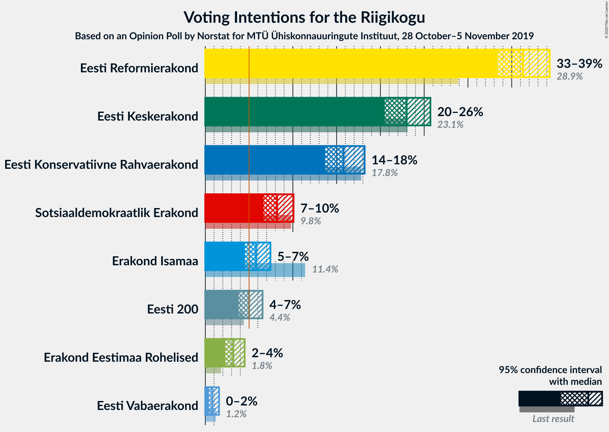

### Confidence Intervals

| Party | Last Result | Poll Result | 80% Confidence Interval | 90% Confidence Interval | 95% Confidence Interval | 99% Confidence Interval |
|:-----:|:-----------:|:-----------:|:-----------------------:|:-----------------------:|:-----------------------:|:-----------------------:|
| Eesti Reformierakond | 28.9% | 36.3% | 34.4–38.3% |33.8–38.9% |33.4–39.3% |32.5–40.3% |
| Eesti Keskerakond | 23.1% | 23.0% | 21.4–24.8% |20.9–25.3% |20.5–25.7% |19.7–26.6% |
| Eesti Konservatiivne Rahvaerakond | 17.8% | 15.8% | 14.4–17.4% |14.0–17.8% |13.7–18.2% |13.0–19.0% |
| Sotsiaaldemokraatlik Erakond | 9.8% | 8.2% | 7.2–9.4% |6.9–9.8% |6.6–10.1% |6.2–10.7% |
| Erakond Isamaa | 11.4% | 5.8% | 5.0–6.9% |4.7–7.2% |4.5–7.4% |4.1–8.0% |
| Eesti 200 | 4.4% | 5.0% | 4.2–6.0% |4.0–6.3% |3.8–6.5% |3.5–7.1% |
| Erakond Eestimaa Rohelised | 1.8% | 3.2% | 2.6–4.0% |2.4–4.3% |2.3–4.5% |2.0–4.9% |
| Eesti Vabaerakond | 1.2% | 0.8% | 0.5–1.3% |0.5–1.4% |0.4–1.6% |0.3–1.9% |

*Note:* The poll result column reflects the actual value used in the calculations. Published results may vary slightly, and in addition be rounded to fewer digits.

## Seats

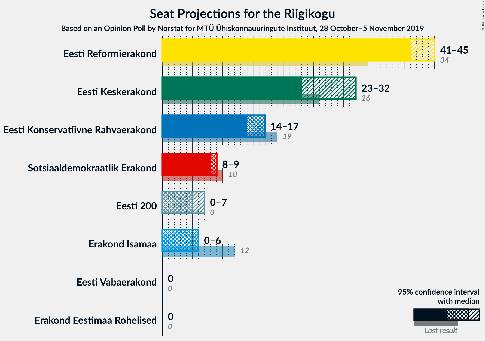

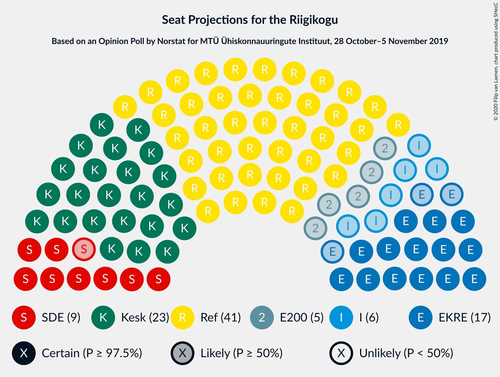

### Confidence Intervals

| Party | Last Result | Median | 80% Confidence Interval | 90% Confidence Interval | 95% Confidence Interval | 99% Confidence Interval |
|:-----:|:-----------:|:------:|:-----------------------:|:-----------------------:|:-----------------------:|:-----------------------:|
| <a href="#eesti-reformierakond">Eesti Reformierakond</a> | 34 | 41 | 41–43 |41–43 |41–45 |36–45 |
| <a href="#eesti-keskerakond">Eesti Keskerakond</a> | 26 | 23 | 23–26 |23–28 |23–32 |23–32 |
| <a href="#eesti-konservatiivne-rahvaerakond">Eesti Konservatiivne Rahvaerakond</a> | 19 | 17 | 17 |16–17 |14–17 |14–18 |
| <a href="#sotsiaaldemokraatlik-erakond">Sotsiaaldemokraatlik Erakond</a> | 10 | 9 | 9 |8–9 |8–9 |7–9 |
| <a href="#erakond-isamaa">Erakond Isamaa</a> | 12 | 6 | 6 |0–6 |0–6 |0–6 |
| <a href="#eesti-200">Eesti 200</a> | 0 | 5 | 0–5 |0–5 |0–7 |0–7 |
| <a href="#erakond-eestimaa-rohelised">Erakond Eestimaa Rohelised</a> | 0 | 0 | 0 |0 |0 |0 |
| <a href="#eesti-vabaerakond">Eesti Vabaerakond</a> | 0 | 0 | 0 |0 |0 |0 |

### Eesti Reformierakond

*For a full overview of the results for this party, see the [Eesti Reformierakond](party-eestireformierakond.html) page.*

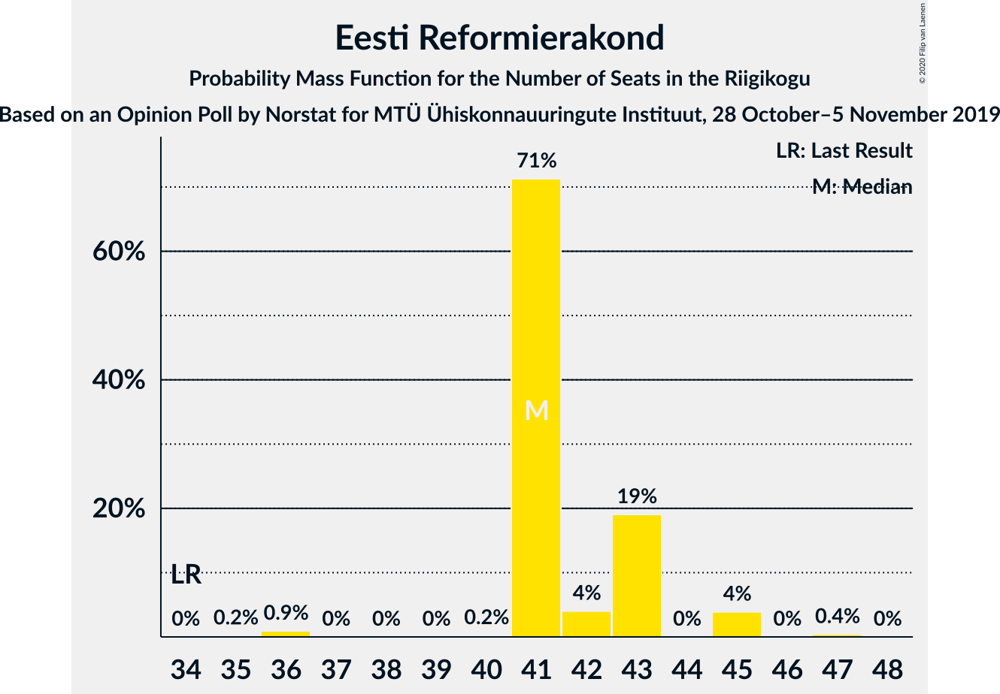

| Number of Seats | Probability | Accumulated | Special Marks |
|:---------------:|:-----------:|:-----------:|:-------------:|
| 34 | 0% | 100% | Last Result |
| 35 | 0.2% | 100% |  |
| 36 | 0.9% | 99.8% |  |
| 37 | 0% | 98.9% |  |
| 38 | 0% | 98.9% |  |
| 39 | 0% | 98.9% |  |
| 40 | 0.2% | 98.9% |  |
| 41 | 71% | 98.7% | Median |
| 42 | 4% | 27% |  |
| 43 | 19% | 23% |  |
| 44 | 0% | 4% |  |
| 45 | 4% | 4% |  |
| 46 | 0% | 0.4% |  |
| 47 | 0.4% | 0.4% |  |
| 48 | 0% | 0% |  |

### Eesti Keskerakond

*For a full overview of the results for this party, see the [Eesti Keskerakond](party-eestikeskerakond.html) page.*

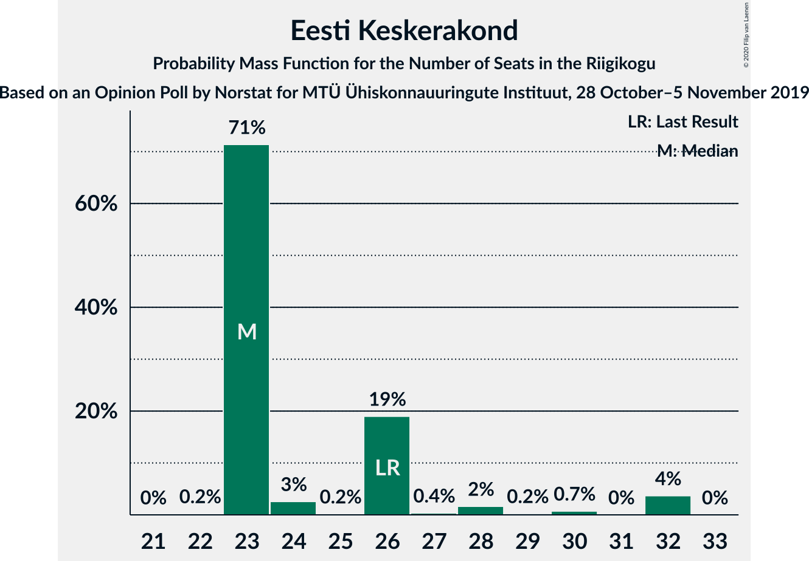

| Number of Seats | Probability | Accumulated | Special Marks |
|:---------------:|:-----------:|:-----------:|:-------------:|
| 22 | 0.2% | 100% |  |
| 23 | 71% | 99.8% | Median |
| 24 | 3% | 28% |  |
| 25 | 0.2% | 26% |  |
| 26 | 19% | 26% | Last Result |
| 27 | 0.4% | 7% |  |
| 28 | 2% | 6% |  |
| 29 | 0.2% | 5% |  |
| 30 | 0.7% | 4% |  |
| 31 | 0% | 4% |  |
| 32 | 4% | 4% |  |
| 33 | 0% | 0% |  |

### Eesti Konservatiivne Rahvaerakond

*For a full overview of the results for this party, see the [Eesti Konservatiivne Rahvaerakond](party-eestikonservatiivnerahvaerakond.html) page.*

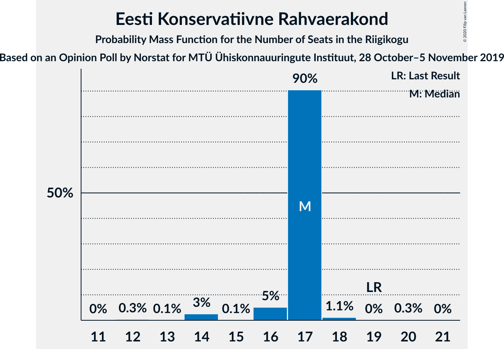

| Number of Seats | Probability | Accumulated | Special Marks |
|:---------------:|:-----------:|:-----------:|:-------------:|
| 12 | 0.3% | 100% |  |
| 13 | 0.1% | 99.7% |  |
| 14 | 3% | 99.6% |  |
| 15 | 0.1% | 97% |  |
| 16 | 5% | 97% |  |
| 17 | 90% | 92% | Median |
| 18 | 1.1% | 1.5% |  |
| 19 | 0% | 0.3% | Last Result |
| 20 | 0.3% | 0.3% |  |
| 21 | 0% | 0% |  |

### Sotsiaaldemokraatlik Erakond

*For a full overview of the results for this party, see the [Sotsiaaldemokraatlik Erakond](party-sotsiaaldemokraatlikerakond.html) page.*

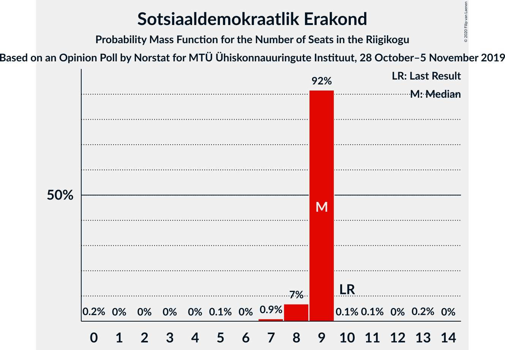

| Number of Seats | Probability | Accumulated | Special Marks |
|:---------------:|:-----------:|:-----------:|:-------------:|
| 0 | 0.2% | 100% |  |
| 1 | 0% | 99.8% |  |
| 2 | 0% | 99.8% |  |
| 3 | 0% | 99.8% |  |
| 4 | 0% | 99.8% |  |
| 5 | 0.1% | 99.8% |  |
| 6 | 0% | 99.8% |  |
| 7 | 0.9% | 99.8% |  |
| 8 | 7% | 98.8% |  |
| 9 | 92% | 92% | Median |
| 10 | 0.1% | 0.4% | Last Result |
| 11 | 0.1% | 0.3% |  |
| 12 | 0% | 0.2% |  |
| 13 | 0.2% | 0.2% |  |
| 14 | 0% | 0% |  |

### Erakond Isamaa

*For a full overview of the results for this party, see the [Erakond Isamaa](party-erakondisamaa.html) page.*

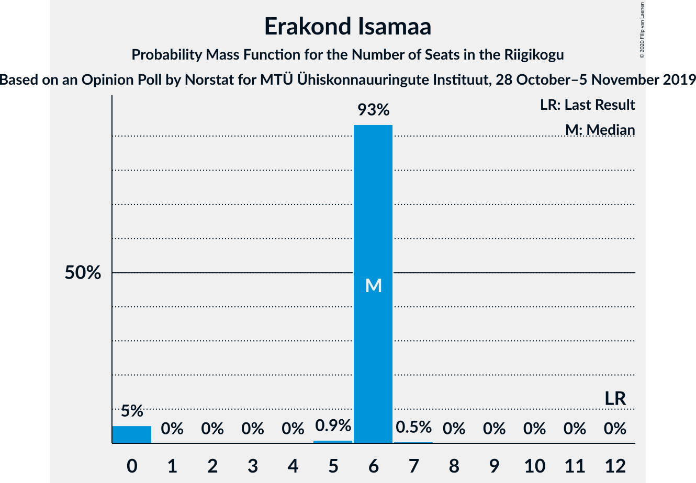

| Number of Seats | Probability | Accumulated | Special Marks |
|:---------------:|:-----------:|:-----------:|:-------------:|
| 0 | 5% | 100% |  |
| 1 | 0% | 95% |  |
| 2 | 0% | 95% |  |
| 3 | 0% | 95% |  |
| 4 | 0% | 95% |  |
| 5 | 0.9% | 95% |  |
| 6 | 93% | 94% | Median |
| 7 | 0.5% | 0.5% |  |
| 8 | 0% | 0% |  |
| 9 | 0% | 0% |  |
| 10 | 0% | 0% |  |
| 11 | 0% | 0% |  |
| 12 | 0% | 0% | Last Result |

### Eesti 200

*For a full overview of the results for this party, see the [Eesti 200](party-eesti200.html) page.*

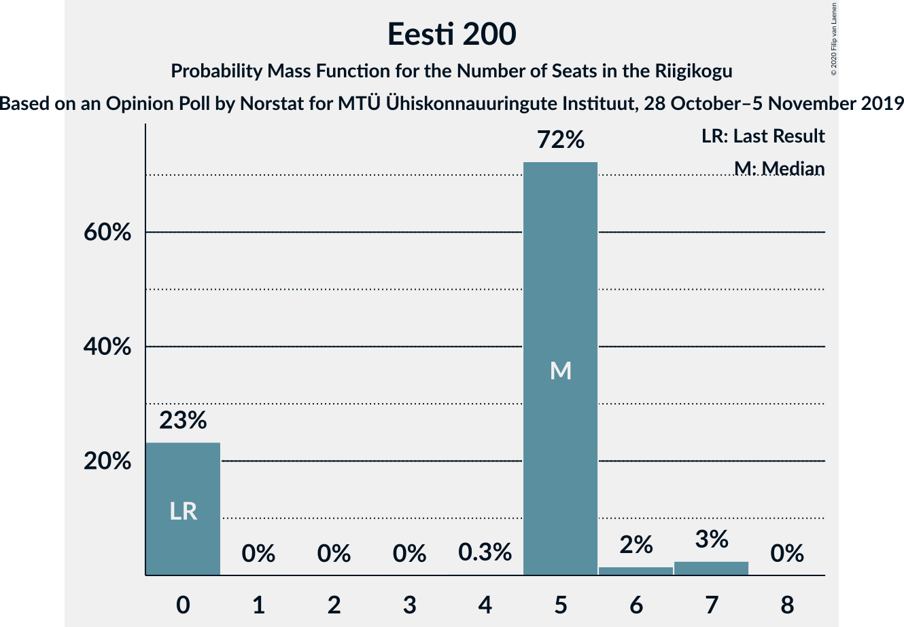

| Number of Seats | Probability | Accumulated | Special Marks |
|:---------------:|:-----------:|:-----------:|:-------------:|
| 0 | 23% | 100% | Last Result |
| 1 | 0% | 77% |  |
| 2 | 0% | 77% |  |
| 3 | 0% | 77% |  |
| 4 | 0.3% | 77% |  |
| 5 | 72% | 76% | Median |
| 6 | 2% | 4% |  |
| 7 | 3% | 3% |  |
| 8 | 0% | 0% |  |

### Erakond Eestimaa Rohelised

*For a full overview of the results for this party, see the [Erakond Eestimaa Rohelised](party-erakondeestimaarohelised.html) page.*

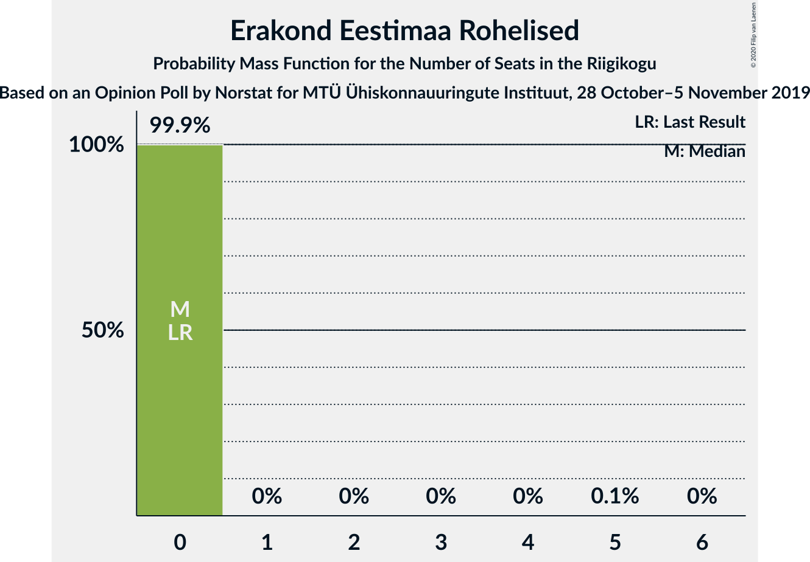

| Number of Seats | Probability | Accumulated | Special Marks |
|:---------------:|:-----------:|:-----------:|:-------------:|
| 0 | 99.9% | 100% | Last Result, Median |
| 1 | 0% | 0.1% |  |
| 2 | 0% | 0.1% |  |
| 3 | 0% | 0.1% |  |
| 4 | 0% | 0.1% |  |
| 5 | 0.1% | 0.1% |  |
| 6 | 0% | 0% |  |

### Eesti Vabaerakond

*For a full overview of the results for this party, see the [Eesti Vabaerakond](party-eestivabaerakond.html) page.*

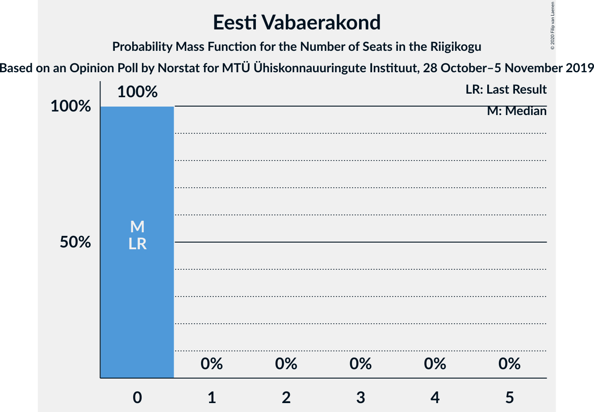

| Number of Seats | Probability | Accumulated | Special Marks |
|:---------------:|:-----------:|:-----------:|:-------------:|
| 0 | 100% | 100% | Last Result, Median |

## Coalitions

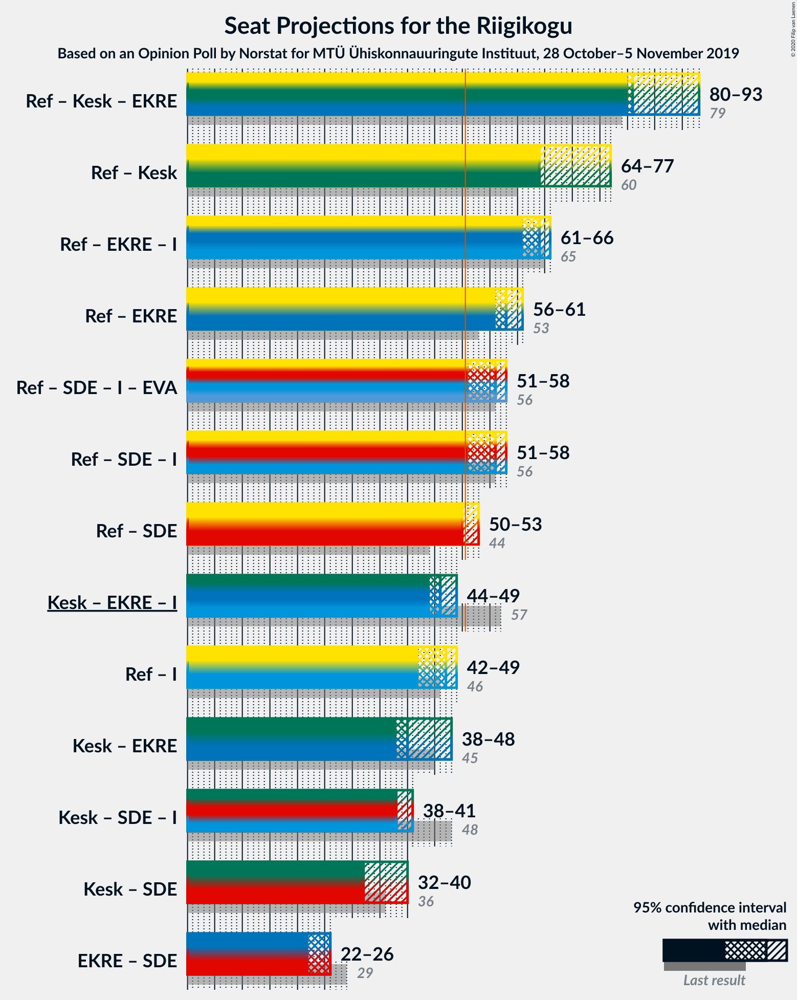

### Confidence Intervals

| Coalition | Last Result | Median | Majority? | 80% Confidence Interval | 90% Confidence Interval | 95% Confidence Interval | 99% Confidence Interval |
|:---------:|:-----------:|:------:|:---------:|:-----------------------:|:-----------------------:|:-----------------------:|:-----------------------:|
| Eesti Reformierakond – Eesti Keskerakond – Eesti Konservatiivne Rahvaerakond | 79 | 81 | 100% | 81–86 | 81–86 | 80–93 | 80–93 |
| Eesti Reformierakond – Eesti Keskerakond | 60 | 64 | 100% | 64–69 | 64–70 | 64–77 | 64–77 |
| Eesti Reformierakond – Eesti Konservatiivne Rahvaerakond – Erakond Isamaa | 65 | 64 | 100% | 64–66 | 61–66 | 61–66 | 58–66 |
| Eesti Reformierakond – Eesti Konservatiivne Rahvaerakond | 53 | 58 | 100% | 58–60 | 58–60 | 56–61 | 54–61 |
| Eesti Reformierakond – Sotsiaaldemokraatlik Erakond – Erakond Isamaa – Eesti Vabaerakond | 56 | 56 | 98.9% | 56–58 | 53–58 | 51–58 | 48–58 |
| Eesti Reformierakond – Sotsiaaldemokraatlik Erakond – Erakond Isamaa | 56 | 56 | 98.9% | 56–58 | 53–58 | 51–58 | 48–58 |
| Eesti Reformierakond – Sotsiaaldemokraatlik Erakond | 44 | 50 | 25% | 50–52 | 50–52 | 50–53 | 43–53 |
| Eesti Keskerakond – Eesti Konservatiivne Rahvaerakond – Erakond Isamaa | 57 | 46 | 1.3% | 46–49 | 46–49 | 44–49 | 44–53 |
| Eesti Reformierakond – Erakond Isamaa | 46 | 47 | 0.6% | 47–49 | 45–49 | 42–49 | 41–51 |
| Eesti Keskerakond – Eesti Konservatiivne Rahvaerakond | 45 | 40 | 0% | 40–43 | 40–45 | 38–48 | 38–48 |
| Eesti Keskerakond – Sotsiaaldemokraatlik Erakond – Erakond Isamaa | 48 | 38 | 0% | 38–41 | 38–41 | 38–41 | 37–42 |
| Eesti Keskerakond – Sotsiaaldemokraatlik Erakond | 36 | 32 | 0% | 32–35 | 32–37 | 32–40 | 32–40 |
| Eesti Konservatiivne Rahvaerakond – Sotsiaaldemokraatlik Erakond | 29 | 26 | 0% | 26 | 24–26 | 22–26 | 20–26 |

### Eesti Reformierakond – Eesti Keskerakond – Eesti Konservatiivne Rahvaerakond

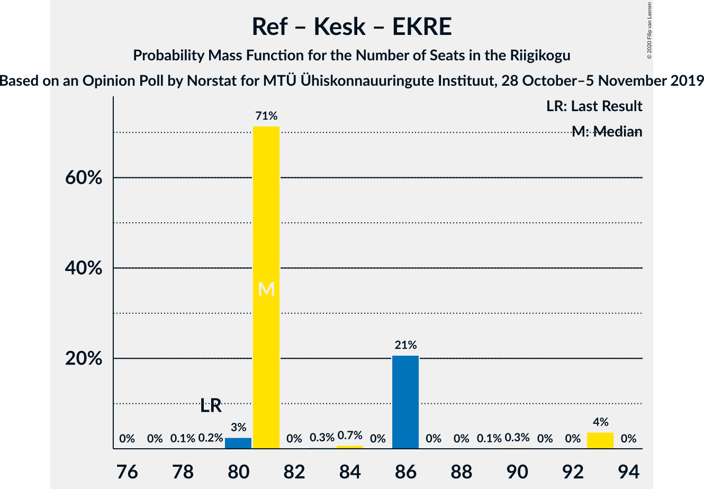

| Number of Seats | Probability | Accumulated | Special Marks |
|:---------------:|:-----------:|:-----------:|:-------------:|
| 78 | 0.1% | 100% |  |
| 79 | 0.2% | 99.9% | Last Result |
| 80 | 3% | 99.7% |  |
| 81 | 71% | 97% | Median |
| 82 | 0% | 26% |  |
| 83 | 0.3% | 26% |  |
| 84 | 0.7% | 26% |  |
| 85 | 0% | 25% |  |
| 86 | 21% | 25% |  |
| 87 | 0% | 4% |  |
| 88 | 0% | 4% |  |
| 89 | 0.1% | 4% |  |
| 90 | 0.3% | 4% |  |
| 91 | 0% | 4% |  |
| 92 | 0% | 4% |  |
| 93 | 4% | 4% |  |
| 94 | 0% | 0% |  |

### Eesti Reformierakond – Eesti Keskerakond

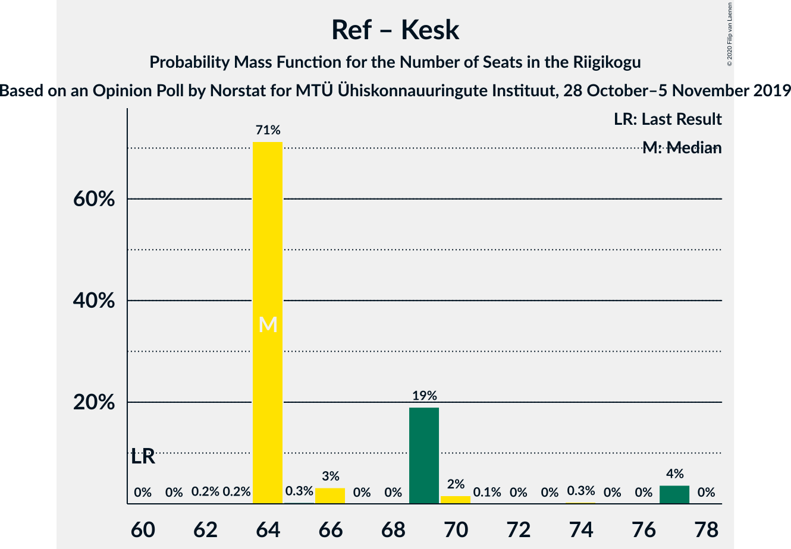

| Number of Seats | Probability | Accumulated | Special Marks |
|:---------------:|:-----------:|:-----------:|:-------------:|
| 60 | 0% | 100% | Last Result |
| 61 | 0% | 100% |  |
| 62 | 0.2% | 100% |  |
| 63 | 0.2% | 99.8% |  |
| 64 | 71% | 99.6% | Median |
| 65 | 0.3% | 28% |  |
| 66 | 3% | 28% |  |
| 67 | 0% | 25% |  |
| 68 | 0% | 25% |  |
| 69 | 19% | 25% |  |
| 70 | 2% | 6% |  |
| 71 | 0.1% | 4% |  |
| 72 | 0% | 4% |  |
| 73 | 0% | 4% |  |
| 74 | 0.3% | 4% |  |
| 75 | 0% | 4% |  |
| 76 | 0% | 4% |  |
| 77 | 4% | 4% |  |
| 78 | 0% | 0% |  |

### Eesti Reformierakond – Eesti Konservatiivne Rahvaerakond – Erakond Isamaa

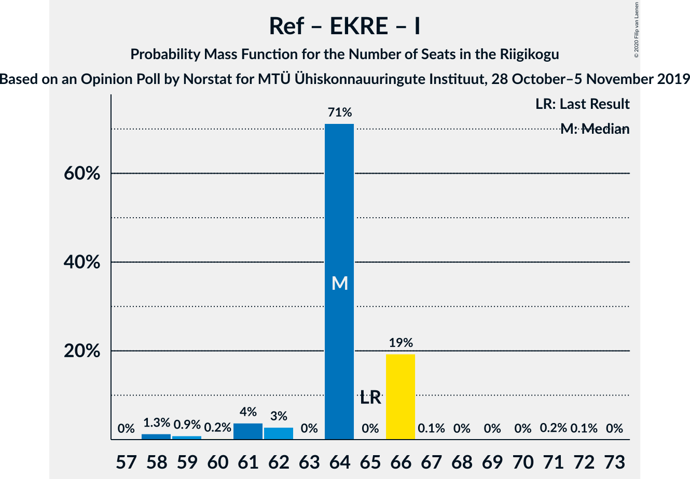

| Number of Seats | Probability | Accumulated | Special Marks |
|:---------------:|:-----------:|:-----------:|:-------------:|
| 58 | 1.3% | 100% |  |
| 59 | 0.9% | 98.7% |  |
| 60 | 0.2% | 98% |  |
| 61 | 4% | 98% |  |
| 62 | 3% | 94% |  |
| 63 | 0% | 91% |  |
| 64 | 71% | 91% | Median |
| 65 | 0% | 20% | Last Result |
| 66 | 19% | 20% |  |
| 67 | 0.1% | 0.3% |  |
| 68 | 0% | 0.2% |  |
| 69 | 0% | 0.2% |  |
| 70 | 0% | 0.2% |  |
| 71 | 0.2% | 0.2% |  |
| 72 | 0.1% | 0.1% |  |
| 73 | 0% | 0% |  |

### Eesti Reformierakond – Eesti Konservatiivne Rahvaerakond

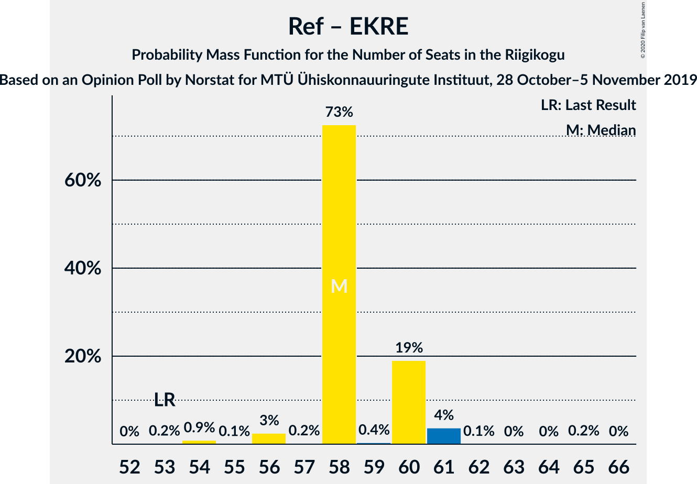

| Number of Seats | Probability | Accumulated | Special Marks |
|:---------------:|:-----------:|:-----------:|:-------------:|
| 53 | 0.2% | 100% | Last Result |
| 54 | 0.9% | 99.8% |  |
| 55 | 0.1% | 98.9% |  |
| 56 | 3% | 98.8% |  |
| 57 | 0.2% | 96% |  |
| 58 | 73% | 96% | Median |
| 59 | 0.4% | 23% |  |
| 60 | 19% | 23% |  |
| 61 | 4% | 4% |  |
| 62 | 0.1% | 0.3% |  |
| 63 | 0% | 0.2% |  |
| 64 | 0% | 0.2% |  |
| 65 | 0.2% | 0.2% |  |
| 66 | 0% | 0% |  |

### Eesti Reformierakond – Sotsiaaldemokraatlik Erakond – Erakond Isamaa – Eesti Vabaerakond

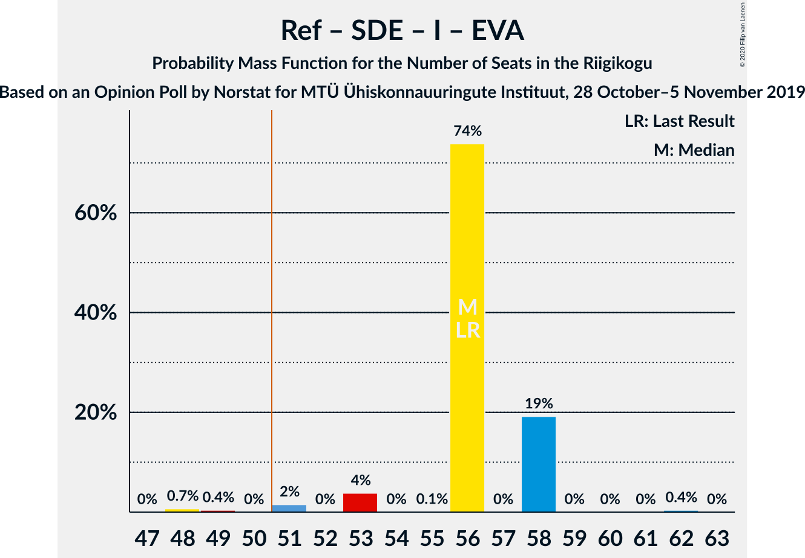

| Number of Seats | Probability | Accumulated | Special Marks |
|:---------------:|:-----------:|:-----------:|:-------------:|
| 48 | 0.7% | 100% |  |
| 49 | 0.4% | 99.3% |  |
| 50 | 0% | 98.9% |  |
| 51 | 2% | 98.9% | Majority |
| 52 | 0% | 97% |  |
| 53 | 4% | 97% |  |
| 54 | 0% | 94% |  |
| 55 | 0.1% | 94% |  |
| 56 | 74% | 93% | Last Result, Median |
| 57 | 0% | 20% |  |
| 58 | 19% | 20% |  |
| 59 | 0% | 0.4% |  |
| 60 | 0% | 0.4% |  |
| 61 | 0% | 0.4% |  |
| 62 | 0.4% | 0.4% |  |
| 63 | 0% | 0% |  |

### Eesti Reformierakond – Sotsiaaldemokraatlik Erakond – Erakond Isamaa

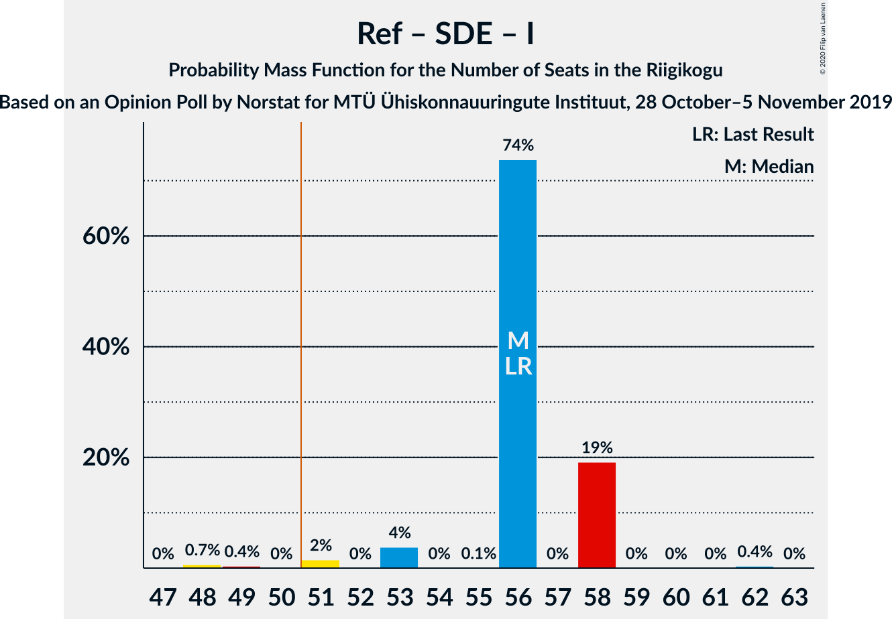

| Number of Seats | Probability | Accumulated | Special Marks |
|:---------------:|:-----------:|:-----------:|:-------------:|
| 48 | 0.7% | 100% |  |
| 49 | 0.4% | 99.3% |  |
| 50 | 0% | 98.9% |  |
| 51 | 2% | 98.9% | Majority |
| 52 | 0% | 97% |  |
| 53 | 4% | 97% |  |
| 54 | 0% | 94% |  |
| 55 | 0.1% | 94% |  |
| 56 | 74% | 93% | Last Result, Median |
| 57 | 0% | 20% |  |
| 58 | 19% | 20% |  |
| 59 | 0% | 0.4% |  |
| 60 | 0% | 0.4% |  |
| 61 | 0% | 0.4% |  |
| 62 | 0.4% | 0.4% |  |
| 63 | 0% | 0% |  |

### Eesti Reformierakond – Sotsiaaldemokraatlik Erakond

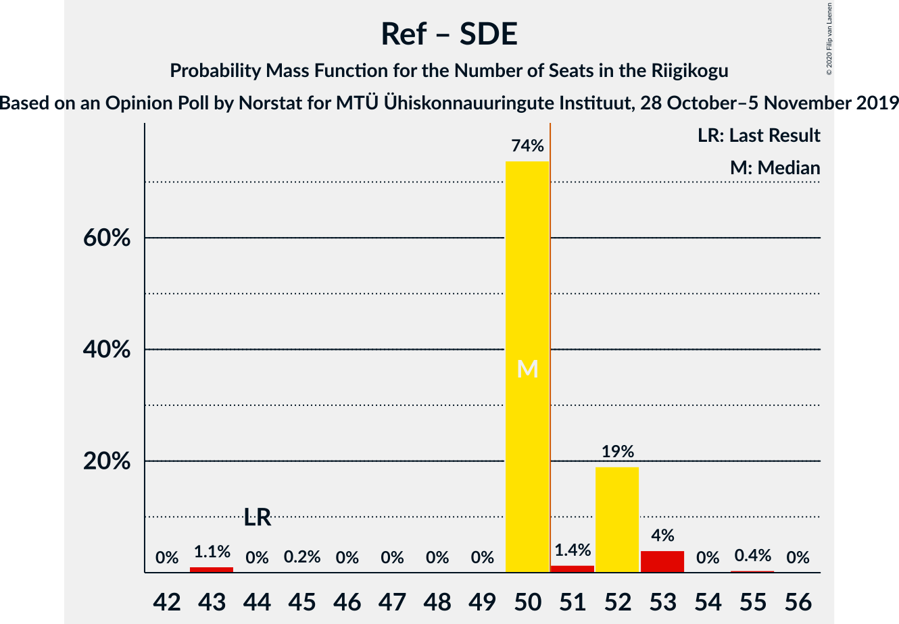

| Number of Seats | Probability | Accumulated | Special Marks |
|:---------------:|:-----------:|:-----------:|:-------------:|
| 43 | 1.1% | 100% |  |
| 44 | 0% | 98.9% | Last Result |
| 45 | 0.2% | 98.9% |  |
| 46 | 0% | 98.7% |  |
| 47 | 0% | 98.7% |  |
| 48 | 0% | 98.7% |  |
| 49 | 0% | 98.7% |  |
| 50 | 74% | 98.6% | Median |
| 51 | 1.4% | 25% | Majority |
| 52 | 19% | 23% |  |
| 53 | 4% | 4% |  |
| 54 | 0% | 0.4% |  |
| 55 | 0.4% | 0.4% |  |
| 56 | 0% | 0% |  |

### Eesti Keskerakond – Eesti Konservatiivne Rahvaerakond – Erakond Isamaa

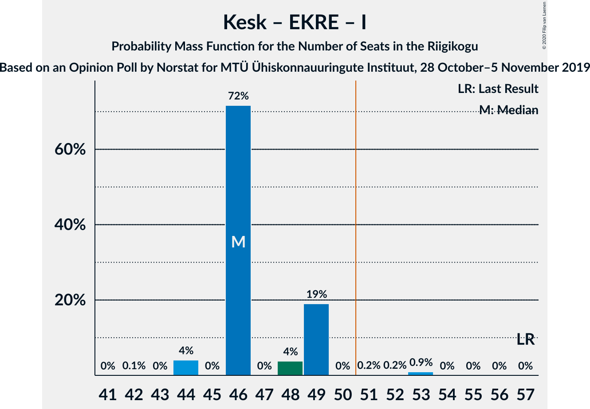

| Number of Seats | Probability | Accumulated | Special Marks |
|:---------------:|:-----------:|:-----------:|:-------------:|
| 42 | 0.1% | 100% |  |
| 43 | 0% | 99.9% |  |
| 44 | 4% | 99.9% |  |
| 45 | 0% | 96% |  |
| 46 | 72% | 96% | Median |
| 47 | 0% | 24% |  |
| 48 | 4% | 24% |  |
| 49 | 19% | 20% |  |
| 50 | 0% | 1.3% |  |
| 51 | 0.2% | 1.3% | Majority |
| 52 | 0.2% | 1.2% |  |
| 53 | 0.9% | 1.0% |  |
| 54 | 0% | 0% |  |
| 55 | 0% | 0% |  |
| 56 | 0% | 0% |  |
| 57 | 0% | 0% | Last Result |

### Eesti Reformierakond – Erakond Isamaa

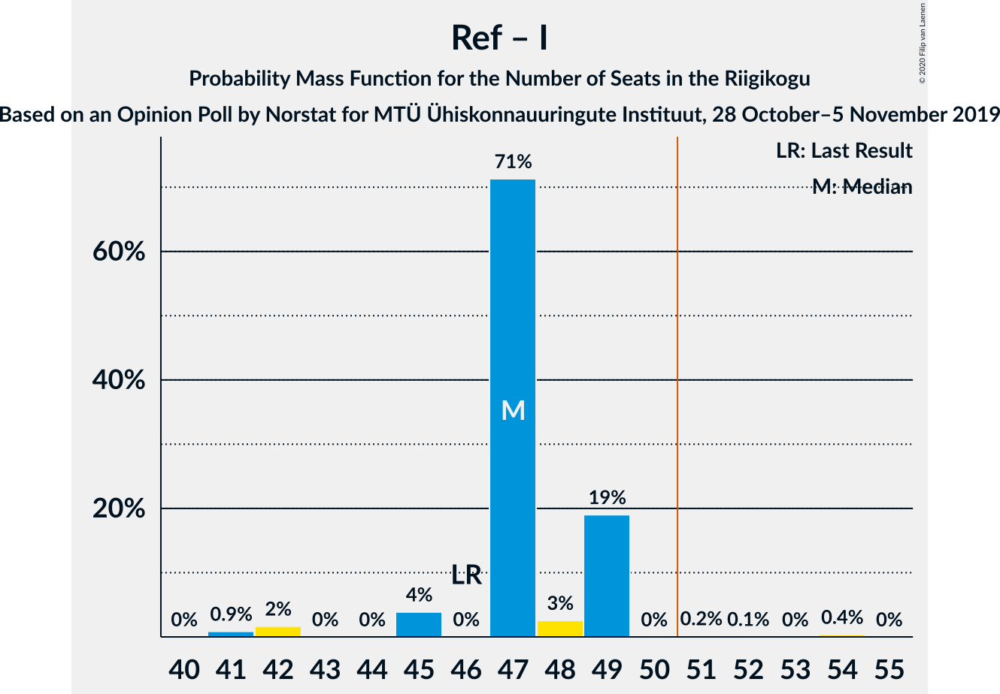

| Number of Seats | Probability | Accumulated | Special Marks |
|:---------------:|:-----------:|:-----------:|:-------------:|
| 41 | 0.9% | 100% |  |
| 42 | 2% | 99.1% |  |
| 43 | 0% | 97% |  |
| 44 | 0% | 97% |  |
| 45 | 4% | 97% |  |
| 46 | 0% | 94% | Last Result |
| 47 | 71% | 94% | Median |
| 48 | 3% | 22% |  |
| 49 | 19% | 20% |  |
| 50 | 0% | 0.6% |  |
| 51 | 0.2% | 0.6% | Majority |
| 52 | 0.1% | 0.4% |  |
| 53 | 0% | 0.4% |  |
| 54 | 0.4% | 0.4% |  |
| 55 | 0% | 0% |  |

### Eesti Keskerakond – Eesti Konservatiivne Rahvaerakond

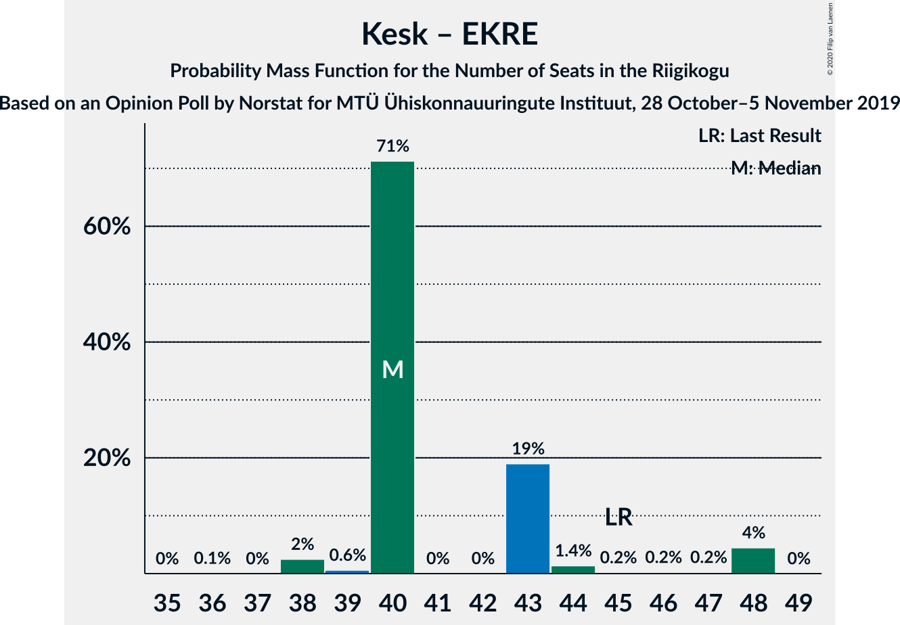

| Number of Seats | Probability | Accumulated | Special Marks |
|:---------------:|:-----------:|:-----------:|:-------------:|
| 36 | 0.1% | 100% |  |
| 37 | 0% | 99.9% |  |
| 38 | 2% | 99.9% |  |
| 39 | 0.6% | 97% |  |
| 40 | 71% | 97% | Median |
| 41 | 0% | 26% |  |
| 42 | 0% | 26% |  |
| 43 | 19% | 25% |  |
| 44 | 1.4% | 6% |  |
| 45 | 0.2% | 5% | Last Result |
| 46 | 0.2% | 5% |  |
| 47 | 0.2% | 5% |  |
| 48 | 4% | 4% |  |
| 49 | 0% | 0% |  |

### Eesti Keskerakond – Sotsiaaldemokraatlik Erakond – Erakond Isamaa

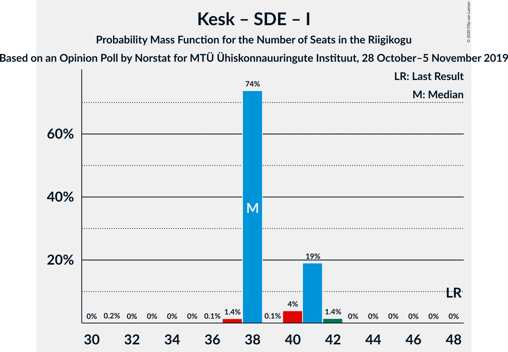

| Number of Seats | Probability | Accumulated | Special Marks |
|:---------------:|:-----------:|:-----------:|:-------------:|
| 31 | 0.2% | 100% |  |
| 32 | 0% | 99.8% |  |
| 33 | 0% | 99.8% |  |
| 34 | 0% | 99.8% |  |
| 35 | 0% | 99.8% |  |
| 36 | 0.1% | 99.8% |  |
| 37 | 1.4% | 99.7% |  |
| 38 | 74% | 98% | Median |
| 39 | 0.1% | 25% |  |
| 40 | 4% | 24% |  |
| 41 | 19% | 21% |  |
| 42 | 1.4% | 1.5% |  |
| 43 | 0% | 0% |  |
| 44 | 0% | 0% |  |
| 45 | 0% | 0% |  |
| 46 | 0% | 0% |  |
| 47 | 0% | 0% |  |
| 48 | 0% | 0% | Last Result |

### Eesti Keskerakond – Sotsiaaldemokraatlik Erakond

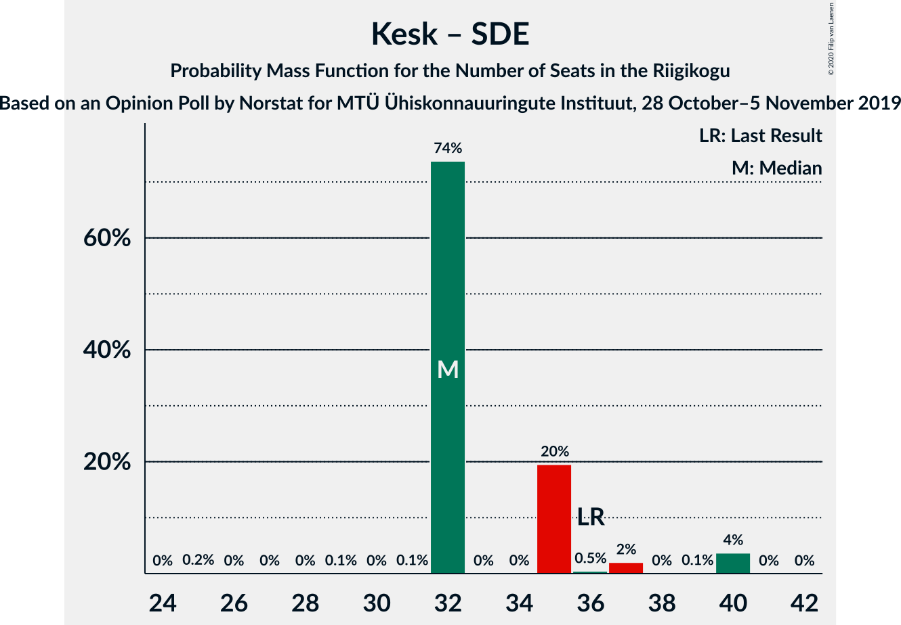

| Number of Seats | Probability | Accumulated | Special Marks |
|:---------------:|:-----------:|:-----------:|:-------------:|
| 25 | 0.2% | 100% |  |
| 26 | 0% | 99.8% |  |
| 27 | 0% | 99.8% |  |
| 28 | 0% | 99.8% |  |
| 29 | 0.1% | 99.8% |  |
| 30 | 0% | 99.7% |  |
| 31 | 0.1% | 99.7% |  |
| 32 | 74% | 99.7% | Median |
| 33 | 0% | 26% |  |
| 34 | 0% | 26% |  |
| 35 | 20% | 26% |  |
| 36 | 0.5% | 6% | Last Result |
| 37 | 2% | 6% |  |
| 38 | 0% | 4% |  |
| 39 | 0.1% | 4% |  |
| 40 | 4% | 4% |  |
| 41 | 0% | 0% |  |

### Eesti Konservatiivne Rahvaerakond – Sotsiaaldemokraatlik Erakond

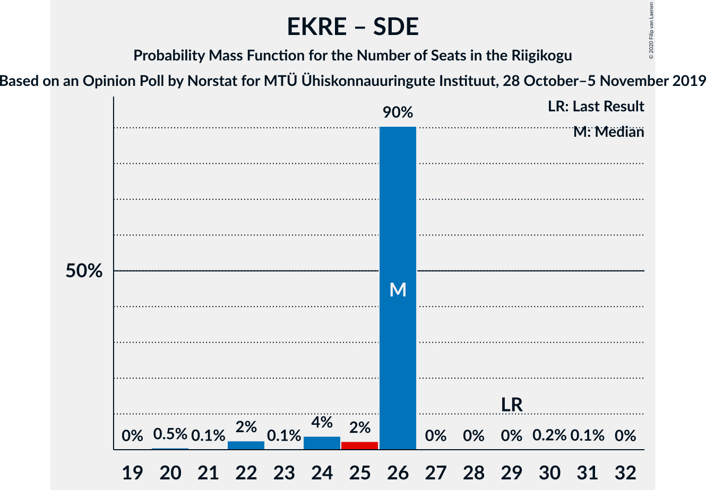

| Number of Seats | Probability | Accumulated | Special Marks |
|:---------------:|:-----------:|:-----------:|:-------------:|
| 20 | 0.5% | 100% |  |
| 21 | 0.1% | 99.5% |  |
| 22 | 2% | 99.4% |  |
| 23 | 0.1% | 97% |  |
| 24 | 4% | 97% |  |
| 25 | 2% | 93% |  |
| 26 | 90% | 91% | Median |
| 27 | 0% | 0.4% |  |
| 28 | 0% | 0.3% |  |
| 29 | 0% | 0.3% | Last Result |
| 30 | 0.2% | 0.3% |  |
| 31 | 0.1% | 0.1% |  |
| 32 | 0% | 0% |  |

## Technical Information

### Opinion Poll

+ **Polling firm:** Norstat
+ **Commissioner(s):** MTÜ Ühiskonnauuringute Instituut
+ **Fieldwork period:** 28 October–5 November 2019

### Calculations

+ **Sample size:** 1000
+ **Simulations done:** 1,024
+ **Error estimate:** 5.72%

