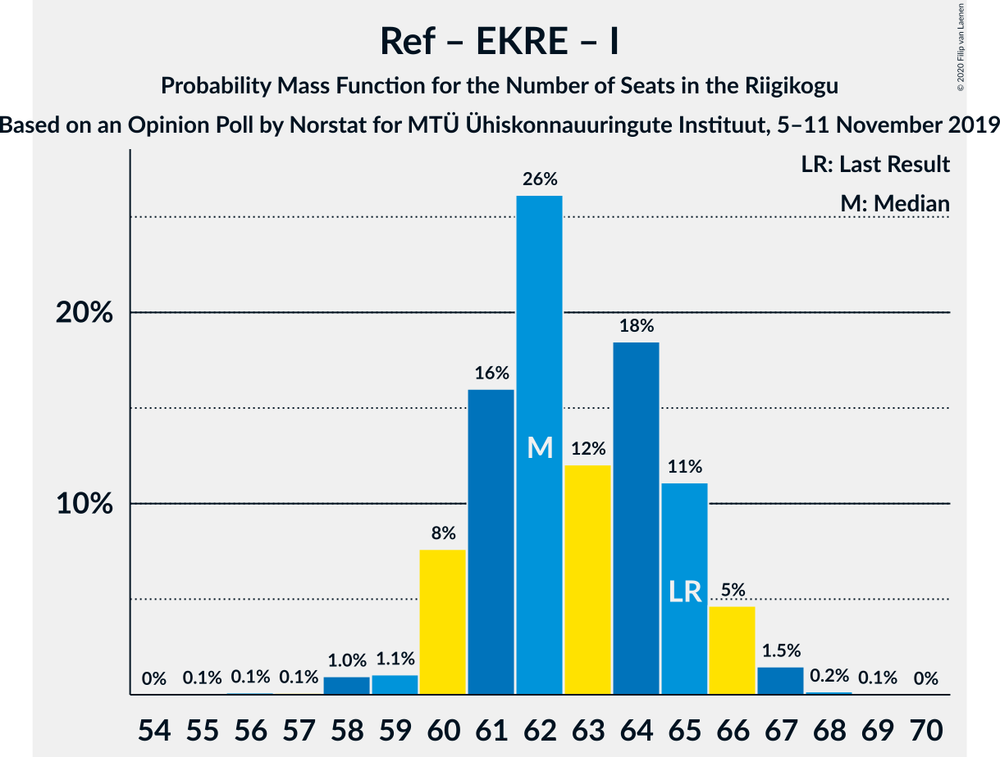
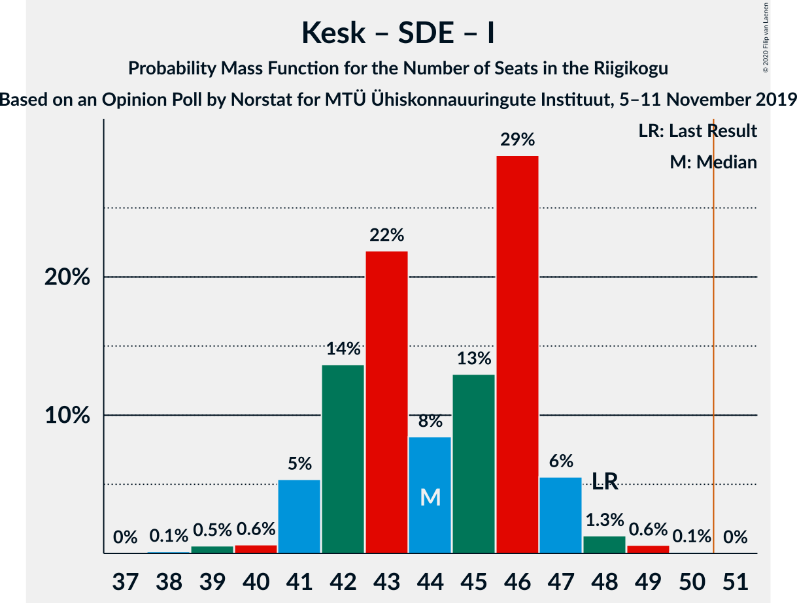

# Opinion Poll by Norstat for MTÜ Ühiskonnauuringute Instituut, 5–11 November 2019

<a href="#voting-intentions">Voting Intentions</a> | <a href="#seats">Seats</a> | <a href="#coalitions">Coalitions</a> | <a href="#technical-information">Technical Information</a>

## Voting Intentions

### Confidence Intervals

| Party | Last Result | Poll Result | 80% Confidence Interval | 90% Confidence Interval | 95% Confidence Interval | 99% Confidence Interval |
|:-----:|:-----------:|:-----------:|:-----------------------:|:-----------------------:|:-----------------------:|:-----------------------:|
| Eesti Reformierakond | 28.9% | 32.6% | 30.7–34.6% |30.2–35.1% |29.8–35.6% |28.9–36.5% |
| Eesti Keskerakond | 23.1% | 24.3% | 22.6–26.1% |22.1–26.6% |21.7–27.1% |21.0–27.9% |
| Eesti Konservatiivne Rahvaerakond | 17.8% | 17.5% | 16.0–19.1% |15.6–19.6% |15.3–20.0% |14.6–20.8% |
| Sotsiaaldemokraatlik Erakond | 9.8% | 10.9% | 9.7–12.3% |9.4–12.7% |9.1–13.0% |8.6–13.7% |
| Erakond Isamaa | 11.4% | 6.5% | 5.6–7.6% |5.3–7.9% |5.1–8.2% |4.7–8.8% |
| Erakond Eestimaa Rohelised | 1.8% | 3.5% | 2.9–4.4% |2.7–4.6% |2.5–4.8% |2.2–5.3% |
| Eesti 200 | 4.4% | 3.4% | 2.8–4.3% |2.6–4.5% |2.4–4.7% |2.2–5.2% |
| Eesti Vabaerakond | 1.2% | 0.2% | 0.1–0.5% |0.1–0.6% |0.1–0.7% |0.0–0.9% |

*Note:* The poll result column reflects the actual value used in the calculations. Published results may vary slightly, and in addition be rounded to fewer digits.

## Seats

### Confidence Intervals

| Party | Last Result | Median | 80% Confidence Interval | 90% Confidence Interval | 95% Confidence Interval | 99% Confidence Interval |
|:-----:|:-----------:|:------:|:-----------------------:|:-----------------------:|:-----------------------:|:-----------------------:|
| <a href="#eesti-reformierakond">Eesti Reformierakond</a> | 34 | 38 | 36–40 |35–40 |35–42 |33–43 |
| <a href="#eesti-keskerakond">Eesti Keskerakond</a> | 26 | 27 | 26–29 |25–30 |24–30 |23–31 |
| <a href="#eesti-konservatiivne-rahvaerakond">Eesti Konservatiivne Rahvaerakond</a> | 19 | 19 | 17–21 |16–21 |16–22 |16–23 |
| <a href="#sotsiaaldemokraatlik-erakond">Sotsiaaldemokraatlik Erakond</a> | 10 | 11 | 10–12 |10–12 |9–13 |8–14 |
| <a href="#erakond-isamaa">Erakond Isamaa</a> | 12 | 6 | 5–7 |4–8 |4–8 |0–8 |
| <a href="#erakond-eestimaa-rohelised">Erakond Eestimaa Rohelised</a> | 0 | 0 | 0 |0 |0 |0 |
| <a href="#eesti-200">Eesti 200</a> | 0 | 0 | 0 |0 |0 |0 |
| <a href="#eesti-vabaerakond">Eesti Vabaerakond</a> | 0 | 0 | 0 |0 |0 |0 |

### Eesti Reformierakond

*For a full overview of the results for this party, see the [Eesti Reformierakond](party-eestireformierakond.html) page.*

| Number of Seats | Probability | Accumulated | Special Marks |
|:---------------:|:-----------:|:-----------:|:-------------:|
| 32 | 0.2% | 100% |  |
| 33 | 0.4% | 99.8% |  |
| 34 | 1.0% | 99.4% | Last Result |
| 35 | 5% | 98% |  |
| 36 | 16% | 94% |  |
| 37 | 27% | 78% |  |
| 38 | 9% | 51% | Median |
| 39 | 22% | 42% |  |
| 40 | 16% | 20% |  |
| 41 | 1.0% | 4% |  |
| 42 | 2% | 3% |  |
| 43 | 1.3% | 1.4% |  |
| 44 | 0.1% | 0.1% |  |
| 45 | 0% | 0% |  |

### Eesti Keskerakond

*For a full overview of the results for this party, see the [Eesti Keskerakond](party-eestikeskerakond.html) page.*

| Number of Seats | Probability | Accumulated | Special Marks |
|:---------------:|:-----------:|:-----------:|:-------------:|
| 22 | 0.1% | 100% |  |
| 23 | 1.1% | 99.8% |  |
| 24 | 2% | 98.8% |  |
| 25 | 5% | 97% |  |
| 26 | 30% | 92% | Last Result |
| 27 | 23% | 62% | Median |
| 28 | 18% | 39% |  |
| 29 | 12% | 21% |  |
| 30 | 8% | 9% |  |
| 31 | 0.7% | 1.1% |  |
| 32 | 0.3% | 0.4% |  |
| 33 | 0.1% | 0.1% |  |
| 34 | 0% | 0.1% |  |
| 35 | 0% | 0% |  |

### Eesti Konservatiivne Rahvaerakond

*For a full overview of the results for this party, see the [Eesti Konservatiivne Rahvaerakond](party-eestikonservatiivnerahvaerakond.html) page.*

| Number of Seats | Probability | Accumulated | Special Marks |
|:---------------:|:-----------:|:-----------:|:-------------:|
| 14 | 0.1% | 100% |  |
| 15 | 0.3% | 99.9% |  |
| 16 | 6% | 99.6% |  |
| 17 | 9% | 94% |  |
| 18 | 26% | 85% |  |
| 19 | 33% | 58% | Last Result, Median |
| 20 | 11% | 26% |  |
| 21 | 12% | 15% |  |
| 22 | 2% | 3% |  |
| 23 | 0.9% | 0.9% |  |
| 24 | 0% | 0% |  |

### Sotsiaaldemokraatlik Erakond

*For a full overview of the results for this party, see the [Sotsiaaldemokraatlik Erakond](party-sotsiaaldemokraatlikerakond.html) page.*

| Number of Seats | Probability | Accumulated | Special Marks |
|:---------------:|:-----------:|:-----------:|:-------------:|
| 8 | 0.7% | 100% |  |
| 9 | 4% | 99.3% |  |
| 10 | 26% | 95% | Last Result |
| 11 | 31% | 69% | Median |
| 12 | 35% | 38% |  |
| 13 | 3% | 3% |  |
| 14 | 0.6% | 0.9% |  |
| 15 | 0.3% | 0.3% |  |
| 16 | 0% | 0% |  |

### Erakond Isamaa

*For a full overview of the results for this party, see the [Erakond Isamaa](party-erakondisamaa.html) page.*

| Number of Seats | Probability | Accumulated | Special Marks |
|:---------------:|:-----------:|:-----------:|:-------------:|
| 0 | 0.7% | 100% |  |
| 1 | 0% | 99.3% |  |
| 2 | 0% | 99.3% |  |
| 3 | 0% | 99.3% |  |
| 4 | 5% | 99.3% |  |
| 5 | 26% | 94% |  |
| 6 | 35% | 68% | Median |
| 7 | 28% | 34% |  |
| 8 | 5% | 5% |  |
| 9 | 0.2% | 0.3% |  |
| 10 | 0% | 0% |  |
| 11 | 0% | 0% |  |
| 12 | 0% | 0% | Last Result |

### Erakond Eestimaa Rohelised

*For a full overview of the results for this party, see the [Erakond Eestimaa Rohelised](party-erakondeestimaarohelised.html) page.*

| Number of Seats | Probability | Accumulated | Special Marks |
|:---------------:|:-----------:|:-----------:|:-------------:|
| 0 | 99.6% | 100% | Last Result, Median |
| 1 | 0% | 0.4% |  |
| 2 | 0% | 0.4% |  |
| 3 | 0% | 0.4% |  |
| 4 | 0.2% | 0.4% |  |
| 5 | 0.3% | 0.3% |  |
| 6 | 0% | 0% |  |

### Eesti 200

*For a full overview of the results for this party, see the [Eesti 200](party-eesti200.html) page.*

| Number of Seats | Probability | Accumulated | Special Marks |
|:---------------:|:-----------:|:-----------:|:-------------:|
| 0 | 99.5% | 100% | Last Result, Median |
| 1 | 0% | 0.5% |  |
| 2 | 0% | 0.5% |  |
| 3 | 0% | 0.5% |  |
| 4 | 0.3% | 0.5% |  |
| 5 | 0.1% | 0.1% |  |
| 6 | 0% | 0% |  |

### Eesti Vabaerakond

*For a full overview of the results for this party, see the [Eesti Vabaerakond](party-eestivabaerakond.html) page.*

| Number of Seats | Probability | Accumulated | Special Marks |
|:---------------:|:-----------:|:-----------:|:-------------:|
| 0 | 100% | 100% | Last Result, Median |

## Coalitions

### Confidence Intervals

| Coalition | Last Result | Median | Majority? | 80% Confidence Interval | 90% Confidence Interval | 95% Confidence Interval | 99% Confidence Interval |
|:---------:|:-----------:|:------:|:---------:|:-----------------------:|:-----------------------:|:-----------------------:|:-----------------------:|
| Eesti Reformierakond – Eesti Keskerakond – Eesti Konservatiivne Rahvaerakond | 79 | 84 | 100% | 82–86 | 82–87 | 81–87 | 79–89 |
| Eesti Reformierakond – Eesti Keskerakond | 60 | 65 | 100% | 63–68 | 63–68 | 61–68 | 61–70 |
| Eesti Reformierakond – Eesti Konservatiivne Rahvaerakond – Erakond Isamaa | 65 | 62 | 100% | 61–65 | 60–66 | 60–66 | 58–67 |
| Eesti Reformierakond – Eesti Konservatiivne Rahvaerakond | 53 | 57 | 100% | 55–59 | 54–60 | 54–60 | 52–62 |
| Eesti Reformierakond – Sotsiaaldemokraatlik Erakond – Erakond Isamaa – Eesti Vabaerakond | 56 | 55 | 99.2% | 53–57 | 52–58 | 51–59 | 50–60 |
| Eesti Reformierakond – Sotsiaaldemokraatlik Erakond – Erakond Isamaa | 56 | 55 | 99.2% | 53–57 | 52–58 | 51–59 | 50–60 |
| Eesti Keskerakond – Eesti Konservatiivne Rahvaerakond – Erakond Isamaa | 57 | 52 | 77% | 50–54 | 49–55 | 48–56 | 47–57 |
| Eesti Reformierakond – Sotsiaaldemokraatlik Erakond | 44 | 49 | 22% | 47–51 | 46–51 | 45–53 | 44–53 |
| Eesti Keskerakond – Eesti Konservatiivne Rahvaerakond | 45 | 46 | 0.5% | 44–48 | 43–49 | 42–50 | 41–51 |
| Eesti Keskerakond – Sotsiaaldemokraatlik Erakond – Erakond Isamaa | 48 | 44 | 0% | 42–46 | 41–47 | 41–47 | 39–49 |
| Eesti Reformierakond – Erakond Isamaa | 46 | 44 | 0% | 42–46 | 41–47 | 40–47 | 39–49 |
| Eesti Keskerakond – Sotsiaaldemokraatlik Erakond | 36 | 39 | 0% | 36–40 | 35–41 | 35–41 | 34–43 |
| Eesti Konservatiivne Rahvaerakond – Sotsiaaldemokraatlik Erakond | 29 | 30 | 0% | 28–31 | 27–32 | 27–33 | 26–34 |

### Eesti Reformierakond – Eesti Keskerakond – Eesti Konservatiivne Rahvaerakond

| Number of Seats | Probability | Accumulated | Special Marks |
|:---------------:|:-----------:|:-----------:|:-------------:|
| 77 | 0% | 100% |  |
| 78 | 0.1% | 99.9% |  |
| 79 | 0.3% | 99.8% | Last Result |
| 80 | 0.6% | 99.5% |  |
| 81 | 4% | 98.8% |  |
| 82 | 11% | 95% |  |
| 83 | 28% | 84% |  |
| 84 | 18% | 56% | Median |
| 85 | 25% | 38% |  |
| 86 | 7% | 13% |  |
| 87 | 5% | 6% |  |
| 88 | 0.4% | 1.0% |  |
| 89 | 0.1% | 0.5% |  |
| 90 | 0.2% | 0.4% |  |
| 91 | 0.2% | 0.2% |  |
| 92 | 0% | 0% |  |

### Eesti Reformierakond – Eesti Keskerakond

| Number of Seats | Probability | Accumulated | Special Marks |
|:---------------:|:-----------:|:-----------:|:-------------:|
| 59 | 0.1% | 100% |  |
| 60 | 0.2% | 99.9% | Last Result |
| 61 | 2% | 99.6% |  |
| 62 | 2% | 97% |  |
| 63 | 10% | 95% |  |
| 64 | 27% | 85% |  |
| 65 | 18% | 58% | Median |
| 66 | 21% | 40% |  |
| 67 | 7% | 19% |  |
| 68 | 11% | 12% |  |
| 69 | 0.8% | 1.4% |  |
| 70 | 0.3% | 0.6% |  |
| 71 | 0.1% | 0.4% |  |
| 72 | 0.2% | 0.2% |  |
| 73 | 0% | 0% |  |

### Eesti Reformierakond – Eesti Konservatiivne Rahvaerakond – Erakond Isamaa

| Number of Seats | Probability | Accumulated | Special Marks |
|:---------------:|:-----------:|:-----------:|:-------------:|
| 55 | 0.1% | 100% |  |
| 56 | 0.1% | 99.9% |  |
| 57 | 0.1% | 99.8% |  |
| 58 | 1.0% | 99.7% |  |
| 59 | 1.1% | 98.8% |  |
| 60 | 8% | 98% |  |
| 61 | 16% | 90% |  |
| 62 | 26% | 74% |  |
| 63 | 12% | 48% | Median |
| 64 | 18% | 36% |  |
| 65 | 11% | 17% | Last Result |
| 66 | 5% | 6% |  |
| 67 | 1.5% | 2% |  |
| 68 | 0.2% | 0.2% |  |
| 69 | 0.1% | 0.1% |  |
| 70 | 0% | 0% |  |

### Eesti Reformierakond – Eesti Konservatiivne Rahvaerakond

| Number of Seats | Probability | Accumulated | Special Marks |
|:---------------:|:-----------:|:-----------:|:-------------:|
| 51 | 0.1% | 100% | Majority |
| 52 | 0.7% | 99.8% |  |
| 53 | 1.4% | 99.1% | Last Result |
| 54 | 6% | 98% |  |
| 55 | 29% | 92% |  |
| 56 | 13% | 63% |  |
| 57 | 8% | 50% | Median |
| 58 | 22% | 42% |  |
| 59 | 14% | 20% |  |
| 60 | 5% | 6% |  |
| 61 | 0.5% | 1.2% |  |
| 62 | 0.5% | 0.7% |  |
| 63 | 0.1% | 0.2% |  |
| 64 | 0% | 0% |  |

### Eesti Reformierakond – Sotsiaaldemokraatlik Erakond – Erakond Isamaa – Eesti Vabaerakond

| Number of Seats | Probability | Accumulated | Special Marks |
|:---------------:|:-----------:|:-----------:|:-------------:|
| 48 | 0.1% | 100% |  |
| 49 | 0.2% | 99.8% |  |
| 50 | 0.4% | 99.6% |  |
| 51 | 3% | 99.2% | Majority |
| 52 | 4% | 97% |  |
| 53 | 13% | 92% |  |
| 54 | 25% | 79% |  |
| 55 | 11% | 55% | Median |
| 56 | 25% | 44% | Last Result |
| 57 | 11% | 19% |  |
| 58 | 5% | 8% |  |
| 59 | 1.5% | 3% |  |
| 60 | 1.0% | 1.1% |  |
| 61 | 0% | 0% |  |

### Eesti Reformierakond – Sotsiaaldemokraatlik Erakond – Erakond Isamaa

| Number of Seats | Probability | Accumulated | Special Marks |
|:---------------:|:-----------:|:-----------:|:-------------:|
| 48 | 0.1% | 100% |  |
| 49 | 0.2% | 99.8% |  |
| 50 | 0.4% | 99.6% |  |
| 51 | 3% | 99.2% | Majority |
| 52 | 4% | 97% |  |
| 53 | 13% | 92% |  |
| 54 | 25% | 79% |  |
| 55 | 11% | 55% | Median |
| 56 | 25% | 44% | Last Result |
| 57 | 11% | 19% |  |
| 58 | 5% | 8% |  |
| 59 | 1.5% | 3% |  |
| 60 | 1.0% | 1.1% |  |
| 61 | 0% | 0% |  |

### Eesti Keskerakond – Eesti Konservatiivne Rahvaerakond – Erakond Isamaa

| Number of Seats | Probability | Accumulated | Special Marks |
|:---------------:|:-----------:|:-----------:|:-------------:|
| 45 | 0.1% | 100% |  |
| 46 | 0.2% | 99.9% |  |
| 47 | 0.4% | 99.7% |  |
| 48 | 3% | 99.4% |  |
| 49 | 2% | 96% |  |
| 50 | 18% | 95% |  |
| 51 | 19% | 77% | Majority |
| 52 | 18% | 58% | Median |
| 53 | 19% | 41% |  |
| 54 | 15% | 22% |  |
| 55 | 4% | 7% |  |
| 56 | 3% | 3% |  |
| 57 | 0.4% | 0.5% | Last Result |
| 58 | 0.1% | 0.1% |  |
| 59 | 0% | 0% |  |

### Eesti Reformierakond – Sotsiaaldemokraatlik Erakond

| Number of Seats | Probability | Accumulated | Special Marks |
|:---------------:|:-----------:|:-----------:|:-------------:|
| 43 | 0.2% | 100% |  |
| 44 | 0.5% | 99.8% | Last Result |
| 45 | 3% | 99.3% |  |
| 46 | 4% | 97% |  |
| 47 | 15% | 93% |  |
| 48 | 19% | 78% |  |
| 49 | 18% | 59% | Median |
| 50 | 19% | 41% |  |
| 51 | 18% | 22% | Majority |
| 52 | 1.4% | 5% |  |
| 53 | 3% | 3% |  |
| 54 | 0.2% | 0.4% |  |
| 55 | 0.1% | 0.1% |  |
| 56 | 0.1% | 0.1% |  |
| 57 | 0% | 0% |  |

### Eesti Keskerakond – Eesti Konservatiivne Rahvaerakond

| Number of Seats | Probability | Accumulated | Special Marks |
|:---------------:|:-----------:|:-----------:|:-------------:|
| 40 | 0.1% | 100% |  |
| 41 | 1.1% | 99.9% |  |
| 42 | 2% | 98.8% |  |
| 43 | 5% | 97% |  |
| 44 | 11% | 92% |  |
| 45 | 25% | 80% | Last Result |
| 46 | 11% | 55% | Median |
| 47 | 24% | 45% |  |
| 48 | 13% | 20% |  |
| 49 | 4% | 8% |  |
| 50 | 3% | 3% |  |
| 51 | 0.3% | 0.5% | Majority |
| 52 | 0.1% | 0.2% |  |
| 53 | 0.1% | 0.1% |  |
| 54 | 0% | 0% |  |

### Eesti Keskerakond – Sotsiaaldemokraatlik Erakond – Erakond Isamaa

| Number of Seats | Probability | Accumulated | Special Marks |
|:---------------:|:-----------:|:-----------:|:-------------:|
| 38 | 0.1% | 100% |  |
| 39 | 0.5% | 99.8% |  |
| 40 | 0.6% | 99.3% |  |
| 41 | 5% | 98.7% |  |
| 42 | 14% | 93% |  |
| 43 | 22% | 80% |  |
| 44 | 8% | 58% | Median |
| 45 | 13% | 49% |  |
| 46 | 29% | 36% |  |
| 47 | 6% | 8% |  |
| 48 | 1.3% | 2% | Last Result |
| 49 | 0.6% | 0.7% |  |
| 50 | 0.1% | 0.1% |  |
| 51 | 0% | 0% | Majority |

### Eesti Reformierakond – Erakond Isamaa

| Number of Seats | Probability | Accumulated | Special Marks |
|:---------------:|:-----------:|:-----------:|:-------------:|
| 36 | 0.1% | 100% |  |
| 37 | 0.1% | 99.9% |  |
| 38 | 0.3% | 99.9% |  |
| 39 | 0.7% | 99.6% |  |
| 40 | 2% | 98.9% |  |
| 41 | 3% | 97% |  |
| 42 | 20% | 94% |  |
| 43 | 14% | 75% |  |
| 44 | 20% | 61% | Median |
| 45 | 27% | 40% |  |
| 46 | 8% | 14% | Last Result |
| 47 | 3% | 5% |  |
| 48 | 0.5% | 2% |  |
| 49 | 2% | 2% |  |
| 50 | 0.1% | 0.1% |  |
| 51 | 0% | 0% | Majority |

### Eesti Keskerakond – Sotsiaaldemokraatlik Erakond

| Number of Seats | Probability | Accumulated | Special Marks |
|:---------------:|:-----------:|:-----------:|:-------------:|
| 32 | 0.1% | 100% |  |
| 33 | 0.2% | 99.9% |  |
| 34 | 2% | 99.7% |  |
| 35 | 5% | 98% |  |
| 36 | 11% | 93% | Last Result |
| 37 | 19% | 82% |  |
| 38 | 12% | 63% | Median |
| 39 | 26% | 51% |  |
| 40 | 16% | 25% |  |
| 41 | 7% | 9% |  |
| 42 | 0.9% | 2% |  |
| 43 | 0.8% | 1.0% |  |
| 44 | 0.1% | 0.2% |  |
| 45 | 0.1% | 0.1% |  |
| 46 | 0% | 0% |  |

### Eesti Konservatiivne Rahvaerakond – Sotsiaaldemokraatlik Erakond

| Number of Seats | Probability | Accumulated | Special Marks |
|:---------------:|:-----------:|:-----------:|:-------------:|
| 24 | 0.1% | 100% |  |
| 25 | 0.3% | 99.9% |  |
| 26 | 0.4% | 99.6% |  |
| 27 | 5% | 99.3% |  |
| 28 | 8% | 94% |  |
| 29 | 25% | 87% | Last Result |
| 30 | 29% | 62% | Median |
| 31 | 23% | 33% |  |
| 32 | 6% | 9% |  |
| 33 | 2% | 3% |  |
| 34 | 0.6% | 0.9% |  |
| 35 | 0.3% | 0.3% |  |
| 36 | 0% | 0.1% |  |
| 37 | 0% | 0% |  |

## Technical Information

### Opinion Poll

+ **Polling firm:** Norstat
+ **Commissioner(s):** MTÜ Ühiskonnauuringute Instituut
+ **Fieldwork period:** 5–11 November 2019

### Calculations

+ **Sample size:** 1000
+ **Simulations done:** 131,072
+ **Error estimate:** 1.07%

