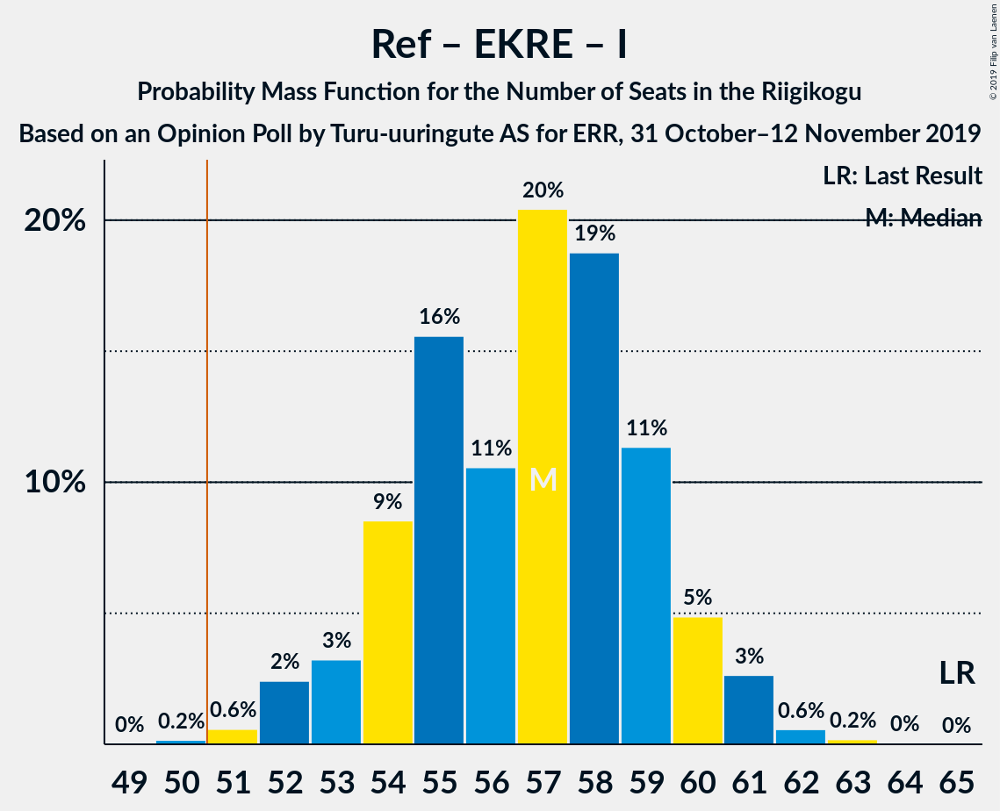
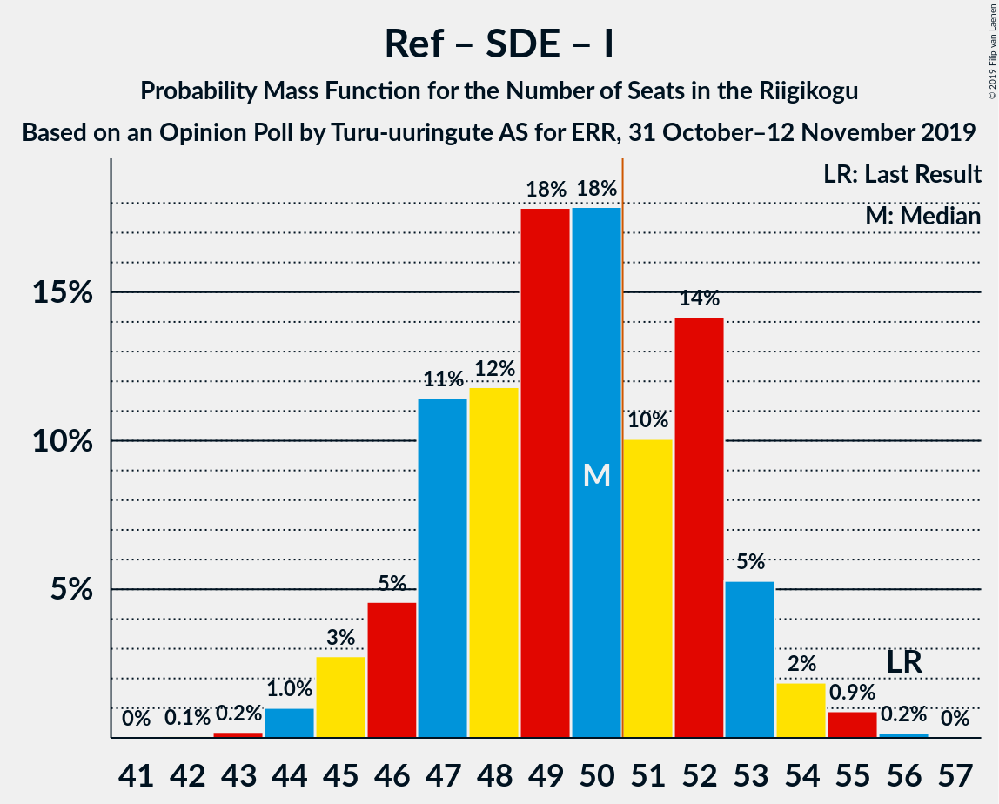
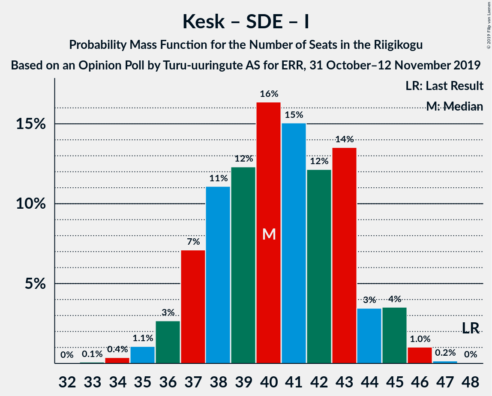

# Opinion Poll by Turu-uuringute AS for ERR, 31 October–12 November 2019

<a href="#voting-intentions">Voting Intentions</a> | <a href="#seats">Seats</a> | <a href="#coalitions">Coalitions</a> | <a href="#technical-information">Technical Information</a>

## Voting Intentions

### Confidence Intervals

| Party | Last Result | Poll Result | 80% Confidence Interval | 90% Confidence Interval | 95% Confidence Interval | 99% Confidence Interval |
|:-----:|:-----------:|:-----------:|:-----------------------:|:-----------------------:|:-----------------------:|:-----------------------:|
| Eesti Reformierakond | 28.9% | 30.9% | 29.1–32.8% |28.6–33.3% |28.2–33.8% |27.3–34.8% |
| Eesti Keskerakond | 23.1% | 23.7% | 22.1–25.5% |21.6–26.0% |21.2–26.5% |20.5–27.3% |
| Eesti Konservatiivne Rahvaerakond | 17.8% | 17.6% | 16.1–19.2% |15.7–19.6% |15.3–20.0% |14.7–20.8% |
| Sotsiaaldemokraatlik Erakond | 9.8% | 11.4% | 10.2–12.8% |9.9–13.2% |9.6–13.5% |9.0–14.2% |
| Eesti 200 | 4.4% | 7.3% | 6.3–8.4% |6.1–8.7% |5.8–9.0% |5.4–9.6% |
| Erakond Isamaa | 11.4% | 5.2% | 4.4–6.2% |4.2–6.5% |4.0–6.8% |3.6–7.3% |
| Erakond Eestimaa Rohelised | 1.8% | 2.1% | 1.6–2.8% |1.5–3.0% |1.4–3.1% |1.2–3.5% |
| Eesti Vabaerakond | 1.2% | 1.1% | 0.8–1.6% |0.7–1.8% |0.6–1.9% |0.5–2.2% |

*Note:* The poll result column reflects the actual value used in the calculations. Published results may vary slightly, and in addition be rounded to fewer digits.

## Seats

### Confidence Intervals

| Party | Last Result | Median | 80% Confidence Interval | 90% Confidence Interval | 95% Confidence Interval | 99% Confidence Interval |
|:-----:|:-----------:|:------:|:-----------------------:|:-----------------------:|:-----------------------:|:-----------------------:|
| <a href="#eesti-reformierakond">Eesti Reformierakond</a> | 34 | 35 | 32–38 |32–39 |31–39 |31–40 |
| <a href="#eesti-keskerakond">Eesti Keskerakond</a> | 26 | 26 | 24–28 |24–29 |23–30 |22–31 |
| <a href="#eesti-konservatiivne-rahvaerakond">Eesti Konservatiivne Rahvaerakond</a> | 19 | 18 | 17–20 |16–21 |16–22 |15–23 |
| <a href="#sotsiaaldemokraatlik-erakond">Sotsiaaldemokraatlik Erakond</a> | 10 | 11 | 10–13 |9–13 |9–14 |9–15 |
| <a href="#eesti-200">Eesti 200</a> | 0 | 7 | 6–8 |5–8 |5–9 |5–9 |
| <a href="#erakond-isamaa">Erakond Isamaa</a> | 12 | 4 | 0–5 |0–6 |0–6 |0–6 |
| <a href="#erakond-eestimaa-rohelised">Erakond Eestimaa Rohelised</a> | 0 | 0 | 0 |0 |0 |0 |
| <a href="#eesti-vabaerakond">Eesti Vabaerakond</a> | 0 | 0 | 0 |0 |0 |0 |

### Eesti Reformierakond

*For a full overview of the results for this party, see the [Eesti Reformierakond](party-eestireformierakond.html) page.*

| Number of Seats | Probability | Accumulated | Special Marks |
|:---------------:|:-----------:|:-----------:|:-------------:|
| 29 | 0.1% | 100% |  |
| 30 | 0.4% | 99.9% |  |
| 31 | 2% | 99.5% |  |
| 32 | 8% | 97% |  |
| 33 | 7% | 89% |  |
| 34 | 17% | 82% | Last Result |
| 35 | 21% | 65% | Median |
| 36 | 21% | 45% |  |
| 37 | 11% | 24% |  |
| 38 | 7% | 12% |  |
| 39 | 4% | 6% |  |
| 40 | 0.9% | 1.3% |  |
| 41 | 0.3% | 0.4% |  |
| 42 | 0.1% | 0.1% |  |
| 43 | 0% | 0% |  |

### Eesti Keskerakond

*For a full overview of the results for this party, see the [Eesti Keskerakond](party-eestikeskerakond.html) page.*

| Number of Seats | Probability | Accumulated | Special Marks |
|:---------------:|:-----------:|:-----------:|:-------------:|
| 21 | 0.2% | 100% |  |
| 22 | 1.2% | 99.7% |  |
| 23 | 3% | 98.5% |  |
| 24 | 12% | 96% |  |
| 25 | 19% | 84% |  |
| 26 | 24% | 64% | Last Result, Median |
| 27 | 22% | 40% |  |
| 28 | 9% | 18% |  |
| 29 | 5% | 9% |  |
| 30 | 3% | 4% |  |
| 31 | 0.7% | 0.9% |  |
| 32 | 0.2% | 0.2% |  |
| 33 | 0% | 0% |  |

### Eesti Konservatiivne Rahvaerakond

*For a full overview of the results for this party, see the [Eesti Konservatiivne Rahvaerakond](party-eestikonservatiivnerahvaerakond.html) page.*

| Number of Seats | Probability | Accumulated | Special Marks |
|:---------------:|:-----------:|:-----------:|:-------------:|
| 14 | 0.1% | 100% |  |
| 15 | 1.1% | 99.8% |  |
| 16 | 7% | 98.7% |  |
| 17 | 12% | 92% |  |
| 18 | 30% | 79% | Median |
| 19 | 22% | 49% | Last Result |
| 20 | 18% | 27% |  |
| 21 | 6% | 9% |  |
| 22 | 3% | 4% |  |
| 23 | 0.8% | 0.9% |  |
| 24 | 0.1% | 0.1% |  |
| 25 | 0% | 0% |  |

### Sotsiaaldemokraatlik Erakond

*For a full overview of the results for this party, see the [Sotsiaaldemokraatlik Erakond](party-sotsiaaldemokraatlikerakond.html) page.*

| Number of Seats | Probability | Accumulated | Special Marks |
|:---------------:|:-----------:|:-----------:|:-------------:|
| 8 | 0.4% | 100% |  |
| 9 | 5% | 99.6% |  |
| 10 | 19% | 95% | Last Result |
| 11 | 31% | 76% | Median |
| 12 | 27% | 45% |  |
| 13 | 13% | 17% |  |
| 14 | 4% | 4% |  |
| 15 | 0.5% | 0.6% |  |
| 16 | 0.1% | 0.1% |  |
| 17 | 0% | 0% |  |

### Eesti 200

*For a full overview of the results for this party, see the [Eesti 200](party-eesti200.html) page.*

| Number of Seats | Probability | Accumulated | Special Marks |
|:---------------:|:-----------:|:-----------:|:-------------:|
| 0 | 0.1% | 100% | Last Result |
| 1 | 0% | 99.9% |  |
| 2 | 0% | 99.9% |  |
| 3 | 0% | 99.9% |  |
| 4 | 0.2% | 99.9% |  |
| 5 | 8% | 99.7% |  |
| 6 | 33% | 91% |  |
| 7 | 37% | 59% | Median |
| 8 | 18% | 22% |  |
| 9 | 3% | 4% |  |
| 10 | 0.3% | 0.3% |  |
| 11 | 0% | 0% |  |

### Erakond Isamaa

*For a full overview of the results for this party, see the [Erakond Isamaa](party-erakondisamaa.html) page.*

| Number of Seats | Probability | Accumulated | Special Marks |
|:---------------:|:-----------:|:-----------:|:-------------:|
| 0 | 41% | 100% |  |
| 1 | 0% | 59% |  |
| 2 | 0% | 59% |  |
| 3 | 0% | 59% |  |
| 4 | 10% | 59% | Median |
| 5 | 42% | 49% |  |
| 6 | 6% | 7% |  |
| 7 | 0.4% | 0.4% |  |
| 8 | 0% | 0% |  |
| 9 | 0% | 0% |  |
| 10 | 0% | 0% |  |
| 11 | 0% | 0% |  |
| 12 | 0% | 0% | Last Result |

### Erakond Eestimaa Rohelised

*For a full overview of the results for this party, see the [Erakond Eestimaa Rohelised](party-erakondeestimaarohelised.html) page.*

| Number of Seats | Probability | Accumulated | Special Marks |
|:---------------:|:-----------:|:-----------:|:-------------:|
| 0 | 100% | 100% | Last Result, Median |

### Eesti Vabaerakond

*For a full overview of the results for this party, see the [Eesti Vabaerakond](party-eestivabaerakond.html) page.*

| Number of Seats | Probability | Accumulated | Special Marks |
|:---------------:|:-----------:|:-----------:|:-------------:|
| 0 | 100% | 100% | Last Result, Median |

## Coalitions

### Confidence Intervals

| Coalition | Last Result | Median | Majority? | 80% Confidence Interval | 90% Confidence Interval | 95% Confidence Interval | 99% Confidence Interval |
|:---------:|:-----------:|:------:|:---------:|:-----------------------:|:-----------------------:|:-----------------------:|:-----------------------:|
| Eesti Reformierakond – Eesti Keskerakond – Eesti Konservatiivne Rahvaerakond | 79 | 80 | 100% | 77–83 | 76–84 | 76–84 | 75–85 |
| Eesti Reformierakond – Eesti Keskerakond | 60 | 61 | 100% | 58–64 | 58–65 | 57–66 | 56–67 |
| Eesti Reformierakond – Eesti Konservatiivne Rahvaerakond – Erakond Isamaa | 65 | 57 | 99.8% | 54–59 | 53–60 | 52–61 | 51–62 |
| Eesti Reformierakond – Eesti Konservatiivne Rahvaerakond | 53 | 54 | 92% | 51–57 | 50–58 | 50–58 | 48–60 |
| Eesti Reformierakond – Sotsiaaldemokraatlik Erakond – Erakond Isamaa – Eesti Vabaerakond | 56 | 50 | 32% | 47–52 | 46–53 | 45–54 | 44–55 |
| Eesti Reformierakond – Sotsiaaldemokraatlik Erakond – Erakond Isamaa | 56 | 50 | 32% | 47–52 | 46–53 | 45–54 | 44–55 |
| Eesti Keskerakond – Eesti Konservatiivne Rahvaerakond – Erakond Isamaa | 57 | 48 | 11% | 45–51 | 44–51 | 43–52 | 42–53 |
| Eesti Reformierakond – Sotsiaaldemokraatlik Erakond | 44 | 47 | 4% | 44–49 | 43–50 | 42–51 | 41–52 |
| Eesti Keskerakond – Eesti Konservatiivne Rahvaerakond | 45 | 45 | 0.5% | 42–47 | 41–48 | 41–49 | 39–51 |
| Eesti Keskerakond – Sotsiaaldemokraatlik Erakond – Erakond Isamaa | 48 | 40 | 0% | 37–43 | 37–44 | 36–45 | 35–46 |
| Eesti Reformierakond – Erakond Isamaa | 46 | 38 | 0% | 35–41 | 34–42 | 34–43 | 32–44 |
| Eesti Keskerakond – Sotsiaaldemokraatlik Erakond | 36 | 38 | 0% | 35–40 | 34–41 | 34–42 | 33–43 |
| Eesti Konservatiivne Rahvaerakond – Sotsiaaldemokraatlik Erakond | 29 | 30 | 0% | 28–32 | 27–33 | 26–34 | 25–35 |

### Eesti Reformierakond – Eesti Keskerakond – Eesti Konservatiivne Rahvaerakond

| Number of Seats | Probability | Accumulated | Special Marks |
|:---------------:|:-----------:|:-----------:|:-------------:|
| 74 | 0.3% | 100% |  |
| 75 | 1.1% | 99.7% |  |
| 76 | 4% | 98.5% |  |
| 77 | 13% | 94% |  |
| 78 | 12% | 81% |  |
| 79 | 17% | 69% | Last Result, Median |
| 80 | 10% | 53% |  |
| 81 | 13% | 42% |  |
| 82 | 13% | 29% |  |
| 83 | 8% | 16% |  |
| 84 | 6% | 8% |  |
| 85 | 2% | 2% |  |
| 86 | 0.4% | 0.4% |  |
| 87 | 0% | 0% |  |

### Eesti Reformierakond – Eesti Keskerakond

| Number of Seats | Probability | Accumulated | Special Marks |
|:---------------:|:-----------:|:-----------:|:-------------:|
| 54 | 0.1% | 100% |  |
| 55 | 0.3% | 99.9% |  |
| 56 | 0.7% | 99.6% |  |
| 57 | 3% | 99.0% |  |
| 58 | 8% | 96% |  |
| 59 | 12% | 88% |  |
| 60 | 12% | 76% | Last Result |
| 61 | 18% | 64% | Median |
| 62 | 14% | 47% |  |
| 63 | 16% | 33% |  |
| 64 | 7% | 17% |  |
| 65 | 5% | 10% |  |
| 66 | 3% | 4% |  |
| 67 | 0.7% | 1.0% |  |
| 68 | 0.3% | 0.3% |  |
| 69 | 0% | 0% |  |

### Eesti Reformierakond – Eesti Konservatiivne Rahvaerakond – Erakond Isamaa

| Number of Seats | Probability | Accumulated | Special Marks |
|:---------------:|:-----------:|:-----------:|:-------------:|
| 50 | 0.2% | 100% |  |
| 51 | 0.6% | 99.8% | Majority |
| 52 | 2% | 99.2% |  |
| 53 | 3% | 97% |  |
| 54 | 9% | 94% |  |
| 55 | 16% | 85% |  |
| 56 | 11% | 69% |  |
| 57 | 20% | 59% | Median |
| 58 | 19% | 38% |  |
| 59 | 11% | 20% |  |
| 60 | 5% | 8% |  |
| 61 | 3% | 3% |  |
| 62 | 0.6% | 0.8% |  |
| 63 | 0.2% | 0.2% |  |
| 64 | 0% | 0.1% |  |
| 65 | 0% | 0% | Last Result |

### Eesti Reformierakond – Eesti Konservatiivne Rahvaerakond

| Number of Seats | Probability | Accumulated | Special Marks |
|:---------------:|:-----------:|:-----------:|:-------------:|
| 47 | 0.1% | 100% |  |
| 48 | 0.5% | 99.9% |  |
| 49 | 2% | 99.4% |  |
| 50 | 5% | 98% |  |
| 51 | 6% | 92% | Majority |
| 52 | 16% | 86% |  |
| 53 | 16% | 70% | Last Result, Median |
| 54 | 17% | 55% |  |
| 55 | 16% | 37% |  |
| 56 | 8% | 22% |  |
| 57 | 8% | 13% |  |
| 58 | 4% | 5% |  |
| 59 | 1.1% | 2% |  |
| 60 | 0.4% | 0.5% |  |
| 61 | 0.1% | 0.1% |  |
| 62 | 0% | 0% |  |

### Eesti Reformierakond – Sotsiaaldemokraatlik Erakond – Erakond Isamaa – Eesti Vabaerakond

| Number of Seats | Probability | Accumulated | Special Marks |
|:---------------:|:-----------:|:-----------:|:-------------:|
| 42 | 0.1% | 100% |  |
| 43 | 0.2% | 99.9% |  |
| 44 | 1.0% | 99.7% |  |
| 45 | 3% | 98.7% |  |
| 46 | 5% | 96% |  |
| 47 | 11% | 91% |  |
| 48 | 12% | 80% |  |
| 49 | 18% | 68% |  |
| 50 | 18% | 50% | Median |
| 51 | 10% | 32% | Majority |
| 52 | 14% | 22% |  |
| 53 | 5% | 8% |  |
| 54 | 2% | 3% |  |
| 55 | 0.9% | 1.1% |  |
| 56 | 0.2% | 0.2% | Last Result |
| 57 | 0% | 0% |  |

### Eesti Reformierakond – Sotsiaaldemokraatlik Erakond – Erakond Isamaa

| Number of Seats | Probability | Accumulated | Special Marks |
|:---------------:|:-----------:|:-----------:|:-------------:|
| 42 | 0.1% | 100% |  |
| 43 | 0.2% | 99.9% |  |
| 44 | 1.0% | 99.7% |  |
| 45 | 3% | 98.7% |  |
| 46 | 5% | 96% |  |
| 47 | 11% | 91% |  |
| 48 | 12% | 80% |  |
| 49 | 18% | 68% |  |
| 50 | 18% | 50% | Median |
| 51 | 10% | 32% | Majority |
| 52 | 14% | 22% |  |
| 53 | 5% | 8% |  |
| 54 | 2% | 3% |  |
| 55 | 0.9% | 1.1% |  |
| 56 | 0.2% | 0.2% | Last Result |
| 57 | 0% | 0% |  |

### Eesti Keskerakond – Eesti Konservatiivne Rahvaerakond – Erakond Isamaa

| Number of Seats | Probability | Accumulated | Special Marks |
|:---------------:|:-----------:|:-----------:|:-------------:|
| 40 | 0% | 100% |  |
| 41 | 0.2% | 99.9% |  |
| 42 | 0.6% | 99.7% |  |
| 43 | 3% | 99.1% |  |
| 44 | 6% | 96% |  |
| 45 | 9% | 90% |  |
| 46 | 13% | 82% |  |
| 47 | 18% | 69% |  |
| 48 | 13% | 51% | Median |
| 49 | 13% | 38% |  |
| 50 | 13% | 25% |  |
| 51 | 7% | 11% | Majority |
| 52 | 3% | 4% |  |
| 53 | 1.0% | 1.3% |  |
| 54 | 0.3% | 0.3% |  |
| 55 | 0% | 0.1% |  |
| 56 | 0% | 0% |  |
| 57 | 0% | 0% | Last Result |

### Eesti Reformierakond – Sotsiaaldemokraatlik Erakond

| Number of Seats | Probability | Accumulated | Special Marks |
|:---------------:|:-----------:|:-----------:|:-------------:|
| 40 | 0.1% | 100% |  |
| 41 | 0.4% | 99.8% |  |
| 42 | 2% | 99.4% |  |
| 43 | 5% | 97% |  |
| 44 | 10% | 92% | Last Result |
| 45 | 16% | 82% |  |
| 46 | 12% | 66% | Median |
| 47 | 21% | 54% |  |
| 48 | 13% | 33% |  |
| 49 | 10% | 20% |  |
| 50 | 5% | 9% |  |
| 51 | 3% | 4% | Majority |
| 52 | 0.9% | 1.1% |  |
| 53 | 0.2% | 0.2% |  |
| 54 | 0% | 0.1% |  |
| 55 | 0% | 0% |  |

### Eesti Keskerakond – Eesti Konservatiivne Rahvaerakond

| Number of Seats | Probability | Accumulated | Special Marks |
|:---------------:|:-----------:|:-----------:|:-------------:|
| 38 | 0.1% | 100% |  |
| 39 | 0.5% | 99.9% |  |
| 40 | 1.4% | 99.4% |  |
| 41 | 3% | 98% |  |
| 42 | 11% | 95% |  |
| 43 | 12% | 84% |  |
| 44 | 16% | 71% | Median |
| 45 | 20% | 55% | Last Result |
| 46 | 16% | 36% |  |
| 47 | 11% | 20% |  |
| 48 | 5% | 9% |  |
| 49 | 3% | 4% |  |
| 50 | 1.0% | 2% |  |
| 51 | 0.4% | 0.5% | Majority |
| 52 | 0.1% | 0.1% |  |
| 53 | 0% | 0% |  |

### Eesti Keskerakond – Sotsiaaldemokraatlik Erakond – Erakond Isamaa

| Number of Seats | Probability | Accumulated | Special Marks |
|:---------------:|:-----------:|:-----------:|:-------------:|
| 33 | 0.1% | 100% |  |
| 34 | 0.4% | 99.9% |  |
| 35 | 1.1% | 99.5% |  |
| 36 | 3% | 98% |  |
| 37 | 7% | 96% |  |
| 38 | 11% | 89% |  |
| 39 | 12% | 78% |  |
| 40 | 16% | 65% |  |
| 41 | 15% | 49% | Median |
| 42 | 12% | 34% |  |
| 43 | 14% | 22% |  |
| 44 | 3% | 8% |  |
| 45 | 4% | 5% |  |
| 46 | 1.0% | 1.2% |  |
| 47 | 0.2% | 0.2% |  |
| 48 | 0% | 0% | Last Result |

### Eesti Reformierakond – Erakond Isamaa

| Number of Seats | Probability | Accumulated | Special Marks |
|:---------------:|:-----------:|:-----------:|:-------------:|
| 31 | 0.1% | 100% |  |
| 32 | 0.8% | 99.9% |  |
| 33 | 1.3% | 99.1% |  |
| 34 | 4% | 98% |  |
| 35 | 8% | 94% |  |
| 36 | 13% | 86% |  |
| 37 | 14% | 73% |  |
| 38 | 11% | 60% |  |
| 39 | 19% | 49% | Median |
| 40 | 14% | 30% |  |
| 41 | 9% | 16% |  |
| 42 | 4% | 6% |  |
| 43 | 2% | 3% |  |
| 44 | 0.6% | 0.8% |  |
| 45 | 0.1% | 0.2% |  |
| 46 | 0% | 0% | Last Result |

### Eesti Keskerakond – Sotsiaaldemokraatlik Erakond

| Number of Seats | Probability | Accumulated | Special Marks |
|:---------------:|:-----------:|:-----------:|:-------------:|
| 31 | 0.1% | 100% |  |
| 32 | 0.4% | 99.9% |  |
| 33 | 1.2% | 99.6% |  |
| 34 | 4% | 98% |  |
| 35 | 10% | 95% |  |
| 36 | 17% | 85% | Last Result |
| 37 | 17% | 68% | Median |
| 38 | 22% | 50% |  |
| 39 | 12% | 28% |  |
| 40 | 10% | 17% |  |
| 41 | 4% | 7% |  |
| 42 | 2% | 3% |  |
| 43 | 0.8% | 1.0% |  |
| 44 | 0.2% | 0.2% |  |
| 45 | 0% | 0% |  |

### Eesti Konservatiivne Rahvaerakond – Sotsiaaldemokraatlik Erakond

| Number of Seats | Probability | Accumulated | Special Marks |
|:---------------:|:-----------:|:-----------:|:-------------:|
| 24 | 0.1% | 100% |  |
| 25 | 0.6% | 99.9% |  |
| 26 | 2% | 99.4% |  |
| 27 | 6% | 97% |  |
| 28 | 11% | 91% |  |
| 29 | 20% | 80% | Last Result, Median |
| 30 | 24% | 60% |  |
| 31 | 18% | 37% |  |
| 32 | 11% | 19% |  |
| 33 | 4% | 8% |  |
| 34 | 2% | 3% |  |
| 35 | 0.7% | 1.0% |  |
| 36 | 0.2% | 0.3% |  |
| 37 | 0% | 0% |  |

## Technical Information

### Opinion Poll

+ **Polling firm:** Turu-uuringute AS
+ **Commissioner(s):** ERR
+ **Fieldwork period:** 31 October–12 November 2019

### Calculations

+ **Sample size:** 1019
+ **Simulations done:** 1,048,576
+ **Error estimate:** 1.54%

