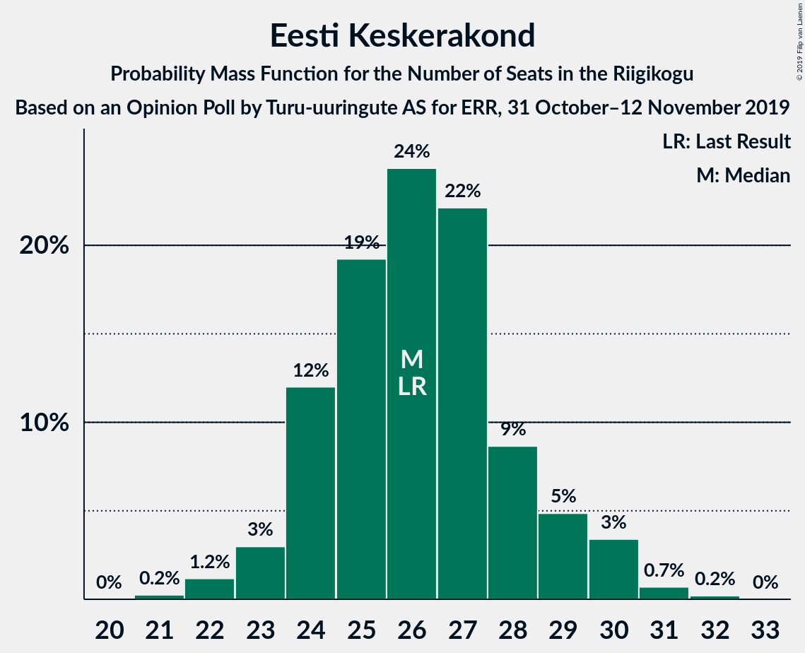
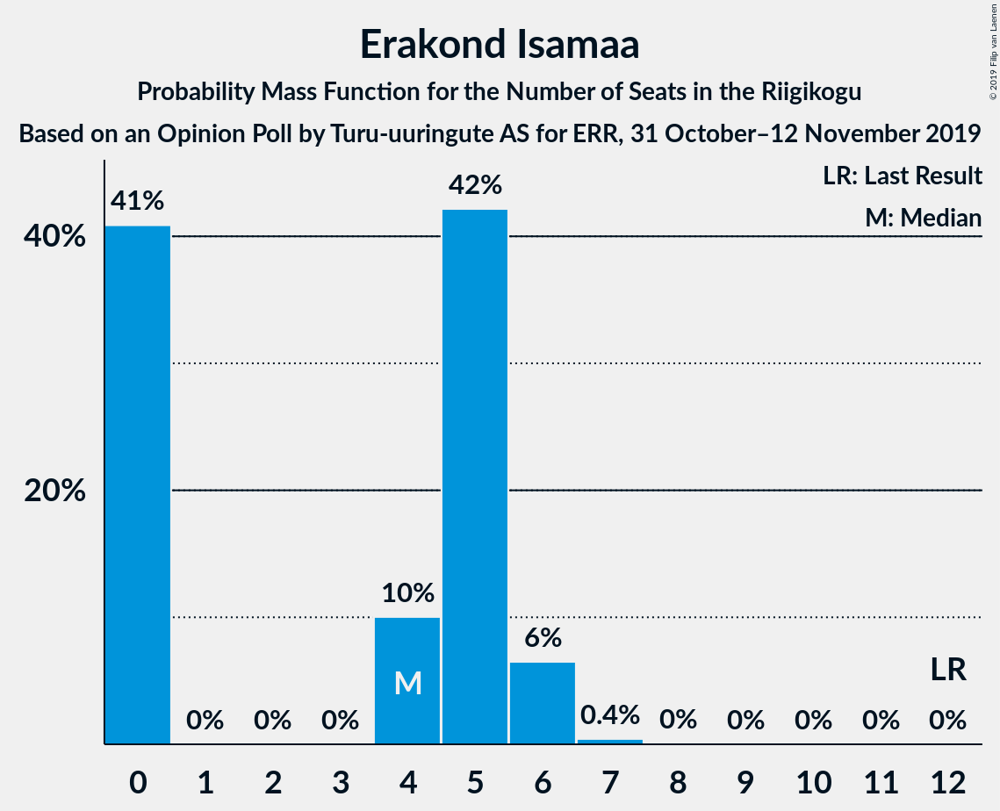

# Opinion Poll by Turu-uuringute AS for ERR, 31 October–12 November 2019

<a href="#voting-intentions">Voting Intentions</a> | <a href="#seats">Seats</a> | <a href="#coalitions">Coalitions</a> | <a href="#technical-information">Technical Information</a>

## Voting Intentions

### Confidence Intervals

| Party | Last Result | Poll Result | 80% Confidence Interval | 90% Confidence Interval | 95% Confidence Interval | 99% Confidence Interval |
|:-----:|:-----------:|:-----------:|:-----------------------:|:-----------------------:|:-----------------------:|:-----------------------:|
| Eesti Reformierakond | 28.9% | 30.9% | 29.1–32.8% |28.6–33.3% |28.2–33.8% |27.3–34.8% |
| Eesti Keskerakond | 23.1% | 23.7% | 22.1–25.5% |21.6–26.0% |21.2–26.5% |20.5–27.3% |
| Eesti Konservatiivne Rahvaerakond | 17.8% | 17.6% | 16.1–19.2% |15.7–19.6% |15.3–20.0% |14.7–20.8% |
| Sotsiaaldemokraatlik Erakond | 9.8% | 11.4% | 10.2–12.8% |9.9–13.2% |9.6–13.5% |9.0–14.2% |
| Eesti 200 | 4.4% | 7.3% | 6.3–8.4% |6.1–8.7% |5.8–9.0% |5.4–9.6% |
| Erakond Isamaa | 11.4% | 5.2% | 4.4–6.2% |4.2–6.5% |4.0–6.8% |3.6–7.3% |
| Erakond Eestimaa Rohelised | 1.8% | 2.1% | 1.6–2.8% |1.5–3.0% |1.4–3.1% |1.2–3.5% |
| Eesti Vabaerakond | 1.2% | 1.1% | 0.8–1.6% |0.7–1.8% |0.6–1.9% |0.5–2.2% |

*Note:* The poll result column reflects the actual value used in the calculations. Published results may vary slightly, and in addition be rounded to fewer digits.

## Seats

### Confidence Intervals

| Party | Last Result | Median | 80% Confidence Interval | 90% Confidence Interval | 95% Confidence Interval | 99% Confidence Interval |
|:-----:|:-----------:|:------:|:-----------------------:|:-----------------------:|:-----------------------:|:-----------------------:|
| <a href="#eesti-reformierakond">Eesti Reformierakond</a> | 34 | 35 | 33–37 |32–38 |31–38 |31–40 |
| <a href="#eesti-keskerakond">Eesti Keskerakond</a> | 26 | 27 | 24–28 |24–28 |23–30 |22–31 |
| <a href="#eesti-konservatiivne-rahvaerakond">Eesti Konservatiivne Rahvaerakond</a> | 19 | 18 | 17–20 |16–21 |16–21 |15–22 |
| <a href="#sotsiaaldemokraatlik-erakond">Sotsiaaldemokraatlik Erakond</a> | 10 | 11 | 10–13 |10–13 |9–13 |9–14 |
| <a href="#eesti-200">Eesti 200</a> | 0 | 7 | 6–8 |5–8 |5–9 |5–9 |
| <a href="#erakond-isamaa">Erakond Isamaa</a> | 12 | 4 | 0–5 |0–5 |0–6 |0–6 |
| <a href="#erakond-eestimaa-rohelised">Erakond Eestimaa Rohelised</a> | 0 | 0 | 0 |0 |0 |0 |
| <a href="#eesti-vabaerakond">Eesti Vabaerakond</a> | 0 | 0 | 0 |0 |0 |0 |

### Eesti Reformierakond

*For a full overview of the results for this party, see the [Eesti Reformierakond](party-eestireformierakond.html) page.*

| Number of Seats | Probability | Accumulated | Special Marks |
|:---------------:|:-----------:|:-----------:|:-------------:|
| 29 | 0.1% | 100% |  |
| 30 | 0.2% | 99.9% |  |
| 31 | 3% | 99.6% |  |
| 32 | 5% | 97% |  |
| 33 | 9% | 92% |  |
| 34 | 32% | 83% | Last Result |
| 35 | 5% | 51% | Median |
| 36 | 21% | 45% |  |
| 37 | 14% | 24% |  |
| 38 | 7% | 10% |  |
| 39 | 2% | 2% |  |
| 40 | 0.5% | 0.7% |  |
| 41 | 0.2% | 0.2% |  |
| 42 | 0% | 0% |  |

### Eesti Keskerakond

*For a full overview of the results for this party, see the [Eesti Keskerakond](party-eestikeskerakond.html) page.*

| Number of Seats | Probability | Accumulated | Special Marks |
|:---------------:|:-----------:|:-----------:|:-------------:|
| 21 | 0.1% | 100% |  |
| 22 | 1.1% | 99.9% |  |
| 23 | 2% | 98.8% |  |
| 24 | 8% | 96% |  |
| 25 | 5% | 89% |  |
| 26 | 23% | 84% | Last Result |
| 27 | 43% | 61% | Median |
| 28 | 13% | 17% |  |
| 29 | 1.2% | 4% |  |
| 30 | 1.4% | 3% |  |
| 31 | 1.4% | 2% |  |
| 32 | 0.2% | 0.2% |  |
| 33 | 0% | 0% |  |

### Eesti Konservatiivne Rahvaerakond

*For a full overview of the results for this party, see the [Eesti Konservatiivne Rahvaerakond](party-eestikonservatiivnerahvaerakond.html) page.*

| Number of Seats | Probability | Accumulated | Special Marks |
|:---------------:|:-----------:|:-----------:|:-------------:|
| 14 | 0.2% | 100% |  |
| 15 | 0.6% | 99.8% |  |
| 16 | 7% | 99.2% |  |
| 17 | 2% | 92% |  |
| 18 | 54% | 90% | Median |
| 19 | 10% | 36% | Last Result |
| 20 | 21% | 26% |  |
| 21 | 4% | 5% |  |
| 22 | 1.1% | 2% |  |
| 23 | 0.1% | 0.4% |  |
| 24 | 0.2% | 0.2% |  |
| 25 | 0% | 0% |  |

### Sotsiaaldemokraatlik Erakond

*For a full overview of the results for this party, see the [Sotsiaaldemokraatlik Erakond](party-sotsiaaldemokraatlikerakond.html) page.*

| Number of Seats | Probability | Accumulated | Special Marks |
|:---------------:|:-----------:|:-----------:|:-------------:|
| 8 | 0.4% | 100% |  |
| 9 | 4% | 99.6% |  |
| 10 | 6% | 96% | Last Result |
| 11 | 48% | 90% | Median |
| 12 | 18% | 42% |  |
| 13 | 23% | 25% |  |
| 14 | 1.3% | 2% |  |
| 15 | 0.4% | 0.5% |  |
| 16 | 0.1% | 0.1% |  |
| 17 | 0% | 0% |  |

### Eesti 200

*For a full overview of the results for this party, see the [Eesti 200](party-eesti200.html) page.*

| Number of Seats | Probability | Accumulated | Special Marks |
|:---------------:|:-----------:|:-----------:|:-------------:|
| 0 | 0% | 100% | Last Result |
| 1 | 0% | 100% |  |
| 2 | 0% | 100% |  |
| 3 | 0% | 100% |  |
| 4 | 0% | 100% |  |
| 5 | 8% | 99.9% |  |
| 6 | 38% | 92% |  |
| 7 | 35% | 54% | Median |
| 8 | 16% | 19% |  |
| 9 | 3% | 3% |  |
| 10 | 0.1% | 0.1% |  |
| 11 | 0% | 0% |  |

### Erakond Isamaa

*For a full overview of the results for this party, see the [Erakond Isamaa](party-erakondisamaa.html) page.*

| Number of Seats | Probability | Accumulated | Special Marks |
|:---------------:|:-----------:|:-----------:|:-------------:|
| 0 | 46% | 100% |  |
| 1 | 0% | 54% |  |
| 2 | 0% | 54% |  |
| 3 | 0% | 54% |  |
| 4 | 9% | 54% | Median |
| 5 | 42% | 45% |  |
| 6 | 3% | 4% |  |
| 7 | 0.1% | 0.1% |  |
| 8 | 0% | 0% |  |
| 9 | 0% | 0% |  |
| 10 | 0% | 0% |  |
| 11 | 0% | 0% |  |
| 12 | 0% | 0% | Last Result |

### Erakond Eestimaa Rohelised

*For a full overview of the results for this party, see the [Erakond Eestimaa Rohelised](party-erakondeestimaarohelised.html) page.*

| Number of Seats | Probability | Accumulated | Special Marks |
|:---------------:|:-----------:|:-----------:|:-------------:|
| 0 | 100% | 100% | Last Result, Median |

### Eesti Vabaerakond

*For a full overview of the results for this party, see the [Eesti Vabaerakond](party-eestivabaerakond.html) page.*

| Number of Seats | Probability | Accumulated | Special Marks |
|:---------------:|:-----------:|:-----------:|:-------------:|
| 0 | 100% | 100% | Last Result, Median |

## Coalitions

### Confidence Intervals

| Coalition | Last Result | Median | Majority? | 80% Confidence Interval | 90% Confidence Interval | 95% Confidence Interval | 99% Confidence Interval |
|:---------:|:-----------:|:------:|:---------:|:-----------------------:|:-----------------------:|:-----------------------:|:-----------------------:|
| Eesti Reformierakond – Eesti Keskerakond – Eesti Konservatiivne Rahvaerakond | 79 | 79 | 100% | 78–84 | 77–85 | 77–85 | 76–85 |
| Eesti Reformierakond – Eesti Keskerakond | 60 | 61 | 100% | 59–65 | 58–66 | 58–66 | 56–66 |
| Eesti Reformierakond – Eesti Konservatiivne Rahvaerakond – Erakond Isamaa | 65 | 57 | 99.8% | 54–59 | 54–59 | 52–60 | 51–61 |
| Eesti Reformierakond – Eesti Konservatiivne Rahvaerakond | 53 | 54 | 94% | 51–57 | 50–57 | 50–58 | 48–59 |
| Eesti Reformierakond – Sotsiaaldemokraatlik Erakond – Erakond Isamaa – Eesti Vabaerakond | 56 | 49 | 14% | 47–51 | 46–52 | 45–53 | 44–55 |
| Eesti Reformierakond – Sotsiaaldemokraatlik Erakond – Erakond Isamaa | 56 | 49 | 14% | 47–51 | 46–52 | 45–53 | 44–55 |
| Eesti Keskerakond – Eesti Konservatiivne Rahvaerakond – Erakond Isamaa | 57 | 48 | 12% | 44–51 | 44–51 | 44–52 | 42–53 |
| Eesti Reformierakond – Sotsiaaldemokraatlik Erakond | 44 | 46 | 2% | 44–50 | 43–50 | 42–50 | 41–52 |
| Eesti Keskerakond – Eesti Konservatiivne Rahvaerakond | 45 | 45 | 0.2% | 43–47 | 42–48 | 41–49 | 40–50 |
| Eesti Keskerakond – Sotsiaaldemokraatlik Erakond – Erakond Isamaa | 48 | 40 | 0% | 38–43 | 37–44 | 36–44 | 35–46 |
| Eesti Keskerakond – Sotsiaaldemokraatlik Erakond | 36 | 38 | 0% | 35–40 | 35–40 | 34–41 | 33–43 |
| Eesti Reformierakond – Erakond Isamaa | 46 | 38 | 0% | 35–40 | 34–40 | 34–41 | 32–43 |
| Eesti Konservatiivne Rahvaerakond – Sotsiaaldemokraatlik Erakond | 29 | 30 | 0% | 28–32 | 27–32 | 27–33 | 25–35 |

### Eesti Reformierakond – Eesti Keskerakond – Eesti Konservatiivne Rahvaerakond

| Number of Seats | Probability | Accumulated | Special Marks |
|:---------------:|:-----------:|:-----------:|:-------------:|
| 73 | 0.1% | 100% |  |
| 74 | 0.1% | 99.9% |  |
| 75 | 0.3% | 99.9% |  |
| 76 | 2% | 99.5% |  |
| 77 | 7% | 98% |  |
| 78 | 11% | 91% |  |
| 79 | 32% | 80% | Last Result |
| 80 | 3% | 49% | Median |
| 81 | 26% | 45% |  |
| 82 | 6% | 19% |  |
| 83 | 3% | 13% |  |
| 84 | 5% | 10% |  |
| 85 | 5% | 5% |  |
| 86 | 0.1% | 0.1% |  |
| 87 | 0% | 0% |  |

### Eesti Reformierakond – Eesti Keskerakond

| Number of Seats | Probability | Accumulated | Special Marks |
|:---------------:|:-----------:|:-----------:|:-------------:|
| 55 | 0.1% | 100% |  |
| 56 | 0.3% | 99.8% |  |
| 57 | 0.9% | 99.5% |  |
| 58 | 5% | 98.6% |  |
| 59 | 13% | 93% |  |
| 60 | 4% | 80% | Last Result |
| 61 | 32% | 76% |  |
| 62 | 8% | 45% | Median |
| 63 | 23% | 36% |  |
| 64 | 3% | 14% |  |
| 65 | 5% | 11% |  |
| 66 | 6% | 6% |  |
| 67 | 0.2% | 0.3% |  |
| 68 | 0% | 0.1% |  |
| 69 | 0% | 0% |  |

### Eesti Reformierakond – Eesti Konservatiivne Rahvaerakond – Erakond Isamaa

| Number of Seats | Probability | Accumulated | Special Marks |
|:---------------:|:-----------:|:-----------:|:-------------:|
| 50 | 0.2% | 100% |  |
| 51 | 0.9% | 99.8% | Majority |
| 52 | 2% | 98.9% |  |
| 53 | 1.1% | 97% |  |
| 54 | 18% | 96% |  |
| 55 | 15% | 78% |  |
| 56 | 11% | 63% |  |
| 57 | 32% | 53% | Median |
| 58 | 10% | 21% |  |
| 59 | 8% | 11% |  |
| 60 | 1.3% | 3% |  |
| 61 | 1.2% | 2% |  |
| 62 | 0.4% | 0.5% |  |
| 63 | 0.1% | 0.1% |  |
| 64 | 0% | 0% |  |
| 65 | 0% | 0% | Last Result |

### Eesti Reformierakond – Eesti Konservatiivne Rahvaerakond

| Number of Seats | Probability | Accumulated | Special Marks |
|:---------------:|:-----------:|:-----------:|:-------------:|
| 47 | 0.2% | 100% |  |
| 48 | 0.4% | 99.8% |  |
| 49 | 2% | 99.5% |  |
| 50 | 4% | 98% |  |
| 51 | 5% | 94% | Majority |
| 52 | 28% | 89% |  |
| 53 | 9% | 61% | Last Result, Median |
| 54 | 23% | 52% |  |
| 55 | 12% | 29% |  |
| 56 | 6% | 17% |  |
| 57 | 9% | 11% |  |
| 58 | 0.6% | 3% |  |
| 59 | 2% | 2% |  |
| 60 | 0.1% | 0.1% |  |
| 61 | 0.1% | 0.1% |  |
| 62 | 0% | 0% |  |

### Eesti Reformierakond – Sotsiaaldemokraatlik Erakond – Erakond Isamaa – Eesti Vabaerakond

| Number of Seats | Probability | Accumulated | Special Marks |
|:---------------:|:-----------:|:-----------:|:-------------:|
| 43 | 0.2% | 100% |  |
| 44 | 0.6% | 99.8% |  |
| 45 | 4% | 99.1% |  |
| 46 | 3% | 95% |  |
| 47 | 6% | 92% |  |
| 48 | 9% | 87% |  |
| 49 | 29% | 77% |  |
| 50 | 34% | 48% | Median |
| 51 | 4% | 14% | Majority |
| 52 | 6% | 9% |  |
| 53 | 2% | 3% |  |
| 54 | 0.4% | 1.3% |  |
| 55 | 0.9% | 0.9% |  |
| 56 | 0% | 0.1% | Last Result |
| 57 | 0% | 0% |  |

### Eesti Reformierakond – Sotsiaaldemokraatlik Erakond – Erakond Isamaa

| Number of Seats | Probability | Accumulated | Special Marks |
|:---------------:|:-----------:|:-----------:|:-------------:|
| 43 | 0.2% | 100% |  |
| 44 | 0.6% | 99.8% |  |
| 45 | 4% | 99.1% |  |
| 46 | 3% | 95% |  |
| 47 | 6% | 92% |  |
| 48 | 9% | 87% |  |
| 49 | 29% | 77% |  |
| 50 | 34% | 48% | Median |
| 51 | 4% | 14% | Majority |
| 52 | 6% | 9% |  |
| 53 | 2% | 3% |  |
| 54 | 0.4% | 1.3% |  |
| 55 | 0.9% | 0.9% |  |
| 56 | 0% | 0.1% | Last Result |
| 57 | 0% | 0% |  |

### Eesti Keskerakond – Eesti Konservatiivne Rahvaerakond – Erakond Isamaa

| Number of Seats | Probability | Accumulated | Special Marks |
|:---------------:|:-----------:|:-----------:|:-------------:|
| 41 | 0.3% | 100% |  |
| 42 | 0.5% | 99.7% |  |
| 43 | 0.6% | 99.1% |  |
| 44 | 11% | 98.5% |  |
| 45 | 18% | 88% |  |
| 46 | 6% | 70% |  |
| 47 | 10% | 63% |  |
| 48 | 7% | 53% |  |
| 49 | 9% | 46% | Median |
| 50 | 25% | 37% |  |
| 51 | 9% | 12% | Majority |
| 52 | 2% | 3% |  |
| 53 | 2% | 2% |  |
| 54 | 0.1% | 0.2% |  |
| 55 | 0.1% | 0.1% |  |
| 56 | 0% | 0% |  |
| 57 | 0% | 0% | Last Result |

### Eesti Reformierakond – Sotsiaaldemokraatlik Erakond

| Number of Seats | Probability | Accumulated | Special Marks |
|:---------------:|:-----------:|:-----------:|:-------------:|
| 40 | 0.2% | 100% |  |
| 41 | 0.5% | 99.8% |  |
| 42 | 3% | 99.3% |  |
| 43 | 2% | 97% |  |
| 44 | 12% | 95% | Last Result |
| 45 | 31% | 83% |  |
| 46 | 4% | 52% | Median |
| 47 | 6% | 48% |  |
| 48 | 12% | 42% |  |
| 49 | 18% | 30% |  |
| 50 | 9% | 12% |  |
| 51 | 2% | 2% | Majority |
| 52 | 0.7% | 0.9% |  |
| 53 | 0.1% | 0.1% |  |
| 54 | 0% | 0% |  |

### Eesti Keskerakond – Eesti Konservatiivne Rahvaerakond

| Number of Seats | Probability | Accumulated | Special Marks |
|:---------------:|:-----------:|:-----------:|:-------------:|
| 39 | 0.1% | 100% |  |
| 40 | 1.1% | 99.9% |  |
| 41 | 2% | 98.8% |  |
| 42 | 5% | 97% |  |
| 43 | 3% | 91% |  |
| 44 | 18% | 88% |  |
| 45 | 40% | 70% | Last Result, Median |
| 46 | 11% | 29% |  |
| 47 | 10% | 19% |  |
| 48 | 6% | 9% |  |
| 49 | 2% | 3% |  |
| 50 | 0.8% | 1.1% |  |
| 51 | 0.2% | 0.2% | Majority |
| 52 | 0% | 0.1% |  |
| 53 | 0% | 0% |  |

### Eesti Keskerakond – Sotsiaaldemokraatlik Erakond – Erakond Isamaa

| Number of Seats | Probability | Accumulated | Special Marks |
|:---------------:|:-----------:|:-----------:|:-------------:|
| 34 | 0.2% | 100% |  |
| 35 | 2% | 99.8% |  |
| 36 | 2% | 98% |  |
| 37 | 3% | 96% |  |
| 38 | 4% | 93% |  |
| 39 | 24% | 89% |  |
| 40 | 18% | 65% |  |
| 41 | 3% | 48% |  |
| 42 | 11% | 45% | Median |
| 43 | 27% | 33% |  |
| 44 | 5% | 7% |  |
| 45 | 1.1% | 2% |  |
| 46 | 0.4% | 0.6% |  |
| 47 | 0.2% | 0.2% |  |
| 48 | 0% | 0.1% | Last Result |
| 49 | 0% | 0% |  |

### Eesti Keskerakond – Sotsiaaldemokraatlik Erakond

| Number of Seats | Probability | Accumulated | Special Marks |
|:---------------:|:-----------:|:-----------:|:-------------:|
| 31 | 0.1% | 100% |  |
| 32 | 0.2% | 99.9% |  |
| 33 | 0.4% | 99.7% |  |
| 34 | 2% | 99.3% |  |
| 35 | 9% | 97% |  |
| 36 | 4% | 88% | Last Result |
| 37 | 11% | 84% |  |
| 38 | 31% | 74% | Median |
| 39 | 24% | 42% |  |
| 40 | 14% | 18% |  |
| 41 | 2% | 4% |  |
| 42 | 0.9% | 2% |  |
| 43 | 1.0% | 1.3% |  |
| 44 | 0.3% | 0.3% |  |
| 45 | 0% | 0% |  |

### Eesti Reformierakond – Erakond Isamaa

| Number of Seats | Probability | Accumulated | Special Marks |
|:---------------:|:-----------:|:-----------:|:-------------:|
| 32 | 0.8% | 100% |  |
| 33 | 1.3% | 99.2% |  |
| 34 | 6% | 98% |  |
| 35 | 2% | 92% |  |
| 36 | 16% | 90% |  |
| 37 | 18% | 74% |  |
| 38 | 14% | 56% |  |
| 39 | 29% | 42% | Median |
| 40 | 8% | 13% |  |
| 41 | 3% | 5% |  |
| 42 | 0.6% | 2% |  |
| 43 | 1.0% | 1.3% |  |
| 44 | 0.2% | 0.2% |  |
| 45 | 0% | 0% |  |
| 46 | 0% | 0% | Last Result |

### Eesti Konservatiivne Rahvaerakond – Sotsiaaldemokraatlik Erakond

| Number of Seats | Probability | Accumulated | Special Marks |
|:---------------:|:-----------:|:-----------:|:-------------:|
| 25 | 0.8% | 100% |  |
| 26 | 1.2% | 99.2% |  |
| 27 | 5% | 98% |  |
| 28 | 4% | 93% |  |
| 29 | 26% | 89% | Last Result, Median |
| 30 | 16% | 63% |  |
| 31 | 36% | 47% |  |
| 32 | 8% | 11% |  |
| 33 | 1.0% | 3% |  |
| 34 | 1.2% | 2% |  |
| 35 | 0.3% | 0.6% |  |
| 36 | 0.3% | 0.3% |  |
| 37 | 0% | 0% |  |

## Technical Information

### Opinion Poll

+ **Polling firm:** Turu-uuringute AS
+ **Commissioner(s):** ERR
+ **Fieldwork period:** 31 October–12 November 2019

### Calculations

+ **Sample size:** 1019
+ **Simulations done:** 131,072
+ **Error estimate:** 1.95%

