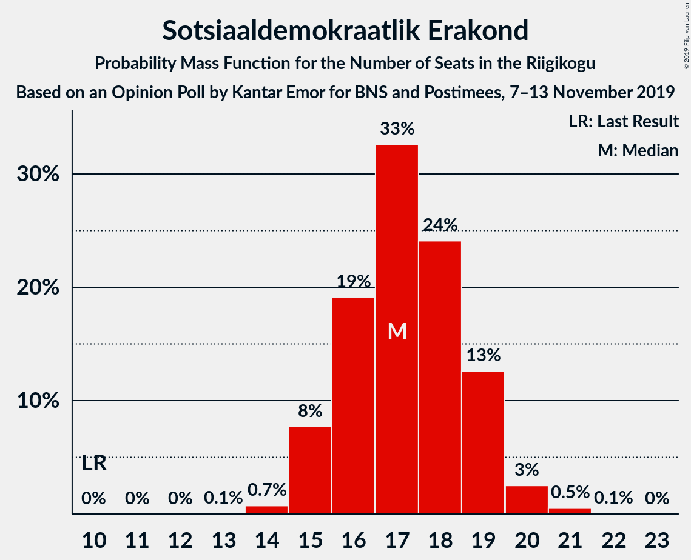
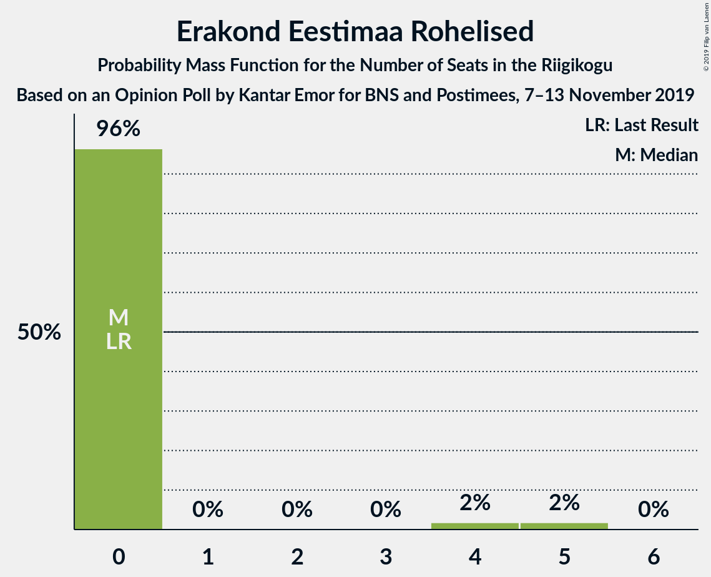
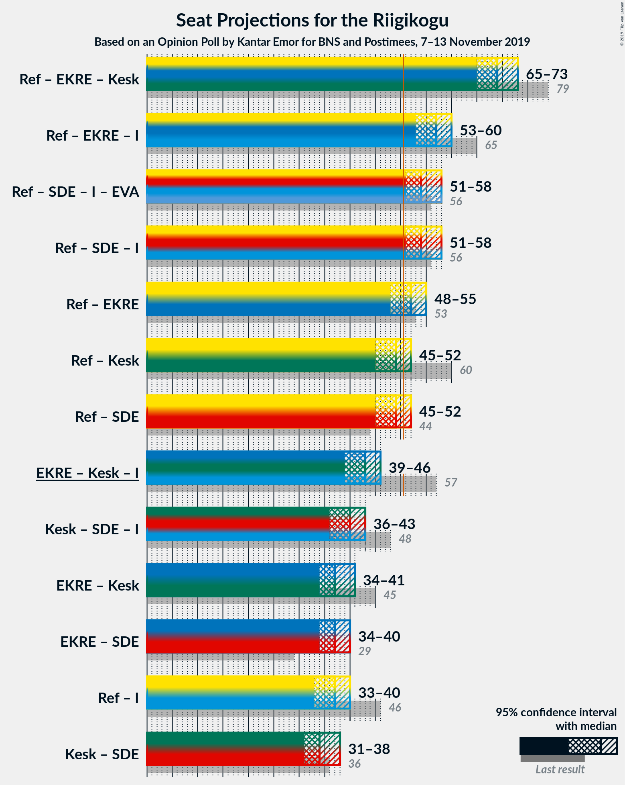

# Opinion Poll by Kantar Emor for BNS and Postimees, 7–13 November 2019

<a href="#voting-intentions">Voting Intentions</a> | <a href="#seats">Seats</a> | <a href="#coalitions">Coalitions</a> | <a href="#technical-information">Technical Information</a>

## Voting Intentions

### Confidence Intervals

| Party | Last Result | Poll Result | 80% Confidence Interval | 90% Confidence Interval | 95% Confidence Interval | 99% Confidence Interval |
|:-----:|:-----------:|:-----------:|:-----------------------:|:-----------------------:|:-----------------------:|:-----------------------:|
| Eesti Reformierakond | 28.9% | 27.4% | 25.9–29.0% |25.5–29.4% |25.2–29.8% |24.5–30.6% |
| Eesti Konservatiivne Rahvaerakond | 17.8% | 18.3% | 17.1–19.7% |16.7–20.1% |16.4–20.5% |15.8–21.1% |
| Eesti Keskerakond | 23.1% | 16.1% | 14.9–17.4% |14.5–17.8% |14.2–18.1% |13.7–18.7% |
| Sotsiaaldemokraatlik Erakond | 9.8% | 16.1% | 14.9–17.4% |14.5–17.8% |14.2–18.1% |13.7–18.7% |
| Eesti 200 | 4.4% | 9.4% | 8.4–10.5% |8.2–10.8% |8.0–11.0% |7.5–11.6% |
| Erakond Isamaa | 11.4% | 6.1% | 5.4–7.0% |5.2–7.3% |5.0–7.5% |4.6–7.9% |
| Erakond Eestimaa Rohelised | 1.8% | 4.0% | 3.4–4.7% |3.2–5.0% |3.1–5.1% |2.8–5.5% |
| Eesti Vabaerakond | 1.2% | 1.0% | 0.7–1.4% |0.7–1.6% |0.6–1.7% |0.5–1.9% |

*Note:* The poll result column reflects the actual value used in the calculations. Published results may vary slightly, and in addition be rounded to fewer digits.

## Seats

### Confidence Intervals

| Party | Last Result | Median | 80% Confidence Interval | 90% Confidence Interval | 95% Confidence Interval | 99% Confidence Interval |
|:-----:|:-----------:|:------:|:-----------------------:|:-----------------------:|:-----------------------:|:-----------------------:|
| <a href="#eesti-reformierakond">Eesti Reformierakond</a> | 34 | 31 | 30–33 |29–34 |29–35 |28–36 |
| <a href="#eesti-konservatiivne-rahvaerakond">Eesti Konservatiivne Rahvaerakond</a> | 19 | 20 | 19–22 |18–22 |18–23 |17–24 |
| <a href="#eesti-keskerakond">Eesti Keskerakond</a> | 26 | 17 | 16–19 |15–19 |15–20 |14–21 |
| <a href="#sotsiaaldemokraatlik-erakond">Sotsiaaldemokraatlik Erakond</a> | 10 | 17 | 16–19 |15–19 |15–20 |14–21 |
| <a href="#eesti-200">Eesti 200</a> | 0 | 9 | 8–10 |8–11 |8–11 |7–12 |
| <a href="#erakond-isamaa">Erakond Isamaa</a> | 12 | 6 | 5–7 |5–7 |0–7 |0–8 |
| <a href="#erakond-eestimaa-rohelised">Erakond Eestimaa Rohelised</a> | 0 | 0 | 0 |0 |0–4 |0–5 |
| <a href="#eesti-vabaerakond">Eesti Vabaerakond</a> | 0 | 0 | 0 |0 |0 |0 |

### Eesti Reformierakond

*For a full overview of the results for this party, see the [Eesti Reformierakond](party-eestireformierakond.html) page.*

| Number of Seats | Probability | Accumulated | Special Marks |
|:---------------:|:-----------:|:-----------:|:-------------:|
| 27 | 0.3% | 100% |  |
| 28 | 2% | 99.7% |  |
| 29 | 7% | 98% |  |
| 30 | 15% | 91% |  |
| 31 | 26% | 76% | Median |
| 32 | 21% | 49% |  |
| 33 | 19% | 29% |  |
| 34 | 7% | 10% | Last Result |
| 35 | 2% | 3% |  |
| 36 | 0.8% | 0.9% |  |
| 37 | 0.1% | 0.1% |  |
| 38 | 0% | 0% |  |

### Eesti Konservatiivne Rahvaerakond

*For a full overview of the results for this party, see the [Eesti Konservatiivne Rahvaerakond](party-eestikonservatiivnerahvaerakond.html) page.*

| Number of Seats | Probability | Accumulated | Special Marks |
|:---------------:|:-----------:|:-----------:|:-------------:|
| 16 | 0.2% | 100% |  |
| 17 | 2% | 99.8% |  |
| 18 | 7% | 98% |  |
| 19 | 22% | 90% | Last Result |
| 20 | 32% | 68% | Median |
| 21 | 21% | 36% |  |
| 22 | 11% | 15% |  |
| 23 | 3% | 4% |  |
| 24 | 0.5% | 0.6% |  |
| 25 | 0% | 0% |  |

### Eesti Keskerakond

*For a full overview of the results for this party, see the [Eesti Keskerakond](party-eestikeskerakond.html) page.*

| Number of Seats | Probability | Accumulated | Special Marks |
|:---------------:|:-----------:|:-----------:|:-------------:|
| 13 | 0.1% | 100% |  |
| 14 | 1.0% | 99.9% |  |
| 15 | 5% | 98.9% |  |
| 16 | 22% | 94% |  |
| 17 | 32% | 72% | Median |
| 18 | 25% | 40% |  |
| 19 | 12% | 15% |  |
| 20 | 2% | 3% |  |
| 21 | 0.6% | 0.7% |  |
| 22 | 0% | 0% |  |
| 23 | 0% | 0% |  |
| 24 | 0% | 0% |  |
| 25 | 0% | 0% |  |
| 26 | 0% | 0% | Last Result |

### Sotsiaaldemokraatlik Erakond

*For a full overview of the results for this party, see the [Sotsiaaldemokraatlik Erakond](party-sotsiaaldemokraatlikerakond.html) page.*

| Number of Seats | Probability | Accumulated | Special Marks |
|:---------------:|:-----------:|:-----------:|:-------------:|
| 10 | 0% | 100% | Last Result |
| 11 | 0% | 100% |  |
| 12 | 0% | 100% |  |
| 13 | 0.1% | 100% |  |
| 14 | 0.7% | 99.9% |  |
| 15 | 8% | 99.2% |  |
| 16 | 21% | 91% |  |
| 17 | 29% | 70% | Median |
| 18 | 26% | 40% |  |
| 19 | 11% | 15% |  |
| 20 | 3% | 4% |  |
| 21 | 0.6% | 0.7% |  |
| 22 | 0.1% | 0.1% |  |
| 23 | 0% | 0% |  |

### Eesti 200

*For a full overview of the results for this party, see the [Eesti 200](party-eesti200.html) page.*

| Number of Seats | Probability | Accumulated | Special Marks |
|:---------------:|:-----------:|:-----------:|:-------------:|
| 0 | 0% | 100% | Last Result |
| 1 | 0% | 100% |  |
| 2 | 0% | 100% |  |
| 3 | 0% | 100% |  |
| 4 | 0% | 100% |  |
| 5 | 0% | 100% |  |
| 6 | 0% | 100% |  |
| 7 | 2% | 100% |  |
| 8 | 17% | 98% |  |
| 9 | 40% | 81% | Median |
| 10 | 32% | 41% |  |
| 11 | 8% | 10% |  |
| 12 | 1.1% | 1.2% |  |
| 13 | 0.1% | 0.1% |  |
| 14 | 0% | 0% |  |

### Erakond Isamaa

*For a full overview of the results for this party, see the [Erakond Isamaa](party-erakondisamaa.html) page.*

| Number of Seats | Probability | Accumulated | Special Marks |
|:---------------:|:-----------:|:-----------:|:-------------:|
| 0 | 3% | 100% |  |
| 1 | 0% | 97% |  |
| 2 | 0% | 97% |  |
| 3 | 0% | 97% |  |
| 4 | 2% | 97% |  |
| 5 | 43% | 95% |  |
| 6 | 41% | 52% | Median |
| 7 | 10% | 10% |  |
| 8 | 0.8% | 0.8% |  |
| 9 | 0% | 0% |  |
| 10 | 0% | 0% |  |
| 11 | 0% | 0% |  |
| 12 | 0% | 0% | Last Result |

### Erakond Eestimaa Rohelised

*For a full overview of the results for this party, see the [Erakond Eestimaa Rohelised](party-erakondeestimaarohelised.html) page.*

| Number of Seats | Probability | Accumulated | Special Marks |
|:---------------:|:-----------:|:-----------:|:-------------:|
| 0 | 97% | 100% | Last Result, Median |
| 1 | 0% | 3% |  |
| 2 | 0% | 3% |  |
| 3 | 0% | 3% |  |
| 4 | 1.3% | 3% |  |
| 5 | 2% | 2% |  |
| 6 | 0% | 0% |  |

### Eesti Vabaerakond

*For a full overview of the results for this party, see the [Eesti Vabaerakond](party-eestivabaerakond.html) page.*

| Number of Seats | Probability | Accumulated | Special Marks |
|:---------------:|:-----------:|:-----------:|:-------------:|
| 0 | 100% | 100% | Last Result, Median |

## Coalitions

### Confidence Intervals

| Coalition | Last Result | Median | Majority? | 80% Confidence Interval | 90% Confidence Interval | 95% Confidence Interval | 99% Confidence Interval |
|:---------:|:-----------:|:------:|:---------:|:-----------------------:|:-----------------------:|:-----------------------:|:-----------------------:|
| Eesti Reformierakond – Eesti Konservatiivne Rahvaerakond – Eesti Keskerakond | 79 | 69 | 100% | 67–71 | 66–72 | 65–72 | 64–74 |
| Eesti Reformierakond – Eesti Konservatiivne Rahvaerakond – Erakond Isamaa | 65 | 57 | 99.9% | 55–59 | 54–60 | 54–60 | 52–61 |
| Eesti Reformierakond – Sotsiaaldemokraatlik Erakond – Erakond Isamaa – Eesti Vabaerakond | 56 | 54 | 98% | 52–57 | 51–57 | 51–57 | 49–59 |
| Eesti Reformierakond – Sotsiaaldemokraatlik Erakond – Erakond Isamaa | 56 | 54 | 98% | 52–57 | 51–57 | 51–57 | 49–59 |
| Eesti Reformierakond – Eesti Konservatiivne Rahvaerakond | 53 | 52 | 77% | 49–54 | 49–54 | 48–55 | 47–57 |
| Eesti Reformierakond – Sotsiaaldemokraatlik Erakond | 44 | 49 | 16% | 46–51 | 46–52 | 46–52 | 44–54 |
| Eesti Reformierakond – Eesti Keskerakond | 60 | 49 | 16% | 47–51 | 46–52 | 45–52 | 44–53 |
| Eesti Konservatiivne Rahvaerakond – Eesti Keskerakond – Erakond Isamaa | 57 | 43 | 0% | 40–45 | 40–45 | 39–46 | 38–47 |
| Eesti Keskerakond – Sotsiaaldemokraatlik Erakond – Erakond Isamaa | 48 | 40 | 0% | 38–42 | 37–43 | 36–43 | 34–44 |
| Eesti Konservatiivne Rahvaerakond – Eesti Keskerakond | 45 | 37 | 0% | 35–39 | 35–40 | 34–41 | 33–41 |
| Eesti Konservatiivne Rahvaerakond – Sotsiaaldemokraatlik Erakond | 29 | 37 | 0% | 35–39 | 35–40 | 34–41 | 33–42 |
| Eesti Reformierakond – Erakond Isamaa | 46 | 37 | 0% | 35–39 | 34–40 | 33–40 | 32–41 |
| Eesti Keskerakond – Sotsiaaldemokraatlik Erakond | 36 | 34 | 0% | 33–36 | 32–37 | 31–38 | 30–39 |

### Eesti Reformierakond – Eesti Konservatiivne Rahvaerakond – Eesti Keskerakond

| Number of Seats | Probability | Accumulated | Special Marks |
|:---------------:|:-----------:|:-----------:|:-------------:|
| 63 | 0.2% | 100% |  |
| 64 | 0.4% | 99.7% |  |
| 65 | 2% | 99.3% |  |
| 66 | 6% | 97% |  |
| 67 | 9% | 91% |  |
| 68 | 25% | 83% | Median |
| 69 | 23% | 58% |  |
| 70 | 18% | 35% |  |
| 71 | 11% | 17% |  |
| 72 | 4% | 6% |  |
| 73 | 1.0% | 2% |  |
| 74 | 1.1% | 1.3% |  |
| 75 | 0.1% | 0.2% |  |
| 76 | 0.1% | 0.1% |  |
| 77 | 0% | 0% |  |
| 78 | 0% | 0% |  |
| 79 | 0% | 0% | Last Result |

### Eesti Reformierakond – Eesti Konservatiivne Rahvaerakond – Erakond Isamaa

| Number of Seats | Probability | Accumulated | Special Marks |
|:---------------:|:-----------:|:-----------:|:-------------:|
| 50 | 0% | 100% |  |
| 51 | 0.2% | 99.9% | Majority |
| 52 | 0.6% | 99.8% |  |
| 53 | 1.5% | 99.2% |  |
| 54 | 4% | 98% |  |
| 55 | 11% | 94% |  |
| 56 | 18% | 83% |  |
| 57 | 22% | 65% | Median |
| 58 | 22% | 43% |  |
| 59 | 14% | 21% |  |
| 60 | 5% | 7% |  |
| 61 | 1.4% | 2% |  |
| 62 | 0.3% | 0.3% |  |
| 63 | 0% | 0% |  |
| 64 | 0% | 0% |  |
| 65 | 0% | 0% | Last Result |

### Eesti Reformierakond – Sotsiaaldemokraatlik Erakond – Erakond Isamaa – Eesti Vabaerakond

| Number of Seats | Probability | Accumulated | Special Marks |
|:---------------:|:-----------:|:-----------:|:-------------:|
| 48 | 0.1% | 100% |  |
| 49 | 0.6% | 99.9% |  |
| 50 | 1.1% | 99.3% |  |
| 51 | 4% | 98% | Majority |
| 52 | 12% | 94% |  |
| 53 | 10% | 82% |  |
| 54 | 31% | 72% | Median |
| 55 | 20% | 40% |  |
| 56 | 9% | 20% | Last Result |
| 57 | 9% | 11% |  |
| 58 | 2% | 2% |  |
| 59 | 0.6% | 0.6% |  |
| 60 | 0% | 0% |  |

### Eesti Reformierakond – Sotsiaaldemokraatlik Erakond – Erakond Isamaa

| Number of Seats | Probability | Accumulated | Special Marks |
|:---------------:|:-----------:|:-----------:|:-------------:|
| 48 | 0.1% | 100% |  |
| 49 | 0.6% | 99.9% |  |
| 50 | 1.1% | 99.3% |  |
| 51 | 4% | 98% | Majority |
| 52 | 12% | 94% |  |
| 53 | 10% | 82% |  |
| 54 | 31% | 72% | Median |
| 55 | 20% | 40% |  |
| 56 | 9% | 20% | Last Result |
| 57 | 9% | 11% |  |
| 58 | 2% | 2% |  |
| 59 | 0.6% | 0.6% |  |
| 60 | 0% | 0% |  |

### Eesti Reformierakond – Eesti Konservatiivne Rahvaerakond

| Number of Seats | Probability | Accumulated | Special Marks |
|:---------------:|:-----------:|:-----------:|:-------------:|
| 46 | 0.1% | 100% |  |
| 47 | 0.6% | 99.8% |  |
| 48 | 3% | 99.2% |  |
| 49 | 7% | 96% |  |
| 50 | 13% | 89% |  |
| 51 | 24% | 77% | Median, Majority |
| 52 | 18% | 52% |  |
| 53 | 23% | 34% | Last Result |
| 54 | 6% | 11% |  |
| 55 | 2% | 5% |  |
| 56 | 2% | 2% |  |
| 57 | 0.5% | 0.8% |  |
| 58 | 0.2% | 0.2% |  |
| 59 | 0% | 0% |  |

### Eesti Reformierakond – Sotsiaaldemokraatlik Erakond

| Number of Seats | Probability | Accumulated | Special Marks |
|:---------------:|:-----------:|:-----------:|:-------------:|
| 43 | 0.1% | 100% |  |
| 44 | 0.5% | 99.9% | Last Result |
| 45 | 2% | 99.4% |  |
| 46 | 10% | 98% |  |
| 47 | 12% | 88% |  |
| 48 | 16% | 76% | Median |
| 49 | 31% | 60% |  |
| 50 | 14% | 30% |  |
| 51 | 10% | 16% | Majority |
| 52 | 4% | 6% |  |
| 53 | 1.0% | 2% |  |
| 54 | 0.5% | 0.6% |  |
| 55 | 0.1% | 0.1% |  |
| 56 | 0% | 0% |  |

### Eesti Reformierakond – Eesti Keskerakond

| Number of Seats | Probability | Accumulated | Special Marks |
|:---------------:|:-----------:|:-----------:|:-------------:|
| 43 | 0.1% | 100% |  |
| 44 | 0.6% | 99.9% |  |
| 45 | 2% | 99.3% |  |
| 46 | 5% | 97% |  |
| 47 | 15% | 92% |  |
| 48 | 25% | 78% | Median |
| 49 | 19% | 53% |  |
| 50 | 18% | 34% |  |
| 51 | 9% | 16% | Majority |
| 52 | 5% | 7% |  |
| 53 | 2% | 2% |  |
| 54 | 0.2% | 0.3% |  |
| 55 | 0.1% | 0.1% |  |
| 56 | 0% | 0% |  |
| 57 | 0% | 0% |  |
| 58 | 0% | 0% |  |
| 59 | 0% | 0% |  |
| 60 | 0% | 0% | Last Result |

### Eesti Konservatiivne Rahvaerakond – Eesti Keskerakond – Erakond Isamaa

| Number of Seats | Probability | Accumulated | Special Marks |
|:---------------:|:-----------:|:-----------:|:-------------:|
| 36 | 0.1% | 100% |  |
| 37 | 0.3% | 99.9% |  |
| 38 | 0.6% | 99.5% |  |
| 39 | 3% | 98.9% |  |
| 40 | 6% | 96% |  |
| 41 | 10% | 90% |  |
| 42 | 25% | 80% |  |
| 43 | 19% | 55% | Median |
| 44 | 18% | 36% |  |
| 45 | 13% | 18% |  |
| 46 | 3% | 5% |  |
| 47 | 1.3% | 1.4% |  |
| 48 | 0.1% | 0.2% |  |
| 49 | 0% | 0% |  |
| 50 | 0% | 0% |  |
| 51 | 0% | 0% | Majority |
| 52 | 0% | 0% |  |
| 53 | 0% | 0% |  |
| 54 | 0% | 0% |  |
| 55 | 0% | 0% |  |
| 56 | 0% | 0% |  |
| 57 | 0% | 0% | Last Result |

### Eesti Keskerakond – Sotsiaaldemokraatlik Erakond – Erakond Isamaa

| Number of Seats | Probability | Accumulated | Special Marks |
|:---------------:|:-----------:|:-----------:|:-------------:|
| 33 | 0.2% | 100% |  |
| 34 | 0.6% | 99.8% |  |
| 35 | 1.0% | 99.2% |  |
| 36 | 2% | 98% |  |
| 37 | 4% | 96% |  |
| 38 | 10% | 93% |  |
| 39 | 22% | 83% |  |
| 40 | 28% | 60% | Median |
| 41 | 16% | 32% |  |
| 42 | 9% | 16% |  |
| 43 | 5% | 7% |  |
| 44 | 1.4% | 2% |  |
| 45 | 0.3% | 0.4% |  |
| 46 | 0% | 0% |  |
| 47 | 0% | 0% |  |
| 48 | 0% | 0% | Last Result |

### Eesti Konservatiivne Rahvaerakond – Eesti Keskerakond

| Number of Seats | Probability | Accumulated | Special Marks |
|:---------------:|:-----------:|:-----------:|:-------------:|
| 32 | 0.1% | 100% |  |
| 33 | 0.7% | 99.9% |  |
| 34 | 4% | 99.2% |  |
| 35 | 8% | 95% |  |
| 36 | 16% | 87% |  |
| 37 | 24% | 71% | Median |
| 38 | 22% | 47% |  |
| 39 | 17% | 24% |  |
| 40 | 4% | 7% |  |
| 41 | 3% | 3% |  |
| 42 | 0.3% | 0.5% |  |
| 43 | 0.1% | 0.1% |  |
| 44 | 0% | 0% |  |
| 45 | 0% | 0% | Last Result |

### Eesti Konservatiivne Rahvaerakond – Sotsiaaldemokraatlik Erakond

| Number of Seats | Probability | Accumulated | Special Marks |
|:---------------:|:-----------:|:-----------:|:-------------:|
| 29 | 0% | 100% | Last Result |
| 30 | 0% | 100% |  |
| 31 | 0% | 100% |  |
| 32 | 0.1% | 100% |  |
| 33 | 0.7% | 99.9% |  |
| 34 | 4% | 99.1% |  |
| 35 | 10% | 95% |  |
| 36 | 16% | 85% |  |
| 37 | 25% | 69% | Median |
| 38 | 21% | 44% |  |
| 39 | 13% | 23% |  |
| 40 | 7% | 10% |  |
| 41 | 2% | 3% |  |
| 42 | 0.8% | 0.9% |  |
| 43 | 0.1% | 0.1% |  |
| 44 | 0% | 0% |  |

### Eesti Reformierakond – Erakond Isamaa

| Number of Seats | Probability | Accumulated | Special Marks |
|:---------------:|:-----------:|:-----------:|:-------------:|
| 30 | 0.2% | 100% |  |
| 31 | 0.2% | 99.7% |  |
| 32 | 0.8% | 99.6% |  |
| 33 | 1.4% | 98.8% |  |
| 34 | 5% | 97% |  |
| 35 | 8% | 93% |  |
| 36 | 25% | 84% |  |
| 37 | 18% | 60% | Median |
| 38 | 23% | 41% |  |
| 39 | 12% | 18% |  |
| 40 | 5% | 7% |  |
| 41 | 1.1% | 1.4% |  |
| 42 | 0.3% | 0.3% |  |
| 43 | 0% | 0% |  |
| 44 | 0% | 0% |  |
| 45 | 0% | 0% |  |
| 46 | 0% | 0% | Last Result |

### Eesti Keskerakond – Sotsiaaldemokraatlik Erakond

| Number of Seats | Probability | Accumulated | Special Marks |
|:---------------:|:-----------:|:-----------:|:-------------:|
| 30 | 0.8% | 100% |  |
| 31 | 2% | 99.1% |  |
| 32 | 7% | 97% |  |
| 33 | 18% | 90% |  |
| 34 | 25% | 72% | Median |
| 35 | 22% | 47% |  |
| 36 | 16% | 24% | Last Result |
| 37 | 5% | 9% |  |
| 38 | 3% | 4% |  |
| 39 | 0.5% | 0.7% |  |
| 40 | 0.1% | 0.1% |  |
| 41 | 0% | 0% |  |

## Technical Information

### Opinion Poll

+ **Polling firm:** Kantar Emor
+ **Commissioner(s):** BNS and Postimees
+ **Fieldwork period:** 7–13 November 2019

### Calculations

+ **Sample size:** 1407
+ **Simulations done:** 524,288
+ **Error estimate:** 1.25%

