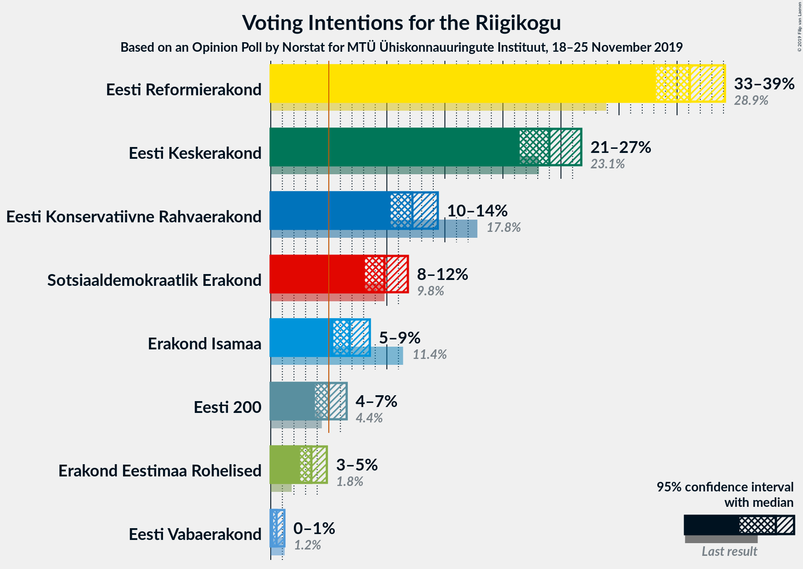
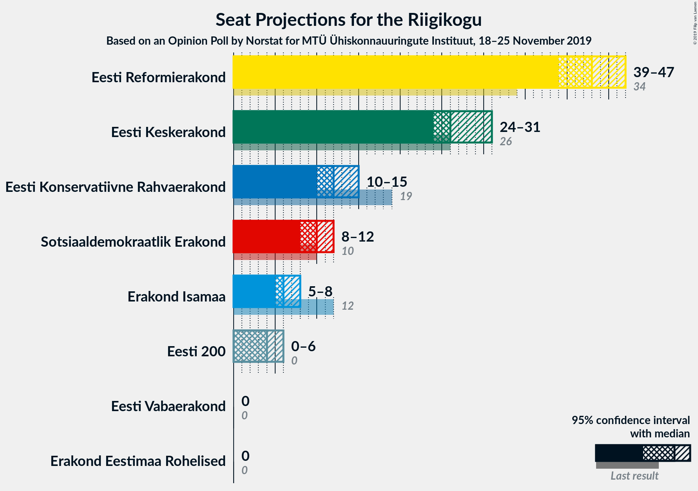
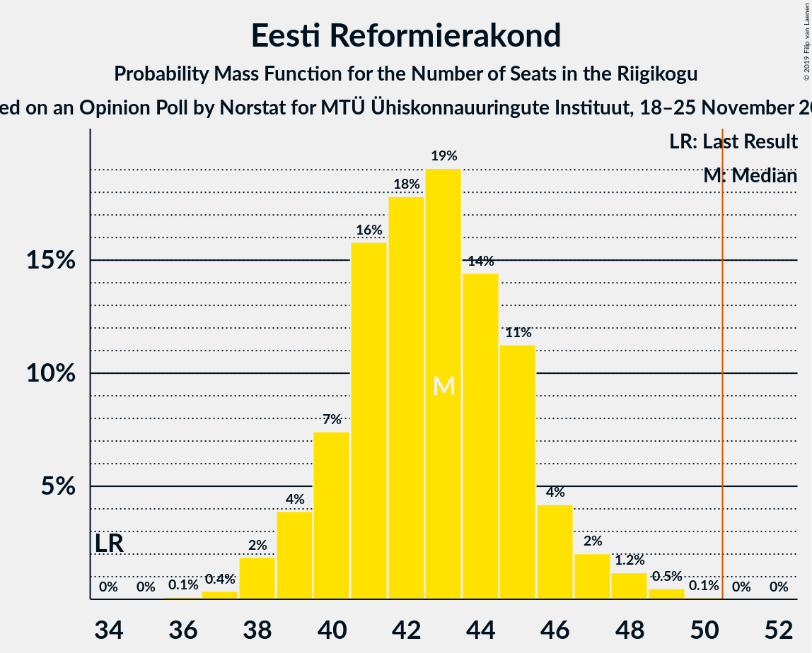
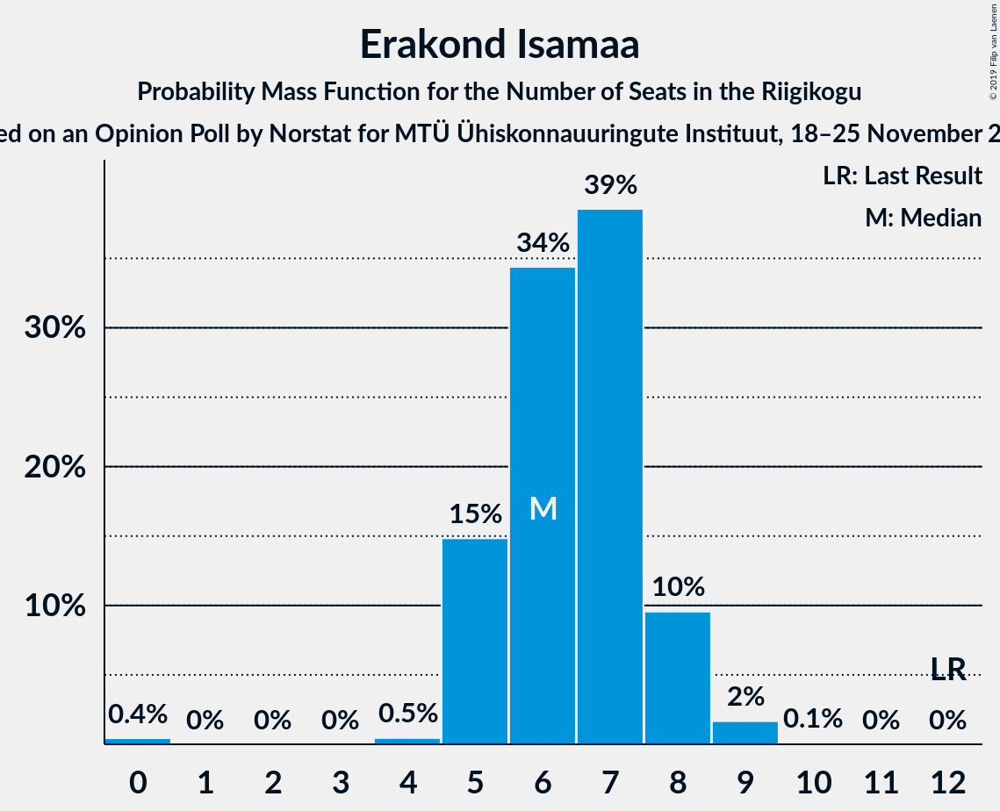
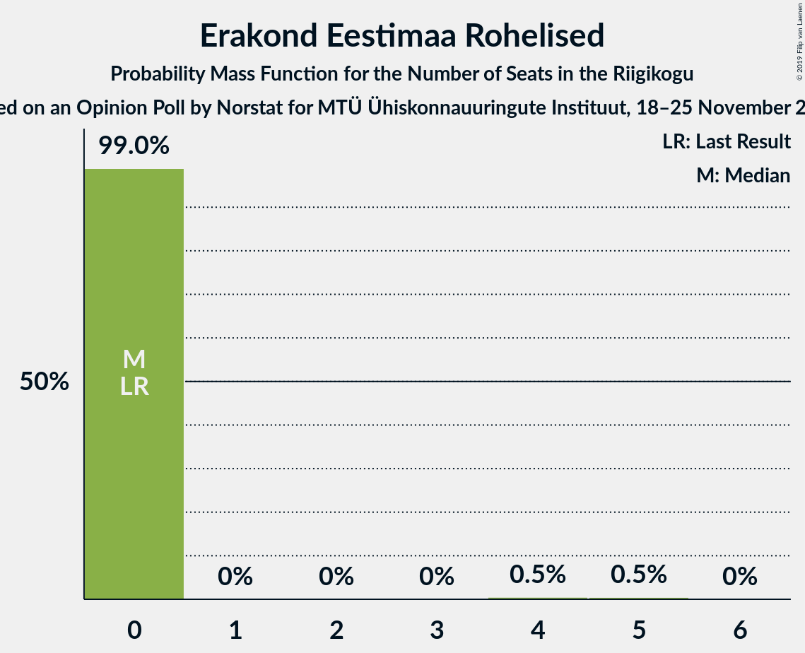
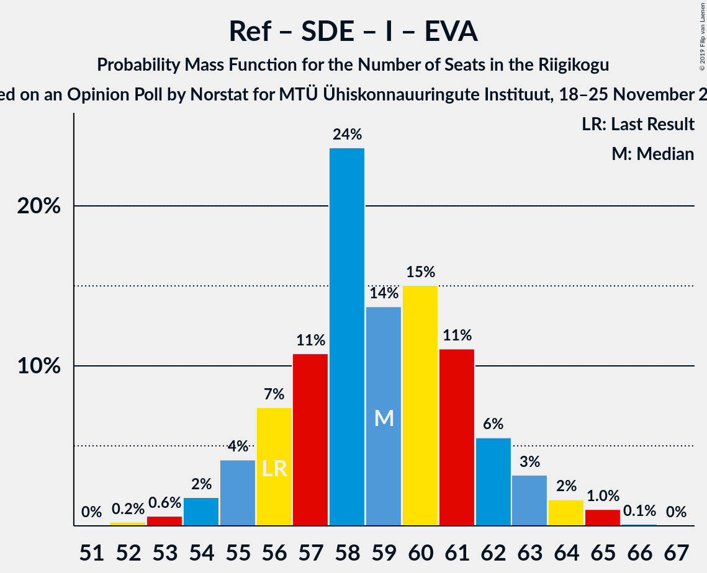

# Opinion Poll by Norstat for MTÜ Ühiskonnauuringute Instituut, 18–25 November 2019

<a href="#voting-intentions">Voting Intentions</a> | <a href="#seats">Seats</a> | <a href="#coalitions">Coalitions</a> | <a href="#technical-information">Technical Information</a>

## Voting Intentions

### Confidence Intervals

| Party | Last Result | Poll Result | 80% Confidence Interval | 90% Confidence Interval | 95% Confidence Interval | 99% Confidence Interval |
|:-----:|:-----------:|:-----------:|:-----------------------:|:-----------------------:|:-----------------------:|:-----------------------:|
| Eesti Reformierakond | 28.9% | 36.1% | 34.2–38.1% |33.6–38.6% |33.2–39.1% |32.3–40.1% |
| Eesti Keskerakond | 23.1% | 24.0% | 22.3–25.8% |21.9–26.3% |21.4–26.7% |20.7–27.6% |
| Eesti Konservatiivne Rahvaerakond | 17.8% | 12.2% | 11.0–13.6% |10.6–14.0% |10.3–14.4% |9.7–15.1% |
| Sotsiaaldemokraatlik Erakond | 9.8% | 9.8% | 8.7–11.1% |8.4–11.5% |8.1–11.8% |7.6–12.5% |
| Erakond Isamaa | 11.4% | 6.8% | 5.9–7.9% |5.6–8.3% |5.4–8.5% |5.0–9.1% |
| Eesti 200 | 4.4% | 5.0% | 4.2–6.0% |4.0–6.3% |3.8–6.5% |3.5–7.1% |
| Erakond Eestimaa Rohelised | 1.8% | 3.5% | 2.9–4.4% |2.7–4.6% |2.5–4.8% |2.2–5.3% |
| Eesti Vabaerakond | 1.2% | 0.5% | 0.3–0.9% |0.3–1.1% |0.2–1.2% |0.2–1.4% |

*Note:* The poll result column reflects the actual value used in the calculations. Published results may vary slightly, and in addition be rounded to fewer digits.

## Seats

### Confidence Intervals

| Party | Last Result | Median | 80% Confidence Interval | 90% Confidence Interval | 95% Confidence Interval | 99% Confidence Interval |
|:-----:|:-----------:|:------:|:-----------------------:|:-----------------------:|:-----------------------:|:-----------------------:|
| <a href="#eesti-reformierakond">Eesti Reformierakond</a> | 34 | 42 | 40–45 |39–46 |38–48 |38–49 |
| <a href="#eesti-keskerakond">Eesti Keskerakond</a> | 26 | 26 | 24–29 |24–30 |24–31 |23–32 |
| <a href="#eesti-konservatiivne-rahvaerakond">Eesti Konservatiivne Rahvaerakond</a> | 19 | 13 | 11–14 |11–15 |10–15 |10–16 |
| <a href="#sotsiaaldemokraatlik-erakond">Sotsiaaldemokraatlik Erakond</a> | 10 | 10 | 9–11 |8–12 |8–12 |7–13 |
| <a href="#erakond-isamaa">Erakond Isamaa</a> | 12 | 6 | 5–8 |5–8 |5–8 |4–9 |
| <a href="#eesti-200">Eesti 200</a> | 0 | 4 | 0–5 |0–6 |0–6 |0–7 |
| <a href="#erakond-eestimaa-rohelised">Erakond Eestimaa Rohelised</a> | 0 | 0 | 0 |0 |0 |0–4 |
| <a href="#eesti-vabaerakond">Eesti Vabaerakond</a> | 0 | 0 | 0 |0 |0 |0 |

### Eesti Reformierakond

*For a full overview of the results for this party, see the [Eesti Reformierakond](party-eestireformierakond.html) page.*

| Number of Seats | Probability | Accumulated | Special Marks |
|:---------------:|:-----------:|:-----------:|:-------------:|
| 34 | 0% | 100% | Last Result |
| 35 | 0% | 100% |  |
| 36 | 0.1% | 100% |  |
| 37 | 0.4% | 99.9% |  |
| 38 | 2% | 99.5% |  |
| 39 | 3% | 97% |  |
| 40 | 7% | 94% |  |
| 41 | 12% | 87% |  |
| 42 | 26% | 74% | Median |
| 43 | 18% | 48% |  |
| 44 | 15% | 30% |  |
| 45 | 8% | 16% |  |
| 46 | 4% | 7% |  |
| 47 | 1.3% | 4% |  |
| 48 | 2% | 3% |  |
| 49 | 0.5% | 0.6% |  |
| 50 | 0.1% | 0.1% |  |
| 51 | 0% | 0% | Majority |

### Eesti Keskerakond

*For a full overview of the results for this party, see the [Eesti Keskerakond](party-eestikeskerakond.html) page.*

| Number of Seats | Probability | Accumulated | Special Marks |
|:---------------:|:-----------:|:-----------:|:-------------:|
| 22 | 0.4% | 100% |  |
| 23 | 1.1% | 99.6% |  |
| 24 | 16% | 98% |  |
| 25 | 12% | 82% |  |
| 26 | 27% | 71% | Last Result, Median |
| 27 | 15% | 43% |  |
| 28 | 10% | 29% |  |
| 29 | 9% | 18% |  |
| 30 | 5% | 9% |  |
| 31 | 3% | 4% |  |
| 32 | 0.9% | 1.1% |  |
| 33 | 0.1% | 0.1% |  |
| 34 | 0% | 0% |  |

### Eesti Konservatiivne Rahvaerakond

*For a full overview of the results for this party, see the [Eesti Konservatiivne Rahvaerakond](party-eestikonservatiivnerahvaerakond.html) page.*

| Number of Seats | Probability | Accumulated | Special Marks |
|:---------------:|:-----------:|:-----------:|:-------------:|
| 9 | 0.4% | 100% |  |
| 10 | 4% | 99.6% |  |
| 11 | 8% | 96% |  |
| 12 | 37% | 88% |  |
| 13 | 31% | 51% | Median |
| 14 | 14% | 20% |  |
| 15 | 5% | 6% |  |
| 16 | 0.8% | 1.0% |  |
| 17 | 0.1% | 0.2% |  |
| 18 | 0% | 0% |  |
| 19 | 0% | 0% | Last Result |

### Sotsiaaldemokraatlik Erakond

*For a full overview of the results for this party, see the [Sotsiaaldemokraatlik Erakond](party-sotsiaaldemokraatlikerakond.html) page.*

| Number of Seats | Probability | Accumulated | Special Marks |
|:---------------:|:-----------:|:-----------:|:-------------:|
| 6 | 0.1% | 100% |  |
| 7 | 2% | 99.9% |  |
| 8 | 8% | 98% |  |
| 9 | 39% | 90% |  |
| 10 | 29% | 51% | Last Result, Median |
| 11 | 14% | 21% |  |
| 12 | 6% | 7% |  |
| 13 | 1.0% | 1.1% |  |
| 14 | 0.1% | 0.1% |  |
| 15 | 0% | 0% |  |

### Erakond Isamaa

*For a full overview of the results for this party, see the [Erakond Isamaa](party-erakondisamaa.html) page.*

| Number of Seats | Probability | Accumulated | Special Marks |
|:---------------:|:-----------:|:-----------:|:-------------:|
| 0 | 0.4% | 100% |  |
| 1 | 0% | 99.6% |  |
| 2 | 0% | 99.6% |  |
| 3 | 0% | 99.6% |  |
| 4 | 0.4% | 99.6% |  |
| 5 | 16% | 99.2% |  |
| 6 | 34% | 83% | Median |
| 7 | 39% | 49% |  |
| 8 | 9% | 11% |  |
| 9 | 2% | 2% |  |
| 10 | 0.1% | 0.1% |  |
| 11 | 0% | 0% |  |
| 12 | 0% | 0% | Last Result |

### Eesti 200

*For a full overview of the results for this party, see the [Eesti 200](party-eesti200.html) page.*

| Number of Seats | Probability | Accumulated | Special Marks |
|:---------------:|:-----------:|:-----------:|:-------------:|
| 0 | 37% | 100% | Last Result |
| 1 | 0% | 63% |  |
| 2 | 0% | 63% |  |
| 3 | 0% | 63% |  |
| 4 | 18% | 63% | Median |
| 5 | 38% | 45% |  |
| 6 | 7% | 7% |  |
| 7 | 0.5% | 0.5% |  |
| 8 | 0% | 0% |  |

### Erakond Eestimaa Rohelised

*For a full overview of the results for this party, see the [Erakond Eestimaa Rohelised](party-erakondeestimaarohelised.html) page.*

| Number of Seats | Probability | Accumulated | Special Marks |
|:---------------:|:-----------:|:-----------:|:-------------:|
| 0 | 98.9% | 100% | Last Result, Median |
| 1 | 0% | 1.1% |  |
| 2 | 0% | 1.1% |  |
| 3 | 0% | 1.1% |  |
| 4 | 0.6% | 1.1% |  |
| 5 | 0.5% | 0.5% |  |
| 6 | 0% | 0% |  |

### Eesti Vabaerakond

*For a full overview of the results for this party, see the [Eesti Vabaerakond](party-eestivabaerakond.html) page.*

| Number of Seats | Probability | Accumulated | Special Marks |
|:---------------:|:-----------:|:-----------:|:-------------:|
| 0 | 100% | 100% | Last Result, Median |

## Coalitions

### Confidence Intervals

| Coalition | Last Result | Median | Majority? | 80% Confidence Interval | 90% Confidence Interval | 95% Confidence Interval | 99% Confidence Interval |
|:---------:|:-----------:|:------:|:---------:|:-----------------------:|:-----------------------:|:-----------------------:|:-----------------------:|
| Eesti Reformierakond – Eesti Keskerakond – Eesti Konservatiivne Rahvaerakond | 79 | 81 | 100% | 79–86 | 78–86 | 77–87 | 76–88 |
| Eesti Reformierakond – Eesti Keskerakond | 60 | 69 | 100% | 67–73 | 66–73 | 65–74 | 64–76 |
| Eesti Reformierakond – Eesti Konservatiivne Rahvaerakond – Erakond Isamaa | 65 | 62 | 100% | 59–65 | 58–66 | 57–67 | 56–67 |
| Eesti Reformierakond – Sotsiaaldemokraatlik Erakond – Erakond Isamaa – Eesti Vabaerakond | 56 | 59 | 100% | 56–61 | 55–63 | 54–63 | 53–65 |
| Eesti Reformierakond – Sotsiaaldemokraatlik Erakond – Erakond Isamaa | 56 | 59 | 100% | 56–61 | 55–63 | 54–63 | 53–65 |
| Eesti Reformierakond – Eesti Konservatiivne Rahvaerakond | 53 | 55 | 98% | 53–58 | 51–60 | 51–60 | 49–61 |
| Eesti Reformierakond – Sotsiaaldemokraatlik Erakond | 44 | 52 | 84% | 50–55 | 49–56 | 48–57 | 47–58 |
| Eesti Reformierakond – Erakond Isamaa | 46 | 49 | 23% | 46–51 | 45–53 | 45–54 | 43–55 |
| Eesti Keskerakond – Eesti Konservatiivne Rahvaerakond – Erakond Isamaa | 57 | 46 | 2% | 43–49 | 42–50 | 42–50 | 40–52 |
| Eesti Keskerakond – Sotsiaaldemokraatlik Erakond – Erakond Isamaa | 48 | 42 | 0% | 40–46 | 40–47 | 38–48 | 38–49 |
| Eesti Keskerakond – Eesti Konservatiivne Rahvaerakond | 45 | 39 | 0% | 36–42 | 36–43 | 36–44 | 34–45 |
| Eesti Keskerakond – Sotsiaaldemokraatlik Erakond | 36 | 36 | 0% | 34–40 | 33–40 | 33–41 | 32–42 |
| Eesti Konservatiivne Rahvaerakond – Sotsiaaldemokraatlik Erakond | 29 | 22 | 0% | 21–24 | 20–25 | 19–25 | 18–26 |

### Eesti Reformierakond – Eesti Keskerakond – Eesti Konservatiivne Rahvaerakond

| Number of Seats | Probability | Accumulated | Special Marks |
|:---------------:|:-----------:|:-----------:|:-------------:|
| 75 | 0.1% | 100% |  |
| 76 | 0.5% | 99.9% |  |
| 77 | 2% | 99.4% |  |
| 78 | 3% | 97% |  |
| 79 | 10% | 95% | Last Result |
| 80 | 21% | 85% |  |
| 81 | 19% | 64% | Median |
| 82 | 12% | 45% |  |
| 83 | 4% | 33% |  |
| 84 | 13% | 29% |  |
| 85 | 6% | 16% |  |
| 86 | 7% | 11% |  |
| 87 | 3% | 3% |  |
| 88 | 0.5% | 0.7% |  |
| 89 | 0.1% | 0.2% |  |
| 90 | 0% | 0.1% |  |
| 91 | 0% | 0.1% |  |
| 92 | 0.1% | 0.1% |  |
| 93 | 0% | 0% |  |

### Eesti Reformierakond – Eesti Keskerakond

| Number of Seats | Probability | Accumulated | Special Marks |
|:---------------:|:-----------:|:-----------:|:-------------:|
| 60 | 0% | 100% | Last Result |
| 61 | 0% | 100% |  |
| 62 | 0.1% | 100% |  |
| 63 | 0.2% | 99.9% |  |
| 64 | 1.1% | 99.8% |  |
| 65 | 3% | 98.6% |  |
| 66 | 5% | 96% |  |
| 67 | 10% | 91% |  |
| 68 | 30% | 80% | Median |
| 69 | 14% | 50% |  |
| 70 | 10% | 36% |  |
| 71 | 6% | 26% |  |
| 72 | 8% | 20% |  |
| 73 | 7% | 12% |  |
| 74 | 3% | 5% |  |
| 75 | 1.2% | 2% |  |
| 76 | 0.4% | 0.5% |  |
| 77 | 0.1% | 0.2% |  |
| 78 | 0.1% | 0.1% |  |
| 79 | 0% | 0% |  |

### Eesti Reformierakond – Eesti Konservatiivne Rahvaerakond – Erakond Isamaa

| Number of Seats | Probability | Accumulated | Special Marks |
|:---------------:|:-----------:|:-----------:|:-------------:|
| 54 | 0.1% | 100% |  |
| 55 | 0.3% | 99.9% |  |
| 56 | 2% | 99.6% |  |
| 57 | 2% | 98% |  |
| 58 | 4% | 96% |  |
| 59 | 7% | 92% |  |
| 60 | 13% | 85% |  |
| 61 | 22% | 72% | Median |
| 62 | 16% | 50% |  |
| 63 | 17% | 34% |  |
| 64 | 5% | 17% |  |
| 65 | 6% | 12% | Last Result |
| 66 | 4% | 7% |  |
| 67 | 2% | 3% |  |
| 68 | 0.4% | 0.5% |  |
| 69 | 0.1% | 0.1% |  |
| 70 | 0% | 0% |  |

### Eesti Reformierakond – Sotsiaaldemokraatlik Erakond – Erakond Isamaa – Eesti Vabaerakond

| Number of Seats | Probability | Accumulated | Special Marks |
|:---------------:|:-----------:|:-----------:|:-------------:|
| 51 | 0% | 100% | Majority |
| 52 | 0.2% | 99.9% |  |
| 53 | 0.8% | 99.8% |  |
| 54 | 2% | 99.0% |  |
| 55 | 4% | 97% |  |
| 56 | 8% | 93% | Last Result |
| 57 | 9% | 85% |  |
| 58 | 26% | 76% | Median |
| 59 | 14% | 50% |  |
| 60 | 17% | 36% |  |
| 61 | 10% | 19% |  |
| 62 | 3% | 9% |  |
| 63 | 3% | 5% |  |
| 64 | 1.1% | 2% |  |
| 65 | 1.0% | 1.2% |  |
| 66 | 0.1% | 0.1% |  |
| 67 | 0% | 0% |  |

### Eesti Reformierakond – Sotsiaaldemokraatlik Erakond – Erakond Isamaa

| Number of Seats | Probability | Accumulated | Special Marks |
|:---------------:|:-----------:|:-----------:|:-------------:|
| 51 | 0% | 100% | Majority |
| 52 | 0.2% | 99.9% |  |
| 53 | 0.8% | 99.8% |  |
| 54 | 2% | 99.0% |  |
| 55 | 4% | 97% |  |
| 56 | 8% | 93% | Last Result |
| 57 | 9% | 85% |  |
| 58 | 26% | 76% | Median |
| 59 | 14% | 50% |  |
| 60 | 17% | 36% |  |
| 61 | 10% | 19% |  |
| 62 | 3% | 9% |  |
| 63 | 3% | 5% |  |
| 64 | 1.1% | 2% |  |
| 65 | 1.0% | 1.2% |  |
| 66 | 0.1% | 0.1% |  |
| 67 | 0% | 0% |  |

### Eesti Reformierakond – Eesti Konservatiivne Rahvaerakond

| Number of Seats | Probability | Accumulated | Special Marks |
|:---------------:|:-----------:|:-----------:|:-------------:|
| 48 | 0.1% | 100% |  |
| 49 | 0.4% | 99.9% |  |
| 50 | 2% | 99.5% |  |
| 51 | 3% | 98% | Majority |
| 52 | 5% | 95% |  |
| 53 | 12% | 90% | Last Result |
| 54 | 14% | 78% |  |
| 55 | 21% | 64% | Median |
| 56 | 16% | 43% |  |
| 57 | 12% | 27% |  |
| 58 | 6% | 14% |  |
| 59 | 3% | 8% |  |
| 60 | 4% | 5% |  |
| 61 | 1.3% | 2% |  |
| 62 | 0.2% | 0.3% |  |
| 63 | 0.1% | 0.1% |  |
| 64 | 0% | 0% |  |

### Eesti Reformierakond – Sotsiaaldemokraatlik Erakond

| Number of Seats | Probability | Accumulated | Special Marks |
|:---------------:|:-----------:|:-----------:|:-------------:|
| 44 | 0% | 100% | Last Result |
| 45 | 0.1% | 100% |  |
| 46 | 0.2% | 99.9% |  |
| 47 | 0.9% | 99.7% |  |
| 48 | 3% | 98.8% |  |
| 49 | 5% | 96% |  |
| 50 | 7% | 91% |  |
| 51 | 24% | 84% | Majority |
| 52 | 15% | 60% | Median |
| 53 | 17% | 45% |  |
| 54 | 14% | 28% |  |
| 55 | 7% | 14% |  |
| 56 | 3% | 7% |  |
| 57 | 2% | 4% |  |
| 58 | 1.5% | 2% |  |
| 59 | 0.2% | 0.3% |  |
| 60 | 0.1% | 0.1% |  |
| 61 | 0% | 0% |  |

### Eesti Reformierakond – Erakond Isamaa

| Number of Seats | Probability | Accumulated | Special Marks |
|:---------------:|:-----------:|:-----------:|:-------------:|
| 42 | 0.1% | 100% |  |
| 43 | 0.4% | 99.9% |  |
| 44 | 2% | 99.5% |  |
| 45 | 3% | 98% |  |
| 46 | 6% | 94% | Last Result |
| 47 | 8% | 89% |  |
| 48 | 17% | 81% | Median |
| 49 | 28% | 64% |  |
| 50 | 13% | 36% |  |
| 51 | 13% | 23% | Majority |
| 52 | 4% | 10% |  |
| 53 | 3% | 5% |  |
| 54 | 1.5% | 3% |  |
| 55 | 1.2% | 1.4% |  |
| 56 | 0.2% | 0.2% |  |
| 57 | 0% | 0% |  |

### Eesti Keskerakond – Eesti Konservatiivne Rahvaerakond – Erakond Isamaa

| Number of Seats | Probability | Accumulated | Special Marks |
|:---------------:|:-----------:|:-----------:|:-------------:|
| 38 | 0% | 100% |  |
| 39 | 0.1% | 99.9% |  |
| 40 | 0.5% | 99.8% |  |
| 41 | 1.2% | 99.3% |  |
| 42 | 5% | 98% |  |
| 43 | 15% | 93% |  |
| 44 | 11% | 78% |  |
| 45 | 17% | 68% | Median |
| 46 | 18% | 50% |  |
| 47 | 12% | 33% |  |
| 48 | 9% | 21% |  |
| 49 | 7% | 12% |  |
| 50 | 4% | 5% |  |
| 51 | 1.1% | 2% | Majority |
| 52 | 0.6% | 0.7% |  |
| 53 | 0.1% | 0.1% |  |
| 54 | 0% | 0% |  |
| 55 | 0% | 0% |  |
| 56 | 0% | 0% |  |
| 57 | 0% | 0% | Last Result |

### Eesti Keskerakond – Sotsiaaldemokraatlik Erakond – Erakond Isamaa

| Number of Seats | Probability | Accumulated | Special Marks |
|:---------------:|:-----------:|:-----------:|:-------------:|
| 36 | 0.1% | 100% |  |
| 37 | 0.2% | 99.9% |  |
| 38 | 2% | 99.6% |  |
| 39 | 2% | 97% |  |
| 40 | 16% | 95% |  |
| 41 | 11% | 80% |  |
| 42 | 22% | 69% | Median |
| 43 | 14% | 47% |  |
| 44 | 11% | 33% |  |
| 45 | 9% | 23% |  |
| 46 | 8% | 14% |  |
| 47 | 3% | 6% |  |
| 48 | 3% | 3% | Last Result |
| 49 | 0.3% | 0.6% |  |
| 50 | 0.2% | 0.2% |  |
| 51 | 0% | 0% | Majority |

### Eesti Keskerakond – Eesti Konservatiivne Rahvaerakond

| Number of Seats | Probability | Accumulated | Special Marks |
|:---------------:|:-----------:|:-----------:|:-------------:|
| 33 | 0.1% | 100% |  |
| 34 | 0.5% | 99.9% |  |
| 35 | 2% | 99.4% |  |
| 36 | 9% | 98% |  |
| 37 | 12% | 89% |  |
| 38 | 17% | 77% |  |
| 39 | 19% | 60% | Median |
| 40 | 14% | 41% |  |
| 41 | 11% | 27% |  |
| 42 | 8% | 16% |  |
| 43 | 5% | 8% |  |
| 44 | 2% | 3% |  |
| 45 | 0.8% | 1.1% | Last Result |
| 46 | 0.3% | 0.3% |  |
| 47 | 0% | 0% |  |

### Eesti Keskerakond – Sotsiaaldemokraatlik Erakond

| Number of Seats | Probability | Accumulated | Special Marks |
|:---------------:|:-----------:|:-----------:|:-------------:|
| 31 | 0.4% | 100% |  |
| 32 | 1.0% | 99.5% |  |
| 33 | 8% | 98.5% |  |
| 34 | 9% | 91% |  |
| 35 | 27% | 81% |  |
| 36 | 16% | 54% | Last Result, Median |
| 37 | 10% | 37% |  |
| 38 | 7% | 27% |  |
| 39 | 9% | 20% |  |
| 40 | 7% | 11% |  |
| 41 | 3% | 4% |  |
| 42 | 1.1% | 1.3% |  |
| 43 | 0.2% | 0.3% |  |
| 44 | 0.1% | 0.1% |  |
| 45 | 0% | 0% |  |

### Eesti Konservatiivne Rahvaerakond – Sotsiaaldemokraatlik Erakond

| Number of Seats | Probability | Accumulated | Special Marks |
|:---------------:|:-----------:|:-----------:|:-------------:|
| 17 | 0.1% | 100% |  |
| 18 | 0.7% | 99.9% |  |
| 19 | 2% | 99.3% |  |
| 20 | 6% | 97% |  |
| 21 | 22% | 92% |  |
| 22 | 29% | 70% |  |
| 23 | 20% | 41% | Median |
| 24 | 11% | 20% |  |
| 25 | 7% | 9% |  |
| 26 | 2% | 2% |  |
| 27 | 0.3% | 0.5% |  |
| 28 | 0.1% | 0.2% |  |
| 29 | 0% | 0% | Last Result |

## Technical Information

### Opinion Poll

+ **Polling firm:** Norstat
+ **Commissioner(s):** MTÜ Ühiskonnauuringute Instituut
+ **Fieldwork period:** 18–25 November 2019

### Calculations

+ **Sample size:** 1000
+ **Simulations done:** 524,288
+ **Error estimate:** 0.41%

