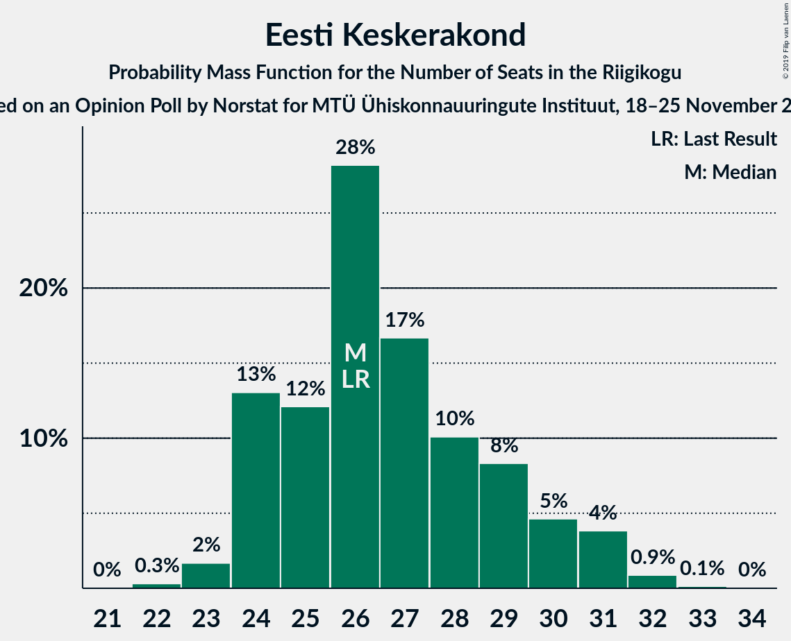
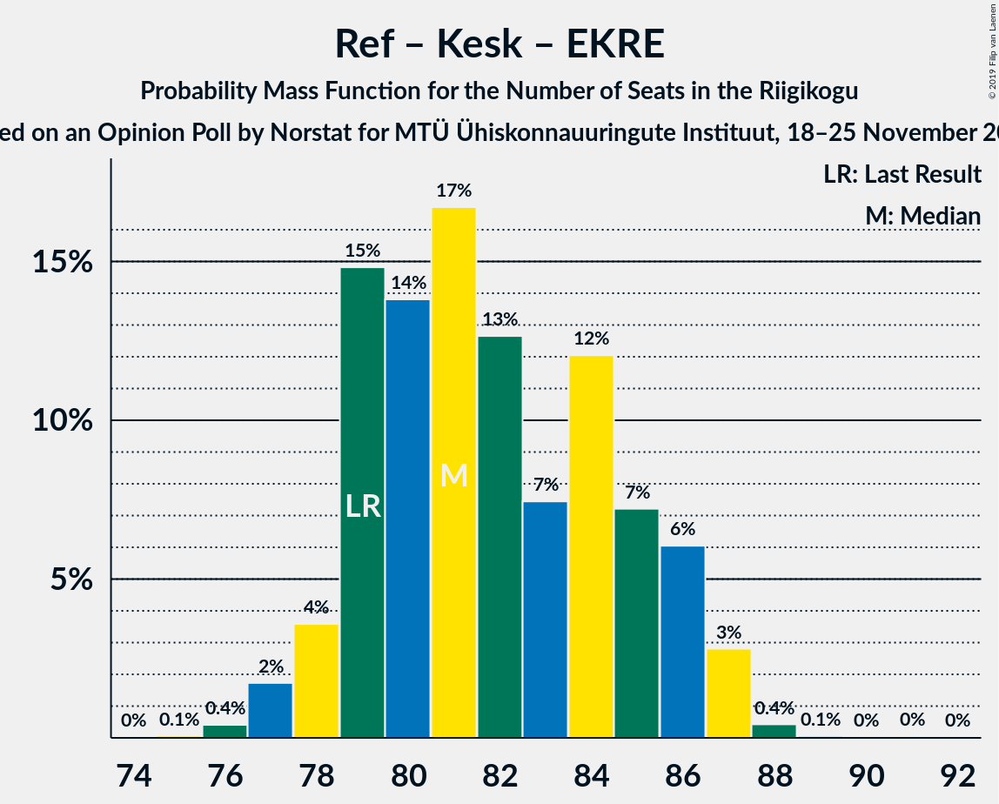
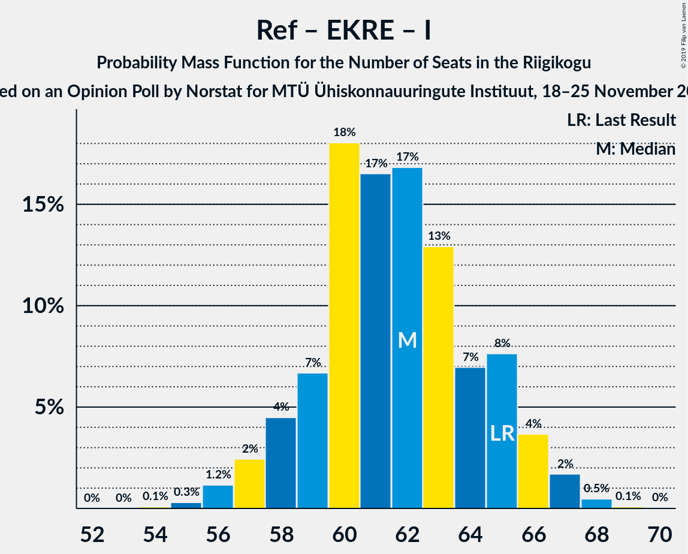
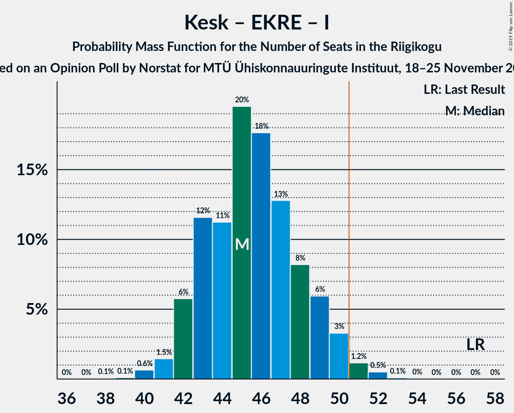
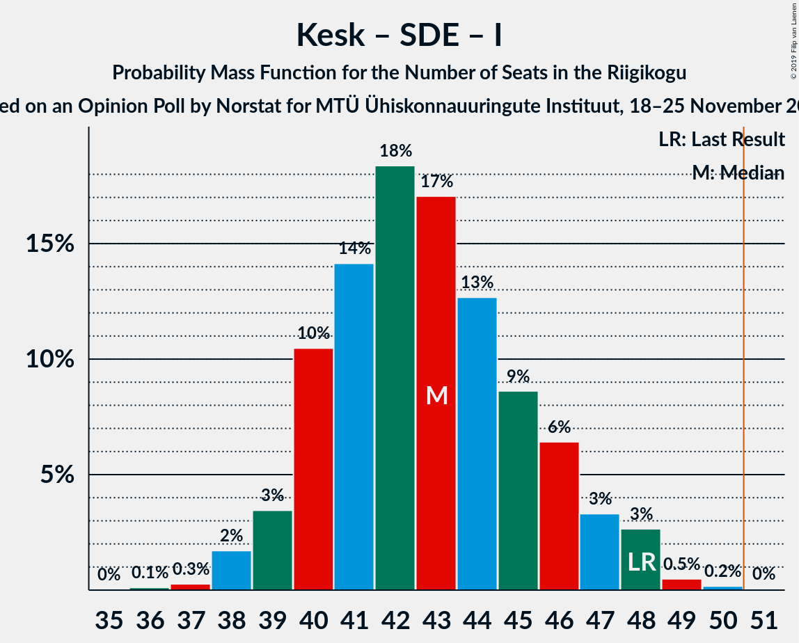

# Opinion Poll by Norstat for MTÜ Ühiskonnauuringute Instituut, 18–25 November 2019

<a href="#voting-intentions">Voting Intentions</a> | <a href="#seats">Seats</a> | <a href="#coalitions">Coalitions</a> | <a href="#technical-information">Technical Information</a>

## Voting Intentions

### Confidence Intervals

| Party | Last Result | Poll Result | 80% Confidence Interval | 90% Confidence Interval | 95% Confidence Interval | 99% Confidence Interval |
|:-----:|:-----------:|:-----------:|:-----------------------:|:-----------------------:|:-----------------------:|:-----------------------:|
| Eesti Reformierakond | 28.9% | 36.1% | 34.2–38.1% |33.6–38.6% |33.2–39.1% |32.3–40.1% |
| Eesti Keskerakond | 23.1% | 24.0% | 22.3–25.8% |21.9–26.3% |21.4–26.7% |20.7–27.6% |
| Eesti Konservatiivne Rahvaerakond | 17.8% | 12.2% | 11.0–13.6% |10.6–14.0% |10.3–14.4% |9.7–15.1% |
| Sotsiaaldemokraatlik Erakond | 9.8% | 9.8% | 8.7–11.1% |8.4–11.5% |8.1–11.8% |7.6–12.5% |
| Erakond Isamaa | 11.4% | 6.8% | 5.9–7.9% |5.6–8.3% |5.4–8.5% |5.0–9.1% |
| Eesti 200 | 4.4% | 5.0% | 4.2–6.0% |4.0–6.3% |3.8–6.5% |3.5–7.1% |
| Erakond Eestimaa Rohelised | 1.8% | 3.5% | 2.9–4.4% |2.7–4.6% |2.5–4.8% |2.2–5.3% |
| Eesti Vabaerakond | 1.2% | 0.5% | 0.3–0.9% |0.3–1.1% |0.2–1.2% |0.2–1.4% |

*Note:* The poll result column reflects the actual value used in the calculations. Published results may vary slightly, and in addition be rounded to fewer digits.

## Seats

### Confidence Intervals

| Party | Last Result | Median | 80% Confidence Interval | 90% Confidence Interval | 95% Confidence Interval | 99% Confidence Interval |
|:-----:|:-----------:|:------:|:-----------------------:|:-----------------------:|:-----------------------:|:-----------------------:|
| <a href="#eesti-reformierakond">Eesti Reformierakond</a> | 34 | 42 | 40–44 |39–45 |38–46 |38–48 |
| <a href="#eesti-keskerakond">Eesti Keskerakond</a> | 26 | 26 | 24–29 |24–30 |24–31 |23–31 |
| <a href="#eesti-konservatiivne-rahvaerakond">Eesti Konservatiivne Rahvaerakond</a> | 19 | 12 | 11–14 |11–14 |11–15 |10–16 |
| <a href="#sotsiaaldemokraatlik-erakond">Sotsiaaldemokraatlik Erakond</a> | 10 | 9 | 8–12 |8–12 |8–12 |7–13 |
| <a href="#erakond-isamaa">Erakond Isamaa</a> | 12 | 7 | 6–8 |5–8 |5–8 |5–9 |
| <a href="#eesti-200">Eesti 200</a> | 0 | 5 | 0–5 |0–6 |0–6 |0–6 |
| <a href="#erakond-eestimaa-rohelised">Erakond Eestimaa Rohelised</a> | 0 | 0 | 0 |0 |0 |0–4 |
| <a href="#eesti-vabaerakond">Eesti Vabaerakond</a> | 0 | 0 | 0 |0 |0 |0 |

### Eesti Reformierakond

*For a full overview of the results for this party, see the [Eesti Reformierakond](party-eestireformierakond.html) page.*

| Number of Seats | Probability | Accumulated | Special Marks |
|:---------------:|:-----------:|:-----------:|:-------------:|
| 34 | 0% | 100% | Last Result |
| 35 | 0% | 100% |  |
| 36 | 0% | 100% |  |
| 37 | 0.4% | 99.9% |  |
| 38 | 3% | 99.6% |  |
| 39 | 3% | 97% |  |
| 40 | 12% | 94% |  |
| 41 | 8% | 82% |  |
| 42 | 34% | 74% | Median |
| 43 | 17% | 41% |  |
| 44 | 16% | 24% |  |
| 45 | 5% | 8% |  |
| 46 | 1.5% | 3% |  |
| 47 | 0.3% | 2% |  |
| 48 | 1.0% | 1.2% |  |
| 49 | 0.2% | 0.3% |  |
| 50 | 0.1% | 0.1% |  |
| 51 | 0% | 0% | Majority |

### Eesti Keskerakond

*For a full overview of the results for this party, see the [Eesti Keskerakond](party-eestikeskerakond.html) page.*

| Number of Seats | Probability | Accumulated | Special Marks |
|:---------------:|:-----------:|:-----------:|:-------------:|
| 22 | 0.1% | 100% |  |
| 23 | 1.1% | 99.9% |  |
| 24 | 23% | 98.8% |  |
| 25 | 5% | 75% |  |
| 26 | 22% | 70% | Last Result, Median |
| 27 | 27% | 48% |  |
| 28 | 10% | 21% |  |
| 29 | 3% | 12% |  |
| 30 | 5% | 8% |  |
| 31 | 3% | 4% |  |
| 32 | 0.3% | 0.4% |  |
| 33 | 0% | 0.1% |  |
| 34 | 0% | 0% |  |

### Eesti Konservatiivne Rahvaerakond

*For a full overview of the results for this party, see the [Eesti Konservatiivne Rahvaerakond](party-eestikonservatiivnerahvaerakond.html) page.*

| Number of Seats | Probability | Accumulated | Special Marks |
|:---------------:|:-----------:|:-----------:|:-------------:|
| 9 | 0.2% | 100% |  |
| 10 | 2% | 99.8% |  |
| 11 | 10% | 98% |  |
| 12 | 52% | 88% | Median |
| 13 | 13% | 36% |  |
| 14 | 20% | 22% |  |
| 15 | 2% | 3% |  |
| 16 | 0.7% | 0.9% |  |
| 17 | 0.2% | 0.2% |  |
| 18 | 0% | 0% |  |
| 19 | 0% | 0% | Last Result |

### Sotsiaaldemokraatlik Erakond

*For a full overview of the results for this party, see the [Sotsiaaldemokraatlik Erakond](party-sotsiaaldemokraatlikerakond.html) page.*

| Number of Seats | Probability | Accumulated | Special Marks |
|:---------------:|:-----------:|:-----------:|:-------------:|
| 7 | 1.0% | 100% |  |
| 8 | 10% | 98.9% |  |
| 9 | 47% | 88% | Median |
| 10 | 19% | 42% | Last Result |
| 11 | 13% | 23% |  |
| 12 | 10% | 11% |  |
| 13 | 0.6% | 0.7% |  |
| 14 | 0.1% | 0.1% |  |
| 15 | 0% | 0% |  |

### Erakond Isamaa

*For a full overview of the results for this party, see the [Erakond Isamaa](party-erakondisamaa.html) page.*

| Number of Seats | Probability | Accumulated | Special Marks |
|:---------------:|:-----------:|:-----------:|:-------------:|
| 0 | 0.4% | 100% |  |
| 1 | 0% | 99.6% |  |
| 2 | 0% | 99.6% |  |
| 3 | 0% | 99.6% |  |
| 4 | 0.1% | 99.6% |  |
| 5 | 9% | 99.5% |  |
| 6 | 29% | 91% |  |
| 7 | 46% | 62% | Median |
| 8 | 13% | 15% |  |
| 9 | 2% | 2% |  |
| 10 | 0.1% | 0.1% |  |
| 11 | 0% | 0% |  |
| 12 | 0% | 0% | Last Result |

### Eesti 200

*For a full overview of the results for this party, see the [Eesti 200](party-eesti200.html) page.*

| Number of Seats | Probability | Accumulated | Special Marks |
|:---------------:|:-----------:|:-----------:|:-------------:|
| 0 | 30% | 100% | Last Result |
| 1 | 0% | 70% |  |
| 2 | 0% | 70% |  |
| 3 | 0% | 70% |  |
| 4 | 9% | 70% |  |
| 5 | 53% | 62% | Median |
| 6 | 9% | 9% |  |
| 7 | 0.5% | 0.5% |  |
| 8 | 0% | 0% |  |

### Erakond Eestimaa Rohelised

*For a full overview of the results for this party, see the [Erakond Eestimaa Rohelised](party-erakondeestimaarohelised.html) page.*

| Number of Seats | Probability | Accumulated | Special Marks |
|:---------------:|:-----------:|:-----------:|:-------------:|
| 0 | 99.1% | 100% | Last Result, Median |
| 1 | 0% | 0.9% |  |
| 2 | 0% | 0.9% |  |
| 3 | 0% | 0.9% |  |
| 4 | 0.5% | 0.9% |  |
| 5 | 0.4% | 0.4% |  |
| 6 | 0% | 0% |  |

### Eesti Vabaerakond

*For a full overview of the results for this party, see the [Eesti Vabaerakond](party-eestivabaerakond.html) page.*

| Number of Seats | Probability | Accumulated | Special Marks |
|:---------------:|:-----------:|:-----------:|:-------------:|
| 0 | 100% | 100% | Last Result, Median |

## Coalitions

### Confidence Intervals

| Coalition | Last Result | Median | Majority? | 80% Confidence Interval | 90% Confidence Interval | 95% Confidence Interval | 99% Confidence Interval |
|:---------:|:-----------:|:------:|:---------:|:-----------------------:|:-----------------------:|:-----------------------:|:-----------------------:|
| Eesti Reformierakond – Eesti Keskerakond – Eesti Konservatiivne Rahvaerakond | 79 | 80 | 100% | 79–84 | 78–86 | 78–87 | 76–87 |
| Eesti Reformierakond – Eesti Keskerakond | 60 | 68 | 100% | 66–72 | 66–73 | 65–74 | 64–75 |
| Eesti Reformierakond – Eesti Konservatiivne Rahvaerakond – Erakond Isamaa | 65 | 61 | 100% | 58–65 | 57–65 | 57–65 | 56–67 |
| Eesti Reformierakond – Sotsiaaldemokraatlik Erakond – Erakond Isamaa – Eesti Vabaerakond | 56 | 59 | 100% | 56–61 | 55–61 | 54–62 | 53–64 |
| Eesti Reformierakond – Sotsiaaldemokraatlik Erakond – Erakond Isamaa | 56 | 59 | 100% | 56–61 | 55–61 | 54–62 | 53–64 |
| Eesti Reformierakond – Eesti Konservatiivne Rahvaerakond | 53 | 55 | 97% | 52–57 | 51–59 | 50–59 | 49–61 |
| Eesti Reformierakond – Sotsiaaldemokraatlik Erakond | 44 | 52 | 78% | 49–54 | 49–55 | 48–56 | 47–58 |
| Eesti Reformierakond – Erakond Isamaa | 46 | 49 | 31% | 46–51 | 45–51 | 45–52 | 44–54 |
| Eesti Keskerakond – Eesti Konservatiivne Rahvaerakond – Erakond Isamaa | 57 | 45 | 2% | 43–49 | 42–49 | 42–50 | 41–51 |
| Eesti Keskerakond – Sotsiaaldemokraatlik Erakond – Erakond Isamaa | 48 | 42 | 0% | 40–46 | 40–47 | 40–48 | 38–49 |
| Eesti Keskerakond – Eesti Konservatiivne Rahvaerakond | 45 | 39 | 0% | 36–42 | 36–42 | 36–43 | 35–44 |
| Eesti Keskerakond – Sotsiaaldemokraatlik Erakond | 36 | 36 | 0% | 33–39 | 33–40 | 33–41 | 32–42 |
| Eesti Konservatiivne Rahvaerakond – Sotsiaaldemokraatlik Erakond | 29 | 21 | 0% | 21–24 | 20–25 | 20–25 | 19–27 |

### Eesti Reformierakond – Eesti Keskerakond – Eesti Konservatiivne Rahvaerakond

| Number of Seats | Probability | Accumulated | Special Marks |
|:---------------:|:-----------:|:-----------:|:-------------:|
| 75 | 0.1% | 100% |  |
| 76 | 0.9% | 99.9% |  |
| 77 | 1.3% | 99.0% |  |
| 78 | 4% | 98% |  |
| 79 | 11% | 94% | Last Result |
| 80 | 44% | 83% | Median |
| 81 | 4% | 40% |  |
| 82 | 13% | 35% |  |
| 83 | 3% | 22% |  |
| 84 | 10% | 19% |  |
| 85 | 3% | 9% |  |
| 86 | 3% | 7% |  |
| 87 | 3% | 4% |  |
| 88 | 0.3% | 0.4% |  |
| 89 | 0% | 0.1% |  |
| 90 | 0% | 0.1% |  |
| 91 | 0% | 0% |  |

### Eesti Reformierakond – Eesti Keskerakond

| Number of Seats | Probability | Accumulated | Special Marks |
|:---------------:|:-----------:|:-----------:|:-------------:|
| 60 | 0% | 100% | Last Result |
| 61 | 0% | 100% |  |
| 62 | 0.1% | 100% |  |
| 63 | 0.1% | 99.9% |  |
| 64 | 1.3% | 99.8% |  |
| 65 | 1.2% | 98.5% |  |
| 66 | 10% | 97% |  |
| 67 | 10% | 88% |  |
| 68 | 41% | 78% | Median |
| 69 | 12% | 37% |  |
| 70 | 12% | 26% |  |
| 71 | 2% | 14% |  |
| 72 | 2% | 11% |  |
| 73 | 7% | 9% |  |
| 74 | 1.3% | 3% |  |
| 75 | 0.9% | 1.3% |  |
| 76 | 0.3% | 0.3% |  |
| 77 | 0% | 0.1% |  |
| 78 | 0% | 0.1% |  |
| 79 | 0% | 0% |  |

### Eesti Reformierakond – Eesti Konservatiivne Rahvaerakond – Erakond Isamaa

| Number of Seats | Probability | Accumulated | Special Marks |
|:---------------:|:-----------:|:-----------:|:-------------:|
| 54 | 0.2% | 100% |  |
| 55 | 0.2% | 99.8% |  |
| 56 | 2% | 99.6% |  |
| 57 | 4% | 98% |  |
| 58 | 4% | 93% |  |
| 59 | 5% | 90% |  |
| 60 | 14% | 84% |  |
| 61 | 27% | 71% | Median |
| 62 | 10% | 44% |  |
| 63 | 20% | 34% |  |
| 64 | 3% | 14% |  |
| 65 | 10% | 11% | Last Result |
| 66 | 1.0% | 2% |  |
| 67 | 0.4% | 0.5% |  |
| 68 | 0.1% | 0.1% |  |
| 69 | 0% | 0% |  |

### Eesti Reformierakond – Sotsiaaldemokraatlik Erakond – Erakond Isamaa – Eesti Vabaerakond

| Number of Seats | Probability | Accumulated | Special Marks |
|:---------------:|:-----------:|:-----------:|:-------------:|
| 52 | 0.1% | 100% |  |
| 53 | 0.6% | 99.9% |  |
| 54 | 3% | 99.3% |  |
| 55 | 3% | 96% |  |
| 56 | 12% | 93% | Last Result |
| 57 | 8% | 81% |  |
| 58 | 22% | 73% | Median |
| 59 | 11% | 51% |  |
| 60 | 24% | 40% |  |
| 61 | 12% | 16% |  |
| 62 | 2% | 4% |  |
| 63 | 1.0% | 2% |  |
| 64 | 0.5% | 0.8% |  |
| 65 | 0.2% | 0.3% |  |
| 66 | 0.1% | 0.1% |  |
| 67 | 0% | 0% |  |

### Eesti Reformierakond – Sotsiaaldemokraatlik Erakond – Erakond Isamaa

| Number of Seats | Probability | Accumulated | Special Marks |
|:---------------:|:-----------:|:-----------:|:-------------:|
| 52 | 0.1% | 100% |  |
| 53 | 0.6% | 99.9% |  |
| 54 | 3% | 99.3% |  |
| 55 | 3% | 96% |  |
| 56 | 12% | 93% | Last Result |
| 57 | 8% | 81% |  |
| 58 | 22% | 73% | Median |
| 59 | 11% | 51% |  |
| 60 | 24% | 40% |  |
| 61 | 12% | 16% |  |
| 62 | 2% | 4% |  |
| 63 | 1.0% | 2% |  |
| 64 | 0.5% | 0.8% |  |
| 65 | 0.2% | 0.3% |  |
| 66 | 0.1% | 0.1% |  |
| 67 | 0% | 0% |  |

### Eesti Reformierakond – Eesti Konservatiivne Rahvaerakond

| Number of Seats | Probability | Accumulated | Special Marks |
|:---------------:|:-----------:|:-----------:|:-------------:|
| 48 | 0.2% | 100% |  |
| 49 | 0.3% | 99.8% |  |
| 50 | 2% | 99.4% |  |
| 51 | 3% | 97% | Majority |
| 52 | 7% | 94% |  |
| 53 | 8% | 87% | Last Result |
| 54 | 27% | 78% | Median |
| 55 | 16% | 51% |  |
| 56 | 20% | 36% |  |
| 57 | 9% | 16% |  |
| 58 | 2% | 7% |  |
| 59 | 3% | 5% |  |
| 60 | 1.1% | 2% |  |
| 61 | 0.4% | 0.5% |  |
| 62 | 0.1% | 0.1% |  |
| 63 | 0% | 0% |  |

### Eesti Reformierakond – Sotsiaaldemokraatlik Erakond

| Number of Seats | Probability | Accumulated | Special Marks |
|:---------------:|:-----------:|:-----------:|:-------------:|
| 44 | 0% | 100% | Last Result |
| 45 | 0% | 100% |  |
| 46 | 0.1% | 100% |  |
| 47 | 1.3% | 99.9% |  |
| 48 | 3% | 98.6% |  |
| 49 | 6% | 95% |  |
| 50 | 12% | 90% |  |
| 51 | 22% | 78% | Median, Majority |
| 52 | 16% | 56% |  |
| 53 | 24% | 40% |  |
| 54 | 8% | 16% |  |
| 55 | 5% | 8% |  |
| 56 | 2% | 3% |  |
| 57 | 1.0% | 2% |  |
| 58 | 0.2% | 0.5% |  |
| 59 | 0.2% | 0.3% |  |
| 60 | 0.1% | 0.1% |  |
| 61 | 0% | 0% |  |

### Eesti Reformierakond – Erakond Isamaa

| Number of Seats | Probability | Accumulated | Special Marks |
|:---------------:|:-----------:|:-----------:|:-------------:|
| 42 | 0% | 100% |  |
| 43 | 0.3% | 99.9% |  |
| 44 | 2% | 99.6% |  |
| 45 | 6% | 98% |  |
| 46 | 6% | 92% | Last Result |
| 47 | 5% | 86% |  |
| 48 | 14% | 81% |  |
| 49 | 33% | 66% | Median |
| 50 | 3% | 34% |  |
| 51 | 28% | 31% | Majority |
| 52 | 1.0% | 3% |  |
| 53 | 0.9% | 2% |  |
| 54 | 0.9% | 1.2% |  |
| 55 | 0.2% | 0.3% |  |
| 56 | 0.1% | 0.1% |  |
| 57 | 0% | 0% |  |

### Eesti Keskerakond – Eesti Konservatiivne Rahvaerakond – Erakond Isamaa

| Number of Seats | Probability | Accumulated | Special Marks |
|:---------------:|:-----------:|:-----------:|:-------------:|
| 39 | 0.1% | 100% |  |
| 40 | 0.2% | 99.9% |  |
| 41 | 0.7% | 99.7% |  |
| 42 | 7% | 99.0% |  |
| 43 | 16% | 92% |  |
| 44 | 8% | 76% |  |
| 45 | 23% | 68% | Median |
| 46 | 13% | 45% |  |
| 47 | 10% | 32% |  |
| 48 | 9% | 23% |  |
| 49 | 10% | 13% |  |
| 50 | 2% | 4% |  |
| 51 | 1.5% | 2% | Majority |
| 52 | 0.4% | 0.5% |  |
| 53 | 0.1% | 0.1% |  |
| 54 | 0% | 0% |  |
| 55 | 0% | 0% |  |
| 56 | 0% | 0% |  |
| 57 | 0% | 0% | Last Result |

### Eesti Keskerakond – Sotsiaaldemokraatlik Erakond – Erakond Isamaa

| Number of Seats | Probability | Accumulated | Special Marks |
|:---------------:|:-----------:|:-----------:|:-------------:|
| 37 | 0.2% | 100% |  |
| 38 | 0.9% | 99.7% |  |
| 39 | 1.3% | 98.9% |  |
| 40 | 17% | 98% |  |
| 41 | 8% | 81% |  |
| 42 | 32% | 73% | Median |
| 43 | 8% | 42% |  |
| 44 | 13% | 34% |  |
| 45 | 7% | 20% |  |
| 46 | 7% | 14% |  |
| 47 | 3% | 6% |  |
| 48 | 2% | 3% | Last Result |
| 49 | 0.3% | 0.6% |  |
| 50 | 0.3% | 0.3% |  |
| 51 | 0% | 0% | Majority |

### Eesti Keskerakond – Eesti Konservatiivne Rahvaerakond

| Number of Seats | Probability | Accumulated | Special Marks |
|:---------------:|:-----------:|:-----------:|:-------------:|
| 33 | 0.1% | 100% |  |
| 34 | 0.3% | 99.9% |  |
| 35 | 1.0% | 99.6% |  |
| 36 | 22% | 98.7% |  |
| 37 | 4% | 77% |  |
| 38 | 22% | 73% | Median |
| 39 | 7% | 51% |  |
| 40 | 20% | 44% |  |
| 41 | 12% | 24% |  |
| 42 | 8% | 12% |  |
| 43 | 2% | 4% |  |
| 44 | 1.2% | 2% |  |
| 45 | 0.4% | 0.5% | Last Result |
| 46 | 0% | 0.1% |  |
| 47 | 0% | 0% |  |

### Eesti Keskerakond – Sotsiaaldemokraatlik Erakond

| Number of Seats | Probability | Accumulated | Special Marks |
|:---------------:|:-----------:|:-----------:|:-------------:|
| 31 | 0.2% | 100% |  |
| 32 | 0.9% | 99.8% |  |
| 33 | 15% | 98.8% |  |
| 34 | 5% | 84% |  |
| 35 | 24% | 79% | Median |
| 36 | 23% | 55% | Last Result |
| 37 | 7% | 32% |  |
| 38 | 7% | 24% |  |
| 39 | 9% | 17% |  |
| 40 | 5% | 8% |  |
| 41 | 2% | 3% |  |
| 42 | 0.6% | 0.8% |  |
| 43 | 0.2% | 0.2% |  |
| 44 | 0% | 0% |  |

### Eesti Konservatiivne Rahvaerakond – Sotsiaaldemokraatlik Erakond

| Number of Seats | Probability | Accumulated | Special Marks |
|:---------------:|:-----------:|:-----------:|:-------------:|
| 17 | 0.1% | 100% |  |
| 18 | 0.2% | 99.9% |  |
| 19 | 2% | 99.7% |  |
| 20 | 5% | 98% |  |
| 21 | 44% | 93% | Median |
| 22 | 10% | 49% |  |
| 23 | 17% | 39% |  |
| 24 | 13% | 22% |  |
| 25 | 8% | 9% |  |
| 26 | 0.7% | 1.3% |  |
| 27 | 0.3% | 0.5% |  |
| 28 | 0.2% | 0.2% |  |
| 29 | 0% | 0% | Last Result |

## Technical Information

### Opinion Poll

+ **Polling firm:** Norstat
+ **Commissioner(s):** MTÜ Ühiskonnauuringute Instituut
+ **Fieldwork period:** 18–25 November 2019

### Calculations

+ **Sample size:** 1000
+ **Simulations done:** 131,072
+ **Error estimate:** 0.93%

