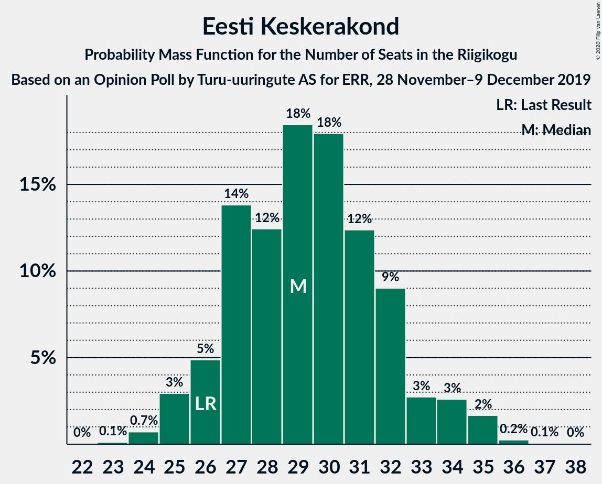
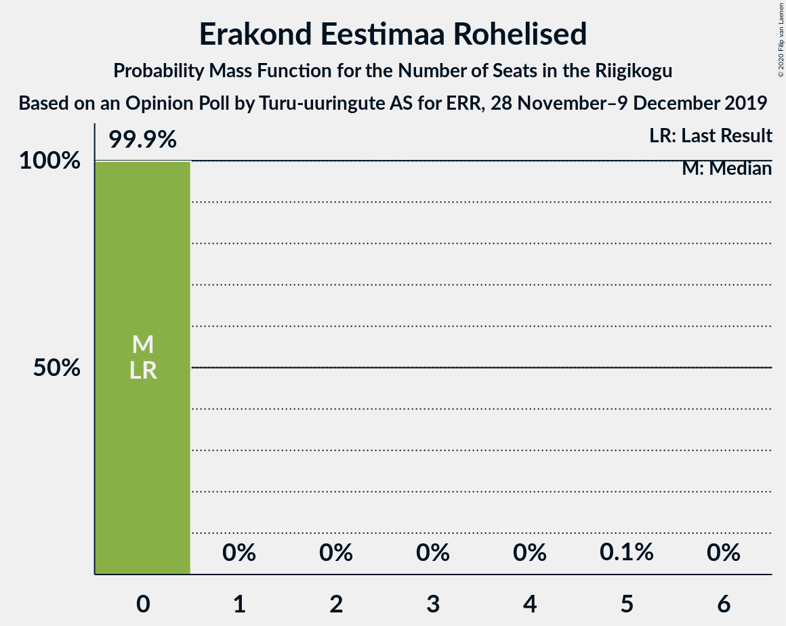
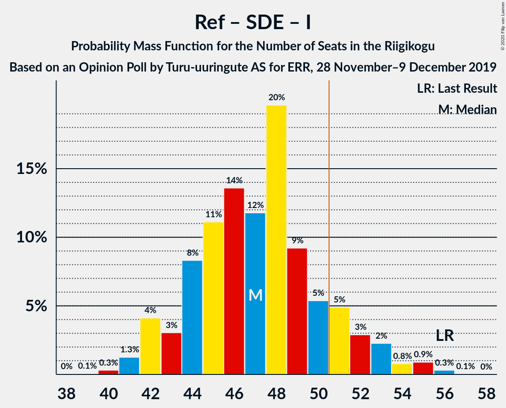

# Opinion Poll by Turu-uuringute AS for ERR, 28 November–9 December 2019

<a href="#voting-intentions">Voting Intentions</a> | <a href="#seats">Seats</a> | <a href="#coalitions">Coalitions</a> | <a href="#technical-information">Technical Information</a>

## Voting Intentions

### Confidence Intervals

| Party | Last Result | Poll Result | 80% Confidence Interval | 90% Confidence Interval | 95% Confidence Interval | 99% Confidence Interval |
|:-----:|:-----------:|:-----------:|:-----------------------:|:-----------------------:|:-----------------------:|:-----------------------:|
| Eesti Reformierakond | 28.9% | 29.0% | 27.2–30.9% |26.7–31.4% |26.3–31.9% |25.4–32.8% |
| Eesti Keskerakond | 23.1% | 25.0% | 23.4–26.9% |22.9–27.4% |22.5–27.8% |21.7–28.7% |
| Eesti Konservatiivne Rahvaerakond | 17.8% | 17.0% | 15.5–18.6% |15.1–19.0% |14.8–19.4% |14.1–20.2% |
| Sotsiaaldemokraatlik Erakond | 9.8% | 10.0% | 8.8–11.3% |8.5–11.6% |8.3–12.0% |7.8–12.6% |
| Erakond Isamaa | 11.4% | 5.0% | 4.3–6.0% |4.0–6.3% |3.8–6.6% |3.5–7.1% |
| Eesti 200 | 4.4% | 5.0% | 4.3–6.0% |4.0–6.3% |3.8–6.6% |3.5–7.1% |
| Erakond Eestimaa Rohelised | 1.8% | 3.0% | 2.4–3.8% |2.2–4.0% |2.1–4.2% |1.8–4.6% |
| Eesti Vabaerakond | 1.2% | 1.0% | 0.7–1.5% |0.6–1.7% |0.5–1.8% |0.4–2.1% |

*Note:* The poll result column reflects the actual value used in the calculations. Published results may vary slightly, and in addition be rounded to fewer digits.

## Seats

### Confidence Intervals

| Party | Last Result | Median | 80% Confidence Interval | 90% Confidence Interval | 95% Confidence Interval | 99% Confidence Interval |
|:-----:|:-----------:|:------:|:-----------------------:|:-----------------------:|:-----------------------:|:-----------------------:|
| <a href="#eesti-reformierakond">Eesti Reformierakond</a> | 34 | 35 | 32–37 |32–37 |31–38 |29–39 |
| <a href="#eesti-keskerakond">Eesti Keskerakond</a> | 26 | 29 | 26–32 |26–34 |25–34 |24–36 |
| <a href="#eesti-konservatiivne-rahvaerakond">Eesti Konservatiivne Rahvaerakond</a> | 19 | 19 | 17–21 |16–22 |16–22 |15–23 |
| <a href="#sotsiaaldemokraatlik-erakond">Sotsiaaldemokraatlik Erakond</a> | 10 | 10 | 8–12 |8–12 |8–13 |7–14 |
| <a href="#erakond-isamaa">Erakond Isamaa</a> | 12 | 4 | 0–6 |0–6 |0–6 |0–7 |
| <a href="#eesti-200">Eesti 200</a> | 0 | 0 | 0–6 |0–6 |0–6 |0–7 |
| <a href="#erakond-eestimaa-rohelised">Erakond Eestimaa Rohelised</a> | 0 | 0 | 0 |0 |0 |0 |
| <a href="#eesti-vabaerakond">Eesti Vabaerakond</a> | 0 | 0 | 0 |0 |0 |0 |

### Eesti Reformierakond

*For a full overview of the results for this party, see the [Eesti Reformierakond](party-eestireformierakond.html) page.*

| Number of Seats | Probability | Accumulated | Special Marks |
|:---------------:|:-----------:|:-----------:|:-------------:|
| 27 | 0.1% | 100% |  |
| 28 | 0.1% | 99.9% |  |
| 29 | 0.5% | 99.8% |  |
| 30 | 1.2% | 99.3% |  |
| 31 | 2% | 98% |  |
| 32 | 7% | 96% |  |
| 33 | 14% | 89% |  |
| 34 | 21% | 76% | Last Result |
| 35 | 19% | 55% | Median |
| 36 | 13% | 35% |  |
| 37 | 18% | 23% |  |
| 38 | 2% | 4% |  |
| 39 | 2% | 2% |  |
| 40 | 0.1% | 0.3% |  |
| 41 | 0.1% | 0.2% |  |
| 42 | 0% | 0.1% |  |
| 43 | 0.1% | 0.1% |  |
| 44 | 0% | 0% |  |

### Eesti Keskerakond

*For a full overview of the results for this party, see the [Eesti Keskerakond](party-eestikeskerakond.html) page.*

| Number of Seats | Probability | Accumulated | Special Marks |
|:---------------:|:-----------:|:-----------:|:-------------:|
| 23 | 0.2% | 100% |  |
| 24 | 1.0% | 99.8% |  |
| 25 | 3% | 98.8% |  |
| 26 | 6% | 96% | Last Result |
| 27 | 9% | 89% |  |
| 28 | 12% | 80% |  |
| 29 | 24% | 68% | Median |
| 30 | 21% | 44% |  |
| 31 | 10% | 23% |  |
| 32 | 5% | 13% |  |
| 33 | 3% | 8% |  |
| 34 | 4% | 5% |  |
| 35 | 0.3% | 0.8% |  |
| 36 | 0.5% | 0.5% |  |
| 37 | 0% | 0% |  |

### Eesti Konservatiivne Rahvaerakond

*For a full overview of the results for this party, see the [Eesti Konservatiivne Rahvaerakond](party-eestikonservatiivnerahvaerakond.html) page.*

| Number of Seats | Probability | Accumulated | Special Marks |
|:---------------:|:-----------:|:-----------:|:-------------:|
| 14 | 0.1% | 100% |  |
| 15 | 1.3% | 99.9% |  |
| 16 | 4% | 98.6% |  |
| 17 | 14% | 95% |  |
| 18 | 27% | 80% |  |
| 19 | 20% | 53% | Last Result, Median |
| 20 | 18% | 33% |  |
| 21 | 7% | 15% |  |
| 22 | 7% | 8% |  |
| 23 | 0.3% | 0.6% |  |
| 24 | 0.3% | 0.3% |  |
| 25 | 0% | 0% |  |

### Sotsiaaldemokraatlik Erakond

*For a full overview of the results for this party, see the [Sotsiaaldemokraatlik Erakond](party-sotsiaaldemokraatlikerakond.html) page.*

| Number of Seats | Probability | Accumulated | Special Marks |
|:---------------:|:-----------:|:-----------:|:-------------:|
| 7 | 0.6% | 100% |  |
| 8 | 11% | 99.4% |  |
| 9 | 16% | 88% |  |
| 10 | 27% | 72% | Last Result, Median |
| 11 | 30% | 45% |  |
| 12 | 12% | 16% |  |
| 13 | 3% | 4% |  |
| 14 | 0.4% | 0.6% |  |
| 15 | 0.2% | 0.2% |  |
| 16 | 0% | 0% |  |

### Erakond Isamaa

*For a full overview of the results for this party, see the [Erakond Isamaa](party-erakondisamaa.html) page.*

| Number of Seats | Probability | Accumulated | Special Marks |
|:---------------:|:-----------:|:-----------:|:-------------:|
| 0 | 47% | 100% |  |
| 1 | 0% | 53% |  |
| 2 | 0% | 53% |  |
| 3 | 0% | 53% |  |
| 4 | 7% | 53% | Median |
| 5 | 36% | 46% |  |
| 6 | 10% | 10% |  |
| 7 | 0.5% | 0.6% |  |
| 8 | 0.1% | 0.1% |  |
| 9 | 0% | 0% |  |
| 10 | 0% | 0% |  |
| 11 | 0% | 0% |  |
| 12 | 0% | 0% | Last Result |

### Eesti 200

*For a full overview of the results for this party, see the [Eesti 200](party-eesti200.html) page.*

| Number of Seats | Probability | Accumulated | Special Marks |
|:---------------:|:-----------:|:-----------:|:-------------:|
| 0 | 51% | 100% | Last Result, Median |
| 1 | 0% | 49% |  |
| 2 | 0% | 49% |  |
| 3 | 0% | 49% |  |
| 4 | 2% | 49% |  |
| 5 | 34% | 47% |  |
| 6 | 13% | 13% |  |
| 7 | 0.6% | 0.7% |  |
| 8 | 0.2% | 0.2% |  |
| 9 | 0% | 0% |  |

### Erakond Eestimaa Rohelised

*For a full overview of the results for this party, see the [Erakond Eestimaa Rohelised](party-erakondeestimaarohelised.html) page.*

| Number of Seats | Probability | Accumulated | Special Marks |
|:---------------:|:-----------:|:-----------:|:-------------:|
| 0 | 99.9% | 100% | Last Result, Median |
| 1 | 0% | 0.1% |  |
| 2 | 0% | 0.1% |  |
| 3 | 0% | 0.1% |  |
| 4 | 0% | 0.1% |  |
| 5 | 0% | 0% |  |

### Eesti Vabaerakond

*For a full overview of the results for this party, see the [Eesti Vabaerakond](party-eestivabaerakond.html) page.*

| Number of Seats | Probability | Accumulated | Special Marks |
|:---------------:|:-----------:|:-----------:|:-------------:|
| 0 | 100% | 100% | Last Result, Median |

## Coalitions

### Confidence Intervals

| Coalition | Last Result | Median | Majority? | 80% Confidence Interval | 90% Confidence Interval | 95% Confidence Interval | 99% Confidence Interval |
|:---------:|:-----------:|:------:|:---------:|:-----------------------:|:-----------------------:|:-----------------------:|:-----------------------:|
| Eesti Reformierakond – Eesti Keskerakond – Eesti Konservatiivne Rahvaerakond | 79 | 83 | 100% | 79–86 | 77–89 | 77–90 | 74–92 |
| Eesti Reformierakond – Eesti Keskerakond | 60 | 64 | 100% | 60–67 | 59–69 | 58–70 | 57–73 |
| Eesti Reformierakond – Eesti Konservatiivne Rahvaerakond – Erakond Isamaa | 65 | 56 | 98.7% | 53–60 | 53–61 | 52–61 | 49–62 |
| Eesti Reformierakond – Eesti Konservatiivne Rahvaerakond | 53 | 54 | 90% | 50–56 | 50–57 | 49–58 | 47–61 |
| Eesti Keskerakond – Eesti Konservatiivne Rahvaerakond – Erakond Isamaa | 57 | 51 | 52% | 46–56 | 45–57 | 45–57 | 44–57 |
| Eesti Keskerakond – Eesti Konservatiivne Rahvaerakond | 45 | 48 | 19% | 45–52 | 44–53 | 43–53 | 41–55 |
| Eesti Reformierakond – Sotsiaaldemokraatlik Erakond – Erakond Isamaa – Eesti Vabaerakond | 56 | 48 | 13% | 45–51 | 44–52 | 43–52 | 40–53 |
| Eesti Reformierakond – Sotsiaaldemokraatlik Erakond – Erakond Isamaa | 56 | 48 | 13% | 45–51 | 44–52 | 43–52 | 40–53 |
| Eesti Reformierakond – Sotsiaaldemokraatlik Erakond | 44 | 45 | 0.5% | 42–48 | 41–49 | 40–49 | 39–50 |
| Eesti Keskerakond – Sotsiaaldemokraatlik Erakond – Erakond Isamaa | 48 | 42 | 0% | 38–47 | 37–47 | 35–49 | 35–50 |
| Eesti Keskerakond – Sotsiaaldemokraatlik Erakond | 36 | 40 | 0% | 36–43 | 35–44 | 34–45 | 33–47 |
| Eesti Reformierakond – Erakond Isamaa | 46 | 37 | 0% | 35–40 | 33–40 | 32–42 | 30–43 |
| Eesti Konservatiivne Rahvaerakond – Sotsiaaldemokraatlik Erakond | 29 | 29 | 0% | 26–32 | 26–32 | 25–33 | 24–34 |

### Eesti Reformierakond – Eesti Keskerakond – Eesti Konservatiivne Rahvaerakond

| Number of Seats | Probability | Accumulated | Special Marks |
|:---------------:|:-----------:|:-----------:|:-------------:|
| 73 | 0.1% | 100% |  |
| 74 | 0.8% | 99.9% |  |
| 75 | 1.2% | 99.1% |  |
| 76 | 0.3% | 98% |  |
| 77 | 4% | 98% |  |
| 78 | 3% | 94% |  |
| 79 | 2% | 91% | Last Result |
| 80 | 14% | 89% |  |
| 81 | 7% | 75% |  |
| 82 | 12% | 68% |  |
| 83 | 7% | 56% | Median |
| 84 | 16% | 49% |  |
| 85 | 17% | 33% |  |
| 86 | 9% | 16% |  |
| 87 | 0.7% | 7% |  |
| 88 | 0.4% | 6% |  |
| 89 | 2% | 5% |  |
| 90 | 1.0% | 3% |  |
| 91 | 1.4% | 2% |  |
| 92 | 0.6% | 0.6% |  |
| 93 | 0% | 0% |  |

### Eesti Reformierakond – Eesti Keskerakond

| Number of Seats | Probability | Accumulated | Special Marks |
|:---------------:|:-----------:|:-----------:|:-------------:|
| 54 | 0% | 100% |  |
| 55 | 0% | 99.9% |  |
| 56 | 0.3% | 99.9% |  |
| 57 | 0.6% | 99.6% |  |
| 58 | 2% | 99.0% |  |
| 59 | 4% | 97% |  |
| 60 | 4% | 93% | Last Result |
| 61 | 5% | 89% |  |
| 62 | 10% | 84% |  |
| 63 | 14% | 74% |  |
| 64 | 20% | 61% | Median |
| 65 | 12% | 40% |  |
| 66 | 10% | 28% |  |
| 67 | 10% | 18% |  |
| 68 | 3% | 8% |  |
| 69 | 1.3% | 5% |  |
| 70 | 2% | 4% |  |
| 71 | 2% | 2% |  |
| 72 | 0.1% | 0.6% |  |
| 73 | 0.5% | 0.6% |  |
| 74 | 0.1% | 0.1% |  |
| 75 | 0% | 0% |  |

### Eesti Reformierakond – Eesti Konservatiivne Rahvaerakond – Erakond Isamaa

| Number of Seats | Probability | Accumulated | Special Marks |
|:---------------:|:-----------:|:-----------:|:-------------:|
| 47 | 0.1% | 100% |  |
| 48 | 0.1% | 99.9% |  |
| 49 | 0.3% | 99.7% |  |
| 50 | 0.8% | 99.4% |  |
| 51 | 0.6% | 98.7% | Majority |
| 52 | 3% | 98% |  |
| 53 | 16% | 95% |  |
| 54 | 2% | 80% |  |
| 55 | 19% | 78% |  |
| 56 | 14% | 58% |  |
| 57 | 11% | 44% |  |
| 58 | 10% | 33% | Median |
| 59 | 8% | 23% |  |
| 60 | 7% | 15% |  |
| 61 | 8% | 8% |  |
| 62 | 0.3% | 0.8% |  |
| 63 | 0.2% | 0.5% |  |
| 64 | 0.1% | 0.3% |  |
| 65 | 0.2% | 0.2% | Last Result |
| 66 | 0% | 0% |  |

### Eesti Reformierakond – Eesti Konservatiivne Rahvaerakond

| Number of Seats | Probability | Accumulated | Special Marks |
|:---------------:|:-----------:|:-----------:|:-------------:|
| 45 | 0.1% | 100% |  |
| 46 | 0.1% | 99.9% |  |
| 47 | 0.8% | 99.8% |  |
| 48 | 0.8% | 99.0% |  |
| 49 | 2% | 98% |  |
| 50 | 6% | 96% |  |
| 51 | 10% | 90% | Majority |
| 52 | 10% | 80% |  |
| 53 | 17% | 70% | Last Result |
| 54 | 11% | 53% | Median |
| 55 | 21% | 42% |  |
| 56 | 13% | 21% |  |
| 57 | 4% | 7% |  |
| 58 | 3% | 4% |  |
| 59 | 0.2% | 1.0% |  |
| 60 | 0.2% | 0.8% |  |
| 61 | 0.5% | 0.6% |  |
| 62 | 0.1% | 0.1% |  |
| 63 | 0% | 0% |  |

### Eesti Keskerakond – Eesti Konservatiivne Rahvaerakond – Erakond Isamaa

| Number of Seats | Probability | Accumulated | Special Marks |
|:---------------:|:-----------:|:-----------:|:-------------:|
| 43 | 0.1% | 100% |  |
| 44 | 0.9% | 99.9% |  |
| 45 | 6% | 99.0% |  |
| 46 | 7% | 93% |  |
| 47 | 8% | 86% |  |
| 48 | 14% | 78% |  |
| 49 | 3% | 64% |  |
| 50 | 9% | 61% |  |
| 51 | 5% | 52% | Majority |
| 52 | 7% | 47% | Median |
| 53 | 14% | 40% |  |
| 54 | 10% | 26% |  |
| 55 | 5% | 16% |  |
| 56 | 3% | 11% |  |
| 57 | 7% | 7% | Last Result |
| 58 | 0.3% | 0.5% |  |
| 59 | 0.1% | 0.2% |  |
| 60 | 0.1% | 0.1% |  |
| 61 | 0% | 0% |  |

### Eesti Keskerakond – Eesti Konservatiivne Rahvaerakond

| Number of Seats | Probability | Accumulated | Special Marks |
|:---------------:|:-----------:|:-----------:|:-------------:|
| 40 | 0.1% | 100% |  |
| 41 | 1.0% | 99.9% |  |
| 42 | 1.0% | 98.9% |  |
| 43 | 2% | 98% |  |
| 44 | 4% | 96% |  |
| 45 | 12% | 92% | Last Result |
| 46 | 8% | 79% |  |
| 47 | 10% | 71% |  |
| 48 | 21% | 61% | Median |
| 49 | 9% | 41% |  |
| 50 | 12% | 31% |  |
| 51 | 4% | 19% | Majority |
| 52 | 10% | 15% |  |
| 53 | 3% | 5% |  |
| 54 | 1.1% | 2% |  |
| 55 | 0.9% | 1.0% |  |
| 56 | 0.1% | 0.1% |  |
| 57 | 0% | 0% |  |

### Eesti Reformierakond – Sotsiaaldemokraatlik Erakond – Erakond Isamaa – Eesti Vabaerakond

| Number of Seats | Probability | Accumulated | Special Marks |
|:---------------:|:-----------:|:-----------:|:-------------:|
| 39 | 0.2% | 100% |  |
| 40 | 0.8% | 99.8% |  |
| 41 | 0.3% | 98.9% |  |
| 42 | 0.5% | 98.6% |  |
| 43 | 1.5% | 98% |  |
| 44 | 6% | 97% |  |
| 45 | 12% | 90% |  |
| 46 | 8% | 78% |  |
| 47 | 10% | 70% |  |
| 48 | 21% | 60% |  |
| 49 | 17% | 39% | Median |
| 50 | 8% | 22% |  |
| 51 | 7% | 13% | Majority |
| 52 | 5% | 6% |  |
| 53 | 0.8% | 1.3% |  |
| 54 | 0.2% | 0.5% |  |
| 55 | 0.1% | 0.3% |  |
| 56 | 0.1% | 0.2% | Last Result |
| 57 | 0% | 0.1% |  |
| 58 | 0% | 0% |  |

### Eesti Reformierakond – Sotsiaaldemokraatlik Erakond – Erakond Isamaa

| Number of Seats | Probability | Accumulated | Special Marks |
|:---------------:|:-----------:|:-----------:|:-------------:|
| 39 | 0.2% | 100% |  |
| 40 | 0.8% | 99.8% |  |
| 41 | 0.3% | 98.9% |  |
| 42 | 0.5% | 98.6% |  |
| 43 | 1.5% | 98% |  |
| 44 | 6% | 97% |  |
| 45 | 12% | 90% |  |
| 46 | 8% | 78% |  |
| 47 | 10% | 70% |  |
| 48 | 21% | 60% |  |
| 49 | 17% | 39% | Median |
| 50 | 8% | 22% |  |
| 51 | 7% | 13% | Majority |
| 52 | 5% | 6% |  |
| 53 | 0.8% | 1.3% |  |
| 54 | 0.2% | 0.5% |  |
| 55 | 0.1% | 0.3% |  |
| 56 | 0.1% | 0.2% | Last Result |
| 57 | 0% | 0.1% |  |
| 58 | 0% | 0% |  |

### Eesti Reformierakond – Sotsiaaldemokraatlik Erakond

| Number of Seats | Probability | Accumulated | Special Marks |
|:---------------:|:-----------:|:-----------:|:-------------:|
| 36 | 0% | 100% |  |
| 37 | 0.1% | 99.9% |  |
| 38 | 0.1% | 99.8% |  |
| 39 | 0.7% | 99.7% |  |
| 40 | 1.5% | 99.0% |  |
| 41 | 3% | 97% |  |
| 42 | 5% | 94% |  |
| 43 | 14% | 90% |  |
| 44 | 20% | 75% | Last Result |
| 45 | 19% | 56% | Median |
| 46 | 9% | 37% |  |
| 47 | 10% | 28% |  |
| 48 | 12% | 18% |  |
| 49 | 5% | 6% |  |
| 50 | 0.8% | 1.3% |  |
| 51 | 0.3% | 0.5% | Majority |
| 52 | 0.1% | 0.2% |  |
| 53 | 0% | 0.1% |  |
| 54 | 0% | 0% |  |

### Eesti Keskerakond – Sotsiaaldemokraatlik Erakond – Erakond Isamaa

| Number of Seats | Probability | Accumulated | Special Marks |
|:---------------:|:-----------:|:-----------:|:-------------:|
| 33 | 0.1% | 100% |  |
| 34 | 0.2% | 99.9% |  |
| 35 | 4% | 99.7% |  |
| 36 | 0.4% | 96% |  |
| 37 | 4% | 95% |  |
| 38 | 9% | 91% |  |
| 39 | 4% | 82% |  |
| 40 | 9% | 78% |  |
| 41 | 12% | 69% |  |
| 42 | 12% | 58% |  |
| 43 | 11% | 46% | Median |
| 44 | 4% | 35% |  |
| 45 | 9% | 30% |  |
| 46 | 10% | 21% |  |
| 47 | 7% | 11% |  |
| 48 | 0.6% | 4% | Last Result |
| 49 | 3% | 4% |  |
| 50 | 1.1% | 1.1% |  |
| 51 | 0% | 0% | Majority |

### Eesti Keskerakond – Sotsiaaldemokraatlik Erakond

| Number of Seats | Probability | Accumulated | Special Marks |
|:---------------:|:-----------:|:-----------:|:-------------:|
| 32 | 0.1% | 100% |  |
| 33 | 2% | 99.9% |  |
| 34 | 1.1% | 98% |  |
| 35 | 6% | 97% |  |
| 36 | 5% | 91% | Last Result |
| 37 | 9% | 86% |  |
| 38 | 16% | 77% |  |
| 39 | 7% | 61% | Median |
| 40 | 15% | 54% |  |
| 41 | 16% | 39% |  |
| 42 | 9% | 23% |  |
| 43 | 7% | 14% |  |
| 44 | 4% | 7% |  |
| 45 | 1.0% | 3% |  |
| 46 | 2% | 2% |  |
| 47 | 0.5% | 0.5% |  |
| 48 | 0% | 0% |  |

### Eesti Reformierakond – Erakond Isamaa

| Number of Seats | Probability | Accumulated | Special Marks |
|:---------------:|:-----------:|:-----------:|:-------------:|
| 29 | 0.2% | 100% |  |
| 30 | 0.8% | 99.8% |  |
| 31 | 0.4% | 99.0% |  |
| 32 | 2% | 98.6% |  |
| 33 | 3% | 97% |  |
| 34 | 4% | 94% |  |
| 35 | 6% | 90% |  |
| 36 | 13% | 84% |  |
| 37 | 24% | 71% |  |
| 38 | 11% | 47% |  |
| 39 | 15% | 36% | Median |
| 40 | 17% | 21% |  |
| 41 | 1.2% | 4% |  |
| 42 | 2% | 3% |  |
| 43 | 0.8% | 1.2% |  |
| 44 | 0.2% | 0.4% |  |
| 45 | 0.1% | 0.2% |  |
| 46 | 0.1% | 0.1% | Last Result |
| 47 | 0% | 0% |  |

### Eesti Konservatiivne Rahvaerakond – Sotsiaaldemokraatlik Erakond

| Number of Seats | Probability | Accumulated | Special Marks |
|:---------------:|:-----------:|:-----------:|:-------------:|
| 23 | 0.2% | 100% |  |
| 24 | 2% | 99.8% |  |
| 25 | 0.7% | 98% |  |
| 26 | 11% | 97% |  |
| 27 | 8% | 87% |  |
| 28 | 21% | 79% |  |
| 29 | 17% | 58% | Last Result, Median |
| 30 | 15% | 41% |  |
| 31 | 7% | 26% |  |
| 32 | 16% | 19% |  |
| 33 | 2% | 3% |  |
| 34 | 1.0% | 1.3% |  |
| 35 | 0.1% | 0.3% |  |
| 36 | 0.1% | 0.2% |  |
| 37 | 0.2% | 0.2% |  |
| 38 | 0% | 0% |  |

## Technical Information

### Opinion Poll

+ **Polling firm:** Turu-uuringute AS
+ **Commissioner(s):** ERR
+ **Fieldwork period:** 28 November–9 December 2019

### Calculations

+ **Sample size:** 1014
+ **Simulations done:** 131,072
+ **Error estimate:** 1.62%

