# Opinion Poll by Kantar Emor for BNS and Postimees, 5–12 December 2019

<a href="#voting-intentions">Voting Intentions</a> | <a href="#seats">Seats</a> | <a href="#coalitions">Coalitions</a> | <a href="#technical-information">Technical Information</a>

## Voting Intentions

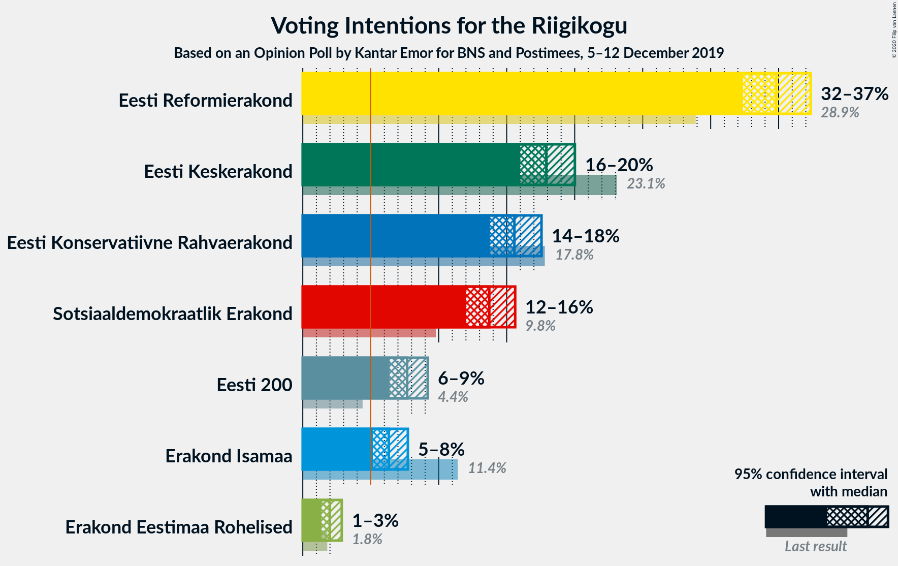

### Confidence Intervals

| Party | Last Result | Poll Result | 80% Confidence Interval | 90% Confidence Interval | 95% Confidence Interval | 99% Confidence Interval |
|:-----:|:-----------:|:-----------:|:-----------------------:|:-----------------------:|:-----------------------:|:-----------------------:|
| Eesti Reformierakond | 28.9% | 34.8% | 33.2–36.5% |32.8–36.9% |32.4–37.4% |31.6–38.2% |
| Eesti Keskerakond | 23.1% | 17.9% | 16.6–19.3% |16.3–19.7% |16.0–20.0% |15.4–20.7% |
| Eesti Konservatiivne Rahvaerakond | 17.8% | 15.6% | 14.4–16.9% |14.1–17.2% |13.8–17.6% |13.2–18.2% |
| Sotsiaaldemokraatlik Erakond | 9.8% | 13.7% | 12.6–15.0% |12.3–15.3% |12.0–15.6% |11.5–16.2% |
| Eesti 200 | 4.4% | 7.7% | 6.8–8.7% |6.6–8.9% |6.4–9.2% |6.0–9.7% |
| Erakond Isamaa | 11.4% | 6.3% | 5.6–7.2% |5.3–7.5% |5.2–7.7% |4.8–8.2% |
| Erakond Eestimaa Rohelised | 1.8% | 2.0% | 1.6–2.6% |1.5–2.7% |1.4–2.9% |1.2–3.2% |

*Note:* The poll result column reflects the actual value used in the calculations. Published results may vary slightly, and in addition be rounded to fewer digits.

## Seats

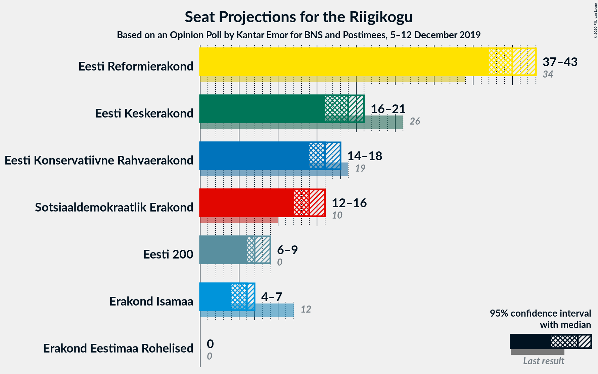

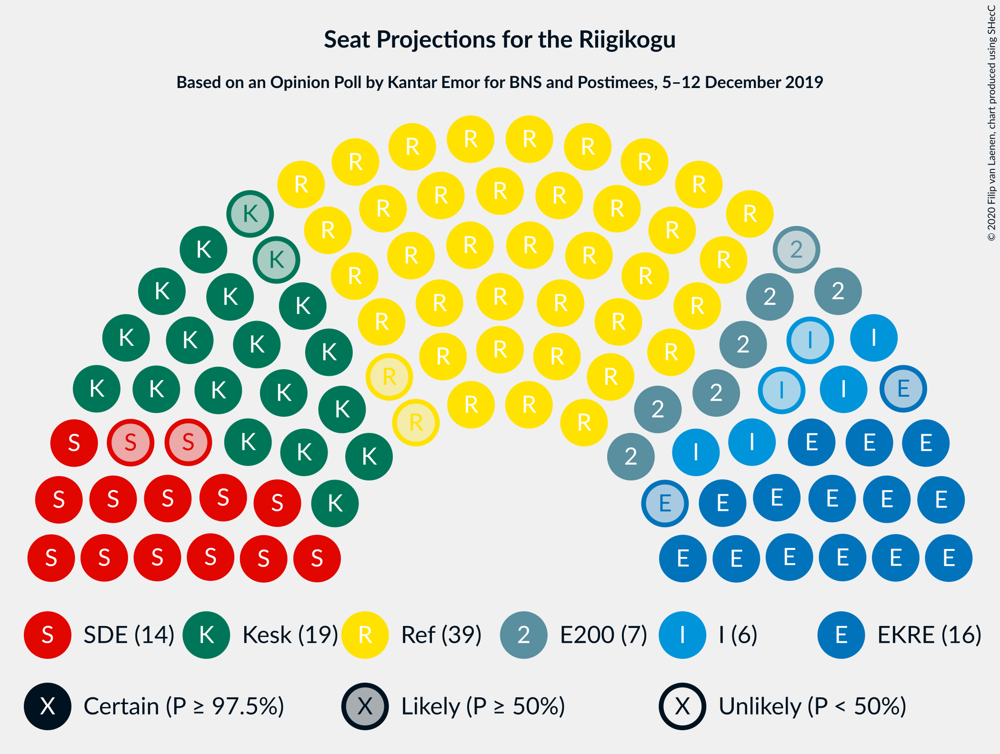

### Confidence Intervals

| Party | Last Result | Median | 80% Confidence Interval | 90% Confidence Interval | 95% Confidence Interval | 99% Confidence Interval |
|:-----:|:-----------:|:------:|:-----------------------:|:-----------------------:|:-----------------------:|:-----------------------:|
| <a href="#eesti-reformierakond">Eesti Reformierakond</a> | 34 | 40 | 38–42 |37–42 |37–43 |36–44 |
| <a href="#eesti-keskerakond">Eesti Keskerakond</a> | 26 | 19 | 17–20 |17–21 |17–21 |16–22 |
| <a href="#eesti-konservatiivne-rahvaerakond">Eesti Konservatiivne Rahvaerakond</a> | 19 | 16 | 14–18 |14–18 |14–18 |13–19 |
| <a href="#sotsiaaldemokraatlik-erakond">Sotsiaaldemokraatlik Erakond</a> | 10 | 14 | 12–15 |12–16 |12–16 |11–17 |
| <a href="#eesti-200">Eesti 200</a> | 0 | 7 | 6–8 |6–8 |6–9 |5–9 |
| <a href="#erakond-isamaa">Erakond Isamaa</a> | 12 | 6 | 5–7 |4–7 |4–7 |0–8 |
| <a href="#erakond-eestimaa-rohelised">Erakond Eestimaa Rohelised</a> | 0 | 0 | 0 |0 |0 |0 |

### Eesti Reformierakond

*For a full overview of the results for this party, see the [Eesti Reformierakond](party-eestireformierakond.html) page.*

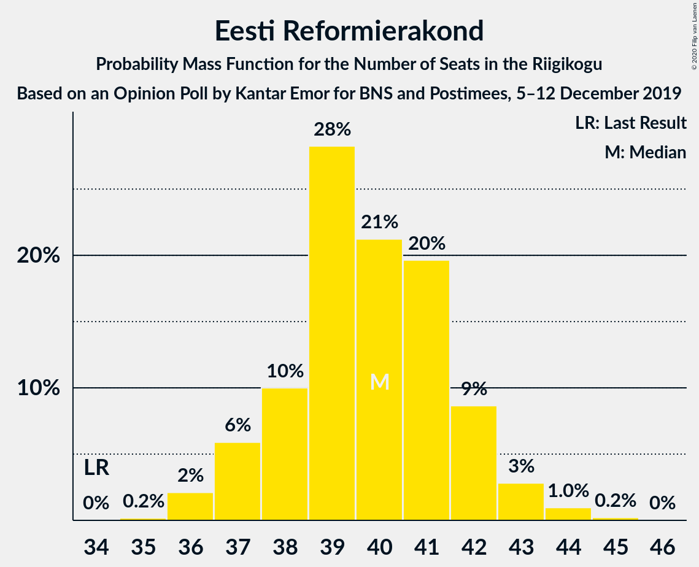

| Number of Seats | Probability | Accumulated | Special Marks |
|:---------------:|:-----------:|:-----------:|:-------------:|
| 34 | 0% | 100% | Last Result |
| 35 | 0.2% | 100% |  |
| 36 | 2% | 99.8% |  |
| 37 | 6% | 98% |  |
| 38 | 10% | 92% |  |
| 39 | 28% | 82% |  |
| 40 | 21% | 54% | Median |
| 41 | 20% | 32% |  |
| 42 | 9% | 13% |  |
| 43 | 3% | 4% |  |
| 44 | 1.0% | 1.2% |  |
| 45 | 0.2% | 0.3% |  |
| 46 | 0% | 0% |  |

### Eesti Keskerakond

*For a full overview of the results for this party, see the [Eesti Keskerakond](party-eestikeskerakond.html) page.*

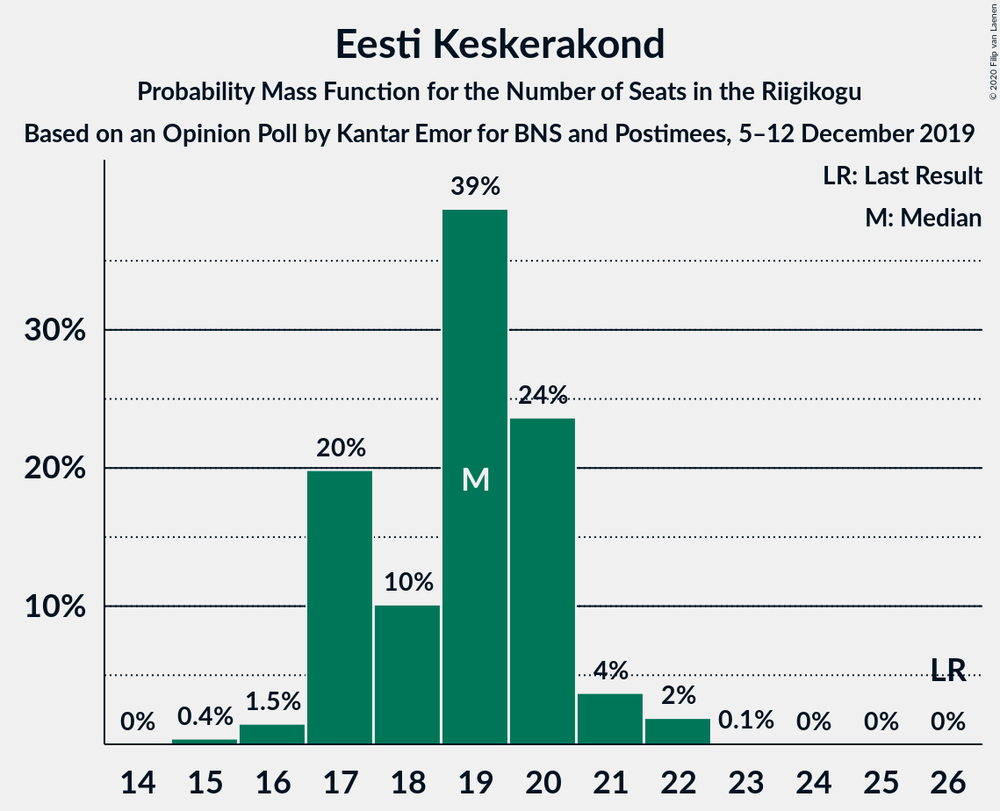

| Number of Seats | Probability | Accumulated | Special Marks |
|:---------------:|:-----------:|:-----------:|:-------------:|
| 15 | 0.4% | 100% |  |
| 16 | 1.5% | 99.6% |  |
| 17 | 20% | 98% |  |
| 18 | 10% | 78% |  |
| 19 | 39% | 68% | Median |
| 20 | 24% | 29% |  |
| 21 | 4% | 6% |  |
| 22 | 2% | 2% |  |
| 23 | 0.1% | 0.1% |  |
| 24 | 0% | 0% |  |
| 25 | 0% | 0% |  |
| 26 | 0% | 0% | Last Result |

### Eesti Konservatiivne Rahvaerakond

*For a full overview of the results for this party, see the [Eesti Konservatiivne Rahvaerakond](party-eestikonservatiivnerahvaerakond.html) page.*

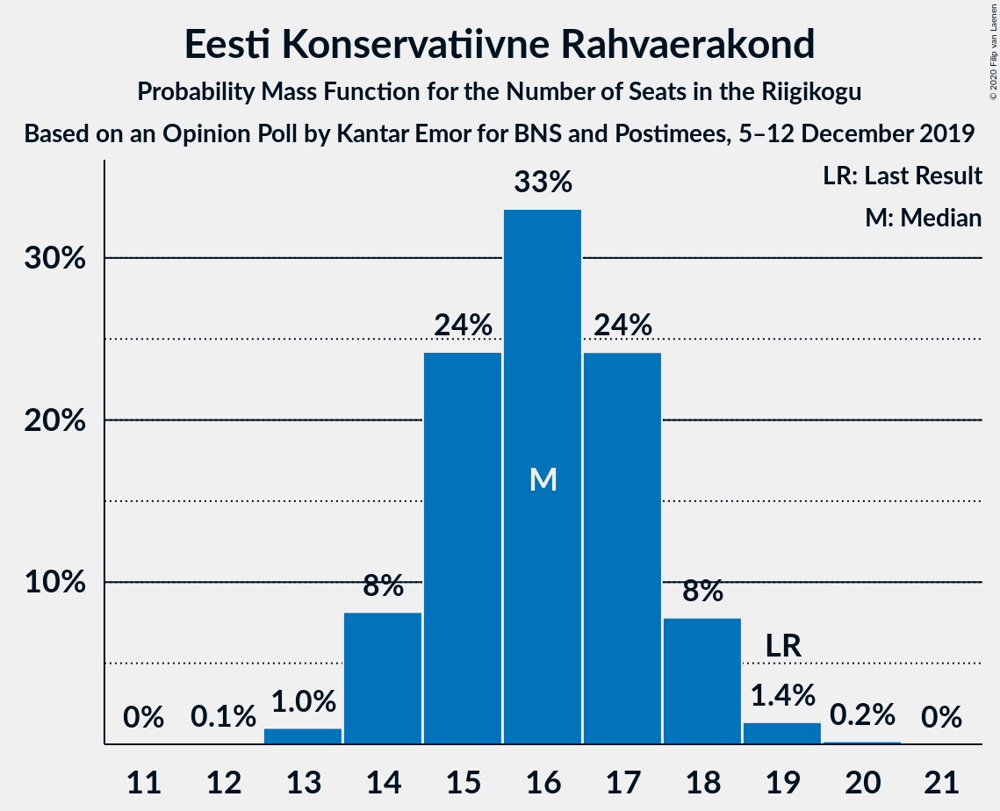

| Number of Seats | Probability | Accumulated | Special Marks |
|:---------------:|:-----------:|:-----------:|:-------------:|
| 12 | 0.1% | 100% |  |
| 13 | 1.0% | 99.9% |  |
| 14 | 11% | 99.0% |  |
| 15 | 23% | 88% |  |
| 16 | 34% | 65% | Median |
| 17 | 21% | 31% |  |
| 18 | 9% | 10% |  |
| 19 | 1.2% | 1.5% | Last Result |
| 20 | 0.2% | 0.2% |  |
| 21 | 0% | 0% |  |

### Sotsiaaldemokraatlik Erakond

*For a full overview of the results for this party, see the [Sotsiaaldemokraatlik Erakond](party-sotsiaaldemokraatlikerakond.html) page.*

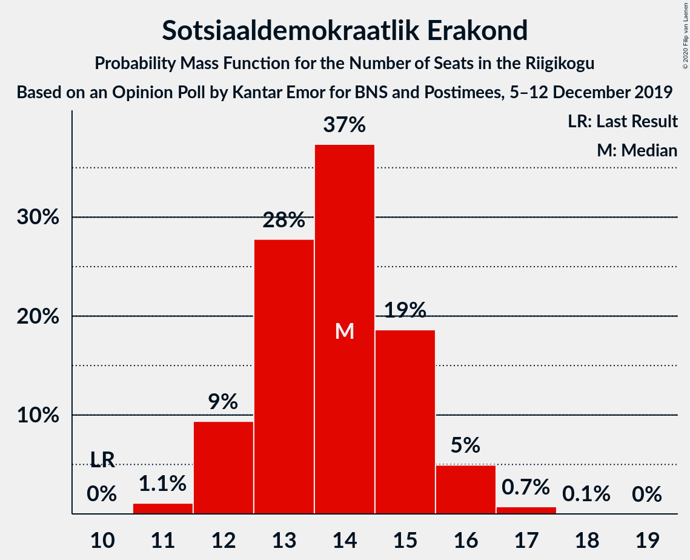

| Number of Seats | Probability | Accumulated | Special Marks |
|:---------------:|:-----------:|:-----------:|:-------------:|
| 10 | 0% | 100% | Last Result |
| 11 | 1.1% | 100% |  |
| 12 | 9% | 98.9% |  |
| 13 | 28% | 90% |  |
| 14 | 37% | 62% | Median |
| 15 | 19% | 24% |  |
| 16 | 5% | 6% |  |
| 17 | 0.7% | 0.8% |  |
| 18 | 0.1% | 0.1% |  |
| 19 | 0% | 0% |  |

### Eesti 200

*For a full overview of the results for this party, see the [Eesti 200](party-eesti200.html) page.*

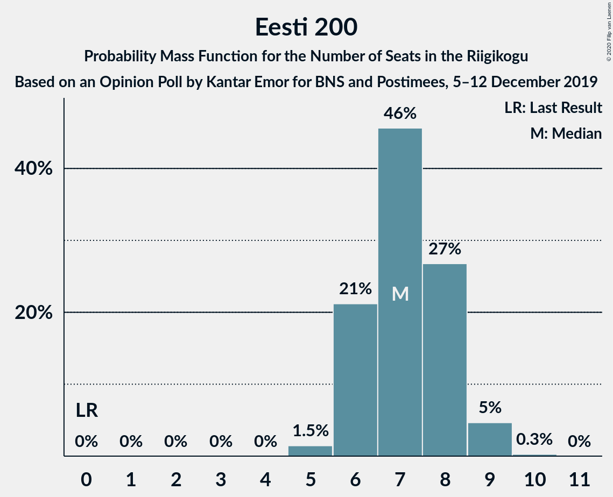

| Number of Seats | Probability | Accumulated | Special Marks |
|:---------------:|:-----------:|:-----------:|:-------------:|
| 0 | 0% | 100% | Last Result |
| 1 | 0% | 100% |  |
| 2 | 0% | 100% |  |
| 3 | 0% | 100% |  |
| 4 | 0% | 100% |  |
| 5 | 1.5% | 100% |  |
| 6 | 21% | 98.5% |  |
| 7 | 46% | 77% | Median |
| 8 | 27% | 32% |  |
| 9 | 5% | 5% |  |
| 10 | 0.3% | 0.3% |  |
| 11 | 0% | 0% |  |

### Erakond Isamaa

*For a full overview of the results for this party, see the [Erakond Isamaa](party-erakondisamaa.html) page.*

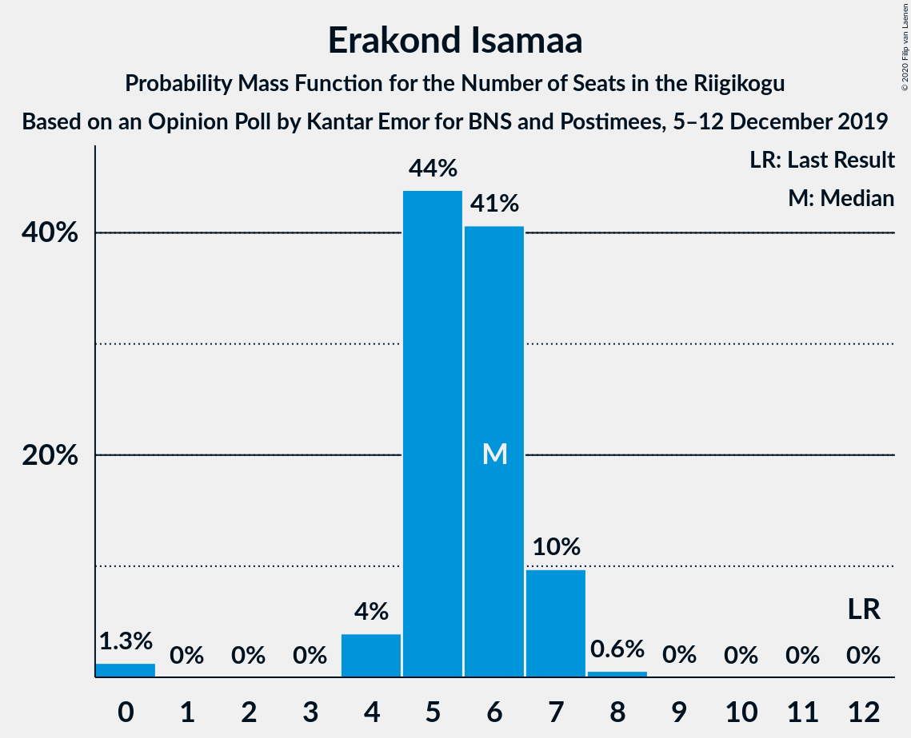

| Number of Seats | Probability | Accumulated | Special Marks |
|:---------------:|:-----------:|:-----------:|:-------------:|
| 0 | 2% | 100% |  |
| 1 | 0% | 98% |  |
| 2 | 0% | 98% |  |
| 3 | 0% | 98% |  |
| 4 | 4% | 98% |  |
| 5 | 39% | 95% |  |
| 6 | 46% | 56% | Median |
| 7 | 9% | 10% |  |
| 8 | 0.7% | 0.7% |  |
| 9 | 0% | 0% |  |
| 10 | 0% | 0% |  |
| 11 | 0% | 0% |  |
| 12 | 0% | 0% | Last Result |

### Erakond Eestimaa Rohelised

*For a full overview of the results for this party, see the [Erakond Eestimaa Rohelised](party-erakondeestimaarohelised.html) page.*

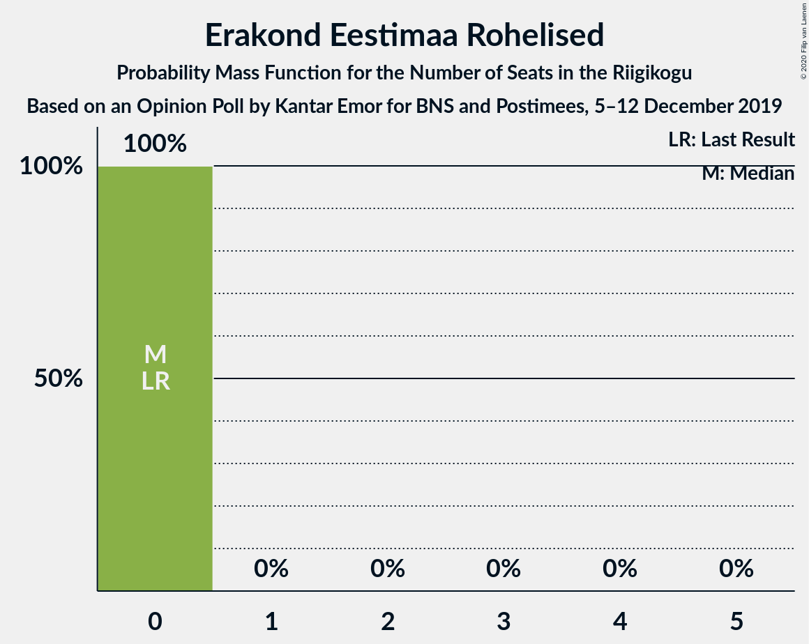

| Number of Seats | Probability | Accumulated | Special Marks |
|:---------------:|:-----------:|:-----------:|:-------------:|
| 0 | 100% | 100% | Last Result, Median |

## Coalitions

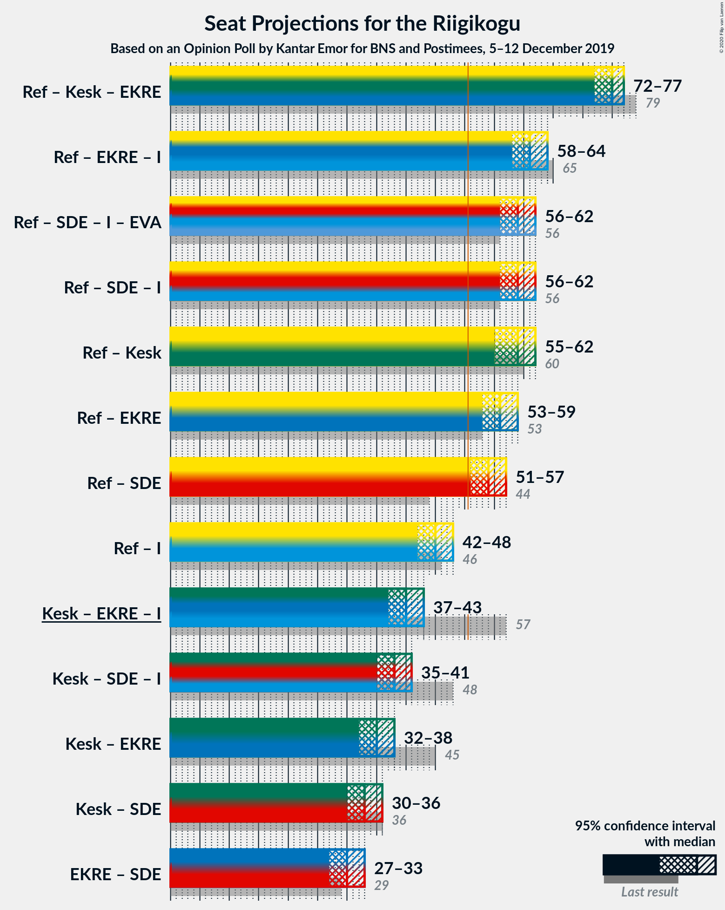

### Confidence Intervals

| Coalition | Last Result | Median | Majority? | 80% Confidence Interval | 90% Confidence Interval | 95% Confidence Interval | 99% Confidence Interval |
|:---------:|:-----------:|:------:|:---------:|:-----------------------:|:-----------------------:|:-----------------------:|:-----------------------:|
| Eesti Reformierakond – Eesti Keskerakond – Eesti Konservatiivne Rahvaerakond | 79 | 75 | 100% | 73–76 | 72–77 | 72–78 | 71–79 |
| Eesti Reformierakond – Eesti Konservatiivne Rahvaerakond – Erakond Isamaa | 65 | 61 | 100% | 59–63 | 59–64 | 58–64 | 57–65 |
| Eesti Reformierakond – Sotsiaaldemokraatlik Erakond – Erakond Isamaa | 56 | 59 | 100% | 57–61 | 56–62 | 56–62 | 55–63 |
| Eesti Reformierakond – Eesti Keskerakond | 60 | 58 | 100% | 57–61 | 56–61 | 55–61 | 55–63 |
| Eesti Reformierakond – Eesti Konservatiivne Rahvaerakond | 53 | 56 | 100% | 54–58 | 53–59 | 52–59 | 52–60 |
| Eesti Reformierakond – Sotsiaaldemokraatlik Erakond | 44 | 53 | 97% | 52–56 | 51–56 | 50–57 | 49–58 |
| Eesti Reformierakond – Erakond Isamaa | 46 | 45 | 0.1% | 43–47 | 42–48 | 42–48 | 41–50 |
| Eesti Keskerakond – Eesti Konservatiivne Rahvaerakond – Erakond Isamaa | 57 | 40 | 0% | 38–43 | 38–43 | 37–44 | 35–44 |
| Eesti Keskerakond – Sotsiaaldemokraatlik Erakond – Erakond Isamaa | 48 | 38 | 0% | 36–40 | 35–41 | 35–41 | 33–42 |
| Eesti Keskerakond – Eesti Konservatiivne Rahvaerakond | 45 | 35 | 0% | 33–37 | 32–37 | 32–38 | 31–39 |
| Eesti Keskerakond – Sotsiaaldemokraatlik Erakond | 36 | 33 | 0% | 31–35 | 30–35 | 30–36 | 29–36 |
| Eesti Konservatiivne Rahvaerakond – Sotsiaaldemokraatlik Erakond | 29 | 30 | 0% | 28–32 | 28–32 | 27–33 | 26–34 |

### Eesti Reformierakond – Eesti Keskerakond – Eesti Konservatiivne Rahvaerakond

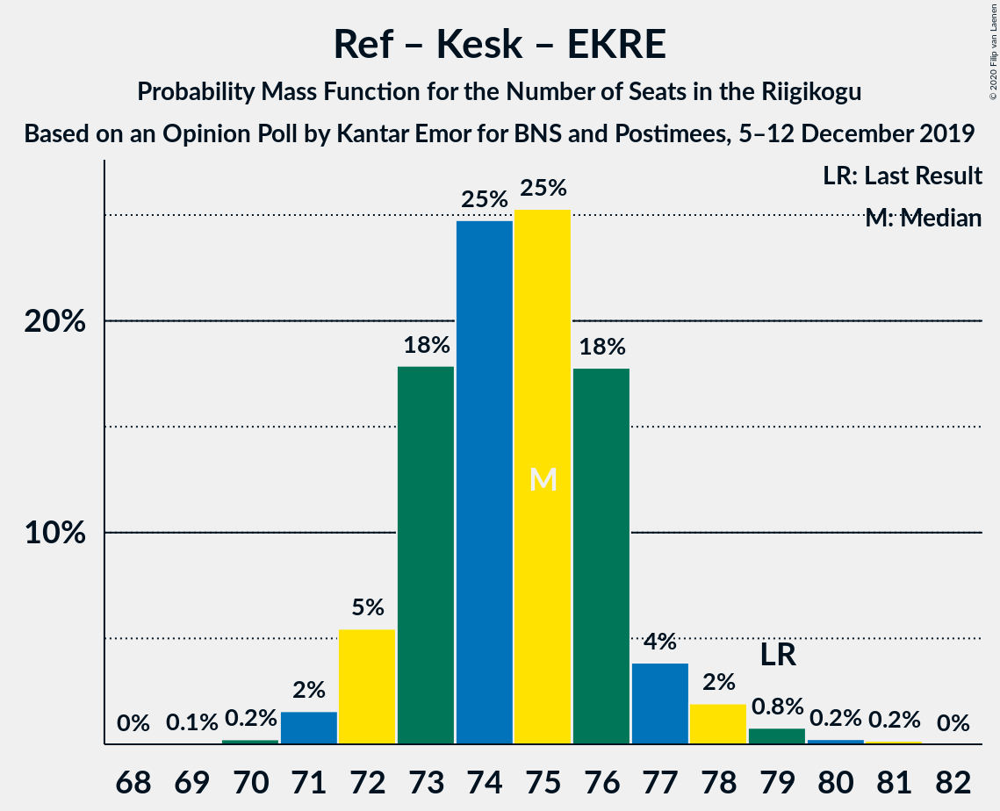

| Number of Seats | Probability | Accumulated | Special Marks |
|:---------------:|:-----------:|:-----------:|:-------------:|
| 69 | 0.1% | 100% |  |
| 70 | 0.2% | 99.9% |  |
| 71 | 2% | 99.7% |  |
| 72 | 5% | 98% |  |
| 73 | 18% | 93% |  |
| 74 | 25% | 75% |  |
| 75 | 25% | 50% | Median |
| 76 | 18% | 25% |  |
| 77 | 4% | 7% |  |
| 78 | 2% | 3% |  |
| 79 | 0.8% | 1.2% | Last Result |
| 80 | 0.2% | 0.4% |  |
| 81 | 0.2% | 0.2% |  |
| 82 | 0% | 0% |  |

### Eesti Reformierakond – Eesti Konservatiivne Rahvaerakond – Erakond Isamaa

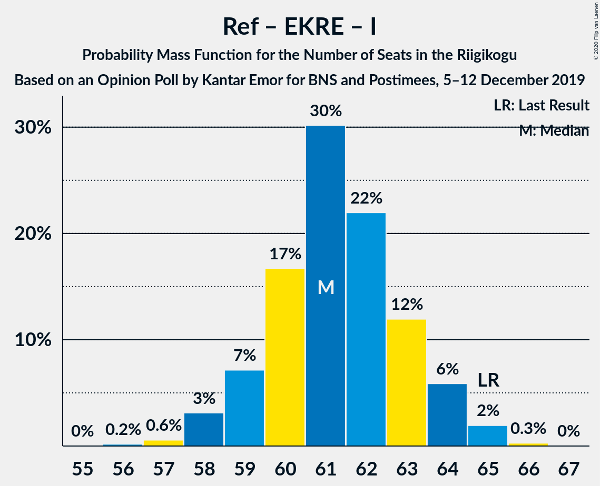

| Number of Seats | Probability | Accumulated | Special Marks |
|:---------------:|:-----------:|:-----------:|:-------------:|
| 56 | 0.2% | 100% |  |
| 57 | 0.6% | 99.8% |  |
| 58 | 3% | 99.2% |  |
| 59 | 6% | 96% |  |
| 60 | 23% | 90% |  |
| 61 | 22% | 66% |  |
| 62 | 24% | 44% | Median |
| 63 | 13% | 20% |  |
| 64 | 6% | 7% |  |
| 65 | 1.4% | 2% | Last Result |
| 66 | 0.3% | 0.3% |  |
| 67 | 0% | 0% |  |

### Eesti Reformierakond – Sotsiaaldemokraatlik Erakond – Erakond Isamaa

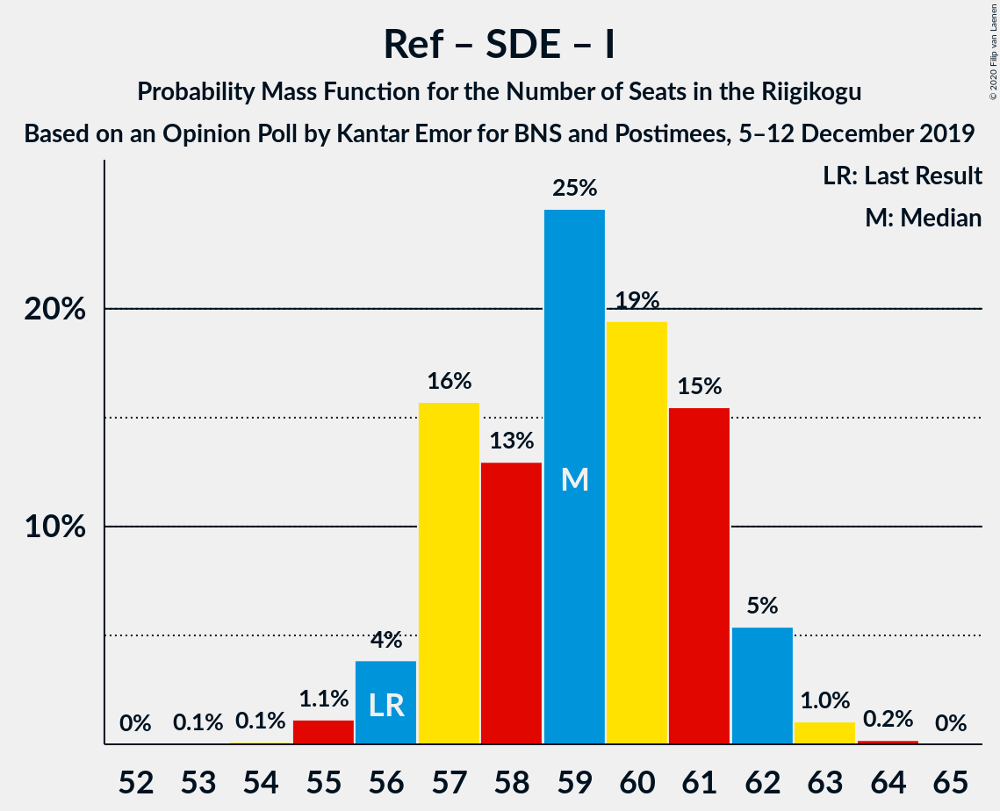

| Number of Seats | Probability | Accumulated | Special Marks |
|:---------------:|:-----------:|:-----------:|:-------------:|
| 53 | 0.1% | 100% |  |
| 54 | 0.1% | 99.9% |  |
| 55 | 1.1% | 99.8% |  |
| 56 | 4% | 98.7% | Last Result |
| 57 | 16% | 95% |  |
| 58 | 13% | 79% |  |
| 59 | 25% | 66% |  |
| 60 | 19% | 42% | Median |
| 61 | 15% | 22% |  |
| 62 | 5% | 7% |  |
| 63 | 1.0% | 1.3% |  |
| 64 | 0.2% | 0.2% |  |
| 65 | 0% | 0% |  |

### Eesti Reformierakond – Eesti Keskerakond

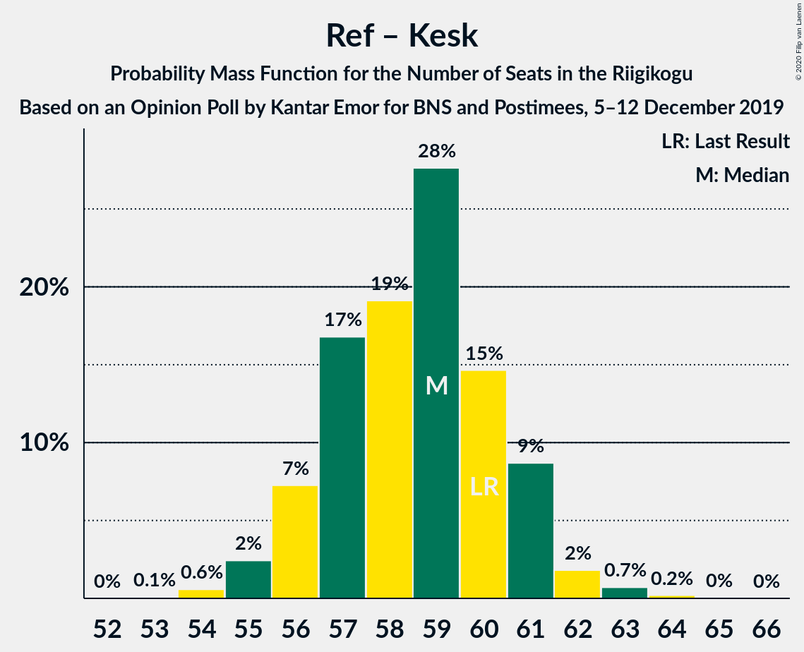

| Number of Seats | Probability | Accumulated | Special Marks |
|:---------------:|:-----------:|:-----------:|:-------------:|
| 53 | 0.1% | 100% |  |
| 54 | 0.3% | 99.9% |  |
| 55 | 3% | 99.6% |  |
| 56 | 4% | 96% |  |
| 57 | 20% | 92% |  |
| 58 | 23% | 73% |  |
| 59 | 20% | 50% | Median |
| 60 | 17% | 30% | Last Result |
| 61 | 11% | 13% |  |
| 62 | 1.1% | 2% |  |
| 63 | 1.0% | 1.1% |  |
| 64 | 0.1% | 0.1% |  |
| 65 | 0.1% | 0.1% |  |
| 66 | 0% | 0% |  |

### Eesti Reformierakond – Eesti Konservatiivne Rahvaerakond

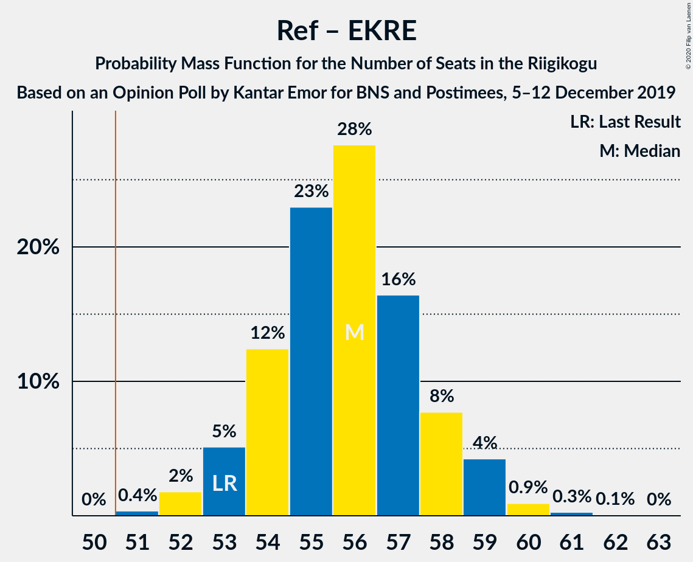

| Number of Seats | Probability | Accumulated | Special Marks |
|:---------------:|:-----------:|:-----------:|:-------------:|
| 51 | 0.3% | 100% | Majority |
| 52 | 2% | 99.7% |  |
| 53 | 4% | 97% | Last Result |
| 54 | 13% | 93% |  |
| 55 | 31% | 81% |  |
| 56 | 21% | 50% | Median |
| 57 | 16% | 29% |  |
| 58 | 7% | 13% |  |
| 59 | 4% | 6% |  |
| 60 | 1.3% | 2% |  |
| 61 | 0.4% | 0.5% |  |
| 62 | 0% | 0.1% |  |
| 63 | 0% | 0% |  |

### Eesti Reformierakond – Sotsiaaldemokraatlik Erakond

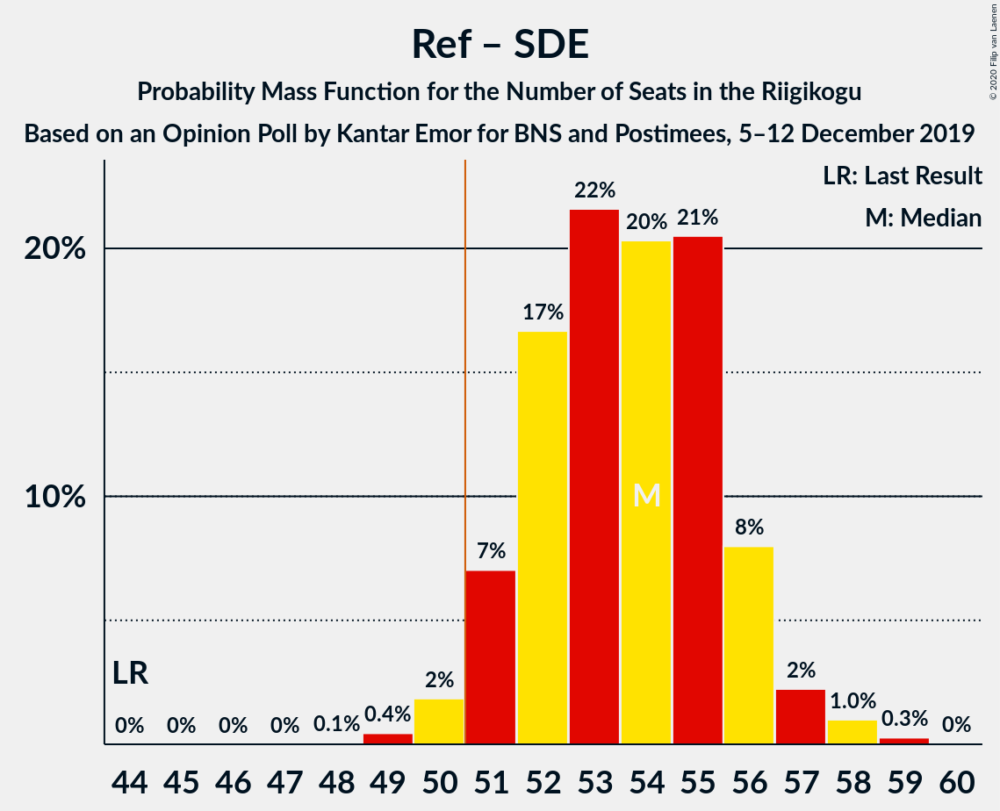

| Number of Seats | Probability | Accumulated | Special Marks |
|:---------------:|:-----------:|:-----------:|:-------------:|
| 44 | 0% | 100% | Last Result |
| 45 | 0% | 100% |  |
| 46 | 0% | 100% |  |
| 47 | 0% | 100% |  |
| 48 | 0.1% | 100% |  |
| 49 | 0.6% | 99.9% |  |
| 50 | 2% | 99.3% |  |
| 51 | 7% | 97% | Majority |
| 52 | 18% | 90% |  |
| 53 | 25% | 72% |  |
| 54 | 15% | 47% | Median |
| 55 | 20% | 32% |  |
| 56 | 8% | 12% |  |
| 57 | 2% | 4% |  |
| 58 | 1.0% | 1.5% |  |
| 59 | 0.4% | 0.4% |  |
| 60 | 0% | 0% |  |

### Eesti Reformierakond – Erakond Isamaa

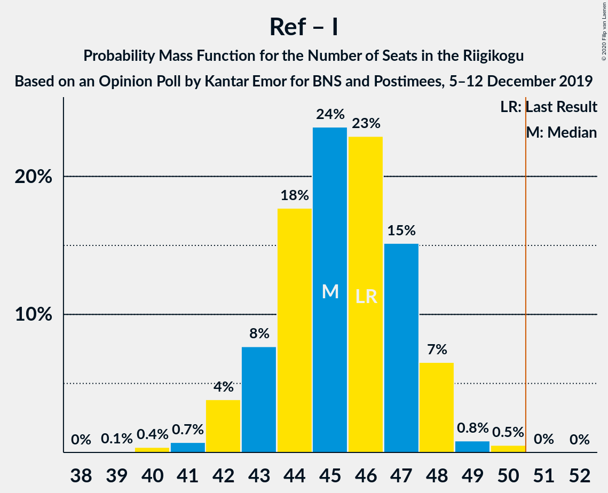

| Number of Seats | Probability | Accumulated | Special Marks |
|:---------------:|:-----------:|:-----------:|:-------------:|
| 39 | 0.1% | 100% |  |
| 40 | 0.4% | 99.9% |  |
| 41 | 0.7% | 99.5% |  |
| 42 | 4% | 98.8% |  |
| 43 | 8% | 95% |  |
| 44 | 18% | 87% |  |
| 45 | 24% | 70% |  |
| 46 | 23% | 46% | Last Result, Median |
| 47 | 15% | 23% |  |
| 48 | 7% | 8% |  |
| 49 | 0.8% | 1.4% |  |
| 50 | 0.5% | 0.6% |  |
| 51 | 0% | 0.1% | Majority |
| 52 | 0% | 0% |  |

### Eesti Keskerakond – Eesti Konservatiivne Rahvaerakond – Erakond Isamaa

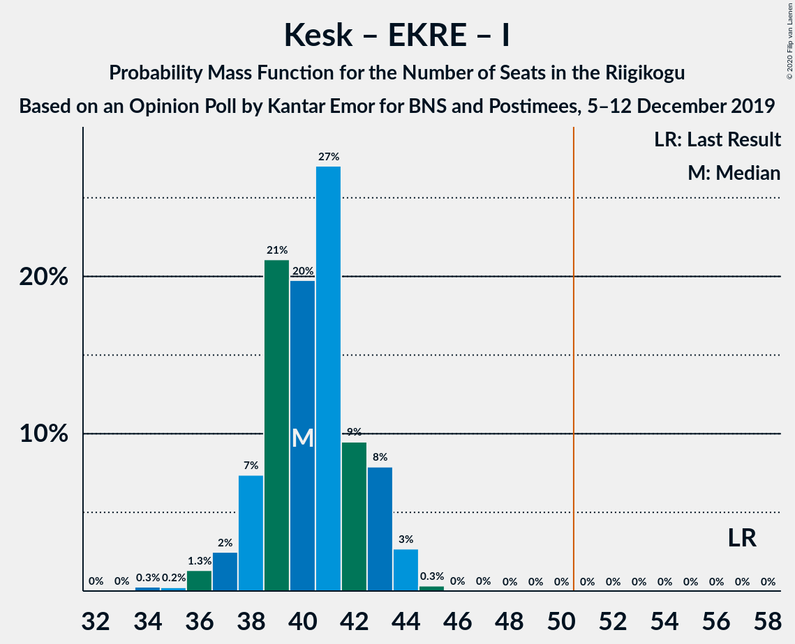

| Number of Seats | Probability | Accumulated | Special Marks |
|:---------------:|:-----------:|:-----------:|:-------------:|
| 34 | 0.3% | 100% |  |
| 35 | 0.2% | 99.7% |  |
| 36 | 1.3% | 99.5% |  |
| 37 | 2% | 98% |  |
| 38 | 7% | 96% |  |
| 39 | 21% | 88% |  |
| 40 | 20% | 67% |  |
| 41 | 27% | 47% | Median |
| 42 | 9% | 20% |  |
| 43 | 8% | 11% |  |
| 44 | 3% | 3% |  |
| 45 | 0.3% | 0.4% |  |
| 46 | 0% | 0% |  |
| 47 | 0% | 0% |  |
| 48 | 0% | 0% |  |
| 49 | 0% | 0% |  |
| 50 | 0% | 0% |  |
| 51 | 0% | 0% | Majority |
| 52 | 0% | 0% |  |
| 53 | 0% | 0% |  |
| 54 | 0% | 0% |  |
| 55 | 0% | 0% |  |
| 56 | 0% | 0% |  |
| 57 | 0% | 0% | Last Result |

### Eesti Keskerakond – Sotsiaaldemokraatlik Erakond – Erakond Isamaa

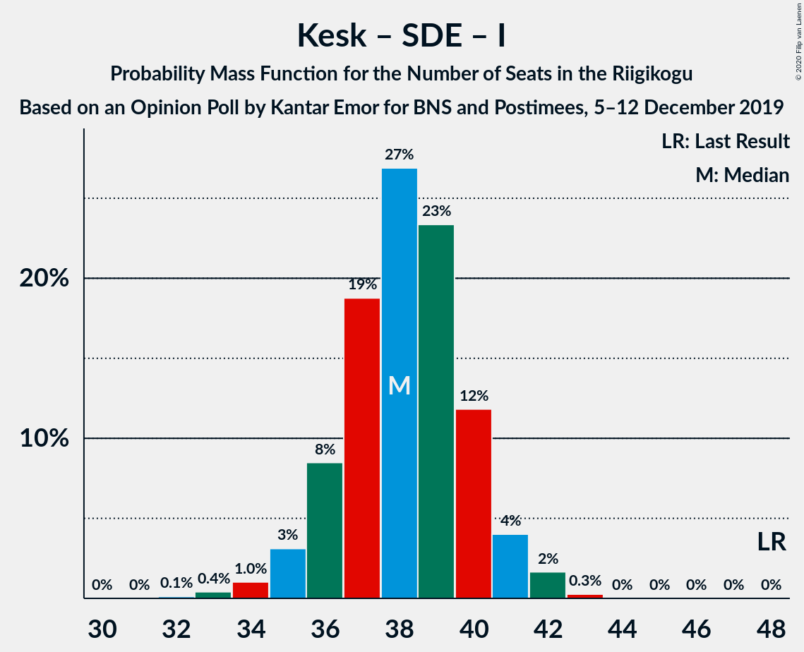

| Number of Seats | Probability | Accumulated | Special Marks |
|:---------------:|:-----------:|:-----------:|:-------------:|
| 32 | 0.1% | 100% |  |
| 33 | 0.7% | 99.9% |  |
| 34 | 0.7% | 99.2% |  |
| 35 | 4% | 98% |  |
| 36 | 9% | 95% |  |
| 37 | 19% | 86% |  |
| 38 | 21% | 67% |  |
| 39 | 28% | 45% | Median |
| 40 | 12% | 18% |  |
| 41 | 4% | 6% |  |
| 42 | 2% | 2% |  |
| 43 | 0.2% | 0.2% |  |
| 44 | 0% | 0% |  |
| 45 | 0% | 0% |  |
| 46 | 0% | 0% |  |
| 47 | 0% | 0% |  |
| 48 | 0% | 0% | Last Result |

### Eesti Keskerakond – Eesti Konservatiivne Rahvaerakond

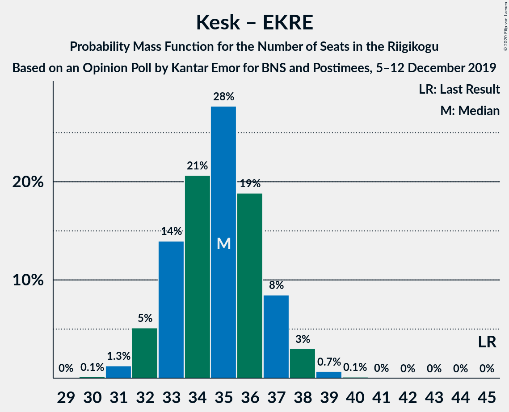

| Number of Seats | Probability | Accumulated | Special Marks |
|:---------------:|:-----------:|:-----------:|:-------------:|
| 30 | 0.1% | 100% |  |
| 31 | 1.3% | 99.9% |  |
| 32 | 5% | 98.6% |  |
| 33 | 15% | 94% |  |
| 34 | 26% | 79% |  |
| 35 | 20% | 53% | Median |
| 36 | 18% | 33% |  |
| 37 | 11% | 15% |  |
| 38 | 3% | 4% |  |
| 39 | 1.1% | 1.2% |  |
| 40 | 0.1% | 0.1% |  |
| 41 | 0% | 0% |  |
| 42 | 0% | 0% |  |
| 43 | 0% | 0% |  |
| 44 | 0% | 0% |  |
| 45 | 0% | 0% | Last Result |

### Eesti Keskerakond – Sotsiaaldemokraatlik Erakond

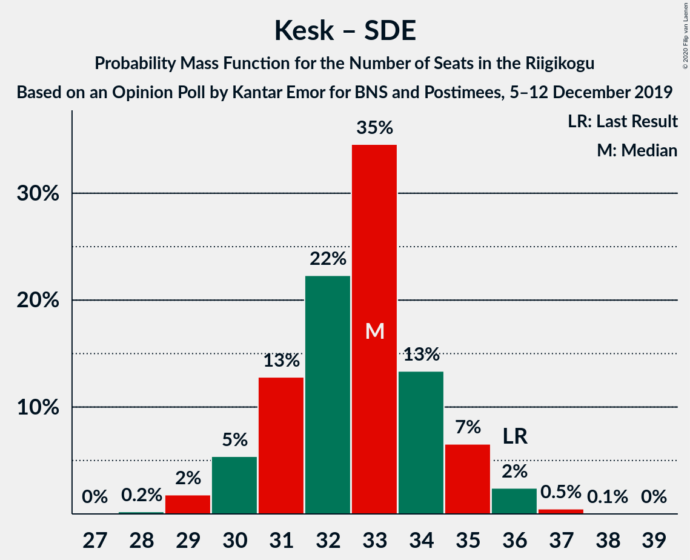

| Number of Seats | Probability | Accumulated | Special Marks |
|:---------------:|:-----------:|:-----------:|:-------------:|
| 28 | 0.1% | 100% |  |
| 29 | 2% | 99.9% |  |
| 30 | 6% | 98% |  |
| 31 | 12% | 92% |  |
| 32 | 27% | 80% |  |
| 33 | 27% | 53% | Median |
| 34 | 15% | 26% |  |
| 35 | 7% | 10% |  |
| 36 | 2% | 3% | Last Result |
| 37 | 0.4% | 0.5% |  |
| 38 | 0.1% | 0.1% |  |
| 39 | 0% | 0% |  |

### Eesti Konservatiivne Rahvaerakond – Sotsiaaldemokraatlik Erakond

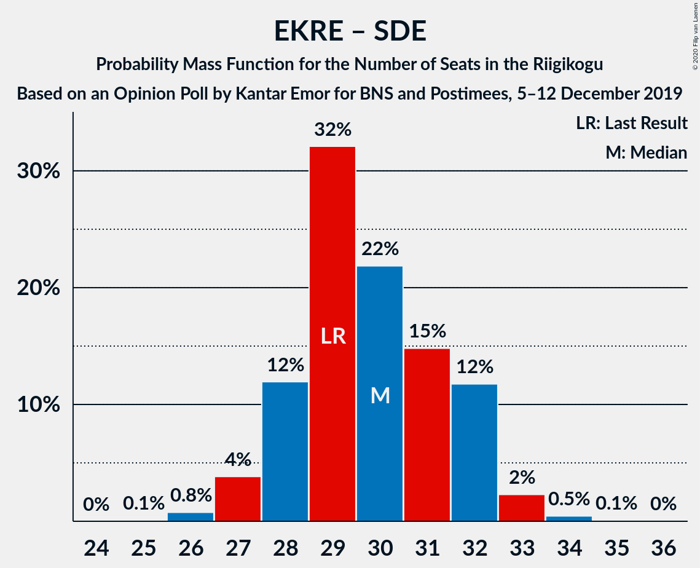

| Number of Seats | Probability | Accumulated | Special Marks |
|:---------------:|:-----------:|:-----------:|:-------------:|
| 25 | 0.1% | 100% |  |
| 26 | 0.8% | 99.9% |  |
| 27 | 4% | 99.2% |  |
| 28 | 12% | 95% |  |
| 29 | 32% | 83% | Last Result |
| 30 | 22% | 51% | Median |
| 31 | 15% | 29% |  |
| 32 | 12% | 15% |  |
| 33 | 2% | 3% |  |
| 34 | 0.5% | 0.6% |  |
| 35 | 0.1% | 0.1% |  |
| 36 | 0% | 0% |  |

## Technical Information

### Opinion Poll

+ **Polling firm:** Kantar Emor
+ **Commissioner(s):** BNS and Postimees
+ **Fieldwork period:** 5–12 December 2019

### Calculations

+ **Sample size:** 1407
+ **Simulations done:** 131,072
+ **Error estimate:** 0.82%

