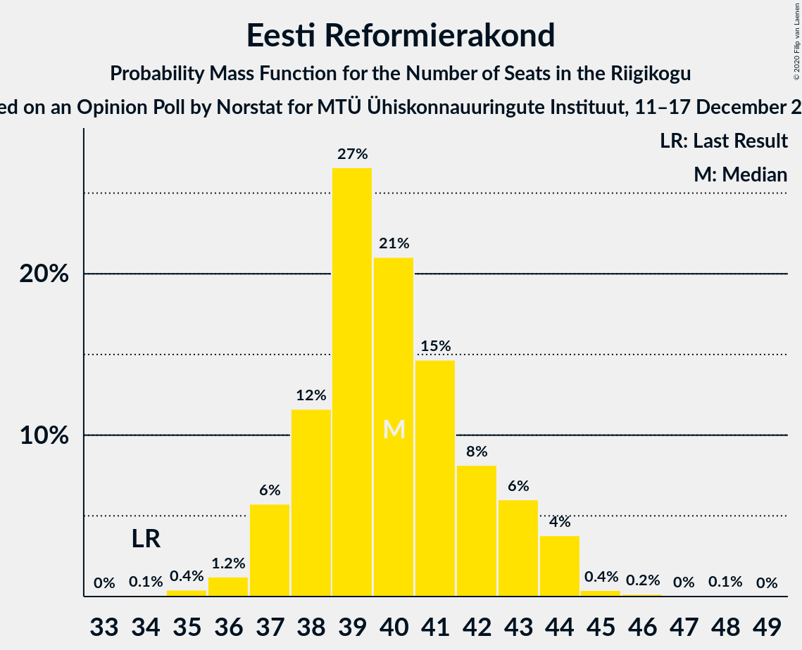

# Opinion Poll by Norstat for MTÜ Ühiskonnauuringute Instituut, 11–17 December 2019

<a href="#voting-intentions">Voting Intentions</a> | <a href="#seats">Seats</a> | <a href="#coalitions">Coalitions</a> | <a href="#technical-information">Technical Information</a>

## Voting Intentions

### Confidence Intervals

| Party | Last Result | Poll Result | 80% Confidence Interval | 90% Confidence Interval | 95% Confidence Interval | 99% Confidence Interval |
|:-----:|:-----------:|:-----------:|:-----------------------:|:-----------------------:|:-----------------------:|:-----------------------:|
| Eesti Reformierakond | 28.9% | 34.3% | 32.4–36.3% |31.9–36.8% |31.4–37.3% |30.5–38.3% |
| Eesti Keskerakond | 23.1% | 22.5% | 20.9–24.3% |20.4–24.8% |20.0–25.2% |19.3–26.1% |
| Eesti Konservatiivne Rahvaerakond | 17.8% | 13.5% | 12.2–15.0% |11.8–15.4% |11.5–15.8% |10.9–16.5% |
| Sotsiaaldemokraatlik Erakond | 9.8% | 11.8% | 10.6–13.2% |10.2–13.6% |9.9–14.0% |9.4–14.6% |
| Eesti 200 | 4.4% | 6.8% | 5.9–7.9% |5.6–8.3% |5.4–8.5% |5.0–9.1% |
| Erakond Isamaa | 11.4% | 5.4% | 4.6–6.4% |4.4–6.7% |4.2–7.0% |3.8–7.5% |
| Erakond Eestimaa Rohelised | 1.8% | 3.2% | 2.6–4.0% |2.4–4.3% |2.3–4.5% |2.0–4.9% |
| Eesti Vabaerakond | 1.2% | 0.1% | 0.0–0.4% |0.0–0.5% |0.0–0.6% |0.0–0.7% |

*Note:* The poll result column reflects the actual value used in the calculations. Published results may vary slightly, and in addition be rounded to fewer digits.

## Seats

### Confidence Intervals

| Party | Last Result | Median | 80% Confidence Interval | 90% Confidence Interval | 95% Confidence Interval | 99% Confidence Interval |
|:-----:|:-----------:|:------:|:-----------------------:|:-----------------------:|:-----------------------:|:-----------------------:|
| <a href="#eesti-reformierakond">Eesti Reformierakond</a> | 34 | 40 | 38–43 |37–44 |37–44 |36–44 |
| <a href="#eesti-keskerakond">Eesti Keskerakond</a> | 26 | 24 | 23–26 |23–27 |22–27 |21–28 |
| <a href="#eesti-konservatiivne-rahvaerakond">Eesti Konservatiivne Rahvaerakond</a> | 19 | 14 | 13–16 |12–16 |11–17 |11–18 |
| <a href="#sotsiaaldemokraatlik-erakond">Sotsiaaldemokraatlik Erakond</a> | 10 | 12 | 11–14 |10–14 |10–14 |9–15 |
| <a href="#eesti-200">Eesti 200</a> | 0 | 6 | 5–7 |5–7 |5–8 |5–8 |
| <a href="#erakond-isamaa">Erakond Isamaa</a> | 12 | 5 | 0–5 |0–6 |0–6 |0–7 |
| <a href="#erakond-eestimaa-rohelised">Erakond Eestimaa Rohelised</a> | 0 | 0 | 0 |0 |0 |0 |
| <a href="#eesti-vabaerakond">Eesti Vabaerakond</a> | 0 | 0 | 0 |0 |0 |0 |

### Eesti Reformierakond

*For a full overview of the results for this party, see the [Eesti Reformierakond](party-eestireformierakond.html) page.*

| Number of Seats | Probability | Accumulated | Special Marks |
|:---------------:|:-----------:|:-----------:|:-------------:|
| 34 | 0% | 100% | Last Result |
| 35 | 0.4% | 99.9% |  |
| 36 | 0.9% | 99.6% |  |
| 37 | 4% | 98.7% |  |
| 38 | 9% | 95% |  |
| 39 | 30% | 86% |  |
| 40 | 28% | 56% | Median |
| 41 | 14% | 28% |  |
| 42 | 3% | 14% |  |
| 43 | 3% | 11% |  |
| 44 | 8% | 8% |  |
| 45 | 0.2% | 0.4% |  |
| 46 | 0.1% | 0.2% |  |
| 47 | 0% | 0% |  |

### Eesti Keskerakond

*For a full overview of the results for this party, see the [Eesti Keskerakond](party-eestikeskerakond.html) page.*

| Number of Seats | Probability | Accumulated | Special Marks |
|:---------------:|:-----------:|:-----------:|:-------------:|
| 20 | 0.1% | 100% |  |
| 21 | 0.4% | 99.8% |  |
| 22 | 3% | 99.4% |  |
| 23 | 9% | 97% |  |
| 24 | 50% | 88% | Median |
| 25 | 15% | 38% |  |
| 26 | 15% | 22% | Last Result |
| 27 | 6% | 8% |  |
| 28 | 0.8% | 1.1% |  |
| 29 | 0.2% | 0.4% |  |
| 30 | 0.1% | 0.1% |  |
| 31 | 0% | 0% |  |

### Eesti Konservatiivne Rahvaerakond

*For a full overview of the results for this party, see the [Eesti Konservatiivne Rahvaerakond](party-eestikonservatiivnerahvaerakond.html) page.*

| Number of Seats | Probability | Accumulated | Special Marks |
|:---------------:|:-----------:|:-----------:|:-------------:|
| 10 | 0.3% | 100% |  |
| 11 | 3% | 99.7% |  |
| 12 | 3% | 97% |  |
| 13 | 18% | 94% |  |
| 14 | 50% | 76% | Median |
| 15 | 15% | 26% |  |
| 16 | 6% | 11% |  |
| 17 | 4% | 5% |  |
| 18 | 0.9% | 0.9% |  |
| 19 | 0% | 0% | Last Result |

### Sotsiaaldemokraatlik Erakond

*For a full overview of the results for this party, see the [Sotsiaaldemokraatlik Erakond](party-sotsiaaldemokraatlikerakond.html) page.*

| Number of Seats | Probability | Accumulated | Special Marks |
|:---------------:|:-----------:|:-----------:|:-------------:|
| 9 | 2% | 100% |  |
| 10 | 5% | 98% | Last Result |
| 11 | 19% | 93% |  |
| 12 | 39% | 74% | Median |
| 13 | 23% | 35% |  |
| 14 | 11% | 12% |  |
| 15 | 0.7% | 0.7% |  |
| 16 | 0.1% | 0.1% |  |
| 17 | 0% | 0% |  |

### Eesti 200

*For a full overview of the results for this party, see the [Eesti 200](party-eesti200.html) page.*

| Number of Seats | Probability | Accumulated | Special Marks |
|:---------------:|:-----------:|:-----------:|:-------------:|
| 0 | 0.2% | 100% | Last Result |
| 1 | 0% | 99.8% |  |
| 2 | 0% | 99.8% |  |
| 3 | 0% | 99.8% |  |
| 4 | 0.2% | 99.8% |  |
| 5 | 18% | 99.6% |  |
| 6 | 39% | 82% | Median |
| 7 | 39% | 43% |  |
| 8 | 3% | 4% |  |
| 9 | 0.4% | 0.5% |  |
| 10 | 0% | 0% |  |

### Erakond Isamaa

*For a full overview of the results for this party, see the [Erakond Isamaa](party-erakondisamaa.html) page.*

| Number of Seats | Probability | Accumulated | Special Marks |
|:---------------:|:-----------:|:-----------:|:-------------:|
| 0 | 20% | 100% |  |
| 1 | 0% | 80% |  |
| 2 | 0% | 80% |  |
| 3 | 0% | 80% |  |
| 4 | 10% | 80% |  |
| 5 | 60% | 70% | Median |
| 6 | 8% | 10% |  |
| 7 | 2% | 2% |  |
| 8 | 0.1% | 0.1% |  |
| 9 | 0% | 0% |  |
| 10 | 0% | 0% |  |
| 11 | 0% | 0% |  |
| 12 | 0% | 0% | Last Result |

### Erakond Eestimaa Rohelised

*For a full overview of the results for this party, see the [Erakond Eestimaa Rohelised](party-erakondeestimaarohelised.html) page.*

| Number of Seats | Probability | Accumulated | Special Marks |
|:---------------:|:-----------:|:-----------:|:-------------:|
| 0 | 99.7% | 100% | Last Result, Median |
| 1 | 0% | 0.3% |  |
| 2 | 0% | 0.3% |  |
| 3 | 0% | 0.3% |  |
| 4 | 0.2% | 0.3% |  |
| 5 | 0% | 0% |  |

### Eesti Vabaerakond

*For a full overview of the results for this party, see the [Eesti Vabaerakond](party-eestivabaerakond.html) page.*

| Number of Seats | Probability | Accumulated | Special Marks |
|:---------------:|:-----------:|:-----------:|:-------------:|
| 0 | 100% | 100% | Last Result, Median |

## Coalitions

### Confidence Intervals

| Coalition | Last Result | Median | Majority? | 80% Confidence Interval | 90% Confidence Interval | 95% Confidence Interval | 99% Confidence Interval |
|:---------:|:-----------:|:------:|:---------:|:-----------------------:|:-----------------------:|:-----------------------:|:-----------------------:|
| Eesti Reformierakond – Eesti Keskerakond – Eesti Konservatiivne Rahvaerakond | 79 | 78 | 100% | 77–83 | 76–84 | 75–84 | 74–85 |
| Eesti Reformierakond – Eesti Keskerakond | 60 | 64 | 100% | 63–68 | 61–70 | 61–70 | 60–70 |
| Eesti Reformierakond – Eesti Konservatiivne Rahvaerakond – Erakond Isamaa | 65 | 58 | 100% | 56–60 | 56–60 | 55–60 | 53–62 |
| Eesti Reformierakond – Sotsiaaldemokraatlik Erakond – Erakond Isamaa – Eesti Vabaerakond | 56 | 56 | 99.4% | 54–58 | 53–58 | 51–59 | 50–61 |
| Eesti Reformierakond – Sotsiaaldemokraatlik Erakond – Erakond Isamaa | 56 | 56 | 99.4% | 54–58 | 53–58 | 51–59 | 50–61 |
| Eesti Reformierakond – Eesti Konservatiivne Rahvaerakond | 53 | 53 | 98.9% | 52–57 | 52–58 | 51–58 | 50–59 |
| Eesti Reformierakond – Sotsiaaldemokraatlik Erakond | 44 | 51 | 86% | 50–55 | 49–56 | 48–56 | 47–57 |
| Eesti Reformierakond – Erakond Isamaa | 46 | 44 | 0.1% | 41–46 | 40–46 | 40–47 | 39–48 |
| Eesti Keskerakond – Eesti Konservatiivne Rahvaerakond – Erakond Isamaa | 57 | 43 | 0% | 40–45 | 40–46 | 39–46 | 38–47 |
| Eesti Keskerakond – Sotsiaaldemokraatlik Erakond – Erakond Isamaa | 48 | 41 | 0% | 38–42 | 38–43 | 37–44 | 36–44 |
| Eesti Keskerakond – Eesti Konservatiivne Rahvaerakond | 45 | 38 | 0% | 37–41 | 37–42 | 36–43 | 34–44 |
| Eesti Keskerakond – Sotsiaaldemokraatlik Erakond | 36 | 36 | 0% | 35–38 | 35–39 | 35–39 | 32–41 |
| Eesti Konservatiivne Rahvaerakond – Sotsiaaldemokraatlik Erakond | 29 | 26 | 0% | 24–28 | 23–29 | 22–30 | 22–30 |

### Eesti Reformierakond – Eesti Keskerakond – Eesti Konservatiivne Rahvaerakond

| Number of Seats | Probability | Accumulated | Special Marks |
|:---------------:|:-----------:|:-----------:|:-------------:|
| 73 | 0.2% | 100% |  |
| 74 | 0.5% | 99.8% |  |
| 75 | 3% | 99.3% |  |
| 76 | 6% | 96% |  |
| 77 | 38% | 90% |  |
| 78 | 15% | 52% | Median |
| 79 | 12% | 37% | Last Result |
| 80 | 5% | 25% |  |
| 81 | 7% | 21% |  |
| 82 | 2% | 13% |  |
| 83 | 3% | 12% |  |
| 84 | 7% | 9% |  |
| 85 | 0.9% | 1.2% |  |
| 86 | 0.3% | 0.3% |  |
| 87 | 0% | 0% |  |

### Eesti Reformierakond – Eesti Keskerakond

| Number of Seats | Probability | Accumulated | Special Marks |
|:---------------:|:-----------:|:-----------:|:-------------:|
| 59 | 0.1% | 100% |  |
| 60 | 1.0% | 99.9% | Last Result |
| 61 | 7% | 98.9% |  |
| 62 | 0.6% | 92% |  |
| 63 | 27% | 91% |  |
| 64 | 32% | 65% | Median |
| 65 | 13% | 33% |  |
| 66 | 4% | 20% |  |
| 67 | 2% | 16% |  |
| 68 | 4% | 14% |  |
| 69 | 2% | 10% |  |
| 70 | 8% | 8% |  |
| 71 | 0.1% | 0.2% |  |
| 72 | 0% | 0.1% |  |
| 73 | 0% | 0.1% |  |
| 74 | 0% | 0% |  |

### Eesti Reformierakond – Eesti Konservatiivne Rahvaerakond – Erakond Isamaa

| Number of Seats | Probability | Accumulated | Special Marks |
|:---------------:|:-----------:|:-----------:|:-------------:|
| 51 | 0.1% | 100% | Majority |
| 52 | 0.1% | 99.9% |  |
| 53 | 0.8% | 99.8% |  |
| 54 | 0.6% | 99.0% |  |
| 55 | 2% | 98% |  |
| 56 | 8% | 96% |  |
| 57 | 11% | 88% |  |
| 58 | 46% | 77% |  |
| 59 | 17% | 30% | Median |
| 60 | 11% | 13% |  |
| 61 | 2% | 2% |  |
| 62 | 0.3% | 0.7% |  |
| 63 | 0.1% | 0.3% |  |
| 64 | 0.1% | 0.2% |  |
| 65 | 0.1% | 0.1% | Last Result |
| 66 | 0% | 0% |  |

### Eesti Reformierakond – Sotsiaaldemokraatlik Erakond – Erakond Isamaa – Eesti Vabaerakond

| Number of Seats | Probability | Accumulated | Special Marks |
|:---------------:|:-----------:|:-----------:|:-------------:|
| 49 | 0.4% | 100% |  |
| 50 | 0.2% | 99.6% |  |
| 51 | 3% | 99.4% | Majority |
| 52 | 1.0% | 97% |  |
| 53 | 4% | 96% |  |
| 54 | 11% | 92% |  |
| 55 | 4% | 81% |  |
| 56 | 44% | 77% | Last Result |
| 57 | 4% | 32% | Median |
| 58 | 24% | 29% |  |
| 59 | 2% | 4% |  |
| 60 | 1.0% | 2% |  |
| 61 | 0.7% | 0.8% |  |
| 62 | 0.1% | 0.1% |  |
| 63 | 0% | 0% |  |

### Eesti Reformierakond – Sotsiaaldemokraatlik Erakond – Erakond Isamaa

| Number of Seats | Probability | Accumulated | Special Marks |
|:---------------:|:-----------:|:-----------:|:-------------:|
| 49 | 0.4% | 100% |  |
| 50 | 0.2% | 99.6% |  |
| 51 | 3% | 99.4% | Majority |
| 52 | 1.0% | 97% |  |
| 53 | 4% | 96% |  |
| 54 | 11% | 92% |  |
| 55 | 4% | 81% |  |
| 56 | 44% | 77% | Last Result |
| 57 | 4% | 32% | Median |
| 58 | 24% | 29% |  |
| 59 | 2% | 4% |  |
| 60 | 1.0% | 2% |  |
| 61 | 0.7% | 0.8% |  |
| 62 | 0.1% | 0.1% |  |
| 63 | 0% | 0% |  |

### Eesti Reformierakond – Eesti Konservatiivne Rahvaerakond

| Number of Seats | Probability | Accumulated | Special Marks |
|:---------------:|:-----------:|:-----------:|:-------------:|
| 47 | 0.1% | 100% |  |
| 48 | 0% | 99.9% |  |
| 49 | 0.3% | 99.9% |  |
| 50 | 0.6% | 99.5% |  |
| 51 | 4% | 98.9% | Majority |
| 52 | 12% | 95% |  |
| 53 | 35% | 83% | Last Result |
| 54 | 11% | 48% | Median |
| 55 | 17% | 37% |  |
| 56 | 8% | 20% |  |
| 57 | 3% | 12% |  |
| 58 | 8% | 9% |  |
| 59 | 0.3% | 0.8% |  |
| 60 | 0.4% | 0.5% |  |
| 61 | 0.1% | 0.1% |  |
| 62 | 0% | 0% |  |

### Eesti Reformierakond – Sotsiaaldemokraatlik Erakond

| Number of Seats | Probability | Accumulated | Special Marks |
|:---------------:|:-----------:|:-----------:|:-------------:|
| 44 | 0% | 100% | Last Result |
| 45 | 0.1% | 100% |  |
| 46 | 0.1% | 99.9% |  |
| 47 | 0.6% | 99.8% |  |
| 48 | 4% | 99.2% |  |
| 49 | 5% | 95% |  |
| 50 | 5% | 90% |  |
| 51 | 38% | 86% | Majority |
| 52 | 4% | 48% | Median |
| 53 | 21% | 44% |  |
| 54 | 11% | 23% |  |
| 55 | 3% | 12% |  |
| 56 | 8% | 9% |  |
| 57 | 0.7% | 0.9% |  |
| 58 | 0.1% | 0.2% |  |
| 59 | 0% | 0.1% |  |
| 60 | 0% | 0% |  |

### Eesti Reformierakond – Erakond Isamaa

| Number of Seats | Probability | Accumulated | Special Marks |
|:---------------:|:-----------:|:-----------:|:-------------:|
| 37 | 0.1% | 100% |  |
| 38 | 0.3% | 99.9% |  |
| 39 | 1.4% | 99.6% |  |
| 40 | 7% | 98% |  |
| 41 | 2% | 92% |  |
| 42 | 4% | 90% |  |
| 43 | 8% | 85% |  |
| 44 | 38% | 78% |  |
| 45 | 30% | 40% | Median |
| 46 | 7% | 10% | Last Result |
| 47 | 2% | 4% |  |
| 48 | 1.0% | 1.4% |  |
| 49 | 0.3% | 0.5% |  |
| 50 | 0.1% | 0.2% |  |
| 51 | 0% | 0.1% | Majority |
| 52 | 0% | 0% |  |

### Eesti Keskerakond – Eesti Konservatiivne Rahvaerakond – Erakond Isamaa

| Number of Seats | Probability | Accumulated | Special Marks |
|:---------------:|:-----------:|:-----------:|:-------------:|
| 35 | 0% | 100% |  |
| 36 | 0.1% | 99.9% |  |
| 37 | 0.2% | 99.9% |  |
| 38 | 2% | 99.7% |  |
| 39 | 0.8% | 98% |  |
| 40 | 9% | 97% |  |
| 41 | 12% | 88% |  |
| 42 | 16% | 76% |  |
| 43 | 35% | 60% | Median |
| 44 | 15% | 25% |  |
| 45 | 4% | 10% |  |
| 46 | 5% | 6% |  |
| 47 | 1.1% | 1.4% |  |
| 48 | 0.2% | 0.3% |  |
| 49 | 0.1% | 0.1% |  |
| 50 | 0% | 0% |  |
| 51 | 0% | 0% | Majority |
| 52 | 0% | 0% |  |
| 53 | 0% | 0% |  |
| 54 | 0% | 0% |  |
| 55 | 0% | 0% |  |
| 56 | 0% | 0% |  |
| 57 | 0% | 0% | Last Result |

### Eesti Keskerakond – Sotsiaaldemokraatlik Erakond – Erakond Isamaa

| Number of Seats | Probability | Accumulated | Special Marks |
|:---------------:|:-----------:|:-----------:|:-------------:|
| 32 | 0% | 100% |  |
| 33 | 0% | 99.9% |  |
| 34 | 0.1% | 99.9% |  |
| 35 | 0.3% | 99.8% |  |
| 36 | 0.3% | 99.5% |  |
| 37 | 3% | 99.2% |  |
| 38 | 9% | 96% |  |
| 39 | 7% | 87% |  |
| 40 | 20% | 80% |  |
| 41 | 30% | 60% | Median |
| 42 | 22% | 31% |  |
| 43 | 6% | 9% |  |
| 44 | 2% | 3% |  |
| 45 | 0.2% | 0.4% |  |
| 46 | 0.1% | 0.2% |  |
| 47 | 0.1% | 0.2% |  |
| 48 | 0% | 0% | Last Result |

### Eesti Keskerakond – Eesti Konservatiivne Rahvaerakond

| Number of Seats | Probability | Accumulated | Special Marks |
|:---------------:|:-----------:|:-----------:|:-------------:|
| 33 | 0% | 100% |  |
| 34 | 0.7% | 99.9% |  |
| 35 | 0.9% | 99.2% |  |
| 36 | 2% | 98% |  |
| 37 | 21% | 96% |  |
| 38 | 35% | 75% | Median |
| 39 | 11% | 40% |  |
| 40 | 16% | 29% |  |
| 41 | 7% | 13% |  |
| 42 | 3% | 6% |  |
| 43 | 2% | 3% |  |
| 44 | 0.6% | 1.1% |  |
| 45 | 0.4% | 0.4% | Last Result |
| 46 | 0% | 0% |  |

### Eesti Keskerakond – Sotsiaaldemokraatlik Erakond

| Number of Seats | Probability | Accumulated | Special Marks |
|:---------------:|:-----------:|:-----------:|:-------------:|
| 31 | 0.2% | 100% |  |
| 32 | 0.3% | 99.8% |  |
| 33 | 0.1% | 99.5% |  |
| 34 | 1.5% | 99.3% |  |
| 35 | 11% | 98% |  |
| 36 | 43% | 87% | Last Result, Median |
| 37 | 20% | 44% |  |
| 38 | 14% | 24% |  |
| 39 | 7% | 10% |  |
| 40 | 1.2% | 2% |  |
| 41 | 0.8% | 1.0% |  |
| 42 | 0.1% | 0.2% |  |
| 43 | 0.1% | 0.1% |  |
| 44 | 0% | 0% |  |

### Eesti Konservatiivne Rahvaerakond – Sotsiaaldemokraatlik Erakond

| Number of Seats | Probability | Accumulated | Special Marks |
|:---------------:|:-----------:|:-----------:|:-------------:|
| 21 | 0.2% | 100% |  |
| 22 | 3% | 99.8% |  |
| 23 | 3% | 97% |  |
| 24 | 5% | 94% |  |
| 25 | 7% | 89% |  |
| 26 | 52% | 82% | Median |
| 27 | 15% | 29% |  |
| 28 | 5% | 14% |  |
| 29 | 5% | 9% | Last Result |
| 30 | 4% | 5% |  |
| 31 | 0.1% | 0.1% |  |
| 32 | 0% | 0.1% |  |
| 33 | 0% | 0% |  |

## Technical Information

### Opinion Poll

+ **Polling firm:** Norstat
+ **Commissioner(s):** MTÜ Ühiskonnauuringute Instituut
+ **Fieldwork period:** 11–17 December 2019

### Calculations

+ **Sample size:** 1000
+ **Simulations done:** 131,072
+ **Error estimate:** 1.05%

