# Opinion Poll by Norstat for MTÜ Ühiskonnauuringute Instituut, 18–23 December 2019

<a href="#voting-intentions">Voting Intentions</a> | <a href="#seats">Seats</a> | <a href="#coalitions">Coalitions</a> | <a href="#technical-information">Technical Information</a>

## Voting Intentions

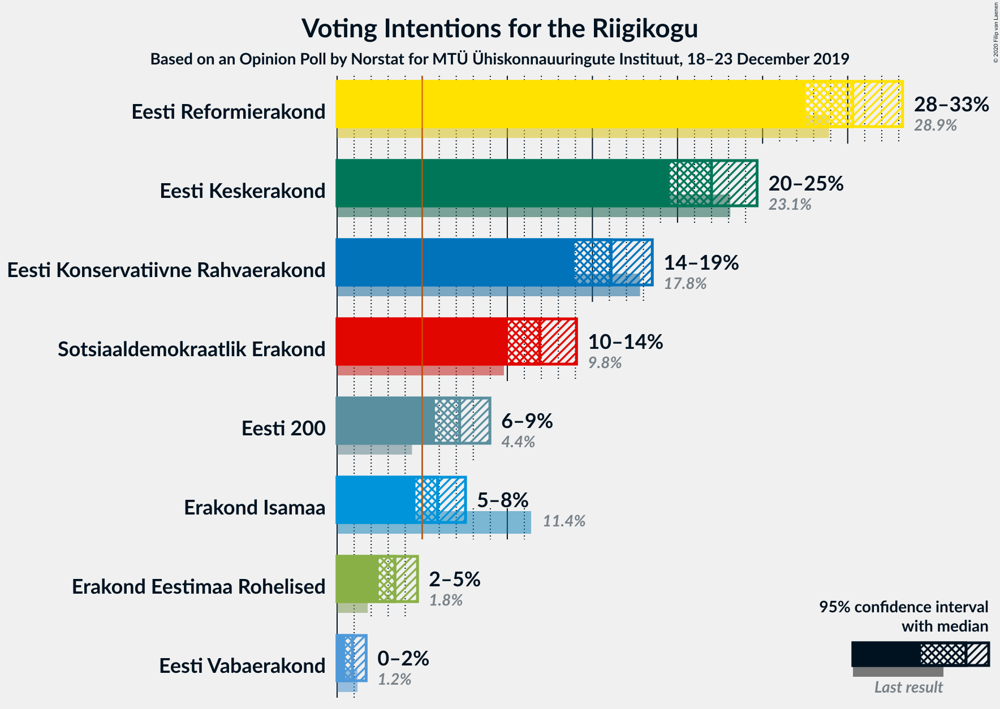

### Confidence Intervals

| Party | Last Result | Poll Result | 80% Confidence Interval | 90% Confidence Interval | 95% Confidence Interval | 99% Confidence Interval |
|:-----:|:-----------:|:-----------:|:-----------------------:|:-----------------------:|:-----------------------:|:-----------------------:|
| Eesti Reformierakond | 28.9% | 30.3% | 28.5–32.2% |28.0–32.8% |27.5–33.2% |26.7–34.2% |
| Eesti Keskerakond | 23.1% | 22.0% | 20.4–23.7% |19.9–24.2% |19.5–24.7% |18.8–25.5% |
| Eesti Konservatiivne Rahvaerakond | 17.8% | 16.1% | 14.7–17.7% |14.3–18.1% |13.9–18.5% |13.3–19.3% |
| Sotsiaaldemokraatlik Erakond | 9.8% | 11.9% | 10.7–13.3% |10.3–13.7% |10.0–14.1% |9.5–14.8% |
| Eesti 200 | 4.4% | 7.2% | 6.2–8.4% |6.0–8.7% |5.7–9.0% |5.3–9.6% |
| Erakond Isamaa | 11.4% | 5.9% | 5.0–7.0% |4.8–7.3% |4.6–7.5% |4.2–8.1% |
| Erakond Eestimaa Rohelised | 1.8% | 3.4% | 2.8–4.3% |2.6–4.5% |2.4–4.7% |2.2–5.2% |
| Eesti Vabaerakond | 1.2% | 0.9% | 0.6–1.4% |0.5–1.6% |0.5–1.7% |0.4–2.0% |

*Note:* The poll result column reflects the actual value used in the calculations. Published results may vary slightly, and in addition be rounded to fewer digits.

## Seats

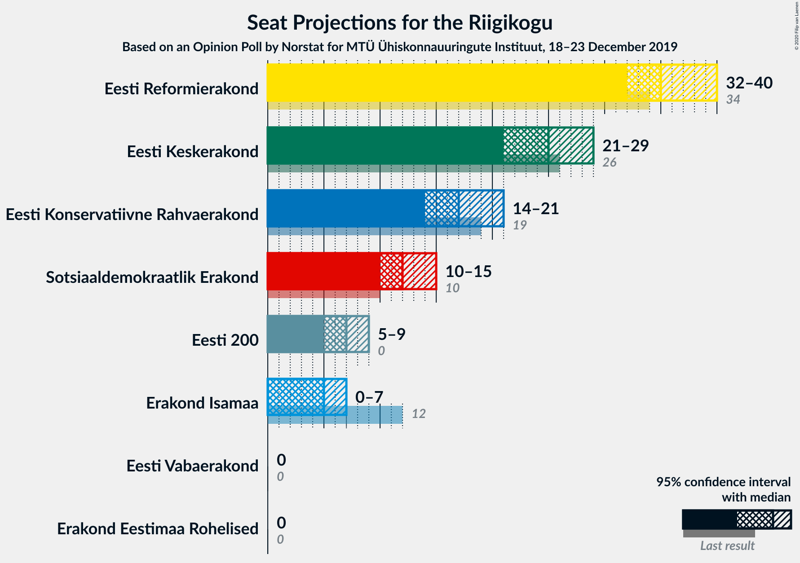

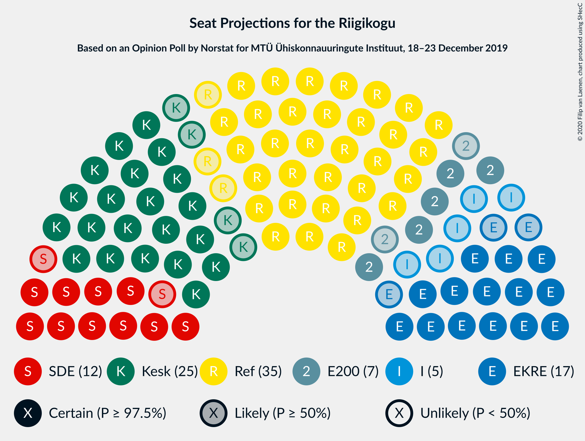

### Confidence Intervals

| Party | Last Result | Median | 80% Confidence Interval | 90% Confidence Interval | 95% Confidence Interval | 99% Confidence Interval |
|:-----:|:-----------:|:------:|:-----------------------:|:-----------------------:|:-----------------------:|:-----------------------:|
| <a href="#eesti-reformierakond">Eesti Reformierakond</a> | 34 | 35 | 33–38 |32–39 |32–40 |30–41 |
| <a href="#eesti-keskerakond">Eesti Keskerakond</a> | 26 | 25 | 22–27 |22–28 |21–29 |20–29 |
| <a href="#eesti-konservatiivne-rahvaerakond">Eesti Konservatiivne Rahvaerakond</a> | 19 | 17 | 15–19 |15–20 |14–21 |14–21 |
| <a href="#sotsiaaldemokraatlik-erakond">Sotsiaaldemokraatlik Erakond</a> | 10 | 12 | 11–14 |11–15 |10–15 |9–16 |
| <a href="#eesti-200">Eesti 200</a> | 0 | 7 | 6–8 |5–9 |5–9 |5–9 |
| <a href="#erakond-isamaa">Erakond Isamaa</a> | 12 | 5 | 0–7 |0–7 |0–7 |0–8 |
| <a href="#erakond-eestimaa-rohelised">Erakond Eestimaa Rohelised</a> | 0 | 0 | 0 |0 |0 |0–4 |
| <a href="#eesti-vabaerakond">Eesti Vabaerakond</a> | 0 | 0 | 0 |0 |0 |0 |

### Eesti Reformierakond

*For a full overview of the results for this party, see the [Eesti Reformierakond](party-eestireformierakond.html) page.*

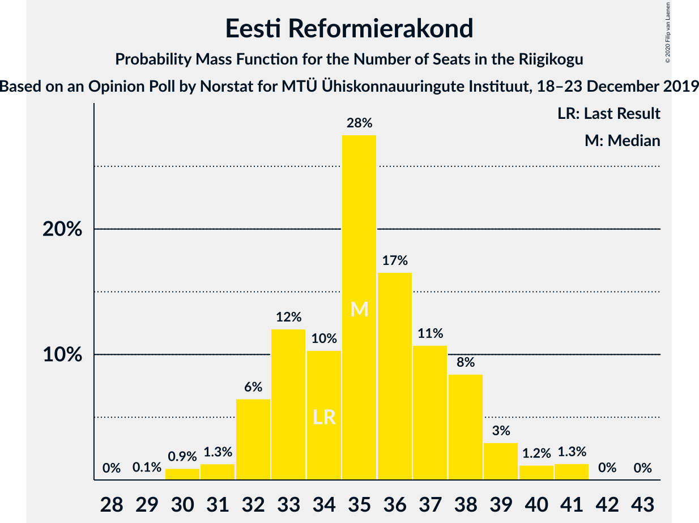

| Number of Seats | Probability | Accumulated | Special Marks |
|:---------------:|:-----------:|:-----------:|:-------------:|
| 29 | 0.1% | 100% |  |
| 30 | 0.9% | 99.9% |  |
| 31 | 1.3% | 99.0% |  |
| 32 | 6% | 98% |  |
| 33 | 12% | 91% |  |
| 34 | 10% | 79% | Last Result |
| 35 | 28% | 69% | Median |
| 36 | 17% | 41% |  |
| 37 | 11% | 25% |  |
| 38 | 8% | 14% |  |
| 39 | 3% | 6% |  |
| 40 | 1.2% | 3% |  |
| 41 | 1.3% | 1.4% |  |
| 42 | 0% | 0.1% |  |
| 43 | 0% | 0% |  |

### Eesti Keskerakond

*For a full overview of the results for this party, see the [Eesti Keskerakond](party-eestikeskerakond.html) page.*

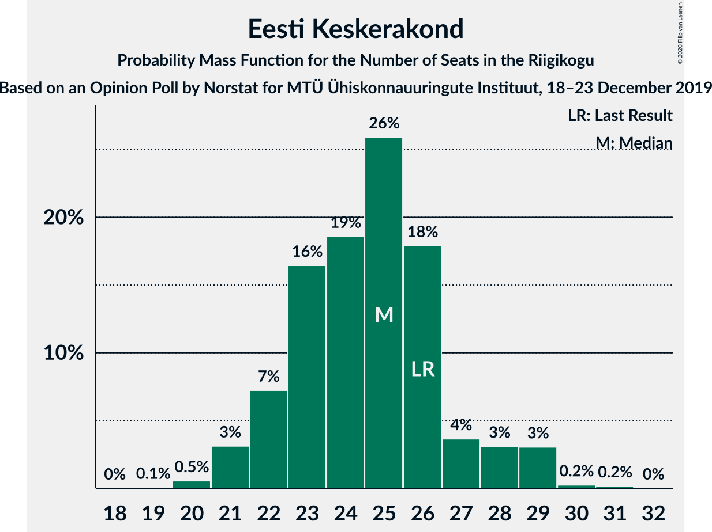

| Number of Seats | Probability | Accumulated | Special Marks |
|:---------------:|:-----------:|:-----------:|:-------------:|
| 19 | 0.1% | 100% |  |
| 20 | 0.5% | 99.9% |  |
| 21 | 3% | 99.4% |  |
| 22 | 7% | 96% |  |
| 23 | 16% | 89% |  |
| 24 | 19% | 73% |  |
| 25 | 26% | 54% | Median |
| 26 | 18% | 28% | Last Result |
| 27 | 4% | 10% |  |
| 28 | 3% | 7% |  |
| 29 | 3% | 3% |  |
| 30 | 0.2% | 0.4% |  |
| 31 | 0.2% | 0.2% |  |
| 32 | 0% | 0% |  |

### Eesti Konservatiivne Rahvaerakond

*For a full overview of the results for this party, see the [Eesti Konservatiivne Rahvaerakond](party-eestikonservatiivnerahvaerakond.html) page.*

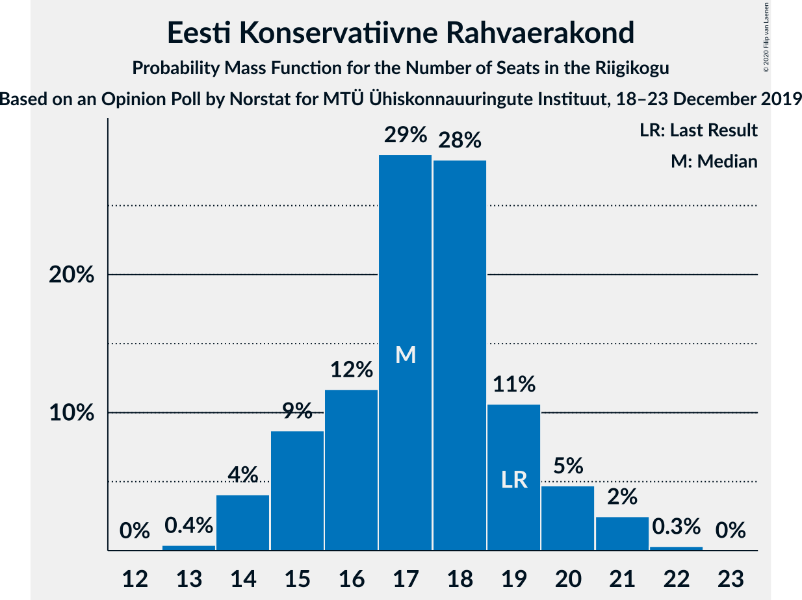

| Number of Seats | Probability | Accumulated | Special Marks |
|:---------------:|:-----------:|:-----------:|:-------------:|
| 13 | 0.4% | 100% |  |
| 14 | 4% | 99.6% |  |
| 15 | 9% | 96% |  |
| 16 | 12% | 87% |  |
| 17 | 29% | 75% | Median |
| 18 | 28% | 46% |  |
| 19 | 11% | 18% | Last Result |
| 20 | 5% | 8% |  |
| 21 | 2% | 3% |  |
| 22 | 0.3% | 0.4% |  |
| 23 | 0% | 0% |  |

### Sotsiaaldemokraatlik Erakond

*For a full overview of the results for this party, see the [Sotsiaaldemokraatlik Erakond](party-sotsiaaldemokraatlikerakond.html) page.*

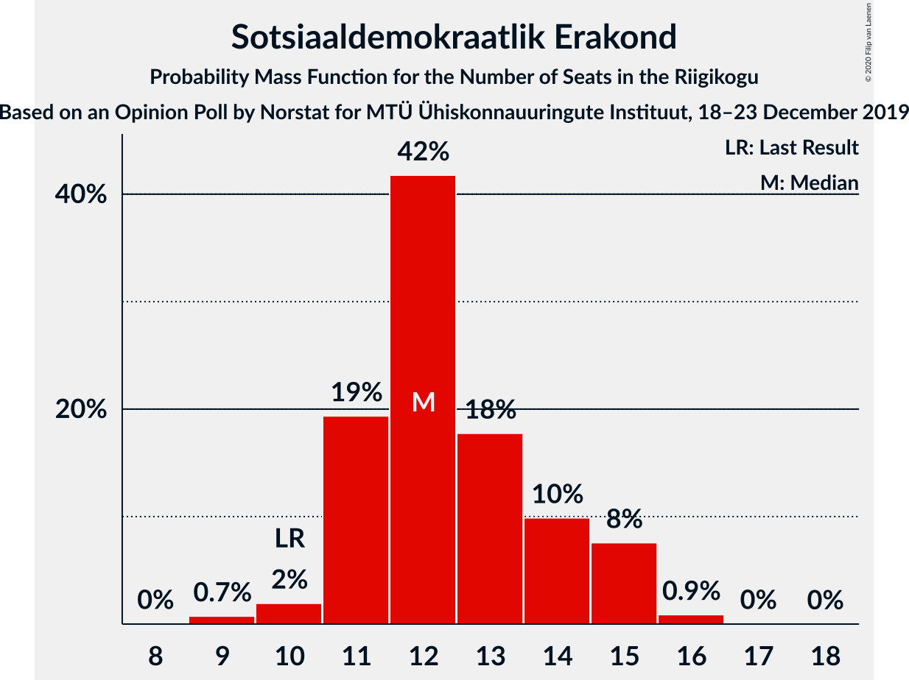

| Number of Seats | Probability | Accumulated | Special Marks |
|:---------------:|:-----------:|:-----------:|:-------------:|
| 9 | 0.7% | 100% |  |
| 10 | 2% | 99.2% | Last Result |
| 11 | 19% | 97% |  |
| 12 | 42% | 78% | Median |
| 13 | 18% | 36% |  |
| 14 | 10% | 18% |  |
| 15 | 8% | 9% |  |
| 16 | 0.9% | 0.9% |  |
| 17 | 0% | 0.1% |  |
| 18 | 0% | 0% |  |

### Eesti 200

*For a full overview of the results for this party, see the [Eesti 200](party-eesti200.html) page.*

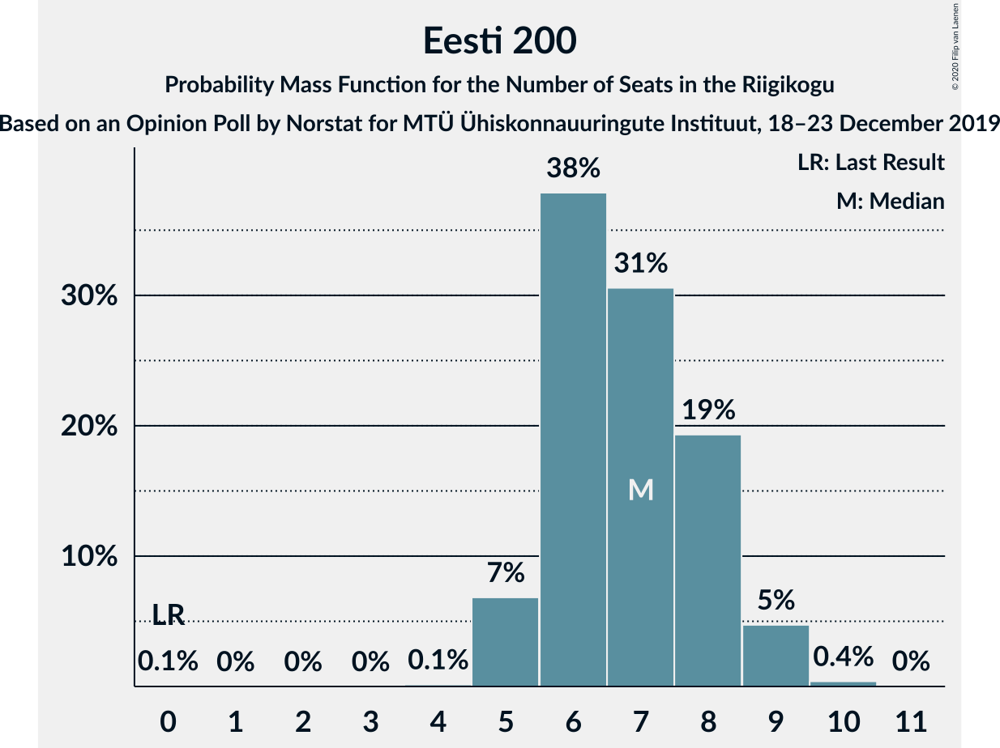

| Number of Seats | Probability | Accumulated | Special Marks |
|:---------------:|:-----------:|:-----------:|:-------------:|
| 0 | 0.1% | 100% | Last Result |
| 1 | 0% | 99.9% |  |
| 2 | 0% | 99.9% |  |
| 3 | 0% | 99.9% |  |
| 4 | 0.1% | 99.9% |  |
| 5 | 7% | 99.8% |  |
| 6 | 38% | 93% |  |
| 7 | 31% | 55% | Median |
| 8 | 19% | 24% |  |
| 9 | 5% | 5% |  |
| 10 | 0.4% | 0.4% |  |
| 11 | 0% | 0% |  |

### Erakond Isamaa

*For a full overview of the results for this party, see the [Erakond Isamaa](party-erakondisamaa.html) page.*

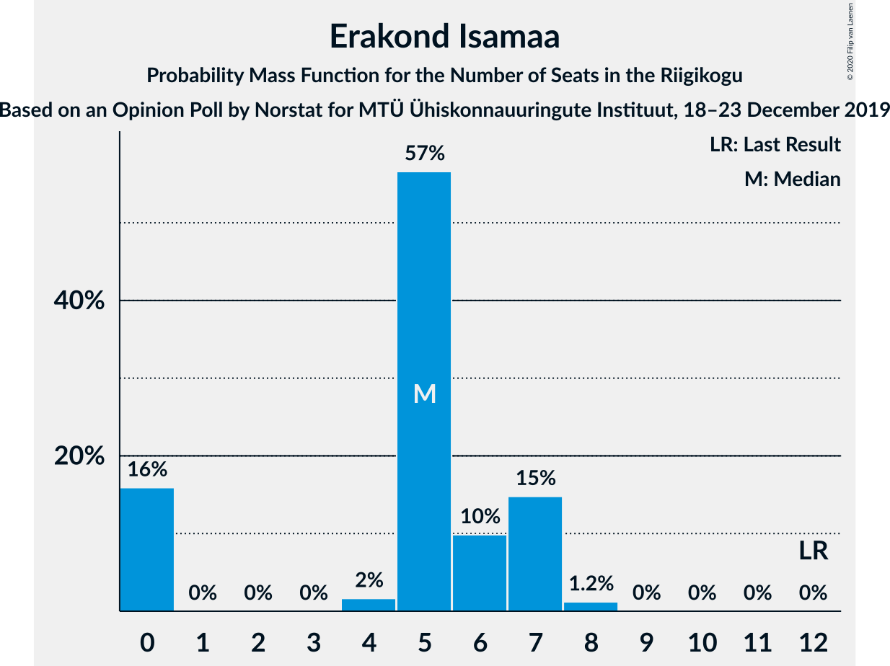

| Number of Seats | Probability | Accumulated | Special Marks |
|:---------------:|:-----------:|:-----------:|:-------------:|
| 0 | 16% | 100% |  |
| 1 | 0% | 84% |  |
| 2 | 0% | 84% |  |
| 3 | 0% | 84% |  |
| 4 | 2% | 84% |  |
| 5 | 57% | 82% | Median |
| 6 | 10% | 26% |  |
| 7 | 15% | 16% |  |
| 8 | 1.2% | 1.2% |  |
| 9 | 0% | 0% |  |
| 10 | 0% | 0% |  |
| 11 | 0% | 0% |  |
| 12 | 0% | 0% | Last Result |

### Erakond Eestimaa Rohelised

*For a full overview of the results for this party, see the [Erakond Eestimaa Rohelised](party-erakondeestimaarohelised.html) page.*

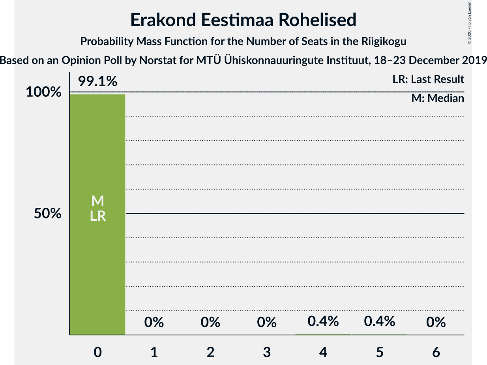

| Number of Seats | Probability | Accumulated | Special Marks |
|:---------------:|:-----------:|:-----------:|:-------------:|
| 0 | 99.1% | 100% | Last Result, Median |
| 1 | 0% | 0.9% |  |
| 2 | 0% | 0.9% |  |
| 3 | 0% | 0.9% |  |
| 4 | 0.4% | 0.9% |  |
| 5 | 0.4% | 0.4% |  |
| 6 | 0% | 0% |  |

### Eesti Vabaerakond

*For a full overview of the results for this party, see the [Eesti Vabaerakond](party-eestivabaerakond.html) page.*

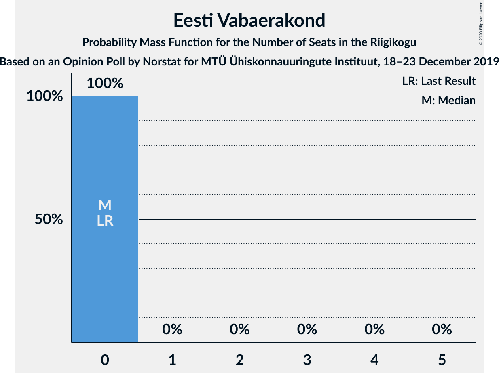

| Number of Seats | Probability | Accumulated | Special Marks |
|:---------------:|:-----------:|:-----------:|:-------------:|
| 0 | 100% | 100% | Last Result, Median |

## Coalitions

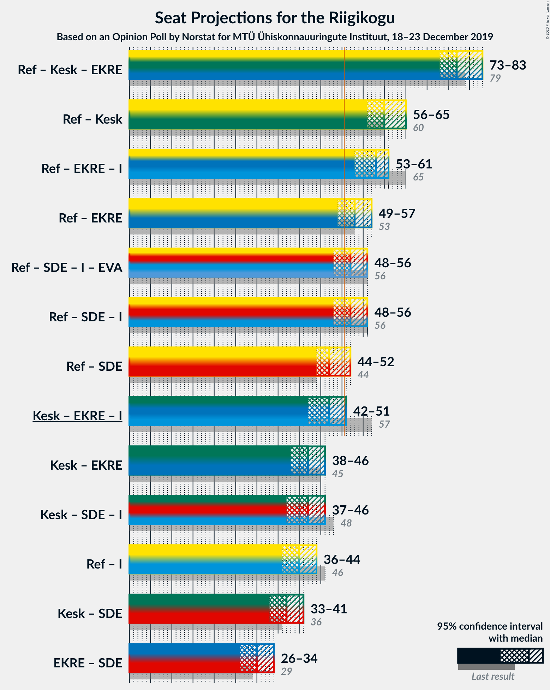

### Confidence Intervals

| Coalition | Last Result | Median | Majority? | 80% Confidence Interval | 90% Confidence Interval | 95% Confidence Interval | 99% Confidence Interval |
|:---------:|:-----------:|:------:|:---------:|:-----------------------:|:-----------------------:|:-----------------------:|:-----------------------:|
| Eesti Reformierakond – Eesti Keskerakond – Eesti Konservatiivne Rahvaerakond | 79 | 77 | 100% | 74–80 | 74–82 | 73–83 | 72–83 |
| Eesti Reformierakond – Eesti Keskerakond | 60 | 60 | 100% | 57–63 | 56–64 | 56–65 | 54–66 |
| Eesti Reformierakond – Eesti Konservatiivne Rahvaerakond – Erakond Isamaa | 65 | 58 | 99.6% | 54–59 | 54–60 | 53–61 | 51–63 |
| Eesti Reformierakond – Eesti Konservatiivne Rahvaerakond | 53 | 53 | 82% | 50–55 | 49–56 | 49–57 | 47–58 |
| Eesti Reformierakond – Sotsiaaldemokraatlik Erakond – Erakond Isamaa – Eesti Vabaerakond | 56 | 52 | 80% | 50–55 | 49–55 | 48–56 | 47–57 |
| Eesti Reformierakond – Sotsiaaldemokraatlik Erakond – Erakond Isamaa | 56 | 52 | 80% | 50–55 | 49–55 | 48–56 | 47–57 |
| Eesti Reformierakond – Sotsiaaldemokraatlik Erakond | 44 | 47 | 8% | 45–50 | 44–52 | 44–52 | 43–55 |
| Eesti Keskerakond – Eesti Konservatiivne Rahvaerakond – Erakond Isamaa | 57 | 47 | 3% | 43–49 | 43–50 | 42–51 | 40–52 |
| Eesti Keskerakond – Eesti Konservatiivne Rahvaerakond | 45 | 42 | 0% | 39–44 | 39–45 | 38–46 | 37–48 |
| Eesti Keskerakond – Sotsiaaldemokraatlik Erakond – Erakond Isamaa | 48 | 42 | 0% | 39–44 | 37–45 | 37–46 | 36–48 |
| Eesti Reformierakond – Erakond Isamaa | 46 | 40 | 0% | 37–43 | 36–43 | 36–44 | 33–45 |
| Eesti Keskerakond – Sotsiaaldemokraatlik Erakond | 36 | 37 | 0% | 34–40 | 34–40 | 33–41 | 32–42 |
| Eesti Konservatiivne Rahvaerakond – Sotsiaaldemokraatlik Erakond | 29 | 30 | 0% | 27–32 | 27–33 | 26–34 | 25–35 |

### Eesti Reformierakond – Eesti Keskerakond – Eesti Konservatiivne Rahvaerakond

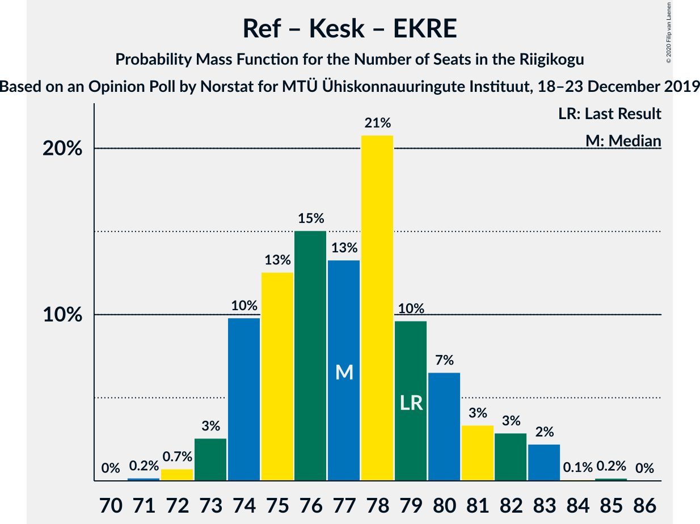

| Number of Seats | Probability | Accumulated | Special Marks |
|:---------------:|:-----------:|:-----------:|:-------------:|
| 70 | 0% | 100% |  |
| 71 | 0.2% | 99.9% |  |
| 72 | 0.7% | 99.8% |  |
| 73 | 3% | 99.0% |  |
| 74 | 10% | 96% |  |
| 75 | 13% | 87% |  |
| 76 | 15% | 74% |  |
| 77 | 13% | 59% | Median |
| 78 | 21% | 46% |  |
| 79 | 10% | 25% | Last Result |
| 80 | 7% | 15% |  |
| 81 | 3% | 9% |  |
| 82 | 3% | 5% |  |
| 83 | 2% | 3% |  |
| 84 | 0.1% | 0.3% |  |
| 85 | 0.2% | 0.2% |  |
| 86 | 0% | 0% |  |

### Eesti Reformierakond – Eesti Keskerakond

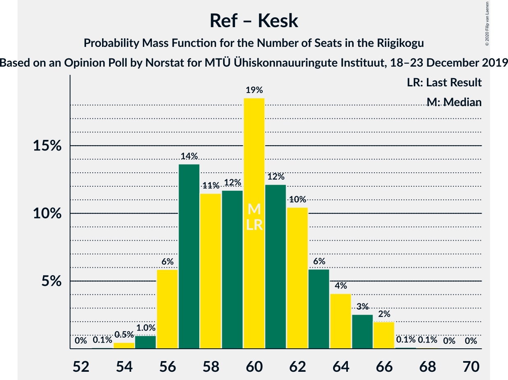

| Number of Seats | Probability | Accumulated | Special Marks |
|:---------------:|:-----------:|:-----------:|:-------------:|
| 53 | 0.1% | 100% |  |
| 54 | 0.5% | 99.9% |  |
| 55 | 1.0% | 99.4% |  |
| 56 | 6% | 98% |  |
| 57 | 14% | 93% |  |
| 58 | 11% | 79% |  |
| 59 | 12% | 67% |  |
| 60 | 19% | 56% | Last Result, Median |
| 61 | 12% | 37% |  |
| 62 | 10% | 25% |  |
| 63 | 6% | 15% |  |
| 64 | 4% | 9% |  |
| 65 | 3% | 5% |  |
| 66 | 2% | 2% |  |
| 67 | 0.1% | 0.2% |  |
| 68 | 0.1% | 0.1% |  |
| 69 | 0% | 0% |  |

### Eesti Reformierakond – Eesti Konservatiivne Rahvaerakond – Erakond Isamaa

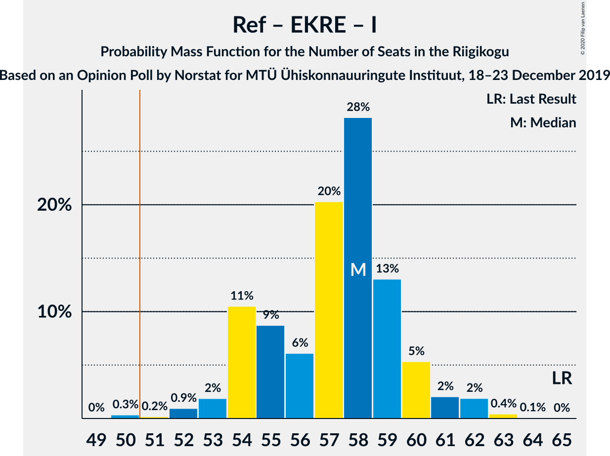

| Number of Seats | Probability | Accumulated | Special Marks |
|:---------------:|:-----------:|:-----------:|:-------------:|
| 49 | 0% | 100% |  |
| 50 | 0.3% | 99.9% |  |
| 51 | 0.2% | 99.6% | Majority |
| 52 | 0.9% | 99.4% |  |
| 53 | 2% | 98% |  |
| 54 | 11% | 97% |  |
| 55 | 9% | 86% |  |
| 56 | 6% | 77% |  |
| 57 | 20% | 71% | Median |
| 58 | 28% | 51% |  |
| 59 | 13% | 23% |  |
| 60 | 5% | 10% |  |
| 61 | 2% | 4% |  |
| 62 | 2% | 2% |  |
| 63 | 0.4% | 0.5% |  |
| 64 | 0.1% | 0.1% |  |
| 65 | 0% | 0% | Last Result |

### Eesti Reformierakond – Eesti Konservatiivne Rahvaerakond

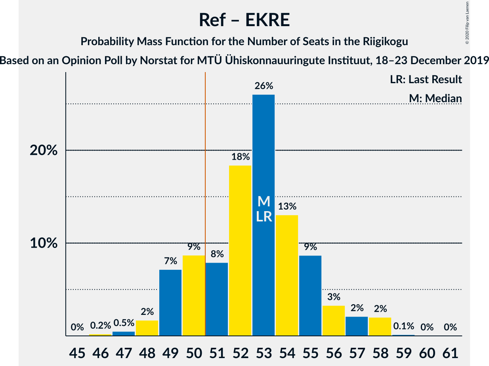

| Number of Seats | Probability | Accumulated | Special Marks |
|:---------------:|:-----------:|:-----------:|:-------------:|
| 46 | 0.2% | 100% |  |
| 47 | 0.5% | 99.8% |  |
| 48 | 2% | 99.3% |  |
| 49 | 7% | 98% |  |
| 50 | 9% | 90% |  |
| 51 | 8% | 82% | Majority |
| 52 | 18% | 74% | Median |
| 53 | 26% | 55% | Last Result |
| 54 | 13% | 29% |  |
| 55 | 9% | 16% |  |
| 56 | 3% | 8% |  |
| 57 | 2% | 4% |  |
| 58 | 2% | 2% |  |
| 59 | 0.1% | 0.2% |  |
| 60 | 0% | 0.1% |  |
| 61 | 0% | 0% |  |

### Eesti Reformierakond – Sotsiaaldemokraatlik Erakond – Erakond Isamaa – Eesti Vabaerakond

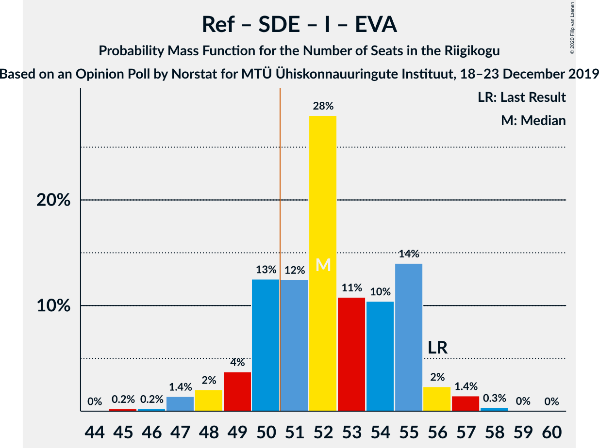

| Number of Seats | Probability | Accumulated | Special Marks |
|:---------------:|:-----------:|:-----------:|:-------------:|
| 45 | 0.2% | 100% |  |
| 46 | 0.2% | 99.7% |  |
| 47 | 1.4% | 99.5% |  |
| 48 | 2% | 98% |  |
| 49 | 4% | 96% |  |
| 50 | 13% | 92% |  |
| 51 | 12% | 80% | Majority |
| 52 | 28% | 67% | Median |
| 53 | 11% | 39% |  |
| 54 | 10% | 29% |  |
| 55 | 14% | 18% |  |
| 56 | 2% | 4% | Last Result |
| 57 | 1.4% | 2% |  |
| 58 | 0.3% | 0.4% |  |
| 59 | 0% | 0.1% |  |
| 60 | 0% | 0% |  |

### Eesti Reformierakond – Sotsiaaldemokraatlik Erakond – Erakond Isamaa

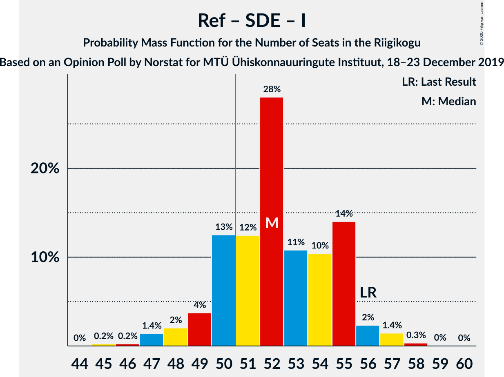

| Number of Seats | Probability | Accumulated | Special Marks |
|:---------------:|:-----------:|:-----------:|:-------------:|
| 45 | 0.2% | 100% |  |
| 46 | 0.2% | 99.7% |  |
| 47 | 1.4% | 99.5% |  |
| 48 | 2% | 98% |  |
| 49 | 4% | 96% |  |
| 50 | 13% | 92% |  |
| 51 | 12% | 80% | Majority |
| 52 | 28% | 67% | Median |
| 53 | 11% | 39% |  |
| 54 | 10% | 29% |  |
| 55 | 14% | 18% |  |
| 56 | 2% | 4% | Last Result |
| 57 | 1.4% | 2% |  |
| 58 | 0.3% | 0.4% |  |
| 59 | 0% | 0.1% |  |
| 60 | 0% | 0% |  |

### Eesti Reformierakond – Sotsiaaldemokraatlik Erakond

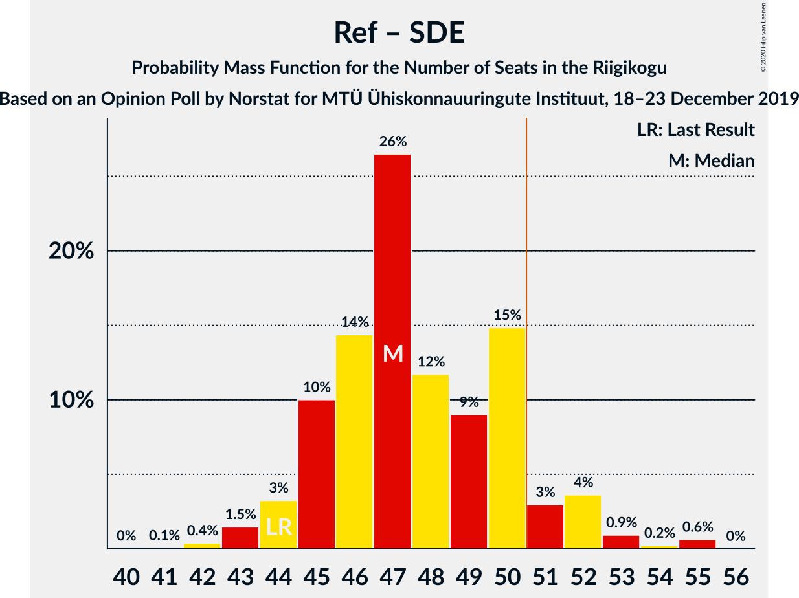

| Number of Seats | Probability | Accumulated | Special Marks |
|:---------------:|:-----------:|:-----------:|:-------------:|
| 41 | 0.1% | 100% |  |
| 42 | 0.4% | 99.9% |  |
| 43 | 1.5% | 99.5% |  |
| 44 | 3% | 98% | Last Result |
| 45 | 10% | 95% |  |
| 46 | 14% | 85% |  |
| 47 | 26% | 70% | Median |
| 48 | 12% | 44% |  |
| 49 | 9% | 32% |  |
| 50 | 15% | 23% |  |
| 51 | 3% | 8% | Majority |
| 52 | 4% | 5% |  |
| 53 | 0.9% | 2% |  |
| 54 | 0.2% | 0.9% |  |
| 55 | 0.6% | 0.6% |  |
| 56 | 0% | 0% |  |

### Eesti Keskerakond – Eesti Konservatiivne Rahvaerakond – Erakond Isamaa

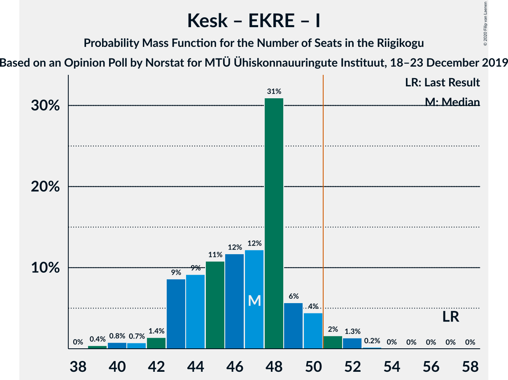

| Number of Seats | Probability | Accumulated | Special Marks |
|:---------------:|:-----------:|:-----------:|:-------------:|
| 39 | 0.4% | 100% |  |
| 40 | 0.8% | 99.6% |  |
| 41 | 0.7% | 98.8% |  |
| 42 | 1.4% | 98% |  |
| 43 | 9% | 97% |  |
| 44 | 9% | 88% |  |
| 45 | 11% | 79% |  |
| 46 | 12% | 68% |  |
| 47 | 12% | 56% | Median |
| 48 | 31% | 44% |  |
| 49 | 6% | 13% |  |
| 50 | 4% | 8% |  |
| 51 | 2% | 3% | Majority |
| 52 | 1.3% | 2% |  |
| 53 | 0.2% | 0.2% |  |
| 54 | 0% | 0% |  |
| 55 | 0% | 0% |  |
| 56 | 0% | 0% |  |
| 57 | 0% | 0% | Last Result |

### Eesti Keskerakond – Eesti Konservatiivne Rahvaerakond

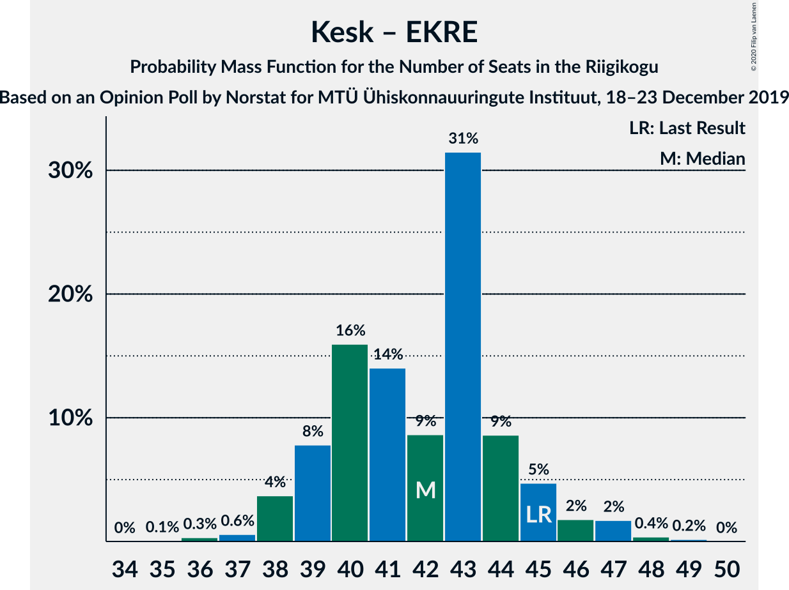

| Number of Seats | Probability | Accumulated | Special Marks |
|:---------------:|:-----------:|:-----------:|:-------------:|
| 35 | 0.1% | 100% |  |
| 36 | 0.3% | 99.9% |  |
| 37 | 0.6% | 99.6% |  |
| 38 | 4% | 99.0% |  |
| 39 | 8% | 95% |  |
| 40 | 16% | 88% |  |
| 41 | 14% | 72% |  |
| 42 | 9% | 58% | Median |
| 43 | 31% | 49% |  |
| 44 | 9% | 17% |  |
| 45 | 5% | 9% | Last Result |
| 46 | 2% | 4% |  |
| 47 | 2% | 2% |  |
| 48 | 0.4% | 0.6% |  |
| 49 | 0.2% | 0.2% |  |
| 50 | 0% | 0% |  |

### Eesti Keskerakond – Sotsiaaldemokraatlik Erakond – Erakond Isamaa

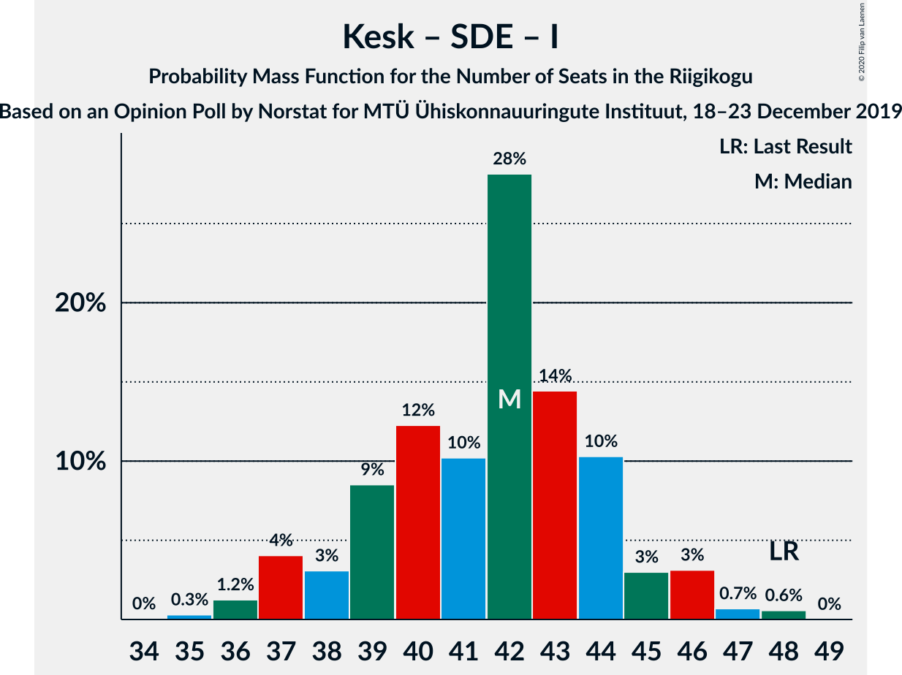

| Number of Seats | Probability | Accumulated | Special Marks |
|:---------------:|:-----------:|:-----------:|:-------------:|
| 34 | 0% | 100% |  |
| 35 | 0.3% | 99.9% |  |
| 36 | 1.2% | 99.6% |  |
| 37 | 4% | 98% |  |
| 38 | 3% | 94% |  |
| 39 | 9% | 91% |  |
| 40 | 12% | 83% |  |
| 41 | 10% | 70% |  |
| 42 | 28% | 60% | Median |
| 43 | 14% | 32% |  |
| 44 | 10% | 18% |  |
| 45 | 3% | 7% |  |
| 46 | 3% | 4% |  |
| 47 | 0.7% | 1.3% |  |
| 48 | 0.6% | 0.6% | Last Result |
| 49 | 0% | 0% |  |

### Eesti Reformierakond – Erakond Isamaa

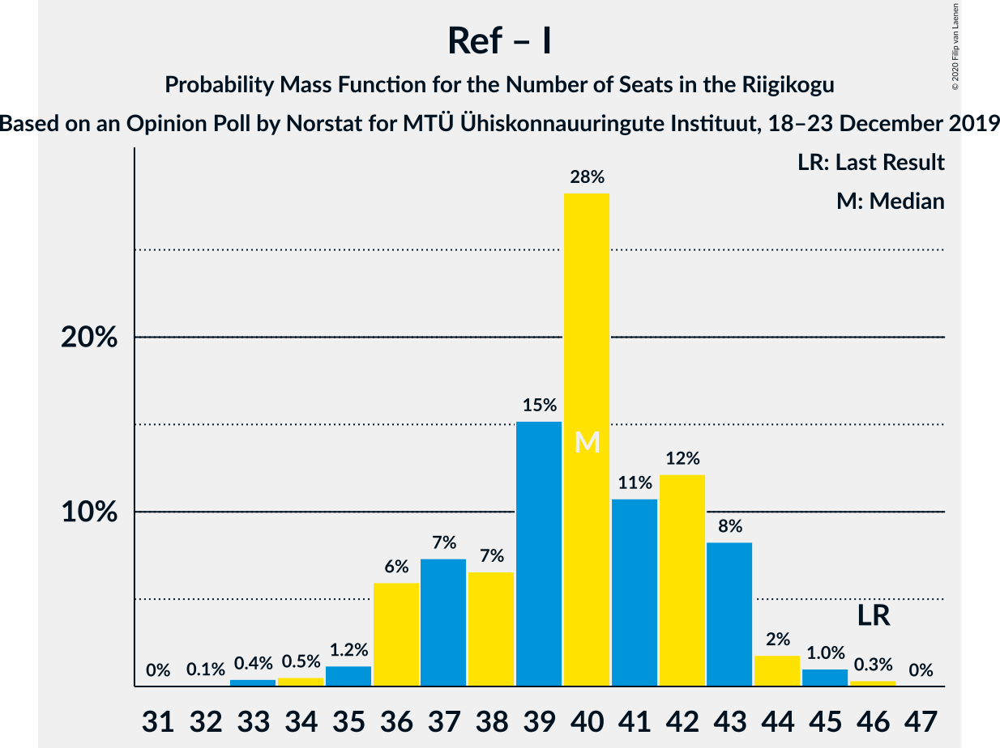

| Number of Seats | Probability | Accumulated | Special Marks |
|:---------------:|:-----------:|:-----------:|:-------------:|
| 32 | 0.1% | 100% |  |
| 33 | 0.4% | 99.9% |  |
| 34 | 0.5% | 99.5% |  |
| 35 | 1.2% | 98.9% |  |
| 36 | 6% | 98% |  |
| 37 | 7% | 92% |  |
| 38 | 7% | 84% |  |
| 39 | 15% | 78% |  |
| 40 | 28% | 63% | Median |
| 41 | 11% | 34% |  |
| 42 | 12% | 24% |  |
| 43 | 8% | 11% |  |
| 44 | 2% | 3% |  |
| 45 | 1.0% | 1.4% |  |
| 46 | 0.3% | 0.4% | Last Result |
| 47 | 0% | 0% |  |

### Eesti Keskerakond – Sotsiaaldemokraatlik Erakond

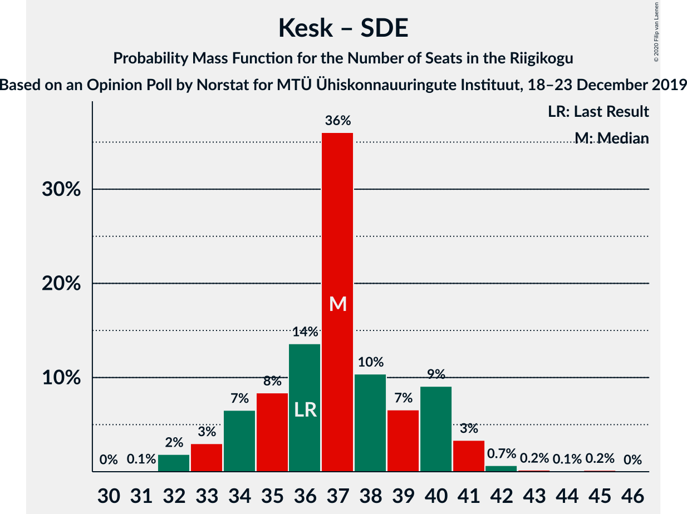

| Number of Seats | Probability | Accumulated | Special Marks |
|:---------------:|:-----------:|:-----------:|:-------------:|
| 31 | 0.1% | 100% |  |
| 32 | 2% | 99.9% |  |
| 33 | 3% | 98% |  |
| 34 | 7% | 95% |  |
| 35 | 8% | 89% |  |
| 36 | 14% | 80% | Last Result |
| 37 | 36% | 67% | Median |
| 38 | 10% | 30% |  |
| 39 | 7% | 20% |  |
| 40 | 9% | 14% |  |
| 41 | 3% | 4% |  |
| 42 | 0.7% | 1.1% |  |
| 43 | 0.2% | 0.4% |  |
| 44 | 0.1% | 0.2% |  |
| 45 | 0.2% | 0.2% |  |
| 46 | 0% | 0% |  |

### Eesti Konservatiivne Rahvaerakond – Sotsiaaldemokraatlik Erakond

| Number of Seats | Probability | Accumulated | Special Marks |
|:---------------:|:-----------:|:-----------:|:-------------:|
| 24 | 0.2% | 100% |  |
| 25 | 0.4% | 99.8% |  |
| 26 | 4% | 99.3% |  |
| 27 | 9% | 96% |  |
| 28 | 16% | 86% |  |
| 29 | 6% | 70% | Last Result, Median |
| 30 | 36% | 64% |  |
| 31 | 10% | 28% |  |
| 32 | 13% | 18% |  |
| 33 | 2% | 6% |  |
| 34 | 2% | 3% |  |
| 35 | 0.8% | 0.9% |  |
| 36 | 0.1% | 0.1% |  |
| 37 | 0% | 0% |  |

## Technical Information

### Opinion Poll

+ **Polling firm:** Norstat
+ **Commissioner(s):** MTÜ Ühiskonnauuringute Instituut
+ **Fieldwork period:** 18–23 December 2019

### Calculations

+ **Sample size:** 1000
+ **Simulations done:** 131,072
+ **Error estimate:** 1.20%

