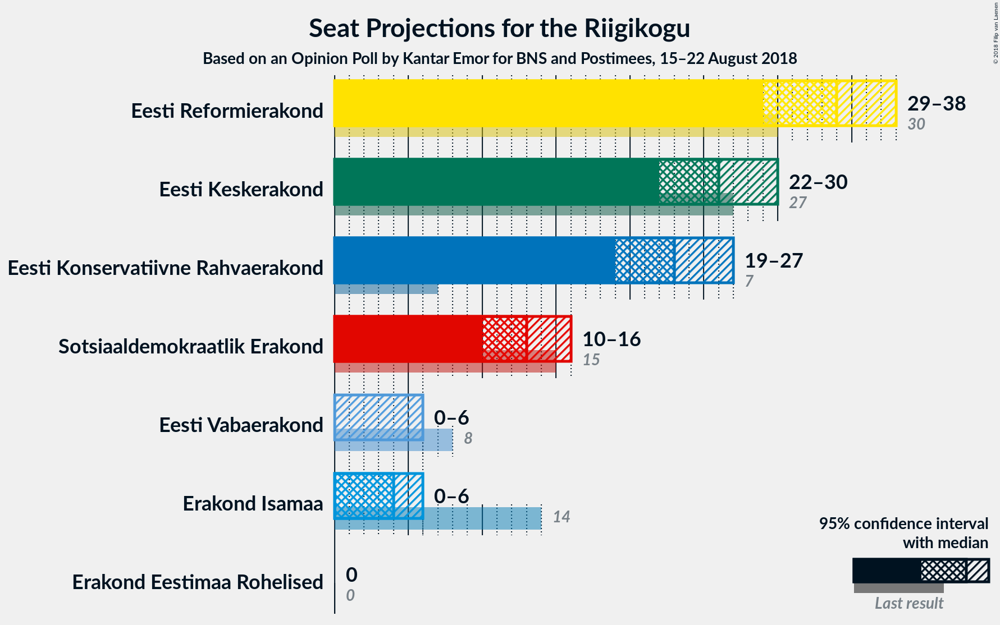
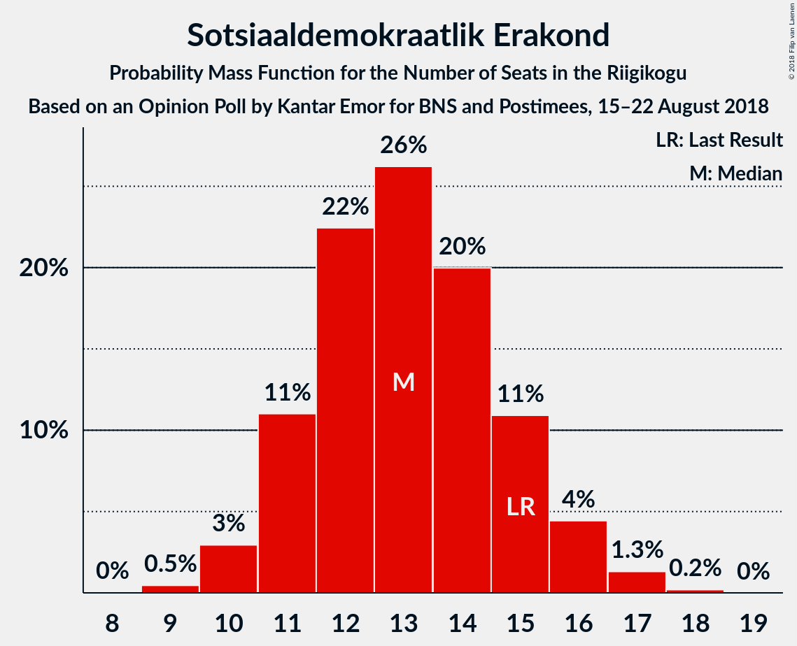
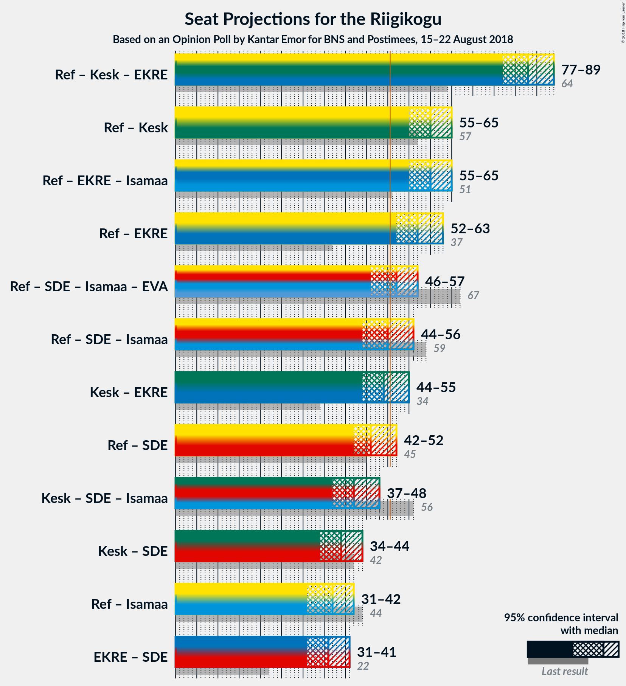

# Opinion Poll by Kantar Emor for BNS and Postimees, 15–22 August 2018

<a href="#voting-intentions">Voting Intentions</a> | <a href="#seats">Seats</a> | <a href="#coalitions">Coalitions</a> | <a href="#technical-information">Technical Information</a>

## Voting Intentions

### Confidence Intervals

| Party | Last Result | Poll Result | 80% Confidence Interval | 90% Confidence Interval | 95% Confidence Interval | 99% Confidence Interval |
|:-----:|:-----------:|:-----------:|:-----------------------:|:-----------------------:|:-----------------------:|:-----------------------:|
| Eesti Reformierakond | 27.7% | 29.8% | 27.7–32.0% |27.1–32.6% |26.6–33.2% |25.7–34.3% |
| Eesti Keskerakond | 24.8% | 23.8% | 21.8–25.8% |21.3–26.4% |20.8–26.9% |20.0–28.0% |
| Eesti Konservatiivne Rahvaerakond | 8.1% | 21.2% | 19.4–23.2% |18.9–23.8% |18.4–24.3% |17.6–25.3% |
| Sotsiaaldemokraatlik Erakond | 15.2% | 12.8% | 11.3–14.4% |10.9–14.9% |10.5–15.3% |9.9–16.2% |
| Erakond Isamaa | 13.7% | 5.2% | 4.3–6.4% |4.1–6.8% |3.9–7.1% |3.5–7.7% |
| Eesti Vabaerakond | 8.7% | 4.7% | 3.8–5.9% |3.6–6.2% |3.4–6.5% |3.0–7.1% |
| Erakond Eestimaa Rohelised | 0.9% | 2.0% | 1.5–2.9% |1.3–3.1% |1.2–3.3% |1.0–3.7% |

*Note:* The poll result column reflects the actual value used in the calculations. Published results may vary slightly, and in addition be rounded to fewer digits.

## Seats

### Confidence Intervals

| Party | Last Result | Median | 80% Confidence Interval | 90% Confidence Interval | 95% Confidence Interval | 99% Confidence Interval |
|:-----:|:-----------:|:------:|:-----------------------:|:-----------------------:|:-----------------------:|:-----------------------:|
| <a href="#eesti-reformierakond">Eesti Reformierakond</a> | 30 | 34 | 31–37 |30–38 |29–38 |28–40 |
| <a href="#eesti-keskerakond">Eesti Keskerakond</a> | 27 | 26 | 24–29 |23–30 |22–30 |21–32 |
| <a href="#eesti-konservatiivne-rahvaerakond">Eesti Konservatiivne Rahvaerakond</a> | 7 | 23 | 21–26 |20–26 |19–27 |18–28 |
| <a href="#sotsiaaldemokraatlik-erakond">Sotsiaaldemokraatlik Erakond</a> | 15 | 13 | 11–15 |11–16 |10–16 |10–17 |
| <a href="#erakond-isamaa">Erakond Isamaa</a> | 14 | 4 | 0–6 |0–6 |0–6 |0–7 |
| <a href="#eesti-vabaerakond">Eesti Vabaerakond</a> | 8 | 0 | 0–5 |0–5 |0–6 |0–6 |
| <a href="#erakond-eestimaa-rohelised">Erakond Eestimaa Rohelised</a> | 0 | 0 | 0 |0 |0 |0 |

### Eesti Reformierakond

*For a full overview of the results for this party, see the [Eesti Reformierakond](party-eestireformierakond.html) page.*

| Number of Seats | Probability | Accumulated | Special Marks |
|:---------------:|:-----------:|:-----------:|:-------------:|
| 27 | 0.2% | 100% |  |
| 28 | 0.6% | 99.8% |  |
| 29 | 3% | 99.2% |  |
| 30 | 4% | 96% | Last Result |
| 31 | 11% | 93% |  |
| 32 | 12% | 81% |  |
| 33 | 19% | 69% |  |
| 34 | 17% | 51% | Median |
| 35 | 10% | 34% |  |
| 36 | 13% | 24% |  |
| 37 | 5% | 11% |  |
| 38 | 4% | 6% |  |
| 39 | 1.1% | 2% |  |
| 40 | 0.4% | 0.6% |  |
| 41 | 0.2% | 0.2% |  |
| 42 | 0% | 0% |  |

### Eesti Keskerakond

*For a full overview of the results for this party, see the [Eesti Keskerakond](party-eestikeskerakond.html) page.*

| Number of Seats | Probability | Accumulated | Special Marks |
|:---------------:|:-----------:|:-----------:|:-------------:|
| 20 | 0.1% | 100% |  |
| 21 | 0.7% | 99.8% |  |
| 22 | 2% | 99.1% |  |
| 23 | 6% | 97% |  |
| 24 | 12% | 91% |  |
| 25 | 18% | 79% |  |
| 26 | 18% | 60% | Median |
| 27 | 20% | 42% | Last Result |
| 28 | 12% | 23% |  |
| 29 | 6% | 11% |  |
| 30 | 3% | 5% |  |
| 31 | 1.3% | 2% |  |
| 32 | 0.5% | 0.6% |  |
| 33 | 0.1% | 0.1% |  |
| 34 | 0% | 0% |  |

### Eesti Konservatiivne Rahvaerakond

*For a full overview of the results for this party, see the [Eesti Konservatiivne Rahvaerakond](party-eestikonservatiivnerahvaerakond.html) page.*

| Number of Seats | Probability | Accumulated | Special Marks |
|:---------------:|:-----------:|:-----------:|:-------------:|
| 7 | 0% | 100% | Last Result |
| 8 | 0% | 100% |  |
| 9 | 0% | 100% |  |
| 10 | 0% | 100% |  |
| 11 | 0% | 100% |  |
| 12 | 0% | 100% |  |
| 13 | 0% | 100% |  |
| 14 | 0% | 100% |  |
| 15 | 0% | 100% |  |
| 16 | 0% | 100% |  |
| 17 | 0.1% | 100% |  |
| 18 | 0.5% | 99.9% |  |
| 19 | 2% | 99.4% |  |
| 20 | 6% | 97% |  |
| 21 | 11% | 91% |  |
| 22 | 20% | 80% |  |
| 23 | 18% | 59% | Median |
| 24 | 18% | 41% |  |
| 25 | 12% | 24% |  |
| 26 | 7% | 11% |  |
| 27 | 3% | 5% |  |
| 28 | 1.3% | 2% |  |
| 29 | 0.4% | 0.5% |  |
| 30 | 0.1% | 0.1% |  |
| 31 | 0% | 0% |  |

### Sotsiaaldemokraatlik Erakond

*For a full overview of the results for this party, see the [Sotsiaaldemokraatlik Erakond](party-sotsiaaldemokraatlikerakond.html) page.*

| Number of Seats | Probability | Accumulated | Special Marks |
|:---------------:|:-----------:|:-----------:|:-------------:|
| 9 | 0.5% | 100% |  |
| 10 | 3% | 99.5% |  |
| 11 | 11% | 97% |  |
| 12 | 22% | 86% |  |
| 13 | 26% | 63% | Median |
| 14 | 20% | 37% |  |
| 15 | 11% | 17% | Last Result |
| 16 | 4% | 6% |  |
| 17 | 1.3% | 2% |  |
| 18 | 0.2% | 0.2% |  |
| 19 | 0% | 0% |  |

### Erakond Isamaa

*For a full overview of the results for this party, see the [Erakond Isamaa](party-erakondisamaa.html) page.*

| Number of Seats | Probability | Accumulated | Special Marks |
|:---------------:|:-----------:|:-----------:|:-------------:|
| 0 | 36% | 100% |  |
| 1 | 0% | 64% |  |
| 2 | 0% | 64% |  |
| 3 | 0% | 64% |  |
| 4 | 16% | 64% | Median |
| 5 | 34% | 48% |  |
| 6 | 11% | 14% |  |
| 7 | 2% | 2% |  |
| 8 | 0.1% | 0.1% |  |
| 9 | 0% | 0% |  |
| 10 | 0% | 0% |  |
| 11 | 0% | 0% |  |
| 12 | 0% | 0% |  |
| 13 | 0% | 0% |  |
| 14 | 0% | 0% | Last Result |

### Eesti Vabaerakond

*For a full overview of the results for this party, see the [Eesti Vabaerakond](party-eestivabaerakond.html) page.*

| Number of Seats | Probability | Accumulated | Special Marks |
|:---------------:|:-----------:|:-----------:|:-------------:|
| 0 | 59% | 100% | Median |
| 1 | 0% | 41% |  |
| 2 | 0% | 41% |  |
| 3 | 0% | 41% |  |
| 4 | 16% | 41% |  |
| 5 | 22% | 25% |  |
| 6 | 2% | 3% |  |
| 7 | 0.2% | 0.2% |  |
| 8 | 0% | 0% | Last Result |

### Erakond Eestimaa Rohelised

*For a full overview of the results for this party, see the [Erakond Eestimaa Rohelised](party-erakondeestimaarohelised.html) page.*

| Number of Seats | Probability | Accumulated | Special Marks |
|:---------------:|:-----------:|:-----------:|:-------------:|
| 0 | 100% | 100% | Last Result, Median |

## Coalitions

### Confidence Intervals

| Coalition | Last Result | Median | Majority? | 80% Confidence Interval | 90% Confidence Interval | 95% Confidence Interval | 99% Confidence Interval |
|:---------:|:-----------:|:------:|:---------:|:-----------------------:|:-----------------------:|:-----------------------:|:-----------------------:|
| Eesti Reformierakond – Eesti Keskerakond – Eesti Konservatiivne Rahvaerakond | 64 | 83 | 100% | 79–87 | 78–88 | 77–89 | 76–90 |
| Eesti Reformierakond – Eesti Keskerakond | 57 | 60 | 100% | 56–63 | 55–64 | 55–65 | 53–67 |
| Eesti Reformierakond – Eesti Konservatiivne Rahvaerakond – Erakond Isamaa | 51 | 60 | 100% | 56–63 | 56–64 | 55–65 | 53–66 |
| Eesti Reformierakond – Eesti Konservatiivne Rahvaerakond | 37 | 57 | 98.8% | 53–60 | 52–62 | 52–63 | 50–64 |
| Eesti Reformierakond – Sotsiaaldemokraatlik Erakond – Erakond Isamaa – Eesti Vabaerakond | 67 | 52 | 71% | 49–55 | 47–56 | 46–57 | 45–58 |
| Eesti Reformierakond – Sotsiaaldemokraatlik Erakond – Erakond Isamaa | 59 | 50 | 41% | 47–53 | 45–55 | 44–56 | 43–57 |
| Eesti Keskerakond – Eesti Konservatiivne Rahvaerakond | 34 | 49 | 29% | 46–52 | 45–54 | 44–55 | 43–56 |
| Eesti Reformierakond – Sotsiaaldemokraatlik Erakond | 45 | 46 | 11% | 43–51 | 42–51 | 42–52 | 40–53 |
| Eesti Keskerakond – Sotsiaaldemokraatlik Erakond – Erakond Isamaa | 56 | 42 | 0.1% | 39–46 | 37–47 | 37–48 | 35–49 |
| Eesti Keskerakond – Sotsiaaldemokraatlik Erakond | 42 | 39 | 0% | 36–42 | 35–43 | 34–44 | 33–46 |
| Eesti Reformierakond – Erakond Isamaa | 44 | 37 | 0% | 33–40 | 33–41 | 31–42 | 30–43 |
| Eesti Konservatiivne Rahvaerakond – Sotsiaaldemokraatlik Erakond | 22 | 36 | 0% | 33–39 | 32–40 | 31–41 | 30–42 |

### Eesti Reformierakond – Eesti Keskerakond – Eesti Konservatiivne Rahvaerakond

| Number of Seats | Probability | Accumulated | Special Marks |
|:---------------:|:-----------:|:-----------:|:-------------:|
| 64 | 0% | 100% | Last Result |
| 65 | 0% | 100% |  |
| 66 | 0% | 100% |  |
| 67 | 0% | 100% |  |
| 68 | 0% | 100% |  |
| 69 | 0% | 100% |  |
| 70 | 0% | 100% |  |
| 71 | 0% | 100% |  |
| 72 | 0% | 100% |  |
| 73 | 0% | 100% |  |
| 74 | 0% | 100% |  |
| 75 | 0.2% | 99.9% |  |
| 76 | 0.8% | 99.8% |  |
| 77 | 2% | 99.0% |  |
| 78 | 4% | 97% |  |
| 79 | 8% | 94% |  |
| 80 | 8% | 86% |  |
| 81 | 11% | 77% |  |
| 82 | 13% | 66% |  |
| 83 | 15% | 54% | Median |
| 84 | 10% | 38% |  |
| 85 | 9% | 28% |  |
| 86 | 6% | 20% |  |
| 87 | 6% | 14% |  |
| 88 | 4% | 7% |  |
| 89 | 2% | 3% |  |
| 90 | 1.0% | 1.2% |  |
| 91 | 0.2% | 0.2% |  |
| 92 | 0% | 0% |  |

### Eesti Reformierakond – Eesti Keskerakond

| Number of Seats | Probability | Accumulated | Special Marks |
|:---------------:|:-----------:|:-----------:|:-------------:|
| 51 | 0% | 100% | Majority |
| 52 | 0.1% | 99.9% |  |
| 53 | 0.5% | 99.9% |  |
| 54 | 1.3% | 99.4% |  |
| 55 | 3% | 98% |  |
| 56 | 6% | 95% |  |
| 57 | 10% | 89% | Last Result |
| 58 | 11% | 79% |  |
| 59 | 18% | 68% |  |
| 60 | 12% | 51% | Median |
| 61 | 13% | 38% |  |
| 62 | 9% | 25% |  |
| 63 | 7% | 16% |  |
| 64 | 5% | 9% |  |
| 65 | 3% | 4% |  |
| 66 | 0.8% | 2% |  |
| 67 | 0.5% | 0.8% |  |
| 68 | 0.2% | 0.3% |  |
| 69 | 0.1% | 0.1% |  |
| 70 | 0% | 0% |  |

### Eesti Reformierakond – Eesti Konservatiivne Rahvaerakond – Erakond Isamaa

| Number of Seats | Probability | Accumulated | Special Marks |
|:---------------:|:-----------:|:-----------:|:-------------:|
| 51 | 0.1% | 100% | Last Result, Majority |
| 52 | 0.2% | 99.9% |  |
| 53 | 0.4% | 99.7% |  |
| 54 | 1.3% | 99.3% |  |
| 55 | 3% | 98% |  |
| 56 | 6% | 95% |  |
| 57 | 8% | 89% |  |
| 58 | 10% | 81% |  |
| 59 | 15% | 71% |  |
| 60 | 15% | 55% |  |
| 61 | 11% | 41% | Median |
| 62 | 13% | 30% |  |
| 63 | 7% | 17% |  |
| 64 | 6% | 10% |  |
| 65 | 2% | 4% |  |
| 66 | 1.2% | 2% |  |
| 67 | 0.3% | 0.4% |  |
| 68 | 0.1% | 0.1% |  |
| 69 | 0% | 0% |  |

### Eesti Reformierakond – Eesti Konservatiivne Rahvaerakond

| Number of Seats | Probability | Accumulated | Special Marks |
|:---------------:|:-----------:|:-----------:|:-------------:|
| 37 | 0% | 100% | Last Result |
| 38 | 0% | 100% |  |
| 39 | 0% | 100% |  |
| 40 | 0% | 100% |  |
| 41 | 0% | 100% |  |
| 42 | 0% | 100% |  |
| 43 | 0% | 100% |  |
| 44 | 0% | 100% |  |
| 45 | 0% | 100% |  |
| 46 | 0% | 100% |  |
| 47 | 0% | 100% |  |
| 48 | 0.1% | 100% |  |
| 49 | 0.2% | 99.9% |  |
| 50 | 0.9% | 99.7% |  |
| 51 | 1.3% | 98.8% | Majority |
| 52 | 4% | 98% |  |
| 53 | 7% | 94% |  |
| 54 | 9% | 87% |  |
| 55 | 12% | 78% |  |
| 56 | 14% | 65% |  |
| 57 | 13% | 52% | Median |
| 58 | 11% | 39% |  |
| 59 | 11% | 28% |  |
| 60 | 7% | 17% |  |
| 61 | 4% | 10% |  |
| 62 | 3% | 5% |  |
| 63 | 1.5% | 3% |  |
| 64 | 0.7% | 1.0% |  |
| 65 | 0.3% | 0.3% |  |
| 66 | 0% | 0.1% |  |
| 67 | 0% | 0% |  |

### Eesti Reformierakond – Sotsiaaldemokraatlik Erakond – Erakond Isamaa – Eesti Vabaerakond

| Number of Seats | Probability | Accumulated | Special Marks |
|:---------------:|:-----------:|:-----------:|:-------------:|
| 43 | 0.1% | 100% |  |
| 44 | 0.3% | 99.9% |  |
| 45 | 1.0% | 99.6% |  |
| 46 | 2% | 98.6% |  |
| 47 | 3% | 97% |  |
| 48 | 4% | 94% |  |
| 49 | 8% | 90% |  |
| 50 | 12% | 83% |  |
| 51 | 17% | 71% | Median, Majority |
| 52 | 14% | 53% |  |
| 53 | 12% | 40% |  |
| 54 | 12% | 27% |  |
| 55 | 6% | 15% |  |
| 56 | 5% | 8% |  |
| 57 | 2% | 4% |  |
| 58 | 0.9% | 1.4% |  |
| 59 | 0.3% | 0.4% |  |
| 60 | 0.1% | 0.1% |  |
| 61 | 0% | 0% |  |
| 62 | 0% | 0% |  |
| 63 | 0% | 0% |  |
| 64 | 0% | 0% |  |
| 65 | 0% | 0% |  |
| 66 | 0% | 0% |  |
| 67 | 0% | 0% | Last Result |

### Eesti Reformierakond – Sotsiaaldemokraatlik Erakond – Erakond Isamaa

| Number of Seats | Probability | Accumulated | Special Marks |
|:---------------:|:-----------:|:-----------:|:-------------:|
| 41 | 0.1% | 100% |  |
| 42 | 0.4% | 99.9% |  |
| 43 | 1.4% | 99.5% |  |
| 44 | 2% | 98% |  |
| 45 | 2% | 96% |  |
| 46 | 3% | 94% |  |
| 47 | 6% | 90% |  |
| 48 | 12% | 84% |  |
| 49 | 15% | 73% |  |
| 50 | 16% | 57% |  |
| 51 | 16% | 41% | Median, Majority |
| 52 | 10% | 24% |  |
| 53 | 5% | 15% |  |
| 54 | 4% | 10% |  |
| 55 | 3% | 6% |  |
| 56 | 2% | 3% |  |
| 57 | 0.4% | 0.6% |  |
| 58 | 0.1% | 0.1% |  |
| 59 | 0% | 0% | Last Result |

### Eesti Keskerakond – Eesti Konservatiivne Rahvaerakond

| Number of Seats | Probability | Accumulated | Special Marks |
|:---------------:|:-----------:|:-----------:|:-------------:|
| 34 | 0% | 100% | Last Result |
| 35 | 0% | 100% |  |
| 36 | 0% | 100% |  |
| 37 | 0% | 100% |  |
| 38 | 0% | 100% |  |
| 39 | 0% | 100% |  |
| 40 | 0% | 100% |  |
| 41 | 0.1% | 100% |  |
| 42 | 0.3% | 99.9% |  |
| 43 | 0.9% | 99.6% |  |
| 44 | 2% | 98.6% |  |
| 45 | 5% | 96% |  |
| 46 | 6% | 92% |  |
| 47 | 12% | 85% |  |
| 48 | 12% | 73% |  |
| 49 | 14% | 60% | Median |
| 50 | 17% | 47% |  |
| 51 | 12% | 29% | Majority |
| 52 | 8% | 17% |  |
| 53 | 4% | 10% |  |
| 54 | 3% | 6% |  |
| 55 | 2% | 3% |  |
| 56 | 1.0% | 1.4% |  |
| 57 | 0.3% | 0.4% |  |
| 58 | 0.1% | 0.1% |  |
| 59 | 0% | 0% |  |

### Eesti Reformierakond – Sotsiaaldemokraatlik Erakond

| Number of Seats | Probability | Accumulated | Special Marks |
|:---------------:|:-----------:|:-----------:|:-------------:|
| 39 | 0.2% | 100% |  |
| 40 | 0.4% | 99.8% |  |
| 41 | 1.1% | 99.3% |  |
| 42 | 3% | 98% |  |
| 43 | 6% | 95% |  |
| 44 | 10% | 88% |  |
| 45 | 14% | 79% | Last Result |
| 46 | 17% | 65% |  |
| 47 | 10% | 48% | Median |
| 48 | 12% | 38% |  |
| 49 | 8% | 26% |  |
| 50 | 7% | 18% |  |
| 51 | 7% | 11% | Majority |
| 52 | 3% | 4% |  |
| 53 | 0.5% | 1.0% |  |
| 54 | 0.3% | 0.5% |  |
| 55 | 0.1% | 0.2% |  |
| 56 | 0% | 0.1% |  |
| 57 | 0% | 0% |  |

### Eesti Keskerakond – Sotsiaaldemokraatlik Erakond – Erakond Isamaa

| Number of Seats | Probability | Accumulated | Special Marks |
|:---------------:|:-----------:|:-----------:|:-------------:|
| 33 | 0.1% | 100% |  |
| 34 | 0.2% | 99.9% |  |
| 35 | 0.3% | 99.7% |  |
| 36 | 1.4% | 99.4% |  |
| 37 | 3% | 98% |  |
| 38 | 4% | 95% |  |
| 39 | 7% | 91% |  |
| 40 | 7% | 84% |  |
| 41 | 15% | 77% |  |
| 42 | 14% | 62% |  |
| 43 | 13% | 47% | Median |
| 44 | 13% | 35% |  |
| 45 | 9% | 22% |  |
| 46 | 6% | 14% |  |
| 47 | 4% | 7% |  |
| 48 | 2% | 3% |  |
| 49 | 0.6% | 0.9% |  |
| 50 | 0.2% | 0.3% |  |
| 51 | 0.1% | 0.1% | Majority |
| 52 | 0% | 0% |  |
| 53 | 0% | 0% |  |
| 54 | 0% | 0% |  |
| 55 | 0% | 0% |  |
| 56 | 0% | 0% | Last Result |

### Eesti Keskerakond – Sotsiaaldemokraatlik Erakond

| Number of Seats | Probability | Accumulated | Special Marks |
|:---------------:|:-----------:|:-----------:|:-------------:|
| 32 | 0.2% | 100% |  |
| 33 | 0.8% | 99.8% |  |
| 34 | 2% | 99.0% |  |
| 35 | 4% | 97% |  |
| 36 | 6% | 94% |  |
| 37 | 15% | 88% |  |
| 38 | 13% | 72% |  |
| 39 | 17% | 60% | Median |
| 40 | 13% | 43% |  |
| 41 | 12% | 30% |  |
| 42 | 10% | 18% | Last Result |
| 43 | 4% | 8% |  |
| 44 | 3% | 5% |  |
| 45 | 1.0% | 2% |  |
| 46 | 0.5% | 0.7% |  |
| 47 | 0.2% | 0.2% |  |
| 48 | 0% | 0% |  |

### Eesti Reformierakond – Erakond Isamaa

| Number of Seats | Probability | Accumulated | Special Marks |
|:---------------:|:-----------:|:-----------:|:-------------:|
| 28 | 0.1% | 100% |  |
| 29 | 0.2% | 99.9% |  |
| 30 | 0.5% | 99.7% |  |
| 31 | 2% | 99.2% |  |
| 32 | 2% | 97% |  |
| 33 | 6% | 95% |  |
| 34 | 11% | 90% |  |
| 35 | 7% | 79% |  |
| 36 | 19% | 72% |  |
| 37 | 8% | 53% |  |
| 38 | 22% | 45% | Median |
| 39 | 6% | 23% |  |
| 40 | 8% | 17% |  |
| 41 | 6% | 9% |  |
| 42 | 0.7% | 3% |  |
| 43 | 2% | 2% |  |
| 44 | 0.3% | 0.4% | Last Result |
| 45 | 0.1% | 0.1% |  |
| 46 | 0% | 0% |  |

### Eesti Konservatiivne Rahvaerakond – Sotsiaaldemokraatlik Erakond

| Number of Seats | Probability | Accumulated | Special Marks |
|:---------------:|:-----------:|:-----------:|:-------------:|
| 22 | 0% | 100% | Last Result |
| 23 | 0% | 100% |  |
| 24 | 0% | 100% |  |
| 25 | 0% | 100% |  |
| 26 | 0% | 100% |  |
| 27 | 0% | 100% |  |
| 28 | 0% | 100% |  |
| 29 | 0.1% | 100% |  |
| 30 | 0.6% | 99.8% |  |
| 31 | 2% | 99.2% |  |
| 32 | 5% | 97% |  |
| 33 | 7% | 93% |  |
| 34 | 11% | 86% |  |
| 35 | 14% | 74% |  |
| 36 | 14% | 60% | Median |
| 37 | 18% | 46% |  |
| 38 | 10% | 28% |  |
| 39 | 11% | 18% |  |
| 40 | 3% | 7% |  |
| 41 | 3% | 4% |  |
| 42 | 1.0% | 1.5% |  |
| 43 | 0.4% | 0.5% |  |
| 44 | 0.1% | 0.1% |  |
| 45 | 0% | 0% |  |

## Technical Information

### Opinion Poll

+ **Polling firm:** Kantar Emor
+ **Commissioner(s):** BNS and Postimees
+ **Fieldwork period:** 15–22 August 2018

### Calculations

+ **Sample size:** 745
+ **Simulations done:** 1,048,576
+ **Error estimate:** 2.04%

