# Opinion Poll by Kantar Emor for BNS and Postimees, 12–20 September 2018

<a href="#voting-intentions">Voting Intentions</a> | <a href="#seats">Seats</a> | <a href="#coalitions">Coalitions</a> | <a href="#technical-information">Technical Information</a>

## Voting Intentions

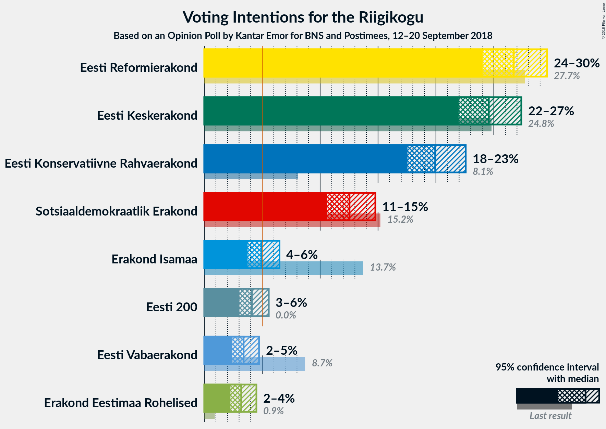

### Confidence Intervals

| Party | Last Result | Poll Result | 80% Confidence Interval | 90% Confidence Interval | 95% Confidence Interval | 99% Confidence Interval |
|:-----:|:-----------:|:-----------:|:-----------------------:|:-----------------------:|:-----------------------:|:-----------------------:|
| Eesti Reformierakond | 27.7% | 26.7% | 25.0–28.6% |24.5–29.1% |24.0–29.6% |23.2–30.5% |
| Eesti Keskerakond | 24.8% | 24.6% | 22.8–26.4% |22.4–26.9% |22.0–27.4% |21.2–28.3% |
| Eesti Konservatiivne Rahvaerakond | 8.1% | 19.9% | 18.4–21.7% |17.9–22.1% |17.5–22.6% |16.8–23.4% |
| Sotsiaaldemokraatlik Erakond | 15.2% | 12.5% | 11.3–14.0% |10.9–14.4% |10.6–14.8% |10.0–15.5% |
| Erakond Isamaa | 13.7% | 4.9% | 4.1–5.9% |3.9–6.2% |3.7–6.5% |3.4–7.0% |
| Eesti 200 | 0.0% | 4.1% | 3.4–5.1% |3.2–5.3% |3.0–5.6% |2.7–6.0% |
| Eesti Vabaerakond | 8.7% | 3.4% | 2.7–4.3% |2.6–4.5% |2.4–4.7% |2.1–5.2% |
| Erakond Eestimaa Rohelised | 0.9% | 3.2% | 2.6–4.0% |2.4–4.3% |2.3–4.5% |2.0–4.9% |

*Note:* The poll result column reflects the actual value used in the calculations. Published results may vary slightly, and in addition be rounded to fewer digits.

## Seats

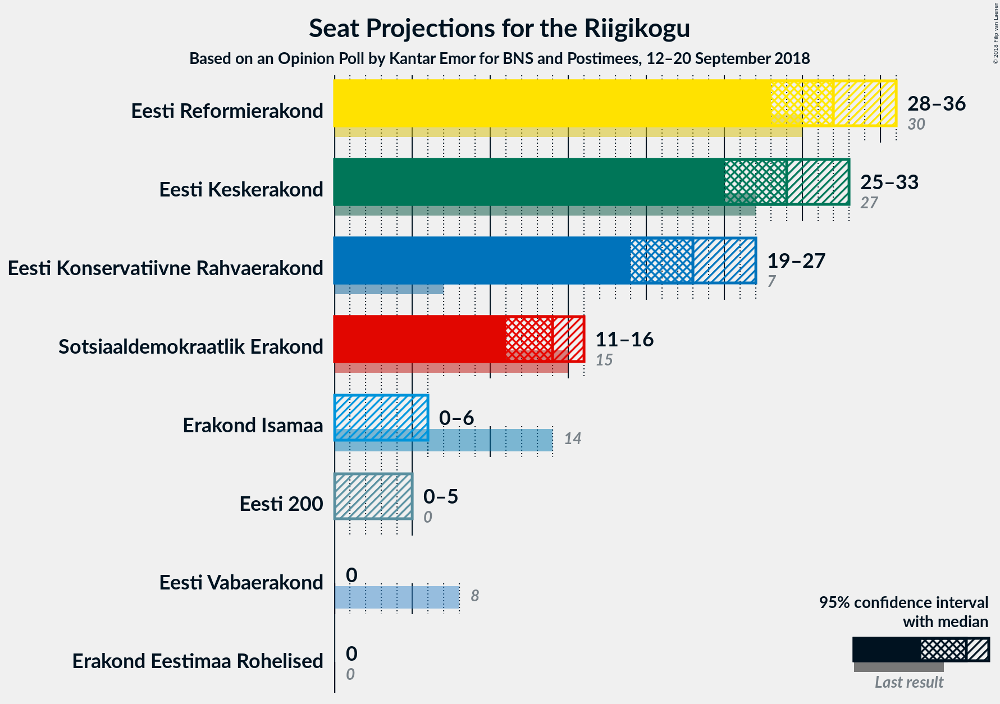

### Confidence Intervals

| Party | Last Result | Median | 80% Confidence Interval | 90% Confidence Interval | 95% Confidence Interval | 99% Confidence Interval |
|:-----:|:-----------:|:------:|:-----------------------:|:-----------------------:|:-----------------------:|:-----------------------:|
| <a href="#eesti-reformierakond">Eesti Reformierakond</a> | 30 | 32 | 30–35 |29–35 |28–36 |27–37 |
| <a href="#eesti-keskerakond">Eesti Keskerakond</a> | 27 | 29 | 27–32 |26–33 |25–33 |24–34 |
| <a href="#eesti-konservatiivne-rahvaerakond">Eesti Konservatiivne Rahvaerakond</a> | 7 | 23 | 21–25 |20–26 |19–27 |19–28 |
| <a href="#sotsiaaldemokraatlik-erakond">Sotsiaaldemokraatlik Erakond</a> | 15 | 14 | 12–15 |11–16 |11–16 |10–17 |
| <a href="#erakond-isamaa">Erakond Isamaa</a> | 14 | 0 | 0–5 |0–6 |0–6 |0–7 |
| <a href="#eesti-200">Eesti 200</a> | 0 | 0 | 0 |0–5 |0–5 |0–6 |
| <a href="#eesti-vabaerakond">Eesti Vabaerakond</a> | 8 | 0 | 0 |0 |0 |0–5 |
| <a href="#erakond-eestimaa-rohelised">Erakond Eestimaa Rohelised</a> | 0 | 0 | 0 |0 |0 |0 |

### Eesti Reformierakond

*For a full overview of the results for this party, see the [Eesti Reformierakond](party-eestireformierakond.html) page.*

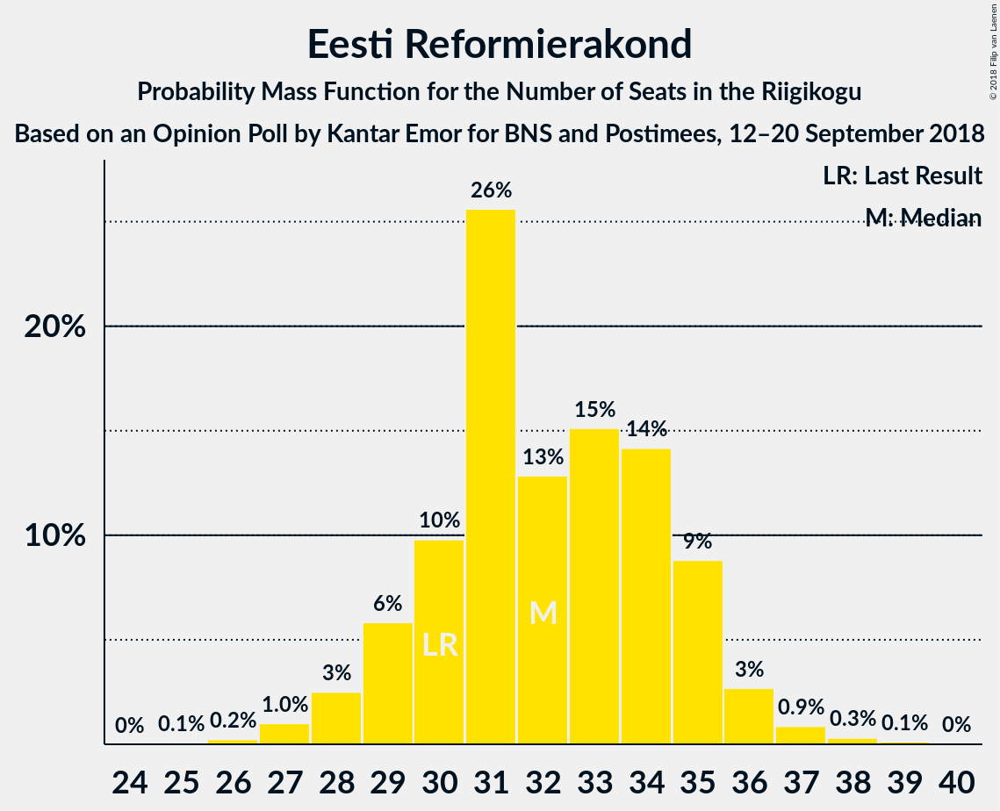

| Number of Seats | Probability | Accumulated | Special Marks |
|:---------------:|:-----------:|:-----------:|:-------------:|
| 25 | 0.1% | 100% |  |
| 26 | 0.2% | 99.9% |  |
| 27 | 1.0% | 99.7% |  |
| 28 | 3% | 98.7% |  |
| 29 | 6% | 96% |  |
| 30 | 10% | 90% | Last Result |
| 31 | 26% | 81% |  |
| 32 | 13% | 55% | Median |
| 33 | 15% | 42% |  |
| 34 | 14% | 27% |  |
| 35 | 9% | 13% |  |
| 36 | 3% | 4% |  |
| 37 | 0.9% | 1.3% |  |
| 38 | 0.3% | 0.5% |  |
| 39 | 0.1% | 0.1% |  |
| 40 | 0% | 0% |  |

### Eesti Keskerakond

*For a full overview of the results for this party, see the [Eesti Keskerakond](party-eestikeskerakond.html) page.*

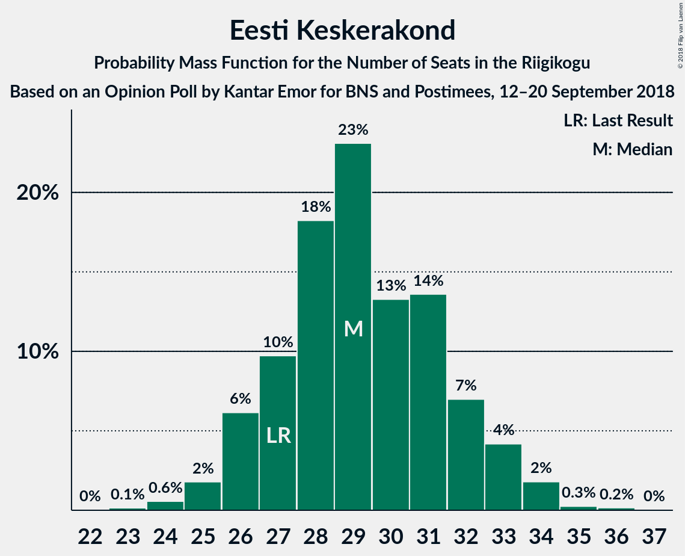

| Number of Seats | Probability | Accumulated | Special Marks |
|:---------------:|:-----------:|:-----------:|:-------------:|
| 23 | 0.1% | 100% |  |
| 24 | 0.6% | 99.8% |  |
| 25 | 2% | 99.3% |  |
| 26 | 6% | 97% |  |
| 27 | 10% | 91% | Last Result |
| 28 | 18% | 82% |  |
| 29 | 23% | 63% | Median |
| 30 | 13% | 40% |  |
| 31 | 14% | 27% |  |
| 32 | 7% | 13% |  |
| 33 | 4% | 6% |  |
| 34 | 2% | 2% |  |
| 35 | 0.3% | 0.4% |  |
| 36 | 0.2% | 0.2% |  |
| 37 | 0% | 0% |  |

### Eesti Konservatiivne Rahvaerakond

*For a full overview of the results for this party, see the [Eesti Konservatiivne Rahvaerakond](party-eestikonservatiivnerahvaerakond.html) page.*

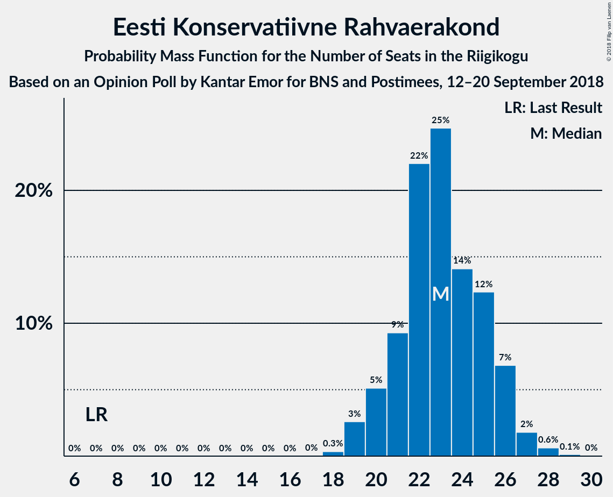

| Number of Seats | Probability | Accumulated | Special Marks |
|:---------------:|:-----------:|:-----------:|:-------------:|
| 7 | 0% | 100% | Last Result |
| 8 | 0% | 100% |  |
| 9 | 0% | 100% |  |
| 10 | 0% | 100% |  |
| 11 | 0% | 100% |  |
| 12 | 0% | 100% |  |
| 13 | 0% | 100% |  |
| 14 | 0% | 100% |  |
| 15 | 0% | 100% |  |
| 16 | 0% | 100% |  |
| 17 | 0% | 100% |  |
| 18 | 0.3% | 100% |  |
| 19 | 3% | 99.6% |  |
| 20 | 5% | 97% |  |
| 21 | 9% | 92% |  |
| 22 | 22% | 83% |  |
| 23 | 25% | 61% | Median |
| 24 | 14% | 36% |  |
| 25 | 12% | 22% |  |
| 26 | 7% | 9% |  |
| 27 | 2% | 3% |  |
| 28 | 0.6% | 0.8% |  |
| 29 | 0.1% | 0.2% |  |
| 30 | 0% | 0% |  |

### Sotsiaaldemokraatlik Erakond

*For a full overview of the results for this party, see the [Sotsiaaldemokraatlik Erakond](party-sotsiaaldemokraatlikerakond.html) page.*

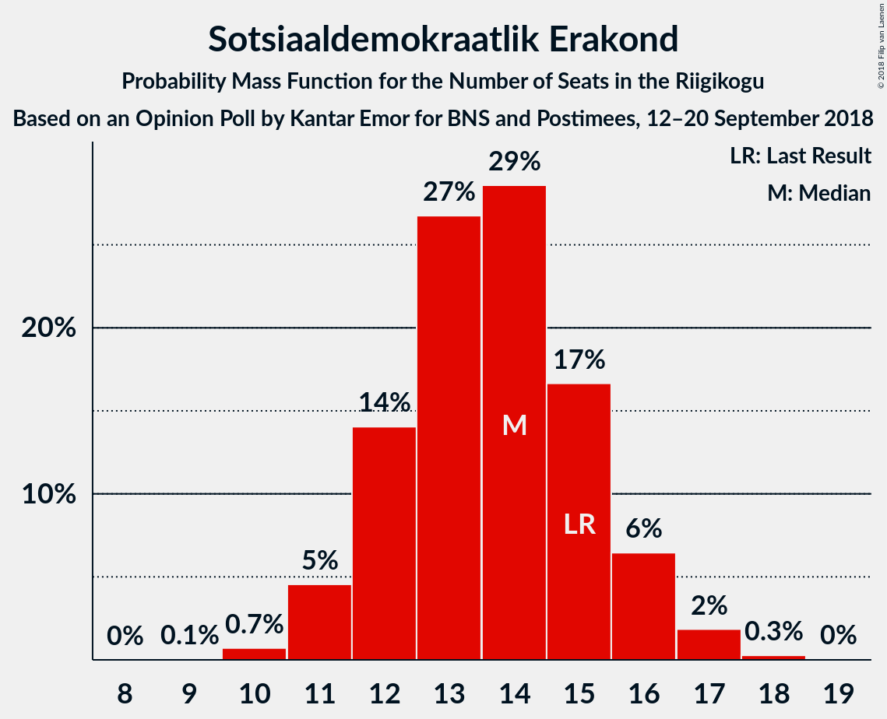

| Number of Seats | Probability | Accumulated | Special Marks |
|:---------------:|:-----------:|:-----------:|:-------------:|
| 9 | 0.1% | 100% |  |
| 10 | 0.7% | 99.9% |  |
| 11 | 5% | 99.2% |  |
| 12 | 14% | 95% |  |
| 13 | 27% | 81% |  |
| 14 | 29% | 54% | Median |
| 15 | 17% | 25% | Last Result |
| 16 | 6% | 9% |  |
| 17 | 2% | 2% |  |
| 18 | 0.3% | 0.3% |  |
| 19 | 0% | 0% |  |

### Erakond Isamaa

*For a full overview of the results for this party, see the [Erakond Isamaa](party-erakondisamaa.html) page.*

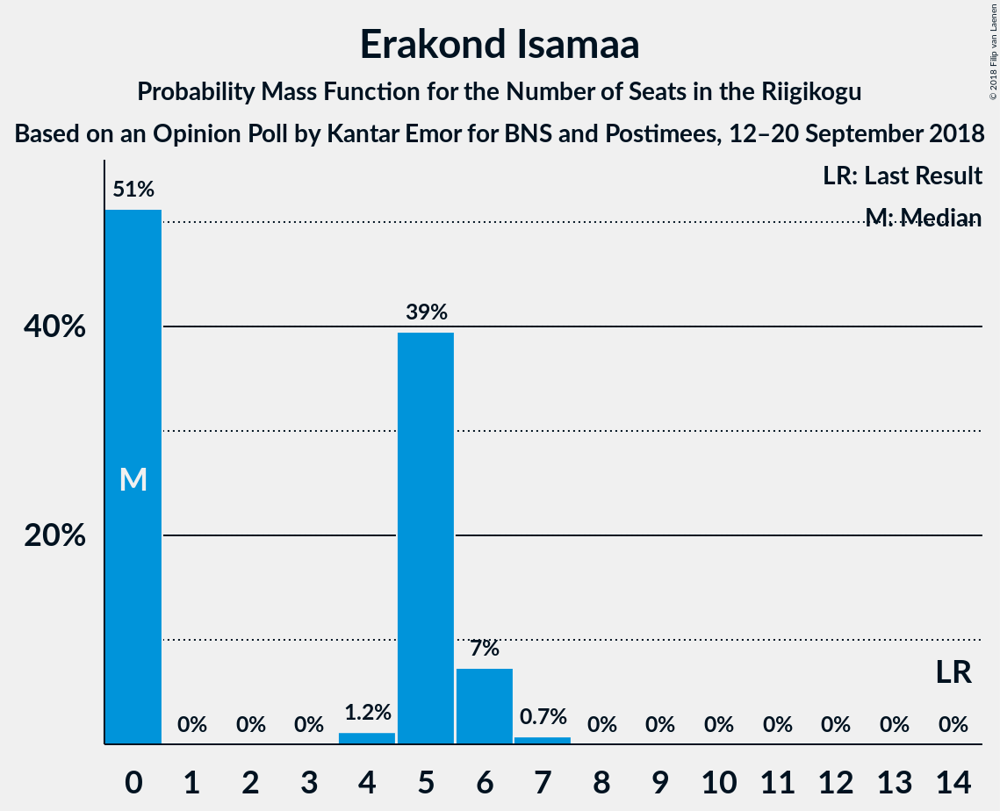

| Number of Seats | Probability | Accumulated | Special Marks |
|:---------------:|:-----------:|:-----------:|:-------------:|
| 0 | 51% | 100% | Median |
| 1 | 0% | 49% |  |
| 2 | 0% | 49% |  |
| 3 | 0% | 49% |  |
| 4 | 1.2% | 49% |  |
| 5 | 39% | 48% |  |
| 6 | 7% | 8% |  |
| 7 | 0.7% | 0.8% |  |
| 8 | 0% | 0% |  |
| 9 | 0% | 0% |  |
| 10 | 0% | 0% |  |
| 11 | 0% | 0% |  |
| 12 | 0% | 0% |  |
| 13 | 0% | 0% |  |
| 14 | 0% | 0% | Last Result |

### Eesti 200

*For a full overview of the results for this party, see the [Eesti 200](party-eesti200.html) page.*

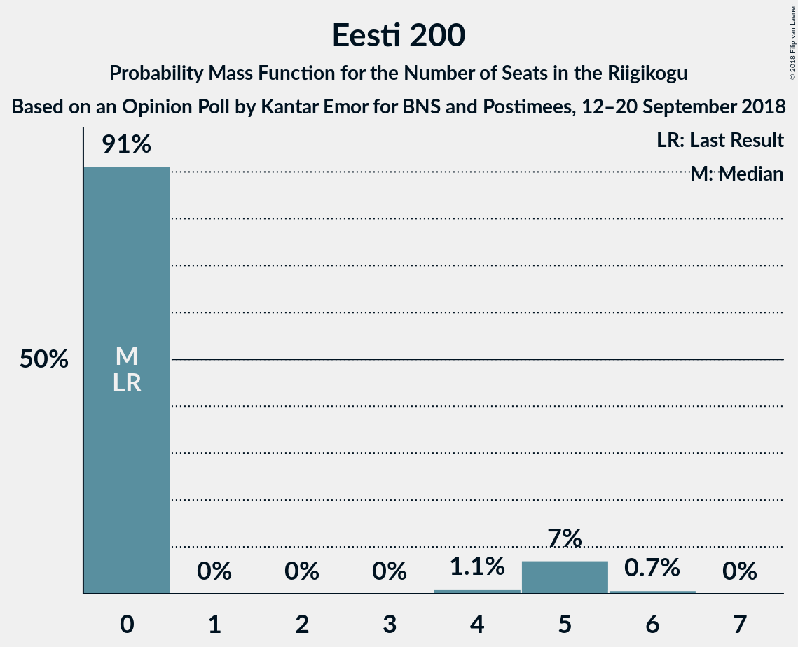

| Number of Seats | Probability | Accumulated | Special Marks |
|:---------------:|:-----------:|:-----------:|:-------------:|
| 0 | 91% | 100% | Last Result, Median |
| 1 | 0% | 9% |  |
| 2 | 0% | 9% |  |
| 3 | 0% | 9% |  |
| 4 | 1.1% | 9% |  |
| 5 | 7% | 8% |  |
| 6 | 0.7% | 0.7% |  |
| 7 | 0% | 0% |  |

### Eesti Vabaerakond

*For a full overview of the results for this party, see the [Eesti Vabaerakond](party-eestivabaerakond.html) page.*

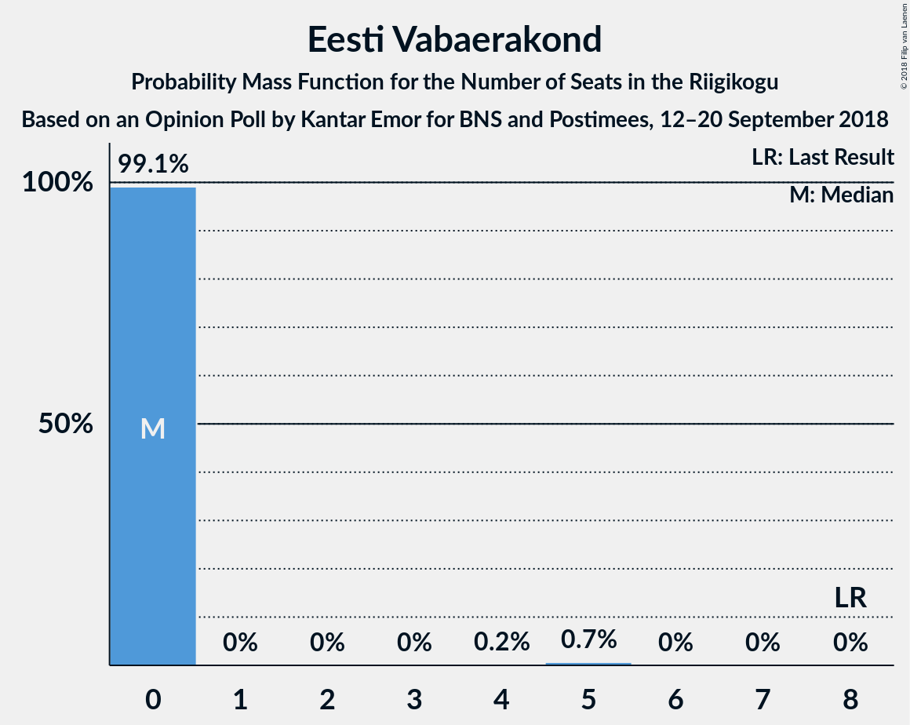

| Number of Seats | Probability | Accumulated | Special Marks |
|:---------------:|:-----------:|:-----------:|:-------------:|
| 0 | 99.1% | 100% | Median |
| 1 | 0% | 0.9% |  |
| 2 | 0% | 0.9% |  |
| 3 | 0% | 0.9% |  |
| 4 | 0.2% | 0.9% |  |
| 5 | 0.7% | 0.7% |  |
| 6 | 0% | 0% |  |
| 7 | 0% | 0% |  |
| 8 | 0% | 0% | Last Result |

### Erakond Eestimaa Rohelised

*For a full overview of the results for this party, see the [Erakond Eestimaa Rohelised](party-erakondeestimaarohelised.html) page.*

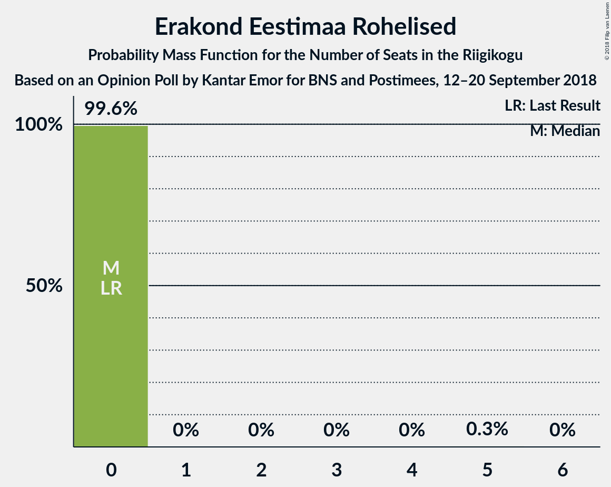

| Number of Seats | Probability | Accumulated | Special Marks |
|:---------------:|:-----------:|:-----------:|:-------------:|
| 0 | 99.6% | 100% | Last Result, Median |
| 1 | 0% | 0.4% |  |
| 2 | 0% | 0.4% |  |
| 3 | 0% | 0.4% |  |
| 4 | 0% | 0.4% |  |
| 5 | 0.3% | 0.3% |  |
| 6 | 0% | 0% |  |

## Coalitions

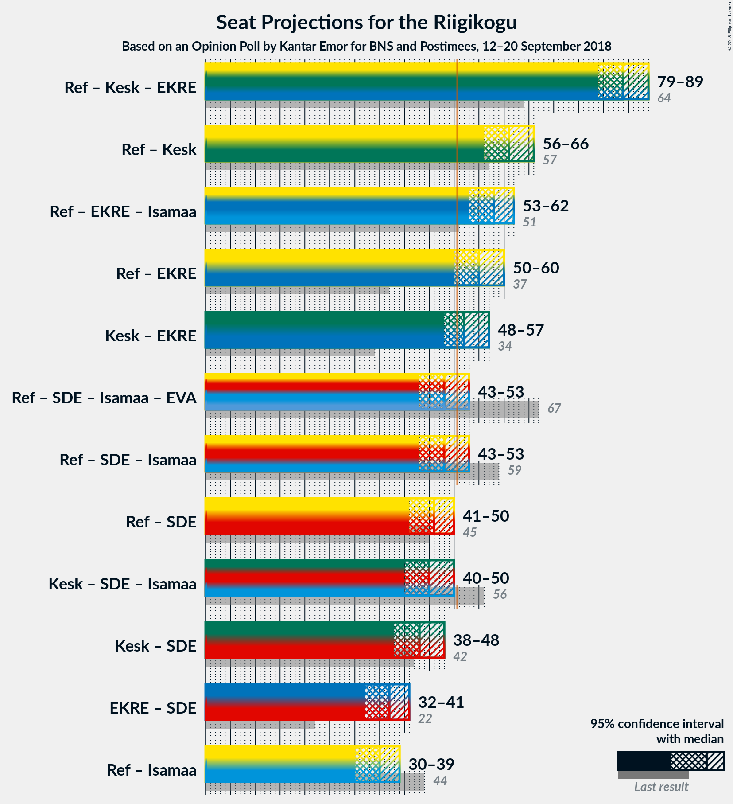

### Confidence Intervals

| Coalition | Last Result | Median | Majority? | 80% Confidence Interval | 90% Confidence Interval | 95% Confidence Interval | 99% Confidence Interval |
|:---------:|:-----------:|:------:|:---------:|:-----------------------:|:-----------------------:|:-----------------------:|:-----------------------:|
| Eesti Reformierakond – Eesti Keskerakond – Eesti Konservatiivne Rahvaerakond | 64 | 84 | 100% | 81–88 | 80–89 | 79–89 | 77–90 |
| Eesti Reformierakond – Eesti Keskerakond | 57 | 61 | 100% | 58–65 | 57–66 | 56–66 | 54–68 |
| Eesti Reformierakond – Eesti Konservatiivne Rahvaerakond – Erakond Isamaa | 51 | 58 | 99.7% | 54–61 | 53–61 | 53–62 | 51–63 |
| Eesti Reformierakond – Eesti Konservatiivne Rahvaerakond | 37 | 55 | 97% | 52–58 | 51–59 | 50–60 | 49–62 |
| Eesti Keskerakond – Eesti Konservatiivne Rahvaerakond | 34 | 52 | 77% | 49–56 | 48–56 | 48–57 | 46–58 |
| Eesti Reformierakond – Sotsiaaldemokraatlik Erakond – Erakond Isamaa – Eesti Vabaerakond | 67 | 48 | 17% | 45–51 | 44–52 | 43–53 | 41–54 |
| Eesti Reformierakond – Sotsiaaldemokraatlik Erakond – Erakond Isamaa | 59 | 48 | 17% | 45–51 | 44–52 | 43–53 | 41–54 |
| Eesti Reformierakond – Sotsiaaldemokraatlik Erakond | 45 | 46 | 2% | 43–49 | 42–49 | 41–50 | 40–52 |
| Eesti Keskerakond – Sotsiaaldemokraatlik Erakond – Erakond Isamaa | 56 | 45 | 2% | 42–48 | 41–49 | 40–50 | 39–51 |
| Eesti Keskerakond – Sotsiaaldemokraatlik Erakond | 42 | 43 | 0% | 40–46 | 39–47 | 38–48 | 37–49 |
| Eesti Konservatiivne Rahvaerakond – Sotsiaaldemokraatlik Erakond | 22 | 37 | 0% | 34–39 | 33–40 | 32–41 | 31–42 |
| Eesti Reformierakond – Erakond Isamaa | 44 | 35 | 0% | 31–38 | 30–39 | 30–39 | 28–41 |

### Eesti Reformierakond – Eesti Keskerakond – Eesti Konservatiivne Rahvaerakond

| Number of Seats | Probability | Accumulated | Special Marks |
|:---------------:|:-----------:|:-----------:|:-------------:|
| 64 | 0% | 100% | Last Result |
| 65 | 0% | 100% |  |
| 66 | 0% | 100% |  |
| 67 | 0% | 100% |  |
| 68 | 0% | 100% |  |
| 69 | 0% | 100% |  |
| 70 | 0% | 100% |  |
| 71 | 0% | 100% |  |
| 72 | 0% | 100% |  |
| 73 | 0% | 100% |  |
| 74 | 0% | 100% |  |
| 75 | 0.1% | 100% |  |
| 76 | 0.3% | 99.9% |  |
| 77 | 0.4% | 99.6% |  |
| 78 | 1.2% | 99.2% |  |
| 79 | 2% | 98% |  |
| 80 | 3% | 96% |  |
| 81 | 7% | 93% |  |
| 82 | 16% | 86% |  |
| 83 | 16% | 70% |  |
| 84 | 8% | 54% | Median |
| 85 | 7% | 46% |  |
| 86 | 11% | 39% |  |
| 87 | 13% | 28% |  |
| 88 | 9% | 15% |  |
| 89 | 5% | 7% |  |
| 90 | 2% | 2% |  |
| 91 | 0.1% | 0.1% |  |
| 92 | 0% | 0% |  |

### Eesti Reformierakond – Eesti Keskerakond

| Number of Seats | Probability | Accumulated | Special Marks |
|:---------------:|:-----------:|:-----------:|:-------------:|
| 52 | 0% | 100% |  |
| 53 | 0.1% | 99.9% |  |
| 54 | 0.6% | 99.8% |  |
| 55 | 1.1% | 99.3% |  |
| 56 | 2% | 98% |  |
| 57 | 4% | 96% | Last Result |
| 58 | 8% | 93% |  |
| 59 | 12% | 85% |  |
| 60 | 14% | 72% |  |
| 61 | 10% | 58% | Median |
| 62 | 13% | 48% |  |
| 63 | 10% | 35% |  |
| 64 | 9% | 24% |  |
| 65 | 9% | 15% |  |
| 66 | 4% | 6% |  |
| 67 | 1.4% | 2% |  |
| 68 | 0.5% | 0.6% |  |
| 69 | 0.1% | 0.1% |  |
| 70 | 0% | 0% |  |

### Eesti Reformierakond – Eesti Konservatiivne Rahvaerakond – Erakond Isamaa

| Number of Seats | Probability | Accumulated | Special Marks |
|:---------------:|:-----------:|:-----------:|:-------------:|
| 49 | 0% | 100% |  |
| 50 | 0.2% | 99.9% |  |
| 51 | 0.5% | 99.7% | Last Result, Majority |
| 52 | 1.1% | 99.2% |  |
| 53 | 5% | 98% |  |
| 54 | 5% | 93% |  |
| 55 | 7% | 88% | Median |
| 56 | 12% | 81% |  |
| 57 | 14% | 69% |  |
| 58 | 15% | 56% |  |
| 59 | 23% | 41% |  |
| 60 | 7% | 18% |  |
| 61 | 7% | 12% |  |
| 62 | 3% | 4% |  |
| 63 | 1.3% | 2% |  |
| 64 | 0.2% | 0.3% |  |
| 65 | 0.1% | 0.1% |  |
| 66 | 0% | 0% |  |

### Eesti Reformierakond – Eesti Konservatiivne Rahvaerakond

| Number of Seats | Probability | Accumulated | Special Marks |
|:---------------:|:-----------:|:-----------:|:-------------:|
| 37 | 0% | 100% | Last Result |
| 38 | 0% | 100% |  |
| 39 | 0% | 100% |  |
| 40 | 0% | 100% |  |
| 41 | 0% | 100% |  |
| 42 | 0% | 100% |  |
| 43 | 0% | 100% |  |
| 44 | 0% | 100% |  |
| 45 | 0% | 100% |  |
| 46 | 0% | 100% |  |
| 47 | 0.1% | 100% |  |
| 48 | 0.3% | 99.8% |  |
| 49 | 0.6% | 99.5% |  |
| 50 | 2% | 98.9% |  |
| 51 | 4% | 97% | Majority |
| 52 | 6% | 93% |  |
| 53 | 12% | 87% |  |
| 54 | 21% | 75% |  |
| 55 | 10% | 54% | Median |
| 56 | 15% | 44% |  |
| 57 | 11% | 29% |  |
| 58 | 10% | 18% |  |
| 59 | 5% | 9% |  |
| 60 | 2% | 4% |  |
| 61 | 0.8% | 1.4% |  |
| 62 | 0.4% | 0.6% |  |
| 63 | 0.1% | 0.2% |  |
| 64 | 0% | 0% |  |

### Eesti Keskerakond – Eesti Konservatiivne Rahvaerakond

| Number of Seats | Probability | Accumulated | Special Marks |
|:---------------:|:-----------:|:-----------:|:-------------:|
| 34 | 0% | 100% | Last Result |
| 35 | 0% | 100% |  |
| 36 | 0% | 100% |  |
| 37 | 0% | 100% |  |
| 38 | 0% | 100% |  |
| 39 | 0% | 100% |  |
| 40 | 0% | 100% |  |
| 41 | 0% | 100% |  |
| 42 | 0% | 100% |  |
| 43 | 0% | 100% |  |
| 44 | 0.1% | 100% |  |
| 45 | 0.2% | 99.9% |  |
| 46 | 0.5% | 99.7% |  |
| 47 | 1.2% | 99.1% |  |
| 48 | 3% | 98% |  |
| 49 | 7% | 95% |  |
| 50 | 10% | 87% |  |
| 51 | 16% | 77% | Majority |
| 52 | 17% | 61% | Median |
| 53 | 13% | 44% |  |
| 54 | 13% | 31% |  |
| 55 | 8% | 18% |  |
| 56 | 6% | 10% |  |
| 57 | 3% | 4% |  |
| 58 | 1.0% | 1.3% |  |
| 59 | 0.2% | 0.3% |  |
| 60 | 0.1% | 0.1% |  |
| 61 | 0% | 0% |  |

### Eesti Reformierakond – Sotsiaaldemokraatlik Erakond – Erakond Isamaa – Eesti Vabaerakond

| Number of Seats | Probability | Accumulated | Special Marks |
|:---------------:|:-----------:|:-----------:|:-------------:|
| 40 | 0.1% | 100% |  |
| 41 | 0.4% | 99.9% |  |
| 42 | 0.6% | 99.5% |  |
| 43 | 2% | 98.9% |  |
| 44 | 3% | 97% |  |
| 45 | 7% | 94% |  |
| 46 | 9% | 87% | Median |
| 47 | 15% | 78% |  |
| 48 | 14% | 63% |  |
| 49 | 17% | 49% |  |
| 50 | 15% | 32% |  |
| 51 | 9% | 17% | Majority |
| 52 | 5% | 8% |  |
| 53 | 2% | 3% |  |
| 54 | 0.7% | 1.1% |  |
| 55 | 0.4% | 0.5% |  |
| 56 | 0.1% | 0.1% |  |
| 57 | 0% | 0% |  |
| 58 | 0% | 0% |  |
| 59 | 0% | 0% |  |
| 60 | 0% | 0% |  |
| 61 | 0% | 0% |  |
| 62 | 0% | 0% |  |
| 63 | 0% | 0% |  |
| 64 | 0% | 0% |  |
| 65 | 0% | 0% |  |
| 66 | 0% | 0% |  |
| 67 | 0% | 0% | Last Result |

### Eesti Reformierakond – Sotsiaaldemokraatlik Erakond – Erakond Isamaa

| Number of Seats | Probability | Accumulated | Special Marks |
|:---------------:|:-----------:|:-----------:|:-------------:|
| 40 | 0.1% | 100% |  |
| 41 | 0.4% | 99.9% |  |
| 42 | 0.6% | 99.4% |  |
| 43 | 2% | 98.9% |  |
| 44 | 3% | 97% |  |
| 45 | 7% | 94% |  |
| 46 | 9% | 86% | Median |
| 47 | 15% | 77% |  |
| 48 | 13% | 62% |  |
| 49 | 17% | 49% |  |
| 50 | 15% | 32% |  |
| 51 | 8% | 17% | Majority |
| 52 | 5% | 8% |  |
| 53 | 2% | 3% |  |
| 54 | 0.6% | 1.1% |  |
| 55 | 0.3% | 0.4% |  |
| 56 | 0.1% | 0.1% |  |
| 57 | 0% | 0% |  |
| 58 | 0% | 0% |  |
| 59 | 0% | 0% | Last Result |

### Eesti Reformierakond – Sotsiaaldemokraatlik Erakond

| Number of Seats | Probability | Accumulated | Special Marks |
|:---------------:|:-----------:|:-----------:|:-------------:|
| 38 | 0.1% | 100% |  |
| 39 | 0.2% | 99.9% |  |
| 40 | 1.4% | 99.6% |  |
| 41 | 2% | 98% |  |
| 42 | 5% | 96% |  |
| 43 | 7% | 91% |  |
| 44 | 13% | 85% |  |
| 45 | 20% | 71% | Last Result |
| 46 | 14% | 52% | Median |
| 47 | 15% | 38% |  |
| 48 | 10% | 22% |  |
| 49 | 9% | 13% |  |
| 50 | 2% | 4% |  |
| 51 | 2% | 2% | Majority |
| 52 | 0.4% | 0.6% |  |
| 53 | 0.2% | 0.2% |  |
| 54 | 0% | 0% |  |

### Eesti Keskerakond – Sotsiaaldemokraatlik Erakond – Erakond Isamaa

| Number of Seats | Probability | Accumulated | Special Marks |
|:---------------:|:-----------:|:-----------:|:-------------:|
| 37 | 0.1% | 100% |  |
| 38 | 0.2% | 99.9% |  |
| 39 | 0.7% | 99.7% |  |
| 40 | 2% | 98.9% |  |
| 41 | 4% | 97% |  |
| 42 | 7% | 94% |  |
| 43 | 11% | 87% | Median |
| 44 | 12% | 76% |  |
| 45 | 15% | 64% |  |
| 46 | 9% | 48% |  |
| 47 | 20% | 39% |  |
| 48 | 10% | 19% |  |
| 49 | 5% | 9% |  |
| 50 | 3% | 4% |  |
| 51 | 1.3% | 2% | Majority |
| 52 | 0.3% | 0.4% |  |
| 53 | 0.1% | 0.1% |  |
| 54 | 0% | 0% |  |
| 55 | 0% | 0% |  |
| 56 | 0% | 0% | Last Result |

### Eesti Keskerakond – Sotsiaaldemokraatlik Erakond

| Number of Seats | Probability | Accumulated | Special Marks |
|:---------------:|:-----------:|:-----------:|:-------------:|
| 35 | 0.1% | 100% |  |
| 36 | 0.2% | 99.9% |  |
| 37 | 0.6% | 99.7% |  |
| 38 | 2% | 99.2% |  |
| 39 | 4% | 97% |  |
| 40 | 9% | 93% |  |
| 41 | 8% | 84% |  |
| 42 | 24% | 76% | Last Result |
| 43 | 15% | 52% | Median |
| 44 | 13% | 37% |  |
| 45 | 11% | 24% |  |
| 46 | 5% | 13% |  |
| 47 | 4% | 8% |  |
| 48 | 4% | 4% |  |
| 49 | 0.4% | 0.6% |  |
| 50 | 0.2% | 0.2% |  |
| 51 | 0% | 0% | Majority |

### Eesti Konservatiivne Rahvaerakond – Sotsiaaldemokraatlik Erakond

| Number of Seats | Probability | Accumulated | Special Marks |
|:---------------:|:-----------:|:-----------:|:-------------:|
| 22 | 0% | 100% | Last Result |
| 23 | 0% | 100% |  |
| 24 | 0% | 100% |  |
| 25 | 0% | 100% |  |
| 26 | 0% | 100% |  |
| 27 | 0% | 100% |  |
| 28 | 0% | 100% |  |
| 29 | 0% | 100% |  |
| 30 | 0.1% | 100% |  |
| 31 | 0.8% | 99.9% |  |
| 32 | 2% | 99.1% |  |
| 33 | 6% | 97% |  |
| 34 | 7% | 91% |  |
| 35 | 12% | 84% |  |
| 36 | 19% | 72% |  |
| 37 | 19% | 53% | Median |
| 38 | 13% | 34% |  |
| 39 | 11% | 21% |  |
| 40 | 5% | 10% |  |
| 41 | 4% | 5% |  |
| 42 | 0.9% | 1.2% |  |
| 43 | 0.2% | 0.3% |  |
| 44 | 0.1% | 0.1% |  |
| 45 | 0% | 0% |  |

### Eesti Reformierakond – Erakond Isamaa

| Number of Seats | Probability | Accumulated | Special Marks |
|:---------------:|:-----------:|:-----------:|:-------------:|
| 27 | 0.1% | 100% |  |
| 28 | 0.5% | 99.8% |  |
| 29 | 1.4% | 99.3% |  |
| 30 | 3% | 98% |  |
| 31 | 8% | 95% |  |
| 32 | 8% | 87% | Median |
| 33 | 11% | 79% |  |
| 34 | 14% | 67% |  |
| 35 | 15% | 53% |  |
| 36 | 19% | 39% |  |
| 37 | 7% | 20% |  |
| 38 | 5% | 13% |  |
| 39 | 6% | 8% |  |
| 40 | 1.1% | 2% |  |
| 41 | 0.7% | 0.9% |  |
| 42 | 0.1% | 0.1% |  |
| 43 | 0% | 0% |  |
| 44 | 0% | 0% | Last Result |

## Technical Information

### Opinion Poll

+ **Polling firm:** Kantar Emor
+ **Commissioner(s):** BNS and Postimees
+ **Fieldwork period:** 12–20 September 2018

### Calculations

+ **Sample size:** 973
+ **Simulations done:** 1,048,576
+ **Error estimate:** 0.62%

