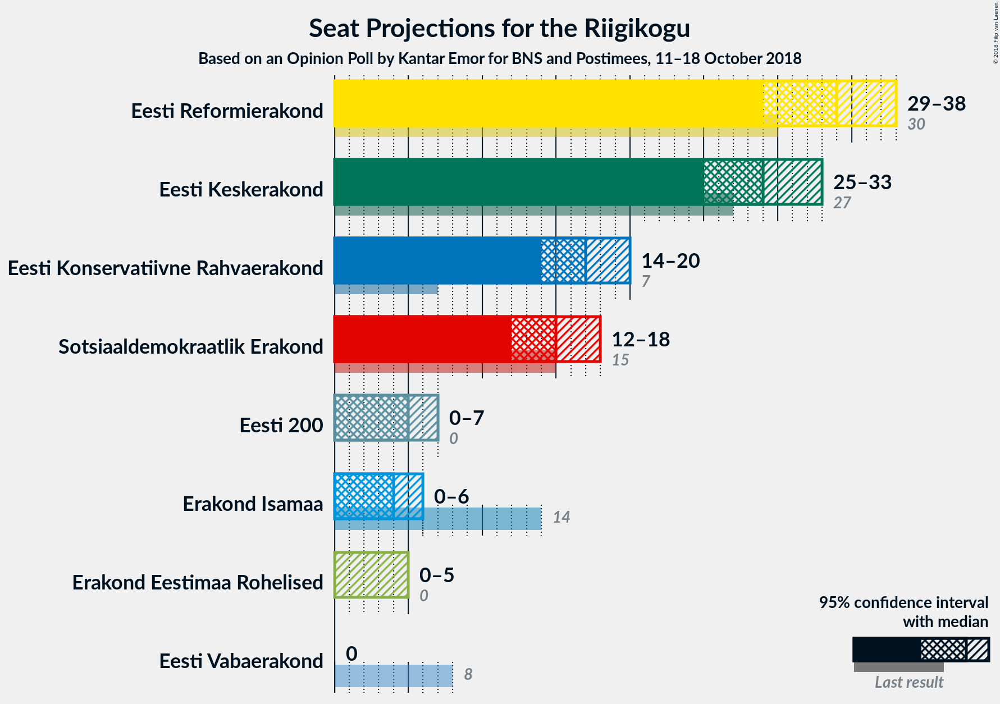
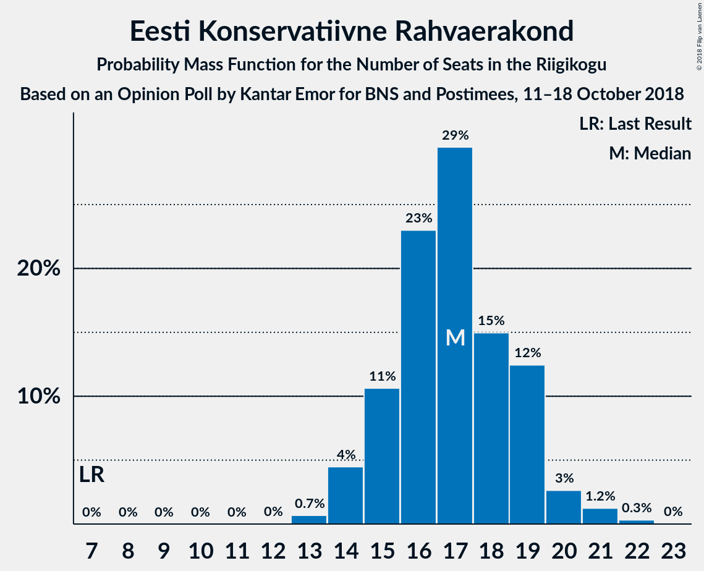
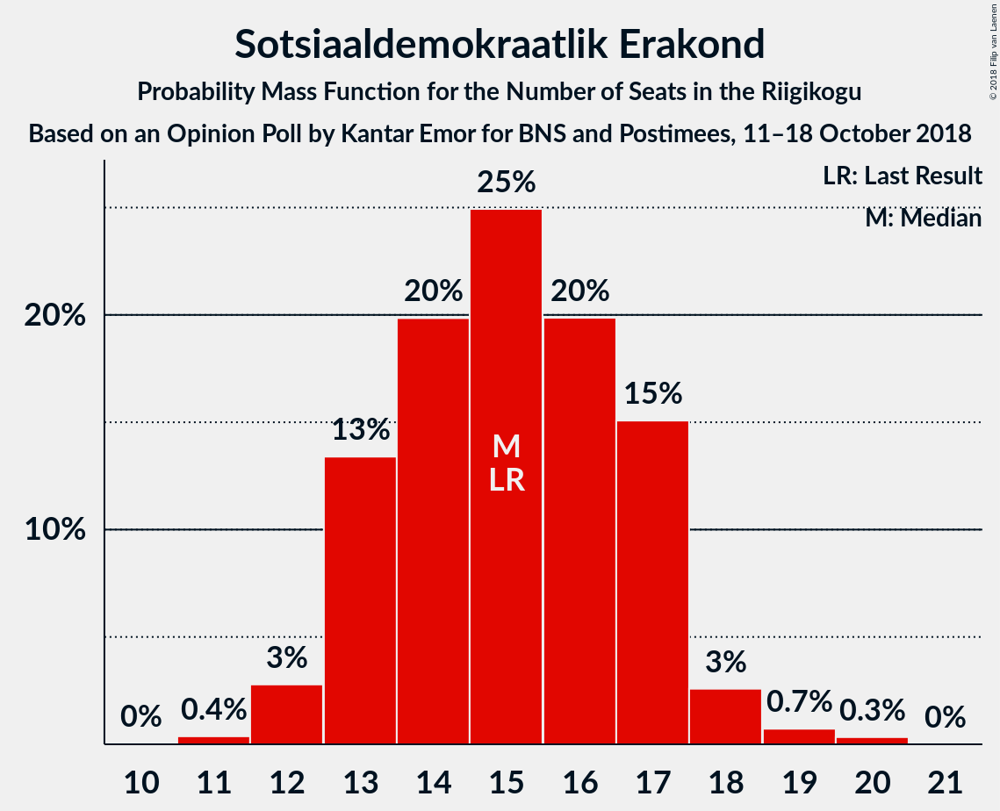
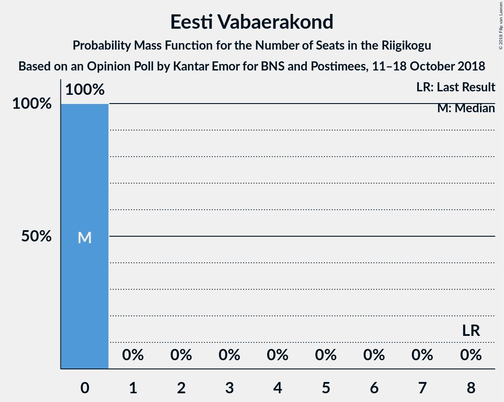
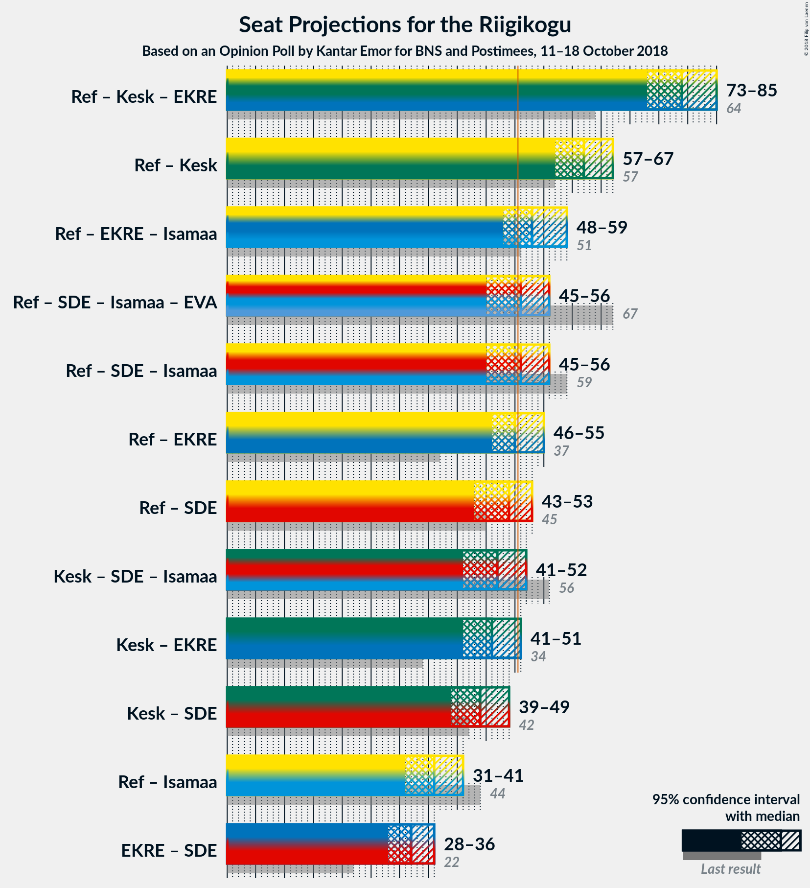

# Opinion Poll by Kantar Emor for BNS and Postimees, 11–18 October 2018

<a href="#voting-intentions">Voting Intentions</a> | <a href="#seats">Seats</a> | <a href="#coalitions">Coalitions</a> | <a href="#technical-information">Technical Information</a>

## Voting Intentions

### Confidence Intervals

| Party | Last Result | Poll Result | 80% Confidence Interval | 90% Confidence Interval | 95% Confidence Interval | 99% Confidence Interval |
|:-----:|:-----------:|:-----------:|:-----------------------:|:-----------------------:|:-----------------------:|:-----------------------:|
| Eesti Reformierakond | 27.7% | 28.4% | 26.6–30.3% |26.1–30.9% |25.6–31.4% |24.8–32.3% |
| Eesti Keskerakond | 24.8% | 25.2% | 23.4–27.0% |22.9–27.6% |22.5–28.0% |21.7–28.9% |
| Eesti Konservatiivne Rahvaerakond | 8.1% | 15.8% | 14.4–17.4% |14.0–17.9% |13.6–18.3% |13.0–19.1% |
| Sotsiaaldemokraatlik Erakond | 15.2% | 14.0% | 12.7–15.6% |12.3–16.0% |12.0–16.4% |11.4–17.2% |
| Eesti 200 | 0.0% | 5.5% | 4.6–6.5% |4.4–6.8% |4.2–7.1% |3.8–7.6% |
| Erakond Isamaa | 13.7% | 5.1% | 4.3–6.2% |4.1–6.5% |3.9–6.7% |3.6–7.3% |
| Erakond Eestimaa Rohelised | 0.9% | 4.0% | 3.3–4.9% |3.1–5.2% |2.9–5.4% |2.6–5.9% |
| Eesti Vabaerakond | 8.7% | 1.8% | 1.3–2.5% |1.2–2.7% |1.1–2.8% |0.9–3.2% |

*Note:* The poll result column reflects the actual value used in the calculations. Published results may vary slightly, and in addition be rounded to fewer digits.

## Seats

### Confidence Intervals

| Party | Last Result | Median | 80% Confidence Interval | 90% Confidence Interval | 95% Confidence Interval | 99% Confidence Interval |
|:-----:|:-----------:|:------:|:-----------------------:|:-----------------------:|:-----------------------:|:-----------------------:|
| <a href="#eesti-reformierakond">Eesti Reformierakond</a> | 30 | 34 | 30–36 |30–37 |29–38 |28–39 |
| <a href="#eesti-keskerakond">Eesti Keskerakond</a> | 27 | 29 | 26–31 |26–32 |25–33 |24–34 |
| <a href="#eesti-konservatiivne-rahvaerakond">Eesti Konservatiivne Rahvaerakond</a> | 7 | 17 | 15–19 |14–19 |14–20 |13–21 |
| <a href="#sotsiaaldemokraatlik-erakond">Sotsiaaldemokraatlik Erakond</a> | 15 | 15 | 13–17 |13–17 |12–18 |12–19 |
| <a href="#eesti-200">Eesti 200</a> | 0 | 5 | 0–6 |0–6 |0–7 |0–7 |
| <a href="#erakond-isamaa">Erakond Isamaa</a> | 14 | 4 | 0–6 |0–6 |0–6 |0–7 |
| <a href="#erakond-eestimaa-rohelised">Erakond Eestimaa Rohelised</a> | 0 | 0 | 0 |0–4 |0–5 |0–5 |
| <a href="#eesti-vabaerakond">Eesti Vabaerakond</a> | 8 | 0 | 0 |0 |0 |0 |

### Eesti Reformierakond

*For a full overview of the results for this party, see the [Eesti Reformierakond](party-eestireformierakond.html) page.*

| Number of Seats | Probability | Accumulated | Special Marks |
|:---------------:|:-----------:|:-----------:|:-------------:|
| 27 | 0.2% | 100% |  |
| 28 | 0.8% | 99.7% |  |
| 29 | 3% | 99.0% |  |
| 30 | 6% | 96% | Last Result |
| 31 | 11% | 90% |  |
| 32 | 10% | 79% |  |
| 33 | 17% | 69% |  |
| 34 | 25% | 52% | Median |
| 35 | 13% | 27% |  |
| 36 | 6% | 13% |  |
| 37 | 5% | 7% |  |
| 38 | 2% | 3% |  |
| 39 | 0.8% | 1.0% |  |
| 40 | 0.2% | 0.2% |  |
| 41 | 0% | 0% |  |

### Eesti Keskerakond

*For a full overview of the results for this party, see the [Eesti Keskerakond](party-eestikeskerakond.html) page.*

| Number of Seats | Probability | Accumulated | Special Marks |
|:---------------:|:-----------:|:-----------:|:-------------:|
| 23 | 0.2% | 100% |  |
| 24 | 0.9% | 99.7% |  |
| 25 | 3% | 98.8% |  |
| 26 | 6% | 95% |  |
| 27 | 13% | 90% | Last Result |
| 28 | 19% | 77% |  |
| 29 | 21% | 58% | Median |
| 30 | 24% | 38% |  |
| 31 | 7% | 14% |  |
| 32 | 4% | 7% |  |
| 33 | 2% | 4% |  |
| 34 | 0.7% | 1.2% |  |
| 35 | 0.4% | 0.5% |  |
| 36 | 0% | 0.1% |  |
| 37 | 0% | 0% |  |

### Eesti Konservatiivne Rahvaerakond

*For a full overview of the results for this party, see the [Eesti Konservatiivne Rahvaerakond](party-eestikonservatiivnerahvaerakond.html) page.*

| Number of Seats | Probability | Accumulated | Special Marks |
|:---------------:|:-----------:|:-----------:|:-------------:|
| 7 | 0% | 100% | Last Result |
| 8 | 0% | 100% |  |
| 9 | 0% | 100% |  |
| 10 | 0% | 100% |  |
| 11 | 0% | 100% |  |
| 12 | 0% | 100% |  |
| 13 | 0.7% | 100% |  |
| 14 | 4% | 99.3% |  |
| 15 | 11% | 95% |  |
| 16 | 23% | 84% |  |
| 17 | 29% | 61% | Median |
| 18 | 15% | 32% |  |
| 19 | 12% | 17% |  |
| 20 | 3% | 4% |  |
| 21 | 1.2% | 2% |  |
| 22 | 0.3% | 0.4% |  |
| 23 | 0% | 0% |  |

### Sotsiaaldemokraatlik Erakond

*For a full overview of the results for this party, see the [Sotsiaaldemokraatlik Erakond](party-sotsiaaldemokraatlikerakond.html) page.*

| Number of Seats | Probability | Accumulated | Special Marks |
|:---------------:|:-----------:|:-----------:|:-------------:|
| 11 | 0.4% | 100% |  |
| 12 | 3% | 99.6% |  |
| 13 | 13% | 97% |  |
| 14 | 20% | 83% |  |
| 15 | 25% | 64% | Last Result, Median |
| 16 | 20% | 39% |  |
| 17 | 15% | 19% |  |
| 18 | 3% | 4% |  |
| 19 | 0.7% | 1.1% |  |
| 20 | 0.3% | 0.3% |  |
| 21 | 0% | 0% |  |

### Eesti 200

*For a full overview of the results for this party, see the [Eesti 200](party-eesti200.html) page.*

| Number of Seats | Probability | Accumulated | Special Marks |
|:---------------:|:-----------:|:-----------:|:-------------:|
| 0 | 29% | 100% | Last Result |
| 1 | 0% | 71% |  |
| 2 | 0% | 71% |  |
| 3 | 0% | 71% |  |
| 4 | 9% | 71% |  |
| 5 | 45% | 62% | Median |
| 6 | 14% | 17% |  |
| 7 | 3% | 3% |  |
| 8 | 0.2% | 0.2% |  |
| 9 | 0% | 0% |  |

### Erakond Isamaa

*For a full overview of the results for this party, see the [Erakond Isamaa](party-erakondisamaa.html) page.*

| Number of Seats | Probability | Accumulated | Special Marks |
|:---------------:|:-----------:|:-----------:|:-------------:|
| 0 | 43% | 100% |  |
| 1 | 0% | 57% |  |
| 2 | 0% | 57% |  |
| 3 | 0% | 57% |  |
| 4 | 12% | 57% | Median |
| 5 | 32% | 45% |  |
| 6 | 12% | 13% |  |
| 7 | 1.3% | 1.3% |  |
| 8 | 0% | 0.1% |  |
| 9 | 0% | 0% |  |
| 10 | 0% | 0% |  |
| 11 | 0% | 0% |  |
| 12 | 0% | 0% |  |
| 13 | 0% | 0% |  |
| 14 | 0% | 0% | Last Result |

### Erakond Eestimaa Rohelised

*For a full overview of the results for this party, see the [Erakond Eestimaa Rohelised](party-erakondeestimaarohelised.html) page.*

| Number of Seats | Probability | Accumulated | Special Marks |
|:---------------:|:-----------:|:-----------:|:-------------:|
| 0 | 93% | 100% | Last Result, Median |
| 1 | 0% | 7% |  |
| 2 | 0% | 7% |  |
| 3 | 0% | 7% |  |
| 4 | 3% | 7% |  |
| 5 | 3% | 3% |  |
| 6 | 0.2% | 0.2% |  |
| 7 | 0% | 0% |  |

### Eesti Vabaerakond

*For a full overview of the results for this party, see the [Eesti Vabaerakond](party-eestivabaerakond.html) page.*

| Number of Seats | Probability | Accumulated | Special Marks |
|:---------------:|:-----------:|:-----------:|:-------------:|
| 0 | 100% | 100% | Median |
| 1 | 0% | 0% |  |
| 2 | 0% | 0% |  |
| 3 | 0% | 0% |  |
| 4 | 0% | 0% |  |
| 5 | 0% | 0% |  |
| 6 | 0% | 0% |  |
| 7 | 0% | 0% |  |
| 8 | 0% | 0% | Last Result |

## Coalitions

### Confidence Intervals

| Coalition | Last Result | Median | Majority? | 80% Confidence Interval | 90% Confidence Interval | 95% Confidence Interval | 99% Confidence Interval |
|:---------:|:-----------:|:------:|:---------:|:-----------------------:|:-----------------------:|:-----------------------:|:-----------------------:|
| Eesti Reformierakond – Eesti Keskerakond – Eesti Konservatiivne Rahvaerakond | 64 | 79 | 100% | 75–83 | 74–85 | 73–85 | 72–87 |
| Eesti Reformierakond – Eesti Keskerakond | 57 | 62 | 100% | 58–66 | 58–67 | 57–67 | 55–69 |
| Eesti Reformierakond – Eesti Konservatiivne Rahvaerakond – Erakond Isamaa | 51 | 53 | 83% | 50–57 | 49–58 | 48–59 | 47–60 |
| Eesti Reformierakond – Sotsiaaldemokraatlik Erakond – Erakond Isamaa – Eesti Vabaerakond | 67 | 51 | 60% | 48–54 | 47–55 | 45–56 | 44–58 |
| Eesti Reformierakond – Sotsiaaldemokraatlik Erakond – Erakond Isamaa | 59 | 51 | 60% | 48–54 | 47–55 | 45–56 | 44–58 |
| Eesti Reformierakond – Eesti Konservatiivne Rahvaerakond | 37 | 50 | 46% | 47–53 | 46–55 | 46–55 | 44–58 |
| Eesti Reformierakond – Sotsiaaldemokraatlik Erakond | 45 | 49 | 20% | 45–52 | 44–53 | 43–53 | 42–54 |
| Eesti Keskerakond – Sotsiaaldemokraatlik Erakond – Erakond Isamaa | 56 | 47 | 8% | 43–50 | 43–51 | 41–52 | 40–54 |
| Eesti Keskerakond – Eesti Konservatiivne Rahvaerakond | 34 | 46 | 4% | 43–49 | 42–50 | 41–51 | 40–52 |
| Eesti Keskerakond – Sotsiaaldemokraatlik Erakond | 42 | 44 | 0.7% | 41–46 | 40–48 | 39–49 | 38–51 |
| Eesti Reformierakond – Erakond Isamaa | 44 | 36 | 0% | 33–39 | 32–40 | 31–41 | 30–43 |
| Eesti Konservatiivne Rahvaerakond – Sotsiaaldemokraatlik Erakond | 22 | 32 | 0% | 29–34 | 28–35 | 28–36 | 27–37 |

### Eesti Reformierakond – Eesti Keskerakond – Eesti Konservatiivne Rahvaerakond

| Number of Seats | Probability | Accumulated | Special Marks |
|:---------------:|:-----------:|:-----------:|:-------------:|
| 64 | 0% | 100% | Last Result |
| 65 | 0% | 100% |  |
| 66 | 0% | 100% |  |
| 67 | 0% | 100% |  |
| 68 | 0% | 100% |  |
| 69 | 0% | 100% |  |
| 70 | 0.1% | 100% |  |
| 71 | 0.4% | 99.9% |  |
| 72 | 0.7% | 99.5% |  |
| 73 | 2% | 98.9% |  |
| 74 | 3% | 97% |  |
| 75 | 4% | 94% |  |
| 76 | 8% | 90% |  |
| 77 | 13% | 81% |  |
| 78 | 8% | 68% |  |
| 79 | 17% | 60% |  |
| 80 | 12% | 44% | Median |
| 81 | 14% | 32% |  |
| 82 | 3% | 18% |  |
| 83 | 7% | 14% |  |
| 84 | 2% | 8% |  |
| 85 | 4% | 6% |  |
| 86 | 1.1% | 2% |  |
| 87 | 0.5% | 1.0% |  |
| 88 | 0.5% | 0.5% |  |
| 89 | 0% | 0% |  |

### Eesti Reformierakond – Eesti Keskerakond

| Number of Seats | Probability | Accumulated | Special Marks |
|:---------------:|:-----------:|:-----------:|:-------------:|
| 54 | 0.1% | 100% |  |
| 55 | 0.4% | 99.8% |  |
| 56 | 2% | 99.5% |  |
| 57 | 2% | 98% | Last Result |
| 58 | 6% | 95% |  |
| 59 | 5% | 90% |  |
| 60 | 12% | 85% |  |
| 61 | 6% | 72% |  |
| 62 | 23% | 66% |  |
| 63 | 14% | 43% | Median |
| 64 | 12% | 30% |  |
| 65 | 4% | 17% |  |
| 66 | 7% | 13% |  |
| 67 | 4% | 6% |  |
| 68 | 1.3% | 2% |  |
| 69 | 0.7% | 1.1% |  |
| 70 | 0.2% | 0.4% |  |
| 71 | 0.1% | 0.2% |  |
| 72 | 0.1% | 0.1% |  |
| 73 | 0% | 0% |  |

### Eesti Reformierakond – Eesti Konservatiivne Rahvaerakond – Erakond Isamaa

| Number of Seats | Probability | Accumulated | Special Marks |
|:---------------:|:-----------:|:-----------:|:-------------:|
| 45 | 0.1% | 100% |  |
| 46 | 0.3% | 99.8% |  |
| 47 | 1.1% | 99.5% |  |
| 48 | 2% | 98% |  |
| 49 | 3% | 97% |  |
| 50 | 11% | 94% |  |
| 51 | 12% | 83% | Last Result, Majority |
| 52 | 17% | 71% |  |
| 53 | 13% | 54% |  |
| 54 | 8% | 41% |  |
| 55 | 12% | 33% | Median |
| 56 | 7% | 21% |  |
| 57 | 6% | 14% |  |
| 58 | 5% | 8% |  |
| 59 | 2% | 3% |  |
| 60 | 0.4% | 0.7% |  |
| 61 | 0.2% | 0.2% |  |
| 62 | 0% | 0% |  |

### Eesti Reformierakond – Sotsiaaldemokraatlik Erakond – Erakond Isamaa – Eesti Vabaerakond

| Number of Seats | Probability | Accumulated | Special Marks |
|:---------------:|:-----------:|:-----------:|:-------------:|
| 42 | 0% | 100% |  |
| 43 | 0.2% | 99.9% |  |
| 44 | 0.6% | 99.7% |  |
| 45 | 2% | 99.1% |  |
| 46 | 2% | 97% |  |
| 47 | 4% | 96% |  |
| 48 | 4% | 92% |  |
| 49 | 10% | 88% |  |
| 50 | 18% | 78% |  |
| 51 | 10% | 60% | Majority |
| 52 | 14% | 49% |  |
| 53 | 17% | 36% | Median |
| 54 | 9% | 19% |  |
| 55 | 5% | 10% |  |
| 56 | 3% | 4% |  |
| 57 | 0.7% | 1.4% |  |
| 58 | 0.6% | 0.7% |  |
| 59 | 0% | 0.1% |  |
| 60 | 0.1% | 0.1% |  |
| 61 | 0% | 0% |  |
| 62 | 0% | 0% |  |
| 63 | 0% | 0% |  |
| 64 | 0% | 0% |  |
| 65 | 0% | 0% |  |
| 66 | 0% | 0% |  |
| 67 | 0% | 0% | Last Result |

### Eesti Reformierakond – Sotsiaaldemokraatlik Erakond – Erakond Isamaa

| Number of Seats | Probability | Accumulated | Special Marks |
|:---------------:|:-----------:|:-----------:|:-------------:|
| 42 | 0% | 100% |  |
| 43 | 0.2% | 99.9% |  |
| 44 | 0.6% | 99.7% |  |
| 45 | 2% | 99.1% |  |
| 46 | 2% | 97% |  |
| 47 | 4% | 96% |  |
| 48 | 4% | 92% |  |
| 49 | 10% | 88% |  |
| 50 | 18% | 78% |  |
| 51 | 10% | 60% | Majority |
| 52 | 14% | 49% |  |
| 53 | 17% | 36% | Median |
| 54 | 9% | 19% |  |
| 55 | 5% | 10% |  |
| 56 | 3% | 4% |  |
| 57 | 0.7% | 1.4% |  |
| 58 | 0.6% | 0.7% |  |
| 59 | 0% | 0.1% | Last Result |
| 60 | 0.1% | 0.1% |  |
| 61 | 0% | 0% |  |

### Eesti Reformierakond – Eesti Konservatiivne Rahvaerakond

| Number of Seats | Probability | Accumulated | Special Marks |
|:---------------:|:-----------:|:-----------:|:-------------:|
| 37 | 0% | 100% | Last Result |
| 38 | 0% | 100% |  |
| 39 | 0% | 100% |  |
| 40 | 0% | 100% |  |
| 41 | 0% | 100% |  |
| 42 | 0% | 100% |  |
| 43 | 0.3% | 99.9% |  |
| 44 | 0.8% | 99.6% |  |
| 45 | 1.1% | 98.8% |  |
| 46 | 5% | 98% |  |
| 47 | 6% | 92% |  |
| 48 | 10% | 86% |  |
| 49 | 11% | 76% |  |
| 50 | 19% | 65% |  |
| 51 | 14% | 46% | Median, Majority |
| 52 | 15% | 32% |  |
| 53 | 8% | 17% |  |
| 54 | 3% | 9% |  |
| 55 | 4% | 6% |  |
| 56 | 0.8% | 2% |  |
| 57 | 0.7% | 1.4% |  |
| 58 | 0.6% | 0.7% |  |
| 59 | 0.1% | 0.1% |  |
| 60 | 0% | 0% |  |

### Eesti Reformierakond – Sotsiaaldemokraatlik Erakond

| Number of Seats | Probability | Accumulated | Special Marks |
|:---------------:|:-----------:|:-----------:|:-------------:|
| 40 | 0.1% | 100% |  |
| 41 | 0.2% | 99.9% |  |
| 42 | 1.0% | 99.7% |  |
| 43 | 2% | 98.6% |  |
| 44 | 3% | 97% |  |
| 45 | 9% | 94% | Last Result |
| 46 | 8% | 85% |  |
| 47 | 13% | 77% |  |
| 48 | 10% | 63% |  |
| 49 | 19% | 53% | Median |
| 50 | 14% | 34% |  |
| 51 | 7% | 20% | Majority |
| 52 | 6% | 12% |  |
| 53 | 4% | 6% |  |
| 54 | 1.4% | 2% |  |
| 55 | 0.3% | 0.5% |  |
| 56 | 0.1% | 0.2% |  |
| 57 | 0% | 0% |  |

### Eesti Keskerakond – Sotsiaaldemokraatlik Erakond – Erakond Isamaa

| Number of Seats | Probability | Accumulated | Special Marks |
|:---------------:|:-----------:|:-----------:|:-------------:|
| 38 | 0.1% | 100% |  |
| 39 | 0.2% | 99.9% |  |
| 40 | 0.5% | 99.7% |  |
| 41 | 2% | 99.2% |  |
| 42 | 2% | 97% |  |
| 43 | 6% | 96% |  |
| 44 | 11% | 89% |  |
| 45 | 9% | 78% |  |
| 46 | 18% | 69% |  |
| 47 | 12% | 51% |  |
| 48 | 12% | 39% | Median |
| 49 | 8% | 27% |  |
| 50 | 11% | 19% |  |
| 51 | 4% | 8% | Majority |
| 52 | 2% | 3% |  |
| 53 | 0.8% | 1.3% |  |
| 54 | 0.4% | 0.5% |  |
| 55 | 0.1% | 0.1% |  |
| 56 | 0% | 0% | Last Result |

### Eesti Keskerakond – Eesti Konservatiivne Rahvaerakond

| Number of Seats | Probability | Accumulated | Special Marks |
|:---------------:|:-----------:|:-----------:|:-------------:|
| 34 | 0% | 100% | Last Result |
| 35 | 0% | 100% |  |
| 36 | 0% | 100% |  |
| 37 | 0% | 100% |  |
| 38 | 0.1% | 100% |  |
| 39 | 0.2% | 99.9% |  |
| 40 | 0.6% | 99.7% |  |
| 41 | 2% | 99.1% |  |
| 42 | 3% | 97% |  |
| 43 | 9% | 93% |  |
| 44 | 16% | 84% |  |
| 45 | 12% | 68% |  |
| 46 | 21% | 56% | Median |
| 47 | 13% | 35% |  |
| 48 | 12% | 22% |  |
| 49 | 4% | 10% |  |
| 50 | 2% | 6% |  |
| 51 | 2% | 4% | Majority |
| 52 | 2% | 2% |  |
| 53 | 0.3% | 0.4% |  |
| 54 | 0.1% | 0.1% |  |
| 55 | 0% | 0.1% |  |
| 56 | 0% | 0% |  |

### Eesti Keskerakond – Sotsiaaldemokraatlik Erakond

| Number of Seats | Probability | Accumulated | Special Marks |
|:---------------:|:-----------:|:-----------:|:-------------:|
| 36 | 0% | 100% |  |
| 37 | 0.2% | 99.9% |  |
| 38 | 1.1% | 99.8% |  |
| 39 | 2% | 98.7% |  |
| 40 | 4% | 96% |  |
| 41 | 7% | 92% |  |
| 42 | 11% | 85% | Last Result |
| 43 | 18% | 74% |  |
| 44 | 18% | 57% | Median |
| 45 | 13% | 39% |  |
| 46 | 17% | 26% |  |
| 47 | 3% | 9% |  |
| 48 | 2% | 6% |  |
| 49 | 2% | 4% |  |
| 50 | 0.9% | 2% |  |
| 51 | 0.5% | 0.7% | Majority |
| 52 | 0.2% | 0.2% |  |
| 53 | 0% | 0% |  |

### Eesti Reformierakond – Erakond Isamaa

| Number of Seats | Probability | Accumulated | Special Marks |
|:---------------:|:-----------:|:-----------:|:-------------:|
| 28 | 0.1% | 100% |  |
| 29 | 0.2% | 99.9% |  |
| 30 | 1.1% | 99.6% |  |
| 31 | 3% | 98.5% |  |
| 32 | 3% | 96% |  |
| 33 | 6% | 93% |  |
| 34 | 14% | 87% |  |
| 35 | 16% | 73% |  |
| 36 | 11% | 57% |  |
| 37 | 10% | 45% |  |
| 38 | 13% | 35% | Median |
| 39 | 14% | 23% |  |
| 40 | 4% | 9% |  |
| 41 | 3% | 5% |  |
| 42 | 1.0% | 2% |  |
| 43 | 0.6% | 0.8% |  |
| 44 | 0.2% | 0.2% | Last Result |
| 45 | 0% | 0% |  |

### Eesti Konservatiivne Rahvaerakond – Sotsiaaldemokraatlik Erakond

| Number of Seats | Probability | Accumulated | Special Marks |
|:---------------:|:-----------:|:-----------:|:-------------:|
| 22 | 0% | 100% | Last Result |
| 23 | 0% | 100% |  |
| 24 | 0% | 100% |  |
| 25 | 0% | 100% |  |
| 26 | 0.1% | 100% |  |
| 27 | 1.4% | 99.8% |  |
| 28 | 4% | 98% |  |
| 29 | 6% | 95% |  |
| 30 | 14% | 89% |  |
| 31 | 15% | 75% |  |
| 32 | 19% | 60% | Median |
| 33 | 15% | 41% |  |
| 34 | 16% | 26% |  |
| 35 | 6% | 9% |  |
| 36 | 1.4% | 4% |  |
| 37 | 2% | 2% |  |
| 38 | 0.2% | 0.4% |  |
| 39 | 0.2% | 0.2% |  |
| 40 | 0% | 0% |  |

## Technical Information

### Opinion Poll

+ **Polling firm:** Kantar Emor
+ **Commissioner(s):** BNS and Postimees
+ **Fieldwork period:** 11–18 October 2018

### Calculations

+ **Sample size:** 954
+ **Simulations done:** 1,048,576
+ **Error estimate:** 2.39%

