# Opinion Poll by Kantar Emor for BNS and Postimees, 8–13 November 2018

<a href="#voting-intentions">Voting Intentions</a> | <a href="#seats">Seats</a> | <a href="#coalitions">Coalitions</a> | <a href="#technical-information">Technical Information</a>

## Voting Intentions

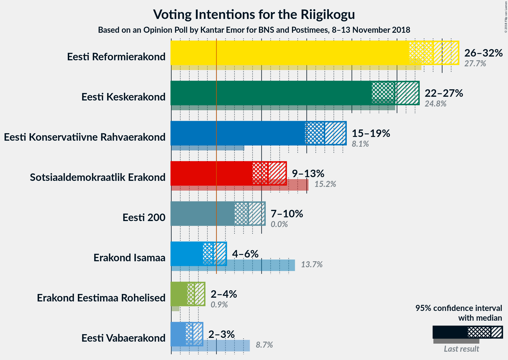

### Confidence Intervals

| Party | Last Result | Poll Result | 80% Confidence Interval | 90% Confidence Interval | 95% Confidence Interval | 99% Confidence Interval |
|:-----:|:-----------:|:-----------:|:-----------------------:|:-----------------------:|:-----------------------:|:-----------------------:|
| Eesti Reformierakond | 27.7% | 29.0% | 27.3–30.8% |26.8–31.4% |26.3–31.8% |25.5–32.7% |
| Eesti Keskerakond | 24.8% | 24.7% | 23.1–26.5% |22.6–27.0% |22.2–27.4% |21.5–28.3% |
| Eesti Konservatiivne Rahvaerakond | 8.1% | 17.0% | 15.6–18.5% |15.2–19.0% |14.8–19.4% |14.2–20.1% |
| Sotsiaaldemokraatlik Erakond | 15.2% | 10.7% | 9.6–12.0% |9.3–12.4% |9.0–12.7% |8.5–13.4% |
| Eesti 200 | 0.0% | 8.5% | 7.5–9.7% |7.2–10.1% |7.0–10.4% |6.5–11.0% |
| Erakond Isamaa | 13.7% | 4.6% | 3.9–5.6% |3.7–5.9% |3.5–6.1% |3.2–6.6% |
| Erakond Eestimaa Rohelised | 0.9% | 2.6% | 2.0–3.3% |1.9–3.5% |1.8–3.7% |1.5–4.1% |
| Eesti Vabaerakond | 8.7% | 2.4% | 1.9–3.1% |1.7–3.3% |1.6–3.5% |1.4–3.9% |

*Note:* The poll result column reflects the actual value used in the calculations. Published results may vary slightly, and in addition be rounded to fewer digits.

## Seats

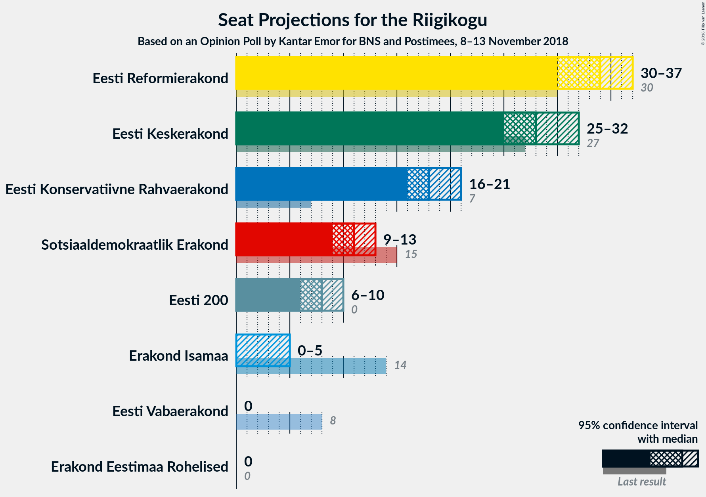

### Confidence Intervals

| Party | Last Result | Median | 80% Confidence Interval | 90% Confidence Interval | 95% Confidence Interval | 99% Confidence Interval |
|:-----:|:-----------:|:------:|:-----------------------:|:-----------------------:|:-----------------------:|:-----------------------:|
| <a href="#eesti-reformierakond">Eesti Reformierakond</a> | 30 | 34 | 31–36 |31–37 |30–37 |29–39 |
| <a href="#eesti-keskerakond">Eesti Keskerakond</a> | 27 | 28 | 26–30 |25–31 |25–32 |24–33 |
| <a href="#eesti-konservatiivne-rahvaerakond">Eesti Konservatiivne Rahvaerakond</a> | 7 | 18 | 17–20 |16–21 |16–21 |15–22 |
| <a href="#sotsiaaldemokraatlik-erakond">Sotsiaaldemokraatlik Erakond</a> | 15 | 11 | 9–12 |9–13 |9–13 |8–14 |
| <a href="#eesti-200">Eesti 200</a> | 0 | 8 | 7–10 |7–10 |6–10 |6–11 |
| <a href="#erakond-isamaa">Erakond Isamaa</a> | 14 | 0 | 0–5 |0–5 |0–5 |0–6 |
| <a href="#erakond-eestimaa-rohelised">Erakond Eestimaa Rohelised</a> | 0 | 0 | 0 |0 |0 |0 |
| <a href="#eesti-vabaerakond">Eesti Vabaerakond</a> | 8 | 0 | 0 |0 |0 |0 |

### Eesti Reformierakond

*For a full overview of the results for this party, see the [Eesti Reformierakond](party-eestireformierakond.html) page.*

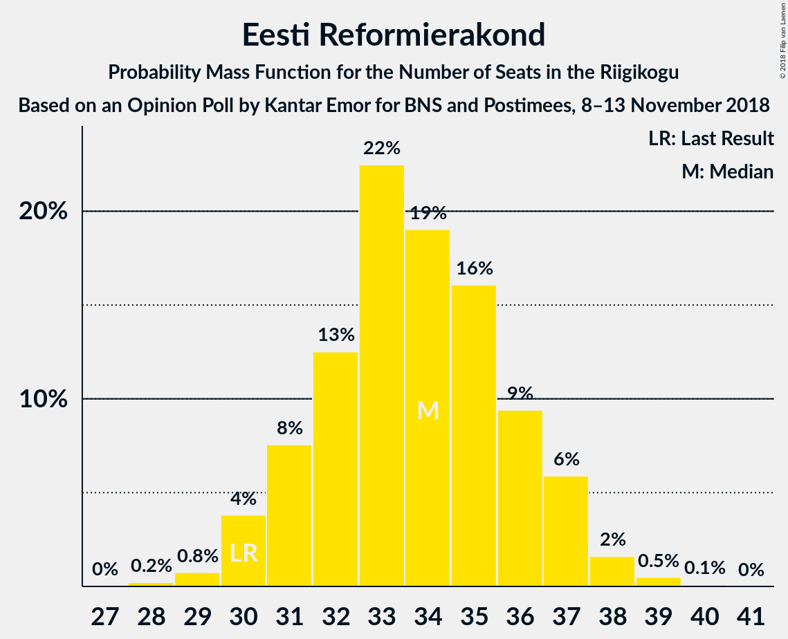

| Number of Seats | Probability | Accumulated | Special Marks |
|:---------------:|:-----------:|:-----------:|:-------------:|
| 28 | 0.2% | 100% |  |
| 29 | 0.8% | 99.7% |  |
| 30 | 4% | 99.0% | Last Result |
| 31 | 8% | 95% |  |
| 32 | 13% | 88% |  |
| 33 | 22% | 75% |  |
| 34 | 19% | 53% | Median |
| 35 | 16% | 34% |  |
| 36 | 9% | 18% |  |
| 37 | 6% | 8% |  |
| 38 | 2% | 2% |  |
| 39 | 0.5% | 0.6% |  |
| 40 | 0.1% | 0.1% |  |
| 41 | 0% | 0% |  |

### Eesti Keskerakond

*For a full overview of the results for this party, see the [Eesti Keskerakond](party-eestikeskerakond.html) page.*

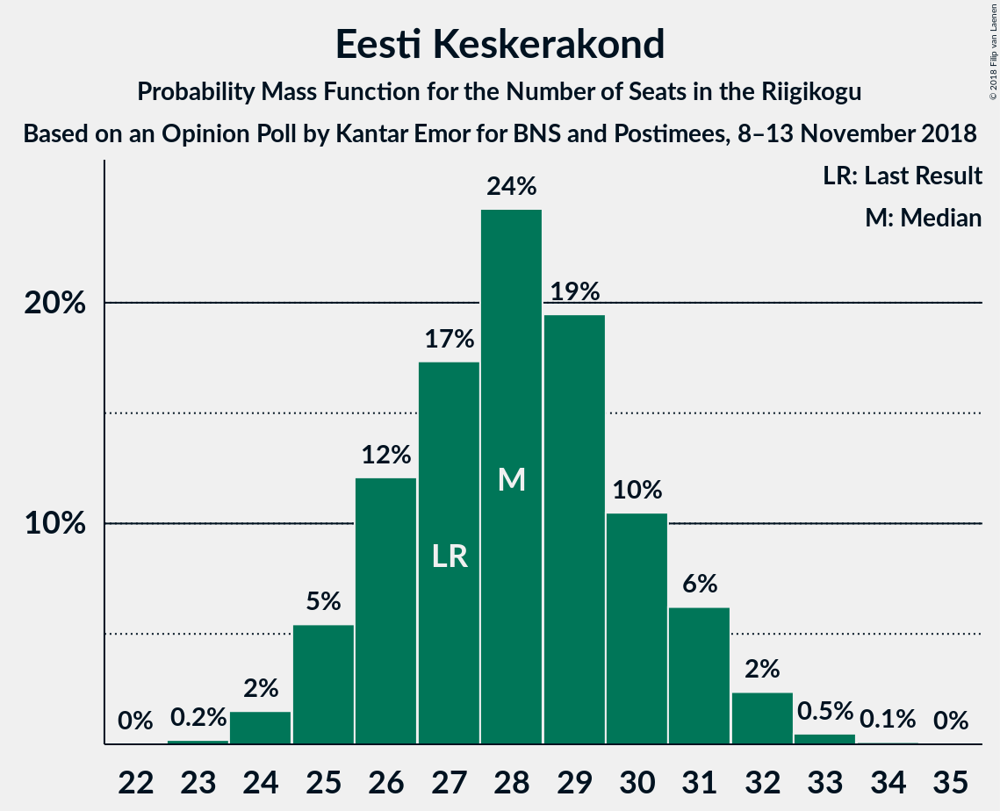

| Number of Seats | Probability | Accumulated | Special Marks |
|:---------------:|:-----------:|:-----------:|:-------------:|
| 23 | 0.2% | 100% |  |
| 24 | 2% | 99.8% |  |
| 25 | 5% | 98% |  |
| 26 | 12% | 93% |  |
| 27 | 17% | 81% | Last Result |
| 28 | 24% | 63% | Median |
| 29 | 19% | 39% |  |
| 30 | 10% | 20% |  |
| 31 | 6% | 9% |  |
| 32 | 2% | 3% |  |
| 33 | 0.5% | 0.6% |  |
| 34 | 0.1% | 0.1% |  |
| 35 | 0% | 0% |  |

### Eesti Konservatiivne Rahvaerakond

*For a full overview of the results for this party, see the [Eesti Konservatiivne Rahvaerakond](party-eestikonservatiivnerahvaerakond.html) page.*

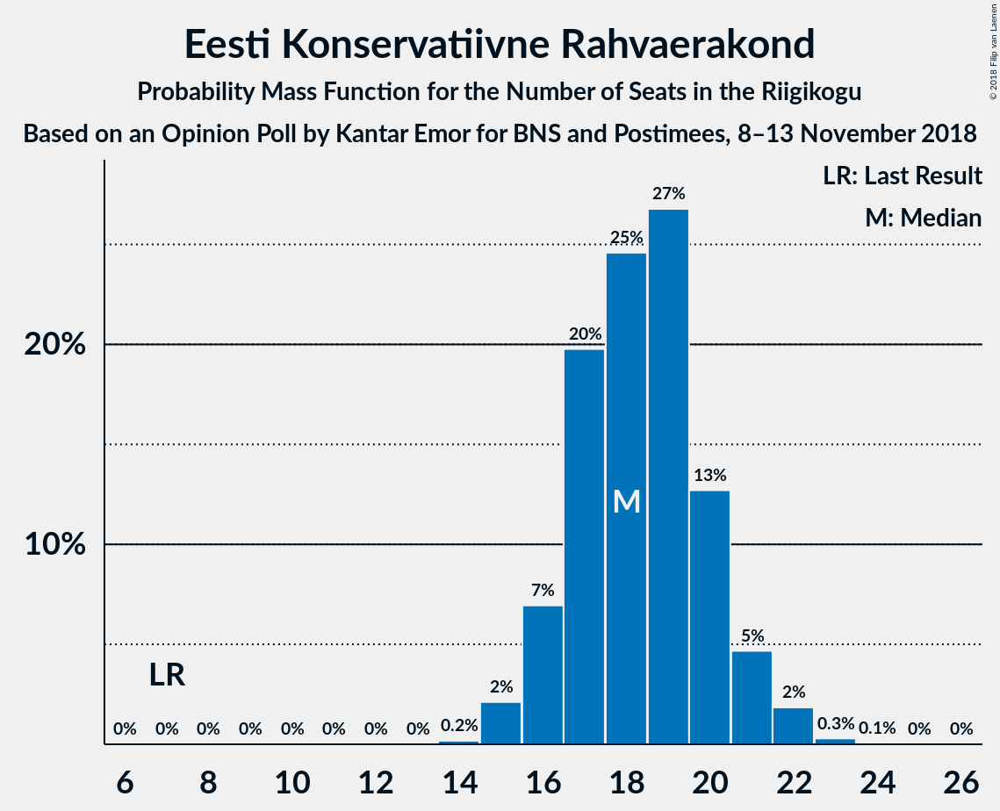

| Number of Seats | Probability | Accumulated | Special Marks |
|:---------------:|:-----------:|:-----------:|:-------------:|
| 7 | 0% | 100% | Last Result |
| 8 | 0% | 100% |  |
| 9 | 0% | 100% |  |
| 10 | 0% | 100% |  |
| 11 | 0% | 100% |  |
| 12 | 0% | 100% |  |
| 13 | 0% | 100% |  |
| 14 | 0.2% | 100% |  |
| 15 | 2% | 99.8% |  |
| 16 | 7% | 98% |  |
| 17 | 20% | 91% |  |
| 18 | 25% | 71% | Median |
| 19 | 27% | 46% |  |
| 20 | 13% | 20% |  |
| 21 | 5% | 7% |  |
| 22 | 2% | 2% |  |
| 23 | 0.3% | 0.4% |  |
| 24 | 0.1% | 0.1% |  |
| 25 | 0% | 0% |  |

### Sotsiaaldemokraatlik Erakond

*For a full overview of the results for this party, see the [Sotsiaaldemokraatlik Erakond](party-sotsiaaldemokraatlikerakond.html) page.*

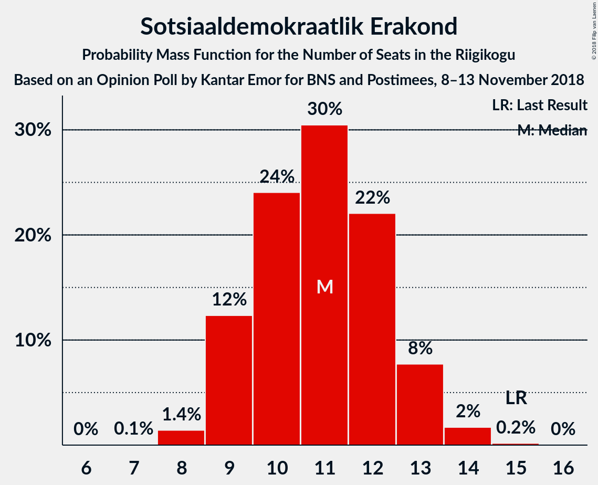

| Number of Seats | Probability | Accumulated | Special Marks |
|:---------------:|:-----------:|:-----------:|:-------------:|
| 7 | 0.1% | 100% |  |
| 8 | 1.4% | 99.9% |  |
| 9 | 12% | 98.5% |  |
| 10 | 24% | 86% |  |
| 11 | 30% | 62% | Median |
| 12 | 22% | 32% |  |
| 13 | 8% | 10% |  |
| 14 | 2% | 2% |  |
| 15 | 0.2% | 0.2% | Last Result |
| 16 | 0% | 0% |  |

### Eesti 200

*For a full overview of the results for this party, see the [Eesti 200](party-eesti200.html) page.*

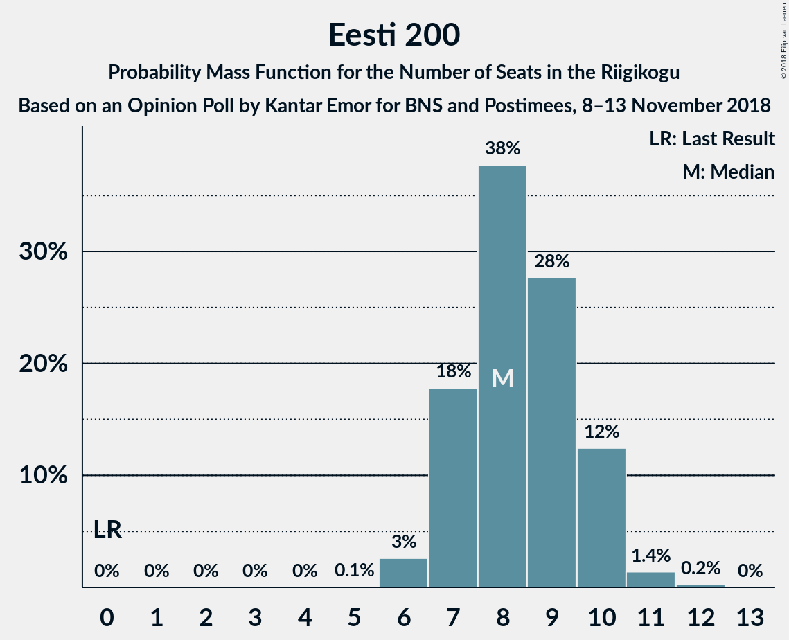

| Number of Seats | Probability | Accumulated | Special Marks |
|:---------------:|:-----------:|:-----------:|:-------------:|
| 0 | 0% | 100% | Last Result |
| 1 | 0% | 100% |  |
| 2 | 0% | 100% |  |
| 3 | 0% | 100% |  |
| 4 | 0% | 100% |  |
| 5 | 0.1% | 100% |  |
| 6 | 3% | 99.9% |  |
| 7 | 18% | 97% |  |
| 8 | 38% | 79% | Median |
| 9 | 28% | 42% |  |
| 10 | 12% | 14% |  |
| 11 | 1.4% | 2% |  |
| 12 | 0.2% | 0.3% |  |
| 13 | 0% | 0% |  |

### Erakond Isamaa

*For a full overview of the results for this party, see the [Erakond Isamaa](party-erakondisamaa.html) page.*

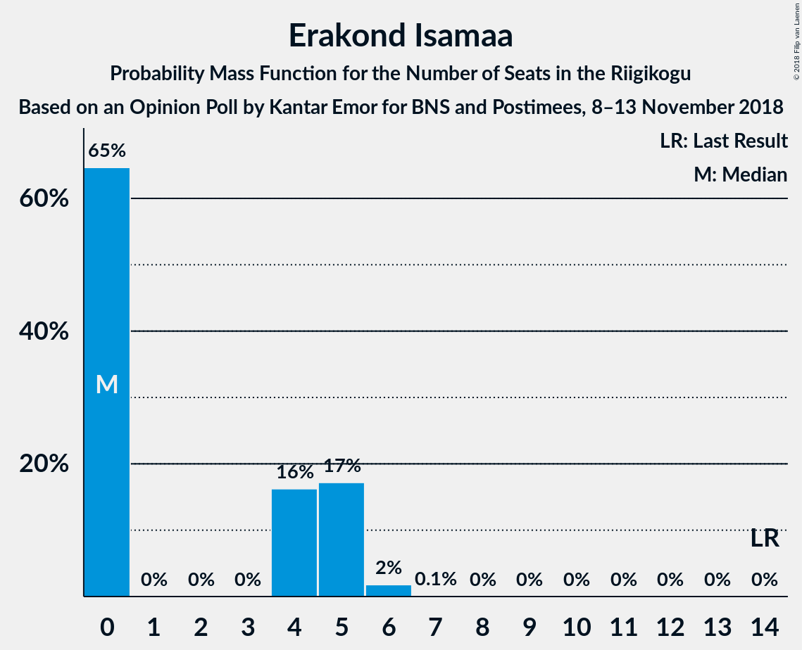

| Number of Seats | Probability | Accumulated | Special Marks |
|:---------------:|:-----------:|:-----------:|:-------------:|
| 0 | 65% | 100% | Median |
| 1 | 0% | 35% |  |
| 2 | 0% | 35% |  |
| 3 | 0% | 35% |  |
| 4 | 16% | 35% |  |
| 5 | 17% | 19% |  |
| 6 | 2% | 2% |  |
| 7 | 0.1% | 0.1% |  |
| 8 | 0% | 0% |  |
| 9 | 0% | 0% |  |
| 10 | 0% | 0% |  |
| 11 | 0% | 0% |  |
| 12 | 0% | 0% |  |
| 13 | 0% | 0% |  |
| 14 | 0% | 0% | Last Result |

### Erakond Eestimaa Rohelised

*For a full overview of the results for this party, see the [Erakond Eestimaa Rohelised](party-erakondeestimaarohelised.html) page.*

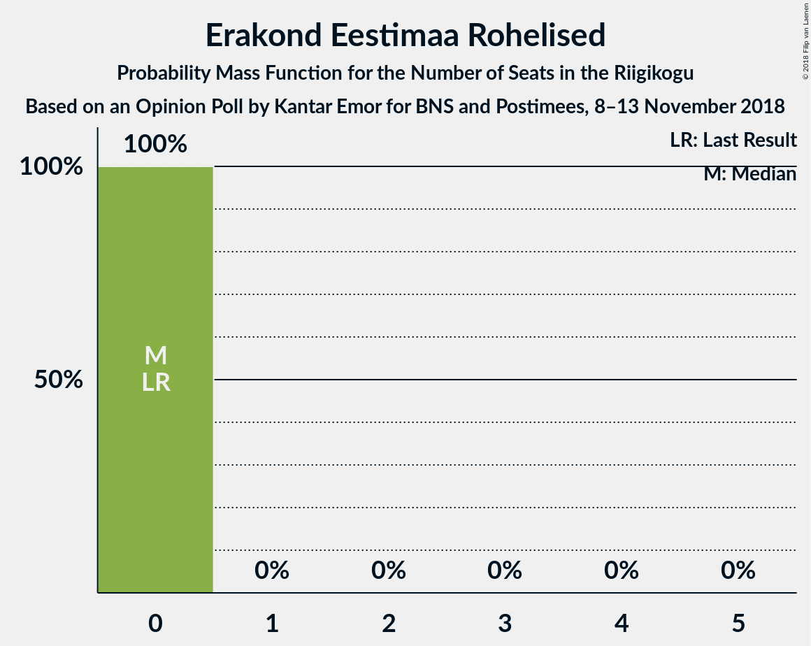

| Number of Seats | Probability | Accumulated | Special Marks |
|:---------------:|:-----------:|:-----------:|:-------------:|
| 0 | 100% | 100% | Last Result, Median |

### Eesti Vabaerakond

*For a full overview of the results for this party, see the [Eesti Vabaerakond](party-eestivabaerakond.html) page.*

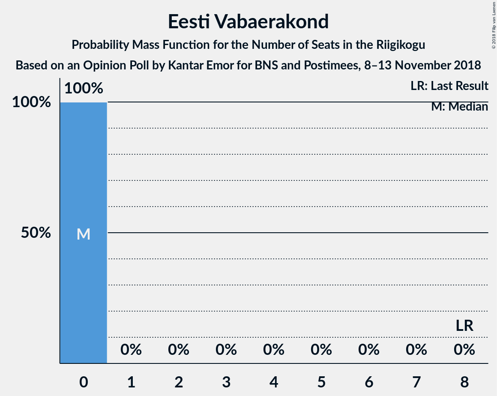

| Number of Seats | Probability | Accumulated | Special Marks |
|:---------------:|:-----------:|:-----------:|:-------------:|
| 0 | 100% | 100% | Median |
| 1 | 0% | 0% |  |
| 2 | 0% | 0% |  |
| 3 | 0% | 0% |  |
| 4 | 0% | 0% |  |
| 5 | 0% | 0% |  |
| 6 | 0% | 0% |  |
| 7 | 0% | 0% |  |
| 8 | 0% | 0% | Last Result |

## Coalitions

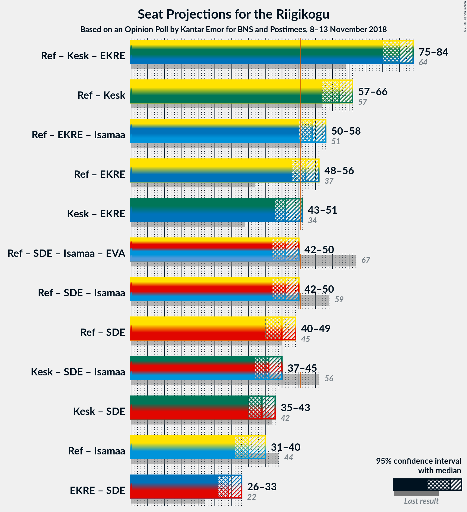

### Confidence Intervals

| Coalition | Last Result | Median | Majority? | 80% Confidence Interval | 90% Confidence Interval | 95% Confidence Interval | 99% Confidence Interval |
|:---------:|:-----------:|:------:|:---------:|:-----------------------:|:-----------------------:|:-----------------------:|:-----------------------:|
| Eesti Reformierakond – Eesti Keskerakond – Eesti Konservatiivne Rahvaerakond | 64 | 80 | 100% | 77–83 | 76–83 | 75–84 | 74–85 |
| Eesti Reformierakond – Eesti Keskerakond | 57 | 62 | 100% | 59–64 | 58–65 | 57–66 | 56–67 |
| Eesti Reformierakond – Eesti Konservatiivne Rahvaerakond – Erakond Isamaa | 51 | 54 | 90% | 50–56 | 50–57 | 50–58 | 48–59 |
| Eesti Reformierakond – Eesti Konservatiivne Rahvaerakond | 37 | 52 | 74% | 49–55 | 48–55 | 48–56 | 46–58 |
| Eesti Keskerakond – Eesti Konservatiivne Rahvaerakond | 34 | 46 | 3% | 44–49 | 43–50 | 43–51 | 41–52 |
| Eesti Reformierakond – Sotsiaaldemokraatlik Erakond – Erakond Isamaa – Eesti Vabaerakond | 67 | 46 | 2% | 43–49 | 42–49 | 42–50 | 40–52 |
| Eesti Reformierakond – Sotsiaaldemokraatlik Erakond – Erakond Isamaa | 59 | 46 | 2% | 43–49 | 42–49 | 42–50 | 40–52 |
| Eesti Reformierakond – Sotsiaaldemokraatlik Erakond | 45 | 45 | 0.1% | 42–47 | 41–48 | 40–49 | 39–49 |
| Eesti Keskerakond – Sotsiaaldemokraatlik Erakond – Erakond Isamaa | 56 | 41 | 0% | 38–44 | 37–44 | 37–45 | 35–46 |
| Eesti Keskerakond – Sotsiaaldemokraatlik Erakond | 42 | 39 | 0% | 37–42 | 36–42 | 35–43 | 34–44 |
| Eesti Reformierakond – Erakond Isamaa | 44 | 35 | 0% | 32–38 | 32–39 | 31–40 | 30–41 |
| Eesti Konservatiivne Rahvaerakond – Sotsiaaldemokraatlik Erakond | 22 | 29 | 0% | 27–32 | 26–32 | 26–33 | 25–34 |

### Eesti Reformierakond – Eesti Keskerakond – Eesti Konservatiivne Rahvaerakond

| Number of Seats | Probability | Accumulated | Special Marks |
|:---------------:|:-----------:|:-----------:|:-------------:|
| 64 | 0% | 100% | Last Result |
| 65 | 0% | 100% |  |
| 66 | 0% | 100% |  |
| 67 | 0% | 100% |  |
| 68 | 0% | 100% |  |
| 69 | 0% | 100% |  |
| 70 | 0% | 100% |  |
| 71 | 0% | 100% |  |
| 72 | 0% | 100% |  |
| 73 | 0.1% | 100% |  |
| 74 | 0.6% | 99.9% |  |
| 75 | 2% | 99.2% |  |
| 76 | 3% | 97% |  |
| 77 | 6% | 94% |  |
| 78 | 10% | 88% |  |
| 79 | 13% | 78% |  |
| 80 | 19% | 65% | Median |
| 81 | 19% | 46% |  |
| 82 | 14% | 27% |  |
| 83 | 8% | 13% |  |
| 84 | 4% | 5% |  |
| 85 | 0.6% | 0.8% |  |
| 86 | 0.1% | 0.1% |  |
| 87 | 0% | 0% |  |

### Eesti Reformierakond – Eesti Keskerakond

| Number of Seats | Probability | Accumulated | Special Marks |
|:---------------:|:-----------:|:-----------:|:-------------:|
| 55 | 0.1% | 100% |  |
| 56 | 1.1% | 99.8% |  |
| 57 | 2% | 98.8% | Last Result |
| 58 | 3% | 97% |  |
| 59 | 6% | 93% |  |
| 60 | 18% | 88% |  |
| 61 | 12% | 70% |  |
| 62 | 22% | 58% | Median |
| 63 | 13% | 36% |  |
| 64 | 13% | 22% |  |
| 65 | 5% | 9% |  |
| 66 | 3% | 5% |  |
| 67 | 1.1% | 2% |  |
| 68 | 0.4% | 0.4% |  |
| 69 | 0% | 0% |  |

### Eesti Reformierakond – Eesti Konservatiivne Rahvaerakond – Erakond Isamaa

| Number of Seats | Probability | Accumulated | Special Marks |
|:---------------:|:-----------:|:-----------:|:-------------:|
| 47 | 0.1% | 100% |  |
| 48 | 0.4% | 99.9% |  |
| 49 | 2% | 99.4% |  |
| 50 | 8% | 98% |  |
| 51 | 5% | 90% | Last Result, Majority |
| 52 | 13% | 84% | Median |
| 53 | 19% | 72% |  |
| 54 | 16% | 53% |  |
| 55 | 13% | 37% |  |
| 56 | 15% | 24% |  |
| 57 | 5% | 8% |  |
| 58 | 2% | 3% |  |
| 59 | 1.0% | 1.2% |  |
| 60 | 0.2% | 0.2% |  |
| 61 | 0% | 0% |  |

### Eesti Reformierakond – Eesti Konservatiivne Rahvaerakond

| Number of Seats | Probability | Accumulated | Special Marks |
|:---------------:|:-----------:|:-----------:|:-------------:|
| 37 | 0% | 100% | Last Result |
| 38 | 0% | 100% |  |
| 39 | 0% | 100% |  |
| 40 | 0% | 100% |  |
| 41 | 0% | 100% |  |
| 42 | 0% | 100% |  |
| 43 | 0% | 100% |  |
| 44 | 0% | 100% |  |
| 45 | 0.1% | 100% |  |
| 46 | 0.4% | 99.9% |  |
| 47 | 1.3% | 99.5% |  |
| 48 | 3% | 98% |  |
| 49 | 7% | 95% |  |
| 50 | 13% | 88% |  |
| 51 | 9% | 74% | Majority |
| 52 | 24% | 65% | Median |
| 53 | 16% | 41% |  |
| 54 | 12% | 25% |  |
| 55 | 9% | 13% |  |
| 56 | 2% | 4% |  |
| 57 | 1.0% | 2% |  |
| 58 | 0.6% | 0.7% |  |
| 59 | 0.1% | 0.1% |  |
| 60 | 0% | 0% |  |

### Eesti Keskerakond – Eesti Konservatiivne Rahvaerakond

| Number of Seats | Probability | Accumulated | Special Marks |
|:---------------:|:-----------:|:-----------:|:-------------:|
| 34 | 0% | 100% | Last Result |
| 35 | 0% | 100% |  |
| 36 | 0% | 100% |  |
| 37 | 0% | 100% |  |
| 38 | 0% | 100% |  |
| 39 | 0% | 100% |  |
| 40 | 0.1% | 100% |  |
| 41 | 0.5% | 99.8% |  |
| 42 | 2% | 99.3% |  |
| 43 | 3% | 98% |  |
| 44 | 14% | 95% |  |
| 45 | 12% | 81% |  |
| 46 | 21% | 68% | Median |
| 47 | 20% | 47% |  |
| 48 | 13% | 27% |  |
| 49 | 7% | 15% |  |
| 50 | 5% | 8% |  |
| 51 | 2% | 3% | Majority |
| 52 | 0.8% | 1.1% |  |
| 53 | 0.3% | 0.3% |  |
| 54 | 0% | 0% |  |

### Eesti Reformierakond – Sotsiaaldemokraatlik Erakond – Erakond Isamaa – Eesti Vabaerakond

| Number of Seats | Probability | Accumulated | Special Marks |
|:---------------:|:-----------:|:-----------:|:-------------:|
| 40 | 0.6% | 100% |  |
| 41 | 1.4% | 99.3% |  |
| 42 | 3% | 98% |  |
| 43 | 6% | 95% |  |
| 44 | 8% | 89% |  |
| 45 | 17% | 82% | Median |
| 46 | 16% | 65% |  |
| 47 | 22% | 49% |  |
| 48 | 13% | 27% |  |
| 49 | 11% | 14% |  |
| 50 | 2% | 3% |  |
| 51 | 1.1% | 2% | Majority |
| 52 | 0.5% | 0.8% |  |
| 53 | 0.2% | 0.2% |  |
| 54 | 0.1% | 0.1% |  |
| 55 | 0% | 0% |  |
| 56 | 0% | 0% |  |
| 57 | 0% | 0% |  |
| 58 | 0% | 0% |  |
| 59 | 0% | 0% |  |
| 60 | 0% | 0% |  |
| 61 | 0% | 0% |  |
| 62 | 0% | 0% |  |
| 63 | 0% | 0% |  |
| 64 | 0% | 0% |  |
| 65 | 0% | 0% |  |
| 66 | 0% | 0% |  |
| 67 | 0% | 0% | Last Result |

### Eesti Reformierakond – Sotsiaaldemokraatlik Erakond – Erakond Isamaa

| Number of Seats | Probability | Accumulated | Special Marks |
|:---------------:|:-----------:|:-----------:|:-------------:|
| 40 | 0.6% | 100% |  |
| 41 | 1.4% | 99.3% |  |
| 42 | 3% | 98% |  |
| 43 | 6% | 95% |  |
| 44 | 8% | 89% |  |
| 45 | 17% | 82% | Median |
| 46 | 16% | 65% |  |
| 47 | 22% | 49% |  |
| 48 | 13% | 27% |  |
| 49 | 11% | 14% |  |
| 50 | 2% | 3% |  |
| 51 | 1.1% | 2% | Majority |
| 52 | 0.5% | 0.8% |  |
| 53 | 0.2% | 0.2% |  |
| 54 | 0.1% | 0.1% |  |
| 55 | 0% | 0% |  |
| 56 | 0% | 0% |  |
| 57 | 0% | 0% |  |
| 58 | 0% | 0% |  |
| 59 | 0% | 0% | Last Result |

### Eesti Reformierakond – Sotsiaaldemokraatlik Erakond

| Number of Seats | Probability | Accumulated | Special Marks |
|:---------------:|:-----------:|:-----------:|:-------------:|
| 38 | 0.1% | 100% |  |
| 39 | 0.5% | 99.9% |  |
| 40 | 2% | 99.4% |  |
| 41 | 5% | 97% |  |
| 42 | 12% | 93% |  |
| 43 | 14% | 81% |  |
| 44 | 12% | 67% |  |
| 45 | 22% | 55% | Last Result, Median |
| 46 | 11% | 33% |  |
| 47 | 13% | 22% |  |
| 48 | 6% | 10% |  |
| 49 | 3% | 3% |  |
| 50 | 0.4% | 0.5% |  |
| 51 | 0.1% | 0.1% | Majority |
| 52 | 0% | 0% |  |

### Eesti Keskerakond – Sotsiaaldemokraatlik Erakond – Erakond Isamaa

| Number of Seats | Probability | Accumulated | Special Marks |
|:---------------:|:-----------:|:-----------:|:-------------:|
| 34 | 0.1% | 100% |  |
| 35 | 0.9% | 99.9% |  |
| 36 | 1.3% | 99.0% |  |
| 37 | 7% | 98% |  |
| 38 | 7% | 91% |  |
| 39 | 19% | 84% | Median |
| 40 | 11% | 65% |  |
| 41 | 20% | 54% |  |
| 42 | 16% | 34% |  |
| 43 | 6% | 17% |  |
| 44 | 6% | 11% |  |
| 45 | 3% | 5% |  |
| 46 | 1.3% | 2% |  |
| 47 | 0.4% | 0.5% |  |
| 48 | 0.1% | 0.1% |  |
| 49 | 0% | 0% |  |
| 50 | 0% | 0% |  |
| 51 | 0% | 0% | Majority |
| 52 | 0% | 0% |  |
| 53 | 0% | 0% |  |
| 54 | 0% | 0% |  |
| 55 | 0% | 0% |  |
| 56 | 0% | 0% | Last Result |

### Eesti Keskerakond – Sotsiaaldemokraatlik Erakond

| Number of Seats | Probability | Accumulated | Special Marks |
|:---------------:|:-----------:|:-----------:|:-------------:|
| 33 | 0.3% | 100% |  |
| 34 | 0.6% | 99.6% |  |
| 35 | 4% | 99.1% |  |
| 36 | 5% | 96% |  |
| 37 | 17% | 91% |  |
| 38 | 13% | 73% |  |
| 39 | 24% | 60% | Median |
| 40 | 11% | 36% |  |
| 41 | 13% | 25% |  |
| 42 | 9% | 12% | Last Result |
| 43 | 2% | 3% |  |
| 44 | 1.0% | 1.3% |  |
| 45 | 0.3% | 0.3% |  |
| 46 | 0% | 0% |  |

### Eesti Reformierakond – Erakond Isamaa

| Number of Seats | Probability | Accumulated | Special Marks |
|:---------------:|:-----------:|:-----------:|:-------------:|
| 29 | 0.2% | 100% |  |
| 30 | 1.2% | 99.8% |  |
| 31 | 3% | 98.6% |  |
| 32 | 6% | 96% |  |
| 33 | 13% | 90% |  |
| 34 | 13% | 76% | Median |
| 35 | 16% | 63% |  |
| 36 | 13% | 47% |  |
| 37 | 17% | 34% |  |
| 38 | 9% | 17% |  |
| 39 | 5% | 8% |  |
| 40 | 2% | 3% |  |
| 41 | 0.7% | 1.0% |  |
| 42 | 0.2% | 0.3% |  |
| 43 | 0.1% | 0.1% |  |
| 44 | 0% | 0% | Last Result |

### Eesti Konservatiivne Rahvaerakond – Sotsiaaldemokraatlik Erakond

| Number of Seats | Probability | Accumulated | Special Marks |
|:---------------:|:-----------:|:-----------:|:-------------:|
| 22 | 0% | 100% | Last Result |
| 23 | 0% | 100% |  |
| 24 | 0.2% | 100% |  |
| 25 | 1.1% | 99.8% |  |
| 26 | 4% | 98.6% |  |
| 27 | 13% | 94% |  |
| 28 | 15% | 81% |  |
| 29 | 24% | 66% | Median |
| 30 | 17% | 42% |  |
| 31 | 12% | 25% |  |
| 32 | 9% | 13% |  |
| 33 | 3% | 4% |  |
| 34 | 0.8% | 1.0% |  |
| 35 | 0.2% | 0.2% |  |
| 36 | 0% | 0% |  |

## Technical Information

### Opinion Poll

+ **Polling firm:** Kantar Emor
+ **Commissioner(s):** BNS and Postimees
+ **Fieldwork period:** 8–13 November 2018

### Calculations

+ **Sample size:** 1055
+ **Simulations done:** 1,048,576
+ **Error estimate:** 1.65%

