# Opinion Poll by Turu-uuringute AS for ERR, 31 October–13 November 2018

<a href="#voting-intentions">Voting Intentions</a> | <a href="#seats">Seats</a> | <a href="#coalitions">Coalitions</a> | <a href="#technical-information">Technical Information</a>

## Voting Intentions

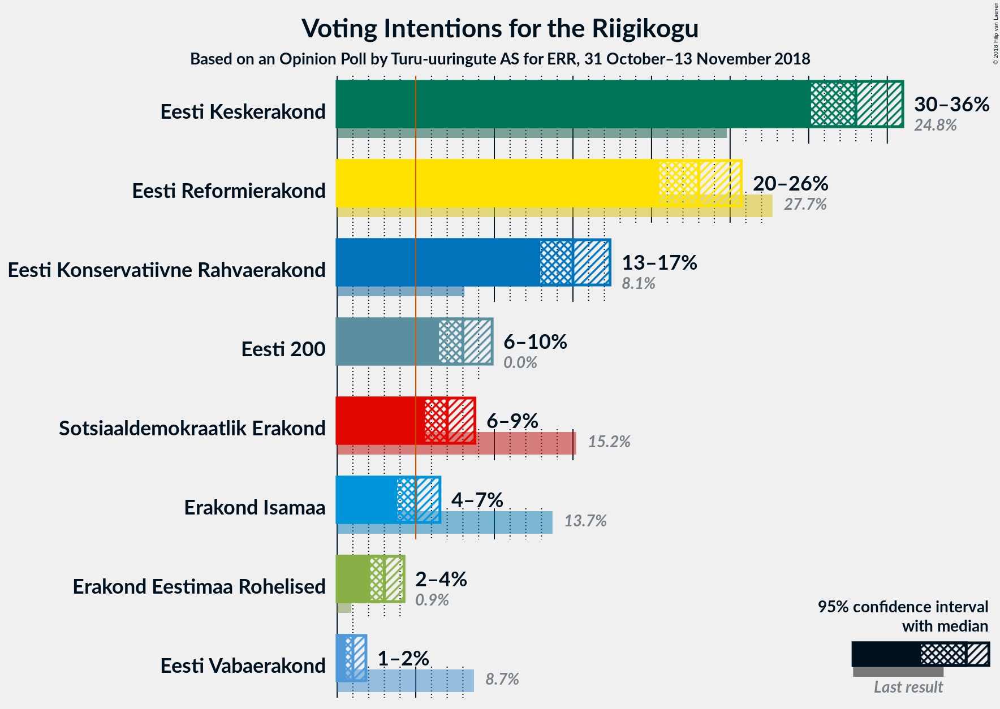

### Confidence Intervals

| Party | Last Result | Poll Result | 80% Confidence Interval | 90% Confidence Interval | 95% Confidence Interval | 99% Confidence Interval |
|:-----:|:-----------:|:-----------:|:-----------------------:|:-----------------------:|:-----------------------:|:-----------------------:|
| Eesti Keskerakond | 24.8% | 33.0% | 31.1–34.9% |30.6–35.5% |30.1–36.0% |29.3–36.9% |
| Eesti Reformierakond | 27.7% | 23.0% | 21.4–24.8% |20.9–25.3% |20.5–25.7% |19.7–26.6% |
| Eesti Konservatiivne Rahvaerakond | 8.1% | 15.0% | 13.6–16.5% |13.2–17.0% |12.9–17.4% |12.3–18.1% |
| Eesti 200 | 0.0% | 8.0% | 7.0–9.2% |6.7–9.6% |6.5–9.9% |6.0–10.5% |
| Sotsiaaldemokraatlik Erakond | 15.2% | 7.0% | 6.1–8.2% |5.8–8.5% |5.6–8.8% |5.2–9.3% |
| Erakond Isamaa | 13.7% | 5.0% | 4.2–6.0% |4.0–6.3% |3.8–6.5% |3.5–7.1% |
| Erakond Eestimaa Rohelised | 0.9% | 3.0% | 2.4–3.8% |2.2–4.1% |2.1–4.3% |1.9–4.7% |
| Eesti Vabaerakond | 8.7% | 1.0% | 0.7–1.5% |0.6–1.7% |0.5–1.8% |0.4–2.1% |

*Note:* The poll result column reflects the actual value used in the calculations. Published results may vary slightly, and in addition be rounded to fewer digits.

## Seats

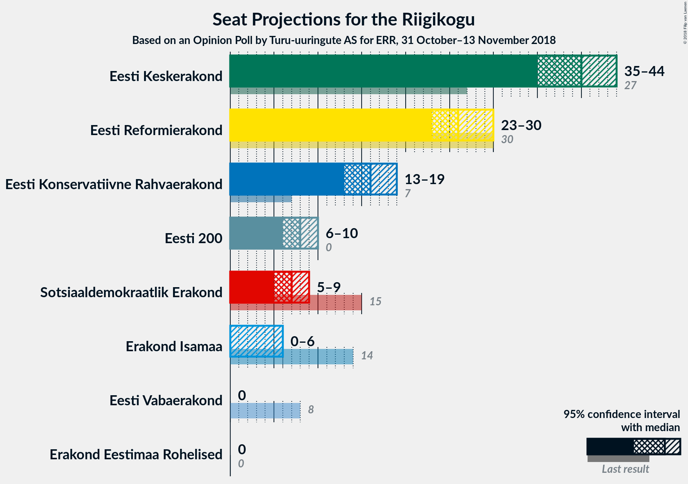

### Confidence Intervals

| Party | Last Result | Median | 80% Confidence Interval | 90% Confidence Interval | 95% Confidence Interval | 99% Confidence Interval |
|:-----:|:-----------:|:------:|:-----------------------:|:-----------------------:|:-----------------------:|:-----------------------:|
| <a href="#eesti-keskerakond">Eesti Keskerakond</a> | 27 | 40 | 36–43 |35–43 |35–44 |34–45 |
| <a href="#eesti-reformierakond">Eesti Reformierakond</a> | 30 | 26 | 24–29 |23–29 |23–30 |22–31 |
| <a href="#eesti-konservatiivne-rahvaerakond">Eesti Konservatiivne Rahvaerakond</a> | 7 | 16 | 14–18 |14–19 |13–19 |13–20 |
| <a href="#eesti-200">Eesti 200</a> | 0 | 8 | 7–9 |6–10 |6–10 |5–11 |
| <a href="#sotsiaaldemokraatlik-erakond">Sotsiaaldemokraatlik Erakond</a> | 15 | 7 | 5–8 |5–8 |5–9 |4–10 |
| <a href="#erakond-isamaa">Erakond Isamaa</a> | 14 | 0 | 0–5 |0–6 |0–6 |0–7 |
| <a href="#erakond-eestimaa-rohelised">Erakond Eestimaa Rohelised</a> | 0 | 0 | 0 |0 |0 |0 |
| <a href="#eesti-vabaerakond">Eesti Vabaerakond</a> | 8 | 0 | 0 |0 |0 |0 |

### Eesti Keskerakond

*For a full overview of the results for this party, see the [Eesti Keskerakond](party-eestikeskerakond.html) page.*

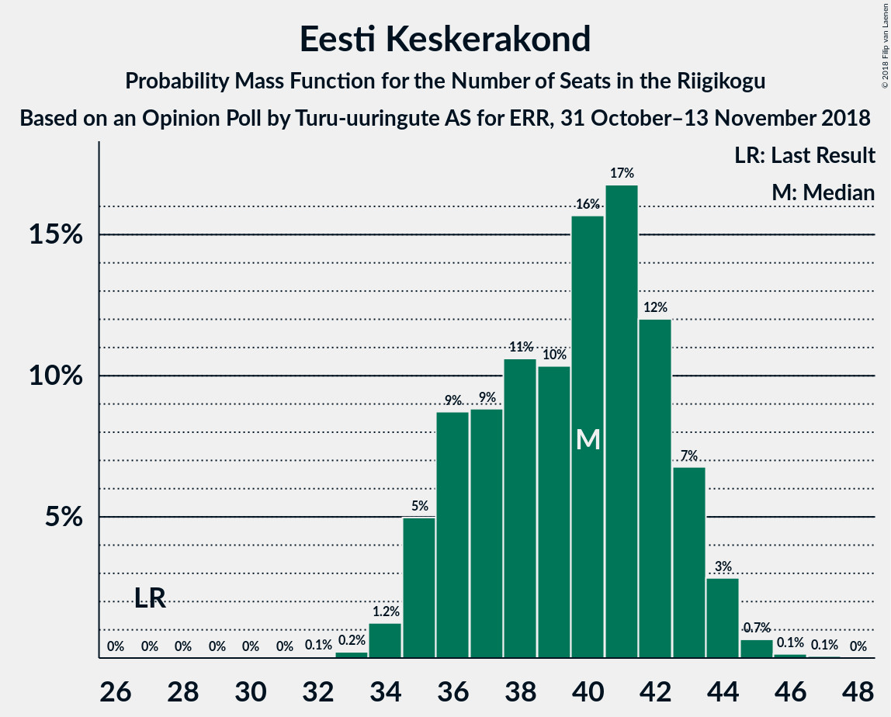

| Number of Seats | Probability | Accumulated | Special Marks |
|:---------------:|:-----------:|:-----------:|:-------------:|
| 27 | 0% | 100% | Last Result |
| 28 | 0% | 100% |  |
| 29 | 0% | 100% |  |
| 30 | 0% | 100% |  |
| 31 | 0% | 100% |  |
| 32 | 0.1% | 100% |  |
| 33 | 0.2% | 99.9% |  |
| 34 | 1.2% | 99.7% |  |
| 35 | 5% | 98% |  |
| 36 | 9% | 93% |  |
| 37 | 9% | 85% |  |
| 38 | 11% | 76% |  |
| 39 | 10% | 65% |  |
| 40 | 16% | 55% | Median |
| 41 | 17% | 39% |  |
| 42 | 12% | 23% |  |
| 43 | 7% | 11% |  |
| 44 | 3% | 4% |  |
| 45 | 0.7% | 0.9% |  |
| 46 | 0.1% | 0.2% |  |
| 47 | 0.1% | 0.1% |  |
| 48 | 0% | 0% |  |

### Eesti Reformierakond

*For a full overview of the results for this party, see the [Eesti Reformierakond](party-eestireformierakond.html) page.*

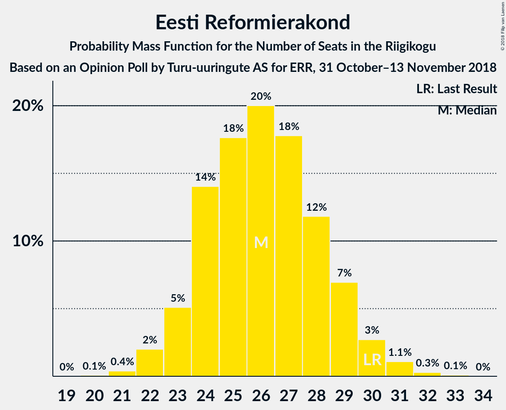

| Number of Seats | Probability | Accumulated | Special Marks |
|:---------------:|:-----------:|:-----------:|:-------------:|
| 20 | 0.1% | 100% |  |
| 21 | 0.4% | 99.9% |  |
| 22 | 2% | 99.5% |  |
| 23 | 5% | 98% |  |
| 24 | 14% | 92% |  |
| 25 | 18% | 78% |  |
| 26 | 20% | 61% | Median |
| 27 | 18% | 41% |  |
| 28 | 12% | 23% |  |
| 29 | 7% | 11% |  |
| 30 | 3% | 4% | Last Result |
| 31 | 1.1% | 1.5% |  |
| 32 | 0.3% | 0.4% |  |
| 33 | 0.1% | 0.1% |  |
| 34 | 0% | 0% |  |

### Eesti Konservatiivne Rahvaerakond

*For a full overview of the results for this party, see the [Eesti Konservatiivne Rahvaerakond](party-eestikonservatiivnerahvaerakond.html) page.*

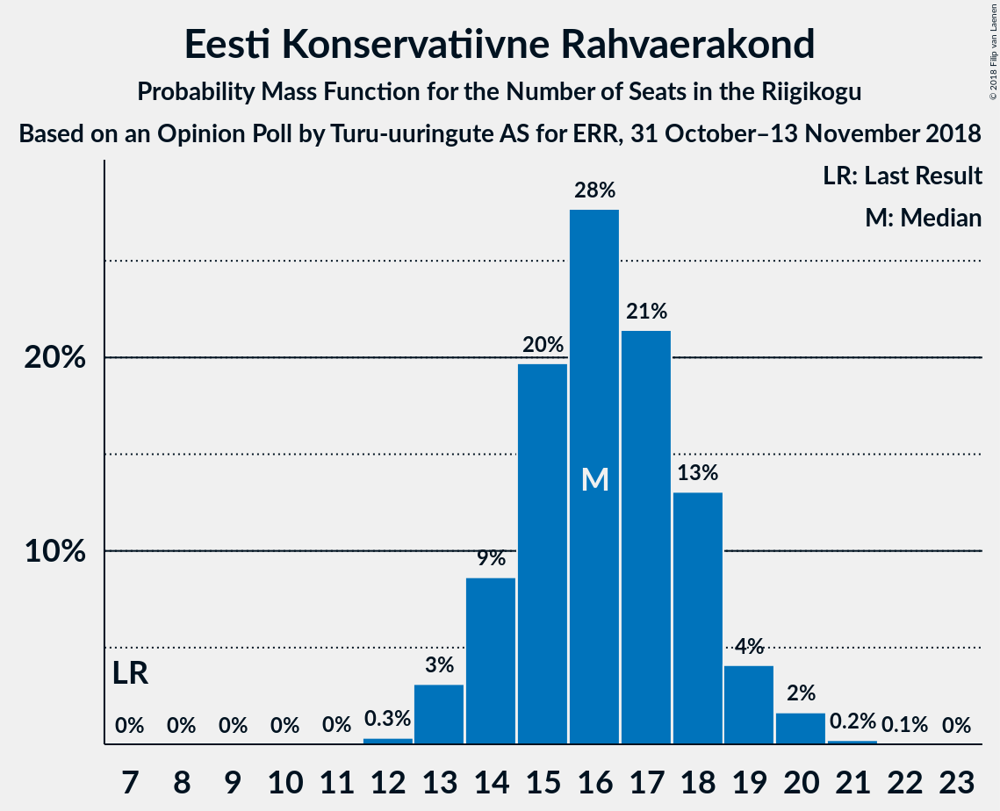

| Number of Seats | Probability | Accumulated | Special Marks |
|:---------------:|:-----------:|:-----------:|:-------------:|
| 7 | 0% | 100% | Last Result |
| 8 | 0% | 100% |  |
| 9 | 0% | 100% |  |
| 10 | 0% | 100% |  |
| 11 | 0% | 100% |  |
| 12 | 0.3% | 100% |  |
| 13 | 3% | 99.6% |  |
| 14 | 9% | 97% |  |
| 15 | 20% | 88% |  |
| 16 | 28% | 68% | Median |
| 17 | 21% | 40% |  |
| 18 | 13% | 19% |  |
| 19 | 4% | 6% |  |
| 20 | 2% | 2% |  |
| 21 | 0.2% | 0.3% |  |
| 22 | 0.1% | 0.1% |  |
| 23 | 0% | 0% |  |

### Eesti 200

*For a full overview of the results for this party, see the [Eesti 200](party-eesti200.html) page.*

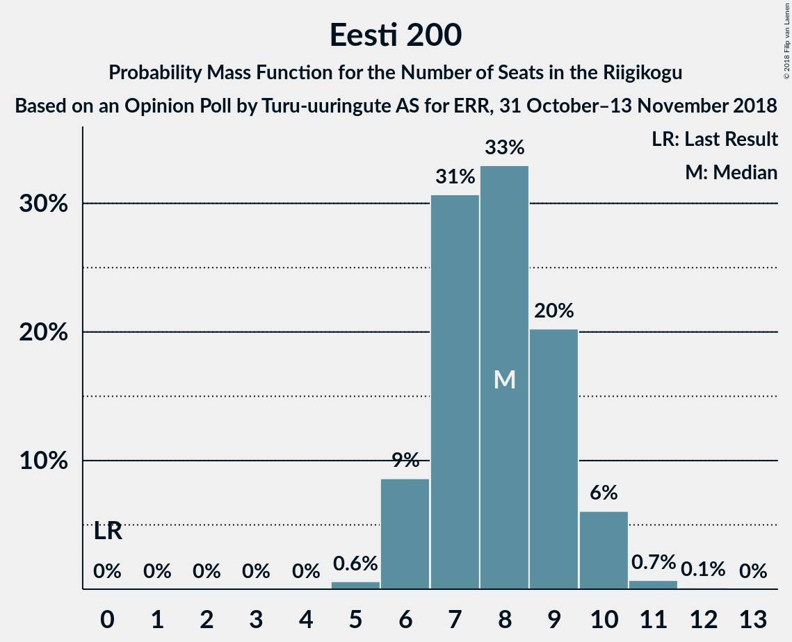

| Number of Seats | Probability | Accumulated | Special Marks |
|:---------------:|:-----------:|:-----------:|:-------------:|
| 0 | 0% | 100% | Last Result |
| 1 | 0% | 100% |  |
| 2 | 0% | 100% |  |
| 3 | 0% | 100% |  |
| 4 | 0% | 100% |  |
| 5 | 0.6% | 100% |  |
| 6 | 9% | 99.4% |  |
| 7 | 31% | 91% |  |
| 8 | 33% | 60% | Median |
| 9 | 20% | 27% |  |
| 10 | 6% | 7% |  |
| 11 | 0.7% | 0.8% |  |
| 12 | 0.1% | 0.1% |  |
| 13 | 0% | 0% |  |

### Sotsiaaldemokraatlik Erakond

*For a full overview of the results for this party, see the [Sotsiaaldemokraatlik Erakond](party-sotsiaaldemokraatlikerakond.html) page.*

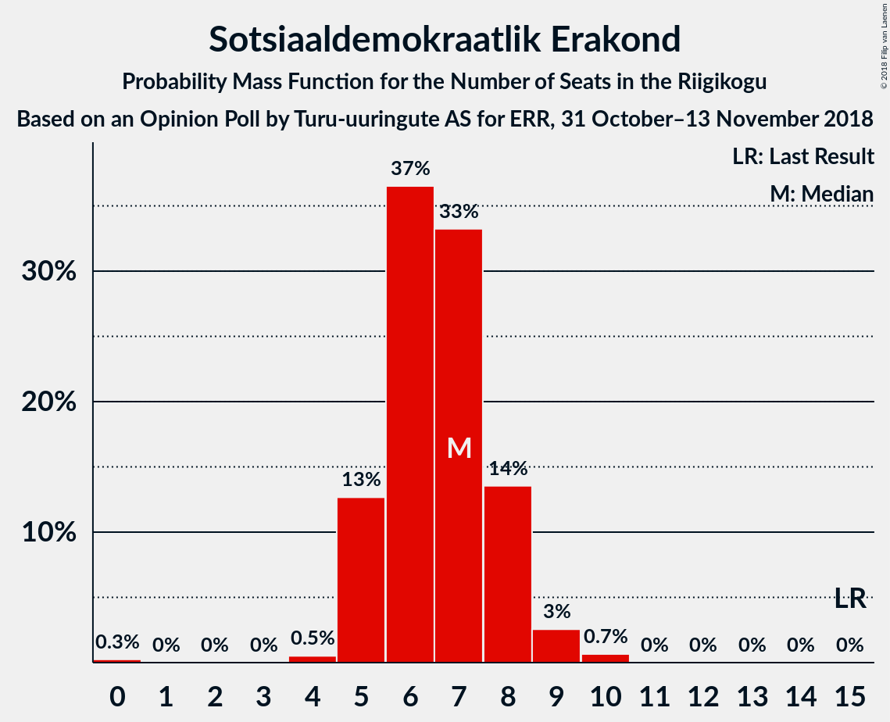

| Number of Seats | Probability | Accumulated | Special Marks |
|:---------------:|:-----------:|:-----------:|:-------------:|
| 0 | 0.3% | 100% |  |
| 1 | 0% | 99.7% |  |
| 2 | 0% | 99.7% |  |
| 3 | 0% | 99.7% |  |
| 4 | 0.5% | 99.7% |  |
| 5 | 13% | 99.2% |  |
| 6 | 37% | 87% |  |
| 7 | 33% | 50% | Median |
| 8 | 14% | 17% |  |
| 9 | 3% | 3% |  |
| 10 | 0.7% | 0.7% |  |
| 11 | 0% | 0% |  |
| 12 | 0% | 0% |  |
| 13 | 0% | 0% |  |
| 14 | 0% | 0% |  |
| 15 | 0% | 0% | Last Result |

### Erakond Isamaa

*For a full overview of the results for this party, see the [Erakond Isamaa](party-erakondisamaa.html) page.*

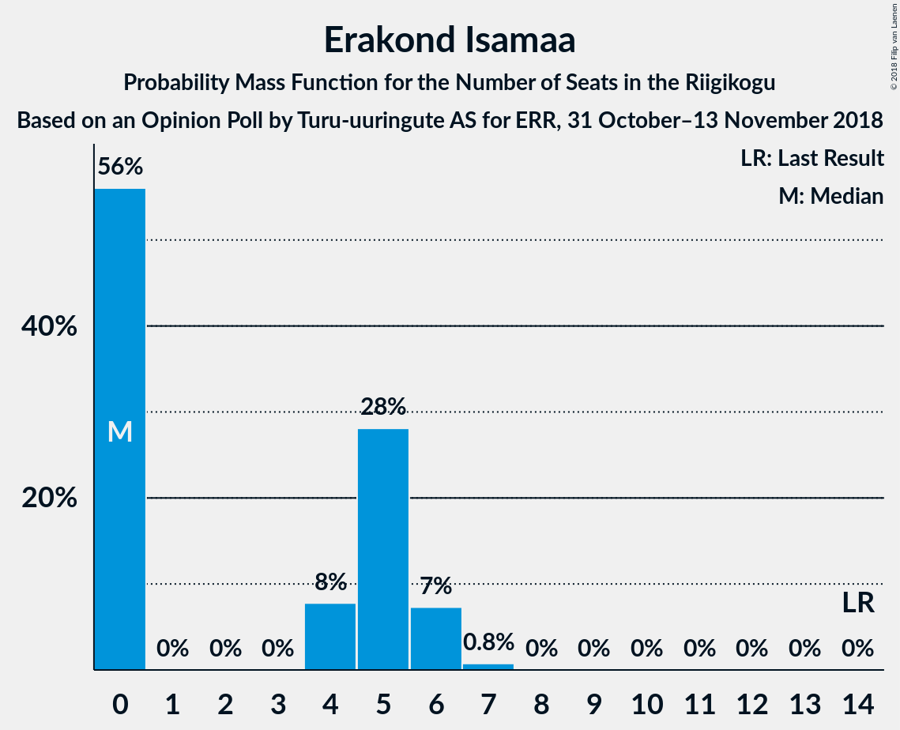

| Number of Seats | Probability | Accumulated | Special Marks |
|:---------------:|:-----------:|:-----------:|:-------------:|
| 0 | 56% | 100% | Median |
| 1 | 0% | 44% |  |
| 2 | 0% | 44% |  |
| 3 | 0% | 44% |  |
| 4 | 8% | 44% |  |
| 5 | 28% | 36% |  |
| 6 | 7% | 8% |  |
| 7 | 0.8% | 0.8% |  |
| 8 | 0% | 0% |  |
| 9 | 0% | 0% |  |
| 10 | 0% | 0% |  |
| 11 | 0% | 0% |  |
| 12 | 0% | 0% |  |
| 13 | 0% | 0% |  |
| 14 | 0% | 0% | Last Result |

### Erakond Eestimaa Rohelised

*For a full overview of the results for this party, see the [Erakond Eestimaa Rohelised](party-erakondeestimaarohelised.html) page.*

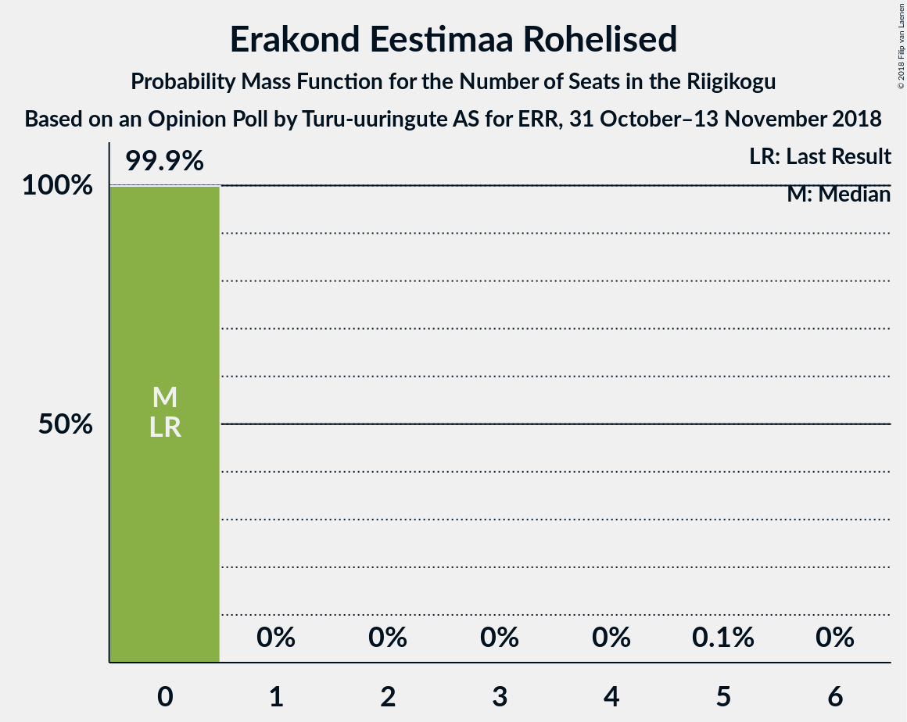

| Number of Seats | Probability | Accumulated | Special Marks |
|:---------------:|:-----------:|:-----------:|:-------------:|
| 0 | 99.9% | 100% | Last Result, Median |
| 1 | 0% | 0.1% |  |
| 2 | 0% | 0.1% |  |
| 3 | 0% | 0.1% |  |
| 4 | 0% | 0.1% |  |
| 5 | 0.1% | 0.1% |  |
| 6 | 0% | 0% |  |

### Eesti Vabaerakond

*For a full overview of the results for this party, see the [Eesti Vabaerakond](party-eestivabaerakond.html) page.*

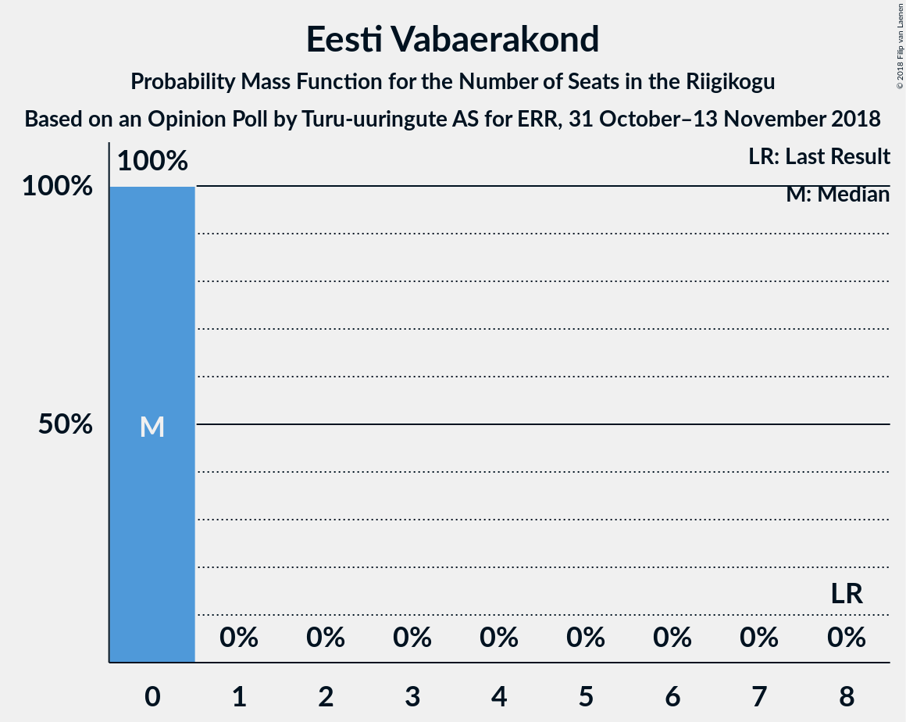

| Number of Seats | Probability | Accumulated | Special Marks |
|:---------------:|:-----------:|:-----------:|:-------------:|
| 0 | 100% | 100% | Median |
| 1 | 0% | 0% |  |
| 2 | 0% | 0% |  |
| 3 | 0% | 0% |  |
| 4 | 0% | 0% |  |
| 5 | 0% | 0% |  |
| 6 | 0% | 0% |  |
| 7 | 0% | 0% |  |
| 8 | 0% | 0% | Last Result |

## Coalitions

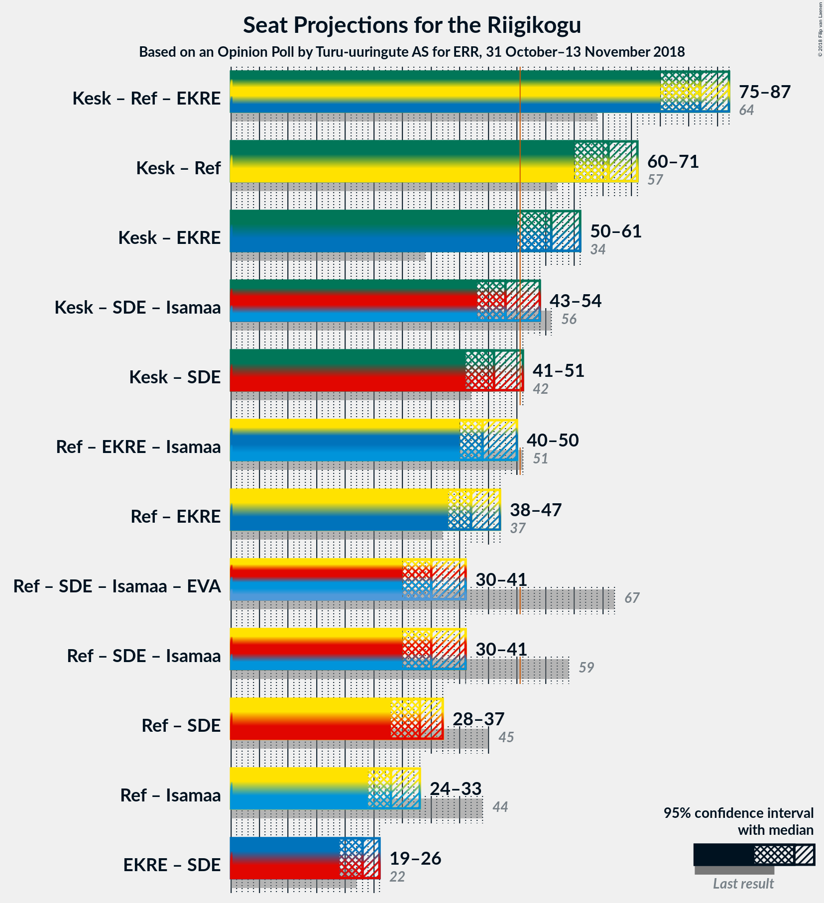

### Confidence Intervals

| Coalition | Last Result | Median | Majority? | 80% Confidence Interval | 90% Confidence Interval | 95% Confidence Interval | 99% Confidence Interval |
|:---------:|:-----------:|:------:|:---------:|:-----------------------:|:-----------------------:|:-----------------------:|:-----------------------:|
| Eesti Keskerakond – Eesti Reformierakond – Eesti Konservatiivne Rahvaerakond | 64 | 82 | 100% | 77–86 | 76–87 | 75–87 | 74–89 |
| Eesti Keskerakond – Eesti Reformierakond | 57 | 66 | 100% | 62–69 | 61–70 | 60–71 | 58–73 |
| Eesti Keskerakond – Eesti Konservatiivne Rahvaerakond | 34 | 56 | 96% | 52–59 | 51–60 | 50–61 | 49–61 |
| Eesti Keskerakond – Sotsiaaldemokraatlik Erakond – Erakond Isamaa | 56 | 48 | 20% | 44–52 | 43–53 | 43–54 | 42–55 |
| Eesti Keskerakond – Sotsiaaldemokraatlik Erakond | 42 | 46 | 4% | 43–49 | 42–50 | 41–51 | 40–52 |
| Eesti Reformierakond – Eesti Konservatiivne Rahvaerakond – Erakond Isamaa | 51 | 44 | 0.8% | 41–48 | 40–49 | 40–50 | 38–51 |
| Eesti Reformierakond – Eesti Konservatiivne Rahvaerakond | 37 | 42 | 0.1% | 39–45 | 38–46 | 38–47 | 37–48 |
| Eesti Reformierakond – Sotsiaaldemokraatlik Erakond – Erakond Isamaa – Eesti Vabaerakond | 67 | 35 | 0% | 31–38 | 30–39 | 30–41 | 29–42 |
| Eesti Reformierakond – Sotsiaaldemokraatlik Erakond – Erakond Isamaa | 59 | 35 | 0% | 31–38 | 30–39 | 30–41 | 29–42 |
| Eesti Reformierakond – Sotsiaaldemokraatlik Erakond | 45 | 33 | 0% | 30–35 | 29–36 | 28–37 | 27–39 |
| Eesti Reformierakond – Erakond Isamaa | 44 | 28 | 0% | 25–32 | 24–33 | 24–33 | 23–35 |
| Eesti Konservatiivne Rahvaerakond – Sotsiaaldemokraatlik Erakond | 22 | 23 | 0% | 21–25 | 20–26 | 19–26 | 18–28 |

### Eesti Keskerakond – Eesti Reformierakond – Eesti Konservatiivne Rahvaerakond

| Number of Seats | Probability | Accumulated | Special Marks |
|:---------------:|:-----------:|:-----------:|:-------------:|
| 64 | 0% | 100% | Last Result |
| 65 | 0% | 100% |  |
| 66 | 0% | 100% |  |
| 67 | 0% | 100% |  |
| 68 | 0% | 100% |  |
| 69 | 0% | 100% |  |
| 70 | 0% | 100% |  |
| 71 | 0% | 100% |  |
| 72 | 0% | 100% |  |
| 73 | 0.1% | 100% |  |
| 74 | 0.6% | 99.9% |  |
| 75 | 2% | 99.3% |  |
| 76 | 4% | 97% |  |
| 77 | 5% | 94% |  |
| 78 | 5% | 88% |  |
| 79 | 5% | 83% |  |
| 80 | 8% | 78% |  |
| 81 | 16% | 70% |  |
| 82 | 12% | 54% | Median |
| 83 | 12% | 42% |  |
| 84 | 7% | 29% |  |
| 85 | 8% | 22% |  |
| 86 | 8% | 14% |  |
| 87 | 4% | 7% |  |
| 88 | 2% | 2% |  |
| 89 | 0.7% | 0.8% |  |
| 90 | 0% | 0% |  |

### Eesti Keskerakond – Eesti Reformierakond

| Number of Seats | Probability | Accumulated | Special Marks |
|:---------------:|:-----------:|:-----------:|:-------------:|
| 57 | 0.1% | 100% | Last Result |
| 58 | 0.5% | 99.9% |  |
| 59 | 0.8% | 99.4% |  |
| 60 | 3% | 98.6% |  |
| 61 | 6% | 96% |  |
| 62 | 6% | 90% |  |
| 63 | 7% | 84% |  |
| 64 | 11% | 77% |  |
| 65 | 15% | 66% |  |
| 66 | 15% | 52% | Median |
| 67 | 12% | 37% |  |
| 68 | 7% | 25% |  |
| 69 | 9% | 18% |  |
| 70 | 4% | 9% |  |
| 71 | 3% | 5% |  |
| 72 | 1.4% | 2% |  |
| 73 | 0.4% | 0.5% |  |
| 74 | 0.1% | 0.1% |  |
| 75 | 0% | 0% |  |

### Eesti Keskerakond – Eesti Konservatiivne Rahvaerakond

| Number of Seats | Probability | Accumulated | Special Marks |
|:---------------:|:-----------:|:-----------:|:-------------:|
| 34 | 0% | 100% | Last Result |
| 35 | 0% | 100% |  |
| 36 | 0% | 100% |  |
| 37 | 0% | 100% |  |
| 38 | 0% | 100% |  |
| 39 | 0% | 100% |  |
| 40 | 0% | 100% |  |
| 41 | 0% | 100% |  |
| 42 | 0% | 100% |  |
| 43 | 0% | 100% |  |
| 44 | 0% | 100% |  |
| 45 | 0% | 100% |  |
| 46 | 0% | 100% |  |
| 47 | 0% | 100% |  |
| 48 | 0.2% | 100% |  |
| 49 | 0.8% | 99.8% |  |
| 50 | 3% | 99.0% |  |
| 51 | 5% | 96% | Majority |
| 52 | 8% | 91% |  |
| 53 | 8% | 83% |  |
| 54 | 9% | 75% |  |
| 55 | 9% | 66% |  |
| 56 | 13% | 57% | Median |
| 57 | 14% | 44% |  |
| 58 | 13% | 30% |  |
| 59 | 9% | 17% |  |
| 60 | 5% | 8% |  |
| 61 | 3% | 3% |  |
| 62 | 0.2% | 0.4% |  |
| 63 | 0.1% | 0.2% |  |
| 64 | 0.1% | 0.1% |  |
| 65 | 0% | 0% |  |

### Eesti Keskerakond – Sotsiaaldemokraatlik Erakond – Erakond Isamaa

| Number of Seats | Probability | Accumulated | Special Marks |
|:---------------:|:-----------:|:-----------:|:-------------:|
| 40 | 0.1% | 100% |  |
| 41 | 0.3% | 99.9% |  |
| 42 | 2% | 99.6% |  |
| 43 | 3% | 98% |  |
| 44 | 6% | 95% |  |
| 45 | 6% | 89% |  |
| 46 | 8% | 83% |  |
| 47 | 11% | 75% | Median |
| 48 | 17% | 64% |  |
| 49 | 13% | 47% |  |
| 50 | 14% | 34% |  |
| 51 | 8% | 20% | Majority |
| 52 | 6% | 12% |  |
| 53 | 2% | 6% |  |
| 54 | 2% | 3% |  |
| 55 | 1.0% | 1.2% |  |
| 56 | 0.1% | 0.2% | Last Result |
| 57 | 0% | 0.1% |  |
| 58 | 0% | 0% |  |

### Eesti Keskerakond – Sotsiaaldemokraatlik Erakond

| Number of Seats | Probability | Accumulated | Special Marks |
|:---------------:|:-----------:|:-----------:|:-------------:|
| 38 | 0.1% | 100% |  |
| 39 | 0.3% | 99.9% |  |
| 40 | 0.7% | 99.6% |  |
| 41 | 3% | 98.9% |  |
| 42 | 5% | 96% | Last Result |
| 43 | 9% | 91% |  |
| 44 | 12% | 82% |  |
| 45 | 13% | 71% |  |
| 46 | 13% | 58% |  |
| 47 | 13% | 45% | Median |
| 48 | 15% | 32% |  |
| 49 | 7% | 17% |  |
| 50 | 6% | 10% |  |
| 51 | 3% | 4% | Majority |
| 52 | 0.7% | 0.9% |  |
| 53 | 0.2% | 0.2% |  |
| 54 | 0.1% | 0.1% |  |
| 55 | 0% | 0% |  |

### Eesti Reformierakond – Eesti Konservatiivne Rahvaerakond – Erakond Isamaa

| Number of Seats | Probability | Accumulated | Special Marks |
|:---------------:|:-----------:|:-----------:|:-------------:|
| 37 | 0.1% | 100% |  |
| 38 | 0.4% | 99.8% |  |
| 39 | 0.6% | 99.4% |  |
| 40 | 6% | 98.8% |  |
| 41 | 8% | 93% |  |
| 42 | 9% | 85% | Median |
| 43 | 15% | 76% |  |
| 44 | 13% | 60% |  |
| 45 | 11% | 48% |  |
| 46 | 12% | 37% |  |
| 47 | 8% | 25% |  |
| 48 | 7% | 16% |  |
| 49 | 7% | 10% |  |
| 50 | 2% | 3% |  |
| 51 | 0.5% | 0.8% | Last Result, Majority |
| 52 | 0.2% | 0.3% |  |
| 53 | 0.1% | 0.1% |  |
| 54 | 0% | 0% |  |

### Eesti Reformierakond – Eesti Konservatiivne Rahvaerakond

| Number of Seats | Probability | Accumulated | Special Marks |
|:---------------:|:-----------:|:-----------:|:-------------:|
| 35 | 0.1% | 100% |  |
| 36 | 0.2% | 99.8% |  |
| 37 | 1.5% | 99.6% | Last Result |
| 38 | 4% | 98% |  |
| 39 | 5% | 94% |  |
| 40 | 13% | 89% |  |
| 41 | 14% | 75% |  |
| 42 | 13% | 61% | Median |
| 43 | 16% | 49% |  |
| 44 | 16% | 32% |  |
| 45 | 7% | 16% |  |
| 46 | 4% | 9% |  |
| 47 | 4% | 5% |  |
| 48 | 0.8% | 1.1% |  |
| 49 | 0.1% | 0.3% |  |
| 50 | 0.1% | 0.2% |  |
| 51 | 0.1% | 0.1% | Majority |
| 52 | 0% | 0% |  |

### Eesti Reformierakond – Sotsiaaldemokraatlik Erakond – Erakond Isamaa – Eesti Vabaerakond

| Number of Seats | Probability | Accumulated | Special Marks |
|:---------------:|:-----------:|:-----------:|:-------------:|
| 28 | 0.2% | 100% |  |
| 29 | 1.3% | 99.8% |  |
| 30 | 4% | 98.5% |  |
| 31 | 11% | 94% |  |
| 32 | 5% | 84% |  |
| 33 | 13% | 78% | Median |
| 34 | 11% | 66% |  |
| 35 | 12% | 55% |  |
| 36 | 11% | 42% |  |
| 37 | 12% | 31% |  |
| 38 | 10% | 20% |  |
| 39 | 5% | 9% |  |
| 40 | 2% | 5% |  |
| 41 | 1.3% | 3% |  |
| 42 | 1.0% | 1.3% |  |
| 43 | 0.3% | 0.3% |  |
| 44 | 0% | 0% |  |
| 45 | 0% | 0% |  |
| 46 | 0% | 0% |  |
| 47 | 0% | 0% |  |
| 48 | 0% | 0% |  |
| 49 | 0% | 0% |  |
| 50 | 0% | 0% |  |
| 51 | 0% | 0% | Majority |
| 52 | 0% | 0% |  |
| 53 | 0% | 0% |  |
| 54 | 0% | 0% |  |
| 55 | 0% | 0% |  |
| 56 | 0% | 0% |  |
| 57 | 0% | 0% |  |
| 58 | 0% | 0% |  |
| 59 | 0% | 0% |  |
| 60 | 0% | 0% |  |
| 61 | 0% | 0% |  |
| 62 | 0% | 0% |  |
| 63 | 0% | 0% |  |
| 64 | 0% | 0% |  |
| 65 | 0% | 0% |  |
| 66 | 0% | 0% |  |
| 67 | 0% | 0% | Last Result |

### Eesti Reformierakond – Sotsiaaldemokraatlik Erakond – Erakond Isamaa

| Number of Seats | Probability | Accumulated | Special Marks |
|:---------------:|:-----------:|:-----------:|:-------------:|
| 28 | 0.2% | 100% |  |
| 29 | 1.3% | 99.8% |  |
| 30 | 4% | 98.5% |  |
| 31 | 11% | 94% |  |
| 32 | 5% | 84% |  |
| 33 | 13% | 78% | Median |
| 34 | 11% | 66% |  |
| 35 | 12% | 55% |  |
| 36 | 11% | 42% |  |
| 37 | 12% | 31% |  |
| 38 | 10% | 20% |  |
| 39 | 5% | 9% |  |
| 40 | 2% | 5% |  |
| 41 | 1.3% | 3% |  |
| 42 | 1.0% | 1.3% |  |
| 43 | 0.3% | 0.3% |  |
| 44 | 0% | 0% |  |
| 45 | 0% | 0% |  |
| 46 | 0% | 0% |  |
| 47 | 0% | 0% |  |
| 48 | 0% | 0% |  |
| 49 | 0% | 0% |  |
| 50 | 0% | 0% |  |
| 51 | 0% | 0% | Majority |
| 52 | 0% | 0% |  |
| 53 | 0% | 0% |  |
| 54 | 0% | 0% |  |
| 55 | 0% | 0% |  |
| 56 | 0% | 0% |  |
| 57 | 0% | 0% |  |
| 58 | 0% | 0% |  |
| 59 | 0% | 0% | Last Result |

### Eesti Reformierakond – Sotsiaaldemokraatlik Erakond

| Number of Seats | Probability | Accumulated | Special Marks |
|:---------------:|:-----------:|:-----------:|:-------------:|
| 25 | 0% | 100% |  |
| 26 | 0.1% | 99.9% |  |
| 27 | 0.5% | 99.8% |  |
| 28 | 2% | 99.3% |  |
| 29 | 3% | 97% |  |
| 30 | 9% | 94% |  |
| 31 | 17% | 86% |  |
| 32 | 15% | 68% |  |
| 33 | 21% | 53% | Median |
| 34 | 13% | 33% |  |
| 35 | 11% | 19% |  |
| 36 | 5% | 9% |  |
| 37 | 2% | 4% |  |
| 38 | 1.1% | 2% |  |
| 39 | 0.4% | 0.6% |  |
| 40 | 0.1% | 0.2% |  |
| 41 | 0% | 0% |  |
| 42 | 0% | 0% |  |
| 43 | 0% | 0% |  |
| 44 | 0% | 0% |  |
| 45 | 0% | 0% | Last Result |

### Eesti Reformierakond – Erakond Isamaa

| Number of Seats | Probability | Accumulated | Special Marks |
|:---------------:|:-----------:|:-----------:|:-------------:|
| 21 | 0% | 100% |  |
| 22 | 0.3% | 99.9% |  |
| 23 | 1.3% | 99.6% |  |
| 24 | 7% | 98% |  |
| 25 | 9% | 91% |  |
| 26 | 12% | 82% | Median |
| 27 | 12% | 70% |  |
| 28 | 11% | 58% |  |
| 29 | 13% | 47% |  |
| 30 | 10% | 35% |  |
| 31 | 9% | 24% |  |
| 32 | 8% | 15% |  |
| 33 | 4% | 7% |  |
| 34 | 2% | 2% |  |
| 35 | 0.4% | 0.7% |  |
| 36 | 0.1% | 0.2% |  |
| 37 | 0.1% | 0.1% |  |
| 38 | 0% | 0% |  |
| 39 | 0% | 0% |  |
| 40 | 0% | 0% |  |
| 41 | 0% | 0% |  |
| 42 | 0% | 0% |  |
| 43 | 0% | 0% |  |
| 44 | 0% | 0% | Last Result |

### Eesti Konservatiivne Rahvaerakond – Sotsiaaldemokraatlik Erakond

| Number of Seats | Probability | Accumulated | Special Marks |
|:---------------:|:-----------:|:-----------:|:-------------:|
| 16 | 0.1% | 100% |  |
| 17 | 0.2% | 99.9% |  |
| 18 | 0.4% | 99.7% |  |
| 19 | 2% | 99.3% |  |
| 20 | 7% | 97% |  |
| 21 | 13% | 90% |  |
| 22 | 20% | 77% | Last Result |
| 23 | 25% | 57% | Median |
| 24 | 17% | 32% |  |
| 25 | 10% | 15% |  |
| 26 | 3% | 6% |  |
| 27 | 2% | 2% |  |
| 28 | 0.4% | 0.5% |  |
| 29 | 0.1% | 0.1% |  |
| 30 | 0% | 0% |  |

## Technical Information

### Opinion Poll

+ **Polling firm:** Turu-uuringute AS
+ **Commissioner(s):** ERR
+ **Fieldwork period:** 31 October–13 November 2018

### Calculations

+ **Sample size:** 1000
+ **Simulations done:** 1,048,576
+ **Error estimate:** 1.28%

