# Opinion Poll by Kantar Emor for BNS and Postimees, 5–12 December 2018

<a href="#voting-intentions">Voting Intentions</a> | <a href="#seats">Seats</a> | <a href="#coalitions">Coalitions</a> | <a href="#technical-information">Technical Information</a>

## Voting Intentions

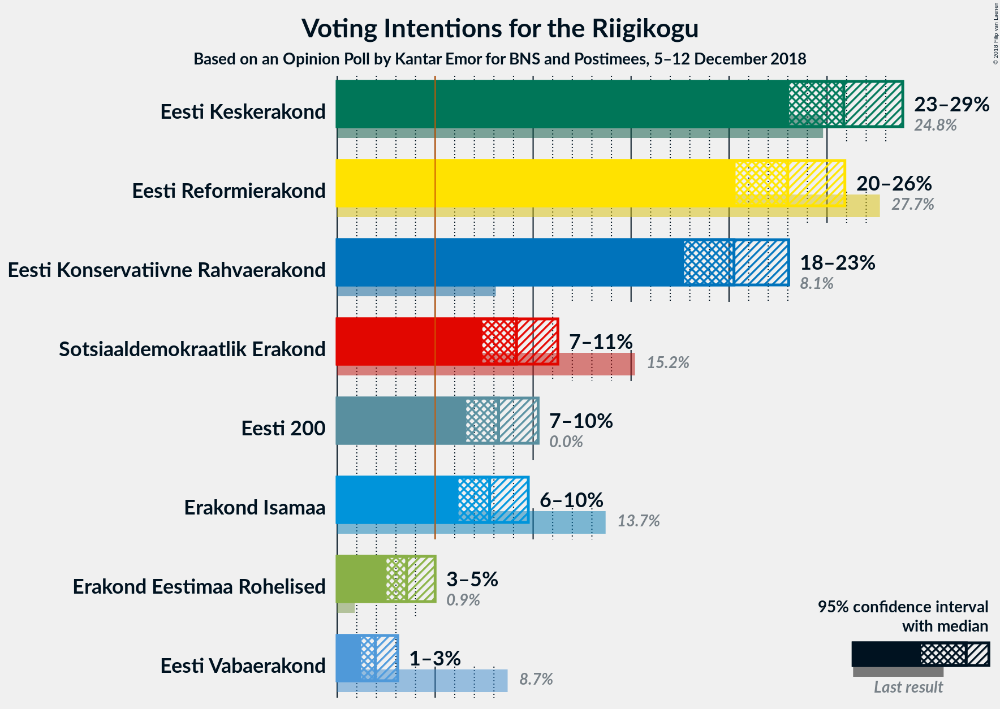

### Confidence Intervals

| Party | Last Result | Poll Result | 80% Confidence Interval | 90% Confidence Interval | 95% Confidence Interval | 99% Confidence Interval |
|:-----:|:-----------:|:-----------:|:-----------------------:|:-----------------------:|:-----------------------:|:-----------------------:|
| Eesti Keskerakond | 24.8% | 25.9% | 24.0–27.8% |23.5–28.4% |23.1–28.9% |22.2–29.8% |
| Eesti Reformierakond | 27.7% | 23.0% | 21.2–24.9% |20.7–25.4% |20.3–25.9% |19.5–26.8% |
| Eesti Konservatiivne Rahvaerakond | 8.1% | 20.3% | 18.6–22.1% |18.1–22.6% |17.7–23.0% |16.9–23.9% |
| Sotsiaaldemokraatlik Erakond | 15.2% | 9.2% | 8.0–10.5% |7.7–10.9% |7.4–11.3% |6.9–11.9% |
| Eesti 200 | 0.0% | 8.2% | 7.1–9.6% |6.8–9.9% |6.6–10.3% |6.1–10.9% |
| Erakond Isamaa | 13.7% | 7.8% | 6.7–9.1% |6.4–9.4% |6.2–9.8% |5.7–10.4% |
| Erakond Eestimaa Rohelised | 0.9% | 3.5% | 2.9–4.5% |2.7–4.8% |2.5–5.0% |2.2–5.5% |
| Eesti Vabaerakond | 8.7% | 1.9% | 1.5–2.7% |1.3–2.9% |1.2–3.1% |1.0–3.5% |

*Note:* The poll result column reflects the actual value used in the calculations. Published results may vary slightly, and in addition be rounded to fewer digits.

## Seats

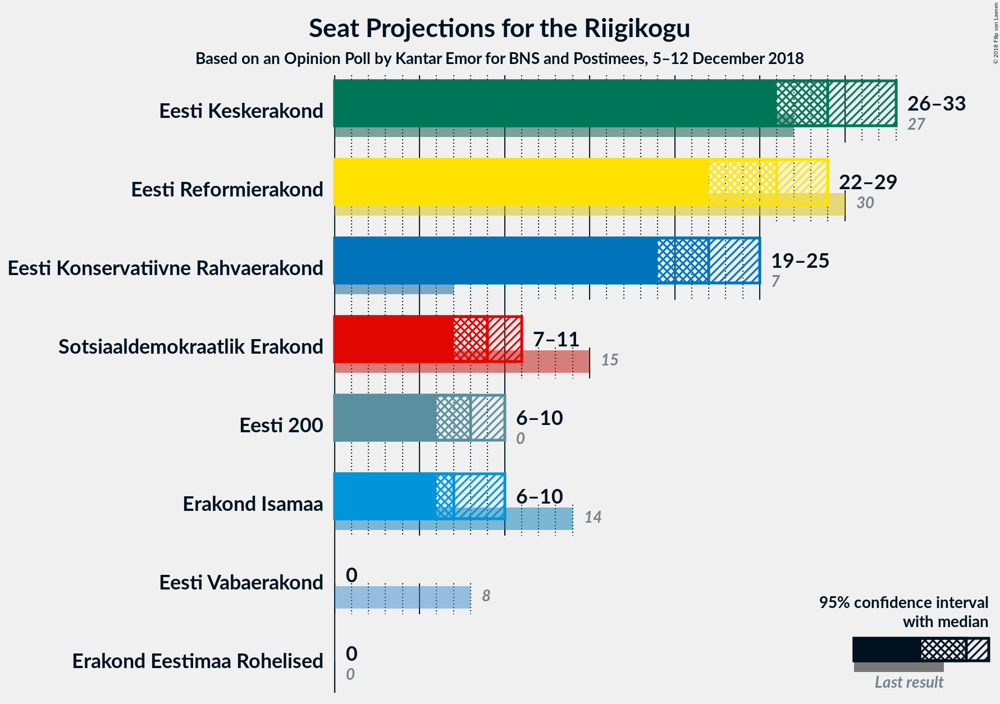

### Confidence Intervals

| Party | Last Result | Median | 80% Confidence Interval | 90% Confidence Interval | 95% Confidence Interval | 99% Confidence Interval |
|:-----:|:-----------:|:------:|:-----------------------:|:-----------------------:|:-----------------------:|:-----------------------:|
| <a href="#eesti-keskerakond">Eesti Keskerakond</a> | 27 | 29 | 27–31 |26–32 |26–33 |25–34 |
| <a href="#eesti-reformierakond">Eesti Reformierakond</a> | 30 | 26 | 23–28 |23–28 |22–29 |21–30 |
| <a href="#eesti-konservatiivne-rahvaerakond">Eesti Konservatiivne Rahvaerakond</a> | 7 | 22 | 20–24 |19–25 |19–25 |18–27 |
| <a href="#sotsiaaldemokraatlik-erakond">Sotsiaaldemokraatlik Erakond</a> | 15 | 9 | 7–10 |7–11 |7–11 |6–12 |
| <a href="#eesti-200">Eesti 200</a> | 0 | 8 | 7–9 |6–10 |6–10 |6–11 |
| <a href="#erakond-isamaa">Erakond Isamaa</a> | 14 | 7 | 6–9 |6–9 |6–10 |5–10 |
| <a href="#erakond-eestimaa-rohelised">Erakond Eestimaa Rohelised</a> | 0 | 0 | 0 |0 |0 |0–5 |
| <a href="#eesti-vabaerakond">Eesti Vabaerakond</a> | 8 | 0 | 0 |0 |0 |0 |

### Eesti Keskerakond

*For a full overview of the results for this party, see the [Eesti Keskerakond](party-eestikeskerakond.html) page.*

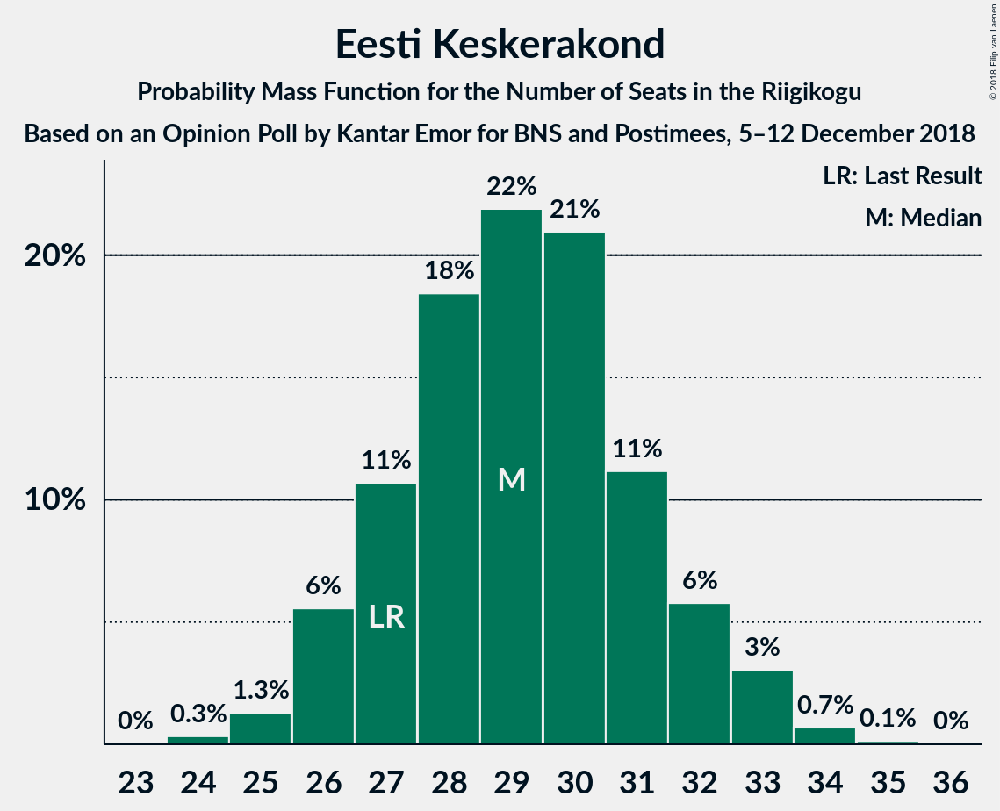

| Number of Seats | Probability | Accumulated | Special Marks |
|:---------------:|:-----------:|:-----------:|:-------------:|
| 24 | 0.3% | 100% |  |
| 25 | 1.3% | 99.6% |  |
| 26 | 6% | 98% |  |
| 27 | 11% | 93% | Last Result |
| 28 | 18% | 82% |  |
| 29 | 22% | 64% | Median |
| 30 | 21% | 42% |  |
| 31 | 11% | 21% |  |
| 32 | 6% | 10% |  |
| 33 | 3% | 4% |  |
| 34 | 0.7% | 0.8% |  |
| 35 | 0.1% | 0.2% |  |
| 36 | 0% | 0% |  |

### Eesti Reformierakond

*For a full overview of the results for this party, see the [Eesti Reformierakond](party-eestireformierakond.html) page.*

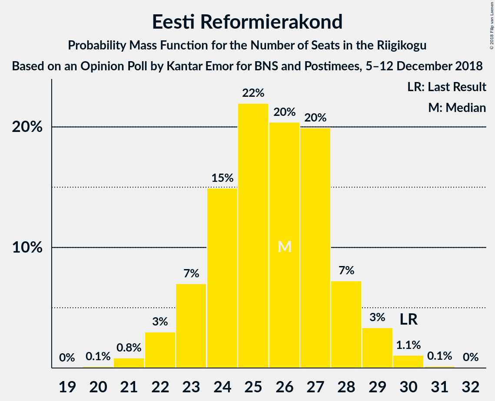

| Number of Seats | Probability | Accumulated | Special Marks |
|:---------------:|:-----------:|:-----------:|:-------------:|
| 20 | 0.1% | 100% |  |
| 21 | 0.8% | 99.9% |  |
| 22 | 3% | 99.0% |  |
| 23 | 7% | 96% |  |
| 24 | 15% | 89% |  |
| 25 | 22% | 74% |  |
| 26 | 20% | 52% | Median |
| 27 | 20% | 32% |  |
| 28 | 7% | 12% |  |
| 29 | 3% | 5% |  |
| 30 | 1.1% | 1.2% | Last Result |
| 31 | 0.1% | 0.2% |  |
| 32 | 0% | 0% |  |

### Eesti Konservatiivne Rahvaerakond

*For a full overview of the results for this party, see the [Eesti Konservatiivne Rahvaerakond](party-eestikonservatiivnerahvaerakond.html) page.*

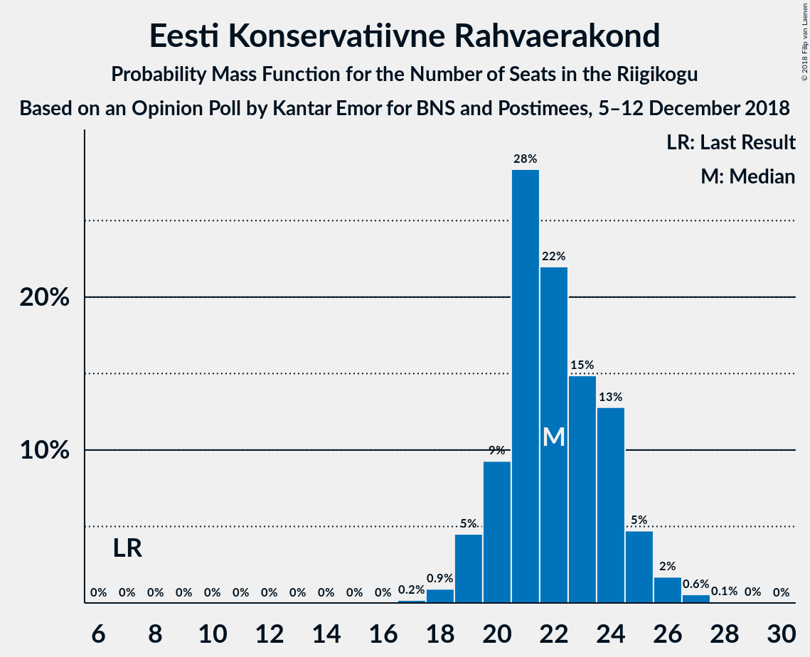

| Number of Seats | Probability | Accumulated | Special Marks |
|:---------------:|:-----------:|:-----------:|:-------------:|
| 7 | 0% | 100% | Last Result |
| 8 | 0% | 100% |  |
| 9 | 0% | 100% |  |
| 10 | 0% | 100% |  |
| 11 | 0% | 100% |  |
| 12 | 0% | 100% |  |
| 13 | 0% | 100% |  |
| 14 | 0% | 100% |  |
| 15 | 0% | 100% |  |
| 16 | 0% | 100% |  |
| 17 | 0.2% | 100% |  |
| 18 | 0.9% | 99.8% |  |
| 19 | 5% | 98.9% |  |
| 20 | 9% | 94% |  |
| 21 | 28% | 85% |  |
| 22 | 22% | 57% | Median |
| 23 | 15% | 35% |  |
| 24 | 13% | 20% |  |
| 25 | 5% | 7% |  |
| 26 | 2% | 2% |  |
| 27 | 0.6% | 0.7% |  |
| 28 | 0.1% | 0.1% |  |
| 29 | 0% | 0% |  |

### Sotsiaaldemokraatlik Erakond

*For a full overview of the results for this party, see the [Sotsiaaldemokraatlik Erakond](party-sotsiaaldemokraatlikerakond.html) page.*

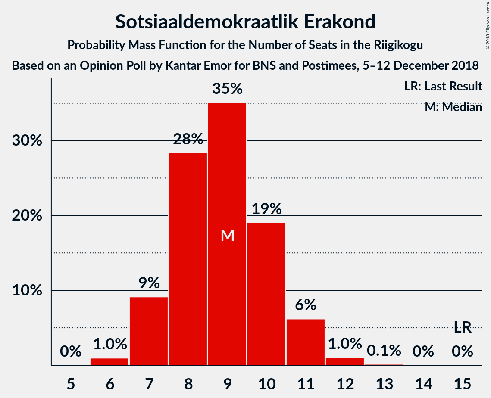

| Number of Seats | Probability | Accumulated | Special Marks |
|:---------------:|:-----------:|:-----------:|:-------------:|
| 6 | 1.0% | 100% |  |
| 7 | 9% | 99.0% |  |
| 8 | 28% | 90% |  |
| 9 | 35% | 62% | Median |
| 10 | 19% | 26% |  |
| 11 | 6% | 7% |  |
| 12 | 1.0% | 1.2% |  |
| 13 | 0.1% | 0.2% |  |
| 14 | 0% | 0% |  |
| 15 | 0% | 0% | Last Result |

### Eesti 200

*For a full overview of the results for this party, see the [Eesti 200](party-eesti200.html) page.*

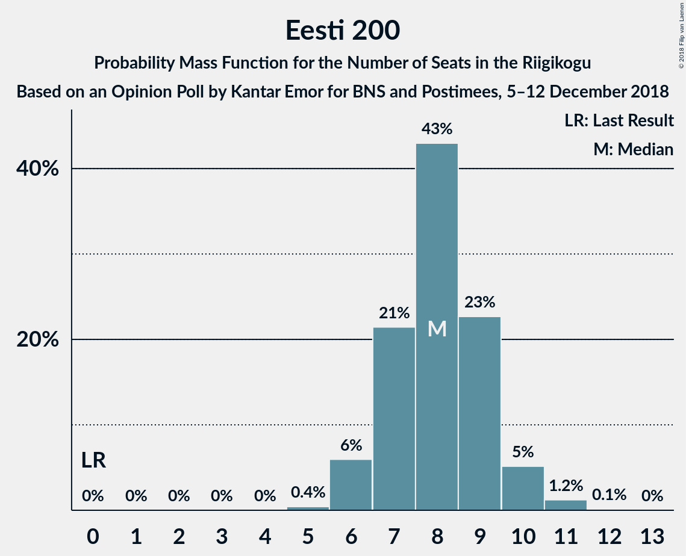

| Number of Seats | Probability | Accumulated | Special Marks |
|:---------------:|:-----------:|:-----------:|:-------------:|
| 0 | 0% | 100% | Last Result |
| 1 | 0% | 100% |  |
| 2 | 0% | 100% |  |
| 3 | 0% | 100% |  |
| 4 | 0% | 100% |  |
| 5 | 0.4% | 100% |  |
| 6 | 6% | 99.6% |  |
| 7 | 21% | 94% |  |
| 8 | 43% | 72% | Median |
| 9 | 23% | 29% |  |
| 10 | 5% | 7% |  |
| 11 | 1.2% | 1.4% |  |
| 12 | 0.1% | 0.1% |  |
| 13 | 0% | 0% |  |

### Erakond Isamaa

*For a full overview of the results for this party, see the [Erakond Isamaa](party-erakondisamaa.html) page.*

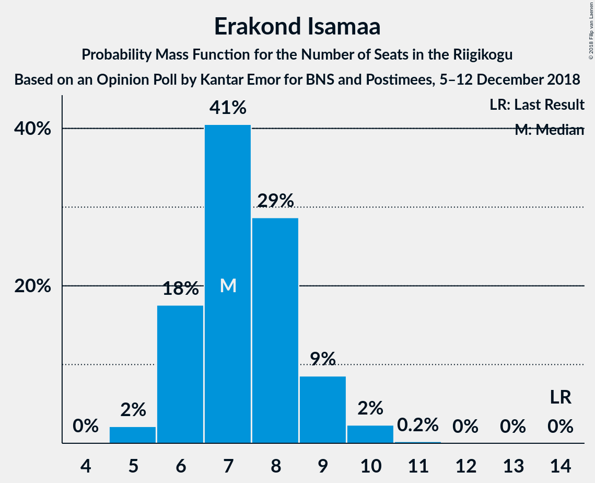

| Number of Seats | Probability | Accumulated | Special Marks |
|:---------------:|:-----------:|:-----------:|:-------------:|
| 5 | 2% | 100% |  |
| 6 | 18% | 98% |  |
| 7 | 41% | 80% | Median |
| 8 | 29% | 40% |  |
| 9 | 9% | 11% |  |
| 10 | 2% | 3% |  |
| 11 | 0.2% | 0.2% |  |
| 12 | 0% | 0% |  |
| 13 | 0% | 0% |  |
| 14 | 0% | 0% | Last Result |

### Erakond Eestimaa Rohelised

*For a full overview of the results for this party, see the [Erakond Eestimaa Rohelised](party-erakondeestimaarohelised.html) page.*

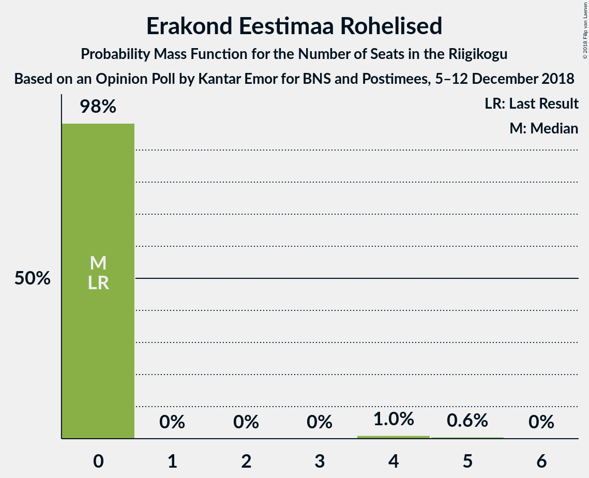

| Number of Seats | Probability | Accumulated | Special Marks |
|:---------------:|:-----------:|:-----------:|:-------------:|
| 0 | 98% | 100% | Last Result, Median |
| 1 | 0% | 2% |  |
| 2 | 0% | 2% |  |
| 3 | 0% | 2% |  |
| 4 | 1.0% | 2% |  |
| 5 | 0.6% | 0.6% |  |
| 6 | 0% | 0% |  |

### Eesti Vabaerakond

*For a full overview of the results for this party, see the [Eesti Vabaerakond](party-eestivabaerakond.html) page.*

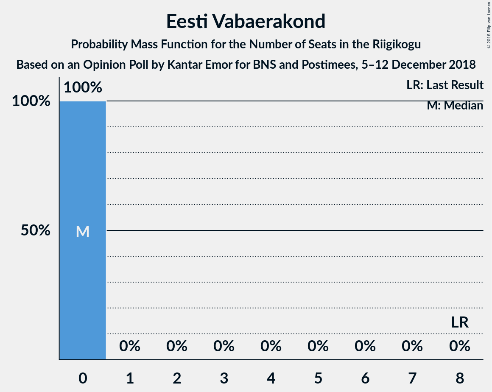

| Number of Seats | Probability | Accumulated | Special Marks |
|:---------------:|:-----------:|:-----------:|:-------------:|
| 0 | 100% | 100% | Median |
| 1 | 0% | 0% |  |
| 2 | 0% | 0% |  |
| 3 | 0% | 0% |  |
| 4 | 0% | 0% |  |
| 5 | 0% | 0% |  |
| 6 | 0% | 0% |  |
| 7 | 0% | 0% |  |
| 8 | 0% | 0% | Last Result |

## Coalitions

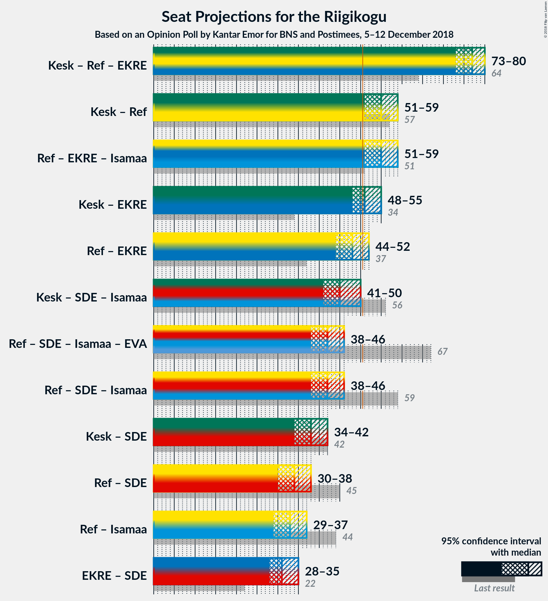

### Confidence Intervals

| Coalition | Last Result | Median | Majority? | 80% Confidence Interval | 90% Confidence Interval | 95% Confidence Interval | 99% Confidence Interval |
|:---------:|:-----------:|:------:|:---------:|:-----------------------:|:-----------------------:|:-----------------------:|:-----------------------:|
| Eesti Keskerakond – Eesti Reformierakond – Eesti Konservatiivne Rahvaerakond | 64 | 77 | 100% | 75–79 | 74–80 | 73–80 | 72–81 |
| Eesti Keskerakond – Eesti Reformierakond | 57 | 55 | 98% | 52–57 | 51–58 | 51–59 | 49–60 |
| Eesti Reformierakond – Eesti Konservatiivne Rahvaerakond – Erakond Isamaa | 51 | 55 | 99.1% | 52–58 | 52–58 | 51–59 | 50–60 |
| Eesti Keskerakond – Eesti Konservatiivne Rahvaerakond | 34 | 51 | 60% | 49–54 | 48–55 | 48–55 | 46–57 |
| Eesti Reformierakond – Eesti Konservatiivne Rahvaerakond | 37 | 48 | 9% | 45–50 | 44–51 | 44–52 | 42–53 |
| Eesti Keskerakond – Sotsiaaldemokraatlik Erakond – Erakond Isamaa | 56 | 45 | 0.5% | 43–48 | 42–49 | 41–50 | 40–50 |
| Eesti Reformierakond – Sotsiaaldemokraatlik Erakond – Erakond Isamaa – Eesti Vabaerakond | 67 | 42 | 0% | 39–44 | 39–45 | 38–46 | 37–47 |
| Eesti Reformierakond – Sotsiaaldemokraatlik Erakond – Erakond Isamaa | 59 | 42 | 0% | 39–44 | 39–45 | 38–46 | 37–47 |
| Eesti Keskerakond – Sotsiaaldemokraatlik Erakond | 42 | 38 | 0% | 35–41 | 35–41 | 34–42 | 33–43 |
| Eesti Reformierakond – Sotsiaaldemokraatlik Erakond | 45 | 34 | 0% | 32–36 | 31–37 | 30–38 | 30–39 |
| Eesti Reformierakond – Erakond Isamaa | 44 | 33 | 0% | 30–35 | 30–36 | 29–37 | 28–37 |
| Eesti Konservatiivne Rahvaerakond – Sotsiaaldemokraatlik Erakond | 22 | 31 | 0% | 29–33 | 28–34 | 28–35 | 26–36 |

### Eesti Keskerakond – Eesti Reformierakond – Eesti Konservatiivne Rahvaerakond

| Number of Seats | Probability | Accumulated | Special Marks |
|:---------------:|:-----------:|:-----------:|:-------------:|
| 64 | 0% | 100% | Last Result |
| 65 | 0% | 100% |  |
| 66 | 0% | 100% |  |
| 67 | 0% | 100% |  |
| 68 | 0% | 100% |  |
| 69 | 0% | 100% |  |
| 70 | 0.1% | 100% |  |
| 71 | 0.2% | 99.9% |  |
| 72 | 0.7% | 99.7% |  |
| 73 | 2% | 99.0% |  |
| 74 | 5% | 97% |  |
| 75 | 13% | 92% |  |
| 76 | 24% | 79% |  |
| 77 | 24% | 55% | Median |
| 78 | 18% | 31% |  |
| 79 | 7% | 13% |  |
| 80 | 4% | 6% |  |
| 81 | 2% | 2% |  |
| 82 | 0.1% | 0.2% |  |
| 83 | 0% | 0% |  |

### Eesti Keskerakond – Eesti Reformierakond

| Number of Seats | Probability | Accumulated | Special Marks |
|:---------------:|:-----------:|:-----------:|:-------------:|
| 48 | 0.1% | 100% |  |
| 49 | 0.4% | 99.8% |  |
| 50 | 1.4% | 99.4% |  |
| 51 | 3% | 98% | Majority |
| 52 | 9% | 95% |  |
| 53 | 12% | 86% |  |
| 54 | 19% | 74% |  |
| 55 | 16% | 54% | Median |
| 56 | 20% | 38% |  |
| 57 | 10% | 18% | Last Result |
| 58 | 4% | 8% |  |
| 59 | 3% | 3% |  |
| 60 | 0.5% | 0.6% |  |
| 61 | 0.1% | 0.1% |  |
| 62 | 0% | 0% |  |

### Eesti Reformierakond – Eesti Konservatiivne Rahvaerakond – Erakond Isamaa

| Number of Seats | Probability | Accumulated | Special Marks |
|:---------------:|:-----------:|:-----------:|:-------------:|
| 48 | 0.1% | 100% |  |
| 49 | 0.2% | 99.9% |  |
| 50 | 0.6% | 99.7% |  |
| 51 | 3% | 99.1% | Last Result, Majority |
| 52 | 7% | 96% |  |
| 53 | 12% | 89% |  |
| 54 | 19% | 77% |  |
| 55 | 26% | 59% | Median |
| 56 | 10% | 33% |  |
| 57 | 11% | 22% |  |
| 58 | 7% | 11% |  |
| 59 | 3% | 4% |  |
| 60 | 0.9% | 1.2% |  |
| 61 | 0.2% | 0.3% |  |
| 62 | 0% | 0% |  |

### Eesti Keskerakond – Eesti Konservatiivne Rahvaerakond

| Number of Seats | Probability | Accumulated | Special Marks |
|:---------------:|:-----------:|:-----------:|:-------------:|
| 34 | 0% | 100% | Last Result |
| 35 | 0% | 100% |  |
| 36 | 0% | 100% |  |
| 37 | 0% | 100% |  |
| 38 | 0% | 100% |  |
| 39 | 0% | 100% |  |
| 40 | 0% | 100% |  |
| 41 | 0% | 100% |  |
| 42 | 0% | 100% |  |
| 43 | 0% | 100% |  |
| 44 | 0.1% | 100% |  |
| 45 | 0.2% | 99.9% |  |
| 46 | 0.4% | 99.7% |  |
| 47 | 1.3% | 99.3% |  |
| 48 | 5% | 98% |  |
| 49 | 9% | 93% |  |
| 50 | 25% | 84% |  |
| 51 | 24% | 60% | Median, Majority |
| 52 | 13% | 35% |  |
| 53 | 9% | 23% |  |
| 54 | 7% | 13% |  |
| 55 | 4% | 6% |  |
| 56 | 0.8% | 2% |  |
| 57 | 0.7% | 0.8% |  |
| 58 | 0% | 0.1% |  |
| 59 | 0% | 0% |  |

### Eesti Reformierakond – Eesti Konservatiivne Rahvaerakond

| Number of Seats | Probability | Accumulated | Special Marks |
|:---------------:|:-----------:|:-----------:|:-------------:|
| 37 | 0% | 100% | Last Result |
| 38 | 0% | 100% |  |
| 39 | 0% | 100% |  |
| 40 | 0% | 100% |  |
| 41 | 0.1% | 100% |  |
| 42 | 0.4% | 99.9% |  |
| 43 | 1.1% | 99.5% |  |
| 44 | 6% | 98% |  |
| 45 | 6% | 93% |  |
| 46 | 18% | 86% |  |
| 47 | 10% | 68% |  |
| 48 | 30% | 58% | Median |
| 49 | 12% | 28% |  |
| 50 | 8% | 17% |  |
| 51 | 6% | 9% | Majority |
| 52 | 2% | 3% |  |
| 53 | 0.7% | 0.8% |  |
| 54 | 0.1% | 0.1% |  |
| 55 | 0% | 0.1% |  |
| 56 | 0% | 0% |  |

### Eesti Keskerakond – Sotsiaaldemokraatlik Erakond – Erakond Isamaa

| Number of Seats | Probability | Accumulated | Special Marks |
|:---------------:|:-----------:|:-----------:|:-------------:|
| 39 | 0.1% | 100% |  |
| 40 | 0.4% | 99.8% |  |
| 41 | 2% | 99.4% |  |
| 42 | 6% | 97% |  |
| 43 | 7% | 91% |  |
| 44 | 18% | 84% |  |
| 45 | 24% | 66% | Median |
| 46 | 17% | 42% |  |
| 47 | 9% | 24% |  |
| 48 | 8% | 15% |  |
| 49 | 5% | 8% |  |
| 50 | 2% | 3% |  |
| 51 | 0.3% | 0.5% | Majority |
| 52 | 0.1% | 0.1% |  |
| 53 | 0% | 0% |  |
| 54 | 0% | 0% |  |
| 55 | 0% | 0% |  |
| 56 | 0% | 0% | Last Result |

### Eesti Reformierakond – Sotsiaaldemokraatlik Erakond – Erakond Isamaa – Eesti Vabaerakond

| Number of Seats | Probability | Accumulated | Special Marks |
|:---------------:|:-----------:|:-----------:|:-------------:|
| 35 | 0.1% | 100% |  |
| 36 | 0.3% | 99.9% |  |
| 37 | 2% | 99.7% |  |
| 38 | 2% | 98% |  |
| 39 | 9% | 96% |  |
| 40 | 8% | 87% |  |
| 41 | 24% | 78% |  |
| 42 | 15% | 55% | Median |
| 43 | 27% | 40% |  |
| 44 | 7% | 14% |  |
| 45 | 4% | 6% |  |
| 46 | 2% | 3% |  |
| 47 | 0.6% | 0.8% |  |
| 48 | 0.1% | 0.2% |  |
| 49 | 0% | 0% |  |
| 50 | 0% | 0% |  |
| 51 | 0% | 0% | Majority |
| 52 | 0% | 0% |  |
| 53 | 0% | 0% |  |
| 54 | 0% | 0% |  |
| 55 | 0% | 0% |  |
| 56 | 0% | 0% |  |
| 57 | 0% | 0% |  |
| 58 | 0% | 0% |  |
| 59 | 0% | 0% |  |
| 60 | 0% | 0% |  |
| 61 | 0% | 0% |  |
| 62 | 0% | 0% |  |
| 63 | 0% | 0% |  |
| 64 | 0% | 0% |  |
| 65 | 0% | 0% |  |
| 66 | 0% | 0% |  |
| 67 | 0% | 0% | Last Result |

### Eesti Reformierakond – Sotsiaaldemokraatlik Erakond – Erakond Isamaa

| Number of Seats | Probability | Accumulated | Special Marks |
|:---------------:|:-----------:|:-----------:|:-------------:|
| 35 | 0.1% | 100% |  |
| 36 | 0.3% | 99.9% |  |
| 37 | 2% | 99.7% |  |
| 38 | 2% | 98% |  |
| 39 | 9% | 96% |  |
| 40 | 8% | 87% |  |
| 41 | 24% | 78% |  |
| 42 | 15% | 55% | Median |
| 43 | 27% | 40% |  |
| 44 | 7% | 14% |  |
| 45 | 4% | 6% |  |
| 46 | 2% | 3% |  |
| 47 | 0.6% | 0.8% |  |
| 48 | 0.1% | 0.2% |  |
| 49 | 0% | 0% |  |
| 50 | 0% | 0% |  |
| 51 | 0% | 0% | Majority |
| 52 | 0% | 0% |  |
| 53 | 0% | 0% |  |
| 54 | 0% | 0% |  |
| 55 | 0% | 0% |  |
| 56 | 0% | 0% |  |
| 57 | 0% | 0% |  |
| 58 | 0% | 0% |  |
| 59 | 0% | 0% | Last Result |

### Eesti Keskerakond – Sotsiaaldemokraatlik Erakond

| Number of Seats | Probability | Accumulated | Special Marks |
|:---------------:|:-----------:|:-----------:|:-------------:|
| 32 | 0.2% | 100% |  |
| 33 | 0.7% | 99.8% |  |
| 34 | 2% | 99.1% |  |
| 35 | 8% | 97% |  |
| 36 | 13% | 89% |  |
| 37 | 13% | 77% |  |
| 38 | 31% | 64% | Median |
| 39 | 12% | 33% |  |
| 40 | 7% | 21% |  |
| 41 | 10% | 14% |  |
| 42 | 3% | 4% | Last Result |
| 43 | 0.9% | 1.2% |  |
| 44 | 0.2% | 0.3% |  |
| 45 | 0.1% | 0.1% |  |
| 46 | 0% | 0% |  |

### Eesti Reformierakond – Sotsiaaldemokraatlik Erakond

| Number of Seats | Probability | Accumulated | Special Marks |
|:---------------:|:-----------:|:-----------:|:-------------:|
| 28 | 0.1% | 100% |  |
| 29 | 0.2% | 99.9% |  |
| 30 | 2% | 99.7% |  |
| 31 | 3% | 97% |  |
| 32 | 7% | 94% |  |
| 33 | 20% | 88% |  |
| 34 | 21% | 68% |  |
| 35 | 11% | 47% | Median |
| 36 | 26% | 36% |  |
| 37 | 6% | 10% |  |
| 38 | 2% | 4% |  |
| 39 | 2% | 2% |  |
| 40 | 0.2% | 0.3% |  |
| 41 | 0.1% | 0.1% |  |
| 42 | 0% | 0% |  |
| 43 | 0% | 0% |  |
| 44 | 0% | 0% |  |
| 45 | 0% | 0% | Last Result |

### Eesti Reformierakond – Erakond Isamaa

| Number of Seats | Probability | Accumulated | Special Marks |
|:---------------:|:-----------:|:-----------:|:-------------:|
| 27 | 0.2% | 100% |  |
| 28 | 0.7% | 99.8% |  |
| 29 | 2% | 99.1% |  |
| 30 | 8% | 97% |  |
| 31 | 11% | 89% |  |
| 32 | 14% | 78% |  |
| 33 | 24% | 64% | Median |
| 34 | 24% | 40% |  |
| 35 | 10% | 16% |  |
| 36 | 4% | 6% |  |
| 37 | 2% | 3% |  |
| 38 | 0.4% | 0.5% |  |
| 39 | 0.1% | 0.1% |  |
| 40 | 0% | 0% |  |
| 41 | 0% | 0% |  |
| 42 | 0% | 0% |  |
| 43 | 0% | 0% |  |
| 44 | 0% | 0% | Last Result |

### Eesti Konservatiivne Rahvaerakond – Sotsiaaldemokraatlik Erakond

| Number of Seats | Probability | Accumulated | Special Marks |
|:---------------:|:-----------:|:-----------:|:-------------:|
| 22 | 0% | 100% | Last Result |
| 23 | 0% | 100% |  |
| 24 | 0% | 100% |  |
| 25 | 0.1% | 100% |  |
| 26 | 0.7% | 99.9% |  |
| 27 | 2% | 99.3% |  |
| 28 | 5% | 98% |  |
| 29 | 18% | 93% |  |
| 30 | 25% | 75% |  |
| 31 | 11% | 50% | Median |
| 32 | 20% | 39% |  |
| 33 | 11% | 19% |  |
| 34 | 5% | 8% |  |
| 35 | 2% | 3% |  |
| 36 | 0.6% | 0.9% |  |
| 37 | 0.2% | 0.2% |  |
| 38 | 0% | 0% |  |

## Technical Information

### Opinion Poll

+ **Polling firm:** Kantar Emor
+ **Commissioner(s):** BNS and Postimees
+ **Fieldwork period:** 5–12 December 2018

### Calculations

+ **Sample size:** 874
+ **Simulations done:** 1,048,576
+ **Error estimate:** 2.30%

