# Opinion Poll by Turu-uuringute AS for ERR, 15–28 January 2019

<a href="#voting-intentions">Voting Intentions</a> | <a href="#seats">Seats</a> | <a href="#coalitions">Coalitions</a> | <a href="#technical-information">Technical Information</a>

## Voting Intentions

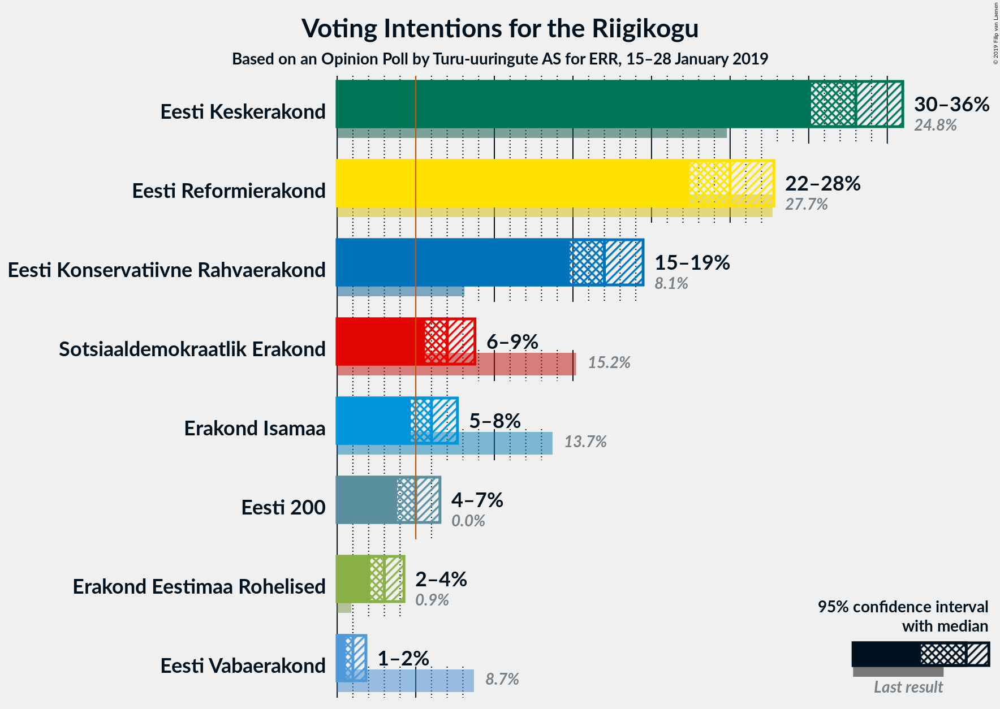

### Confidence Intervals

| Party | Last Result | Poll Result | 80% Confidence Interval | 90% Confidence Interval | 95% Confidence Interval | 99% Confidence Interval |
|:-----:|:-----------:|:-----------:|:-----------------------:|:-----------------------:|:-----------------------:|:-----------------------:|
| Eesti Keskerakond | 24.8% | 33.0% | 31.1–34.9% |30.6–35.5% |30.1–36.0% |29.3–36.9% |
| Eesti Reformierakond | 27.7% | 25.0% | 23.3–26.8% |22.8–27.3% |22.4–27.8% |21.6–28.7% |
| Eesti Konservatiivne Rahvaerakond | 8.1% | 17.0% | 15.5–18.6% |15.2–19.1% |14.8–19.5% |14.1–20.3% |
| Sotsiaaldemokraatlik Erakond | 15.2% | 7.0% | 6.1–8.2% |5.8–8.5% |5.6–8.8% |5.2–9.3% |
| Erakond Isamaa | 13.7% | 6.0% | 5.1–7.1% |4.9–7.4% |4.7–7.7% |4.3–8.2% |
| Eesti 200 | 0.0% | 5.0% | 4.2–6.0% |4.0–6.3% |3.8–6.5% |3.5–7.1% |
| Erakond Eestimaa Rohelised | 0.9% | 3.0% | 2.4–3.8% |2.2–4.1% |2.1–4.3% |1.9–4.7% |
| Eesti Vabaerakond | 8.7% | 1.0% | 0.7–1.5% |0.6–1.7% |0.5–1.8% |0.4–2.1% |

*Note:* The poll result column reflects the actual value used in the calculations. Published results may vary slightly, and in addition be rounded to fewer digits.

## Seats

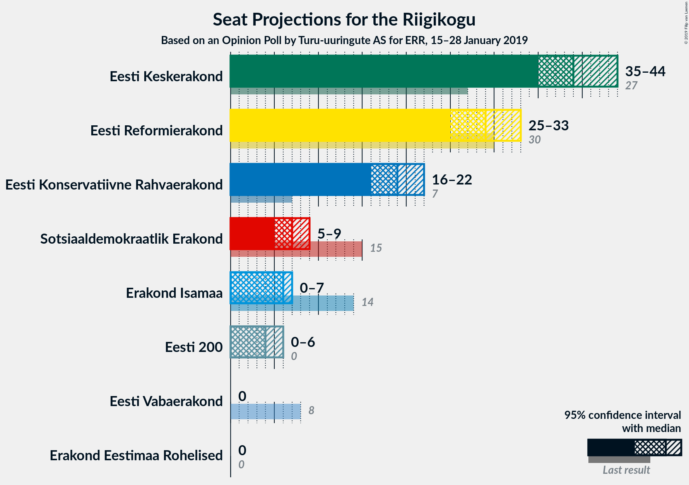

### Confidence Intervals

| Party | Last Result | Median | 80% Confidence Interval | 90% Confidence Interval | 95% Confidence Interval | 99% Confidence Interval |
|:-----:|:-----------:|:------:|:-----------------------:|:-----------------------:|:-----------------------:|:-----------------------:|
| <a href="#eesti-keskerakond">Eesti Keskerakond</a> | 27 | 39 | 36–42 |36–43 |35–44 |34–45 |
| <a href="#eesti-reformierakond">Eesti Reformierakond</a> | 30 | 29 | 26–31 |25–32 |25–33 |24–34 |
| <a href="#eesti-konservatiivne-rahvaerakond">Eesti Konservatiivne Rahvaerakond</a> | 7 | 19 | 17–21 |16–21 |16–22 |15–23 |
| <a href="#sotsiaaldemokraatlik-erakond">Sotsiaaldemokraatlik Erakond</a> | 15 | 7 | 6–8 |5–8 |5–9 |4–9 |
| <a href="#erakond-isamaa">Erakond Isamaa</a> | 14 | 6 | 5–7 |0–7 |0–7 |0–8 |
| <a href="#eesti-200">Eesti 200</a> | 0 | 4 | 0–5 |0–6 |0–6 |0–7 |
| <a href="#erakond-eestimaa-rohelised">Erakond Eestimaa Rohelised</a> | 0 | 0 | 0 |0 |0 |0 |
| <a href="#eesti-vabaerakond">Eesti Vabaerakond</a> | 8 | 0 | 0 |0 |0 |0 |

### Eesti Keskerakond

*For a full overview of the results for this party, see the [Eesti Keskerakond](party-eestikeskerakond.html) page.*

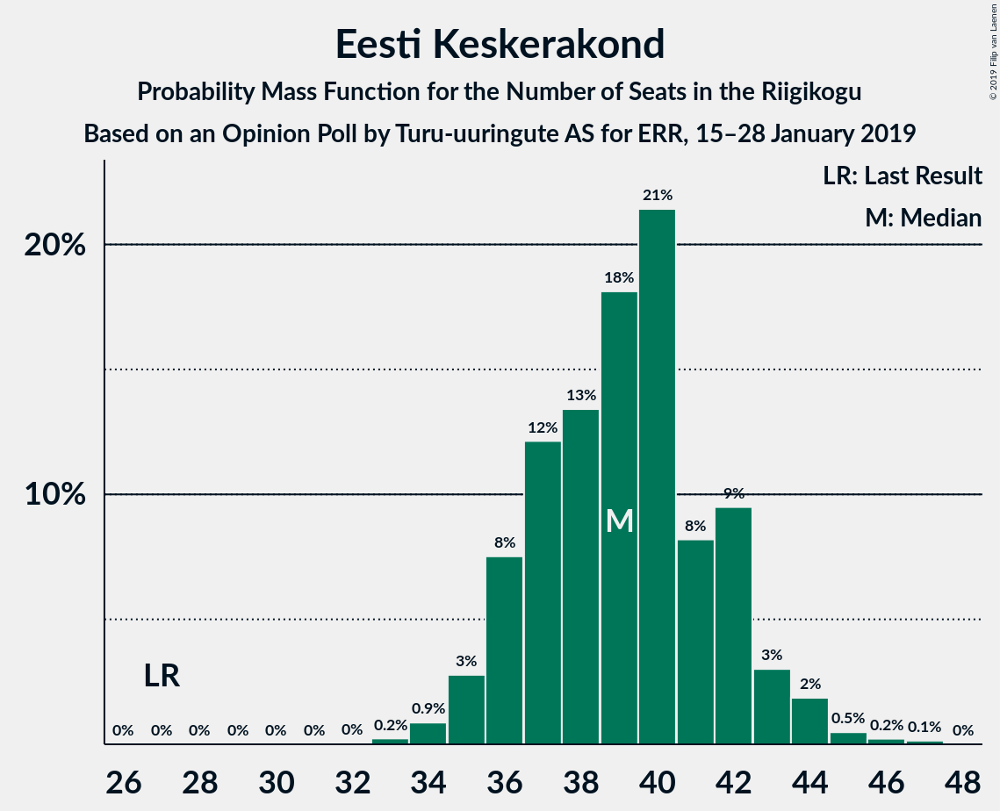

| Number of Seats | Probability | Accumulated | Special Marks |
|:---------------:|:-----------:|:-----------:|:-------------:|
| 27 | 0% | 100% | Last Result |
| 28 | 0% | 100% |  |
| 29 | 0% | 100% |  |
| 30 | 0% | 100% |  |
| 31 | 0% | 100% |  |
| 32 | 0% | 100% |  |
| 33 | 0.2% | 100% |  |
| 34 | 0.9% | 99.7% |  |
| 35 | 3% | 98.9% |  |
| 36 | 8% | 96% |  |
| 37 | 12% | 89% |  |
| 38 | 13% | 76% |  |
| 39 | 18% | 63% | Median |
| 40 | 21% | 45% |  |
| 41 | 8% | 23% |  |
| 42 | 9% | 15% |  |
| 43 | 3% | 6% |  |
| 44 | 2% | 3% |  |
| 45 | 0.5% | 0.9% |  |
| 46 | 0.2% | 0.4% |  |
| 47 | 0.1% | 0.2% |  |
| 48 | 0% | 0% |  |

### Eesti Reformierakond

*For a full overview of the results for this party, see the [Eesti Reformierakond](party-eestireformierakond.html) page.*

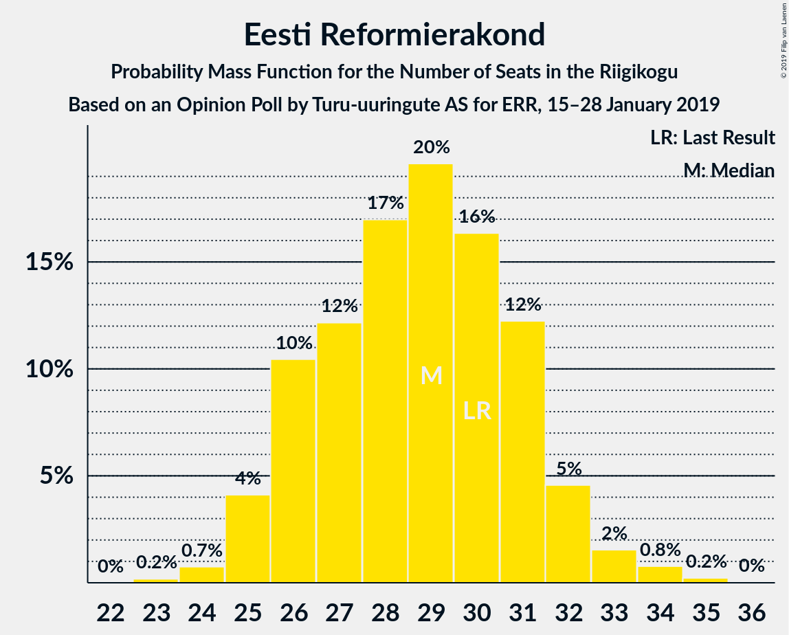

| Number of Seats | Probability | Accumulated | Special Marks |
|:---------------:|:-----------:|:-----------:|:-------------:|
| 23 | 0.2% | 100% |  |
| 24 | 0.7% | 99.8% |  |
| 25 | 4% | 99.1% |  |
| 26 | 10% | 95% |  |
| 27 | 12% | 84% |  |
| 28 | 17% | 72% |  |
| 29 | 20% | 55% | Median |
| 30 | 16% | 36% | Last Result |
| 31 | 12% | 19% |  |
| 32 | 5% | 7% |  |
| 33 | 2% | 3% |  |
| 34 | 0.8% | 1.0% |  |
| 35 | 0.2% | 0.3% |  |
| 36 | 0% | 0% |  |

### Eesti Konservatiivne Rahvaerakond

*For a full overview of the results for this party, see the [Eesti Konservatiivne Rahvaerakond](party-eestikonservatiivnerahvaerakond.html) page.*

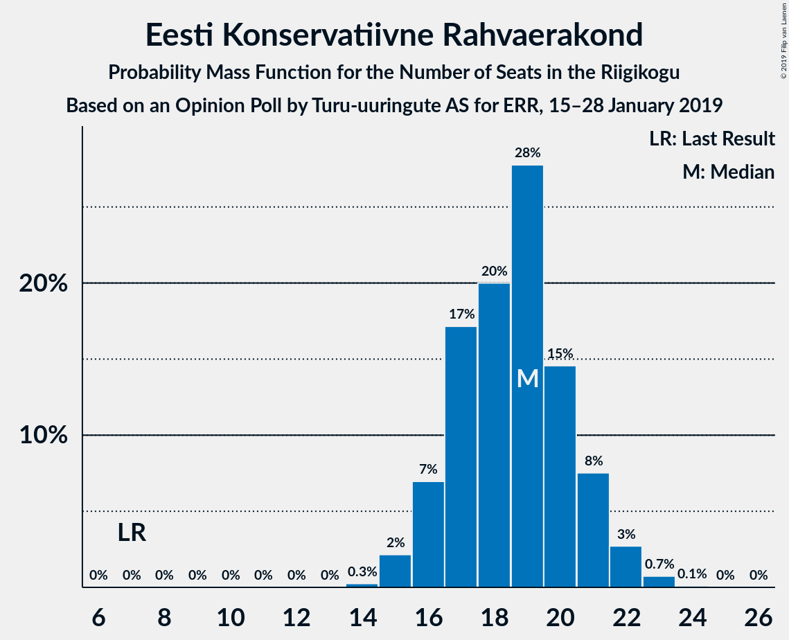

| Number of Seats | Probability | Accumulated | Special Marks |
|:---------------:|:-----------:|:-----------:|:-------------:|
| 7 | 0% | 100% | Last Result |
| 8 | 0% | 100% |  |
| 9 | 0% | 100% |  |
| 10 | 0% | 100% |  |
| 11 | 0% | 100% |  |
| 12 | 0% | 100% |  |
| 13 | 0% | 100% |  |
| 14 | 0.3% | 100% |  |
| 15 | 2% | 99.7% |  |
| 16 | 7% | 98% |  |
| 17 | 17% | 91% |  |
| 18 | 20% | 73% |  |
| 19 | 28% | 53% | Median |
| 20 | 15% | 26% |  |
| 21 | 8% | 11% |  |
| 22 | 3% | 4% |  |
| 23 | 0.7% | 0.9% |  |
| 24 | 0.1% | 0.1% |  |
| 25 | 0% | 0% |  |

### Sotsiaaldemokraatlik Erakond

*For a full overview of the results for this party, see the [Sotsiaaldemokraatlik Erakond](party-sotsiaaldemokraatlikerakond.html) page.*

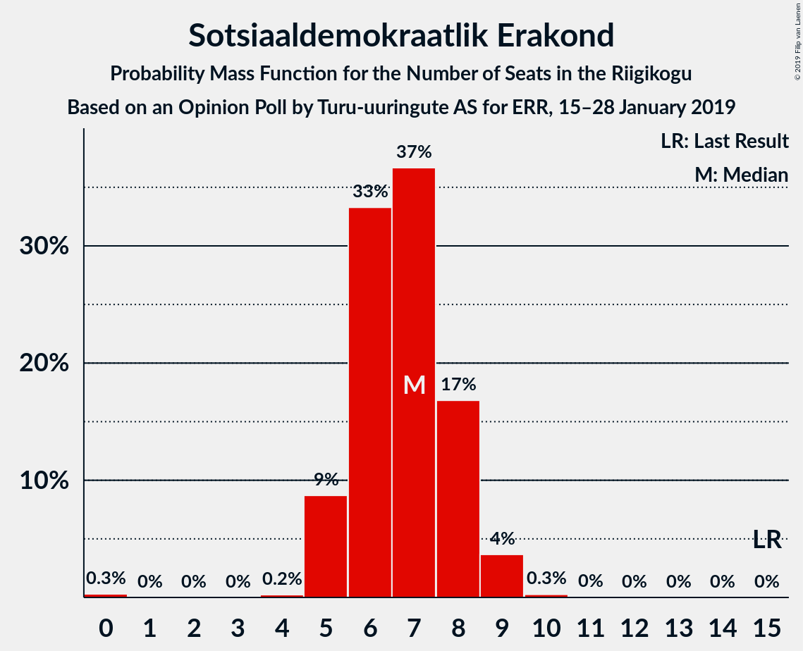

| Number of Seats | Probability | Accumulated | Special Marks |
|:---------------:|:-----------:|:-----------:|:-------------:|
| 0 | 0.3% | 100% |  |
| 1 | 0% | 99.7% |  |
| 2 | 0% | 99.7% |  |
| 3 | 0% | 99.7% |  |
| 4 | 0.2% | 99.7% |  |
| 5 | 9% | 99.5% |  |
| 6 | 33% | 91% |  |
| 7 | 37% | 57% | Median |
| 8 | 17% | 21% |  |
| 9 | 4% | 4% |  |
| 10 | 0.3% | 0.3% |  |
| 11 | 0% | 0% |  |
| 12 | 0% | 0% |  |
| 13 | 0% | 0% |  |
| 14 | 0% | 0% |  |
| 15 | 0% | 0% | Last Result |

### Erakond Isamaa

*For a full overview of the results for this party, see the [Erakond Isamaa](party-erakondisamaa.html) page.*

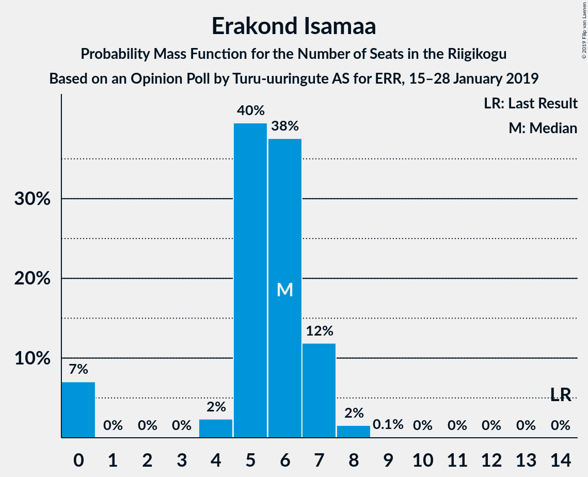

| Number of Seats | Probability | Accumulated | Special Marks |
|:---------------:|:-----------:|:-----------:|:-------------:|
| 0 | 7% | 100% |  |
| 1 | 0% | 93% |  |
| 2 | 0% | 93% |  |
| 3 | 0% | 93% |  |
| 4 | 2% | 93% |  |
| 5 | 40% | 91% |  |
| 6 | 38% | 51% | Median |
| 7 | 12% | 14% |  |
| 8 | 2% | 2% |  |
| 9 | 0.1% | 0.1% |  |
| 10 | 0% | 0% |  |
| 11 | 0% | 0% |  |
| 12 | 0% | 0% |  |
| 13 | 0% | 0% |  |
| 14 | 0% | 0% | Last Result |

### Eesti 200

*For a full overview of the results for this party, see the [Eesti 200](party-eesti200.html) page.*

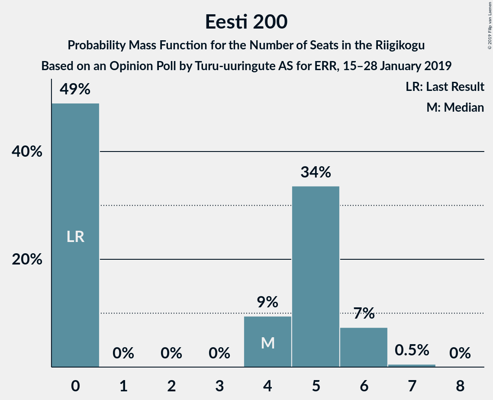

| Number of Seats | Probability | Accumulated | Special Marks |
|:---------------:|:-----------:|:-----------:|:-------------:|
| 0 | 49% | 100% | Last Result |
| 1 | 0% | 51% |  |
| 2 | 0% | 51% |  |
| 3 | 0% | 51% |  |
| 4 | 9% | 51% | Median |
| 5 | 34% | 42% |  |
| 6 | 7% | 8% |  |
| 7 | 0.5% | 0.6% |  |
| 8 | 0% | 0% |  |

### Erakond Eestimaa Rohelised

*For a full overview of the results for this party, see the [Erakond Eestimaa Rohelised](party-erakondeestimaarohelised.html) page.*

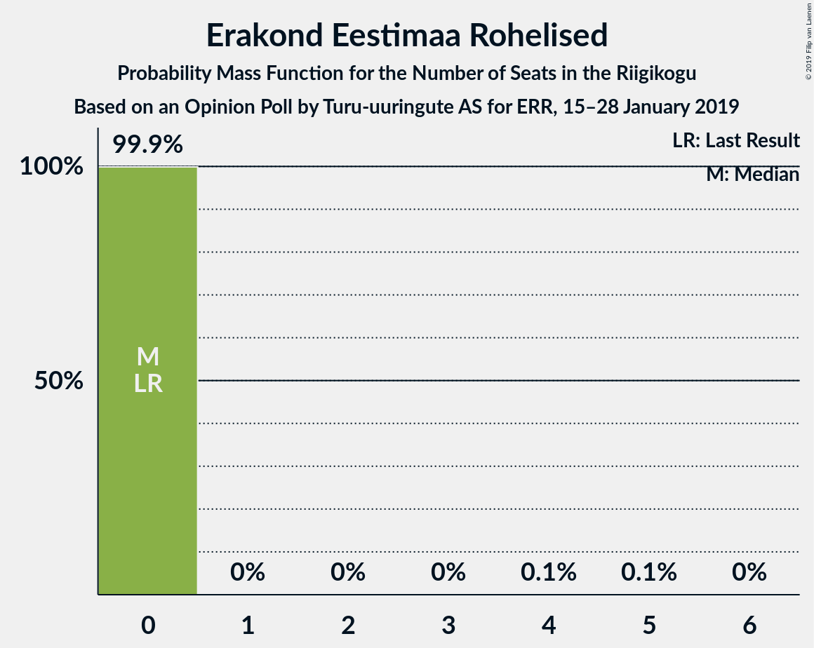

| Number of Seats | Probability | Accumulated | Special Marks |
|:---------------:|:-----------:|:-----------:|:-------------:|
| 0 | 99.9% | 100% | Last Result, Median |
| 1 | 0% | 0.1% |  |
| 2 | 0% | 0.1% |  |
| 3 | 0% | 0.1% |  |
| 4 | 0.1% | 0.1% |  |
| 5 | 0.1% | 0.1% |  |
| 6 | 0% | 0% |  |

### Eesti Vabaerakond

*For a full overview of the results for this party, see the [Eesti Vabaerakond](party-eestivabaerakond.html) page.*

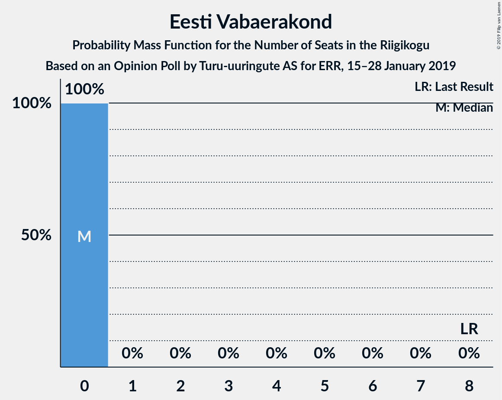

| Number of Seats | Probability | Accumulated | Special Marks |
|:---------------:|:-----------:|:-----------:|:-------------:|
| 0 | 100% | 100% | Median |
| 1 | 0% | 0% |  |
| 2 | 0% | 0% |  |
| 3 | 0% | 0% |  |
| 4 | 0% | 0% |  |
| 5 | 0% | 0% |  |
| 6 | 0% | 0% |  |
| 7 | 0% | 0% |  |
| 8 | 0% | 0% | Last Result |

## Coalitions

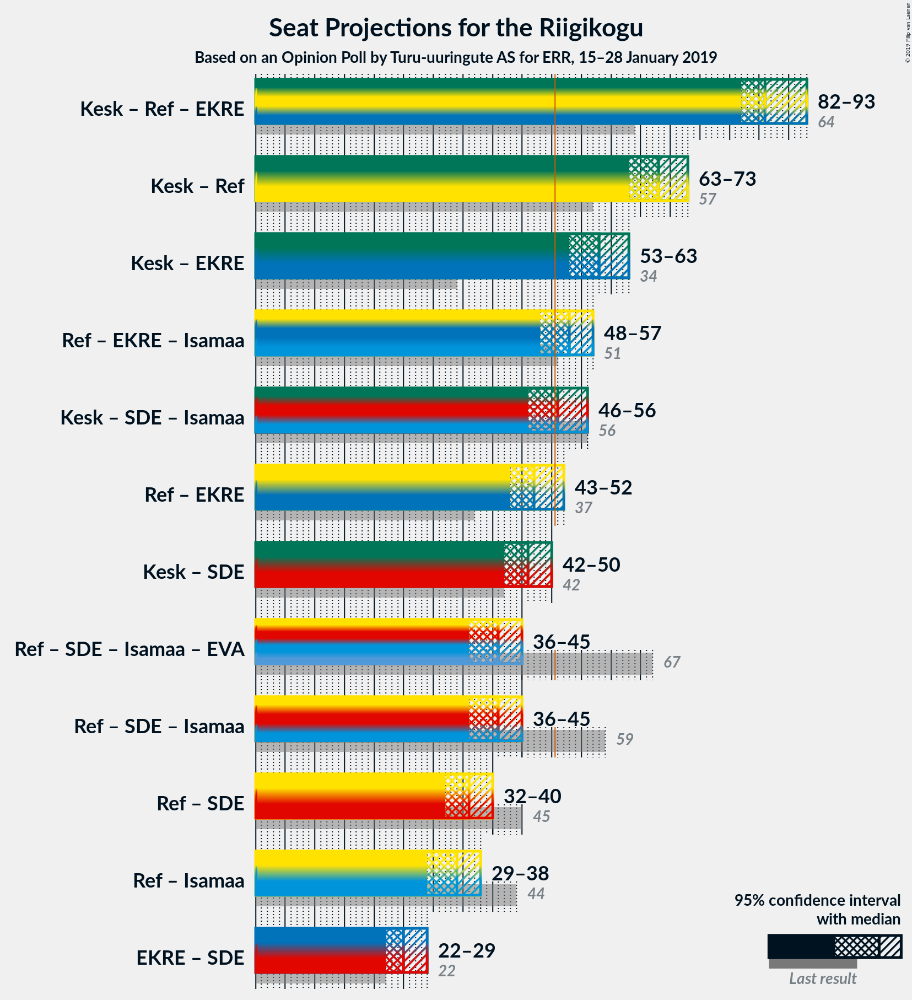

### Confidence Intervals

| Coalition | Last Result | Median | Majority? | 80% Confidence Interval | 90% Confidence Interval | 95% Confidence Interval | 99% Confidence Interval |
|:---------:|:-----------:|:------:|:---------:|:-----------------------:|:-----------------------:|:-----------------------:|:-----------------------:|
| Eesti Keskerakond – Eesti Reformierakond – Eesti Konservatiivne Rahvaerakond | 64 | 86 | 100% | 83–90 | 82–90 | 82–93 | 81–95 |
| Eesti Keskerakond – Eesti Reformierakond | 57 | 68 | 100% | 64–71 | 64–72 | 63–73 | 62–75 |
| Eesti Keskerakond – Eesti Konservatiivne Rahvaerakond | 34 | 58 | 99.9% | 54–61 | 54–62 | 53–63 | 52–64 |
| Eesti Reformierakond – Eesti Konservatiivne Rahvaerakond – Erakond Isamaa | 51 | 53 | 80% | 49–56 | 48–56 | 48–57 | 46–59 |
| Eesti Keskerakond – Sotsiaaldemokraatlik Erakond – Erakond Isamaa | 56 | 51 | 63% | 48–54 | 47–55 | 46–56 | 45–57 |
| Eesti Reformierakond – Eesti Konservatiivne Rahvaerakond | 37 | 47 | 8% | 44–50 | 43–51 | 43–52 | 42–54 |
| Eesti Keskerakond – Sotsiaaldemokraatlik Erakond | 42 | 46 | 2% | 43–49 | 42–50 | 42–50 | 40–52 |
| Eesti Reformierakond – Sotsiaaldemokraatlik Erakond – Erakond Isamaa – Eesti Vabaerakond | 67 | 41 | 0% | 38–44 | 37–44 | 36–45 | 34–47 |
| Eesti Reformierakond – Sotsiaaldemokraatlik Erakond – Erakond Isamaa | 59 | 41 | 0% | 38–44 | 37–44 | 36–45 | 34–47 |
| Eesti Reformierakond – Sotsiaaldemokraatlik Erakond | 45 | 36 | 0% | 33–38 | 32–39 | 32–40 | 30–41 |
| Eesti Reformierakond – Erakond Isamaa | 44 | 34 | 0% | 31–37 | 30–38 | 29–38 | 27–39 |
| Eesti Konservatiivne Rahvaerakond – Sotsiaaldemokraatlik Erakond | 22 | 25 | 0% | 23–28 | 22–28 | 22–29 | 20–30 |

### Eesti Keskerakond – Eesti Reformierakond – Eesti Konservatiivne Rahvaerakond

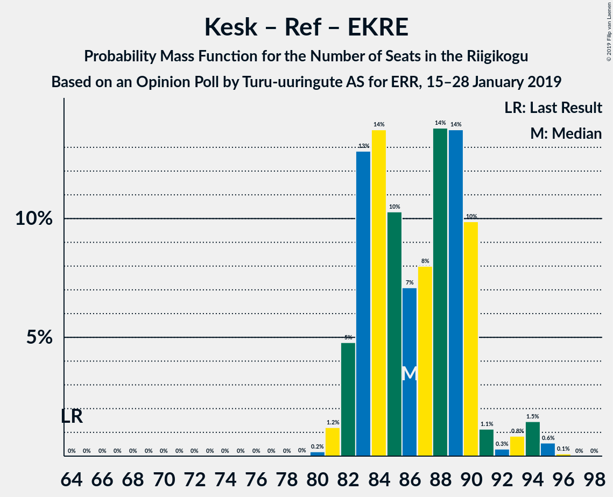

| Number of Seats | Probability | Accumulated | Special Marks |
|:---------------:|:-----------:|:-----------:|:-------------:|
| 64 | 0% | 100% | Last Result |
| 65 | 0% | 100% |  |
| 66 | 0% | 100% |  |
| 67 | 0% | 100% |  |
| 68 | 0% | 100% |  |
| 69 | 0% | 100% |  |
| 70 | 0% | 100% |  |
| 71 | 0% | 100% |  |
| 72 | 0% | 100% |  |
| 73 | 0% | 100% |  |
| 74 | 0% | 100% |  |
| 75 | 0% | 100% |  |
| 76 | 0% | 100% |  |
| 77 | 0% | 100% |  |
| 78 | 0% | 100% |  |
| 79 | 0% | 100% |  |
| 80 | 0.2% | 100% |  |
| 81 | 1.2% | 99.8% |  |
| 82 | 5% | 98.6% |  |
| 83 | 13% | 94% |  |
| 84 | 14% | 81% |  |
| 85 | 10% | 67% |  |
| 86 | 7% | 57% |  |
| 87 | 8% | 50% | Median |
| 88 | 14% | 42% |  |
| 89 | 14% | 28% |  |
| 90 | 10% | 14% |  |
| 91 | 1.1% | 4% |  |
| 92 | 0.3% | 3% |  |
| 93 | 0.8% | 3% |  |
| 94 | 1.5% | 2% |  |
| 95 | 0.6% | 0.7% |  |
| 96 | 0.1% | 0.1% |  |
| 97 | 0% | 0% |  |

### Eesti Keskerakond – Eesti Reformierakond

| Number of Seats | Probability | Accumulated | Special Marks |
|:---------------:|:-----------:|:-----------:|:-------------:|
| 57 | 0% | 100% | Last Result |
| 58 | 0% | 100% |  |
| 59 | 0% | 100% |  |
| 60 | 0% | 100% |  |
| 61 | 0.2% | 99.9% |  |
| 62 | 0.9% | 99.7% |  |
| 63 | 2% | 98.8% |  |
| 64 | 8% | 96% |  |
| 65 | 9% | 88% |  |
| 66 | 14% | 79% |  |
| 67 | 12% | 65% |  |
| 68 | 11% | 53% | Median |
| 69 | 13% | 42% |  |
| 70 | 10% | 29% |  |
| 71 | 11% | 20% |  |
| 72 | 4% | 8% |  |
| 73 | 2% | 4% |  |
| 74 | 0.7% | 2% |  |
| 75 | 0.6% | 1.1% |  |
| 76 | 0.2% | 0.4% |  |
| 77 | 0.1% | 0.2% |  |
| 78 | 0% | 0% |  |

### Eesti Keskerakond – Eesti Konservatiivne Rahvaerakond

| Number of Seats | Probability | Accumulated | Special Marks |
|:---------------:|:-----------:|:-----------:|:-------------:|
| 34 | 0% | 100% | Last Result |
| 35 | 0% | 100% |  |
| 36 | 0% | 100% |  |
| 37 | 0% | 100% |  |
| 38 | 0% | 100% |  |
| 39 | 0% | 100% |  |
| 40 | 0% | 100% |  |
| 41 | 0% | 100% |  |
| 42 | 0% | 100% |  |
| 43 | 0% | 100% |  |
| 44 | 0% | 100% |  |
| 45 | 0% | 100% |  |
| 46 | 0% | 100% |  |
| 47 | 0% | 100% |  |
| 48 | 0% | 100% |  |
| 49 | 0% | 100% |  |
| 50 | 0% | 100% |  |
| 51 | 0.2% | 99.9% | Majority |
| 52 | 0.8% | 99.7% |  |
| 53 | 2% | 98.9% |  |
| 54 | 7% | 97% |  |
| 55 | 12% | 90% |  |
| 56 | 10% | 78% |  |
| 57 | 13% | 68% |  |
| 58 | 15% | 55% | Median |
| 59 | 19% | 40% |  |
| 60 | 9% | 21% |  |
| 61 | 4% | 12% |  |
| 62 | 3% | 8% |  |
| 63 | 3% | 4% |  |
| 64 | 0.5% | 0.9% |  |
| 65 | 0.1% | 0.4% |  |
| 66 | 0.2% | 0.3% |  |
| 67 | 0% | 0.1% |  |
| 68 | 0% | 0% |  |

### Eesti Reformierakond – Eesti Konservatiivne Rahvaerakond – Erakond Isamaa

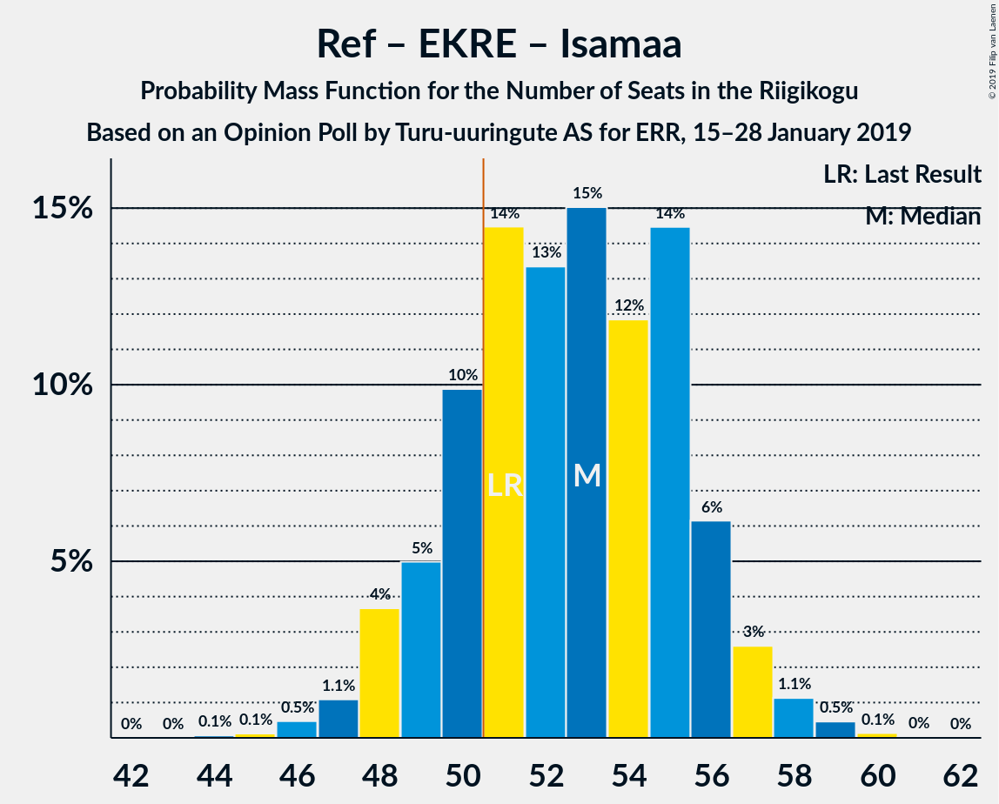

| Number of Seats | Probability | Accumulated | Special Marks |
|:---------------:|:-----------:|:-----------:|:-------------:|
| 44 | 0.1% | 100% |  |
| 45 | 0.1% | 99.9% |  |
| 46 | 0.5% | 99.8% |  |
| 47 | 1.1% | 99.3% |  |
| 48 | 4% | 98% |  |
| 49 | 5% | 95% |  |
| 50 | 10% | 90% |  |
| 51 | 14% | 80% | Last Result, Majority |
| 52 | 13% | 65% |  |
| 53 | 15% | 52% |  |
| 54 | 12% | 37% | Median |
| 55 | 14% | 25% |  |
| 56 | 6% | 11% |  |
| 57 | 3% | 4% |  |
| 58 | 1.1% | 2% |  |
| 59 | 0.5% | 0.6% |  |
| 60 | 0.1% | 0.2% |  |
| 61 | 0% | 0% |  |

### Eesti Keskerakond – Sotsiaaldemokraatlik Erakond – Erakond Isamaa

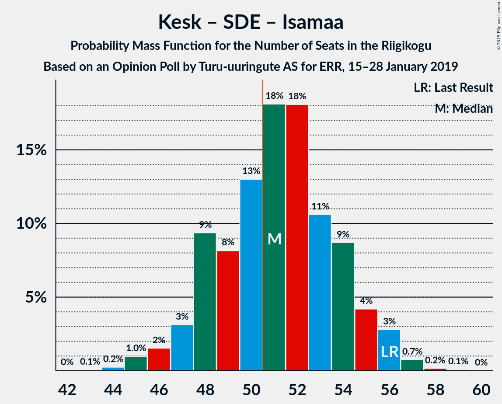

| Number of Seats | Probability | Accumulated | Special Marks |
|:---------------:|:-----------:|:-----------:|:-------------:|
| 43 | 0.1% | 100% |  |
| 44 | 0.2% | 99.9% |  |
| 45 | 1.0% | 99.7% |  |
| 46 | 2% | 98.7% |  |
| 47 | 3% | 97% |  |
| 48 | 9% | 94% |  |
| 49 | 8% | 85% |  |
| 50 | 13% | 76% |  |
| 51 | 18% | 63% | Majority |
| 52 | 18% | 45% | Median |
| 53 | 11% | 27% |  |
| 54 | 9% | 17% |  |
| 55 | 4% | 8% |  |
| 56 | 3% | 4% | Last Result |
| 57 | 0.7% | 1.0% |  |
| 58 | 0.2% | 0.3% |  |
| 59 | 0.1% | 0.1% |  |
| 60 | 0% | 0% |  |

### Eesti Reformierakond – Eesti Konservatiivne Rahvaerakond

| Number of Seats | Probability | Accumulated | Special Marks |
|:---------------:|:-----------:|:-----------:|:-------------:|
| 37 | 0% | 100% | Last Result |
| 38 | 0% | 100% |  |
| 39 | 0% | 100% |  |
| 40 | 0.1% | 100% |  |
| 41 | 0.3% | 99.9% |  |
| 42 | 2% | 99.6% |  |
| 43 | 3% | 98% |  |
| 44 | 8% | 94% |  |
| 45 | 12% | 87% |  |
| 46 | 14% | 75% |  |
| 47 | 13% | 61% |  |
| 48 | 15% | 48% | Median |
| 49 | 14% | 33% |  |
| 50 | 11% | 19% |  |
| 51 | 4% | 8% | Majority |
| 52 | 2% | 4% |  |
| 53 | 1.3% | 2% |  |
| 54 | 0.3% | 0.5% |  |
| 55 | 0.1% | 0.3% |  |
| 56 | 0.1% | 0.1% |  |
| 57 | 0% | 0% |  |

### Eesti Keskerakond – Sotsiaaldemokraatlik Erakond

| Number of Seats | Probability | Accumulated | Special Marks |
|:---------------:|:-----------:|:-----------:|:-------------:|
| 39 | 0.2% | 100% |  |
| 40 | 0.6% | 99.8% |  |
| 41 | 1.2% | 99.2% |  |
| 42 | 5% | 98% | Last Result |
| 43 | 9% | 93% |  |
| 44 | 12% | 84% |  |
| 45 | 15% | 73% |  |
| 46 | 22% | 58% | Median |
| 47 | 12% | 35% |  |
| 48 | 9% | 23% |  |
| 49 | 8% | 14% |  |
| 50 | 5% | 7% |  |
| 51 | 1.1% | 2% | Majority |
| 52 | 0.5% | 0.9% |  |
| 53 | 0.3% | 0.4% |  |
| 54 | 0.1% | 0.2% |  |
| 55 | 0% | 0% |  |

### Eesti Reformierakond – Sotsiaaldemokraatlik Erakond – Erakond Isamaa – Eesti Vabaerakond

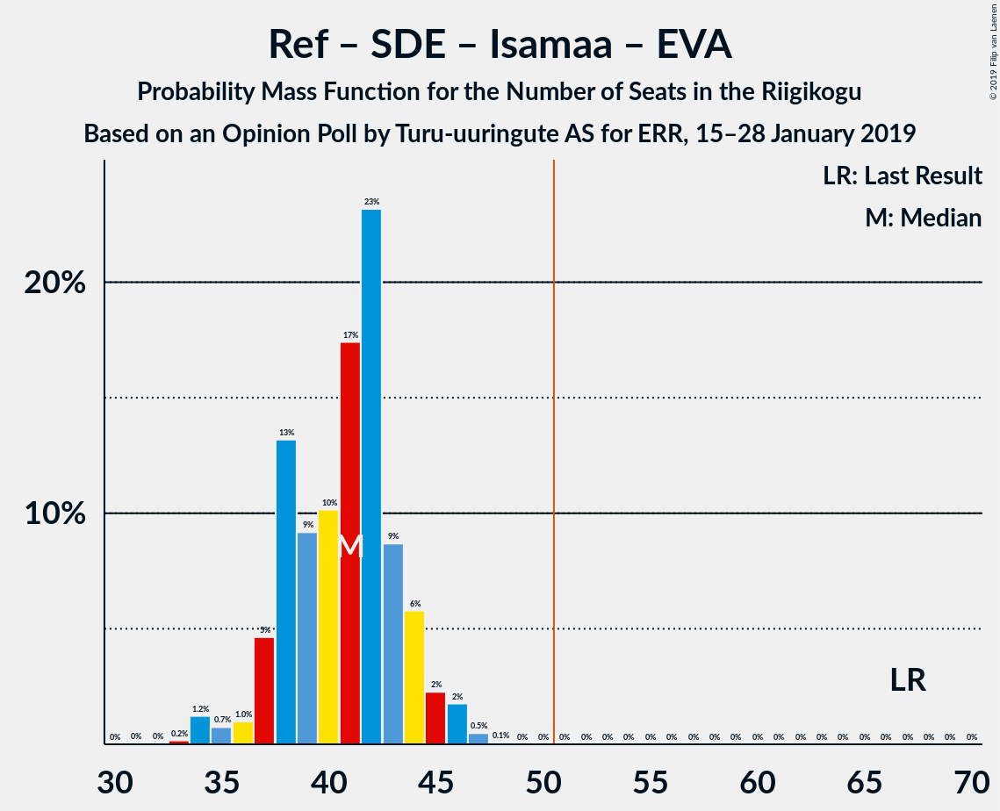

| Number of Seats | Probability | Accumulated | Special Marks |
|:---------------:|:-----------:|:-----------:|:-------------:|
| 32 | 0% | 100% |  |
| 33 | 0.2% | 99.9% |  |
| 34 | 1.2% | 99.8% |  |
| 35 | 0.7% | 98.5% |  |
| 36 | 1.0% | 98% |  |
| 37 | 5% | 97% |  |
| 38 | 13% | 92% |  |
| 39 | 9% | 79% |  |
| 40 | 10% | 70% |  |
| 41 | 17% | 60% |  |
| 42 | 23% | 42% | Median |
| 43 | 9% | 19% |  |
| 44 | 6% | 10% |  |
| 45 | 2% | 5% |  |
| 46 | 2% | 2% |  |
| 47 | 0.5% | 0.6% |  |
| 48 | 0.1% | 0.1% |  |
| 49 | 0% | 0% |  |
| 50 | 0% | 0% |  |
| 51 | 0% | 0% | Majority |
| 52 | 0% | 0% |  |
| 53 | 0% | 0% |  |
| 54 | 0% | 0% |  |
| 55 | 0% | 0% |  |
| 56 | 0% | 0% |  |
| 57 | 0% | 0% |  |
| 58 | 0% | 0% |  |
| 59 | 0% | 0% |  |
| 60 | 0% | 0% |  |
| 61 | 0% | 0% |  |
| 62 | 0% | 0% |  |
| 63 | 0% | 0% |  |
| 64 | 0% | 0% |  |
| 65 | 0% | 0% |  |
| 66 | 0% | 0% |  |
| 67 | 0% | 0% | Last Result |

### Eesti Reformierakond – Sotsiaaldemokraatlik Erakond – Erakond Isamaa

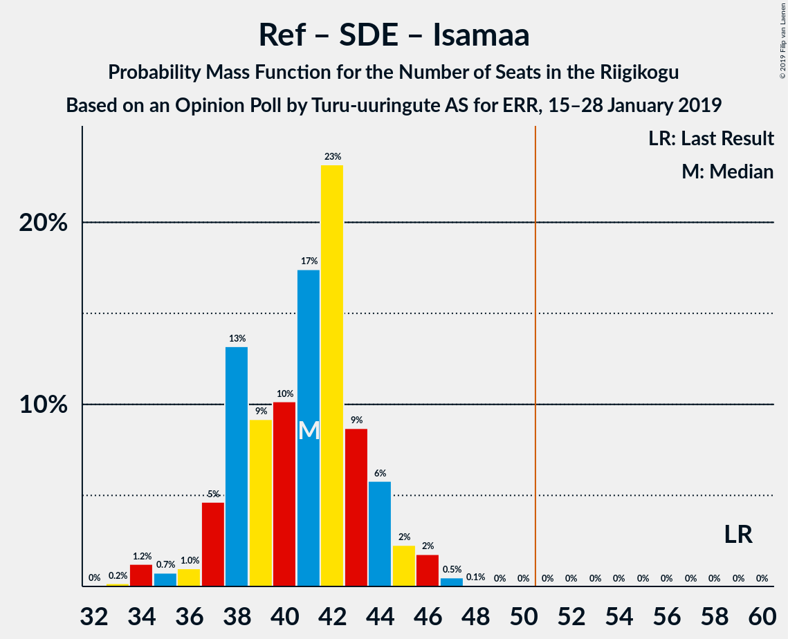

| Number of Seats | Probability | Accumulated | Special Marks |
|:---------------:|:-----------:|:-----------:|:-------------:|
| 32 | 0% | 100% |  |
| 33 | 0.2% | 99.9% |  |
| 34 | 1.2% | 99.8% |  |
| 35 | 0.7% | 98.5% |  |
| 36 | 1.0% | 98% |  |
| 37 | 5% | 97% |  |
| 38 | 13% | 92% |  |
| 39 | 9% | 79% |  |
| 40 | 10% | 70% |  |
| 41 | 17% | 60% |  |
| 42 | 23% | 42% | Median |
| 43 | 9% | 19% |  |
| 44 | 6% | 10% |  |
| 45 | 2% | 5% |  |
| 46 | 2% | 2% |  |
| 47 | 0.5% | 0.6% |  |
| 48 | 0.1% | 0.1% |  |
| 49 | 0% | 0% |  |
| 50 | 0% | 0% |  |
| 51 | 0% | 0% | Majority |
| 52 | 0% | 0% |  |
| 53 | 0% | 0% |  |
| 54 | 0% | 0% |  |
| 55 | 0% | 0% |  |
| 56 | 0% | 0% |  |
| 57 | 0% | 0% |  |
| 58 | 0% | 0% |  |
| 59 | 0% | 0% | Last Result |

### Eesti Reformierakond – Sotsiaaldemokraatlik Erakond

| Number of Seats | Probability | Accumulated | Special Marks |
|:---------------:|:-----------:|:-----------:|:-------------:|
| 29 | 0.1% | 100% |  |
| 30 | 0.8% | 99.8% |  |
| 31 | 0.6% | 99.0% |  |
| 32 | 8% | 98% |  |
| 33 | 16% | 90% |  |
| 34 | 8% | 75% |  |
| 35 | 9% | 67% |  |
| 36 | 27% | 58% | Median |
| 37 | 19% | 31% |  |
| 38 | 5% | 12% |  |
| 39 | 4% | 8% |  |
| 40 | 3% | 4% |  |
| 41 | 0.7% | 1.1% |  |
| 42 | 0.3% | 0.3% |  |
| 43 | 0% | 0.1% |  |
| 44 | 0% | 0% |  |
| 45 | 0% | 0% | Last Result |

### Eesti Reformierakond – Erakond Isamaa

| Number of Seats | Probability | Accumulated | Special Marks |
|:---------------:|:-----------:|:-----------:|:-------------:|
| 26 | 0.1% | 100% |  |
| 27 | 0.4% | 99.8% |  |
| 28 | 1.1% | 99.4% |  |
| 29 | 1.1% | 98% |  |
| 30 | 3% | 97% |  |
| 31 | 10% | 95% |  |
| 32 | 8% | 84% |  |
| 33 | 14% | 76% |  |
| 34 | 19% | 62% |  |
| 35 | 15% | 43% | Median |
| 36 | 17% | 28% |  |
| 37 | 6% | 11% |  |
| 38 | 4% | 5% |  |
| 39 | 1.3% | 2% |  |
| 40 | 0.3% | 0.4% |  |
| 41 | 0.1% | 0.1% |  |
| 42 | 0% | 0% |  |
| 43 | 0% | 0% |  |
| 44 | 0% | 0% | Last Result |

### Eesti Konservatiivne Rahvaerakond – Sotsiaaldemokraatlik Erakond

| Number of Seats | Probability | Accumulated | Special Marks |
|:---------------:|:-----------:|:-----------:|:-------------:|
| 18 | 0.1% | 100% |  |
| 19 | 0.1% | 99.9% |  |
| 20 | 0.3% | 99.8% |  |
| 21 | 2% | 99.5% |  |
| 22 | 4% | 98% | Last Result |
| 23 | 9% | 93% |  |
| 24 | 17% | 84% |  |
| 25 | 23% | 67% |  |
| 26 | 19% | 44% | Median |
| 27 | 14% | 25% |  |
| 28 | 8% | 11% |  |
| 29 | 3% | 4% |  |
| 30 | 0.7% | 1.1% |  |
| 31 | 0.3% | 0.4% |  |
| 32 | 0.1% | 0.1% |  |
| 33 | 0% | 0% |  |

## Technical Information

### Opinion Poll

+ **Polling firm:** Turu-uuringute AS
+ **Commissioner(s):** ERR
+ **Fieldwork period:** 15–28 January 2019

### Calculations

+ **Sample size:** 1000
+ **Simulations done:** 1,048,576
+ **Error estimate:** 2.91%

