# Opinion Poll by Norstat for MTÜ Ühiskonnauuringute Instituut, 18–24 February 2019

<a href="#voting-intentions">Voting Intentions</a> | <a href="#seats">Seats</a> | <a href="#coalitions">Coalitions</a> | <a href="#technical-information">Technical Information</a>

## Voting Intentions

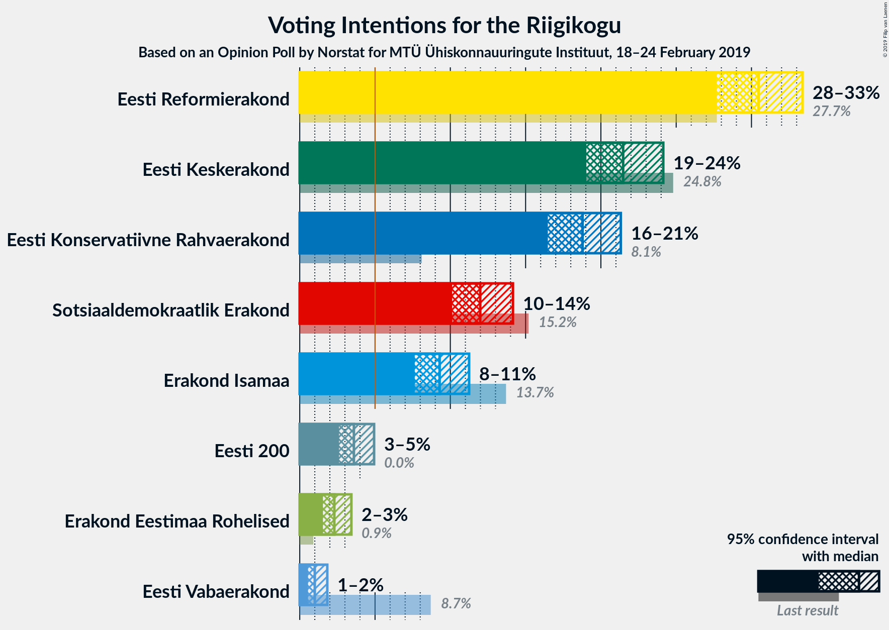

### Confidence Intervals

| Party | Last Result | Poll Result | 80% Confidence Interval | 90% Confidence Interval | 95% Confidence Interval | 99% Confidence Interval |
|:-----:|:-----------:|:-----------:|:-----------------------:|:-----------------------:|:-----------------------:|:-----------------------:|
| Eesti Reformierakond | 27.7% | 30.5% | 28.7–32.4% |28.1–32.9% |27.7–33.4% |26.8–34.3% |
| Eesti Keskerakond | 24.8% | 21.5% | 19.9–23.2% |19.4–23.7% |19.0–24.1% |18.3–25.0% |
| Eesti Konservatiivne Rahvaerakond | 8.1% | 18.8% | 17.3–20.4% |16.8–20.9% |16.5–21.3% |15.8–22.1% |
| Sotsiaaldemokraatlik Erakond | 15.2% | 12.0% | 10.8–13.4% |10.4–13.8% |10.1–14.2% |9.6–14.9% |
| Erakond Isamaa | 13.7% | 9.3% | 8.2–10.6% |7.9–10.9% |7.6–11.2% |7.1–11.9% |
| Eesti 200 | 0.0% | 3.6% | 2.9–4.5% |2.8–4.7% |2.6–4.9% |2.3–5.4% |
| Erakond Eestimaa Rohelised | 0.9% | 2.3% | 1.8–3.0% |1.6–3.2% |1.5–3.4% |1.3–3.8% |
| Eesti Vabaerakond | 8.7% | 1.0% | 0.7–1.5% |0.6–1.7% |0.5–1.8% |0.4–2.1% |

*Note:* The poll result column reflects the actual value used in the calculations. Published results may vary slightly, and in addition be rounded to fewer digits.

## Seats

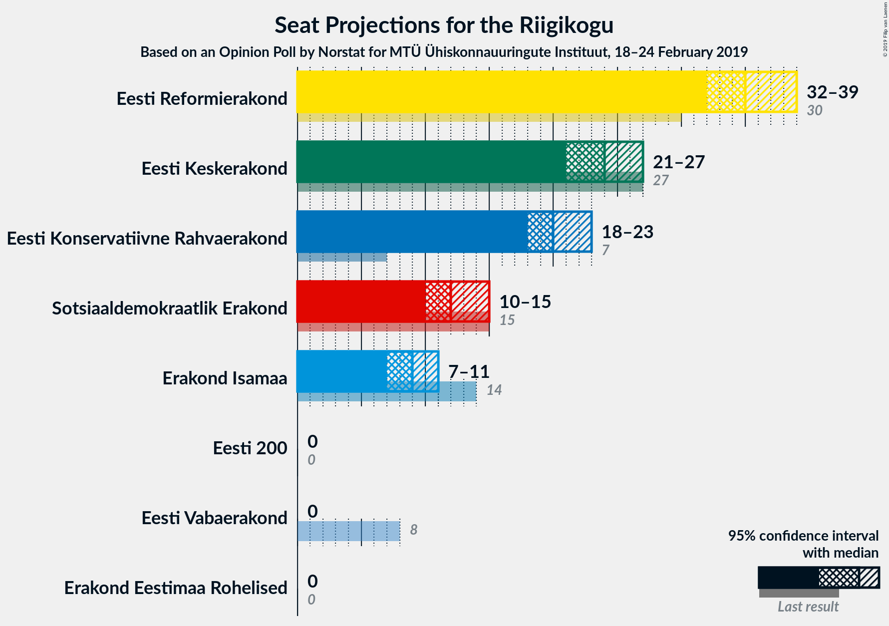

### Confidence Intervals

| Party | Last Result | Median | 80% Confidence Interval | 90% Confidence Interval | 95% Confidence Interval | 99% Confidence Interval |
|:-----:|:-----------:|:------:|:-----------------------:|:-----------------------:|:-----------------------:|:-----------------------:|
| <a href="#eesti-reformierakond">Eesti Reformierakond</a> | 30 | 35 | 33–37 |32–38 |32–39 |31–40 |
| <a href="#eesti-keskerakond">Eesti Keskerakond</a> | 27 | 24 | 22–26 |21–27 |21–27 |20–28 |
| <a href="#eesti-konservatiivne-rahvaerakond">Eesti Konservatiivne Rahvaerakond</a> | 7 | 20 | 19–22 |18–23 |18–23 |17–25 |
| <a href="#sotsiaaldemokraatlik-erakond">Sotsiaaldemokraatlik Erakond</a> | 15 | 12 | 11–14 |11–14 |10–15 |9–16 |
| <a href="#erakond-isamaa">Erakond Isamaa</a> | 14 | 9 | 8–11 |8–11 |7–11 |7–12 |
| <a href="#eesti-200">Eesti 200</a> | 0 | 0 | 0 |0 |0 |0–5 |
| <a href="#erakond-eestimaa-rohelised">Erakond Eestimaa Rohelised</a> | 0 | 0 | 0 |0 |0 |0 |
| <a href="#eesti-vabaerakond">Eesti Vabaerakond</a> | 8 | 0 | 0 |0 |0 |0 |

### Eesti Reformierakond

*For a full overview of the results for this party, see the [Eesti Reformierakond](party-eestireformierakond.html) page.*

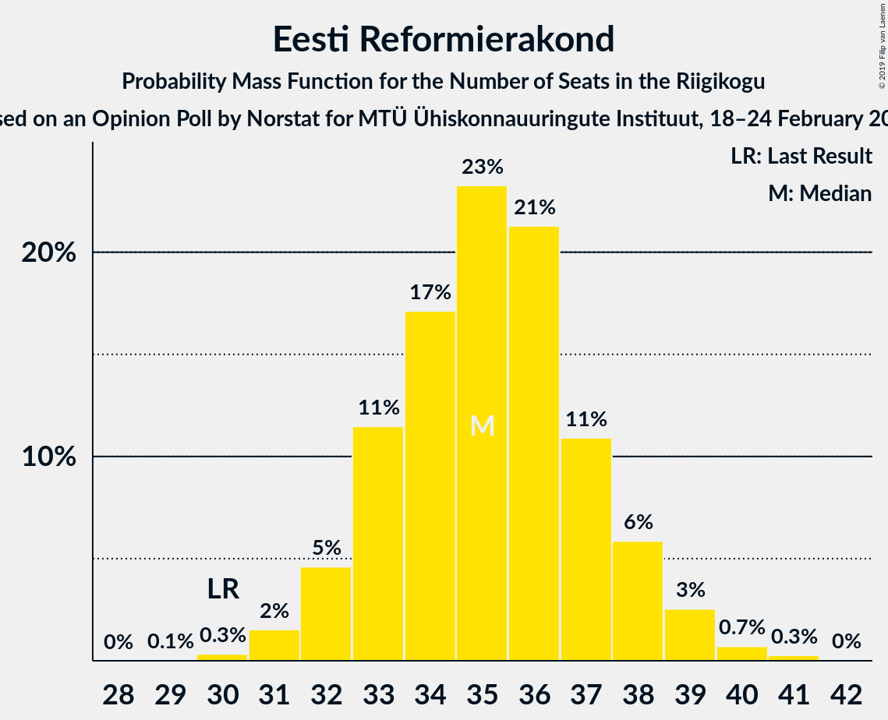

| Number of Seats | Probability | Accumulated | Special Marks |
|:---------------:|:-----------:|:-----------:|:-------------:|
| 29 | 0.1% | 100% |  |
| 30 | 0.3% | 99.9% | Last Result |
| 31 | 2% | 99.6% |  |
| 32 | 5% | 98% |  |
| 33 | 11% | 93% |  |
| 34 | 17% | 82% |  |
| 35 | 23% | 65% | Median |
| 36 | 21% | 42% |  |
| 37 | 11% | 20% |  |
| 38 | 6% | 9% |  |
| 39 | 3% | 4% |  |
| 40 | 0.7% | 1.0% |  |
| 41 | 0.3% | 0.3% |  |
| 42 | 0% | 0% |  |

### Eesti Keskerakond

*For a full overview of the results for this party, see the [Eesti Keskerakond](party-eestikeskerakond.html) page.*

| Number of Seats | Probability | Accumulated | Special Marks |
|:---------------:|:-----------:|:-----------:|:-------------:|
| 19 | 0.2% | 100% |  |
| 20 | 2% | 99.8% |  |
| 21 | 4% | 98% |  |
| 22 | 14% | 94% |  |
| 23 | 23% | 80% |  |
| 24 | 24% | 57% | Median |
| 25 | 18% | 33% |  |
| 26 | 10% | 15% |  |
| 27 | 4% | 5% | Last Result |
| 28 | 1.0% | 1.3% |  |
| 29 | 0.3% | 0.3% |  |
| 30 | 0% | 0% |  |

### Eesti Konservatiivne Rahvaerakond

*For a full overview of the results for this party, see the [Eesti Konservatiivne Rahvaerakond](party-eestikonservatiivnerahvaerakond.html) page.*

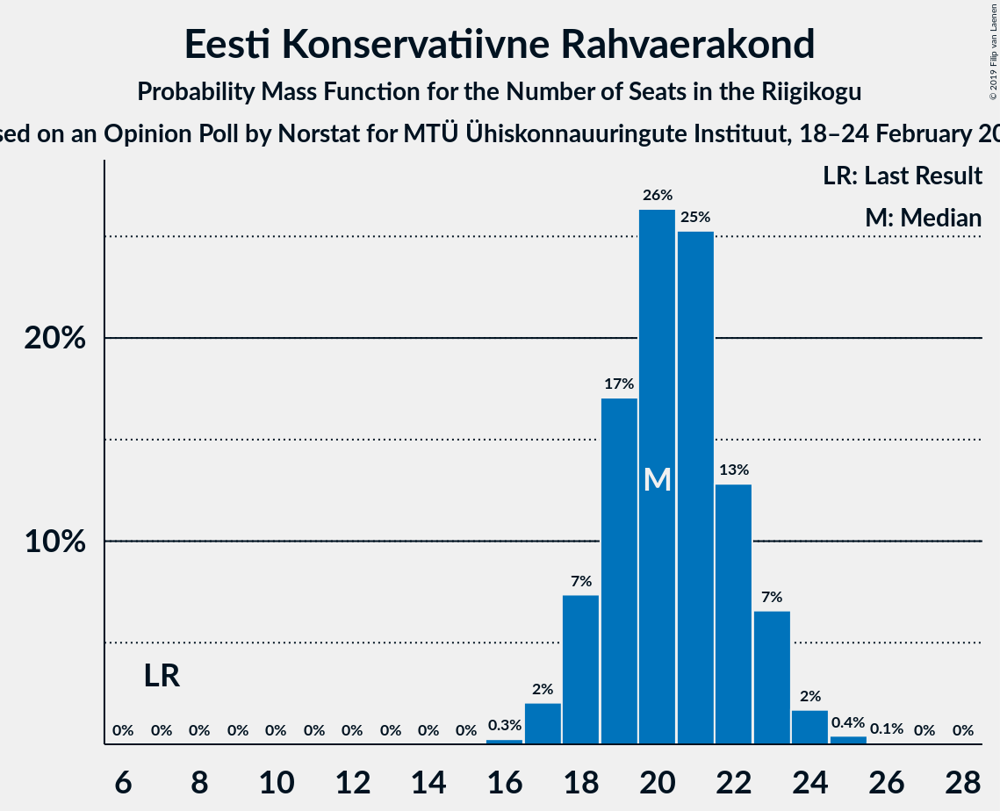

| Number of Seats | Probability | Accumulated | Special Marks |
|:---------------:|:-----------:|:-----------:|:-------------:|
| 7 | 0% | 100% | Last Result |
| 8 | 0% | 100% |  |
| 9 | 0% | 100% |  |
| 10 | 0% | 100% |  |
| 11 | 0% | 100% |  |
| 12 | 0% | 100% |  |
| 13 | 0% | 100% |  |
| 14 | 0% | 100% |  |
| 15 | 0% | 100% |  |
| 16 | 0.3% | 100% |  |
| 17 | 2% | 99.7% |  |
| 18 | 7% | 98% |  |
| 19 | 17% | 90% |  |
| 20 | 26% | 73% | Median |
| 21 | 25% | 47% |  |
| 22 | 13% | 22% |  |
| 23 | 7% | 9% |  |
| 24 | 2% | 2% |  |
| 25 | 0.4% | 0.5% |  |
| 26 | 0.1% | 0.1% |  |
| 27 | 0% | 0% |  |

### Sotsiaaldemokraatlik Erakond

*For a full overview of the results for this party, see the [Sotsiaaldemokraatlik Erakond](party-sotsiaaldemokraatlikerakond.html) page.*

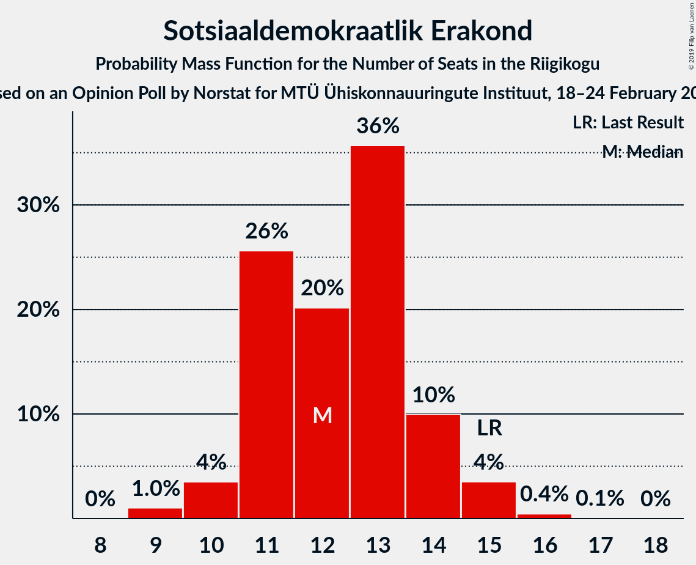

| Number of Seats | Probability | Accumulated | Special Marks |
|:---------------:|:-----------:|:-----------:|:-------------:|
| 9 | 1.0% | 100% |  |
| 10 | 4% | 99.0% |  |
| 11 | 26% | 95% |  |
| 12 | 20% | 70% | Median |
| 13 | 36% | 50% |  |
| 14 | 10% | 14% |  |
| 15 | 4% | 4% | Last Result |
| 16 | 0.4% | 0.5% |  |
| 17 | 0.1% | 0.1% |  |
| 18 | 0% | 0% |  |

### Erakond Isamaa

*For a full overview of the results for this party, see the [Erakond Isamaa](party-erakondisamaa.html) page.*

| Number of Seats | Probability | Accumulated | Special Marks |
|:---------------:|:-----------:|:-----------:|:-------------:|
| 6 | 0.3% | 100% |  |
| 7 | 4% | 99.7% |  |
| 8 | 20% | 95% |  |
| 9 | 39% | 75% | Median |
| 10 | 26% | 36% |  |
| 11 | 9% | 11% |  |
| 12 | 1.5% | 2% |  |
| 13 | 0.2% | 0.2% |  |
| 14 | 0% | 0% | Last Result |

### Eesti 200

*For a full overview of the results for this party, see the [Eesti 200](party-eesti200.html) page.*

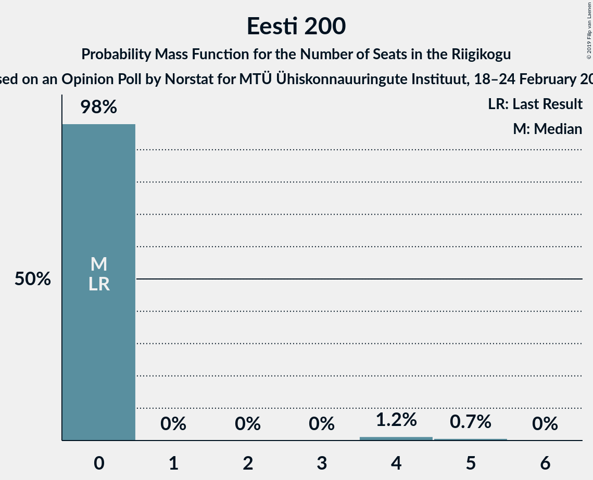

| Number of Seats | Probability | Accumulated | Special Marks |
|:---------------:|:-----------:|:-----------:|:-------------:|
| 0 | 98% | 100% | Last Result, Median |
| 1 | 0% | 2% |  |
| 2 | 0% | 2% |  |
| 3 | 0% | 2% |  |
| 4 | 1.2% | 2% |  |
| 5 | 0.7% | 0.7% |  |
| 6 | 0% | 0% |  |

### Erakond Eestimaa Rohelised

*For a full overview of the results for this party, see the [Erakond Eestimaa Rohelised](party-erakondeestimaarohelised.html) page.*

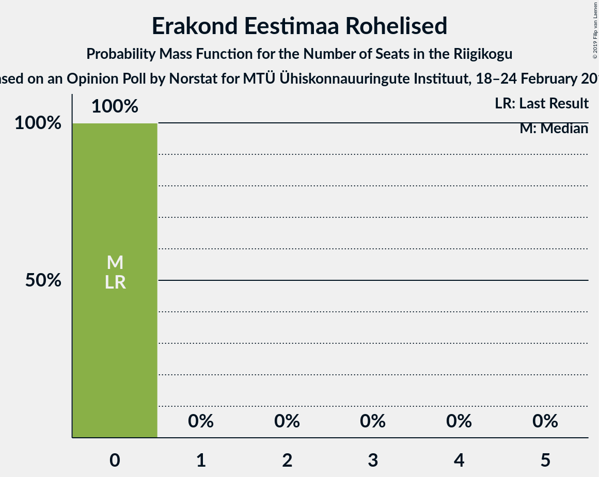

| Number of Seats | Probability | Accumulated | Special Marks |
|:---------------:|:-----------:|:-----------:|:-------------:|
| 0 | 100% | 100% | Last Result, Median |

### Eesti Vabaerakond

*For a full overview of the results for this party, see the [Eesti Vabaerakond](party-eestivabaerakond.html) page.*

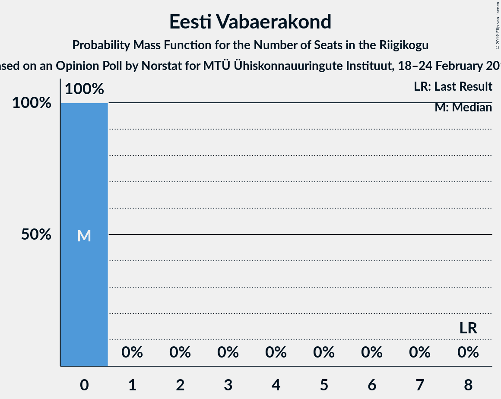

| Number of Seats | Probability | Accumulated | Special Marks |
|:---------------:|:-----------:|:-----------:|:-------------:|
| 0 | 100% | 100% | Median |
| 1 | 0% | 0% |  |
| 2 | 0% | 0% |  |
| 3 | 0% | 0% |  |
| 4 | 0% | 0% |  |
| 5 | 0% | 0% |  |
| 6 | 0% | 0% |  |
| 7 | 0% | 0% |  |
| 8 | 0% | 0% | Last Result |

## Coalitions

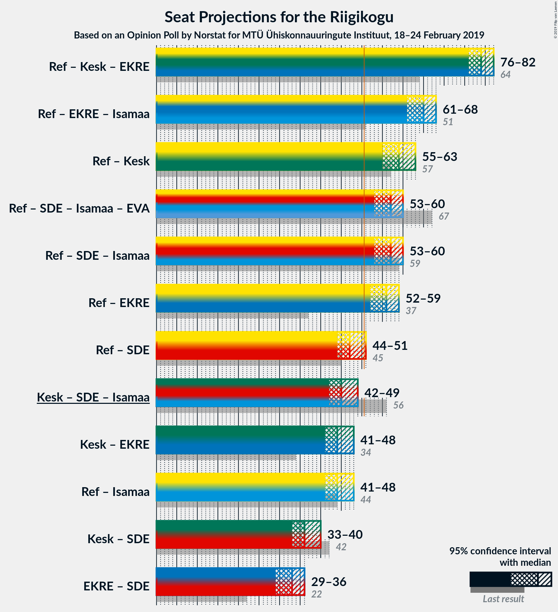

### Confidence Intervals

| Coalition | Last Result | Median | Majority? | 80% Confidence Interval | 90% Confidence Interval | 95% Confidence Interval | 99% Confidence Interval |
|:---------:|:-----------:|:------:|:---------:|:-----------------------:|:-----------------------:|:-----------------------:|:-----------------------:|
| Eesti Reformierakond – Eesti Keskerakond – Eesti Konservatiivne Rahvaerakond | 64 | 79 | 100% | 78–81 | 77–82 | 76–82 | 75–83 |
| Eesti Reformierakond – Eesti Konservatiivne Rahvaerakond – Erakond Isamaa | 51 | 65 | 100% | 62–67 | 62–68 | 61–68 | 60–69 |
| Eesti Reformierakond – Eesti Keskerakond | 57 | 59 | 100% | 56–62 | 56–62 | 55–63 | 54–64 |
| Eesti Reformierakond – Sotsiaaldemokraatlik Erakond – Erakond Isamaa – Eesti Vabaerakond | 67 | 57 | 99.9% | 54–59 | 54–60 | 53–60 | 52–62 |
| Eesti Reformierakond – Sotsiaaldemokraatlik Erakond – Erakond Isamaa | 59 | 57 | 99.9% | 54–59 | 54–60 | 53–60 | 52–62 |
| Eesti Reformierakond – Eesti Konservatiivne Rahvaerakond | 37 | 56 | 99.6% | 53–58 | 52–59 | 52–59 | 51–61 |
| Eesti Reformierakond – Sotsiaaldemokraatlik Erakond | 45 | 47 | 5% | 45–50 | 44–51 | 44–51 | 43–52 |
| Eesti Keskerakond – Sotsiaaldemokraatlik Erakond – Erakond Isamaa | 56 | 45 | 0.3% | 43–47 | 42–49 | 42–49 | 40–50 |
| Eesti Keskerakond – Eesti Konservatiivne Rahvaerakond | 34 | 44 | 0% | 42–47 | 41–47 | 41–48 | 39–49 |
| Eesti Reformierakond – Erakond Isamaa | 44 | 44 | 0.1% | 42–47 | 41–47 | 41–48 | 40–49 |
| Eesti Keskerakond – Sotsiaaldemokraatlik Erakond | 42 | 36 | 0% | 34–38 | 33–39 | 33–40 | 31–41 |
| Eesti Konservatiivne Rahvaerakond – Sotsiaaldemokraatlik Erakond | 22 | 33 | 0% | 30–35 | 30–36 | 29–36 | 28–37 |

### Eesti Reformierakond – Eesti Keskerakond – Eesti Konservatiivne Rahvaerakond

| Number of Seats | Probability | Accumulated | Special Marks |
|:---------------:|:-----------:|:-----------:|:-------------:|
| 64 | 0% | 100% | Last Result |
| 65 | 0% | 100% |  |
| 66 | 0% | 100% |  |
| 67 | 0% | 100% |  |
| 68 | 0% | 100% |  |
| 69 | 0% | 100% |  |
| 70 | 0% | 100% |  |
| 71 | 0% | 100% |  |
| 72 | 0% | 100% |  |
| 73 | 0.1% | 100% |  |
| 74 | 0.3% | 99.9% |  |
| 75 | 0.9% | 99.7% |  |
| 76 | 3% | 98.8% |  |
| 77 | 5% | 96% |  |
| 78 | 16% | 91% |  |
| 79 | 31% | 75% | Median |
| 80 | 17% | 43% |  |
| 81 | 19% | 26% |  |
| 82 | 6% | 7% |  |
| 83 | 1.4% | 2% |  |
| 84 | 0.5% | 0.5% |  |
| 85 | 0% | 0% |  |

### Eesti Reformierakond – Eesti Konservatiivne Rahvaerakond – Erakond Isamaa

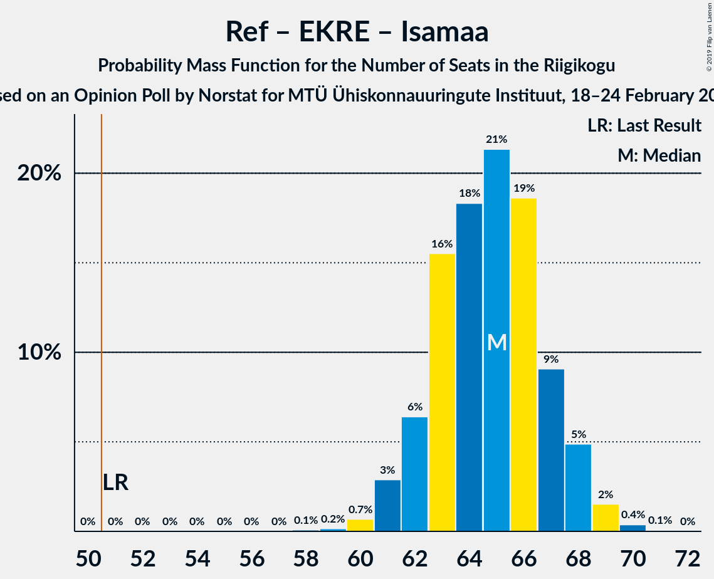

| Number of Seats | Probability | Accumulated | Special Marks |
|:---------------:|:-----------:|:-----------:|:-------------:|
| 51 | 0% | 100% | Last Result, Majority |
| 52 | 0% | 100% |  |
| 53 | 0% | 100% |  |
| 54 | 0% | 100% |  |
| 55 | 0% | 100% |  |
| 56 | 0% | 100% |  |
| 57 | 0% | 100% |  |
| 58 | 0.1% | 100% |  |
| 59 | 0.2% | 99.9% |  |
| 60 | 0.7% | 99.7% |  |
| 61 | 3% | 99.1% |  |
| 62 | 6% | 96% |  |
| 63 | 16% | 90% |  |
| 64 | 18% | 74% | Median |
| 65 | 21% | 56% |  |
| 66 | 19% | 35% |  |
| 67 | 9% | 16% |  |
| 68 | 5% | 7% |  |
| 69 | 2% | 2% |  |
| 70 | 0.4% | 0.5% |  |
| 71 | 0.1% | 0.1% |  |
| 72 | 0% | 0% |  |

### Eesti Reformierakond – Eesti Keskerakond

| Number of Seats | Probability | Accumulated | Special Marks |
|:---------------:|:-----------:|:-----------:|:-------------:|
| 53 | 0.2% | 100% |  |
| 54 | 0.7% | 99.8% |  |
| 55 | 2% | 99.1% |  |
| 56 | 7% | 97% |  |
| 57 | 8% | 90% | Last Result |
| 58 | 19% | 81% |  |
| 59 | 28% | 63% | Median |
| 60 | 15% | 35% |  |
| 61 | 9% | 20% |  |
| 62 | 7% | 10% |  |
| 63 | 3% | 3% |  |
| 64 | 0.6% | 0.7% |  |
| 65 | 0.1% | 0.1% |  |
| 66 | 0% | 0% |  |

### Eesti Reformierakond – Sotsiaaldemokraatlik Erakond – Erakond Isamaa – Eesti Vabaerakond

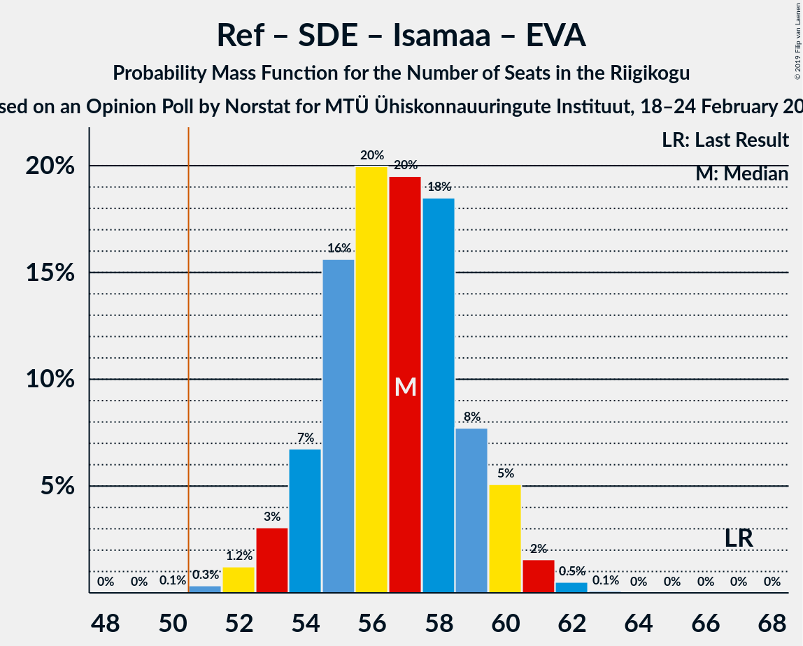

| Number of Seats | Probability | Accumulated | Special Marks |
|:---------------:|:-----------:|:-----------:|:-------------:|
| 50 | 0.1% | 100% |  |
| 51 | 0.3% | 99.9% | Majority |
| 52 | 1.2% | 99.6% |  |
| 53 | 3% | 98% |  |
| 54 | 7% | 95% |  |
| 55 | 16% | 89% |  |
| 56 | 20% | 73% | Median |
| 57 | 20% | 53% |  |
| 58 | 18% | 33% |  |
| 59 | 8% | 15% |  |
| 60 | 5% | 7% |  |
| 61 | 2% | 2% |  |
| 62 | 0.5% | 0.6% |  |
| 63 | 0.1% | 0.1% |  |
| 64 | 0% | 0% |  |
| 65 | 0% | 0% |  |
| 66 | 0% | 0% |  |
| 67 | 0% | 0% | Last Result |

### Eesti Reformierakond – Sotsiaaldemokraatlik Erakond – Erakond Isamaa

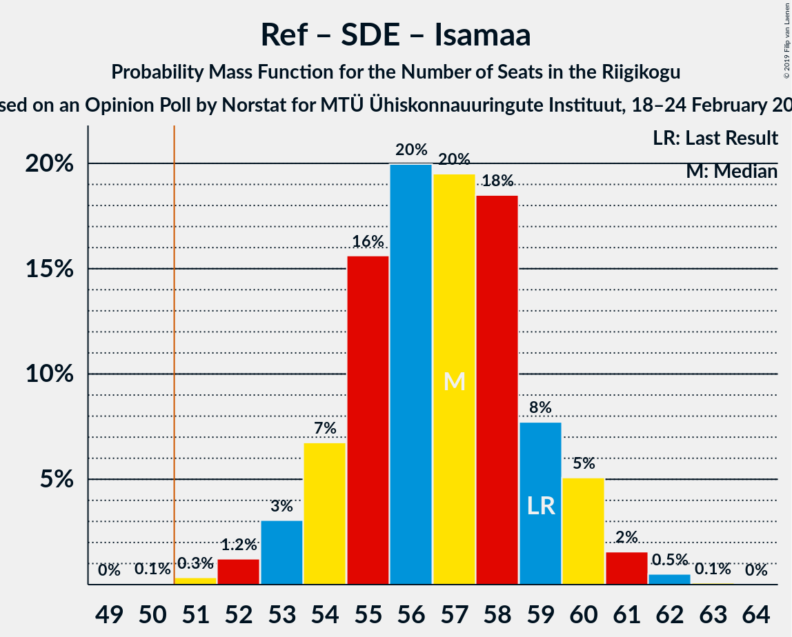

| Number of Seats | Probability | Accumulated | Special Marks |
|:---------------:|:-----------:|:-----------:|:-------------:|
| 50 | 0.1% | 100% |  |
| 51 | 0.3% | 99.9% | Majority |
| 52 | 1.2% | 99.6% |  |
| 53 | 3% | 98% |  |
| 54 | 7% | 95% |  |
| 55 | 16% | 89% |  |
| 56 | 20% | 73% | Median |
| 57 | 20% | 53% |  |
| 58 | 18% | 33% |  |
| 59 | 8% | 15% | Last Result |
| 60 | 5% | 7% |  |
| 61 | 2% | 2% |  |
| 62 | 0.5% | 0.6% |  |
| 63 | 0.1% | 0.1% |  |
| 64 | 0% | 0% |  |

### Eesti Reformierakond – Eesti Konservatiivne Rahvaerakond

| Number of Seats | Probability | Accumulated | Special Marks |
|:---------------:|:-----------:|:-----------:|:-------------:|
| 37 | 0% | 100% | Last Result |
| 38 | 0% | 100% |  |
| 39 | 0% | 100% |  |
| 40 | 0% | 100% |  |
| 41 | 0% | 100% |  |
| 42 | 0% | 100% |  |
| 43 | 0% | 100% |  |
| 44 | 0% | 100% |  |
| 45 | 0% | 100% |  |
| 46 | 0% | 100% |  |
| 47 | 0% | 100% |  |
| 48 | 0% | 100% |  |
| 49 | 0.1% | 100% |  |
| 50 | 0.3% | 99.9% |  |
| 51 | 1.1% | 99.6% | Majority |
| 52 | 4% | 98.5% |  |
| 53 | 5% | 94% |  |
| 54 | 21% | 89% |  |
| 55 | 14% | 69% | Median |
| 56 | 26% | 54% |  |
| 57 | 14% | 28% |  |
| 58 | 9% | 15% |  |
| 59 | 4% | 6% |  |
| 60 | 1.0% | 2% |  |
| 61 | 0.5% | 0.6% |  |
| 62 | 0.1% | 0.1% |  |
| 63 | 0% | 0% |  |

### Eesti Reformierakond – Sotsiaaldemokraatlik Erakond

| Number of Seats | Probability | Accumulated | Special Marks |
|:---------------:|:-----------:|:-----------:|:-------------:|
| 41 | 0.1% | 100% |  |
| 42 | 0.3% | 99.9% |  |
| 43 | 1.4% | 99.6% |  |
| 44 | 4% | 98% |  |
| 45 | 8% | 94% | Last Result |
| 46 | 17% | 86% |  |
| 47 | 20% | 69% | Median |
| 48 | 18% | 49% |  |
| 49 | 17% | 30% |  |
| 50 | 8% | 13% |  |
| 51 | 3% | 5% | Majority |
| 52 | 2% | 2% |  |
| 53 | 0.3% | 0.4% |  |
| 54 | 0.1% | 0.1% |  |
| 55 | 0% | 0% |  |

### Eesti Keskerakond – Sotsiaaldemokraatlik Erakond – Erakond Isamaa

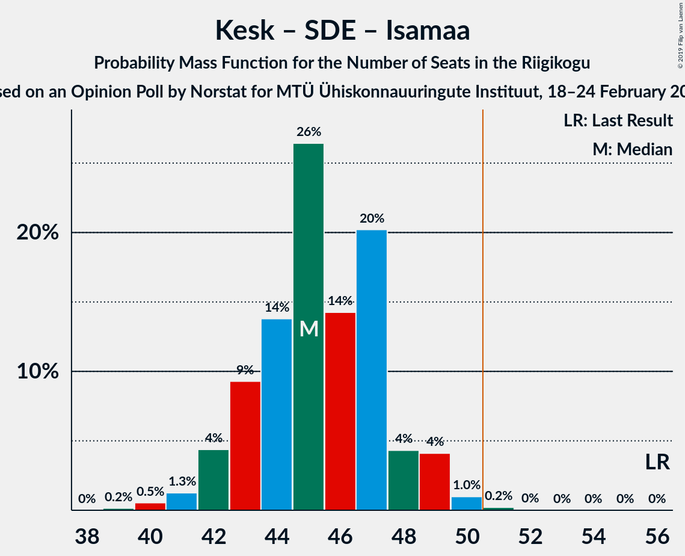

| Number of Seats | Probability | Accumulated | Special Marks |
|:---------------:|:-----------:|:-----------:|:-------------:|
| 39 | 0.2% | 100% |  |
| 40 | 0.5% | 99.8% |  |
| 41 | 1.3% | 99.3% |  |
| 42 | 4% | 98% |  |
| 43 | 9% | 94% |  |
| 44 | 14% | 84% |  |
| 45 | 26% | 71% | Median |
| 46 | 14% | 44% |  |
| 47 | 20% | 30% |  |
| 48 | 4% | 10% |  |
| 49 | 4% | 5% |  |
| 50 | 1.0% | 1.2% |  |
| 51 | 0.2% | 0.3% | Majority |
| 52 | 0% | 0% |  |
| 53 | 0% | 0% |  |
| 54 | 0% | 0% |  |
| 55 | 0% | 0% |  |
| 56 | 0% | 0% | Last Result |

### Eesti Keskerakond – Eesti Konservatiivne Rahvaerakond

| Number of Seats | Probability | Accumulated | Special Marks |
|:---------------:|:-----------:|:-----------:|:-------------:|
| 34 | 0% | 100% | Last Result |
| 35 | 0% | 100% |  |
| 36 | 0% | 100% |  |
| 37 | 0% | 100% |  |
| 38 | 0.1% | 100% |  |
| 39 | 0.6% | 99.9% |  |
| 40 | 2% | 99.3% |  |
| 41 | 5% | 98% |  |
| 42 | 8% | 92% |  |
| 43 | 19% | 84% |  |
| 44 | 20% | 65% | Median |
| 45 | 20% | 46% |  |
| 46 | 15% | 26% |  |
| 47 | 6% | 10% |  |
| 48 | 3% | 4% |  |
| 49 | 0.9% | 1.3% |  |
| 50 | 0.3% | 0.3% |  |
| 51 | 0% | 0% | Majority |

### Eesti Reformierakond – Erakond Isamaa

| Number of Seats | Probability | Accumulated | Special Marks |
|:---------------:|:-----------:|:-----------:|:-------------:|
| 38 | 0.1% | 100% |  |
| 39 | 0.4% | 99.9% |  |
| 40 | 2% | 99.5% |  |
| 41 | 5% | 98% |  |
| 42 | 10% | 93% |  |
| 43 | 16% | 83% |  |
| 44 | 20% | 67% | Last Result, Median |
| 45 | 22% | 47% |  |
| 46 | 11% | 25% |  |
| 47 | 9% | 14% |  |
| 48 | 3% | 5% |  |
| 49 | 0.9% | 1.4% |  |
| 50 | 0.4% | 0.5% |  |
| 51 | 0.1% | 0.1% | Majority |
| 52 | 0% | 0% |  |

### Eesti Keskerakond – Sotsiaaldemokraatlik Erakond

| Number of Seats | Probability | Accumulated | Special Marks |
|:---------------:|:-----------:|:-----------:|:-------------:|
| 30 | 0.1% | 100% |  |
| 31 | 0.4% | 99.9% |  |
| 32 | 2% | 99.5% |  |
| 33 | 5% | 98% |  |
| 34 | 10% | 93% |  |
| 35 | 19% | 83% |  |
| 36 | 21% | 64% | Median |
| 37 | 18% | 43% |  |
| 38 | 15% | 24% |  |
| 39 | 6% | 9% |  |
| 40 | 3% | 3% |  |
| 41 | 0.5% | 0.7% |  |
| 42 | 0.1% | 0.2% | Last Result |
| 43 | 0% | 0% |  |

### Eesti Konservatiivne Rahvaerakond – Sotsiaaldemokraatlik Erakond

| Number of Seats | Probability | Accumulated | Special Marks |
|:---------------:|:-----------:|:-----------:|:-------------:|
| 22 | 0% | 100% | Last Result |
| 23 | 0% | 100% |  |
| 24 | 0% | 100% |  |
| 25 | 0% | 100% |  |
| 26 | 0% | 100% |  |
| 27 | 0.1% | 100% |  |
| 28 | 0.4% | 99.8% |  |
| 29 | 3% | 99.4% |  |
| 30 | 7% | 97% |  |
| 31 | 14% | 89% |  |
| 32 | 20% | 75% | Median |
| 33 | 25% | 56% |  |
| 34 | 12% | 30% |  |
| 35 | 11% | 18% |  |
| 36 | 5% | 7% |  |
| 37 | 1.2% | 2% |  |
| 38 | 0.3% | 0.4% |  |
| 39 | 0.1% | 0.1% |  |
| 40 | 0% | 0% |  |

## Technical Information

### Opinion Poll

+ **Polling firm:** Norstat
+ **Commissioner(s):** MTÜ Ühiskonnauuringute Instituut
+ **Fieldwork period:** 18–24 February 2019

### Calculations

+ **Sample size:** 1001
+ **Simulations done:** 1,048,576
+ **Error estimate:** 1.69%

