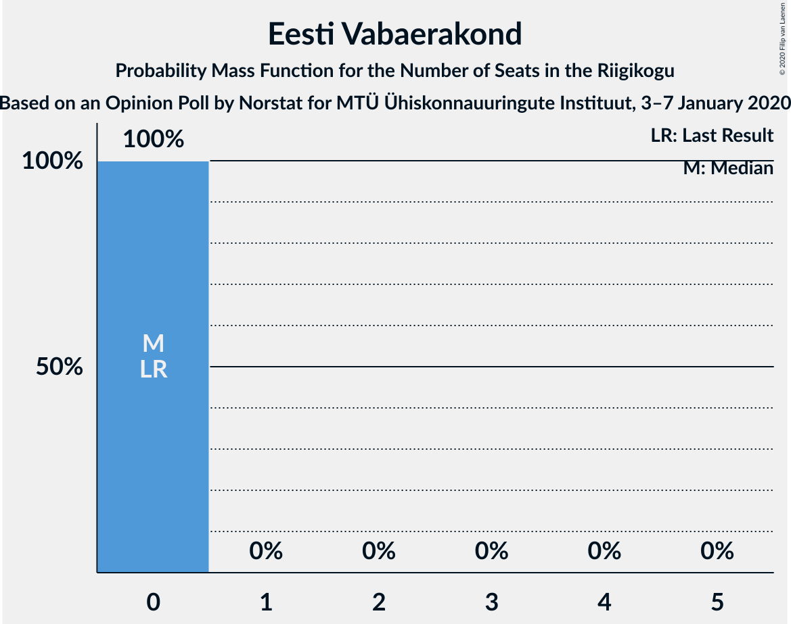

# Opinion Poll by Norstat for MTÜ Ühiskonnauuringute Instituut, 3–7 January 2020

<a href="#voting-intentions">Voting Intentions</a> | <a href="#seats">Seats</a> | <a href="#coalitions">Coalitions</a> | <a href="#technical-information">Technical Information</a>

## Voting Intentions

### Confidence Intervals

| Party | Last Result | Poll Result | 80% Confidence Interval | 90% Confidence Interval | 95% Confidence Interval | 99% Confidence Interval |
|:-----:|:-----------:|:-----------:|:-----------------------:|:-----------------------:|:-----------------------:|:-----------------------:|
| Eesti Reformierakond | 28.9% | 34.1% | 32.2–36.1% |31.7–36.6% |31.2–37.1% |30.3–38.0% |
| Eesti Keskerakond | 23.1% | 23.6% | 21.9–25.4% |21.5–25.9% |21.1–26.3% |20.3–27.2% |
| Eesti Konservatiivne Rahvaerakond | 17.8% | 15.8% | 14.4–17.4% |14.0–17.8% |13.7–18.2% |13.0–19.0% |
| Sotsiaaldemokraatlik Erakond | 9.8% | 8.2% | 7.2–9.4% |6.9–9.8% |6.6–10.1% |6.2–10.7% |
| Eesti 200 | 4.4% | 7.3% | 6.3–8.5% |6.1–8.8% |5.8–9.1% |5.4–9.7% |
| Erakond Isamaa | 11.4% | 6.3% | 5.4–7.4% |5.2–7.7% |5.0–8.0% |4.6–8.5% |
| Erakond Eestimaa Rohelised | 1.8% | 2.6% | 2.1–3.4% |1.9–3.6% |1.8–3.8% |1.6–4.2% |
| Eesti Vabaerakond | 1.2% | 0.6% | 0.4–1.1% |0.3–1.2% |0.3–1.3% |0.2–1.6% |

*Note:* The poll result column reflects the actual value used in the calculations. Published results may vary slightly, and in addition be rounded to fewer digits.

## Seats

### Confidence Intervals

| Party | Last Result | Median | 80% Confidence Interval | 90% Confidence Interval | 95% Confidence Interval | 99% Confidence Interval |
|:-----:|:-----------:|:------:|:-----------------------:|:-----------------------:|:-----------------------:|:-----------------------:|
| <a href="#eesti-reformierakond">Eesti Reformierakond</a> | 34 | 39 | 37–41 |36–42 |36–43 |34–44 |
| <a href="#eesti-keskerakond">Eesti Keskerakond</a> | 26 | 26 | 24–28 |23–29 |23–29 |22–30 |
| <a href="#eesti-konservatiivne-rahvaerakond">Eesti Konservatiivne Rahvaerakond</a> | 19 | 16 | 15–18 |14–18 |14–19 |13–21 |
| <a href="#sotsiaaldemokraatlik-erakond">Sotsiaaldemokraatlik Erakond</a> | 10 | 7 | 7–9 |6–9 |6–10 |6–10 |
| <a href="#eesti-200">Eesti 200</a> | 0 | 7 | 6–8 |5–9 |5–9 |5–9 |
| <a href="#erakond-isamaa">Erakond Isamaa</a> | 12 | 5 | 5–7 |5–7 |4–7 |0–8 |
| <a href="#erakond-eestimaa-rohelised">Erakond Eestimaa Rohelised</a> | 0 | 0 | 0 |0 |0 |0 |
| <a href="#eesti-vabaerakond">Eesti Vabaerakond</a> | 0 | 0 | 0 |0 |0 |0 |

### Eesti Reformierakond

*For a full overview of the results for this party, see the [Eesti Reformierakond](party-eestireformierakond.html) page.*

| Number of Seats | Probability | Accumulated | Special Marks |
|:---------------:|:-----------:|:-----------:|:-------------:|
| 33 | 0.1% | 100% |  |
| 34 | 0.5% | 99.9% | Last Result |
| 35 | 2% | 99.4% |  |
| 36 | 4% | 98% |  |
| 37 | 17% | 94% |  |
| 38 | 11% | 77% |  |
| 39 | 25% | 66% | Median |
| 40 | 5% | 42% |  |
| 41 | 30% | 36% |  |
| 42 | 3% | 6% |  |
| 43 | 2% | 3% |  |
| 44 | 0.3% | 0.5% |  |
| 45 | 0.1% | 0.2% |  |
| 46 | 0% | 0.1% |  |
| 47 | 0% | 0% |  |

### Eesti Keskerakond

*For a full overview of the results for this party, see the [Eesti Keskerakond](party-eestikeskerakond.html) page.*

| Number of Seats | Probability | Accumulated | Special Marks |
|:---------------:|:-----------:|:-----------:|:-------------:|
| 21 | 0.3% | 100% |  |
| 22 | 0.8% | 99.7% |  |
| 23 | 5% | 98.9% |  |
| 24 | 16% | 94% |  |
| 25 | 13% | 78% |  |
| 26 | 39% | 64% | Last Result, Median |
| 27 | 10% | 25% |  |
| 28 | 9% | 15% |  |
| 29 | 5% | 5% |  |
| 30 | 0.5% | 0.8% |  |
| 31 | 0.2% | 0.3% |  |
| 32 | 0.1% | 0.1% |  |
| 33 | 0% | 0% |  |

### Eesti Konservatiivne Rahvaerakond

*For a full overview of the results for this party, see the [Eesti Konservatiivne Rahvaerakond](party-eestikonservatiivnerahvaerakond.html) page.*

| Number of Seats | Probability | Accumulated | Special Marks |
|:---------------:|:-----------:|:-----------:|:-------------:|
| 12 | 0.1% | 100% |  |
| 13 | 0.7% | 99.9% |  |
| 14 | 4% | 99.1% |  |
| 15 | 16% | 95% |  |
| 16 | 44% | 79% | Median |
| 17 | 23% | 35% |  |
| 18 | 7% | 12% |  |
| 19 | 3% | 5% | Last Result |
| 20 | 1.4% | 2% |  |
| 21 | 0.7% | 0.7% |  |
| 22 | 0% | 0% |  |

### Sotsiaaldemokraatlik Erakond

*For a full overview of the results for this party, see the [Sotsiaaldemokraatlik Erakond](party-sotsiaaldemokraatlikerakond.html) page.*

| Number of Seats | Probability | Accumulated | Special Marks |
|:---------------:|:-----------:|:-----------:|:-------------:|
| 5 | 0.4% | 100% |  |
| 6 | 10% | 99.6% |  |
| 7 | 43% | 90% | Median |
| 8 | 28% | 47% |  |
| 9 | 16% | 20% |  |
| 10 | 3% | 4% | Last Result |
| 11 | 0.4% | 0.4% |  |
| 12 | 0% | 0% |  |

### Eesti 200

*For a full overview of the results for this party, see the [Eesti 200](party-eesti200.html) page.*

| Number of Seats | Probability | Accumulated | Special Marks |
|:---------------:|:-----------:|:-----------:|:-------------:|
| 0 | 0% | 100% | Last Result |
| 1 | 0% | 100% |  |
| 2 | 0% | 100% |  |
| 3 | 0% | 100% |  |
| 4 | 0.1% | 100% |  |
| 5 | 7% | 99.8% |  |
| 6 | 42% | 93% |  |
| 7 | 36% | 51% | Median |
| 8 | 9% | 15% |  |
| 9 | 5% | 5% |  |
| 10 | 0.2% | 0.2% |  |
| 11 | 0% | 0% |  |

### Erakond Isamaa

*For a full overview of the results for this party, see the [Erakond Isamaa](party-erakondisamaa.html) page.*

| Number of Seats | Probability | Accumulated | Special Marks |
|:---------------:|:-----------:|:-----------:|:-------------:|
| 0 | 2% | 100% |  |
| 1 | 0% | 98% |  |
| 2 | 0% | 98% |  |
| 3 | 0% | 98% |  |
| 4 | 2% | 98% |  |
| 5 | 53% | 95% | Median |
| 6 | 25% | 42% |  |
| 7 | 16% | 17% |  |
| 8 | 1.2% | 1.3% |  |
| 9 | 0.1% | 0.1% |  |
| 10 | 0% | 0% |  |
| 11 | 0% | 0% |  |
| 12 | 0% | 0% | Last Result |

### Erakond Eestimaa Rohelised

*For a full overview of the results for this party, see the [Erakond Eestimaa Rohelised](party-erakondeestimaarohelised.html) page.*

| Number of Seats | Probability | Accumulated | Special Marks |
|:---------------:|:-----------:|:-----------:|:-------------:|
| 0 | 100% | 100% | Last Result, Median |

### Eesti Vabaerakond

*For a full overview of the results for this party, see the [Eesti Vabaerakond](party-eestivabaerakond.html) page.*

| Number of Seats | Probability | Accumulated | Special Marks |
|:---------------:|:-----------:|:-----------:|:-------------:|
| 0 | 100% | 100% | Last Result, Median |

## Coalitions

### Confidence Intervals

| Coalition | Last Result | Median | Majority? | 80% Confidence Interval | 90% Confidence Interval | 95% Confidence Interval | 99% Confidence Interval |
|:---------:|:-----------:|:------:|:---------:|:-----------------------:|:-----------------------:|:-----------------------:|:-----------------------:|
| Eesti Reformierakond – Eesti Keskerakond – Eesti Konservatiivne Rahvaerakond | 79 | 81 | 100% | 79–83 | 78–84 | 78–84 | 77–87 |
| Eesti Reformierakond – Eesti Keskerakond | 60 | 65 | 100% | 63–67 | 61–68 | 61–68 | 60–70 |
| Eesti Reformierakond – Eesti Konservatiivne Rahvaerakond – Erakond Isamaa | 65 | 61 | 100% | 58–63 | 58–64 | 57–65 | 56–65 |
| Eesti Reformierakond – Eesti Konservatiivne Rahvaerakond | 53 | 56 | 99.7% | 53–58 | 53–58 | 52–59 | 51–60 |
| Eesti Reformierakond – Sotsiaaldemokraatlik Erakond – Erakond Isamaa – Eesti Vabaerakond | 56 | 53 | 86% | 50–54 | 49–55 | 48–56 | 47–57 |
| Eesti Reformierakond – Sotsiaaldemokraatlik Erakond – Erakond Isamaa | 56 | 53 | 86% | 50–54 | 49–55 | 48–56 | 47–57 |
| Eesti Keskerakond – Eesti Konservatiivne Rahvaerakond – Erakond Isamaa | 57 | 47 | 5% | 46–50 | 45–51 | 44–52 | 42–52 |
| Eesti Reformierakond – Sotsiaaldemokraatlik Erakond | 44 | 47 | 2% | 44–49 | 44–50 | 43–50 | 42–52 |
| Eesti Reformierakond – Erakond Isamaa | 46 | 45 | 0.1% | 42–47 | 42–48 | 41–48 | 39–49 |
| Eesti Keskerakond – Eesti Konservatiivne Rahvaerakond | 45 | 42 | 0% | 40–44 | 39–45 | 39–46 | 38–47 |
| Eesti Keskerakond – Sotsiaaldemokraatlik Erakond – Erakond Isamaa | 48 | 39 | 0% | 36–41 | 36–42 | 36–43 | 35–43 |
| Eesti Keskerakond – Sotsiaaldemokraatlik Erakond | 36 | 33 | 0% | 31–36 | 31–37 | 30–37 | 29–38 |
| Eesti Konservatiivne Rahvaerakond – Sotsiaaldemokraatlik Erakond | 29 | 24 | 0% | 22–26 | 22–26 | 21–27 | 20–28 |

### Eesti Reformierakond – Eesti Keskerakond – Eesti Konservatiivne Rahvaerakond

| Number of Seats | Probability | Accumulated | Special Marks |
|:---------------:|:-----------:|:-----------:|:-------------:|
| 76 | 0.2% | 100% |  |
| 77 | 1.3% | 99.8% |  |
| 78 | 5% | 98% |  |
| 79 | 7% | 94% | Last Result |
| 80 | 19% | 86% |  |
| 81 | 27% | 68% | Median |
| 82 | 9% | 41% |  |
| 83 | 27% | 32% |  |
| 84 | 3% | 5% |  |
| 85 | 0.7% | 2% |  |
| 86 | 1.0% | 2% |  |
| 87 | 0.4% | 0.7% |  |
| 88 | 0.1% | 0.3% |  |
| 89 | 0.1% | 0.1% |  |
| 90 | 0% | 0% |  |

### Eesti Reformierakond – Eesti Keskerakond

| Number of Seats | Probability | Accumulated | Special Marks |
|:---------------:|:-----------:|:-----------:|:-------------:|
| 59 | 0.2% | 100% |  |
| 60 | 1.0% | 99.8% | Last Result |
| 61 | 4% | 98.8% |  |
| 62 | 3% | 95% |  |
| 63 | 16% | 92% |  |
| 64 | 15% | 75% |  |
| 65 | 20% | 60% | Median |
| 66 | 9% | 40% |  |
| 67 | 26% | 32% |  |
| 68 | 3% | 5% |  |
| 69 | 1.2% | 2% |  |
| 70 | 0.6% | 1.0% |  |
| 71 | 0.3% | 0.4% |  |
| 72 | 0.1% | 0.2% |  |
| 73 | 0% | 0% |  |

### Eesti Reformierakond – Eesti Konservatiivne Rahvaerakond – Erakond Isamaa

| Number of Seats | Probability | Accumulated | Special Marks |
|:---------------:|:-----------:|:-----------:|:-------------:|
| 54 | 0.1% | 100% |  |
| 55 | 0.2% | 99.9% |  |
| 56 | 0.6% | 99.7% |  |
| 57 | 3% | 99.1% |  |
| 58 | 7% | 96% |  |
| 59 | 8% | 89% |  |
| 60 | 24% | 82% | Median |
| 61 | 14% | 58% |  |
| 62 | 28% | 44% |  |
| 63 | 9% | 16% |  |
| 64 | 4% | 7% |  |
| 65 | 3% | 3% | Last Result |
| 66 | 0.4% | 0.5% |  |
| 67 | 0% | 0.1% |  |
| 68 | 0% | 0% |  |

### Eesti Reformierakond – Eesti Konservatiivne Rahvaerakond

| Number of Seats | Probability | Accumulated | Special Marks |
|:---------------:|:-----------:|:-----------:|:-------------:|
| 49 | 0.1% | 100% |  |
| 50 | 0.2% | 99.9% |  |
| 51 | 2% | 99.7% | Majority |
| 52 | 2% | 98% |  |
| 53 | 15% | 95% | Last Result |
| 54 | 12% | 80% |  |
| 55 | 16% | 68% | Median |
| 56 | 14% | 52% |  |
| 57 | 26% | 38% |  |
| 58 | 8% | 12% |  |
| 59 | 2% | 4% |  |
| 60 | 1.3% | 2% |  |
| 61 | 0.3% | 0.4% |  |
| 62 | 0.1% | 0.1% |  |
| 63 | 0% | 0% |  |

### Eesti Reformierakond – Sotsiaaldemokraatlik Erakond – Erakond Isamaa – Eesti Vabaerakond

| Number of Seats | Probability | Accumulated | Special Marks |
|:---------------:|:-----------:|:-----------:|:-------------:|
| 46 | 0.2% | 100% |  |
| 47 | 0.7% | 99.8% |  |
| 48 | 2% | 99.1% |  |
| 49 | 4% | 97% |  |
| 50 | 8% | 93% |  |
| 51 | 17% | 86% | Median, Majority |
| 52 | 18% | 68% |  |
| 53 | 31% | 51% |  |
| 54 | 11% | 20% |  |
| 55 | 7% | 9% |  |
| 56 | 1.0% | 3% | Last Result |
| 57 | 1.2% | 1.5% |  |
| 58 | 0.2% | 0.3% |  |
| 59 | 0% | 0% |  |

### Eesti Reformierakond – Sotsiaaldemokraatlik Erakond – Erakond Isamaa

| Number of Seats | Probability | Accumulated | Special Marks |
|:---------------:|:-----------:|:-----------:|:-------------:|
| 46 | 0.2% | 100% |  |
| 47 | 0.7% | 99.8% |  |
| 48 | 2% | 99.1% |  |
| 49 | 4% | 97% |  |
| 50 | 8% | 93% |  |
| 51 | 17% | 86% | Median, Majority |
| 52 | 18% | 68% |  |
| 53 | 31% | 51% |  |
| 54 | 11% | 20% |  |
| 55 | 7% | 9% |  |
| 56 | 1.0% | 3% | Last Result |
| 57 | 1.2% | 1.5% |  |
| 58 | 0.2% | 0.3% |  |
| 59 | 0% | 0% |  |

### Eesti Keskerakond – Eesti Konservatiivne Rahvaerakond – Erakond Isamaa

| Number of Seats | Probability | Accumulated | Special Marks |
|:---------------:|:-----------:|:-----------:|:-------------:|
| 41 | 0.4% | 100% |  |
| 42 | 0.1% | 99.6% |  |
| 43 | 0.7% | 99.4% |  |
| 44 | 3% | 98.7% |  |
| 45 | 4% | 95% |  |
| 46 | 9% | 92% |  |
| 47 | 47% | 82% | Median |
| 48 | 7% | 35% |  |
| 49 | 15% | 29% |  |
| 50 | 9% | 14% |  |
| 51 | 2% | 5% | Majority |
| 52 | 3% | 3% |  |
| 53 | 0.4% | 0.4% |  |
| 54 | 0% | 0% |  |
| 55 | 0% | 0% |  |
| 56 | 0% | 0% |  |
| 57 | 0% | 0% | Last Result |

### Eesti Reformierakond – Sotsiaaldemokraatlik Erakond

| Number of Seats | Probability | Accumulated | Special Marks |
|:---------------:|:-----------:|:-----------:|:-------------:|
| 41 | 0.3% | 100% |  |
| 42 | 1.0% | 99.6% |  |
| 43 | 3% | 98.7% |  |
| 44 | 8% | 95% | Last Result |
| 45 | 10% | 87% |  |
| 46 | 15% | 77% | Median |
| 47 | 22% | 63% |  |
| 48 | 31% | 41% |  |
| 49 | 5% | 10% |  |
| 50 | 3% | 5% |  |
| 51 | 1.5% | 2% | Majority |
| 52 | 0.3% | 0.7% |  |
| 53 | 0.3% | 0.4% |  |
| 54 | 0% | 0.1% |  |
| 55 | 0% | 0% |  |

### Eesti Reformierakond – Erakond Isamaa

| Number of Seats | Probability | Accumulated | Special Marks |
|:---------------:|:-----------:|:-----------:|:-------------:|
| 38 | 0.2% | 100% |  |
| 39 | 0.5% | 99.7% |  |
| 40 | 1.4% | 99.3% |  |
| 41 | 2% | 98% |  |
| 42 | 11% | 96% |  |
| 43 | 8% | 85% |  |
| 44 | 26% | 77% | Median |
| 45 | 8% | 51% |  |
| 46 | 33% | 43% | Last Result |
| 47 | 4% | 10% |  |
| 48 | 5% | 6% |  |
| 49 | 0.9% | 1.3% |  |
| 50 | 0.3% | 0.4% |  |
| 51 | 0.1% | 0.1% | Majority |
| 52 | 0% | 0% |  |

### Eesti Keskerakond – Eesti Konservatiivne Rahvaerakond

| Number of Seats | Probability | Accumulated | Special Marks |
|:---------------:|:-----------:|:-----------:|:-------------:|
| 36 | 0.1% | 100% |  |
| 37 | 0.3% | 99.9% |  |
| 38 | 1.2% | 99.6% |  |
| 39 | 4% | 98% |  |
| 40 | 11% | 94% |  |
| 41 | 13% | 83% |  |
| 42 | 39% | 70% | Median |
| 43 | 11% | 31% |  |
| 44 | 12% | 19% |  |
| 45 | 3% | 7% | Last Result |
| 46 | 3% | 4% |  |
| 47 | 0.7% | 0.9% |  |
| 48 | 0.2% | 0.2% |  |
| 49 | 0% | 0% |  |

### Eesti Keskerakond – Sotsiaaldemokraatlik Erakond – Erakond Isamaa

| Number of Seats | Probability | Accumulated | Special Marks |
|:---------------:|:-----------:|:-----------:|:-------------:|
| 31 | 0.1% | 100% |  |
| 32 | 0% | 99.9% |  |
| 33 | 0.1% | 99.9% |  |
| 34 | 0.3% | 99.8% |  |
| 35 | 2% | 99.5% |  |
| 36 | 9% | 98% |  |
| 37 | 6% | 89% |  |
| 38 | 29% | 83% | Median |
| 39 | 23% | 54% |  |
| 40 | 9% | 31% |  |
| 41 | 13% | 22% |  |
| 42 | 7% | 9% |  |
| 43 | 2% | 3% |  |
| 44 | 0.3% | 0.3% |  |
| 45 | 0.1% | 0.1% |  |
| 46 | 0% | 0% |  |
| 47 | 0% | 0% |  |
| 48 | 0% | 0% | Last Result |

### Eesti Keskerakond – Sotsiaaldemokraatlik Erakond

| Number of Seats | Probability | Accumulated | Special Marks |
|:---------------:|:-----------:|:-----------:|:-------------:|
| 28 | 0.1% | 100% |  |
| 29 | 0.4% | 99.9% |  |
| 30 | 4% | 99.5% |  |
| 31 | 8% | 95% |  |
| 32 | 8% | 87% |  |
| 33 | 36% | 79% | Median |
| 34 | 23% | 42% |  |
| 35 | 8% | 19% |  |
| 36 | 5% | 12% | Last Result |
| 37 | 6% | 7% |  |
| 38 | 0.7% | 0.9% |  |
| 39 | 0.2% | 0.3% |  |
| 40 | 0% | 0% |  |

### Eesti Konservatiivne Rahvaerakond – Sotsiaaldemokraatlik Erakond

| Number of Seats | Probability | Accumulated | Special Marks |
|:---------------:|:-----------:|:-----------:|:-------------:|
| 19 | 0.4% | 100% |  |
| 20 | 0.8% | 99.6% |  |
| 21 | 2% | 98.9% |  |
| 22 | 10% | 96% |  |
| 23 | 36% | 87% | Median |
| 24 | 20% | 50% |  |
| 25 | 12% | 31% |  |
| 26 | 14% | 18% |  |
| 27 | 3% | 4% |  |
| 28 | 1.4% | 2% |  |
| 29 | 0.3% | 0.3% | Last Result |
| 30 | 0% | 0% |  |

## Technical Information

### Opinion Poll

+ **Polling firm:** Norstat
+ **Commissioner(s):** MTÜ Ühiskonnauuringute Instituut
+ **Fieldwork period:** 3–7 January 2020

### Calculations

+ **Sample size:** 1000
+ **Simulations done:** 131,072
+ **Error estimate:** 1.45%

