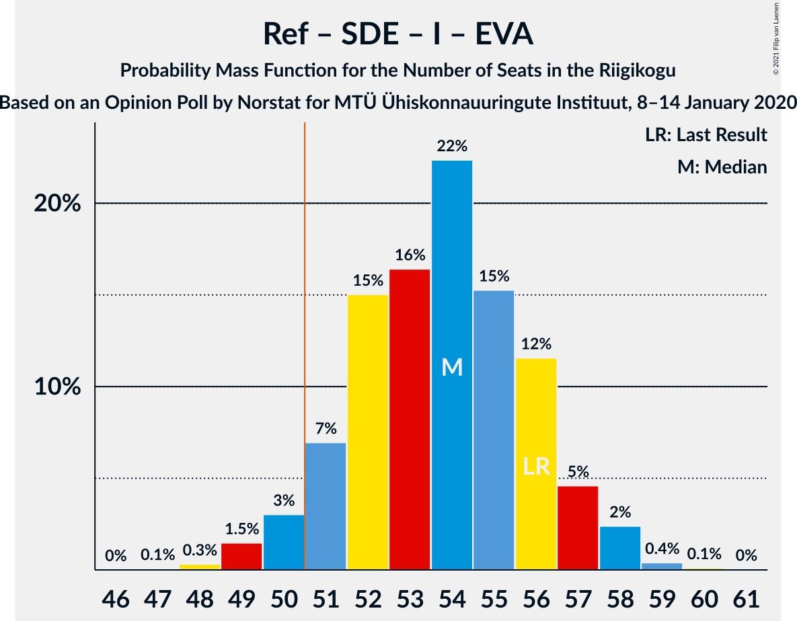
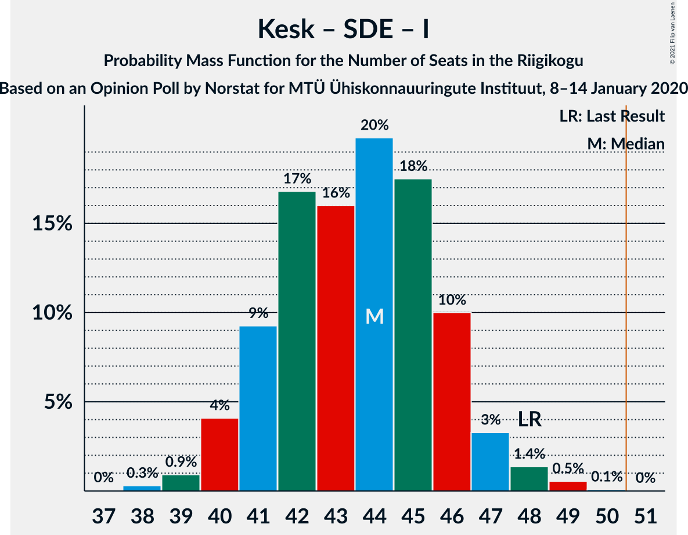

# Opinion Poll by Norstat for MTÜ Ühiskonnauuringute Instituut, 8–14 January 2020

<a href="#voting-intentions">Voting Intentions</a> | <a href="#seats">Seats</a> | <a href="#coalitions">Coalitions</a> | <a href="#technical-information">Technical Information</a>

## Voting Intentions

### Confidence Intervals

| Party | Last Result | Poll Result | 80% Confidence Interval | 90% Confidence Interval | 95% Confidence Interval | 99% Confidence Interval |
|:-----:|:-----------:|:-----------:|:-----------------------:|:-----------------------:|:-----------------------:|:-----------------------:|
| Eesti Reformierakond | 28.9% | 32.3% | 30.4–34.2% |29.9–34.8% |29.5–35.3% |28.6–36.2% |
| Eesti Keskerakond | 23.1% | 24.4% | 22.7–26.2% |22.2–26.7% |21.8–27.2% |21.0–28.0% |
| Eesti Konservatiivne Rahvaerakond | 17.8% | 13.0% | 11.7–14.5% |11.4–14.9% |11.1–15.2% |10.5–16.0% |
| Sotsiaaldemokraatlik Erakond | 9.8% | 8.5% | 7.5–9.7% |7.2–10.1% |6.9–10.4% |6.5–11.0% |
| Erakond Isamaa | 11.4% | 8.4% | 7.4–9.6% |7.1–10.0% |6.8–10.3% |6.4–10.9% |
| Eesti 200 | 4.4% | 7.0% | 6.1–8.2% |5.8–8.5% |5.6–8.8% |5.2–9.3% |
| Erakond Eestimaa Rohelised | 1.8% | 3.5% | 2.9–4.4% |2.7–4.6% |2.5–4.8% |2.2–5.3% |
| Eesti Vabaerakond | 1.2% | 0.6% | 0.4–1.1% |0.3–1.2% |0.3–1.3% |0.2–1.6% |

*Note:* The poll result column reflects the actual value used in the calculations. Published results may vary slightly, and in addition be rounded to fewer digits.

## Seats

### Confidence Intervals

| Party | Last Result | Median | 80% Confidence Interval | 90% Confidence Interval | 95% Confidence Interval | 99% Confidence Interval |
|:-----:|:-----------:|:------:|:-----------------------:|:-----------------------:|:-----------------------:|:-----------------------:|
| <a href="#eesti-reformierakond">Eesti Reformierakond</a> | 34 | 37 | 35–40 |35–41 |34–42 |32–42 |
| <a href="#eesti-keskerakond">Eesti Keskerakond</a> | 26 | 27 | 25–29 |24–30 |23–30 |23–32 |
| <a href="#eesti-konservatiivne-rahvaerakond">Eesti Konservatiivne Rahvaerakond</a> | 19 | 13 | 12–15 |11–15 |11–16 |10–17 |
| <a href="#sotsiaaldemokraatlik-erakond">Sotsiaaldemokraatlik Erakond</a> | 10 | 9 | 7–10 |6–10 |6–11 |6–11 |
| <a href="#erakond-isamaa">Erakond Isamaa</a> | 12 | 8 | 7–10 |6–10 |6–10 |6–10 |
| <a href="#eesti-200">Eesti 200</a> | 0 | 6 | 5–8 |5–8 |5–9 |4–9 |
| <a href="#erakond-eestimaa-rohelised">Erakond Eestimaa Rohelised</a> | 0 | 0 | 0 |0 |0 |0–5 |
| <a href="#eesti-vabaerakond">Eesti Vabaerakond</a> | 0 | 0 | 0 |0 |0 |0 |

### Eesti Reformierakond

*For a full overview of the results for this party, see the [Eesti Reformierakond](party-eestireformierakond.html) page.*

| Number of Seats | Probability | Accumulated | Special Marks |
|:---------------:|:-----------:|:-----------:|:-------------:|
| 31 | 0.1% | 100% |  |
| 32 | 0.6% | 99.9% |  |
| 33 | 1.1% | 99.3% |  |
| 34 | 3% | 98% | Last Result |
| 35 | 8% | 95% |  |
| 36 | 17% | 88% |  |
| 37 | 32% | 71% | Median |
| 38 | 11% | 39% |  |
| 39 | 11% | 28% |  |
| 40 | 11% | 18% |  |
| 41 | 3% | 7% |  |
| 42 | 3% | 4% |  |
| 43 | 0.2% | 0.3% |  |
| 44 | 0.2% | 0.2% |  |
| 45 | 0% | 0% |  |

### Eesti Keskerakond

*For a full overview of the results for this party, see the [Eesti Keskerakond](party-eestikeskerakond.html) page.*

| Number of Seats | Probability | Accumulated | Special Marks |
|:---------------:|:-----------:|:-----------:|:-------------:|
| 22 | 0.3% | 100% |  |
| 23 | 2% | 99.7% |  |
| 24 | 6% | 97% |  |
| 25 | 14% | 91% |  |
| 26 | 23% | 77% | Last Result |
| 27 | 23% | 54% | Median |
| 28 | 15% | 31% |  |
| 29 | 6% | 16% |  |
| 30 | 7% | 10% |  |
| 31 | 1.3% | 2% |  |
| 32 | 0.7% | 1.1% |  |
| 33 | 0.3% | 0.4% |  |
| 34 | 0% | 0% |  |

### Eesti Konservatiivne Rahvaerakond

*For a full overview of the results for this party, see the [Eesti Konservatiivne Rahvaerakond](party-eestikonservatiivnerahvaerakond.html) page.*

| Number of Seats | Probability | Accumulated | Special Marks |
|:---------------:|:-----------:|:-----------:|:-------------:|
| 10 | 0.6% | 100% |  |
| 11 | 4% | 99.4% |  |
| 12 | 23% | 95% |  |
| 13 | 24% | 72% | Median |
| 14 | 27% | 48% |  |
| 15 | 17% | 21% |  |
| 16 | 3% | 4% |  |
| 17 | 0.7% | 0.9% |  |
| 18 | 0.1% | 0.1% |  |
| 19 | 0% | 0% | Last Result |

### Sotsiaaldemokraatlik Erakond

*For a full overview of the results for this party, see the [Sotsiaaldemokraatlik Erakond](party-sotsiaaldemokraatlikerakond.html) page.*

| Number of Seats | Probability | Accumulated | Special Marks |
|:---------------:|:-----------:|:-----------:|:-------------:|
| 5 | 0.2% | 100% |  |
| 6 | 6% | 99.8% |  |
| 7 | 11% | 94% |  |
| 8 | 19% | 83% |  |
| 9 | 36% | 64% | Median |
| 10 | 24% | 28% | Last Result |
| 11 | 4% | 4% |  |
| 12 | 0.3% | 0.3% |  |
| 13 | 0% | 0% |  |

### Erakond Isamaa

*For a full overview of the results for this party, see the [Erakond Isamaa](party-erakondisamaa.html) page.*

| Number of Seats | Probability | Accumulated | Special Marks |
|:---------------:|:-----------:|:-----------:|:-------------:|
| 5 | 0.1% | 100% |  |
| 6 | 7% | 99.9% |  |
| 7 | 41% | 93% |  |
| 8 | 9% | 53% | Median |
| 9 | 31% | 44% |  |
| 10 | 12% | 13% |  |
| 11 | 0.2% | 0.3% |  |
| 12 | 0.1% | 0.1% | Last Result |
| 13 | 0% | 0% |  |

### Eesti 200

*For a full overview of the results for this party, see the [Eesti 200](party-eesti200.html) page.*

| Number of Seats | Probability | Accumulated | Special Marks |
|:---------------:|:-----------:|:-----------:|:-------------:|
| 0 | 0.2% | 100% | Last Result |
| 1 | 0% | 99.8% |  |
| 2 | 0% | 99.8% |  |
| 3 | 0% | 99.8% |  |
| 4 | 0.6% | 99.8% |  |
| 5 | 14% | 99.2% |  |
| 6 | 36% | 85% | Median |
| 7 | 38% | 50% |  |
| 8 | 8% | 11% |  |
| 9 | 3% | 4% |  |
| 10 | 0.2% | 0.2% |  |
| 11 | 0% | 0% |  |

### Erakond Eestimaa Rohelised

*For a full overview of the results for this party, see the [Erakond Eestimaa Rohelised](party-erakondeestimaarohelised.html) page.*

| Number of Seats | Probability | Accumulated | Special Marks |
|:---------------:|:-----------:|:-----------:|:-------------:|
| 0 | 98% | 100% | Last Result, Median |
| 1 | 0% | 2% |  |
| 2 | 0% | 2% |  |
| 3 | 0% | 2% |  |
| 4 | 1.1% | 2% |  |
| 5 | 0.6% | 0.6% |  |
| 6 | 0% | 0% |  |

### Eesti Vabaerakond

*For a full overview of the results for this party, see the [Eesti Vabaerakond](party-eestivabaerakond.html) page.*

| Number of Seats | Probability | Accumulated | Special Marks |
|:---------------:|:-----------:|:-----------:|:-------------:|
| 0 | 100% | 100% | Last Result, Median |

## Coalitions

### Confidence Intervals

| Coalition | Last Result | Median | Majority? | 80% Confidence Interval | 90% Confidence Interval | 95% Confidence Interval | 99% Confidence Interval |
|:---------:|:-----------:|:------:|:---------:|:-----------------------:|:-----------------------:|:-----------------------:|:-----------------------:|
| Eesti Reformierakond – Eesti Keskerakond – Eesti Konservatiivne Rahvaerakond | 79 | 78 | 100% | 75–80 | 75–81 | 74–81 | 73–82 |
| Eesti Reformierakond – Eesti Keskerakond | 60 | 64 | 100% | 62–67 | 61–68 | 60–69 | 59–70 |
| Eesti Reformierakond – Eesti Konservatiivne Rahvaerakond – Erakond Isamaa | 65 | 59 | 100% | 56–61 | 56–62 | 55–63 | 54–64 |
| Eesti Reformierakond – Sotsiaaldemokraatlik Erakond – Erakond Isamaa – Eesti Vabaerakond | 56 | 54 | 97% | 52–57 | 51–58 | 50–58 | 49–59 |
| Eesti Reformierakond – Sotsiaaldemokraatlik Erakond – Erakond Isamaa | 56 | 54 | 97% | 52–57 | 51–58 | 50–58 | 49–59 |
| Eesti Reformierakond – Eesti Konservatiivne Rahvaerakond | 53 | 51 | 63% | 48–53 | 48–54 | 47–55 | 46–56 |
| Eesti Keskerakond – Eesti Konservatiivne Rahvaerakond – Erakond Isamaa | 57 | 48 | 17% | 46–51 | 45–52 | 44–53 | 43–54 |
| Eesti Reformierakond – Sotsiaaldemokraatlik Erakond | 44 | 46 | 2% | 43–49 | 43–49 | 42–50 | 40–51 |
| Eesti Reformierakond – Erakond Isamaa | 46 | 46 | 0.6% | 43–48 | 43–49 | 42–49 | 40–51 |
| Eesti Keskerakond – Sotsiaaldemokraatlik Erakond – Erakond Isamaa | 48 | 44 | 0% | 41–46 | 40–46 | 39–47 | 38–49 |
| Eesti Keskerakond – Eesti Konservatiivne Rahvaerakond | 45 | 40 | 0% | 38–43 | 37–43 | 36–45 | 35–46 |
| Eesti Keskerakond – Sotsiaaldemokraatlik Erakond | 36 | 36 | 0% | 33–38 | 32–38 | 32–39 | 30–40 |
| Eesti Konservatiivne Rahvaerakond – Sotsiaaldemokraatlik Erakond | 29 | 22 | 0% | 20–24 | 19–25 | 19–25 | 17–26 |

### Eesti Reformierakond – Eesti Keskerakond – Eesti Konservatiivne Rahvaerakond

| Number of Seats | Probability | Accumulated | Special Marks |
|:---------------:|:-----------:|:-----------:|:-------------:|
| 71 | 0.1% | 100% |  |
| 72 | 0.1% | 99.9% |  |
| 73 | 0.8% | 99.8% |  |
| 74 | 2% | 98.9% |  |
| 75 | 15% | 97% |  |
| 76 | 10% | 82% |  |
| 77 | 21% | 72% | Median |
| 78 | 12% | 51% |  |
| 79 | 24% | 40% | Last Result |
| 80 | 7% | 16% |  |
| 81 | 7% | 8% |  |
| 82 | 1.0% | 1.5% |  |
| 83 | 0.3% | 0.4% |  |
| 84 | 0.1% | 0.1% |  |
| 85 | 0% | 0.1% |  |
| 86 | 0.1% | 0.1% |  |
| 87 | 0% | 0% |  |

### Eesti Reformierakond – Eesti Keskerakond

| Number of Seats | Probability | Accumulated | Special Marks |
|:---------------:|:-----------:|:-----------:|:-------------:|
| 58 | 0.1% | 100% |  |
| 59 | 1.2% | 99.8% |  |
| 60 | 2% | 98.6% | Last Result |
| 61 | 6% | 97% |  |
| 62 | 15% | 91% |  |
| 63 | 16% | 76% |  |
| 64 | 11% | 60% | Median |
| 65 | 22% | 49% |  |
| 66 | 10% | 27% |  |
| 67 | 8% | 16% |  |
| 68 | 5% | 8% |  |
| 69 | 2% | 3% |  |
| 70 | 0.6% | 0.8% |  |
| 71 | 0.2% | 0.2% |  |
| 72 | 0% | 0.1% |  |
| 73 | 0% | 0% |  |

### Eesti Reformierakond – Eesti Konservatiivne Rahvaerakond – Erakond Isamaa

| Number of Seats | Probability | Accumulated | Special Marks |
|:---------------:|:-----------:|:-----------:|:-------------:|
| 53 | 0.2% | 100% |  |
| 54 | 0.6% | 99.7% |  |
| 55 | 2% | 99.1% |  |
| 56 | 9% | 97% |  |
| 57 | 8% | 88% |  |
| 58 | 28% | 80% | Median |
| 59 | 15% | 52% |  |
| 60 | 12% | 37% |  |
| 61 | 17% | 25% |  |
| 62 | 3% | 7% |  |
| 63 | 3% | 4% |  |
| 64 | 0.7% | 0.9% |  |
| 65 | 0.2% | 0.3% | Last Result |
| 66 | 0.1% | 0.1% |  |
| 67 | 0% | 0% |  |

### Eesti Reformierakond – Sotsiaaldemokraatlik Erakond – Erakond Isamaa – Eesti Vabaerakond

| Number of Seats | Probability | Accumulated | Special Marks |
|:---------------:|:-----------:|:-----------:|:-------------:|
| 47 | 0.1% | 100% |  |
| 48 | 0.3% | 99.9% |  |
| 49 | 1.1% | 99.6% |  |
| 50 | 2% | 98.5% |  |
| 51 | 6% | 97% | Majority |
| 52 | 7% | 91% |  |
| 53 | 19% | 84% |  |
| 54 | 20% | 66% | Median |
| 55 | 23% | 46% |  |
| 56 | 10% | 23% | Last Result |
| 57 | 8% | 13% |  |
| 58 | 4% | 5% |  |
| 59 | 1.0% | 1.4% |  |
| 60 | 0.3% | 0.3% |  |
| 61 | 0% | 0.1% |  |
| 62 | 0% | 0% |  |

### Eesti Reformierakond – Sotsiaaldemokraatlik Erakond – Erakond Isamaa

| Number of Seats | Probability | Accumulated | Special Marks |
|:---------------:|:-----------:|:-----------:|:-------------:|
| 47 | 0.1% | 100% |  |
| 48 | 0.3% | 99.9% |  |
| 49 | 1.1% | 99.6% |  |
| 50 | 2% | 98.5% |  |
| 51 | 6% | 97% | Majority |
| 52 | 7% | 91% |  |
| 53 | 19% | 84% |  |
| 54 | 20% | 66% | Median |
| 55 | 23% | 46% |  |
| 56 | 10% | 23% | Last Result |
| 57 | 8% | 13% |  |
| 58 | 4% | 5% |  |
| 59 | 1.0% | 1.4% |  |
| 60 | 0.3% | 0.3% |  |
| 61 | 0% | 0.1% |  |
| 62 | 0% | 0% |  |

### Eesti Reformierakond – Eesti Konservatiivne Rahvaerakond

| Number of Seats | Probability | Accumulated | Special Marks |
|:---------------:|:-----------:|:-----------:|:-------------:|
| 44 | 0.1% | 100% |  |
| 45 | 0.3% | 99.9% |  |
| 46 | 0.5% | 99.6% |  |
| 47 | 2% | 99.1% |  |
| 48 | 9% | 97% |  |
| 49 | 16% | 88% |  |
| 50 | 9% | 72% | Median |
| 51 | 25% | 63% | Majority |
| 52 | 23% | 38% |  |
| 53 | 7% | 16% | Last Result |
| 54 | 5% | 9% |  |
| 55 | 2% | 4% |  |
| 56 | 2% | 2% |  |
| 57 | 0.1% | 0.1% |  |
| 58 | 0% | 0% |  |

### Eesti Keskerakond – Eesti Konservatiivne Rahvaerakond – Erakond Isamaa

| Number of Seats | Probability | Accumulated | Special Marks |
|:---------------:|:-----------:|:-----------:|:-------------:|
| 42 | 0.1% | 100% |  |
| 43 | 0.5% | 99.8% |  |
| 44 | 2% | 99.3% |  |
| 45 | 6% | 97% |  |
| 46 | 12% | 91% |  |
| 47 | 20% | 79% |  |
| 48 | 12% | 59% | Median |
| 49 | 25% | 47% |  |
| 50 | 5% | 22% |  |
| 51 | 9% | 17% | Majority |
| 52 | 5% | 8% |  |
| 53 | 2% | 3% |  |
| 54 | 0.7% | 0.9% |  |
| 55 | 0.2% | 0.2% |  |
| 56 | 0.1% | 0.1% |  |
| 57 | 0% | 0% | Last Result |

### Eesti Reformierakond – Sotsiaaldemokraatlik Erakond

| Number of Seats | Probability | Accumulated | Special Marks |
|:---------------:|:-----------:|:-----------:|:-------------:|
| 39 | 0.1% | 100% |  |
| 40 | 0.4% | 99.9% |  |
| 41 | 0.7% | 99.5% |  |
| 42 | 2% | 98.7% |  |
| 43 | 9% | 97% |  |
| 44 | 6% | 88% | Last Result |
| 45 | 16% | 82% |  |
| 46 | 23% | 66% | Median |
| 47 | 15% | 43% |  |
| 48 | 15% | 28% |  |
| 49 | 9% | 13% |  |
| 50 | 3% | 4% |  |
| 51 | 1.4% | 2% | Majority |
| 52 | 0.2% | 0.3% |  |
| 53 | 0.1% | 0.1% |  |
| 54 | 0% | 0% |  |

### Eesti Reformierakond – Erakond Isamaa

| Number of Seats | Probability | Accumulated | Special Marks |
|:---------------:|:-----------:|:-----------:|:-------------:|
| 39 | 0.1% | 100% |  |
| 40 | 0.4% | 99.9% |  |
| 41 | 0.9% | 99.4% |  |
| 42 | 3% | 98.5% |  |
| 43 | 6% | 95% |  |
| 44 | 27% | 90% |  |
| 45 | 10% | 62% | Median |
| 46 | 26% | 52% | Last Result |
| 47 | 11% | 26% |  |
| 48 | 9% | 16% |  |
| 49 | 5% | 7% |  |
| 50 | 1.4% | 2% |  |
| 51 | 0.5% | 0.6% | Majority |
| 52 | 0.1% | 0.1% |  |
| 53 | 0% | 0% |  |

### Eesti Keskerakond – Sotsiaaldemokraatlik Erakond – Erakond Isamaa

| Number of Seats | Probability | Accumulated | Special Marks |
|:---------------:|:-----------:|:-----------:|:-------------:|
| 37 | 0% | 100% |  |
| 38 | 0.7% | 99.9% |  |
| 39 | 2% | 99.3% |  |
| 40 | 5% | 97% |  |
| 41 | 6% | 92% |  |
| 42 | 11% | 86% |  |
| 43 | 20% | 75% |  |
| 44 | 24% | 55% | Median |
| 45 | 16% | 31% |  |
| 46 | 12% | 15% |  |
| 47 | 1.5% | 3% |  |
| 48 | 1.2% | 2% | Last Result |
| 49 | 0.4% | 0.5% |  |
| 50 | 0.1% | 0.1% |  |
| 51 | 0% | 0% | Majority |

### Eesti Keskerakond – Eesti Konservatiivne Rahvaerakond

| Number of Seats | Probability | Accumulated | Special Marks |
|:---------------:|:-----------:|:-----------:|:-------------:|
| 34 | 0.1% | 100% |  |
| 35 | 0.5% | 99.9% |  |
| 36 | 2% | 99.4% |  |
| 37 | 5% | 97% |  |
| 38 | 7% | 92% |  |
| 39 | 28% | 85% |  |
| 40 | 18% | 57% | Median |
| 41 | 9% | 39% |  |
| 42 | 18% | 30% |  |
| 43 | 8% | 12% |  |
| 44 | 2% | 4% |  |
| 45 | 2% | 3% | Last Result |
| 46 | 0.7% | 0.8% |  |
| 47 | 0.1% | 0.1% |  |
| 48 | 0.1% | 0.1% |  |
| 49 | 0% | 0% |  |

### Eesti Keskerakond – Sotsiaaldemokraatlik Erakond

| Number of Seats | Probability | Accumulated | Special Marks |
|:---------------:|:-----------:|:-----------:|:-------------:|
| 29 | 0.1% | 100% |  |
| 30 | 0.6% | 99.9% |  |
| 31 | 1.3% | 99.3% |  |
| 32 | 3% | 98% |  |
| 33 | 10% | 95% |  |
| 34 | 12% | 85% |  |
| 35 | 17% | 73% |  |
| 36 | 24% | 56% | Last Result, Median |
| 37 | 20% | 31% |  |
| 38 | 8% | 12% |  |
| 39 | 2% | 4% |  |
| 40 | 0.8% | 1.2% |  |
| 41 | 0.3% | 0.4% |  |
| 42 | 0% | 0% |  |

### Eesti Konservatiivne Rahvaerakond – Sotsiaaldemokraatlik Erakond

| Number of Seats | Probability | Accumulated | Special Marks |
|:---------------:|:-----------:|:-----------:|:-------------:|
| 17 | 0.6% | 100% |  |
| 18 | 1.1% | 99.4% |  |
| 19 | 4% | 98% |  |
| 20 | 12% | 94% |  |
| 21 | 16% | 82% |  |
| 22 | 22% | 66% | Median |
| 23 | 24% | 44% |  |
| 24 | 13% | 21% |  |
| 25 | 7% | 8% |  |
| 26 | 1.2% | 1.4% |  |
| 27 | 0.2% | 0.2% |  |
| 28 | 0% | 0% |  |
| 29 | 0% | 0% | Last Result |

## Technical Information

### Opinion Poll

+ **Polling firm:** Norstat
+ **Commissioner(s):** MTÜ Ühiskonnauuringute Instituut
+ **Fieldwork period:** 8–14 January 2020

### Calculations

+ **Sample size:** 1000
+ **Simulations done:** 131,072
+ **Error estimate:** 2.73%

