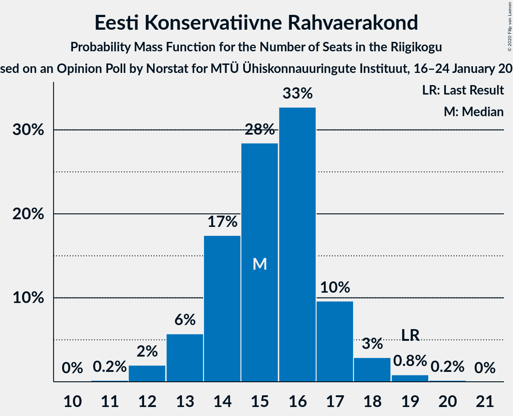
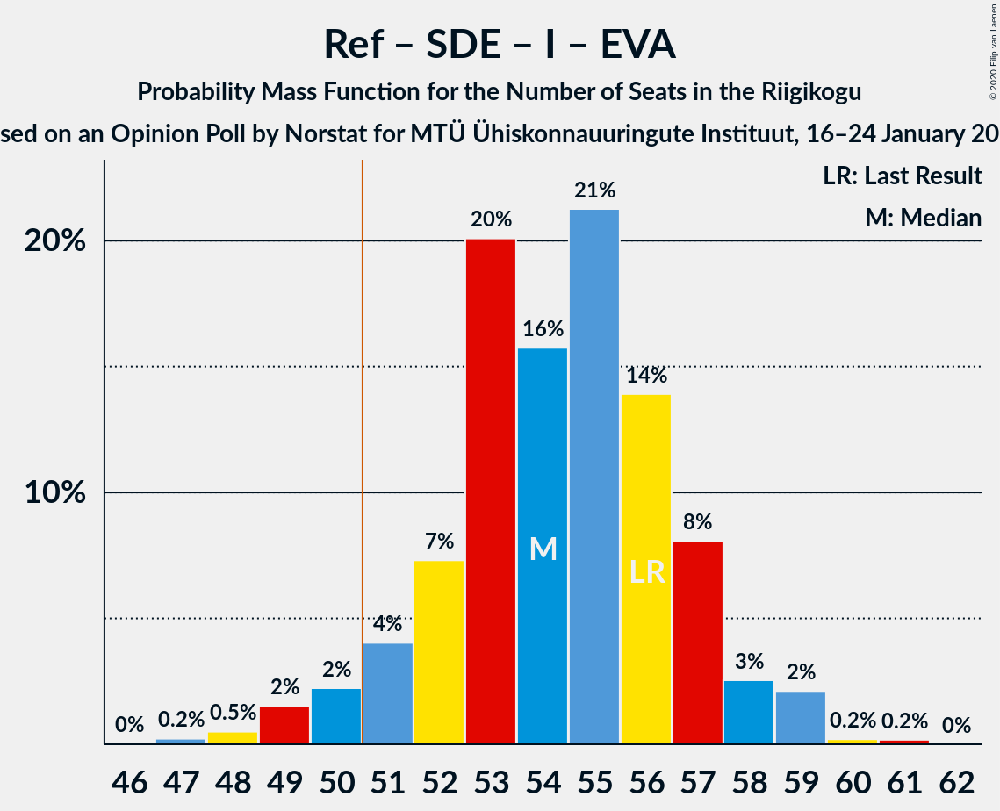

# Opinion Poll by Norstat for MTÜ Ühiskonnauuringute Instituut, 16–24 January 2020

<a href="#voting-intentions">Voting Intentions</a> | <a href="#seats">Seats</a> | <a href="#coalitions">Coalitions</a> | <a href="#technical-information">Technical Information</a>

## Voting Intentions

### Confidence Intervals

| Party | Last Result | Poll Result | 80% Confidence Interval | 90% Confidence Interval | 95% Confidence Interval | 99% Confidence Interval |
|:-----:|:-----------:|:-----------:|:-----------------------:|:-----------------------:|:-----------------------:|:-----------------------:|
| Eesti Reformierakond | 28.9% | 35.0% | 33.1–37.0% |32.6–37.5% |32.1–38.0% |31.2–39.0% |
| Eesti Keskerakond | 23.1% | 22.8% | 21.2–24.6% |20.7–25.1% |20.3–25.5% |19.5–26.4% |
| Eesti Konservatiivne Rahvaerakond | 17.8% | 14.6% | 13.2–16.1% |12.9–16.6% |12.5–16.9% |11.9–17.7% |
| Sotsiaaldemokraatlik Erakond | 9.8% | 9.3% | 8.2–10.6% |7.9–10.9% |7.7–11.3% |7.2–11.9% |
| Eesti 200 | 4.4% | 7.2% | 6.2–8.4% |6.0–8.7% |5.7–9.0% |5.3–9.6% |
| Erakond Isamaa | 11.4% | 5.6% | 4.8–6.6% |4.5–7.0% |4.3–7.2% |4.0–7.7% |
| Erakond Eestimaa Rohelised | 1.8% | 2.9% | 2.3–3.7% |2.2–3.9% |2.0–4.1% |1.8–4.6% |
| Eesti Vabaerakond | 1.2% | 1.1% | 0.8–1.7% |0.7–1.8% |0.6–2.0% |0.5–2.3% |

*Note:* The poll result column reflects the actual value used in the calculations. Published results may vary slightly, and in addition be rounded to fewer digits.

## Seats

### Confidence Intervals

| Party | Last Result | Median | 80% Confidence Interval | 90% Confidence Interval | 95% Confidence Interval | 99% Confidence Interval |
|:-----:|:-----------:|:------:|:-----------------------:|:-----------------------:|:-----------------------:|:-----------------------:|
| <a href="#eesti-reformierakond">Eesti Reformierakond</a> | 34 | 41 | 38–43 |37–45 |37–45 |35–46 |
| <a href="#eesti-keskerakond">Eesti Keskerakond</a> | 26 | 25 | 23–27 |22–28 |21–29 |21–31 |
| <a href="#eesti-konservatiivne-rahvaerakond">Eesti Konservatiivne Rahvaerakond</a> | 19 | 15 | 14–17 |13–17 |13–18 |12–19 |
| <a href="#sotsiaaldemokraatlik-erakond">Sotsiaaldemokraatlik Erakond</a> | 10 | 10 | 8–11 |7–11 |7–11 |7–12 |
| <a href="#eesti-200">Eesti 200</a> | 0 | 7 | 6–8 |5–8 |5–9 |4–10 |
| <a href="#erakond-isamaa">Erakond Isamaa</a> | 12 | 5 | 0–6 |0–6 |0–7 |0–7 |
| <a href="#erakond-eestimaa-rohelised">Erakond Eestimaa Rohelised</a> | 0 | 0 | 0 |0 |0 |0 |
| <a href="#eesti-vabaerakond">Eesti Vabaerakond</a> | 0 | 0 | 0 |0 |0 |0 |

### Eesti Reformierakond

*For a full overview of the results for this party, see the [Eesti Reformierakond](party-eestireformierakond.html) page.*

| Number of Seats | Probability | Accumulated | Special Marks |
|:---------------:|:-----------:|:-----------:|:-------------:|
| 34 | 0% | 100% | Last Result |
| 35 | 0.6% | 100% |  |
| 36 | 1.3% | 99.3% |  |
| 37 | 4% | 98% |  |
| 38 | 5% | 94% |  |
| 39 | 14% | 89% |  |
| 40 | 22% | 75% |  |
| 41 | 26% | 53% | Median |
| 42 | 9% | 27% |  |
| 43 | 8% | 18% |  |
| 44 | 3% | 9% |  |
| 45 | 4% | 6% |  |
| 46 | 1.3% | 2% |  |
| 47 | 0.4% | 0.4% |  |
| 48 | 0% | 0.1% |  |
| 49 | 0% | 0% |  |

### Eesti Keskerakond

*For a full overview of the results for this party, see the [Eesti Keskerakond](party-eestikeskerakond.html) page.*

| Number of Seats | Probability | Accumulated | Special Marks |
|:---------------:|:-----------:|:-----------:|:-------------:|
| 20 | 0.3% | 100% |  |
| 21 | 2% | 99.7% |  |
| 22 | 7% | 97% |  |
| 23 | 19% | 90% |  |
| 24 | 15% | 72% |  |
| 25 | 22% | 57% | Median |
| 26 | 21% | 35% | Last Result |
| 27 | 8% | 14% |  |
| 28 | 3% | 7% |  |
| 29 | 3% | 4% |  |
| 30 | 0.7% | 1.3% |  |
| 31 | 0.6% | 0.6% |  |
| 32 | 0% | 0% |  |

### Eesti Konservatiivne Rahvaerakond

*For a full overview of the results for this party, see the [Eesti Konservatiivne Rahvaerakond](party-eestikonservatiivnerahvaerakond.html) page.*

| Number of Seats | Probability | Accumulated | Special Marks |
|:---------------:|:-----------:|:-----------:|:-------------:|
| 11 | 0.2% | 100% |  |
| 12 | 2% | 99.8% |  |
| 13 | 6% | 98% |  |
| 14 | 17% | 92% |  |
| 15 | 28% | 75% | Median |
| 16 | 33% | 46% |  |
| 17 | 10% | 14% |  |
| 18 | 3% | 4% |  |
| 19 | 0.8% | 1.0% | Last Result |
| 20 | 0.2% | 0.2% |  |
| 21 | 0% | 0% |  |

### Sotsiaaldemokraatlik Erakond

*For a full overview of the results for this party, see the [Sotsiaaldemokraatlik Erakond](party-sotsiaaldemokraatlikerakond.html) page.*

| Number of Seats | Probability | Accumulated | Special Marks |
|:---------------:|:-----------:|:-----------:|:-------------:|
| 6 | 0.4% | 100% |  |
| 7 | 10% | 99.6% |  |
| 8 | 25% | 90% |  |
| 9 | 12% | 65% |  |
| 10 | 41% | 52% | Last Result, Median |
| 11 | 10% | 11% |  |
| 12 | 1.2% | 2% |  |
| 13 | 0.4% | 0.4% |  |
| 14 | 0% | 0% |  |

### Eesti 200

*For a full overview of the results for this party, see the [Eesti 200](party-eesti200.html) page.*

| Number of Seats | Probability | Accumulated | Special Marks |
|:---------------:|:-----------:|:-----------:|:-------------:|
| 0 | 0.2% | 100% | Last Result |
| 1 | 0% | 99.8% |  |
| 2 | 0% | 99.8% |  |
| 3 | 0% | 99.8% |  |
| 4 | 0.4% | 99.8% |  |
| 5 | 7% | 99.3% |  |
| 6 | 38% | 92% |  |
| 7 | 41% | 54% | Median |
| 8 | 9% | 14% |  |
| 9 | 4% | 4% |  |
| 10 | 0.6% | 0.7% |  |
| 11 | 0% | 0% |  |

### Erakond Isamaa

*For a full overview of the results for this party, see the [Erakond Isamaa](party-erakondisamaa.html) page.*

| Number of Seats | Probability | Accumulated | Special Marks |
|:---------------:|:-----------:|:-----------:|:-------------:|
| 0 | 13% | 100% |  |
| 1 | 0% | 87% |  |
| 2 | 0% | 87% |  |
| 3 | 0% | 87% |  |
| 4 | 16% | 87% |  |
| 5 | 52% | 70% | Median |
| 6 | 16% | 19% |  |
| 7 | 3% | 3% |  |
| 8 | 0.2% | 0.2% |  |
| 9 | 0% | 0% |  |
| 10 | 0% | 0% |  |
| 11 | 0% | 0% |  |
| 12 | 0% | 0% | Last Result |

### Erakond Eestimaa Rohelised

*For a full overview of the results for this party, see the [Erakond Eestimaa Rohelised](party-erakondeestimaarohelised.html) page.*

| Number of Seats | Probability | Accumulated | Special Marks |
|:---------------:|:-----------:|:-----------:|:-------------:|
| 0 | 99.9% | 100% | Last Result, Median |
| 1 | 0% | 0.1% |  |
| 2 | 0% | 0.1% |  |
| 3 | 0% | 0.1% |  |
| 4 | 0.1% | 0.1% |  |
| 5 | 0% | 0% |  |

### Eesti Vabaerakond

*For a full overview of the results for this party, see the [Eesti Vabaerakond](party-eestivabaerakond.html) page.*

| Number of Seats | Probability | Accumulated | Special Marks |
|:---------------:|:-----------:|:-----------:|:-------------:|
| 0 | 100% | 100% | Last Result, Median |

## Coalitions

### Confidence Intervals

| Coalition | Last Result | Median | Majority? | 80% Confidence Interval | 90% Confidence Interval | 95% Confidence Interval | 99% Confidence Interval |
|:---------:|:-----------:|:------:|:---------:|:-----------------------:|:-----------------------:|:-----------------------:|:-----------------------:|
| Eesti Reformierakond – Eesti Keskerakond – Eesti Konservatiivne Rahvaerakond | 79 | 80 | 100% | 78–83 | 78–85 | 77–86 | 76–88 |
| Eesti Reformierakond – Eesti Keskerakond | 60 | 66 | 100% | 63–69 | 62–70 | 62–71 | 60–72 |
| Eesti Reformierakond – Eesti Konservatiivne Rahvaerakond – Erakond Isamaa | 65 | 61 | 100% | 58–63 | 57–63 | 56–64 | 55–65 |
| Eesti Reformierakond – Eesti Konservatiivne Rahvaerakond | 53 | 56 | 99.5% | 54–59 | 53–60 | 52–60 | 51–62 |
| Eesti Reformierakond – Sotsiaaldemokraatlik Erakond – Erakond Isamaa – Eesti Vabaerakond | 56 | 54 | 95% | 52–57 | 51–58 | 50–59 | 48–59 |
| Eesti Reformierakond – Sotsiaaldemokraatlik Erakond – Erakond Isamaa | 56 | 54 | 95% | 52–57 | 51–58 | 50–59 | 48–59 |
| Eesti Reformierakond – Sotsiaaldemokraatlik Erakond | 44 | 50 | 30% | 47–53 | 46–53 | 46–54 | 44–56 |
| Eesti Keskerakond – Eesti Konservatiivne Rahvaerakond – Erakond Isamaa | 57 | 45 | 0.3% | 41–47 | 41–48 | 40–49 | 38–50 |
| Eesti Reformierakond – Erakond Isamaa | 46 | 45 | 1.0% | 42–48 | 41–49 | 40–49 | 39–52 |
| Eesti Keskerakond – Eesti Konservatiivne Rahvaerakond | 45 | 40 | 0% | 37–42 | 37–44 | 36–45 | 35–46 |
| Eesti Keskerakond – Sotsiaaldemokraatlik Erakond – Erakond Isamaa | 48 | 38 | 0% | 36–41 | 34–41 | 34–42 | 32–44 |
| Eesti Keskerakond – Sotsiaaldemokraatlik Erakond | 36 | 33 | 0% | 32–36 | 31–37 | 30–38 | 29–40 |
| Eesti Konservatiivne Rahvaerakond – Sotsiaaldemokraatlik Erakond | 29 | 24 | 0% | 22–26 | 21–27 | 21–28 | 19–29 |

### Eesti Reformierakond – Eesti Keskerakond – Eesti Konservatiivne Rahvaerakond

| Number of Seats | Probability | Accumulated | Special Marks |
|:---------------:|:-----------:|:-----------:|:-------------:|
| 75 | 0.1% | 100% |  |
| 76 | 2% | 99.9% |  |
| 77 | 3% | 98% |  |
| 78 | 10% | 95% |  |
| 79 | 15% | 85% | Last Result |
| 80 | 25% | 70% |  |
| 81 | 5% | 45% | Median |
| 82 | 21% | 40% |  |
| 83 | 9% | 18% |  |
| 84 | 2% | 10% |  |
| 85 | 3% | 8% |  |
| 86 | 2% | 5% |  |
| 87 | 1.1% | 2% |  |
| 88 | 1.1% | 1.2% |  |
| 89 | 0.1% | 0.1% |  |
| 90 | 0% | 0% |  |

### Eesti Reformierakond – Eesti Keskerakond

| Number of Seats | Probability | Accumulated | Special Marks |
|:---------------:|:-----------:|:-----------:|:-------------:|
| 59 | 0.1% | 100% |  |
| 60 | 0.7% | 99.9% | Last Result |
| 61 | 2% | 99.1% |  |
| 62 | 5% | 98% |  |
| 63 | 17% | 93% |  |
| 64 | 10% | 76% |  |
| 65 | 15% | 67% |  |
| 66 | 29% | 51% | Median |
| 67 | 4% | 22% |  |
| 68 | 7% | 18% |  |
| 69 | 4% | 11% |  |
| 70 | 4% | 8% |  |
| 71 | 2% | 4% |  |
| 72 | 1.4% | 2% |  |
| 73 | 0.2% | 0.3% |  |
| 74 | 0.1% | 0.1% |  |
| 75 | 0% | 0% |  |

### Eesti Reformierakond – Eesti Konservatiivne Rahvaerakond – Erakond Isamaa

| Number of Seats | Probability | Accumulated | Special Marks |
|:---------------:|:-----------:|:-----------:|:-------------:|
| 53 | 0.1% | 100% |  |
| 54 | 0.3% | 99.9% |  |
| 55 | 1.1% | 99.5% |  |
| 56 | 2% | 98% |  |
| 57 | 3% | 96% |  |
| 58 | 14% | 93% |  |
| 59 | 15% | 80% |  |
| 60 | 11% | 65% |  |
| 61 | 22% | 53% | Median |
| 62 | 16% | 31% |  |
| 63 | 11% | 15% |  |
| 64 | 2% | 4% |  |
| 65 | 2% | 2% | Last Result |
| 66 | 0.2% | 0.3% |  |
| 67 | 0.1% | 0.1% |  |
| 68 | 0% | 0% |  |

### Eesti Reformierakond – Eesti Konservatiivne Rahvaerakond

| Number of Seats | Probability | Accumulated | Special Marks |
|:---------------:|:-----------:|:-----------:|:-------------:|
| 49 | 0.1% | 100% |  |
| 50 | 0.4% | 99.9% |  |
| 51 | 1.3% | 99.5% | Majority |
| 52 | 2% | 98% |  |
| 53 | 7% | 97% | Last Result |
| 54 | 20% | 90% |  |
| 55 | 12% | 70% |  |
| 56 | 15% | 58% | Median |
| 57 | 22% | 43% |  |
| 58 | 9% | 22% |  |
| 59 | 6% | 13% |  |
| 60 | 5% | 6% |  |
| 61 | 0.8% | 2% |  |
| 62 | 0.3% | 0.7% |  |
| 63 | 0.2% | 0.4% |  |
| 64 | 0.1% | 0.2% |  |
| 65 | 0% | 0% |  |

### Eesti Reformierakond – Sotsiaaldemokraatlik Erakond – Erakond Isamaa – Eesti Vabaerakond

| Number of Seats | Probability | Accumulated | Special Marks |
|:---------------:|:-----------:|:-----------:|:-------------:|
| 47 | 0.2% | 100% |  |
| 48 | 0.5% | 99.7% |  |
| 49 | 2% | 99.2% |  |
| 50 | 2% | 98% |  |
| 51 | 4% | 95% | Majority |
| 52 | 7% | 91% |  |
| 53 | 20% | 84% |  |
| 54 | 16% | 64% |  |
| 55 | 21% | 48% |  |
| 56 | 14% | 27% | Last Result, Median |
| 57 | 8% | 13% |  |
| 58 | 3% | 5% |  |
| 59 | 2% | 3% |  |
| 60 | 0.2% | 0.4% |  |
| 61 | 0.2% | 0.2% |  |
| 62 | 0% | 0% |  |

### Eesti Reformierakond – Sotsiaaldemokraatlik Erakond – Erakond Isamaa

| Number of Seats | Probability | Accumulated | Special Marks |
|:---------------:|:-----------:|:-----------:|:-------------:|
| 47 | 0.2% | 100% |  |
| 48 | 0.5% | 99.7% |  |
| 49 | 2% | 99.2% |  |
| 50 | 2% | 98% |  |
| 51 | 4% | 95% | Majority |
| 52 | 7% | 91% |  |
| 53 | 20% | 84% |  |
| 54 | 16% | 64% |  |
| 55 | 21% | 48% |  |
| 56 | 14% | 27% | Last Result, Median |
| 57 | 8% | 13% |  |
| 58 | 3% | 5% |  |
| 59 | 2% | 3% |  |
| 60 | 0.2% | 0.4% |  |
| 61 | 0.2% | 0.2% |  |
| 62 | 0% | 0% |  |

### Eesti Reformierakond – Sotsiaaldemokraatlik Erakond

| Number of Seats | Probability | Accumulated | Special Marks |
|:---------------:|:-----------:|:-----------:|:-------------:|
| 44 | 0.5% | 100% | Last Result |
| 45 | 1.1% | 99.4% |  |
| 46 | 3% | 98% |  |
| 47 | 6% | 95% |  |
| 48 | 8% | 89% |  |
| 49 | 25% | 82% |  |
| 50 | 26% | 56% |  |
| 51 | 9% | 30% | Median, Majority |
| 52 | 11% | 22% |  |
| 53 | 7% | 11% |  |
| 54 | 2% | 4% |  |
| 55 | 0.9% | 2% |  |
| 56 | 0.9% | 1.0% |  |
| 57 | 0.1% | 0.1% |  |
| 58 | 0% | 0% |  |

### Eesti Keskerakond – Eesti Konservatiivne Rahvaerakond – Erakond Isamaa

| Number of Seats | Probability | Accumulated | Special Marks |
|:---------------:|:-----------:|:-----------:|:-------------:|
| 36 | 0% | 100% |  |
| 37 | 0.1% | 99.9% |  |
| 38 | 1.0% | 99.9% |  |
| 39 | 0.8% | 98.9% |  |
| 40 | 1.1% | 98% |  |
| 41 | 8% | 97% |  |
| 42 | 8% | 90% |  |
| 43 | 6% | 81% |  |
| 44 | 23% | 75% |  |
| 45 | 23% | 52% | Median |
| 46 | 15% | 29% |  |
| 47 | 8% | 14% |  |
| 48 | 3% | 6% |  |
| 49 | 2% | 3% |  |
| 50 | 1.0% | 1.3% |  |
| 51 | 0.3% | 0.3% | Majority |
| 52 | 0% | 0% |  |
| 53 | 0% | 0% |  |
| 54 | 0% | 0% |  |
| 55 | 0% | 0% |  |
| 56 | 0% | 0% |  |
| 57 | 0% | 0% | Last Result |

### Eesti Reformierakond – Erakond Isamaa

| Number of Seats | Probability | Accumulated | Special Marks |
|:---------------:|:-----------:|:-----------:|:-------------:|
| 36 | 0.1% | 100% |  |
| 37 | 0.1% | 99.9% |  |
| 38 | 0.3% | 99.9% |  |
| 39 | 0.6% | 99.6% |  |
| 40 | 2% | 99.0% |  |
| 41 | 3% | 97% |  |
| 42 | 5% | 94% |  |
| 43 | 15% | 90% |  |
| 44 | 8% | 75% |  |
| 45 | 22% | 67% |  |
| 46 | 24% | 44% | Last Result, Median |
| 47 | 6% | 20% |  |
| 48 | 7% | 13% |  |
| 49 | 5% | 7% |  |
| 50 | 0.6% | 2% |  |
| 51 | 0.2% | 1.0% | Majority |
| 52 | 0.7% | 0.7% |  |
| 53 | 0% | 0% |  |

### Eesti Keskerakond – Eesti Konservatiivne Rahvaerakond

| Number of Seats | Probability | Accumulated | Special Marks |
|:---------------:|:-----------:|:-----------:|:-------------:|
| 34 | 0.2% | 100% |  |
| 35 | 0.8% | 99.7% |  |
| 36 | 4% | 99.0% |  |
| 37 | 6% | 95% |  |
| 38 | 10% | 89% |  |
| 39 | 21% | 79% |  |
| 40 | 11% | 58% | Median |
| 41 | 29% | 47% |  |
| 42 | 9% | 19% |  |
| 43 | 4% | 10% |  |
| 44 | 2% | 5% |  |
| 45 | 1.3% | 3% | Last Result |
| 46 | 2% | 2% |  |
| 47 | 0.1% | 0.3% |  |
| 48 | 0.1% | 0.2% |  |
| 49 | 0% | 0% |  |

### Eesti Keskerakond – Sotsiaaldemokraatlik Erakond – Erakond Isamaa

| Number of Seats | Probability | Accumulated | Special Marks |
|:---------------:|:-----------:|:-----------:|:-------------:|
| 31 | 0.4% | 100% |  |
| 32 | 0.5% | 99.6% |  |
| 33 | 0.3% | 99.1% |  |
| 34 | 4% | 98.8% |  |
| 35 | 4% | 95% |  |
| 36 | 6% | 90% |  |
| 37 | 12% | 85% |  |
| 38 | 30% | 72% |  |
| 39 | 11% | 42% |  |
| 40 | 14% | 31% | Median |
| 41 | 12% | 17% |  |
| 42 | 3% | 5% |  |
| 43 | 1.4% | 2% |  |
| 44 | 0.5% | 0.6% |  |
| 45 | 0.1% | 0.1% |  |
| 46 | 0% | 0% |  |
| 47 | 0% | 0% |  |
| 48 | 0% | 0% | Last Result |

### Eesti Keskerakond – Sotsiaaldemokraatlik Erakond

| Number of Seats | Probability | Accumulated | Special Marks |
|:---------------:|:-----------:|:-----------:|:-------------:|
| 29 | 0.7% | 100% |  |
| 30 | 2% | 99.3% |  |
| 31 | 3% | 97% |  |
| 32 | 13% | 94% |  |
| 33 | 32% | 81% |  |
| 34 | 12% | 49% |  |
| 35 | 8% | 36% | Median |
| 36 | 20% | 28% | Last Result |
| 37 | 3% | 7% |  |
| 38 | 2% | 4% |  |
| 39 | 1.2% | 2% |  |
| 40 | 0.5% | 0.7% |  |
| 41 | 0.2% | 0.2% |  |
| 42 | 0% | 0% |  |

### Eesti Konservatiivne Rahvaerakond – Sotsiaaldemokraatlik Erakond

| Number of Seats | Probability | Accumulated | Special Marks |
|:---------------:|:-----------:|:-----------:|:-------------:|
| 19 | 0.7% | 100% |  |
| 20 | 1.1% | 99.3% |  |
| 21 | 4% | 98% |  |
| 22 | 8% | 95% |  |
| 23 | 8% | 86% |  |
| 24 | 31% | 79% |  |
| 25 | 18% | 48% | Median |
| 26 | 21% | 30% |  |
| 27 | 4% | 9% |  |
| 28 | 3% | 4% |  |
| 29 | 1.0% | 1.2% | Last Result |
| 30 | 0.1% | 0.2% |  |
| 31 | 0.1% | 0.1% |  |
| 32 | 0% | 0% |  |

## Technical Information

### Opinion Poll

+ **Polling firm:** Norstat
+ **Commissioner(s):** MTÜ Ühiskonnauuringute Instituut
+ **Fieldwork period:** 16–24 January 2020

### Calculations

+ **Sample size:** 1000
+ **Simulations done:** 131,072
+ **Error estimate:** 2.26%

