# Opinion Poll by Norstat for MTÜ Ühiskonnauuringute Instituut, 23–27 January 2020

<a href="#voting-intentions">Voting Intentions</a> | <a href="#seats">Seats</a> | <a href="#coalitions">Coalitions</a> | <a href="#technical-information">Technical Information</a>

## Voting Intentions

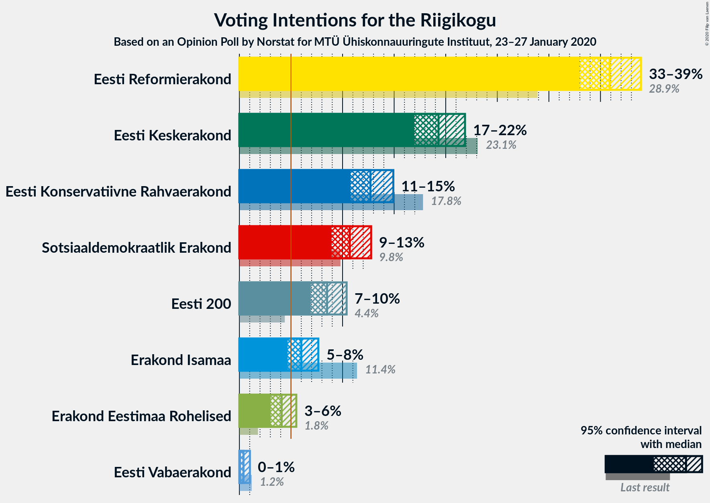

### Confidence Intervals

| Party | Last Result | Poll Result | 80% Confidence Interval | 90% Confidence Interval | 95% Confidence Interval | 99% Confidence Interval |
|:-----:|:-----------:|:-----------:|:-----------------------:|:-----------------------:|:-----------------------:|:-----------------------:|
| Eesti Reformierakond | 28.9% | 35.9% | 34.0–37.9% |33.4–38.4% |33.0–38.9% |32.1–39.9% |
| Eesti Keskerakond | 23.1% | 19.3% | 17.8–21.0% |17.3–21.5% |17.0–21.9% |16.3–22.7% |
| Eesti Konservatiivne Rahvaerakond | 17.8% | 12.7% | 11.4–14.1% |11.1–14.6% |10.8–14.9% |10.2–15.6% |
| Sotsiaaldemokraatlik Erakond | 9.8% | 10.7% | 9.5–12.1% |9.2–12.4% |8.9–12.8% |8.4–13.4% |
| Eesti 200 | 4.4% | 8.5% | 7.5–9.7% |7.2–10.1% |6.9–10.4% |6.5–11.0% |
| Erakond Isamaa | 11.4% | 6.0% | 5.1–7.1% |4.9–7.4% |4.7–7.7% |4.3–8.2% |
| Erakond Eestimaa Rohelised | 1.8% | 4.1% | 3.4–5.0% |3.2–5.3% |3.0–5.5% |2.7–6.0% |
| Eesti Vabaerakond | 1.2% | 0.4% | 0.2–0.8% |0.2–0.9% |0.2–1.0% |0.1–1.3% |

*Note:* The poll result column reflects the actual value used in the calculations. Published results may vary slightly, and in addition be rounded to fewer digits.

## Seats

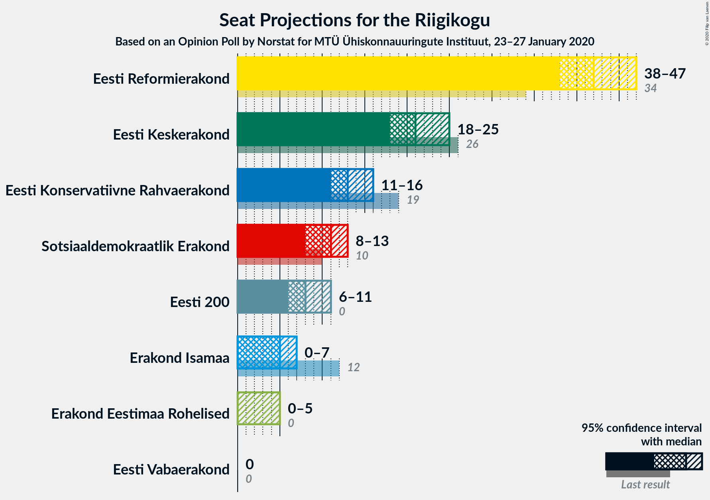

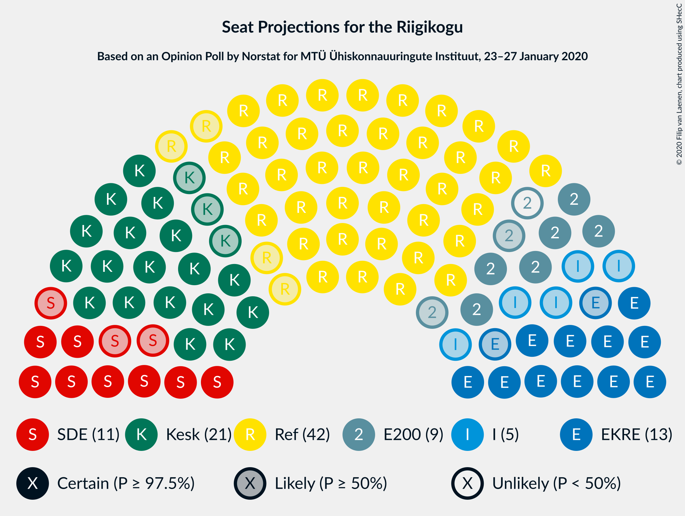

### Confidence Intervals

| Party | Last Result | Median | 80% Confidence Interval | 90% Confidence Interval | 95% Confidence Interval | 99% Confidence Interval |
|:-----:|:-----------:|:------:|:-----------------------:|:-----------------------:|:-----------------------:|:-----------------------:|
| <a href="#eesti-reformierakond">Eesti Reformierakond</a> | 34 | 42 | 39–45 |39–46 |38–47 |37–48 |
| <a href="#eesti-keskerakond">Eesti Keskerakond</a> | 26 | 21 | 19–24 |19–24 |18–25 |17–25 |
| <a href="#eesti-konservatiivne-rahvaerakond">Eesti Konservatiivne Rahvaerakond</a> | 19 | 13 | 11–15 |11–15 |11–16 |10–17 |
| <a href="#sotsiaaldemokraatlik-erakond">Sotsiaaldemokraatlik Erakond</a> | 10 | 11 | 9–12 |9–13 |8–13 |8–14 |
| <a href="#eesti-200">Eesti 200</a> | 0 | 8 | 7–10 |7–10 |6–11 |6–11 |
| <a href="#erakond-isamaa">Erakond Isamaa</a> | 12 | 5 | 4–7 |0–7 |0–7 |0–8 |
| <a href="#erakond-eestimaa-rohelised">Erakond Eestimaa Rohelised</a> | 0 | 0 | 0–4 |0–5 |0–5 |0–5 |
| <a href="#eesti-vabaerakond">Eesti Vabaerakond</a> | 0 | 0 | 0 |0 |0 |0 |

### Eesti Reformierakond

*For a full overview of the results for this party, see the [Eesti Reformierakond](party-eestireformierakond.html) page.*

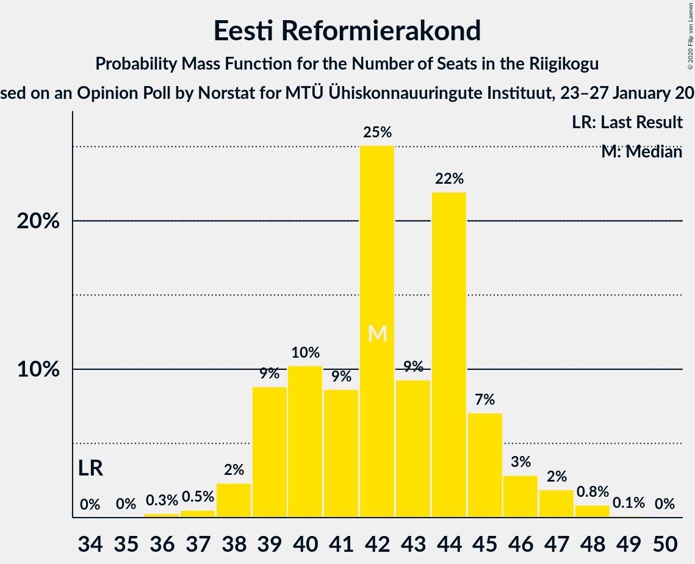

| Number of Seats | Probability | Accumulated | Special Marks |
|:---------------:|:-----------:|:-----------:|:-------------:|
| 34 | 0% | 100% | Last Result |
| 35 | 0% | 100% |  |
| 36 | 0.3% | 100% |  |
| 37 | 0.5% | 99.7% |  |
| 38 | 2% | 99.2% |  |
| 39 | 9% | 97% |  |
| 40 | 10% | 88% |  |
| 41 | 9% | 78% |  |
| 42 | 25% | 69% | Median |
| 43 | 9% | 44% |  |
| 44 | 22% | 35% |  |
| 45 | 7% | 13% |  |
| 46 | 3% | 6% |  |
| 47 | 2% | 3% |  |
| 48 | 0.8% | 1.0% |  |
| 49 | 0.1% | 0.1% |  |
| 50 | 0% | 0% |  |

### Eesti Keskerakond

*For a full overview of the results for this party, see the [Eesti Keskerakond](party-eestikeskerakond.html) page.*

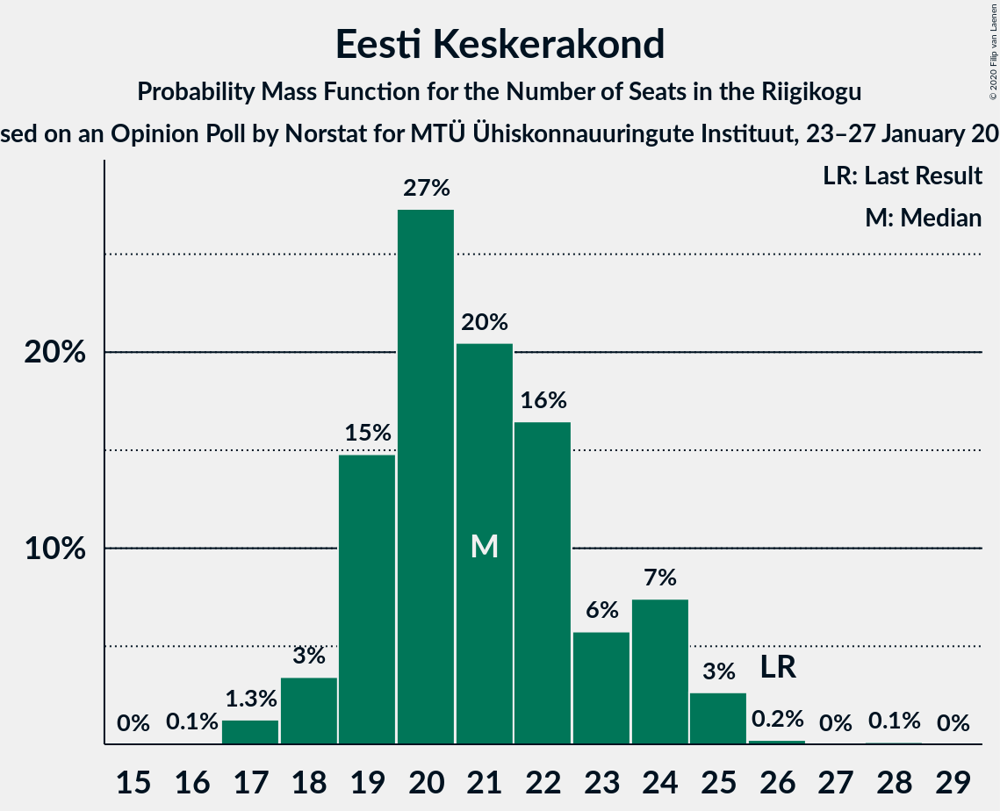

| Number of Seats | Probability | Accumulated | Special Marks |
|:---------------:|:-----------:|:-----------:|:-------------:|
| 16 | 0.1% | 100% |  |
| 17 | 1.3% | 99.9% |  |
| 18 | 3% | 98.6% |  |
| 19 | 15% | 95% |  |
| 20 | 27% | 80% |  |
| 21 | 20% | 53% | Median |
| 22 | 16% | 33% |  |
| 23 | 6% | 16% |  |
| 24 | 7% | 10% |  |
| 25 | 3% | 3% |  |
| 26 | 0.2% | 0.3% | Last Result |
| 27 | 0% | 0.1% |  |
| 28 | 0.1% | 0.1% |  |
| 29 | 0% | 0% |  |

### Eesti Konservatiivne Rahvaerakond

*For a full overview of the results for this party, see the [Eesti Konservatiivne Rahvaerakond](party-eestikonservatiivnerahvaerakond.html) page.*

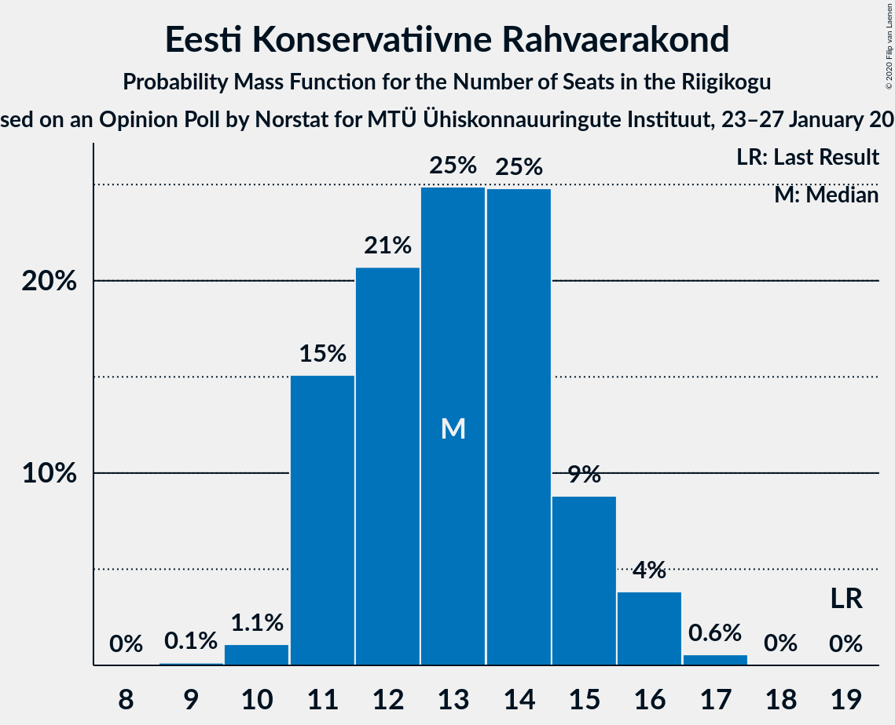

| Number of Seats | Probability | Accumulated | Special Marks |
|:---------------:|:-----------:|:-----------:|:-------------:|
| 9 | 0.1% | 100% |  |
| 10 | 1.1% | 99.9% |  |
| 11 | 15% | 98.8% |  |
| 12 | 21% | 84% |  |
| 13 | 25% | 63% | Median |
| 14 | 25% | 38% |  |
| 15 | 9% | 13% |  |
| 16 | 4% | 4% |  |
| 17 | 0.6% | 0.6% |  |
| 18 | 0% | 0% |  |
| 19 | 0% | 0% | Last Result |

### Sotsiaaldemokraatlik Erakond

*For a full overview of the results for this party, see the [Sotsiaaldemokraatlik Erakond](party-sotsiaaldemokraatlikerakond.html) page.*

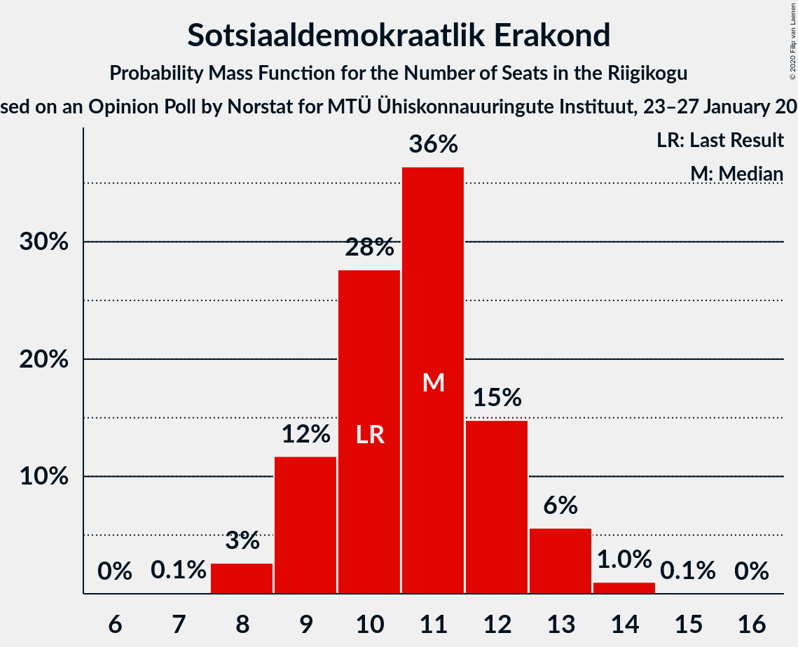

| Number of Seats | Probability | Accumulated | Special Marks |
|:---------------:|:-----------:|:-----------:|:-------------:|
| 7 | 0.1% | 100% |  |
| 8 | 3% | 99.9% |  |
| 9 | 12% | 97% |  |
| 10 | 28% | 86% | Last Result |
| 11 | 36% | 58% | Median |
| 12 | 15% | 22% |  |
| 13 | 6% | 7% |  |
| 14 | 1.0% | 1.1% |  |
| 15 | 0.1% | 0.1% |  |
| 16 | 0% | 0% |  |

### Eesti 200

*For a full overview of the results for this party, see the [Eesti 200](party-eesti200.html) page.*

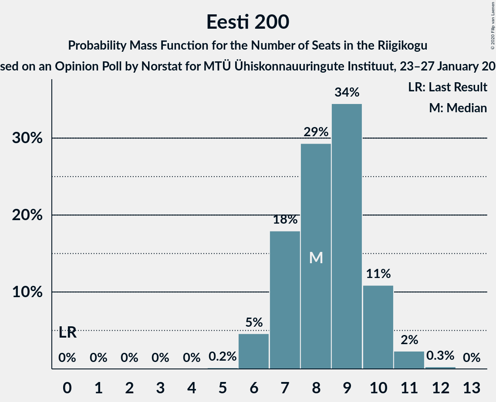

| Number of Seats | Probability | Accumulated | Special Marks |
|:---------------:|:-----------:|:-----------:|:-------------:|
| 0 | 0% | 100% | Last Result |
| 1 | 0% | 100% |  |
| 2 | 0% | 100% |  |
| 3 | 0% | 100% |  |
| 4 | 0% | 100% |  |
| 5 | 0.2% | 100% |  |
| 6 | 5% | 99.8% |  |
| 7 | 18% | 95% |  |
| 8 | 29% | 77% | Median |
| 9 | 34% | 48% |  |
| 10 | 11% | 13% |  |
| 11 | 2% | 3% |  |
| 12 | 0.3% | 0.3% |  |
| 13 | 0% | 0% |  |

### Erakond Isamaa

*For a full overview of the results for this party, see the [Erakond Isamaa](party-erakondisamaa.html) page.*

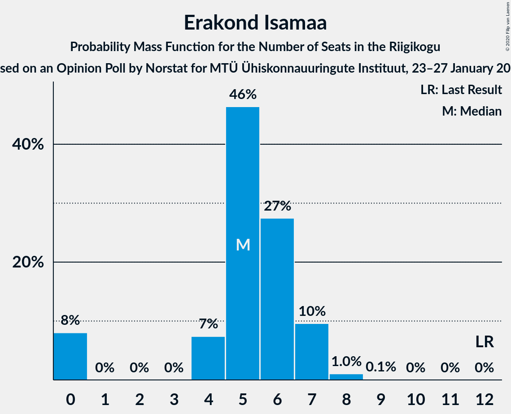

| Number of Seats | Probability | Accumulated | Special Marks |
|:---------------:|:-----------:|:-----------:|:-------------:|
| 0 | 8% | 100% |  |
| 1 | 0% | 92% |  |
| 2 | 0% | 92% |  |
| 3 | 0% | 92% |  |
| 4 | 7% | 92% |  |
| 5 | 46% | 85% | Median |
| 6 | 27% | 38% |  |
| 7 | 10% | 11% |  |
| 8 | 1.0% | 1.2% |  |
| 9 | 0.1% | 0.1% |  |
| 10 | 0% | 0% |  |
| 11 | 0% | 0% |  |
| 12 | 0% | 0% | Last Result |

### Erakond Eestimaa Rohelised

*For a full overview of the results for this party, see the [Erakond Eestimaa Rohelised](party-erakondeestimaarohelised.html) page.*

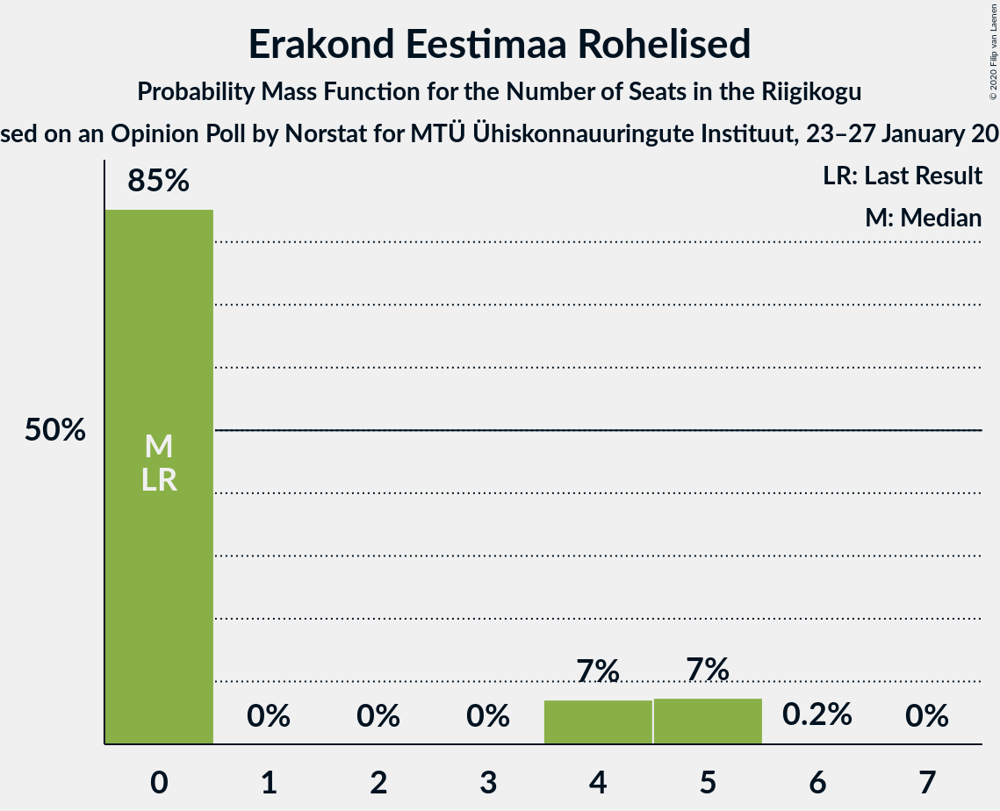

| Number of Seats | Probability | Accumulated | Special Marks |
|:---------------:|:-----------:|:-----------:|:-------------:|
| 0 | 85% | 100% | Last Result, Median |
| 1 | 0% | 15% |  |
| 2 | 0% | 15% |  |
| 3 | 0% | 15% |  |
| 4 | 7% | 15% |  |
| 5 | 7% | 8% |  |
| 6 | 0.2% | 0.2% |  |
| 7 | 0% | 0% |  |

### Eesti Vabaerakond

*For a full overview of the results for this party, see the [Eesti Vabaerakond](party-eestivabaerakond.html) page.*

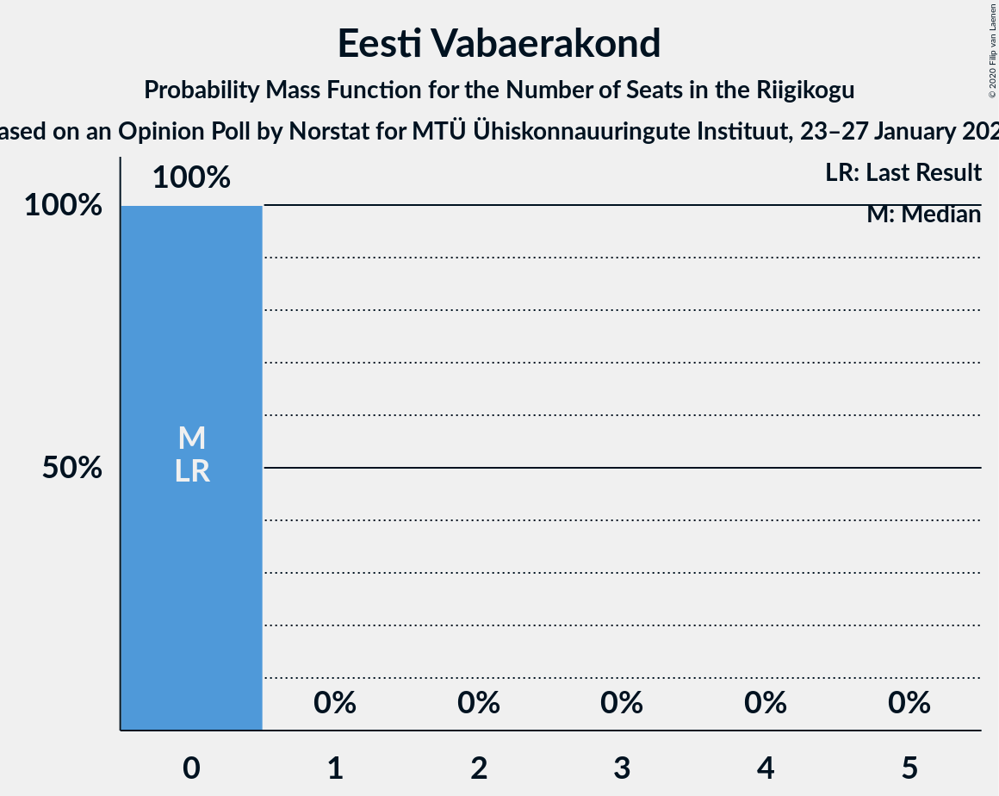

| Number of Seats | Probability | Accumulated | Special Marks |
|:---------------:|:-----------:|:-----------:|:-------------:|
| 0 | 100% | 100% | Last Result, Median |

## Coalitions

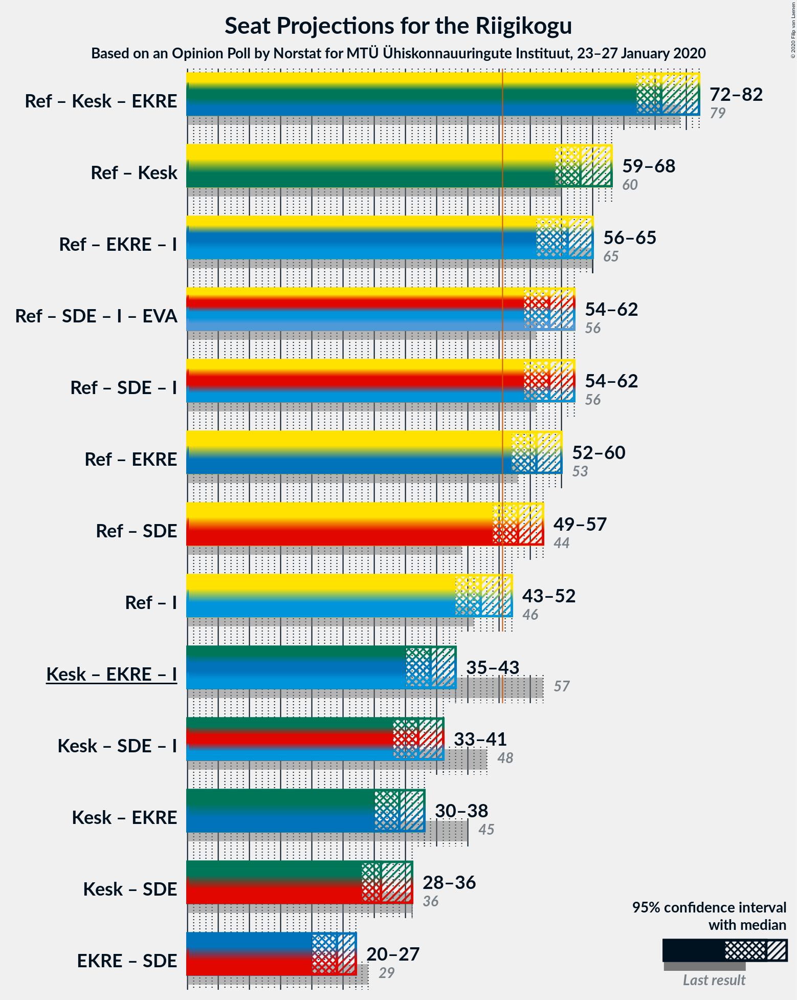

### Confidence Intervals

| Coalition | Last Result | Median | Majority? | 80% Confidence Interval | 90% Confidence Interval | 95% Confidence Interval | 99% Confidence Interval |
|:---------:|:-----------:|:------:|:---------:|:-----------------------:|:-----------------------:|:-----------------------:|:-----------------------:|
| Eesti Reformierakond – Eesti Keskerakond – Eesti Konservatiivne Rahvaerakond | 79 | 76 | 100% | 73–79 | 73–80 | 72–82 | 70–83 |
| Eesti Reformierakond – Eesti Keskerakond | 60 | 63 | 100% | 60–66 | 60–68 | 59–68 | 58–70 |
| Eesti Reformierakond – Eesti Konservatiivne Rahvaerakond – Erakond Isamaa | 65 | 61 | 100% | 58–63 | 57–64 | 56–65 | 54–66 |
| Eesti Reformierakond – Sotsiaaldemokraatlik Erakond – Erakond Isamaa – Eesti Vabaerakond | 56 | 58 | 99.9% | 55–61 | 55–61 | 54–62 | 52–63 |
| Eesti Reformierakond – Sotsiaaldemokraatlik Erakond – Erakond Isamaa | 56 | 58 | 99.9% | 55–61 | 55–61 | 54–62 | 52–63 |
| Eesti Reformierakond – Eesti Konservatiivne Rahvaerakond | 53 | 56 | 98% | 52–58 | 52–59 | 52–60 | 50–61 |
| Eesti Reformierakond – Sotsiaaldemokraatlik Erakond | 44 | 53 | 85% | 50–56 | 49–56 | 49–57 | 48–59 |
| Eesti Reformierakond – Erakond Isamaa | 46 | 47 | 8% | 44–50 | 44–51 | 43–52 | 41–53 |
| Eesti Keskerakond – Eesti Konservatiivne Rahvaerakond – Erakond Isamaa | 57 | 39 | 0% | 36–42 | 35–42 | 35–43 | 33–44 |
| Eesti Keskerakond – Sotsiaaldemokraatlik Erakond – Erakond Isamaa | 48 | 37 | 0% | 34–40 | 33–40 | 33–41 | 32–42 |
| Eesti Keskerakond – Eesti Konservatiivne Rahvaerakond | 45 | 34 | 0% | 31–37 | 31–37 | 30–38 | 29–39 |
| Eesti Keskerakond – Sotsiaaldemokraatlik Erakond | 36 | 31 | 0% | 29–34 | 29–35 | 28–36 | 27–37 |
| Eesti Konservatiivne Rahvaerakond – Sotsiaaldemokraatlik Erakond | 29 | 24 | 0% | 21–26 | 21–27 | 20–27 | 20–28 |

### Eesti Reformierakond – Eesti Keskerakond – Eesti Konservatiivne Rahvaerakond

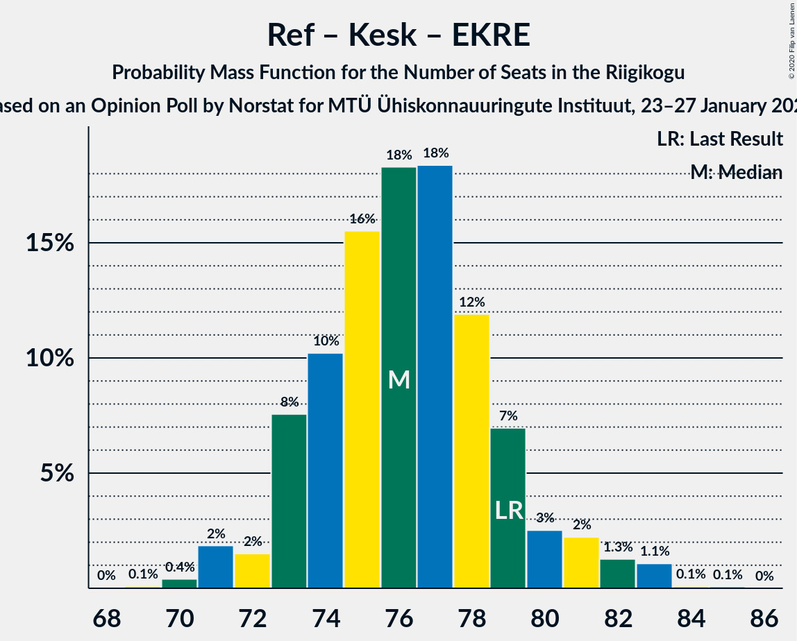

| Number of Seats | Probability | Accumulated | Special Marks |
|:---------------:|:-----------:|:-----------:|:-------------:|
| 69 | 0.1% | 100% |  |
| 70 | 0.4% | 99.9% |  |
| 71 | 2% | 99.5% |  |
| 72 | 2% | 98% |  |
| 73 | 8% | 96% |  |
| 74 | 10% | 89% |  |
| 75 | 16% | 78% |  |
| 76 | 18% | 63% | Median |
| 77 | 18% | 45% |  |
| 78 | 12% | 26% |  |
| 79 | 7% | 14% | Last Result |
| 80 | 3% | 7% |  |
| 81 | 2% | 5% |  |
| 82 | 1.3% | 3% |  |
| 83 | 1.1% | 1.2% |  |
| 84 | 0.1% | 0.2% |  |
| 85 | 0.1% | 0.1% |  |
| 86 | 0% | 0% |  |

### Eesti Reformierakond – Eesti Keskerakond

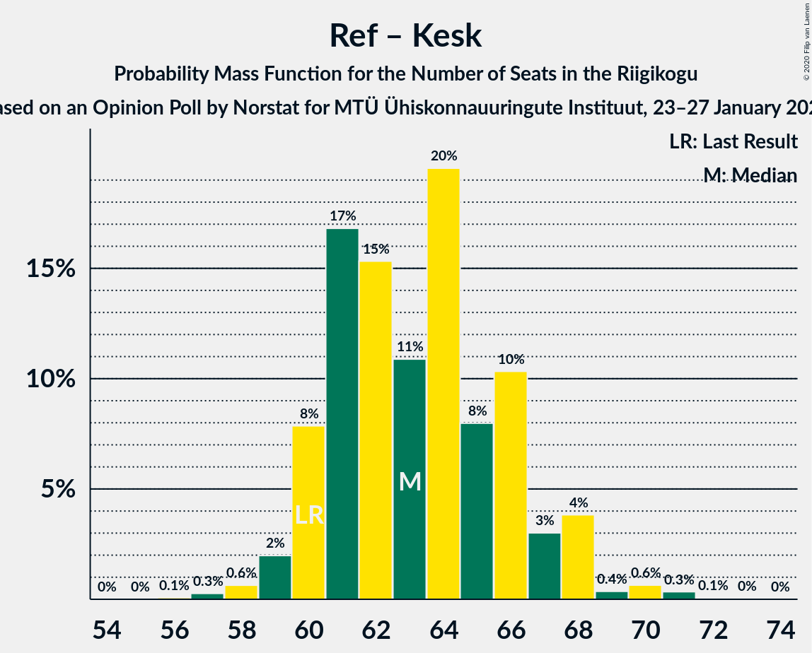

| Number of Seats | Probability | Accumulated | Special Marks |
|:---------------:|:-----------:|:-----------:|:-------------:|
| 56 | 0.1% | 100% |  |
| 57 | 0.3% | 99.9% |  |
| 58 | 0.6% | 99.6% |  |
| 59 | 2% | 99.0% |  |
| 60 | 8% | 97% | Last Result |
| 61 | 17% | 89% |  |
| 62 | 15% | 72% |  |
| 63 | 11% | 57% | Median |
| 64 | 20% | 46% |  |
| 65 | 8% | 27% |  |
| 66 | 10% | 19% |  |
| 67 | 3% | 8% |  |
| 68 | 4% | 5% |  |
| 69 | 0.4% | 1.4% |  |
| 70 | 0.6% | 1.1% |  |
| 71 | 0.3% | 0.4% |  |
| 72 | 0.1% | 0.1% |  |
| 73 | 0% | 0% |  |

### Eesti Reformierakond – Eesti Konservatiivne Rahvaerakond – Erakond Isamaa

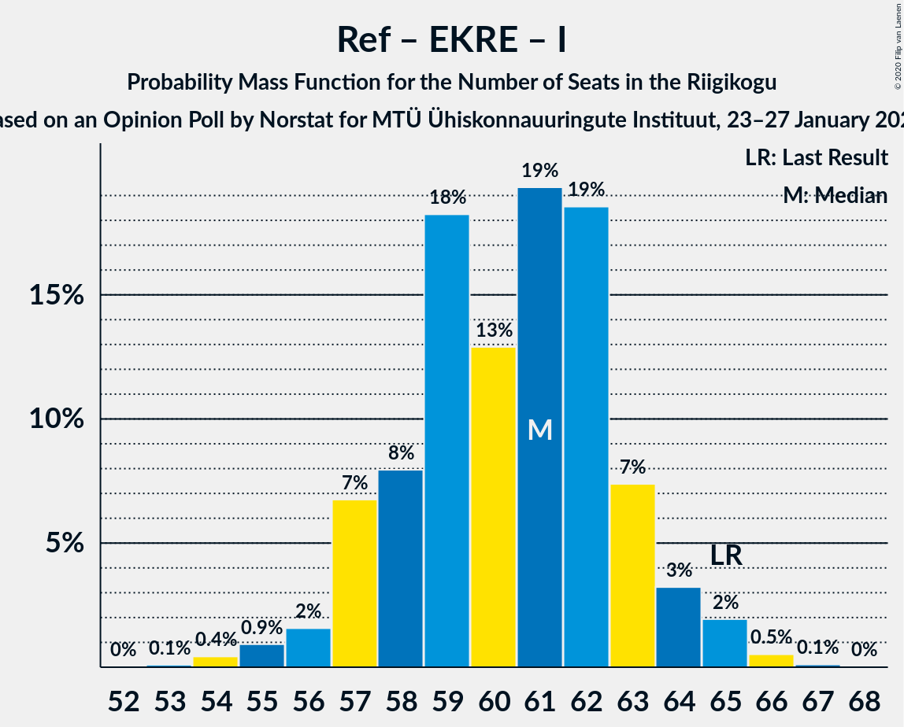

| Number of Seats | Probability | Accumulated | Special Marks |
|:---------------:|:-----------:|:-----------:|:-------------:|
| 53 | 0.1% | 100% |  |
| 54 | 0.4% | 99.9% |  |
| 55 | 0.9% | 99.4% |  |
| 56 | 2% | 98.5% |  |
| 57 | 7% | 97% |  |
| 58 | 8% | 90% |  |
| 59 | 18% | 82% |  |
| 60 | 13% | 64% | Median |
| 61 | 19% | 51% |  |
| 62 | 19% | 32% |  |
| 63 | 7% | 13% |  |
| 64 | 3% | 6% |  |
| 65 | 2% | 3% | Last Result |
| 66 | 0.5% | 0.6% |  |
| 67 | 0.1% | 0.1% |  |
| 68 | 0% | 0% |  |

### Eesti Reformierakond – Sotsiaaldemokraatlik Erakond – Erakond Isamaa – Eesti Vabaerakond

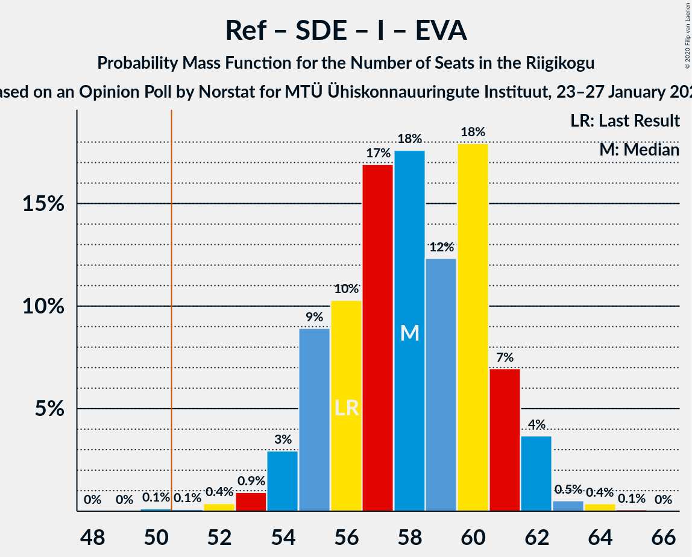

| Number of Seats | Probability | Accumulated | Special Marks |
|:---------------:|:-----------:|:-----------:|:-------------:|
| 50 | 0.1% | 100% |  |
| 51 | 0.1% | 99.9% | Majority |
| 52 | 0.4% | 99.8% |  |
| 53 | 0.9% | 99.4% |  |
| 54 | 3% | 98% |  |
| 55 | 9% | 96% |  |
| 56 | 10% | 87% | Last Result |
| 57 | 17% | 76% |  |
| 58 | 18% | 59% | Median |
| 59 | 12% | 42% |  |
| 60 | 18% | 30% |  |
| 61 | 7% | 12% |  |
| 62 | 4% | 5% |  |
| 63 | 0.5% | 1.0% |  |
| 64 | 0.4% | 0.5% |  |
| 65 | 0.1% | 0.1% |  |
| 66 | 0% | 0% |  |

### Eesti Reformierakond – Sotsiaaldemokraatlik Erakond – Erakond Isamaa

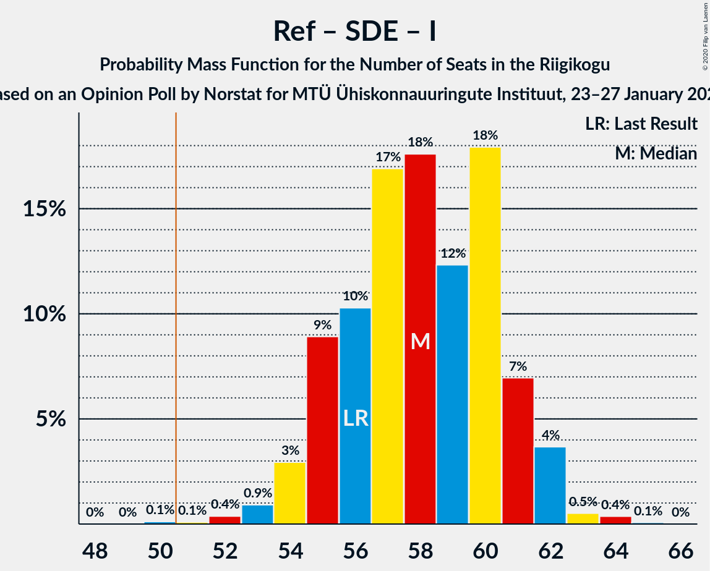

| Number of Seats | Probability | Accumulated | Special Marks |
|:---------------:|:-----------:|:-----------:|:-------------:|
| 50 | 0.1% | 100% |  |
| 51 | 0.1% | 99.9% | Majority |
| 52 | 0.4% | 99.8% |  |
| 53 | 0.9% | 99.4% |  |
| 54 | 3% | 98% |  |
| 55 | 9% | 96% |  |
| 56 | 10% | 87% | Last Result |
| 57 | 17% | 76% |  |
| 58 | 18% | 59% | Median |
| 59 | 12% | 42% |  |
| 60 | 18% | 30% |  |
| 61 | 7% | 12% |  |
| 62 | 4% | 5% |  |
| 63 | 0.5% | 1.0% |  |
| 64 | 0.4% | 0.5% |  |
| 65 | 0.1% | 0.1% |  |
| 66 | 0% | 0% |  |

### Eesti Reformierakond – Eesti Konservatiivne Rahvaerakond

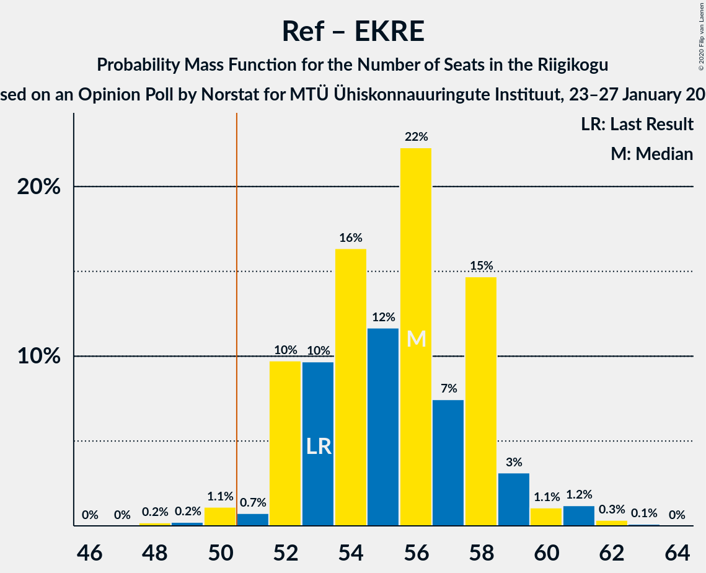

| Number of Seats | Probability | Accumulated | Special Marks |
|:---------------:|:-----------:|:-----------:|:-------------:|
| 48 | 0.2% | 100% |  |
| 49 | 0.2% | 99.8% |  |
| 50 | 1.1% | 99.6% |  |
| 51 | 0.7% | 98% | Majority |
| 52 | 10% | 98% |  |
| 53 | 10% | 88% | Last Result |
| 54 | 16% | 78% |  |
| 55 | 12% | 62% | Median |
| 56 | 22% | 50% |  |
| 57 | 7% | 28% |  |
| 58 | 15% | 21% |  |
| 59 | 3% | 6% |  |
| 60 | 1.1% | 3% |  |
| 61 | 1.2% | 2% |  |
| 62 | 0.3% | 0.5% |  |
| 63 | 0.1% | 0.1% |  |
| 64 | 0% | 0% |  |

### Eesti Reformierakond – Sotsiaaldemokraatlik Erakond

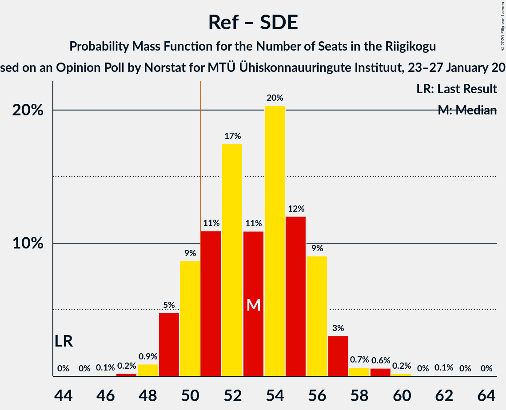

| Number of Seats | Probability | Accumulated | Special Marks |
|:---------------:|:-----------:|:-----------:|:-------------:|
| 44 | 0% | 100% | Last Result |
| 45 | 0% | 100% |  |
| 46 | 0.1% | 100% |  |
| 47 | 0.2% | 99.9% |  |
| 48 | 0.9% | 99.7% |  |
| 49 | 5% | 98.8% |  |
| 50 | 9% | 94% |  |
| 51 | 11% | 85% | Majority |
| 52 | 17% | 74% |  |
| 53 | 11% | 57% | Median |
| 54 | 20% | 46% |  |
| 55 | 12% | 26% |  |
| 56 | 9% | 14% |  |
| 57 | 3% | 5% |  |
| 58 | 0.7% | 2% |  |
| 59 | 0.6% | 0.9% |  |
| 60 | 0.2% | 0.3% |  |
| 61 | 0% | 0.1% |  |
| 62 | 0.1% | 0.1% |  |
| 63 | 0% | 0% |  |

### Eesti Reformierakond – Erakond Isamaa

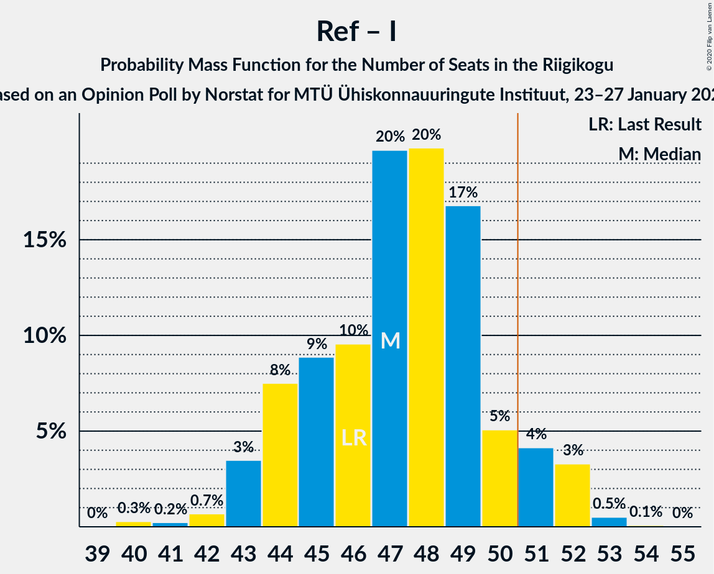

| Number of Seats | Probability | Accumulated | Special Marks |
|:---------------:|:-----------:|:-----------:|:-------------:|
| 40 | 0.3% | 100% |  |
| 41 | 0.2% | 99.7% |  |
| 42 | 0.7% | 99.5% |  |
| 43 | 3% | 98.8% |  |
| 44 | 8% | 95% |  |
| 45 | 9% | 88% |  |
| 46 | 10% | 79% | Last Result |
| 47 | 20% | 69% | Median |
| 48 | 20% | 50% |  |
| 49 | 17% | 30% |  |
| 50 | 5% | 13% |  |
| 51 | 4% | 8% | Majority |
| 52 | 3% | 4% |  |
| 53 | 0.5% | 0.6% |  |
| 54 | 0.1% | 0.1% |  |
| 55 | 0% | 0% |  |

### Eesti Keskerakond – Eesti Konservatiivne Rahvaerakond – Erakond Isamaa

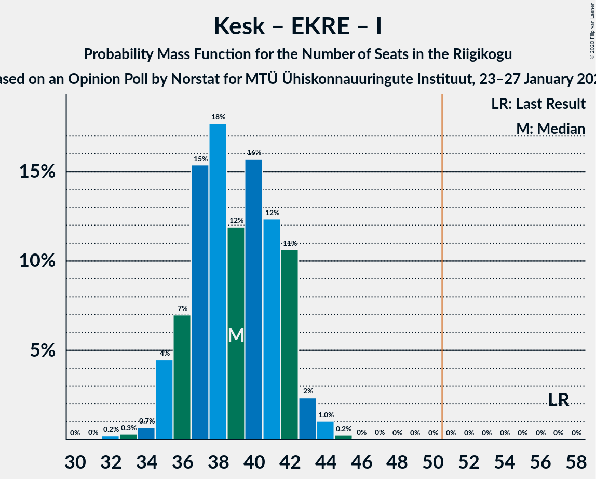

| Number of Seats | Probability | Accumulated | Special Marks |
|:---------------:|:-----------:|:-----------:|:-------------:|
| 32 | 0.2% | 100% |  |
| 33 | 0.3% | 99.8% |  |
| 34 | 0.7% | 99.5% |  |
| 35 | 4% | 98.8% |  |
| 36 | 7% | 94% |  |
| 37 | 15% | 87% |  |
| 38 | 18% | 72% |  |
| 39 | 12% | 54% | Median |
| 40 | 16% | 42% |  |
| 41 | 12% | 27% |  |
| 42 | 11% | 14% |  |
| 43 | 2% | 4% |  |
| 44 | 1.0% | 1.3% |  |
| 45 | 0.2% | 0.3% |  |
| 46 | 0% | 0.1% |  |
| 47 | 0% | 0% |  |
| 48 | 0% | 0% |  |
| 49 | 0% | 0% |  |
| 50 | 0% | 0% |  |
| 51 | 0% | 0% | Majority |
| 52 | 0% | 0% |  |
| 53 | 0% | 0% |  |
| 54 | 0% | 0% |  |
| 55 | 0% | 0% |  |
| 56 | 0% | 0% |  |
| 57 | 0% | 0% | Last Result |

### Eesti Keskerakond – Sotsiaaldemokraatlik Erakond – Erakond Isamaa

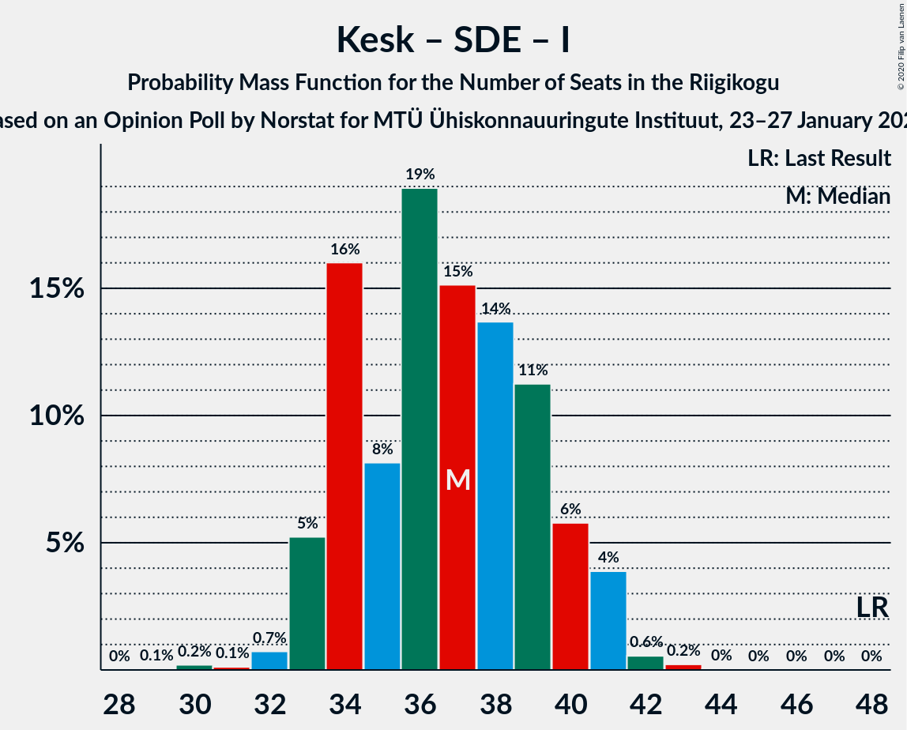

| Number of Seats | Probability | Accumulated | Special Marks |
|:---------------:|:-----------:|:-----------:|:-------------:|
| 29 | 0.1% | 100% |  |
| 30 | 0.2% | 99.9% |  |
| 31 | 0.1% | 99.7% |  |
| 32 | 0.7% | 99.6% |  |
| 33 | 5% | 98.9% |  |
| 34 | 16% | 94% |  |
| 35 | 8% | 78% |  |
| 36 | 19% | 69% |  |
| 37 | 15% | 51% | Median |
| 38 | 14% | 35% |  |
| 39 | 11% | 22% |  |
| 40 | 6% | 10% |  |
| 41 | 4% | 5% |  |
| 42 | 0.6% | 0.8% |  |
| 43 | 0.2% | 0.3% |  |
| 44 | 0% | 0% |  |
| 45 | 0% | 0% |  |
| 46 | 0% | 0% |  |
| 47 | 0% | 0% |  |
| 48 | 0% | 0% | Last Result |

### Eesti Keskerakond – Eesti Konservatiivne Rahvaerakond

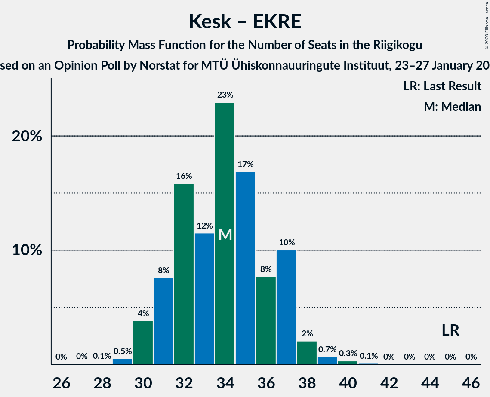

| Number of Seats | Probability | Accumulated | Special Marks |
|:---------------:|:-----------:|:-----------:|:-------------:|
| 28 | 0.1% | 100% |  |
| 29 | 0.5% | 99.9% |  |
| 30 | 4% | 99.4% |  |
| 31 | 8% | 96% |  |
| 32 | 16% | 88% |  |
| 33 | 12% | 72% |  |
| 34 | 23% | 61% | Median |
| 35 | 17% | 38% |  |
| 36 | 8% | 21% |  |
| 37 | 10% | 13% |  |
| 38 | 2% | 3% |  |
| 39 | 0.7% | 1.1% |  |
| 40 | 0.3% | 0.4% |  |
| 41 | 0.1% | 0.1% |  |
| 42 | 0% | 0% |  |
| 43 | 0% | 0% |  |
| 44 | 0% | 0% |  |
| 45 | 0% | 0% | Last Result |

### Eesti Keskerakond – Sotsiaaldemokraatlik Erakond

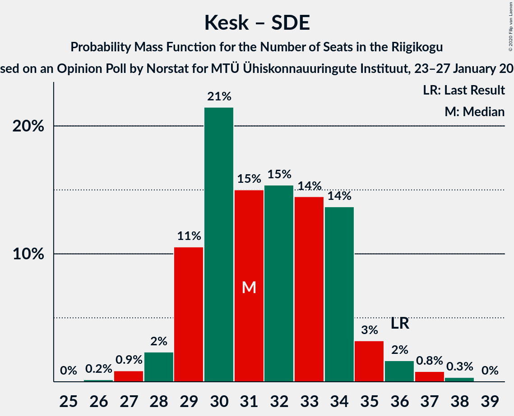

| Number of Seats | Probability | Accumulated | Special Marks |
|:---------------:|:-----------:|:-----------:|:-------------:|
| 26 | 0.2% | 100% |  |
| 27 | 0.9% | 99.8% |  |
| 28 | 2% | 99.0% |  |
| 29 | 11% | 97% |  |
| 30 | 21% | 86% |  |
| 31 | 15% | 65% |  |
| 32 | 15% | 50% | Median |
| 33 | 14% | 34% |  |
| 34 | 14% | 20% |  |
| 35 | 3% | 6% |  |
| 36 | 2% | 3% | Last Result |
| 37 | 0.8% | 1.2% |  |
| 38 | 0.3% | 0.4% |  |
| 39 | 0% | 0% |  |

### Eesti Konservatiivne Rahvaerakond – Sotsiaaldemokraatlik Erakond

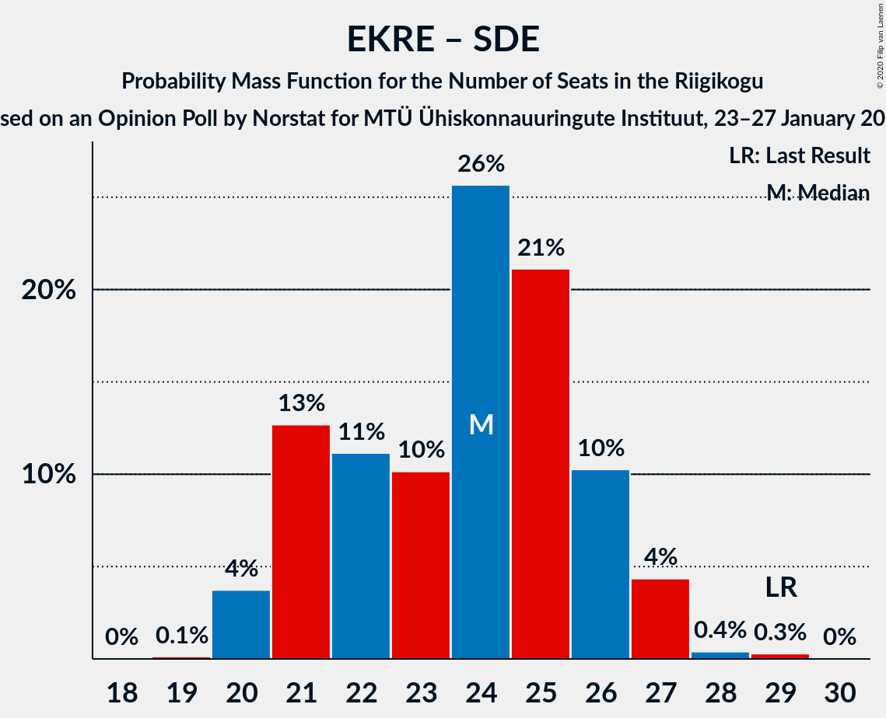

| Number of Seats | Probability | Accumulated | Special Marks |
|:---------------:|:-----------:|:-----------:|:-------------:|
| 19 | 0.1% | 100% |  |
| 20 | 4% | 99.8% |  |
| 21 | 13% | 96% |  |
| 22 | 11% | 83% |  |
| 23 | 10% | 72% |  |
| 24 | 26% | 62% | Median |
| 25 | 21% | 36% |  |
| 26 | 10% | 15% |  |
| 27 | 4% | 5% |  |
| 28 | 0.4% | 0.7% |  |
| 29 | 0.3% | 0.3% | Last Result |
| 30 | 0% | 0% |  |

## Technical Information

### Opinion Poll

+ **Polling firm:** Norstat
+ **Commissioner(s):** MTÜ Ühiskonnauuringute Instituut
+ **Fieldwork period:** 23–27 January 2020

### Calculations

+ **Sample size:** 1000
+ **Simulations done:** 131,072
+ **Error estimate:** 1.34%

