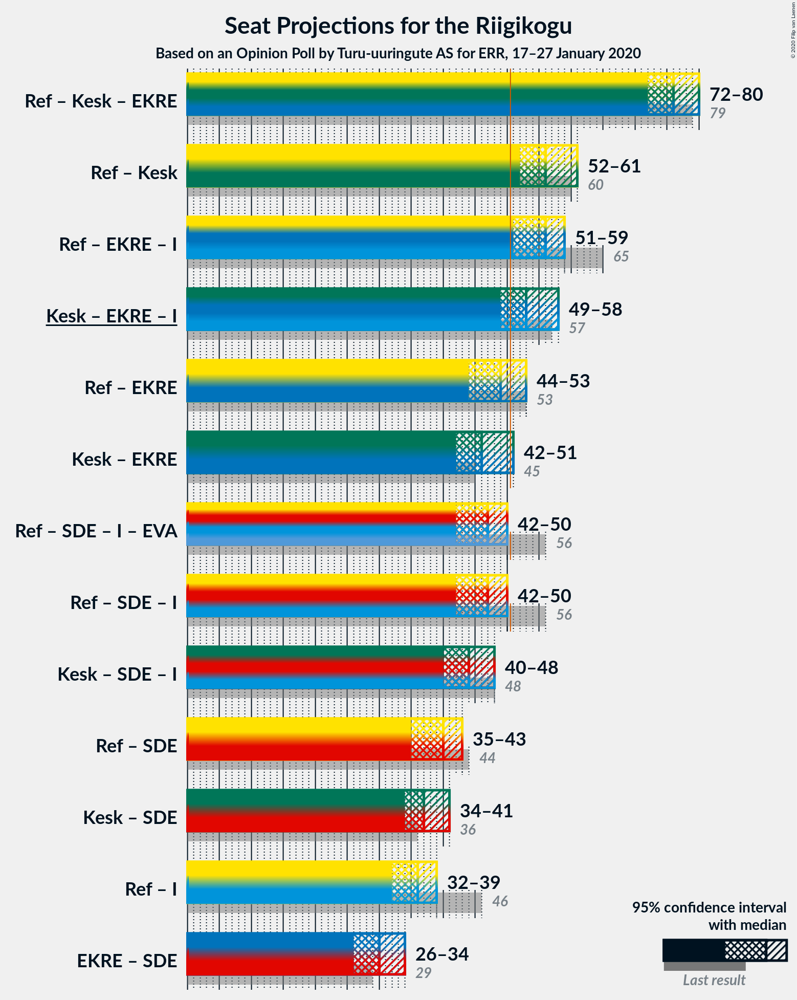

# Opinion Poll by Turu-uuringute AS for ERR, 17–27 January 2020

<a href="#voting-intentions">Voting Intentions</a> | <a href="#seats">Seats</a> | <a href="#coalitions">Coalitions</a> | <a href="#technical-information">Technical Information</a>

## Voting Intentions

### Confidence Intervals

| Party | Last Result | Poll Result | 80% Confidence Interval | 90% Confidence Interval | 95% Confidence Interval | 99% Confidence Interval |
|:-----:|:-----------:|:-----------:|:-----------------------:|:-----------------------:|:-----------------------:|:-----------------------:|
| Eesti Reformierakond | 28.9% | 25.0% | 23.1–27.0% |22.6–27.6% |22.1–28.1% |21.3–29.1% |
| Eesti Keskerakond | 23.1% | 24.0% | 22.2–26.0% |21.6–26.6% |21.2–27.1% |20.3–28.1% |
| Eesti Konservatiivne Rahvaerakond | 17.8% | 17.9% | 16.3–19.8% |15.9–20.3% |15.5–20.7% |14.7–21.6% |
| Sotsiaaldemokraatlik Erakond | 9.8% | 10.0% | 8.8–11.5% |8.4–11.9% |8.1–12.3% |7.6–13.0% |
| Eesti 200 | 4.4% | 8.0% | 6.9–9.4% |6.6–9.8% |6.4–10.1% |5.9–10.8% |
| Erakond Isamaa | 11.4% | 7.1% | 6.0–8.4% |5.7–8.7% |5.5–9.0% |5.0–9.7% |
| Erakond Eestimaa Rohelised | 1.8% | 3.0% | 2.3–3.9% |2.1–4.2% |2.0–4.4% |1.7–4.9% |
| Eesti Vabaerakond | 1.2% | 1.0% | 0.7–1.6% |0.6–1.8% |0.5–2.0% |0.4–2.3% |

*Note:* The poll result column reflects the actual value used in the calculations. Published results may vary slightly, and in addition be rounded to fewer digits.

## Seats

### Confidence Intervals

| Party | Last Result | Median | 80% Confidence Interval | 90% Confidence Interval | 95% Confidence Interval | 99% Confidence Interval |
|:-----:|:-----------:|:------:|:-----------------------:|:-----------------------:|:-----------------------:|:-----------------------:|
| <a href="#eesti-reformierakond">Eesti Reformierakond</a> | 34 | 29 | 27–31 |26–32 |25–33 |24–34 |
| <a href="#eesti-keskerakond">Eesti Keskerakond</a> | 26 | 26 | 25–30 |25–30 |24–31 |23–32 |
| <a href="#eesti-konservatiivne-rahvaerakond">Eesti Konservatiivne Rahvaerakond</a> | 19 | 20 | 18–23 |17–23 |17–23 |16–24 |
| <a href="#sotsiaaldemokraatlik-erakond">Sotsiaaldemokraatlik Erakond</a> | 10 | 10 | 9–12 |8–12 |8–13 |7–14 |
| <a href="#eesti-200">Eesti 200</a> | 0 | 8 | 6–8 |6–10 |6–11 |5–11 |
| <a href="#erakond-isamaa">Erakond Isamaa</a> | 12 | 7 | 6–8 |5–8 |5–9 |5–9 |
| <a href="#erakond-eestimaa-rohelised">Erakond Eestimaa Rohelised</a> | 0 | 0 | 0 |0 |0 |0 |
| <a href="#eesti-vabaerakond">Eesti Vabaerakond</a> | 0 | 0 | 0 |0 |0 |0 |

### Eesti Reformierakond

*For a full overview of the results for this party, see the [Eesti Reformierakond](party-eestireformierakond.html) page.*

| Number of Seats | Probability | Accumulated | Special Marks |
|:---------------:|:-----------:|:-----------:|:-------------:|
| 22 | 0.1% | 100% |  |
| 23 | 0.2% | 99.9% |  |
| 24 | 0.6% | 99.7% |  |
| 25 | 2% | 99.1% |  |
| 26 | 5% | 97% |  |
| 27 | 8% | 92% |  |
| 28 | 19% | 84% |  |
| 29 | 27% | 65% | Median |
| 30 | 7% | 38% |  |
| 31 | 24% | 31% |  |
| 32 | 2% | 7% |  |
| 33 | 4% | 4% |  |
| 34 | 0.7% | 0.8% | Last Result |
| 35 | 0.1% | 0.1% |  |
| 36 | 0% | 0% |  |

### Eesti Keskerakond

*For a full overview of the results for this party, see the [Eesti Keskerakond](party-eestikeskerakond.html) page.*

| Number of Seats | Probability | Accumulated | Special Marks |
|:---------------:|:-----------:|:-----------:|:-------------:|
| 21 | 0.1% | 100% |  |
| 22 | 0.4% | 99.9% |  |
| 23 | 0.8% | 99.5% |  |
| 24 | 2% | 98.7% |  |
| 25 | 8% | 97% |  |
| 26 | 43% | 89% | Last Result, Median |
| 27 | 22% | 46% |  |
| 28 | 8% | 24% |  |
| 29 | 5% | 16% |  |
| 30 | 7% | 10% |  |
| 31 | 3% | 4% |  |
| 32 | 0.9% | 1.3% |  |
| 33 | 0.4% | 0.4% |  |
| 34 | 0% | 0.1% |  |
| 35 | 0% | 0% |  |

### Eesti Konservatiivne Rahvaerakond

*For a full overview of the results for this party, see the [Eesti Konservatiivne Rahvaerakond](party-eestikonservatiivnerahvaerakond.html) page.*

| Number of Seats | Probability | Accumulated | Special Marks |
|:---------------:|:-----------:|:-----------:|:-------------:|
| 15 | 0.2% | 100% |  |
| 16 | 2% | 99.7% |  |
| 17 | 6% | 98% |  |
| 18 | 20% | 92% |  |
| 19 | 17% | 73% | Last Result |
| 20 | 25% | 55% | Median |
| 21 | 11% | 30% |  |
| 22 | 6% | 19% |  |
| 23 | 11% | 13% |  |
| 24 | 1.3% | 2% |  |
| 25 | 0.1% | 0.2% |  |
| 26 | 0% | 0% |  |

### Sotsiaaldemokraatlik Erakond

*For a full overview of the results for this party, see the [Sotsiaaldemokraatlik Erakond](party-sotsiaaldemokraatlikerakond.html) page.*

| Number of Seats | Probability | Accumulated | Special Marks |
|:---------------:|:-----------:|:-----------:|:-------------:|
| 7 | 0.9% | 100% |  |
| 8 | 6% | 99.1% |  |
| 9 | 29% | 93% |  |
| 10 | 26% | 64% | Last Result, Median |
| 11 | 17% | 39% |  |
| 12 | 18% | 21% |  |
| 13 | 3% | 3% |  |
| 14 | 0.7% | 0.7% |  |
| 15 | 0.1% | 0.1% |  |
| 16 | 0% | 0% |  |

### Eesti 200

*For a full overview of the results for this party, see the [Eesti 200](party-eesti200.html) page.*

| Number of Seats | Probability | Accumulated | Special Marks |
|:---------------:|:-----------:|:-----------:|:-------------:|
| 0 | 0% | 100% | Last Result |
| 1 | 0% | 100% |  |
| 2 | 0% | 100% |  |
| 3 | 0% | 100% |  |
| 4 | 0% | 100% |  |
| 5 | 1.4% | 100% |  |
| 6 | 9% | 98.6% |  |
| 7 | 36% | 90% |  |
| 8 | 44% | 54% | Median |
| 9 | 4% | 10% |  |
| 10 | 3% | 6% |  |
| 11 | 3% | 3% |  |
| 12 | 0.1% | 0.1% |  |
| 13 | 0.1% | 0.1% |  |
| 14 | 0% | 0% |  |

### Erakond Isamaa

*For a full overview of the results for this party, see the [Erakond Isamaa](party-erakondisamaa.html) page.*

| Number of Seats | Probability | Accumulated | Special Marks |
|:---------------:|:-----------:|:-----------:|:-------------:|
| 0 | 0.4% | 100% |  |
| 1 | 0% | 99.6% |  |
| 2 | 0% | 99.6% |  |
| 3 | 0% | 99.6% |  |
| 4 | 0.1% | 99.6% |  |
| 5 | 6% | 99.6% |  |
| 6 | 17% | 94% |  |
| 7 | 52% | 77% | Median |
| 8 | 21% | 25% |  |
| 9 | 4% | 4% |  |
| 10 | 0.4% | 0.5% |  |
| 11 | 0.1% | 0.1% |  |
| 12 | 0% | 0% | Last Result |

### Erakond Eestimaa Rohelised

*For a full overview of the results for this party, see the [Erakond Eestimaa Rohelised](party-erakondeestimaarohelised.html) page.*

| Number of Seats | Probability | Accumulated | Special Marks |
|:---------------:|:-----------:|:-----------:|:-------------:|
| 0 | 99.8% | 100% | Last Result, Median |
| 1 | 0% | 0.2% |  |
| 2 | 0% | 0.2% |  |
| 3 | 0% | 0.2% |  |
| 4 | 0% | 0.2% |  |
| 5 | 0.2% | 0.2% |  |
| 6 | 0% | 0% |  |

### Eesti Vabaerakond

*For a full overview of the results for this party, see the [Eesti Vabaerakond](party-eestivabaerakond.html) page.*

| Number of Seats | Probability | Accumulated | Special Marks |
|:---------------:|:-----------:|:-----------:|:-------------:|
| 0 | 100% | 100% | Last Result, Median |

## Coalitions

### Confidence Intervals

| Coalition | Last Result | Median | Majority? | 80% Confidence Interval | 90% Confidence Interval | 95% Confidence Interval | 99% Confidence Interval |
|:---------:|:-----------:|:------:|:---------:|:-----------------------:|:-----------------------:|:-----------------------:|:-----------------------:|
| Eesti Reformierakond – Eesti Keskerakond – Eesti Konservatiivne Rahvaerakond | 79 | 76 | 100% | 74–78 | 73–79 | 72–80 | 70–81 |
| Eesti Reformierakond – Eesti Keskerakond | 60 | 56 | 99.5% | 53–59 | 52–59 | 52–61 | 51–62 |
| Eesti Reformierakond – Eesti Konservatiivne Rahvaerakond – Erakond Isamaa | 65 | 56 | 98% | 53–59 | 52–59 | 51–59 | 49–60 |
| Eesti Keskerakond – Eesti Konservatiivne Rahvaerakond – Erakond Isamaa | 57 | 53 | 93% | 51–57 | 50–57 | 49–58 | 48–59 |
| Eesti Reformierakond – Eesti Konservatiivne Rahvaerakond | 53 | 49 | 30% | 46–52 | 45–52 | 44–53 | 43–54 |
| Eesti Keskerakond – Eesti Konservatiivne Rahvaerakond | 45 | 46 | 4% | 44–49 | 43–50 | 42–51 | 42–52 |
| Eesti Reformierakond – Sotsiaaldemokraatlik Erakond – Erakond Isamaa – Eesti Vabaerakond | 56 | 47 | 1.3% | 44–48 | 43–49 | 42–50 | 40–51 |
| Eesti Reformierakond – Sotsiaaldemokraatlik Erakond – Erakond Isamaa | 56 | 47 | 1.3% | 44–48 | 43–49 | 42–50 | 40–51 |
| Eesti Keskerakond – Sotsiaaldemokraatlik Erakond – Erakond Isamaa | 48 | 44 | 0.1% | 42–47 | 41–48 | 40–48 | 39–50 |
| Eesti Reformierakond – Sotsiaaldemokraatlik Erakond | 44 | 40 | 0% | 37–41 | 36–43 | 35–43 | 34–45 |
| Eesti Keskerakond – Sotsiaaldemokraatlik Erakond | 36 | 37 | 0% | 35–40 | 35–40 | 34–41 | 33–43 |
| Eesti Reformierakond – Erakond Isamaa | 46 | 36 | 0% | 34–38 | 33–39 | 32–39 | 30–41 |
| Eesti Konservatiivne Rahvaerakond – Sotsiaaldemokraatlik Erakond | 29 | 30 | 0% | 28–32 | 27–34 | 26–34 | 25–34 |

### Eesti Reformierakond – Eesti Keskerakond – Eesti Konservatiivne Rahvaerakond

| Number of Seats | Probability | Accumulated | Special Marks |
|:---------------:|:-----------:|:-----------:|:-------------:|
| 68 | 0.1% | 100% |  |
| 69 | 0.3% | 99.9% |  |
| 70 | 0.7% | 99.6% |  |
| 71 | 0.9% | 98.9% |  |
| 72 | 2% | 98% |  |
| 73 | 4% | 96% |  |
| 74 | 20% | 92% |  |
| 75 | 17% | 72% | Median |
| 76 | 15% | 55% |  |
| 77 | 19% | 40% |  |
| 78 | 14% | 21% |  |
| 79 | 4% | 7% | Last Result |
| 80 | 2% | 3% |  |
| 81 | 0.6% | 0.9% |  |
| 82 | 0.2% | 0.3% |  |
| 83 | 0.1% | 0.1% |  |
| 84 | 0% | 0% |  |

### Eesti Reformierakond – Eesti Keskerakond

| Number of Seats | Probability | Accumulated | Special Marks |
|:---------------:|:-----------:|:-----------:|:-------------:|
| 49 | 0.1% | 100% |  |
| 50 | 0.4% | 99.9% |  |
| 51 | 0.9% | 99.5% | Majority |
| 52 | 4% | 98.6% |  |
| 53 | 6% | 94% |  |
| 54 | 5% | 89% |  |
| 55 | 31% | 83% | Median |
| 56 | 10% | 52% |  |
| 57 | 17% | 42% |  |
| 58 | 14% | 25% |  |
| 59 | 7% | 11% |  |
| 60 | 1.3% | 4% | Last Result |
| 61 | 2% | 3% |  |
| 62 | 0.4% | 0.6% |  |
| 63 | 0.1% | 0.2% |  |
| 64 | 0.1% | 0.1% |  |
| 65 | 0% | 0% |  |

### Eesti Reformierakond – Eesti Konservatiivne Rahvaerakond – Erakond Isamaa

| Number of Seats | Probability | Accumulated | Special Marks |
|:---------------:|:-----------:|:-----------:|:-------------:|
| 47 | 0.1% | 100% |  |
| 48 | 0.1% | 99.9% |  |
| 49 | 0.4% | 99.8% |  |
| 50 | 1.0% | 99.4% |  |
| 51 | 2% | 98% | Majority |
| 52 | 4% | 97% |  |
| 53 | 6% | 93% |  |
| 54 | 6% | 87% |  |
| 55 | 21% | 82% |  |
| 56 | 22% | 61% | Median |
| 57 | 12% | 39% |  |
| 58 | 15% | 27% |  |
| 59 | 10% | 12% |  |
| 60 | 1.4% | 2% |  |
| 61 | 0.2% | 0.3% |  |
| 62 | 0.1% | 0.1% |  |
| 63 | 0% | 0% |  |
| 64 | 0% | 0% |  |
| 65 | 0% | 0% | Last Result |

### Eesti Keskerakond – Eesti Konservatiivne Rahvaerakond – Erakond Isamaa

| Number of Seats | Probability | Accumulated | Special Marks |
|:---------------:|:-----------:|:-----------:|:-------------:|
| 46 | 0% | 100% |  |
| 47 | 0.1% | 99.9% |  |
| 48 | 1.1% | 99.8% |  |
| 49 | 2% | 98.7% |  |
| 50 | 3% | 97% |  |
| 51 | 6% | 93% | Majority |
| 52 | 25% | 88% |  |
| 53 | 15% | 63% | Median |
| 54 | 10% | 48% |  |
| 55 | 13% | 37% |  |
| 56 | 13% | 25% |  |
| 57 | 8% | 12% | Last Result |
| 58 | 3% | 4% |  |
| 59 | 0.9% | 1.3% |  |
| 60 | 0.3% | 0.4% |  |
| 61 | 0.1% | 0.1% |  |
| 62 | 0% | 0% |  |

### Eesti Reformierakond – Eesti Konservatiivne Rahvaerakond

| Number of Seats | Probability | Accumulated | Special Marks |
|:---------------:|:-----------:|:-----------:|:-------------:|
| 41 | 0.1% | 100% |  |
| 42 | 0.4% | 99.9% |  |
| 43 | 0.4% | 99.5% |  |
| 44 | 2% | 99.1% |  |
| 45 | 4% | 97% |  |
| 46 | 5% | 94% |  |
| 47 | 10% | 89% |  |
| 48 | 21% | 79% |  |
| 49 | 22% | 58% | Median |
| 50 | 6% | 36% |  |
| 51 | 17% | 30% | Majority |
| 52 | 10% | 13% |  |
| 53 | 2% | 3% | Last Result |
| 54 | 0.6% | 0.9% |  |
| 55 | 0.2% | 0.3% |  |
| 56 | 0.1% | 0.1% |  |
| 57 | 0% | 0% |  |

### Eesti Keskerakond – Eesti Konservatiivne Rahvaerakond

| Number of Seats | Probability | Accumulated | Special Marks |
|:---------------:|:-----------:|:-----------:|:-------------:|
| 40 | 0.1% | 100% |  |
| 41 | 0.3% | 99.9% |  |
| 42 | 2% | 99.6% |  |
| 43 | 2% | 97% |  |
| 44 | 5% | 95% |  |
| 45 | 21% | 90% | Last Result |
| 46 | 26% | 69% | Median |
| 47 | 11% | 44% |  |
| 48 | 9% | 33% |  |
| 49 | 14% | 24% |  |
| 50 | 5% | 9% |  |
| 51 | 3% | 4% | Majority |
| 52 | 1.2% | 2% |  |
| 53 | 0.2% | 0.4% |  |
| 54 | 0.2% | 0.2% |  |
| 55 | 0% | 0% |  |

### Eesti Reformierakond – Sotsiaaldemokraatlik Erakond – Erakond Isamaa – Eesti Vabaerakond

| Number of Seats | Probability | Accumulated | Special Marks |
|:---------------:|:-----------:|:-----------:|:-------------:|
| 38 | 0% | 100% |  |
| 39 | 0.3% | 99.9% |  |
| 40 | 0.3% | 99.7% |  |
| 41 | 2% | 99.3% |  |
| 42 | 2% | 98% |  |
| 43 | 4% | 96% |  |
| 44 | 9% | 92% |  |
| 45 | 16% | 82% |  |
| 46 | 7% | 67% | Median |
| 47 | 28% | 59% |  |
| 48 | 23% | 31% |  |
| 49 | 5% | 8% |  |
| 50 | 2% | 3% |  |
| 51 | 1.1% | 1.3% | Majority |
| 52 | 0.1% | 0.1% |  |
| 53 | 0% | 0% |  |
| 54 | 0% | 0% |  |
| 55 | 0% | 0% |  |
| 56 | 0% | 0% | Last Result |

### Eesti Reformierakond – Sotsiaaldemokraatlik Erakond – Erakond Isamaa

| Number of Seats | Probability | Accumulated | Special Marks |
|:---------------:|:-----------:|:-----------:|:-------------:|
| 38 | 0% | 100% |  |
| 39 | 0.3% | 99.9% |  |
| 40 | 0.3% | 99.7% |  |
| 41 | 2% | 99.3% |  |
| 42 | 2% | 98% |  |
| 43 | 4% | 96% |  |
| 44 | 9% | 92% |  |
| 45 | 16% | 82% |  |
| 46 | 7% | 67% | Median |
| 47 | 28% | 59% |  |
| 48 | 23% | 31% |  |
| 49 | 5% | 8% |  |
| 50 | 2% | 3% |  |
| 51 | 1.1% | 1.3% | Majority |
| 52 | 0.1% | 0.1% |  |
| 53 | 0% | 0% |  |
| 54 | 0% | 0% |  |
| 55 | 0% | 0% |  |
| 56 | 0% | 0% | Last Result |

### Eesti Keskerakond – Sotsiaaldemokraatlik Erakond – Erakond Isamaa

| Number of Seats | Probability | Accumulated | Special Marks |
|:---------------:|:-----------:|:-----------:|:-------------:|
| 36 | 0.1% | 100% |  |
| 37 | 0.1% | 99.9% |  |
| 38 | 0.3% | 99.8% |  |
| 39 | 0.7% | 99.5% |  |
| 40 | 2% | 98.9% |  |
| 41 | 5% | 97% |  |
| 42 | 24% | 92% |  |
| 43 | 6% | 68% | Median |
| 44 | 21% | 62% |  |
| 45 | 15% | 41% |  |
| 46 | 12% | 26% |  |
| 47 | 8% | 14% |  |
| 48 | 3% | 6% | Last Result |
| 49 | 2% | 2% |  |
| 50 | 0.6% | 0.7% |  |
| 51 | 0.1% | 0.1% | Majority |
| 52 | 0% | 0% |  |

### Eesti Reformierakond – Sotsiaaldemokraatlik Erakond

| Number of Seats | Probability | Accumulated | Special Marks |
|:---------------:|:-----------:|:-----------:|:-------------:|
| 32 | 0.1% | 100% |  |
| 33 | 0.3% | 99.9% |  |
| 34 | 0.7% | 99.7% |  |
| 35 | 3% | 99.0% |  |
| 36 | 5% | 96% |  |
| 37 | 8% | 91% |  |
| 38 | 16% | 83% |  |
| 39 | 15% | 67% | Median |
| 40 | 21% | 52% |  |
| 41 | 22% | 31% |  |
| 42 | 3% | 9% |  |
| 43 | 5% | 6% |  |
| 44 | 0.9% | 2% | Last Result |
| 45 | 0.5% | 0.6% |  |
| 46 | 0.1% | 0.1% |  |
| 47 | 0% | 0% |  |

### Eesti Keskerakond – Sotsiaaldemokraatlik Erakond

| Number of Seats | Probability | Accumulated | Special Marks |
|:---------------:|:-----------:|:-----------:|:-------------:|
| 31 | 0.1% | 100% |  |
| 32 | 0.2% | 99.8% |  |
| 33 | 2% | 99.7% |  |
| 34 | 3% | 98% |  |
| 35 | 24% | 95% |  |
| 36 | 9% | 71% | Last Result, Median |
| 37 | 21% | 62% |  |
| 38 | 22% | 42% |  |
| 39 | 10% | 20% |  |
| 40 | 6% | 11% |  |
| 41 | 3% | 5% |  |
| 42 | 1.0% | 2% |  |
| 43 | 0.8% | 0.9% |  |
| 44 | 0.1% | 0.1% |  |
| 45 | 0% | 0% |  |

### Eesti Reformierakond – Erakond Isamaa

| Number of Seats | Probability | Accumulated | Special Marks |
|:---------------:|:-----------:|:-----------:|:-------------:|
| 28 | 0% | 100% |  |
| 29 | 0.2% | 99.9% |  |
| 30 | 0.5% | 99.7% |  |
| 31 | 1.0% | 99.2% |  |
| 32 | 3% | 98% |  |
| 33 | 3% | 96% |  |
| 34 | 11% | 92% |  |
| 35 | 8% | 81% |  |
| 36 | 35% | 74% | Median |
| 37 | 8% | 38% |  |
| 38 | 25% | 30% |  |
| 39 | 4% | 6% |  |
| 40 | 1.3% | 2% |  |
| 41 | 0.4% | 0.5% |  |
| 42 | 0.1% | 0.1% |  |
| 43 | 0% | 0% |  |
| 44 | 0% | 0% |  |
| 45 | 0% | 0% |  |
| 46 | 0% | 0% | Last Result |

### Eesti Konservatiivne Rahvaerakond – Sotsiaaldemokraatlik Erakond

| Number of Seats | Probability | Accumulated | Special Marks |
|:---------------:|:-----------:|:-----------:|:-------------:|
| 24 | 0.2% | 100% |  |
| 25 | 0.5% | 99.7% |  |
| 26 | 3% | 99.3% |  |
| 27 | 4% | 96% |  |
| 28 | 19% | 92% |  |
| 29 | 18% | 73% | Last Result |
| 30 | 7% | 55% | Median |
| 31 | 24% | 48% |  |
| 32 | 16% | 24% |  |
| 33 | 2% | 8% |  |
| 34 | 6% | 6% |  |
| 35 | 0.2% | 0.4% |  |
| 36 | 0.1% | 0.2% |  |
| 37 | 0% | 0% |  |

## Technical Information

### Opinion Poll

+ **Polling firm:** Turu-uuringute AS
+ **Commissioner(s):** ERR
+ **Fieldwork period:** 17–27 January 2020

### Calculations

+ **Sample size:** 808
+ **Simulations done:** 131,072
+ **Error estimate:** 1.40%

