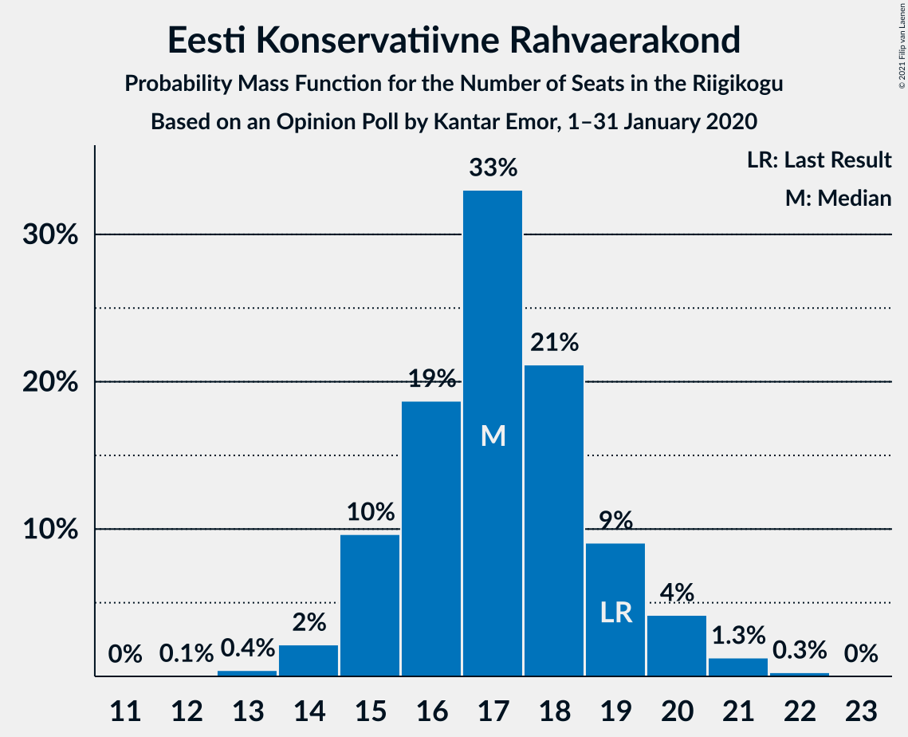
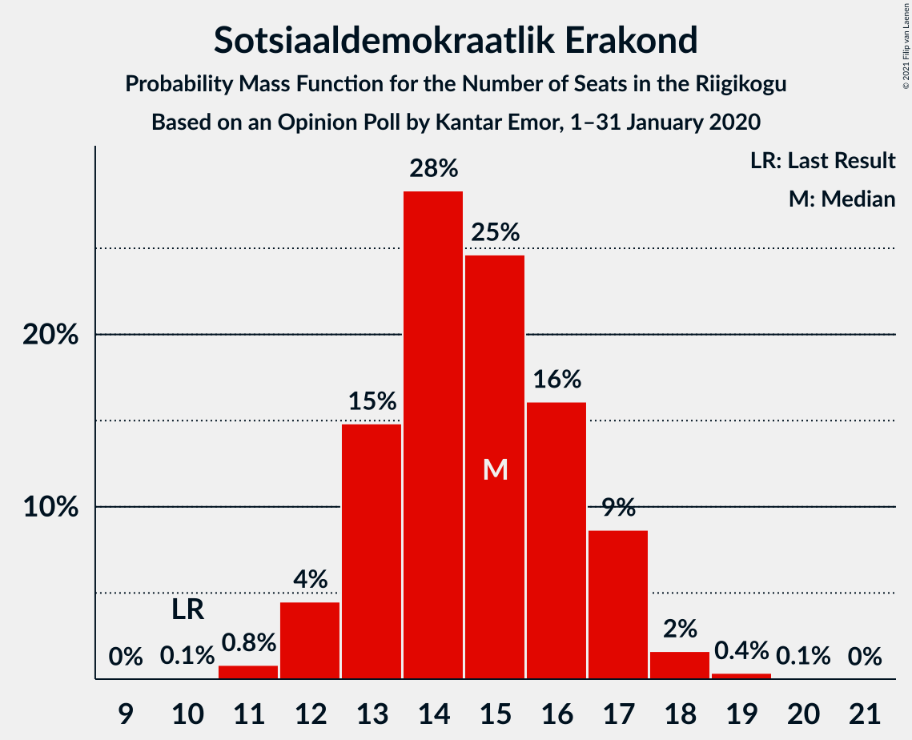
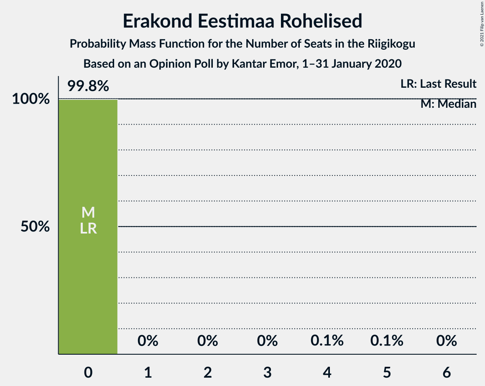
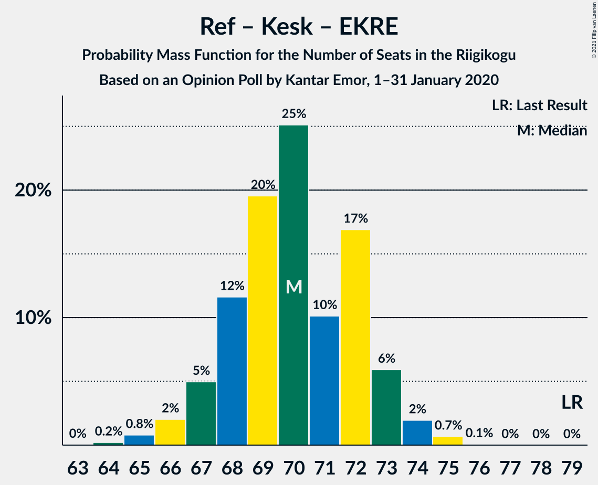
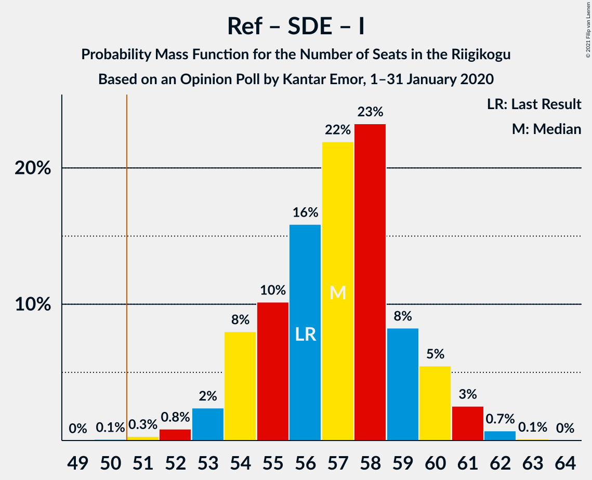
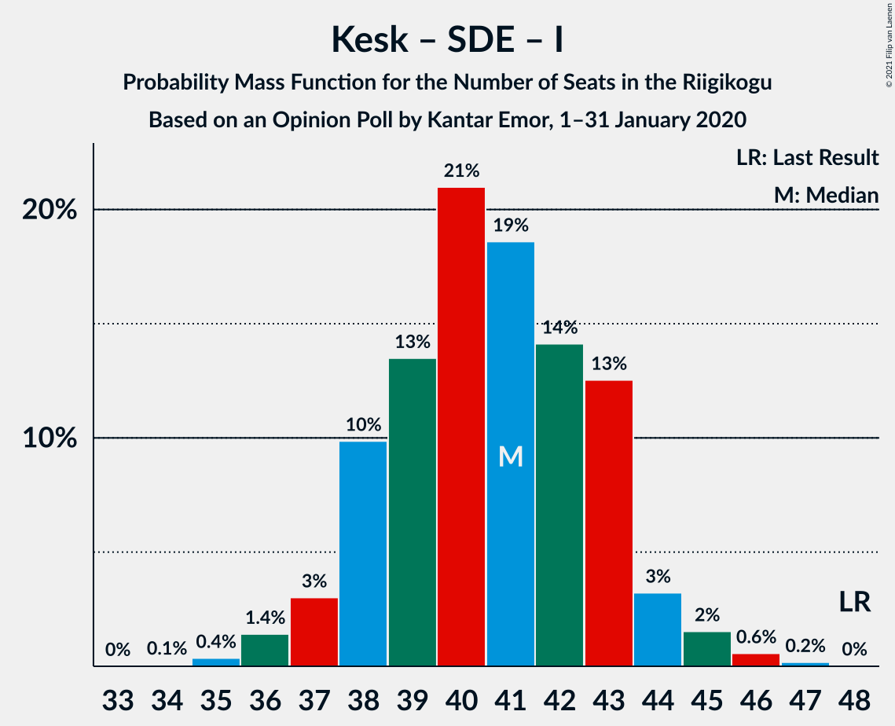

# Opinion Poll by Kantar Emor, 1–31 January 2020

<a href="#voting-intentions">Voting Intentions</a> | <a href="#seats">Seats</a> | <a href="#coalitions">Coalitions</a> | <a href="#technical-information">Technical Information</a>

## Voting Intentions

### Confidence Intervals

| Party | Last Result | Poll Result | 80% Confidence Interval | 90% Confidence Interval | 95% Confidence Interval | 99% Confidence Interval |
|:-----:|:-----------:|:-----------:|:-----------------------:|:-----------------------:|:-----------------------:|:-----------------------:|
| Eesti Reformierakond | 28.9% | 30.0% | 28.0–32.0% |27.5–32.6% |27.0–33.1% |26.1–34.1% |
| Eesti Keskerakond | 23.1% | 17.0% | 15.5–18.8% |15.1–19.3% |14.7–19.7% |14.0–20.5% |
| Eesti Konservatiivne Rahvaerakond | 17.8% | 16.0% | 14.5–17.7% |14.1–18.2% |13.7–18.6% |13.0–19.4% |
| Sotsiaaldemokraatlik Erakond | 9.8% | 14.0% | 12.5–15.6% |12.1–16.0% |11.8–16.4% |11.2–17.2% |
| Eesti 200 | 4.4% | 9.0% | 7.9–10.4% |7.6–10.8% |7.3–11.1% |6.8–11.8% |
| Erakond Isamaa | 11.4% | 8.0% | 6.9–9.3% |6.6–9.7% |6.4–10.0% |5.9–10.7% |
| Erakond Eestimaa Rohelised | 1.8% | 3.0% | 2.3–3.9% |2.2–4.1% |2.0–4.3% |1.8–4.8% |
| Eesti Vabaerakond | 1.2% | 1.0% | 0.7–1.6% |0.6–1.8% |0.5–2.0% |0.4–2.3% |

*Note:* The poll result column reflects the actual value used in the calculations. Published results may vary slightly, and in addition be rounded to fewer digits.

## Seats

### Confidence Intervals

| Party | Last Result | Median | 80% Confidence Interval | 90% Confidence Interval | 95% Confidence Interval | 99% Confidence Interval |
|:-----:|:-----------:|:------:|:-----------------------:|:-----------------------:|:-----------------------:|:-----------------------:|
| <a href="#eesti-reformierakond">Eesti Reformierakond</a> | 34 | 35 | 32–37 |31–38 |31–38 |30–40 |
| <a href="#eesti-keskerakond">Eesti Keskerakond</a> | 26 | 18 | 16–20 |16–21 |15–21 |14–22 |
| <a href="#eesti-konservatiivne-rahvaerakond">Eesti Konservatiivne Rahvaerakond</a> | 19 | 17 | 15–19 |15–20 |14–20 |14–21 |
| <a href="#sotsiaaldemokraatlik-erakond">Sotsiaaldemokraatlik Erakond</a> | 10 | 15 | 13–17 |12–17 |12–17 |11–18 |
| <a href="#eesti-200">Eesti 200</a> | 0 | 9 | 7–10 |7–11 |7–11 |6–12 |
| <a href="#erakond-isamaa">Erakond Isamaa</a> | 12 | 8 | 6–9 |6–9 |6–10 |5–11 |
| <a href="#erakond-eestimaa-rohelised">Erakond Eestimaa Rohelised</a> | 0 | 0 | 0 |0 |0 |0 |
| <a href="#eesti-vabaerakond">Eesti Vabaerakond</a> | 0 | 0 | 0 |0 |0 |0 |

### Eesti Reformierakond

*For a full overview of the results for this party, see the [Eesti Reformierakond](party-eestireformierakond.html) page.*

| Number of Seats | Probability | Accumulated | Special Marks |
|:---------------:|:-----------:|:-----------:|:-------------:|
| 28 | 0% | 100% |  |
| 29 | 0.3% | 99.9% |  |
| 30 | 1.3% | 99.7% |  |
| 31 | 3% | 98% |  |
| 32 | 7% | 95% |  |
| 33 | 17% | 88% |  |
| 34 | 19% | 71% | Last Result |
| 35 | 19% | 52% | Median |
| 36 | 16% | 33% |  |
| 37 | 11% | 17% |  |
| 38 | 4% | 6% |  |
| 39 | 1.5% | 2% |  |
| 40 | 0.4% | 0.6% |  |
| 41 | 0.1% | 0.2% |  |
| 42 | 0% | 0% |  |

### Eesti Keskerakond

*For a full overview of the results for this party, see the [Eesti Keskerakond](party-eestikeskerakond.html) page.*

| Number of Seats | Probability | Accumulated | Special Marks |
|:---------------:|:-----------:|:-----------:|:-------------:|
| 14 | 0.5% | 100% |  |
| 15 | 3% | 99.5% |  |
| 16 | 8% | 97% |  |
| 17 | 22% | 89% |  |
| 18 | 21% | 67% | Median |
| 19 | 27% | 46% |  |
| 20 | 12% | 19% |  |
| 21 | 6% | 8% |  |
| 22 | 2% | 2% |  |
| 23 | 0.3% | 0.3% |  |
| 24 | 0.1% | 0.1% |  |
| 25 | 0% | 0% |  |
| 26 | 0% | 0% | Last Result |

### Eesti Konservatiivne Rahvaerakond

*For a full overview of the results for this party, see the [Eesti Konservatiivne Rahvaerakond](party-eestikonservatiivnerahvaerakond.html) page.*

| Number of Seats | Probability | Accumulated | Special Marks |
|:---------------:|:-----------:|:-----------:|:-------------:|
| 12 | 0.1% | 100% |  |
| 13 | 0.4% | 99.9% |  |
| 14 | 2% | 99.5% |  |
| 15 | 10% | 97% |  |
| 16 | 19% | 88% |  |
| 17 | 33% | 69% | Median |
| 18 | 21% | 36% |  |
| 19 | 9% | 15% | Last Result |
| 20 | 4% | 6% |  |
| 21 | 1.3% | 2% |  |
| 22 | 0.3% | 0.3% |  |
| 23 | 0% | 0% |  |

### Sotsiaaldemokraatlik Erakond

*For a full overview of the results for this party, see the [Sotsiaaldemokraatlik Erakond](party-sotsiaaldemokraatlikerakond.html) page.*

| Number of Seats | Probability | Accumulated | Special Marks |
|:---------------:|:-----------:|:-----------:|:-------------:|
| 10 | 0.1% | 100% | Last Result |
| 11 | 0.8% | 99.9% |  |
| 12 | 4% | 99.1% |  |
| 13 | 15% | 95% |  |
| 14 | 28% | 80% |  |
| 15 | 25% | 51% | Median |
| 16 | 16% | 27% |  |
| 17 | 9% | 11% |  |
| 18 | 2% | 2% |  |
| 19 | 0.4% | 0.4% |  |
| 20 | 0.1% | 0.1% |  |
| 21 | 0% | 0% |  |

### Eesti 200

*For a full overview of the results for this party, see the [Eesti 200](party-eesti200.html) page.*

| Number of Seats | Probability | Accumulated | Special Marks |
|:---------------:|:-----------:|:-----------:|:-------------:|
| 0 | 0% | 100% | Last Result |
| 1 | 0% | 100% |  |
| 2 | 0% | 100% |  |
| 3 | 0% | 100% |  |
| 4 | 0% | 100% |  |
| 5 | 0% | 100% |  |
| 6 | 1.1% | 100% |  |
| 7 | 12% | 98.8% |  |
| 8 | 37% | 87% |  |
| 9 | 29% | 50% | Median |
| 10 | 14% | 21% |  |
| 11 | 6% | 7% |  |
| 12 | 1.2% | 1.4% |  |
| 13 | 0.1% | 0.2% |  |
| 14 | 0% | 0% |  |

### Erakond Isamaa

*For a full overview of the results for this party, see the [Erakond Isamaa](party-erakondisamaa.html) page.*

| Number of Seats | Probability | Accumulated | Special Marks |
|:---------------:|:-----------:|:-----------:|:-------------:|
| 5 | 1.0% | 100% |  |
| 6 | 12% | 99.0% |  |
| 7 | 32% | 87% |  |
| 8 | 34% | 55% | Median |
| 9 | 16% | 21% |  |
| 10 | 4% | 5% |  |
| 11 | 0.6% | 0.6% |  |
| 12 | 0% | 0.1% | Last Result |
| 13 | 0% | 0% |  |

### Erakond Eestimaa Rohelised

*For a full overview of the results for this party, see the [Erakond Eestimaa Rohelised](party-erakondeestimaarohelised.html) page.*

| Number of Seats | Probability | Accumulated | Special Marks |
|:---------------:|:-----------:|:-----------:|:-------------:|
| 0 | 99.8% | 100% | Last Result, Median |
| 1 | 0% | 0.2% |  |
| 2 | 0% | 0.2% |  |
| 3 | 0% | 0.2% |  |
| 4 | 0.1% | 0.2% |  |
| 5 | 0.1% | 0.1% |  |
| 6 | 0% | 0% |  |

### Eesti Vabaerakond

*For a full overview of the results for this party, see the [Eesti Vabaerakond](party-eestivabaerakond.html) page.*

| Number of Seats | Probability | Accumulated | Special Marks |
|:---------------:|:-----------:|:-----------:|:-------------:|
| 0 | 100% | 100% | Last Result, Median |

## Coalitions

### Confidence Intervals

| Coalition | Last Result | Median | Majority? | 80% Confidence Interval | 90% Confidence Interval | 95% Confidence Interval | 99% Confidence Interval |
|:---------:|:-----------:|:------:|:---------:|:-----------------------:|:-----------------------:|:-----------------------:|:-----------------------:|
| Eesti Reformierakond – Eesti Keskerakond – Eesti Konservatiivne Rahvaerakond | 79 | 70 | 100% | 68–72 | 67–73 | 66–74 | 65–75 |
| Eesti Reformierakond – Eesti Konservatiivne Rahvaerakond – Erakond Isamaa | 65 | 59 | 100% | 57–62 | 56–62 | 55–63 | 54–64 |
| Eesti Reformierakond – Sotsiaaldemokraatlik Erakond – Erakond Isamaa – Eesti Vabaerakond | 56 | 57 | 99.9% | 54–59 | 54–60 | 53–61 | 52–62 |
| Eesti Reformierakond – Sotsiaaldemokraatlik Erakond – Erakond Isamaa | 56 | 57 | 99.9% | 54–59 | 54–60 | 53–61 | 52–62 |
| Eesti Reformierakond – Eesti Keskerakond | 60 | 53 | 88% | 50–56 | 50–56 | 49–57 | 48–58 |
| Eesti Reformierakond – Eesti Konservatiivne Rahvaerakond | 53 | 52 | 73% | 49–54 | 49–55 | 48–55 | 46–57 |
| Eesti Reformierakond – Sotsiaaldemokraatlik Erakond | 44 | 49 | 27% | 47–52 | 46–52 | 45–53 | 44–54 |
| Eesti Keskerakond – Eesti Konservatiivne Rahvaerakond – Erakond Isamaa | 57 | 43 | 0% | 41–46 | 40–46 | 39–47 | 38–48 |
| Eesti Reformierakond – Erakond Isamaa | 46 | 42 | 0% | 40–45 | 39–46 | 38–46 | 37–47 |
| Eesti Keskerakond – Sotsiaaldemokraatlik Erakond – Erakond Isamaa | 48 | 41 | 0% | 38–43 | 38–44 | 37–44 | 36–46 |
| Eesti Keskerakond – Eesti Konservatiivne Rahvaerakond | 45 | 35 | 0% | 33–38 | 32–38 | 32–39 | 31–40 |
| Eesti Keskerakond – Sotsiaaldemokraatlik Erakond | 36 | 33 | 0% | 31–35 | 30–36 | 29–37 | 28–38 |
| Eesti Konservatiivne Rahvaerakond – Sotsiaaldemokraatlik Erakond | 29 | 32 | 0% | 29–34 | 29–35 | 28–35 | 27–37 |

### Eesti Reformierakond – Eesti Keskerakond – Eesti Konservatiivne Rahvaerakond

| Number of Seats | Probability | Accumulated | Special Marks |
|:---------------:|:-----------:|:-----------:|:-------------:|
| 64 | 0.2% | 100% |  |
| 65 | 0.8% | 99.7% |  |
| 66 | 2% | 98.9% |  |
| 67 | 5% | 97% |  |
| 68 | 12% | 92% |  |
| 69 | 20% | 80% |  |
| 70 | 25% | 61% | Median |
| 71 | 10% | 36% |  |
| 72 | 17% | 26% |  |
| 73 | 6% | 9% |  |
| 74 | 2% | 3% |  |
| 75 | 0.7% | 0.8% |  |
| 76 | 0.1% | 0.1% |  |
| 77 | 0% | 0% |  |
| 78 | 0% | 0% |  |
| 79 | 0% | 0% | Last Result |

### Eesti Reformierakond – Eesti Konservatiivne Rahvaerakond – Erakond Isamaa

| Number of Seats | Probability | Accumulated | Special Marks |
|:---------------:|:-----------:|:-----------:|:-------------:|
| 53 | 0.2% | 100% |  |
| 54 | 0.9% | 99.8% |  |
| 55 | 2% | 98.9% |  |
| 56 | 4% | 97% |  |
| 57 | 10% | 93% |  |
| 58 | 15% | 83% |  |
| 59 | 22% | 68% |  |
| 60 | 12% | 46% | Median |
| 61 | 17% | 33% |  |
| 62 | 12% | 16% |  |
| 63 | 3% | 5% |  |
| 64 | 2% | 2% |  |
| 65 | 0.2% | 0.3% | Last Result |
| 66 | 0.1% | 0.1% |  |
| 67 | 0% | 0% |  |

### Eesti Reformierakond – Sotsiaaldemokraatlik Erakond – Erakond Isamaa – Eesti Vabaerakond

| Number of Seats | Probability | Accumulated | Special Marks |
|:---------------:|:-----------:|:-----------:|:-------------:|
| 50 | 0.1% | 100% |  |
| 51 | 0.3% | 99.9% | Majority |
| 52 | 0.8% | 99.6% |  |
| 53 | 2% | 98.7% |  |
| 54 | 8% | 96% |  |
| 55 | 10% | 88% |  |
| 56 | 16% | 78% | Last Result |
| 57 | 22% | 62% |  |
| 58 | 23% | 40% | Median |
| 59 | 8% | 17% |  |
| 60 | 5% | 9% |  |
| 61 | 3% | 3% |  |
| 62 | 0.7% | 0.9% |  |
| 63 | 0.1% | 0.2% |  |
| 64 | 0% | 0% |  |

### Eesti Reformierakond – Sotsiaaldemokraatlik Erakond – Erakond Isamaa

| Number of Seats | Probability | Accumulated | Special Marks |
|:---------------:|:-----------:|:-----------:|:-------------:|
| 50 | 0.1% | 100% |  |
| 51 | 0.3% | 99.9% | Majority |
| 52 | 0.8% | 99.6% |  |
| 53 | 2% | 98.7% |  |
| 54 | 8% | 96% |  |
| 55 | 10% | 88% |  |
| 56 | 16% | 78% | Last Result |
| 57 | 22% | 62% |  |
| 58 | 23% | 40% | Median |
| 59 | 8% | 17% |  |
| 60 | 5% | 9% |  |
| 61 | 3% | 3% |  |
| 62 | 0.7% | 0.9% |  |
| 63 | 0.1% | 0.2% |  |
| 64 | 0% | 0% |  |

### Eesti Reformierakond – Eesti Keskerakond

| Number of Seats | Probability | Accumulated | Special Marks |
|:---------------:|:-----------:|:-----------:|:-------------:|
| 46 | 0.1% | 100% |  |
| 47 | 0.4% | 99.9% |  |
| 48 | 1.2% | 99.6% |  |
| 49 | 3% | 98% |  |
| 50 | 8% | 96% |  |
| 51 | 11% | 88% | Majority |
| 52 | 17% | 76% |  |
| 53 | 24% | 60% | Median |
| 54 | 14% | 36% |  |
| 55 | 11% | 22% |  |
| 56 | 7% | 10% |  |
| 57 | 2% | 3% |  |
| 58 | 0.8% | 1.1% |  |
| 59 | 0.3% | 0.3% |  |
| 60 | 0% | 0% | Last Result |

### Eesti Reformierakond – Eesti Konservatiivne Rahvaerakond

| Number of Seats | Probability | Accumulated | Special Marks |
|:---------------:|:-----------:|:-----------:|:-------------:|
| 45 | 0.1% | 100% |  |
| 46 | 0.6% | 99.9% |  |
| 47 | 2% | 99.3% |  |
| 48 | 3% | 98% |  |
| 49 | 7% | 95% |  |
| 50 | 16% | 88% |  |
| 51 | 21% | 73% | Majority |
| 52 | 14% | 52% | Median |
| 53 | 16% | 37% | Last Result |
| 54 | 13% | 21% |  |
| 55 | 6% | 8% |  |
| 56 | 2% | 2% |  |
| 57 | 0.6% | 0.8% |  |
| 58 | 0.2% | 0.2% |  |
| 59 | 0% | 0% |  |

### Eesti Reformierakond – Sotsiaaldemokraatlik Erakond

| Number of Seats | Probability | Accumulated | Special Marks |
|:---------------:|:-----------:|:-----------:|:-------------:|
| 42 | 0.1% | 100% |  |
| 43 | 0.2% | 99.9% |  |
| 44 | 0.6% | 99.7% | Last Result |
| 45 | 2% | 99.1% |  |
| 46 | 6% | 97% |  |
| 47 | 9% | 91% |  |
| 48 | 16% | 82% |  |
| 49 | 20% | 66% |  |
| 50 | 20% | 46% | Median |
| 51 | 15% | 27% | Majority |
| 52 | 8% | 12% |  |
| 53 | 3% | 4% |  |
| 54 | 1.1% | 1.5% |  |
| 55 | 0.3% | 0.4% |  |
| 56 | 0.1% | 0.1% |  |
| 57 | 0% | 0% |  |

### Eesti Keskerakond – Eesti Konservatiivne Rahvaerakond – Erakond Isamaa

| Number of Seats | Probability | Accumulated | Special Marks |
|:---------------:|:-----------:|:-----------:|:-------------:|
| 37 | 0.2% | 100% |  |
| 38 | 0.6% | 99.8% |  |
| 39 | 2% | 99.2% |  |
| 40 | 6% | 97% |  |
| 41 | 9% | 91% |  |
| 42 | 21% | 82% |  |
| 43 | 23% | 60% | Median |
| 44 | 13% | 37% |  |
| 45 | 14% | 25% |  |
| 46 | 7% | 11% |  |
| 47 | 2% | 4% |  |
| 48 | 1.1% | 1.4% |  |
| 49 | 0.2% | 0.3% |  |
| 50 | 0.1% | 0.1% |  |
| 51 | 0% | 0% | Majority |
| 52 | 0% | 0% |  |
| 53 | 0% | 0% |  |
| 54 | 0% | 0% |  |
| 55 | 0% | 0% |  |
| 56 | 0% | 0% |  |
| 57 | 0% | 0% | Last Result |

### Eesti Reformierakond – Erakond Isamaa

| Number of Seats | Probability | Accumulated | Special Marks |
|:---------------:|:-----------:|:-----------:|:-------------:|
| 36 | 0.1% | 100% |  |
| 37 | 0.6% | 99.8% |  |
| 38 | 2% | 99.2% |  |
| 39 | 5% | 97% |  |
| 40 | 11% | 92% |  |
| 41 | 19% | 81% |  |
| 42 | 13% | 62% |  |
| 43 | 19% | 49% | Median |
| 44 | 19% | 30% |  |
| 45 | 6% | 11% |  |
| 46 | 4% | 5% | Last Result |
| 47 | 1.2% | 2% |  |
| 48 | 0.4% | 0.5% |  |
| 49 | 0.1% | 0.1% |  |
| 50 | 0% | 0% |  |

### Eesti Keskerakond – Sotsiaaldemokraatlik Erakond – Erakond Isamaa

| Number of Seats | Probability | Accumulated | Special Marks |
|:---------------:|:-----------:|:-----------:|:-------------:|
| 34 | 0.1% | 100% |  |
| 35 | 0.4% | 99.9% |  |
| 36 | 1.4% | 99.6% |  |
| 37 | 3% | 98% |  |
| 38 | 10% | 95% |  |
| 39 | 13% | 85% |  |
| 40 | 21% | 72% |  |
| 41 | 19% | 51% | Median |
| 42 | 14% | 32% |  |
| 43 | 13% | 18% |  |
| 44 | 3% | 6% |  |
| 45 | 2% | 2% |  |
| 46 | 0.6% | 0.8% |  |
| 47 | 0.2% | 0.2% |  |
| 48 | 0% | 0% | Last Result |

### Eesti Keskerakond – Eesti Konservatiivne Rahvaerakond

| Number of Seats | Probability | Accumulated | Special Marks |
|:---------------:|:-----------:|:-----------:|:-------------:|
| 29 | 0.1% | 100% |  |
| 30 | 0.3% | 99.9% |  |
| 31 | 1.2% | 99.6% |  |
| 32 | 4% | 98% |  |
| 33 | 9% | 95% |  |
| 34 | 17% | 86% |  |
| 35 | 23% | 69% | Median |
| 36 | 20% | 46% |  |
| 37 | 13% | 26% |  |
| 38 | 9% | 14% |  |
| 39 | 4% | 5% |  |
| 40 | 0.9% | 1.3% |  |
| 41 | 0.4% | 0.4% |  |
| 42 | 0.1% | 0.1% |  |
| 43 | 0% | 0% |  |
| 44 | 0% | 0% |  |
| 45 | 0% | 0% | Last Result |

### Eesti Keskerakond – Sotsiaaldemokraatlik Erakond

| Number of Seats | Probability | Accumulated | Special Marks |
|:---------------:|:-----------:|:-----------:|:-------------:|
| 27 | 0.1% | 100% |  |
| 28 | 0.8% | 99.9% |  |
| 29 | 2% | 99.1% |  |
| 30 | 5% | 97% |  |
| 31 | 17% | 92% |  |
| 32 | 14% | 75% |  |
| 33 | 28% | 61% | Median |
| 34 | 8% | 32% |  |
| 35 | 16% | 24% |  |
| 36 | 6% | 9% | Last Result |
| 37 | 2% | 3% |  |
| 38 | 0.7% | 0.8% |  |
| 39 | 0.1% | 0.2% |  |
| 40 | 0% | 0% |  |

### Eesti Konservatiivne Rahvaerakond – Sotsiaaldemokraatlik Erakond

| Number of Seats | Probability | Accumulated | Special Marks |
|:---------------:|:-----------:|:-----------:|:-------------:|
| 26 | 0.2% | 100% |  |
| 27 | 1.0% | 99.8% |  |
| 28 | 2% | 98.8% |  |
| 29 | 7% | 97% | Last Result |
| 30 | 13% | 89% |  |
| 31 | 23% | 76% |  |
| 32 | 19% | 53% | Median |
| 33 | 14% | 34% |  |
| 34 | 14% | 20% |  |
| 35 | 4% | 6% |  |
| 36 | 2% | 2% |  |
| 37 | 0.5% | 0.6% |  |
| 38 | 0.1% | 0.1% |  |
| 39 | 0% | 0% |  |

## Technical Information

### Opinion Poll

+ **Polling firm:** Kantar Emor
+ **Commissioner(s):** —
+ **Fieldwork period:** 1–31 January 2020

### Calculations

+ **Sample size:** 874
+ **Simulations done:** 1,048,576
+ **Error estimate:** 0.64%

